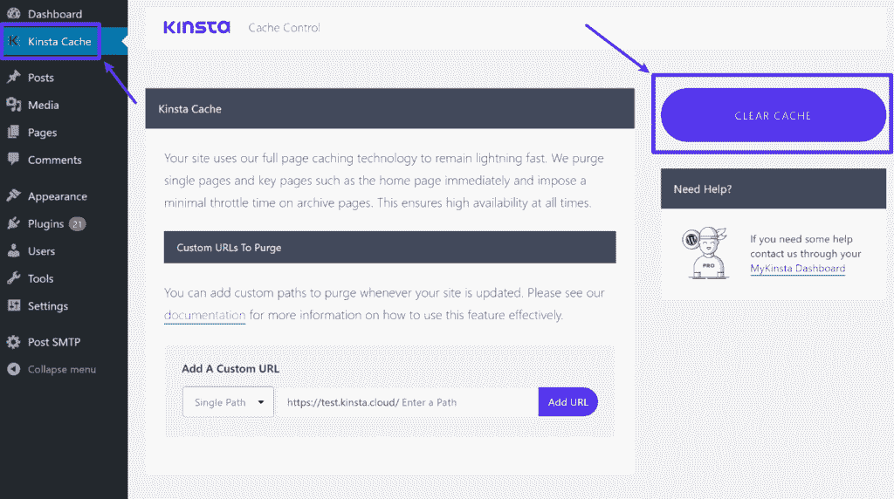
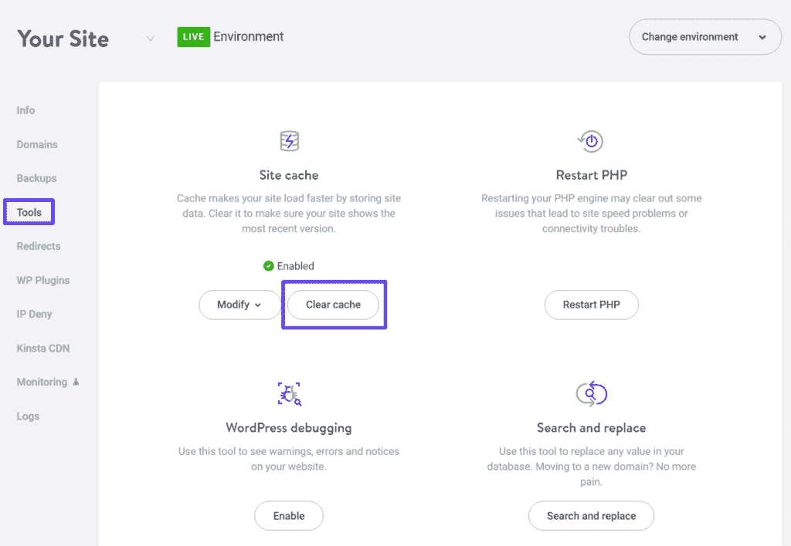
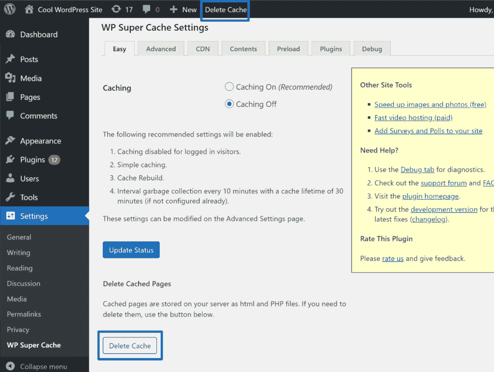
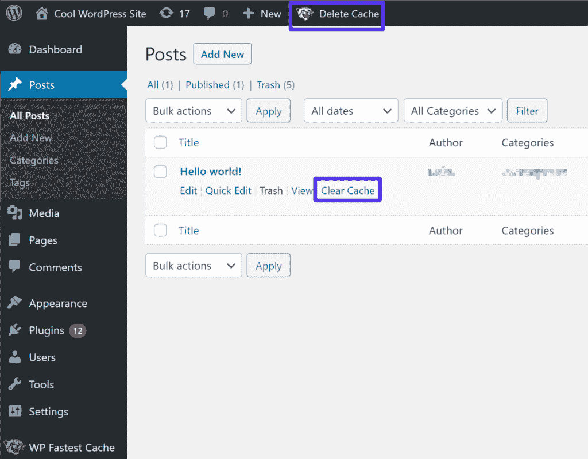
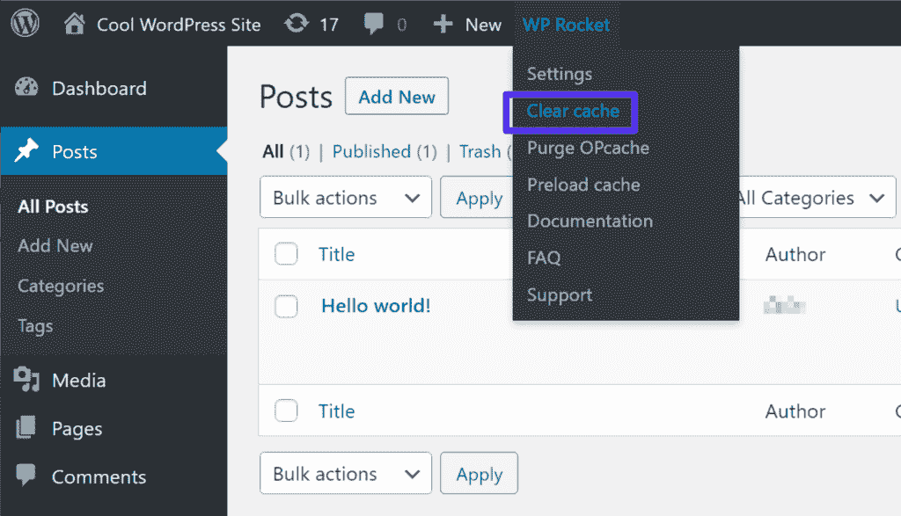
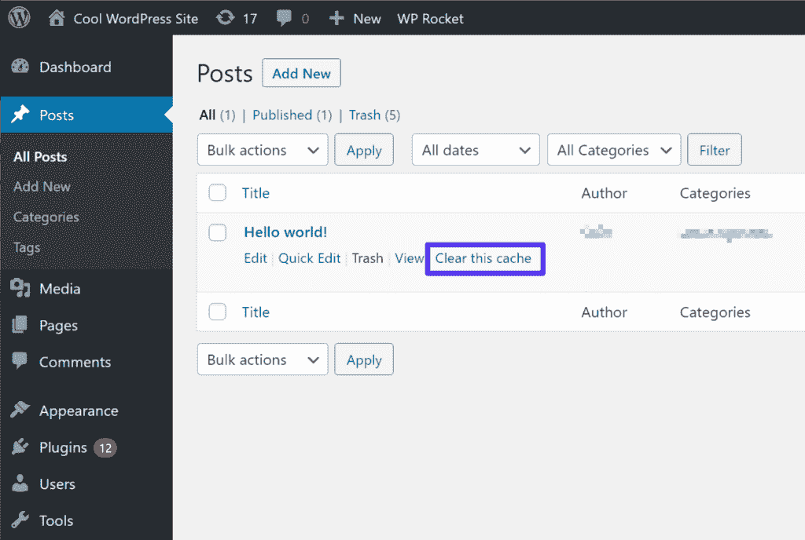
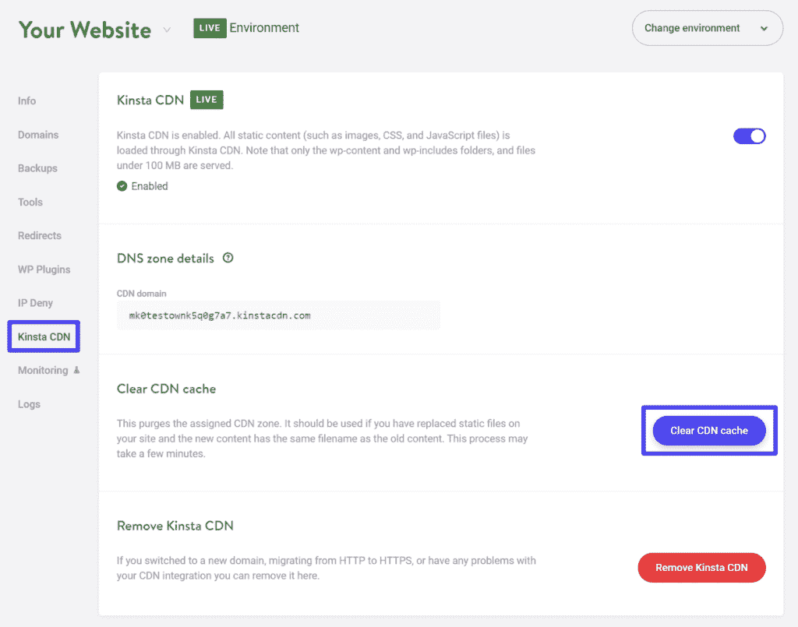

# 没有显示 WordPress 的变化？以下是解决问题的方法

> 原文：<https://kinsta.com/blog/wordpress-changes-not-showing/>

对 WordPress 的修改没有显示在你的网站上有问题吗？这是 WordPress 用户普遍存在的问题。几乎在所有情况下，问题都源于**缓存问题**，要么是你自己的网络浏览器，要么是你的 WordPress 网站的缓存，要么是你的内容交付网络的缓存(CDN)。

在这篇文章中，我们将探究这些原因是什么，以及为什么缓存会导致 WordPress 变化不显示的问题。然后，我们将向您展示几个故障排除步骤，以解决问题，并使您和您网站的访问者可以看到您网站的更新。

准备好了吗？我们开始吧！

### 更喜欢看[视频版](https://www.youtube.com/watch?v=C4317cQfZwA)？

## WordPress 更新更改需要多长时间？

一般来说，你的 [WordPress 站点](https://kinsta.com/blog/why-use-wordpress/)应该在你点击保存按钮后立即更新。也就是说，您应该能够点击保存按钮，打开有问题的页面，并立即看到这些更改。更重要的是，这同样适用于你网站的访问者。

这就是*应该*发生的事情。

> Kinsta 把我宠坏了，所以我现在要求每个供应商都提供这样的服务。我们还试图通过我们的 SaaS 工具支持达到这一水平。
> 
> <footer class="wp-block-kinsta-client-quote__footer">
> 
> 
> 
> <cite class="wp-block-kinsta-client-quote__cite">Suganthan Mohanadasan from @Suganthanmn</cite></footer>

[View plans](https://kinsta.com/plans/)

但是既然你正在读这篇文章，你可能已经发现事情并不总是按照计划进行。

那么你的网站没有更新的原因是什么呢？

## 为什么我的 WordPress 站点没有更新？

正如我们在介绍中提到的，你的 WordPress 站点[不更新的最常见原因](https://kinsta.com/blog/wordpress-errors/)是缓存问题。

有不同类型的缓存可能会阻止你看到你的 WordPress 站点上的变化:

1.  [浏览器缓存](https://kinsta.com/blog/leverage-browser-caching/)–将访问者本地计算机上的某些静态文件存储在网络浏览器缓存中。
2.  [页面缓存](https://kinsta.com/blog/wordpress-cache/)–存储网站的静态 HTML 版本，而不是使用 PHP 为每次访问“动态”生成。
3.  [CDN 缓存](https://kinsta.com/blog/wordpress-cdn/)–通过在遍布全球的服务器网络上缓存您网站的静态内容，加快全球加载速度。

您现在不必理解缓存背后的机制。最基本的问题是，你的网站的早期版本仍然保存在“缓存”中

因此，即使你已经更新了 WordPress 服务器上的版本，访问者(和你)可能仍然会看到你的站点的旧版本和缓存版本，隐藏了你最近推送的更改。

我们将花大部分时间向您展示如何清除这些不同的缓存，并用站点的最新版本“重新加载”它们。一旦你清除了缓存，你和你的访问者应该马上看到变化。

除了缓存问题，你可能看不到 WordPress 站点变化的另一个原因可能与你站点上的[权限](https://kinsta.com/blog/wordpress-user-roles/)有关。如果你在创建动态网站，不同的用户看到不同的内容，这种情况尤其常见，比如在一个[会员网站](https://kinsta.com/blog/wordpress-membership-plugins/)中。

在这种情况下，即使可能成功保存了更改，您也可能没有权限查看更新的内容，这可能会导致您仍然看到较旧的内容。这不太可能在简单的网站上造成问题，例如[博客](https://kinsta.com/blog/best-blogging-platform/)或[作品集](https://kinsta.com/blog/wordpress-portfolio-plugins/)，但这可能是动态网站的一个问题。

解决了这个问题，让我们来看看如何解决这个问题。

## 如何修复 WordPress 站点不更新的问题

我们将这些故障诊断步骤分为四个主要部分:

 对于前三个，我们建议从上到下进行。也就是说，从清除浏览器缓存开始，然后依次进行其他操作。

### 如何修复浏览器缓存问题

浏览器缓存的工作原理是将某些网站资源存储在计算机的浏览器缓存中。它避免了重复地直接从你的 WordPress 站点的[服务器](https://kinsta.com/blog/nginx-vs-apache/)下载这些资产。要解决此问题，您可以强制浏览器从服务器下载所有文件的最新版本，而不是从缓存中加载。

这里有一些方法来实现这一点。

#### 硬刷新您的 Web 浏览器

解决单个页面上浏览器缓存问题的最简单的方法是[硬刷新你的网络浏览器](https://kinsta.com/knowledgebase/how-to-clear-browser-cache/#how-to-force-refresh-a-single-page)。

当您强制硬刷新时，您的浏览器将跳过缓存并下载所有 web 服务器资产。

首先，在您的站点上打开一个选项卡，其中包含您希望看到更改的页面。然后，点击以下键盘组合:

*   Windows 上的 ****CTRL + F5****
*   Mac 上的 **Cmd + R**

#### 清除您的浏览器缓存

如果硬刷新不起作用，您可能需要完全清除浏览器的缓存。这将清除所有缓存的文件，确保您在整个站点下载所有文件的新版本。

确切的说明因您使用的网络浏览器而异，因此请务必查看我们关于如何在所有主流网络浏览器中清除浏览器缓存的完整指南[。](https://kinsta.com/knowledgebase/how-to-clear-browser-cache/)

#### 采用“缓存破坏”技术

上面的策略应该可以解决你自己电脑的问题，但是你的访问者可能仍然不会马上看到变化(因为他们没有清除他们的浏览器缓存)。

一个稍微高级一点的策略是使用[“破坏缓存”](https://www.keycdn.com/support/what-is-cache-busting)策略来绕过这个问题，并确保你的访问者总是看到最新版本。

例如，假设你网站的标志是**logo.png**。如果你更新了你的徽标，并且[上传了一个同名的新文件](https://kinsta.com/blog/wordpress-media-library/)(【logo.png】)，这种改变可能不会马上显现出来，因为人们的浏览器仍然会从缓存中加载原来的**logo.png**文件。

要解决缓存破坏问题，您只需更改文件名。

例如，不上传**logo.png**和覆盖旧文件，你可以上传**logo-v2.png**。因为这是一个新的文件名，你将能够绕过由于浏览器缓存而导致的站点更改不显示的问题。

这种策略对于脚本也很有用，比如 [CSS 样式表](https://kinsta.com/blog/wordpress-css/#wordpress-and-css)。因此，如果你的 CSS 变化没有在 WordPress 中显示出来，这是一个可以解决这个问题的策略。

其他破坏缓存的策略包括更改文件路径或添加查询字符串，以及更改文件名。一些例子:

*   **原文**:yoursite.com/style.css
*   文件名–yoursite.com/stylev2.css
*   **文件路径**–yoursite.com/v2/style.css
*   **查询字符串**–yoursite.com/style.css?ver=2

### 如何修复 WordPress 缓存的问题

虽然有不同类型的 WordPress 缓存，但最可能的原因是[页面缓存](https://kinsta.com/blog/wordpress-cache/#page-cache)。

通常，你的服务器使用 [PHP](https://kinsta.com/knowledgebase/what-is-php/) 为每次访问从头开始“构建”你的站点的 HTML 成品。然后，您的服务器将完成的 HTML 发送到访问者的浏览器，以呈现您的网页。

## 注册订阅时事通讯

### 想知道我们是怎么让流量增长超过 1000%的吗？

加入 20，000 多名获得我们每周时事通讯和内部消息的人的行列吧！

[Subscribe Now](#newsletter)

[为了加快速度](https://kinsta.com/ebooks/wordpress/speed-up-wordpress/)，页面缓存允许你将完成的 HTML 存储在缓存中，这样就不需要你的服务器在每次访问时处理 PHP 和查询[数据库](https://kinsta.com/knowledgebase/wordpress-database/)。这意味着如果你在你的站点上更新了一些东西，这些改变不会马上生效，因为你的服务器仍然在提供你做出改变之前缓存的 HTML。

大多数网络主机和[缓存插件](https://kinsta.com/blog/wordpress-caching-plugins/)通过在你发布或更新内容时自动“清除”缓存来解决这个问题。但是，您的缓存解决方案可能没有配置为这样做，或者它可能由于某种原因不能正常工作。

许多缓存解决方案也不让 [WordPress 管理员用户](https://kinsta.com/blog/wordpress-user-roles/#administrator)看到缓存的内容。这就是为什么你可能会遇到注销时没有显示 WordPress 变化的问题。换句话说，当你登录到你的[管理员账户](https://kinsta.com/knowledgebase/wordpress-admin/)时，你看不到任何缓存的内容，这意味着你可以立即看到变化。但是当你注销时，你看到的是旧的缓存版本(你网站的访问者也是如此)。

此处的修复方法是手动清除站点的缓存。

这将清空所有存储的 HTML 版本，并让您的站点从头开始创建一个新版本。然后，它会将新版本存储在缓存中，以获得缓存的所有性能优势。

如何清除你的 WordPress 缓存取决于你使用的缓存解决方案。我们将向您展示两种解决方案:

1.  如果你在 Kinsta 托管，清除缓存
2.  清除一些流行的缓存插件中的缓存

#### 作为 Kinsta 客户如何清除缓存

Kinsta [为你实现页面缓存](https://kinsta.com/help/full-page-caching/)，这样你就不需要使用 WordPress 缓存插件。有两种方法可以[清除你站点在 Kinsta](https://kinsta.com/blog/wordpress-clear-cache/) 的缓存。

首先，你可以从你的 [WordPress 站点的仪表板](https://kinsta.com/knowledgebase/wordpress-admin/)通过左边栏的 **Kinsta 缓存**标签和**清除缓存**按钮来完成:

How to clear Kinsta page cache in WordPress Dashboard

其次，你也可以通过你的 [MyKinsta dashboard](https://kinsta.com/MyKinsta/) 清空你网站的缓存。在 MyKinsta 中打开您的站点。然后，进入**工具**选项卡，点击**站点缓存**下的**清除缓存**按钮:

How to clear Kinsta page cache in MyKinsta

#### 如何清除插件中的缓存

如果你不在 Kinsta 托管，你可能会使用一个 WordPress 缓存插件来处理页面缓存。

所有的缓存插件都包括清除站点整个缓存的选项(有时只清除有问题的个别内容的缓存)。

我们不能向您展示它在所有缓存插件中是如何工作的，但是我们会向您展示一些最流行的插件。大多数缓存插件的行为是相似的，所以你可以在其他插件中使用相同的思想。

##### WP 超级缓存

你可以点击 WordPress 工具栏或插件设置中的**删除缓存**选项:

需要一流的，快速，安全的新网站托管？Kinsta 提供超快的服务器和来自 WordPress 专家的 24/7 世界级支持。[查看我们的计划](https://kinsta.com/plans/?in-article-cta)

How to clear the entire cache in WP Super Cache

##### WP 最快的缓存

要删除整个缓存，你可以点击 WordPress 工具栏上的**删除缓存**选项。

您也可以仅清除您遇到问题的内容的缓存:

1.  打开帖子/页面/自定义帖子类型列表。
2.  将鼠标悬停在没有显示更改的内容上。
3.  点击**清除缓存**链接。

How to clear cache in WP Fastest Cache

##### WP 火箭

要清除整个网站的缓存，将鼠标悬停在 WordPress 工具栏的 **WP 火箭**选项上，选择**清除缓存**:

How to clear the entire cache in WP Rocket

要清除单个内容，请在内容列表中将鼠标悬停在该内容上，然后单击**清除该缓存**:

How to clear a single post’s cache with WP Rocket

### 如何修复 CDN 缓存的问题

如果你正在使用一个[内容传递网络(CDN)](https://kinsta.com/blog/wordpress-cdn/) 来加速你的 WordPress 站点的全球加载时间，这可能是你的 WordPress 站点的变化没有显示出来的另一个原因。

CDN 的工作原理是将你网站的静态内容缓存在遍布全球的服务器网络上。然后，它从离每个访问者最近的位置提供这些文件。

然而，如果你的 CDN 已经缓存了一个旧版本的图片文件或 CSS 样式表，这可能会导致 WordPress 的变化不显示的问题。你的内容本身不太可能出现这种情况，但你可能在 CDN 上托管的静态文件可能会出现这种常见问题，比如[图像](https://kinsta.com/blog/image-file-types/)和脚本。

推荐阅读: [WordPress 精选图片不能正常显示](https://kinsta.com/blog/wordpress-featured-image-not-showing/)

与其他缓存问题一样，您可以通过清除 CDN 上的缓存来解决这个问题。实现这一点的具体步骤将取决于您的 CDN。下面，我们将向您展示如何在 Kinsta 做到这一点。

如果您使用不同的 CDN，您可以参考您的 CDN 文档以获得帮助。

#### 如何清除 Kinsta CDN 缓存

[Kinsta 包含一个内置的 CDN](https://kinsta.com/help/kinsta-cdn/) ，无需额外费用。您可以从 MyKinsta 仪表盘中清除 CDN 的缓存。

在 MyKinsta 中，打开你有问题的 WordPress 站点的仪表板区域。然后，进入 **Kinsta CDN** 选项卡，点击**清除 CDN 缓存**按钮:

How to clear Kinsta CDN cache

### 如何解决用户角色/能力的问题

最后，你的网站可能工作得很好，但是你可能仍然看不到你所做的改变，因为一些 [WordPress 角色/功能](https://kinsta.com/blog/wordpress-user-roles/)的问题。您的网站已正确更新，但您的用户帐户无权查看这些更改。

例如，也许你有一个[会员网站](https://kinsta.com/blog/wordpress-membership-theme/)，注册会员看到一组内容，而匿名访问者看到不同的内容。如果您更改注册成员的内容，然后以匿名模式打开您的站点，您将看不到这些更改，因为您的匿名访客帐户无权查看您更改的内容。反之亦然。

如果你有一个拥有多个不同会员级别的会员网站，事情会变得更加复杂。

要解决这个问题，请确保您登录了一个 WordPress 帐户，并且有查看相关内容的适当权限(或者在某些情况下，您没有登录帐户)。

为了方便调试这些问题，并在不同的 WordPress 账户之间快速切换，你可以使用免费的[用户切换插件](https://kinsta.com/blog/wordpress-user-roles/#user-switching)。

[Are caching issues preventing you from making changes on your WordPress site? 👀 Learn how to fix this common issue with help from this guide!Click to Tweet](https://twitter.com/intent/tweet?url=https%3A%2F%2Fkinsta.com%2Fblog%2Fwordpress-changes-not-showing%2F&via=kinsta&text=Are+caching+issues+preventing+you+from+making+changes+on+your+WordPress+site%3F+%F0%9F%91%80+Learn+how+to+fix+this+common+issue+with+help+from+this+guide%21&hashtags=WPTips%2CCaching)

## 摘要

大多数时候，与 WordPress 变化相关的问题并没有显示在你的网站上，而是与缓存问题有关(浏览器缓存、页面缓存或 CDN 缓存)。

解决方法是清除导致这些问题的缓存，确保你和你的访问者都看到你网站的最新版本。如果您不确定是哪个缓存导致了这个问题，我们建议您按照本文中显示的顺序清除它们:首先是浏览器缓存，然后是页面缓存，最后是 CDN 缓存。

在某些情况下，您还可能会遇到无法查看更改的问题，因为您没有查看该内容的权限。这不太可能发生在简单的博客或作品集网站上，但它可能发生在会员制网站或其他受限制内容的网站上。请确保您使用具有适当权限的帐户来排除此问题。

你仍然对 WordPress 变化不显示有任何问题吗？在评论里问我们！

* * *

让你所有的[应用程序](https://kinsta.com/application-hosting/)、[数据库](https://kinsta.com/database-hosting/)和 [WordPress 网站](https://kinsta.com/wordpress-hosting/)在线并在一个屋檐下。我们功能丰富的高性能云平台包括:

*   在 MyKinsta 仪表盘中轻松设置和管理
*   24/7 专家支持
*   最好的谷歌云平台硬件和网络，由 Kubernetes 提供最大的可扩展性
*   面向速度和安全性的企业级 Cloudflare 集成
*   全球受众覆盖全球多达 35 个数据中心和 275 多个 pop

在第一个月使用托管的[应用程序或托管](https://kinsta.com/application-hosting/)的[数据库，您可以享受 20 美元的优惠，亲自测试一下。探索我们的](https://kinsta.com/database-hosting/)[计划](https://kinsta.com/plans/)或[与销售人员交谈](https://kinsta.com/contact-us/)以找到最适合您的方式。