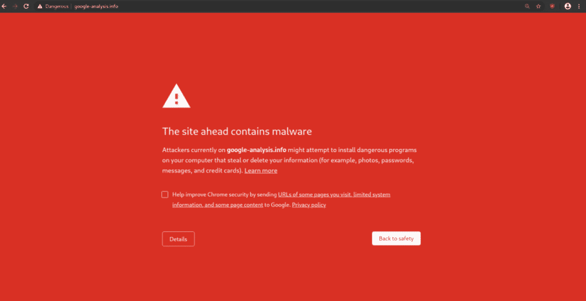
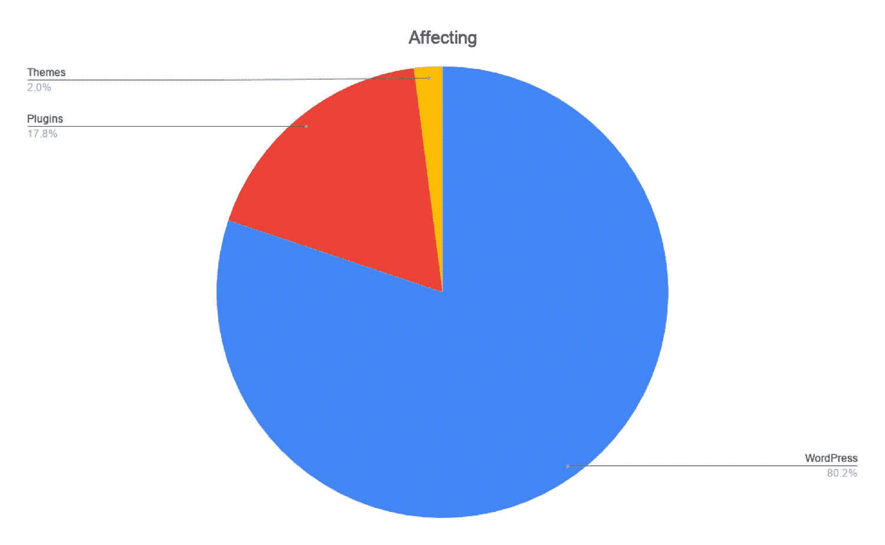
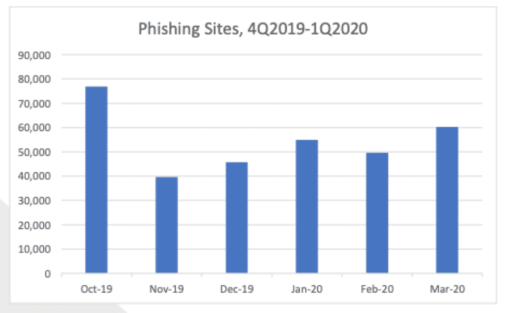
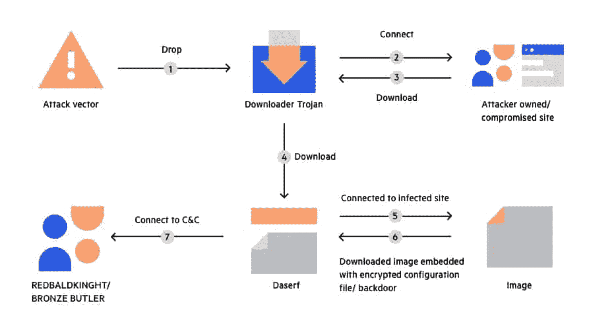
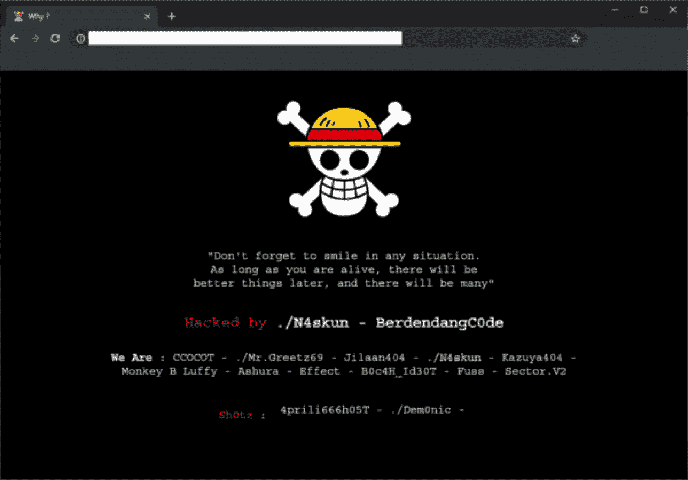
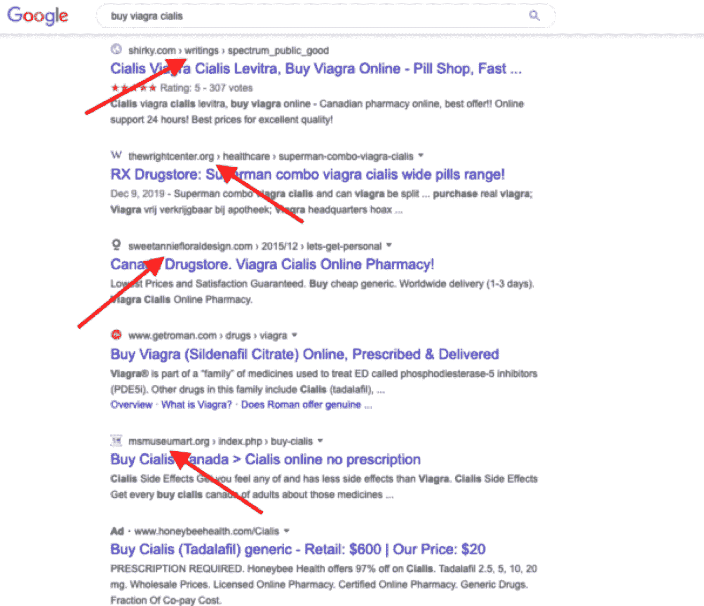
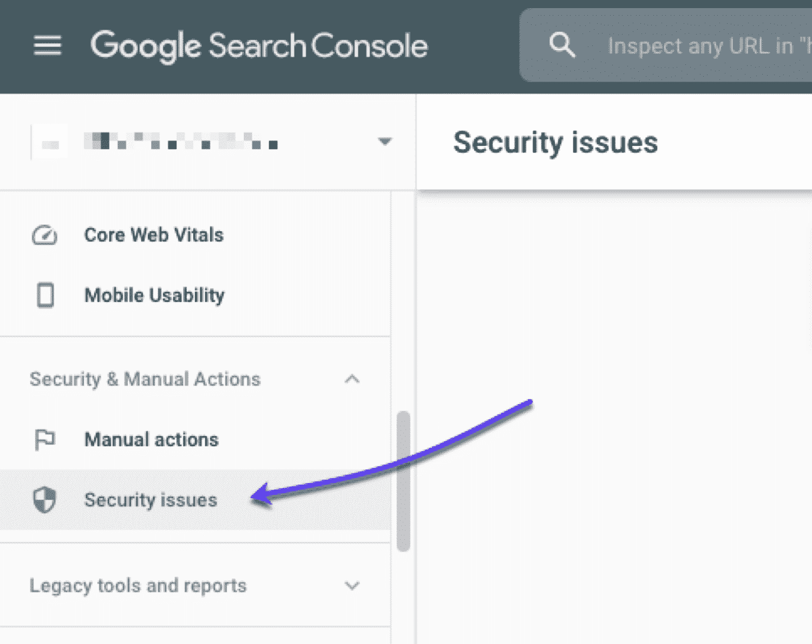
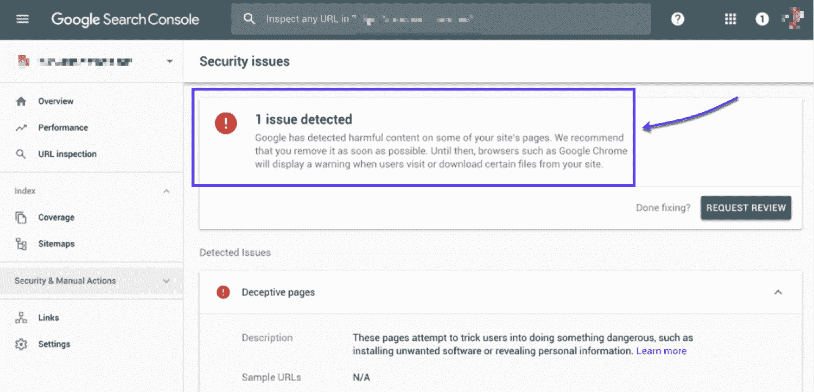
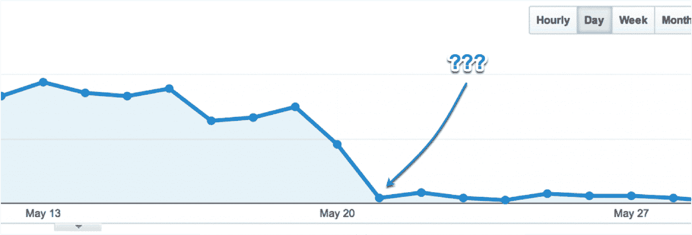
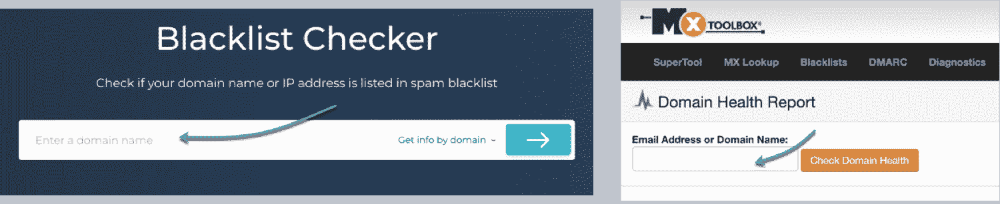

# 什么是谷歌网址黑名单？(分三步从黑名单中删除您的网站)

> 原文：<https://kinsta.com/blog/url-blocklist/>

如今，URL 阻止列表已经成为一种常见现象，精明的企业主尽一切可能避免这种情况，这一点很重要。

如果你的网站出现在 URL 黑名单上，那么你会看到对你的[网站流量](https://kinsta.com/blog/how-to-drive-traffic-to-your-website/)和整体网站性能有很大的负面影响。

幸运的是，我们把这篇文章放在一起，给你一些你需要的信息，以防止你的网站进入 URL 阻止列表，并在不幸的情况下删除它。

### 信息

你可能偶然发现了过去使用的“黑名单”这个术语。在 Kinsta，我们完全支持并接受使用更具描述性且不含任何种族主义/性别含义的新技术术语的全行业方法。因此，我们正在相应地更新我们所有的内容。

## 什么是 URL 阻止列表？

URL 阻止列表是由[搜索引擎](https://kinsta.com/blog/alternative-search-engines/)收集的他们认为可疑或危险的网址。

被列入黑名单的网站不会出现在搜索引擎的结果页面上，这是为了保护他们的用户免受任何潜在的恶意软件或不安全插件的攻击。

以下是被阻止的站点在您的浏览器中的样子:

An example of what you’ll see in your browser when visiting a blocklisted site

尽管大多数被列入黑名单的网站确实是危险的，但完全无辜的网站发现自己被列入黑名单是很常见的。

有时他们甚至不知道这已经发生了，只有当他们的[收入](https://kinsta.com/blog/how-to-monetize-a-blog/)开始受到打击或者流量完全下降时，他们才会意识到。

事实上，谷歌每天屏蔽大约 10，000 个网站，所以很容易看出一些好网站是如何被遗漏的。

为了防止这种情况发生在你身上，你需要确保你的[网站安全](https://kinsta.com/blog/wordpress-security/)足够严密，以满足搜索引擎的严格规则和规定。

## URL 阻止列表是如何发生的？

[一个 URL](https://kinsta.com/knowledgebase/what-is-a-url/) 可能会因为各种不同的原因被列入黑名单。

这可能是完全无辜的事情，也可能是你的网站设置偷工减料的结果，在谷歌的雷达上标记你的网站。

下面你会发现搜索引擎在决定屏蔽哪些网站时主要关注的事情。

即使你的网站有这些问题中的一个，也可能意味着它永远不会出现在大多数搜索者面前，或者至少排名会下降。

### 1.不安全插件

[插件](https://kinsta.com/best-wordpress-plugins/)是网站所有者、网站管理员和[网站开发者经常使用的工具](https://kinsta.com/blog/web-developer-salary/)用来给网站添加额外的功能。它们非常有用，可以迅速将一个普通的网页变成更吸引用户的东西。

然而，由于插件可以由任何人开发和发布，所以很难知道哪些插件可以安全地安装在你的网站上。

根据已知 WordPress 问题的数据，几乎 18%是 WordPress 插件漏洞:

Breakdown of WordPress vulnerabilities. (Source: wpwhitesecurity.com)

[不安全插件](https://kinsta.com/blog/nulled-wordpress-plugins-themes/)可以被[用来注入恶意软件](https://kinsta.com/knowledgebase/the-site-ahead-contains-malware/)，一般被[黑客](https://kinsta.com/blog/wordpress-hacked/)用来轻松进入你的网站。

通常是[过时的插件](https://kinsta.com/knowledgebase/manually-update-wordpress-plugin/)最容易受到攻击。这些插件通常只有很少的安全层，更容易被黑客攻击。

一方面，插件提供了令人难以置信的功能和好处，但另一方面，当 [WordPress 维护](https://kinsta.com/blog/wordpress-maintenance/)被忽视时，它们很容易被接管并用于恶意目的。
T3】

### 2.网络钓鱼计划

不幸的是，近年来网络钓鱼变得非常流行。仅在 2020 年 3 月就报告了超过 60，000 个钓鱼网站。

An overview of phishing statistics. (Source: apwg.org)

[网络钓鱼](https://kinsta.com/blog/ecommerce-fraud-prevention/#1-email-account-phishing)是一种数字攻击，用于通过诱骗用户点击误导性链接来获取个人信息，如银行信息。

网络钓鱼攻击会对受害者造成毁灭性的影响。

银行账户被盗是网络钓鱼的常见结果，在更严重的情况下，还可能发生身份盗窃。正是由于这些原因，搜索引擎正在打击任何可能包含网络钓鱼链接的网站。

最糟糕的是，许多网站所有者没有意识到他们的网站有钓鱼链接——黑客通常会在网站上发布恶意链接之前控制网站。这可能会导致搜索引擎的严厉惩罚。

### 3.特洛伊木马

在计算术语中，特洛伊木马是一种伪装成无害的病毒或恶意软件。网络犯罪分子通常将恶意文件隐藏在一个软件中，然后在下载该软件时感染计算机。

A simple breakdown of how a trojan horse works. (Source: imperva.com)

特洛伊木马类似于网络钓鱼方案，因为它们是专门设计来欺骗某人在不知情的情况下安装有害软件的。

正如你所料，这个过程是搜索引擎所不喜欢的，也是为什么一个被怀疑有可下载恶意软件的 URL 会被立即阻止的最大原因之一。

如果你想让你的网站有任何机会在谷歌排名中接近顶端，让你的网站远离特洛伊木马是非常重要的。
T3】

### 4.磨损

网站污损攻击是指黑客接管网站的控制权，并用自己的内容替换部分内容。

通常，这是通过添加网络钓鱼链接、特洛伊木马和其他潜在的有害恶意软件来实现的。

An example of a website defacement attack. (Source: securityboulevard.com)

一些黑客将能够创建看起来与你自己的内容几乎一样的内容，这意味着你的用户和客户可能甚至不会注意到任何变化。

URL 阻止列表旨在将这些网站从搜索引擎中移除，以免任何人成为被污损页面的受害者。

### 5.SEO 垃圾邮件

搜索引擎最不希望看到的是 SEO 垃圾邮件。有点讽刺的是，过度的 [SEO](https://kinsta.com/blog/what-does-seo-stand-for/) 会对一个网站的排名产生负面影响。

An example of SEO spam in Google. (Source: Sucuri)

消极的搜索引擎优化会以各种形式阻碍你的搜索引擎优化进程。像 [DDos 攻击](https://kinsta.com/blog/ddos-attack/)、 [WordPress 垃圾评论](https://kinsta.com/blog/wordpress-spam-comments/)和[谷歌分析](https://kinsta.com/blog/google-analytics-spam/)中的垃圾推荐都是需要警惕的事情。

SEO 垃圾邮件的另一种流行形式是关键字填充。搜索引擎使用来自用户查询的[关键词来匹配他们的搜索和最相关的网页。](https://kinsta.com/blog/keyword-research/)

一些网站所有者认为，如果他们把大量的目标关键词打包到他们的所有页面中，那么他们会更频繁地出现在搜索引擎中。

然而，搜索引擎提供商非常清楚这种做法，可以很容易地过滤掉任何塞满了太多关键字的文章

## 如何检查您的网站是否被添加到 url 黑名单

正如我们提到的，你的网站被列入黑名单的主要问题是，当它发生时，你很难注意到。

有各种各样的工具可以告诉你你的网站是否被列入黑名单。它们还会将您引向导致问题的特定 URL，然后您可以根据需要处理和删除这些 URL。

以下是检查您的网站是否被列入黑名单的三种方法:

### 1.谷歌搜索控制台

查看你是否被列入黑名单的一个最简单的方法是查看[谷歌搜索控制台](https://kinsta.com/blog/google-search-console/)(以前被称为网站管理员工具):

How to view any security issues in Google Search Console

如果你还没有验证你的 GSC 帐户，去阅读这个[谷歌搜索控制台验证指南](https://kinsta.com/blog/google-site-verification/)然后回来。

## 注册订阅时事通讯

### 想知道我们是怎么让流量增长超过 1000%的吗？

加入 20，000 多名获得我们每周时事通讯和内部消息的人的行列吧！

[Subscribe Now](#newsletter)

如果您的网站不幸被阻止，您可以在这里看到它:

An example of what you may see inside Google Search Console if your site (or a URL) is blocklisted

### 2.检查您的流量统计

同样值得检查的是你的 [Google Analytics](https://kinsta.com/blog/how-to-use-google-analytics/) 账户中的流量是否有大幅下降。访问者的突然减少可能是被阻止的信号。

An example of something no one wants to see in Google Analytics: a massive drop in website traffic

一个网站被列入黑名单的早期迹象是流量突然快速下降。

**一个被列入黑名单的网站会损失大约 95%的流量**，所以你应该能注意到这一点。如果你在你的[网站分析](https://kinsta.com/blog/google-analytics-alternatives/)中看到类似的东西，那么肯定有一个问题值得进一步调查。

### 3.现场检查工具

如果你想测试你的[域名](https://kinsta.com/blog/best-domain-registrar/)或 [IP](https://kinsta.com/tools/what-is-my-ip/what-is-my-ip/) 是否被列入反垃圾邮件数据库，你也可以使用专门的网站检查工具。

只需通过 [Sitechecker](https://sitechecker.pro/blacklist-checker/) 和/或 [MxToolBox](https://mxtoolbox.com/domain/) 运行你的网站并检查结果。

Run your site through these site checker tools

在这两者之间，这些现场检查工具将:

*   获得您的域的健康状态的概述
*   确定与您的[域名](https://kinsta.com/blog/how-much-does-a-domain-name-cost/)、邮件服务器、网络服务器和 [DNS 问题](https://kinsta.com/knowledgebase/dns-server-not-responding/)相关的问题
*   查找您的域或 IP 是否被标记为垃圾邮件或黑名单
*   获取垃圾邮件列表数据库的报告

为了更加小心，你还应该查看一下关于如何阻止 IP 地址的指南，以及关于专用 IP 地址和共享 IP 地址的指南。

## 被列入 URL 阻止列表会对您的业务产生什么影响？

显而易见，如此大的流量下降会对您的业务、增长和利润产生负面影响。

不管是 Chrome、Internet Explorer 还是其他浏览器，用户使用的是哪种浏览器都没关系。一个被阻止的网址不会出现在任何一个页面上。

被列入黑名单绝对是任何网站所有者都应该不惜一切代价避免的事情。

在下一节中，我们将介绍一些你可以实施的策略，以确保你的 URL 永远不会进入任何 URL 阻止列表。

## 如何保护你的网站不被列入黑名单

远离黑名单的唯一真正方法是确保你的网站上没有发生任何会引起谷歌负面关注的事情。不幸的是，自己遵守规则并不总是足够的，因为我们知道黑客可以接管网站并声称它们是自己的。

这意味着如果你想遵循有效的搜索引擎优化最佳实践并保持网站的高流量，你必须考虑一些不同的事情。

担心你的 WordPress 网站上的恶意软件？所有 Kinsta 计划都附带免费的恶意软件扫描和清理。查看我们的计划。

**简而言之，你应该:**

*   确保你的网站是安全的，
*   以安全的方式构建和开发您的网站，
*   尽可能避免危险的“黑帽”行为。

谢天谢地，如果网站所有者想确保他们的网站不会遇到安全问题，他们可以采取一些措施。

### 更新，更新，更新

第一件事是始终[保持你的系统更新](https://kinsta.com/blog/wordpress-maintenance/#keeping-your-wordpress-site-updated)，密切关注[插件](https://kinsta.com/knowledgebase/manually-update-wordpress-plugin/)和[主题更新](https://kinsta.com/blog/how-to-update-wordpress-theme/)。软件更新修复了安全漏洞，所以你总是想在黑客找到如何利用这些漏洞之前下载它们。

在对你的站点进行更新之前，最好在本地和/或在 T2 的测试环境中进行测试。

### 使用强密码

另一个更明显的安全协议是始终使用强密码。是的，我们知道你以前听说过这个，但是仍然有惊人数量的人使用'*pa 55 w0 rd*'作为他们所有帐户的安全密钥。

一个强有力的密码真的可以阻止黑客的踪迹，并保护您的服务器免受渗透。

请务必查看这些与密码相关的资源:

*   [2021 年使用的 9 个最佳密码管理器](https://kinsta.com/blog/password-managers/)
*   [如何快速更改(或重置)WordPress 密码](https://kinsta.com/blog/change-wordpress-password/)

### 避免让用户上传文件

另一个建议是尽量避免让网站用户上传自己的文件。

虽然您可能希望通过向网站上传个人资料图片和类似文件来改善用户体验，但这可能会成为人们利用的一大潜在漏洞。

如果你运营的网站需要用户上传文件，我们建议[与开发者](https://kinsta.com/partners/)合作，在文件上传过程中加入恶意软件扫描步骤。

### 避免冒险的做法

如果你想有最好的机会让你的网址远离任何黑名单，那么你应该尽量避免任何危险的做法。

在 SEO 世界中，这些通常被称为“黑帽”过程。

尽管这些技术在短期内是有效的，但是如果实施不当，很容易产生负面影响。

然而，你应该绝对避免的是像关键字填充这样的事情。

关键词填充、隐藏的关键词和通常与你的品牌/产品/服务不一致的文章会很快在谷歌上标记你的网站。然后，谷歌将开始从他们的搜索中过滤你的网址，你会看到你的排名急剧下降。

如果你坚持正确的[关键词研究](https://kinsta.com/blog/keyword-research/)和[学习如何给你的网站带来流量](https://kinsta.com/blog/how-to-drive-traffic-to-your-website/)，你会很安全。

现在你知道如何防止你的网站或网址被列入黑名单，让我们来看看你可以做些什么来删除黑名单中的网址。

## 如何通过 3 个步骤从谷歌黑名单中删除你的网址

如果您发现您的网站已经被谷歌列入黑名单，我们需要将其移除。以下是从黑名单中删除您的网站的分步指南。

### 第一步:找到感染源

打开[谷歌搜索控制台](https://kinsta.com/blog/google-search-console/#how-to)看看为什么你的网站被列入黑名单，这可能是由于:

*   病毒
*   [SQL 注入](https://kinsta.com/blog/sql-injection/)
*   垃圾链接
*   恶意软件

无论是什么原因导致了阻止列表，一旦您确定了原因，您就可以采取后续步骤来解决问题。

### 第二步:清除感染

一旦你知道是什么导致了感染，你就可以着手清除它。以下是开始清理站点感染的一些步骤:

*   [检查对你网站的任何不熟悉的修改](https://kinsta.com/blog/file-integrity-monitoring/#two-different-types-of-file-integrity-monitoring-methods)并手动删除它们。
*   禁用任何过时的插件。
*   检查是否添加了新的[管理员用户](https://kinsta.com/blog/wordpress-user-roles/#administrator)。如果是，手动清除，[重置所有密码](https://kinsta.com/blog/change-wordpress-password/)和用户名。
*   手动清理受感染的[数据库](https://kinsta.com/knowledgebase/wordpress-database/)中的表。
*   为您的所有用户设置[双因素认证](https://kinsta.com/blog/wordpress-two-factor-authentication/)。
*   检查任何未经验证的用户，并删除那些不应该在那里。

您可能还会发现这些资源很有帮助:

*   【WordPress 恶意软件清除如何工作
*   如何修复 WordPress 上的“前方网站包含恶意软件”错误
*   WordPress 被黑:当你的网站陷入困境时该怎么办
*   [16 个最好的 WordPress 安全插件来锁定坏人](https://kinsta.com/blog/wordpress-security-plugins/)

### 第三步:提交给谷歌审查

接下来，你应该提交你的网站进行恶意软件审查，这样谷歌可以重新评估你的网站。按照以下步骤提交您的站点以供审查:

1.  打开谷歌搜索控制台，转到安全问题选项卡。
2.  点击**“我已经修复了这些问题”**。
3.  现在，选择**“请求审查”**。
4.  请列出您为消除网站上的问题所采取的步骤。在这里尽可能详细。
5.  然后单击手动操作部分。

如果您有多个问题，**重复这些步骤，直到所有问题都得到解决**。请记住，谷歌可能需要几天时间来审查你的网站。

这也可能是一个很好的时间来刷新你的记忆，如何将你的网站提交给搜索引擎。

[Keep your site off a URL blocklist 🏴 (or remove it if it's already there) with this helpful guide!Click to Tweet](https://twitter.com/intent/tweet?url=https%3A%2F%2Fbit.ly%2F37dBEwi&via=kinsta&text=Keep+your+site+off+a+URL+blocklist+%F0%9F%8F%B4+%28or+remove+it+if+it%27s+already+there%29+with+this+helpful+guide%21&hashtags=seo%2CSitePerformance)

## 摘要

显而易见，黑名单会对你的网站流量和业务产生不利影响。

幸运的是，你可以做一些事情来减少这种情况的发生，比如遵循[网页设计最佳实践](https://kinsta.com/blog/web-design-best-practices/)、 [SEO 最佳实践](https://kinsta.com/blog/wordpress-seo/)，以及投资[安全托管](https://kinsta.com/secure-wordpress-hosting/)。

尽管你总是可以采取一些措施来对抗黑客和恶意软件，但有时你只是运气不好。这就是为什么尽早发现阻止列表的迹象并尝试采取措施总是很重要的原因。

* * *

让你所有的[应用程序](https://kinsta.com/application-hosting/)、[数据库](https://kinsta.com/database-hosting/)和 [WordPress 网站](https://kinsta.com/wordpress-hosting/)在线并在一个屋檐下。我们功能丰富的高性能云平台包括:

*   在 MyKinsta 仪表盘中轻松设置和管理
*   24/7 专家支持
*   最好的谷歌云平台硬件和网络，由 Kubernetes 提供最大的可扩展性
*   面向速度和安全性的企业级 Cloudflare 集成
*   全球受众覆盖全球多达 35 个数据中心和 275 多个 pop

在第一个月使用托管的[应用程序或托管](https://kinsta.com/application-hosting/)的[数据库，您可以享受 20 美元的优惠，亲自测试一下。探索我们的](https://kinsta.com/database-hosting/)[计划](https://kinsta.com/plans/)或[与销售人员交谈](https://kinsta.com/contact-us/)以找到最适合您的方式。