# 回望 2020——金士塔年回顾

> 原文：<https://kinsta.com/blog/2020-year-in-review/>

谁知道疫情会成为我们生活的一部分？2020 年已经成为过去，老实说，我很高兴我们把它抛在了身后。

然而，回顾和评估我们的进步是我们规划未来的重要一步。

这就是我们今天要做的。

在开始之前，我们要感谢所有的顾客，感谢他们信任我们托管你们的[企业](https://kinsta.com/enterprise-wordpress-hosting/)、[博客](https://kinsta.com/blog/how-to-monetize-a-blog/)和[电子商务网站](https://kinsta.com/blog/ecommerce-hosting/)。

此外，非常感谢我们所有的读者、关注者以及任何通过不同渠道与我们合作的人。我知道这是老生常谈，但这是事实:没有你们的支持和反馈，我们今天就不会在这里。

现在，是时候分享一些关于 2020 年的非常酷的统计数据了。

准备好了吗？让我们跳进来吧！

[Closing out the year with a 97% conversation rating for the Kinsta Support Team- across 105,182 tickets- is reason to celebrate! 😄🎉 See Kinsta's full year in review right here ⬇️Click to Tweet](https://twitter.com/intent/tweet?url=https%3A%2F%2Fkinsta.com%2Fblog%2F2020-year-in-review%2F&via=kinsta&text=Closing+out+the+year+with+a+97%25+conversation+rating+for+the+Kinsta+Support+Team-+across+105%2C182+tickets-+is+reason+to+celebrate%21+%F0%9F%98%84%F0%9F%8E%89+See+Kinsta%27s+full+year+in+review+right+here+%E2%AC%87%EF%B8%8F&hashtags=CustomerSupport%2CYearinReview)

## 客户和收入增长

2020 年，Kinsta 的收入大幅增长了 75%。从更长远的角度来看，到去年年底，我们的经常性收入大约是 2015 年底的 39 倍。

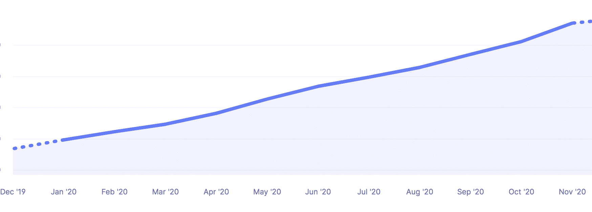

Kinsta’s revenue growth in 2020

收入增长只告诉了我们(伟大的)故事的一半。事实上，与前一年相比，我们的客户群增长了 84%以上！就新客户注册而言，10 月是我们 2020 年迄今为止最繁忙的一个月。

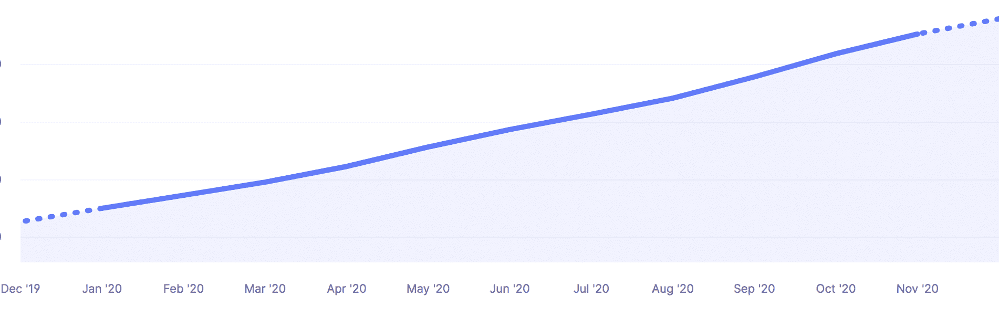

Customer base growth in 2020

以下是一些关于我们每月交付的数据量的有趣事实:

*   220 多亿个 HTTP 请求通过 Kinsta 的服务器提供服务。
*   超过 970 TB 的出口数据传输通过 Kinsta 的服务器传输。
*   超过 100 亿个 HTTP 请求通过 [Kinsta CDN](https://kinsta.com/help/kinsta-cdn/) 提供服务。
*   360 TB 以上的数据传输通过 Kinsta CDN 传输。

如果你[将这一数据与 2019 年](https://kinsta.com/blog/2019-year-in-review/) 的数据进行比较，你会发现我们在过去一年里看到了交通的大幅增长。

### 金斯塔网站的 PHP 版本

想知道 2020 年 Kinsta 客户中哪个 PHP 版本最常见？这是数据:

*   Kinsta 72.1%的 WordPress 站点运行的是 [PHP 7.3](https://kinsta.com/blog/php-7-3/) 。
*   Kinsta 27.8%的 WordPress 站点运行的是 [PHP 7.4](https://kinsta.com/blog/php-7-4/) 。
*   Kinsta 0.1%的 WordPress 站点运行的是 [PHP 8.0](https://kinsta.com/blog/php-8/) 。

注意: [PHP 8.0 在现场使用](https://kinsta.com/feature-updates/php-8/)是在 2020 年 12 月底启用的，这解释了为什么它还没有被广泛采用。

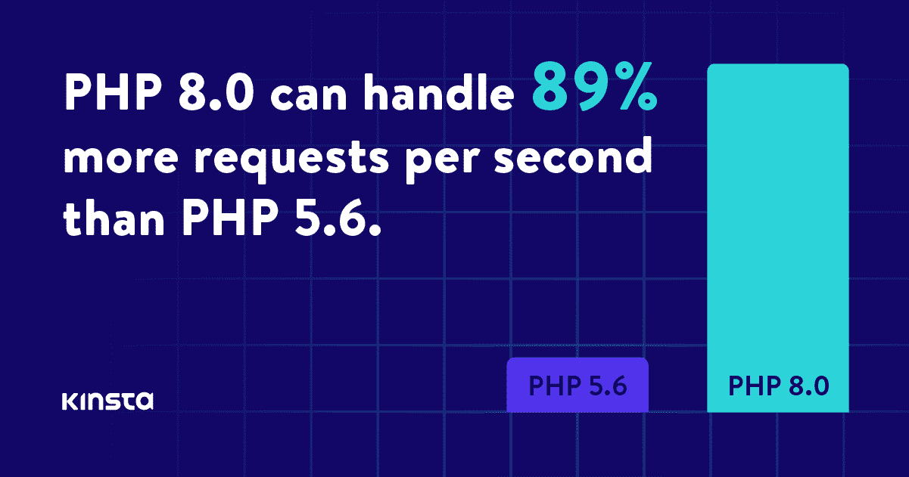

PHP benchmarks

如果你一直在关注我们，或者你是一个真正的客户，你知道性能是我们的困扰。

这就是为什么我们鼓励每个人升级到可用的最新 PHP 版本。我们通过 MyKinsta 让这个过程变得超级简单[。](https://kinsta.com/knowledgebase/how-to-update-php-in-wordpress/)

## Kinsta 不断提供无与伦比的支持

[Kinsta 强大的客户支持](https://kinsta.com/kinsta-support/)是公司赖以建立的支柱之一。当我们的客户需要帮助时，我们会确保有一名有能力、有知识的工程师来协助。

2020 年，Kinsta 雇佣了 15 名新的支持工程师([我们一直在寻找更多](https://kinsta.com/careers/)有才华的工程师加入我们的团队)。扩大支持团队使我们能够提高周末支持的覆盖范围，并创建一个专门的团队来修复恶意软件和调查平台滥用。

这是客户对 2020 年 Kinsta 支持的评价:

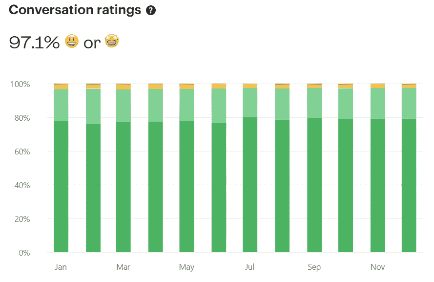

Support ratings

我们全年的平均积极对话率约为 97%。但这还不是全部！以下是关于 Kinsta 在 2020 年支持工作的一些额外统计数据:

*   Kinsta 的支持团队已经解决了 105，182 张票。其中 21547 张票是去年最后 90 天的。
*   解决和关闭问题的平均时间为 43:55。
*   UTC 时间周二下午 4 点是支持人员最忙的时候。
*   首次响应的中位数是 1:40 分钟。

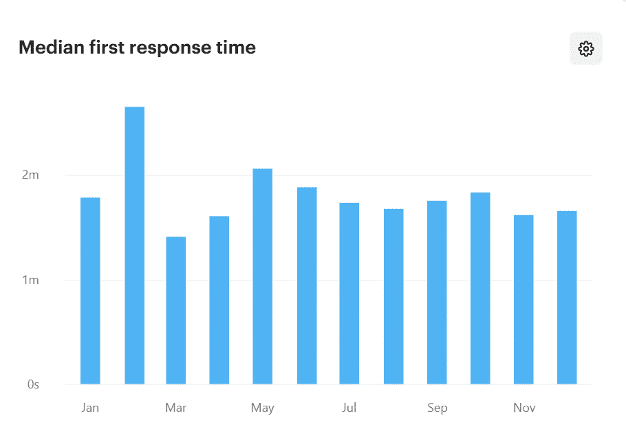

Median first response time

全天候提供英语支持。此外，由于我们的双语支持工程师，我们还能够以其他几种语言为客户提供帮助。多语言支持时间表如下:

*   西班牙语支持在工作日的下午 2 点至上午 12 点(UTC)提供。🇪🇸
*   法语支持在工作日的上午 6 点至下午 5 点(UTC)提供。🇫🇷
*   德国支持服务时间为世界协调时周一至周五上午 6 点至下午 2 点。🇩🇪
*   意大利语支持服务时间为 UTC 周一至周五上午 7 点至下午 3 点。🇮🇹
*   葡萄牙语支持服务时间为工作日上午 9 点至下午 5 点(UTC 🇵🇹时间)-新增内容！

为我们出色的客户服务是我们的荣幸，他们中的许多人经常让我们知道他们有多欣赏我们的工作，我想分享一些他们最近对我们的评价:

[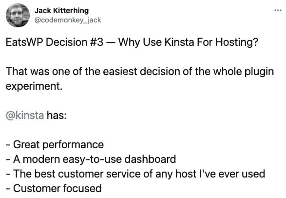](https://twitter.com/codemonkey_jack/status/1346170415115284483)

Jack Kitterhing on Kinsta hosting

Suganthan Mohanadasan on Kinsta’s support

非常感谢并向我们非凡的支持和系统管理员团队大声欢呼，感谢他们不可思议的工作！

## 团队扩张没有停止(增长了 57%)

2020 年有多少人在金斯塔工作？在我告诉你之前，我想花一点时间来感谢我们的人力资源团队，他们的工作让金斯塔的所有团队都能与有才华的专业人士一起工作。

因此，2020 年开始时，我们是一个由 96 人组成的团队，到 2020 年结束时，我们有了 151 名团队成员(又名金斯坦人)，这意味着一年内增长了 57%。我们招聘新员工最忙的月份是 3 月份，当时我们的团队增加了 13 人，其次是 8 月份的 11 人，以及 12 月份的 10 人。

在营销方面，我们的团队已经发展到 15 人，他们帮助我们在所有渠道中制作和传达我们的内容、活动和品牌信息。

在房子的销售方面，我们现在与北美、EMEA 和 APAC 地区的卖家全天候联系。这意味着我们有 6 种语言版本(英语、法语、西班牙语、德语、荷兰语、日语)。最后但同样重要的是，在 2020 年，我们引入了在我们的网站上与销售人员实时聊天的可能性。

2020 年是充满挑战的一年，因为 [Covid 打乱了我们多年来的工作流程](https://kinsta.com/knowledgebase/coronavirus-covid-19/)、习惯和常规。尽管我们对[远程工作](https://kinsta.com/webinars/working-from-home/)并不陌生，但疫情加速了我们已经开始的进程:成为一家完全分布式的远程优先公司。

如果你正在寻找你的下一个职业道路，我们一直在寻找新的人才加入这个团队。在我们的[职业页面](https://kinsta.com/careers/)上查看我们的职位空缺。

[In 2020, the Kinsta team grew by 57%- and there's more to come in 2021! 👨‍💻 Check out the full post to see what else Kinsta has been up to this year, then head over to the Careers page to find all open positions. ✅Click to Tweet](https://twitter.com/intent/tweet?url=https%3A%2F%2Fkinsta.com%2Fblog%2F2020-year-in-review%2F&via=kinsta&text=In+2020%2C+the+Kinsta+team+grew+by+57%25-+and+there%27s+more+to+come+in+2021%21+%F0%9F%91%A8%E2%80%8D%F0%9F%92%BB+Check+out+the+full+post+to+see+what+else+Kinsta+has+been+up+to+this+year%2C+then+head+over+to+the+Careers+page+to+find+all+open+positio...&hashtags=WereHiring%2CRemoteTeam)

## 连接和支持世界各地的 WordPress 社区

2020 年，新冠肺炎严重影响了现场活动。为了显示适应力，许多 WordPress 社区将他们的活动转移到了网上。赞助 2020 年的几项数字活动是我们的荣幸。

他们在这里:

### 单词营

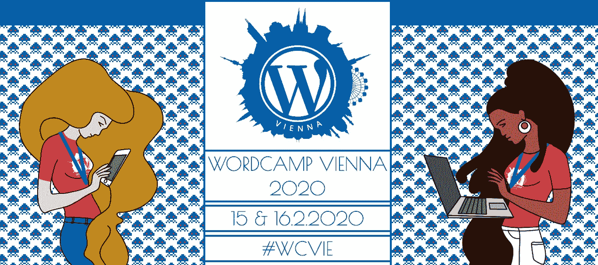

[WordCamp Vienna](https://vienna.wordcamp.org/2020/sponsor/kinsta/)

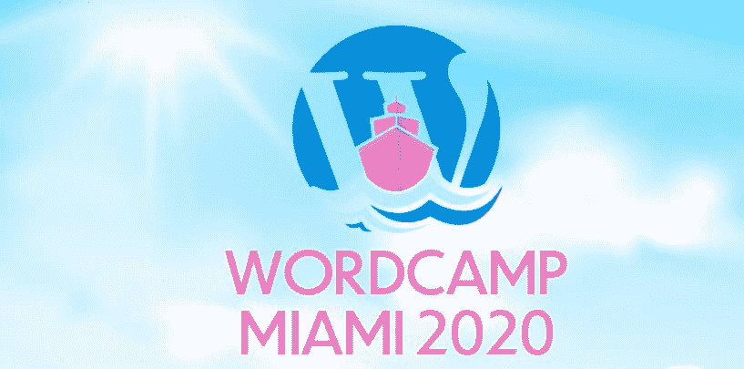

[WordCamp Miami](https://miami.wordcamp.org/2020/sponsor/kinsta/)

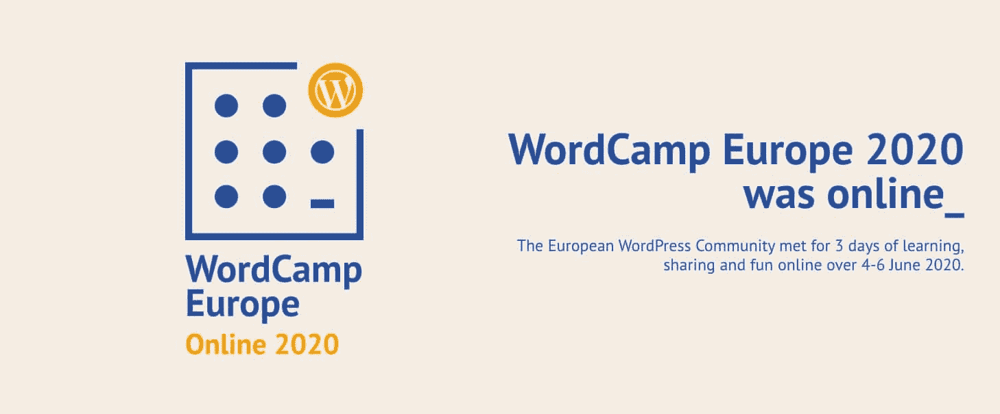

[WordCamp Europe](https://europe.wordcamp.org/2020/sponsor/kinsta/)

[WordCamp Italia](https://italia.wordcamp.org/2020/sponsor/kinsta/)

### 聚会

Kinsta 还在 2020 年支持了几个当地聚会，例如:

*   阿姆斯特丹
*   [WordPress 米兰会议](https://www.meetup.com/WordPress-Meetup-Milano/)
*   里尔的 WP
*   [波哥大 WordPress Meetup](https://www.meetup.com/Bogota-WordPress-Meetup/)
*   [维也纳 WordPress Meetup](https://www.meetup.com/Vienna-WordPress-Meetup/)
*   墨西哥 WordPress】
*   [利马 WooCommerce Meetup](https://www.meetup.com/Lima-WooCommerce-Meetup/)
*   [蒙特雷](https://www.meetup.com/Wordpress-Meetup-Monterrey-Oficial/)
*   [泗水 WordPress Meetup](https://www.meetup.com/Surabaya-WordPress-Meetup/)

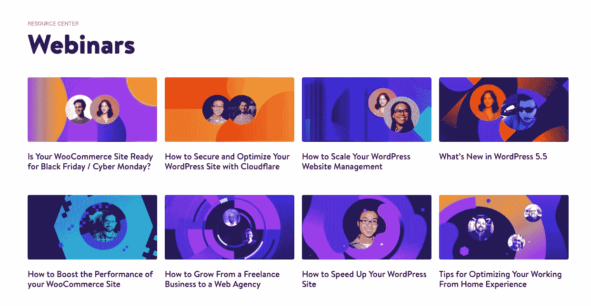

Webinars at Kinsta

此外，在 2020 年，我们以 3 种不同的语言共举办了 17 场免费网络研讨会:

*   [英语中的 8](https://kinsta.com/webinars/)
*   [荷兰语 7](https://kinsta.com/nl/webinars/)
*   [2 意大利语](https://kinsta.com/it/webinars/)

尽管过去一年的数字活动很有价值，但我们迫不及待地想尽快与大家面对面交流。

## 2020 年的功能更新和变化

现在，让我们来看看我们的团队在过去一年中能够发布的功能更新和变化。我们现在无法详细介绍它们，所以这里是重点(确保[订阅我们的新闻简报](https://kinsta.com/wordpress-newsletter/)以免错过更新)。

## 注册订阅时事通讯

### 想知道我们是怎么让流量增长超过 1000%的吗？

加入 20，000 多名获得我们每周时事通讯和内部消息的人的行列吧！

[Subscribe Now](#newsletter)

### PHP 8 适用于所有环境

PHP 8 is available

PHP 8 于 2020 年 12 月底发布，是该语言的最新版本，并为 PHP 引入了一系列优化和强大的功能，如 [JIT 编译](https://kinsta.com/blog/php-8/#jit--the-just-in-time-compiler)、 [Union Types 2.0](https://kinsta.com/blog/php-8/#union-types-2-0) 、[负索引数组](https://kinsta.com/blog/php-8/#negative-array-index)等等。在发布周期之后，我们向我们所有的客户提供了 [PHP 8，包括他们的测试环境和真实环境。](https://kinsta.com/feature-updates/php-8/)

### 金斯塔的 APM 工具

速度和无与伦比的性能离我们的心很近很近，这已经不是新闻了。我们在 2020 年的首要任务之一是为我们的客户配备一个工具，帮助他们找出并调试降低他们网站速度的原因。这就是为什么我们[创造了](https://kinsta.com/feature-updates/kinsta-apm-tool/) [Kinsta APM](https://kinsta.com/apm-tool) ，这是我们用于[应用性能监控](https://kinsta.com/blog/application-performance-monitoring/)的免费且强大的工具。

多亏了 Kinsta APM，你可以很容易地识别和修复你所有 WordPress 网站的性能问题，包括 [WooCommerce 商店](https://kinsta.com/blog/woocommerce-apm/)和[会员网站](https://kinsta.com/blog/membership-website-speed/)。

### 外部备份选项

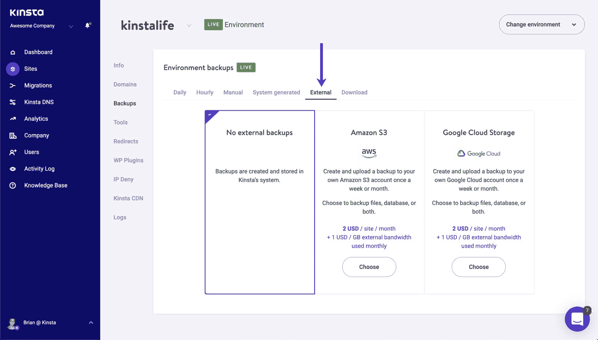

Enable external backups in MyKinsta

如果没有[备份系统](https://kinsta.com/help/wordpress-backups/)，你就无法成功管理一个站点。2020 年，我们增加了[外部备份](https://kinsta.com/help/external-backups/)，丰富了客户可用的备份选项。外部备份功能可以配置为定期(每周一次或每月一次)自动将您网站的备份副本推送到亚马逊 S3 或谷歌云存储中。

### 更多数据中心

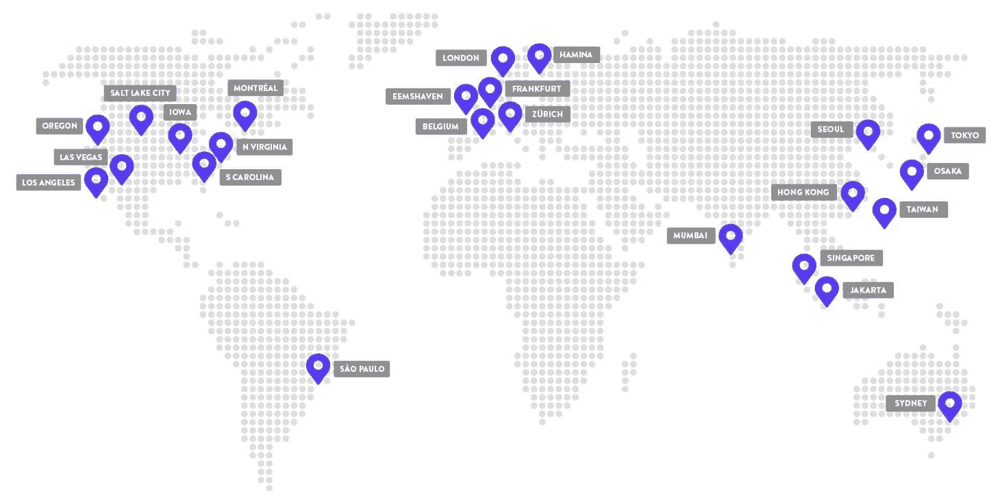

Kinsta’s hosting is powered by GCP

选择离用户最近的数据中心可确保低延迟和真正快速的加载时间。2020 年，我们增加了 4 个额外的[谷歌云数据中心位置](https://kinsta.com/knowledgebase/google-cloud-data-center-locations/)供选择:

*   美国爱荷华州康瑟尔布拉夫斯(美国中部 1)
*   比利时圣吉斯兰(欧洲-西方 1)
*   台湾彰化县(东亚 1)
*   澳大利亚悉尼(澳大利亚东南部 1)
*   美国俄勒冈州达拉斯市(美国西部 1)
*   美国盐湖城(美国西部 3)–**新**
*   美国弗吉尼亚州阿什本(美国东部 4)
*   美国南卡罗来纳州蒙克斯角(美国东部 1)
*   巴西圣保罗(南美-东方 1)
*   英国伦敦(欧洲-西方 2)
*   德国法兰克福(欧洲-西方 3)
*   新加坡裕廊西(东南亚 1)
*   日本东京(亚洲东北部 1)
*   印度孟买(亚洲南部 1)
*   加拿大蒙特利尔(北美-东北 1)
*   荷兰 Eemshaven(欧洲-西方 4)
*   芬兰哈米娜(欧洲-北欧 1)
*   加利福尼亚州洛杉矶(美国西部 2)
*   香港(东亚 2)
*   瑞士苏黎世(欧洲-西方 6)
*   日本大阪(亚洲东北部 2)
*   韩国首尔(亚洲-东北 3)–**新**
*   美国内华达州拉斯维加斯(us-west 4)–**新**
*   印度尼西亚雅加达(东南亚 2 区)–**新**

### 更多的入门和专业计划访问，相同的价格

我们总是洗耳恭听您的反馈。这就是为什么[我们在不增加成本的情况下，为我们的初级和专业计划](https://kinsta.com/feature-updates/boosting-visits-starter-pro-plans/)增加了 25%的访问量！

### 通知中心

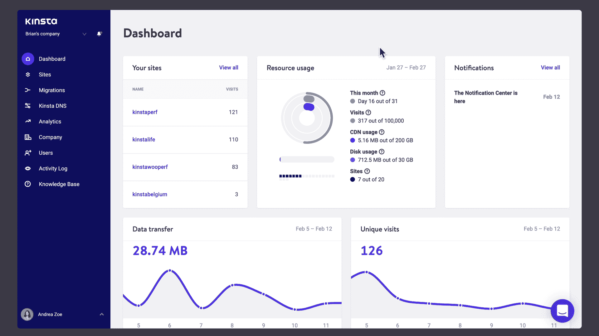

Notification Center in MyKinsta

多亏了我们在 2020 年初发布的[通知中心](https://kinsta.com/feature-updates/mykinsta-notification-center-kinsta-invoices/#notification-center-now-available-in-mykinsta-dashboard), kin sta 的客户可以收到有关他们网站的重要事件和更新的通知。

### 其他更新

除了上面提到的所有主要功能更新和更改，这里列出了一些额外的较小功能更新。如您所见，我们的 MyKinsta 开发团队一直很忙！

*   [在 Kinsta](https://kinsta.com/feature-updates/wp_get_environment_type-function/) 实现新的 wp_get_environment_type()函数
*   [MyKinsta 中的站点重命名](https://kinsta.com/feature-updates/site-renaming/)
*   [外部备份、站点标记、ionCube 加载器等等](https://kinsta.com/feature-updates/external-backups-site-tagging-ioncube-loader/)
*   [缓存切换、Kinsta DNS 中的 IP 自动填充、新用户设置页面等](https://kinsta.com/feature-updates/caching-toggle-ip-autofill-user-settings-activty-log-site-domain-search/)
*   [通知中心和自动发票邮件](https://kinsta.com/feature-updates/mykinsta-notification-center-kinsta-invoices/)
*   [介绍新的 MyKinsta 演示](https://kinsta.com/feature-updates/mykinsta-demo/)
*   [新的双因素认证(2FA)和 MyKinsta 改进](https://kinsta.com/feature-updates/two-factor-authentication-2fa-mykinsta/)

[From Kinsta APM ➡️ Cloudflare integration ➡️ more data centers ➡️ increased site visits ➡️ DevKinsta, 2020 was a year of big changes at Kinsta! 💥 Check out the full year in review to see what 2021 has in store... 👀Click to Tweet](https://twitter.com/intent/tweet?url=https%3A%2F%2Fkinsta.com%2Fblog%2F2020-year-in-review%2F&via=kinsta&text=From+Kinsta+APM+%E2%9E%A1%EF%B8%8F+Cloudflare+integration+%E2%9E%A1%EF%B8%8F+more+data+centers+%E2%9E%A1%EF%B8%8F+increased+site+visits+%E2%9E%A1%EF%B8%8F+DevKinsta%2C+2020+was+a+year+of+big+changes+at+Kinsta%21+%F0%9F%92%A5+Check+out+the+full+year+in+review+to+see+what+2021+ha...&hashtags=YearinReview%2CBye2020)

## 金斯塔的评论出来了

月复一月，我们不仅在客户聊天中，而且在公共评论网站上收到了关于我们的托管和支持的大量反馈。WPShout 又一次将我们评为[最佳管理 WordPress 主机](https://wpshout.com/best-managed-wordpress-hosting/)，我们在 G2 上赢得了类似**最容易使用**和**市场领导者**的奖项。

需要一个给你带来竞争优势的托管解决方案吗？Kinsta 为您提供了令人难以置信的速度、一流的安全性和自动伸缩功能。[查看我们的计划](https://kinsta.com/plans/?in-article-cta)

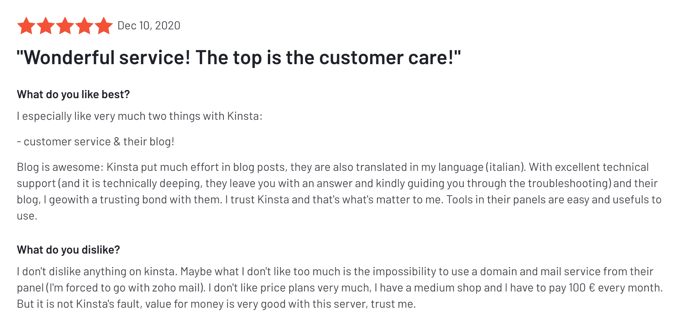

A review about Kinsta on G2

Kinsta 也一直被热门评论网站评为 WordPress 托管的最佳选择，例如:

*   [G2 评分:4.8/5](https://www.g2.com/products/kinsta/reviews)
*   [信任试点评级:4.8/5](https://www.trustpilot.com/review/kinsta.com)
*   [主机建议评分:9.8/10](https://hostadvice.com/hosting-company/kinsta-reviews/)

## 更多内容，更多格式

在 Kinsta，我们非常相信内容，因此毫不奇怪，我们在 2020 年进一步推进了我们的目标，通过推出我们的 [YouTube 频道](https://www.youtube.com/kinsta)，超越了[书面内容](https://kinsta.com/blog/proofreading-tips/)。

如果您还没有见过，让我们向您介绍 Kinsta 内容家族的最新成员！

### 金斯塔的 YouTube 频道

YouTube 是第二大搜索引擎，这是有充分理由的。你可以在 YouTube 上找到(几乎)任何你想找的东西，还能看到活生生的色彩。

我们计划开始测试视频很长一段时间，最终，在 11 月中旬，我们启动了我们的出版计划，并开始制作涵盖我们的读者(和我们)喜欢的主题的视频。

这里有一个关于如何利用内容推广为你的网站带来更多流量的建议:

 这是另一个向你展示如何定制你的主题的例子:

 除了这些类型的视频，我们还不断发布视频教程，介绍如何使用我们的工具和功能并从中获得最佳收益。

看看这篇关于如何安装 DevKinsta 的文章:

 或者这个，关于如何使用 MyKinsta 对你的 WordPress 站点进行密码保护:

 如果你喜欢视频，喜欢每周欣赏新视频的想法，请确保[订阅我们的 YouTube 频道](https://www.youtube.com/c/Kinsta?sub_confirmation=1)，当你看到你喜欢的东西时竖起大拇指！

我知道你们中的一些人现在可能会想:“Matteo，视频很棒，但是…我们来这里是为了数据。”

我知道，你对数字感兴趣，所以让我与你分享:

### 我们在 2020 年出版了多少

*   新博客帖子:151
*   新知识库文章:61
*   新登录页面:30
*   网络研讨会页面:8
*   附属学院内容:3
*   新的案例研究:9
*   新合作伙伴页面:7
*   新功能更新:14
*   新电子书:4
*   客户报价:107
*   发送的每周简讯:50 份

这个列表没有考虑到 2020 年全年推送的所有内容更新。

### 2020 年最受欢迎的文章

现在你知道了数量，让我来分享一下哪些内容表现最好:

#### 10 篇最佳博客文章

1.  [如何修复你的连接不在 Chrome 中的私有错误(18 个提示)](https://kinsta.com/blog/your-connection-is-not-private/)
2.  如何修复 WordPress 网站上的 ERR _ TOO _ MANY _ REDIRECTS
3.  [如何增加 WordPress 最大上传文件大小](https://kinsta.com/blog/wordpress-maximum-upload-file-size/)
4.  [2020 年将使用的 22 种替代搜索引擎](https://kinsta.com/blog/alternative-search-engines/)
5.  [如何修复 Chrome 中的 ERR _ CONNECTION _ rejected 错误(9 个小技巧)](https://kinsta.com/blog/err_connection_refused/)
6.  [15 种最佳谷歌字体(用法提示)](https://kinsta.com/blog/best-google-fonts/)
7.  [2020 年你的网站需要考虑的 21 个最佳广告替代方案](https://kinsta.com/blog/adsense-alternatives/)
8.  [13 款加速工作流程的最佳文本编辑器](https://kinsta.com/blog/best-text-editors/)
9.  [16 款最佳 WordPress 照片库插件(与示例对比)](https://kinsta.com/blog/wordpress-photo-gallery-plugins/)
10.  [如何修复你的 WordPress 网站上的 405 方法不允许错误](https://kinsta.com/blog/405-method-not-allowed-error/)

#### 10 篇最佳知识库文章

1.  [如何修复 Chrome 中的 DNS _ PROBE _ FINISHED _ NXDOMAIN 个选项)](https://kinsta.com/knowledgebase/dns_probe_finished_nxdomain/)
2.  [如何修复 SSH“连接被拒绝”错误](https://kinsta.com/knowledgebase/ssh-connection-refused/)
3.  [什么是 WordPress？为初学者讲解](https://kinsta.com/knowledgebase/what-is-wordpress/)
4.  [如何修复 400 错误请求错误【原因和修复】](https://kinsta.com/knowledgebase/400-bad-request/)
5.  [如何修复 ERR _ SSL _ VERSION _ OR _ CIPHER _ MISMATCH](https://kinsta.com/knowledgebase/err_ssl_version_or_cipher_mismatch/)
6.  [如何修复 Windows 和 Mac 上的“DNS 服务器不响应”错误](https://kinsta.com/knowledgebase/dns-server-not-responding/)
7.  [如何修复 NET::ERR _ CERT _ AUTHORITY _ INVALID 错误](https://kinsta.com/knowledgebase/neterr-cert-authority-invalid/)
8.  [如何使用免费的 SMTP 服务器处理 WordPress 邮件(包括 Gmail SMTP 服务器)](https://kinsta.com/blog/free-smtp-server/)
9.  [如何清除所有主流浏览器的缓存](https://kinsta.com/knowledgebase/how-to-clear-browser-cache/)
10.  [如何给 WordPress 页眉页脚添加代码](https://kinsta.com/knowledgebase/add-code-wordpress-header-footer/)

由于 Kinsta 为不同语言偏好的受众提供服务，我们不能忘记提及我们的全球扩展团队和翻译人员在帮助提供非英语的其他语言内容方面所做的令人难以置信的工作。

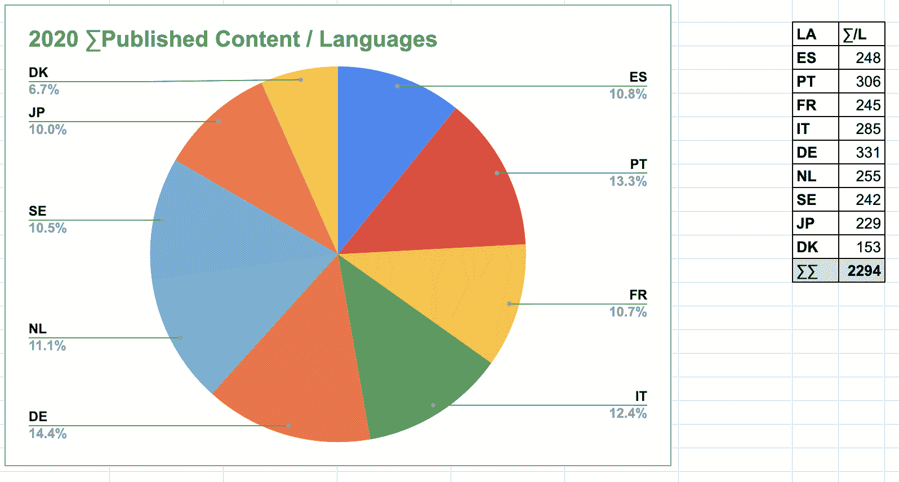

Translated assets

具体来说，2020 年有 9 种不同的语言出版了 2294 个译本。哇！

[2020 was a big year at Kinsta- and it's all thanks to the customers, blog readers, YouTube subscribers, and online community 💜 See the full recap here- and get ready for a bigger and better 2021! 🎉Click to Tweet](https://twitter.com/intent/tweet?url=https%3A%2F%2Fkinsta.com%2Fblog%2F2020-year-in-review%2F&via=kinsta&text=2020+was+a+big+year+at+Kinsta-+and+it%27s+all+thanks+to+the+customers%2C+blog+readers%2C+YouTube+subscribers%2C+and+online+community+%F0%9F%92%9C+See+the+full+recap+here-+and+get+ready+for+a+bigger+and+better+2021%21+%F0%9F%8E%89&hashtags=YearinReview%2CCustomerAppreciation)

## 2021 年有什么期待

唷，有很多要分享的！但那都是过去的事了，那么金斯塔将何去何从，你对 2021 年会有什么期待呢？

我现在不能分享太多，但一些宝石已经出现了:

为开发者提供更好的工具:2021 年初，我们发布了用于本地 WordPress 开发的免费工具套件 [DevKinsta](https://kinsta.com/devkinsta) 。该团队一直致力于修复和改进漏洞，同时也基于我们从社区收到的反馈[。当然，还会有更多！](https://community.devkinsta.com/)

**改进的性能和安全性** : Kinsta 的 Cloudflare 集成使托管在我们平台上的 WordPress 站点更快更安全。[阅读我们计划如何使用 Cloudflare](https://kinsta.com/knowledgebase/cloudflare-integration/) 。

**更多内容，更多格式**:对于视频制作，我们只触及了皮毛，我们在这个旅程中获得了很多乐趣。在 2021 年，你可以期待我们每周创造的内容量会增加。

**改进的 MyKinsta 仪表盘**:我们从未停止定制 [MyKinsta 仪表盘](https://kinsta.com/mykinsta/)的工作，你可以肯定一些真正“有趣”的新功能和增强功能将在 2021 年逐步推出。

这份清单远非详尽无遗，我保证，2021 年将会是非常棒的一年。

我们感谢您的持续支持，我们一直期待着您的回音。为一个伟大的开始干杯！

> [在 Instagram 上查看此贴](https://www.instagram.com/p/CJefE-7lNzb/?utm_source=ig_embed&utm_campaign=loading)[分享的一篇帖子 T51](https://www.instagram.com/p/CJefE-7lNzb/?utm_source=ig_embed&utm_campaign=loading)

