# 23 个最佳 PHP 编辑器和 ide(免费和付费)

> 原文：<https://kinsta.com/blog/php-editor/>

要编写[高质量的 PHP 代码](https://kinsta.com/blog/10-things-not-to-do-in-php-7/)，你需要一个高质量的 PHP 编辑器，最适合你的编程需求、偏好和工作流程。市场上有许多可用的选项，虽然乍一看它们可能是一样的，但是每个 PHP 编辑器都有其独特的特性和最佳用例。

在本指南中，您可以找到最好的 PHP 编辑器和 ide，它们可以帮助您编辑 PHP 文件，开发、调试和测试 PHP 应用程序。

他们面向不同类型的用户，从需要开箱即用的无配置 PHP 编辑器的初学者到想要使用特定堆栈、[框架或工具包的有经验的 PHP 程序员。虽然这个列表中的大多数工具都是免费的，但我也添加了一些附带技术支持和额外功能的高级工具。](https://kinsta.com/blog/php-frameworks/)

## PHP 编辑器与 PHP IDE

PHP 编辑器和 PHP IDEs 是两种可以用来编辑 PHP 文件的软件。两者的主要区别在于复杂性。如果您想要一个非常简短的定义，PHP IDE 是一个具有扩展功能的增强 PHP 编辑器。

如果你是初学者或者没有开发复杂的 PHP 应用程序，你最好使用 PHP 编辑器。它[加载更快](https://kinsta.com/learn/page-speed/)，有一个更简单的用户界面，更容易配置和设置，但仍然为您提供了编码时需要的所有编辑功能。

然而，如果你是一个经验丰富的 PHP 程序员，构建复杂的应用程序，并有特定的编码需求，PHP IDE 可能是一个更好的解决方案。

[Find the perfect PHP editor for your programming needs, preferences, and workflow in this roundup ⬇️Click to Tweet](https://twitter.com/intent/tweet?url=https%3A%2F%2Fbit.ly%2F2MnkDrX&via=kinsta&text=Find+the+perfect+PHP+editor+for+your+programming+needs%2C+preferences%2C+and+workflow+in+this+roundup+%E2%AC%87%EF%B8%8F&hashtags=PHP%2CProgramming)

## 什么是 PHP 编辑器

从技术上讲，你可以用一个基本的文本编辑器来编辑 PHP 文件，比如 Windows 上的 Notepad 应用程序，但这并不是一件容易的事情。主要问题是，如果没有语法突出显示，源代码文件很难阅读，语法突出显示可以让你以不同的[颜色](https://kinsta.com/blog/website-color-schemes/)和[字体](https://kinsta.com/blog/wordpress-fonts/)看到不同的代码结构，如变量、关键字和参数。

> 需要在这里大声喊出来。Kinsta 太神奇了，我用它做我的个人网站。支持是迅速和杰出的，他们的服务器是 WordPress 最快的。
> 
> <footer class="wp-block-kinsta-client-quote__footer">
> 
> 
> 
> <cite class="wp-block-kinsta-client-quote__cite">Phillip Stemann</cite></footer>

[View plans](https://kinsta.com/plans/)

代码可读性差不仅会导致[多个错误](https://kinsta.com/blog/http-status-codes/)，还会降低你作为程序员的速度，因为这将花费更多的时间来浏览你的代码并找出下一步。为了有效地编辑 PHP 文件，你需要一个理解 PHP 语法的源代码编辑器，并根据它的意思高亮显示每一段代码。

尽管语法突出显示是每个 PHP 编辑器的首要特性，但它不是唯一的特性。最好的 PHP 编辑器具有多种附加功能，可以帮助你编写和编辑 PHP 代码，理解文件和项目的结构，并且[减少错误](https://kinsta.com/blog/wordpress-errors/)。例如，换行符、缩进、自动完成、不同的视图和编辑模式、代码完成、搜索和比较功能以及智能代码提示都是这样的功能。

除了这些高级编辑功能，现代 PHP 编辑器还具有帮助您完成其他任务的功能，如[调试](https://kinsta.com/blog/wordpress-debug/)、[版本控制](https://kinsta.com/blog/wordpress-version-control/)、重构等等。

请注意，大多数 PHP 编辑器不仅仅是用来编辑 PHP 文件的，它们还是通用的[文本编辑器](https://kinsta.com/blog/best-text-editors/)，对许多其他源代码文件类型也有语法支持。例如，如果你以前编辑过 HTML 文件，并且已经有了一个[的 HTML 编辑器](https://kinsta.com/blog/free-html-editor/)，它很有可能也支持 PHP 语法，如果你愿意，你可以继续使用它。

## 什么是 PHP IDE

IDE 是代表集成开发环境的首字母缩写。PHP IDE 拥有 PHP 编辑器的所有语法突出显示和其他功能，以及许多其他有助于 PHP 开发的特性。

最好的 PHP ides 通常会为您提供预先制作的代码模板和详细的项目和类向导，有许多高度可定制的视图和面板，您可以按照自己的意愿进行排列，并附带集成的开发工具，例如内置的[终端](https://kinsta.com/blog/wp-cli/)、 [web 服务器](https://kinsta.com/blog/nginx-vs-apache/)或 [web 浏览器](https://kinsta.com/browser-market-share/)，您可以在 IDE 界面中直接使用它们。它们还与众多第三方工具紧密集成，如调试器(如 PHPUnit 和 Xdebug)以及容器和虚拟机平台(如 Docker 和 vagger)。

还有一些云 PHP IDEs 可以让你在网络浏览器中建立一个高级的编码环境，并将你的文件保存到云服务器中。Cloud IDEs 还可以为你提供预构建的 PHP 栈，例如，一个容器化的 LAMP (Linux、 [Apache](https://kinsta.com/knowledgebase/what-is-apache/) 、 [MySQL](https://kinsta.com/knowledgebase/what-is-mysql/) 、 [PHP](https://kinsta.com/blog/is-php-dead/) )栈，允许你在一个活动的 Linux 服务器上工作，并在 web 浏览器中即时检查你的工作。

### 信息

寻找一个全新的 100%免费的本地 WordPress 开发工具？然后一定要去看看[德夫金斯塔](https://kinsta.com/devkinsta/)！

尽管 PHP IDE 提供了比 PHP 编辑器更多的特性，但它也需要更多的专业知识来设置和配置环境。例如，您可能需要添加和配置 web 服务器，该服务器将执行您的代码、定义环境变量和 PHP 可执行文件，并执行其他高级开发任务。

所以，如果你不想使用 IDE 的额外功能，额外的工作量很可能是不值得的，即使你有做[配置](https://kinsta.com/blog/wp-config-php/)的专业知识。但是，如果您需要这样的特性，PHP IDE 可以显著加快您的编码、测试、[调试](https://kinsta.com/blog/debugging-wordpress-performance/)和概要分析(程序分析)工作。

也就是说，目前 PHP 编辑器和 ide 之间的界限越来越模糊。PHP 编辑器已经开始整合以前只能在 ide 中找到的特性，比如内置调试器和终端、高度可定制的视图和面板等等。

## 10 个最好的免费 PHP 编辑器

让我们从最好的免费 PHP 编辑器开始，它们为您提供了读取、创建和编辑 PHP 文件的所有重要功能。

### 1.Visual Studio 代码

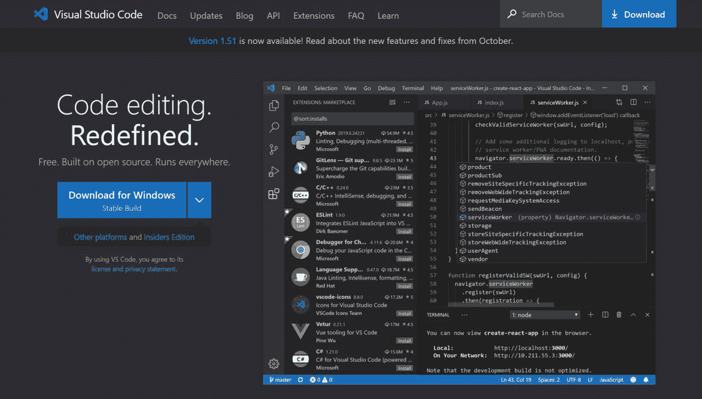

Visual Studio Code

*   支持的操作系统:Windows、Linux、macOS
*   许可证:麻省理工学院许可证
*   源代码:[https://github.com/microsoft/vscode](https://github.com/microsoft/vscode)
*   支持的语言:PHP，HTML，CSS，SCSS，Less，JavaScript，JSON，TypeScript，Markdown，PowerShell，C++，Java，Python，Go，T-SQL，C#。NET Core 等等

Visual Studio Code (简称 VS Code)是微软推出的免费开源代码编辑器，近年来广受欢迎。它[默认支持 PHP 语法](https://code.visualstudio.com/docs/languages/php)，你可以从 VS 代码市场下载[进一步的 PHP 扩展](https://marketplace.visualstudio.com/search?term=php&target=VSCode&category=All%20categories&sortBy=Relevance) s，让它成为一个适合你特定编码需求的高级 PHP 编辑器。您可以定制 VS 代码的每个方面，从主题到关键绑定到集成和功能。

**最佳特性:**

*   语法突出显示、自动完成和代码导航
*   使用智能感知的智能代码完成
*   颜色主题选择器
*   内置的 [Git 和 GitHub](https://kinsta.com/knowledgebase/git-vs-github/) 集成
*   内置 Emmet 支持
*   可扩展性(您可以创建自己的扩展)
*   林挺，调试，重构
*   集成终端
*   结对编程的实时共享([带扩展](https://code.visualstudio.com/learn/collaboration/live-share))

### 2.原子

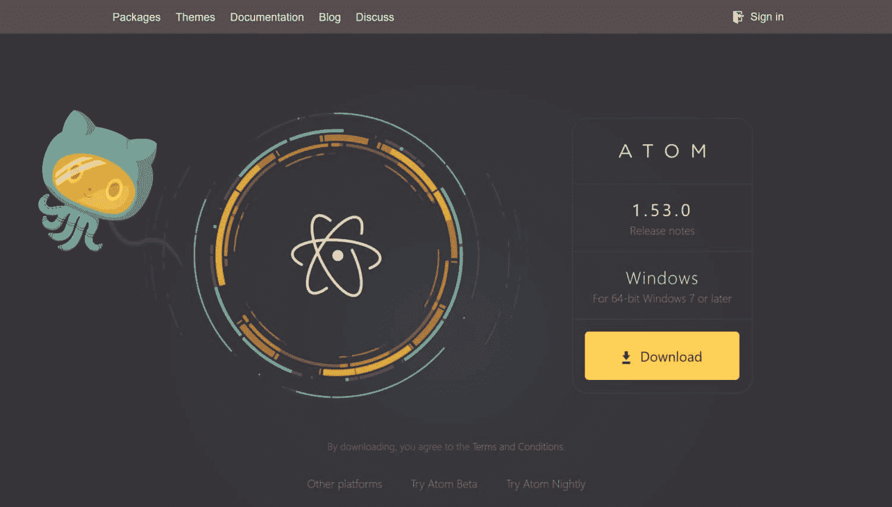

Atom

*   支持的操作系统:Windows、Linux、macOS、FreeBSD
*   许可证:麻省理工学院许可证
*   源代码:[https://github.com/atom/atom](https://github.com/atom/atom)
*   支持的语言:PHP、HTML、CSS、JavaScript、Java、C、C#、Objective C、Perl、Python、Ruby、Go、XML 等等

根据 Atom 的口号，Atom 是“21 世纪可破解的文本编辑器”。本来是 GitHub 的内部工具，后来他们[做了开源](https://blog.atom.io/2014/05/06/atom-is-now-open-source.html)，但是项目还是由 GitHub 维护。之所以称之为 hackable，是因为您可以定制编辑器界面的每个方面，比如 UI 和语法主题、键绑定、格式、全局和特定于语言的设置等等。

除了核心编辑器的功能之外，你还可以下载[将近 9000 个包](https://atom.io/packages)，这些包允许你添加任何你需要的特性。要将 Atom 配置为 PHP 编辑器，可以添加 [PHP 特定的包](https://atom.io/packages/search?q=php)，用于调试、重构、注释、林挺和其他与开发相关的任务。

**最佳特性:**

*   带有[3000 多个开源 Atom 主题的可定制 UI](https://atom.io/themes)
*   语法突出显示和智能自动完成
*   文件系统浏览和多个窗格
*   高级查找和替换工具
*   集成软件包管理器(称为 [apm](https://github.com/atom/apm)
*   易于访问的命令面板
*   展开性
*   实时代码协作(使用内部构建的[电传打字包](https://github.com/atom/teletype/)
*   Git 和 GitHub 的直接集成(与内部构建的 [GitHub 包](https://github.com/atom/github/))

### 3.括号

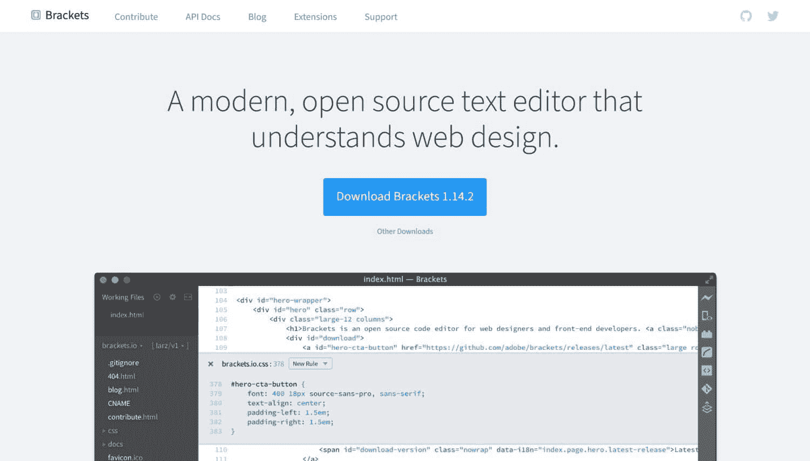

Brackets

*   支持的操作系统:Windows、Linux、macOS
*   许可证:麻省理工学院许可证
*   源代码:[https://github.com/adobe/brackets](https://github.com/adobe/brackets)
*   支持的语言:HTML、CSS、LESS、SCSS、Sass、JavaScript、PHP、Java、Python、Perl、Ruby、C、C++、VBScript 等等

[括号](http://brackets.io/)是 Adobe 创建并维护的开源代码编辑器。和 Adobe 的许多产品一样，它主要专注于前端开发，但也支持几种后端语言，包括 PHP。它因其 CSS 内联编辑特性而变得流行，该特性允许您查看属于特定 CSS 规则的所有选择器。

如果您同时进行前端和后端开发，括号可能是您理想的 PHP 编辑器——特别是如果您还使用 CSS 预处理程序，如 Sass 和 LESS。也就是说，括号并不是这个列表中最先进的 PHP 编辑器，但是它是免费的、轻量级的、易于使用的。

Brackets 也有一个[扩展注册表](https://registry.brackets.io/)，但是，它没有 Atom 或 Visual Studio 代码那么多扩展。

**最佳特性:**

*   垂直和水平分割视图
*   使用与 web 浏览器的实时连接进行实时预览
*   轻量级(用 JavaScript 编写)
*   内嵌编辑(用于 CSS)
*   自定义主题可通过括号扩展注册表获得
*   支持 CSS 预处理程序，包括快速编辑和实时高亮显示功能

### 4.GNU Emacs

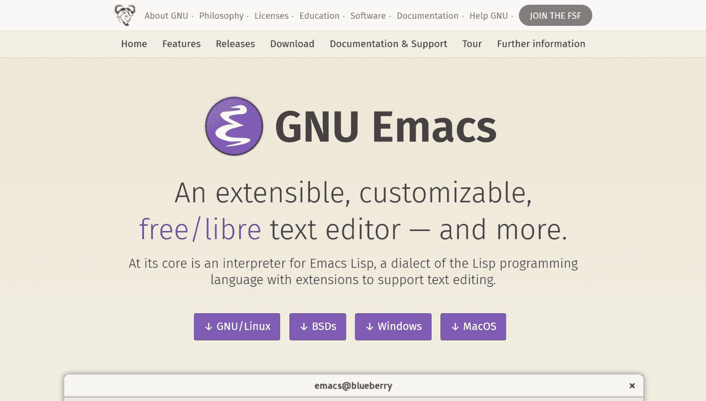

GNU Emacs

*   支持的操作系统:Windows、Linux、macOS、FreeBSD、NetBSD、OpenBSD、Solaris
*   许可证:GNU GPL vs 3
*   源代码:[https://git . savannah . GNU . org/cgit/emacs . git](https://git.savannah.gnu.org/cgit/emacs.git)
*   支持的语言:Lisp、PHP、Python、Ruby、Java、JavaScript、Scala、Perl 和许多其他语言

GNU Emacs 是一个稳定且成熟的代码编辑器，自 1985 年就已经上市。它最初是为 [GNU 操作系统](https://www.gnu.org/gnu/)创建的，但是它也支持许多其他操作系统。Emacs 的设计和功能都可以使用 [Emacs Lisp 脚本语言](https://kinsta.com/blog/scripting-languages/#12-emacs-lisp)完全定制。

Emacs 支持多种编程语言，包括 HTML 和 CSS，但是前端开发人员通常不使用它。这并不是说，如果你正在寻找一个前端和 PHP 编辑器，Emacs 不推荐给你。但是，请注意，它的学习曲线比这个列表中的大多数其他编辑器都要陡峭。

除了其令人敬畏的功能之外，使用 Emacs 在程序员社区中肯定有一个很酷的因素，因为你需要使用它的专业知识，它甚至出现在流行文化中，如 [Tron: Legacy](https://www.reddit.com/r/emacs/comments/ged5p/emacs_in_tron_legacy_three_images/) 和[社交网络](https://medium.com/h0llyw00d-h4x0rs/the-social-network-6591ec03443d)电影。

**最佳特性:**

*   内容感知编辑模式
*   完全 Unicode 支持
*   可通过命令行(使用 Emacs Lisp)和图形用户界面定制
*   开源[包仓库](http://elpa.gnu.org/)来扩展编辑器
*   内置文档
*   其他功能，如调试器 UI、项目规划器、IRC 客户端、日历等

### 5.精力

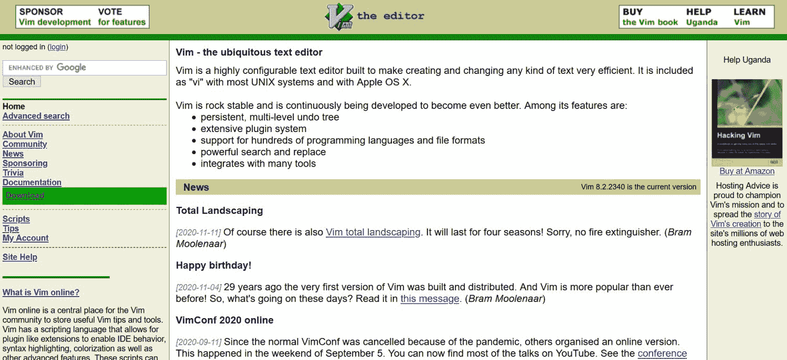

Vim

*   支持的操作系统:Linux、Windows、macOS、Android、iOS
*   许可证: [Vim 许可证](https://github.com/vim/vim/blob/master/LICENSE)
*   源代码:[https://github.com/vim/vim](https://github.com/vim/vim)
*   支持的语言:PHP、Python、Ruby、Java、Lua、JavaScript、Perl、C、C++和许多其他语言

Vim 代表 Vi 改进版，因为它是为 Unix 系统创建的 [Vi 代码编辑器](http://ex-vi.sourceforge.net/)的改进版本。它为 Vi 增加了几个重要的特性，比如比较和合并文件、语法突出显示、搜索历史、拼写检查、拆分视图、支持诸如 [HTTP](https://kinsta.com/blog/wordpress-http-api-part-1/) 、 [FTP](https://kinsta.com/blog/best-ftp-clients/) 和 [SSH](https://kinsta.com/blog/how-to-use-ssh/) 等协议。

您可以在六种基本模式下使用 Vim，分别是正常、可视、选择、插入、命令行和 ex(退出)模式——参见 FreeCodeCamp 的这篇文章，了解 Vim 模式之间的主要差异。Vim 有一个文本用户界面，您可以使用命令和键映射来管理它。然而，如果你更喜欢使用带有图形用户界面的 vim，你也可以下载[的 Gvim(图形 Vim)版本](https://www.vim.org/download.php)。

与 Emacs 类似，Vim 是高度可定制和可扩展的，支持数百种编程语言。有数以千计的 [Vim 插件](https://www.vim.org/scripts/script_search_results.php)可用，但你也可以使用 [Vim 脚本](https://devhints.io/vimscript)(也称为 VimL)，Vim 的内部脚本语言，或另一种脚本语言来添加额外的功能。

Vim 是一个非常健壮的工具，但是如果你是初学者或者只是偶尔编写代码，它可能不是你的最佳选择，因为它的学习曲线很陡。但是，如果您想要灵活性和自定义功能，并且不介意学习，Vim 可能是您理想的 PHP 编辑器。如果你想走这条路，这里有一个由有价值的 Dev 博客提供的关于如何将 Vim 配置为 PHP 编辑器的教程。

**最佳特性:**

*   6 种不同的编辑模式
*   初学者的简易模式
*   Unicode 和多语言支持
*   编辑功能，如高级搜索和替换、多级撤消树、拆分视图、代码完成等
*   扩展插件系统
*   内置手册

### 6.蓝鱼

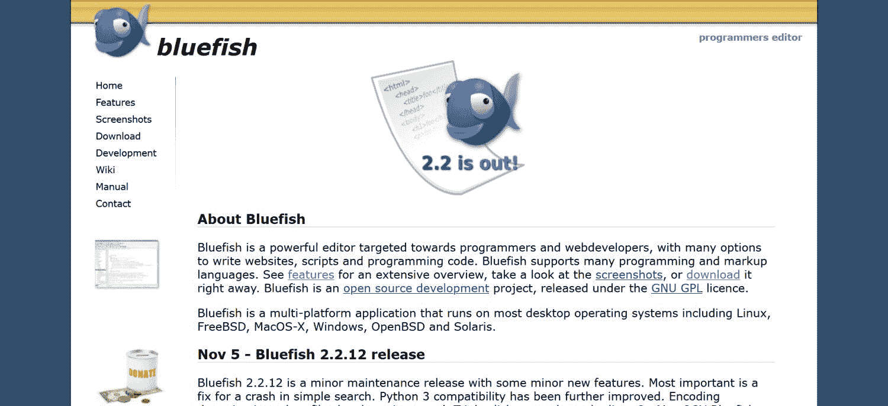

Bluefish

*   支持的操作系统:Linux、Windows、macOS、FreeBSD、OpenBSD、Solaris
*   许可证:GNU GPL vs 3
*   源代码:[https://sourceforge.net/p/bluefish/code/HEAD/tree/](https://sourceforge.net/p/bluefish/code/HEAD/tree/)
*   支持的语言:HTML、CSS、XML、JavaScript、PHP、SQL、Perl、Python、Ruby、Java、C、C++等等

[Bluefish](http://bluefish.openoffice.nl/index.html) 是一款高级源代码编辑器，支持多种编程语言。你可以在不同的操作系统上使用它，但是它也集成了 Gnome，所以如果你正在为你的 Linux 发行版寻找一个 PHP 编辑器，Bluefish 可能是你的一个很好的选择——它的 GUI 也是符合 Gnome 人机界面指南的,所以它甚至在 Gnome 桌面上看起来也不错。

因为 Bluefish 是为 web 开发人员设计的，所以它提供了一些有用的特性，比如 Emmet(以前的 Zen Coding)支持、HTML 标签的对话框和向导、Unicode 字符浏览器等等。它也有一个直观的用户界面，易于使用，所以如果你是一个初学者或者不想花很多时间学习如何使用 PHP 编辑器，你可以放心地选择它。

**最佳特性:**

*   重量轻，装载速度快
*   多文档界面(测试了 1000 多个打开的文档)
*   全屏编辑和拆分视图
*   编辑功能，如自动完成、内联参考信息、强大的和替换、片段侧栏等
*   通过 FTP、SFTP、 [HTTP](https://kinsta.com/blog/http3/) 、HTTPS 和其他协议进行远程文件访问
*   支持多种编码(默认为 UTF8)
*   可通过插件扩展

### 第七个绝地武士

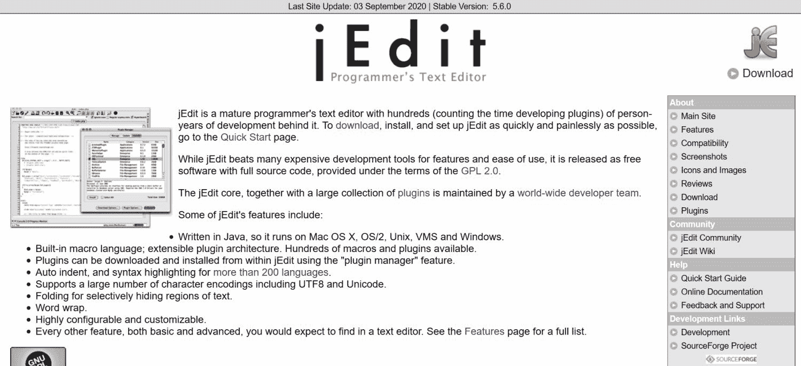

jEdit

*   支持的操作系统:Windows、macOS、Linux、BSD
*   许可证:GNU GPL vs 2
*   源代码:[https://sourceforge.net/p/jedit/svn/HEAD/tree/](https://sourceforge.net/p/jedit/svn/HEAD/tree/)
*   支持的语言:HTML，CSS，XML，JavaScript，CoffeeScript，。htaccess、PHP、SQL、Perl、Python、Java、Scala 等等

[jEdit](http://jedit.org/) 是为 Java 虚拟机编写的跨平台源代码编辑器，因此它可以在任何安装了 Java 运行时环境的操作系统上运行。它的目标是为程序员提供一个可以尽可能快速、轻松地安装和设置的编辑器。jEdit 有 200 多种编程语言的语法高亮显示模式。

尽管 jEdit 是一个稳定的工具，但在这个列表中，你会发现更多有趣的 PHP 编辑器。然而，如果你需要一个开箱即用的易用的免费 PHP 编辑器，还是值得一试。此外，如果你找到一个可以帮助你工作的 [jEdit 插件](http://plugins.jedit.org/)，它也是一个很好的选择——它有一些很酷的插件，包括对版本控制的支持，而不是 Git 和项目及文件管理工具(但是，检查插件的年龄，因为有些插件已经很多年没有更新了)。

**最佳特性:**

*   无限的撤销/重做功能
*   通过无限的剪贴板复制和粘贴
*   可以同时打开任意数量的编辑器窗口
*   多重和矩形选择
*   可以从用户操作中记录宏
*   支持 Unicode 和 160+字符编码
*   强大的搜索和替换工具
*   可通过插件扩展

### 8.记事本++

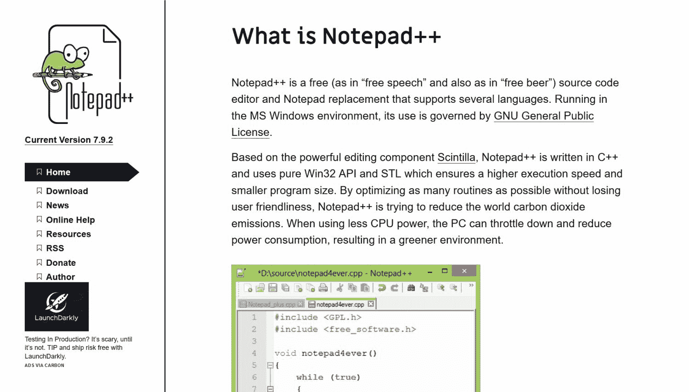

Notepad++

*   支持的操作系统:Windows
*   许可证:GNU GPL vs 2
*   源代码:[https://github.com/notepad-plus-plus/notepad-plus-plus](https://github.com/notepad-plus-plus/notepad-plus-plus)
*   支持的语言:HTML、CSS、XML、YAML、JavaScript、CoffeeScript、PHP、SQL、Perl、Python、C、C++等等

Notepad++ 是一个老掉牙但很实用的 Windows 操作系统源代码编辑器。它是作为记事本的替代品而创建的，记事本是 Windows 操作系统预装的默认文本编辑器。Notepad++为非常基本的记事本编辑器增加了多种功能，因此它很快在 Windows 机器上的开发人员中流行起来。

它为近 80 种编程语言提供了语法高亮功能。它易于安装，开箱即用，并具有重要的编辑功能，如分割视图，多文档界面，撤消/重做功能，等等。因此，如果你需要一个易于使用且加载速度快的免费 PHP Windows 编辑器，Notepad++值得一看。

**最佳特性:**

*   风格配置选项和预先设计的主题
*   编辑功能，如代码折叠、自动完成、智能代码完成、语法检查等
*   支持许多不同的字符集
*   可通过插件扩展
*   [开源插件](https://github.com/notepad-plus-plus/nppPluginList)可用于 32 位和 64 位系统

### 9.RJ 发了短信

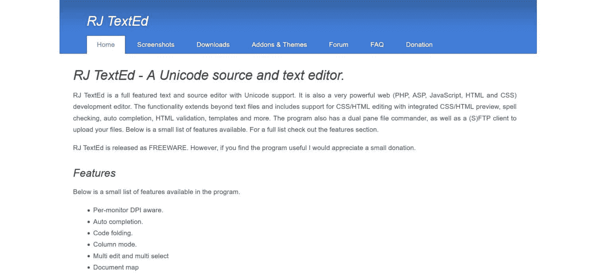

RJ TextEd

*   支持的操作系统:Windows
*   许可证:免费软件，但接受捐赠(没有特定的许可证是指定的)
*   源代码:未发布
*   支持的语言:HTML、CSS、Sass、LESS、Markdown、JavaScript、JSON、PHP、ASP、Java、Perl 等等

《RJ TextEd》是里卡德·约翰逊(RJ)的一个人项目，也是一个令人印象深刻的项目。它是 Windows 操作系统的全功能源代码编辑器，专门为 web 开发而创建。即使 RJ TextEd 的网站看起来有点基础，但这是一个文本编辑器，具有许多有趣的功能。

您可以通过选择和自定义主题来更改 UI 的各个方面，以不同的排列方式同时打开多个文档视图，并使用开发人员友好的工具，如颜色选择器、HTML 验证和修复工具、charmaps、文本到 HTML 转换等。RJ TextEd 还为 HTML 文件提供了嵌入式浏览器预览(Chrome 和 Internet Explorer)。

RJ TextEd 的授权有点不寻常。虽然它是免费软件，但它不是开源的，因为作者不想发布源代码。然而，您仍然可以通过[创建扩展](https://www.rj-texted.se/Forum/viewtopic.php?f=19&t=2913)来扩展功能。如果你有任何问题要问，RJ TextEd 也有一个[活跃用户论坛](https://www.rj-texted.se/Forum/index.php)。

**最佳特性:**

*   HTML 和 CSS 向导
*   HTML 文件的浏览器预览
*   带有预设计主题的主题管理器
*   内置项目管理器
*   正则表达式创建者
*   宏管理器
*   带同步的 FTP/STFP 客户端
*   编辑功能，如并排文件比较、高级排序、代码折叠、自动完成等

### 10.文字样式

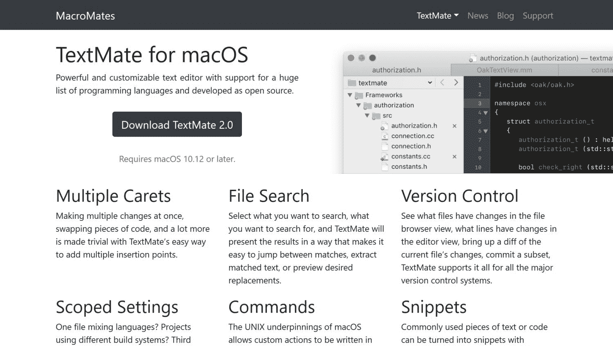

TextMate

*   支持的操作系统:macOS
*   许可证:GNU GPL vs 3
*   源代码:https://github . com/text te/text te
*   支持的语言:HTML、Markdown、CSS、XML、JavaScript、PHP、SQL、Perl、Python、Java 等等

[TextMate](https://macromates.com/) 是 macOS 操作系统的高级源代码编辑器。因为它是专门为 Mac 设计的，所以它与底层的 Unix shell 集成在一起，因此您可以用任何编程语言编写定制的操作来处理 Unix 标准流(stdin 和 stdout)。

为了使定制简单明了，TextMate 使用了一个可扩展的捆绑系统。TextMate 捆绑包可以包括语言语法、代码片段、宏、命令、模板、工作流等等。您可以在方便的包编辑器的帮助下管理包。

TextMate 的第一个版本是专有软件，你必须购买许可证。然而，当前版本 TextMate 2.0 已经在 GPLv3+许可下开源，所以你可以免费下载(然而，TextMate 的[许可政策页面](https://macromates.com/license_policy)提到，他们“可能会对 2.0 之后的更新收费”)。如果你正在寻找一个(目前)可以在 Mac 设备上运行的免费 PHP 编辑器，TextMate 2 绝对值得一看。

**最佳特性:**

*   自定义主题
*   实时 HTML/降价预览
*   强大的搜索工具
*   剪贴板历史
*   易于管理的代码片段
*   可折叠代码块、缩进式软包装、多个 carets、多个选项卡等等
*   范围设置
*   捆绑编辑器

## 4 个最佳 PHP 编辑器

尽管高级 PHP 编辑器价格不菲，但大多数都有免费试用期或评估期，因此您可以毫无风险地试用它们。如果你发现一个你想要使用或者需要技术支持的特性、集成或者插件，一个高级的 PHP 编辑器会是一个很好的解决方案。

### 1.崇高文本 3

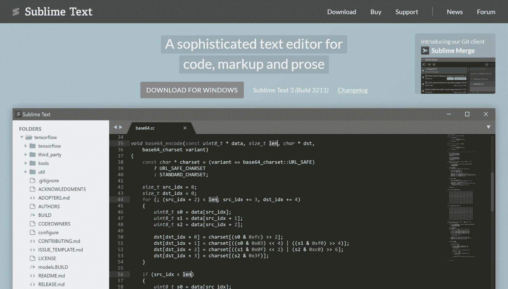

Sublime Text 3

*   支持的操作系统:Windows、Linux、macOS
*   价格:80 美元，带 3 年更新；下载免费
*   执照:[参见 EULA](https://www.sublimetext.com/eula)
*   支持的语言:HTML、CSS、Sass、LESS、Markdown、JavaScript、PHP、Python、Perl、Ruby、Java 等等

[Sublime Text 3](https://www.sublimetext.com/3) 是著名的 Sublime Text 源代码编辑器的第三个主要版本。新版本为已经流行的编辑器增加了窗格管理和符号索引，并改善了速度问题，如启动时间慢。在插件的帮助下，Sublime Text 3 是完全可定制的——许多现成的插件可以通过编辑器的[包管理器](https://packagecontrol.io/)获得，但是你也可以创建自己的定制插件。

如果你使用 Sublime Text 3 作为你的 PHP 编辑器，它有许多插件可以用于 PHP 语言，比如评论生成、林挺、测试、美化、格式化等等。另外，它有[一些用于 WordPress 开发的插件](https://packagecontrol.io/search/wordpress)，可以帮助你编写 WordPress 代码。

## 注册订阅时事通讯

### 想知道我们是怎么让流量增长超过 1000%的吗？

加入 20，000 多名获得我们每周时事通讯和内部消息的人的行列吧！

[Subscribe Now](#newsletter)

崇高文字 3 的授权有点诡异。尽管它是专有软件，但如果你不介意(经常显示的)弹出通知提醒你购买许可证，你可以免费使用它。

**最佳特性:**

*   可定制的代码片段、菜单、宏、按键绑定(使用 JSON 文件)
*   命令选项板
*   使用项目范围的函数、类和方法索引转到定义
*   高级编辑功能，如拆分视图、文档结构图、多重选择、自动完成等
*   内置软件包管理器
*   可通过插件扩展

### 2\. UltraEdit

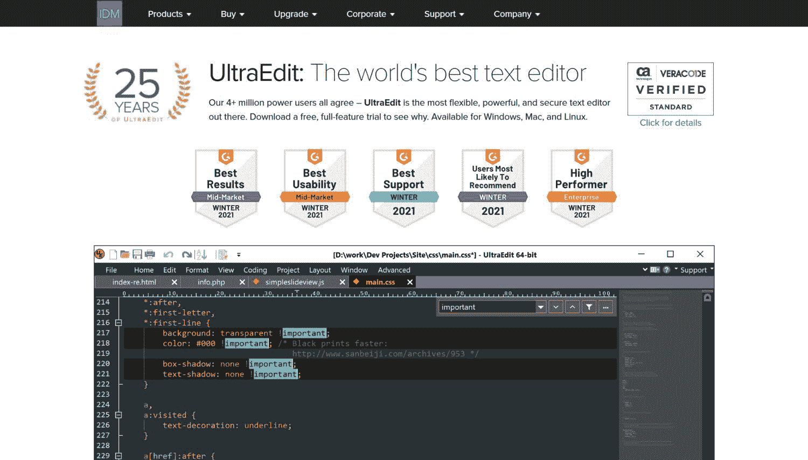

UltraEdit

*   支持的操作系统:Windows、Linux、macOS
*   价格:79.95 美元/年(最多安装 5 次)；30 天免费试用期
*   执照:[参见 EULA](https://www.ultraedit.com/license-agreement/)
*   支持的语言:HTML、CSS、Markdown、XML、JavaScript、JSON、PHP、MySQL、Python、Perl、Ruby、C、C++等等

UltraEdit 是一款优质的源代码编辑器，自 1994 年就已经上市。这是一个稳定且经过充分测试的应用程序，拥有超过 400 万用户。UltraEdit 开箱即用，具有愉快且用户友好的入职体验。除了可定制的用户界面，它还具有强大的开发人员功能，可以帮助您在云中或远程服务器上工作，备份文件，管理项目，加密/解密文件，等等。

如果您处理的文件很大，导致其他代码编辑器崩溃，UltraEdit 可能是最适合您的 PHP 编辑器，因为它具有强大的文件处理功能——这也是它如此受程序员欢迎的原因之一。除了 UltraEdit，许可证还包括 [UltraCompare Pro](https://www.ultraedit.com/products/ultracompare/) ，这是一个强大的文件比较工具，支持许多不同的文件类型，并与主要的版本控制系统集成，包括 Git、Subversion 和 CVS。

**最佳特性:**

*   自定义主题和布局
*   强大的搜索功能(在文件中或跨文件)
*   HTML 和 Markdown 的实时预览
*   强大的命令面板
*   多插入符号编辑，多选择，列模式，文件比较，可配置的标签选项，等等
*   支持远程开发的 FTP/SFTP 和 SSH/Telnet 协议
*   云同步
*   支持视网膜和其他高分辨率屏幕

### 3.快速 PHP 编辑器

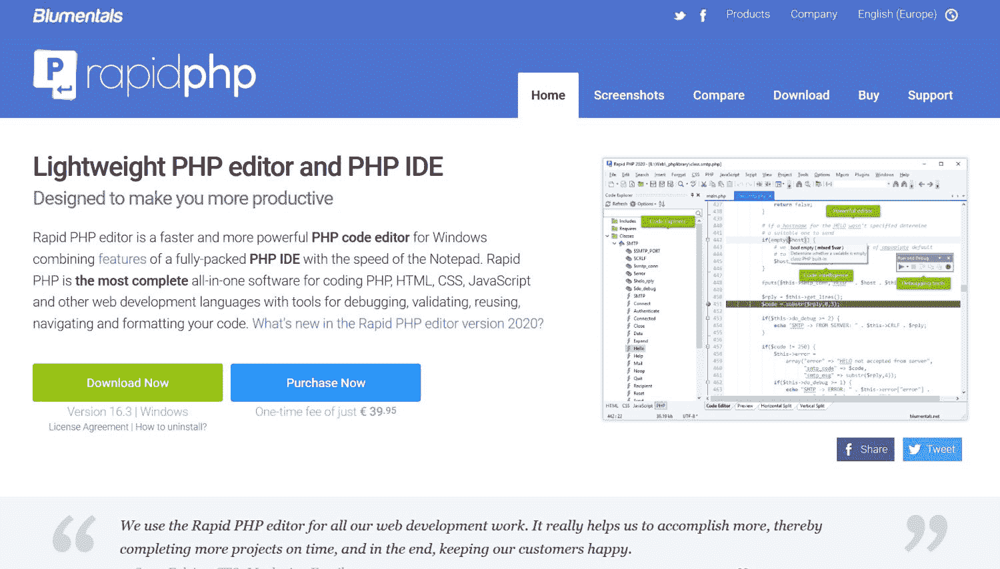

Rapid PHP Editor

*   支持的操作系统:Windows
*   价格:非商业用途 49.95 美元；69.95 美元用于商业用途；前 30 次使用是免费的(评估期)
*   执照:[参见 EULA](https://help.blumentals.net/rapidphp/eula.htm)
*   支持的语言:HTML，CSS，LESS，Sass，JavaScript，PHP，SQL，XML，Smarty，。htaccess

[Rapid PHP 编辑器](https://www.rapidphpeditor.com/)是一款针对 Windows 操作系统的商业代码编辑器。尽管它的名字中包含了“PHP”这个词，但它不仅仅是一个 PHP 编辑器，你还可以用它来编辑其他文件类型。快速 PHP 编辑器是[产品线](https://www.rapidphpeditor.com/editions.php)的一部分，该产品线的特色是具有增量特性的相同编辑器。这种设置的主要原因是尽可能保持编辑器的轻量级。例如，如果你只需要 [HTML](https://kinsta.com/blog/wordpress-vs-static-html/) 和 [CSS](https://kinsta.com/blog/wordpress-css/) ，你可以使用快速 CSS 编辑器，但是如果你还需要 PHP 支持，你可以使用快速 PHP 编辑器，它本质上是具有额外功能的相同工具。

在其主页上，Rapid PHP Editor 声称是市场上最快的 PHP 编辑器——它的加载速度确实非常快。这是一个初学者友好的编辑器，带有易于理解的 onboarding 向导，有助于初始配置(如果您愿意，也可以选择退出)。在配置过程中，您可以将 Rapid PHP 编辑器与您的[本地 web 服务器](https://kinsta.com/blog/install-wordpress-locally/)集成，这样您就可以在编辑器中预览您的 PHP 文件。

您可以配置快速 PHP 编辑器的任何方面，从设计到布局到功能。由于它包含了 HTML、CSS 和 JavaScript 的强大功能，如果您同时进行前端和后端开发，它可以显著加快您的工作流程。它也有一个友好的价格。你不必每年为许可证付费，只需一次性付费。

**最佳特性:**

*   详细的定制选项
*   内置 HTML/CSS 验证器
*   PHP 文件的预览(使用本地 web 服务器
*   实时 PHP 语法检查器
*   多浏览器预览
*   PHP 框架支持(WordPress，Laravel，CakePHP，CodeIgniter，Symfony，Yii，Nette，Prado)
*   内置 PHP 调试器( [Xdebug](https://xdebug.org/) )和 PHP beautifier
*   支持 [Smarty 模板引擎](https://www.smarty.net/)
*   SVN 和 Git 集成
*   可以直接通过 FTP/STFP/FTPS 保存文件
*   可通过插件扩展

### 4.斯莫卡洛

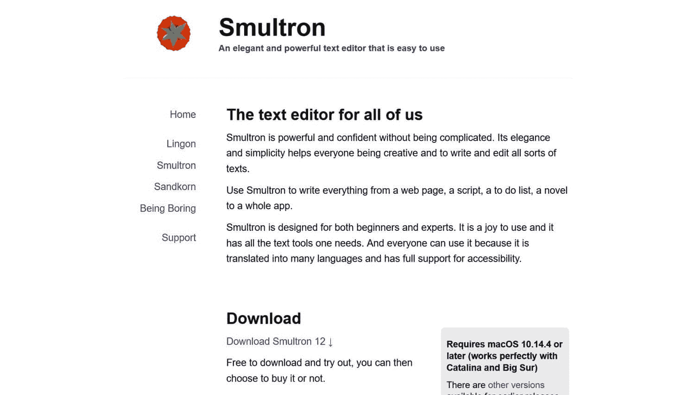

Smultron

*   支持的操作系统:macOS
*   价格:单机版许可证 7.99 美元；升级许可证 4.99 美元；免费评估
*   执照:[参见 EULA](https://www.peterborgapps.com/smultron/#eula)
*   支持的语言:HTML、Markdown、LESS、Sass、JavaScript、CoffeeScript、PHP、XML、YAML、Swift、Go、Ruby、Java、Objective-C 等等

[Smultron](https://www.peterborgapps.com/smultron/) 是一款面向 macOS 设备的商业源代码编辑器，支持多种编程语言。它的名字在瑞典语中的意思是“野生草莓”，因为它是由瑞典程序员彼得·博格开发的。像大多数 Mac 专用应用程序一样，Smultron 具有时尚的设计、直观的用户界面和快速的启动时间。

它包含了你可以从一个高级 PHP 编辑器中得到的多种特性，比如可定制的设计和按键绑定、代码片段、分割文件视图、文件比较功能、HTML 预览、自动完成等等。Smultron 的创建者[非常强调隐私](https://www.peterborgapps.com/privacy/)，所以如果你想要一个不收集任何关于你的数据的 PHP 编辑器，Smultron 是一个很好的解决方案。

你可以从 Smultron 的网站或者苹果应用商店下载 Smultron。尽管创建者对许可证收取少量费用，但您可以在购买之前免费下载和试用 Smultron。

**最佳特性:**

*   预先设计的主题
*   支持竖排文本和 RTL(从右向左)语言
*   从 iPhone/iPad 的摄像头扫描文本
*   高级编码设置(包括对 [UTF-8 BOM](https://unicode.org/faq/utf_bom.html#bom1) 的支持)
*   iCloud 支持
*   无分心模式
*   所有功能列表视图
*   支持正则表达式的高级查找和搜索功能
*   完全辅助功能支持

## 5 个最好的免费 PHP IDEs

现在，让我们来看看最好的免费 PHP IDEs，它们免费为您提供具有高级编程特性和高度可配置功能 — 的专业开发环境。

### 1.Eclipse PDT

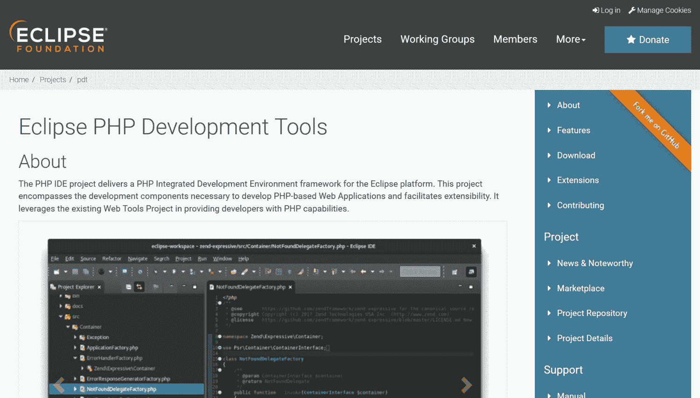

Eclipse PDT

*   支持的操作系统:Windows、Linux、macOS、Solaris
*   许可证: [Eclipse 公共许可证](https://www.eclipse.org/legal/epl-2.0/)
*   源代码:[https://github.com/eclipse/pdt](https://github.com/eclipse/pdt)
*   支持的语言:HTML，CSS，XML，JavaScript，TypeScript，PHP，Java

Eclipse 是一个流行的 Java 虚拟机集成开发环境，但是它也支持其他几种编程语言。 [Eclipse PDT](https://www.eclipse.org/pdt/) 代表 PHP 开发工具。它是 Eclipse 平台的一个插件，但是如果您的机器上没有安装 Eclipse，您也可以在安装过程中选择“Eclipse IDE for PHP Developers”选项，它会自动添加 PHP 开发工具。

使用 Eclipse PDT，您可以访问 Eclipse 的高度可配置的用户界面，并且还可以与其他 [Eclipse 插件](https://marketplace.eclipse.org/)一起使用。Eclipse PDT 使得常见的 PHP 相关任务，如调试、概要分析、测试、重构和语法检查变得更加容易和流畅。

您还可以[添加您的 web 服务器](https://www.eclipse.org/pdt/help/html/php_servers.htm)，Eclipse 将使用它来调试和分析 PHP 文件。Eclipse PDT 也支持流行的 PHP 工具，比如 Xdebug、Zend Debugger、Composer 和 PHPUnit。

注意，为了运行 Eclipse，您必须在您的计算机上安装 Java 运行时环境(JRE)或 Java 开发工具包(JDK)。

**最佳特性:**

需要超快的、安全的、开发者友好的托管？Kinsta 是为开发人员设计的，提供了大量工具和强大的仪表板。[查看我们的计划](https://kinsta.com/plans/?in-article-cta)

*   可定制的用户界面、视图和面板
*   高级 PHP 代码格式
*   PHP 项目和类向导
*   预制代码模板
*   简单的代码导航和代码格式化
*   支持远程项目
*   内容辅助、自动完成、代码导航等等
*   运行 PHP 文件的集成 web 服务器
*   Git 客户端

### 2\. Komodo IDE

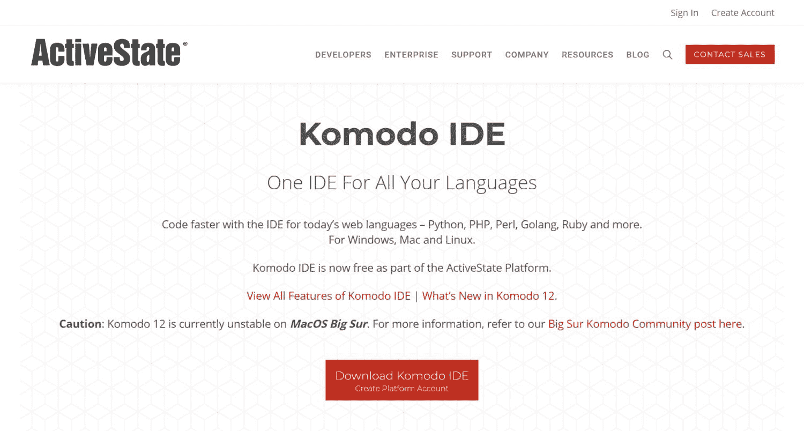

Komodo IDE

*   支持的操作系统:Windows、Linux、macOS
*   许可证: [ActiveState 社区版许可协议(pdf)](https://www.activestate.com/wp-content/uploads/2018/10/activestate_community_edition_software_license_agreement.pdf)
*   源代码:[https://github.com/Komodo/KomodoEdit](https://github.com/Komodo/KomodoEdit)
*   支持的语言:HTML、CSS、JavaScript、Node.js、PHP、Python、Perl、 [Golang](https://kinsta.com/blog/node-js-vs-golang/#what-is-golang) 、Ruby 等等

[Komodo IDE](https://www.activestate.com/products/komodo-ide/) 是 [ActiveState 平台](https://www.activestate.com/)的一部分，这是一套开源编程语言的高级开发工具。它是一个跨平台的 IDE，包括对 PHP 的支持(除了其他语言)。Komodo IDE 是 [Komodo Edit](https://www.activestate.com/products/komodo-edit/) 源代码编辑器的扩展版本——你可以使用 Komodo Edit 的所有功能，以及更多功能，比如实时预览、单元测试、依赖检测器、Chrome 调试等等。

尽管 Komodo IDE 是免费提供的，但它是一种商业产品。这意味着您可以免费使用它，直到您对社区支持满意为止。要获得专业支持，您需要注册一个 [ActiveState 定价计划](https://www.activestate.com/solutions/pricing/#pricing)，该计划可让您访问电子邮件、聊天支持和私人项目。

如果您不需要 IDE 特性，并且想要编辑和管理 PHP 文件而不必处理额外的混乱，您可以选择 [Komodo Edit](https://www.activestate.com/products/komodo-ide/downloads/edit/) ，这是一个优秀的免费开源 PHP 编辑器应用程序。

**最佳特性:**

*   自动完成、多重选择、小地图、变更跟踪、呼叫提示和其他高级编辑功能
*   代码重构、代码浏览器、可视化调试、正则表达式工具包、数据库浏览器、HTTP 检查器等等
*   码头工人和流浪者的融合
*   支持许多版本控制系统(Git、Subversion、Mercurial、CVS、Perforce 和 Bazaar)
*   入职和项目向导
*   DOM 查看器
*   实时协作
*   通过 Slack 共享
*   内置教程

### 3.Apache NetBeans

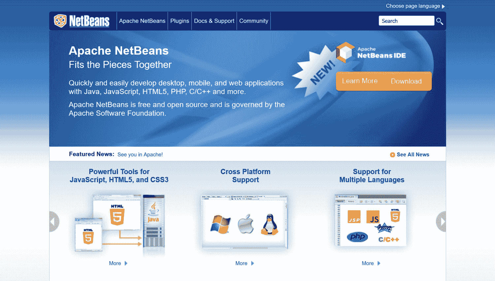

Apache NetBeans

*   支持的操作系统:Windows、Linux、macOS、BSD
*   许可证:Apache 许可证 vs 2.0
*   源代码:[https://github.com/apache/netbeans](https://github.com/apache/netbeans)
*   支持的语言:HTML、CSS、Sass、LESS、JavaScript、PHP、Java、C、C++等等

Apache NetBeans 是由 Apache 软件基金会维护的免费开源 IDE。它运行在 Java 虚拟机上(因此您需要在您的计算机上安装 Java 运行时环境)，但是它带有针对多种编程语言的扩展。它的 PHP 运行时为您提供了一个全功能的 PHP IDE，允许您运行、重构、调试和分析 PHP 应用程序——此外还有 PHP 编辑器的典型功能，如语法突出显示、可定制的主题和视图、goto 定义等等。

安装 NetBeans 时，您可以选择要添加 IDE 的哪些部分。目前有五个选项:基础 IDE、Java SE、Java EE、HTML5/JavaScript 和 PHP。如果您愿意，您可以安装所有这些，但是要将 NetBeans 用作 PHP IDE，您无论如何都需要基本 IDE 和 PHP 运行时，另外，如果您想要支持前端语言(也包括 CSS、Sass 等)，您还需要添加 HTML5/JavaScript 包。

NetBeans 是一个非常用户友好的工具。它有一个有用的入门过程，包括演示和工作 PHP 应用的样例项目:一个计算器和一个待办事项应用。另外，如果你还没有使用 IDE 进行 PHP 开发，Netbeans 有一个很棒的 [PHP 和 HTML5 学习教程](http://netbeans.apache.org/kb/docs/php/index.html)可以帮助你入门。

**最佳特性:**

*   代码格式化、代码折叠、智能代码完成、错误突出显示、智能建议和其他高级编辑功能
*   语义代码分析
*   使用 Xdebug 调试
*   使用 PHPUnit 和 Selenium 进行单元测试
*   与版本控制系统的集成(Git、Subversion、Mercurial)
*   在 [NetBeans 插件门户](http://plugins.netbeans.org/)上有 1000 多个插件可用(PHP 有 130 多个插件，还有许多通用插件，如主题)
*   支持 PHP 框架，如 WordPress、Symfony、Zend 和 Yii(找到它们作为插件)

### 4.Eclipse Che(云集成开发环境)

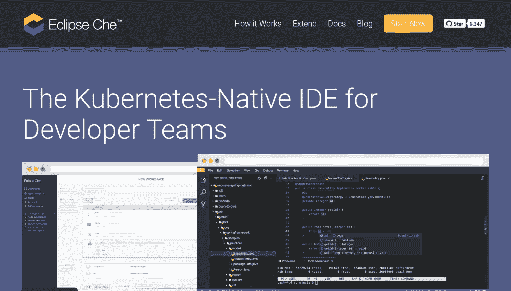

Eclipse Che

*   支持的操作系统:任何(它在网络浏览器中运行)
*   许可证:Eclipse 公共许可证 2.0
*   源代码:[https://github.com/eclipse/che](https://github.com/eclipse/che)
*   支持的语言:PHP，Java，。NET Core、ASP.NET、Go、C、C++、NodeJS、Python、Rust、Scala 等等

Eclipse Che 是一个 Kubernetes-native cloud IDE，允许开发团队在预先配置的容器化工作空间中构建应用程序。这意味着您只需设置和配置项目所需的一切(如依赖项、运行时、IDE 和项目代码)一次，就可以在任何需要的地方运行现成的开发环境。

Eclipse Che 项目始于 2014 年，是一个[Eclipse Cloud Development(ECD)](https://www.eclipse.org/ecd/)项目，可以被认为是协作开发的未来。是 [Codenvy](https://codenvy.com/) 提供了原始的代码库，但是许多科技巨头也为这个项目做出了贡献——比如 IBM、Red Hat、三星、SAP、微软、Intuit 等等。Eclipse Che 最大的特点是数百名开发人员的实时协作能力、对运行在 web 浏览器中的在线 IDE 的访问，以及对基于容器的 PHP 开发的轻松访问。

你可以在你的 Kubernetes 或者 OpenShift 集群上安装 Eclipse Che [，或者在 OpenShift 的](https://www.eclipse.org/che/docs/che-7/installation-guide/installing-che/)[基于网络的 Che 平台](https://che.openshift.io/)上创建一个在线 Che 工作区(后者你需要一个红帽账号)。在线平台有几个示例项目可供您开始使用。对于 PHP 开发，您可以在四个选项中进行选择:Laravel 与 MySQL、Symfony 与 MySQL、plain PHP 与 MySQL 以及 plain PHP 与 Apache web 服务器(没有 MySQL)。只需轻轻一点，您就可以设置您的预配置工作区，并立即开始在您的 web 浏览器中使用云 IDE。

此外，您不仅可以配置堆栈，还可以在不同的编辑器界面之间进行选择。默认的是 Eclipse 忒伊亚，但是您也可以选择 Eclipse IDE、Eclipse Dirigible、IntelliJ IDEA (Community Edition)、Jupyter Notebook 和 Visual Studio 代码的开源发行版。PHP 编辑器界面的特性将取决于您选择的 IDE。

**最佳特性:**

*   访问预建的 PHP 堆栈
*   轻便
*   使用您选择的编辑器界面
*   从任何地方添加集装箱图像(Docker Hub、Quay.io、您自己的私人注册表等)
*   设计文件模板
*   现成的示例项目
*   所有集装箱的码头通道
*   多用户协作
*   可通过插件扩展(可从 IDE 界面获得)
*   所有的 Che 服务都可以通过 REST APIs 获得

### 5.代码石

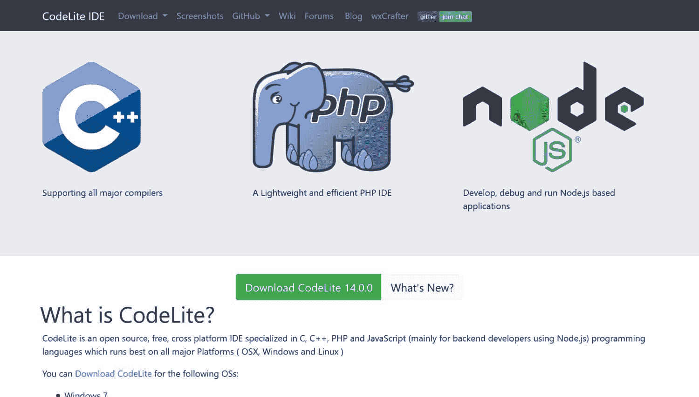

CodeLite

*   支持的操作系统:Windows、Linux、macOS、FreeBSD
*   许可证:GNU GPL vs 2
*   源代码:https://github . com/era if/code lite
*   支持的语言:HTML，JavaScript，Node.js，PHP，C，C++

CodeLite 是一个免费的开源 IDE，主要用于 C++编程语言，但它也支持 PHP 和 Node.js(作为预装插件)。它并不是你能找到的最先进的 IDE，但是它是免费的，并且带有 PHP 所有重要的 IDE 特性，比如项目和工作区管理、内置调试器(Xdebug)、不同视图的窗格、任务管理、代码完成、项目执行等等。

当您第一次启动 CodeLite 时，它会启动一个安装向导，帮助您配置 IDE 以适应您的编码风格(如果您愿意，可以选择退出)。有一个选项允许你将它定制为一个用于 web 开发的 PHP 编辑器。请注意，您可能需要手动安装一个 C++编译器(如果您的机器上还没有的话)。要记住的另一件事是，尽管 CodeLite 有一个不错的 wiki 页面，但它并不像这个列表中的大多数其他 PHP IDEs 一样有那么多教程/入门项目。

然而，如果你想要一个免费的 PHP IDE，它不在 Java 上运行，有许多配置选项，并且不需要你注册帐户，CodeLite 可能是你最好的选择。

**最佳特性:**

*   可定制的设计，有许多主题可供选择
*   强大的查找、替换和定位功能
*   PHP 林挺、重构和调试
*   PHP 类向导
*   [SFTP](https://kinsta.com/knowledgebase/how-to-use-sftp/) 与[宋承宪](https://kinsta.com/blog/ssh-commands/)客户经理一起提供支持
*   Git 集成
*   文件和文件夹的比较工具

## 4 个最佳 PHP IDEs

最后，这里是用于企业级 PHP 开发的最好的 PHP IDEs，有技术支持，大量集成，支持不同的 PHP 框架和[内容管理系统](https://kinsta.com/knowledgebase/content-management-system/)。

### 1.喷射脑疱疹

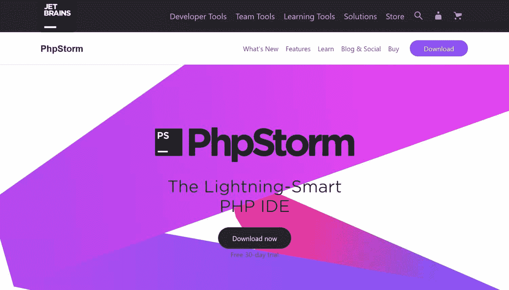

JetBrains PhpStorm

*   支持的操作系统:Windows、Linux、macOS
*   价格:第一年 89 美元，第二年 71 美元，第三年起个人使用 53 美元，按年计费(商业使用 199-159-119 美元)；自由/开源软件的免费许可程序；30 天免费试用
*   许可证:[参见 EULA](https://sales.jetbrains.com/hc/en-gb/articles/115001015290-Where-can-I-find-the-EULA-End-User-License-Agreement-)
*   支持的语言:HTML，CSS，Sass，LESS，Markdown，JavaScript，Node.js，React， [Vue](https://kinsta.com/blog/vue-js/) ，Angular，TypeScript，PHP，MySQL，XML，XSLT 等等

JetBrains PHPStorm 以“闪电智能 PHP IDE”为特色，它确实提供了与大多数其他 PHP IDE 不同的用户体验。它有一个简洁的用户界面和快速的启动时间——它的启动速度和没有任何 IDE 特性的简单 PHP 编辑器一样快。

在 PHPStorm 中，你只有在需要的时候才能看到一切。在第一次启动时，您将看到一个非常简单的视图，其中包含配置设置和启动新项目的三个选项。顶部菜单栏只有在您启动新项目时才可见。然后，你可以为许多东西(收藏夹、结构、待办事项、问题、终端、事件日志、数据库、调试等等)添加额外的窗口，但所有这些都是可选的，并且易于来回切换。

PHPStorm 最好的一点是它捆绑了 JetBrains 的 JavaScript IDE[WebStorm](https://www.jetbrains.com/webstorm/)。因此，如果你既做前端开发又做后端开发，并且需要 JavaScript 和 PHP IDE 的，这可能是你最好的选择。PHPStorm 还集成了 Composer 包管理器，因此您可以直接从 IDE 中管理您的依赖项。另外，它支持三种最流行的 PHP 内容管理系统:WordPress、Drupal 和 Joomla。

**最佳特性:**

*   无需创建项目即可进行试验的草稿文件
*   即时错误预防
*   优先考虑编码问题
*   HTML5 大纲视图
*   在不同的 PHP 版本之间轻松切换(对遗留项目有好处)
*   高级重构
*   使用其零配置可视化调试器进行调试(也支持 Xdebug 和 Zend 调试器)
*   与版本控制系统集成(Git、Mercurial、Subversion)
*   支持测试驱动开发(PHPUnit)和行为驱动开发(Behat)
*   支持所有主要的 PHP 框架(Laravel、CakePHP、Magento、Yii、Zend Framework、WordPress 等等)

### 2.Zend 工作室

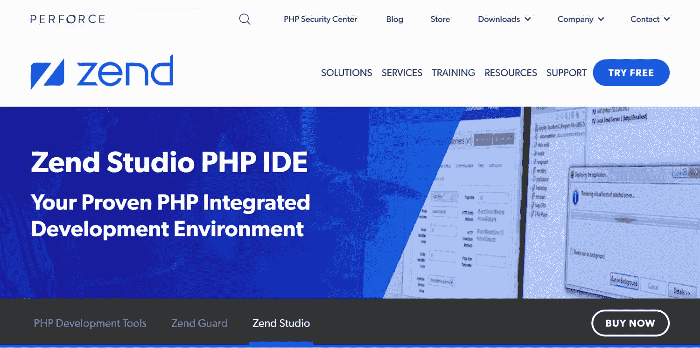

Zend Studio

*   支持的操作系统:Windows、Linux、macOS、IBM i
*   价格:个人使用 89 美元，专业使用 189 美元(均为永久许可，1 年免费升级)；30 天免费试用
*   许可证: [Zend Studio 许可证(pdf)](https://www.zend.com/sites/zend/files/pdfs/datasheet-zend-studio-comparison-chart.pdf)
*   支持的语言:HTML，CSS，Sass，LESS，Markdown，JavaScript，PHP

[Zend Studio](https://www.zend.com/products/zend-studio) 是一款由“Zend by Perforce”开发的商业 PHP IDE，这是一家专注于企业级 PHP 解决方案的公司。它基于 Eclipse PDT IDE(见上文)；你可以单独安装它，也可以通过 Eclipse Marketplace 将[作为 Eclipse 插件](https://help.zend.com/zendstudio/Zend-Studio/content/installing_zend_studio_as_a_plugin.htm)安装。Zend Studio 为免费的 Eclipse PHP 开发工具添加了许多企业级特性。

它与 Zend 的其他产品无缝集成，即 Zend Server、Zend Debugger、Zend Guard、Laminas Framework ( [原名 Zend Framework](https://framework.zend.com/blog/2019-04-17-announcing-laminas.html) )和 Laminas API Tools ( [原名 Apigility](https://www.apigility.org/) )。然而，您并不局限于 Zend 生态系统，因为 Zend Studio 还支持许多其他框架、调试器、web 服务器和工具。

尽管 Eclipse PDT 已经有了一个高级的 PHP 编辑器接口，但 Zend Studio 对其进行了进一步的扩展，增加了 PHP 特有的功能，如增强的代码辅助、不同关系数据库管理系统(MySQL、MSSQL、 [PostgreSQL](https://kinsta.com/knowledgebase/what-is-postgresql/) 、SQLite、Oracle 等)的数据库视图、内置的云部署(公共云和私有云)等等。

**最佳特性:**

*   PHP 智能代码助手
*   自动化模块创建
*   Zend Debugger(默认)、Xdebug 或 Z-Ray 的高级调试选项
*   Docker 对容器化 PHP 应用程序的支持
*   与版本控制系统(SVN、CVS、Git)和 Composer 集成
*   支持 4K 和 HiDPi 显示器
*   对主要云平台的支持([微软 Azure](https://kinsta.com/azure-market-share/) 、[亚马逊 AWS](https://kinsta.com/aws-market-share/) 、红帽 OpenShift、IBM Cloud 等)
*   几个教程、视频和 PHP 模板

### 3.Codeanywhere(云 IDE)

Codeanywhere

*   支持的操作系统:任何网络浏览器、iOS、Android
*   价格:2.50 美元/月起；7 天免费试用
*   许可证:[见 TOS](https://codeanywhere.com/tos)
*   支持的语言:HTML、CSS、Sass、LESS、Markdown、JavaScript、TypeScript、Node.js、PHP、Ruby、Python、Go、Ruby、Java 等等

Codeanywhere 是一个平台无关的云 IDE，你可以在网络浏览器中使用它，也可以将其作为一个移动应用程序使用。该项目最初是一个名为 PHPanywhere 的基于 web 的 PHP 编辑器和 FTP 客户端，但现在它支持 100 多种编程语言。它基于 [CodeMirror](https://github.com/codemirror/CodeMirror) ，这是一个开源的浏览器原生源代码编辑器，也可以处理大型文档(超过 20 万行)。

有了 Codeanywhere，你要么在一个 [OpenVZ](https://openvz.org/) 容器(称为 DevBoxes)中运行你的编码环境，要么连接到你自己的服务器或第三方服务，比如 [GitHub](https://kinsta.com/knowledgebase/what-is-github/) 、 [Bitbucket](https://kinsta.com/blog/bitbucket-vs-github/) 、[亚马逊 S3](https://kinsta.com/knowledgebase/wordpress-amazon-s3/) 、 [Google Drive](https://kinsta.com/blog/google-workspace/#google-drive) 、 [DigitalOcean](https://kinsta.com/digitalocean-alternative/) 等等。Codeanywhere IDE 将在几秒钟后在 web 浏览器中启动，但是，您必须等待大约半分钟才能创建容器。

Codeanywhere 为您提供了一个连接向导，您可以在不同的堆栈之间进行选择，包括两个 LAMP 堆栈(Ubuntu 和 CentOS)，这两个堆栈都添加了 phpMyAdmin 和 Composer。你也可以选择在预装 WordPress 和 WordPress CLI 的情况下启动这些 PHP 堆栈。或者，您也可以使用自己的自定义堆栈。使用 Codeanywhere，您可以在任何 web 浏览器上通过 HTTP 和 HTTPS 协议对您的 PHP 应用程序进行现场测试。

**最佳特性:**

*   预配置的 PHP 和 WordPress 堆栈
*   具有 sudo (root)访问权限的内置 Linux 终端
*   智能代码编辑特性，如代码重构、自动完成、定位定义、小地图等
*   支持 FTP、SFTP、FTPS 和 SSH 协议
*   共享文件上的实时配对编程
*   Git 集成(通过终端)
*   无分心模式
*   多个布局选项(单个、网格、列、行、垂直拆分和水平拆分视图)
*   集成调试器
*   一键代码美化器
*   浏览器预览

### 4.代码龙虾

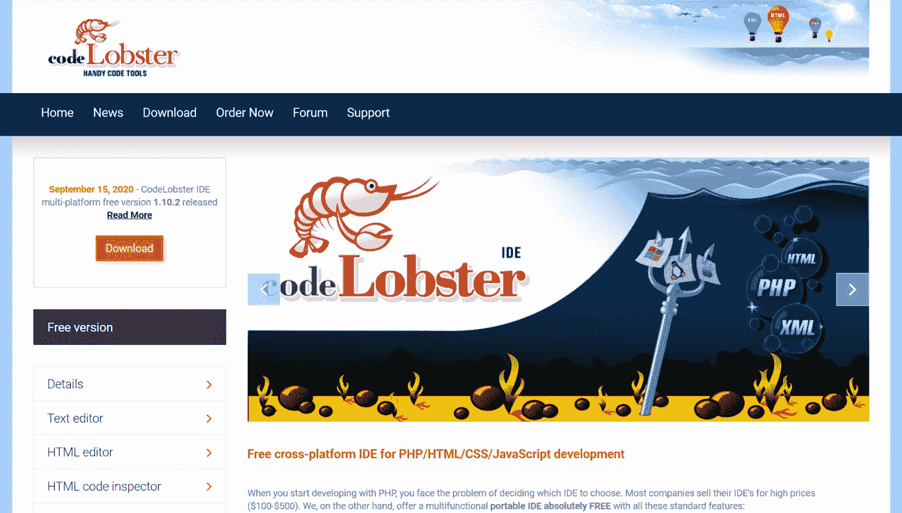

Codelobster

*   支持的操作系统:Windows、Linux、macOS
*   价格:第一年 59.95 美元(最多三个设备)；随后几年 19.95 美元/年；30 天免费试用
*   执照:[参见 EULA](https://codelobster-ide.soft112.com/eula.html)
*   支持的语言:HTML，XML，CSS，Sass，LESS，JavaScript，TypeScript，Node.js，PHP，SQL

Codelobster 是一个免费的 PHP 编辑器和 IDE，也支持前端语言。支持 HTML、CSS、JavaScript 和 PHP 的代码编辑器部分是免费的，而 IDE 功能和对 Sass、LESS、Node.js 和 SQL 语法的支持是有代价的。

Codelobster 有一个相当复杂的用户界面，默认情况下，您可以看到所有可用的功能、面板和菜单，即使您可以隐藏不需要的面板。免费的 PHP 编辑器提供了编写 PHP 代码所需的所有特性，包括语法高亮、自动完成、上下文帮助和调试功能。

Codelobster IDE 最大的特点是它支持的 PHP(和 JavaScript)数量。它有插件用于 [WordPress](https://kinsta.com/wordpress-market-share/) 、 [Laravel](https://kinsta.com/blog/laravel-tutorial/) 、 [Joomla](https://kinsta.com/blog/joomla-vs-wordpress/) 、 [Drupal](https://kinsta.com/blog/wordpress-vs-drupal/) 、CakePHP、Symfony、Yii、CodeIgniter、Phalcon 等等。另外，它还支持 Twig 和 Smarty 模板引擎。为了帮助你管理你的插件，Codelobster 包括一个易于使用的插件管理器，你可以在同一个地方看到所有可用和激活的插件。

如果你是一个 WordPress 开发者并且正在寻找一个 WordPress IDE，Codelobster 会是一个很好的解决方案。 [Codelobster 的 WordPress 插件](http://www.codelobster.com/wordpress.html)为你提供了高级功能，比如 WordPress 语法高亮和自动完成、WordPress 功能的工具提示、为主题开发者提供的内置 WordPress 主题编辑器、WordPress 项目设置向导等等。

**最佳特性:**

*   HTML/CSS 代码检查器(免费版)
*   内置 PHP 调试器(免费版)
*   预先设计的主题(免费版)
*   HTML、CSS 和 PHP 的代码验证
*   预先编写的代码片段和代码模板
*   HTML 到 PHP 和 PHP 到 HTML 的转换
*   SQL 管理器(数据编辑、导出向导、自动完成等)
*   [FTP/SFTP](https://kinsta.com/knowledgebase/ftp-vs-sftp/) 客户端
*   支持版本控制(Git、SVN、Mercurial)

[Want to write high-quality PHP code? ✨ Then you need a high-quality PHP editor. Check out the options here to get started ✅Click to Tweet](https://twitter.com/intent/tweet?url=https%3A%2F%2Fbit.ly%2F2MnkDrX&via=kinsta&text=Want+to+write+high-quality+PHP+code%3F+%E2%9C%A8+Then+you+need+a+high-quality+PHP+editor.+Check+out+the+options+here+to+get+started+%E2%9C%85&hashtags=PHP%2CCoding)

## 摘要

在本指南中，我们详细介绍了最好的 PHP 编辑器和 ide——包括免费的和高级的。

如果你已经设法找到了一个你喜欢的，或者有一个对你来说很重要的特性或集成，你已经知道该选择哪个了。但是，如果您对哪个 PHP 编辑器或 IDE 最适合您还有任何疑问或疑问，这里有一些建议:

*   如果你是一个初学者，或者不经常编辑 PHP 文件，或者不想在配置上花太多时间，可以使用免费的 PHP 编辑器，但不要使用 Emacs 或 Vim。
*   反过来，如果你想获得[死忠程序员](https://kinsta.com/blog/php-developer-salary/)的尊重，并且不介意陡峭的学习曲线，不妨试试 Vim 或者 Emacs。
*   如果你想要一个巨大的生态系统，选择一个带有市场或插件/包存储库的 PHP 编辑器或 IDE，如 Visual Studio 代码、Atom、Sublime Text 3、Apache NetBeans 或 Eclipse。
*   如果你关心启动时间并希望你的 PHP 编辑器加载速度快，选择一个特定于一个操作系统的，例如 Windows 的 NotePad++或 RJ TextEd 或 Mac 的 TextMate 或 Smultron。
*   如果你已经使用了这些源代码编辑器或者 ide 和另一种编程语言，并且喜欢它，看看它是如何编辑 PHP 文件的。
*   如果你需要特定框架或工具的支持，找一个有插件或集成的 PHP 编辑器或 IDE。
*   如果您需要一个内置的 web 服务器，想要查看堆栈跟踪，或者执行其他复杂的任务，请使用 PHP IDE。
*   如果您想在 web 浏览器中工作，并从任何地方访问您的 PHP 项目，请选择云 IDE。

您也可以为不同类型的项目安装多个编辑器。例如，您可以使用轻量级、快速加载的 PHP 编辑器来快速查看文件，但使用功能丰富的 PHP IDE 来开发、测试和调试更复杂的应用程序。

找到最好的开发工具是一个反复试验的过程，类似于编程本身。所以不要犹豫太多，只要安装一个有你需要的功能，如果你不喜欢它，你可以测试下一个，直到你找到最适合你的 PHP 编辑器。

* * *

让你所有的[应用程序](https://kinsta.com/application-hosting/)、[数据库](https://kinsta.com/database-hosting/)和 [WordPress 网站](https://kinsta.com/wordpress-hosting/)在线并在一个屋檐下。我们功能丰富的高性能云平台包括:

*   在 MyKinsta 仪表盘中轻松设置和管理
*   24/7 专家支持
*   最好的谷歌云平台硬件和网络，由 Kubernetes 提供最大的可扩展性
*   面向速度和安全性的企业级 Cloudflare 集成
*   全球受众覆盖全球多达 35 个数据中心和 275 多个 pop

在第一个月使用托管的[应用程序或托管](https://kinsta.com/application-hosting/)的[数据库，您可以享受 20 美元的优惠，亲自测试一下。探索我们的](https://kinsta.com/database-hosting/)[计划](https://kinsta.com/plans/)或[与销售人员交谈](https://kinsta.com/contact-us/)以找到最适合您的方式。