# 如何关闭推送通知(Windows/Mac、iOS/Android、所有浏览器等)

> 原文：<https://kinsta.com/blog/turn-off-push-notifications/>

推送通知是一个非常有用的功能。他们帮助通知你关于更新和[提供](https://kinsta.com/blog/ecommerce-strategies/)的信息，并几乎即时提供关键信息。然而，在您的所有设备上处理大量弹出消息可能会让人不堪重负。

幸运的是，你可以定制和管理在你的设备和浏览器上看到的推送通知。

在本文中，我们将向您展示如何在大多数主流操作系统(OS)和 web 浏览器中关闭发布通知。我们开始吧！

[Tired of dealing with non-stop pop-up messages across your devices? 💥 Read this👇Click to Tweet](https://twitter.com/intent/tweet?url=https%3A%2F%2Fbit.ly%2F2XHQlm3&via=kinsta&text=Tired+of+dealing+with+non-stop+pop-up+messages+across+your+devices%3F+%F0%9F%92%A5+Read+this%F0%9F%91%87&hashtags=iOS%2CPushNotifications)

### 更喜欢看[视频版](https://www.youtube.com/watch?v=9QXUGUI_TrM)？

## 什么是推送通知？

推送通知是弹出消息，显示在您的设备上以提供快速通知。例如，在移动设备上，当您收到短信或某个应用程序需要您的关注时，推送通知就会出现:

> 需要在这里大声喊出来。Kinsta 太神奇了，我用它做我的个人网站。支持是迅速和杰出的，他们的服务器是 WordPress 最快的。
> 
> <footer class="wp-block-kinsta-client-quote__footer">
> 
> 
> 
> <cite class="wp-block-kinsta-client-quote__cite">Phillip Stemann</cite></footer>

[View plans](https://kinsta.com/plans/)

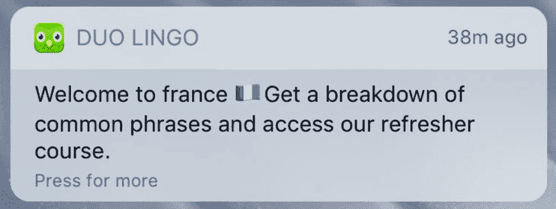

An example of a push notification on iOS

推送通知不仅限于移动设备。如果您使用 Windows 或 macOS 电脑，您也会经常看到这些元素。一些例子包括:

*   软件更新通知
*   来自 web 浏览器的通知
*   新电子邮件提醒

理解这一点很重要，在大多数情况下，推送通知以两种方式工作。有些可以在操作系统级别配置和禁用，有些则基于应用程序对应用程序进行操作。

例如，有些网站会询问您是否希望通过浏览器接收[推送通知:](https://kinsta.com/blog/wordpress-push-notifications/)

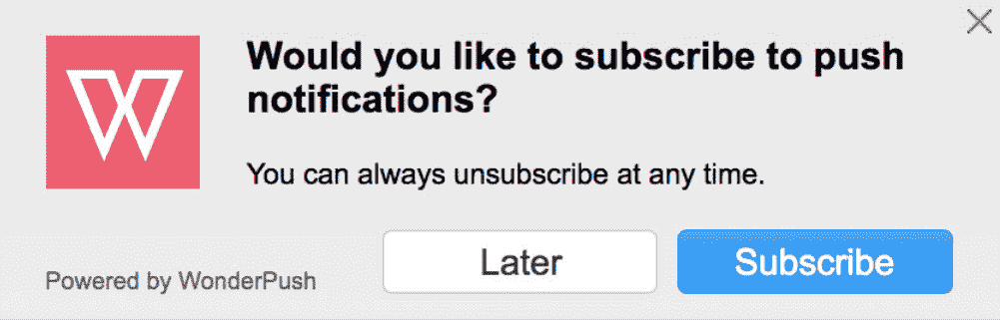

An example of a website push notification request

在接下来的几节中，我们将从两个角度向您展示如何禁用推送通知，涵盖每个[主流浏览器](https://kinsta.com/browser-market-share/)和操作系统。
T3】

## 如何在操作系统级别关闭推送通知

下面，我们将带你了解如何关闭 Windows 10、macOS、Android 和 iOS 的发布通知。先说 Windows。

### 如何在 Windows 10 上关闭推送通知

Windows 允许您完全禁用推送通知，暂时将其静音，或针对特定应用将其关闭。要进入 Windows 的通知设置，打开**开始** 菜单，进入**设置>系统>通知&动作**。

要完全禁用通知，请关闭选项*获取来自应用程序和其他发件人的通知*:

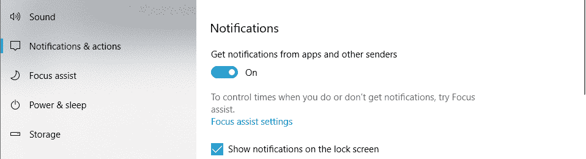

Windows 10 push notification settings

由于推送通知可能包含重要信息，您可能希望仅禁用特定应用程序的通知(那些您往往会忽略的应用程序)。

为此，向下滚动，直到到达*从这些发件人设置中获取通知*部分。在那里，您可以关闭每个已安装应用程序的推送通知:

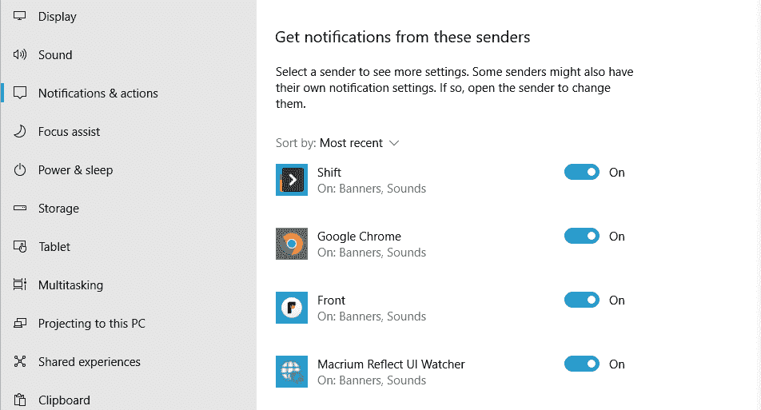

Disabling notifications for individual apps in Windows

最后，Windows 包括一个名为“焦点助手”的功能，它可以让你选择暂时禁用或静音推送通知。

要使用对焦辅助，点击*通知* 选项下的**对焦辅助设置** 。在下一个屏幕上，您将能够决定要禁用哪些通知以及该功能何时发挥作用:

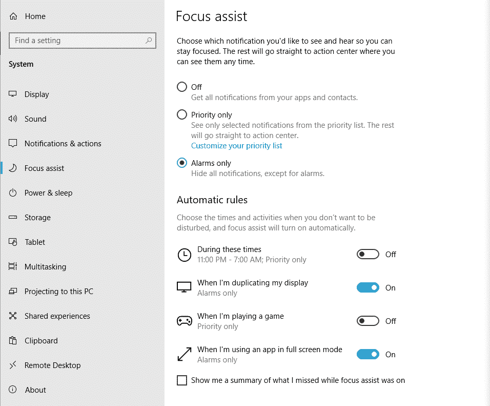

Windows focus assist’s settings

总的来说，Windows 为您提供了大量管理推送通知的选项。关键是要弄清楚哪些应用程序值得接收警报，哪些应用程序只会分散注意力。

### 如何在 macOS 上禁用推送通知

如果您使用 macOS，您可以暂停或停用通知，这取决于您的偏好设置。要停止所有通知，打开苹果菜单，进入**系统偏好设置>通知**。

你将看到可以向你发送通知的所有应用的列表，你可以禁用每个单独项目的权限:

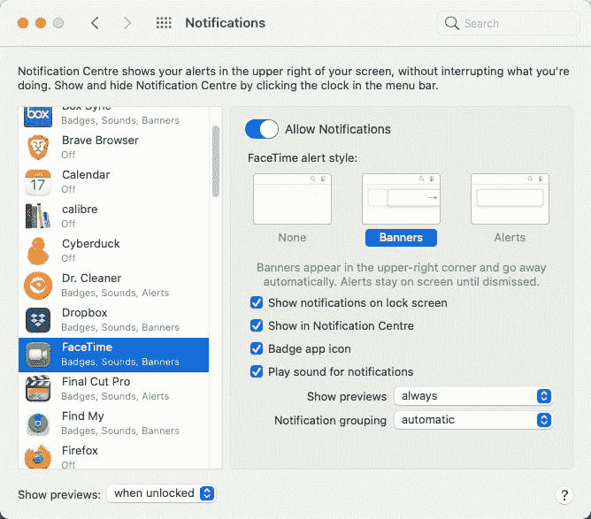

Notification settings in macOS

要暂停通知，您可以在同一个*通知* 窗口下，启用左边的**勿扰** 设置:

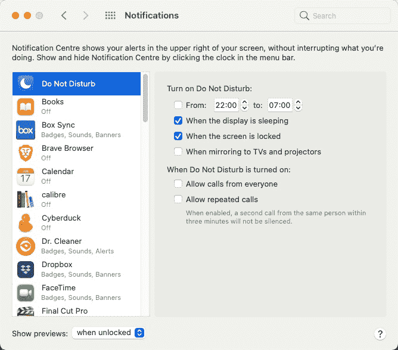

The Do Not Disturb macOS notification settings

当**请勿打扰**设置打开时，通知不会中断您的工作。要访问它们，你需要打开**通知中心**。

这是它们累积的地方，直到您取消暂停通知。

### 如何在 iOS (iPhone 和 iPad)上禁用推送通知

iOS 允许您完全停用推送通知，或者针对单个应用程序关闭它们。

要访问 iOS 通知设置，进入**设置>通知***T3】菜单。*

在菜单的顶部，你会看到**显示预览** **s** 选项*。*设置为**从不** 将关闭所有推送通知:

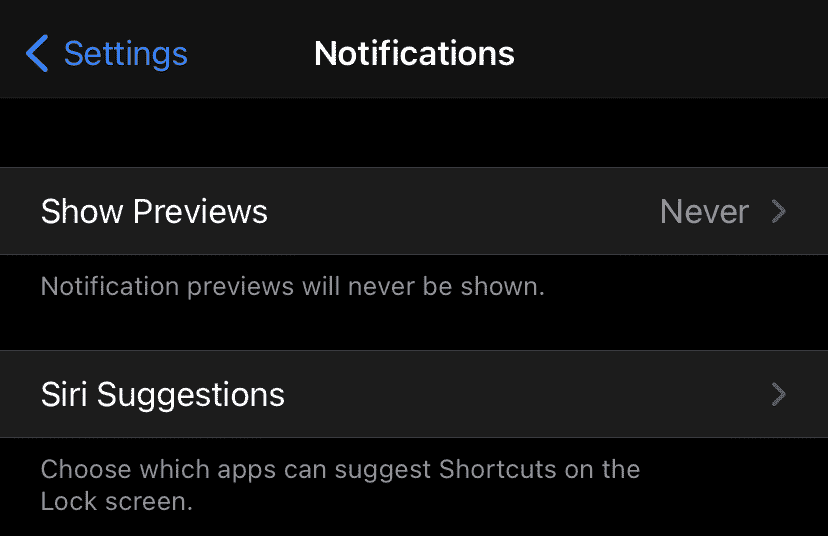

Notifications menu in iOS

如果您只想禁用特定应用程序的通知，请不要更改之前的设置。相反，向下滚动到**通知** 菜单，然后点击某个应用程序:

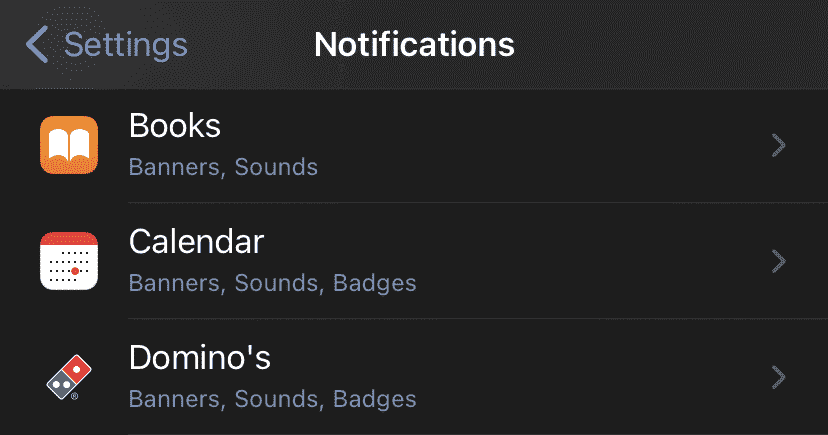

App notification menu in iOS

从该列表中，您可以配置每个应用程序的通知设置或禁用它们。这项功能可以方便地过滤掉你不感兴趣的邮件。

### 如何在 Android 上禁用推送通知

你可以通过进入**设置>通知** 选项来禁用 Android 上的推送通知。与 iOS 类似，Android 允许你关闭单个应用的推送通知，或者使用“请勿打扰”模式。

要禁用特定应用的通知，向下滚动到*最近发送的*菜单，并按下下方的**更多***T5】按钮:*

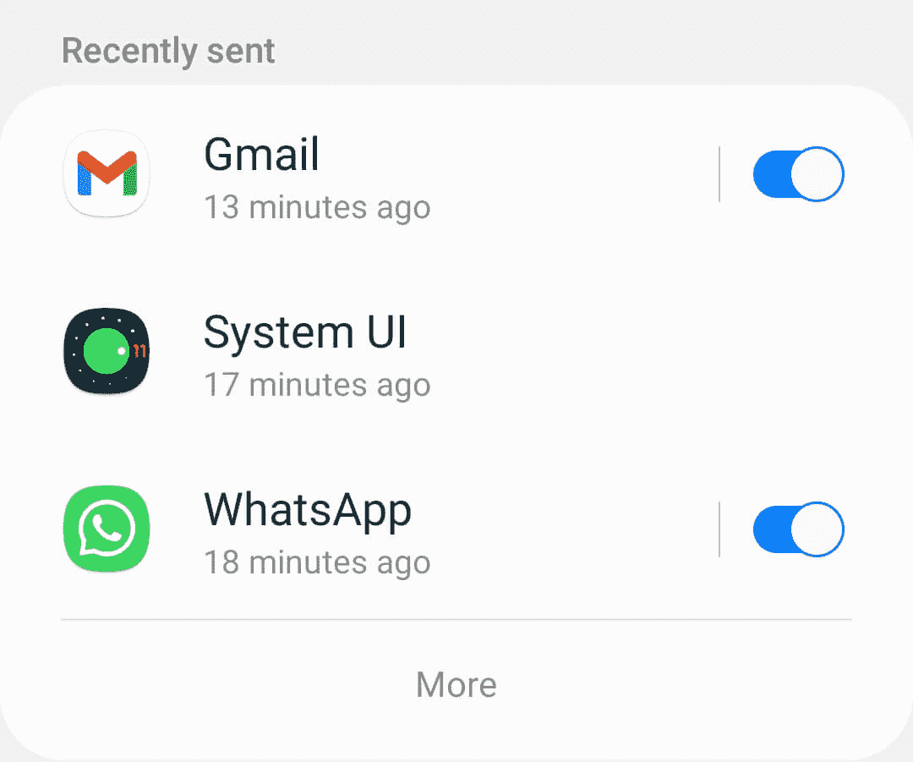

Android’s app notifications settings screen

在下一个屏幕上，您可以使用右侧的按钮来关闭任何应用程序的通知:

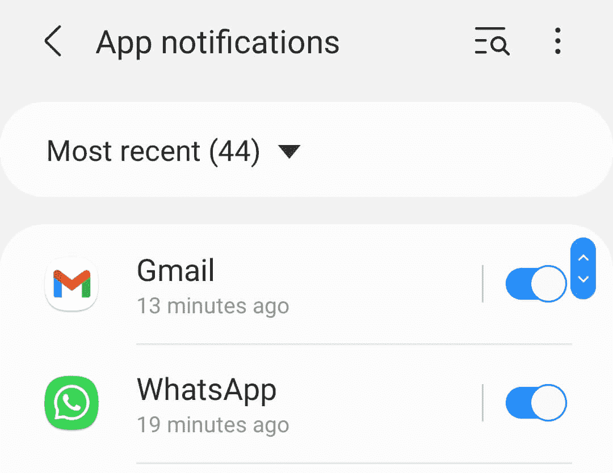

Turning off individual app notifications in Android

要在 Android 中启用免打扰模式，请返回到*通知*屏幕，找到位于底部的**免打扰** 按钮。在下一个屏幕上，您可以打开*免打扰*设置，并配置持续时间:

## 注册订阅时事通讯

### 想知道我们是怎么让流量增长超过 1000%的吗？

加入 20，000 多名获得我们每周时事通讯和内部消息的人的行列吧！

[Subscribe Now](#newsletter)

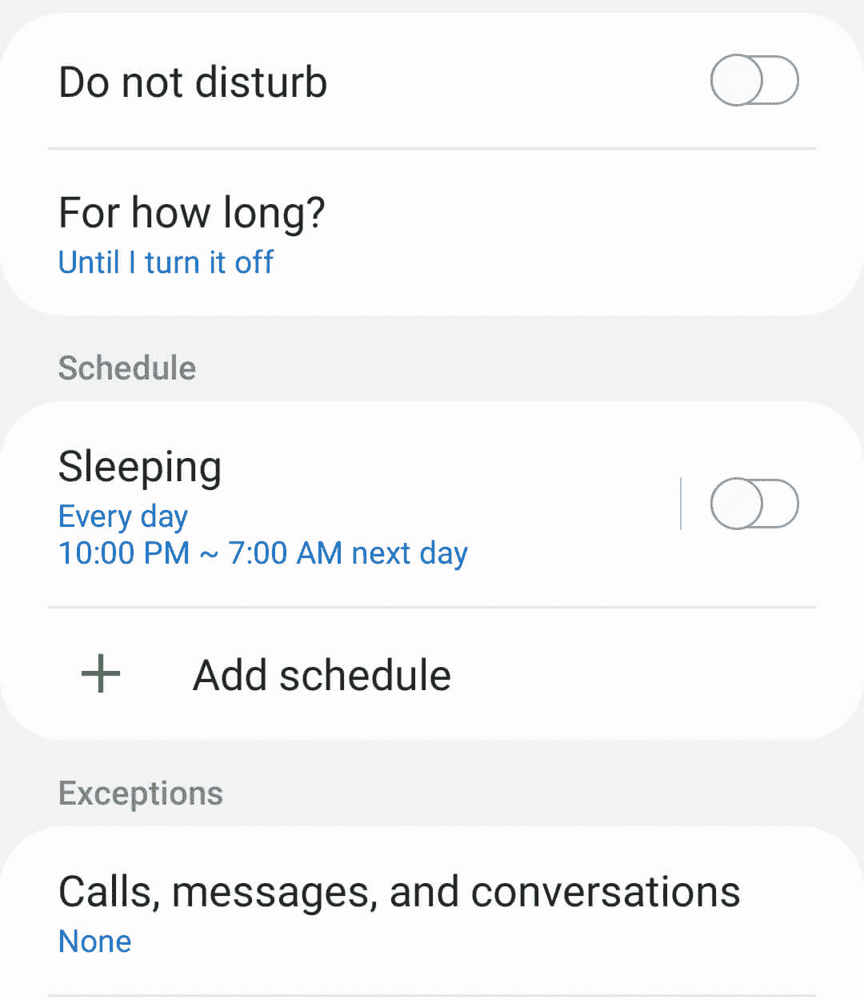

*安卓的勿扰模式。*

该屏幕还包括用于配置免打扰规则例外的选项。例如，您可以让某些应用程序的通知仍然显示在您的屏幕上。

## 如何关闭 Web 浏览器的推送通知

在本节中，我们将向您展示如何关闭谷歌浏览器、Safari 浏览器、Mozilla Firefox 浏览器和微软 Edge 浏览器的推送通知。先说 Chrome。

### 如何在谷歌浏览器中关闭推送通知

如果你使用 Chrome，你可以阻止网站请求许可发送推送通知，这实质上是完全禁用它们。浏览器还可以让你[屏蔽特定网站的通知](https://kinsta.com/blog/how-to-block-a-website-on-chrome/)。

要访问这些设置，进入**设置>隐私和安全**、*T3】并选择**站点设置**选项:*

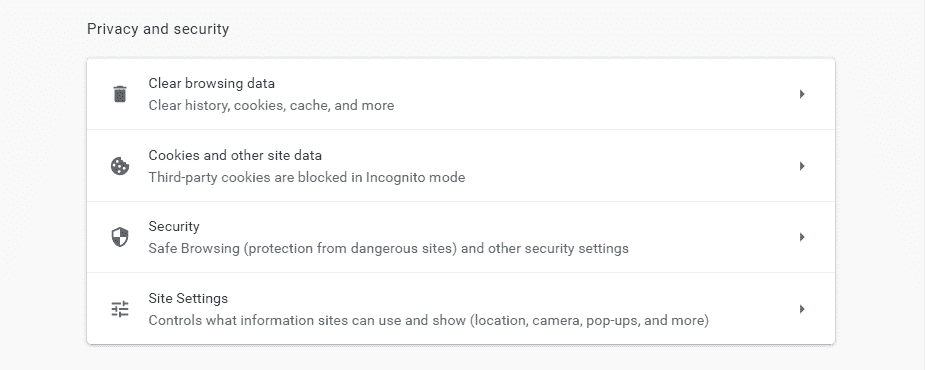

Chrome’s privacy settings menu

在下一个屏幕上，在*权限*设置下，点击**通知**:

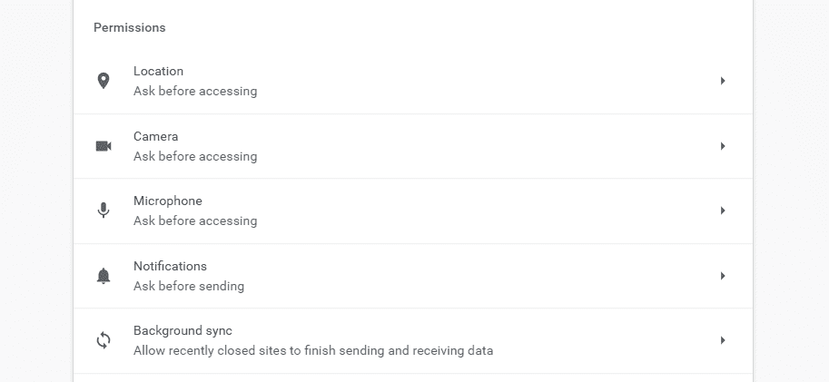

Configuring Chrome’s permission settings for push notifications

要关闭所有通知，禁用选项，即*站点可以要求发送通知*。这将阻止网站向您显示发送推送通知的请求:

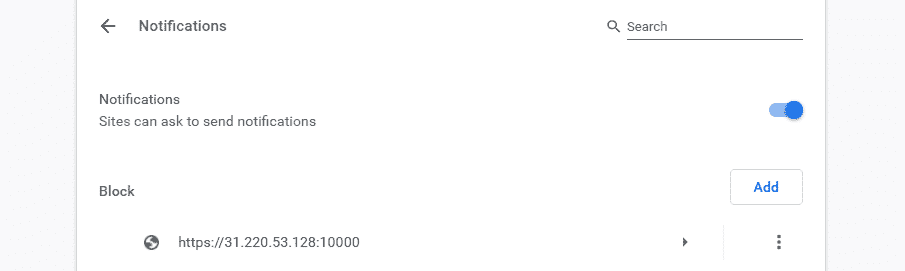

Disabling push notifications in Chrome

如果你点击**添加** 按钮，Chrome 会让你输入特定的[网址](https://kinsta.com/knowledgebase/what-is-a-url/)来屏蔽通知。白名单网站也有相应的设置，你可以滚动到屏幕底部:

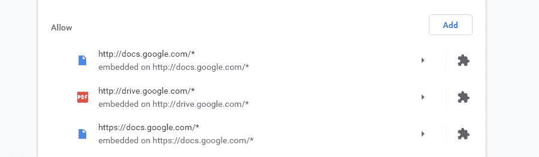

Whitelisting websites for push notifications in Chrome

通过结合所有三种设置，您可以使网站无法向您发送分散注意力的权限请求。您还可以将您希望看到通知的 URL 列入白名单。

### 如何在 Safari 中关闭推送通知

在 Safari 中禁用推送通知相当简单。为此，请在浏览器中访问**偏好设置网站>通知***T3】设置。登录后，您将看到一个列表，其中列出了请求向您发送推送通知的网站:*

与宕机和 WordPress 问题做斗争？Kinsta 是一款考虑到性能和安全性的托管解决方案！[查看我们的计划](https://kinsta.com/plans/?in-article-cta)

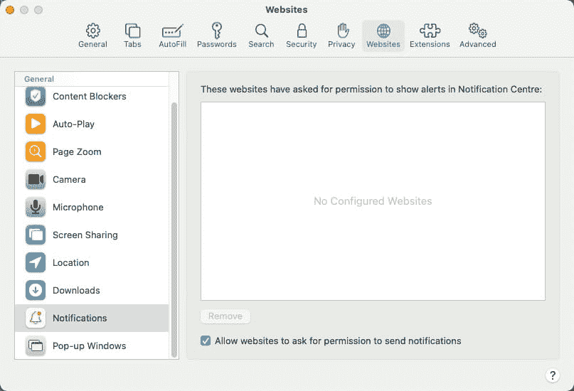

Push notification settings Safari

您可以通过该列表禁止来自特定网站的通知，反之亦然。你还会注意到在*通知*窗口的底部有一个选项，写着*允许网站请求发送推送通知*的许可。

关闭该选项将阻止站点请求向您发送通知的权限。

### 如何在 Mozilla Firefox 中关闭推送通知

有了 Firefox，你可以阻止网站向你发送推送通知，白名单例外，并暂时禁用所有这些。

要访问火狐的通知设置，导航到**选项>隐私&安全**，在*权限*下寻找*通知*选项:

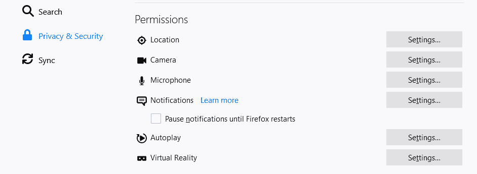

Accessing Firefox’s permissions settings

要禁用推送通知直到你重启浏览器，勾选选项*暂停通知直到 Firefox 重启*。

要对弹出警报和消息进行更多控制，请单击*通知*选项右侧的**设置** 按钮。将会打开一个窗口，列出所有请求向您发送推送通知的网站:

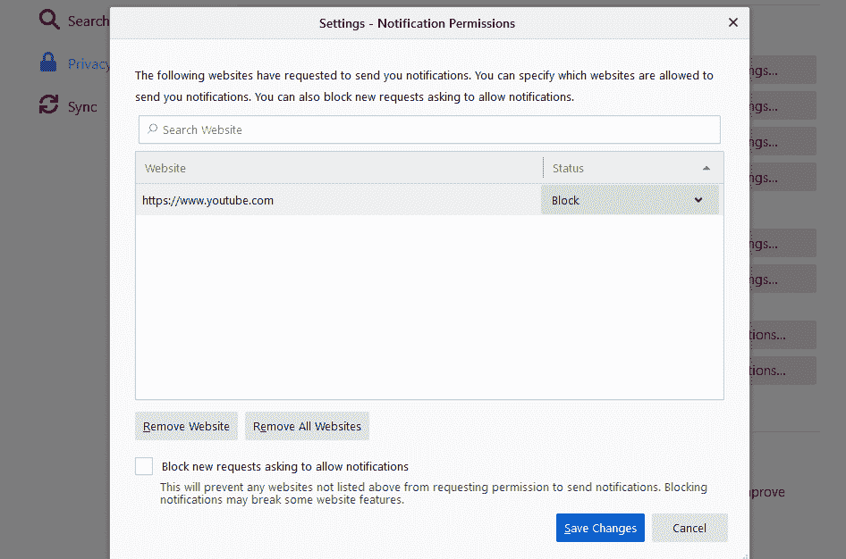

Disabling push notifications in Firefox

对于每个网站，您可以选择是阻止还是允许通知。还可以选择从列表中删除单个站点，或者将其完全清除。

最后，Firefox 允许您通过启用位于窗口底部的的*阻止新请求请求允许通知*功能来阻止新的推送通知请求。

### 如何在 Microsoft Edge 中关闭推送通知

与大多数其他浏览器一样，Microsoft Edge 提供了多种方法来禁用、阻止和加入白名单通知。该浏览器还包括一个名为*安静通知*的功能，它将所有推送通知捆绑在一个图标下，这样它们就不会打断你。您可以随时查看它们。

要访问 Edge 的通知设置，请转到**设置**>**cookie 和站点权限、** ，然后选择**通知** 选项:

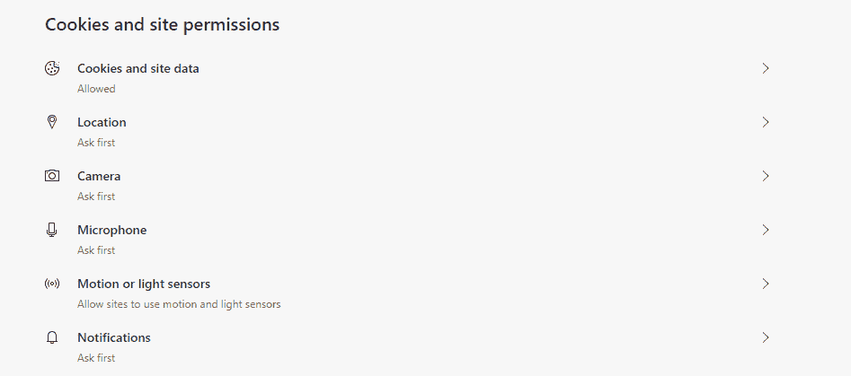

Microsoft Edge’s cookies and site permissions settings

在下一个屏幕上，如果您想完全关闭 Edge 中的推送通知，请禁用发送前询问*选项。*

如果您想阻止或允许某些网站，您可以点击每个设置旁边的**添加**按钮:

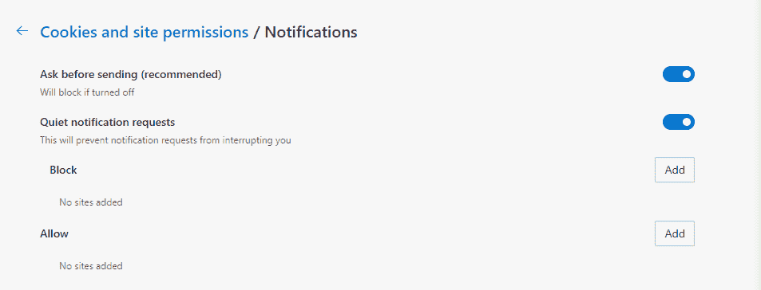

Disabling push notifications in Edge

您还会注意到*安静通知请求*选项，该选项在默认情况下是打开的。启用该设置后，当您使用浏览器时，通知不会打扰您。
T3】

## 如何在脸书关闭推送通知

虽然脸书既不是操作系统也不是网页浏览器，但它是世界上最受欢迎的社交媒体平台之一。因此，我们收到了很多关于如何禁用推送通知的问题，以便提醒不会中断您的浏览体验。

要访问脸书的推送通知设置，进入**设置&隐私>设置>通知**。您将可以访问脸书可以发送的所有通知类型的列表，并且可以选择要禁用的类型:

Facebook’s notifications settings

请记住，脸书使用几种通知类型。对于列表中的每个选项，您可以关闭不同渠道的通知，包括推送元素、电子邮件甚至短信。

如果您想完全禁用通知，向下滚动到*如何获得通知*部分。展开**浏览器**菜单，你应该看到你的默认浏览器出现在*推送通知*下:

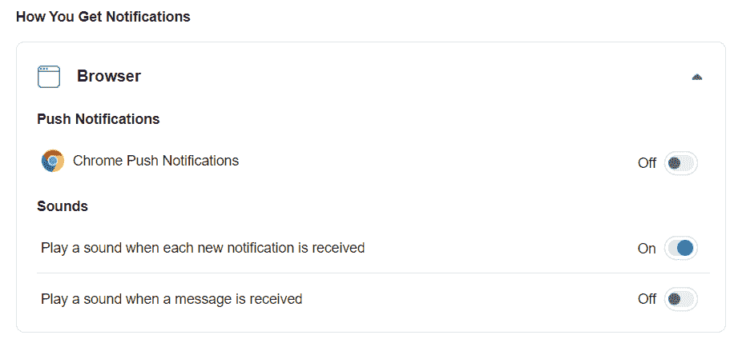

Disabling browser push notifications in Facebook

您可以在这里禁用脸书浏览器推送通知，以及伴随它们的声音。

## 如何在 Gmail 中关闭推送通知

如果您[使用 Gmail](https://kinsta.com/blog/gmail-search-operators/) ，您可能还想阻止推送电子邮件通知出现在您的桌面上。无论您使用 Chrome、Firefox、Safari 还是其他浏览器，禁用这些信息的过程都是一样的。

首先打开 Gmail，点击右上角的齿轮图标，然后**查看所有设置**。向下滚动到*桌面通知*部分:

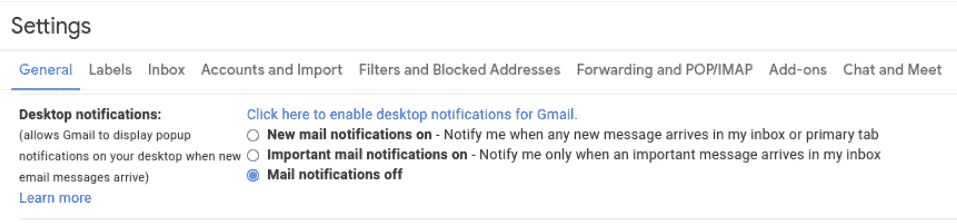

Turning off notifications in Gmail

选择**邮件通知关闭**选项。

完成后，点击页面底部的**保存更改**按钮。

[Push notifications can be an incredibly useful feature... but they can also be overwhelming. 🤯 Learn how to turn them off across platforms in this post!Click to Tweet](https://twitter.com/intent/tweet?url=https%3A%2F%2Fbit.ly%2F2XHQlm3&via=kinsta&text=Push+notifications+can+be+an+incredibly+useful+feature...+but+they+can+also+be+overwhelming.+%F0%9F%A4%AF+Learn+how+to+turn+them+off+across+platforms+in+this+post%21&hashtags=iOS%2CPushNotifications)

## 摘要

尽管推送通知非常有用，但它们是生产力杀手。理想情况下，您将决定哪些应用程序和网站可以向您发送推送通知，因此您可以完全控制您看到的通知。

定制推送通知的工作方式很简单。几乎每个浏览器、应用程序、设备和操作系统都提供了设置，使您能够定制该功能以满足您的独特需求。

* * *

让你所有的[应用程序](https://kinsta.com/application-hosting/)、[数据库](https://kinsta.com/database-hosting/)和 [WordPress 网站](https://kinsta.com/wordpress-hosting/)在线并在一个屋檐下。我们功能丰富的高性能云平台包括:

*   在 MyKinsta 仪表盘中轻松设置和管理
*   24/7 专家支持
*   最好的谷歌云平台硬件和网络，由 Kubernetes 提供最大的可扩展性
*   面向速度和安全性的企业级 Cloudflare 集成
*   全球受众覆盖全球多达 35 个数据中心和 275 多个 pop

在第一个月使用托管的[应用程序或托管](https://kinsta.com/application-hosting/)的[数据库，您可以享受 20 美元的优惠，亲自测试一下。探索我们的](https://kinsta.com/database-hosting/)[计划](https://kinsta.com/plans/)或[与销售人员交谈](https://kinsta.com/contact-us/)以找到最适合您的方式。