# 47 种书法字体，为您的网站增添风格和趣味

> 原文：<https://kinsta.com/blog/calligraphy-fonts/>

书法以多种方式应用于印刷和数字材料。它独特的形状和风格立刻吸引了人们的注意。这确实是一种经受住了时间考验的字体。

随着从手写字体向数字格式的转变，书法现在被用于 T2 的营销材料、网站标题和社交媒体图片中。它无处不在，如果你还没有在你的设计中使用它们，现在可能是考虑它们的好时机。

 首先，让我们花一点时间来讨论书法的历史。

## 历代书法

书法是一种真正的艺术形式，已经存在了几个世纪。无论是手写的还是为印刷媒体设计的，书法给每个字母提供了如此多的特征和个性。它既实用又有表现力。

虽然这不是最易读的书写形式，但它的设计考虑到了影响。每一个字母都代表着它自己的艺术作品

### 书法简史

书法起源于古代中国，每个汉字都被刻在动物的骨头上。这后来被转移到画笔和纸。这种艺术从那时开始进入日本和韩国，每个国家都有自己的风格。

你可能最熟悉的是使用拉丁字母的西方书法。罗马人用羽毛笔在长卷纸上写字。后来，基督教僧侣采用这种做法来复制圣经文本。最终，钢笔尖取代了鹅毛笔，提供了更清晰的线条。

虽然书法一词起源于希腊语，意思是“书写优美”，但这种书写风格却在世界各地都有。在世界各地的国家里，也发现了用阿拉伯语和希伯来语书写的各种文字。

### 印刷材料中的书法

所有的书法都是手工完成的，直到[活字](https://www.bl.uk/history-of-writing/articles/a-short-history-of-calligraphy-and-typography#:~:text=The%20impact%20of%20moveable%20metal%20type)发明。然后，在大约 15 世纪 50 年代的英国，每个字符都被刻在一块金属上。然后这些都被整理成一整页的字体，并放入一个框架。

然后，将它放入印刷机中，在上面滚上油墨，然后将其压在纸上。如果每一个活字都是用同样的风格创作的，那么书法作品的几个副本就可以用这种方式创作出来。

[Want a typeface that stood the test of time? 👀 Calligraphy could be the perfect font for your marketing materials website headers, or even social media graphics. Check out 47 great options here 👇Click to Tweet](https://twitter.com/intent/tweet?url=https%3A%2F%2Fkinsta.com%2Fblog%2Fcalligraphy-fonts%2F&via=kinsta&text=Want+a+typeface+that+stood+the+test+of+time%3F+%F0%9F%91%80+Calligraphy+could+be+the+perfect+font+for+your+marketing+materials+website+headers%2C+or+even+social+media+graphics.+Check+out+47+great+options+here+%F0%9F%91%87&hashtags=Fonts%2CTypography)

## 何时使用书法字体

书法字体不能用于正文，因为它太难阅读了。然而，他们可以在其他方面产生很好的影响。以下是一些想法:

*   [头衔](https://kinsta.com/blog/headline-analyzer/)
*   逻各斯圣语
*   头球
*   副标题
*   [横幅](https://kinsta.com/blog/banner-ad-sizes/)
*   制图法
*   [社交媒体](https://kinsta.com/blog/social-media-image-sizes/)图片
*   宣传材料

## 2021 年最佳书法字体

你已经等得够久了！

这是我们 2021 年书法字体的大清单。在决定它是否适合你的下一个项目之前，记得阅读所有 HTML 字体的许可细节。记住这一点，让我们开始探索吧！

### 1\. Sketsa Ramadhan

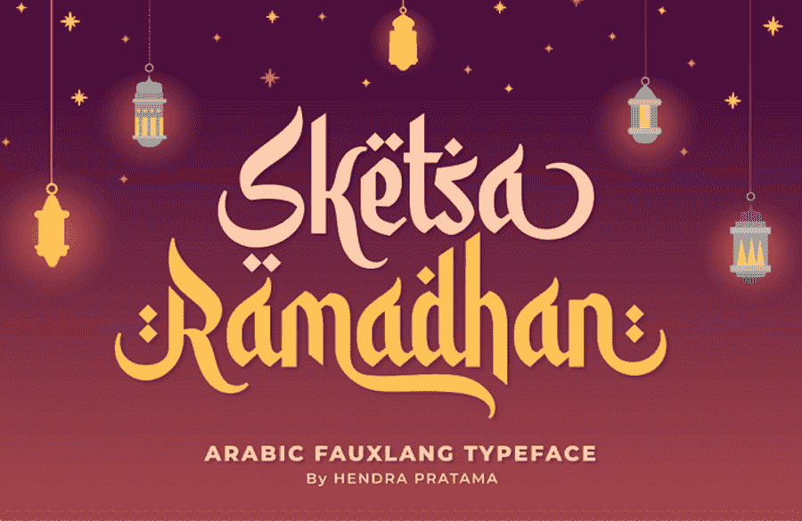

Sketsa Ramadhan

Sketsa Ramadhan 是一种基于阿拉伯书法传统的令人愉快的书法字体。这种字体有很大的重音符号、拖尾连字和大量时尚的选择，对于那些希望在文本中融入阿拉伯风格的人来说，这是一种自然的选择。

### 2.可爱的家

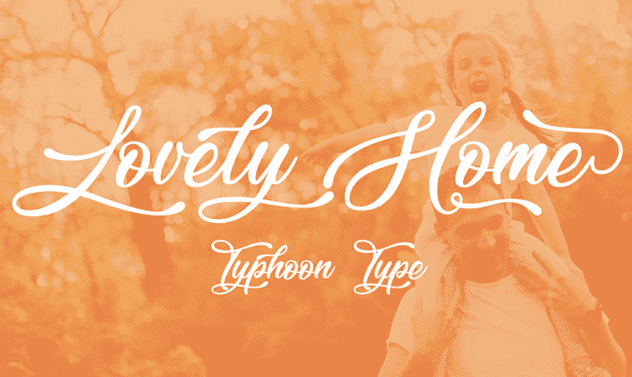

Lovely Home

然后是[可爱的家](https://www.fontspace.com/lovely-home-font-f28321)，它增加了一点简单，但仍然贯穿着繁荣。这种字体有舒展的字母，令人愉快的连接，以及适合任何“家”标志的整体经典外观。

### 3.漂亮的人

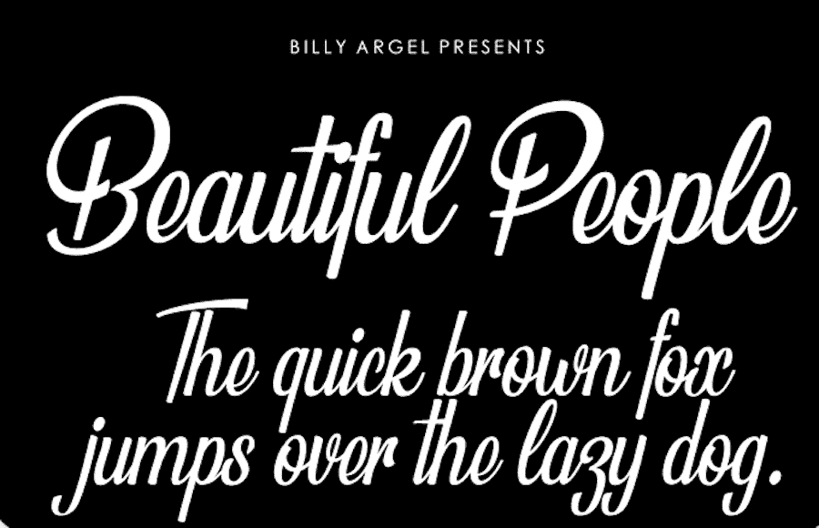

Beautiful People

或者，你可以选择[漂亮的人](https://www.fontspace.com/beautiful-people-font-f29700)。这种书法字体稍微向右倾斜，看起来相当正式优雅。你可以想象它被用在请柬或类似的东西上。对于数字媒体来说，标识和[标题](https://kinsta.com/knowledgebase/add-code-wordpress-header-footer/)看起来都很棒。

### 4\. A Aidilfitri Font

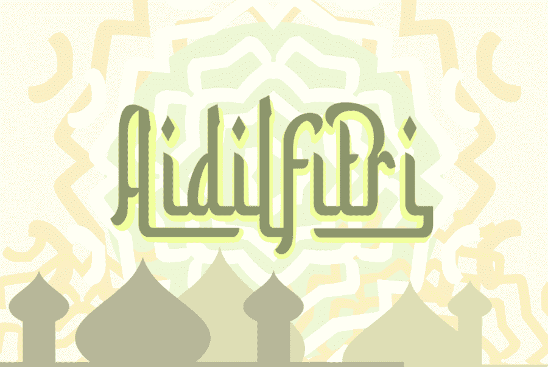

A Aidilfitri Font

Aidilfitri 字体是另一种受阿拉伯语启发的字体，它可以同时为您选择的任何文本添加历史感和优雅感。它可以用于标题或页眉。这有点难以阅读，但可以用于影响文本。

### 5.卡兰达

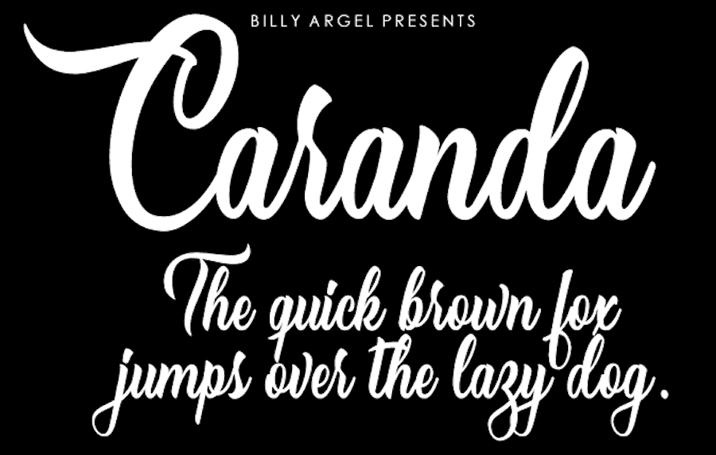

Caranda

另一种可能性是 Caranda，这种书法字体是另一个严重依赖于文字的经典例子。它华丽而不俗气。

### 6\. Beautifuly

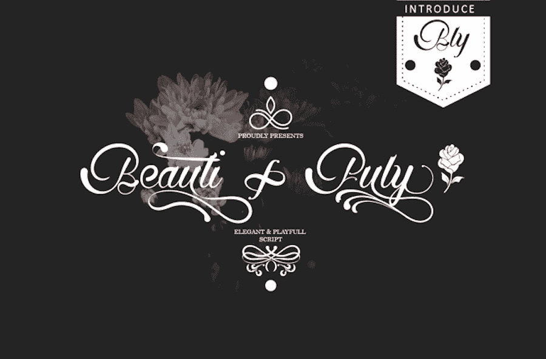

Beautifuly

[漂亮的](https://www.fontspace.com/beatifuly-font-f47193)字体是另一个很好的书法字体选择，体现了微妙之处。这种字体是女性和蓬勃发展，但仍然很容易辨认。这里还包括一些有趣的符号选项。

### 7.肉汤线

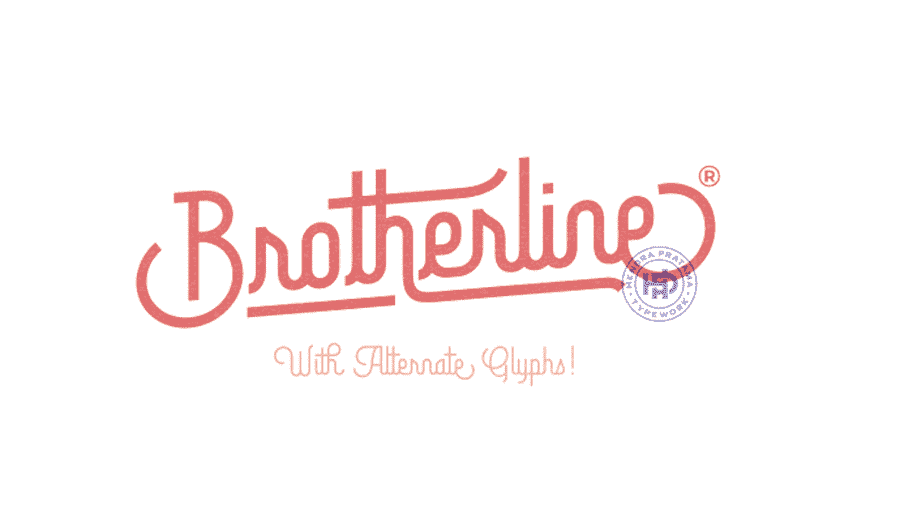

Brotherline

或者你可能更喜欢 [Brotherline](https://www.fontspace.com/brotherline-font-f44901) ，这是我们到目前为止介绍的最简单的字体。它很有结构，有点几何形状。它还带有替代字形，为您提供更多的选项来定制您的文本。

### 8.天堂鸟

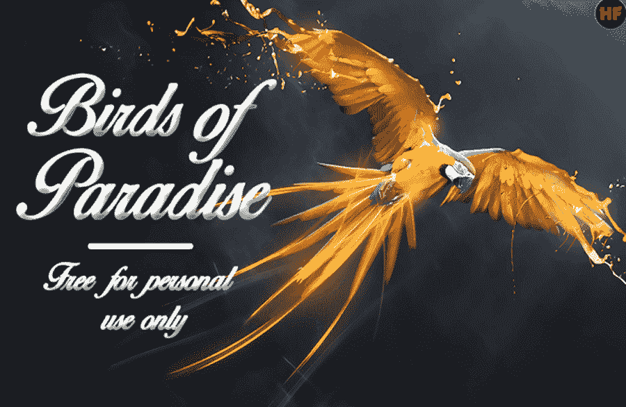

Birds of Paradise

天堂鸟也是一种选择。这是一种非常标准的书法或脚本字体，可以很好地突出你的标题、副标题、徽标或社交媒体图片。这是一个熟悉且屡试不爽的选择。

### 9.呼唤天使

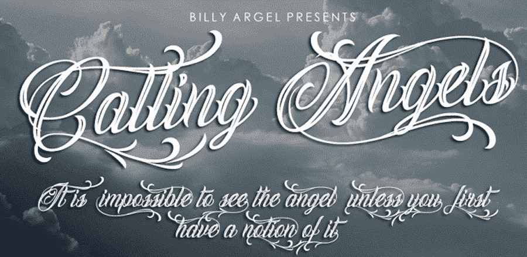

Calling Angels

另一个值得一看的书法字体是[召唤天使](https://www.fontspace.com/calling-angels-font-f25886)。这是一个真正的尤物，每个字母上都有额外的线条，给它一种独特而经典的感觉。用这种字体写的标题看起来就像是老电影的标题卡。

### 10\. Russel Dexter

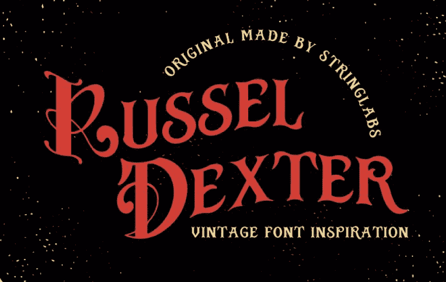

Russel Dexter

或者你更喜欢拉塞尔·德克斯特。它结合了经典的西方书法形式和现代的细节。细线和粗线的结合增加了每个字母的深度和趣味性。
T3】

### 11.你好奥利维亚

Hello Olivia

也许[你好，奥利维亚](https://www.dafont.com/hello-olivia.font)更适合你。这种脚本风格的字体提供了冗长的连字、漩涡和花体，让您的文本个性。这是一种书法字体，尽管有修饰，但仍然保持了一种轻盈的感觉。

### 12.食用香草

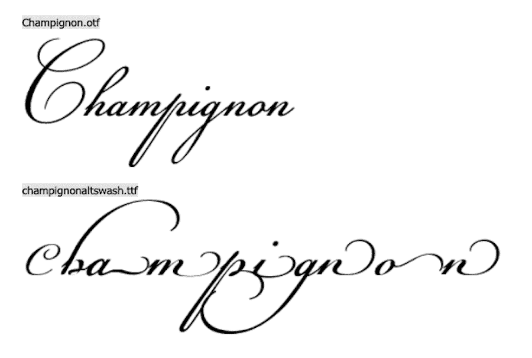

Champignon

香菇是另一种时尚的选择。它有一个豪华的外观，将工作在邀请函或证书以及网站标题和标志。它很花哨，但仍然清晰可辨——这是一个很难实现的平衡。它也有一个熟悉的，令人想起著名的标志字体。

### 13.兰布雷西亚

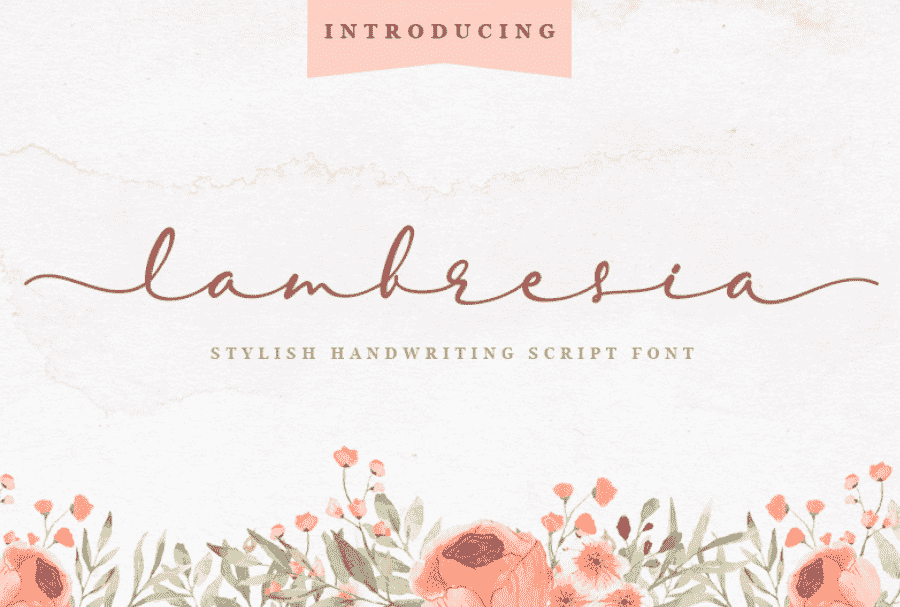

Lambresia

Lambresia 是另一个可爱的选项，我可以看到它被用在许多应用程序中。手写风格低调随和。它有一种懒洋洋的样子，我是说这是尽可能好的方式。它看起来*简单*，这使得它成为标题、签名和标题的合适选择。

### 14.辛登托萨

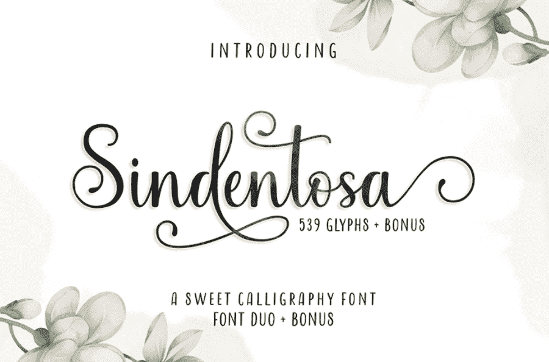

Sindentosa

Sindentosa 仍然是另一个很好的书法字体选择。它被描述为“甜蜜”,我认为这很恰当。这种字体也有 539 种字形，这增加了它的多功能性。字体本身绝对是直立的。它清晰易读，关键区域的装饰增添了风格，又不牺牲可读性。

### 15.月亮日

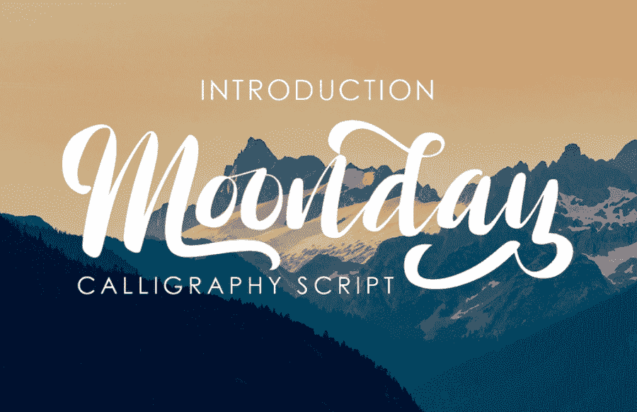

Moonday

或者，你可以选择 [Moonday](https://www.dafont.com/moonday.font) ，这是一种粗体、粗厚、非常独特的书法字体。它的粗线在各处过渡到超细线，增加了现实生活中的书法外观。你可以想象用笔画出同样的效果。

### 16.Acuentre

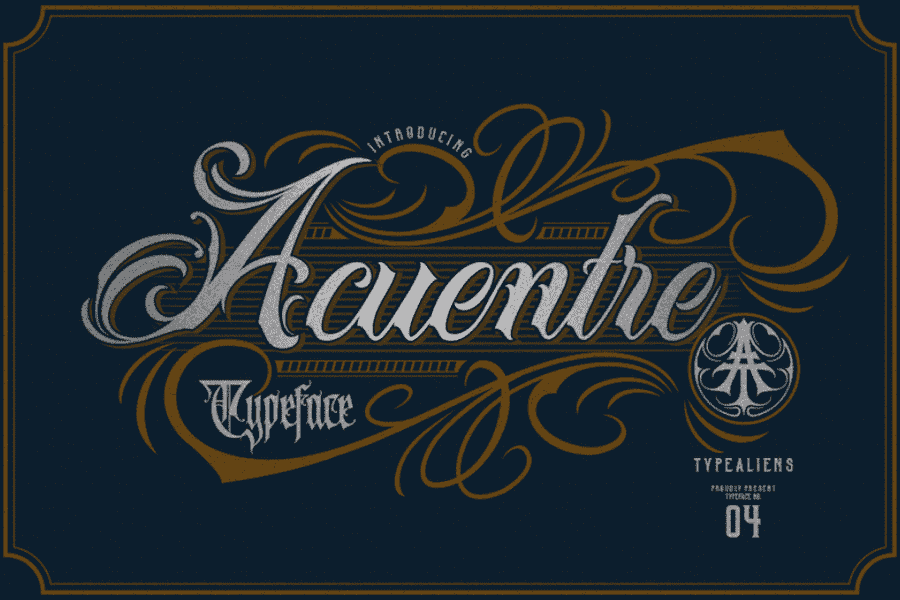

Acuentre

一个不可否认的奇特选择是[acenter](https://www.dafont.com/acuentre.font)。这是一种哥特式和老式的，同时保持现代的吸引力。它很夸张，充满了让它脱颖而出的设计元素。如果你想要一些华而不实的东西来表达，Acuentre 是一个不错的选择。

### 17.哈尼塔

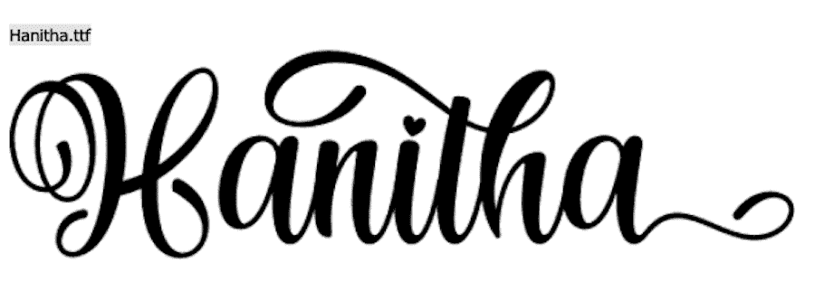

Hanitha

哈尼莎是另一个吸引人的选择。这个可爱的脚本字体是大胆的和声明性的。它旨在表达一种观点。“I”上点缀着小小的心形图案，怎么可能不是呢？长绑带和漩涡装饰完成了这里的外观。

### 18.瓦伦蒂娜·沃克

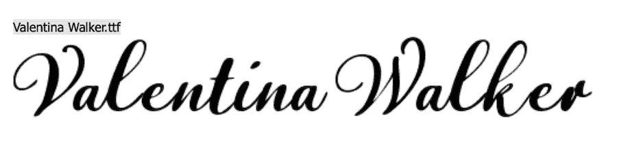

Valentina Walker

瓦伦蒂娜·沃克(Valentina Walker)是一位女性，富有想象力，适合各种场合。这种字体看起来很吸引人，清晰，时尚，但并不对此大惊小怪。在《做得太多的边缘》的字体列表中，瓦伦蒂娜·沃克低调而谦逊。

### 19.黑剑

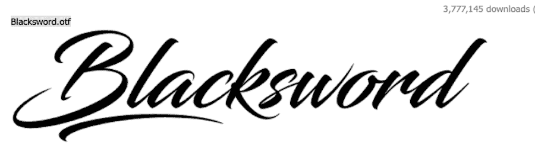

Blacksword

还有一个可靠的选择是[黑剑](https://www.dafont.com/blacksword.font)。这个字体很大，看起来像是刚刚用毛笔写的。文本略微向右倾斜，并添加了装饰，增加了手写的吸引力。

### 20.大法官办公室

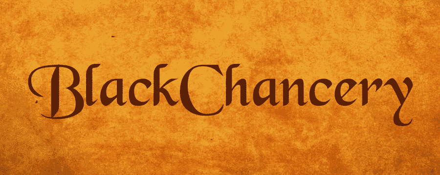

BlackChancery

BlackChancery 是另一个不错的选择，如果你想在你的网站上模仿一种经典风格，它是理想的选择。这种风格的书法字体让人想起老式的手稿和大部头。如果你想传达一种你的品牌一直存在的感觉，BlackChancery 是一个很好的选择。

## 注册订阅时事通讯

### 想知道我们是怎么让流量增长超过 1000%的吗？

加入 20，000 多名获得我们每周时事通讯和内部消息的人的行列吧！

[Subscribe Now](#newsletter)

### 21.超越仙境

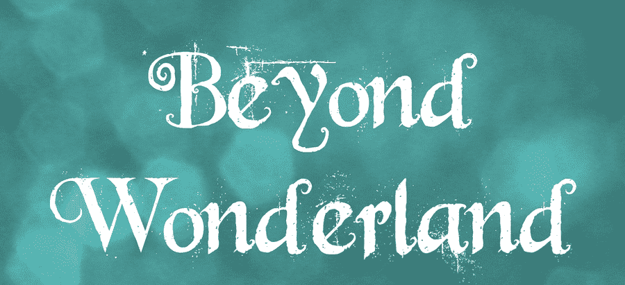

Beyond Wonderland

或者《仙境之外》对你更有吸引力。文本本身是相当标准的脚本字体。然而，它具有各种各样的口音，使其独特，如字母开头的漩涡，人工制品和线条中的缺陷。

### 22 .男性

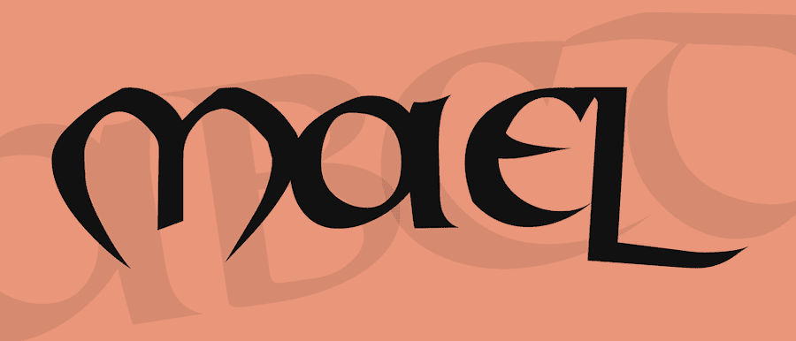

Mael

[Mael](https://www.1001fonts.com/mael-font.html) 明确表态。这种明显受到凯尔特人启发的字体具有鲜明而醒目的线条，引人注目。它在旧世界的书法风格和[现代字体](https://kinsta.com/blog/modern-fonts/)偏好之间取得了平衡，这使得它对于标题、社交图形等非常有吸引力和有用。

### 23.深色婚礼字体

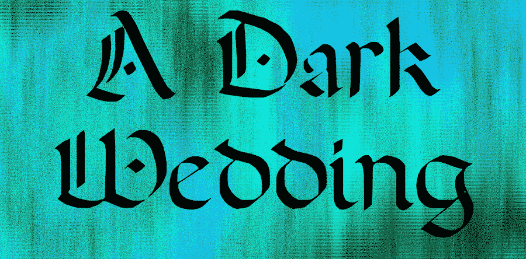

A Dark Wedding Font

你也可以一直认为[是一场黑暗的婚礼](https://www.1001fonts.com/a-dark-wedding-font.html)。这是另一种严重依赖传统西方书法风格的字体，包括双线条和点缀在各处的重音符号。它做得很好，看起来像是从古代来的，同时还保持了基本的易读性。

### 24.纯恶 2

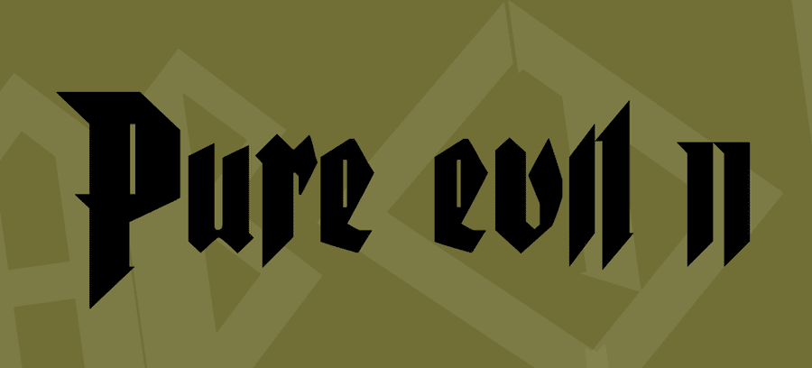

Pure Evil 2

[纯恶 2](https://www.1001fonts.com/pure-evil-2-font.html) 是另一个值得考虑的选项，尤其是如果你想传达一种不祥的预感或者打击一种不祥的基调。这种字体看起来像是可以用在恐怖电影的标题卡上，线条粗，角度尖，整体呈几何设计。

### 25.人类拯救者

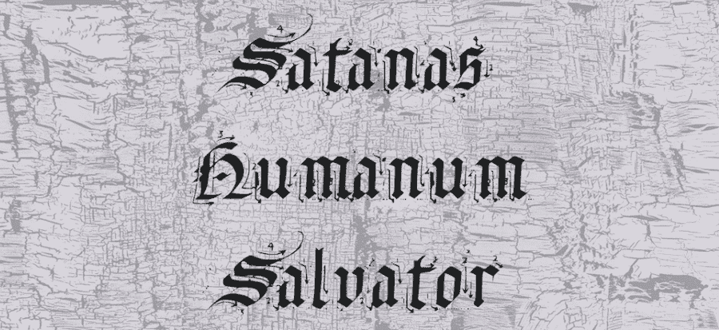

Satanas Humanum Salvator

Satanas Humanum Salvator 是另一个突出的选择，尤其是如果你想追求哥特式书法风格的话。这种字体是传统字体的缩影，甚至在每个字母周围都包含了使用哪种笔画(以及以何种顺序)的编号说明。这是一个真正独特的选择，可能并不适合所有情况，但它肯定值得放在你的背包里。

### 26.良性图形

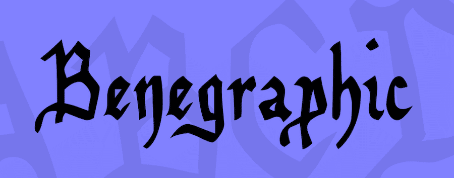

Benegraphic

Benegraphic 是你下一个项目的另一个不错的字体选择。这种字体结合了传统西方书法字体的外观和更多的现代风格。例如，线条稍微柔和一些，不那么尖锐。它也有更多的图形质量，而不是试图模仿手写脚本。

### 27.七剑客 BB

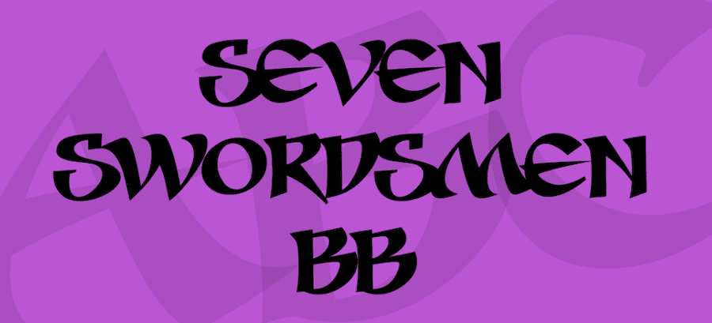

Seven Swordsmen BB

七剑客 BB 也是你可以考虑的一个选择。与上面的字体相反，这个*非常依赖传统，模仿真实的笔画非常好。这种全大写字体可以很容易地用于标题或页眉。*

### 28.CalliGravity

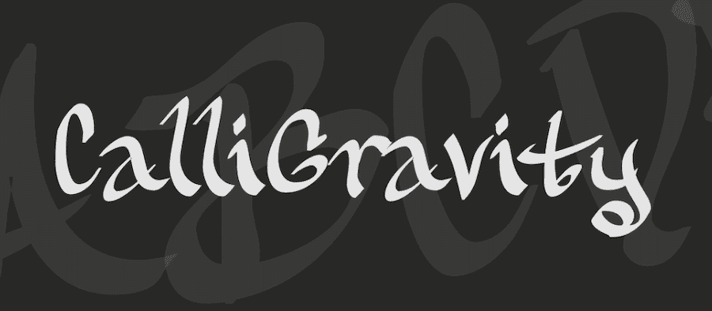

CalliGravity

[CalliGravity](https://www.1001fonts.com/calligravity-font.html) 又是一个华丽的书法字体选择。它的风格比这个列表中的其他字体更柔和，可以很容易地用于需要稍微非正式外观的标题。基本上，如果你想让你的文字看起来漂亮，但又不太费力，这是一个很好的字体。

### 29.杜克普卢斯

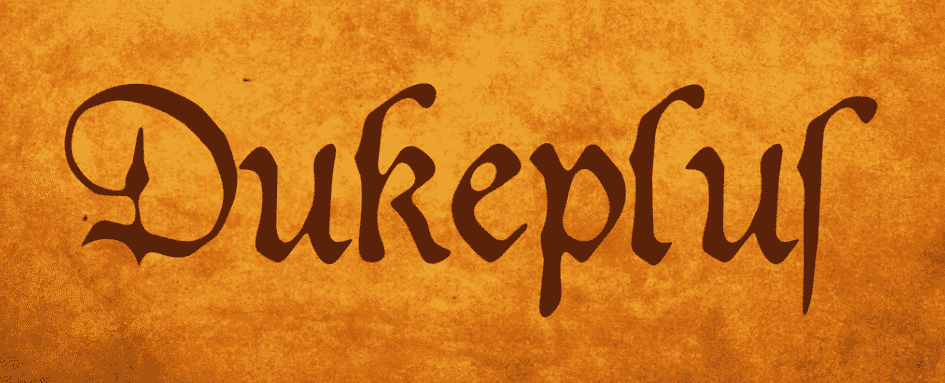

Dukeplus

或者，Dukeplus 可能是你的正确选择。这种字体是另一种从西方书法传统中得到启示的字体，但以一种独特的方式做到了这一点。这种字体具有传统书法的所有形状和线条，但它没有清晰的线条，而是有不规则的线条，我想这是模仿手写压力的变化。就好像墨水在页面的某些地方比其他地方渗透得更多，这是一个整洁的效果。

### 30.斯奎拉

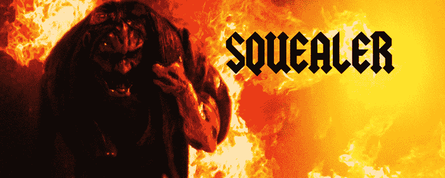

Squealer

如果你正在寻找几何、传统和大胆的东西，斯奎拉可能是一个有影响力的选择。粗线、尖角和方方正正的形状赋予了这种字体特征。这里根本没有不规则性——只有一致性——这肯定有它的位置。

厌倦了慢热的主持人？Kinsta 的设计考虑了速度和性能。[查看我们的计划](https://kinsta.com/plans/?in-article-cta)

### 31.Fiddums

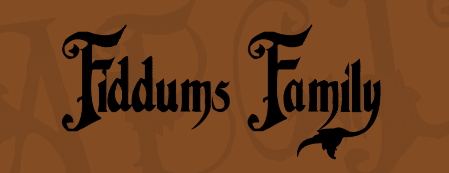

Fiddums

[Fiddums](https://www.1001fonts.com/fiddums-family-font.html) 是另一个引人注目的书法字体选择。很明显，它的灵感来自于某个怪异家庭的标题中使用的字体。它有一些传统书法的元素和一些奇怪的零零碎碎的东西，让它感觉有点毛骨悚然。不管怎么用，这种字体都是为了给人留下印象。

### 32.英语文本

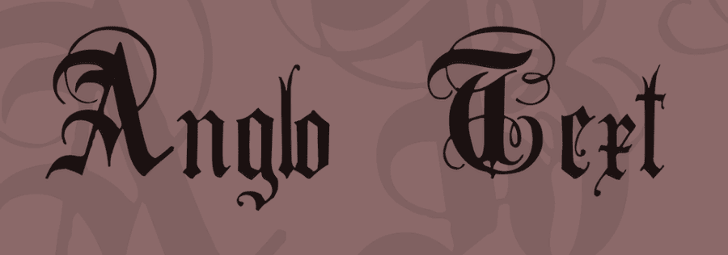

Anglo Text

[盎格鲁文字](https://www.1001fonts.com/anglo-text-font.html)是我们列表中另一种提供老派风格的字体。它以传统的西方书法风格为背景，带有圆圈、漩涡和重音，有点模糊了文本实际上在说什么。它可以用于标题，但可能会对柔和的背景设计产生更大的影响，因为这里需要的是文字的印象，而不是实际的措辞。

### 33.色情无

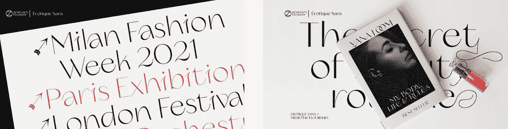

Erotique Sans

或者，有一种简单而优雅的字体，看起来非常通用。它有华丽的词藻和口音，使文本看起来很花哨。但是没有一点是不可读的，这使得这是一个有用的书法字体。在那方面它是多功能的。虽然它不应该用于正文，但它肯定可以在副标题、引用文本等方面发挥作用。

### 34.米莉

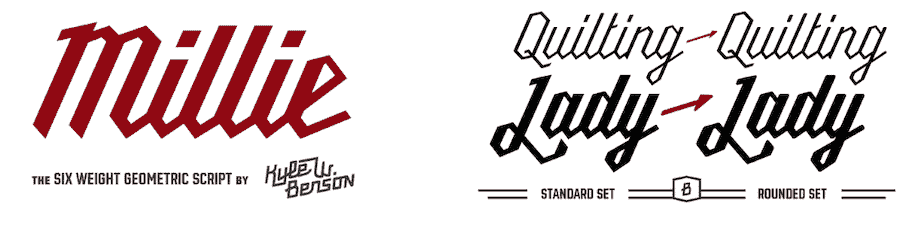

Millie

Millie 是你下一个网站项目的另一个可靠的书法字体选择。这种几何风格的字体稍微向右倾斜，提供手写的感觉。它相当方方正正，但保持了个性和现代感。尽管有传统的书法笔画，但它一点也不过时。

### 35.甜甜圈 JF

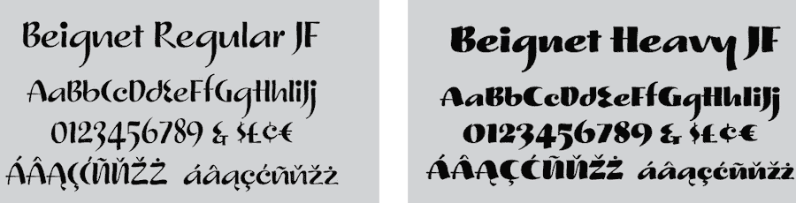

Beignet JF

或者，你可以选择[贝奈特 JF](https://www.myfonts.com/fonts/cbx-jukebox/beignet-jf/) ，这种字体很大程度上依赖于传统的笔触和风格，而不会感觉过时。事实上，这种感觉非常永恒，在网站的页眉或博客图片等方面看起来很棒。

### 36.ITC Zapf 办事处

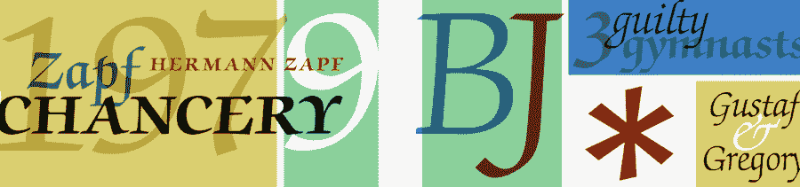

ITC Zapf Chancery

ITC Zapf 大法官办公室大胆发表声明。这种字体不提供华丽和“额外”的东西，但它仍然是标题和页眉使用的不错的字体选择。不是每个书法字体都需要过分花哨。事实上，有些可以简单明了。

### 37.小乌鸦

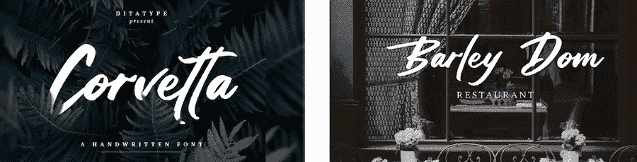

Corvetta

Corvetta 是一种更轻松的书法字体选择，模仿某人懒散的笔迹。再说一次，是好的方面。休闲又时尚。它有一种早午餐的氛围，而不是正式的坐下来吃饭。

### 38.轻蔑

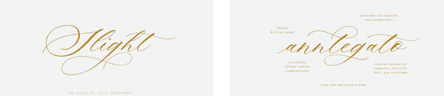

Slight

对于更轻松的接触，[轻微的](https://www.myfonts.com/fonts/upup-creative/slight/)可能是一个不错的选择。这种字体有一个合适的名字，因为它看起来就像是一支笔在纸上轻轻一按就成了线条。它们在页面上旋转、嗖嗖、舞动，提供了一种手写的外观，适合用于标题、标识，甚至是你的婚礼请柬。

### 39.马德琳

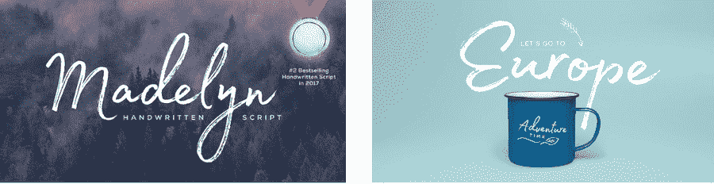

Madelyn

[Madelyn](https://www.myfonts.com/fonts/font-fabric/madelyn/) 是另一个书法字体选项。它的特点是多圈字母和时尚的偏移线。它看起来是手写的，有点不均匀。这正是它的吸引力所在。这种字体可以用于标题、标志、页眉和图形，特别是因为它也有刷过的外观。

### 40.亚玛隆

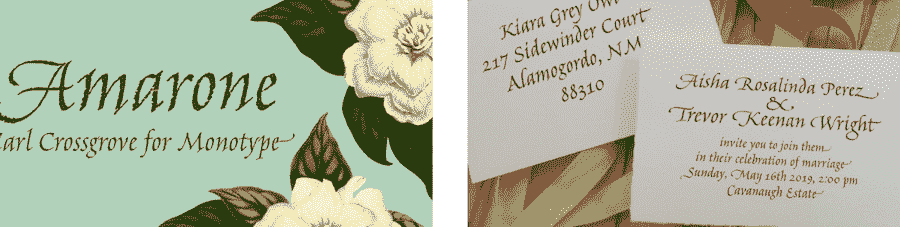

Amarone

Amarone 仍然是另一个值得你考虑的书法字体选择。这种字体被设计成在创建笔画时看起来好像一支笔跳过了一点。每条线都断裂了，而且参差不齐。这赋予了字体纹理，并为你使用它的任何东西增加了一点个性化。

### 41.困惑的

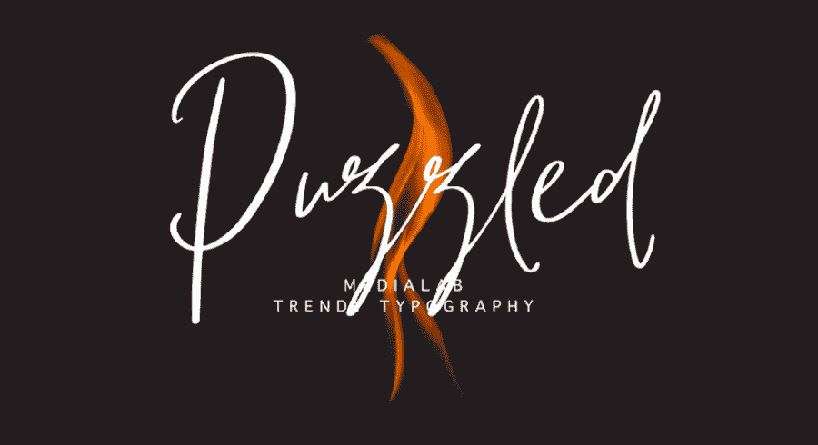

Puzzled

或者你可以考虑[迷惑](https://www.behance.net/gallery/71821187/PUZZLED-FREE-TRENDY-SCRIPT-FONT?tracking_source=search_projects_recommended%7Cfont%20calligraphy)，这种字体偏离了传统书法，而是提供了一些现代和图形化的东西。这种字体模仿现代文字，但不符合你通常在人们家里看到的手写标志的字体。比那个稍微凉快一点。

### 42.皮拉格伦脚本专业版

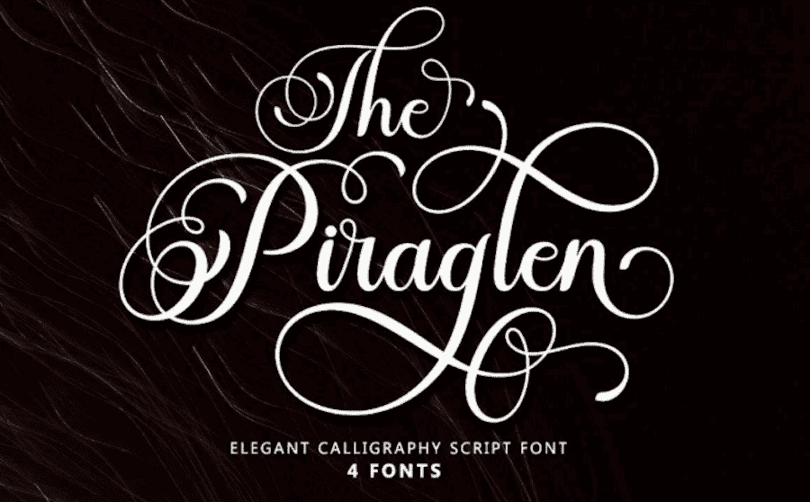

Piraglen Script Pro

[Piraglen Script Pro](https://www.behance.net/gallery/106106701/The-Piraglen-Script-Pro-Font?tracking_source=search_projects_recommended%7Cfont%20calligraphy) 还是另一种值得一看的华丽书法字体。这些字母本身使用非常简单的[草书字体](https://kinsta.com/blog/cursive-fonts/)，但是它们的开头和结尾非常优雅，充满了华丽、漩涡和额外的东西。

### 43.白丝魔理沙

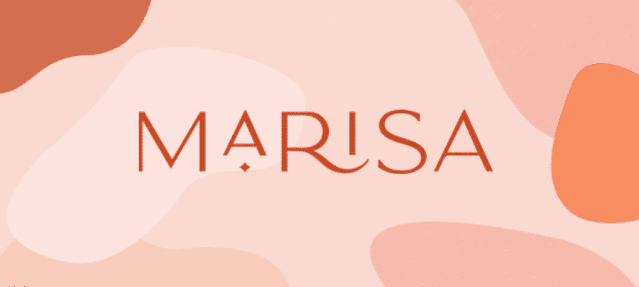

Marisa

玛丽莎是另一个不错的选择。虽然不是传统的书法字体，但它确实很好地捕捉了书法的元素，包括延长的连字和点状重音。作为低调风格的额外奖励，它清晰易读，可用于任何目的。

### 44.马莱尔

Mallaire

另一个字体选项是 [Mallaire](https://www.behance.net/gallery/97613709/Mallaire-Exclusive-Calligraphy-Font?tracking_source=search_projects_recommended%7Cfont%20calligraphy) 。这个是*看中的*。既优雅又精致。它看起来像一种字体，会出现在一瓶别致的香槟上。它被绑了好几天。我最喜欢的部分之一是每一行都被一个点所打断，看起来好像一支笔在开始笔画之前在页面上停留了太长时间。

### 45.导演

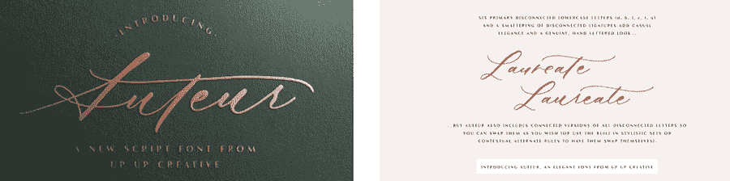

Auteur

也许导演更适合你。这种字体可读性较差，但是看起来确实很可爱，并且可以很好地为你的标题和页眉添加纹理和风格。它严重向右倾斜，以俯冲的连字和华丽的词藻为特色，使文字流畅优雅。

### 46.自然男孩

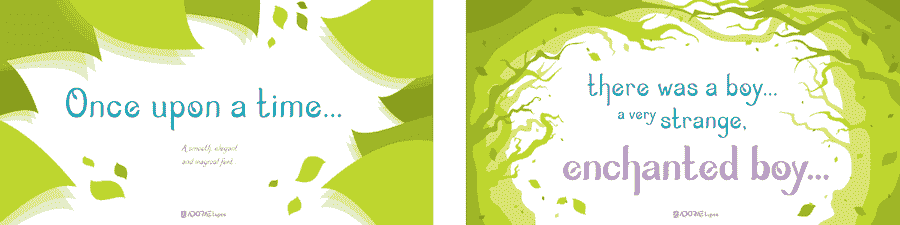

Nature Boy

另一个书法字体选项是[自然男孩](https://www.myfonts.com/fonts/adorae-types/nature-boy/)。这种字体与非手写字体有许多相同之处，但包括书法字母形状，这使它在这个列表中稳操胜券。它有一个经典的童话书字体外观，使它适用于任何你想注入奇思妙想的项目。

### 47.斯内尔圆手

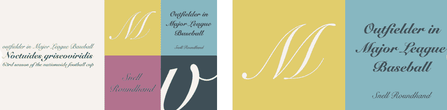

Snell Roundhand

最后，还有 [Snell Roundhand](https://www.myfonts.com/fonts/linotype/snell-roundhand-script/) ，它模糊了标准字体和书法字体之间的界限。这里的字母设计很简单，但你可以期待一些额外的时尚连字将整个事情联系在一起。它显示了在字母组合中使用的额外前景。

[Ready to make a statement with your font choice? ✨ These 47 beautiful calligraphy options could be the perfect solution ✅Click to Tweet](https://twitter.com/intent/tweet?url=https%3A%2F%2Fkinsta.com%2Fblog%2Fcalligraphy-fonts%2F&via=kinsta&text=Ready+to+make+a+statement+with+your+font+choice%3F+%E2%9C%A8+These+47+beautiful+calligraphy+options+could+be+the+perfect+solution+%E2%9C%85&hashtags=Fonts%2CWebDesign)

## 摘要

当[制作一个新网站](https://kinsta.com/blog/cms-software/)或[网站重新设计](https://kinsta.com/blog/web-design-best-practices/)时，在过程的早期考虑字体是很重要的。毕竟，[你选择的字体](https://kinsta.com/blog/how-to-change-font-in-wordpress/)会对项目的整体结果产生巨大的影响。将书法字体视为这一过程的一部分，可以为成品增添风格和精致。

在这里，我们讨论了书法的简史，因为它与数字媒体有关。我们还简要讨论了一些在线使用书法字体的最佳方式。然而，我们在这里花了大部分时间来讨论目前你的网站上可以使用的最好的书法字体。就整体设计而言，它们有着天壤之别。但是他们有一个共同的风格和成熟感。

书法字体首先看起来很好。如果你想给你的网站增加一点优雅，至少有一种上面提到的字体可以做到。愉快的浏览和创作！

建议阅读:[邮件排版:邮件的 8 种最佳字体](https://kinsta.com/blog/best-fonts-for-email/)

* * *

让你所有的[应用程序](https://kinsta.com/application-hosting/)、[数据库](https://kinsta.com/database-hosting/)和 [WordPress 网站](https://kinsta.com/wordpress-hosting/)在线并在一个屋檐下。我们功能丰富的高性能云平台包括:

*   在 MyKinsta 仪表盘中轻松设置和管理
*   24/7 专家支持
*   最好的谷歌云平台硬件和网络，由 Kubernetes 提供最大的可扩展性
*   面向速度和安全性的企业级 Cloudflare 集成
*   全球受众覆盖全球多达 35 个数据中心和 275 多个 pop

在第一个月使用托管的[应用程序或托管](https://kinsta.com/application-hosting/)的[数据库，您可以享受 20 美元的优惠，亲自测试一下。探索我们的](https://kinsta.com/database-hosting/)[计划](https://kinsta.com/plans/)或[与销售人员交谈](https://kinsta.com/contact-us/)以找到最适合您的方式。