# generate press vs Astra:2022 年你应该用哪个 WordPress 主题？

> 原文:[https://kinsta.com/blog/generatepress-vs-astra/](https://kinsta.com/blog/generatepress-vs-astra/)

试图在作为你的 WordPress 网站主题的 [GeneratePress](https://generatepress.com/) 和 [Astra](https://wpastra.com/) 之间做出选择？

从数字上看，这是两个最受欢迎的主题。它们也有相同的基本方法，这使得很难在它们之间做出选择。

两者都提供了轻量级的多用途基础和丰富的 WordPress 定制控件来帮助你定制它们。你可以用它们做任何事情，从[博客](https://kinsta.com/blog/how-to-monetize-a-blog/)到商业网站、[电子商务商店](https://kinsta.com/blog/woocommerce-tutorial/)、[会员网站](https://kinsta.com/blog/wordpress-membership-plugins/)等等。

总的来说，你不会走错路，但每个主题都有一些独特的优点，可能会把你推向一个或另一个方向。为了帮助您找到这些差异，我们将从几个关键方面对 GeneratePress 和 Astra 进行比较，包括:

*   用户界面
*   入门网站
*   定价
*   模块
*   免费与高级功能
*   布局和样式定制
*   表演
*   页面生成器集成
*   开发者兼容性
*   电子商务集成
*   其他集成
*   支持和文档

我们开始吧！

**注意**–我们想披露 GeneratePress 是一个 Kinsta 托管客户端。然而，在这次比较中，我们没有给 GeneratePress 任何特殊待遇——我们保持了完全的公正。

<kinsta-auto-toc heading="Table of Contents" exclude="last" list-style="arrow" selector="h2" count-number="-1">[GeneratePress vs. Astra- which one should make the cut for your next WordPress site theme? 💥 Find all the details on these two popular options right here 👇Click to Tweet](https://twitter.com/intent/tweet?url=https%3A%2F%2Fkinsta.com%2Fblog%2Fgeneratepress-vs-astra%2F&via=kinsta&text=GeneratePress+vs.+Astra-+which+one+should+make+the+cut+for+your+next+WordPress+site+theme%3F+%F0%9F%92%A5+Find+all+the+details+on+these+two+popular+options+right+here+%F0%9F%91%87&hashtags=WordPressThemes%2CWebDev)

## GeneratePress vs Astra —快速介绍

在开始比较之前，我们先快速介绍一下这两个主题。
<kinsta-advanced-cta language="en_US" type-int-post="85051" type-int-position="0"></kinsta-advanced-cta>

<link rel="stylesheet" href="https://kinsta.com/wp-content/themes/kinsta/dist/components/ctas/cta-mini.css?ver=2e932b8aba3918bfb818">

> 需要在这里大声喊出来。Kinsta 太神奇了，我用它做我的个人网站。支持是迅速和杰出的，他们的服务器是 WordPress 最快的。
> 
> <footer class="wp-block-kinsta-client-quote__footer">
> 
> 
> 
> <cite class="wp-block-kinsta-client-quote__cite">Phillip Stemann</cite></footer>

[View plans](https://kinsta.com/plans/)

### 生成 Press

GeneratePress 是一个轻量级的多用途主题，由 Tom Usborne 开发。开箱即用，它增加了不到 10 KB 的大小，并以干净的代码而闻名。

据 WordPress.org 称，截至 2020 年 12 月，GeneratePress 活跃在超过 30 万个网站上。它在超过 1，150 条评论中获得了完美的 5 星评级。

### 阿斯特拉

Astra 也是一个轻量级的多用途主题，重量不到 50 KB。它来自 Brainstorm Force，这是一个团队，在许多其他流行插件后面，包括 Gutenberg/Elementor/Beaver Builder 的终极插件。

Astra 给人留下了深刻的印象，它是唯一一个非默认的 WordPress 主题，在 WordPress 的活跃安装数超过了一百万。它还在超过 4800 条评论中获得了完美的五星评级。

(建议阅读:[基于彻底测试的 11 个最快的 WordPress 主题](https://kinsta.com/blog/fastest-wordpress-theme/))。

## GeneratePress vs Astra —用户界面

GeneratePress 和 Astra 都依赖[WordPress 定制器](https://kinsta.com/blog/how-to-customize-wordpress-theme/)来完成你的大部分更改，它提供了一个方便的可视化、无代码的界面来进行更改。使用定制器的另一个好处是，它允许您实时预览您的更改，无需保存和刷新。由于 GeneratePress 和 Astra 的可定制性很强，所以在查看网站的前端设计时，有时很难(或不可能)识别它们。如果你曾经遇到一个网站，想知道它是否使用了 GeneratePress 或 Astra，看看我们方便的 [WordPress 主题检测工具](https://kinsta.com/tools/what-is-my-ip/wordpress-theme-detector/)。

在这一节中，我们将比较每个主题的入门和用户界面。在这一部分，我们将特别关注 WordPress.org 的[免费主题，但随着我们进一步深入比较，我们将触及许多高级功能。
T3】](https://kinsta.com/blog/wordpress-free-vs-paid-themes/)

### 生成 Press

GeneratePress 在其免费版本中不提供入门网站(但在高级版本中提供)。此外，它在免费版本中不提供任何后端仪表板设置。所以当你安装免费主题时，你的第一步是直接进入原生 WordPress 定制器:

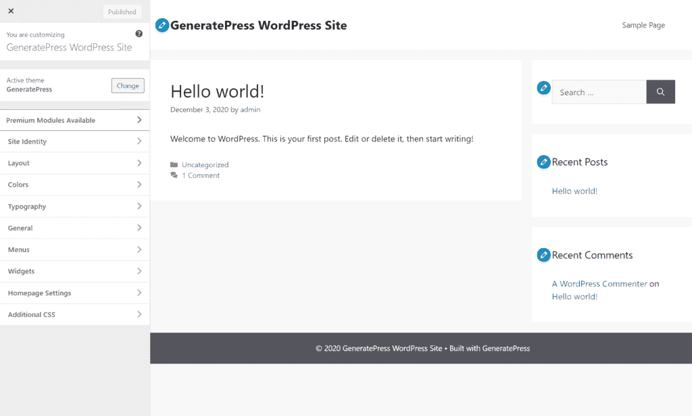

The GeneratePress Customizer options

在单独的定制器设置中，GeneratePress 比 Astra 更加轻量级。正因为如此，Astra 在个性化定制设置中感觉更加用户友好。

例如，当您选择一个预设的标题布局时，您只需从一个基本的文本下拉列表中进行选择:

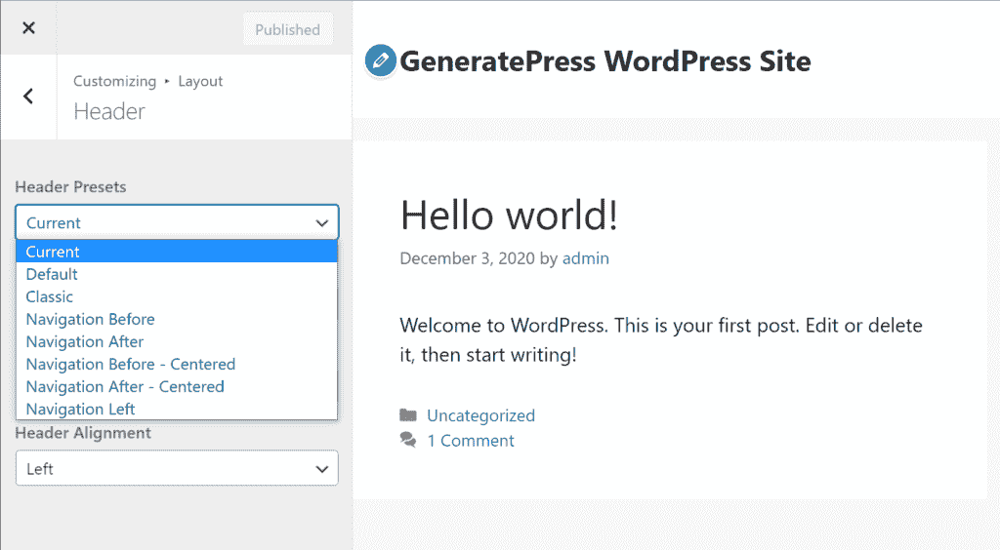

Header settings in GeneratePress

这是一种不同于 Astra 的方法，你马上就会看到。

在编辑单个内容时，您还会获得一些附加选项，我们将在讨论页面生成器兼容性时讨论这些选项。

总的来说，GeneratePress 对 WordPress 定制器的详细使用坚持了其轻量级、无膨胀的方法。

### 阿斯特拉

因为 Astra 即使在免费版本中也提供入门网站，所以它有一个更结构化的入职流程。尽管如此，你还是会花大部分时间在 Astra 的 WordPress 定制器上。

当您第一次激活 Astra 时，它会提示您安装配套的 [Starter Templates 插件](https://wordpress.org/plugins/astra-sites/)，让您可以访问可导入的演示网站:

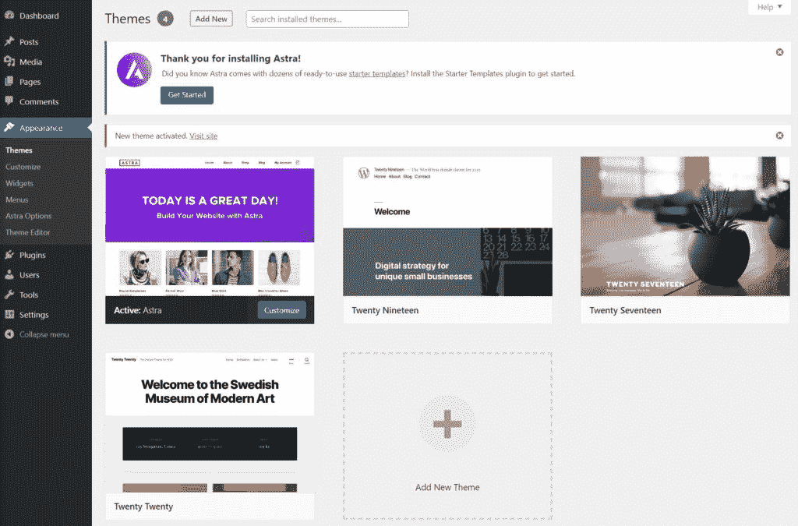

Astra’s prompt to install starter sites

点击**开始**将安装演示站点插件，我们将在接下来介绍。

除此之外，您将从本地 WordPress 定制器中完成所有其他工作，就像您使用 GeneratePress 一样:

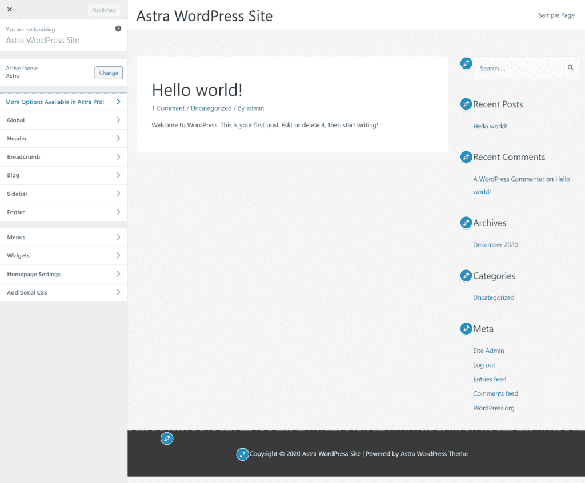

The Astra Customizer options

Astra 的定制器设置区域感觉更加用户友好和直观。例如，当选择预制的标题布局时，您将获得布局的可视化表示，而不仅仅是文本列表:

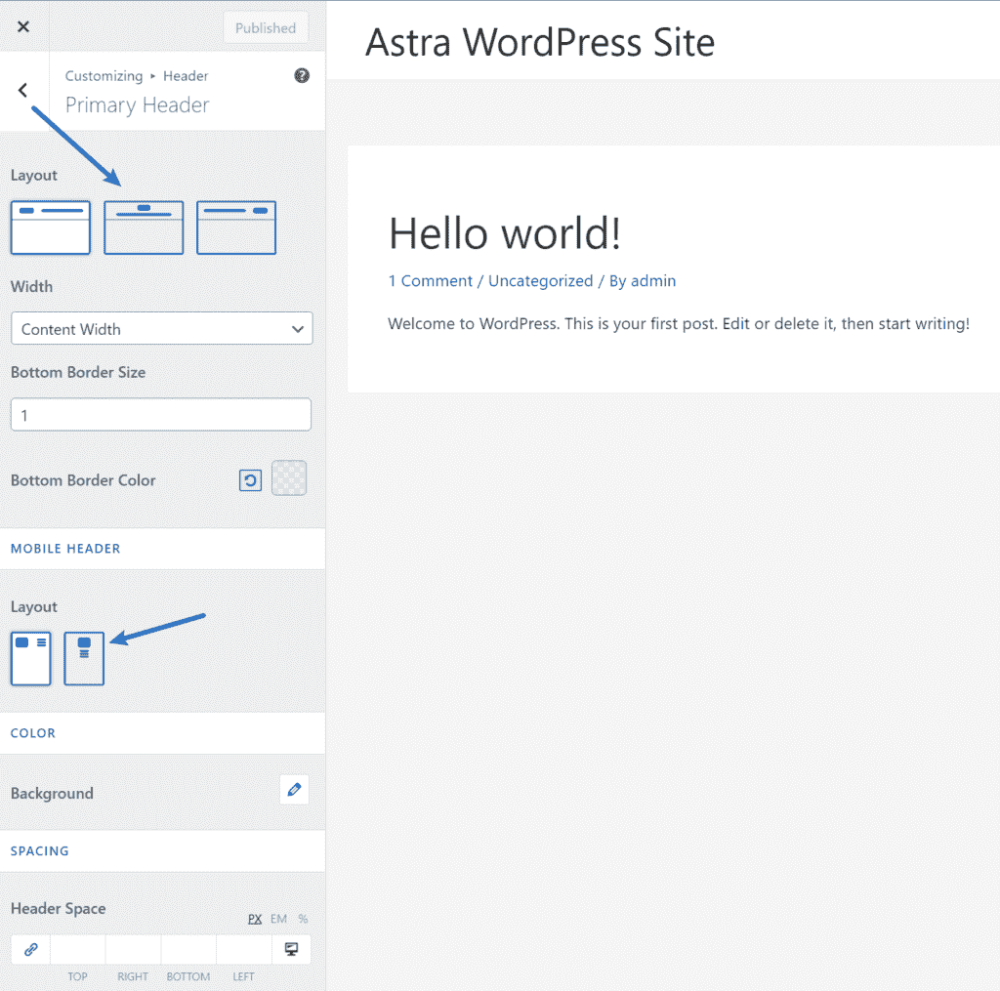

The Astra theme Customizer options

差别很大吗？肯定不是。但大多数人可能会更喜欢 Astra 在初学者友好方面的设置方式。

您还将获得页面级控件，这将在页面生成器兼容性一节中介绍。
<kinsta-advanced-cta language="en_US" type-int-post="85051" type-int-position="2"></kinsta-advanced-cta>

## GeneratePress vs Astra —入门网站

就预建的可导入演示站点而言，Astra 有更多的选择。此外，Astra 仍然包括其免费版本的入门网站，而你只有支付 GeneratePress Premium 才能获得入门网站。

出于这些原因，Astra 在可导入的入门网站方面更强一些。

### 生成 Press

同样，如果你购买 GeneratePress Premium，GeneratePress 只提供入门网站。免费版不会给你带来任何入门网站，如果你不想从头开始，考虑这一点很重要。

在高级版中， [GeneratePress 提供了由三种不同内容构建器构建的入门网站](https://generatepress.com/site-library/):

1.  **原生 WordPress 编辑器(blocks)**–44 个不同的站点。
2.  **元素或**–14 个不同的地点。
3.  **Beaver Builder Pro**–6 个不同的站点。

总的来说，这给了你 **64+个预制场地**可供选择。

若要导入 GeneratePress 的入门网站，您需要在 GeneratePress Premium 中激活网站库模块。从那里，你可以在你的 WordPress 仪表盘上浏览演示站点，然后点击几下就可以导入它们。

导入起始站点时，您可以选择进行完全导入或部分导入。您可以导入:

*   只有 WordPress 定制器设置。
*   定制器设置和所有演示内容。

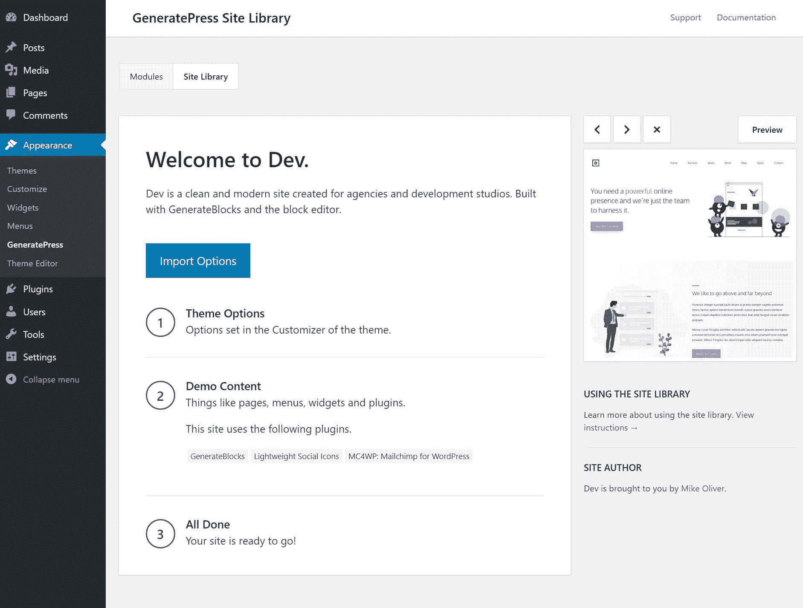

How to import a starter site with GeneratePress

### 阿斯特拉

Astra 提供了大量免费的入门网站，以及更多带有高级代理版本的入门网站。

[Astra 为入门网站](https://wpastra.com/ready-websites/)提供了四种不同的内容编辑器:

*   **原生 WordPress 编辑器(blocks)**–52 个不同的网站–52 个免费网站和 0 个高级网站。
*   **Elementor**–133 个不同的站点–60 个免费站点和 73 个高级站点。
*   **Beaver Builder**–106 个不同的站点–38 个免费站点和 68 个高级站点。
*   40 个不同的网站，17 个免费网站和 23 个付费网站。

与 GeneratePress 不同，不同内容编辑器之间的 starter 站点有一些重叠。例如，您可以找到用块编辑器和 Elementor 构建的完全相同的起始站点。

出于这个原因，你不能简单地把模板的总数加起来。但总的来说，你可以看到 Astra 肯定比 GeneratePress 提供了更广泛的选择。即使你只看 Elementor 演示网站，它仍然有两倍的数量。

要安装 Astra 的入门网站，你首先需要安装来自 WordPress.org 的配套入门网站插件(或者同等的高级版本来访问高级演示网站)。

从那里，你将能够从你的 WordPress 仪表盘内部浏览启动站点。当您导入起始站点时，您可以选择进行完全导入或部分导入。您可以导入:

*   来自演示站点的个别内容。
*   只有 WordPress 定制器设置(没有内容)
*   只是内容。

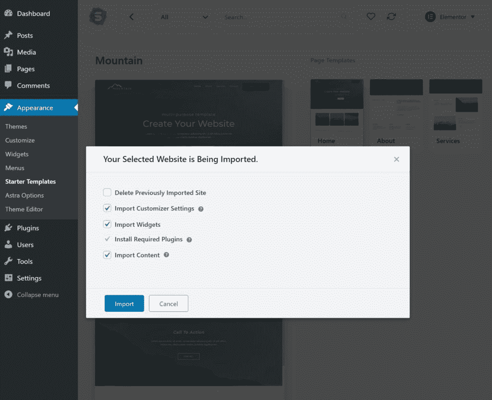

Choosing what content to import with Astra

## GeneratePress 与 Astra —定价

GeneratePress 和 Astra 在 WordPress.org 都有免费版本，以及解锁附加功能的高级版本。

高级版方面，两者定价基本一致。一个例外是，Astra 需要更昂贵的购买来解锁高级代理模板。

### 生成 Press

GeneratePress 提供两种付款方式:

*   一年的支持/更新费用为 59 美元。第一年后，你可以享受 40%的折扣。
*   终身支持/更新 249 美元

这两个计划都允许在无限制的网站上使用。

### 阿斯特拉

对于高级主题，Astra 有三种定价选择:

*   Astra Pro:一年支持/更新费用为 49 美元。
*   基本套装:169 美元/年
*   增长捆绑包:249 美元/年

这两个计划都允许在无限制的网站上使用。还有“终身”定价选项。

然而，GeneratePress 也有一些不同之处。最值得注意的是，如果您想要访问高级代理模板，您至少需要 169 美元(一年)/$499 美元(终身)的迷你代理捆绑包。这个包也让你可以访问开发者的其他插件，比如[element 或](https://kinsta.com/blog/wordpress-page-builders/#elementor) / [Beaver Builder](https://kinsta.com/blog/wordpress-page-builders/#beaver-builder) 的终极插件。

## GeneratePress 与 Astra —模块

GeneratePress 和 Astra 都为其高级版本使用模块化方法，允许您启用和禁用您想要使用的特定功能。

在这一部分，我们将向您展示每个主题提供了哪些模块。一般来说，Astra 有一个更长的模块列表，这是有意义的，因为 Astra 通常比 GeneratePress 功能更丰富一些。

### 生成 Press

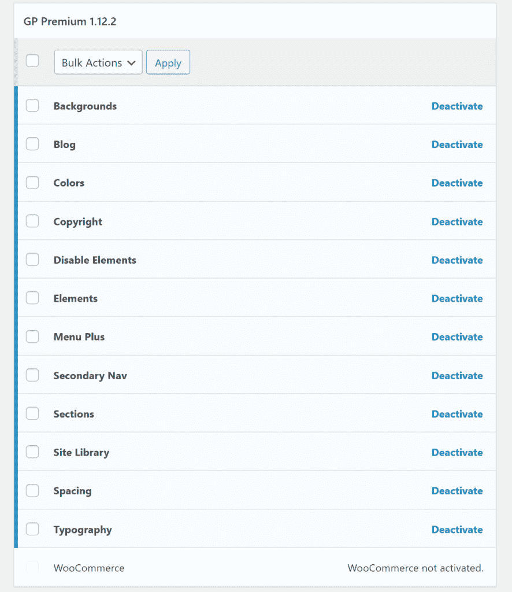

The full GeneratePress module list

### 阿斯特拉

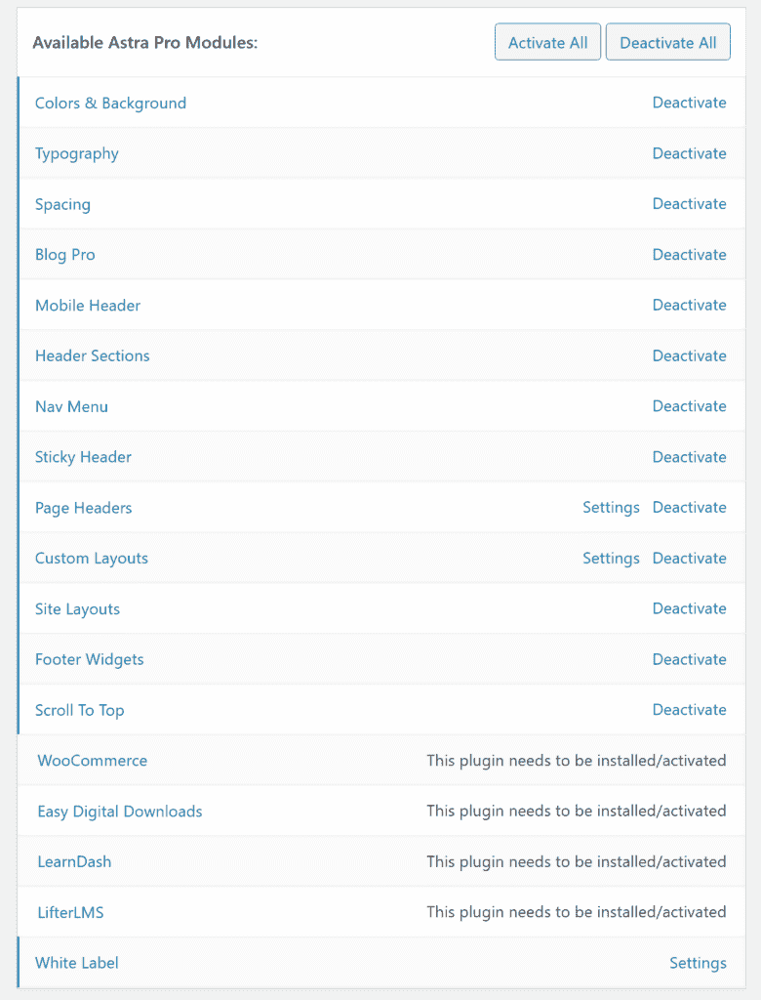

The full Astra module list

## GeneratePress 与 Astra —免费和高级功能

正如我们上面提到的，这两个主题在 WordPress.org 都有受欢迎的免费版本，以及有更多功能的高级版本。高级版从技术上来说是免费核心主题的附加插件**——无论你使用免费版(只有主题)还是专业版(主题加上高级附加插件),你都将使用完全相同的主题。**

您将需要高级版本来访问我们在上一节中向您展示的所有模块。

总的来说，Astra 在免费特性上更慷慨一点，作为一个免费主题也更灵活。因此，如果你打算只使用免费版本，Astra 可能是一个更好的选择。

## GeneratePress vs Astra —布局和风格定制

在比较免费版和高级版的特性时，我们稍微提到了这一点，但是现在让我们更深入地了解两个主题中的布局和风格定制选项。

 ## 注册订阅时事通讯

### 想知道我们是怎么让流量增长超过 1000%的吗？

加入 20，000 多名获得我们每周时事通讯和内部消息的人的行列吧！

[Subscribe Now](#newsletter)

总的来说，Astra 和 GeneratePress 都给了你大量的定制选项，这也是它们如此受欢迎的原因。

然而，这是一个很难比较的部分，因为有太多的选项可用(特别是如果你有高级版本)。深入研究每一个功能都需要一本完整的电子书！

总的来说，Astra 在功能的数量上有点领先。但是在大多数情况下，这两个主题都会给你所有你需要的选项。大多数用户可能只会注意到一些小众特性的不同。

例如，在“核心”领域，它们都非常灵活，例如:

*   [排版](https://kinsta.com/blog/web-safe-fonts/)
*   [颜色](https://kinsta.com/blog/website-color-schemes/)
*   布局

此外，Astra 并不是在所有领域都领先，GeneratePress 在某些领域更加灵活。例如，GeneratePress 有更多预设的页眉布局，尽管这将在 Astra 推出新的页眉/页脚生成器时发生变化(当我们编写这一对比时，它仍处于测试阶段)。

## GeneratePress vs Astra —性能

GeneratePress 和 Astra 都比一般的 WordPress 主题进行了更多的性能优化，并且都绝对可以让你得到一个快速加载的网站。

不过，总的来说，GeneratePress 在性能方面稍微领先一点，尽管差距不是很大。不过，如果你是一个对 WordPress 性能着迷的人，这对 GeneratePress 来说是一个优势。

为了测试性能，我们在一个全新的 WordPress 安装上安装了每个主题，并用 WebPageTest 运行测试。我们没有**而不是**引入一个初始站点，因为那里有太多的变量需要比较。显然，如果你使用一个可导入的初始站点，你的真实站点会更重。

### 生成 Press

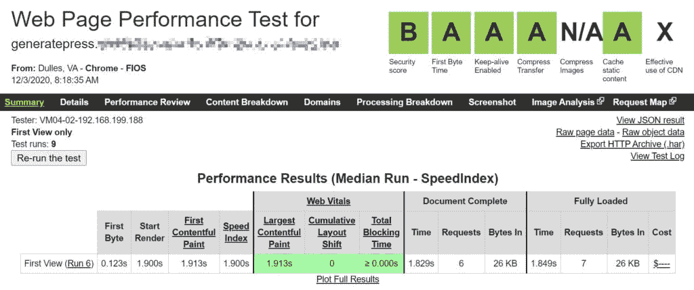

Performance of the GeneratePress theme on a fresh install

### 阿斯特拉

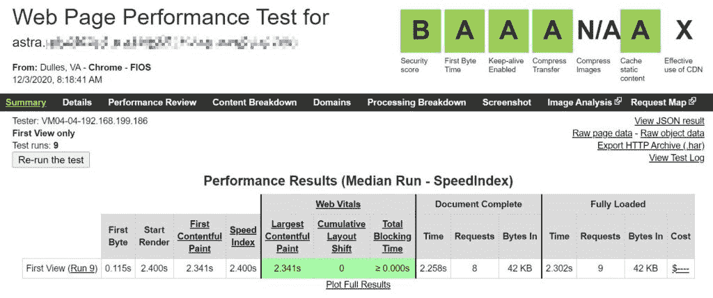

Performance of the Astra theme on a fresh install

### 比较

为了让您更容易理解，以下是全新安装时 GeneratePress 与 Astra 的对比数据:

|  | **GeneratePress** | **阿斯特拉** |
| HTTP 请求 | seven | nine |
| 页面大小 | 26 KB | 42 KB |

你可以看到，在默认状态下，GeneratePress 比 Astra 轻一点点。然而，两者都比大多数其他 WordPress 主题轻得多，所以很难对七个对九个 T2 HTTP 请求吹毛求疵。

## GeneratePress 与 Astra —页面生成器兼容性

GeneratePress 和 Astra 都能很好地与[流行的页面生成器插件](https://kinsta.com/blog/wordpress-page-builders/)配对。更具体地说，两者都提供了基于页面生成器的可导入的起始站点以及页面级控件，以便轻松地控制页面生成器设计的画布。

### 生成 Press

当处理单个内容时，GeneratePress 允许您调整布局并禁用某些元素。

您可以调整以下元素:

*   **侧边栏布局**–从任何侧边栏布局中选择(禁用、切换侧边、添加额外的侧边栏等)。
*   **页脚微件**–在 0-5 之间任意改变页脚微件的数量。
*   **内容容器**–从默认、全角或包含中选择。

您也可以通过选中一个框来禁用以下元素:

*   栏顶横木
*   页眉
*   沿航线导航
*   辅助导航
*   特色图片/页眉
*   内容标题
*   页脚

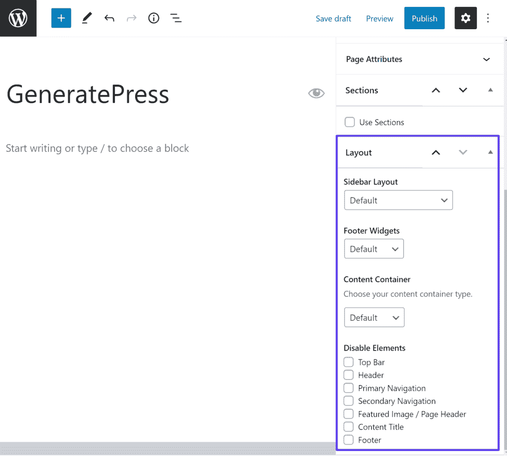

The GeneratePress page-level controls

### 阿斯特拉

Astra 还提供了详细的页面级控件，包括一些控制页眉行为的附加选项。例如，您可以逐页启用粘性或透明页眉。

厌倦了你的 WordPress 站点缓慢的主机？我们提供超快的服务器和来自 WordPress 专家的 24/7 世界级支持。[查看我们的计划](https://kinsta.com/plans/?in-article-cta)

您可以调整以下设置:

*   **侧边栏**–右侧、左侧或禁用。
*   **内容布局**–盒装、内容盒装、全幅包含、全幅拉伸。
*   **透明表头**–启用或禁用。
*   **页眉**–设置自定义页眉(下一节将详细介绍该功能)。
*   **粘性割台**–启用或禁用。

您也可以通过选中一个框来禁用以下元素:

*   主标题
*   标题
*   面包屑
*   特色图像
*   Footer bar

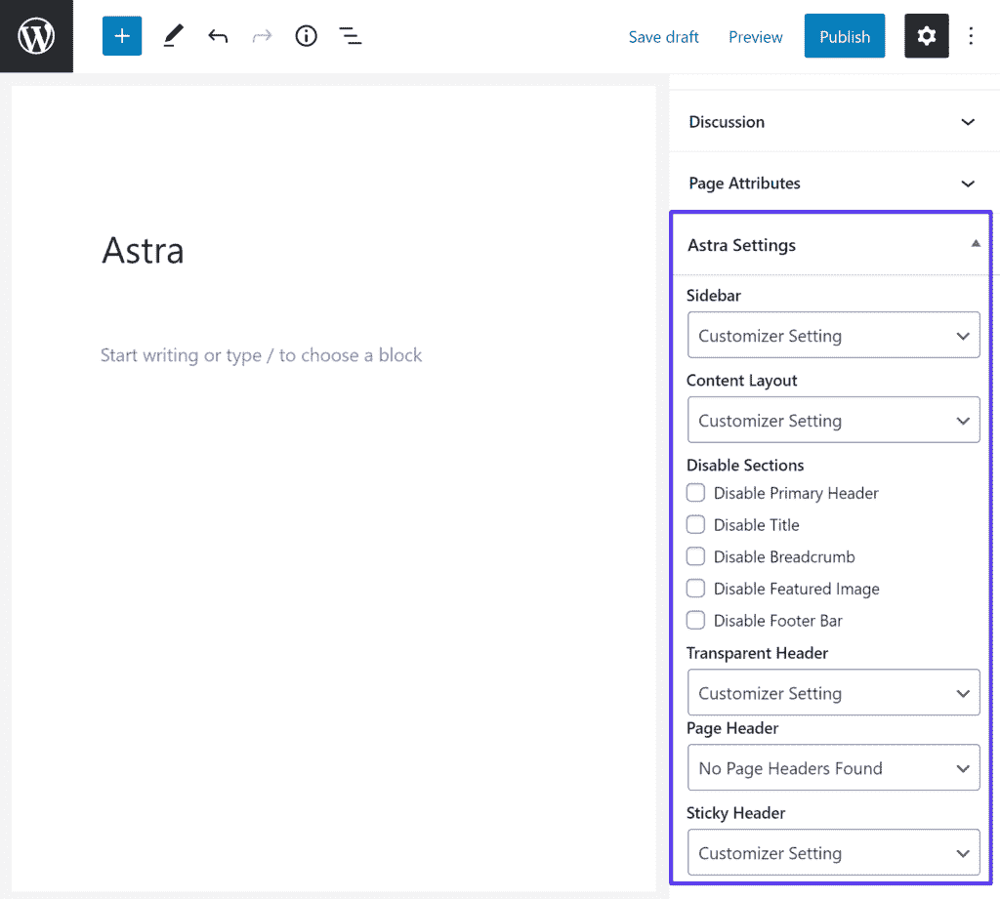

## GeneratePress 与 Astra——对开发者友好

GeneratePress 和 Astra 对开发者都非常友好，它们都有一些有用的工具来帮助你定制你的主题。

总的来说，GeneratePress 可能有一点优势，因为它有统一的定制方法，但两者都非常强大，为您提供了大量的选项。

### 生成 Press

GeneratePress 对开发者最有用的特性之一是它的元素模块(需要高级版本)。GeneratePress Elements 作为一个一体化的地方，可以使用[钩子](https://kinsta.com/blog/wordpress-hooks/)，添加定制布局元素等等。

一旦你掌握了窍门，把所有东西都放在一个地方是非常有用的。添加新元素时，可以从四种不同的元素类型中进行选择:

*   街区
*   页眉
*   钩
*   布局

例如，假设您想要将一个钩子添加到 GeneratePress 的许多钩子位置中的一个位置上(这里的[视觉引导](https://docs.generatepress.com/article/hooks-visual-guide/))。您将创建一个新的钩子元素类型。然后，您可以添加想要执行的代码，并选择挂钩位置:

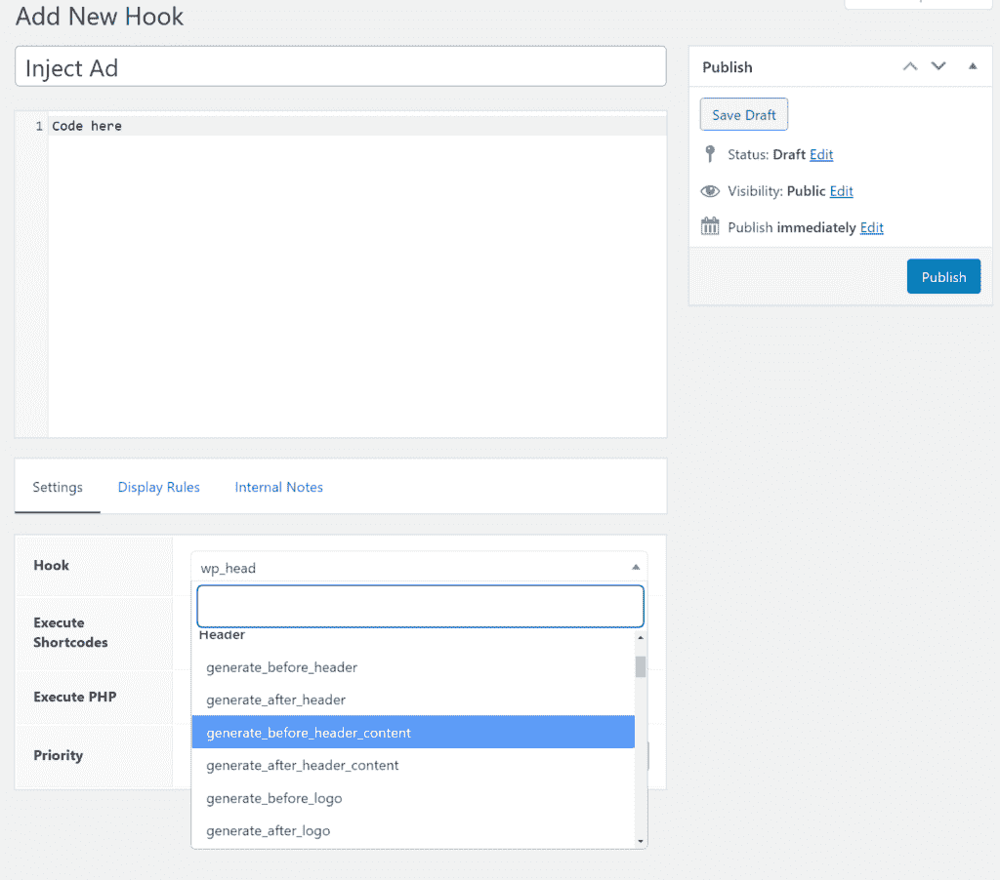

The GeneratePress Elements creator

然后，真正巧妙的是，您可以设置显示规则，只对某些内容运行挂钩(不需要使用任何代码)。你甚至可以针对[用户角色](https://kinsta.com/blog/wordpress-user-roles/)或者[登录状态](https://kinsta.com/blog/wordpress-user-registration-plugins/)。

您还可以通过许多不同的方式来定位特定内容，包括帖子类型、类别、标签、自定义分类、作者等等:

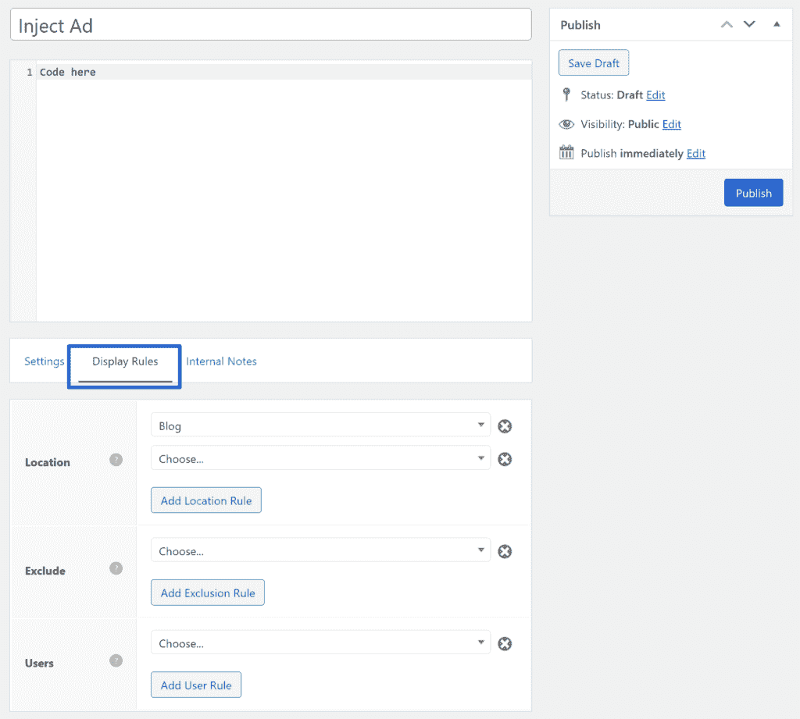

Using display rules with GeneratePress Elements

总的来说，GeneratePress Elements 是经过深思熟虑的，对开发人员来说是一个很好的工具。

### 阿斯特拉

Astra 还为开发者提供了大量工具。

首先，如果你想使用 Astra 的钩子([视觉引导这里](https://developers.wpastra.com/theme-visual-hooks/))，你可以安装官方的 [Astra 钩子插件](https://wordpress.org/plugins/astra-hooks/)来直接从 WordPress 定制器添加钩子。这种方法的好处是它是免费的。

然而，Astra 的 free hook 实现没有 GeneratePress 提供的那种简单的显示规则特性，所以您需要将那些条件直接添加到代码中:

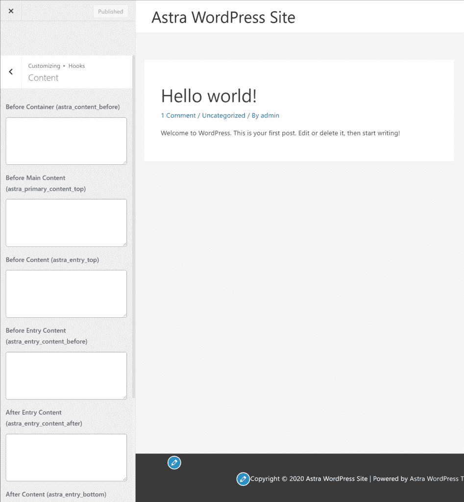

The free Astra Hooks plugin

然而，如果你有 Astra Pro，你可以访问定制的布局和页面标题(如果你使用 GeneratePress，它们被打包到元素中)。

对于这些元素，Astra 会像 GeneratePress 一样给出详细的显示规则。您可以使用自定义布局功能添加挂钩，这实际上使您可以访问那些相同的显示规则:

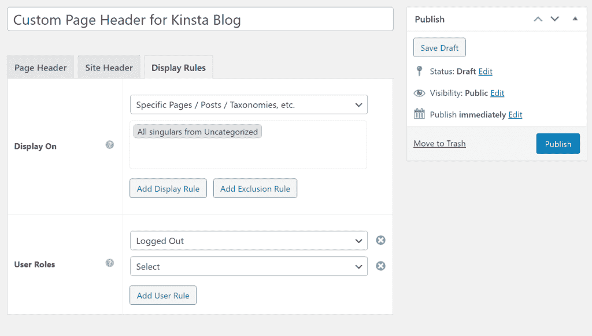

Astra 还有一个专用的白标功能，GeneratePress 目前还没有提供(尽管[有一些变通办法](https://generatepress.com/forums/topic/white-label-gp/))。

## GeneratePress vs Astra —电子商务集成

GeneratePress 和 Astra 都为你的商店提供 [WooCommerce 兼容性](https://kinsta.com/blog/woocommerce-tutorial/)和内置功能。Astra 还提供专用的[简易数字下载](https://kinsta.com/blog/easy-digital-downloads/)模块，而 GeneratePress 不提供任何特殊的简易数字下载功能。

不过，总的来说，Astra 有更强的 WooCommerce 集成，有更多 WooCommerce 特有的功能。出于这个原因，Astra 可能是 WooCommerce 商店的更好选择，尽管 GeneratePress 在大多数情况下仍然很好。

例如，Astra 拥有:

*   下拉购物车
*   画布外的 WooCommerce 侧边栏
*   内置产品快速查看
*   无干扰结账或两步结账(阅读我们在 [WooCommerce 结账页面](https://kinsta.com/blog/woocommerce-checkout/)上的指南)
*   销售产品的醒目标志
*   许多定制设置来控制您的个人产品和目录

GeneratePress 确实符合其中的一些功能，比如不受干扰的结账。但总的来说，Astra 在 WooCommerce 整合方面绝对领先。

## 其他值得注意的集成

GeneratePress 除了其 WooCommerce 集成之外，并没有太多值得注意的集成，但 Astra 确实有一些额外的技巧。

除了 WooCommerce 之外，Astra 还有专门的模块用于:

*   轻松的数字下载
*   [LearnDash](https://kinsta.com/blog/wordpress-membership-plugins/#4-learndash--starting-at-159)
*   [电梯门](https://kinsta.com/blog/wordpress-lms-plugins/#lifter-lms)

## GeneratePress vs Astra —支持和文档

如果您购买高级版本，GeneratePress 和 Astra 都提供高级支持。这两个主题都有详细的知识库，您可以从中获得帮助。

不过，总的来说，GeneratePress 在支持方面略胜一筹，原因我们将在下面讨论。

### 生成 Press

首先，GeneratePress [为主题的所有特性提供了详细的文档](https://docs.generatepress.com/)。如果你遇到任何问题，这总是一个很好的起点。

如果您需要一对一的支持，您可以使用公共支持论坛。任何人都可以查看论坛，但您需要拥有有效的许可证才能发布主题。现在，支持论坛有时会有不好的名声，但 GeneratePress 做得很好，对新话题的反应非常快。

你甚至还会发现开发人员 Tom Usborne 有时仍会回复查询(尽管 GeneratePress 已经发展到由专门的客户支持人员处理大多数查询的地步)。

此外，由于支持论坛是公开的，您也可以通过搜索 Google 找到现有支持主题来找到问题的答案。

为了获得社区支持，你还可以加入官方的 GeneratePress 脸书社区，该社区有超过 6700 名成员。

### 阿斯特拉

像 GeneratePress 一样，Astra 有一个包含数百篇文章的详细知识库。

如果您需要更多帮助，您可以提交支持票。因为 Astra 使用票证支持，所以没有像论坛支持那样的可搜索问题索引。

对于社区支持，Astra 还有一个非常大的官方脸书社区，有超过 16，900 名成员。

[GeneratePress or Astra? 🤔 This guide will help you choose between these two popular themes 🚀Click to Tweet](https://twitter.com/intent/tweet?url=https%3A%2F%2Fkinsta.com%2Fblog%2Fgeneratepress-vs-astra%2F&via=kinsta&text=GeneratePress+or+Astra%3F+%F0%9F%A4%94+This+guide+will+help+you+choose+between+these+two+popular+themes+%F0%9F%9A%80&hashtags=WebDev%2CWPThemes)

## 摘要

GeneratePress 和 Astra 的流行有一个很好的原因:它们都是优秀的 WordPress 主题，你不会在其中任何一个上出错。

总的来说，Astra 提供的比 GeneratePress 稍多一些。它有更多的集成，更多的入门网站，更多的定制选项，等等。这是不是意味着更好了？嗯，不一定。如果 GeneratePress 有一个您喜欢的起始站点，那么 Astra 有没有更多的起始站点并不重要，因为您只需要一个模板。

类似地，如果你没有使用 WooCommerce，Astra 有稍微详细一点的 WooCommerce 集成也没关系。

另一方面，GeneratePress 在性能方面略有优势，这是另一个重要的考虑因素。同样，Astra 在性能方面也相当不错——只是 GeneratePress 稍好一些。

在价格方面，高级版本是一样的，所以没有区别。但是，在定价时，有两点需要注意:

*   Astra 的免费版比 GeneratePress 的免费版功能更多。所以如果你打算继续使用这两个主题的免费版本，你可能会更喜欢 Astra。
*   您需要一个 Astra 的代理捆绑包来访问高级模板。

你还需要考虑你正在建设的网站的类型。例如，GeneratePress 可能是小册子网站或博客的最佳选择，而如果你正在建立一个 WooCommerce 商店或在线课程，Astra 可能更胜一筹。

一句话:两个主题你都不会出错，所以你绝对不需要担心做出一个灾难性的决定。相反，更多的是选择最能强调和支持你所寻找的选项。

关于 GeneratePress vs Astra 你还有什么问题吗？在评论区问我们吧！

* * *

让你所有的[应用程序](https://kinsta.com/application-hosting/)、[数据库](https://kinsta.com/database-hosting/)和 [WordPress 网站](https://kinsta.com/wordpress-hosting/)在线并在一个屋檐下。我们功能丰富的高性能云平台包括:

*   在 MyKinsta 仪表盘中轻松设置和管理
*   24/7 专家支持
*   最好的谷歌云平台硬件和网络，由 Kubernetes 提供最大的可扩展性
*   面向速度和安全性的企业级 Cloudflare 集成
*   全球受众覆盖全球多达 35 个数据中心和 275 多个 pop

在第一个月使用托管的[应用程序或托管](https://kinsta.com/application-hosting/)的[数据库，您可以享受 20 美元的优惠，亲自测试一下。探索我们的](https://kinsta.com/database-hosting/)[计划](https://kinsta.com/plans/)或[与销售人员交谈](https://kinsta.com/contact-us/)以找到最适合您的方式。</kinsta-auto-toc>