# WooCommerce 结账页面完整指南

> 原文：<https://kinsta.com/blog/woocommerce-checkout/>

WooCommerce 是一个灵活而强大的插件，你可以用它把你的 WordPress 站点变成一个动态的电子商务商店。然而，如果你希望减少[购物车放弃](https://kinsta.com/blog/shopping-cart-abandonment/)、[驱动转换率](https://kinsta.com/learn/woocommerce-guide/)，并增加收入，那么仔细关注你的 WooCommerce 结账页面是很重要的。

在 WooCommerce 中，有很多不同的方式来设计和编辑结账页面。无论你是开始你的第一个网上商店，并试图了解这个网页是如何工作的，或者你想提高现有 WooCommerce 网站的结账体验，我们都可以满足你。

在本帖中，我们将解释什么是 WooCommerce 结账页面以及它是如何工作的。然后，我们将带您浏览许多选项，您必须使用插件、代码、主题等来设计、更改和利用它来优化转换。

请记住，你的最终目标是增加商店的收入。所以一定要下载我们的免费电子书**， [10 种提高你的网络商务产品页面转化率的方法](https://kinsta.com/ebooks/wordpress/ecommerce-conversion-rate/?utm_source=Blog&utm_medium=Link&utm_campaign=WooCommerce+Conversions+Ebook)。**

 **让我们直接跳进来吧！

T3】

## WooCommerce 结账页面概述

当你第一次[建立你的 WooCommerce 商店](https://kinsta.com/blog/woocommerce-tutorial/)时，插件会自动创建并分配一个结账页面。如果你在网站的前端预览它，你会发现它相当简单:

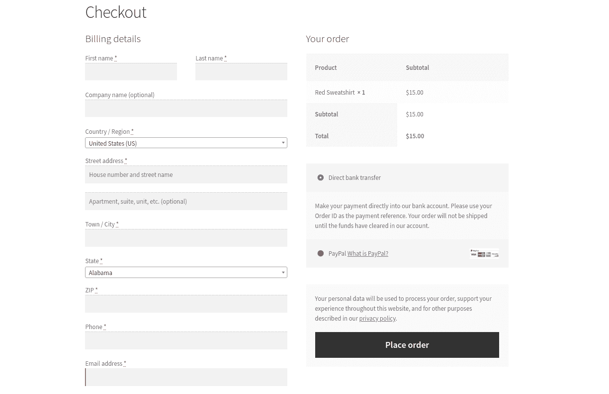

The default WooCommerce checkout page.


默认情况下，WooCommerce 会要求客户提供一些基本信息。这包括:


*   账单明细
*   名字和姓氏
*   公司名称
*   地址(城镇/城市、国家、地区和邮政编码)
*   电话号码
*   电子邮件地址
*   订单备注
*   隐私政策声明

这是包含在 WooCommerce 结账页面上的重要信息。它为客户完成购买以及网站处理他们的支付信息提供了必要的详细信息。

然而，这里没有什么必然有助于增加转化率或减少结帐放弃。此外，默认页面可能不会为您的特定业务提供最相关或最有用的信息。因此，像许多 WooCommerce 网站的所有者一样，你可能希望改变你的结账页面的设计和内容。

在我们开始讨论在 WooCommerce 中定制结账页面的不同方法之前，有一些事情需要先了解。

让我们来谈谈在哪里可以找到这个页面，以及在 [WooCommerce 插件](https://kinsta.com/blog/woocommerce-plugins/)中可用的各种默认设置和功能。
T3】

### 在哪里可以找到默认的 WooCommerce 结帐页面和设置

激活插件后，WooCommerce 会自动为你的商店创建一个结账页面。您可以在您的[管理仪表板](https://kinsta.com/knowledgebase/wordpress-admin/)中导航到**页面** > **结账**来找到它:

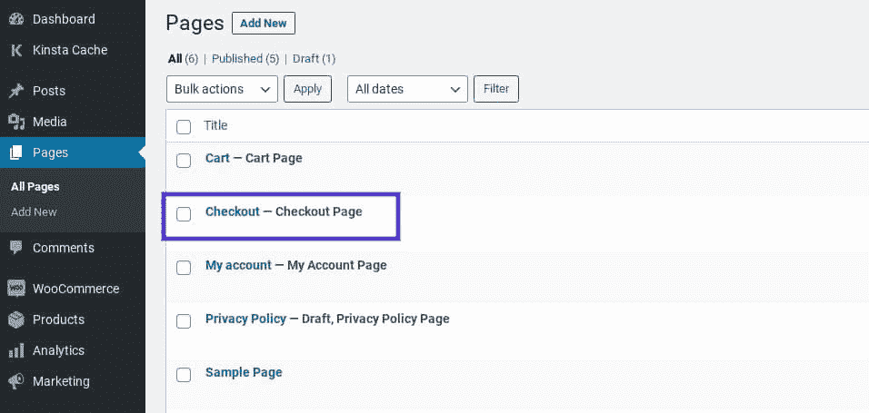

The Checkout page in WooCommerce.


你可以像编辑任何 WordPress 内容一样编辑这个页面。例如，您可以更改页面的标题和永久链接，添加特色图片，修改页面属性等。它还使用了[【woo commerce _ check out】短代码](https://docs.woocommerce.com/document/woocommerce-shortcodes/):

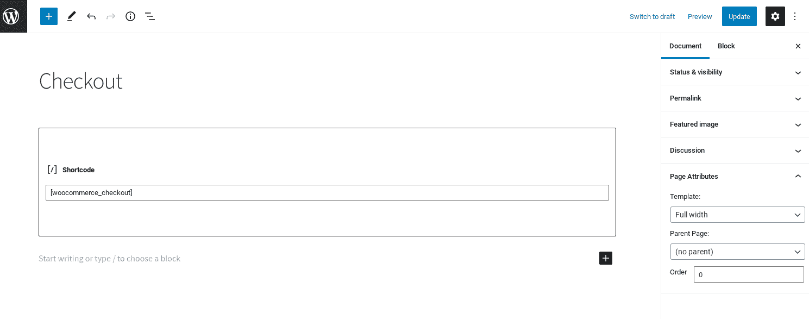

The WooCommerce checkout page shortcode in WordPress.


这个页面有一些标准的配置选项，其中一些可以在 **WooCommerce** > **设置** > **高级:**下找到

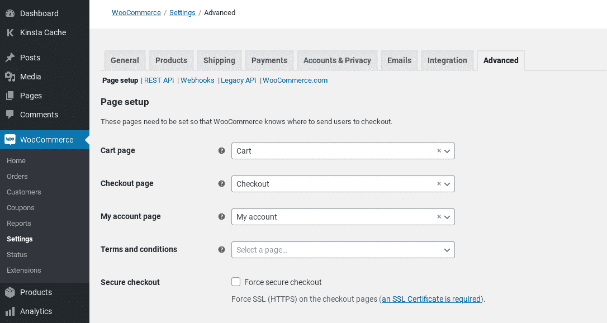

The ‘Advanced’ tab in WooCommerce settings


在此屏幕上，在 **页面设置** 部分下，您可以选择不同的页面 作为您商店的结账屏幕。你也可以选择强制 [一个安全的 HTTPS 连接](https://kinsta.com/blog/http-to-https/) 。

在**常规**设置页面，您可以启用结账时使用的优惠券，并配置如何计算税款:

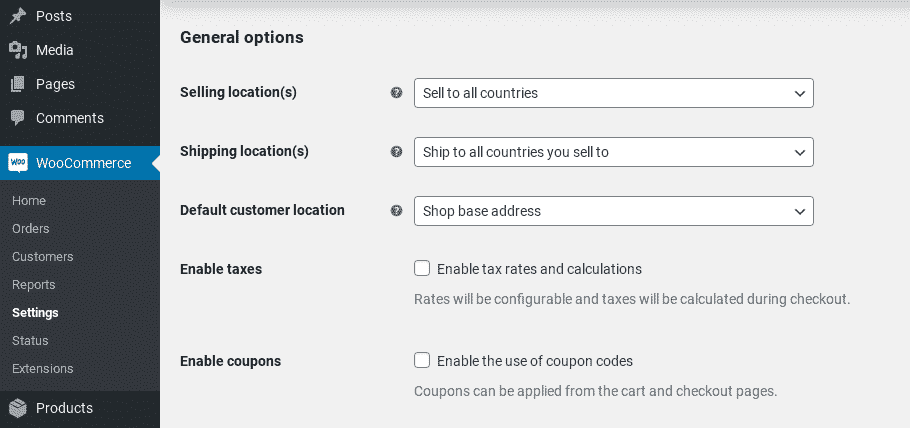

The general settings page in WooCommerce.


在**账户** **&隐私**标签下，您还可以找到一些用于账户创建和客人结账的选项:


The ‘Accounts & Privacy’ tab of WooCommerce settings


在此之下，有一个**隐私政策**部分，您可以在其中修改显示在结账页面上的隐私政策文本:

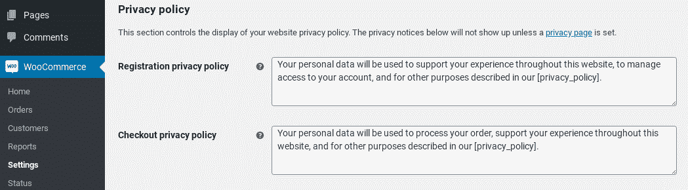

Privacy policy settings in WooCommerce


除了这些内置设置之外，单独使用 WooCommerce 插件定制结账页面的选项有限。幸运的是，您可以使用其他方法来增强其外观并扩展其功能。


## 为什么你想改变你的 WooCommerce 结账页面

结账页面是顾客在完成购买前看到的最后一个东西。这将决定他们最终是改变还是放弃你的网站。

因此，确保你的 WooCommerce 结账页面设计良好并以一种鼓励转化的方式运行是至关重要的。您可以通过多种方式提供更好的体验，例如:

*   更改设计和页面模板
*   创建单页签出
*   添加、删除或重新排列字段
*   更改输入字段标签和按钮文本
*   要求填写某些字段
*   自动触发免费送货
*   将产品直接链接到结账页面

无论您是想彻底修改默认页面还是做一些小的修改，重要的是您能够轻松地做到这一点。幸运的是，你有多种选择。

[Want to... ✅ reduce shopping cart abandonment, ✅ drive conversions, and ✅ boost revenue? Then this article is for you.👇 Learn how to build a customized WooCommerce checkout page in minutes ⏱Click to Tweet](https://twitter.com/intent/tweet?url=https%3A%2F%2Fbit.ly%2F3hjPIrN&via=kinsta&text=Want+to...+%E2%9C%85++reduce+shopping+cart+abandonment%2C+%E2%9C%85++drive+conversions%2C+and+%E2%9C%85++boost+revenue%3F+Then+this+article+is+for+you.%F0%9F%91%87+Learn+how+to+build+a+customized+WooCommerce+checkout+page+in+minutes+%E2%8F%B1&hashtags=WooCommerce%2COnlineStore)

## 您可以用来更改 WooCommerce 结账页面的方法

有很多方法可以改变你的 WooCommerce 结账页面。最佳选择取决于几个因素，比如你想做的具体编辑和你对编码的熟悉程度。

你可以用一些方法来增强你的 WooCommerce 结账页面，包括:

*   **WooCommerce 功能、区块和短码**。WooCommerce 确实有一些内置的功能和设置，你可以用它们来改善你的商店。例如，您可以自动触发免费送货，以及直接将产品链接到结帐页面。还有块和[短码](https://kinsta.com/blog/wordpress-shortcodes/)用于修改页面。
*   **插件和扩展**。如果你不精通技术，或者只是想要一种快捷方便的方式来增强你的 WooCommerce 结账页面，[有很多插件你可以使用](https://kinsta.com/blog/woocommerce-plugins/)。大多数都很容易上手，几乎不需要支持。一些插件由 WooCommerce 提供，可从[扩展库](https://kinsta.com/blog/woocommerce-extensions/)获得，而其他的则由第三方平台开发和提供。
*   页面模板和主题。如果你想改变结账页面的风格，你可以使用一个[预建的模板或主题](https://kinsta.com/blog/woocommerce-themes/)。与插件一样，如果您的编码经验有限，并且希望对页面的整体外观进行更改，以便更好地匹配您的品牌，这是一个可靠的选择。缺点是它不能像定制编码那样提供足够的灵活性。
*   **自定义代码**。另一种可以用来改变 WooCommerce 结账页面的方法是自定义编码。如果你习惯于编辑你的站点文件，并且想要增加很多个性化，这是一个强大的途径。

在接下来的几节中，我们将看看你可以对你的 WooCommerce 页面做出的一些最有效的改变。对于每一个，我们将解释为什么您可能想要进行编辑，并引导您使用不同的方法进行编辑。


## 如何定制 WooCommerce 结账字段

对 WooCommerce 页面最常见的更改之一是修改其表单字段。这些通常占据页面的大部分空间，所以它们需要相关。无论您想要删除字段、重新排列它们的顺序，还是添加新的自定义字段，您都有两种选择。你可以使用插件或者直接编辑代码。

### 使用插件来改变 WooCommerce 结帐字段

如果你想快速简单地定制 WooCommerce 中的结账字段，我们推荐你使用插件。有几个选项可供选择。

其中最流行的是[结帐字段编辑器插件](https://wordpress.org/plugins/woo-checkout-field-editor-pro/):

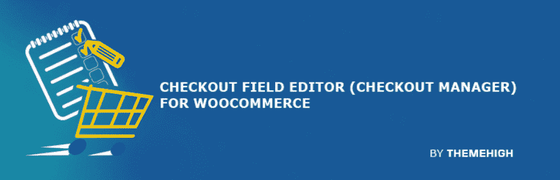

The Checkout Field Editor WooCommerce plugin


这是一个免费的增值工具，可以让你在你的 WooCommerce 结帐页面上添加或编辑表单字段。您可以启用或禁用某些字段，以及重新排列它们的顺序。

虽然免费版可以让你处理这些基本任务，但 woo commerce check out Field Editor Pro 还附带了额外的功能。这包括 17 个字段类型和自定义挂钩。

要使用这个插件，你可以通过导航到**插件** > **添加新的**，然后搜索它，将它安装在你的 WooCommerce 网站上。找到后，点击**立即安装**按钮，然后点击**激活**。

激活后，您可以进入 **WooCommerce >结帐表单**进行设置:


The Checkout Form Editor plugin in WooCommerce


您可以编辑三种不同类型的字段:

1.  演员表
2.  船舶
3.  额外的

您可以选择想要更改的字段，然后点击**删除**、**启用**或**禁用**按钮。要添加新字段，选择**添加字段**。

如果你想改变一个现有的表单域，选择左边的框，点击**编辑**按钮。将打开一个面板，您可以在其中更改字段类型(仅在高级版中)、编辑字段标签、选择是否需要字段，等等:

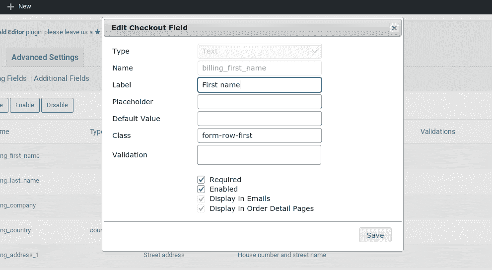

The edit checkout field panel in the Checkout Field Editor WooCommerce plugin


完成后，点击**保存**按钮。一旦你完成了对结账页面字段的所有修改，一定要点击屏幕底部的**保存修改**。

更详细的指导，你可以参考 WooCommerce 关于使用结帐字段编辑器插件的文档[。](https://docs.woocommerce.com/document/checkout-field-editor/)

当然，这只是你可以用来改变 WooCommerce 结帐栏的众多插件之一。其他值得考虑的选项包括[灵活的收银区](https://wordpress.org/plugins/flexible-checkout-fields/)和 [WooCommerce 收银管理器](https://wordpress.org/plugins/woocommerce-checkout-manager/)，我们将在本文稍后讨论。


### 使用代码编辑结帐字段

编辑 WooCommerce 结帐页面上的字段的另一个选择是使用自定义编码。当然，这需要一定水平的技术知识和对网站文件的熟悉程度。这样做的好处是，与使用第三方插件相比，你在定制方面有更大的灵活性。

您可以使用[您站点的](https://developer.wordpress.org/themes/basics/theme-functions/)[文件](https://developer.wordpress.org/themes/basics/theme-functions/)和过滤器编辑您的结账字段，例如:

*   *woo commerce _ check out _ fields*
*   *woo commerce _ billing _ fields*
*   *woo commerce _ shipping _ fields*

WooCommerce 动作和过滤器让你几乎可以随心所欲地操作收银台。例如，您可以完全删除它们，添加新的，或更改显示的文本。使用*woo commerce _ check out _ fields*过滤器可以覆盖任何字段。

假设您想要更改 *order_comments* 字段的占位符文本。默认情况下，它设置如下:

```
_x('Notes about your order, e.g. special notes for delivery.', 'placeholder', 'woocommerce')
```

要更改它，您可以将这段代码添加到您的*functions.php*文件中:

```
// Hook in

add_filter( 'woocommerce_checkout_fields' , 'custom_override_checkout_fields' );

// Our hooked in function - $fields is passed via the filter!

function custom_override_checkout_fields( $fields ) {

$fields['order']['order_comments']['placeholder'] = 'My new placeholder';

return $fields;

}
```

要删除字段，可以使用以下方法:

```
// Hook in
add_filter( 'woocommerce_checkout_fields' , 'custom_override_checkout_fields' );

// Our hooked in function - $fields is passed via the filter!
function custom_override_checkout_fields( $fields ) {

unset($fields['order']['order_comments']);

return $fields;
```

您可以对结账页面上的字段进行许多更改，因此我们不会在此一一探究。你可以在 GitHub 上找到有用的[覆盖检验字段代码列表。](https://gist.github.com/woogists/7241afdfa6f21d561ce85f7247a0f282#file-wc-override-checkout-fields-php)

## 如何更改 WooCommerce 结账页面模板

默认情况下，你的 WooCommerce 结账页面模板将基于你网站的主题。但是，也许您想要更改设计以更好地适应您的品牌，或者您只是想对模板页面的内容进行细微的更改。

可以用来改变这种情况的两种主要方法是使用预构建的模板或添加代码。先说前者。

### 从预先构建的模板开始定制您的结帐页面

改变你的 WooCommerce 结账页面设计最简单的方法就是[安装一个预建的主题](https://kinsta.com/blog/fastest-woocommerce-theme/)，比如在 [WooCommerce 主题商店](https://woocommerce.com/product-category/themes?)里的那些。有各种各样的免费选项，以及高级主题。

## 注册订阅时事通讯


### 想知道我们是怎么让流量增长超过 1000%的吗？

加入 20，000 多名获得我们每周时事通讯和内部消息的人的行列吧！

[Subscribe Now](#newsletter)

例如，您可以搜索单页结帐主题，或者您感兴趣使用的任何其他类型的特定模板。你还可以在 [Envato Market](https://themeforest.net/search/woocommerce%20one%20page%20checkout) 上找到大量的 [WooCommerce 主题](https://kinsta.com/blog/woocommerce-themes/)。

### 使用代码定制 WooCommerce 结账页面模板

如果[您对编辑代码](https://kinsta.com/knowledgebase/edit-wordpress-code/)感到满意，您也可以手动更改结账页面模板。根据你的主机提供商，你可以通过 [cPanel](https://kinsta.com/knowledgebase/what-is-cpanel/) 或[安全文件传输协议(SFTP)客户端](https://kinsta.com/knowledgebase/how-to-use-sftp/)中的文件管理器来实现。

您可以使用 action [hooks](https://kinsta.com/blog/wordpress-hooks/) 来添加、编辑或删除您的 checkout 页面中的元素。WooCommerce 为结账页面使用了九个主要的操作挂钩:

*   *woo commerce _ before _ check out _ form*
*   *woo commerce _ check out _ before _ customer _ details*
*   *woo commerce _ check out _ billing*
*   *woo commerce _ check out _ shipping*
*   *woo commerce _ check out _ after _ customer _ details*
*   *woo commerce _ check out _ before _ order _ review*
*   *woo commerce _ check out _ order _ review*
*   *woo commerce _ check out _ after _ order _ review*
*   *woo commerce _ after _ check out _ form*

这些操作挂钩向页面添加标记，您可以使用这些标记来自定义页面的样式和功能。如果您想使用这些操作挂钩来修改您的结帐页面模板，您可以通过编辑结帐表单 PHP 文件来实现。

您可以在***/woo commerce/templates***下找到 [WooCommerce 模板](https://docs.woocommerce.com/document/template-structure/)文件。从你网站的根目录，你需要导航到***WP-content/plugins/woo commerce***:

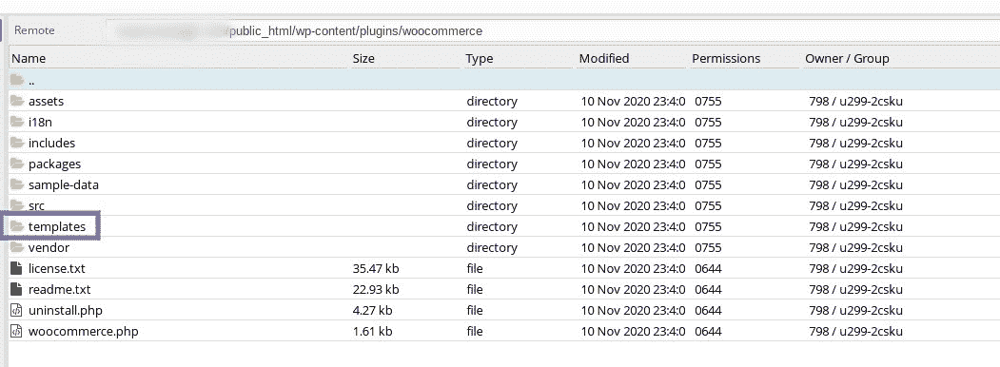

The WooCommerce templates folder


在这些文件中，有一些钩子可以用来添加和重新排列模板页面上的内容，而不需要实际编辑模板文件。要为你的结帐页面创建一个自定义主题模板，你首先需要在你的主题文件夹中创建一个“woocommerce/checkout”文件夹。

接下来复制 WooCommerce 结账页面模板，可以在***woo commerce/templates/check out/form-check out . PHP***找到:

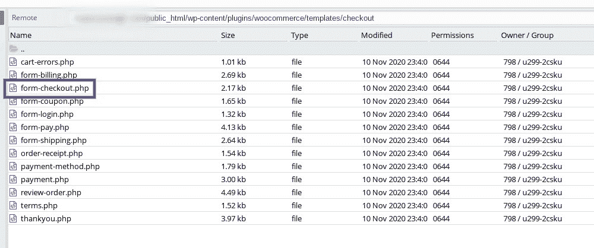

The WooCommerce checkout page template file


然后，将其添加到刚刚创建的新文件夹中。之后，您可以编辑该文件以进行所需的更改。当你保存文件时，WooCommerce 插件将加载这个模板并覆盖默认的页面模板。

## 如何创建一个网页的 WooCommerce 结帐

提升顾客结账体验，并在此过程中降低弃用率的方法之一，就是让结账过程尽可能快速简单。如果你想缩短结账过程，你可以在 WooCommerce 中创建一个单页结账。

有多种方法可以做到这一点。正如我们前面提到的，您可以寻找一个单页主题或模板，它将提供一个单一的结帐页面。然而，如果你喜欢你目前的主题，你可能不想改变它。

如果是这样的话，不用担心。还有其他的选择，比如高级的 WooCommerce 单页结账扩展:

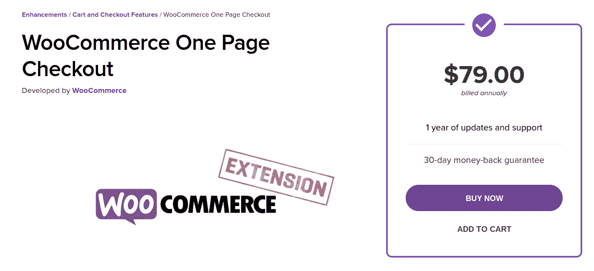

The WooCommerce One Page Checkout extension


因为这个解决方案是由 WooCommerce 开发的，所以你知道它是安全、可靠的，并且提供了大量的支持。除了让您将任何页面转换为结账页面，它还提供了许多优化单页结账流程的功能。

您可以:

*   在一页上显示产品选择和结帐表单。
*   允许客户在购物车中添加或删除商品。
*   让客户无需离开页面即可完成支付。
*   向页面添加自定义字段。

通过你的 WooCommerce 帐户购买了扩展后，你可以下载插件，然后在你的 WooCommerce 网站上安装并激活它。

要使用它，导航到**页面** > **添加新的**，并选择编辑器工具栏中的**一页签出**图标:

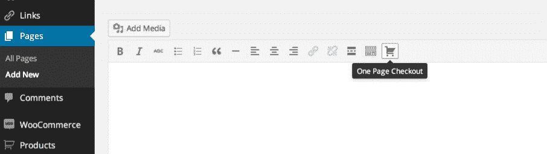

The One Page Checkout extension icon in the WordPress editor


在打开的面板中，您可以点击**产品**字段，并开始输入您想要添加的产品名称。

接下来，选择您想要使用的模板(产品列表、产品表、定价表或单个产品)，并点击**创建短代码**。

您也可以手动将一页短代码插入到任何帖子或页面中。要了解更多关于这个插件以及如何使用它，你可以参考 [WooCommerce 一页结账文档](https://docs.woocommerce.com/document/woocommerce-one-page-checkout/)。

需要为您的电子商务网站提供超快的、可靠的、完全安全的托管服务吗？Kinsta 提供所有这些服务，并由 WooCommerce 专家提供 24/7 的世界级支持。[查看我们的计划](https://kinsta.com/plans/?in-article-cta)

## 如何在 WooCommerce 结账过程中触发免运费

作为一名电子商务企业主，你可以利用许多不同的策略来鼓励你的顾客增加消费。其中之一是提供免费送货。

当然，你可能不希望每个订单都提供免费送货服务。然而，将它作为订单总额达到一定数量时的奖励，可以帮助您鼓励购物者比其他情况下花费更多。

因此，您可能希望将您的 WooCommerce 结帐页面配置为在订单超过一定金额(如 100 美元)时自动触发免费送货。

您需要做的第一件事是向相关运输区域提供免费运输方式。

为此，导航至 **WooCommerce >设置>发货**:

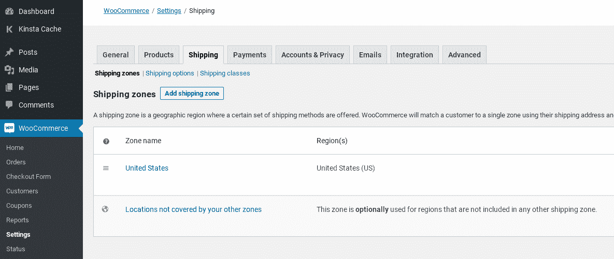

The WooCommerce Shipping settings


将鼠标悬停在您想要修改的运输区域上，然后点击**编辑**链接。如果您还没有添加任何区域，请先选择**T3**添加运输区域按钮**并按照提示继续。**

接下来，点击**添加运输方式**。在打开的模式中，从下拉菜单中选择**免运费**，然后再次选择**添加运费方式**:

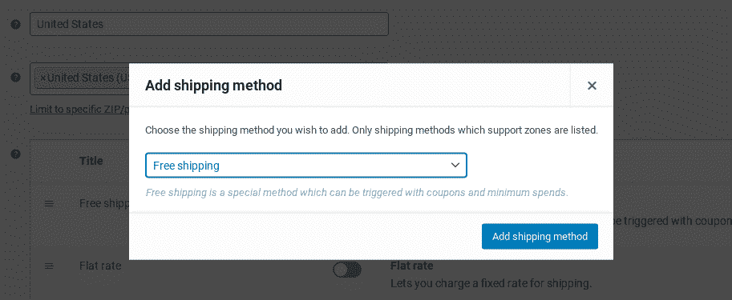

Adding a free shipping method in WooCommerce


接下来，从设置页面上的**运送方式**列表中，将鼠标悬停在**免运费**上，并点击**编辑**链接。

一个**免运费设置**面板将会打开。从**免费送货需要…** 。下拉菜单，选择**最低订单金额**:

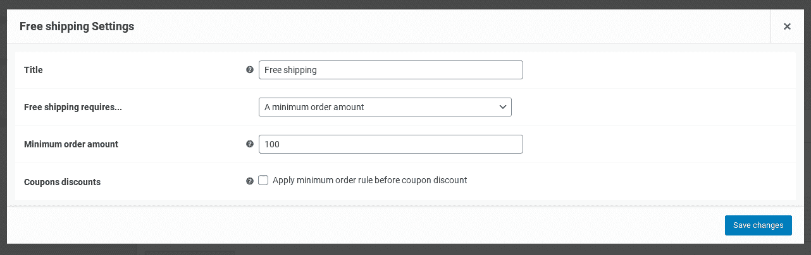

Free shipping settings in WooCommerce


然后，您可以定义最小订单金额。完成后，点击**保存更改**按钮。

## 如何将产品直接链接到 WooCommerce 结账页面

另一种增强顾客结账体验的方法是创建直接结账链接。这有助于让顾客直接从产品和销售页面结账。

### 手动创建直接结账链接

要在 WooCommerce 中创建和添加一个直接结账链接，可以使用以下 URL:*exampledomain.com//checkout/?add-to-cart=ID*。

注意:您需要用您的域名和链接到结帐页面的特定产品 ID 来替换“exampledomain”和“ID”。

要查找产品 ID，请在您的管理仪表板中导航至**产品>所有产品**。浏览到您想要创建直接链接的产品，然后将鼠标悬停在其名称上以显示产品 ID 号:

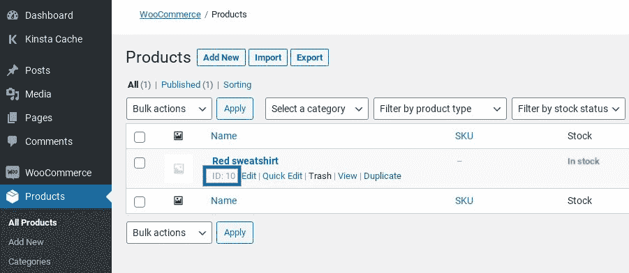

A WooCommerce product ID


一旦你把产品 ID 粘贴到前面提到的 URL 中，你就可以把链接放在你的 WooCommerce 网站的任何地方。您可以对您的每个产品重复这一过程，甚至是可变的和分组的项目。

### 使用插件创建直接结账链接

我们认识到，上述策略可能不是对所有用户都最有效的方法。取决于你的 WooCommerce 商店里有多少产品，这可能非常耗时。

幸运的是，如果你正在寻找一个更快的方法，你也可以使用 WooCommerce 插件的[直接结帐:](https://quadlayers.com/portfolio/woocommerce-direct-checkout/)

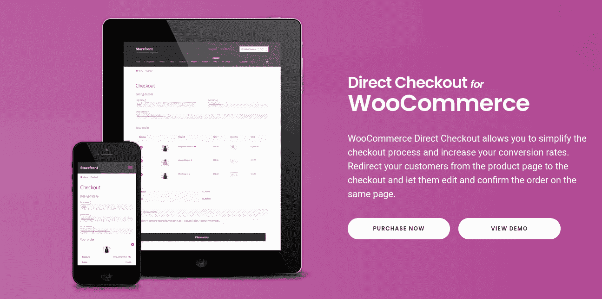

The Direct Checkout for WooCommerce plugin


这款免费增值工具可以让您以多种方式简化结账流程，包括添加一个从产品页面到结账屏幕的直接链接。在你的 WooCommerce 网站上安装并激活插件后，导航到 **WooCommerce >直接结账**:

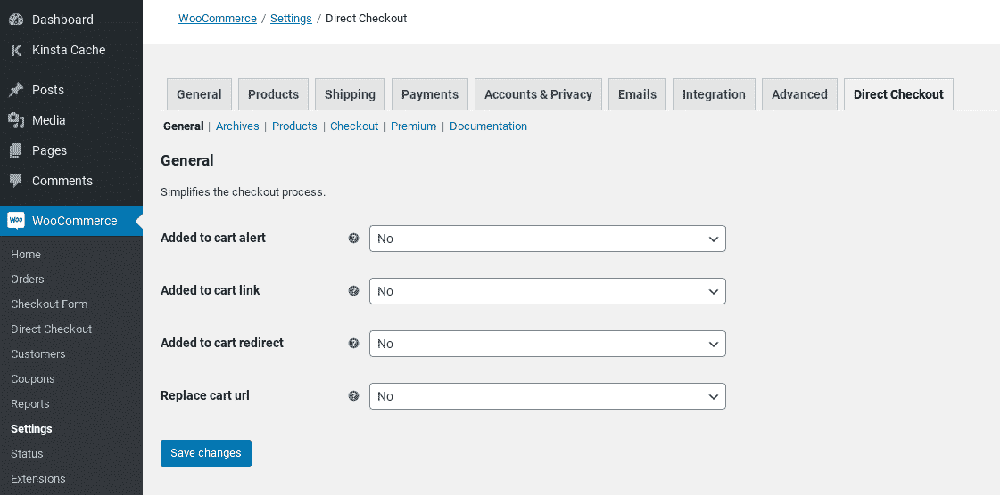

The Direct Checkout for WooCommerce plugin settings


在**常规**选项卡下，选择【T4 添加到购物车重定向选项的**是**，然后从【T8 添加到购物车重定向到下拉菜单中选择**结账**。完成后点击**保存更改**。

接下来，导航至**产品**选项卡:

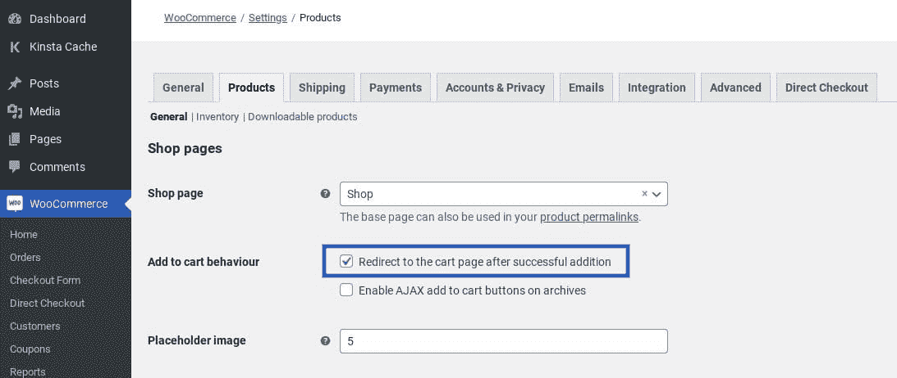

The option to redirect to cart in Direct Checkout for WooCommerce


启用成功添加选项后**重定向至购物车页面。再次点击**保存修改**按钮。就是这样！**

## 如何测试你的 WooCommerce 结账页面

至此，您已经实现了多种方法来增强您的 WooCommerce 结账页面。现在，确保您的结账流程正常运行是至关重要的，这样可以减少放弃，并确认没有错误会中断客户的旅程。

幸运的是，有一个简单的方法，你可以通过你的 WooCommerce 商店发送测试订单和付款，以确保一切正常。为此，你首先需要在你的网站上安装 [WooCommerce 支付插件](https://wordpress.org/plugins/woocommerce-payments/)(如果你还没有安装的话):

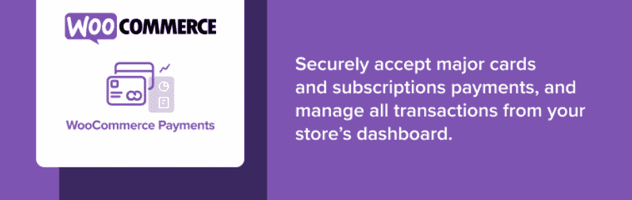

The WooCommerce Payments plugin


安装并激活插件后，您可以启用“测试模式”。为此，导航至 **WooCommerce** > **支付** > **设置**:

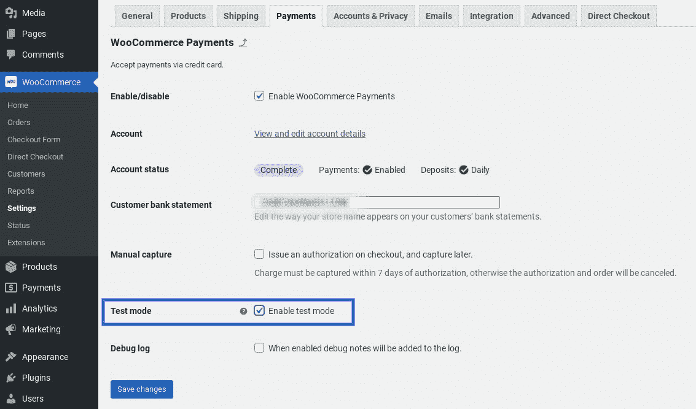

The WooCommerce payments test mode


请记住保存您的更改。

一旦测试模式被启用，你就可以浏览你的 WooCommerce 商店并选择任何产品。将其添加到您的购物车，然后转到结帐页面。

根据需要填写结帐页面表单字段。对于支付信息，您可以使用 WooCommerce 提供的任何一个[虚拟信用卡号](https://docs.woocommerce.com/document/payments/testing/)。您还可以使用任意三位数字作为 CVC 代码，并选择任意未来日期。

完成后，点击**下订单**。接下来，导航至**支付>交易**屏幕:

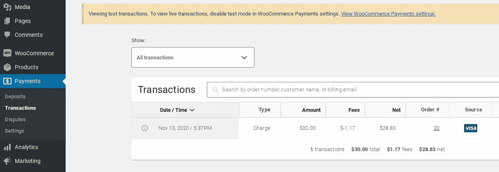

Testing transactions in WooCommerce


在这里，您应该会看到电荷出现。如果它在那里，你知道你的结帐页面工作正常。完成后记得关闭测试模式！

[Learn how to style, change, and leverage your WooCommerce checkout page⚡️ to optimize conversions and 💰 boost your revenue here ⬇️Click to Tweet](https://twitter.com/intent/tweet?url=https%3A%2F%2Fbit.ly%2F3hjPIrN&via=kinsta&text=Learn+how+to+style%2C+change%2C+and+leverage+your+WooCommerce+checkout+page%E2%9A%A1%EF%B8%8F+to+optimize+conversions+and+%F0%9F%92%B0+boost+your+revenue+here+%E2%AC%87%EF%B8%8F&hashtags=EcommerceTips%2CUX)

## 最好的 WooCommerce 结帐插件和扩展

在这篇文章中，我们讨论了改变 WooCommerce 结账页面的各种方法，包括代码块、短代码和自定义代码。我们还提到了一些关键插件，它们可以帮助你添加一些其他方式无法提供的特性和功能。

然而，还有一些我们没有提到的附加组件、插件和扩展，但是它们为你的 WooCommerce 结账页面提供了更多的定制选项。值得考虑的一些最佳方案包括:

*   [WooCommerce 购物车通知插件](https://woocommerce.com/products/cart-notices/)。这个 WooCommerce 附加组件允许您在结账过程中向客户显示可操作的消息和通知。例如，您可以使用它来通知他们相关的销售和促销活动。
*   [WooCommerce 收银经理](https://en-ca.wordpress.org/plugins/woocommerce-checkout-manager/)。这个插件是由开发 WooCommerce 直接结账的同一个团队开发的，它是一个强大的扩展，可以用来优化你的结账页面。您可以使用它来编辑、删除和添加自定义字段，以及创建条件字段。
*   [WooCommerce 结账附加组件](https://woocommerce.com/products/woocommerce-checkout-add-ons/)。这个高级插件可以让你在结帐阶段添加免费和付费的附加组件。这是一个有助于提高转化率和增加收入的工具。

根据你拥有的电子商务网站的类型，你可能会寻找更多的选择。如果是这样，我们建议查看一下 [WooCommerce 扩展库](https://woocommerce.com/products/)，它提供了大量扩展 WooCommerce 插件特性和功能的插件，包括免费和付费解决方案。

## 摘要

你可以用不同的方法来改进和优化你的 WooCommerce 结账页面。

根据你想要做出的改变和你的经验水平，你可以利用 [WooCommerce 插件](https://kinsta.com/blog/woocommerce-plugins/)和[扩展](https://kinsta.com/blog/woocommerce-extensions/)，页面模板和[主题](https://kinsta.com/blog/fastest-woocommerce-theme/)，甚至自定义代码。

您对使用或编辑 WooCommerce 结账页面有任何疑问吗？请在下面的评论区告诉我们！

* * *

让你所有的[应用程序](https://kinsta.com/application-hosting/)、[数据库](https://kinsta.com/database-hosting/)和 [WordPress 网站](https://kinsta.com/wordpress-hosting/)在线并在一个屋檐下。我们功能丰富的高性能云平台包括:

*   在 MyKinsta 仪表盘中轻松设置和管理
*   24/7 专家支持
*   最好的谷歌云平台硬件和网络，由 Kubernetes 提供最大的可扩展性
*   面向速度和安全性的企业级 Cloudflare 集成
*   全球受众覆盖全球多达 35 个数据中心和 275 多个 pop

在第一个月使用托管的[应用程序或托管](https://kinsta.com/application-hosting/)的[数据库，您可以享受 20 美元的优惠，亲自测试一下。探索我们的](https://kinsta.com/database-hosting/)[计划](https://kinsta.com/plans/)或[与销售人员交谈](https://kinsta.com/contact-us/)以找到最适合您的方式。**