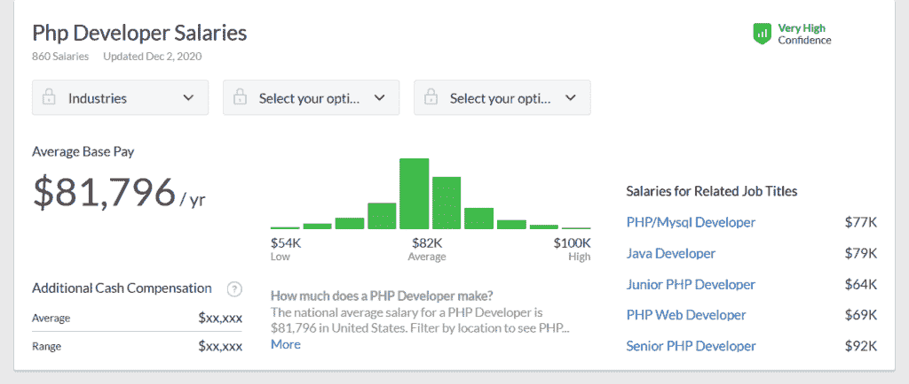
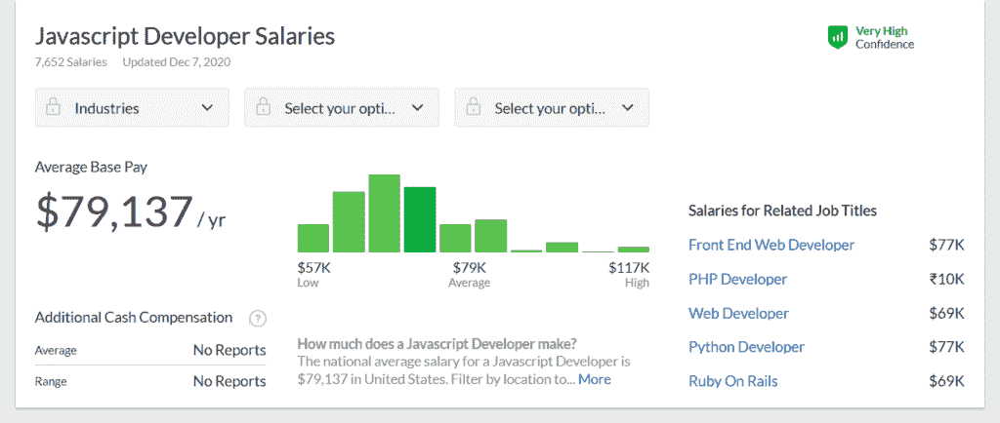
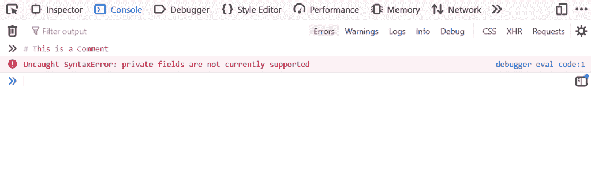
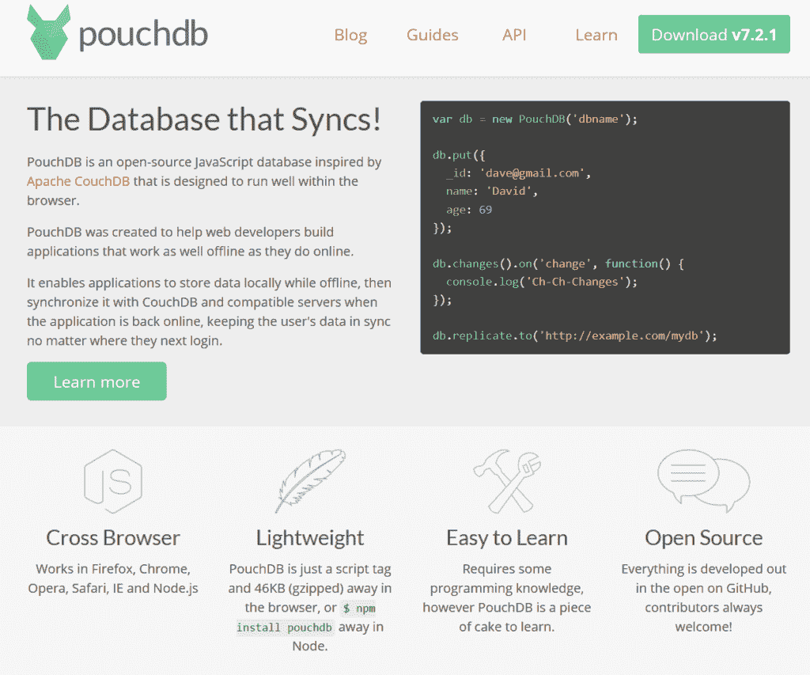
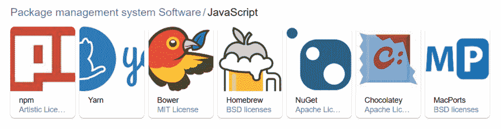
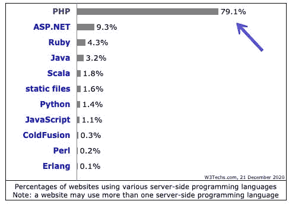
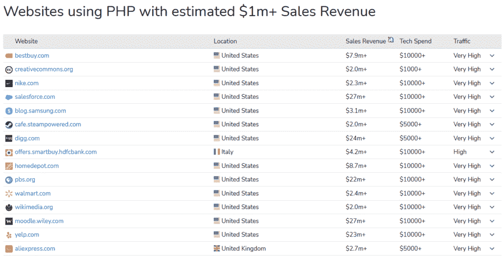
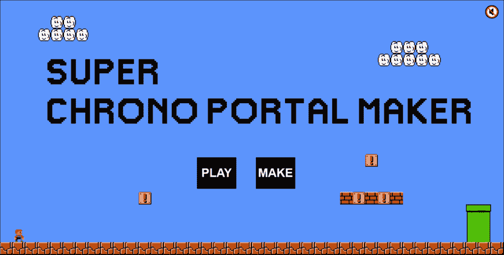
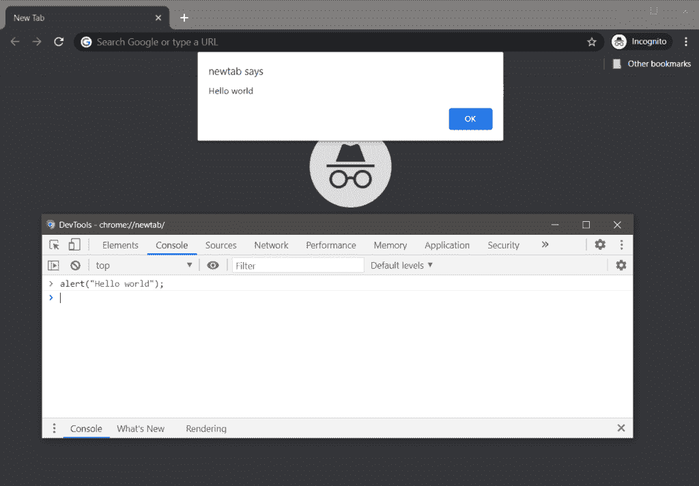
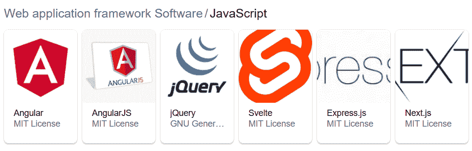

# PHP 与 JavaScript:两种脚本语言的深入比较

> 原文：<https://kinsta.com/blog/php-vs-javascript/>

PHP 和 JavaScript 都是 web 开发人员经常使用的脚本语言。但是每一种都有自己的细微差别和使用案例。

在这篇文章中，我们将探讨这两种语言之间的区别，以及在开发项目中什么时候应该使用这两种语言。

让我们先来看看这些语言是如何产生的。

### 更喜欢看[视频版](https://www.youtube.com/watch?v=hZhQyA5cvDs)？


## PHP 与 JavaScript:起源

PHP 是一种开源语言，由拉斯马斯·勒德尔夫于 1995 年发明。这个名字来自个人主页工具——一套 Rasmus 用来跟踪访问他的网站的脚本。

随着 PHP 3.0 的推出，这种语言有了一个相反的缩写: **PHP:超文本预处理器**。现在简称为 PHP。


> 需要在这里大声喊出来。Kinsta 太神奇了，我用它做我的个人网站。支持是迅速和杰出的，他们的服务器是 WordPress 最快的。
> 
> <footer class="wp-block-kinsta-client-quote__footer">
> 
> 
> 
> <cite class="wp-block-kinsta-client-quote__cite">Phillip Stemann</cite></footer>

[View plans](https://kinsta.com/plans/)

JavaScript 由网景公司的 Brendan Eich 于 1995 年创造，旨在为网络带来交互性。最初称为 Mocha，后来改名为 LiveScript，后来又改名为 JavaScript，以利用 Java 语言的流行性。

今天 JavaScript 的官方名称是 **ECMAScript** ，但是大多数人仍然这么称呼它。

所以，这两种语言已经存在了一段时间。

现在我们来看看它们的其他相似之处。

[你知道 JavaScript 最初被称为摩卡吗？或者 PHP 这个名字来源于个人主页工具？🤔在这里了解更多关于这些流行脚本语言的信息⬇️ 点击发布](https://twitter.com/intent/tweet?url=https%3A%2F%2Fkinsta.com%2Fblog%2Fphp-vs-javascript%2F&via=kinsta&text=Did+you+know+that+JavaScript+was+originally+known+as+Mocha%3F+Or+that+the+name+PHP+came+from+Personal+Home+Page+Tools%3F+%F0%9F%A4%94+Learn+more+about+these+popular+scripting+languages+right+here+%E2%AC%87%EF%B8%8F&hashtags=PHP%2CWebDev)

## PHP 和 JavaScript 的相似之处

### 语言类型

PHP 和 JavaScript 都是脚本语言。这与 Java 或 C++等“纯”编程语言相反。

[脚本语言](https://kinsta.com/blog/scripting-languages/)倾向于[解释而不是编译](https://kinsta.com/blog/scripting-languages/#mostly-interpreted-vs-compiled)。这意味着它们通过第三方而不是直接被翻译成机器代码。这对它们的运行时间有影响。

可以这样想:想象你想把一个网页从你的母语翻译成纳瓦霍语。如果你不懂纳瓦霍语，你需要一个翻译来帮助你，而翻译会花更多的时间。

这就是编译语言比解释语言更快的原因。

### 变量的类型

另一个共性是 PHP 和 JavaScript 都是**弱类型**。

这意味着当你用任何一种语言创建一个变量时，你不需要指定它的数据类型:它是假定的。

因此，您可以用 PHP 编写以下代码:

```
$x = 'Hello world';

$y = 'Bonjour le monde'; 
```

或者在 JavaScript 中:

```
var x = 'Coding is fun';

let y = 'No, honestly';
```

在这两种语言中，这些变量将被识别为字符串(字符集)。

这与像 Java 这样的强类型语言不同，在 Java 语言中，当你声明变量时，T2 必须告诉你使用的是什么类型的变量:

```
**int** x = 5;
```

PHP 和 JavaScript 都是**动态类型化的**:换句话说，你可以通过[在你的代码](https://kinsta.com/blog/code-review-tools/)中重新定义它来容易地改变类型:

```
$x = 5;
```

在 PHP 中，$x 现在是一个整数。

```
x = 3.14195;
```

在 JavaScript 中，x 现在是一个数字。

因为 PHP 或 JavaScript 中没有明确定义类型，所以您需要函数来告诉您正在使用什么数据类型。

JavaScript 有一个[类型的](https://developer.mozilla.org/en-US/docs/Web/JavaScript/Reference/Operators/typeof)函数来做这件事。

PHP 有 **gettype** 函数来返回变量的类型。gettype 的一个新的改进版本， [get_debug_type](https://kinsta.com/blog/php-8/#get_debug_type) ，是 [PHP 8](https://kinsta.com/blog/php-8/) 版本的一部分。

### 类别和对象

PHP 和 JavaScript 最初都不是面向对象的。随着语言的发展，面向对象被加入其中。

在 2004 年的**中，PHP 5 提供了创建对象和类的能力。**

JavaScript 直到很久以后才使用对象或类。随着 ES6 的引入，他们在 2015 年进入了这种语言。

一个**类**是一个通用的对象分组。

一个**对象**是一个具有**属性**(特征)和**方法**(行为)的实体。

游戏《龙与地下城》(D & D) 提供了一个很好的类比。

一个玩家角色对应一个对象。每个角色都属于一个角色类别，如野蛮人、盗贼或巫师。

对象可以有您想要定义的任意数量的属性。

因此，角色的属性可能包括:

*   名字
*   人种
*   能力(力量、智力、智慧、灵巧、体质和魅力)
*   个性类型(如大胆、胆小、好奇)
*   结盟(合法、混乱、善良、邪恶)

您可以使用对象方法来检索有关对象的信息。

下面是一个 [PHP 代码](https://kinsta.com/knowledgebase/edit-wordpress-code/)的类和对象定义的例子:

```
 <?php

class Sorcerer {

// Define properties

public $name;

public $race;

public $intelligence;

// Constructor function for the object

// takes 3 arguments, name, race and intelligence

function __construct($name, $race, $intelligence) {

$this->name = $name;

$this->race = $race;

$this->intelligence = $intelligence;

}

# Define object methods

// Get the name

function get_name() {

return $this->name;

}

// Get the race

function get_race() {

return $this->race;

}

// Get intelligence

function get_intelligence() {

return $this->intelligence;

}

} // end Sorcerer class

// Create a Sorcerer

$yensid = new Sorcerer("Yen Sid", "Human", 18);

# Output the object properties in the browser

echo $yensid->get_name();

echo "<br>";

echo $yensid->get_race();

echo "<br>";

echo 'Intelligence: ';

echo $yensid->get_intelligence();

?> 
```

当这段代码被添加到一个 [HTML 文件](https://kinsta.com/knowledgebase/how-to-upload-html-file-to-wordpress/)中时，浏览器中的输出应该如下:

Yen Sid

人类

智力:18

您还可以定义方法，这些方法是对象采取的或者已经对它们执行的操作。

在 D&D，他们可能是:

*   惊喜出击()
*   解除陷阱()
*   施法()
*   rexistpoison_)

当一个方法在一个对象上运行时，结果可能依赖于该对象的属性。因此，一个巫师的学徒对象将不能像一个老练的巫师对象那样有效地施法。

### 市场需求

PHP 和 JavaScript 的另一个共同点是这两种语言的开发者都很吃香。

使用 [JavaScript](https://kinsta.com/blog/web-developer-salary/#web-developer-salaries-by-language) 和 [PHP](https://kinsta.com/blog/php-developer-salary/) 的开发者也得到很好的补偿。

在美国，他们平均年收入约为 8 万美元。



PHP Developer Salaries, Glassdoor.com




JavaScript Developer Salaries, Glassdoor.com


### 证明文件

对于 PHP 或 JavaScript 的新手来说，不太好的消息是这两种语言的官方文档都不太用户友好。它是为有经验的开发人员而不是初学者编写的。

您可以在此处查看每种语言的文档:

*   [PHP 文档](https://www.php.net/docs.php)
*   [ECMAScript 2020 语言规范](https://www.ecma-international.org/ecma-262/)

JavaScript 教师 Chris Ferdinandi 感叹缺少好的 JavaScript 文档，说这是他花了这么长时间才掌握这门语言的原因之一。

此时，您可能想知道，“PHP 和 JavaScript 之间有什么区别？”其实有好几个。

## PHP 和 JavaScript 有什么区别？

### 服务器端与客户端脚本

PHP 是一种服务器端脚本语言。这意味着它运行在[网络服务器](https://kinsta.com/blog/nginx-vs-apache/)上，而不是客户端机器上。

服务器端编程对于向用户交付动态内容(通常来自数据库)非常有用，比如欢迎消息(“嗨，Claire！”)当用户登录时。

更严重的是，服务器端脚本被用于电子商务。例如，有超过 100 个 [WooCommerce 扩展](https://kinsta.com/blog/woocommerce-extensions/)通过 API(应用编程接口)连接到不同的支付提供商来处理交易。

JavaScript 是一种客户端语言，所以它可以在用户的笔记本电脑、手机或平板电脑上运行。

JavaScript 可以操纵代表文档对象模型的 [DOM](https://css-tricks.com/dom/) ，你可以把它想象成一个由网页的 HTML 形成的树状结构。

如果你曾经遇到过一个 accordion 或 toggle，可能是作为一个 [FAQ 插件](https://kinsta.com/blog/wordpress-faq-plugins/)的一部分，你已经看到了客户端 JavaScript 的作用。当您单击或点击一个问题时，JavaScript 事件处理程序会打开或关闭 CSS 显示或可见性属性，显示或隐藏相关答案。

### 前端与后端

PHP 运行在网站的后端——访问者看不到的部分！在 WordPress 中，这意味着 PHP 在 web 服务器和 [WordPress admin](https://kinsta.com/knowledgebase/wordpress-admin/) 中完成所有工作。

JavaScript 传统上在前端运行，但这在 2009 年发生了变化，当时推出了后端运行时 [Node.js](https://nodejs.org/en/) 。今天，JavaScript 是真正的全栈语言**。**

### 与其他语言的组合

由于 PHP 是后端语言，它是 LAMP 堆栈的一部分(Linux， [Apache](https://kinsta.com/knowledgebase/what-is-apache/) ， [MySQL](https://kinsta.com/knowledgebase/what-is-mysql/) ，PHP)。

PHP 可以和 HTML 合并。通过检查包括 WordPress 在内的许多 web 应用程序的代码，你会发现这一点。

这里有一个来自[二十二十主题](https://kinsta.com/blog/twenty-twenty-theme/)index.php 文件的例子:

```
 <header class="archive-header has-text-align-center header-footer-group">

<div class="archive-header-inner section-inner medium">

<?php if ( $archive_title ) { ?>

<h1 class="archive-title"><?php echo wp_kses_post( $archive_title ); ?></h1>

<?php } ?>

<?php if ( $archive_subtitle ) { ?>

<div class="archive-subtitle section-inner thin max-percentage intro-text"><?php echo wp_kses_post( wpautop( $archive_subtitle ) ); ?></div>

<?php } ?>

</div><!-- .archive-header-inner -->

</header><!-- .archive-header --> 
```

然而，如果你在 web 应用程序中混合使用 PHP 和其他后端语言，那么维护它们会更加困难。另外，你不仅要知道 PHP，你还必须学习并精通其他语言！

JavaScript 开发人员在编写代码时有更多的自由。他们可以将这种语言与 HTML、XML 和 Ajax 结合使用。

### 区分大小写

区分大小写是在语言中命名实体时大写字母和小写字母之间的区别。

PHP 部分区分大小写。大小写对某些事情很重要，但对其他事情不重要。

PHP 变量是**区分大小写**。

所以如果你在 PHP 中创建一个变量:

```
$dog = "chihuahua";
```

然后在代码中获取$DOG 的值，这是行不通的。

然而，PHP 函数是不区分大小写的**。**

 **如果用 PHP 创建这个函数:

```
function dogFetch() {

// your code to run when the function is called

}
```

并且稍后在您的代码中调用 DogFetch()，您的函数仍将运行。

然而，这不是好的编码实践，因为它是不一致的。

另一方面，JavaScript**完全区分大小写**。因此，名为 beagle、Beagle 和 BEAGLE 的变量都是互不相同的。

### 句法

语法是支配语言的一套规则。这包括词序、[语法](https://kinsta.com/blog/grammar-checker-tools/)和标点符号。

在英语中，我们可以说:

> 我慢慢地喝汤。

但如果你是尤达，你会这么说:

> 我慢慢地喝汤。

为什么？语法不同。同样的词，不同的顺序。

## 注册订阅时事通讯


### 想知道我们是怎么让流量增长超过 1000%的吗？

加入 20，000 多名获得我们每周时事通讯和内部消息的人的行列吧！

[Subscribe Now](#newsletter)


[The Yoda-Speak Generator](http://www.yodaspeak.co.uk/)


一些语言使用看起来一样的词，但它们有不同的意思。


Lui in French means “him” in English


Lui in Italian means “he” in English


如果我们用错了词，人类是可以原谅的，但是计算机是非常字面上的。如果我们在编程语法上犯了错误，计算机通常不知道我们的意思，这通常会导致错误。

对于 JavaScript 和 PHP，它们对于单行代码注释都有相同的双正斜杠语法:

```
// This is a comment
```

但是 PHP 还有另一种形式的注释语法:

```
# This is a comment
```

如果您尝试在 JavaScript 中使用 PHP 注释语法，您会得到一个错误:

```
# This is a Comment

Uncaught SyntaxError: private fields are not currently supported
```



JavaScript Uncaught SyntaxError


其他语法错误对于 JavaScript 和 PHP 都是常见的，例如:

*   缺少分号(；)在一行代码的末尾。
*   条件语句不使用一对花括号{}。

### 变量和常量定义

正如我们前面看到的，JavaScript 和 PHP 有不同的声明变量的方式。

他们也以不同的方式定义[常数](https://press.rebus.community/programmingfundamentals/chapter/constants-and-variables/)。

JavaScript 使用以下语法:

```
const x = 6;
```

对于这样一个简单的常数，它的值以后不能改变。

而 PHP 对常量使用 define()函数。

```
define(*name*, *value*, *case-insensitive*)
```

按照惯例，PHP 常量是大写的。一个例子是:

```
define('MONSTER', 'Sulley');
```

括号中的前两个参数不言自明。

第三个，*不区分大小写*，默认值为 *false* 。只有当设置为*真*时，常量才不区分大小写。

那就是:

```
define('MONSTER', 'Sulley', true);
```

### 数组

数组是可以存储多种内容的变量。

在 PHP 中，数组是**关联数组**或者有序映射。也就是说，数组中的项具有相关的键和值对。

```
<?php

$array(

key => value,

key2 => value2,

...

)
```

下面是一个不太抽象的例子，其中键是名，值是姓。

```
<?php

$array = array(

"Frodo" => "Baggins",

"Sam" => "Gamgee",

"Merry" => "Brandybuck",

"Pippin" => "Took",

);
```

为了方便使用，你可以[将 PHP 对象转换成数组](https://www.edureka.co/blog/convert-object-to-array-in-php/)，而[将数组转换成对象](https://thisinterestsme.com/convert-php-array-object/)。

然而，JavaScript 只能拥有索引号为的数组。例如:

```
var mountains = [

"Everest",

"Kilimanjaro",

"Fuji"

];
```

要检索一个值，你必须引用数组索引，从 0 开始。

```
var mountain = mountains[1];
```

JavaScript 不支持带有名为索引的**的关联数组。**

需要为您的客户站点提供超快的、安全的、开发人员友好的托管服务吗？Kinsta 是为 WordPress 开发者设计的，提供了大量的工具和强大的仪表板。[查看我们的计划](https://kinsta.com/plans/?in-article-cta)

### 数据库集成

PHP 可以做得很出色的一件事是连接到数据库。PHP 与 WordPress 都使用的 [MySQL 或 MariaDB](https://kinsta.com/blog/mariadb-vs-mysql/) 集成得特别好。许多 [PHP 框架](https://kinsta.com/blog/php-frameworks/)也提供了简单的数据库集成。

使用数据库有助于搜索、排序和筛选信息以呈现给用户，例如在线商店中的产品。

从历史上看，JavaScript 不与数据库集成，尽管这种情况正在开始改变。

PouchDB 是 JavaScript 数据库的一个例子。



PouchDB open source JavaScript database


### 穿线

线程指的是编程语言可以处理的指令。

**PHP** 是**多线程**，意思是可以并行处理多条指令。

相反的是类似 **JavaScript** 的**单线程**语言，一次只能处理一个命令。

为了说明线程，开发人员 Samim Yaquby 将[比作一家为顾客服务的咖啡店](https://medium.com/@samimyaquby/how-can-javascript-be-asynchronous-and-single-threaded-at-the-same-time-c13c99bb4703)。

对于只有一个咖啡师的小咖啡馆来说，咖啡师先为顾客服务更简单的订单，一次一个，更容易也更有效率。这类似于 JavaScript 的单线程。

相比之下，大型星巴克最有可能让几个咖啡师同时完成同样的订单。这与 PHP 的多线程方法相呼应。

### 速度

一般来说，在相同的硬件上，JavaScript 比 PHP 执行得更快。然而，因为 JavaScript 在客户机上运行，所以如果客户机老旧且运行缓慢，就会对执行时间产生连锁反应。

自从 [PHP 7](https://kinsta.com/blog/10-things-not-to-do-in-php-7/) 发布以来，PHP 的速度有了突飞猛进的提高，这要归功于一个新的引擎，它将性能提高了一倍，并改善了内存消耗。与 PHP 5.6 相比，PHP 7.0 可以处理两倍多的请求，并且每个 7.x 版本的性能都有进一步的提高。

当你构建实时应用程序，比如聊天机器人或游戏时，PHP 也比 JavaScript 运行得更好。

带有[即时编译器](https://kinsta.com/blog/php-8/#jit)的 PHP 8 的发布有望让 PHP 变得更快。

### 包管理器

每种语言都有自己的包管理器来管理**包**:第三方可重用代码模块，为项目增加额外的功能。一些包依赖于其他包来运行，所以它们被称为**依赖**。

PHP 有两个包管理器，PEAR 和 Composer，它们可以在 [Packagist](https://packagist.org/) 仓库上下载 PHP 包。

JavaScript 有几个知名的包管理器，包括 [npm](https://www.npmjs.com/) 、 [Yarn](https://yarnpkg.com/) 、 [Bower](https://bower.io/) 。



JavaScript package managers


其中， **npm** 最受欢迎，全球有超过 1100 万开发者在使用它。

### 网络上的使用

PHP 是当今网络上使用最多的服务器端语言，轻松击败了近 80%使用它的网站的竞争对手。



W3Techs server-side programming languages


虽然 PHP 非常流行，但 JavaScript 在网站上几乎无处不在，97%的网站都在使用它。


W3Techs client-side programming languages


#### PHP 是用来做什么的？

PHP 的用途非常广泛。

它最出名的可能是创建动态网页。据 BuiltWith 称，PHP 被超过 3400 万个网站使用，它为一些最知名和收入最高的网站提供支持，包括耐克、Salesforce 和沃尔玛。



[Websites using PHP with estimated $1m+ Sales Revenue](https://trends.builtwith.com/websitelist/PHP/%241m-Sales-Revenue)


如果您的项目需要安全的用户认证，PHP 是一个完美的选择。这包括 cookie 和会话处理、用户名和密码认证以及[双因素认证](https://kinsta.com/blog/wordpress-two-factor-authentication/)。

如前所述，PHP 非常适合处理数据库，因为它可以与许多数据库进行交互。它还内置了处理用户输入的数据安全性，以防范像 SQL 注入攻击这样的威胁。

PHP 也常用于构建实时应用程序，如即时消息。

最后，即使你在前端完成大部分工作，你也需要一个服务器后端。PHP 是一个理想的选择，因为这是它的初衷。

#### JavaScript 是用来做什么的？

JavaScript 已经变得如此流行，也许正确的问题是，“JavaScript 不用于什么用途？”

除了网站和网络应用程序，JavaScript 还被用于构建以下所有内容:

*   移动应用
*   网络服务器
*   比赛
*   幻灯片
*   聊天机器人
*   …甚至是可编程无人机



[Super Chrono Portal Maker](https://js13kgames.com/games/super-chrono-portal-maker/index.html), an HTML5 and JavaScript game


#### JavaScript 可以和 PHP 一起用吗？

答案是肯定的，绝对的。

一个常见的例子是使用 [web 表单](https://kinsta.com/blog/wordpress-forms/)，在将用户输入保存到数据库之前对其进行验证是非常有用的。

您可以使用 JavaScript 进行客户端验证，例如检查电子邮件的格式是否正确。接下来，您可以使用 PHP 进行服务器端验证，例如检查电子邮件是否存在于您的数据库中。

## WordPress 如何使用 JavaScript 和 PHP

传统上，WordPress 两种语言都用，但是 PHP 比 JavaScript 用得多。随着古腾堡编辑的引入，这种情况开始改变。

在 2015 年美国世界语言营的马特·莫楞威格演讲中，他通过鼓励观众来展示 JavaScript 将会变得多么重要

> “学 JavaScript，深入。”

就目前情况来看，这是两种语言在 WordPress 中的用法。

PHP 用于主题模板文件、循环、认证、验证和数据库访问。

JavaScript 增强了主题和插件的交互性、客户端验证和事件处理。最值得注意的是，[块开发](https://kinsta.com/blog/wordpress-5-6/#block-api-v2)需要一些 JavaScript 知识，因为块依赖于 [React JS](https://reactjs.org/) 框架。

## 学习 PHP 和 JavaScript

因为它们相当容易学，没有理由你不能既学 PHP 又学 JavaScript。

这两种语言依赖于某些编程基础，如变量、循环、条件语句、范围和对象。

因为它是如此成熟和流行的语言，所以学习 PHP 很容易。

由于 PHP 是一种服务器端语言，你需要一个服务器来编写代码。这可能是一个真正的 web 服务器，或者是一个 web 服务器的模拟，比如一个本地开发环境。一些例子是[德夫金斯塔](https://kinsta.com/devkinsta/)，XAMPP，WAMP，或 MAMP。

通过在浏览器控制台中练习，您可以很容易地开始学习 JavaScript。

在 Chrome 浏览器上，你可以通过 Windows 上的 Control+Shift+J 快捷键，或者 Mac 上的 Command+Option+J 来访问控制台。



A simple Hello World program in Chrome’s JavaScript console


JavaScript 变得更难掌握的地方在于其生态系统的庞大规模。

JavaScript 语言已经从普通的 JavaScript 扩展到了大量的框架。Angular、Vue、[、jQuery](https://kinsta.com/knowledgebase/what-is-jquery/) 和 [React](https://kinsta.com/knowledgebase/what-is-react-js/) 只是现在存在的许多应用中的一部分。



Some JavaScript frameworks


对于初学者来说，一个很好的资源来自 MDN Web Docs 的 [JavaScript 文档](https://developer.mozilla.org/en-US/docs/Web/JavaScript)。

Chris Ferdinandi 因用普通 JavaScript 教育人们而出名，他说 JavaScript 只是在他学会 jQuery 后才真正为他所用。

他给 JS 新手的建议是:

> “不要拘泥于学东西的顺序。不要浪费时间去挑选完美的东西，因为没有完美的东西。”

在不理解 HTML 和 CSS 的基础知识的情况下，只需注意 JavaScript 框架的闪亮对象综合症。HTML 支撑着网络上的一切，如果被过于急切的 JavaScript 开发人员处理不当，它可能会崩溃。

## PHP 与 JavaScript —对照表

| **PHP** | **JavaScript** |
| 服务器端脚本 | 客户端脚本 |
| 在后端使用 | 在前端使用(现在是 Node.js 的全栈) |
| 仅与 HTML 结合 | 结合多种语言 |
| 部分区分大小写 | 完全区分大小写 |
| 语法差异，例如允许# for 注释 | 语法差异，例如不允许# for 注释 |
| 用$前缀声明的变量 | 用 var 或 let 关键字声明的变量 |
| 有关联数组 | 没有关联数组 |
| 与许多数据库集成 | 数据库支持差或不存在 |
| 多线程 | 单线程的 |
| 快速如果 PHP 7.0 或以上 | 通常比 PHP 快 |
| 使用 PEAR 和 Composer 包管理器 | 使用 npm、Yarn 和 Bower 包管理器 |
| 如果 PHP 版本大于 7.x，运行速度很快 | 通常比 PHP 快 |
| 在大约 80%的网站上使用 | 几乎在所有网站上使用 |

[想深入了解两种最流行的脚本语言吗？👩‍💻在这里发现它们的相同点、不同点和深入的比较图表！](https://twitter.com/intent/tweet?url=https%3A%2F%2Fkinsta.com%2Fblog%2Fphp-vs-javascript%2F&via=kinsta&text=Want+to+dive+deep+into+two+of+the+most+popular+scripting+languages%3F+%F0%9F%91%A9%E2%80%8D%F0%9F%92%BB+Discover+their+similarities%2C+differences%2C+and+an+in-depth+comparison+chart+here%21&hashtags=JavaScript%2CWebDev)

## 摘要

在这场 PHP 与 JavaScript 的较量中，没有真正的赢家。他们都有自己的长处和短处。

PHP 稳定可靠，而 JavaScript 已经成为最酷的产品。但这并不意味着一个比另一个好。

无论你为下一个项目选择哪一个——都有可能！—如果你花时间去理解这门语言，你可以肯定你会建立一个让你的用户高兴的网站或应用程序。

* * *

让你所有的[应用程序](https://kinsta.com/application-hosting/)、[数据库](https://kinsta.com/database-hosting/)和 [WordPress 网站](https://kinsta.com/wordpress-hosting/)在线并在一个屋檐下。我们功能丰富的高性能云平台包括:

*   在 MyKinsta 仪表盘中轻松设置和管理
*   24/7 专家支持
*   最好的谷歌云平台硬件和网络，由 Kubernetes 提供最大的可扩展性
*   面向速度和安全性的企业级 Cloudflare 集成
*   全球受众覆盖全球多达 35 个数据中心和 275 多个 pop

在第一个月使用托管的[应用程序或托管](https://kinsta.com/application-hosting/)的[数据库，您可以享受 20 美元的优惠，亲自测试一下。探索我们的](https://kinsta.com/database-hosting/)[计划](https://kinsta.com/plans/)或[与销售人员交谈](https://kinsta.com/contact-us/)以找到最适合您的方式。**