# 谷歌搜索运营商:2022 年要知道的 40 个命令(改进研究、竞争分析和搜索引擎优化)

> 原文：<https://kinsta.com/blog/google-search-operators/>

谷歌搜索运营商让网上搜索变得更好。

一旦你掌握了其中的一些特殊命令，你会想没有它们你是怎么做到的。

在本帖中，我们将引导你了解一些最好的谷歌高级搜索操作符(实际上是有效的),并向你展示如何有效地使用它们。

### 更喜欢看[视频版](https://www.youtube.com/watch?v=Txd428VEoFs)？

## 什么是谷歌搜索运营商？

谷歌搜索操作符(有时称为*谷歌高级搜索操作符*或*谷歌搜索命令*)是扩展谷歌常规文本搜索功能的特殊命令。

搜索操作者帮助你缩小搜索结果的范围，他们可以用于从内容研究到寻找在线讨论到技术搜索引擎优化审计的任何事情。

> Kinsta 把我宠坏了，所以我现在要求每个供应商都提供这样的服务。我们还试图通过我们的 SaaS 工具支持达到这一水平。
> 
> <footer class="wp-block-kinsta-client-quote__footer">
> 
> 
> 
> <cite class="wp-block-kinsta-client-quote__cite">Suganthan Mohanadasan from @Suganthanmn</cite></footer>

[View plans](https://kinsta.com/plans/)

它们也可以和其他搜索引擎一起使用，比如必应和雅虎。

就像 [Gmail 搜索操作符](https://kinsta.com/blog/gmail-search-operators/)一样，使用谷歌搜索操作符帮助你在每个人最喜欢的搜索引擎中准确找到你要找的东西。

它们包括像这样的基本定义:

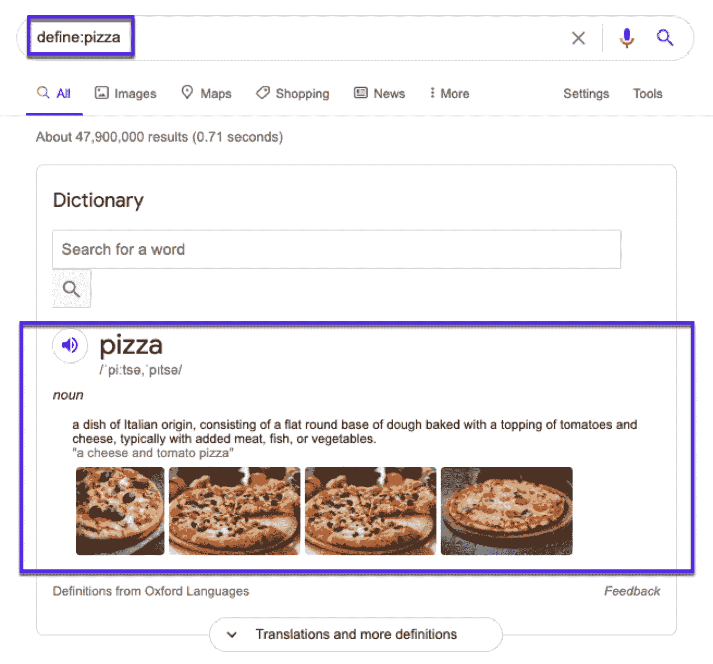

An example of the definition function using Google Search Operators

要发现网站的高级指数化问题:

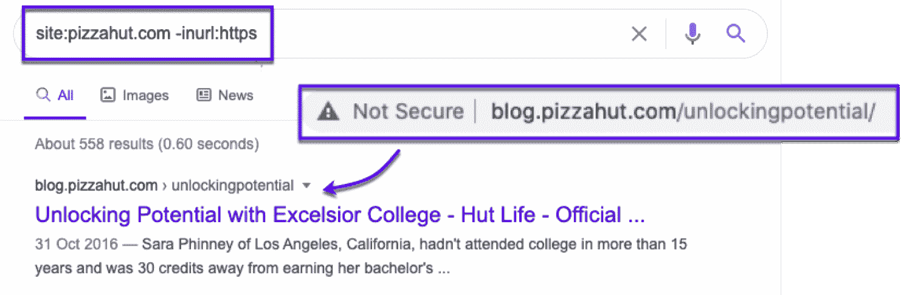

Example of an Advanced Google Search Operator to find not secure site pages

### 为什么使用谷歌搜索命令？

根据互联网实时统计数据，每天有 35 亿次谷歌搜索。为了找到你想要的信息，需要浏览大量的搜索结果。

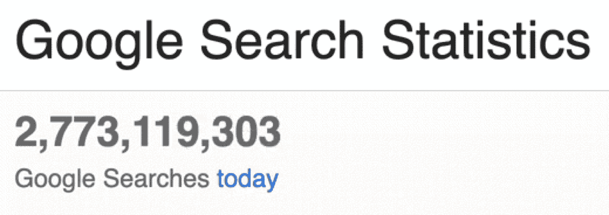

Live stats for Google searches

除了展示你的搜索技能:使用搜索命令可以更快地在谷歌上找到东西。

截至 2020 年 10 月，谷歌拥有 92.71%的全球市场份额。要找到你想要的东西，需要进行大量的搜索。

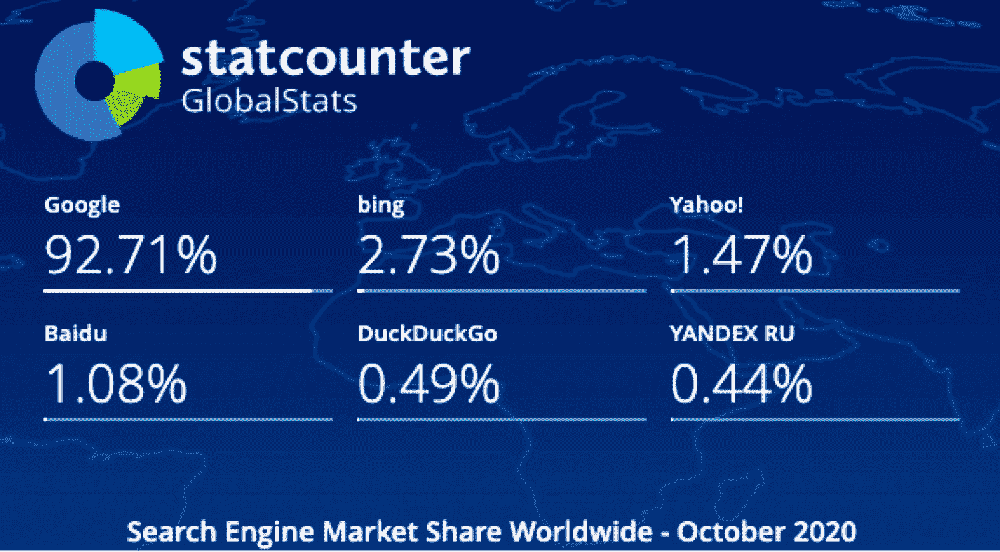

Search Engine Market Share statistics

谷歌搜索运营商通过改进网络搜索让你的生活变得更容易。那么，如何使用这些神奇的谷歌作弊代码快速找到网页呢？

其实很简单:

## 我如何使用谷歌搜索运营商？

这就像在谷歌上搜索一样简单。您可以像进行文本搜索一样，直接在 Google 搜索框中输入搜索运算符:

Using search operators is as simple as doing a Google search

除了特殊情况(比如“in”操作符)，Google 将返回标准的有机结果。

您可以在搜索词中使用符号和/或单词，以使您的结果更加准确。

请记住:

*   谷歌通常会忽略任何标点符号(不属于搜索操作符)。
*   不要在符号或单词与您的搜索词之间包含空格。使用这个搜索命令， **site:kinsta.com** 可以工作，但是这个【kinsta.com】site:T2 不行。

## 谷歌搜索运营商列表

以下是所有谷歌高级搜索运营商的完整列表:

*   **“搜索词”**使用它进行精确匹配搜索。
*   **或**搜索这个或那个。这将返回与这两个术语或两者都相关的结果。
*   **和**搜索这个和那个。这将只返回与这两个术语相关的结果
*   **–**排除术语或搜索短语。
*   ***** 充当通配符，将匹配任何单词或短语。
*   **( )** 对多个术语或运算符进行分组，以控制搜索的显示方式。
*   **$** 搜索价格。
*   **定义**:在类似卡片的结果中显示单词的含义。
*   **Cache:** 返回网页的最新缓存版本(只要该网页有索引)。
*   **文件类型:**显示某种文件类型(PDF、DOCX、TXT、PPT 等)的结果。)
*   **网站:**将结果限制在特定网站。
*   **相关:**查找与另一个站点相关的站点。
*   **intitle:** 查找标题中包含特定单词的页面。
*   **allintitle:** 像“intitle”一样，它查找包含页面标题中所有特定单词的网页。
*   **inurl:** 在 url 中查找带有某个单词的页面。
*   allinurl: 与“inurl”类似，它查找包含 url 的所有特定单词的网页。
*   **intext:** 在内容中查找包含特定单词的页面。
*   **allintext:** 查找包含页面某处所有特定单词的结果。
*   **AROUND(X)** 这种近似搜索查找包含两个单词(或短语)且彼此相距 X 个单词的页面。
*   **天气:**查找特定位置的天气。
*   **股票:**查看股票信息
*   **地图:**查看位置搜索的地图结果。
*   **电影:**查找特定电影的信息。
*   **在**中将一个单位转换成另一个单位(如货币、重量、温度等。)
*   **来源:**在谷歌新闻内查找某个来源的新闻结果。

## 如何组合谷歌搜索运营商

谷歌搜索操作符最有用的一点是，你可以针对特定的用例组合它们。

你可以快速找到任何东西的引用、原始图片甚至官方文档的来源。

**只是一个警告:**如果你开始组合运算符并运行大量搜索，你可能会被提示证明你不是一个试图向谷歌发送垃圾邮件的邪恶机器人:

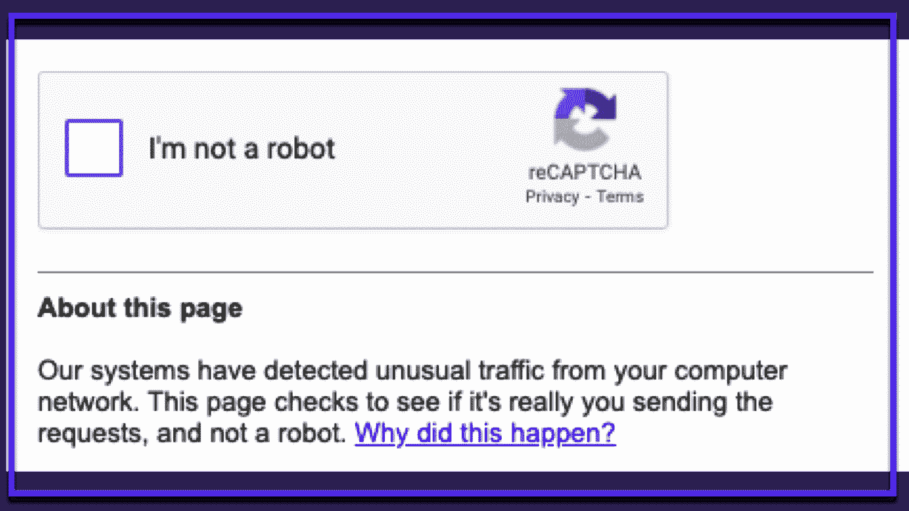

You’ll probably see this Google reCAPTCHA if you use too many operators

只需填写验证码(除非你是邪恶的机器人)，然后继续搜索。

发挥你的想象力。有许多搜索运算符组合。这里只是几个组合搜索命令的例子，可以从中获得灵感。

## 40 家高级谷歌搜索运营商

知道组成搜索操作符的不同部分是有用的，但是有一些特定的用途更有用。

所以，让我们把这些谷歌搜索运营商付诸行动。借助 Google 的高级操作符，您可以通过一些想象(以及一些尝试和错误)实现任何事情。

不要害怕尝试和编辑下面的例子。你可能会发现一个很酷的新搜索命令。

我们走吧:

### 1.查找相关网站

`related:[website]`

假设你已经找到了一个你想要链接的网站，或者你只是想收集尽可能多的类似网站来做一些竞争对手的研究。使用 **related:** 搜索操作符会显示与你添加的 [URL](https://kinsta.com/knowledgebase/what-is-a-url/) 相关的类似网站。

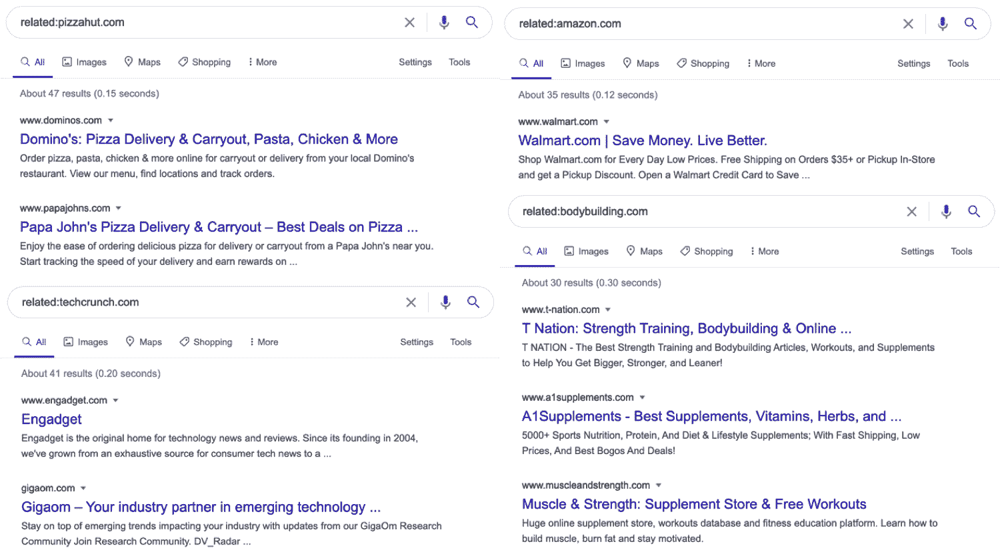

Find a bunch of link prospects related to your keyword

就这么简单。

### 2.查找页面以添加内部链接

`Site:[website] keyword`

这是我最喜欢的帮助改进 SEO 的方法之一。多亏了谷歌搜索运营商，这很快就能做到。

内部链接帮助访问者和谷歌浏览你的网站。但是要想从中受益，你需要将它们添加到相关页面中。

这就是谷歌运营商让这变得容易的地方。

只需在你的网站上搜索一个词或短语，谷歌就会向你展示相关的页面，你可以在内部链接。

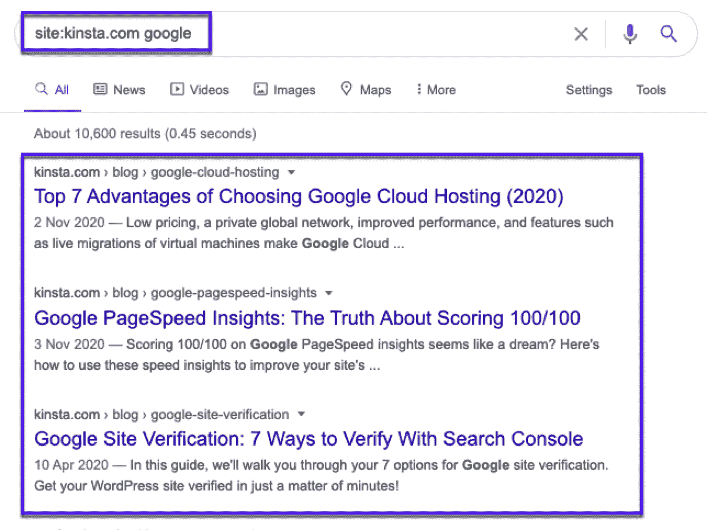

Find internal link opportunities with the site: search operator

现在你可以进入这些页面，添加一个内部链接。UX 提高了，你得分的机会也提高了。还不错吧。

### 3.搜索特定网站上的内容(并找到任何索引错误)

`site:[website]`

你可以使用*网站从一个特定的网站上找到*一些东西，并将你的搜索限制在那个网站上。例如，您可以使用它来查找[联系页面](https://kinsta.com/blog/wordpress-contact-form-plugins/)或特定网站的链接机会。

或者，您可以使用此运算符来查找特定内容:

**站点:[网站]“关键词”**

这将显示您在网站上搜索过的包含您添加的关键字的任何页面。

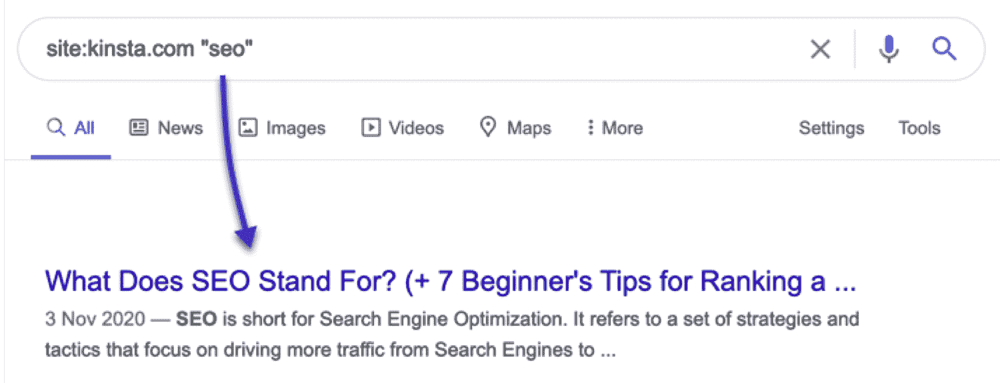

Find exact match content on your site

这是找到添加内部链接的页面的好方法(这样你就能为你的网站带来更多的流量)。

您还可以使用这个 Google 搜索操作符来查找任何指数化错误。可能是你想让谷歌索引的页面没有出现。反之亦然，你可能会发现你不想被索引的页面出现了(你可能需要[保持它们的私密性](https://kinsta.com/knowledgebase/wordpress-private-page/))。

假设你用这个操作符检查你的博客文章有多少显示在谷歌上:

**网站:yourwebsite.com/blog**

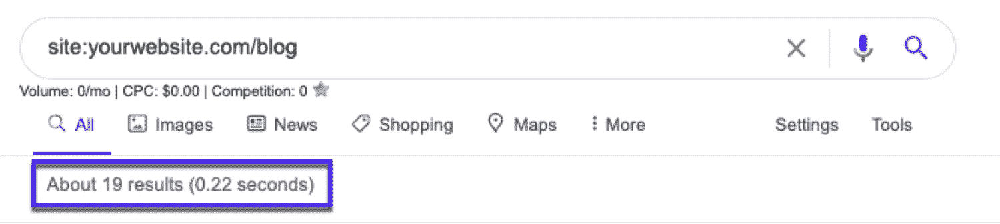

Find indexed blog posts in Google super quick

你看到 19 页被索引，但知道你已经发表了 50 篇文章…那么这将是一个足够好的理由来调查其他(非索引)文章发生了什么。

请记住，使用这种方法来评估谷歌指数化只是一个非常粗略的估计。为了获得更准确的搜索引擎结果，请查看 T2 的谷歌搜索控制台。

### 4.查找精确匹配

`"[search term]"`

如果您在单词或短语周围加上引号，搜索结果将只包含与引号中的单词或短语完全匹配的结果。

Find pages that that match exactly your keyword

您可以利用该操作员通过以下方式发现客座博文机会:

*   “为我们写作”
*   “成为贡献者”
*   "贡献给"
*   “为我写作”
*   《客座博文指南》

您甚至可以更进一步，将精确匹配操作符与 **site:** 操作符结合起来，搜索特定网站的精确文本。这对于寻找[重复内容](https://kinsta.com/blog/content-scraping/)非常有用。

### 5.排除特定的单词或短语

`-[keyword]`

在这个 Google 搜索操作符中，在搜索词前使用减号来从搜索结果中删除特定的关键字。当你在寻找有不止一个意思的东西，并想排除另一个意思的时候，这很有帮助。

如果你想删除一些带有商标的搜索结果，这也很有用。您也可以排除多个关键字。

### 6.包括特定的单词或短语

`keyword1 +keyword2`

如果你想确保某些[关键词明确包含在每个搜索结果的](https://kinsta.com/blog/keyword-research/)中，你可以在某个词前使用 **+** 操作符。如果你专门在一个特定的主题中搜索，这是很有用的。

### 7.返回页面的缓存版本

`cache:[website]`

使用**缓存:**谷歌搜索运营商将返回谷歌上可用网页的最新缓存版本。如果一个[网站关闭了](https://kinsta.com/blog/website-downtime/)，而你仍然想在上面阅读一些东西，这可能是有用的。

请记住，缓存版本可能不会像网站直播那样好看:

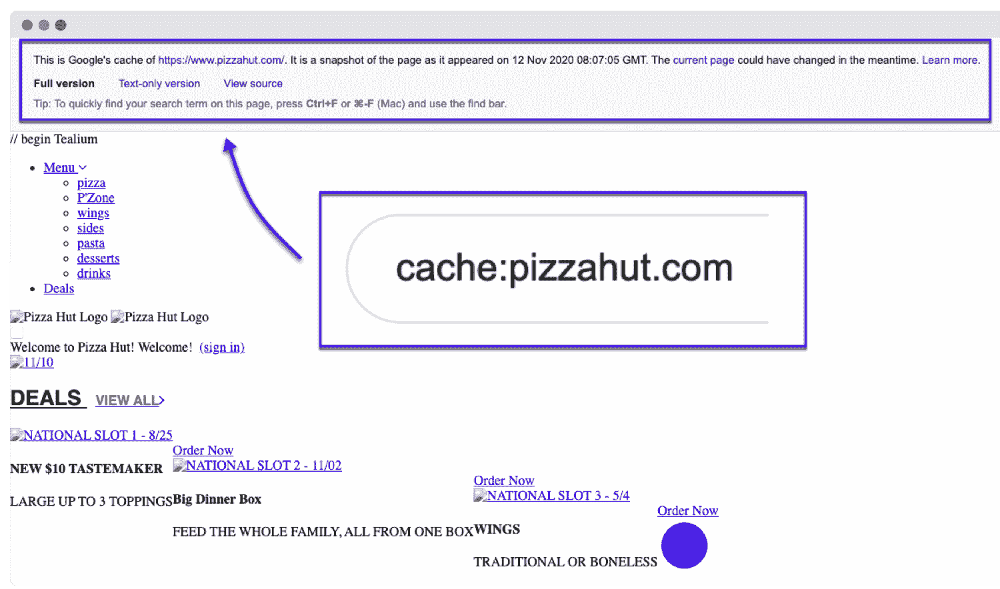

Quickly view the cached version of a webpage

### 8.在 URL 中搜索特定关键字

`inurl:[keyword]`

在 **inurl:** 操作符后接一个关键字，列出所有在 [URL](https://kinsta.com/knowledgebase/what-is-a-url/) 中包含该关键字的搜索结果。这在寻找客座博文机会、联系页面或潜在的直接竞争对手时很有帮助。

您可以尝试的示例:

*   inurl:客座博文
*   Inurl:来宾-投稿人-指南

尝试这个搜索操作符**关键字 inurl:guestpost** 来查找[接受与你搜索的关键字相关的](https://kinsta.com/blog/how-to-drive-traffic-to-your-website/#18-write-some-guest-posts)客座博文的网站。

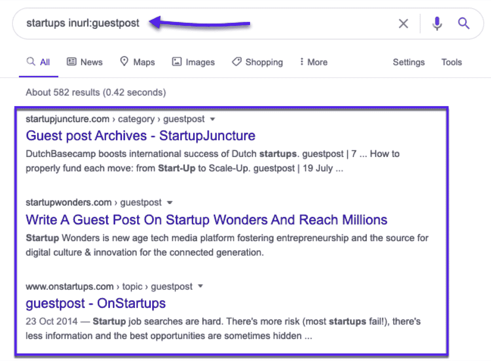

Find guest post opportunities related to your niche

您将关键字放在哪里并不重要(在搜索运算符之前还是之后):

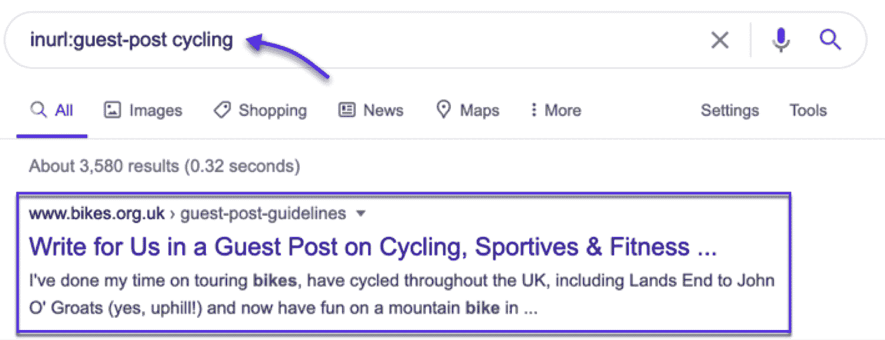

Find potential sites to publish guest posts on

### 9.在页面标题中查找关键词

`intitle:`

**intitle:** Google operator 显示在[页面标题](https://kinsta.com/knowledgebase/hide-page-title-wordpress/)中有指定关键字或短语的结果。

像所有搜索操作符一样，您可以将大多数操作符链接在一起以获得定制的结果。

例如，您可以对“mountain bike”进行精确搜索，并将其与 intitle:操作符结合使用，以便只显示页面标题中包含“2020”的页面。

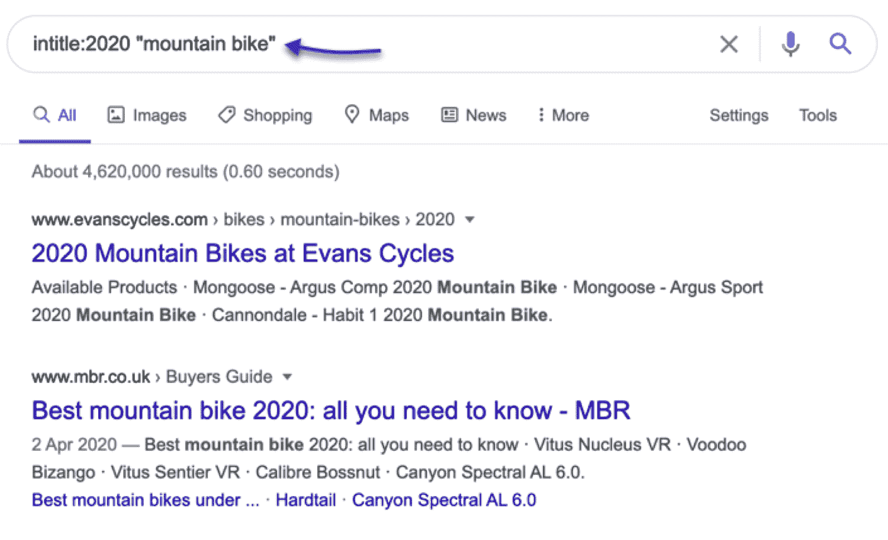

Find results that contain the keywords you define

对于查找最新的产品指南非常有用。

### 10.在页面标题中查找准确的关键词

`allintitle:`

类似于 intitle:但更具体。如果您以**all title:**开始查询，Google 将只显示包含您指定的页面标题中所有术语的结果。

例如，使用命令**allin title:pizza is amazing**将只显示标题中包含术语“pizza is amazing”的结果。

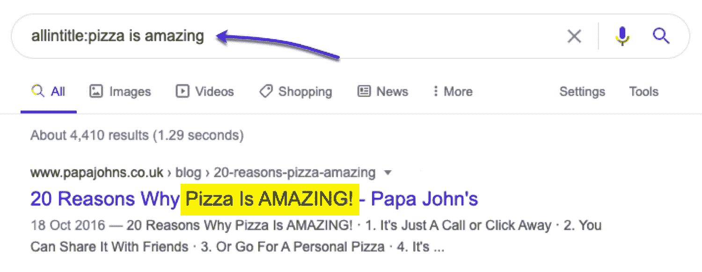

Find results that exactly match your keywords

别忘了，这不仅仅是谷歌搜索公司的工作:

*   **在图像搜索中**all title:将显示文件名包含您指定的术语的图像。
*   Google 新闻中的 allintitle:将显示标题中包含您指定的术语的文章。

### 11.在页面文本中查找关键词

`intext:`

像前面的操作符一样，Google 搜索操作符 **intext:** 将显示包含您在页面文本中指定的关键字的任何结果。

因此，如果你正在寻找关于特定主题的文章，这个操作符可以帮助你优化搜索。

### 12.在页面文本中查找准确的关键词

`allintext:`

**allintext:** 操作符将帮助您在页面文本中查找整个短语或关键字。

假设您知道自己在一篇文章中提到了一个术语或短语，但不记得是哪篇文章了。使用此运算符进行检查。

例如，我们知道之前在博客上提到过“【WordPress 网站的流量比较… ”，但是我们不记得在哪里了。

(提示:在我们的[文章中，SEO 代表什么](https://kinsta.com/blog/what-does-seo-stand-for/)

allintext 操作符将为我们揭示文本中的这个短语:

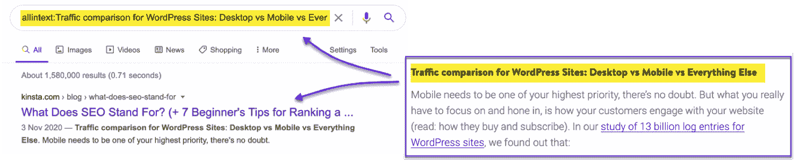

Find any phrases used across a domain

### 13.在锚文本中查找关键字

`inanchor:`

这个操作符对 SEO 非常有用。**anchor:**搜索操作符显示在锚文本中包含您指定的关键字的页面。

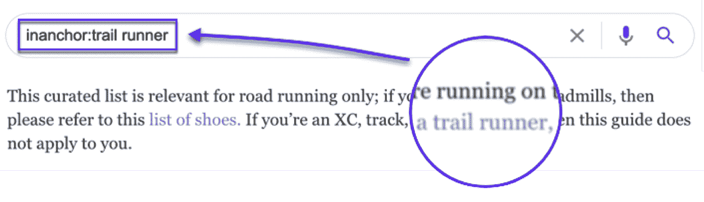

Find keywords inside anchor texts

### 14.在锚文本中查找准确的关键字

`allinanchor:`

Google 搜索操作符在锚文本中显示整个关键词/短语:

老实说，您最终可能会比常规的 inanchor:命令更多地使用这个操作符，因为它更准确。

### 15.在 URL 中查找关键字

`inurl:`

**inurl:** 操作符将向您显示包含您在 URL 中指定的关键词[的结果。](https://kinsta.com/blog/wordpress-permalinks/)

对于试图记住您忘记的 URL 或查找关于特定主题的页面非常有用。

## 注册订阅时事通讯

### 想知道我们是怎么让流量增长超过 1000%的吗？

加入 20，000 多名获得我们每周时事通讯和内部消息的人的行列吧！

[Subscribe Now](#newsletter)

### 16.在 URL 中查找精确的关键字

`allinurl:`

像前面的操作符一样，这显示了出现在 URL 中的关键字。只是这一次，它将显示您指定的整个关键字或短语。

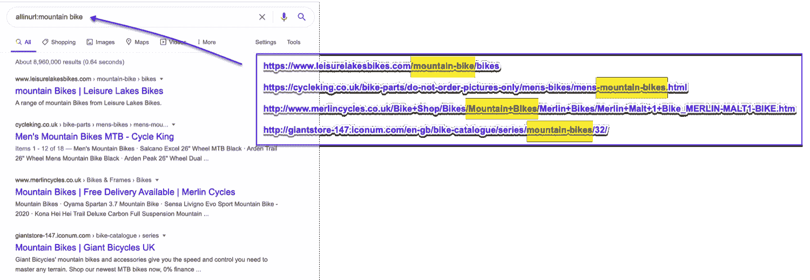

Find exact keywords inside of URLs

### 17.查找由特定作者创建的内容

`postauthor:`

这个搜索操作符帮助您快速找到内容创建者。只要输入他们的名字，你就能很快找到他们写的博客和文章。

使用这个谷歌搜索工具的一个很好的方法是找到在你的领域有影响力的人，他们可能愿意分享你的工作或者为你的网站做贡献。如果你正在做 SaaS 市场营销，这可能会特别有帮助。

你也可以用它在你的内容中找到有影响力的链接，建立一些(互利的)关系。

### 18.搜索特定位置

`loc:`

**loc:** 操作符(具有特定位置)将帮助您将结果集中到该区域。

如果你正在做本地搜索引擎优化，这个基于地理位置的谷歌搜索运营商可能会成为你寻找同一个地理位置的受众的最好的朋友。

### 19.排除任何子域

`site: [website.com] -inurl:www`

这两个操作符的组合 **site: + -inurl:** 有助于缩小搜索结果的范围，这样你就可以浏览一个站点的[子域](https://kinsta.com/blog/wordpress-subdomain/)。

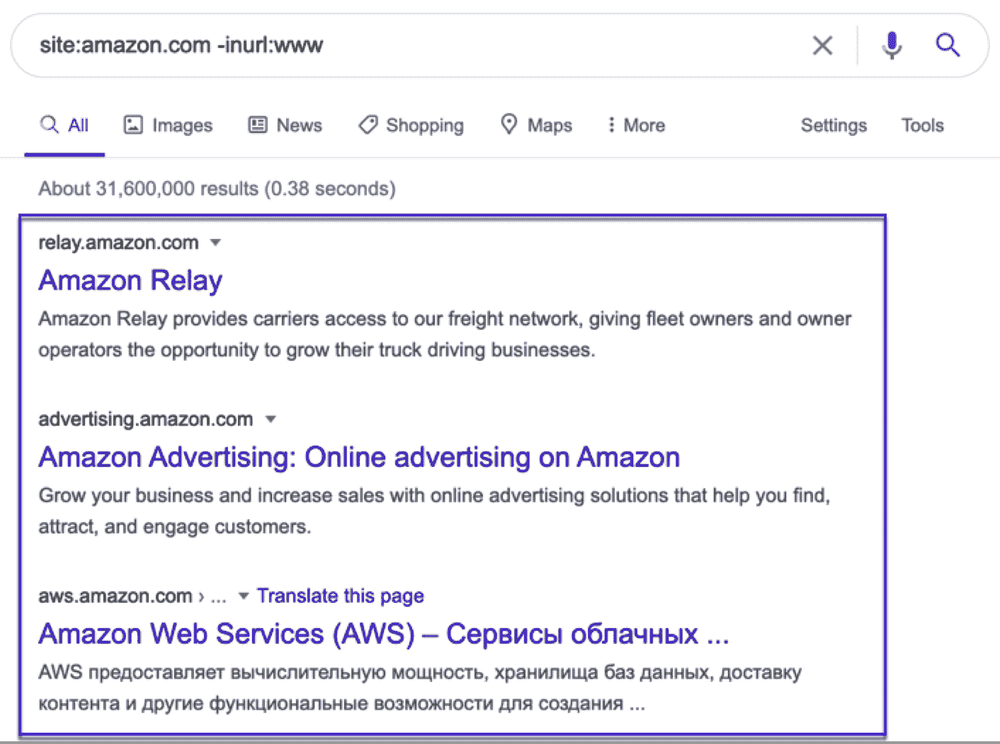

Exclude any subdomains from showing in Google

这个搜索命令过滤掉了 **www 子域**。任何以 **www** 开头的内容都将被排除在搜索结果之外，留给你查看子域名。

### 20.搜索特定类型的文件

`filetype:[extension]`

**filetype:** 操作符帮助您找到具有特定文件扩展名的目标页面。Google 将只返回您定义的特定类型文件的结果。当你想查找 PDF 或 PPT 文件时，它非常有用。

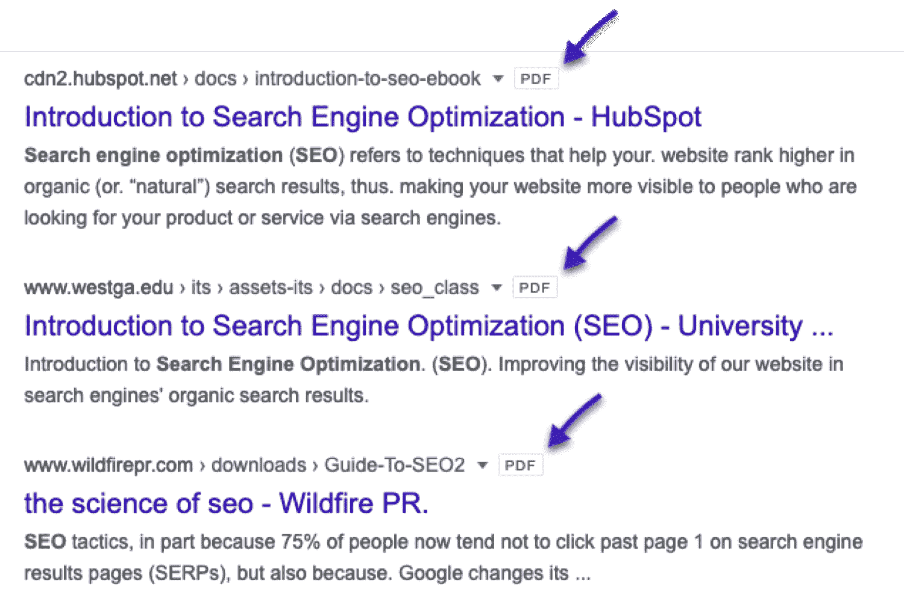

Search for specific filetypes (like PDFs) in Google

### 21.列出符合条件之一的搜索结果

`keyword/condition1 OR keyword/condition2`

**或**搜索操作符允许您搜索满足两个条件之一的搜索结果。

只需编写两个搜索操作符，并将 OR 命令用大写字母放在它们之间。这告诉 Google 显示满足第一个或第二个条件的结果。您也可以使用管道符号|来代替或。

### 22.添加一个“填空”选项

`keyword1 * keyword2`

如果想得到更多的匹配，可以使用星号 ***通配符**操作符。把通配符放在一个短语中，你会得到该短语的所有变体。这对于寻找引语和短语很有用。

示例:数字*战略

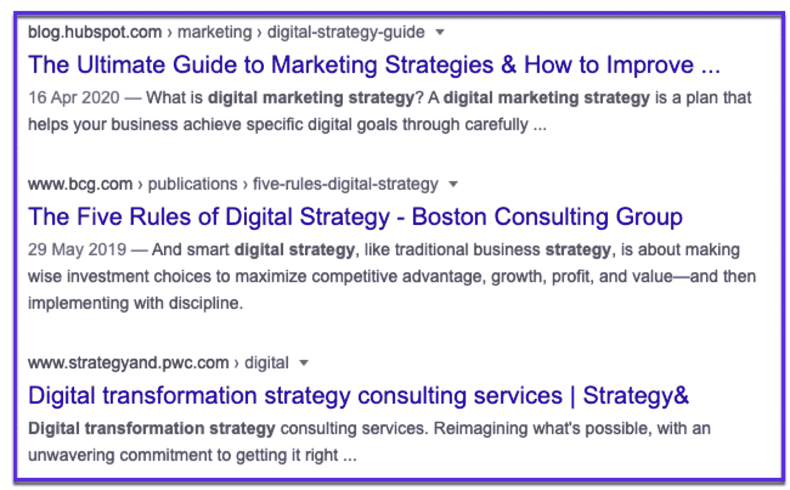

Add a ‘fill-in-the-blank- option with this search command

这将返回由这两个关键字包围的各种事物的结果，像数字营销策略、数字媒体策略等等。

### 23.查找彼此相近的单词

`keyword1 AROUND(X) keyword2`

有了这个谷歌搜索操作器，你可以得到你的搜索词彼此接近的结果。 **AROUND(X)** 运算符可以用来定义两个关键字之间的最大距离。括号里的 X 是最多能分隔两个关键词的字数。

这可能有助于找到你不太记得的引语和句子。

### 24.在特定日期之间搜索

`daterange:[XXXXX-XXXXX]`

**daterange:** 操作符将显示您指定的日期范围内的搜索结果。这有点棘手，因为它使用的是[儒略日格式](https://en.wikipedia.org/wiki/Julian_day)，所以你需要在年份后面加上自年初以来的天数。使用[在线转换器](http://www.longpelaexpertise.com/toolsJulian.php)获得正确的日期格式！

示例:

日期范围:2458839-2455353635

### 25.在两个特定年份之间搜索

`[year1]..[year2]`

有一种比使用儒略日格式更简单的方法来添加日期范围。这个谷歌搜索操作符被输入为两个点，允许你对你的搜索应用一个年度范围过滤器。

在两年之间加两个点，谷歌将只返回这两年之间发表的搜索结果。这更简单，但是它不允许像 daterange:那样搜索特定的日期。

示例:

2014..2018

### 26.查找相关论坛和社区讨论主题

`Site:website.com intitle:keyword`

厌倦了 WordPress 的问题和缓慢的主机？我们提供世界一流的支持，由 WordPress 专家提供 24/7 服务和超快的服务器。[查看我们的计划](https://kinsta.com/plans/?in-article-cta)

相关的[论坛](https://kinsta.com/blog/wordpress-forum-plugins/)、subreddits、[在线社区](https://kinsta.com/blog/wordpress-membership-plugins/)和 Q+A 网站(如 Quora)是推广内容的好地方。

你可以快速找到你所在领域的讨论和问题，然后加入进来。

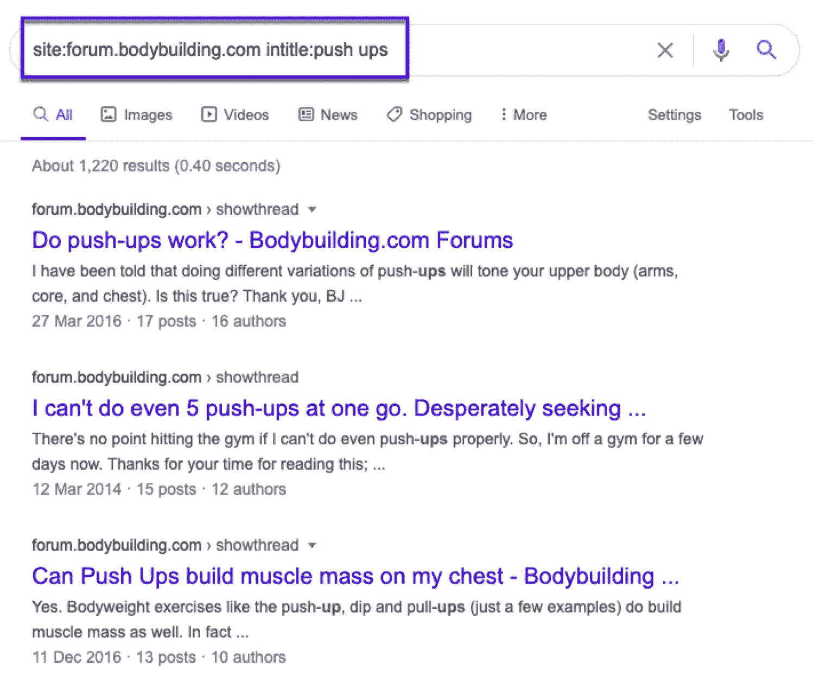

How to find a relevant forum and community discussion topics (based on a keyword of your choice)

使用谷歌搜索命令很容易找到它们。

试试这些:

*   站点:reddit.com intitle:关键字
*   Site:quora.com intitle:keyword
*   site:niche-specific-forum . com intitle:keyword

### 27.在上查找 PDF 下载。政府网站

`[flu shot ext:pdf site:gov]`

这是一个很好的方法，可以在做在线研究时找到任何主题的引用文件。

How to find PDF downloads (on Government sites)

### 28.查找非 HTTPS 索引页面

`Site:[website.com] -inurl:https`

如今，拥有一个安全的网站是必不可少的。通过几个操作符，你可以在你的网站上找到已经被索引的[非 HTTPS 页面](https://kinsta.com/blog/http-to-https/)。

How to Find Non-HTTPS Indexed Pages

有时，当使用此命令时，页面将在没有 HTTPS 的情况下被索引。但是当你去访问实际的页面时，你会看到 HTTPS 版本。

不要仅仅因为你的页面出现在这个搜索操作者面前就认为它们不安全。仔细检查他们。

然而，如果你的页面显示不安全，[检查你的 SSL 证书](https://kinsta.com/knowledgebase/ssl-check/)。

### 29.查找在文本中提到某个单词的页面

`[Jeff Bezos -intitle:Jeff -intitle:Bezos]`

有时候我们只需要找到提到一个名字或者一个概念的文章，而不去关注它。

How to find pages that mention a specific keyword within the text

### 30.查找组织的 Twitter 帐户

`[site:twitter.com @nytimes -inurl:status -inurl:hashtag -inurl:lists]`

想要找到代表公司或组织的 Twitter 帐户吗？在这里，谷歌实际上比 Twitter 更有帮助。

如果您想知道这个操作符是如何工作的:

**-inurl:status-inurl:hashtag-inurl:lists**告诉 Google 从搜索结果中排除任何 Twitter 列表、hash tag 和状态更新。

这样就只剩下包含你的搜索词的 Twitter 个人资料了。

### 31.同时搜索多个网站

`pizza site:tiktok.com OR site:vimeo.com OR site:youtube.com`

发现自己重复搜索相同的网站？

这个谷歌搜索操作器让你一次就能搜索到所有的内容。

### 32.在你的网站上找到任何重复的内容

`"[duplicate content you want to check]"`

重复的内容对你的网站不利。幸运的是，使用这个简单的搜索操作符很容易进行检查。

只要把你想检查的文本用引号括起来，谷歌就会显示任何与之匹配的页面。

世事难料。你可能会发现有人在未经许可或未注明出处的情况下窃取并[重新发布你的内容](https://kinsta.com/blog/dmca-takedown-notice/)。

### 33.在您的网站上查找任何不需要的文件或页面

`filetype:pdf seo`

人们很容易忘记已经上传到网站的页面和文件，如 pdf、Word 文档和幻灯片。

使用 **filetype:** 搜索操作符，您可以指定一个文件类型，然后在您的站点(或整个 web)中搜索关键字，结果将显示匹配的文件。

#### 谷歌搜索运营商支持哪些文件类型？

很高兴你问了。以下是支持的格式列表:

*   Adobe Flash (.swf)文件
*   Adobe 可移植文档格式(。pdf)
*   Adobe PostScript (.ps)文件
*   Autodesk Design Web Format (.dwf)
*   谷歌地球(。kml，。kmz)
*   GPS 交换格式(。gpx)
*   Hancom Hanword (.hwp)
*   HTML(。htm，。html、其他文件扩展名)
*   Microsoft Excel(。xls，。xlsx)
*   Microsoft PowerPoint(。ppt，。pptx)
*   Microsoft Word(。doc，。docx)
*   OpenOffice 演示文稿(。odp)
*   OpenOffice 电子表格(。ods)
*   OpenOffice 文本(。odt)
*   富文本格式(。rtf)
*   可缩放矢量图形(。svg)
*   TeX/LaTeX(。特克斯)
*   文本(。txt，。文本、其他文件扩展名)
*   基本源代码(。bas)
*   C/C++源代码(.c .，。cc .，。《刑事诉讼法》。cxx 号...-你好(hpp)
*   C#源代码(。cs)
*   Java 源代码(。java)
*   Perl 源代码(。pl)
*   Python 源代码(。py)
*   无线标记语言(。wml，。wap)
*   XML(。xml)

### 34.寻找利基相关资源页面链接的机会

`inurl:resources intitle:resources mountain bike`

资源页面是关于特定主题的最佳资源的汇总。

它们的范围从更结构化的页面，如我们的[资源中心页面](https://kinsta.com/resources/)):

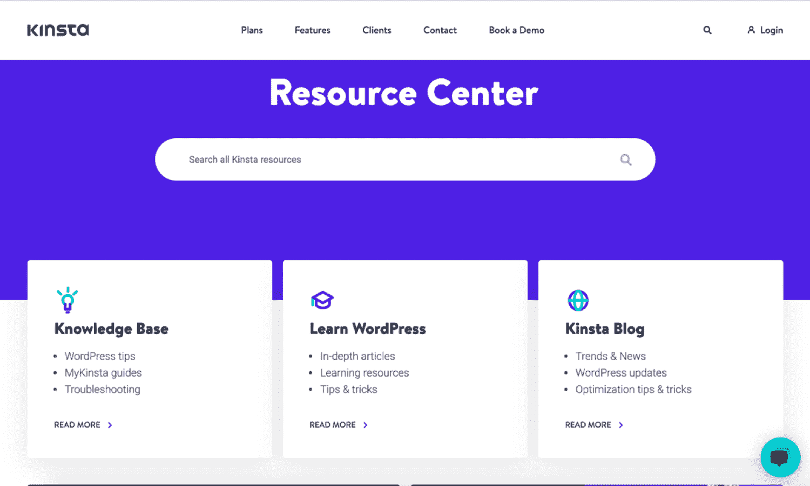

Our WP resources page

到更简单(但仍然有用)的页面，如下所示:

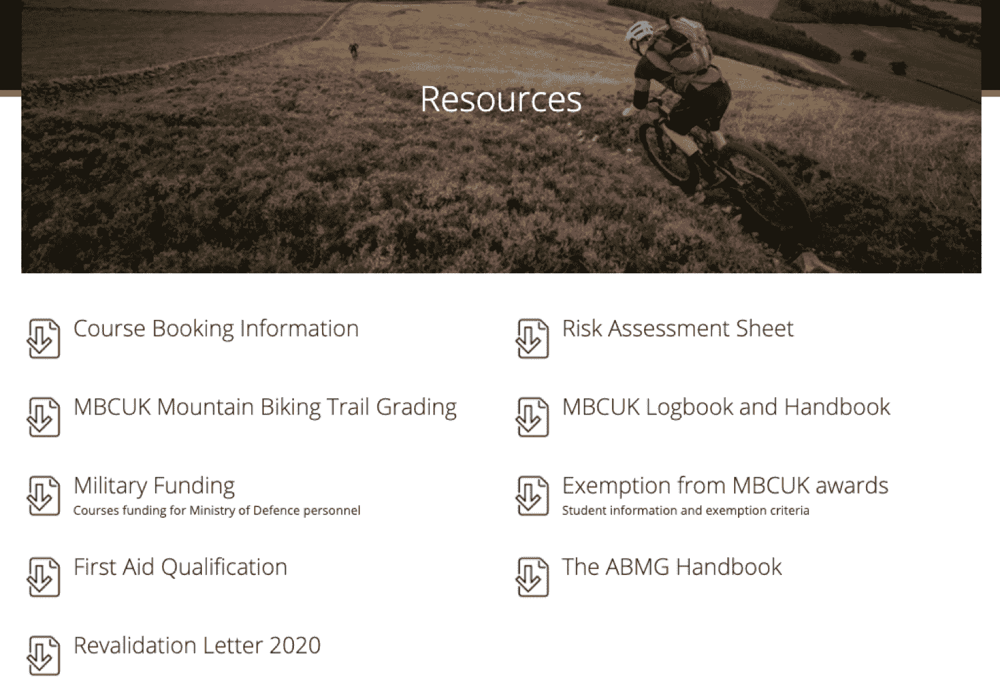

An example of a resource page (related to mountain biking) found using this search operator

如果你有相关的有用的资源可以贡献，资源页面可以是很好的地方。

试试这些搜索操作符，看看您能找到什么:

*   [主题]intitle:resources | inurl:resources
*   Intitle:[topic]和 intitle:resources 和 inurl:resources
*   all title:[topic]5 | 6 | 7 | 8 | 9 | 10 | 11 | 12 | 13 | 14 | 15 资源

一旦你找到了它们，就需要[找到网站管理员的电子邮件地址](https://kinsta.com/blog/find-email-address/)并请求收录你的链接。

### 35.寻找向其推销您的特色信息图的网站

`[topic] intitle:infographic inurl:infographic`

信息图表是为你的网站创造的一个很好的视觉资产。但是创造它们只是成功的一半。你也需要分发它们。

使用此运算符来查找可能对您的信息图感兴趣的站点。

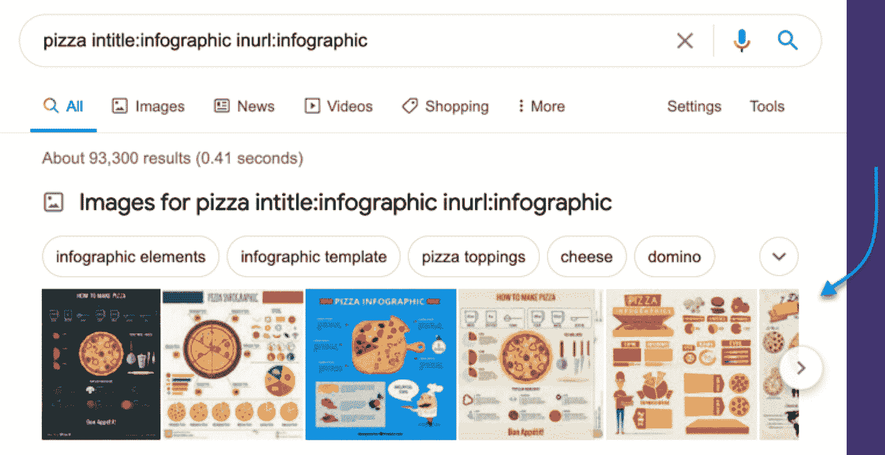

Some sites to potentially submit your pizza-related infographics to

### 36.寻找社交资料进行推广

`[name] site:twitter.com | site:facebook.com | site:linkedin.com`

想在社交媒体上联系某个特定的人？或者你可能想做一些调查，看看是否能找到他们的联系方式。

使用此搜索运算符来查找它们。显然你需要知道他们的名字才能工作。

然后你可以通过社交媒体直接联系他们，开始建立关系。

### 37.找到提到你的竞争对手(而不是你)的网站

`intext:[competitor] OR intext:[competitor] -site:website.com -site:website.com`

使用 **site:** 和 **intext:** 和 **OR，**的组合，你可以看到提到竞争对手的网站…但不是你。

玩弄谷歌搜索运营商来寻找那些谈论你的竞争对手，而不是你的网站的页面。

假设你发现一个页面提到了一个竞争对手，但是没有提到你。一个快速的行动是伸出手，要求被包括在内。

### 38.寻找赞助帖子的机会

`[topic] intext:"this is a sponsored post by"`

赞助帖子是你付费刊登的帖子，用来宣传你的网站、品牌、产品或服务。这种方法与寻找客座博文机会非常相似:

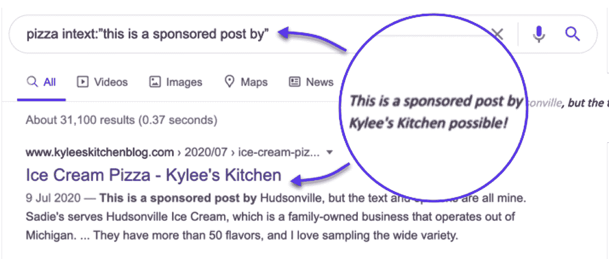

Quickly find sponsored post opportunities related to your niche

以下是使用谷歌搜索运营商寻找赞助帖子机会的几种方法:

*   赞助帖子结果
*   [主题] intext:“这是由赞助的帖子”
*   [主题] intext:“此帖子由赞助”
*   [主题]标题:“赞助帖子”
*   [主题]标题:“赞助帖子档案”中的“类别/赞助帖子”
*   【赞助】围绕③“帖子”

### 39.了解竞争网站发布新内容的频率

`site:[website} (+ some filtering in Google)`

大多数博客要么存在于[子文件夹中，要么存在于](https://kinsta.com/blog/wordpress-subdomain/#impact)子域中:

*   **子文件夹**:【https://kinsta.com/blog/ T2】
*   **子域**:【https://blog.hubspot.com/ T2】

若要查看网站发布内容的频率:

1.  做一个**站点:**搜索内容所在的子文件夹或子域
2.  转到谷歌工具
3.  选择一个日期范围。

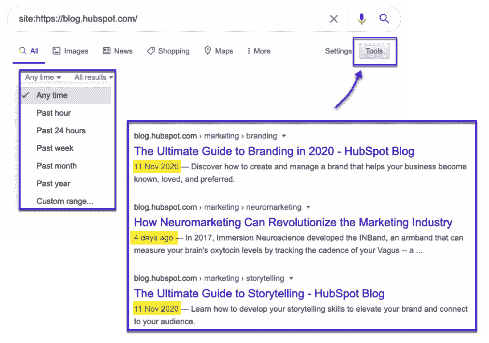

Find how often your competitors are publishing content

现在，您将对目标站点发布新内容的频率有一个更好的了解(基于索引结果)。

您还可以将该操作符与搜索查询结合使用，以查看某个站点在某个特定主题上发布了多少内容。

### 40.找到链接到你的竞争对手的网站

`link:[website.com]`

**链接:**搜索操作符允许你看到你的竞争对手从哪里获得链接。结合谷歌的时间段过滤器，你就能看到该网站最近链接过的地方。

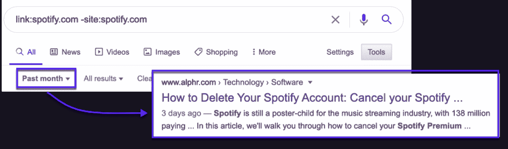

Find sites that are linking to your competitors and WHEN

**关于这个**的一个快速说明: **`link:`** 谷歌算子在 2017 年被谷歌弃用，它可能会显示不一致和不可靠的结果。然而，它仍然会带回一些结果，作为你研究的起点。

[Google search operators extend the capabilities of regular text searches on Google 🔎 ... and once you’ve mastered just a few of these special commands, you’ll wonder how you ever managed without them. 🔥Click to Tweet](https://twitter.com/intent/tweet?url=https%3A%2F%2Fkinsta.com%2Fblog%2Fgoogle-search-operators%2F&via=kinsta&text=Google+search+operators+extend+the+capabilities+of+regular+text+searches+on+Google+%F0%9F%94%8E+...+and+once+you%E2%80%99ve+mastered+just+a+few+of+these+special+commands%2C+you%E2%80%99ll+wonder+how+you+ever+managed+without+them.+%F0%9F%94%A5&hashtags=GoogleSearch%2CProductivity)

## 摘要

能够用谷歌搜索运营商改进你的谷歌搜索是一项方便的研究技能。这一先进但鲜为人知的功能使谷歌成为一个极其灵活的在线工具。即使只是知道一些基本的命令也能给你带来优势。

现在轮到你了:你用得最多的谷歌搜索运营商有哪些？另外，你认为我们在清单上遗漏了什么吗？请在评论中告诉我们！

* * *

让你所有的[应用程序](https://kinsta.com/application-hosting/)、[数据库](https://kinsta.com/database-hosting/)和 [WordPress 网站](https://kinsta.com/wordpress-hosting/)在线并在一个屋檐下。我们功能丰富的高性能云平台包括:

*   在 MyKinsta 仪表盘中轻松设置和管理
*   24/7 专家支持
*   最好的谷歌云平台硬件和网络，由 Kubernetes 提供最大的可扩展性
*   面向速度和安全性的企业级 Cloudflare 集成
*   全球受众覆盖全球多达 35 个数据中心和 275 多个 pop

在第一个月使用托管的[应用程序或托管](https://kinsta.com/application-hosting/)的[数据库，您可以享受 20 美元的优惠，亲自测试一下。探索我们的](https://kinsta.com/database-hosting/)[计划](https://kinsta.com/plans/)或[与销售人员交谈](https://kinsta.com/contact-us/)以找到最适合您的方式。