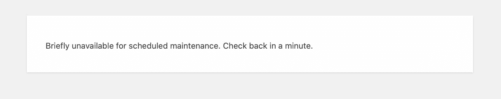
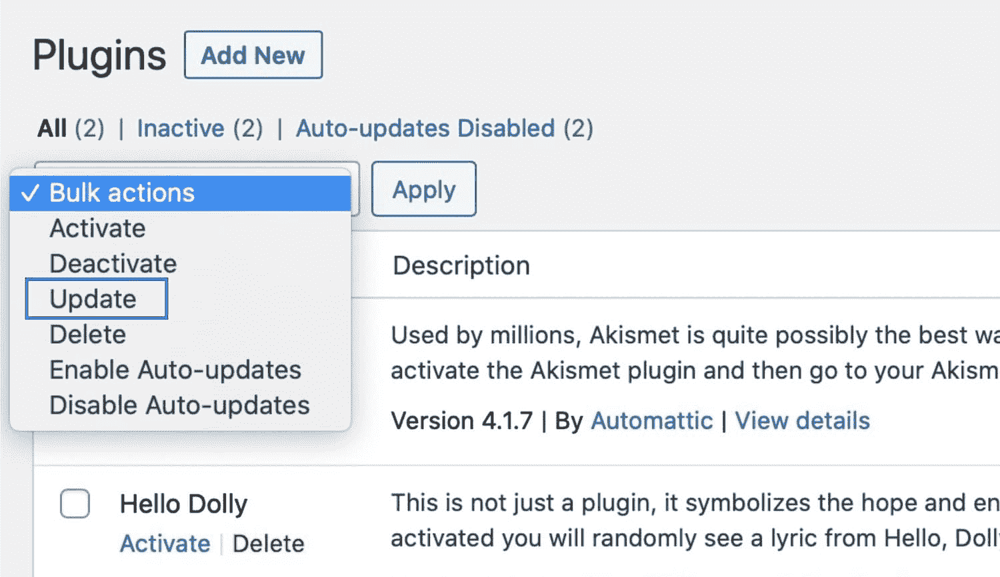
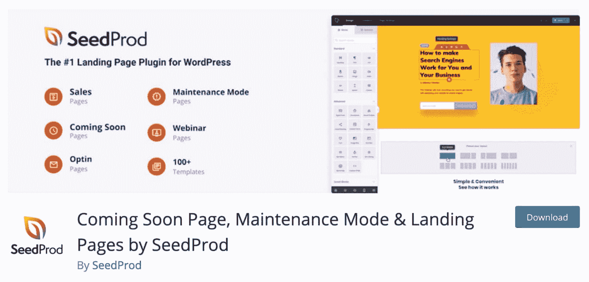
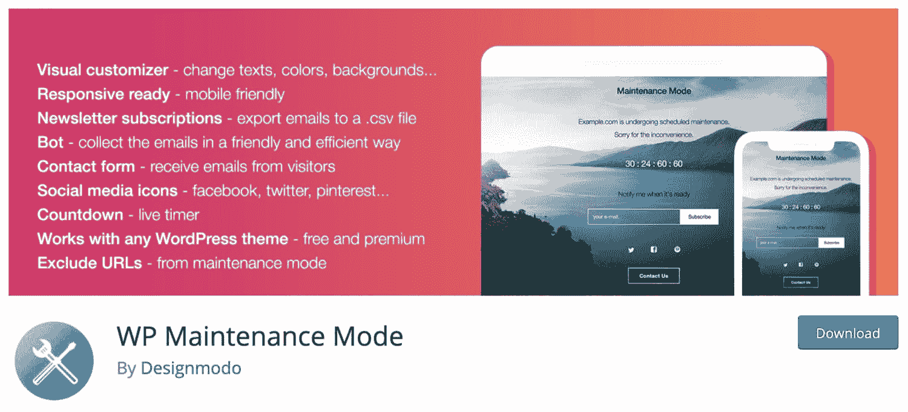
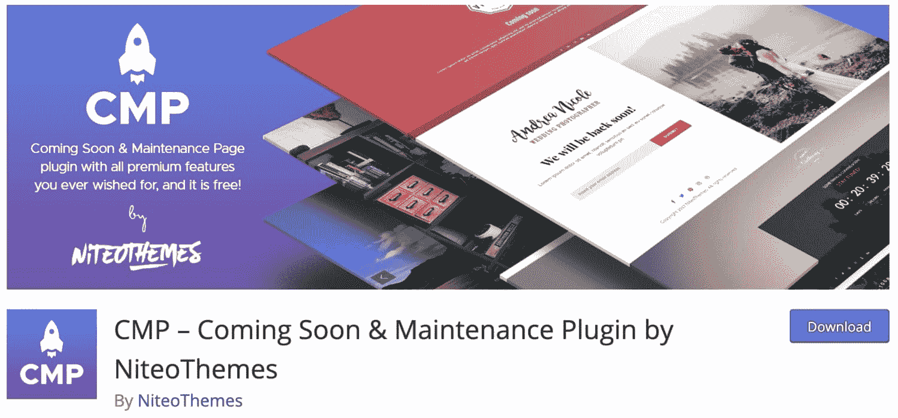
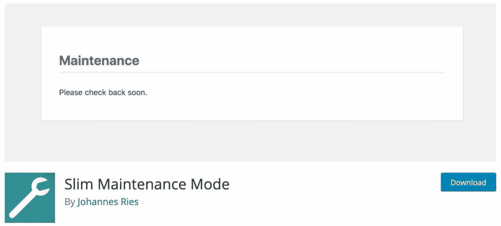
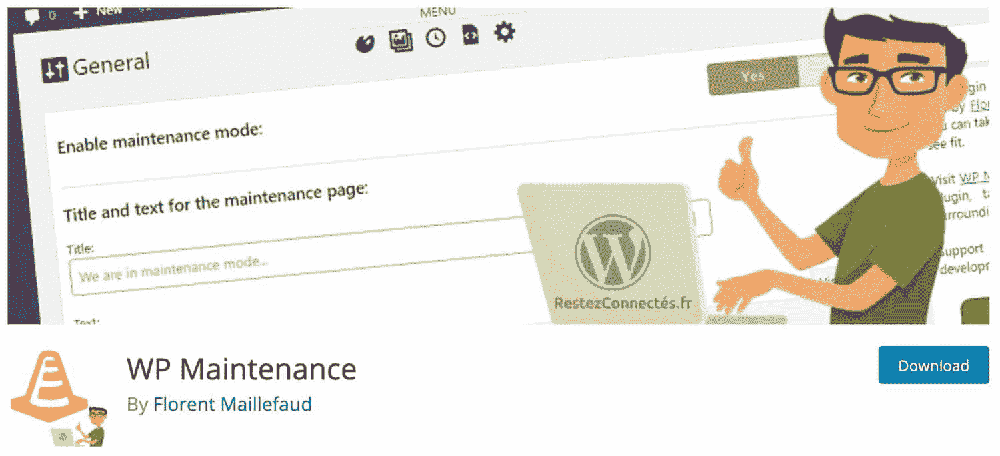
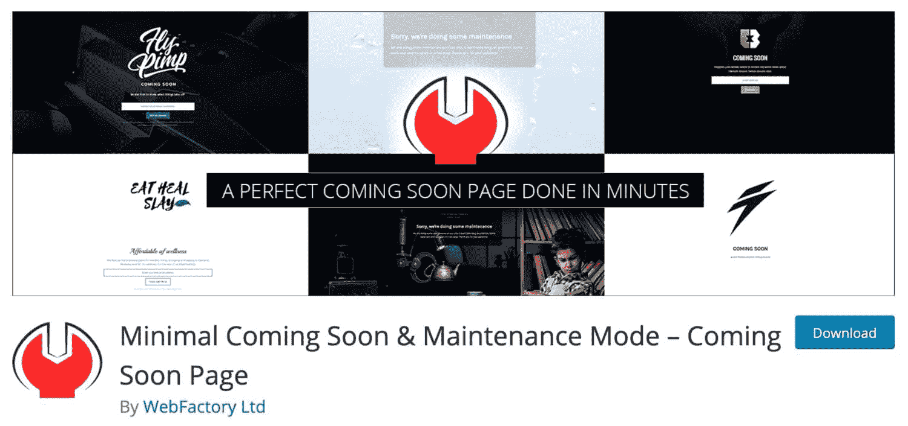
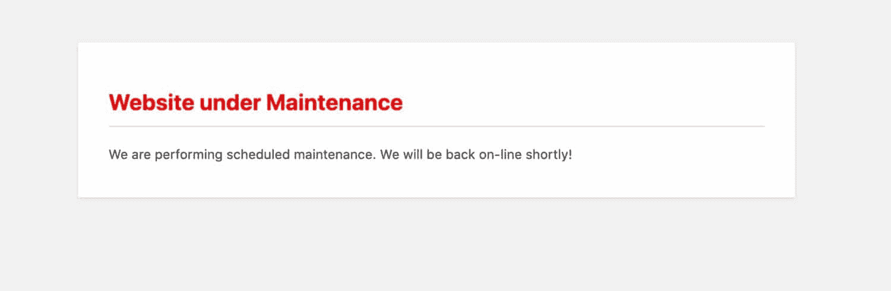
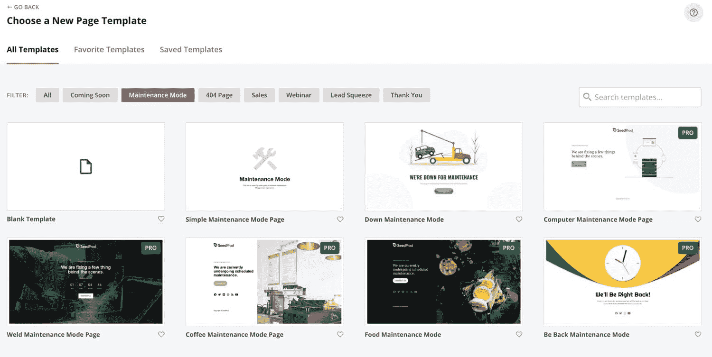

# WordPress 维护模式-故障排除和定制

> 原文：<https://kinsta.com/blog/wordpress-maintenance-mode/>

WordPress 维护模式页面是当你在你的站点上进行更新时，比如更新插件、主题或核心时，自动向访问者临时显示的东西。这是为了防止在文件被修补时出现任何损坏或不同步的情况。

然而，这有几个问题。

首先，有时候你的 WordPress 站点可能会陷入维护模式。这实际上会让整个网站瘫痪，直到你手动修复它。

第二个是默认的维护页面/消息没有样式，看起来很丑，并且对你的访问者和客户的信息传递有限。这对你的品牌或声誉可能不是最好的。今天我们将探索一些解决这些问题的方法。

### 什么是 WordPress 维护模式？


## WordPress 维护模式

WordPress 维护模式是一个很棒的小功能，内置在核心中，在 3.0 版本中引入。每当你[更新一个插件](https://kinsta.com/knowledgebase/manually-update-wordpress-plugin/)，主题，或者[你的 WordPress 安装](https://kinsta.com/blog/wordpress-automatic-updates/)，下面的消息会显示给你的访问者，直到更新操作完成。


> 需要在这里大声喊出来。Kinsta 太神奇了，我用它做我的个人网站。支持是迅速和杰出的，他们的服务器是 WordPress 最快的。
> 
> <footer class="wp-block-kinsta-client-quote__footer">
> 
> 
> 
> <cite class="wp-block-kinsta-client-quote__cite">Phillip Stemann</cite></footer>

[View plans](https://kinsta.com/plans/)

"[暂时无法进行定期维护。一分钟后回来检查](https://kinsta.com/knowledgebase/briefly-unavailable-for-scheduled-maintenance/)。



Default WordPress Maintenance screen


在更新和安装过程中，一些后端进程会停止一小段时间(通常只有几秒钟，具体取决于更新的数量和大小)。WordPress 利用了 [wp_maintenance()](https://developer.wordpress.org/reference/functions/wp_maintenance/) 函数并创建了一个临时的。您站点上的维护文件，其中包含您在上面看到的警报。更新完成后，该文件会自动删除，您的网站会恢复正常。

默认情况下，WordPress 返回一个 [503 HTTP 状态码](https://kinsta.com/blog/http-error-503/)(服务不可用。)处于维护模式时。这基本上是告诉谷歌你正在处理这个页面或者有什么地方出错了，他们稍后会回来查看。这是你想显示给 [SEO](https://kinsta.com/blog/what-does-seo-stand-for/) 的标题回复，因为如果你的网站暂时关闭，它不会损害你的排名。Yoast 有一篇关于 SEO 的 503 HTTP 头的[重要性的文章。](https://yoast.com/http-503-site-maintenance-seo/)

[Don't let your site get stuck in maintenance mode 🛠 🚧 Keep these quick fixes handy for the next time you need to make an update to your site👷‍♂️Click to Tweet](https://twitter.com/intent/tweet?url=https%3A%2F%2Fkinsta.com%2Fblog%2Fwordpress-maintenance-mode%2F&via=kinsta&text=Don%27t+let+your+site+get+stuck+in+maintenance+mode+%F0%9F%9B%A0+%F0%9F%9A%A7+Keep+these+quick+fixes+handy+for+the+next+time+you+need+to+make+an+update+to+your+site%F0%9F%91%B7%E2%80%8D%E2%99%82%EF%B8%8F&hashtags=WordPressTips%2CWPErrors)

## 你的 WordPress 网站是否陷入了维护模式？

WordPress 用户遇到的一个常见问题是他们的网站可能[陷入维护模式](https://kinsta.com/knowledgebase/wordpress-stuck-in-maintenance-mode/)。这可能非常可怕，因为这也会影响管理员和后端。突然你[无法登录你的 WordPress 网站](https://kinsta.com/blog/locked-out-of-wordpress-admin/)，你的网站基本上瘫痪了，除了访问者看到的简短消息。

### 如何避免陷入维护模式

陷入维护模式通常发生在**有冲突的时候，**在这种情况下。维护文件可能认为仍有未完成的操作和/或更新需要完成。这导致文件保留下来，永远不会自行删除。

#### 更新期间不要刷新或离开屏幕

网站陷入维护模式的最常见原因之一是在更新过程中更新屏幕被刷新或离开。

避免这种情况的最简单的方法是在更新发生时抵制做任何事情的诱惑。确保在刷新或离开屏幕之前等待所有更新完成，并向下滚动以检查屏幕下方的插件是否已更新。

#### 不要一次更新多个插件

是什么导致了冲突？根据我们的经验，如果用户快速手动点击许多不同插件上的“立即更新”,就会发生这种情况。WordPress 默认按顺序交错更新，但是如果连接中有哪怕一毫秒的延迟，都会导致突然的冲突，触发停滞的维护模式。

为了确保这种情况不会发生，您可以轻松地单击过滤器“更新可用”，然后从批量操作下拉列表中选择“更新”。然后点击“应用”这将使**按顺序**启动更新，这样你就不太可能收到冲突。



Updating WordPress plugins


#### 在修补插件时更新它们

防止这种情况发生的另一个建议是[更新你的插件，因为它们被打了补丁](https://kinsta.com/knowledgebase/manually-update-wordpress-plugin/)。不要等到六个月后再尝试一次性更新它们。

如果你有 30 多个插件需要多次更新，最好是一个接一个地更新它们，并进行测试，以确保[不会破坏你的站点](https://kinsta.com/blog/wordpress-white-screen-of-death/)。这就是为什么 Kinsta 有[免费的登台环境](https://kinsta.com/help/staging-environment/)的原因之一，这样你就可以**事先在你的现场站点的克隆**上测试一切，并最小化破坏你的生产站点的风险。

#### 自动更新插件

如果你没有时间定期更新你的插件，或者你认为你会忘记，你可以使用插件来自动更新它们，或者调整你的 WordPress 设置来做到这一点。

查看我们的指南 [WordPress 自动更新](https://kinsta.com/blog/wordpress-automatic-updates/)来找出如何配置它。

### 如何修复 WordPress 网站陷入维护模式

值得庆幸的是，如果你的 WordPress 站点目前处于维护模式，退出并恢复正常是非常容易的。您只需删除。创建的维护文件。

#### 第一步

第一步是通过 FTP 登录到你的网站。查看我们关于如何 SFTP 进入你的 WordPress 网站的深度文章。

#### 第二步

导航到你的 WordPress 站点和/或公共 HTML 文件夹的根目录。这个文件夹通常包含你的[wp-config.php 文件](https://kinsta.com/blog/wp-config-php/)。然后，您可以删除。维护文件。


Navigating to maintenance.php in a FTP client


删除后，您可以在浏览器中刷新您的网站，您的网站将恢复正常。也建议你清空 WordPress 站点上的缓存。

如果你是 Kinsta 的客户，你可以直接从 [MyKinsta 仪表盘](https://kinsta.com/MyKinsta)或 WordPress 仪表盘的管理工具栏(如果你有权限的话)中[清除缓存](https://kinsta.com/blog/wordpress-clear-cache/)。如果您在遵循上述步骤时遇到困难，您可以随时联系您的主机提供商寻求支持。

### 修复陷入维护模式的 WordPress 站点的最快方法


## 扩展你的 WordPress 维护模式

有很多方法可以扩展你的 WordPress 维护模式，例如[手动启用它和/或定制屏幕](https://kinsta.com/blog/wordpress-maintenance/#putting-your-wordpress-site-into-maintenance-mode)使它更符合你的品牌。你网站上的[流量越多](https://kinsta.com/blog/how-to-drive-traffic-to-your-website/)，维护模式的信息和风格就越重要，因为更多的人会更有可能看到它。

除了运行更新之外，您可能需要改进的维护模式页面的另一个原因是，您可能正在手动将更改迁移到生产环境中。

我们总是建议首先在开发站点上进行测试，但是有时您可能需要在生产站点上运行一两个小时的维护页面。

### 用代码手动扩展 WordPress 维护模式

默认的维护屏幕是不可定制的(它也是动态生成的)，因此您可能希望将其样式化以匹配您网站的品牌和外观。这里有一个创建自定义页面的小技巧。

你需要做的就是创建一个文件，命名为 maintenance.php，并把它放到你的/wp-content/文件夹中。然后你可以用 CSS 来设计它的样式，甚至从头开始创建一个完整的页面。

这样，当你更新 WordPress 核心、主题或插件时，它将使用你自定义的新文件。对这个文件的检查已经在位于/wp-includes/的 load.php 文件中定义了，所以您不需要做任何额外的事情。看起来是这样的:

```
if ( file_exists( WP_CONTENT_DIR . '/maintenance.php' ) ) {
 require_once( WP_CONTENT_DIR . '/maintenance.php' );
die();
}
```

### 利用 WordPress 维护模式插件

如果你对[编辑代码](https://kinsta.com/knowledgebase/edit-wordpress-code/)感到不舒服或者需要更多，你也可以通过使用一些免费和高级插件将你的 WordPress 维护模式提升到一个新的水平

#### SeedProd 即将推出的页面、维护模式和登录页面

即将推出的页面维护模式插件是由 SeedProd 的约翰·特纳开发的，早在 2011 年就已经推出。它在 WordPress 社区中享有很高的声誉，因为它是即将推出的页面和维护模式的良好支持插件。

这很大程度上与有免费和高级版本这一事实有关。有时拥有两个版本可以确保您获得更多更新。



Coming Soon Page, Maintenance Mode & Landing Pages by SeedProd


它目前有超过 100 万个活跃安装，并获得了令人印象深刻的 5 星评级。你可以从 WordPress 知识库下载[即将发布的页面&维护模式](https://wordpress.org/plugins/coming-soon/),或者在你的 WordPress 仪表盘的“添加新插件”下搜索。它的一些附加功能包括:

*   适用于任何 WordPress 主题，响应迅速

自定义外观和感觉

## 注册订阅时事通讯


### 想知道我们是怎么让流量增长超过 1000%的吗？

加入 20，000 多名获得我们每周时事通讯和内部消息的人的行列吧！

[Subscribe Now](#newsletter)

*   轻松添加 CSS 和 HTML
*   多站点和 BuddyPress 支持
*   创建登陆和即将推出的页面并[收集电子邮件地址](https://kinsta.com/blog/how-to-build-an-email-list/)

#### WP 维护模式

WP 维护模式是下载量最高的插件之一，当它为你的 WordPress 站点抛出一个快速简单的维护模式消息时。它是完全免费的，由 Designmodo(一个流行的网页设计博客)的团队创建。

只有拥有足够权限的用户才能看到前端，否则，其他所有人都会在启用时看到维护模式消息。它与 [WordPress Multisite](https://kinsta.com/wordpress-multisite-hosting/) 一起工作，然而，需要注意的是，它可能与[缓存插件](https://kinsta.com/blog/wordpress-caching-plugins/)一起不稳定。



WP Maintenance Mode


它目前有超过 700，000 个活跃安装，五星评级为 4.5。你可以从 WordPress 知识库下载 [WP 维护模式](https://wordpress.org/plugins/wp-maintenance-mode/),或者在你的 WordPress 仪表盘的“添加新插件”下搜索它。它的一些附加功能包括:

*   能够改变颜色，文字和背景
*   订阅表单、联系表单和计时器
*   包含的登录页面模板
*   适用于任何 WordPress 主题
*   [SEO](https://kinsta.com/blog/wordpress-seo/) 选项为 [503 HTTP 头响应](https://kinsta.com/blog/http-error-503/)
*   你可以将网址排除在维护之外，如果你已经[改变了你的 WordPress 登录网址](https://kinsta.com/blog/wordpress-login-url/#change-login-page)，这将非常方便

#### CMP–即将推出和维护

即将推出的&维护插件下载量超过 100，000 次，平均评分为五星。它还没有被翻译成英语，但可以在一个英语网站上工作，因为它的后端不是英语，而不是维护屏幕本身。



CMP – Coming Soon & Maintenance


作为一个免费插件，它有一个令人印象深刻的功能列表，旨在让你创建一个定制的维护页面，而不必为一个高级插件付费。

功能包括:

*   三个捆绑主题加上额外的高级主题，您可以下载
*   访问库存照片
*   收集电子邮件地址的自定义订阅表单
*   [谷歌字体](https://kinsta.com/blog/best-google-fonts/)整合
*   上传您的徽标或[背景图片](https://kinsta.com/blog/wordpress-background-image/)
*   预览您可以与客户共享的 [URL](https://kinsta.com/knowledgebase/what-is-a-url/)
*   重定向到备用网站
*   设置搜索引擎响应代码的能力
*   [谷歌分析支持](https://kinsta.com/blog/google-analytics-wordpress/)

#### 精简维护模式

Slim 维护模式插件做的正是你所想的。这实际上创建了与我们在上面展示的如何用代码实现相同类型的页面。只要激活插件，只有管理员可以看到网站。如果你想要免费、快速、轻量级的东西，一定要看看这个。

它没有额外的设置，除了打开它之外你什么也不用做——此时你的网站将只对管理员可见。缺点是不能自定义消息。



Slim Maintenance Mode


它目前有超过 1000 个活跃安装，获得了 5 颗星的评级。事实上，写这篇文章时，它没有一个差评！这是因为它确实有效。你可以从 WordPress 知识库下载 [Slim 维护模式](https://wordpress.org/plugins/slim-maintenance-mode/),或者在你的 WordPress 仪表盘的“添加新插件”下搜索它。它的一些附加功能包括:

*   小巧、简单、轻便
*   无需担心额外的设置，只需激活即可
*   适用于任何 WordPress 主题
*   后端消息提醒你知道它是活跃的
*   503 HTTP 标头响应
*   受流行缓存插件的良好支持

#### WP 维护

[WP 维护](https://wordpress.org/plugins/wp-maintenance/)插件有超过 30000 次安装，平均评分 4.5 星。它还没有被翻译成英文，但在英文网站上仍然可以正常工作，因为用户看到的任何文本都是你输入的。



WP Maintenance


该插件包括定制和个性化选项，例如:

厌倦了你的 WordPress 站点缓慢的主机？我们提供超快的服务器和来自 WordPress 专家的 24/7 世界级支持。[查看我们的计划](https://kinsta.com/plans/?in-article-cta)

*   为您的维护页面选择颜色和字体
*   徽标或图像上传，加上添加滑块的选项
*   倒计时定时器
*   链接到社交媒体和谷歌分析
*   按用户角色编辑访问权限

#### 极简即将推出&维护模式

WordPress 插件的最小即将发布和维护模式是由 Web Factory 的团队开发的，该团队还运营着流行的博客 WP Loop。他们目前在知识库上维护着 5 个以上的插件，并且在为 WordPress 创建所需的解决方案方面不是新手。



Minimal Coming Soon & Maintenance Mode


它目前有超过 90，000 个安装，评级不到 5 星。你可以从 WordPress 知识库下载 WordPress 的[极简即将推出的&维护模式，或者在你的 WordPress 仪表盘的“添加新插件”下搜索。](https://wordpress.org/plugins/minimal-coming-soon-maintenance-mode/)

该插件会定期更新。

它的一些附加功能包括:

*   适用于所有 WordPress 主题和插件
*   能够改变你看到的每一个元素，包括背景颜色，封面图片，字体等。
*   激活前预览维护页面
*   体面的缓存插件支持
*   使用自定义登录 URL
*   仅对未登录的用户可见
*   [谷歌分析](https://kinsta.com/blog/google-analytics-wordpress/)支持
*   谷歌字体

### 利用 WPBuffs 维护服务

如果你不想自己管理维护模式，你可以雇佣一个维护公司，比如 T2 的 WP Buffs，他们会为你处理这些事情。


WPBuffs


WPBuffs 将保持您的网站更新，并确保更新发生在您的网站最不忙的时候——他们将确保您的网站在更新时不会陷入维护模式。

### 如何从 WordPress 维护模式屏幕重定向

如果你想将[重定向到一个定制的维护屏幕，而不是使用 maintenance，最好的选择是使用插件。](https://kinsta.com/help/redirect-rules/)

下面的维护插件将提供另一个维护页面，如果你在你的网站上工作，你可以手动激活它，当 WordPress 运行更新时，它也会被激活。

这样，用户将不会看到单调的默认屏幕，而是看到一个更专业的维护屏幕，您可以使用插件界面对其进行标记和定制。

### 如何在 WordPress 自定义你的维护模式界面

## 如何启用和禁用 WordPress 维护模式

当你在你的网站上工作，但不需要运行主题和插件更新时，有时你可能想在 WordPress 中手动启用维护模式。在这种情况下，WordPress 不会自动触发维护模式，所以你需要手动操作。

有两种方法可以做到这一点:用代码，和用插件。

### 如何用代码手动启用 WordPress 维护模式

你可以通过在你的 functions.php 文件中放置以下代码来手动启用 WordPress 维护模式。或者更好的是，用你自己的插件来做。

```
// Activate WordPress Maintenance Mode
function wp_maintenance_mode(){

            if(!current_user_can('edit_themes') || !is_user_logged_in()){

            wp_die('<h1 style="color:red">Website under Maintenance</h1><br />We are performing scheduled maintenance. We will be back on-line shortly!');

            }

}
add_action('get_header', 'wp_maintenance_mode');
```

这将导致一条消息放在您网站的前面，显示给未登录的用户。管理员仍然可以访问仪表板，因为它使用内置的 [is_user_logged_in()](https://developer.wordpress.org/reference/functions/is_user_logged_in/) 函数。



Manual maintenance screen


如果你愿意，你可以创建一些更复杂的东西——但是请记住，因为你不是在访问你的主题的样式表，所以你添加的任何样式都必须与你的代码内联。

### 如何用插件手动启用 WordPress 维护模式

你也可以使用上面列出的插件来启用维护模式。例如:

*   通过 Seedprod 的即将推出和维护模式，您可以打开和关闭维护模式，自定义维护屏幕，以及创建“即将推出”或登录页面，让人们知道网站何时启动和运行，并收集他们的电子邮件地址。
*   在 WP 维护模式下，您可以为管理员以外的用户手动激活自定义维护屏幕。
*   随着 CMP 即将推出&维护，您可以使用他们的主题创建一个完全自定义的维护屏幕，并在需要时手动激活它。
*   在精简维护模式下，只需激活插件即可手动激活精简的维护屏幕。
*   使用 WP 维护，你可以创建一个带有倒计时定时器和自定义字体和颜色的维护页面，并通过插件界面手动激活它。
*   借助极简即将推出的维护模式，您可以创建完全自定义的维护模式页面，将其链接到您的分析软件，并手动启用它。



Creating a maintenance page with Coming Soon & Maintenance by Seedprod


所有这些插件都可以让你手动打开维护模式，并使你的网站成为私有的。他们之间的区别在于他们如何容易做到这一点，以及你可以定制多少维护屏幕。

## 何时使用 WordPress 维护模式

那么，什么时候应该使用维护模式呢？

这些时候你最有可能需要它:

*   当你运行插件、[主题](https://kinsta.com/blog/how-to-update-wordpress-theme/)或 WordPress 本身的更新时。
*   当你上传新版本的主题或插件时。
*   当你在你的站点上工作时(尽管你不应该编辑实时站点的代码:使用开发或[暂存站点](https://kinsta.com/help/staging-environment/)，然后[将你的更改复制到实时站点](https://kinsta.com/help/push-staging-live/))。
*   当你编辑不想让别人看到的内容时。
*   当你对网站进行结构性改变时，例如[改变导航](https://kinsta.com/blog/website-navigation/)或者移动页面。
*   当你的网站处于开发阶段，在它启动之前，你可以使用维护模式。你可以使用一个插件来创建一个即将到来的页面，这对 SEO 来说会更有用，更好。

因此，维护模式不仅在您运行更新时有用，这就是为什么能够手动激活它会很有帮助。

[Keep your site maintenance under wraps.👷‍♂️ Quickly resolve issues related to maintenance mode with this guide!Click to Tweet](https://twitter.com/intent/tweet?url=https%3A%2F%2Fkinsta.com%2Fblog%2Fwordpress-maintenance-mode%2F&via=kinsta&text=Keep+your+site+maintenance+under+wraps.%F0%9F%91%B7%E2%80%8D%E2%99%82%EF%B8%8F+Quickly+resolve+issues+related+to+maintenance+mode+with+this+guide%21&hashtags=WordPress%2CWPTips)

## 摘要

如你所见，core 中包含的 WordPress 维护模式非常棒。然而，它可以很容易地扩展和定制，以符合您的品牌。

您可能还想自定义消息传递，以便访问者和客户确切地知道您的网站关闭的原因。如果您曾经陷入维护模式，您现在知道如何快速恢复并让您的网站重新上线。请务必阅读我们关于 WordPress 维护的深入指南,让你的网站保持更好的状态。

关于 WordPress 维护模式，你有其他的建议吗？

* * *

让你所有的[应用程序](https://kinsta.com/application-hosting/)、[数据库](https://kinsta.com/database-hosting/)和 [WordPress 网站](https://kinsta.com/wordpress-hosting/)在线并在一个屋檐下。我们功能丰富的高性能云平台包括:

*   在 MyKinsta 仪表盘中轻松设置和管理
*   24/7 专家支持
*   最好的谷歌云平台硬件和网络，由 Kubernetes 提供最大的可扩展性
*   面向速度和安全性的企业级 Cloudflare 集成
*   全球受众覆盖全球多达 35 个数据中心和 275 多个 pop

在第一个月使用托管的[应用程序或托管](https://kinsta.com/application-hosting/)的[数据库，您可以享受 20 美元的优惠，亲自测试一下。探索我们的](https://kinsta.com/database-hosting/)[计划](https://kinsta.com/plans/)或[与销售人员交谈](https://kinsta.com/contact-us/)以找到最适合您的方式。