# 如何修复你的 WordPress 网站上的 403 禁止错误

> 原文：<https://kinsta.com/blog/403-forbidden-error/>

你是否试图访问你的 WordPress 网站，却被一些信息告知你某些东西是“禁止的”或者你没有权限访问你网站上的某些东西？如果是这样，你很可能在 WordPress 上遇到了 403 禁止错误。

在你的 WordPress 网站上看到一个错误可能会令人沮丧和泄气，这就是为什么我们创建了这个详细的指南来帮助你修复 WordPress 上的 403 禁止错误，并尽快让你的网站恢复正常运行。

让我们开始吧，没有任何进一步的介绍，因为我们相信你只是想修复您的网站！

### **更喜欢[视频版](https://www.youtube.com/watch?v=vbjKDmFM_zY)？**

## 什么是 403 禁止错误？

互联网工程任务组 (IETF)将禁止的错误 403 定义为:

> 403(禁止)状态代码表示服务器理解该请求，但拒绝授权。希望公开请求被禁止的原因的服务器可以在响应有效载荷(如果有的话)中描述该原因。

| **错误代码** | Four hundred and three |
| **错误类型** | 认证错误 |
| **误差变化** | Forbidden – You don’t have permission to access / on this server403–禁止:访问被拒绝错误 403–禁止403-禁止错误-不允许您访问此地址403 禁用 nginxHTTP 错误 403–禁止–您没有权限访问您请求的文档或程序403 禁止-拒绝访问服务器上的该资源403.这是一个错误。您的客户端没有权限从此服务器获取 URL /您无权查看此页面您似乎没有权限访问此页面 |
| **错误原因** | Corrupt `.htaccess` file不正确的文件权限插件问题 |

像许多其他常见的 WordPress 错误一样，403 禁止错误是一个 [HTTP 状态码](https://kinsta.com/blog/http-status-codes/)，web 服务器使用它与您的 web 浏览器进行通信。

> 需要在这里大声喊出来。Kinsta 太神奇了，我用它做我的个人网站。支持是迅速和杰出的，他们的服务器是 WordPress 最快的。
> 
> <footer class="wp-block-kinsta-client-quote__footer">
> 
> 
> 
> <cite class="wp-block-kinsta-client-quote__cite">Phillip Stemann</cite></footer>

[View plans](https://kinsta.com/plans/)

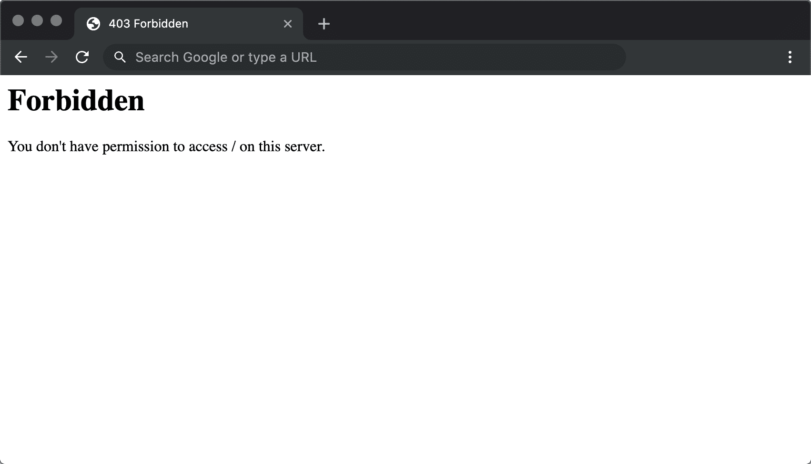

403 forbidden error in Chrome

关于 [HTTP 状态码](https://kinsta.com/blog/http-status-codes/)的快速背景——无论何时你用浏览器连接到一个网站，网络服务器都会用一个叫做 HTTP 头的东西来响应。通常，这一切都发生在幕后，因为一切都工作正常(*这是 200 状态代码，以防你想知道*)。

但是，如果出现问题，服务器将使用不同编号的 HTTP 状态代码进行响应。虽然这些数字令人沮丧，但它们实际上非常重要，因为它们可以帮助您准确地诊断出您的网站出了什么问题。

**403 禁止错误**表示您的 web 服务器理解客户端(*即您的浏览器*)正在发出的请求，但服务器不会满足它。

用更人性化的术语来说，这基本上意味着**你的服务器确切地知道你想做什么，它只是不让你做，因为出于某种原因你没有适当的权限**。这有点像你试图参加一个私人活动，但出于某种原因，你的名字意外地从来宾名单中删除了。

其他 HTTP 状态代码的含义不同。我们已经编写了指南来解决 [404 未找到错误](https://kinsta.com/blog/error-404-not-found/)、 [500 内部服务器错误](https://kinsta.com/blog/500-internal-server-error/)、 [502 坏网关错误](https://kinsta.com/blog/502-bad-gateway/)和 [504 网关超时错误](https://kinsta.com/blog/504-gateway-timeout/)的问题。

## WordPress 上的 403 禁止错误是什么原因造成的？

WordPress 上 403 禁止错误的两个最可能的原因是:

1.  损坏的`.htaccess`文件
2.  不正确的文件权限

你看到这个错误也有可能是因为你在你的网站上使用的插件有问题。在本文中，我们将向您展示如何解决所有这些潜在的问题。

## 403 禁止的误差变化

像许多其他 HTTP 状态代码一样，这个错误代码有许多不同的表现形式。

以下是您可能遇到的一些常见变体:

*   "禁止-您没有权限访问此服务器上的/
*   “403-禁止:访问被拒绝”
*   “错误 403–禁止”
*   “403-禁止错误-不允许您访问此地址”
*   “403 禁止–nginx”
*   “HTTP 错误 403–禁止–您没有权限访问您请求的文档或程序”
*   " 403 禁止-拒绝访问服务器上的该资源"
*   "403.这是一个错误。您的客户端没有权限从此服务器获取 URL /
*   "您无权查看此页面"
*   "您似乎没有权限访问此页面。"

如果你在一个 [Nginx](https://kinsta.com/knowledgebase/what-is-nginx/) 服务器上，它看起来会像下面这样。基本上，如果你看到任何提到“禁止”或“不允许访问”，你可能是在处理一个 403 禁止错误。

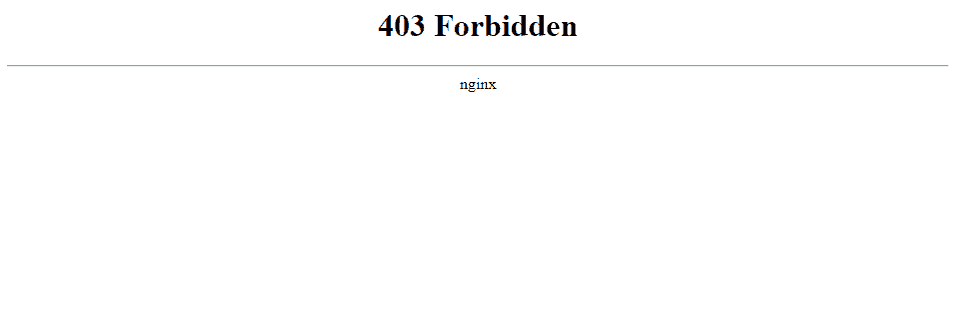

What the 403 Forbidden Error looks like at Kinsta

## 如何修复 WordPress 上的 403 禁止错误

为了帮助你修复 WordPress 网站上的 403 禁止错误，我们将详细介绍五个独立的故障排除步骤:

*   [文件权限](#file-permissions)
*   [。htaccess 文件](#htaccess)
*   [插件问题](#plugins)
*   [CDN 问题](#cdn)
*   [热链接保护](#hotlink-protection)

### 1.修改您的文件权限

WordPress 站点服务器上的每个文件夹和文件都有自己独特的文件权限，控制谁可以:

## 注册订阅时事通讯

### 想知道我们是怎么让流量增长超过 1000%的吗？

加入 20，000 多名获得我们每周时事通讯和内部消息的人的行列吧！

[Subscribe Now](#newsletter)

*   **读取**–查看文件中的数据/查看文件夹的内容。
*   **写**–修改文件/添加或删除文件夹内的文件
*   **执行**–运行文件和/或作为脚本执行/访问文件夹并执行功能和命令。

这些权限由一个 3 位数表示，每个数字表示上述 3 个类别的权限级别。

通常，这些权限只是为你的 WordPress 站点“工作”。然而，如果你的 WordPress 站点的文件权限出了问题，就会导致 403 禁止错误。

要查看和修改您网站的文件权限，您需要通过 [FTP/SFTP](https://kinsta.com/knowledgebase/ftp-vs-sftp/) 进行连接。这里是[如果你在 Kinsta](https://kinsta.com/knowledgebase/how-to-use-sftp/) 主持，如何使用 SFTP。

在一个方便的位置找到管理网站所需的所有工具(错误和所有内容)[免费试用 kin sta](https://hubs.ly/H0pklC_0)。

对于下面教程中的截图，我们将使用免费的 [FileZilla FTP 程序](https://kinsta.com/blog/best-ftp-clients/#Filezilla)。不过，这些基本原则将适用于任何 FTP 程序——你只需要将它们应用于不同的界面。

连接到服务器后，您可以通过右键单击来查看文件或文件夹的权限:

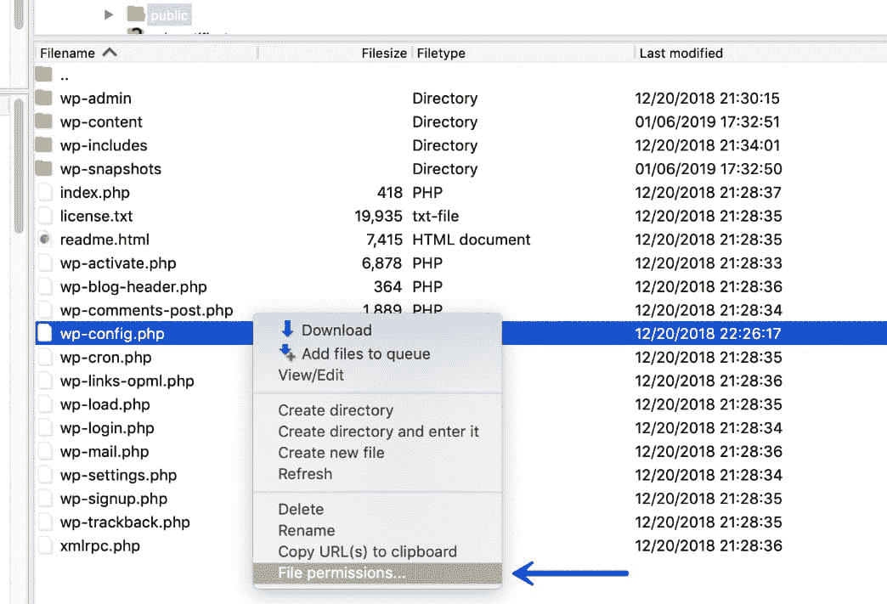

View file permissions in FileZilla

当然，手动检查每个文件或文件夹的权限并不是一个真正的选择。相反，您可以自动将文件权限应用于文件夹中的所有文件或文件夹。

[根据 WordPress Codex](https://codex.wordpress.org/Changing_File_Permissions) ，WordPress 的理想文件权限是:

*   **文件**–644 或 640
*   **目录**–755 或 750

一个例外是，你的 wp-config.php 档案应该是 440 或 400。

要设置这些权限，右击包含你的 WordPress 站点的文件夹(*文件夹名为****public****at Kinsta*)。然后，选择**文件属性**:

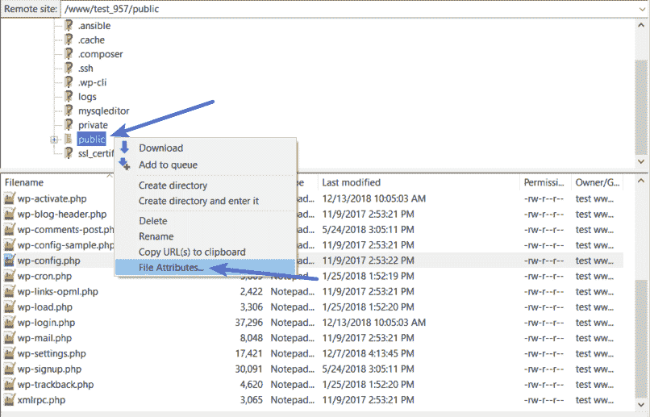

Bulk edit file permissions in FileZilla

在**数值**框中输入 755 或 750。然后，选择**递归进入子目录**和**仅适用于目录**:

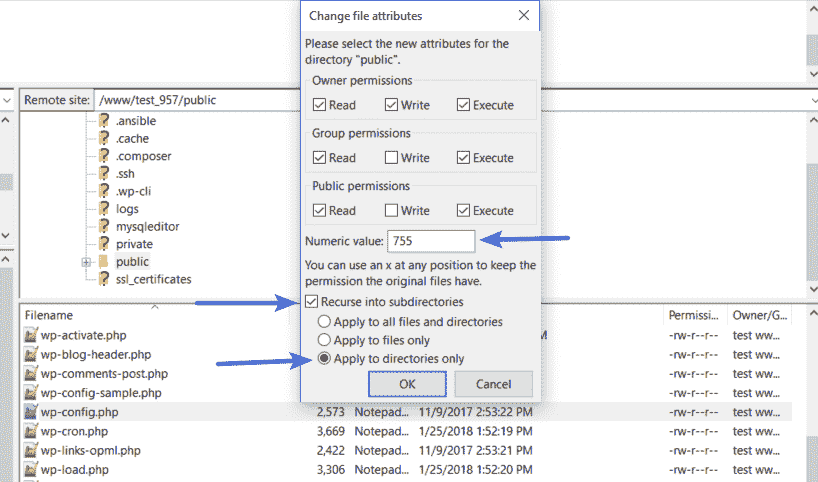

File permissions for WordPress directories

一旦您对目录应用了正确的权限，您将对文件重复该过程。只是这一次:

*   在**数值**框中输入 644 或 640
*   选择**递归进入子目录**
*   选择**仅应用于文件**

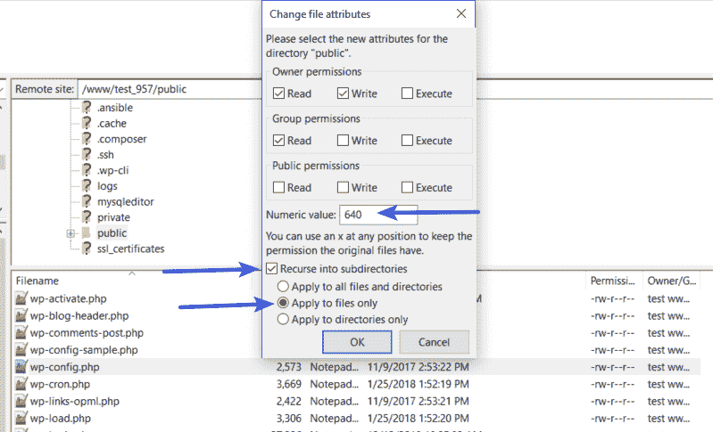

File permissions for WordPress files

要完成这个过程，您只需要手动调整您的**wp-config.php**文件的权限，使它们成为 440 或 400:

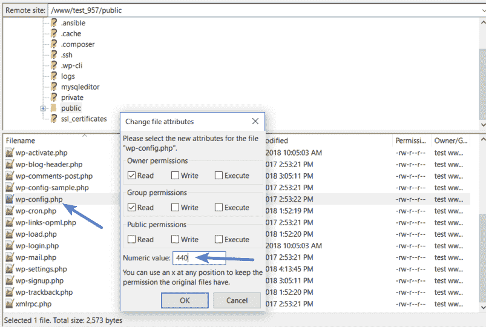

File permissions for wp-config.php file

如果文件权限问题导致了 403 禁止错误，您的站点现在应该可以重新开始工作了。

### 2.删除并恢复。htaccess 文件

Kinsta 使用 [NGINX web 服务器](https://kinsta.com/knowledgebase/what-is-nginx/)，所以如果你在 Kinsta 上托管你的站点，这个潜在的问题并不存在，因为 Kinsta 站点没有[。htaccess 文件](https://kinsta.com/knowledgebase/wordpress-htaccess-file/)。

然而，如果你在其他地方托管，而你的主机使用的是 [Apache web 服务器](https://kinsta.com/knowledgebase/what-is-apache/)，403 Forbidden 错误的一个常见原因是你站点的`.htaccess`文件有问题。

`.htaccess`文件是 Apache web 服务器使用的基本配置文件。你可以用它来[设置重定向](https://kinsta.com/blog/wordpress-redirect/)，限制访问你的全部或部分网站，等等。

在一个方便的位置找到管理网站所需的所有工具(错误和所有内容)[免费试用 kin sta](https://hubs.ly/H0pklC_0)。

因为它太强大了，即使一个小错误也能引起大问题，就像 403 禁止的错误。

而不是尝试排除故障。htaccess 文件本身，一个更简单的解决方案是强制 WordPress 生成一个新的、干净的`.htaccess`文件。

为此:

*   通过 FTP 连接到您的服务器
*   在根文件夹中找到`.htaccess`文件
*   下载一份文件到你的电脑上(*备份一下以防万一总是个好主意*
*   在你的本地计算机上有一个安全的备份副本后，从你的服务器**上删除`.htaccess`文件**

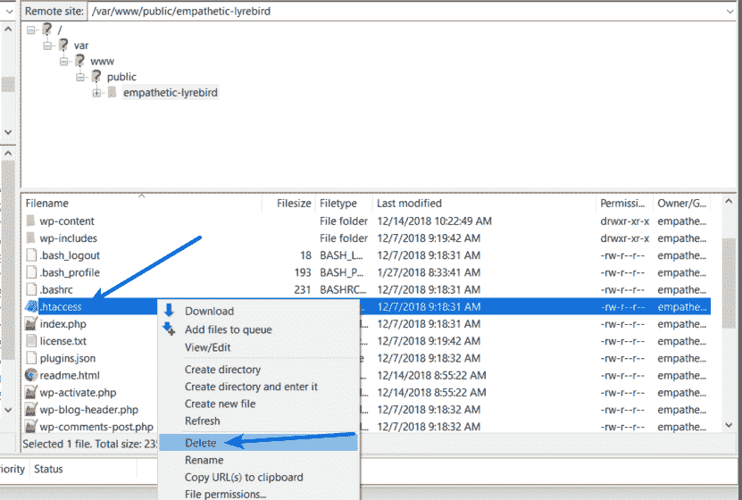

Delete the .htaccess file

现在，如果你的`.htaccess`文件有问题，你应该可以访问你的 WordPress 站点了。

要强制 WordPress 生成一个新的、干净的`.htaccess`文件:

*   在你的 WordPress 仪表盘中进入**设置→永久链接**
*   点击页面底部的**保存更改**(您无需进行任何更改，只需点击按钮)

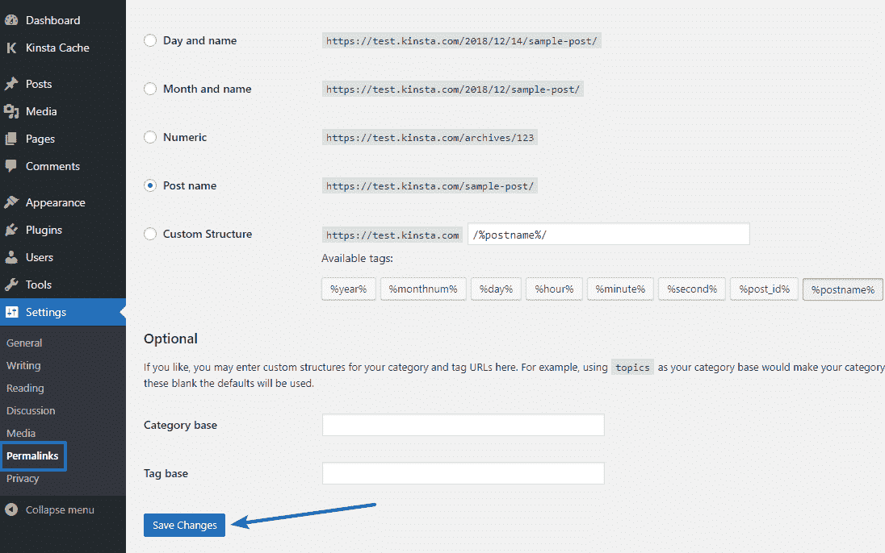

How to generate a new, clean .htaccess file

就这样——WordPress 现在会为你生成一个新的`.htaccess`文件。

### 3.停用然后重新激活您的插件

如果你的站点的文件权限和`.htaccess`文件都没有问题，那么下一步就是你的插件了。这可能是插件中的错误或者不同插件之间的兼容性问题。

不管是什么问题，找到有问题的插件的最简单的方法就是进行一些尝试和错误。具体来说，你需要停用所有的插件，然后一个接一个地重新激活它们，直到你找到罪魁祸首。

如果你仍然可以访问你的 WordPress 仪表盘，你可以从普通的**插件**区域执行这个过程。

如果你**不能**访问你的 WordPress 仪表盘，你将需要通过 FTP/SFTP 连接到你的 WordPress 站点的服务器(这里是[如何在 Kinsta](https://kinsta.com/knowledgebase/how-to-use-sftp/) 通过 SFTP 连接)。

通过 FTP 连接到服务器后:

1.  浏览到 **wp-content** 文件夹
2.  在 **wp-content** 文件夹中找到**插件**文件夹
3.  右键点击**插件**文件夹，选择**重命名**
4.  更改文件夹的名称。你可以给它起不同的名字，但是我们推荐像**插件禁用的**这样的名字，以便于记忆。

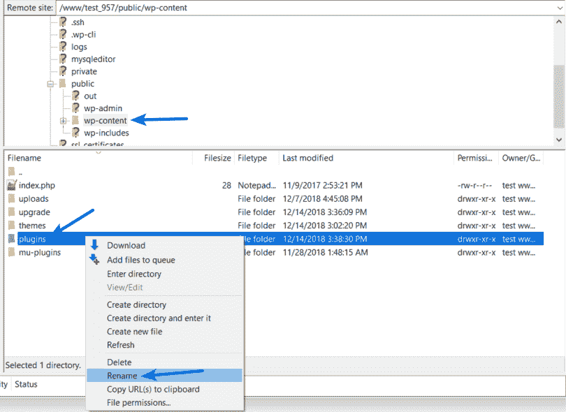

Rename the plugins folder

通过重命名文件夹，你已经有效地禁用了你站点上的所有插件。

现在，再次尝试访问您的网站。如果你的网站正在运行，你知道你的一个插件导致了 403 禁止错误。

要找到罪魁祸首，请逐个重新激活您的插件，直到您找到导致问题的插件。

在更改了**插件**文件夹的文件名后，当你进入你站点上的**插件**区域时，你应该会看到一些错误，说**插件文件不存在**:

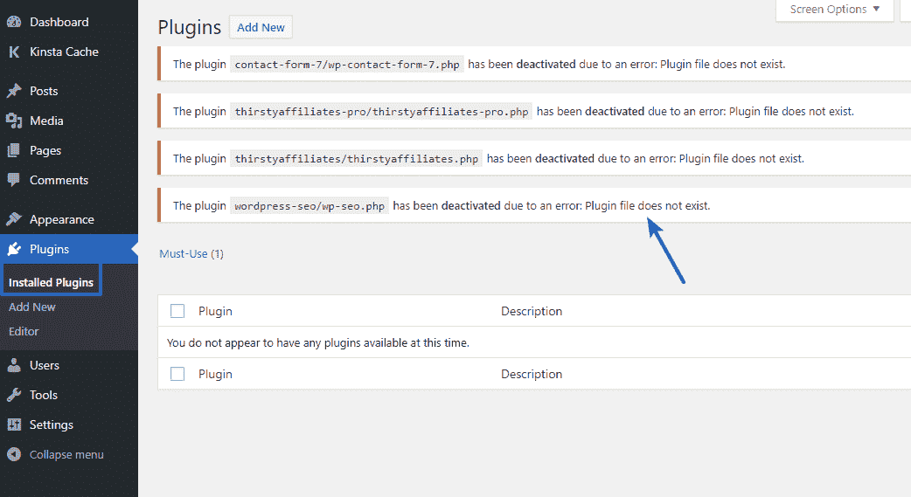

What happens after renaming the plugins folder

要修复此问题并重新获得管理插件的能力，请使用 FTP 程序将文件夹的名称改回为**插件**。所以，如果你把它改名为**插件禁用**，改回**插件**就行了。

一旦你这样做了，你将再次看到你所有插件的完整列表。只是现在，它们都被关闭了:

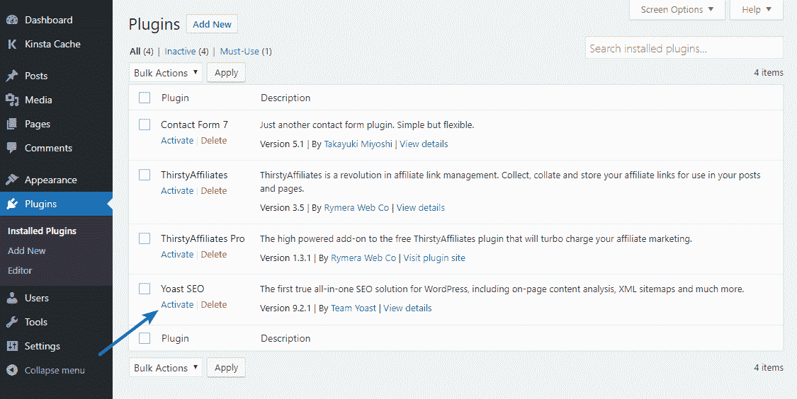

Reactivate your plugins one by one

使用**激活**按钮逐个重新激活它们。

一旦你找到导致问题的插件，你可以向插件的开发者寻求帮助，或者选择一个替代插件来完成同样的事情(我们在这里收集了[最好的 WordPress 插件](https://kinsta.com/best-wordpress-plugins/))。
T3】

### 4.暂时停用 CDN

如果你的资产(图片、JavaScript、 [CSS](https://kinsta.com/blog/wordpress-css/) )出现 403 禁止错误，这可能是你的内容交付网络( [CDN](https://kinsta.com/blog/wordpress-cdn/) )出现了问题。在这种情况下，我们建议暂时禁用您的 CDN，然后检查您的网站，看看它是否工作。如果你是金斯塔的客户，点击进入你的网站，然后在“金斯塔 CDN”标签。到达后，关闭“Kinsta CDN”按钮。

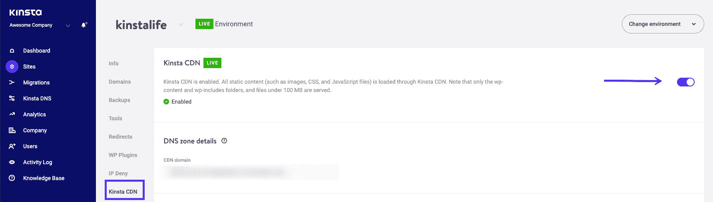

Disable Kinsta’s CDN

### 5.检查热链接保护是否配置错误

热链接是指某人在自己的网站上添加了一张图片，但是链接仍然指向其他人的网站。为了防止这种情况，一些人会在他们的 WordPress 主机或 CDN 提供商那里设置所谓的“热链接保护”。

启用热链接保护时，通常会返回 403 禁止错误。这很正常。然而，如果你看到一个 403 禁止错误，你不应该这样做，检查以确保热链接保护配置正确。

### 还是有问题吗？联系你的主机提供商

如果上述解决方案都不适合你，那么我们建议联系你的主机提供商。他们最有可能帮助您找到问题所在，并让您恢复正常运行。如果您是 Kinsta 的客户，请向我们的团队申请一张[支持票](https://kinsta.com/help/wordpress-support-ticket/)。我们全天候待命。

## 摘要

403 禁止错误意味着您的服务器正在工作，但由于某种原因，您不再有权限查看您的全部或部分网站。

这个错误的两个最可能的原因是你的 WordPress 站点的文件权限或者`.htaccess`文件的问题。除此之外，一些插件问题也可能导致 403 禁止错误。也可能是热链接保护或您的 CDN 配置错误。

通过遵循本指南中的故障排除步骤，您应该能够立即让您的站点恢复工作。

* * *

让你所有的[应用程序](https://kinsta.com/application-hosting/)、[数据库](https://kinsta.com/database-hosting/)和 [WordPress 网站](https://kinsta.com/wordpress-hosting/)在线并在一个屋檐下。我们功能丰富的高性能云平台包括:

*   在 MyKinsta 仪表盘中轻松设置和管理
*   24/7 专家支持
*   最好的谷歌云平台硬件和网络，由 Kubernetes 提供最大的可扩展性
*   面向速度和安全性的企业级 Cloudflare 集成
*   全球受众覆盖全球多达 35 个数据中心和 275 多个 pop

在第一个月使用托管的[应用程序或托管](https://kinsta.com/application-hosting/)的[数据库，您可以享受 20 美元的优惠，亲自测试一下。探索我们的](https://kinsta.com/database-hosting/)[计划](https://kinsta.com/plans/)或[与销售人员交谈](https://kinsta.com/contact-us/)以找到最适合您的方式。