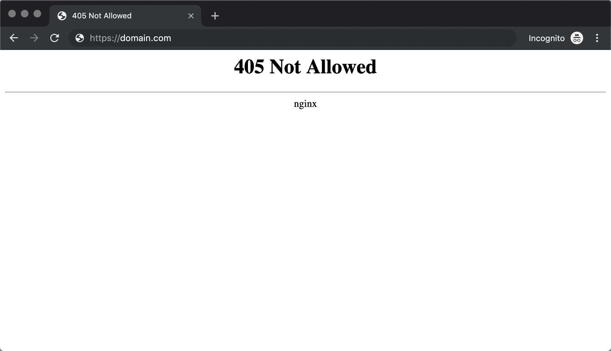
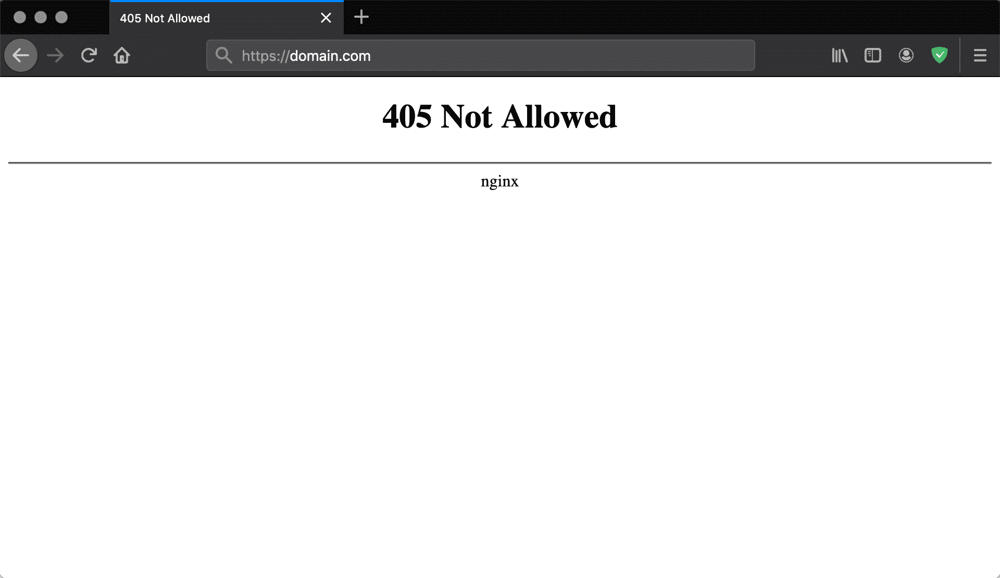
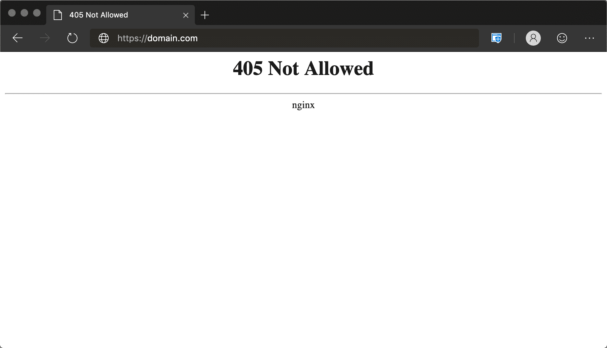
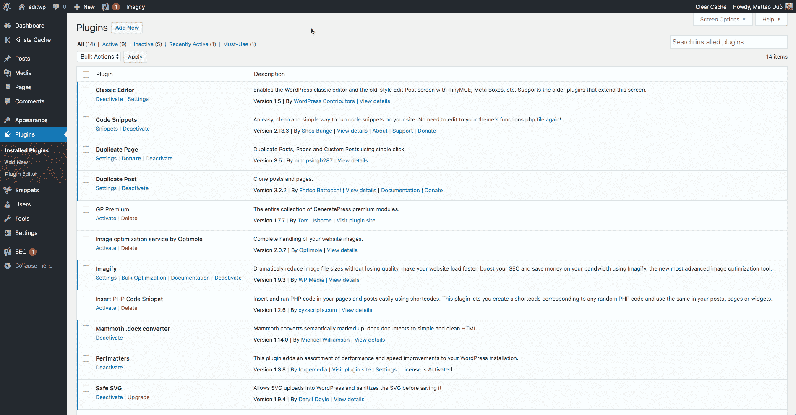
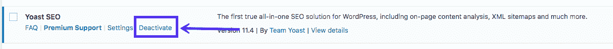
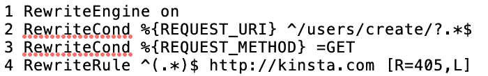

# 如何修复你的 WordPress 网站上的 405 方法不允许错误

> 原文：<https://kinsta.com/blog/405-method-not-allowed-error/>

如果有人在你的网站上看到一个错误页面，他们很有可能会生气并离开。这可能导致大量的参与和销售损失。需要注意的一个特别常见的错误是“不允许 405 方法”消息。

这个错误可能很难处理，因为它表明有问题发生，但没有告诉您为什么会发生。幸运的是，只要付出一点努力和耐心，您很快就可以恢复运行。

在本帖中，我们将解释什么是 405 错误，并向您展示它可能出现的不同方式。然后我们会告诉你如何在你的 WordPress 站点上修复这个错误。我们开始吧！

## 什么是“405 方法不允许”错误？

当你管理一个网站时，几乎可以肯定你最终会遇到某种常见的问题。网站关闭，[链接中断](https://kinsta.com/blog/broken-links/)，页面加载有点太慢。尽管这种情况很常见，但是如果不加以注意，很可能会导致用户体验不佳。

不幸的是，有些问题比其他问题更难解决。例如，考虑 405 方法不允许的错误消息。这是一个 [HTTP 响应状态](https://kinsta.com/blog/http-status-codes/),表示 web 浏览器已经请求访问您站点的某个页面。

在这种情况下，您的 web 服务器收到并识别了请求，但是拒绝了它使用的特定 HTTP 方法。实际上，这意味着浏览器无法访问它所请求的页面。您网站的访问者将会看到一个错误页面，而不是他们正在寻找的内容:

### 谷歌浏览器

405 Not Allowed Error Nginx in Chrome

### 旅行队

405 Not Allowed Error Nginx in Safari

### 火狐浏览器

405 Not Allowed Error Nginx in Firefox

### 微软 Edge

405 Not Allowed Error Nginx in Microsoft Edge

405 方法不允许错误不应与[404 未找到错误](https://kinsta.com/blog/error-404-not-found/)混淆。404 告诉你请求的 URL 找不到或者输入不正确。另一方面，405 错误消息确认请求的页面确实存在(并且 URL 输入正确)，但是使用了不可接受的 HTTP 方法进行初始请求。
T3】

## 405 不允许的方法(短定义):

当 web 服务器的配置方式不允许您对特定 URL 执行特定操作时，会出现 **405 方法不允许**错误。这是一个 HTTP 响应状态代码，表明服务器知道请求方法，但目标资源不支持它。

Support

### 查看我们的[视频指南](https://www.youtube.com/watch?v=EaLeSRAexbU&t=137s)到 405 方法不允许的错误

## 不允许 405 方法的变化错误

尽管 405 错误信息通常以我们上面展示的形式出现，但是各种 web 服务器、操作系统和浏览器可以以多种方式呈现它。问题的实际原因也可能因服务器不同而略有不同，这可能会影响错误出现的方式。

这里只是你可能遇到的许多不同变化中的几个:

*   405 不允许
*   不允许的方法
*   HTTP 405 错误
*   HTTP 错误 405–不允许使用方法
*   不允许 HTTP 405 方法

不管它们是如何出现的，405 错误的麻烦在于它们很难解决。这是因为他们让你知道出了问题，但他们没有告诉你问题的原因是什么。在大多数情况下，找到根本原因并在可能的情况下修复它取决于您。

## 注册订阅时事通讯

### 想知道我们是怎么让流量增长超过 1000%的吗？

加入 20，000 多名获得我们每周时事通讯和内部消息的人的行列吧！

[Subscribe Now](#newsletter)[Are you getting the 405 Method Not Allowed Error with your #WordPress site? Here are 7 ideas to easily fix it! 💡Click to Tweet](https://twitter.com/intent/tweet?url=https%3A%2F%2Fbit.ly%2F3gnyBUq&via=kinsta&text=Are+you+getting+the+405+Method+Not+Allowed+Error+with+your+%23WordPress+site%3F+Here+are+7+ideas+to+easily+fix+it%21+%F0%9F%92%A1)

## 如何修复你的 WordPress 网站上的 405 方法不允许错误(7 种可能的解决方案)？

在我们开始讨论可能的解决方案之前，您需要[为您的站点](https://kinsta.com/blog/wordpress-backup-plugins/)创建一个备份。如果你犯了错误，这会给你一些依靠。许多虚拟主机提供商将定期站点备份作为他们计划的一部分。如果你在金斯塔有一个托管计划，[创建一个备份很简单](https://kinsta.com/help/wordpress-backups/)。

一旦解决了这个问题，就该开始故障排除过程了。我们下面列出的方法是按照最有可能解决问题到最不可能解决问题的顺序排列的，所以从上到下，一步一步来达到最好的结果。

事不宜迟，让我们从清单上最简单的步骤开始吧。

### 1.检查你是否输入了正确的网址

这听起来可能有点太简单，但 405 方法不允许错误的最常见原因是输入了错误的 URL。大多数 web 服务器都受到严格保护，并被设计为不允许访问不正确的 URL，以防止用户访问错误的页面(或试图访问不存在的页面)。

因此，在进一步操作之前，请仔细检查以确保您正确输入了您希望访问的网站的 URL。犯错误比你想象的要容易，比如忘记一个字母或者拼错一个单词。您可能还会发现，简单地刷新页面就可以提示它正确加载。

### 2.回滚任何最近的 WordPress 更新

[更新是美好的事情](https://kinsta.com/blog/wordpress-automatic-updates/)。它们通常会带来大量令人兴奋的新功能，并有助于修复任何正在进行的错误和修补安全漏洞。然而，尽管他们的意图是好的，更新偶尔会导致一些问题。

如果你在 405 方法不允许错误信息出现之前更新了 WordPress，新代码可能是问题的根源。这也适用于你最近升级的任何扩展或主题——尽管我们将在下一节更多地关注这方面。

如果你觉得某个更新可能有问题，恢复到 WordPress 的前一个版本是值得的。正如我们已经提到的，在做这件事之前，确保你已经准备好了一个完整的站点备份——你不想做任何不可逆的改变。

虽然你可以手动完成，但是回滚 WordPress 更新最简单的方法是使用插件。可用选项很多，虽然 [WP 降级](https://wordpress.org/plugins/wp-downgrade/)特别有效。这个插件将在很大程度上自动化这个过程，这意味着你不太可能犯错误。

在您的武器库中拥有这样的工具也意味着您可以防止将来发生类似的问题。当然，如果回滚最新的更新不能解决问题，记得重新更新你的站点或者恢复你的备份。

通过一个统一的管理控制面板将出错的可能性降至最低，并使站点备份变得简单(且易于访问)。[免费试用 kin sta](https://hubs.ly/H0pklC_0)。

### 3.卸载新的插件和主题

插件是任何 WordPress 网站必不可少的部分。它们使您能够添加大量新功能，甚至可以自动化更复杂的流程。主题同样重要。没有它们，你将需要大量复杂的编码(或者一个昂贵的开发者)来创建一个美观的网站。

不幸的是，就像软件更新一样，这些扩展有时会产生问题。这是因为在你的网站上添加任何层次的功能都会完全改变它的运作方式。你正在使用的插件或主题可能有问题，或者某个特定的扩展可能与你网站的另一部分(甚至是你的 WordPress 版本)冲突。

因此，你可能会发现卸载某些插件或主题可以帮助修复 405 方法不允许的错误。要开始这个过程，你需要导航到你的 WordPress 仪表盘的**插件部分**。在这个页面上，您应该能够看到您已经安装的所有插件的完整列表:

Plugins page in WordPress

从这里开始，你可以一次卸载一个插件。卸载每一个后，检查您的网站，看看错误是否已经解决。这个过程可能需要一些时间来完成，但是它将使您能够准确地指出哪个插件导致了问题(如果其中任何一个有问题):

How to deactivate a WordPress plugin

一旦你检查完你的插件，你可以用你的活动主题重复这个过程。如果你的主题或者你的插件出现了问题，你需要联系开发者，移除插件或者主题，或者寻找替代品。这是我们关于[如何安装新主题](https://kinsta.com/blog/how-to-install-a-wordpress-theme/)的指南。

### 4.检查任何意外的数据库更改

虽然上面的步骤应该可以解决任何与插件或主题相关的问题，但它并不能保证你的扩展所做的所有改变都被完全还原。对于很多 WordPress 插件来说尤其如此。当你点击**安装**时，他们通常被给予对你的数据库的完全[访问权，这意味着他们的改变比你最初想象的要深入。](https://kinsta.com/knowledgebase/wordpress-database/)

除非开发者明确地对其进行编码，否则插件可能会修改不“属于”它的数据库记录，而是由 WordPress 自己管理。在这种情况下，插件可能不知道如何恢复对数据库记录的更改，因此在卸载过程中会忽略它们。

诊断这个特殊的问题可能很困难，但是如果你仍然怀疑插件或主题是 405 方法不允许错误的原因，[直接检查你的数据库](https://kinsta.com/help/db-access/)是你最好的行动。为此，您需要打开站点的数据库，手动查看被扩展修改的表和记录。如果你不确定要找什么，在这一点上与你的开发者取得联系是一个聪明的主意(对于这个列表中的剩余步骤也是如此)。

### 5.确认服务器的配置

你的网站可能运行在使用两种最流行的服务器软件选项之一的服务器上——[Apache 或 Nginx](https://kinsta.com/blog/nginx-vs-apache/) 。事实上，它们为全球 84%的网络服务器提供动力。检查 web 服务器软件的配置文件中是否有任何无意的处理说明，这可能有助于确定 405 方法不允许错误的根本原因。

为了确定您的 web 服务器正在使用哪个应用程序，您需要寻找一个关键文件。例如，如果您的 web 服务器运行 Apache，您应该能够找到一个。网站文件系统根目录下的 htaccess 文件。

当您的应用程序位于共享主机上时，您可能会有一个与您的特定帐户相关联的用户名。如果是这种情况，通常可以通过以下路径找到应用程序根目录:

`/home/public_html/`

因此。htaccess 文件位于:

`/home/public_html/.htaccess`

一旦你找到了。htaccess 文件，在[文本编辑器](https://kinsta.com/blog/best-text-editors/)中打开它，并查找使用重写指令的行。这些是 Apache 中 mod_rewrite 模块的一部分，定义了一个基于文本的模式，它将匹配所有输入的 URL。如果访问者请求匹配的 URL，重写器会相应地重定向访问者。

为了更好地演示这一点，下面是一个简单的重写器，它将所有传入请求匹配到 https://kinsta.com，并以 405 方法不允许错误代码进行响应:

Example of the RewriteRule

正如您可能看到的，在规则的末尾有一个标记为 R=405 的标志。这明确指出响应代码应该是 405，向用户表明资源存在，但是提供的 HTTP 方法不被允许。如果您在。htaccess 文件，请尝试使用#字符前缀临时注释掉它们。然后，您可以重新启动 web 服务器，查看您的更改是否解决了问题。

记住，如果你是 Kinsta 的客户，我们使用的是 Nginx 服务器，而不是 Apache。如果你认为你的 Nginx 配置有问题，你可以联系我们的支持团队。
T3】

### 6.查看服务器端日志

几乎每个 web 应用程序都有某种服务器端日志。应用程序日志通常包含软件所做一切的完整历史记录——从它请求的页面到它提供的数据库结果。

服务器日志略有不同，因为它们与运行应用程序的实际硬件相关。它们通常会提供有关所有连接服务的健康和状态的详细信息，甚至只是服务器本身。

要找到你的 [WordPress 服务器日志](https://kinsta.com/knowledgebase/wordpress-error-log/)，你需要通过[安全文件传输协议(SFTP)](https://kinsta.com/knowledgebase/how-to-use-sftp/) 连接到你的站点。在根目录中，您会看到一个名为 logs 的文件夹。在这个文件夹里是你的访问日志和你的 WordPress 错误日志。它们应该看起来像这样:

*   Access.log
*   错误日志

从那里，您可以开始遵循与上一步中概述的类似过程。查看日志，记下任何看起来不合适的地方(或者要求您的开发人员这样做)。你也可以在 WordPress 中参考 codex 获得额外的[调试信息。](https://kinsta.com/blog/wordpress-debug/)

### 7.调试您的应用程序代码或脚本

如果前面的步骤都没有成功，这可能表明你的 WordPress 安装中的一些自定义代码有问题。确定这是否是 405 方法不允许错误的原因的唯一方法是调试它。

理想情况下，您会希望将整个安装复制到一个在线或本地开发区域-[,比如一个临时站点](https://kinsta.com/help/staging-environment/)。从那里，您可以开始进行一步一步的调试过程，这将根据您的站点及其附加的软件而有所不同。

不幸的是，这里没有快速解决办法。你必须准备好花时间梳理你网站的每一部分，寻找任何看起来不合适的地方。然而，请记住，一个完全可操作的网站值得你去争论。

### 如果这些解决方案都不起作用，该怎么办

如果您仍在阅读，这可能意味着我们上面概述的解决方案仍未修复 405 方法不允许错误。这通常表明出现了更复杂的问题，除非您是经验丰富的开发人员，否则这不太可能是您个人可以解决的问题。

在这种情况下，你能做的最好的事情通常是[直接联系你的主机提供商](https://kinsta.com/contact-us/)。您应该可以通过实时聊天或票务服务获得全天候的客户支持。你也可以通过电子邮件或电话联系你的主人，尽管选择实时聊天可能会提供更快的解决方案。

## 摘要

不管你的网站有多精心优化，你几乎不可避免地会遇到至少一个错误信息。当这种情况发生时，迅速解决问题是很重要的，这样才能让访问者对你的网站感兴趣。幸运的是，虽然 405 方法不允许错误可能会令人困惑，但通过一点故障排除通常可以修复它。

让我们回顾一下你可以尝试的七种方法来修复你的 WordPress 站点上的 405 错误:

*   检查以确保您在地址栏中输入了正确的 URL。
*   回滚任何最近的 WordPress 更新，以区分这是否是导致问题的原因。
*   一次卸载一个新的插件或主题。
*   确保没有任何意外的数据库更改。
*   确认服务器的配置。
*   查看 WordPress 存储的服务器端日志。
*   尝试调试您的应用程序代码或脚本。

关于 405 方法不允许错误，您还有其他问题吗？或者您希望我们介绍另一个常见的错误信息？请在下面的评论区告诉我们！

* * *

让你所有的[应用程序](https://kinsta.com/application-hosting/)、[数据库](https://kinsta.com/database-hosting/)和 [WordPress 网站](https://kinsta.com/wordpress-hosting/)在线并在一个屋檐下。我们功能丰富的高性能云平台包括:

*   在 MyKinsta 仪表盘中轻松设置和管理
*   24/7 专家支持
*   最好的谷歌云平台硬件和网络，由 Kubernetes 提供最大的可扩展性
*   面向速度和安全性的企业级 Cloudflare 集成
*   全球受众覆盖全球多达 35 个数据中心和 275 多个 pop

在第一个月使用托管的[应用程序或托管](https://kinsta.com/application-hosting/)的[数据库，您可以享受 20 美元的优惠，亲自测试一下。探索我们的](https://kinsta.com/database-hosting/)[计划](https://kinsta.com/plans/)或[与销售人员交谈](https://kinsta.com/contact-us/)以找到最适合您的方式。