# 为什么您需要应用程序性能监控工具

> 原文：<https://kinsta.com/blog/application-performance-monitoring/>

性能是任何应用成功的核心。由于用户依赖网络应用程序来满足他们的日常需求，一个企业的成功现在与其应用程序的性能成正比。因此，应用性能监控(APM)对于任何公司来说都是交付和维护顶级[用户体验](https://kinsta.com/blog/web-design-best-practices/)的关键。

对更新、更好的应用程序的需求导致了[快速应用程序开发](https://en.wikipedia.org/wiki/Rapid_application_development)方法的采用。虽然它减少了开发时间，但也增加了许多潜在的复杂性。因此，今天的复杂应用程序，包括网站，提出了新的挑战，只能用[有用的 APM 工具](https://kinsta.com/blog/apm-tools/)来解决。

这篇文章探讨了什么是 APM 工具，APM 工具的类型，典型的 APM 特性，以及如何使用 [Kinsta APM 工具](https://kinsta.com/apm-tool/)来管理各种类型的 WordPress 网站。

听起来很有趣？我们开始吧！

## 什么是应用性能监控(APM)？

应用性能监控(APM)是监控、[管理、](https://kinsta.com/mykinsta/)并掌握应用性能的过程。APM 包括监控应用程序的技术性能和用户感知的[性能](https://kinsta.com/blog/google-pagespeed-insights/#the-truth-about-scoring-100100-in-google-pagespeed-insights)。

由于今天的应用程序运行在高度分布式的基础设施上，它们的所有组件都在不断变化，监控起来非常复杂。因此，一个有用的 APM 软件必须检查应用程序的所有关键部分，以便更容易地排除故障和管理其性能。

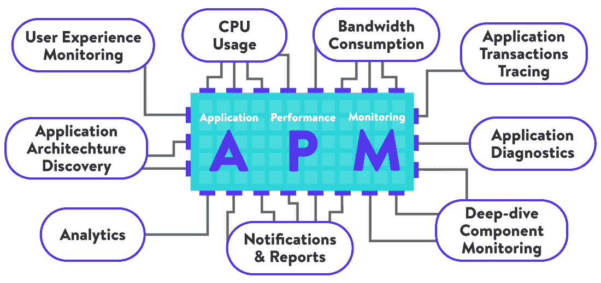

Various components of a useful APM tool

由于典型的 web 应用程序包含各种组件，因此监控每个元素的性能指标对于衡量应用程序的整体性能至关重要。APM 工具应该处理所有数据，并通过简化的[仪表板](https://kinsta.com/knowledgebase/wordpress-admin/)有意义地呈现出来。这样，您或您的支持人员就不必花费大量时间来解释记录的数据。

[根据 Gartner](https://www.gartner.com/doc/reprints?id=1-1YU0BQT0&ct=200422&st=sb&aliId=eyJpIjoiUDRCWTVIQTJ4Z1VVb0N0bCIsInQiOiJveXYzRFFiQzhiaU5KVXpSd1JFbDFRPT0ifQ%253D%253D) 的说法，应用性能监控工具可以定义为满足三个主要标准的软件:

*   **前端监控**包括针对 PC 和移动终端用户的用户体验监控和综合交易监控。
*   **应用程序发现、跟踪和诊断**涉及多种功能，例如自动发现各种应用程序元素，如 web 服务器、平台、框架、微服务等。接下来，它涉及确定这些元素之间的关系并诊断它们的代码。最后，它包括跟踪应用程序如何响应用户请求。
*   **分析**是指记录应用程序生成的所有数据，然后使用各种技术来发现有意义的模式。它可以帮助您找到性能问题的根本原因，并在问题发生之前预测未来的问题。

通过结合上述所有功能，应用程序性能监控工具可以轻松保持应用程序的最佳性能。

## 3 种不同类型的 APM 工具

您可以根据 APM 工具的用途将它们分为不同的类型。

### 基于应用指标的 APM 工具

这些 APM 解决方案主要收集几个与应用和服务器相关的指标。APM 工具随后使用这些数据来确定应用程序的哪个 [URL](https://kinsta.com/knowledgebase/what-is-a-url/) 请求速度较慢。因为他们不分析应用程序的代码，所以他们不能告诉你是什么导致了速度变慢。很少有[流行的 APM 工具](https://kinsta.com/blog/apm-tools/)只*监控应用度量。*

### 基于代码分析的 APM 工具

这些 APM 产品执行代码分析和事务跟踪，这可以帮助您深入到性能问题的确切原因。许多流行的 APM 工具使用特定领域的人工智能和机器学习技术来分析各种[代码类型](https://kinsta.com/blog/scripting-languages/)。结合应用程序指标，它可以帮助他们识别任何性能问题的潜在原因。

### 基于网络的 APM 工具

这些 APM 工具关注网络流量来衡量应用性能。由于它需要高度专业化的技术，只有少数 APM 工具可以做到这一点。因此，它催生了一个名为[网络性能监控](https://www.riverbed.com/faq/what-is-network-performance-monitoring.html)的新产品类别。

大多数 APM 工具，包括 Kinsta APM，都属于上面列出的第一种和第二种类型。

## 应用程序性能监控软件的有用功能

每个 APM 软件的核心是收集大量关于应用程序执行情况的数据。然而，开发人员需要的不仅仅是数据，以从中获得实用的见解。APM 需要[用上下文](https://kinsta.com/blog/wordpress-custom-dashboard/)呈现数据，以便您可以快速找到性能问题的根本原因。

以下是 APM 软件支持的一些最有用的功能。

### 衡量应用程序事务的性能

每个 APM 工具的核心是测量每个[请求和响应](https://kinsta.com/blog/http-status-codes/)的性能。总的来说，它们被称为事务。了解这一点可以帮助您找出应用程序中最常被访问的请求、最慢的请求以及需要重点关注以优化应用程序性能的请求。

### 监控应用程序依赖项的性能

您的应用程序也可能因为其依赖项之一的问题而变慢，比如数据库、[缓存、](https://kinsta.com/blog/wordpress-cache) [web 服务器、](https://kinsta.com/blog/nginx-vs-apache/)、第三方服务等等。例如，缓慢的数据库查询或服务器会影响应用程序的整体性能。外部 HTTP web 服务和缓存的问题也会导致同样的结果。因此，不仅要监控应用程序，还要监控它的所有依赖项，这一点非常重要。

### 在代码级别测量性能

知道哪个请求或事务执行得不好仅仅是个开始。弄清楚它为什么表现如此也是至关重要的。通过在代码级别对您的应用程序进行概要分析，APM 工具可以帮助您获得对导致您的应用程序性能低下的代码的有用见解。

### 监控服务器资源使用情况

保持对服务器的 CPU 和内存使用的检查是必要的，特别是如果你想根据流量自动调整你的应用程序。在金斯塔，我们会为您处理好一切。

### 集中式应用程序日志系统

应用程序日志数据和错误对于开发人员和支持人员快速修复应用程序性能问题至关重要。虽然您可以通过其他方式手动访问所有的[大量服务器日志](https://kinsta.com/knowledgebase/wordpress-error-log/)，但是将所有记录放在一个集中的仪表板中非常有用。

### 真实用户监控(RUM)

监控应用程序的实际用户体验对于确定应用程序是否按预期执行至关重要。如果没有，应用程序的哪个部分失败了。通常， [RUM](https://en.wikipedia.org/wiki/Real_user_monitoring) 是通过在应用程序中注入一个 JavaScript 标签来被动执行的。该脚本然后提供来自使用该应用的客户端(例如，[浏览器](https://kinsta.com/browser-market-share/)，应用)的反馈。

## 为什么你需要一个应用性能监控工具来管理 WordPress

WordPress 使用起来很简单。这是它最大的优势之一。但是在它的核心，[管理](https://kinsta.com/ebooks/wordpress/manage-multiple-wordpress-sites/)它和任何其他 web 应用程序或框架一样复杂。

所有托管在 Kinsta 上的 WordPress 网站都运行在由谷歌云平台驱动的虚拟机上。我们利用 **LXD** 托管主机和 **LXC** 软件容器来隔离每个站点，用所有需要的软件——**Linux**、 **Nginx** 、 **PHP** 、**Maria db**——来平稳运行 WordPress。

结合我们内置的性能优化，如 **Kinsta 缓存**和 **Kinsta CDN** ，它使 Kinsta 成为[最快的 WordPress 主机](https://kinsta.com/blog/fastest-wordpress-hosting/)之一。

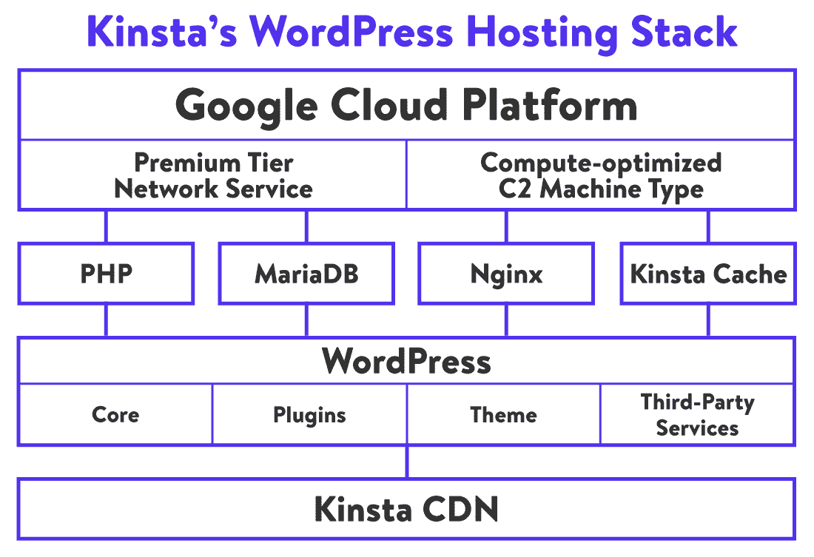

Kinsta’s managed WordPress hosting stack

作为托管、[数据库](https://kinsta.com/database-hosting/)和[托管 WordPress 托管](https://kinsta.com/wordpress-hosting/)提供商的[，我们负责所有的服务器优化和维护任务。](https://kinsta.com/application-hosting/)

我们的团队使用 [Google Cloud Operations(以前的 Stackdriver)](https://cloud.google.com/products/operations) 和各种 SysOps 工具来监控和改善我们的云托管环境的性能。

因此，即使涉及到这么多不同的技术，在像 Kinsta 这样的主机提供商上很少会遇到服务器性能问题。

然而，你不能这么快地修复你的 WordPress 站点上的性能瓶颈。当事情变得不顺利的时候(事实确实如此)，对你的 WordPress 站点进行调试和故障排除会令人非常沮丧。

WordPress 通过其插件和主题提供的无限定制可能性也增加了额外的复杂性。此外，[我们不断升级我们的技术体系](https://kinsta.com/feature-updates/)以跟上最新、最好的技术。T2 的 WordPress 也在快速发展。

因此，监控一个应用程序的性能，比如 WordPress(及其组件)，是很困难的。当有数百甚至数千个站点需要监控时，这种情况尤其明显。在这里，APM 工具非常方便。
[满足应用性能监控，又名超级英雄工具，将帮助您更快地运行⚡️💪更强的网站。单击了解有关为自己设置 APM 的更多信息💥 点击推文](https://twitter.com/intent/tweet?url=https%3A%2F%2Fkinsta.com%2Fblog%2Fapplication-performance-monitoring%2F&via=kinsta&text=Meet+Application+Performance+Monitoring%2C+AKA+the+superhero+tool+that+will+help+you+run+a+%E2%9A%A1%EF%B8%8F+faster%2C+%F0%9F%92%AA+stronger+site.+Click+to+learn+more+about+setting+up+APM+for+yourself+%F0%9F%92%A5&hashtags=APM%2CSiteSpeed)

## 金斯塔 APM 工具来拯救

我们的 [Kinsta APM](https://kinsta.com/help/apm-tool/) 工具帮助你直接从你的 [MyKinsta 仪表板](https://kinsta.com/mykinsta/)上识别你的 WordPress 站点上的性能问题。它可以在[的所有 Kinsta 计划](https://kinsta.com/plans/)的**上获得，没有额外的费用**，所以你不必注册第三方应用程序性能监控服务，如 [New Relic](https://kinsta.com/blog/wordpress-performance-new-relic/) 。注意:如果他们想继续使用 New Relic，Kinsta 客户可以 [添加他们自己的许可证](https://kinsta.com/help/custom-new-relic-tracking/)。T15】

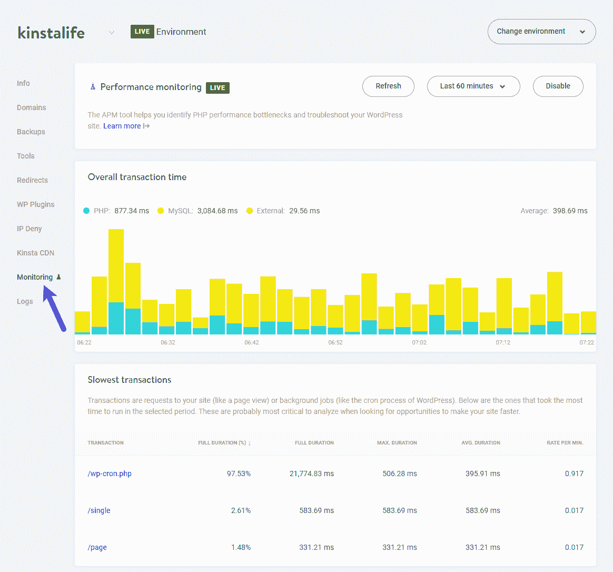

The Kinsta APM page in the MyKinsta dashboard

它专为监控 Kinsta 上托管的站点而定制，可以捕获并显示关于站点操作的时间戳数据: [PHP](https://kinsta.com/knowledgebase/what-is-php/) 进程、 [MySQL](https://kinsta.com/knowledgebase/what-is-mysql/) 数据库查询、外部 HTTP 请求等等。

您可以启用 Kinsta APM 来跟踪您的站点在指定时间段(30 分钟到 24 小时)内的性能。

### 信息

默认情况下，Kinsta APM 工具处于禁用状态。我们建议您仅在需要时使用，因为您可能会遇到轻微但仍然明显缓慢的加载时间。

一旦启用，Kinsta APM 将显示总交易时间和您站点上发生的最慢交易。这些事务可以追溯到你的站点上最消耗资源的请求(例如 admin-ajax.php，wp-cron.php)。

单击某个事务会将您带到它的事务跟踪时间线，从这里您可以深入了解导致问题的原因。

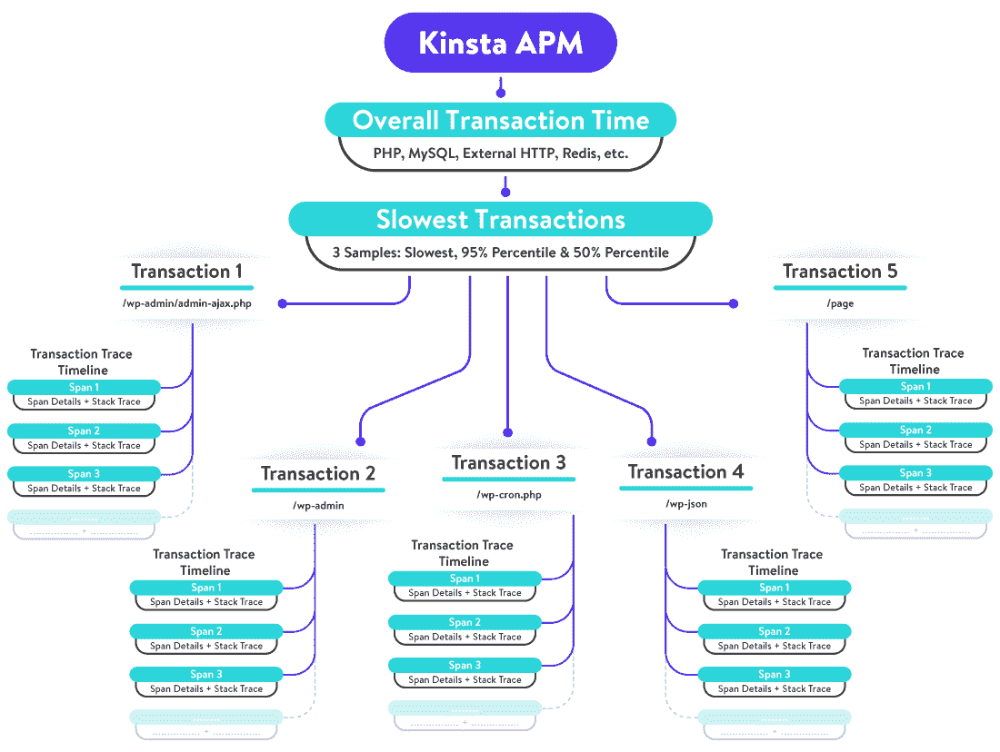

Kinsta APM makes debugging WordPress easier

通过使用 Kinsta APM 工具，你可以监控和优化 WordPress 站点[以确保最佳性能](https://kinsta.com/learn/speed-up-wordpress/)。这将使你能够快速定位导致问题的 WordPress 组件。有了这些知识，你就可以迅速解决它们。

即使你自己不能解决这个问题，需要[雇佣一个 WordPress 开发者](https://kinsta.com/blog/hire-wordpress-developer/)，知道是什么导致了这个问题可以帮助你节省时间和金钱。

您可以参考我们的 [Kinsta APM 知识库](https://kinsta.com/help/apm-tool/)文档来更详细地了解它是如何工作的。

## 应用程序性能监控的用例

以下是一些应用程序性能监控如何帮助不同类型网站的真实例子。

### 电子商务网站

速度和性能是电子商务网站的一切。你的电子商务网站加载速度越快，购物体验就越好。[根据 Akamai](https://www.akamai.com/uk/en/about/news/press/2017-press/akamai-releases-spring-2017-state-of-online-retail-performance-report.jsp) 的说法，页面加载的 **100 毫秒**延迟可以影响转化率 **7%** ，而 **2 秒**延迟可以将跳出率提高高达 **103%** 。

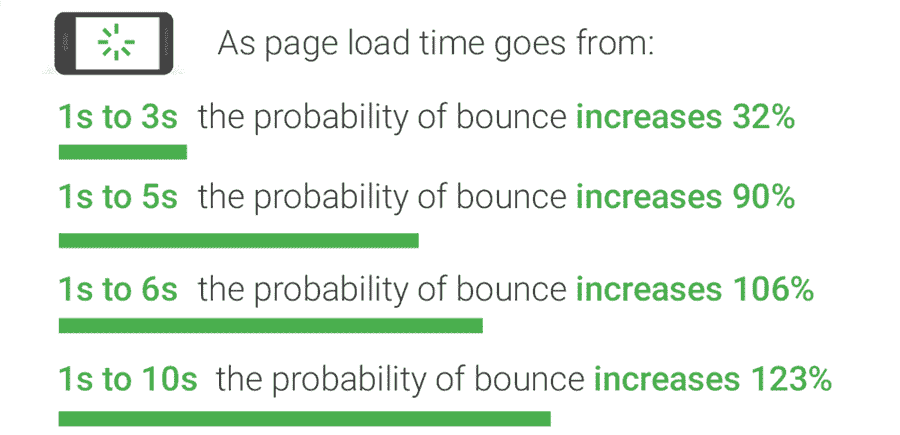

Page load time is critical for an ecommerce site (Source: Think with Google)

然后是停机时间。如果你的电子商务网站对某些用户(或者更糟，对所有人)关闭，你每一秒钟的停机都会损失收入。更糟糕的是，它会对你的品牌声誉造成长期损害。

一个[电子商务网站](https://kinsta.com/blog/ecommerce-statistics/)有许多内部和外部的服务相互作用。在这里，多个组件相互协作:产品目录、产品搜索、产品评论、用户账户管理、库存管理、购物车、订单和运输管理、支付处理器、安全附件、个性化推荐、第三方集成等等。

一些电子商务网站还包括[客户关系管理(CRM)](https://kinsta.com/blog/wordpress-crm/) 和[电子邮件营销软件](https://kinsta.com/blog/email-marketing-software/)，以更好地吸引客户。

最重要的是，一个现代电子商务网站运行在一个复杂的技术堆栈上，就像任何其他网络应用程序一样。例如，WooCommerce 运行在 WordPress 上，由 PHP 和 MySQL 数据库提供支持，在 Linux 等操作系统上运行 Nginx 或 Apache 等 web 服务器。

由于涉及到如此多的因素，很难找到性能问题或停机的原因。APM 工具在这里可以给你极大的帮助。在大多数情况下，APM 工具将使您能够在问题发生之前就发现问题，引导您主动修复性能问题，而不是被动应对。

例如，CafePress 是一家非常受欢迎的在线礼品店，它的电子商务商店经常出现宕机。网站每停机一小时，他们的日收入就会减少大约 5.5%。CafePress 使用 APM 工具发现了导致停机的问题，并迅速解决了问题。

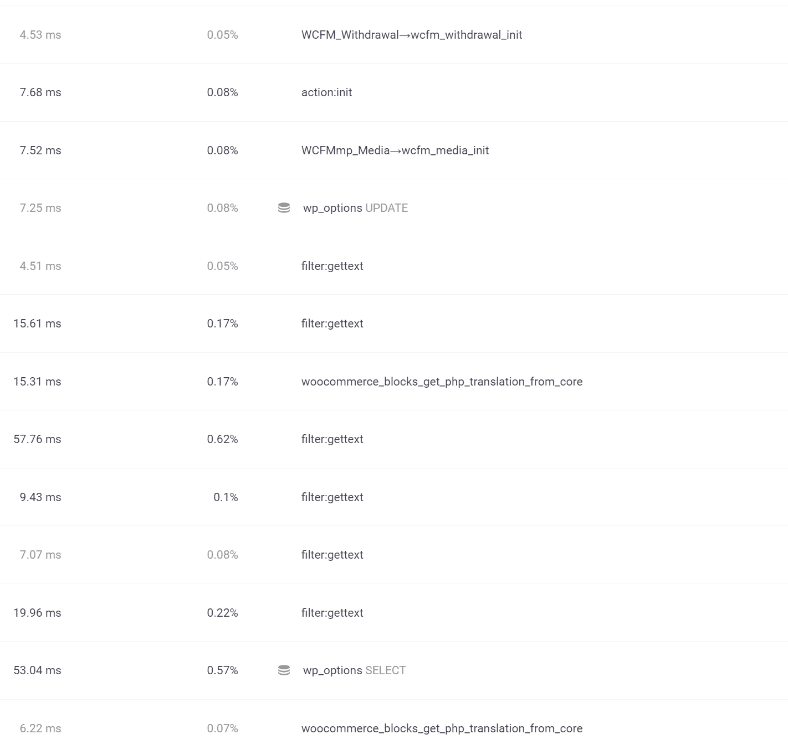

The ‘Transaction trace timeline’ in Kinsta APM

Kinsta APM 让您也能做到这一点。例如，你可以用它来解决你的 WooCommerce 网站后端性能缓慢的问题。这样做将向您显示在您的站点上发生的所有最慢的事务的列表。

## 注册订阅时事通讯

### 想知道我们是怎么让流量增长超过 1000%的吗？

加入 20，000 多名获得我们每周时事通讯和内部消息的人的行列吧！

[Subscribe Now](#newsletter)

点击任何一个事务样本，都会显示一个带有时间戳的列表，其中列出了该事务样本中发生的所有时间跨度。这个列表称为事务跟踪时间线。

您可以单击任何一个 span 项目，以获得关于其中启动的所有流程的详细报告。

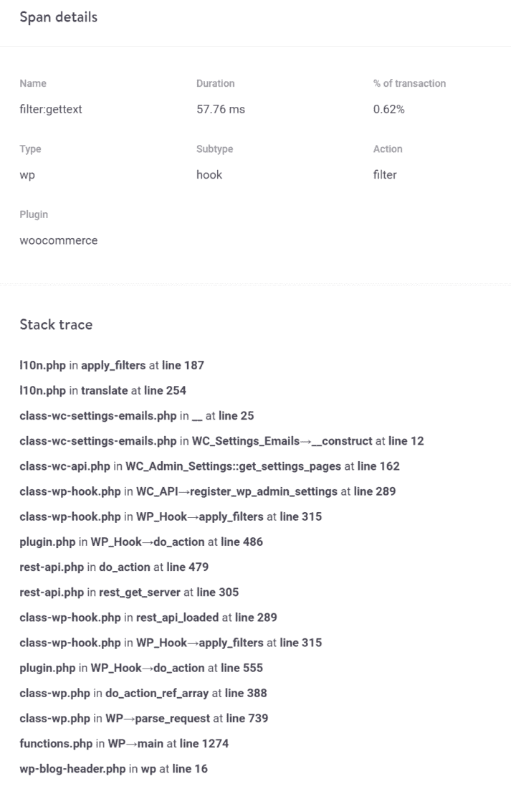

“Span details” and “Stack trace” timeline in Kinsta APM

Kinsta APM 将智能地尝试确定这个特定跨度的主要原因。在上面的例子中，它是 WooCommerce 插件。堆栈跟踪的详细信息可以帮助你了解在 WooCommere 网站上哪里可以解决性能问题。

Kinsta 的 WooCommerce 托管计划是为确保你的网上商店在任何时候都表现出色而量身定制的。现在，您还可以使用 Kinsta APM 来优化您的电子商务网站的性能和更好的用户体验。这将带来更高的收入和利润。

### 会员和社区网站

[会员和社区网站](https://kinsta.com/blog/hosting-wordpress-membership-sites/)是将内容货币化和建立经常性收入来源的好方法。然而，[成功维护它们是一个巨大的挑战](https://kinsta.com/blog/hosting-wordpress-membership-sites/#why-membership-sites-are-different)，因为它们涉及大量并发登录用户、复杂查询和高数据存储需求。此外，由于其高度个性化的本质，他们提供的大多数[内容是不可缓存的](https://kinsta.com/knowledgebase/php-workers-ecommerce/)。

[根据行业基准](https://recurly.com/research/churn-rate-benchmarks)，订阅业务的长期成功取决于将流失率降至最低。做到这一点的最佳方式是提高客户满意度。这在很大程度上取决于你的网站表现如何。

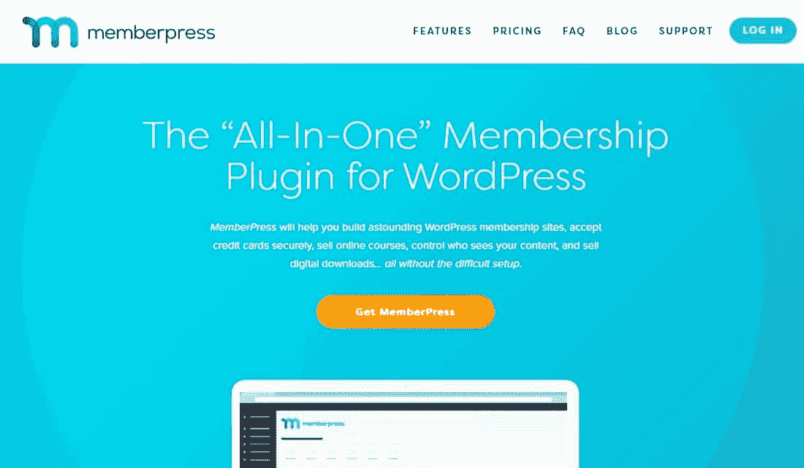

MemberPress is a popular WordPress membership plugin

因此，保持你的会员或社区网站的性能是吸引新会员和保持现有会员的关键。使用 APM 工具可以帮助您高效地做到这一点。

> "*我们的团队运行着大约 20 个 web 应用程序，为遍布全球的大约 10 万用户提供服务。自从我们开始使用 Application Insights 以来，我们发现我们对应用的性能有了更清晰的了解，因此，我们的用户看到了性能更好、更有用的应用。*—[APM 与应用洞察](https://devblogs.microsoft.com/devops/case-study-application-performance-monitoring-with-application-insights/)

Kinsta APM 工具可以帮助您监控您的会员网站在负载下是否运行良好。如果没有，您可以使用它来诊断和解决问题。

对于建立在 WordPress 平台上的会员或社区网站来说，大多数潜在的性能问题和电子商务网站面临的问题是一样的。除此之外，你将使用一个[会员插件](https://kinsta.com/blog/wordpress-membership-plugins/)或[论坛插件](https://kinsta.com/blog/wordpress-forum-plugins/)而不是 WooCommerce。如果需要，您还可以使用 WooCommerce 来处理会员订阅和定期付款。

无论您最终使用的是什么，我们的 Kinsta APM 工具都能让您对您的成员如何使用您的网站有新的了解。跟踪这些指标对于会员制或社区驱动型网站的成功至关重要。

### SaaS 应用

[软件即服务(SaaS)](https://kinsta.com/blog/saas-products/) 指直接通过浏览器或应用程序向用户交付软件产品。它现在已经成为许多流行应用程序的主要交付机制，尤其是那些由大型企业提供的应用程序。一些常见的例子包括:

*   办公套件:谷歌文档，Office365
*   **消息和聊天:** Slack，Sendbird
*   **会计:** Quickbooks Online， [FreshBooks](https://kinsta.com/blog/freshbooks-vs-quickbooks/)
*   **开票:**波，支付宝开票
*   合作:特雷罗，阿萨纳，大本营
*   **营销:** HubSpot，MailChimp
*   人力资源管理:monday.com cake HR
*   **平面设计:** Canva，模版

由于 SaaS 用户通常会花很多时间使用该应用程序，他们希望它总是表现良好。如果用户对你的 SaaS 应用不满意，他们可以很容易地转向另一家 SaaS 提供商。因此，SaaS 应用程序需要在任何负载下保持其性能才能成功。

但是监控和管理 [SaaS 应用程序的性能具有挑战性](https://www.yottaa.com/3-reasons-why-saas-application-performance-matters/)。大多数 SaaS 应用运行在[多租户架构](https://en.wikipedia.org/wiki/Multitenancy)上，其中软件的单个实例同时服务于多个用户。

对高度动态和互动网站的需求意味着 SaaS 应用程序也需要从不同的第三方域中获取几十(甚至几百)种资源。因此，就服务器端代码和用于交付它们的网络基础设施而言，它们的管理更加复杂。

例如，SaaS 一家专注于人事和招聘机构的公司 Crelate 使用 APM 工具在灾难发生前发现了关键的绩效问题。

> " *Elder 和他的团队通过主动识别瓶颈和性能问题，每年节省了超过***【60，700 美元】和几百个小时，这要归功于在 SDLC 的每个阶段中 *Retrace 的即时* *反馈循环。*“—[在 Stackify](https://stackify.com/crelate-empowers-recruiters-with-retrace/) 创建案例研究**

 **你可以利用 WordPress 的多功能性将其作为一个平台。有些人甚至称它为服务。WordPress.com，一个开源 WordPress 的托管版本，是 WPaaS 最成功的例子之一。

WordPress.com is a popular example of WPaaS

同样，你也可以使用 WordPress 作为基础来构建各种 SaaS 类型的项目，例如[项目管理网站](https://kinsta.com/blog/wordpress-project-management-plugins/)、[房地产目录](https://kinsta.com/blog/wordpress-real-estate-plugins/)、[商业目录](https://kinsta.com/blog/wordpress-directory-plugins/)、[在线学习网站](https://kinsta.com/blog/wordpress-lms-plugins/)等等！

由于我们的 Kinsta APM 工具独立于你如何使用 WordPress 工作，你可以用它监控任何类型的 SaaS 应用程序的性能。使用我们的 Kinsta APM 工具不仅可以帮助您解决和避免性能瓶颈，还可以了解客户趋势，减少客户流失，以及评估新的业务增长战略。

需要一个给你带来竞争优势的托管解决方案吗？Kinsta 为您提供了令人难以置信的速度、一流的安全性和自动伸缩功能。[查看我们的计划](https://kinsta.com/plans/?in-article-cta)

### 在线杂志和新闻网站

数字新闻消费继续稳步增长。无论是政治、娱乐、体育、迷因，还是所有这些的混合，网络空间现在拥有许多传统和数字原生媒体渠道。

不断增长的在线读者群和不断增加的读者参与度是数字出版商面临的两个最严峻的挑战。在没有首先考虑用户体验方面的情况下，适当地从一个高流量网站赚钱也是令人厌倦的。

根据用户体验报告的[状态，读者对慢网站没有耐心。他们希望每台设备都有快速的网络性能。这对高流量网站来说是一个挑战，尤其是那些提供大量富媒体内容的网站。](https://www.limelight.com/resources/white-paper/state-of-user-experience-2017/#patience)

Kinsta powers the “The Sport Review” news site

出版商吸引和留住读者的另一种方式是通过个性化。但是做对并做好这件事是很棘手的。它还需要给站点增加额外的开销，这会影响它的性能。

> 新闻机构越来越相信提供个性化的内容可以帮助他们吸引观众到他们的网站上——并保持他们的回访。——[尼曼报道](https://niemanreports.org/articles/the-power-of-personalization/)

虽然大型媒体机构可以雇佣一个独立的 IT 团队来维护他们网站的性能，但是小型数字出版商这样做是不可行的。一个有效的 APM 解决方案，如我们的 Kinsta APM 工具，以及托管解决方案，可以帮助这些出版商削减网站性能优化的成本。

数字出版商也可以使用像 WordPress 这样简单易用的开源出版平台来节省成本。一些最大的在线杂志和新闻网站，如 [Wired、The New Yorker 和 TechCrunch，每天都使用 WordPress](https://kinsta.com/blog/wordpress-site-examples/#news-and-magazine-wordpress-sites) 接触数百万读者。

在金斯塔，我们可以帮你做到这一点。为了证明这一点，读一读 [Kinsta 是如何帮助英国数字出版商 Plan Media](https://kinsta.com/clients/open-plan-media/) 每天为**提供 72 万次页面浏览量**而没有任何停顿的。

### 商业和企业网站

大型公司和企业可以使用网站向全球数百万潜在客户展示他们的产品和服务。[通过博客发布有用的内容](https://kinsta.com/learn/content-marketing/)也能吸引公众注意力，建立品牌忠诚度。

对于企业网站来说，包含诸如[本地化](https://kinsta.com/blog/localization-strategy/)、[多语言内容](https://kinsta.com/blog/wordpress-multilingual/)和一个更小的微型网站网络等功能是很常见的。他们通常还需要复杂的基于角色的访问需求，所有这些都会使站点的技术架构变得复杂。

为数百万多语言的国际用户服务这样一个网站是一项艰巨的任务。在不损害公司工作流程和业务目标的情况下有效地做到这一点是一个更大的挑战。

首先，它需要一个由世界级技术专家团队支持的企业级托管基础设施。其次，为了确保网站访问者获得最佳的用户体验，企业必须彻底监控网站上的每一次用户交互。最后，它需要安全、可扩展和可靠。

我们的 Kinsta APM 工具可以极大地帮助您掌握网站的性能。它将基于多个因素分解性能问题，如位置、设备类型、用户活动、代码性能和其他应用程序指标。您可以使用这些数据点来深入了解应用程序的可用性和性能。

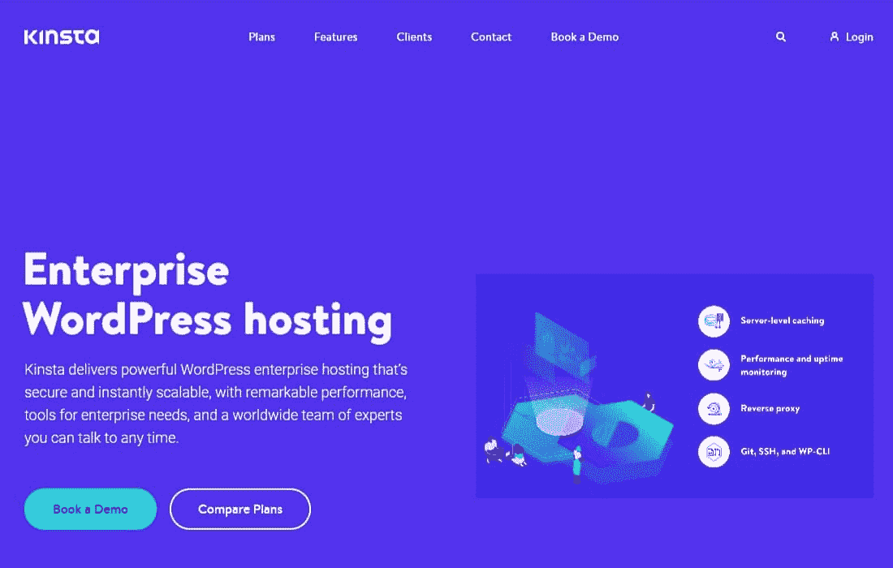

Kinsta offers powerful Enterprise WordPress hosting

WordPress 检查了任何企业网站需要的大部分技术特性。它是可扩展的，开源的，经常更新的，搜索引擎友好的，用户友好的，可扩展的。此外，它可以被定制为做任何你想做的事情。

[根据 BuiltWith](https://trends.builtwith.com/cms/traffic/Top-10k) 的数据，排名前 10000 的网站中有 3459 个使用 WordPress。一些著名的例子包括[奔驰](https://www.mercedes-benz.com/en/)、[索尼音乐](https://www.sonymusic.com/)、 [BBC 美国](http://www.bbcamerica.com/)、[施乐](http://www.blogs.xerox.com/)、[哈佛商业评论](https://hbr.org/)。你可以在我们的 [130+ WordPress 网站大品牌示例](https://kinsta.com/blog/wordpress-site-examples/#business-and-enterprise-wordpress-websites)文章中查看更多这样的例子。

在 Kinsta，我们帮助企业提供安全的、即时可扩展的、性能卓越的 WordPress 站点。你可以看看我们是如何帮助 Intuit(QuickBooks、TurboTax 和 Mint 等品牌背后的公司)扩展他们的 WordPress 网站，每月为数百万用户提供服务的。

### 教育和在线学习网站

在线教育为教师和学生都开辟了新的可能性。十多年来，通过大规模开放在线课程(MOOCs)、编码训练营和在线认证项目提供的替代教育形式一直在缓慢推动教育行业向前发展。

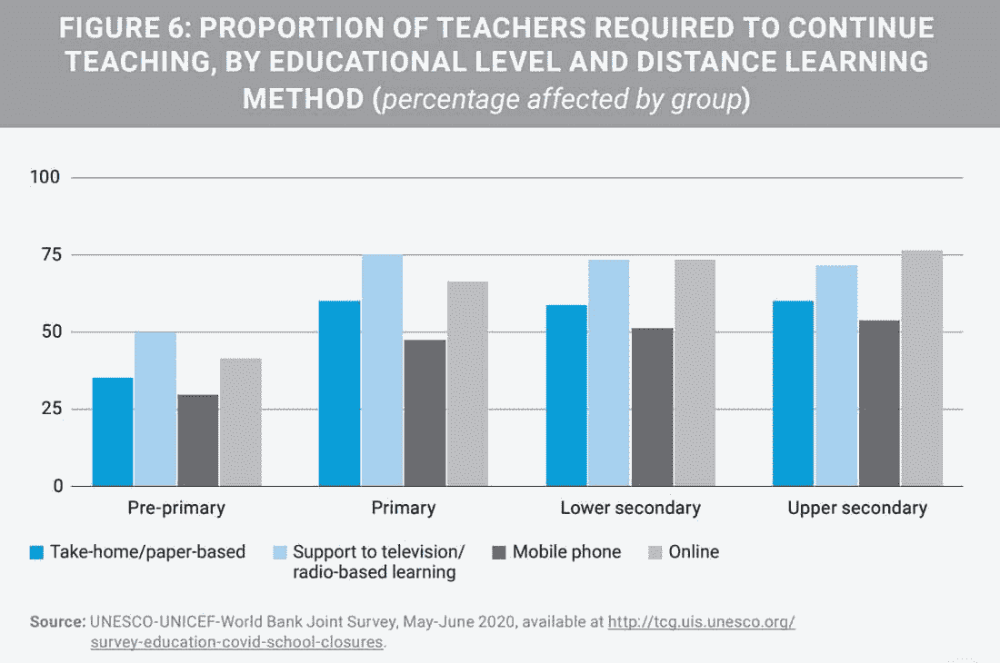

Growth in distance learning due to COVID-19

一些在线教育门户网站，如 Udemy 和 StraightLine，将这一趋势推进了一步。通过每月订阅，他们为学生提供了获得可转让大学学分或额外证书的机会。现在，疫情也迫使大多数高中和大学上网。

EdX 和 Coursera 等成熟的 MOOC 平台利用各种技术为数千万学习者提供课程。然而，今天的教育机构仍然停留在通过 Zoom 或 Google Meet 使用简单的“远程学习”课程。但事实并非如此。

通过使用 WordPress 的许多插件、主题和服务，你可以将它用于一切与教育相关的事情。通过[将其设置为基于学习管理系统(LMS)](https://kinsta.com/wordpress-lms-hosting/) 的网站，您可以轻松地教授在线课程和远程培训学生。

然而，LMS 网站面临着许多与会员制和电子商务网站相同的性能挑战。由于海量数据(图片、[视频、](https://kinsta.com/blog/video-hosting/)、论坛线程)、大量登录用户、不可缓存的动态内容和复杂的数据库查询，它们是资源密集型的。如果处理不当，这些问题会大大降低网站的运行速度。

我们的 Kinsta APM 工具为应对所有这些性能挑战提供了坚实的基础。无论您面临的问题是由于[缓慢的数据库查询](https://kinsta.com/blog/wp-query/)还是未优化的 LMS 插件，或者两者兼而有之，您都可以使用 Kinsta APM 快速深入到确切的原因。

我们从头开始设计我们的主机架构，运行所有流行的 WordPress LMS 插件，包括 LearnDash、LearnPress、Sensei LMS、Lifter LMS 等等。作为证明，了解一下 [WP-Tonic 如何为 Kinsta 会员和 LMS 网站](https://kinsta.com/agency-directory/wp-tonic/)提供支持。

### 管理客户网站的数字机构

多亏了 WordPress，开发和发布客户端网站变得前所未有的简单。然而，管理它们是一个挑战，尤其是当你处理许多站点的时候。这是一个好问题，因为找到合适的客户是一项更大的任务。

典型的情况是，一个数字代理机构负责众多 WordPress 网站的维护、安全和性能。每个客户都有独特的需求，需要使用不同的主题、插件和定制代码。这使得掌控所有网站的性能变得更加复杂。

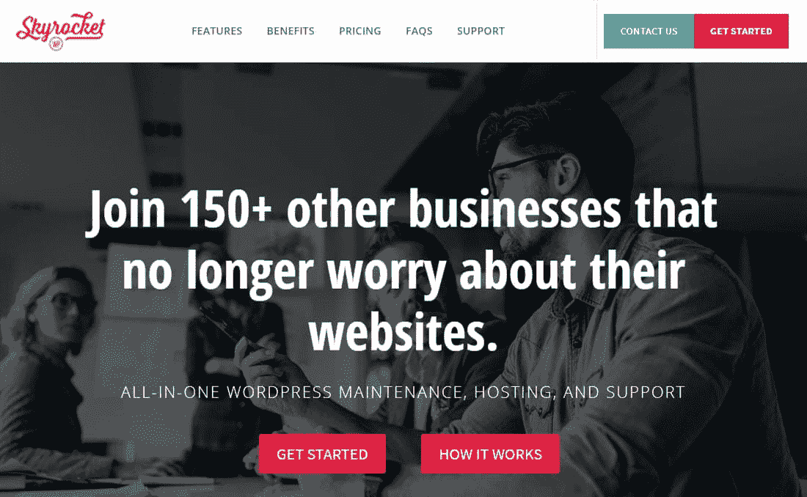

SkyrocketWP hosts all their client sites with Kinsta

但是，确保所有客户网站的出色表现对于数字代理的成功至关重要。在 Kinsta，我们不断创新，以使这项工作更快、更有效。

例如，我们定制的 MyKinsta 控制面板使从一个屏幕管理多个站点变得非常简单。您还可以使用它让客户完全控制他们的网站。

> 从价格、可靠性和客户支持来看，Kinsta 是你能找到的最好的应用程序、数据库和托管 WordPress 主机，它们让我的生活变得更加轻松。这解放了我的时间，让我能够专注于职业发展的其他方面，这反过来又为我们的客户提供了附加值。”——贾里德·斯特里切克，[恩文特斯合伙人](https://kinsta.com/clients/enventys-partners/)

Kinsta APM 是我们开发的另一款工具，旨在简化您的工作。您可以使用它来监控您管理的所有客户端站点的性能。如果一个站点正面临速度下降，您可以激活 Kinsta APM 工具，快速确定是什么导致了这个问题。它会给你指出正确的方向，帮助你恢复网站的速度。

您的客户会喜欢支持票上更快的周转时间。您会喜欢在支持成本上节省的时间和金钱，同时仍然保持最高水平的服务质量。此外，它还能让您腾出时间专注于其他紧迫的需求，例如管理和发展您的数字代理。

### WordPress 多站点网络

WordPress Multisite 是 WordPress 最奇特的实现之一。它允许你从一个单独的 WordPress 安装上运行一个独立网站的网络。无论你想托管许多相似的客户网站，运行多个商业网站，还是管理学院或大学的社区网络，WordPress Multisite 都可以帮助你快速设置它们。

UBC hosts their student community blogs on WordPress Multisite

然而，[多站点网络带来了独特的挑战](https://kinsta.com/blog/wordpress-multisite-plugins/#the-challenges-of-backing-up-and-migrating-a-wordpress-multisite-network),使得维护和监控其性能变得非常困难。由于 WordPress 多站点网络上的每个子站点都使用相同的服务器和数据库资源，它们更容易出现过载和性能问题。

如果一个标准的 WordPress 安装吸引较少的流量，它可能会避免代码优化的问题。然而，多站点网络的情况并非如此，因为网络中可能分布着许多较小的站点。即使网络的一个子站点吸引了大量的流量，任何未优化的代码都可能导致整个网络过载。

我们的 Kinsta APM 工具可以帮助您发现多站点网络中最慢的交易。即使你或你的开发者对 WordPress Multisite 不太熟悉，了解是什么导致你的网站变慢对解决问题非常有帮助。为了快速简单地提升整体优化，也可以考虑缩减代码。Kinsta 在 [MyKinsta 仪表板](https://kinsta.com/mykinsta/) 中内置了一个 [代码缩小功能](https://kinsta.com/help/kinsta-cdn-code-minification) ，允许客户只需简单点击即可实现 CSS 和 JavaScript 的自动缩小。

如果你使用一个[廉价的托管计划](https://kinsta.com/blog/cheap-wordpress-hosting/)来运行一个 WordPress 多站点网络，整个网络很有可能会崩溃，变得没有反应。因此， [Kinsta 只在其 Pro 和更高级的主机计划上支持 WordPress Multisite](https://kinsta.com/knowledgebase/multisite/) 。
[如果你还没有使用 APM 工具，你需要尽快使用。💥准备好进入你的网站的分析和优化速度就在这里⚡️ 点击推文](https://twitter.com/intent/tweet?url=https%3A%2F%2Fkinsta.com%2Fblog%2Fapplication-performance-monitoring%2F&via=kinsta&text=If+you+aren%27t+already+using+an+APM+tool%2C+you+need+one+ASAP.+%F0%9F%92%A5+Get+ready+to+dive+into+your+site%27s+analytics+and+optimize+for+speed+right+here+%E2%9A%A1%EF%B8%8F&hashtags=APM%2CSitePerformance)

## 摘要

在对应用程序的性能问题进行故障排除时，APM 工具可以帮助您轻松地大海捞针。此外，APM 工具还将主动监控所有应用程序的代码、请求、响应、用户体验等等。

由于我们痴迷于速度和性能，我们最近发布了 Kinsta APM 工具，作为对我们所有客户的免费新功能,不管他们使用的是什么计划。这样，他们不用手动检查 WordPress 站点的每个组件是否导致任何性能问题，而是可以开始通过内置的 Kinsta APM 收集见解，并立即查明确切的原因。

有了 [Kinsta APM 工具](https://kinsta.com/apm-tool/),您现在可以跟踪您站点的性能并快速监控其整体健康状况。你可能不再需要依赖第三方工具来调试你的网站，比如[查询监视器](https://kinsta.com/blog/query-monitor/)和 New Relic。

无论你是否是 Kinsta 的客户，请放心:APM 让你更深入、更细致地了解你的网站或应用程序上正在发生的事情，因此你确切地知道在哪里采取行动。

* * *

让你所有的[应用程序](https://kinsta.com/application-hosting/)、[数据库](https://kinsta.com/database-hosting/)和 [WordPress 网站](https://kinsta.com/wordpress-hosting/)在线并在一个屋檐下。我们功能丰富的高性能云平台包括:

*   在 MyKinsta 仪表盘中轻松设置和管理
*   24/7 专家支持
*   最好的谷歌云平台硬件和网络，由 Kubernetes 提供最大的可扩展性
*   面向速度和安全性的企业级 Cloudflare 集成
*   全球受众覆盖全球多达 35 个数据中心和 275 多个 pop

在第一个月使用托管的[应用程序或托管](https://kinsta.com/application-hosting/)的[数据库，您可以享受 20 美元的优惠，亲自测试一下。探索我们的](https://kinsta.com/database-hosting/)[计划](https://kinsta.com/plans/)或[与销售人员交谈](https://kinsta.com/contact-us/)以找到最适合您的方式。**