# 33 个美丽的草书字体，以提高您的网站

> 原文：<https://kinsta.com/blog/cursive-fonts/>

为你的网站选择合适的字体总是一个重要的决定。虽然网站开发的某些方面可能更重要，但字体选择确实是其中之一。

想想看:你选择的 HTML 字体将决定网站访问者如何体验你所有的文字内容。选择不当，人们将很难读懂你试图传达的信息。基本上，不好。

尽管你通常想为正文和主要内容选择非脚本字体，你也应该确保它们是安全的。然而，草书字体可以为你的网站设计增添一丝优雅。

在我们进入一个健康的草书字体选项列表之前，让我们先来讨论一下手写体或草书字体的来源，以及一些最佳用例的例子。

## 字体简史

草书字体被正式称为脚本字体，它们已经存在了几百年。我们在这里谈论的是早在打字机和文字处理之前的事情。相反，脚本字体的灵感来自于 18 世纪左右使用的实体草书。你会在用羽毛笔和墨水写的手稿中发现这种卷曲的、满是卷轴的笔迹。

在这一时期，英国贵族非常喜欢书法，这完全是因为使用了尖尖的笔尖。这种优雅的字体随后被刻在铜板上，可以用于印刷。同样的风格在 20 世纪 70 年代得到了复兴，在那里，剧本的繁荣统治了各个领域的广告。

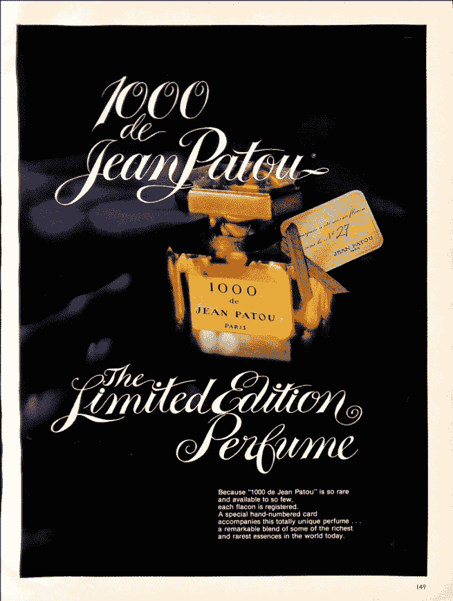

1976 Jean Patou 1000 Perfume Ad – Image source: eBay

另一方面，毛笔书写起源于亚洲。书法是用毛笔创作的，这导致了一种轻盈、细腻的书写风格。

> 需要在这里大声喊出来。Kinsta 太神奇了，我用它做我的个人网站。支持是迅速和杰出的，他们的服务器是 WordPress 最快的。
> 
> <footer class="wp-block-kinsta-client-quote__footer">
> 
> 
> 
> <cite class="wp-block-kinsta-client-quote__cite">Phillip Stemann</cite></footer>

[View plans](https://kinsta.com/plans/)

如今，当以数字格式复制时，毛笔字体模仿了这种轻量级的风格，这种风格带有许多缺陷和笔触，可以用于任何需要个人或真实触摸的地方。

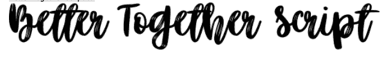

Better Together Script Font. Image source: dafont.com

我们今天在印刷材料和网上看到的字体是在 20 世纪开发的，通常比他们的前辈更宽松一些。它们比草书和早期的手写字体更随意，更容易阅读。

当然，一些脚本字体仍然相当难以辨认。例如，盖尔语风格的字体是块状的，但在某些情况下仍然保留了草书的元素，这使得它很难阅读。同样地，[书法字体](https://kinsta.com/blog/calligraphy-fonts/)有时会加重繁体字，模糊字母。

在现代，字体已经以多种方式被使用。从婚礼请柬到广告，剧本对印刷品来说并不陌生。这也解释了为什么？

使用字体会自动给你的作品增加一种时尚和精致的感觉。这也增加了真实性。虽然不是手写的，但它模仿了草书，可以立即在你的脑海中产生个人风格的联想。

### 何时使用草书字体

我们已经提到了一些潜在的使用案例，但是让我们花点时间来进一步探索在你的网站上何时何地使用草书字体。当然，任何时候你想传达优雅，一个草书字体会很好地为你服务。但是在一些特定的情况下，我们期望并鼓励使用它们:

*   正式场合:任何时候，如果你想表现出高贵或成熟，一种字体都可以。婚礼请柬就是一个很好的例子。证书，奖项，其他正式文件，以及杂志标题都可以受益于他们的使用。
*   **官方营销资料:**与上述类似，公司信笺、[网站标题](https://kinsta.com/knowledgebase/add-code-wordpress-header-footer/)和[博客文章标题](https://kinsta.com/blog/headline-analyzer/)可能会找到适合的草书字体。
*   奢侈品牌:对于一家经营奢侈品的[公司或品牌](https://kinsta.com/blog/wordpress-site-examples/)来说，使用同样奢侈或精致的字体更有意义。
*   **页眉和标题**:草书字体最好在短连写中使用。它们只是在用于正文时不太易读。这很难看，也不容易理解，所以坚持用它们来代替标题。
*   **一次一种:**在你的网站上只使用一种字体。试图使用多个太麻烦了。请记住，脚本字体最常用于标题或引起对特定文本行的注意(如副标题或标语)。在你的网站上使用多种草书或手写字体只会显得过于花哨，所以不要这样做。

记住所有这些，现在让我们来看看让你的网站看起来更好更专业的最好的草书字体列表。

## 2022 年最佳草书字体

在你开始下一个项目之前，你肯定会想考虑这些草书字体中的一种，它非常适合为你的 WordPress 网站标题、标题等等添加优雅和风格。

### 1.舞蹈剧本

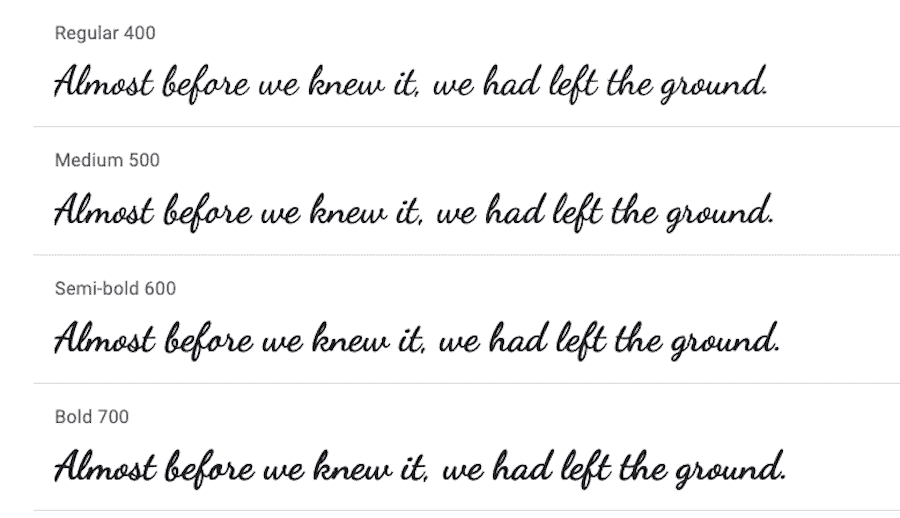

Dancing Script

[Dancing Script](https://fonts.google.com/specimen/Dancing+Script) 是一种可爱的草书字体，非常放松，可以在你网站的很多地方使用。它有点不正式，但可以很容易地用于专业网站、博客、出版物等的网站标题和标题图形。

### 2\. Allura

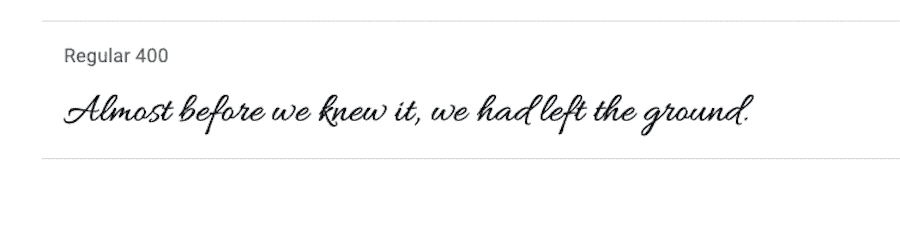

Allura

[Allura](https://fonts.google.com/specimen/Allura) 是另一个草书字体选项，提供了一点更多的繁荣。肯定是一种婚礼请柬字体，甚至可以用在婚礼网站上。或者，它将很好地工作为一个标志或网站标题。

### 3.橘子

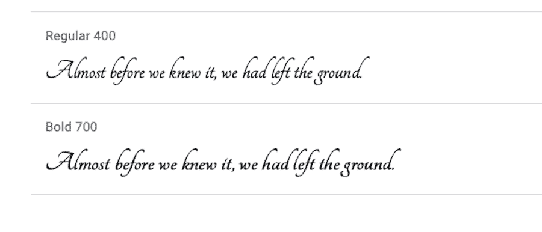

Tangerine

然后还有[橘子](https://fonts.google.com/specimen/Tangerine)。这种字体有一种真正经典的感觉，每个字母都不那么倾斜，看起来更像是假印刷的。它在真正的草书和仅仅是一种花哨的字体之间走了一条很好的线，但仍然可以很好地服务于更好的网站。

### 4.饼干

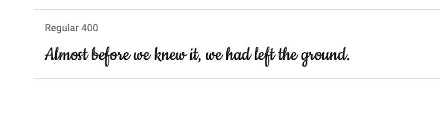

Cookie

Cookie 是为任何类型的网站提供复杂字体的又一选择。这种字体线条较粗，适合用作标志和标题。

### 5 .冯·穆勒霍夫先生

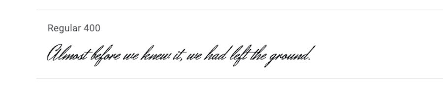

Herr Von Muellerhoff

另一个选择是冯·米勒霍夫先生。这种字体有点难读，但它也非常优雅，可以用来在你的网站上增加风格上的华丽。这是一个很好的标语或标题的选择。

### 6.珍贵

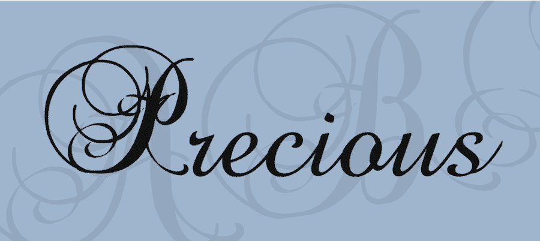

Precious

珍贵的字体是一种漂亮的字体，有大量的装饰和花饰，非常适合做标题和网站标题。它的大写字母尤其突出，这些字母以各种各样的重音符号为特色，使它脱颖而出，并模仿发光手稿的字体。

### 7.乱涂

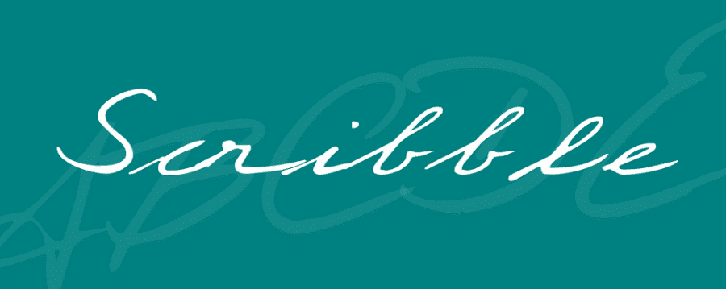

Scribble

Scribble 是另一个很好的选择，这次是在更非正式的一面。这种字体非常接近真实的笔迹，提供了一种微妙的草书，不包括一堆华丽。取而代之的是，它强调字母间距大，以及某人拿起笔来的样子。

### 8.《梦游女》

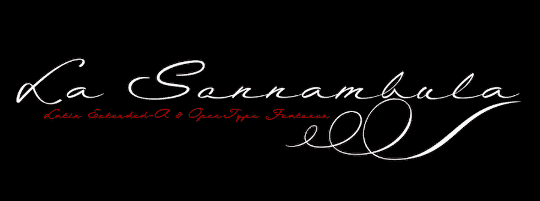

La Sonnambula

[La Sonnambula](https://www.1001fonts.com/la-sonnambula-font.html) 是另一个值得考虑的选择。这种字体仍然提供了一个随意的外观，没有大量的华丽，但它也保持了一点花哨的吸引力，就像用书法笔写的一样。

它具有餐馆标志或菜单的外观，使它成为许多情况下的最佳选择。

### 9.教皇们

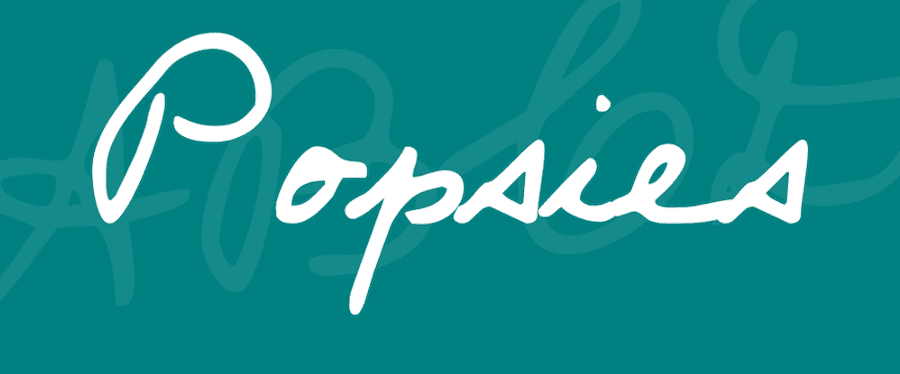

Popsies

字体是另一个草书选项，可以给你的网站设计带来一点个人风格。如果你需要在你的内容中模拟手写签名或者想让你的博客副标题看起来像手写的，这是一个极好的选择。

总的来说，这是一个打破标准正文的好选择。

### 10.阿加莎（女子名）

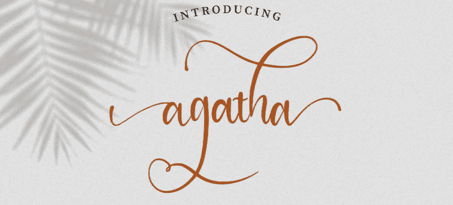

Agatha

阿加莎仍然是另一种相当随意的草书字体，但更倾向于花体和卷轴。

这种字体没有僵硬的书法风格，而是有着远远超出每个字母传统末端的多圈字体。它可以作为在你的网站上展示签名的另一个好选择。

### 11.18 世纪库尔勒特

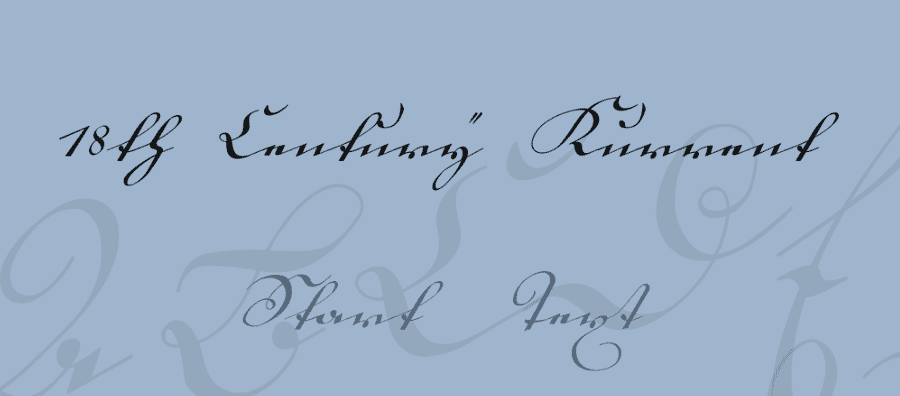

18th Century Kurrent

你也可以选择[18 世纪的 Kurrent](https://www.1001fonts.com/18th-century-kurrent-font.html) 给你的网站添加一些草书。诚然，这种字体很难阅读，但它确实有一定的风格，使其具有吸引力。它可以很容易地用在一个微妙的横幅设计中，文本是透明的，并在背景中使用。

基本上，当您想要一个草书文本外观，但文本不需要阅读时，最好使用它。

### 12.自欺

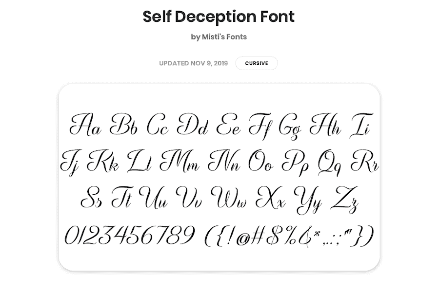

Self Deception

[自欺欺人](https://www.fontspace.com/self-deception-font-f41310)是另一个值得你考虑的可爱的草书字体选择。这个设计是多圈的(以一种好的方式)和精致的。粗细笔画的完美结合也让这种字体看起来很真实。

### 13.柠檬果冻

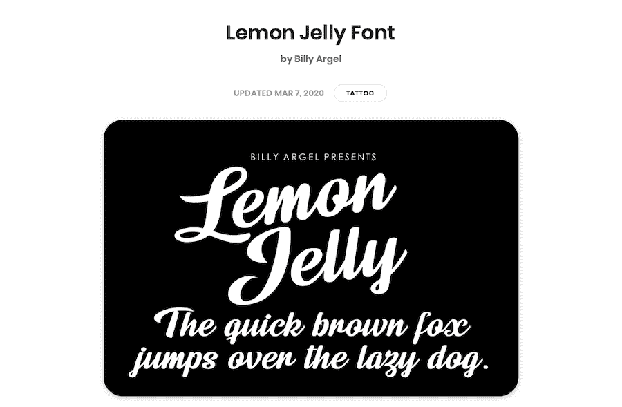

Lemon Jelly

现在[柠檬果冻](https://www.fontspace.com/lemon-jelly-font-f29789)字体提供了一种更大胆的草书字体。线条粗而明显。

每个字母的构成都相当标准，但字母与字母之间有一种独特的流动，这使得这种字体尤其是徽标的良好选择。

### 14.可爱的咖啡

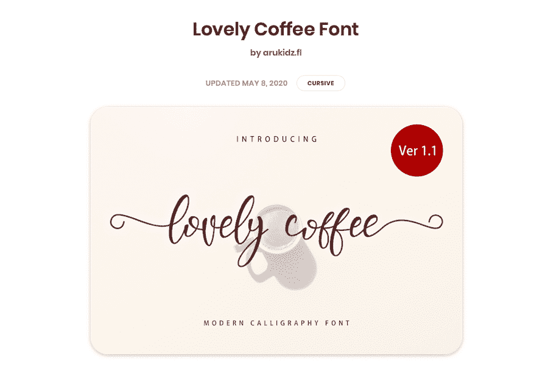

Lovely Coffee

或者也许可爱的咖啡更适合你。这种字体让人想起你经常在家居装饰标志上看到的手写字体。但这正是它的吸引力所在。字体本身相当宽松，但它在正式用例中也有一席之地

## 注册订阅时事通讯

### 想知道我们是怎么让流量增长超过 1000%的吗？

加入 20，000 多名获得我们每周时事通讯和内部消息的人的行列吧！

[Subscribe Now](#newsletter)

### 15.科学家

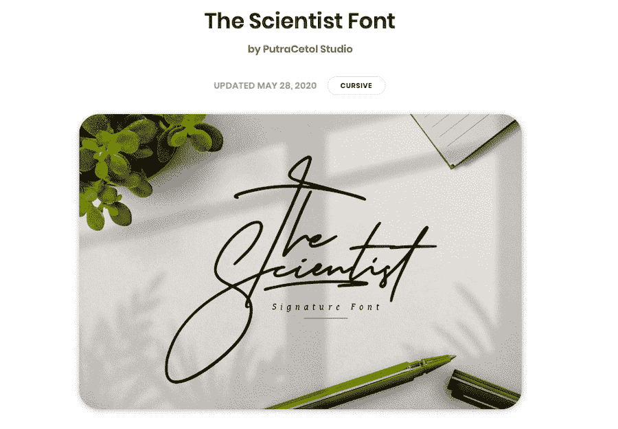

The Scientist

科学家字体是另一种有点难读的字体，但它确实产生了影响。这种字体有许多连字和有趣的样式元素，使它脱颖而出，成为展示签名、页眉、标题或子节的可靠选择。

它也可以在任何你想传达经典或老式外观的网站上工作。

### 16.吸引

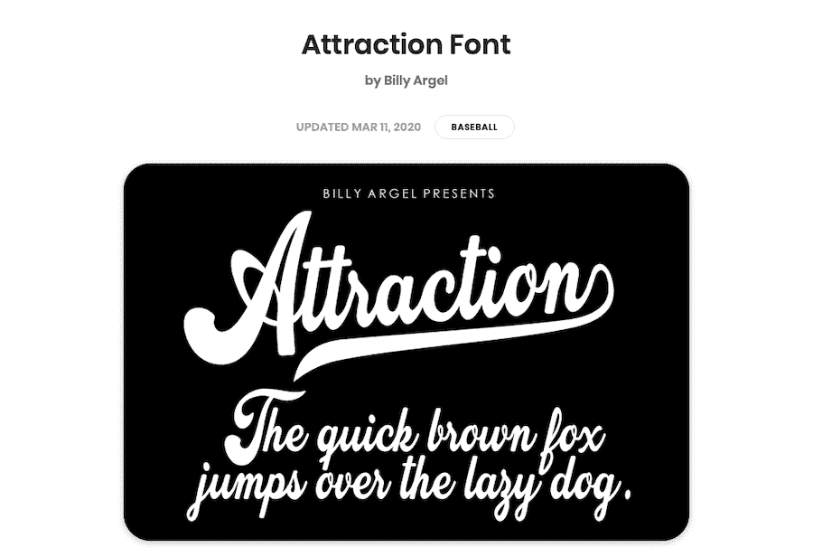

Attraction

吸引力活泼大胆，看起来像是直接来自运动队的标志。草书是决定性的，清晰的，有趣的。虽然仍然不适合正文，但是这种字体对[和你网站上的其他任何东西都适用。](https://kinsta.com/blog/wordpress-fonts/)

### 17.街头服装

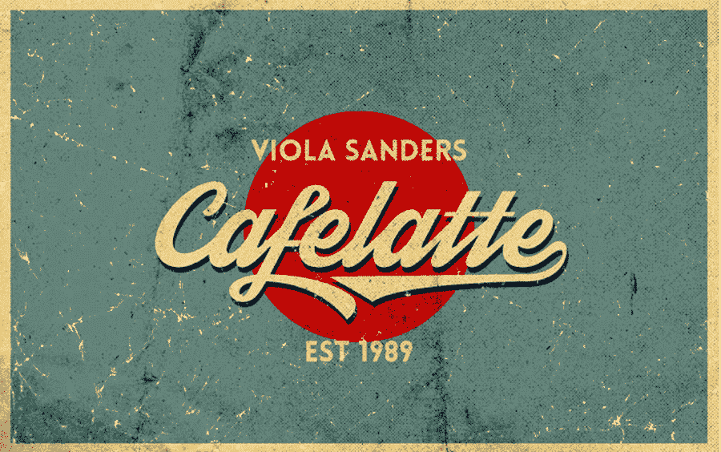

Streetwear

[Streetwear](https://www.behance.net/gallery/14302297/Streetwear-%28Free-Font%29) 是另一种提供经典感觉的草书字体。这一次，它很大程度上倾向于复古氛围，显然是受 20 世纪 70 年代时尚和运动字体的启发。它看起来很有趣，绝对能唤起某种怀旧情绪。

### 18.韵律

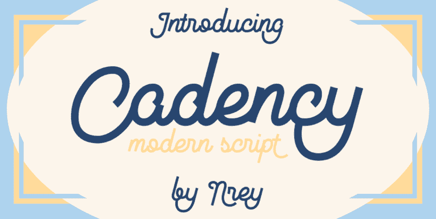

Cadency

或者你可以选择 [Cadency](https://www.behance.net/gallery/59148503/Cadency-script-font) ，这是一种更为[的现代草书字体](https://kinsta.com/blog/modern-fonts/)，它看起来有点弯曲，同时保持一种古怪的感觉。它是大胆的，并包括尖锐的结束，使它非常适合标题，标题和其他需要引起注意的文本。

### 19.贝肖尔

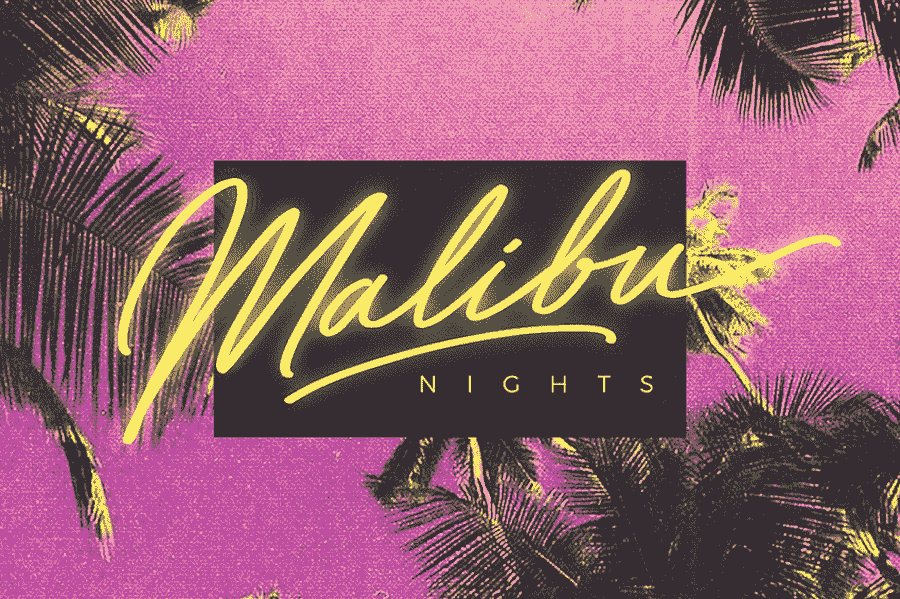

Bayshore

然后是 Bayshore 字体，这种字体显然在各方面都受到了 20 世纪 80 年代的启发。它被描述为一种单线字体，包括手绘外观和大量的 flairs。这很容易让人想起 20 世纪 80 年代护发产品和电视节目中使用的字体。这将是复古标志的伟大作品。

### 20.复古氛围

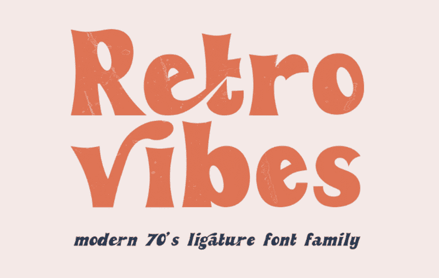

Retro Vibes

[复古氛围](https://www.behance.net/gallery/94654087/Retro-Vibes-Brand-New-Vintage-Bold-Font)从技术上来说不是草书，但它绝对是手写的，它包括 50 个连字，给它一种明显的草书氛围。这种字体看起来像是直接从 20 世纪 70 年代的杂志封面上跳下来的，而且看起来很棒。查看我们的[复古字体](https://kinsta.com/blog/retro-font/)帖子，获取更多复古风格字体的范例。

### 21.哈洛特

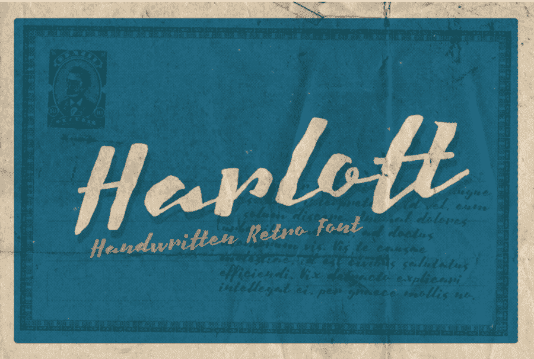

Harlott

Harlott 仍然是另一种草书字体选择，但这一种与迄今为止这里介绍的所有其他字体都有很大不同。它具有复古风格，但让人想起旧文件上的书法或手写字体。它适用于任何你想把注意力吸引到一些重要文本的地方。

厌倦了慢热的主持人？Kinsta 的设计考虑了速度和性能。[查看我们的计划](https://kinsta.com/plans/?in-article-cta)

### 22.沙尔马

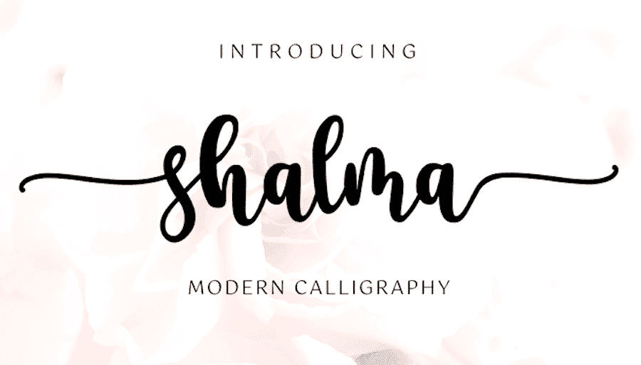

Shalma

Shalma 是另一种实心字体选择，这次是书法风格。这种字体与 Etsy 上的家居装饰标志非常相似。它既大胆又精致；女性化和宣言性。

### 23.马格里布。比较 BARBARY

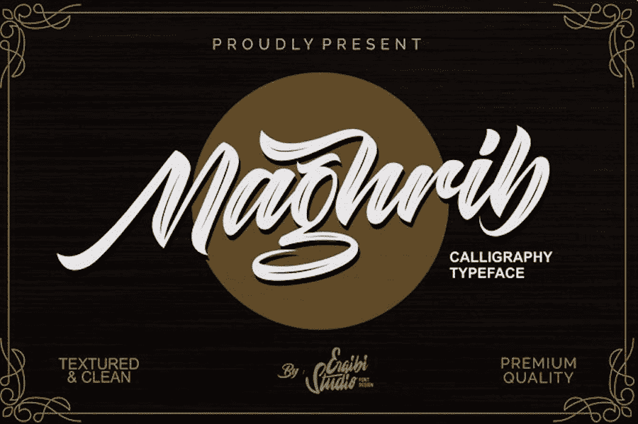

Maghrib

Maghrib 提供了另一个很好的字体选择，可以为你的徽标或标题添加真实的笔触和纹理。它将会在你的网站标题的顶部看起来很棒。它大胆而又熟悉，但也包含了一些让它脱颖而出的特别之处。

### 24.番茄

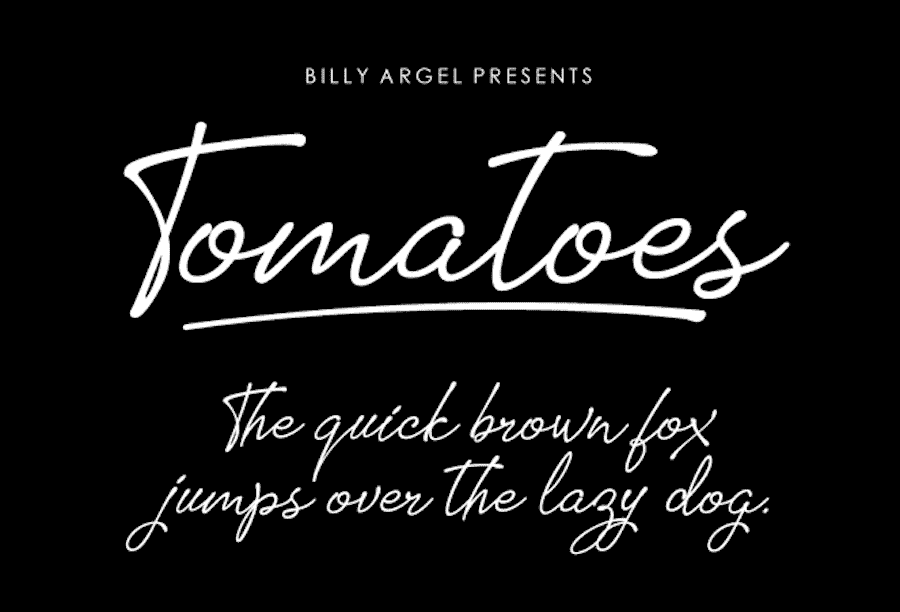

Tomatoes

西红柿是另一个可以给你的网站带来不同风格的选择。线条轻盈细腻，每个字母周围都留有大量空白。连字也提供了大量的变化，就像你从使用墨水笔的不同压力中得到的一样。

### 25.阿姆斯特丹

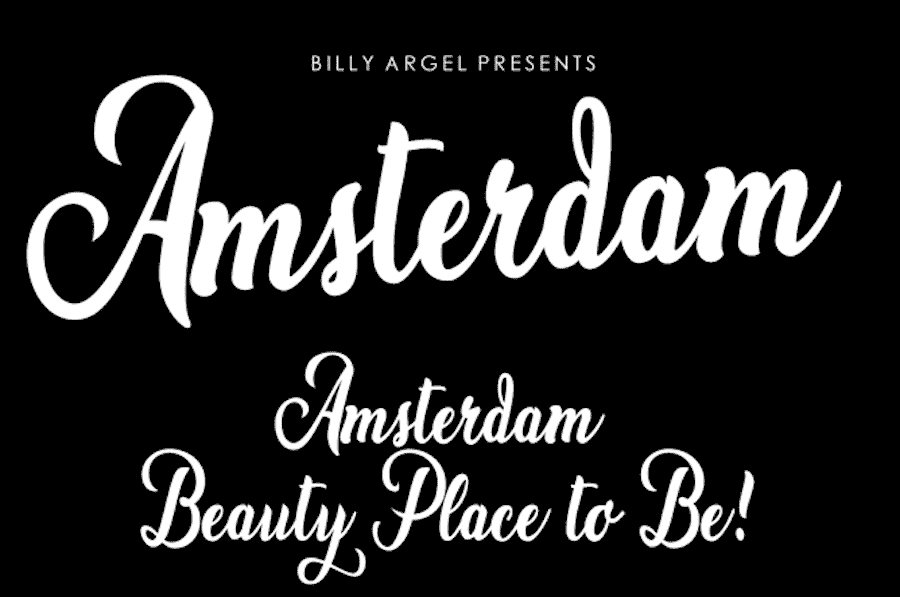

Amsterdam

[Amsterdam](https://www.fontspace.com/amsterdam-font-f29770) 是另一种可爱的草书字体，结合了经典字体和现代字体的元素。它有丰富的修饰，让你设置的任何文本看起来都很优雅。

### 26.让夏天充满乐趣

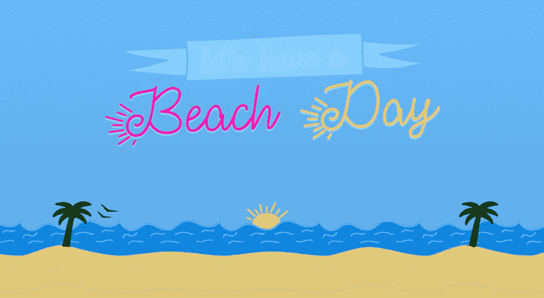

Make Summer Fun

[让夏日充满乐趣](https://www.fontspace.com/make-summer-fun-font-f46329)令人愉快的明亮和通风，看起来很像老师在手写工作表上的草书。这是任何与[教育](https://kinsta.com/learn/wordpress-education/)、儿童、手工艺、艺术或宠物相关的网站的理想选择。

不过，实际上，在合适的环境下，它也适用于任何商业网站。

### 27.洛夫托尼

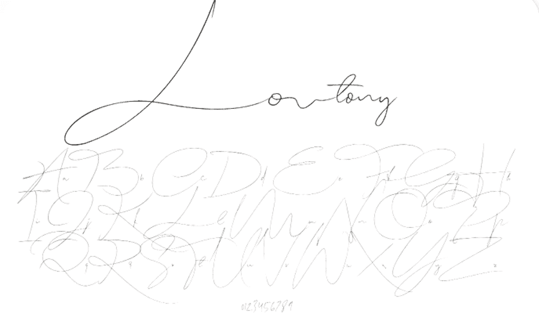

Lovtony

Lovtony 可能是这个列表中第一个可以被描述为“鸡抓”的字体，但老实说，我是指好的方面。

它很轻，包括长长的轮廓，看起来非常适合创建以单词为中心的设计、[横幅](https://kinsta.com/blog/banner-ad-sizes/)或标题。在你的网站主页或 about 页面上签署一个开场白看起来也很棒。

### 28.感到孤独

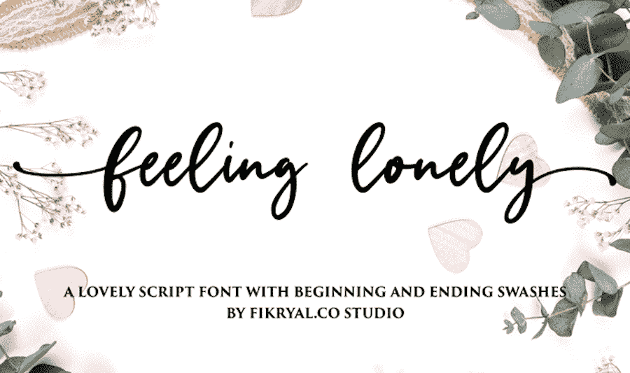

Feeling lonely

不要让它的名字欺骗了你，感觉孤独的字体也是一个可爱的选择。至于草书字体，它非常标准，但它在单词的开头和结尾都有美丽的花体，延长了你的作品的长度，创造了一个真正流畅的外观。

### 29.独角兽纸屑

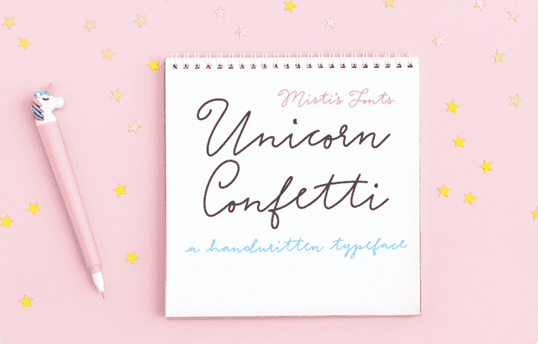

Unicorn Confetti

[独角兽纸屑](https://www.fontspace.com/unicorn-confetti-font-f49711)是我们名单上的另一种草书字体，线条更细，手感细腻。然而，字母的位置让它看起来有点古怪——尽管这可能只是字体的名称影响了我对它的印象。

它看起来真的是手写的，非常适合大多数网站设计。

### 30.仓鼠剧本

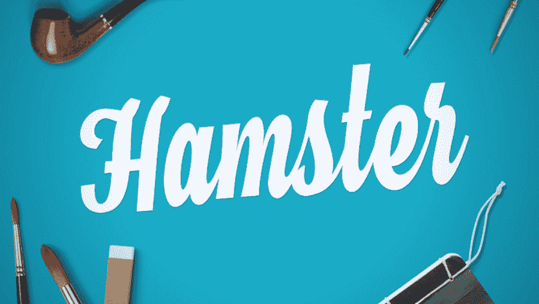

Hamster Script

仓鼠字体是一种粗厚的草书字体，模仿真实的笔迹，但字体超级醒目。这种字体有方形的边缘和手写符号画的外观，有很多优点。它可以用于大多数网站类型的任何种类的横幅、标志或标题。

### 31.荣耀文化

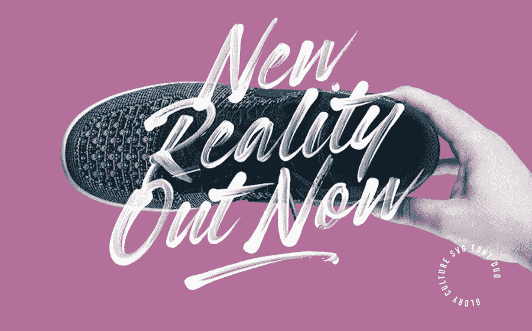

Glory Culture

[荣耀文化](https://www.behance.net/gallery/102204059/Glory-Culture-SVG-FontbySet-Sail-Studios?tracking_source=search_projects_recommended%7Ccursive)提供了另一种草书字体选择，它提供了一种完全毛笔风格的字体，手绘的笔触仍然可见。笔触中的不透明度变化是通过透明度内置的，并提供了一个独特的外观，可以为您的网站的标题和标题添加个人风格。这也是 logos 的绝佳选择。

### 32.浆果味的

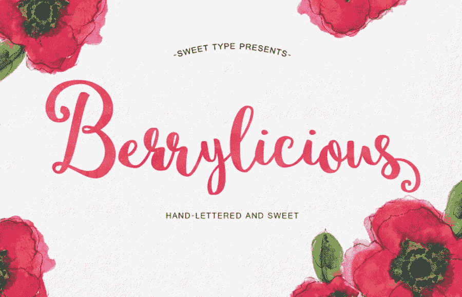

Berrylicious

[Berrylicious](https://www.behance.net/gallery/25467355/Berrylicious-Hand-lettered-Script?tracking_source=search_projects_recommended%7Ccursive) 是另一种草书字体，采用手写的笔触造型，创造出完全真实的风格。由于字母高度有很大变化，单词前后有大量修饰，它可以在任何需要手写外观的情况下很好地为您服务。

它的可读性仍然很好，这也使它成为社交媒体图片的可靠选择。

### 33.沙提卡

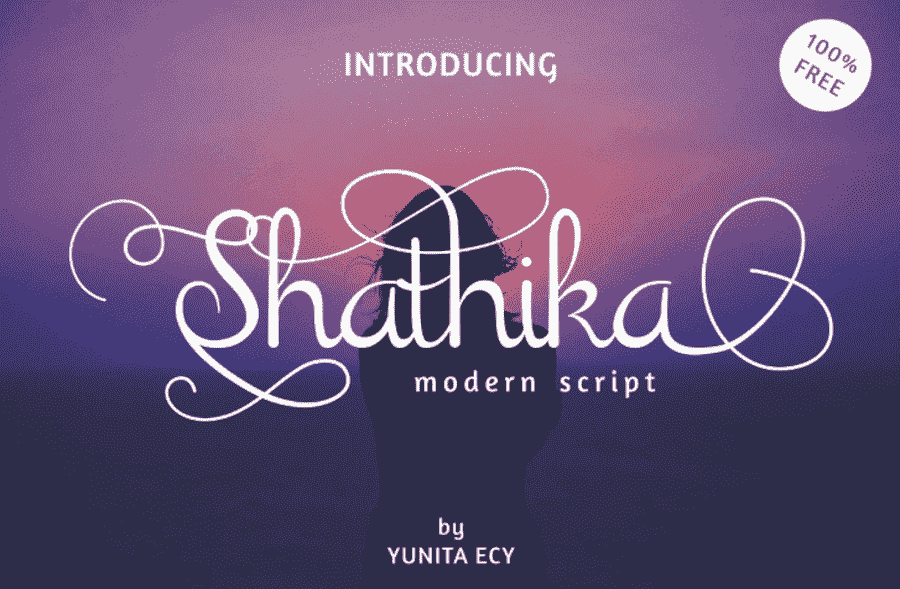

Shathika

Shathika 是我们名单上的最后一种草书字体，它不会让人失望。它提供了一种书法的外观，在连字中有大量的华丽和褶边，创造了一个真正美丽的外观。

这一个给你应用它的任何事物增加直接的复杂性。它也唤起了一些皇室的想法。

## 摘要

正如你所看到的，有大量的草书字体看起来很棒，给你的项目增添了真正的美感，并给你的网站的任何部分增添了一种精致感。虽然草书或手写体字体并不适用于你网站的每个方面——正文是不允许的——但它仍然有很多应用，包括标题、徽标、横幅、页眉、副标题、签名等等。

草书字体也不是新的。它们诞生于二十世纪，起源于活版印刷。有如此多的现代字体能够以数字方式模仿雕刻的凸版印刷外观，难怪人们选择草书字体来增加真实性、复古氛围和项目的整体优雅外观。

有了上面的字体集，你就有希望很快为你的网站选择一种字体。祝你好运！

建议阅读:[邮件排版:邮件的 8 种最佳字体](https://kinsta.com/blog/best-fonts-for-email/)。

* * *

让你所有的[应用程序](https://kinsta.com/application-hosting/)、[数据库](https://kinsta.com/database-hosting/)和 [WordPress 网站](https://kinsta.com/wordpress-hosting/)在线并在一个屋檐下。我们功能丰富的高性能云平台包括:

*   在 MyKinsta 仪表盘中轻松设置和管理
*   24/7 专家支持
*   最好的谷歌云平台硬件和网络，由 Kubernetes 提供最大的可扩展性
*   面向速度和安全性的企业级 Cloudflare 集成
*   全球受众覆盖全球多达 35 个数据中心和 275 多个 pop

在第一个月使用托管的[应用程序或托管](https://kinsta.com/application-hosting/)的[数据库，您可以享受 20 美元的优惠，亲自测试一下。探索我们的](https://kinsta.com/database-hosting/)[计划](https://kinsta.com/plans/)或[与销售人员交谈](https://kinsta.com/contact-us/)以找到最适合您的方式。