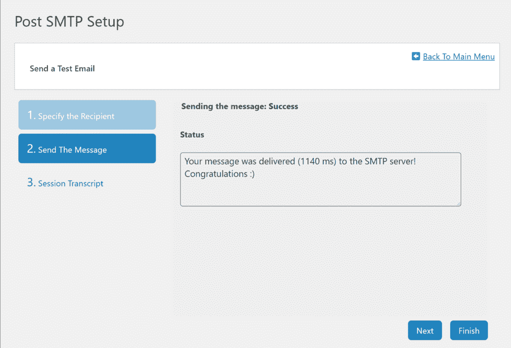
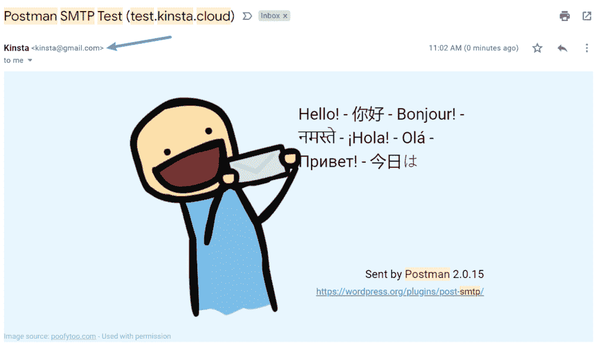
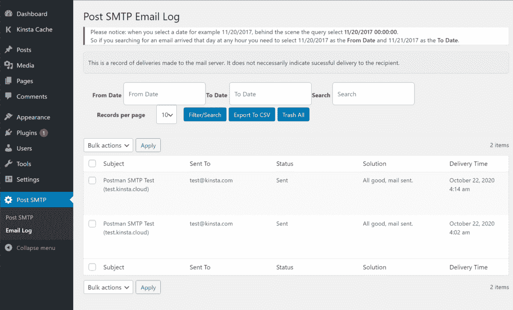

# 如何使用 Gmail SMTP 服务器免费发送电子邮件

> 原文：<https://kinsta.com/blog/gmail-smtp-server/>

大多数人都知道 Gmail 简洁的界面和有用的功能，比如搜索操作符和 T2 插件。但是你也可以用 Gmail 做更多的事情:Gmail SMTP 服务器。

有了 Gmail SMTP 服务器，你将能够使用其他电子邮件客户端，如 [Outlook](https://kinsta.com/blog/outlook-smtp-settings/) 或 Thunderbird，从你的 Gmail 帐户发送电子邮件。**但更重要的是，你还可以使用 Gmail 的 SMTP 服务器从你的 WordPress 网站发送电子邮件。**免费！

这是一个非常好的方法，可以让你的 WordPress 网站的邮件更加可靠，而不需要花钱购买专门的邮件发送服务。Gmail 可以让你每天给**发送多达 500 封邮件**，这对绝大多数 WordPress 网站来说绰绰有余。

在本帖中，我们将涵盖你需要了解的关于 Gmail SMTP 服务器的一切，包括:

### 查看我们的[视频指南](https://www.youtube.com/watch?v=p143W7p4n4Y)，免费使用 Gmail SMTP 服务器发送电子邮件

## 如何找到 Gmail 的 SMTP 服务器

让我们从最重要的问题开始 Gmail SMTP 服务器是什么？

> Kinsta 把我宠坏了，所以我现在要求每个供应商都提供这样的服务。我们还试图通过我们的 SaaS 工具支持达到这一水平。
> 
> <footer class="wp-block-kinsta-client-quote__footer">
> 
> 
> 
> <cite class="wp-block-kinsta-client-quote__cite">Suganthan Mohanadasan from @Suganthanmn</cite></footer>

[View plans](https://kinsta.com/plans/)

要查找 Gmail SMTP 服务器，您可以使用以下详细信息:

*   **Gmail SMTP 服务器地址**:smtp.gmail.com
*   **Gmail SMTP 名称**:您的全名
*   **Gmail SMTP 用户名:**您的完整 Gmail 地址(例如[【电子邮件保护】](/cdn-cgi/l/email-protection))
*   **Gmail SMTP 密码:**您用来登录 Gmail 的密码
*   **Gmail SMTP 端口(TLS):** 587
*   **Gmail SMTP 端口(SSL):** 465

还有一些其他常见的(但不是通用的)Gmail SMTP 设置，您可能会在尝试设置时发现。如果你遇到这些问题，以下是如何回答的:

*   **需要 SSL** :是
*   **需要 TLS** :是
*   **要求认证/使用认证**:是
*   **需要安全连接/使用安全连接**:是

[您是否充分利用了您的 Gmail 帐户？🤔有了 Gmail SMTP 服务器，你可以从你的 WordPress 网站发送电子邮件...免费的！💥在此了解更多信息👇 点击推文](https://twitter.com/intent/tweet?url=https%3A%2F%2Fbit.ly%2F37jyozL&via=kinsta&text=Are+you+getting+the+most+out+of+your+Gmail+account%3F+%F0%9F%A4%94++With+the+Gmail+SMTP+server%2C+you+can+send+emails+from+your+WordPress+site...+for+free%21+%F0%9F%92%A5+Learn+more+right+here+%F0%9F%91%87&hashtags=SMTP%2CEmailTips)

## Gmail SMTP 服务器常见问题

在深入探讨之前，我们先来回答一些关于 Gmail SMTP 服务器的常见问题。

### Gmail SMTP 服务器地址是什么？

正如我们上面详述的，默认的服务器地址是**smtp.gmail.com**。您可以使用完整的 Gmail 电子邮件地址和 Google 密码登录。

### 我可以使用 Gmail SMTP 服务器发送电子邮件吗？

是啊！你可以。如果您正在使用其他电子邮件客户端，如 Thunderbird 或 Outlook，您可以使用 Gmail SMTP 服务器详细信息来通过您的 Gmail 帐户发送电子邮件。

但是，记住 SMTP 只是用来发送电子邮件的。如果你想在另一个电子邮件客户端接收 Gmail 账户的邮件，你需要使用 POP3 或 IMAP。你可以打开 Gmail 设置，进入**转发和 POP/IMAP** 选项卡，找到这些设置。
T3】

### 我可以使用 Gmail SMTP 服务器发送 WordPress 交易邮件吗？

也是！WordPress 发送许多基本的[事务性电子邮件](https://kinsta.com/help/transactional-email/),如密码重置、通知等。你可以使用 Gmail SMTP 服务器发送所有这些电子邮件。

只需一个免费的 Gmail 账户，你每天就可以发送多达 500 封电子邮件，这远远高于其他免费 SMTP 服务器的限制。

如果你有一个[付费的 Google Workspace 账户(以前的 G Suite)](https://kinsta.com/blog/google-workspace/) ，Google 会把你的限额提高到更高，让你每天最多发送 2000 封电子邮件。你也可以用你自己的[自定义域名](https://kinsta.com/blog/professional-email-address/)而不是你的 Gmail 地址发送电子邮件。也就是说，你可以从 **[【邮件保护】](/cdn-cgi/l/email-protection)** 而不是 **[【邮件保护】](/cdn-cgi/l/email-protection)** 发送。为此，您还需要[设置 Google Workspace MX 记录](https://kinsta.com/help/google-mx-records/)，将您的 Google Workspace 帐户[连接到您的自定义域名](https://kinsta.com/blog/professional-email-address/)。

**注意**:从技术上讲，发送限制不是“每天”。相反，这些限制适用于“连续 24 小时”。例如，你不能在周一晚上 11:59 发送 500 封电子邮件，然后在周二上午 12:01 发送另外 500 封电子邮件。

### Gmail SMTP 服务器仍然支持双因素身份验证吗？

是啊！即使您已经在 Google 帐户上启用了双因素身份验证，也可以使用 SMTP 服务器。但是，您需要生成一个应用程序密码，以便应用程序仍然可以连接。

您可以在登录您的 Google 帐户时通过[访问此页面](https://myaccount.google.com/apppasswords)来生成应用程序密码。

然而，如果你想使用 Gmail 的 SMTP 服务器来发送你的 WordPress 站点的邮件，我们不推荐使用这种方法。相反，你应该使用 Gmail API 方法，我们将在下面的教程中详细介绍。这使您可以使用 Gmail 的 API 发送电子邮件，而不仅仅是输入 SMTP 服务器的详细信息，这也有利于避免双重身份验证的问题。

## 如何配置 WordPress 通过 Gmail SMTP 服务器发送电子邮件

现在，让我们来看看如何使用 Gmail SMTP 服务器免费发送 WordPress 网站的交易邮件**。这种方法非常有效，与使用默认的 [PHP 邮件方法](https://kinsta.com/blog/wordpress-not-sending-email/#2-your-server-isnt-configured-correctly)相比，它将提高你的网站邮件的可靠性。**

 **要设置这个，你需要创建一个谷歌应用程序，这样你就可以通过 API 连接到 Gmail SMTP 服务器，而不仅仅是插入 SMTP 细节。做这件事需要很多步骤。这只是一次性的设置过程。也就是说，一旦你花了 30-60 分钟来完成这个设置，你的网站将继续自动受益。

除了创建谷歌应用，你还需要 WordPress SMTP 插件的帮助。我们将使用[免费的 Post SMTP 邮件/电子邮件日志插件](https://wordpress.org/plugins/post-smtp/)，但免费的 [WP 邮件 SMTP 插件](https://wordpress.org/plugins/wp-mail-smtp/)也是另一个支持 Gmail API 的好选择。

基本流程如下:

1.  安装 Post SMTP 邮件程序/电子邮件日志插件(您需要首先这样做，以获得在您的 Google 应用程序中使用的 URL)。
2.  创建一个谷歌应用。这是整个过程中最复杂的部分，但是我们会指导你完成每一步。
3.  将您的 Google app API 密钥添加到 Post SMTP Mailer/Email 日志设置中。
4.  发送一封[测试邮件](https://kinsta.com/knowledgebase/send-test-email/)以确保一切正常。

**注意—**本教程重点介绍如何使用免费的 Gmail 帐户。但是，您可以按照类似的过程来配置您的网站，通过您的 Google Workspace (G Suite)帐户发送电子邮件。

### 1.安装和配置 Post SMTP 邮件程序/电子邮件日志

要开始使用，你需要[安装并激活来自 WordPress.org 的免费 Post SMTP 邮件/电子邮件日志插件](https://kinsta.com/blog/free-smtp-server/#1-configure-post-smtp-maileremail-log)。这可以让你配置你的 WordPress 站点通过 Gmail API/SMTP 服务器发送邮件。

激活插件后，进入你的 WordPress 仪表盘中的 **Post SMTP** 标签，点击大**启动向导**按钮下面的**显示所有设置**链接。

然后，转到**消息**选项卡，设置您的“发件人”电子邮件地址和姓名。您可以使用您的 Gmail 地址作为“发件人”电子邮件，或者如果您愿意，也可以使用不同的电子邮件地址。

接下来，回到**账户**标签，在**类型**下拉列表中选择 **Gmail API** 。做出这个选择后，您应该会在下面的**认证**框中看到一些附加选项。保持此页面打开，因为在下一步中您将需要**授权的 JavaScript 起源**和**授权的重定向 URI** 细节:

Choose the Gmail API option

### 2.创建您的 Google 应用程序

现在，你需要创建一个谷歌应用程序。这使得你的 WordPress 站点可以通过 Gmail API 安全地发送邮件。同样，这肯定是这个过程中最复杂的部分。然而，它主要只是点击许多按钮，我们会给你所有的步骤/截图，你需要通过它。

#### 创建项目

首先，打开一个新的标签，然后[复制这个 URL，进入 Google 开发者控制台](https://console.developers.google.com/apis/dashboard)。在那里，您需要创建一个新项目。如果这是你第一次登录开发者控制台，Google 会提示你创建你的第一个项目。或者，如果您已经有一些项目，您可以通过单击左上角的下拉菜单创建一个新项目(在下面的截图中用[1]标记)。

Create a new Google Developers project

#### 启用 Gmail API

一旦创建了项目，单击按钮**启用 API 和服务**(如上面的截图所示)。

在下一个屏幕上，搜索“Gmail”并选择 **Gmail API** 结果:

Search for the Gmail API

然后，在完整的 Gmail API 页面中点击**启用**:

Enable the Gmail API

#### 创建凭据

现在，您应该处于 Gmail API 的专用界面中。点击按钮**创建凭证**:

## 注册订阅时事通讯

### 想知道我们是怎么让流量增长超过 1000%的吗？

加入 20，000 多名获得我们每周时事通讯和内部消息的人的行列吧！

[Subscribe Now](#newsletter)

Create credentials for the Gmail API

使用以下信息填写**了解您需要什么凭证**表格:

*   您使用的是哪种 API？ Gmail API
*   您将从哪里调用 API？网络浏览器(JavaScript)
*   您将访问哪些数据？用户数据

完成后，单击**我需要什么凭证？**按钮在底部。

Fill out credentials form

#### 设置同意屏幕

现在，谷歌会提示你需要设置一个同意屏幕。这与您使用 Google 注册/登录网站时看到的授权屏幕类型相同。

你需要这样做来满足 Google 的要求，但是你不需要担心你输入的信息，因为你只会在你自己的 WordPress 站点上使用它。

点击按钮**设置同意画面**:

The prompt to create an OAuth consent screen

这将打开一个新的选项卡，您可以在其中配置一个 **OAuth 同意屏幕**(将原来的浏览器选项卡放在手边，因为您需要马上返回到它)。在**用户类型**下，选择**外部**。然后，点击**创建**:

Create an external consent screen

在下一个屏幕上，输入您站点的基本详细信息。同样，你不需要担心你在这里放了什么，因为你是唯一一个会看到这些信息的人。

Configure the consent screen

添加完信息后，点击底部的**保存**。

#### 完成将凭据添加到项目中

现在，返回到包含**Add credentials to your project**界面的选项卡，并输入以下信息:

*   **名称**——你的网站名称(或者其他容易记住的名称)。
*   **授权的 JavaScript 起源**–你可以在 Post SMTP Mailer/Email Log 插件中找到它(步骤#1)。
*   **授权重定向 URIs**–您可以在 Post SMTP 邮件程序/电子邮件日志插件中找到它(步骤#1)。

Create your credentials

添加完所有内容后，点击**刷新**。然后，**刷新**按钮应该变为**创建 OAuth 客户端 ID**——点击该按钮结束该过程，然后点击**完成**。

厌倦了你的 WordPress 站点缓慢的主机？我们提供超快的服务器和来自 WordPress 专家的 24/7 世界级支持。[查看我们的计划](https://kinsta.com/plans/?in-article-cta)

现在你差不多完成了！

一旦你点击 **Done** ，你应该会在你的项目的**凭证**标签中看到一个 **OAuth 2.0 客户端 id**的部分(在你点击 **Done** 后应该会自动打开)。

单击您刚刚创建的名称条目:

Access OAuth 2.0 client IDs

现在，你只需要找到两条信息:

*   客户端 ID
*   客户机密

保持这些值是可访问的，因为您将在下一步中需要它们:

Your Gmail API client IDs

### 3.添加 Gmail 应用程序客户端 id 以发布 SMTP 邮件/电子邮件日志

要完成设置，回到你的 WordPress 仪表盘中的 Post SMTP Mailer/Email Log 设置，并粘贴上一步中的**客户端 ID** 和**客户端密码**。然后，确保保存您的更改:

Add Gmail API client IDs to WordPress

然后，插件应该提示您**授予 Google** 的权限:

Grant permission to Google

单击该链接将打开正常的 Google 授权过程(同样，就像您使用 Google sign-on 注册一个网站一样)。然而，因为你没有将你的应用程序提交给谷歌进行审查，谷歌会向你显示一个警告“此应用程序未经验证”。

因为这是您自己的应用程序，所以您可以安全地忽略该警告。单击选项以显示高级设置，然后单击**转到“yourwebsite.com”(不安全)**链接继续授权过程:

Ignore the warning to continue

你现在要走正常程序。确保选择选项**允许**你的 WordPress 站点访问你的 Gmail 账户。它需要这些权限来通过 Gmail SMTP 服务器发送电子邮件。

就是这样！有相当多的步骤，但你现在差不多完成了。

### 4.发送测试电子邮件

为了确保一切正常，Post SMTP 邮件程序/电子邮件日志包括一个发送测试电子邮件的选项。您可以从主设置页面进行访问:

How to send a test email via the Gmail API

您可以输入要向其发送测试消息的电子邮件。

然后，您应该会在插件的设置中看到一条成功消息:

The Success message for your test email

如果你去你的邮箱，你也应该看到一封测试邮件:

The actual email that you should see in your inbox

如果一切顺利，你就完了。

你的 WordPress 站点现在将使用 Gmail SMTP 服务器发送所有的邮件。您可以通过进入 **Post SMTP →电子邮件日志**来确保这一点。这将列出您的站点发送的所有电子邮件(以及插件遇到问题时的任何错误):

How to view a log of the emails that your site sends

[Looking for a free and reliable way to send emails from your WordPress site? ✅ Gmail's SMTP server could be the answer. Find all the details in this guide!Click to Tweet](https://twitter.com/intent/tweet?url=https%3A%2F%2Fbit.ly%2F37jyozL&via=kinsta&text=Looking+for+a+free+and+reliable+way+to+send+emails+from+your+WordPress+site%3F+%E2%9C%85++Gmail%27s+SMTP+server+could+be+the+answer.+Find+all+the+details+in+this+guide%21&hashtags=SMTP%2CWordPressTips)

## 摘要

Gmail SMTP 服务器允许您使用 Gmail 帐户和谷歌服务器发送电子邮件。

这里的一个选择是配置第三方电子邮件客户端，如雷鸟或 Outlook，通过您的 Gmail 帐户发送电子邮件。默认的 Gmail SMTP 详细信息如下:

*   **Gmail SMTP 服务器地址**:smtp.gmail.com
*   **Gmail SMTP 名称**:您的全名
*   **Gmail SMTP 用户名:**您的完整 Gmail 地址(例如[【电子邮件保护】](/cdn-cgi/l/email-protection))
*   **Gmail SMTP 密码:**您用来登录 Gmail 的密码
*   **Gmail SMTP 端口(TLS):** 587
*   **Gmail SMTP 端口(SSL):** 465

另一个选择是使用 Gmail 来发送你的 WordPress 站点的交易邮件。Gmail 每天有 500 封电子邮件的限制，其免费发送限制明显高于其他免费 SMTP 服务，如 T2 的 SendGrid 或 T4 的 Mailgun。

然而，如果你这样做，你应该通过 Gmail API 发送电子邮件，而不是仅仅使用 SMTP 服务器的详细信息。

虽然设置应用程序使用 Gmail API 确实会增加一些一次性的复杂性，但这是值得的，因为它为您提供了一种可靠和安全的方式来发送网站的电子邮件。

现在你已经准备好了，看看我们的 Gmail 插件列表[来提高你的电子邮件效率。](https://kinsta.com/blog/gmail-add-ons/)

关于 Gmail SMTP 服务器或者如何在 WordPress 上使用它，你还有什么问题吗？在评论里问我们！

* * *

让你所有的[应用程序](https://kinsta.com/application-hosting/)、[数据库](https://kinsta.com/database-hosting/)和 [WordPress 网站](https://kinsta.com/wordpress-hosting/)在线并在一个屋檐下。我们功能丰富的高性能云平台包括:

*   在 MyKinsta 仪表盘中轻松设置和管理
*   24/7 专家支持
*   最好的谷歌云平台硬件和网络，由 Kubernetes 提供最大的可扩展性
*   面向速度和安全性的企业级 Cloudflare 集成
*   全球受众覆盖全球多达 35 个数据中心和 275 多个 pop

在第一个月使用托管的[应用程序或托管](https://kinsta.com/application-hosting/)的[数据库，您可以享受 20 美元的优惠，亲自测试一下。探索我们的](https://kinsta.com/database-hosting/)[计划](https://kinsta.com/plans/)或[与销售人员交谈](https://kinsta.com/contact-us/)以找到最适合您的方式。**