# 2022 年你应该关注的 13 大脚本语言

> 原文：<https://kinsta.com/blog/scripting-languages/>

脚本语言是一种特定类型的计算机语言，可用于向其他软件(如 web 浏览器、服务器或独立应用程序)发出指令。当今许多最流行的编码语言都是脚本语言，比如 JavaScript、 [PHP](https://kinsta.com/blog/is-php-dead/) 、Ruby、Python 以及其他一些语言。

由于脚本语言使编码更简单、更快速，所以它们被广泛用于 web 开发就不足为奇了。

然而，这并不是他们唯一的应用领域。还有用于操作系统、统计分析软件、办公应用程序、游戏引擎和许多其他平台的脚本语言。

## 什么是脚本语言？

脚本语言可以在特定的运行时环境中执行不同的动作，例如自动化任务执行、增强父软件的功能、执行配置、从数据集中提取数据等等。

脚本语言可以通过两种方式产生:

1.  运行时环境可以引入自己的脚本语言，比如用于 GNU 操作系统的 Bash 或者用于 Microsoft Office 应用程序的 VBA。
2.  运行时环境可以采用现有的脚本语言，例如， [MongoDB](https://kinsta.com/knowledgebase/what-is-mongodb/) 的`mongo` shell 是围绕 JavaScript 构建的[。](https://docs.mongodb.com/manual/tutorial/write-scripts-for-the-mongo-shell/)

另一方面，有时是脚本语言先存在，它产生了自己的父平台——不管这听起来有多奇怪。


这就是在 **Node.js** 的例子中发生的事情，这是一个后端运行时环境，它被创建来允许 web 开发人员不仅在前端也在后端使用 JavaScript，遵循“JavaScript 无处不在”的范式。

[If you're thinking about learning a new scripting language, check out this guide to the top 13 options 💻....then get to studying 🤓Click to Tweet](https://twitter.com/intent/tweet?url=https%3A%2F%2Fkinsta.com%2Fblog%2Fscripting-languages%2F&via=kinsta&text=If+you%27re+thinking+about+learning+a+new+scripting+language%2C+check+out+this+guide+to+the+top+13+options+%F0%9F%92%BB....then+get+to+studying+%F0%9F%A4%93&hashtags=PHP%2CJavascript)

### 脚本在编程中是什么意思？

脚本编写的动作本质上是编写一系列命令，由应用程序或脚本引擎逐一解释。尽管脚本指导平台做什么(给它一个脚本来读取和解释)，但是执行是由运行时环境而不是脚本语言本身来完成的。

这就是脚本语言与 Java 等编程语言的不同之处，Java 可以“编写一次，在任何地方运行”(Java 的官方口号，意思是 Java 程序可以在任何环境下作为独立的应用程序运行；自从被创造出来，它也成为了指跨平台能力的 [WORA 原则](https://whatis.techtarget.com/definition/write-once-run-anywhere-WORA)。

## 脚本语言与编程语言

虽然“脚本语言”和“编程语言”这两个术语经常互换使用，但它们不是一回事。

### 特定于平台与平台无关

脚本语言是特定于平台的，而编程语言是平台无关的(跨平台的)，因为它们具有自我执行的能力。例如，你可以在任何操作系统上运行 Java 程序。

### (主要)解释与编译

虽然编程语言是编译的，但脚本语言大多是解释的——即使有一些脚本语言既编译又解释，如 Python 和 Groovy。

“编译”意味着编程语言有自己的编译器，在运行前将语法翻译成机器代码。相反，脚本语言在运行时由运行它们的平台的解释器逐行解释。

### 运行时更快与更慢

由于这种实现上的差异，编程语言比脚本语言运行得更快，因为它们不需要实时编译。编译器也会在执行前执行集体错误处理，而解释器会逐行评估代码，所以每次遇到错误时都会暂停(或者完全停止)。

这也增加了脚本语言的总执行时间，即使在[现代和更快的硬件](https://kinsta.com/blog/fastest-wordpress-hosting/)上，这也不像以前那样是个问题。

### 更多与更少的代码密集型

编程语言更加代码密集，因为在脚本语言的情况下，您必须手动做许多由平台处理的事情。如果你使用脚本语言，你必须[写更少的代码](https://kinsta.com/blog/free-html-editor/)。

### 独立应用与作为堆栈一部分的应用

有些事情是脚本语言无法完成的。最重要的是，你不能用脚本语言创建独立的桌面和移动应用程序，因为没有解释它们的运行时环境。

例如，你可以只为网站和网络应用程序使用 [PHP 框架](https://kinsta.com/blog/php-frameworks/)，比如 [WordPress](https://kinsta.com/knowledgebase/what-is-wordpress/) 和 [Laravel](https://kinsta.com/blog/laravel-tutorial/) ，因为它们使用网络浏览器作为运行时环境。类似地，WordPress 移动应用程序运行在移动运行时环境中，例如 [Capacitor](https://capacitorjs.com/) ，它整合了 web 视图。

### 脚本与编程语言—差异概述

因此，脚本语言和编程语言之间的主要区别如下:

| **脚本语言** | **编程语言** |
| 特定于平台 | 平台无关(跨平台) |
| (大部分)解读 | 编辑 |
| 运行时较慢 | 运行时更快 |
| 代码量较少 | 代码更加密集 |
| 将应用创建为堆栈的一部分 | 创建独立的应用程序 |

## 关于脚本语言的困惑

关于脚本语言，您会经常遇到一些困惑，所以在学习最好的脚本语言之前，让我们先来看看它们。

最重要的是，谈论前端和后端脚本语言没有多大意义，即使你在网上找到的许多文章都使用这种分组。

实际上，目前只有一种前端脚本语言在使用，那就是 JavaScript(以前也有其他语言，如 ActionScript 和 JScript，但现在都被否决了)。

在脚本语言的上下文中，重要的不是前端还是后端，而是脚本语言可以运行的运行时环境。

注意，“前端”只是指网页浏览器可以解释的一些东西([图像](https://kinsta.com/blog/optimize-images-for-web/)、[字体](https://kinsta.com/blog/web-safe-fonts/)、[标记](https://kinsta.com/blog/schema-markup-wordpress/)、[样式表](https://kinsta.com/blog/wordpress-css/)、[脚本](https://kinsta.com/blog/defer-parsing-of-javascript/)，另一种类型的静态文件)。例如，尝试直接从 web 浏览器打开一个 PHP 文件:你不能，因为 PHP 应用服务器必须解释它——所以 [PHP](https://kinsta.com/blog/php-tutorials/) 是 web 开发环境中的后端脚本语言，而服务器堆栈的应用层(例如 LAMP)是脚本语言环境中的。

除了 web 开发(前端和后端脚本)，脚本语言还可以用于多种用途，如编程和配置操作系统和特定的应用程序/环境、操作数据集、自动化任务等。

脚本语言也可以在多种环境中运行。

### 什么不是脚本语言

在进入最好的脚本语言之前，让我们看看有时被错误地称为脚本语言的**编码语言，但是你不能用它们来编写脚本:**

*   标记语言，如 HTML 和 XML。在 HTML 中，有 onclick 和 onmouseover 等用于事件处理的[属性，但这些仍然是 JavaScript 回调。](https://developer.mozilla.org/en-US/docs/Web/Guide/Events/Event_handlers)
*   样式表语言，比如 CSS、Sass 等等。
*   构建在任何脚本语言之上的任何种类的库或框架，比如 [jQuery](https://kinsta.com/knowledgebase/what-is-jquery/) ，PostCSS，React， [Vue](https://kinsta.com/blog/vue-js/) ，Angular，Rails，Grails， [Django，Laravel](https://kinsta.com/blog/django-vs-laravel/) ，WordPress 等等。
*   编译成脚本语言的语言，如 TypeScript 和 CoffeeScript。
*   SQL 用于管理关系数据库管理系统(RDBMS)中的数据，如 [MySQL 和 MariaDB](https://kinsta.com/blog/mariadb-vs-mysql/) 。他们不让你写动态功能。然而，许多 RDBMSs 都有允许你使用脚本语言的外壳(例如在 [MySQL 外壳](https://dev.mysql.com/doc/mysql-shell/8.0/en/)中的 JavaScript 或 Python)。
*   一种或多种脚本语言的运行时环境，如 NodeJS。

## 13 种最佳脚本语言

有许多优秀的脚本语言值得在本指南中提及，但是它们已经不再处于活跃的开发阶段。然而，以下 13 种脚本语言**会定期更新，并且也在生产中使用**。

因此，如果你正在考虑学习一门新的脚本语言作为新的职业道路，它们都值得一试。

### 1.JavaScript/ECMAScript

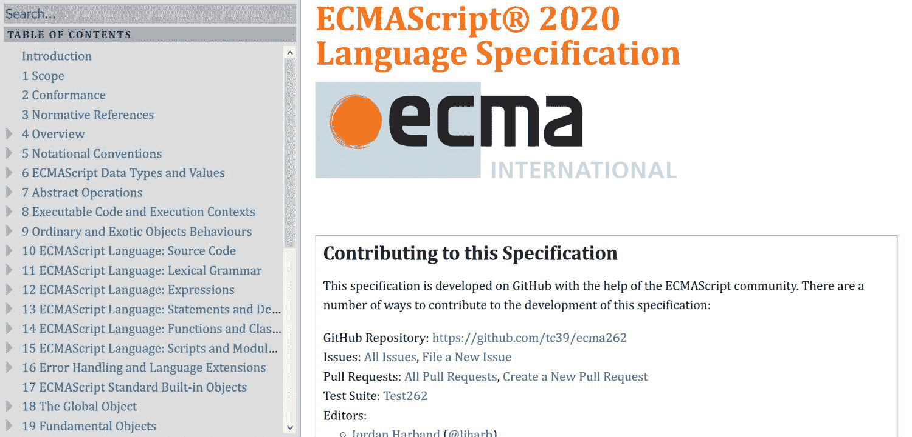

JavaScript


JavaScript 是定义 ECMAScript (ES)通用脚本语言的 ECMA-262 标准的实现。换句话说，JavaScript 是 ECMAScript 语言的一种方言，因此它没有独立的规范，而是使用与 ECMAScript 相同的[语法](https://www.ecma-international.org/ecma-262/11.0/index.html)。

JavaScript 具有一级函数(函数被视为变量)，支持基于原型的面向对象编程(现有对象被重用为原型)。

#### 代码示例

ECMAScript 使用花括号语法。下面的 JavaScript 代码示例将 1 到 10 的数字相加，并将结果输出到控制台(您可以通过按 F12 在 web 浏览器的 JavaScript 控制台中测试它):

```
let total = 0, count = 1;

while (count <= 10) {
    total += count;
    count += 1;
}

console.log(total);
// 55 
```

来源:[Marijn Haverbeke 的雄辩 JavaScript:简介](https://eloquentjavascript.net/00_intro.html)

#### 使用案例和环境

JavaScript 是现代网络浏览器使用的脚本语言，如 Chrome 的 [V8 引擎](https://v8.dev/)和 Mozilla 的[蜘蛛猴引擎](https://developer.mozilla.org/en-US/docs/Mozilla/Projects/SpiderMonkey)。此外，前端 web 开发，它也可以用于非浏览器环境。已经创建了 [NodeJS](https://nodejs.org/en/) 运行时环境，使 web 开发人员能够在后端使用它。

一些 NoSQL 数据库管理系统的外壳，如 [MongoDB](https://www.mongodb.com/) 和 [Apache CouchDB](https://couchdb.apache.org/) ，以及一些关系数据库管理系统，如前面提到的 MySQL 外壳，也将其作为脚本语言。

### 2.服务器端编程语言（Professional Hypertext Preprocessor 的缩写）

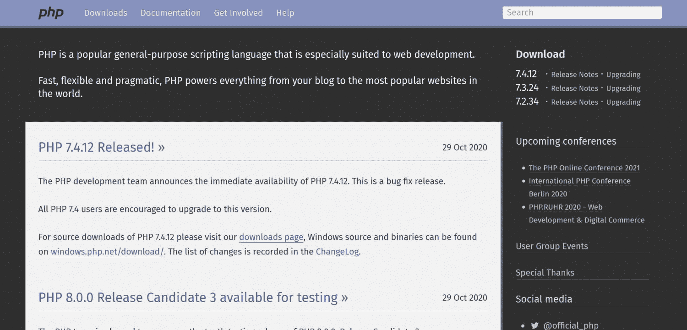

PHP


PHP 是一种用于后端 web 开发的通用开源脚本语言。首字母缩略词最初代表“个人主页”，因为 PHP 最初是为了给静态 HTML 页面[添加动态功能而创建的。](https://kinsta.com/blog/wordpress-vs-static-html/)

从那以后， [PHP 将](https://kinsta.com/blog/php-8/)发展成了一门独立的语言，所以现在这个缩写词在‘超文本预处理器’的意义上被使用。PHP 是松散类型的(您不必声明变量的数据类型)，可以嵌入到 HTML 文档中，并且还具有面向对象的特性。

#### 代码示例

PHP 有一个类似 C 的语法。下面的 PHP 代码示例创建一个包含四个元素的数字数组，遍历它们，将每个元素乘以 2，并在循环结束时取消设置`$value`变量。

```
<?php
$arr = array(1, 2, 3, 4);

foreach ($arr as &$value) {
   $value = $value * 2;
}
// $arr is now array(2, 4, 6, 8)

unset($value);
?> 
```

来源: [PHP 文档:控制结构](https://www.php.net/manual/en/control-structures.foreach.php)

#### 使用案例和环境

PHP 可以在不同的 [HTTP 服务器](https://kinsta.com/blog/wordpress-http-api-part-1/)上执行，其中 [Apache](https://kinsta.com/knowledgebase/what-is-apache/) 和 [Nginx](https://kinsta.com/knowledgebase/what-is-nginx/) 是最受欢迎的。

最常见的 PHP 服务器栈有 LAMP (Linux，Apache，MySQL，PHP)，LEMP (Linux，Nginx，MySQL，PHP — [被 Kinsta](https://kinsta.com/blog/boosting-wordpress-performance/) 使用)，WAMP (Windows，Apache，MySQL，PHP)，MAMP (macOS，Apache，MySQL，PHP)。

许多流行的内容管理系统 (CMS)也使用它，如 WordPress、 [Drupal](https://kinsta.com/blog/wordpress-vs-drupal/) 和 [Joomla](https://kinsta.com/blog/joomla-vs-wordpress/) ，以及 [web 应用框架](https://kinsta.com/blog/php-frameworks/)，如 Laravel、Symfony 和 CodeIgniter，它们都建立在 PHP 语言之上，并通过额外的功能来增强它。

你也可以使用 PHP 进行本地 WordPress 开发。查看我们关于 [Javascript 和 PHP](https://kinsta.com/blog/php-vs-javascript/) 主要区别的深度指南。

### 3.计算机编程语言

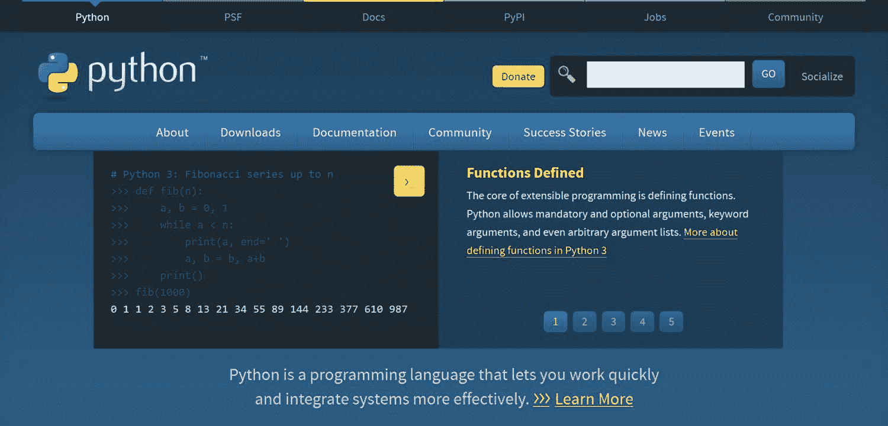

Python


[Python](https://www.python.org/) 是目前 [GitHub](https://kinsta.com/blog/bitbucket-vs-github/) 上[第二流行的编码语言](https://madnight.github.io/githut/#/pull_requests/2020/3)(仅次于 JavaScript)。它因其清晰简洁的语法而受人喜爱——当用 Python 编码时，你需要键入的内容比大多数语言少得多。

Python 是一个免费的开源项目，由 Python 软件基金会管理。它支持结构化的、面向对象的和函数式的编程范例，并且有一个广泛的标准库,它是常用 Python 模块的集合。

#### 代码示例

Python 不使用花括号，分号是可选的，所以代码易于读写。以下 Python 代码示例遍历 0 到 4 之间的整数，并将其打印出来:

```
count = 0
while count < 5:
   print(count)
      count += 1 
```

来源:[学习 Python: Loops](https://www.learnpython.org/en/Loops)

#### 使用案例和环境

最流行的 Python 实现是用 C 语言编写的 [CPython](https://github.com/python/cpython) 。它也是与 Python 语言一起下载的参考实现。尽管 Python 是一种解释型语言，但 CPython 同时使用了编译和解释步骤。首先，它将源代码编译成它在运行时解释的字节码(不同于机器码)。

除了 CPython 之外，Python 还有其他运行时环境，最重要的是省略了编译步骤，只做 JIT(实时)解释的 [PyPy](https://www.pypy.org/) 。Python 实现是跨平台的，这意味着它们可以在多种操作系统上运行，包括 Linux、Windows 和 macOS。

Python 语言经常用于机器学习、后端 web 开发( [Django](https://www.djangoproject.com/) 是最流行的 web 框架)、数据分析、自动化、科学计算和 [web 抓取](https://kinsta.com/knowledgebase/what-is-web-scraping/)。

要找到学习 Python 的最佳方法，请查看我们在 [Python 教程](https://kinsta.com/blog/python-tutorials/) 上的博文。


### 4.红宝石

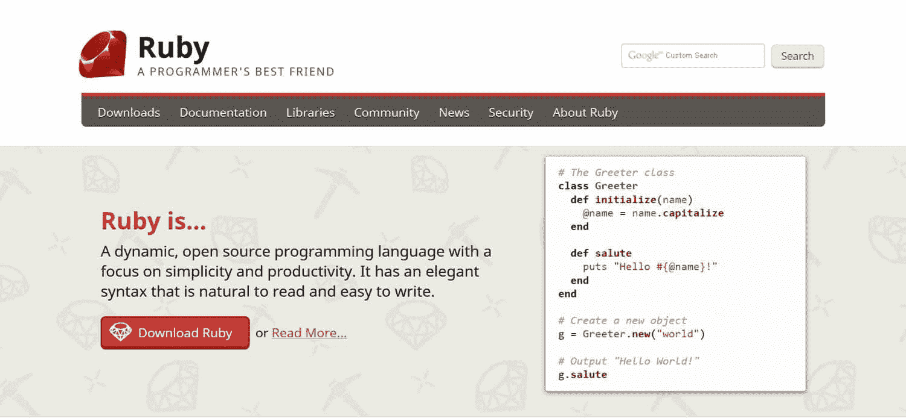

Ruby


Ruby 是一种开源的通用脚本语言，语法简洁易读。它遵循面向对象编程的原则，让你编写干净且符合逻辑的代码，使它成为[最容易学习的编程语言之一](https://kinsta.com/blog/best-programming-language-to-learn/)。在 Ruby 中，一切都是对象——甚至是大多数语言中的基本类型，比如布尔和整数。

面向对象的概念，如继承、混合和元类也被大量使用。

虽然 Ruby 有一个纯面向对象的设计，但是它也支持过程化编程(在类之外定义的函数和变量属于`Self`对象)和函数式编程(通过匿名函数、闭包和延续)。

#### 代码示例

Ruby 有类似 Python 的简洁语法。下面的 Ruby 代码示例将`KaraokeSong`类定义为`Song`类的子类:

```
class KaraokeSong < Song
   def initialize(name, artist, duration, lyrics)
      super(name, artist, duration)
      @lyrics = lyrics
   end
end 
```

来源:[编程 Ruby 参考指南:类、对象和变量](http://ruby-doc.com/docs/ProgrammingRuby/)

#### 使用案例和环境

Ruby 主要用于后端 web 开发，支持一些健壮的 web 应用框架，如 [Ruby on Rails](https://rubyonrails.org/) 。许多流行的网站和应用程序都运行在 Ruby on Rails 上，如 Airbnb、 [Shopify](https://kinsta.com/blog/shopify-alternatives/) 、 [GitHub](https://kinsta.com/knowledgebase/what-is-github/) 和 Hulu。

Ruby 也是许多流行的 web 开发工具的编写语言，最著名的是 [Sass](https://sass-lang.com/) CSS 预处理器、 [Jekyll](https://jekyllrb.com/) 静态网站生成器和[流浪者](https://www.vagrantup.com/)虚拟机环境。

Ruby 的默认实现是 YARV(另一个 Ruby 虚拟机)。它改变了 Ruby 的原始解释器 [Matz 的 Ruby 解释器](https://www.ruby-lang.org/en/about/)(也称为 Ruby MRI 或 CRuby)因速度和可伸缩性问题而受到批评。

Ruby 也有几个竞争的运行时环境，比如 [JRuby](https://www.jruby.org/) (让你在 Java 虚拟机上运行 Ruby)[mruby](https://github.com/mruby/mruby)(一个可以嵌入到你的应用程序中的轻量级实现)[truffruby](https://github.com/oracle/truffleruby)(Oracle 在 GraalVM 上构建的 Ruby 解释器) [Rubinius](https://github.com/rubinius/rubinius) (一个[云原生的](https://kinsta.com/blog/types-of-cloud-computing/)Ruby 虚拟机)，以及[其他](https://github.com/codicoscepticos/ruby-implementations#active)。

### 5.绝妙的

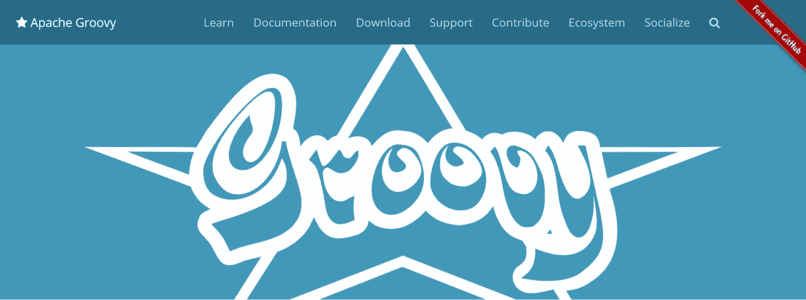

Groovy


Groovy 是一种为 Java 虚拟机(JVM)编写的非常灵活的语言，它既可以用作脚本语言，也可以用作编程语言。这是一个由 Apache 软件基金会维护的开源项目。Groovy 是一种面向对象的语言，它扩展了 [`java.lang.Object`](https://docs.oracle.com/javase/10/docs/api/java/lang/Object.html) 超类。

它支持静态和动态类型(类型检查可以在编译时和运行时执行)，并对列表、关联数组、正则表达式和标记语言(如 HTML 和 XML)提供本机支持。

您可以将 Groovy 与现有的 Java 库一起使用。

#### 代码示例

Groovy 有一个 Java 兼容的语法，使用花括号。下面的 Groovy 代码示例用纬度和经度属性以及`getAt()`方法定义了`Coordinates`类:

```
@Immutable
class Coordinates {
   double latitude
   double longitude

   double getAt(int idx) {
      if (idx == 0) latitude
      else if (idx == 1) longitude
      else throw new Exception("Wrong coordinate index, use 0 or 1")
   }
} 
```

来源: [Groovy 文档:语义](https://groovy-lang.org/semantics.html)

## 注册订阅时事通讯


### 想知道我们是怎么让流量增长超过 1000%的吗？

加入 20，000 多名获得我们每周时事通讯和内部消息的人的行列吧！

[Subscribe Now](#newsletter)

#### 使用案例和环境

随着 Groovy 编译成 Java 字节码，您可以将它作为类似于 Java 的通用编程语言来使用。在这种情况下，可以在运行之前使用 [groovyc](http://www.groovy-lang.org/groovyc.html) 编译器(相当于 javac)将源代码编译成字节码。

然而，也有许多 Groovy 实现允许您将它用作脚本语言。最流行的是 [Grails](https://grails.org/) web 应用框架(以前被称为 Grails 上的 Groovy)和 [Gradle](https://gradle.org/) 构建自动化工具，但是还有[和其他几个](https://groovy-lang.org/ecosystem.html)工具。

### 6.Perl 语言

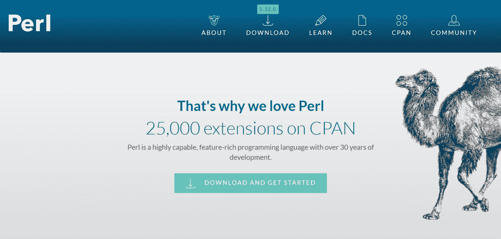

Perl


Perl 是一种通用脚本语言，已经存在了三十多年(从 1987 年开始)。最初，它是作为用于报表处理的 UNIX 脚本语言而创建的。这也是它的名字的来源，Perl 缩写代表“实用提取和报告语言”。

Perl 语言在 20 世纪 90 年代开始流行，当时程序员开始广泛使用它来编写 CGI(通用网关接口)脚本，这是一种用于 web 服务器的较老的接口规范(目前，它主要由遗留站点使用)。

尽管是一个相对早期的玩家，Perl 仍然在 TIOBE 索引中排名第 11 位，在 GitHub 最受欢迎的语言中排名第 21 位(截至 2020 年 10 月)。

#### 代码示例

Perl 的语法类似于 C 语言。下面的 Perl 代码示例首先定义了计算并返回数字平方的`square()`子例程，然后将值 8 作为参数传递，运行子例程，并将结果保存到`$sq`变量中:

```
sub square {
   my $num = shift;
   my $result = $num * $num;
   return $result;
}

$sq = square(8); 
```

来源: [Perl 文档:Perl 简介](https://perldoc.perl.org/perlintro)

#### 使用案例和环境

尽管现在 Perl 不是 web 开发人员最常用的选择，但它可以成功地用于后端开发。除了 CGI 运行时环境之外，它还在 Apache 和 Nginx web 服务器 T1 上运行 LAMP 栈实际上是 LAMPP，代表 Linux、Apache、T2、MySQL、PHP 和 Perl。

也有一些 Perl web 开发框架，其中最流行的是 [Catalyst](http://www.catalystframework.org/) 、 [Mojolicious](https://metacpan.org/release/Mojolicious) 和 [Dancer](http://perldancer.org/) 。

Perl 被几个著名的网站和应用程序使用，比如 Amazon、IMDB、Booking.com 和 BBC iPlayer。它也用于其他领域，如网络编程和系统管理。您还可以查看[全面的 Perl 归档网络(CPAN)](https://www.perl.org/cpan.html) ，这里有 25，000 多个开源 Perl 项目可供您下载。

### 7.左上臂

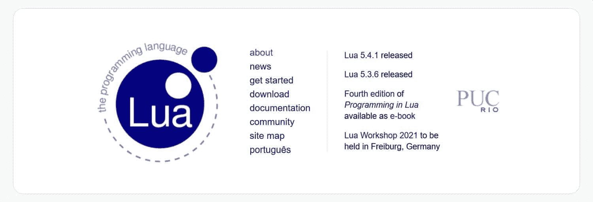

Lua


Lua 是一种快速、轻量级的脚本语言。“lua”一词在葡萄牙语中是“月亮”的意思，因为该语言是由巴西里约热内卢天主教大学开发和维护的。Lua 支持过程化、面向对象和函数式编程范例。

由于 Lua 的解释器是用 C 语言编写的，使用它的 C API 可以很容易地将它嵌入到应用程序中。也就是说，您可以使用 Lua 来扩展用 C、C++、C#、Java、Perl、Ruby 等基于 C 的语言编写的现有应用程序。

#### 代码示例

Lua 有一个简洁易读的语法，类似于 Python 和 Ruby。下面的 Lua 代码示例展示了如何使用`if-then-else`语句。首先，它评估`op`变量，然后根据它的值执行基本的算术运算:

```
if op == "+" then
   r = a + b
elseif op == "-" then
   r = a - b
elseif op == "*" then
   r = a * b
elseif op == "/" then
   r = a / b
else
   error("invalid operation")
end 
```

来源:[Lua 参考指南中的编程:语句](https://www.lua.org/pil/4.3.1.html)

#### 使用案例和环境

默认的 Lua 实现并不直接解释源代码，而是先将其编译成字节码，然后在 Lua 虚拟机上执行。因为所有这些都发生在运行时，所以不需要执行手动编译步骤(尽管您可以选择在运行前编译 Lua 来提高性能)。

还有其他的 Lua 实现，比如 [LuaJIT](https://github.com/LuaJIT/LuaJIT) ， [LuaVela](https://github.com/luavela/luavela) ，以及[许多其他的](http://lua-users.org/wiki/LuaImplementations)。

Lua 经常被用于开发视频游戏，如愤怒的小鸟、魔兽世界和 Grim Fandango。由于易于嵌入，它也是机顶盒、汽车仪表板(如沃尔沃)、IP 摄像头(如思科)等嵌入式设备的常用选择。

它也可以用于 web 开发，因为 Apache 和 Nginx 服务器都有 Lua 模块(这里是 Apache 的 [mod_lua](https://httpd.apache.org/docs/trunk/mod/mod_lua.html) ，这里是 Nginx 的 [ngx_http_lua_module](https://github.com/openresty/lua-nginx-module) )。维基百科[选择 Lua](https://en.wikipedia.org/wiki/Wikipedia:Wikipedia_Signpost/2012-01-30/Technology_report) 作为其模板脚本语言，Adobe Photoshop Lightroom 的 UI 也是用 Lua 编写的。

### 8.尝试

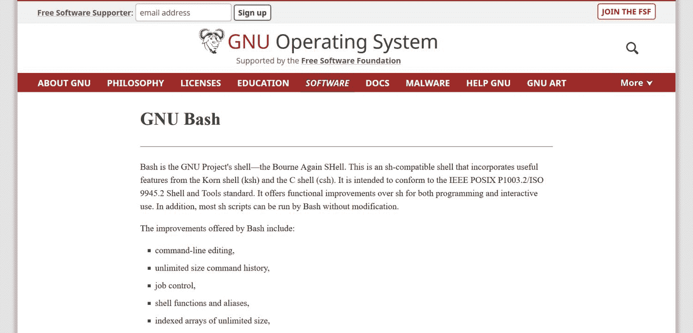

Bash 是 GNU 操作系统的命令行解释器(shell)和脚本语言的名字。“Linux”实际上是使用 Linux 内核的 [GNU 操作系统(内核是操作系统的核心部分，它是操作系统加载的第一个程序)。](https://www.gnu.org/gnu/gnu-linux-faq.html#what)

它是最初的 [UNIX Bourne shell (sh)](https://steve-parker.org/sh/bourne.shtml) 的替代品 Bash 首字母缩略词代表“Bourne Again SHell”(是“born again shell”的双关语)。

除了作为 Bourne shell 语法的超集，Bash 还包括其他 shell 脚本语言的特性，如 [KornShell (ksh)](https://github.com/att/ast) 和[C shell(csh)](http://bxr.su/NetBSD/bin/csh/)——例如，命令行编辑和命令历史。您可以在交互模式(一次执行一个命令并等待机器的回复)和脚本模式(一次运行一组命令—一个 Bash 脚本)下使用 Bash。

#### 代码示例

像大多数脚本语言一样，Bash 有一个简单的描述性语法。以下 Bash 代码示例从当前文件夹中选择一个文件，并输出包含该文件的名称和索引的消息:

```
select fname in *;
do
   echo you picked $fname \($REPLY\)
   break;
done 
```

来源: [Bash 参考手册:条件构造](https://www.gnu.org/software/bash/manual/bash.html)

需要为您的客户站点提供超快的、安全的、开发人员友好的托管服务吗？Kinsta 是为 WordPress 开发者设计的，提供了大量的工具和强大的仪表板。[查看我们的计划](https://kinsta.com/plans/?in-article-cta)

#### 使用案例和环境

您可以使用 Bash 进行更改并执行与您的操作系统相关的不同操作，例如执行命令，执行大多数人会使用图形用户界面执行的任务(例如创建、移动或删除文件夹和文件)，[定制和自动化管理任务](https://kinsta.com/blog/ssh-commands/)，[连接到远程服务器](https://kinsta.com/blog/ssh-commands/)，以及[许多其他任务](https://kinsta.com/blog/how-to-use-ssh/)。

Bash 是许多基于 Unix 的操作系统的默认 shell，包括大多数 Linux 发行版和所有 macOS 版本，直到 2019 年用 [Z shell (Zsh)](https://www.zsh.org/) 取代 Bash 的 [macOS Catalina](https://www.apple.com/macos/catalina/) 。你也可以在 Windows 10 上运行 Bash 脚本，使用微软开发的[Windows Subsystem for Linux(WSL)](https://docs.microsoft.com/en-us/windows/wsl/)兼容层。

### 9.PowerShell

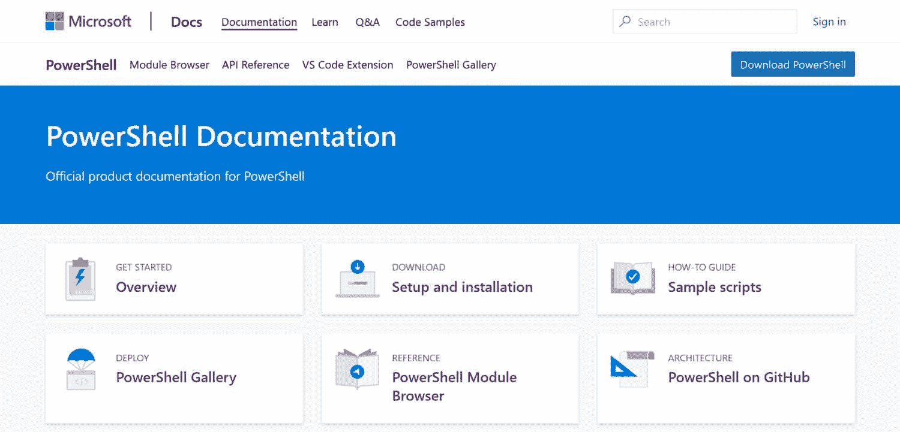

最初， [PowerShell](https://docs.microsoft.com/en-us/powershell/) 是一个命令行 Shell 和脚本语言，专门用于 Windows 操作系统。此后，微软开源并把它从[搬了出来。NET 框架](https://dotnet.microsoft.com/)，它只能创建 Windows 应用程序，给[。NET Core](https://github.com/dotnet/core) ，可以为 Windows、Linux、macOS 创建应用。这意味着 PowerShell 现在是跨平台的。

也从 Windows PowerShell 更名为 PowerShell Core，对应底层框架。与大多数命令行 Shell 不同，PowerShell 接受并返回。NET 对象而不是纯文本，这为任务自动化提供了新的机会。

#### 代码示例

PowerShell 具有紧凑的语法，使得在命令行中工作更快。下面的 PowerShell 代码示例创建 boot.ini 文件的备份，并将其保存到 boot.bak 文件中:

```
Copy-Item -Path C:\boot.ini -Destination C:\boot.bak
```

来源: [PowerShell 文档:使用文件和文件夹](https://docs.microsoft.com/en-us/powershell/scripting/samples/working-with-files-and-folders?view=powershell-7)

#### 使用案例和环境

您可以在 Windows、Linux、macOS 操作系统和一些 ARM 设备(如可穿戴设备、多媒体播放器、平板电脑和其他消费电子设备)上使用 PowerShell。

您可以使用 PowerShell 进行系统管理、任务自动化和配置管理。要找到 PowerShell 模块和脚本，你也可以查看 [PowerShell 图库](https://www.powershellgallery.com/)和微软[官方样本脚本集](https://docs.microsoft.com/en-us/powershell/scripting/samples/sample-scripts-for-administration?view=powershell-7)。

### 10.稀有

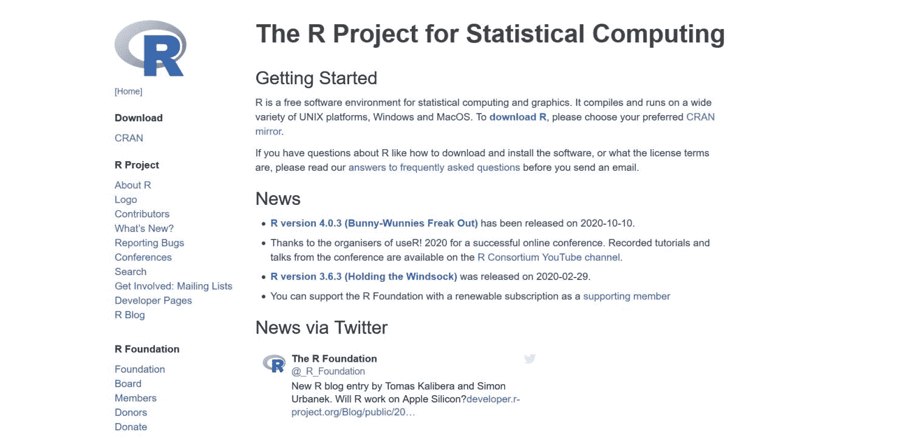

R 是一个软件环境和脚本语言，可以用于统计计算、数据分析和图形显示。这是一个免费的开源 GNU 项目，也是[的](https://web.archive.org/web/20181014111802/http://ect.bell-labs.com/sl/S/)统计计算语言的一个实现(不再处于开发中)。

r 允许您使用许多不同的统计技术，比如经典的统计测试、聚类、时间序列分析、线性和非线性建模等等。

#### 代码示例

R 的语法不同于大多数脚本语言，也有一些不寻常的元素——例如，主要的赋值操作符是`<-`而不是`=`等号，并且它有无循环的循环——参见 Sharon Machlis 的《R 的[初学者指南》中关于 R 语法的更多古怪之处。](https://www.computerworld.com/article/2497319/business-intelligence-beginner-s-guide-to-r-syntax-quirks-you-ll-want-to-know.html)

下面的 R 代码示例为`fruit`向量(包含相同类型元素的 R 中的基本数据结构)定义了一个`names`属性，该属性使用字母数字名称(`orange`、`banana`、`apple`、`peach`)来帮助标识其组成部分。稍后，`lunch`(或另一个)子向量可以使用别名访问每个组件:

```
> fruit <- c(5, 10, 1, 20)
> names(fruit) <- c("orange", "banana", "apple", "peach")
> lunch <- fruit[c("apple","orange")] 
```

来源:[R 简介:索引向量；选择和修改数据集的子集](https://cran.r-project.org/doc/manuals/r-release/R-intro.html#Index-vectors)

#### 使用案例和环境

R 软件环境是跨平台的；您可以在 Windows、Linux 和 macOS 操作系统上运行它。默认的 R 实现也可以从其他一些脚本语言中获得，比如 [Python](https://rpy2.github.io/) 和 [Perl](https://metacpan.org/pod/Statistics::R) 。这意味着您可以使用这些脚本语言访问 R 的所有统计功能。

除了默认的 R 环境，您还可以在其他环境中使用 R 脚本语言，比如 [pqR](http://www.pqr-project.org/) (代表“R 的快速版本”)和 [Renjin](https://www.renjin.org/) (基于 Java 虚拟机的 R 实现)。

### 11.VBA

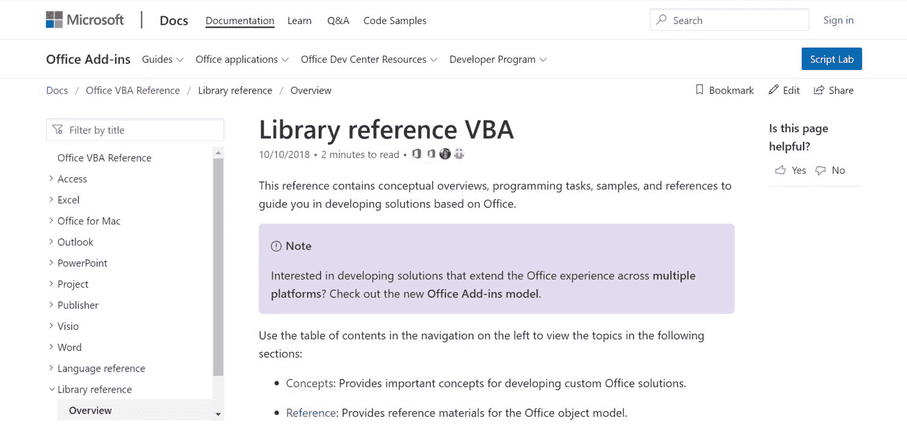

[VBA](https://docs.microsoft.com/en-us/office/vba/api/overview/library-reference) 代表 Visual Basic for Applications，它是 [Visual Basic 6](https://docs.microsoft.com/en-us/previous-versions/visualstudio/visual-basic-6/visual-basic-6.0-documentation?redirectedfrom=MSDN) 编程语言的一种实现(自 2008 年以来一直未进行开发)。它是为 Microsoft Office 应用程序创建的，使开发人员能够自动执行重复性任务、添加新功能以及与文档的最终用户进行交互。

与 Visual Basic 类似，VBA 遵循事件驱动的编程范式，将用户操作等事件置于驱动程序流程的中心。

由于 Microsoft Office 应用程序具有图形用户界面，您可以将 VBA 脚本附加到菜单按钮、键盘快捷键、宏(可编程模式)和 [OLE](https://docs.microsoft.com/en-us/cpp/mfc/ole-background?view=vs-2019) 事件(对象链接和嵌入，让您可以从一个应用程序控制另一个应用程序；这是微软的专有技术)。

#### 代码示例

由于 VBA 是基于 Visual BASIC(它是 Basic 的增强版)，它使用的语法类似于 Basic(初学者的通用符号指令代码)家族的语言——这意味着它对初学者非常友好。

下面的 VBA 代码示例使用`SignatureInfo`对象的 [`GetCertificateDetail()`](https://docs.microsoft.com/en-us/office/vba/api/office.signatureinfo.getcertificatedetail) 方法来获取数字证书的截止日期:

```
Sub GetCertDetails()
Dim objSignatureInfo As SignatureInfo
Dim varDetail As Variant

strDetail = objSignatureInfo.GetCertificateDetail(certdetExpirationDate)

End Sub 
```

来源: [Office VBA 参考:SignatureInfo 对象](https://docs.microsoft.com/en-us/office/vba/api/office.signatureinfo)

#### 使用案例和环境

VBA 脚本语言嵌入到大多数微软 Office 应用程序中，分别是 Access、Excel、Office for Mac、Outlook、PowerPoint、Project、Publisher、Visio 和 Word——每一个都在微软的文档网站上有一个单独的参考指南,而一般的 VBA 概念在[图书馆参考](https://docs.microsoft.com/en-us/office/vba/api/overview/library-reference)中有详细说明。

除了微软 Office 应用，还有其他应用也支持 VBA，比如 [AutoCAD](https://www.autodesk.com/products/autocad/overview) 和 [CorelDRAW](https://www.coreldraw.com/en/) 。

### 12.Emacs Lisp

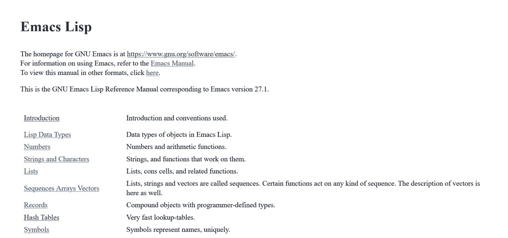

Emacs Lisp 是为 [GNU Emacs](https://www.gnu.org/software/emacs/) 文本编辑器设计的特定领域脚本语言。它是 Lisp 编程语言家族的一种方言(这个名字来自 LISt Processor)。

由于 Emacs Lisp 被设计为在一个[代码编辑器](https://kinsta.com/blog/best-text-editors/)中使用，它带有一个特定于该环境的特性集，比如文本扫描和解析、缓冲(带有可编辑文本的对象)和显示管理等等。

Emacs Lisp 脚本语言与编辑器接口本身紧密集成，因此每个命令也是一个 Lisp 函数，您可以从脚本中调用它，定制参数也是 Lisp 变量。

#### 代码示例

Emacs Lisp 的语法基于一个完全用括号括起来的前缀符号，如果您以前没有使用过任何 Lisp 语言，一开始可能会有点难以理解。

下面的 Emacs Lisp 代码示例定义了两个变量(符号)，并为每个变量分配了一个值列表—符号`trees`对应一个树列表(`pine`、`fir`、`oak`、`maple`，符号`herbivores`对应一个食草动物列表(`gazelle`、`antelope`、`zebra`):

```
(setq trees '(pine fir oak maple)
   herbivores '(gazelle antelope zebra)) 
```

来源:[Emacs Lisp 编程入门:设置变量值](https://www.gnu.org/software/emacs/manual/html_node/eintr/Using-setq.html#Using-setq)

#### 使用案例和环境

Emacs 文本编辑器是一个跨平台的应用程序，可以安装在 Windows、Linux 和 macOS 机器上。

使用 Emacs Lisp 脚本语言，您可以扩展和定制代码编辑器，重复和自动化流程，[创建图形](https://kinsta.com/blog/wordpress-charts/)，将焦点限制在特定区域([用于安全保护](https://kinsta.com/blog/wordpress-security/)，搜索正则表达式，存储文本，定义模式和键映射，向用户提问，以及执行许多其他操作。

还有一些 Emacs Lisp 的配置框架——[Doom Emacs](https://github.com/hlissner/doom-emacs)和 [Spacemacs](https://www.spacemacs.org/) 是最知名的。

### 13.生长调节血清三肽

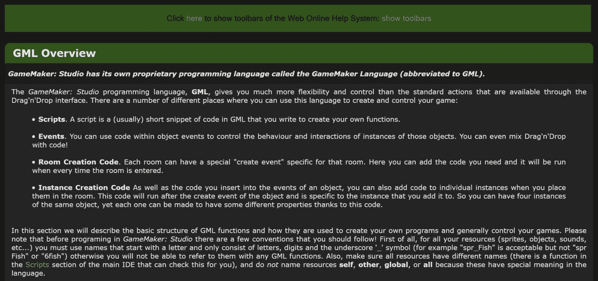

首字母缩略词 [GML](https://docs.yoyogames.com/source/dadiospice/002_reference/001_gml%20language%20overview/) 代表游戏制作者语言。这是游戏开发中使用的特定领域脚本语言的一个很好的例子。GML 是属于 [GameMaker Studio 2](https://www.yoyogames.com/gamemaker) 的专有脚本语言，是由 YoYo Games 拥有和维护的跨平台游戏引擎和开发平台。

尽管 GML 主要用于控制游戏对象，但它不是一种面向对象的语言，而是一种过程语言。它允许你从任何游戏对象调用自定义脚本。

除了 GML 脚本语言，GameMaker Studio 2 还有一个可视化脚本工具，叫做[【DnD】](https://docs2.yoyogames.com/source/_build/index.html#dnd)。由于 GameMaker Studio 2 的灵活性，您也可以将 DnD 与 GML 脚本混合使用。

#### 代码示例

GML 的语法类似于 JavaScript 和其他类 C 语言。

下面的 GML 代码示例使一个游戏对象以每步 5 个像素的速度向屏幕上的鼠标指针水平移动。一旦它到达指针的当前位置，脚本创建一个爆炸效果层，运行它(屏幕上有一个爆炸效果)，然后销毁实例(爆炸效果被移除):

```
if mp_linear_step(mouse_x, mouse_y, 5, 0) {
   instance_create_layer(x, y, "Effects", obj_Explosion);
   instance_destroy();
} 
```

来源:[GameMaker Studio 2 Docs](https://docs2.yoyogames.com/)[–](https://docs2.yoyogames.com/)[脚本](https://docs2.yoyogames.com/)[–](https://docs2.yoyogames.com/)[GML 参考](https://docs2.yoyogames.com/)[–](https://docs2.yoyogames.com/)[运动与碰撞——运动规划](https://docs2.yoyogames.com/)

#### 使用案例和环境

GameMaker Studio 2 解释说，如果你想用这种脚本语言开发游戏，你需要购买 GML。

定价取决于你想为其开发游戏的平台——Mac 和 Windows 游戏是最便宜的；跨平台(Windows、macOS、Ubuntu)桌面游戏、HTML5 网页游戏、UWP(通用 Windows 平台)游戏、跨平台(Android、Fire、iOS)手机游戏处于中端；PS4、Xbox One 和任天堂 Switch 是最贵的。

一些用 GML 创作的视频游戏的例子包括[黑洞](https://www.blackhole-game.com/en/about)、 [10 秒忍者 X](http://www.10second.ninja/) 、[死亡之战](http://www.deathsgambit.com/)、 [Deltarune](https://www.deltarune.com/) 以及其他几个。

[Ready to learn another scripting language? 👩‍💻These 13 options are regularly updated and used in production, which makes them a great addition to your resume. 💼Click to Tweet](https://twitter.com/intent/tweet?url=https%3A%2F%2Fkinsta.com%2Fblog%2Fscripting-languages%2F&via=kinsta&text=Ready+to+learn+another+scripting+language%3F+%F0%9F%91%A9%E2%80%8D%F0%9F%92%BBThese+13+options+are+regularly+updated+and+used+in+production%2C+which+makes+them+a+great+addition+to+your+resume.+%F0%9F%92%BC&hashtags=Coding%2CPHP)

## 摘要

毫无疑问，脚本语言是迷人的。它们有许多不同的变体、语法和实现，可以用于很多事情。

从[构建动态网站](https://kinsta.com/blog/wordpress-website-cost/)，到自动化系统管理，到创建视频游戏，等等。

关于脚本语言，需要记住的三件最重要的事情是:

它们不能独立运行，但总是需要一个带有该脚本语言解释器的环境(实现、运行时)。

有时，您可以使用通用脚本语言来访问主要为其他编程或脚本语言创建的环境和平台。想想 JRuby(让你在 Java 虚拟机上运行 Ruby)、Renjin(也在 JVM 上实现 R)、Rpy2(你可以从 Python 使用的 R 接口)就是很好的例子。

最后，在学习一门新的脚本语言之前，使用 [TIOBE index](https://www.tiobe.com/tiobe-index/) 或 [GitHut](https://madnight.github.io/githut/) 来检查它当前的流行程度总是一个好主意。

根据它，你还会发现或多或少的示例脚本、 [GitHub 库](https://kinsta.com/blog/bitbucket-vs-github/)、模块库、参考指南、详细的手册和应用展示，它们将帮助你开始使用这种语言……并获得[报酬更高的项目和工作](https://kinsta.com/blog/web-developer-salary/)！

* * *

让你所有的[应用程序](https://kinsta.com/application-hosting/)、[数据库](https://kinsta.com/database-hosting/)和 [WordPress 网站](https://kinsta.com/wordpress-hosting/)在线并在一个屋檐下。我们功能丰富的高性能云平台包括:

*   在 MyKinsta 仪表盘中轻松设置和管理
*   24/7 专家支持
*   最好的谷歌云平台硬件和网络，由 Kubernetes 提供最大的可扩展性
*   面向速度和安全性的企业级 Cloudflare 集成
*   全球受众覆盖全球多达 35 个数据中心和 275 多个 pop

在第一个月使用托管的[应用程序或托管](https://kinsta.com/application-hosting/)的[数据库，您可以享受 20 美元的优惠，亲自测试一下。探索我们的](https://kinsta.com/database-hosting/)[计划](https://kinsta.com/plans/)或[与销售人员交谈](https://kinsta.com/contact-us/)以找到最适合您的方式。