# 如何诊断你的 WordPress 站点上的高管理 Ajax 使用率

> 原文：<https://kinsta.com/blog/admin-ajax-php/>

Ajax 是一种基于 JavaScript 的 web 技术，可以帮助您构建动态的交互式网站。WordPress 使用 Ajax 来增强它的许多核心管理区域功能，比如自动保存文章、用户会话管理和通知。

默认情况下，WordPress 通过位于站点的`**/wp-admin**`目录中的`**admin-ajax.php**`文件来引导所有的 Ajax 调用。

大量并发的 Ajax 请求会导致高 **`admin-ajax.php`** 使用率，从而导致服务器和网站速度大幅下降。这是许多未经优化的 WordPress 网站面临的最常见的问题之一。通常，它表现为缓慢的网站或 HTTP 5xx 错误(大多数是 [504](https://kinsta.com/blog/504-gateway-timeout/) 或 [502](https://kinsta.com/blog/502-bad-gateway/) 错误)。

在这篇文章中，你将了解 WordPress 的`**admin-ajax.php**`文件，它是如何工作的，它的优点和缺点，以及如何诊断和修复高`**admin-ajax.php**`使用率的问题。

准备好了吗？我们出发吧！

## 什么是 admin-ajax.php 档案？

`**admin-ajax.php**`文件包含了在 WordPress 上路由 Ajax 请求的所有代码。它的主要目的是使用 Ajax 在客户机和服务器之间建立连接。WordPress 用它来刷新页面的内容，而不需要重新加载，从而使它对用户来说是动态的和交互式的。

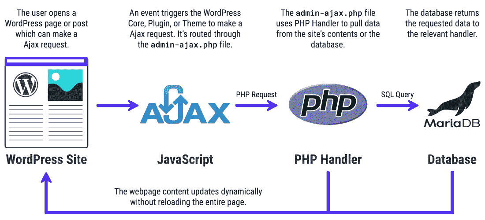

A basic overview of how Admin Ajax works on WordPress

由于 WordPress 核心已经使用 Ajax 来支持其各种后端功能，你可以使用相同的功能在 WordPress 上使用 Ajax。你所需要做的就是注册一个动作，将它指向你的站点的`**admin-ajax.php**`文件，并定义你希望它如何返回值。您可以将其设置为返回 HTML、JSON 甚至 XML。

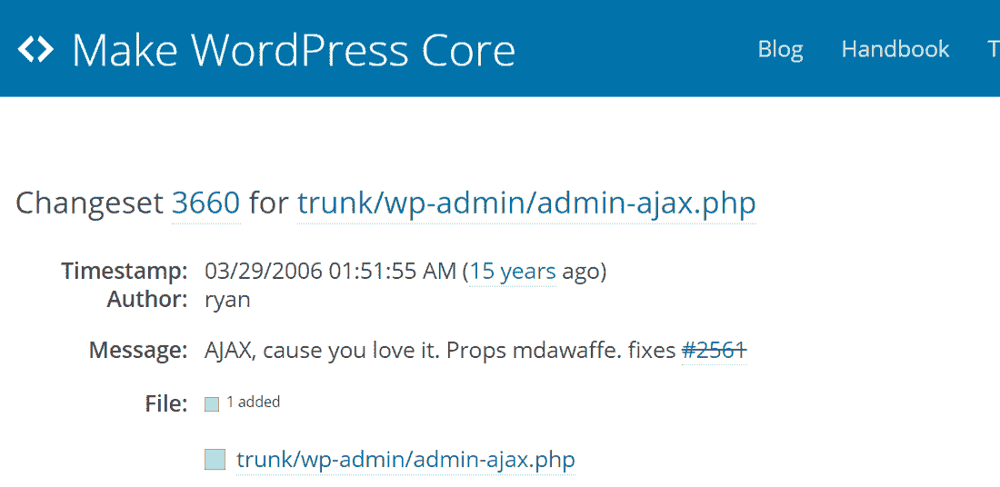

admin-ajax.php file in WordPress

[根据 WordPress Trac](https://core.trac.wordpress.org/changeset/3660/trunk/wp-admin/admin-ajax.php),`**admin-ajax.php**`文件最早出现在 WordPress 2.1 中。在 [WordPress 开发社区](https://kinsta.com/learn/wordpress-communities/)中，它也被称为 **Ajax Admin** 。

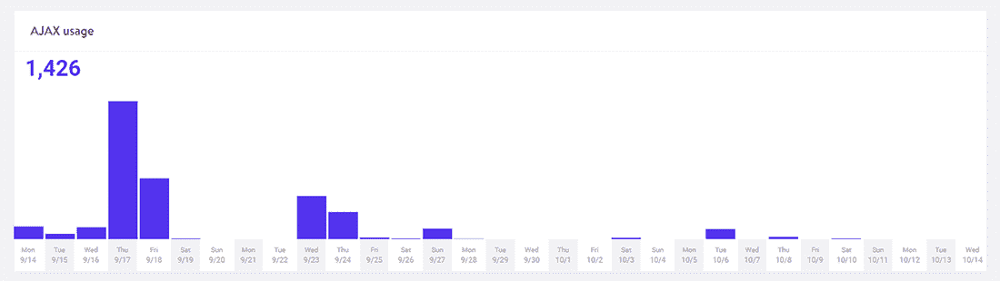

Checking Ajax usage in MyKinsta dashboard

上面的图表只显示了`**admin-ajax.php**`请求的数量，而不是它们可能来自哪里。这是观察峰值何时出现的好方法。您可以将它与本文中提到的其他技术结合起来，以缩小主要原因的范围。

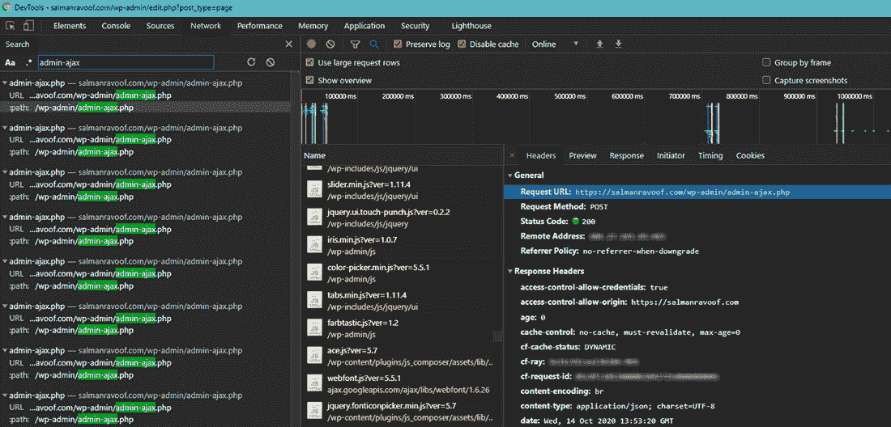

Checking the number of admin-ajax.php requests in Chrome DevTools

您还可以使用 Chrome DevTools 来查看有多少请求被发送到`**admin-ajax.php**`。您还可以查看**网络**部分下的**计时**选项卡，了解处理这些请求需要多长时间。

至于找到高使用率背后的确切原因，主要有两个主要原因:一个是前端，另一个是后端。我们将在下面讨论这两个问题。

## 如何在 WordPress 上调试高 admin-ajax.php 使用率

第三方插件是高 admin-ajax.php 使用率背后最常见的原因之一。通常，这个问题出现在网站的前端，并经常出现在速度测试报告中。

但是插件并不是唯一的罪魁祸首，因为主题、WordPress 核心、T2 网络服务器和 T4 DDoS 攻击也可能是大量使用 Ajax 的原因。

让我们更详细地探索它们。

### 如何确定插件和主题的高 admin-ajax.php 使用率的来源

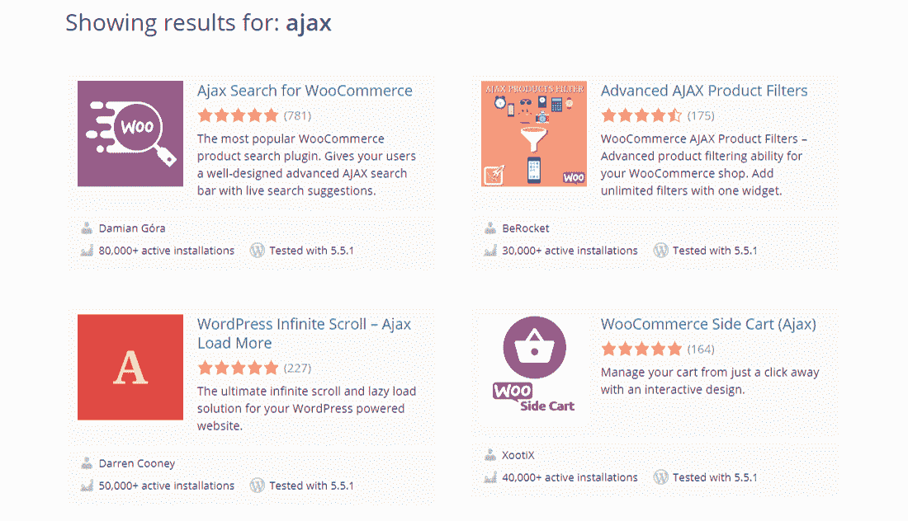

Ajax-powered plugins in WordPress.org repository

Ajax 经常被 WordPress 开发者用来创建动态的、交互式的插件和主题。一些流行的例子包括添加功能，如[实时搜索](https://kinsta.com/blog/wordpress-search/)，产品过滤器，无限滚动，[动态购物车](https://kinsta.com/blog/shopping-cart-abandonment/#2-shorten--simplify-the-checkout-process)，和[聊天框](https://kinsta.com/blog/wordpress-live-chat-plugin/)。

仅仅因为一个插件使用 Ajax 并不意味着它会降低你网站的速度。

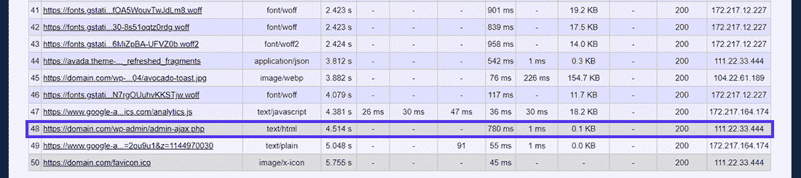

Viewing the admin-ajax.php request in WebPageTest report

通常，管理 Ajax 在页面加载接近尾声时加载。此外，您可以将 Ajax 请求设置为异步加载，这样对用户感知的页面性能几乎没有影响。

正如您在上面的 WebPageTest 报告中所看到的，`**admin-ajax.php**`加载到请求队列的末尾，但是它仍然占用了 780 ms，对于一个请求来说，这是很长的时间。

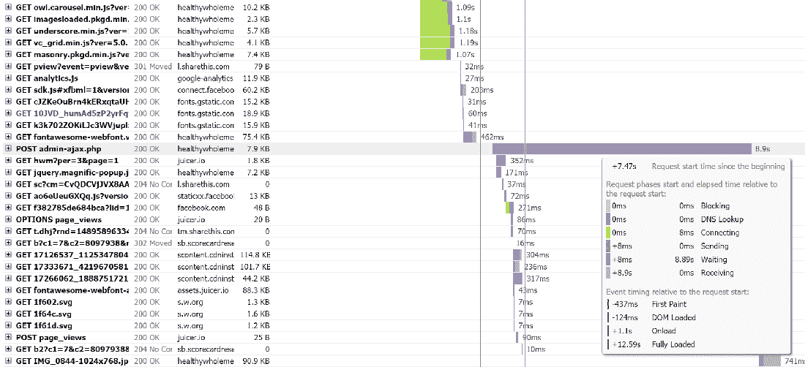

GTmetrix report indicating a serious admin-ajax.php usage spike

当开发者没有在 WordPress 上正确地实现 Ajax 时，会导致严重的性能问题。上面的 GTmetrix 报告是这种行为的一个很好的例子。

您还可以使用 GTmetrix 来挖掘单个帖子和回复数据。您可以使用此功能来查明导致问题的原因。

为此，请转到 GTmetrix 报告的**瀑布**选项卡，然后找到并单击【admin-ajax.php 邮报】项目**。您将看到这个请求的三个选项卡:标题、文章和响应。**

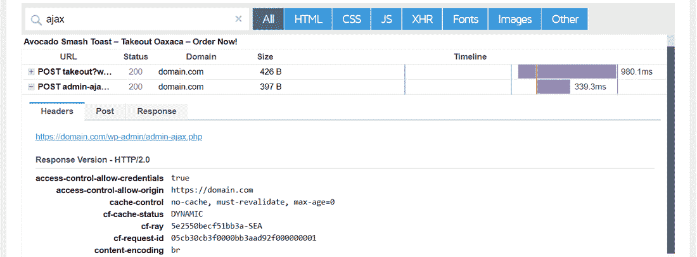

POST admin-ajax.php request’s Headers data

查看请求的 **Post** 和 **Response** 选项卡会给你一些提示，找出性能问题背后的原因。对于这个网站，你可以在回复标签中看到线索。

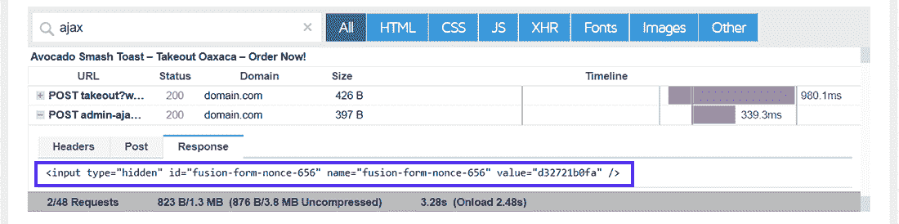

POST admin-ajax.php request’s Response data

您可以看到响应的一部分与 id 设置为“fusion-form-nonce-656”的输入标记有关。

## 注册订阅时事通讯

### 想知道我们是怎么让流量增长超过 1000%的吗？

加入 20，000 多名获得我们每周时事通讯和内部消息的人的行列吧！

[Subscribe Now](#newsletter)

快速搜索这条线索会把你带到 ThemeFusion 的网站，Avada 主题的创建者。因此，您可以断定请求来自主题，或者它所捆绑的任何插件。

在这种情况下，您必须首先确保 Avada 主题及其所有相关插件得到完全更新。如果这不能解决问题，那么你可以试着禁用主题，看看是否能解决问题。

与禁用插件不同，禁用主题在大多数情况下是不可行的。因此，尝试[优化主题](https://kinsta.com/blog/total-wordpress-theme/)来消除任何瓶颈。您还可以联系主题的支持团队，看看他们是否能提出更好的解决方案。

在 GTmetrix 中测试另一个速度较慢的网站时，发现了 Visual Composer 页面生成器和通知栏插件的类似问题。

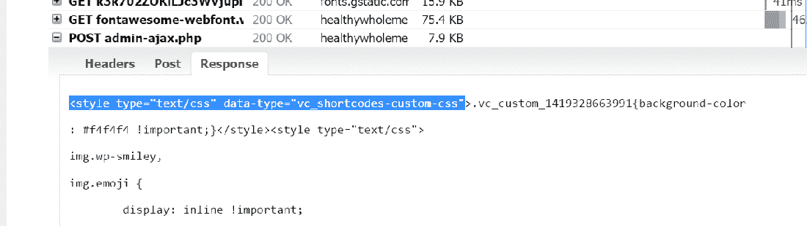

Another POST admin-ajax.php request’s Response data

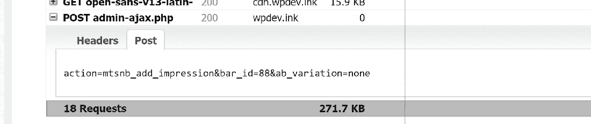

POST admin-ajax.php request’s Post data

令人欣慰的是，如果你不能解决插件的问题，你最喜欢有许多可供选择的插件来尝试。例如，当谈到[页面生成器](https://kinsta.com/blog/wordpress-page-builders/)时，你也可以尝试 Beaver Builder 或 Elementor。

### 如何确定高 admin-ajax.php 的来源

有时，速度测试报告中显示的 Post 和响应数据可能并不清晰明了。在这里，找到高使用率的根源并不容易。在这种情况下，你总是可以用老办法。

[禁用你站点的所有插件](https://kinsta.com/knowledgebase/disable-wordpress-plugins/)，[清空你站点的缓存](https://kinsta.com/blog/wordpress-cache/)(如果有的话)，然后再次运行速度测试。如果`**admin-ajax.php**`仍然存在，那么最有可能的罪魁祸首就是主题。但是如果找不到它，那么你必须一个接一个地激活每个插件，并且每次都运行速度测试。通过排除过程，你将锁定问题的根源。

**提示:**使用[的试运行环境](https://kinsta.com/help/staging-environment/)(例如 [Kinsta 的试运行环境](https://kinsta.com/help/staging-environment/))是在你的站点上运行测试的一个很好的方式，而不会影响你的现场站点。一旦您确定了原因并在暂存环境中修复了问题，您就可以[将更改推送到您的实时站点](https://kinsta.com/help/push-staging-live/)。
T9】

### 诊断 admin-ajax.php 的后端服务器问题

高`**admin-ajax.php**`使用率的第二个最常见原因是 WordPress Heartbeat API 生成频繁的 Ajax 调用，导致服务器上的高 CPU 使用率。通常，这是因为许多用户登录了 WordPress 后端仪表板。因此，你不会在速度测试中看到这一点。

厌倦了体验你的 WordPress 网站的问题？通过 Kinsta 获得最好、最快的主机支持！[查看我们的计划](https://kinsta.com/plans/?in-article-cta)

默认情况下，Heartbeat API 每 15 秒轮询一次`**admin-ajax.php**`文件，以自动保存帖子或页面。如果你使用的是[共享托管服务器](https://kinsta.com/knowledgebase/shared-vps-dedicated-hosting/)，那么你就没有多少服务器资源专用于你的网站。如果你正在编辑一篇文章或一个页面，并且让标签页长时间打开，那么就会产生大量的管理 Ajax 请求。

例如，当你写或编辑文章时，单个用户一小时就能产生 240 个请求！

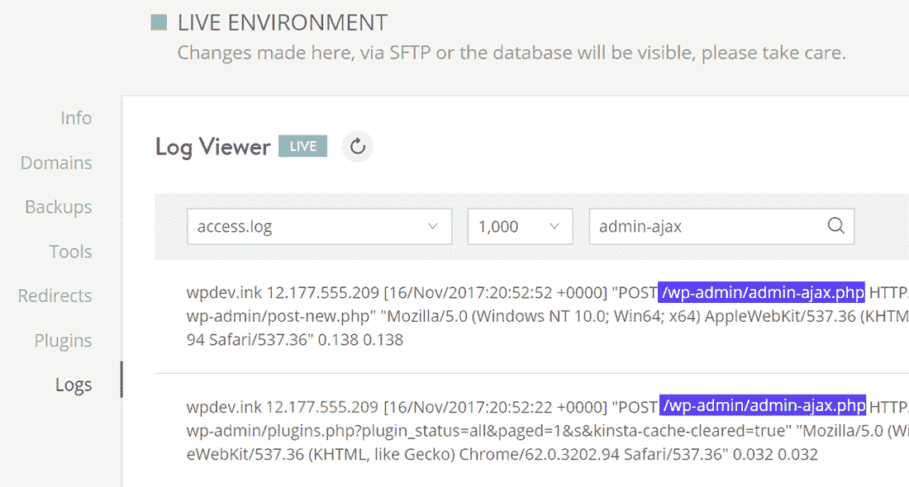

Frequent autosave admin-ajax.php requests

只有一个用户有很多后端请求。现在想象一个站点，其中有多个编辑同时登录。这样的网站可以快速处理 Ajax 请求，产生高 CPU 使用率。

在帮助 dart drones 扩展他们的 WooCommerce 网站以在《鲨鱼池》中亮相时，Kinsta 实际上遇到了这个问题。

他们在一天之内接到了超过 4100 个电话，只有 2000 个独立访客。这是一个很弱的请求访问比率。

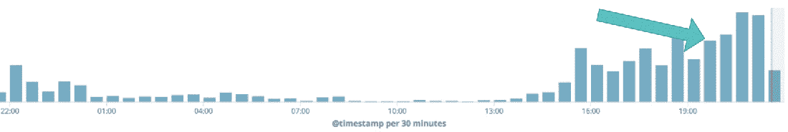

Heavy admin-ajax.php usage on dartdrones.com

金斯塔的团队注意到了**/WP-admin**referrer[URL](https://kinsta.com/knowledgebase/what-is-a-url/)，并正确确定了根本原因。这些请求是由于 DARTDrones 的管理员和编辑们频繁更新网站以期待该节目。

WordPress 已经在很久以前部分修复了这个 [Heartbeat API 问题](https://core.trac.wordpress.org/changeset/30293)。例如，您可以在资源有限的主机上减少心跳 API 生成请求的频率。它还会在一个小时的键盘/鼠标/触摸不活动后挂起自己。

#### 使用心跳控制插件减少 Ajax 请求

你可以使用 WP Rocket 的[心跳控制插件](https://wordpress.org/plugins/heartbeat-control/)轻松修复这个问题。它允许您只需点击几下鼠标就可以禁用或修改心跳 API 的频率。

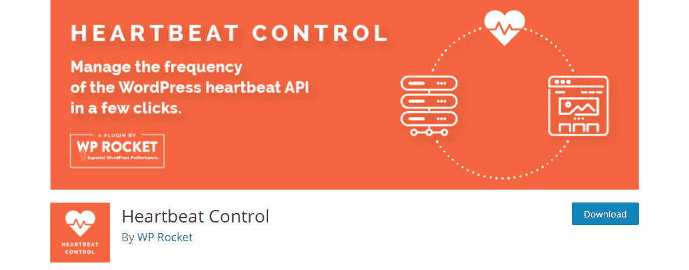

The Heartbeat Control plugin

安装并激活心跳控制插件后，你可以在 WordPress 仪表盘、站点前端和文章编辑器上管理心跳 API 的频率。

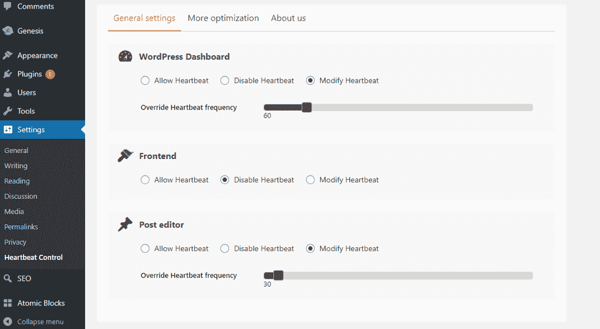

Heartbeat Control plugin’s ‘General settings’ dashboard

如果你的服务器有有限的 CPU 资源，我建议你在 WordPress 仪表盘和前端禁用心跳。您还可以**修改“帖子编辑器”选项的心跳**频率，并将其增加到 30 秒(甚至 60 秒)。频率越高，节省的服务器资源就越多。

您必须使用的确切设置将因网站而异。如果你不确定该用什么，你可以[咨询你的网络开发者](https://kinsta.com/blog/hire-wordpress-developer/)。
T3】

### DDoS 攻击或垃圾邮件机器人导致的高流量

用 DDoS 攻击或垃圾邮件机器人淹没你的网站也会导致高使用率。然而，这种攻击并不一定针对日益增长的管理 Ajax 请求。这只是附带损害。

如果你的网站受到 DDoS 攻击，你的首要任务应该是让它隐藏在强大的 CDN/WAF 之后，比如 [Cloudflare](https://kinsta.com/knowledgebase/install-cloudflare/) 或 [Sucuri](https://kinsta.com/blog/sucuri-firewall/) 。Kinsta 的每个托管计划都包括免费的 Cloudflare 集成和 [Kinsta CDN](https://kinsta.com/help/kinsta-cdn/) ，这可以在很大程度上帮助您卸载网站的资源。

要了解更多关于如何保护您的网站免受此类恶意攻击的信息，您可以参考我们的[关于如何阻止 DDoS 攻击的深度指南](https://kinsta.com/blog/ddos-attack/)。

[If you're seeing a slowed down server and website, it may be due to too many Ajax requests. ⏳ Get ready to diagnose and fix it with this guide!Click to Tweet](https://twitter.com/intent/tweet?url=https%3A%2F%2Fkinsta.com%2Fblog%2Fadmin-ajax-php%2F&via=kinsta&text=If+you%27re+seeing+a+slowed+down+server+and+website%2C+it+may+be+due+to+too+many+Ajax+requests.+%E2%8F%B3+Get+ready+to+diagnose+and+fix+it+with+this+guide%21&hashtags=Ajax%2CWordPressTips)

## 摘要

WordPress 在其 Heartbeat API 中使用 Ajax 来实现许多核心特性。但是，如果使用不当，它会导致加载时间增加。这通常是由于对`**admin-ajax.php**`文件的高频率请求造成的。

在本文中，您了解了高`**admin-ajax.php**`使用率的各种原因，如何诊断造成这种症状的原因，以及如何修复它。在大多数情况下，遵循这个指南应该可以让您的网站立即恢复正常运行。

然而，在某些情况下[升级到具有更高资源的服务器](https://kinsta.com/plans/)是唯一可行的解决方案。尤其是对于电子商务和会员网站等要求苛刻的用例。如果你正在运行这样一个网站，考虑升级到一个有管理的 [WordPress 主机](https://kinsta.com/blog/fastest-wordpress-hosting/)，他有处理这类性能问题的经验。

如果你还在为你的 WordPress 网站上的高【admin-ajax.php】*使用率而苦恼，请在评论区告诉我们。*

* * *

让你所有的[应用程序](https://kinsta.com/application-hosting/)、[数据库](https://kinsta.com/database-hosting/)和 [WordPress 网站](https://kinsta.com/wordpress-hosting/)在线并在一个屋檐下。我们功能丰富的高性能云平台包括:

*   在 MyKinsta 仪表盘中轻松设置和管理
*   24/7 专家支持
*   最好的谷歌云平台硬件和网络，由 Kubernetes 提供最大的可扩展性
*   面向速度和安全性的企业级 Cloudflare 集成
*   全球受众覆盖全球多达 35 个数据中心和 275 多个 pop

在第一个月使用托管的[应用程序或托管](https://kinsta.com/application-hosting/)的[数据库，您可以享受 20 美元的优惠，亲自测试一下。探索我们的](https://kinsta.com/database-hosting/)[计划](https://kinsta.com/plans/)或[与销售人员交谈](https://kinsta.com/contact-us/)以找到最适合您的方式。