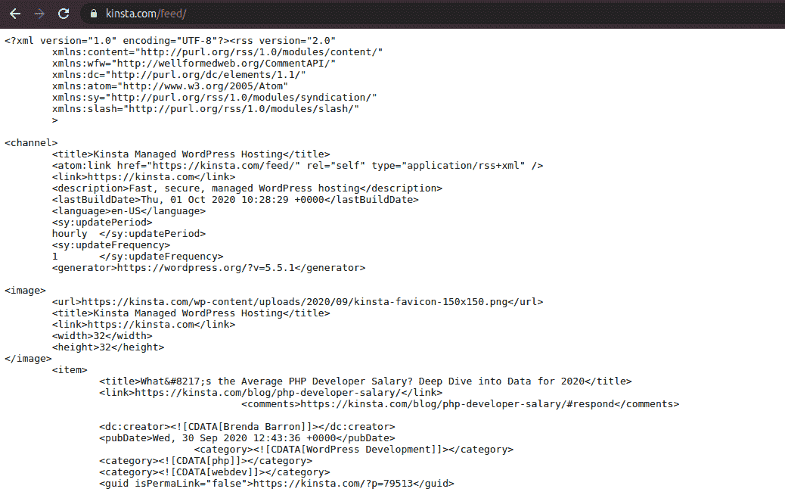
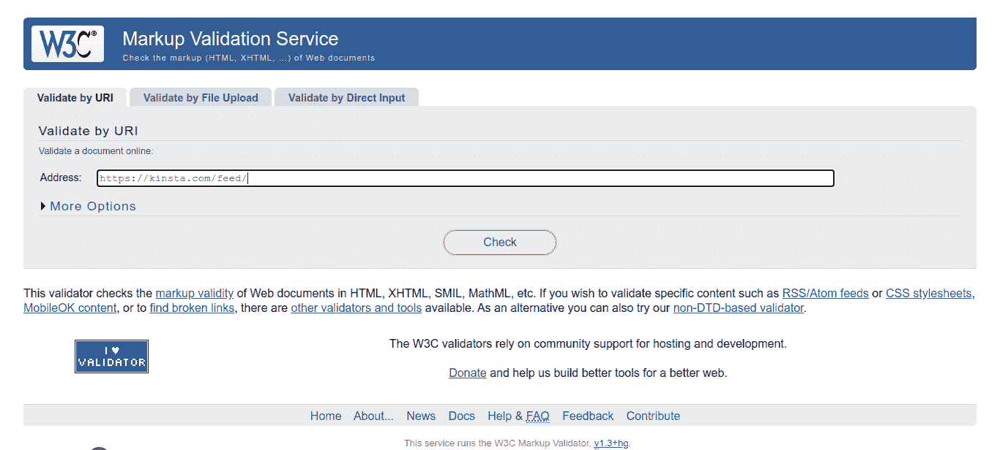
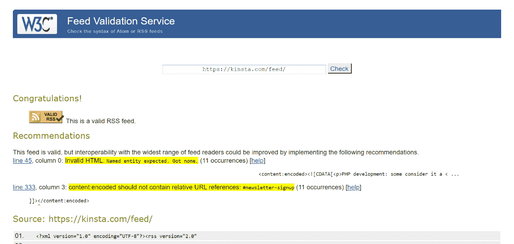
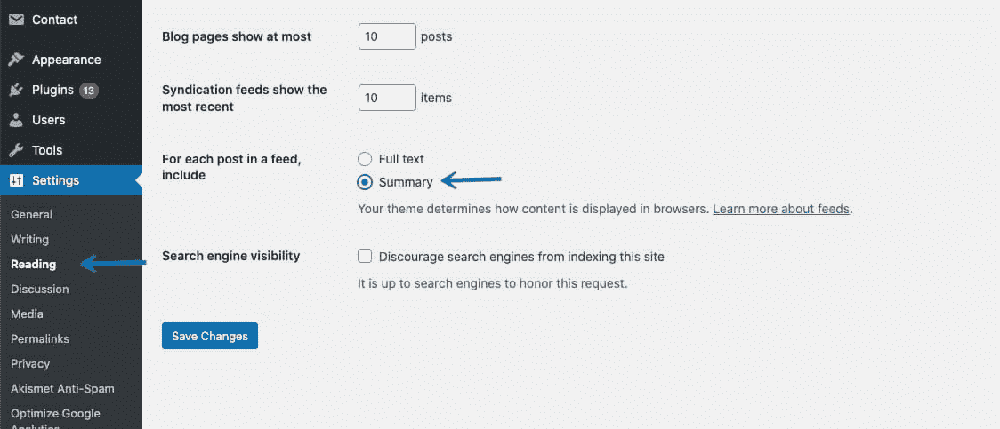
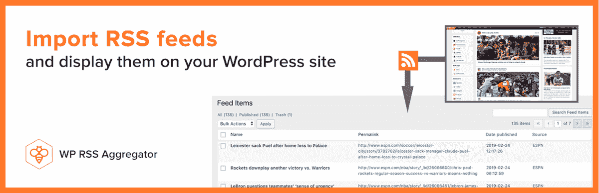
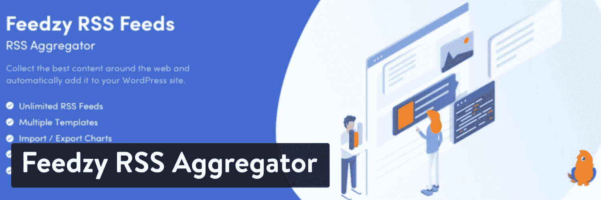
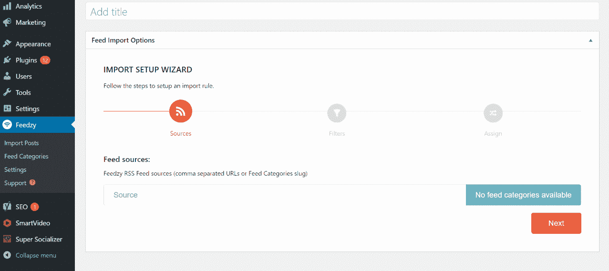
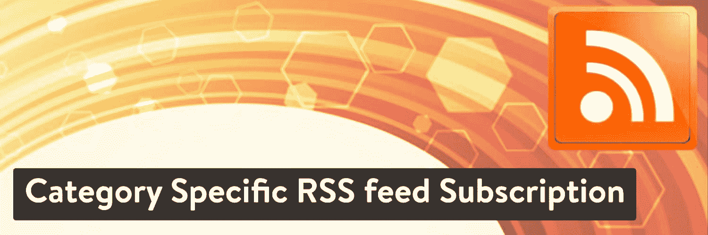

# 4 个方便的 WordPress RSS Feed 插件(RSS Feed 还没死)

> 原文：<https://kinsta.com/blog/wordpress-rss-feed/>

要跟上所有你喜欢的网站的内容可能会很棘手。即使在使用书签时，一个接一个地访问网站以查看它们的最新更新也是非常耗时的。

这就是 RSS 提要派上用场的地方。一次性订阅网站的 RSS 源使您能够自动接收所有后续发布的更新。

根据你的阅读器应用程序，你甚至可以通过电子邮件或移动设备接收通知。另外，WordPress RSS feed 插件可以让你在自己的网站上聚合所有的内容。

在本文中，我们将讨论什么是 RSS 以及它为什么重要。然后我们将看看 RSS 提要在 WordPress 中是如何工作的。我们将向您展示如何启用或禁用它们，如何检查它们是否工作，并介绍一些添加新功能的插件。

我们开始吧！

## 什么是 RSS(为什么它很重要)？

RSS(真正简单的联合供稿)使网站和博客能够以 XML 格式发布他们的最新内容。这可以包含整篇文章或摘要，以及元数据，如日期和作者。

您的 RSS 订阅源使任何订阅它的人能够将您的网站和许多其他网站的内容聚合在一起。


> Kinsta 把我宠坏了，所以我现在要求每个供应商都提供这样的服务。我们还试图通过我们的 SaaS 工具支持达到这一水平。
> 
> <footer class="wp-block-kinsta-client-quote__footer">
> 
> 
> 
> <cite class="wp-block-kinsta-client-quote__cite">Suganthan Mohanadasan from @Suganthanmn</cite></footer>

[View plans](https://kinsta.com/plans/)

你可能会把这个过程比作订阅 YouTube 频道和在一个地方接收每个频道的最新内容更新通知。

谷歌在 2012 年关闭了广受欢迎的 FeedBurner 服务，这可能会让一些人认为 RSS 订阅已经死亡。但事实上，有很多优秀的 feed 阅读器，比如 [Feedly](https://feedly.com) 或者[老阅读器](https://theoldreader.com/)。

Feedly 可用于网络、iOS、Android 和 Kindle。旧款阅读器也可用于网络，尽管它没有原生应用，但它的[用户已经使用它的 API 创建了几个](https://theoldreader.com/pages/apps)。

除了让自己保持最新状态之外，订阅源还可以用于许多目的，例如将内容从一个网站导入到另一个网站等等:

*   从网上商店采购产品和服务类别。
*   跟踪外汇汇率和股票价格。
*   使用 [podcast-only RSS feeds](https://kinsta.com/blog/wordpress-podcast/) 将音频内容推送到不同的收听平台。
*   汇总各种在线商店的最新优惠券或折扣优惠。
*   许多博客写手和有影响力的人使用 RSS 来获取信息。当他们找到一个好的，他们会分享或链接到你的博客或社交媒体资料。
*   RSS 订阅可以帮助谷歌更频繁地抓取你的网站。
*   RSS 源可以为你的网站带来更多的访问者。当有人订阅你的新闻源时，他们会无意中发现你所有的博客文章。如果他们看到一个好的，他们会访问你的网站，详细阅读或作出评论
*   **自动化电子邮件营销活动**。例如， [MailChimp](https://kinsta.com/blog/how-to-use-mailchimp/) 有一个 RSS 转电子邮件活动，当你发布新帖子时，它会自动给你的订阅者发邮件。
*   每次发布新帖时，您还可以使用 RSS 源更新您的[社交媒体档案](https://kinsta.com/blog/wordpress-social-media-plugins/)。几乎所有流行的帖子安排和社交媒体管理工具都提供 RSS 提要集成。
*   您可以将您的 RSS 源提交到 RSS 目录或内容聚合网站。
*   您还可以在您的网站上设置一个页面或部分，包含来自外部来源的聚合内容。
*   您可以**在您的网站**上自动发布新的联合内容。

作为一个额外的例子，我们在 Kinsta 使用 RSS feed 的一种方式是利用免费的 [Slack RSS feed 应用程序](https://slack.com/apps/A0F81R7U7-rss)。我们[每天使用 Slack](https://kinsta.com/blog/how-to-use-slack/) 与我们的远程团队成员交流。

通过自动将 RSS 订阅到频道中，我们可以轻松地跟踪网络上发布的新内容，以及新的软件版本

[在跟踪您最喜爱的网站上的所有内容时遇到困难？🤯输入 RSS 源。学习如何用这些简单的插件设置一个⬇️ 点击推文](https://twitter.com/intent/tweet?url=https%3A%2F%2Fkinsta.com%2Fblog%2Fwordpress-rss-feed%2F&via=kinsta&text=Having+trouble+keeping+track+of+all+the+content+from+your+favorite+sites%3F+%F0%9F%A4%AF+Enter%2C+the+RSS+feed.+Learn+how+to+set+one+up+with+these+easy+plugins+%E2%AC%87%EF%B8%8F&hashtags=blogging%2CWPTips)


## WordPress 有 RSS 提要吗(你如何找到它们)？

WordPress 为你的网站生成多种内置 RSS 源。如前所述，这通常以 XML 格式完成，每次发布新内容时都会创建一个文档。

要查看您的订阅源，您只需在网站地址的末尾添加 */feed* 即可。

例如，如果你的站点是*www.document.com*，你的提要将被发布在*www.document.com/feed*。以下是 Kinsta.com*的情况:*



A sample RSS feed displayed in XML.


提要是为您的类别和标签以及评论生成的。此外，您可以有多个字段，如下所示:

*   http://example.com/feed/
*   http://example.com/feed/rss/
*   http://example.com/feed/rss2/
*   http://example.com/feed/rdf/
*   http://example.com/feed/atom/

但是，您的主要提要通常位于第一个地址。

## 如何检查和查看 RSS 源是否工作正常

您自己的网站有一个提要，但是您也可以在您的内容中包含其他网站的提要。

但是，在这样做之前，您首先需要验证每个外部提要。你可以使用浏览器或在线工具。


### 在浏览器中测试提要 URL

要使用浏览器验证提要，只需复制提要的 [URL](https://kinsta.com/knowledgebase/what-is-a-url/) 并将其粘贴到地址栏中:


Testing a sample RSS feed in the browser.


您应该会看到以原始 XML 格式显示的提要。

### 使用 W3C 验证器进行测试

测试提要有效性的另一种方法是使用 [W3C 验证器](https://validator.w3.org/feed/)。将提要 URL 粘贴到提供的输入框中，然后点击**查看**:



The W3C Feed Validation service.


在下一页上，您应该看到提要是否有效:



Validating a feed URL with the W3C tool.


你也可能会得到一些为读者优化提要的建议(如果它属于你的话)。


## 如何优化你的 RSS 源

您的 RSS 源可以让用户了解您的最新内容。因此，您会希望优化它以便于使用，这可以增加您的订阅量。

做到这一点的一个技巧是在你的提要中显示摘要，而不是完整的文章。这可以确保读者访问您的网站来阅读内容。

WordPress 为此提供了一个内置设置。您可以简单地导航到**设置>阅读**，并选择*下的**摘要**来查看提要中的每篇文章，显示*。



Setting up your RSS feed in WordPress


您还可以让用户订阅特定的类别[或标签](https://kinsta.com/knowledgebase/wordpress-tags/)，方法是使用[，这是在下一节中介绍的特定于类别的 RSS 订阅插件](https://wordpress.org/plugins/category-specific-rss-feed-menu/)。

此外，如果你运行一个多作者的博客，你可以给读者订阅他们最喜欢的作者的选项。

作者的提要如下所示:

*   http://example.com/author/matteo/feed/

你甚至可以让你的作者在他们的个人简介或者电子邮件签名中加入链接。

## 注册订阅时事通讯


### 想知道我们是怎么让流量增长超过 1000%的吗？

加入 20，000 多名获得我们每周时事通讯和内部消息的人的行列吧！

[Subscribe Now](#newsletter)

## 4 个方便的 WordPress RSS Feed 插件

尽管 WordPress 默认提供了 RSS 提要，并提供了显示它们的方法，插件可以提供更多的灵活性。让我们来看看四个可靠的选择。

### 1.WP RSS 聚合器

拥有超过 60，000 个活跃安装， [WP RSS 聚合器](https://www.wprssaggregator.com/)是 WordPress 最受欢迎的 RSS 提要插件。您将能够从无限数量的网站导入无限数量的帖子、YouTube 视频、列表和播客剧集，为您的网站提供新的精选内容。



WP RSS Aggregator


使用 WP RSS 聚合器的免费版本,您将能够:

*   创建显示其他网站内容链接的源
*   从单个页面管理您的 RSS 源
*   使用短代码或块显示您的提要
*   使用动作和过滤挂钩扩展插件的功能

使用[高级版](https://www.wprssaggregator.com/pricing/)，您还可以:

*   自定义模板以匹配您的网站设计
*   将 RSS 源导入 WordPress 文章或自定义文章类型
*   基于关键字、短语和/或标签过滤内容
*   使用 WP RSS 聚合器的全文服务完整导入内容
*   对你的资源进行分类，使它们有条理
*   将插件连接到第三方内容旋转服务，如 [WordAi](https://www.wprssaggregator.com/extension/wordai/?utm_source=wordpress-dot-org&utm_medium=readme&utm_campaign=readme_cat_link&utm_content=cat_link) 和 [Spinner Chief](https://www.wprssaggregator.com/extension/spinnerchief/?utm_source=wordpress-dot-org&utm_medium=readme&utm_campaign=readme_cat_link&utm_content=cat_link)

一旦你在 WordPress 网站上安装了 WP RSS 聚合器，你需要做的就是添加一个 feed 源，插件会处理剩下的事情。


Add a new feed source


### 2.Feedzy RSS 源

Feedzy 是目前最好的 WordPress RSS 提要插件之一。它使您能够在站点上导入和显示无限数量的提要。你可以用它在网上发布精选的内容来实现博客的自动化。



The Feedzy RSS Feeds WordPress plugin.


Feedzy 免费版提供的一些关键功能包括:

*   将订阅源项目转换为页面、帖子和自定义帖子类型
*   使用块、短代码或小部件显示提要
*   缓存提要以提高加载速度
*   显示带有订阅源项目的图像

使用[高级版](https://themeisle.com/plugins/feedzy-rss-feeds/)，您还可以:

*   使用关键字过滤器导入特定内容
*   为每个提要设置多个模板
*   自动从不同来源导入多个提要(在免费版本中手动完成)
*   自动将代销商或推荐人 id 添加到您的订阅源链接

一旦 Feedzy 被安装并激活，你会想要导航到 **Feedzy >导入文章**。然后你可以点击**导入帖子**选项:

需要一个给你带来竞争优势的托管解决方案吗？Kinsta 为您提供了令人难以置信的速度、一流的安全性和自动伸缩功能。[查看我们的计划](https://kinsta.com/plans/?in-article-cta)



Importing posts from RSS feeds with Feedzy.


您现在可以开始将提要导入到您的站点。

### 3.RSSImport


The RSSImport WordPress plugin.


和 Feedzy 一样， [RSSImport](https://wordpress.org/plugins/rss-import/) 可以让你将提要导入到你的 WordPress 站点。您可以通过小部件、短代码或 PHP 来使用它。

这个工具通过包含的短代码提供了很大的灵活性，为定制它们提供了许多参数。以下是您可能会创建的示例:

`[RSSImport display="25" feedurl="https://kinsta.com/feed/" use_simplepie="true"]`

你也可以在主题模板中添加一些 PHP 代码，比如*sidebar.php*或者【single.php】T2。例如:

```
<!--?php RSSImport(10, 'https://kinsta.com/feed/'); ?-->
```

要显示您的订阅源，您可以将您的短代码复制并粘贴到帖子或页面的任何位置。

### 4.特定类别的 RSS 源订阅



The Category-Specific RSS Feed Subscription WordPress plugin.


特定类别的 RSS 订阅不同于我们目前考虑的其他插件。它允许你的用户在订阅内容上有更大的灵活性，这是基于你的分组来实现的。例如，如果您发布多个类别的内容，如“航空”、“可再生能源”和“电影”，您的用户可以选择只订阅其中一个或全部内容。

此插件使您能够:

*   创建特定类别的 RSS 源
*   创建特定于标签的订阅源菜单
*   在你的文章旁边显示每个标签的 RSS 源
*   将自定义类别指向外部源

安装这个插件后，你需要导航到**设置>特定类别的 RSS** 来查看所有你可以创建订阅源的类别列表。然后，您可以使用小部件、短代码和几行 PHP 将提要菜单添加到您的站点。

## 如何在 WordPress 中禁用 RSS 源

尽管 RSS 提要很方便，但您可能并不需要它，或者您可能只是不想要维护它的额外开销。

在这种情况下，你可以选择[通过使用插件或者](https://kinsta.com/knowledgebase/wordpress-disable-rss-feed/)[编辑你当前的主题](https://kinsta.com/blog/how-to-customize-wordpress-theme/)来禁用你的 feed 。

### 使用插件

像[禁用提要](https://wordpress.org/plugins/disable-feeds/)这样的插件可以很方便地禁用你网站上的所有提要。它通过重定向请求来删除所有 RSS、Atom 和 RDF 提要。

注意，已经三年没更新了。然而，在最新版本的 WordPress 上使用它应该不会有任何问题。

禁用订阅源只会删除订阅源本身。您的主题、侧边栏和页脚小部件可能仍然包含指向它的链接。

### 编辑你的 WordPress 主题

在 WordPress 中禁用 RSS 订阅的第二种方法是编辑你当前主题的*functions.php*文件。您需要导航到**外观>主题编辑器**，并在右边的文件浏览器中搜索函数文件:

然后您可以将代码后面的[粘贴到文件的末尾:](https://wordpress.stackexchange.com/questions/162811/how-to-secure-or-disable-the-rss-feeds)

```
add_action('do_feed', 'itsme_disable_feed', 1);
add_action('do_feed_rdf', 'itsme_disable_feed', 1);
add_action('do_feed_rss', 'itsme_disable_feed', 1);
add_action('do_feed_rss2', 'itsme_disable_feed', 1);
add_action('do_feed_atom', 'itsme_disable_feed', 1);
add_action('do_feed_rss2_comments', 'itsme_disable_feed', 1);
add_action('do_feed_atom_comments', 'itsme_disable_feed', 1);
```

完成后，不要忘记保存您的更改。

[Keep your website's content streamlined with easy to use RSS feed plugins. ✅ Learn how to optimize them right here 👩‍💻Click to Tweet](https://twitter.com/intent/tweet?url=https%3A%2F%2Fkinsta.com%2Fblog%2Fwordpress-rss-feed%2F&via=kinsta&text=Keep+your+website%27s+content+streamlined+with+easy+to+use+RSS+feed+plugins.+%E2%9C%85+Learn+how+to+optimize+them+right+here+%F0%9F%91%A9%E2%80%8D%F0%9F%92%BB&hashtags=RSS%2CBlogger)

## 摘要

WordPress 默认提供了一个 RSS 源，你可以很容易地访问你的。借助其他插件选项，如 Feedzy RSS Feeds、RSSImport、特定类别 RSS Feed 订阅和 WP RSS 聚合器，您可以对其进行更多控制。

正如我们所看到的，RSS 提要在很多情况下都是有用的……所以它们还远没有消亡！

你对我们列表上的 RSS 提要插件有什么问题吗，以及如何充分利用它们？请在下面的评论区告诉我们！

* * *

让你所有的[应用程序](https://kinsta.com/application-hosting/)、[数据库](https://kinsta.com/database-hosting/)和 [WordPress 网站](https://kinsta.com/wordpress-hosting/)在线并在一个屋檐下。我们功能丰富的高性能云平台包括:

*   在 MyKinsta 仪表盘中轻松设置和管理
*   24/7 专家支持
*   最好的谷歌云平台硬件和网络，由 Kubernetes 提供最大的可扩展性
*   面向速度和安全性的企业级 Cloudflare 集成
*   全球受众覆盖全球多达 35 个数据中心和 275 多个 pop

在第一个月使用托管的[应用程序或托管](https://kinsta.com/application-hosting/)的[数据库，您可以享受 20 美元的优惠，亲自测试一下。探索我们的](https://kinsta.com/database-hosting/)[计划](https://kinsta.com/plans/)或[与销售人员交谈](https://kinsta.com/contact-us/)以找到最适合您的方式。