# 如何修复您网站上的 504 网关超时错误

> 原文:[https://kinsta.com/blog/504-gateway-timeout/](https://kinsta.com/blog/504-gateway-timeout/)

**504 网关超时**错误是网站所有者和网站访问者面临的最常见的 HTTP **5xx** 错误之一。对于许多 [WordPress 博客](https://kinsta.com/blog/best-blogging-platform/)和[电子商务平台](https://kinsta.com/blog/ecommerce-platforms/)来说，知道如何修复这样的服务器错误对于防止他们辛苦赚来的访问者跳转到竞争对手的网站至关重要。

由于 504 网关超时错误没有告诉您为什么会发生，所以很难查明是什么导致了服务器超时。本文将帮助您详细了解它，学习如何诊断其原因，然后修复它。

在尝试了帖子中提到的各种解决方案之后，你的网站应该很快就可以运行了。

听起来很有趣？让我们开始吧！

<kinsta-auto-toc heading="Table of Contents" exclude="last" list-style="arrow" selector="h2" count-number="-1">[The 504 Gateway Timeout error is one of the most common HTTP 5xx errors faced by website owners and site visitors. 🤔 Learn how to fix it with this guide quickly. ⬇️Click to Tweet](https://twitter.com/intent/tweet?url=https%3A%2F%2Fkinsta.com%2Fblog%2F504-gateway-timeout%2F&via=kinsta&text=The+504+Gateway+Timeout+error+is+one+of+the+most+common+HTTP+5xx+errors+faced+by+website+owners+and+site+visitors.+%F0%9F%A4%94+Learn+how+to+fix+it+with+this+guide+quickly.+%E2%AC%87%EF%B8%8F&hashtags=WPTips%2C504Error)

### 更喜欢看[视频版](https://www.youtube.com/watch?v=QluD2sO1fco)？

<kinsta-video src="https://www.youtube.com/watch?v=QluD2sO1fco"></kinsta-video>

<link rel="stylesheet" href="https://kinsta.com/wp-content/themes/kinsta/dist/components/ctas/cta-mini.css?ver=2e932b8aba3918bfb818">


## 什么是 504 网关超时错误？

每次你在浏览器中访问一个网站，浏览器都会向托管该网站的 web 服务器发送一个请求。服务器处理请求，并使用请求的资源进行响应。

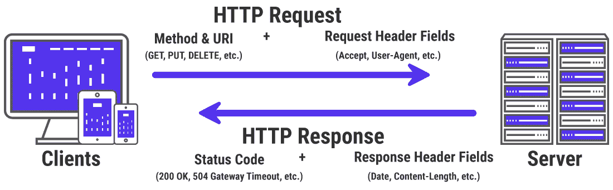

How HTTP requests and responses work.


服务器响应包括许多 HTTP 状态代码中的一个[，以向浏览器指示响应的状态。但并非所有这些 HTTP 状态代码都是错误。例如，](https://kinsta.com/blog/http-status-codes/) [200 OK 状态代码](https://kinsta.com/blog/http-status-codes/#200-status-codes)意味着服务器成功处理了请求，“一切正常”

HTTP 状态码的 [5xx 类表示服务器有问题，服务器知道，它不能执行客户端请求。因此，它们也被称为**服务器错误 5xx** 状态代码。](https://kinsta.com/blog/http-status-codes/#500-status-codes)

官方上，在 5xx 类下指定了五个状态代码( [500](https://kinsta.com/blog/500-internal-server-error/) 、 [501](https://kinsta.com/knowledgebase/501-not-implemented-error/) 、 [502](https://kinsta.com/blog/502-bad-gateway/) 、 [503](https://kinsta.com/blog/http-error-503/) ，504)。你也可能遇到许多非官方的代码( [506，507，509](https://documentation.cpanel.net/display/CKB/HTTP+Error+Codes+and+Quick+Fixes#HTTPErrorCodesandQuickFixes-Errors) ， [520](https://kinsta.com/knowledgebase/error-520/) 等等。).

互联网工程任务组(IETF)将 504 网关超时错误定义为:

> *504(网关超时)状态代码表示服务器在充当网关或代理时，没有从需要访问以完成请求的上游服务器收到及时的响应。*

为了进一步简化，当两个服务器参与处理一个请求时，就会出现这个错误。第一台服务器(通常是主服务器)超时，等待第二台服务器(上游服务器)的响应。

504 网关超时错误有多种表现形式。以下是它通常出现的一些方式:


The ‘HTTP ERROR 504’ in the Chrome browser.


504 网关超时错误类似于 [502 坏网关错误](https://kinsta.com/blog/502-bad-gateway/)，表示第一台服务器收到第二台服务器(上游服务器)的无效响应。


The ‘504 GATEWAY TIMEOUT’ status code in Chrome DevTools.


 <kinsta-advanced-cta language="en_US" type-int-post="14340" type-int-position="3">### 504 网关超时错误的变体

浏览器会在其中显示任何 504 网关超时错误，就像任何其他错误一样。由于存在各种操作系统、web 服务器、浏览器和用户代理，它可以以多种方式出现。

以下是您可能遇到的一些常见的 504 错误信息变体:

*   504 网关超时
*   504 网关超时 NGINX
*   NGINX 504 网关超时
*   网关超时错误
*   错误 504
*   HTTP 错误 504
*   HTTP 错误 504 —网关超时
*   HTTP 504
*   504 错误
*   网关超时(504)
*   此页面不起作用—域响应时间太长
*   504 网关超时—服务器没有及时响应
*   页面请求被取消，因为完成时间太长
*   站点访问者:服务您的请求时出现问题，请几分钟后重试。
*   网站所有者:网关超时。有关详细信息，您应该查看错误日志。
*   空白的白色屏幕

所有上述错误响应，尽管措辞不同，都指向同一个 504 网关超时服务器错误。

Web 服务器和网站可以自定义如何向用户显示 504 网关超时错误。有的还可以很酷！这是消除来访者失望情绪的绝佳策略。

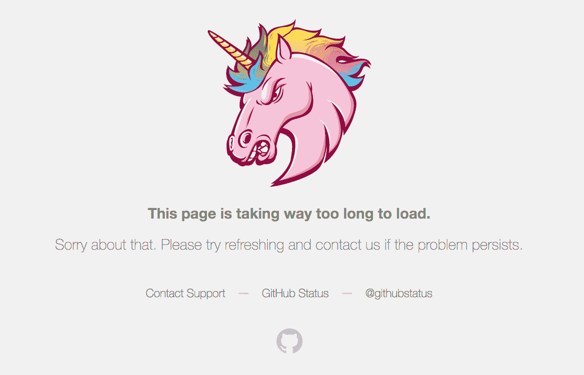

GitHub’s customized HTTP 504 error page.


### 504 网关超时错误对 SEO 的影响

所有 5xx 错误都会阻止网页加载，对用户体验造成不利影响。因此，像谷歌这样的搜索引擎非常重视这些错误。如果错误持续很长时间，甚至可能导致网页从搜索引擎结果中去索引。

例如，当谷歌蜘蛛偶然发现一个 [503 服务不可用](https://kinsta.com/blog/http-error-503/)错误时，他们会明白这是一个临时问题，因为它主要用于[启用站点维护模式](https://kinsta.com/blog/wordpress-maintenance/)。因此，他们稍后会再次尝试抓取该页面。

504 网关超时错误不一定是暂时的，因为它可能是由多种原因造成的。如果[你的网站宕机](https://kinsta.com/blog/website-downtime/)仅仅几分钟，并且如果蜘蛛试图每分钟多次抓取它，他们会试图从缓存中提供页面。他们甚至不会注意到它。

但是如果你的网站宕机超过 6 小时，那么谷歌会认为 504 错误是一个严重的网站问题，你需要尽快修复。这可能会对你的搜索引擎优化产生负面影响。

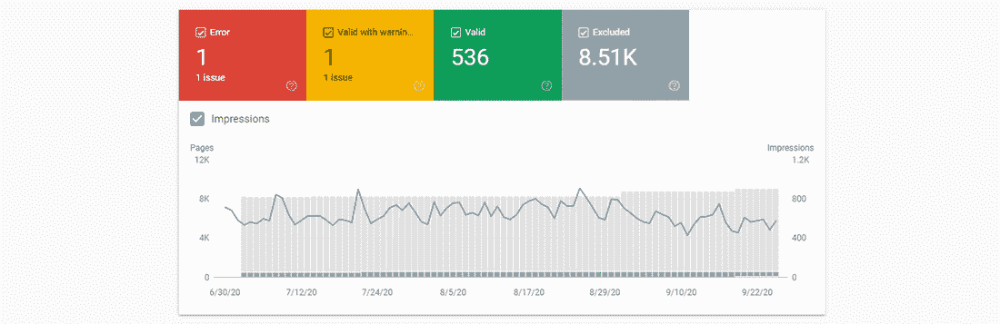

Viewing the crawl errors in Google Search Console


[谷歌搜索控制台](https://kinsta.com/blog/google-search-console/)是[最好的搜索引擎优化工具](https://kinsta.com/blog/wordpress-seo/)之一，用来监控你网站的 HTTP 5xx 错误。

### 504 网关超时错误的原因

由于 504 错误是由于服务器之间的超时，问题可能不是与客户端的设备或互联网连接。这也包括您的设备和连接。

504 网关超时错误表示 web 服务器等待另一台服务器响应的时间过长，并且“超时”超时可能有多种原因:另一台服务器运行不正常、过载或停机。

其他服务器不必总是外部的(例如 [CDN](https://kinsta.com/help/kinsta-cdn/) ，API 网关)。它也可以是主 web 服务器内的类似服务器的实体(例如，[反向代理服务器](https://kinsta.com/blog/reverse-proxy/)，数据库服务器)。
<kinsta-advanced-cta language="en_US" type-int-post="14340" type-int-position="4"></kinsta-advanced-cta>

## 如何修复 504 网关超时错误

如果不知道网站的具体细节，比如服务器配置、[托管计划](https://kinsta.com/plans/)、第三方插件以及它吸引的[流量](https://kinsta.com/blog/how-to-drive-traffic-to-your-website/)，你可能会发现修复一个 504 网关超时错误是令人沮丧和难以承受的。

由于涉及到许多变量，我建议您从修复客户端问题开始，这是非常罕见的，然后再修复服务器端问题。他们通常是 504 错误的罪魁祸首。

1.  [尝试重新加载网页](https://kinsta.com/blog/504-gateway-timeout/#try-reloading-the-webpage)
2.  [重启网络设备](https://kinsta.com/blog/504-gateway-timeout/#reboot-your-network-devices)
3.  [检查您的代理设置](https://kinsta.com/blog/504-gateway-timeout/#check-your-proxy-settings)
4.  [检查 DNS 问题](https://kinsta.com/blog/504-gateway-timeout/#dns-issues)
5.  [暂时禁用您网站的 CDN](https://kinsta.com/blog/504-gateway-timeout/#disable-your-sites-cdn-temporarily)
6.  [检查主机的服务器问题](https://kinsta.com/blog/504-gateway-timeout/#server-issues-check-with-your-host)
7.  [检查垃圾邮件、僵尸程序或 DDoS 攻击](https://kinsta.com/blog/504-gateway-timeout/#spam-bots-or-ddos-attacks)
8.  [修复你损坏的 WordPress 数据库](https://kinsta.com/blog/504-gateway-timeout/#corrupted-wordpress-database)
9.  [检查你网站的插件和主题](https://kinsta.com/blog/504-gateway-timeout/#check-your-sites-plugins-and-themes)
10.  [检查错误日志](https://kinsta.com/blog/504-gateway-timeout/#check-error-logs)
11.  [正确配置 Apache 或 Nginx 设置](https://kinsta.com/blog/504-gateway-timeout/#configure-apache-or-nginx-settings-properly)

### 1.尝试重新载入网页

当遇到 504 网关超时错误时，您可以尝试的第一件事是等待几分钟并尝试重新加载页面。

您可以在大多数浏览器中按下 **F5** 快捷键来刷新/重新加载网页。要在重新加载前移除页面的[浏览器缓存](https://kinsta.com/knowledgebase/how-to-clear-browser-cache/)，可以按 **CTRL+F5** 快捷键组合。

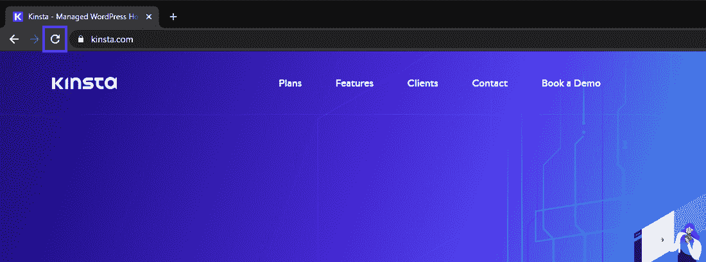

Refreshing a webpage in Chrome browser


当你这样做的时候，你也可以试着在不同的浏览器中加载这个站点来排除这个问题。由于大多数 504 错误是由于临时超载的服务器，使用这个解决方案应该可以让您的网站马上回来。

如果等待和重新加载网站不能解决 504 错误问题，你可以检查一个网站是对所有人关闭还是只对你关闭。测试网站停机时间的两个有用的在线工具是[针对所有人或只针对我](https://downforeveryoneorjustme.com/)和[它现在停机了吗？](https://www.isitdownrightnow.com/)


Testing Kinsta.com on Down for Everyone or Just Me


### 2.重启你的网络设备

有时，调制解调器或路由器等网络设备的问题可能会导致 504 网关超时错误。重新启动这些设备可以帮助您解决问题。

虽然您可以按任何顺序关闭所有这些网络设备，但是重新打开它们的顺序非常重要。通常，按照从互联网服务提供商到您的主客户端设备的连接顺序，从“由外向内”打开这些设备。

### 3.检查您的代理设置

代理服务器位于您的设备和互联网之间。它主要用于通过对网站和网络服务器(例如使用 VPN 的[)隐藏私人信息(例如设备位置)来增强在线隐私。](https://kinsta.com/knowledgebase/technical-questions/#blocked-countries-google-cloud)

虽然代理服务器很少导致 504 错误，但错误的代理服务器设置有时可能是原因。您可以停用代理服务器并尝试重新载入网页，看看它是否会修复错误。

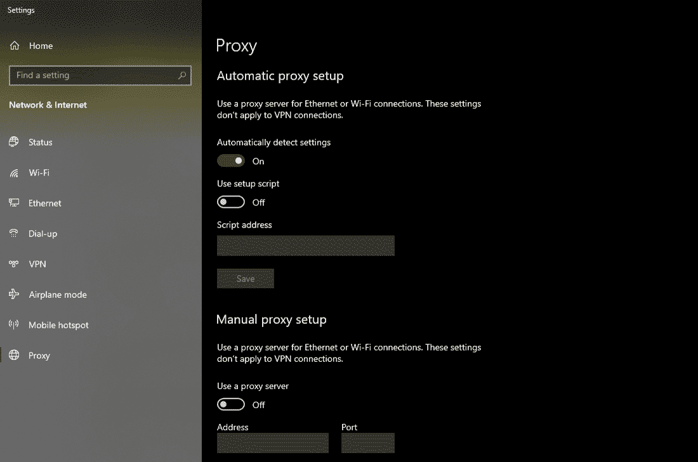

Changing the ‘Proxy’ settings in Windows 10


大多数客户端不使用代理服务，所以如果您确信不使用任何代理服务器，可以跳过这一步。但是，您可能已经设置了它，而您甚至不知道它。我建议你检查你的设备和浏览器的代理设置来排除这个原因。

### 4.检查 DNS 问题

504 网关超时错误也可能是由服务器端和/或客户端的 DNS 问题引起的。

服务器端 DNS 问题最可能的原因是 [FQDN](https://kinsta.com/knowledgebase/fully-qualified-domain-name/) (完全限定域名)没有解析出正确的 IP 地址或者 [DNS 服务器没有响应](https://kinsta.com/knowledgebase/dns-server-not-responding/) 。通常，当您刚刚将站点迁移到新的服务器或主机时，会出现这种情况。因此，等待域的 [DNS 记录完全传播](https://kinsta.com/blog/dns-propagation/)很重要，这可能需要 24 小时。

你可以使用像[whatsmydns.net DNS Checker](https://www.whatsmydns.net/)或 [DNSMap](https://dnsmap.io/) 这样的免费工具来查看你的 DNS 是否已经传播到全球。

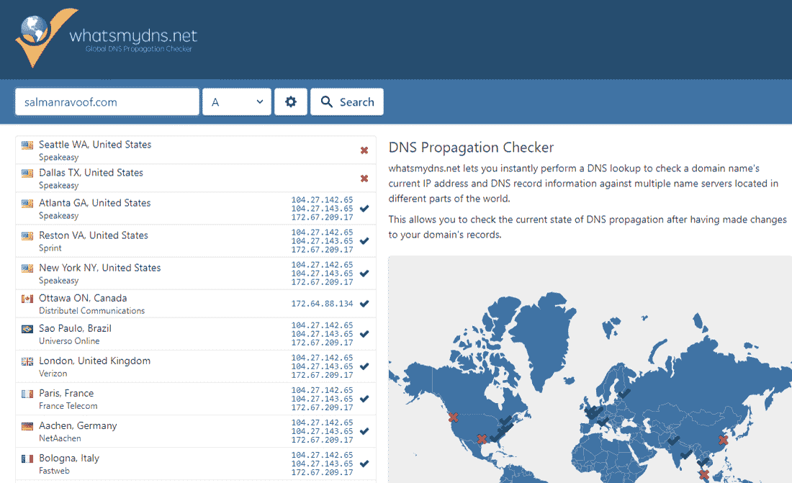

Checking DNS propagation for your domain on whatsmydns.net


为了修复客户端 DNS 问题，您可以尝试[刷新您的本地 DNS 缓存](https://kinsta.com/knowledgebase/flush-dns/)。这就像清除你的浏览器缓存，除了这里，你是从操作系统刷新 DNS 缓存。

如果您使用的是 Windows，可以通过打开命令提示符并输入以下指令来刷新 DNS 缓存:

```
ipconfig /flushdns
```

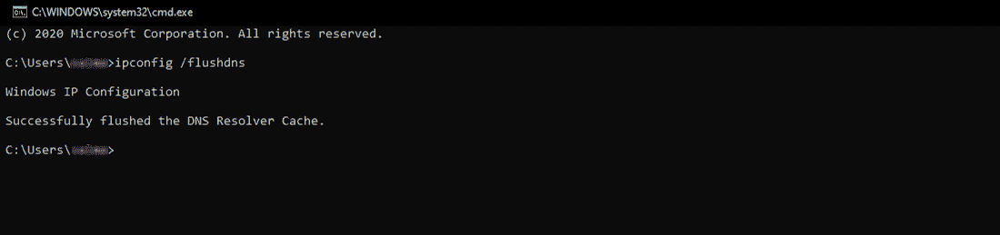

Flushing the DNS Cache with Command Prompt in Windows


您应该会看到“成功刷新 DNS 解析器缓存”如果成功的话。

对于最新的 macOS 版本，您可以打开终端并运行以下命令:

```
sudo killall -HUP mDNSResponder
```

当该过程完成时，您不会在 macOS 中看到任何通知，但您可以通过在命令后附加您的自定义信息来更改这一点。

```
sudo killall -HUP mDNSResponder; DNS Cache was cleared successfully
```

如果您使用的是旧版本的 macOS，您需要输入的命令会因您运行的 macOS 版本而异。更多细节可以参考 Kinsta 的深度 flush DNS 教程中的 [macOS 部分。](https://kinsta.com/knowledgebase/flush-dns/#macos)

如果您使用的是 Linux 操作系统，那么这个过程与 macOS 非常相似，因为即使是 Linux 也使用终端作为它的命令行界面。由于有许多 Linux 发行版，您需要运行的确切命令可能因发行版而异。你可以[查看 Kinsta 的指南](https://kinsta.com/knowledgebase/flush-dns/#linux)了解更多信息。

最后，您可以临时更改客户端 DNS 服务器。默认情况下，您的 ISP 会自动为您分配 DNS 服务器。但是你可以临时把这些改成公共 DNS IPs。

你可以尝试的一些可靠的 DNS 服务器有[谷歌公共 DNS](https://developers.google.com/speed/public-dns) 、[云闪 1.1.1.1](https://1.1.1.1/)、 [Quad9 DNS](https://www.quad9.net/) 和[思科 OpenDNS](https://www.opendns.com/) 。

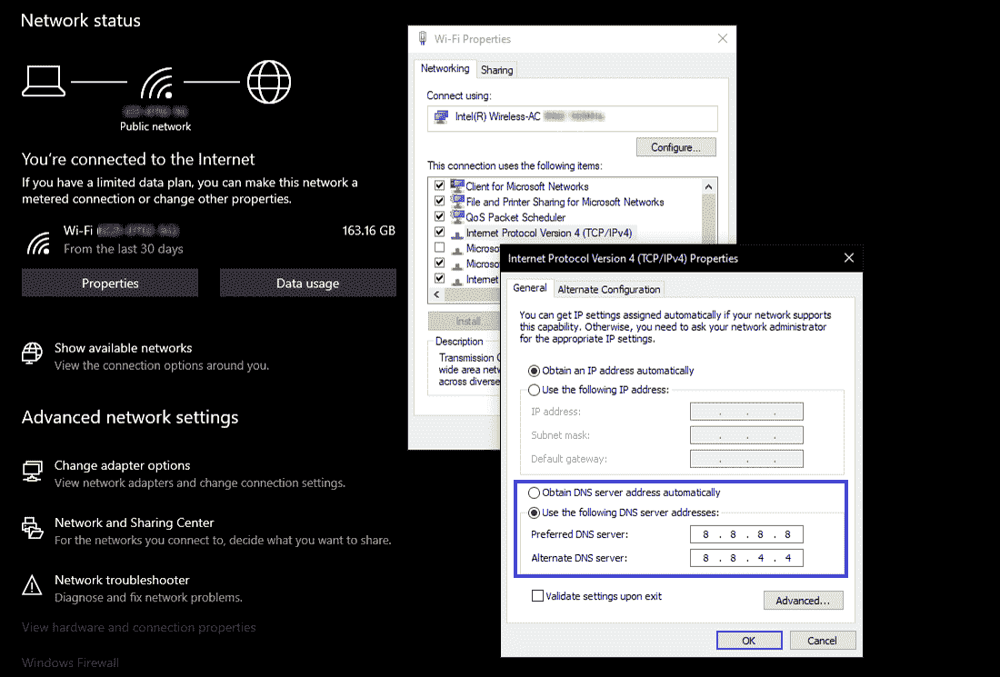

Settings custom DNS servers in Windows 10


 <kinsta-advanced-cta language="en_US" type-int-post="14340" type-int-position="5">### 5.暂时禁用您网站的 CDN

有时，问题也可能出在您的[内容交付网络(CDN)](https://kinsta.com/blog/wordpress-cdn/) 上。如果一个站点的源服务器不可达，大多数 cdn 会尝试从缓存中提供完整的网页。

但是大多数 cdn 默认情况下不启用这个功能，因为在大多数网站上缓存动态资产很复杂[(例如](https://developers.cloudflare.com/cache/best-practices/customize-cache) [WordPress 管理仪表板](https://kinsta.com/knowledgebase/wordpress-admin/))。

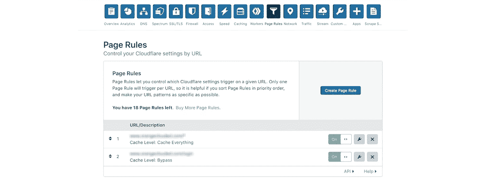

Setting the ‘Cache Everything’ page rule in Cloudflare


解决这个问题的一个简单方法是暂时禁用你的 CDN。例如，如果你正在使用免费的 [CDN Enabler](https://wordpress.org/plugins/cdn-enabler/) WordPress 插件将你的站点资产链接到 CDN URLs，那么你可以停用该插件并测试重新加载你的站点。

这同样适用于使用任何其他插件来连接你的 CDN(例如 WP Rocket，Breeze， [W3 Total Cache](https://kinsta.com/blog/w3-total-cache/) )。

如果你不能访问你站点的管理仪表板，你可以通过 [SFTP](https://kinsta.com/knowledgebase/ftp-vs-sftp/) 重命名插件的文件夹名称来禁用插件。

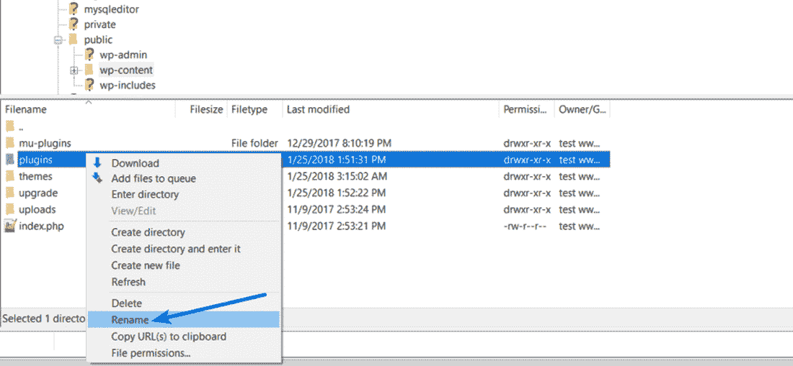

Disable all plugins via SFTP by renaming the plugins folder name


像 [Cloudflare](https://kinsta.com/blog/cloudflare-settings-wordpress/) 或 [Sucuri](https://kinsta.com/blog/sucuri-firewall/) 这样提供完全代理服务的 cdn，在它们的[边缘服务器](https://kinsta.com/knowledgebase/edge-servers/)和你的原始服务器之间有额外的防火墙。因此，在使用 HTTP 5xx 时，您可能会更频繁地遇到这些错误。它们中的大多数[会缓存由您的原始服务器](https://support.cloudflare.com/hc/en-us/articles/115003011431-Troubleshooting-Cloudflare-5XX-errors)返回的 5xx 个错误，因此很容易对它们进行故障排除。

Cloudflare 的免费计划很容易出现 5xx 错误。不幸的是，由于它是一个完全的代理服务，没有快速的方法来禁用它。但是在你责怪 Cloudflare 之前，要知道 Cloudflare 显示了 504 网关超时错误的两种变体[。](https://support.cloudflare.com/hc/en-us/articles/115003011431-What-should-I-do-after-seeing-a-502-or-504-gateway-error-on-my-site-#502504error)

#### 504 cloud flare 网关超时(变体 1)

当您站点的源服务器以标准 HTTP 504 响应进行响应时，Cloudflare 将向您显示自定义的 504 网关超时错误屏幕。

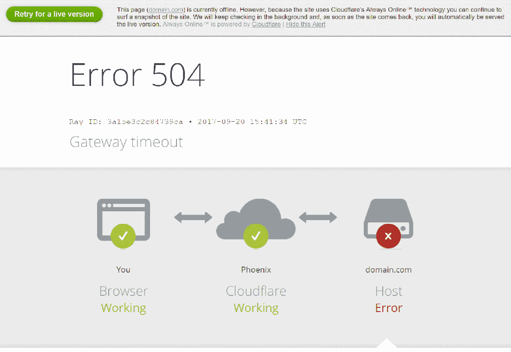

Cloudflare’s custom Error 504 screen


这里，问题在于您的 web 服务器，而不是 Cloudflare。你可以尝试用下面提到的其他解决方案来修复它，或者联系你的[主机提供商支持](https://kinsta.com/kinsta-support/)寻求技术帮助。

#### 504 cloud flare 网关超时(变体 2)

如果 Cloudflare 导致 504 网关超时错误，错误屏幕将显示“cloudflare”，这是当前所有 Cloudflare 资产的标准服务器名称。通常，错误屏幕会如下所示:

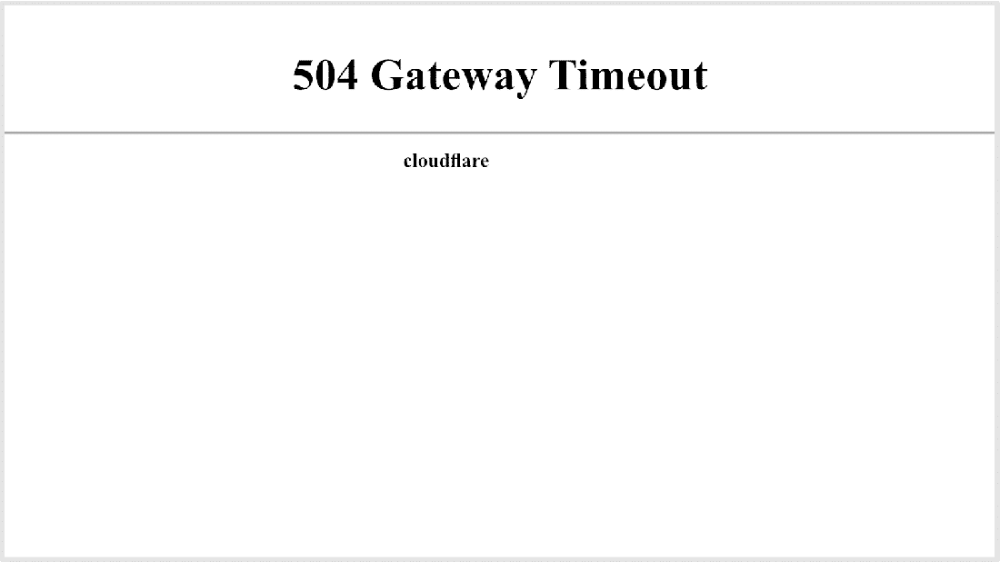

Error screen for 504 Gateway Timeout caused by Cloudflare


由于 Cloudflare 本身没有响应，因此您不会在这里看到任何 Cloudflare 品牌的错误屏幕。

最有可能的是，Cloudflare 已经意识到了这个问题，并且已经在着手修复。您可以通过查看 [Cloudflare 系统状态](https://www.cloudflarestatus.com/)网页来确认这一点。或者，您可以[联系 Cloudflare 支持](https://support.cloudflare.com/hc/en-us/articles/200172476-Contacting-Cloudflare-Support)以获得更快的解决方案。

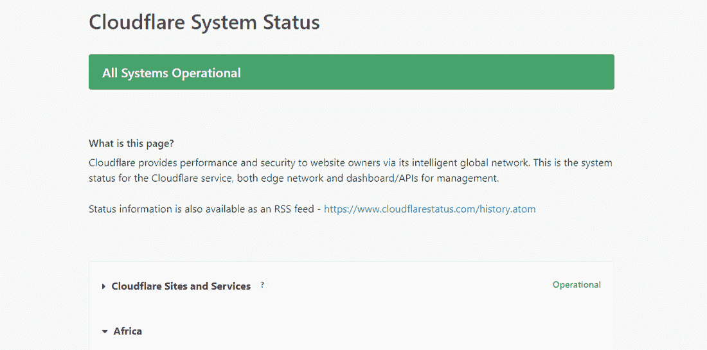

Check Cloudflare System Status at cloudflarestatus.com


#### 504 由于大量上传，Cloudflare 网关超时

你上传到你的站点的[大小也可能是服务器超时的一个原因。](https://kinsta.com/blog/increase-max-upload-size-wordpress/) [Cloudflare 将免费和专业计划的上传文件大小](https://developers.cloudflare.com/cache/about/default-cache-behavior#h_51422705-42d0-450d-8eb1-5321dcadb5bc)(根据 HTTP POST 请求)限制在 100 MB 以内。

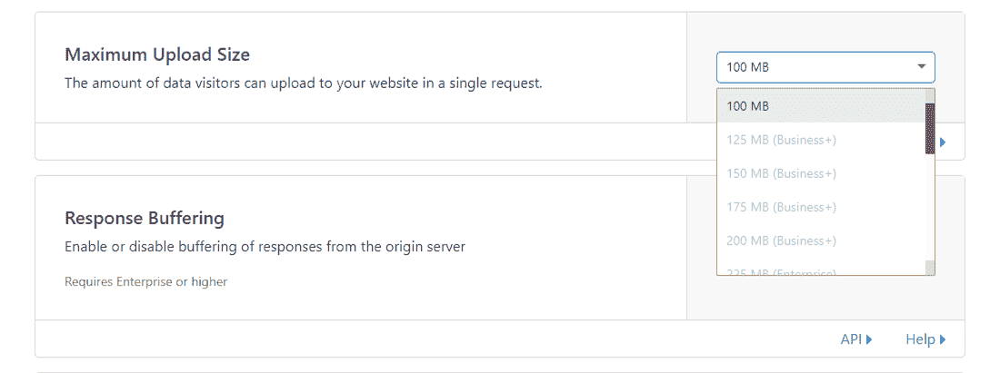

Cloudflare’s ‘Maximum Upload Size’ limits for various plans


问题可能出在主机上，也可能出在 Cloudflare 上。您可以通过使用您的 [DNS 主机文件](https://kinsta.com/knowledgebase/edit-hosts-file/)绕过 Cloudflare 并再次尝试上传来找出确切原因。

如果你在 WordPress 上使用 Cloudflare，我推荐使用他们的[免费插件](https://wordpress.org/plugins/cloudflare/)和[，从缓存中排除关键 URLs】(比如 WordPress 管理仪表板)。可以参考 Kinsta 关于](https://support.cloudflare.com/hc/en-us/articles/200172316-How-do-I-exclude-a-specific-URL-from-Cloudflare-s-caching-)[如何为 WordPress](https://kinsta.com/blog/cloudflare-settings-wordpress/) 配置 Cloudflare 设置的详细帖子。

建议阅读:[如何为 WordPress](https://kinsta.com/blog/cloudflare-apo-wordpress/) 设置 Cloudflare APO。

### 6.检查您主机的服务器问题

服务器问题是面临 504 网关超时错误的最常见原因之一。由于大多数 WordPress 网站都托管在 Nginx 或 T2 的网络服务器上，Nginx 或 Apache 正在等待某个东西的响应并超时。

 ## 注册订阅时事通讯


### 想知道我们是怎么让流量增长超过 1000%的吗？

加入 20，000 多名获得我们每周时事通讯和内部消息的人的行列吧！

[Subscribe Now](#newsletter)

许多客户来 Kinsta 正是为了他们在其他主机上面临的这个问题。对话大概是这样的:

> 我们每个月有大约 10 万名访客，浏览量超过 20 万次。目前，我们用 ____ 托管，由于服务器过载，我们经常遇到 504 个错误。我不喜欢 _ _ _ _ _ 处理问题的方式，我们也被告知我们将不得不尽快转向他们的专用计划，我认为这是没有必要的。

高流量和[电子商务网站](https://kinsta.com/woocommerce-hosting/)更容易出现 504 错误，因为它们会产生许多不可缓存的请求，导致服务器过载。然而，这个问题可以在任何网站上出现，包括简单的[博客](https://kinsta.com/blog/how-to-monetize-a-blog/)。许多主机会要求您升级到高级计划来解决问题，这在大多数情况下是不必要的。

Kinsta 为每个站点使用 [LXD 托管主机和编排 LXC 软件容器](https://kinsta.com/blog/fastest-wordpress-hosting/)。因此，每个站点都被安置在自己的隔离容器中，可以访问运行它所需的所有软件(Linux、Nginx、PHP、 [MySQL](https://kinsta.com/knowledgebase/what-is-mysql/) )。这些资源是 100%私有的，不会与任何其他网站共享，甚至是你的网站。

大多数提供共享主机方案的主机都没有这个能力。因此，一个[高流量网站](https://kinsta.com/knowledgebase/dedicated-server/)托管在与你相同的服务器上也可能导致你的网站抛出 504 错误。

除了将每个站点隔离在其容器中，Kinsta 还设计了能够轻松处理数千个并发连接的基础设施。Kinsta 甚至将 MySQL 数据库托管在本地主机，而不是远程服务器。这意味着机器之间没有延迟，从而提高了查询速度，减少了超时发生的几率。

许多[迁移到 Kinsta](https://kinsta.com/wordpress-migration/) 的客户看到整体加载时间的巨大[减少。](https://kinsta.com/blog/boosting-wordpress-performance/)


A 212.5% increase in performance after switching to C2.


服务器过载并不是服务器超时的唯一原因。504 错误可能有许多其他原因:

#### 缓慢的服务器基础设施

用于托管网站的服务器可能没有足够的资源来处理负载。这就像在十年前的个人电脑上玩现代的图形密集型视频游戏。

服务器在尝试为网站提供服务时挂断了电话。这个问题的唯一解决方案是升级到基础设施更好的服务器。由于这个原因，即使是 Kinsta 最基本的托管计划也只能处理中等流量的静态站点。

#### 需要更多的 PHP 工作人员

PHP 工作器用于执行你的站点代码。一个每月有 50，000 访问者的电子商务网站比一个拥有相同流量的简单博客需要更多的资源。如果服务器的所有 PHP 工作人员都很忙，他们会建立一个队列。

当队列变得太大时，服务器会忽略旧的请求，这可能会导致服务器抛出 504 网关错误。你可以问你的主人关于增加你的 PHP 工作人员的数量。这将允许您的站点同时执行多个请求。

#### 防火墙问题

您的服务器的防火墙可能有一些错误或配置不正确。也许，它的一些规则阻止了服务器正确地建立连接。要知道[你的防火墙](https://kinsta.com/blog/what-is-a-firewall/)是否是罪魁祸首，你可以检查你服务器的[错误日志](https://kinsta.com/knowledgebase/wordpress-error-log/)。

#### 网络连接问题

代理服务器和 web 服务器之间的连接问题可能会导致对 HTTP 请求的响应延迟。如果您使用负载平衡器，它也可能存在网络连接问题。

#### HTTP 超时

当 web 服务器和客户端之间的连接保持打开的时间过长时，可能会发生 HTTP 超时。对于 WordPress 网站，这通常发生在运行 [WordPress 导入](https://kinsta.com/knowledgebase/wordpress-import-issues/)的时候。解决这个问题的一个方法是切换到更快的互联网连接。

您还可以使用支持 [WP-CLI](https://kinsta.com/blog/wp-cli/) 的工具直接在服务器上运行脚本，完全绕过 HTTP 连接。例如，你可以使用 [wp 导入 WP-CLI 命令](https://developer.wordpress.org/cli/commands/import/)直接通过命令行界面运行 WordPress 导入插件。

**重要提示:** 504 网关超时错误看起来类似于 [503 服务不可用错误](https://kinsta.com/blog/http-error-503/)或 [502 坏网关错误](https://kinsta.com/blog/502-bad-gateway/)。但是他们都不一样。如果您在 Kinsta 遇到 504 错误，[打开支持票](https://kinsta.com/help/wordpress-support-ticket/)立即解决您的问题。

为了自己监控站点的停机时间，您可以使用类似于 [updown.io](https://updown.io/) 的工具。它会通过向你的网站发送一个 HTTP 请求来定期检查你的网站的状态(或者任何 [URL](https://kinsta.com/knowledgebase/what-is-a-url/) )。您可以将检查频率设置为 15 秒到 1 小时。如果您的网站没有正确响应，它会通过电子邮件或短信通知您。

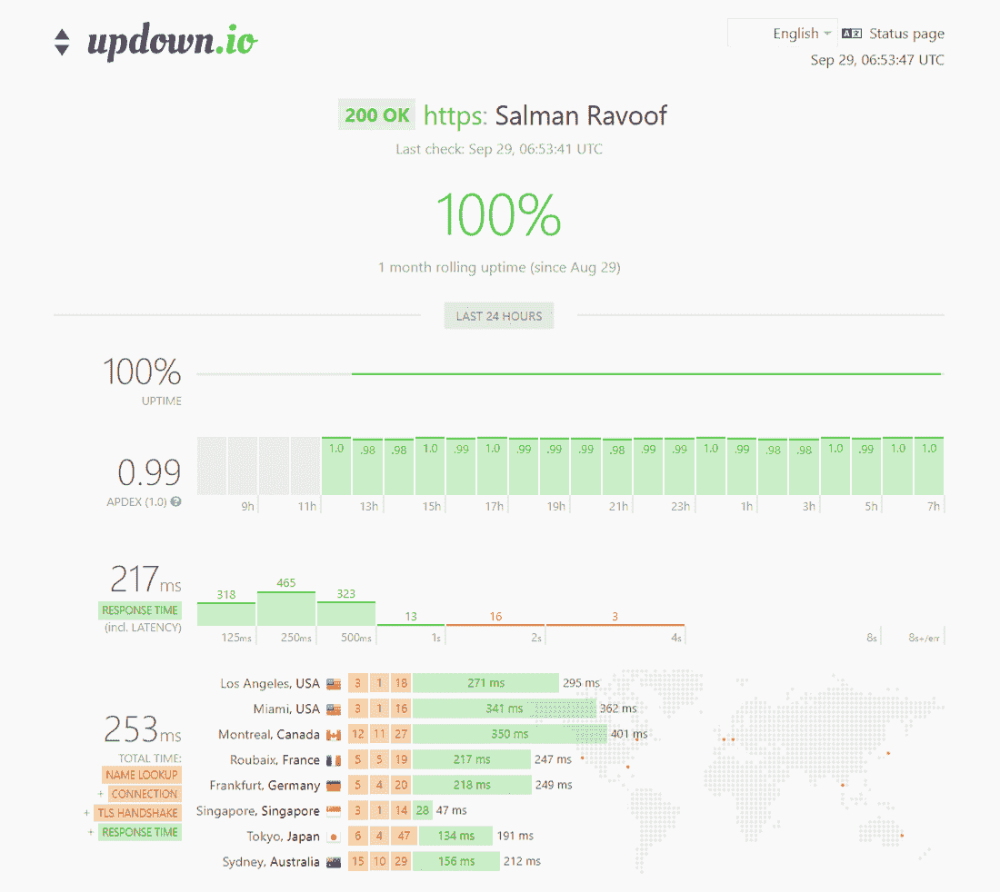

Monitor your website easily with updown.io


你将从 updown.io 的每个账户中获得大量免费积分，但如果你正在寻找更便宜的替代品，你可以查看一下 [WebGazer](https://www.webgazer.io/) 或 [UptimeRobot](https://uptimerobot.com/) 。这两个工具将免费帮助你每 5 分钟监控你的网站的正常运行时间。这对大多数网站所有者来说已经足够了。

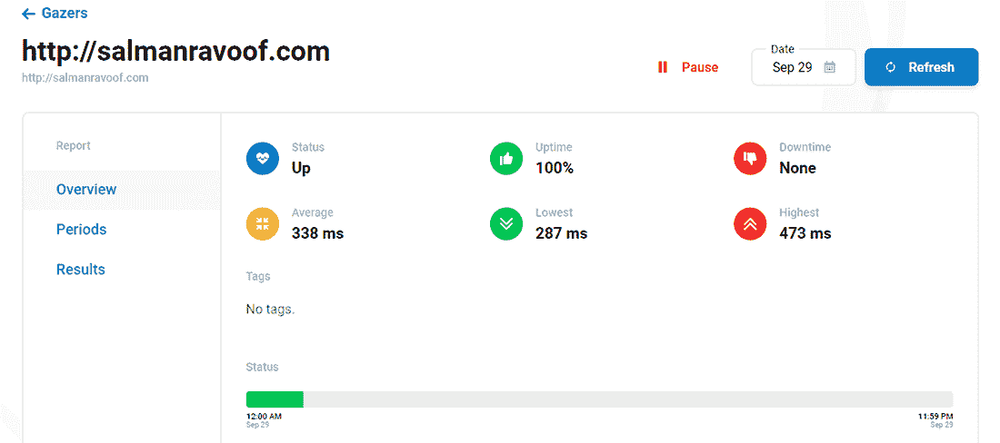

WebGazer website monitoring tool’s dashboard


监控你的网站会让你知道它关闭的频率。如果你使用共享主机提供商，这尤其有用。大多数[应用程序](https://kinsta.com/application-hosting/)、[数据库](https://kinsta.com/database-hosting/)和托管 WordPress 主机(比如 Kinsta)会自动为你处理这些。因此，总是建议和他们一起去。

关于详细的解释，请查看 Kinsta 关于托管 WordPress 主机的[重要性的帖子。](https://kinsta.com/blog/managed-wordpress-hosting/)

### 7.检查垃圾邮件、僵尸程序或 DDoS 攻击

恶意攻击者可以通过发送太多和/或资源密集型请求来使您的 web 服务器爬行。如果你的网站被僵尸程序发送垃圾邮件或遭受 DDoS 攻击，它会让你的服务器不堪重负，导致许多正版用户出现 504 网关超时错误。

你可以看看你的服务器流量和分析，看看你是否能发现任何不规则的网站流量模式。如果您使用 Kinsta 托管您的网站，您可以通过访问您的 [MyKinsta 分析仪表板](https://kinsta.com/help/mykinsta-analytics/)轻松查看这些数据。

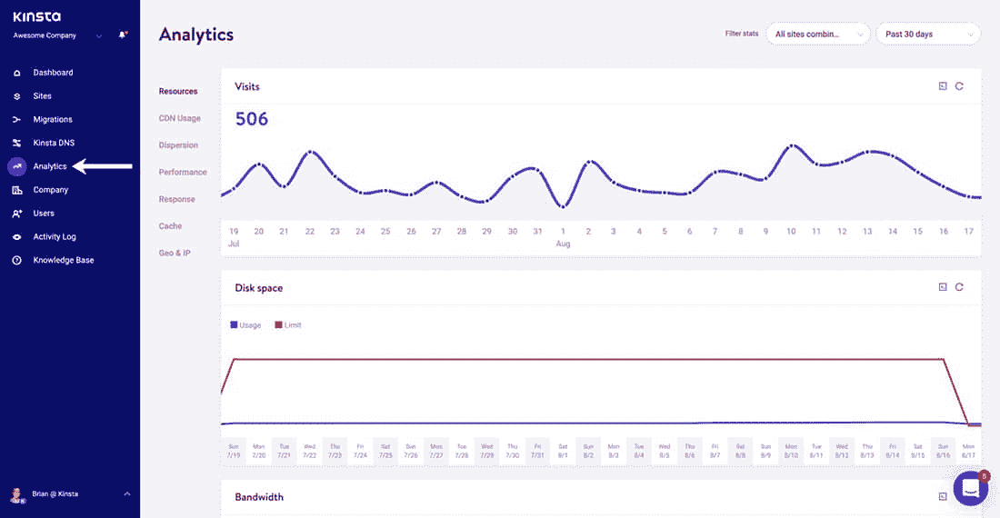

MyKinsta Analytics dashboard


从顶级客户 IP 开始调查。它将让您了解谁生成了最多的请求，以及来自哪里。如果你的服务器突然用完了巨大的带宽或者吸引了大量的流量，那么这个报告将会非常方便。

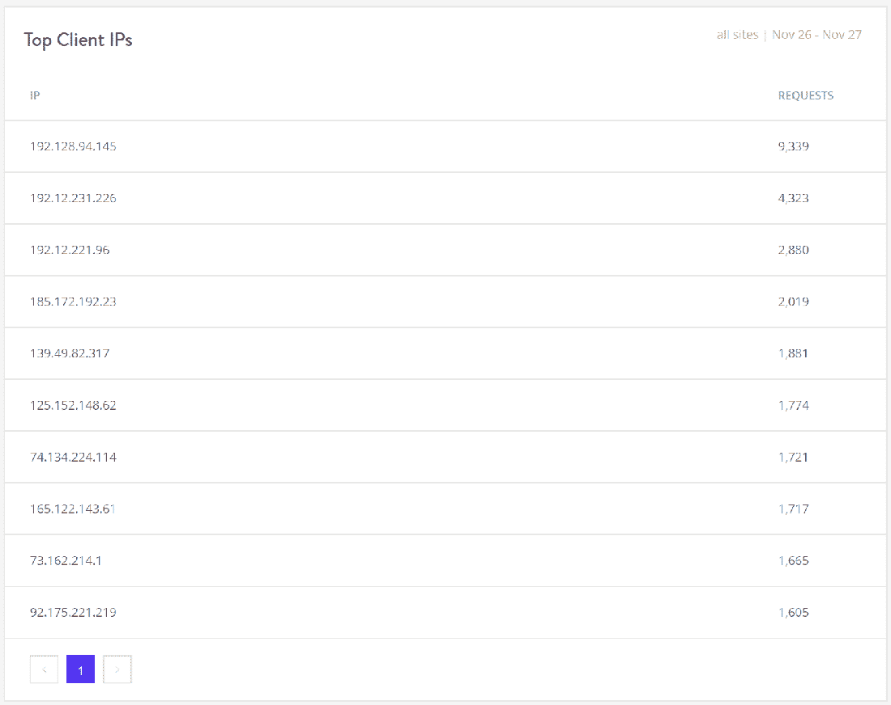

Viewing ‘Top Client IPs’ in MyKinsta dashboard


接下来，您可以查看**缓存分析**报告。在这里，您可以看到有多少请求绕过或错过了缓存，或者由缓存提供服务。出于性能和稳定性的原因，您希望缓存尽可能多的请求，但这并不总是可能实现的。

与宕机和 WordPress 问题做斗争？Kinsta 是一款考虑到性能和安全性的托管解决方案！[查看我们的计划](https://kinsta.com/plans/?in-article-cta)

例如， [WooCommerce 网站](https://kinsta.com/blog/woocommerce-tutorial/)会生成许多对购物车和结账流程等功能的不可缓存请求。

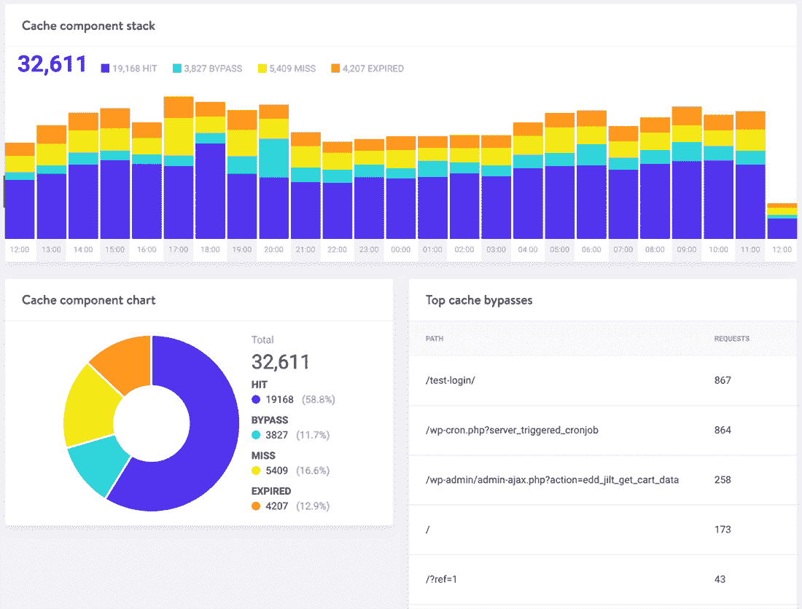

The ‘Cache Analysis’ screen in MyKinsta


最后，你可以使用[安全插件](https://kinsta.com/blog/wordpress-security/#security-plugins)通过发现和阻止令人担忧的流量/IP 来加强网站的安全性。你也可以要求你的主机[屏蔽某些 IP](https://kinsta.com/knowledgebase/block-ip-address/)。

根据攻击的长度和规模，这可能是一个永无止境的将 IP 列入黑名单的过程，因为许多攻击者在被阻止后会更改他们的 IP 和代理地址。

**注意:** Kinsta 不允许其客户安装安全插件，因为它们会对网站的性能产生巨大影响，尤其是扫描能力。由于 Kinsta 将负载平衡器与[谷歌云平台](https://kinsta.com/blog/google-cloud-hosting/)结合使用，阻止 IPs 并不总是如预期的那样工作。

您可以使用 Cloudflare 或 Sucuri 等专用安全解决方案来保护您的站点免受 DDoS 攻击和垃圾邮件。更多信息，你可以查看 Kinsta 的文章，了解如何在你的网站上安装 Cloudflare，以及 T2 如何帮助阻止 DDoS 攻击。

### 8.修复损坏的 WordPress 数据库

有时，504 网关超时错误可能是由于数据库损坏，尤其是在 WordPress 站点中。通常，这是由于数据库表或文件损坏造成的。有时，它也可能是由严重的安全问题引起的，如您的网站或数据库被黑客攻击。

修复一个损坏的 WordPress 数据库取决于问题。像 [WP-DBManager](https://kinsta.com/blog/wordpress-database-plugin/#5-wpdbmanager) 这样的插件使得诊断数据库问题和修复它们变得容易。我推荐你阅读 Kinsta 关于[修复 WordPress 数据库问题的详细演练](https://kinsta.com/knowledgebase/wordpress-repair-database/)来开始。

### 9.检查你网站的插件和主题

大多数情况下，第三方插件和主题不会导致 504 错误。但是它们也有可能导致服务器超时，通常是通过将插件/主题生成的许多未缓存的请求排队。由于这会占用大量服务器的 PHP 工作人员，因此会导致 504 错误。

这个问题的一个很好的例子是 WooCommerce，一个为 WordPress 站点增加电子商务功能的插件。

解决这个问题最简单的方法就是[关闭你所有的插件](https://kinsta.com/knowledgebase/disable-wordpress-plugins/)。记住，如果你只是停用一个插件，你不会丢失任何数据。

如果您可以访问您的管理仪表板，您可以进入**插件**屏幕，从批量操作菜单中选择**停用**，勾选所有插件，然后点击**应用**按钮。这将禁用您的所有插件。

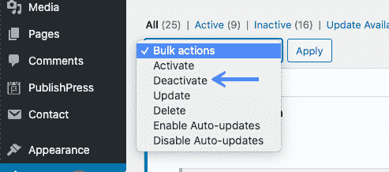

Deactivating all the WordPress plugins through WP admin dashboard


如果您[无法访问您的管理区](https://kinsta.com/blog/locked-out-of-wordpress-admin/)，您可以使用之前描述的方法通过 SFTP 禁用插件。只需重命名主插件文件夹名称即可批量禁用所有插件。

一旦你关闭了所有的插件，检查你的网站是否加载正常。如果有效，你必须激活每个插件，在激活每个插件后测试网站。

最后，确保你的插件、主题和 WordPress 核心是最新的。另外，确保您的服务器运行的是 PHP 的[推荐版本。](https://wordpress.org/about/requirements/)

如果你觉得这太难了，你可以随时向你的主人寻求帮助。Kinsta 使用 [Kinsta APM](https://kinsta.com/help/apm-tool/) 和其他故障排除技术来帮助客户[缩小什么插件、查询或脚本可能导致错误](https://kinsta.com/blog/debugging-wordpress-performance/)。

在最坏的情况下，比如一个低效的查询或者插件/主题中的坏代码，你可以引入一个 [WordPress 开发者](https://kinsta.com/blog/hire-wordpress-developer/)来解决这个问题。

### 10.检查错误日志

查看[错误日志](https://kinsta.com/knowledgebase/wordpress-error-log/)对于在您的站点上排除和调试 504 错误非常有帮助。这可以帮助你快速缩小网站上的问题范围，尤其是如果问题是由网站上的高要求插件引起的。

如果您是 Kinsta 的客户，您可以很容易地在 MyKinsta 仪表板的日志查看器中看到错误。


Checking error logs inside the MyKinsta dashboard


如果你的主机没有日志工具，那么你可以通过添加下面的代码到你的**wp-config.php**文件中来[启用 WordPress 调试模式](https://kinsta.com/blog/wordpress-debug/):

```
define( 'WP_DEBUG', true );
define( 'WP_DEBUG_LOG', true );
define( 'WP_DEBUG_DISPLAY', false );
```

[WP_DEBUG 常量](https://codex.wordpress.org/WP_DEBUG)启用或禁用 WordPress 调试模式。它有两个可选的伴随常数，可以扩展它的特性。`WP_DEBUG_LOG`常量指示将所有错误保存到`/wp-content/`目录下的 **debug.log** 文件中。如果看不到此文件，您可以创建一个。

`WP_DEBUG_DISPLAY`常量控制调试日志是否显示在 HTML 页面上。将此设置为 false 将隐藏所有错误，但是您可以稍后查看这些错误，因为您已经将`WP_DEBUG_LOG`定义为 true。

**重要提示:**如果您在 Kinsta 环境中启用了[WP _ DEBUG](https://kinsta.com/help/wordpress-enable-debug/)，它会将所有错误路由到 **debug.log** 文件，而不是 MyKinsta 仪表板中的 **error.log** 。

你也可以通过 SFTP 下载 WordPress 错误日志文件。通常，您可以在服务器根目录下名为“logs”的文件夹中找到错误日志

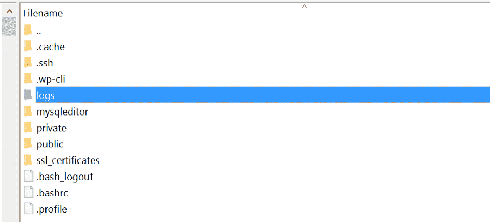

Accessing the WordPress error logs folder via SFTP


Kinsta 用户也可以从他们的 MyKinsta 仪表板上启用 WordPress 调试模式。为此，导航到**站点>工具> WordPress 调试**并点击**启用**按钮。这将允许您查看 PHP 错误和通知，而无需通过 SSH 或 SFTP 启用调试模式。

最后，您可以检查服务器日志文件。根据你使用哪个服务器来托管你的 WordPress 站点，它们通常出现在以下位置:

*   **阿帕奇:** `/var/log/apache2/error.log/`
*   **Nginx:**T0】

更多信息可以参考 [Apache](https://httpd.apache.org/docs/2.4/logs.html) 或者 [Nginx](https://docs.nginx.com/nginx/admin-guide/monitoring/logging/) 的日志相关文档。

### 11.正确配置 Apache 或 Nginx 设置

您可以编辑服务器配置文件来增加特定指令的资源限制。这可以帮助您解决 504 网关超时错误。

#### 对于 Apache 服务器

首先，将以下代码添加到您的 **httpd.conf** 中:

```
TimeOut 600
```

此设置定义了服务器在将其标记为网络超时问题之前等待特定请求的时间。其[默认值为 60 秒](https://httpd.apache.org/docs/2.4/mod/core.html#timeout) (Apache 2.4 版本)。

您只能在您的 **httpd.conf** 文件中添加这个指令，而不能在您的[中添加。htaccess](https://kinsta.com/knowledgebase/wordpress-htaccess-file/) 文件。由于大多数共享主机提供商不允许你修改 **httpd.conf** 文件，你可以尝试在你的**中增加 [LimitRequestBody 指令](https://httpd.apache.org/docs/current/mod/core.html#limitrequestbody)的值。改为 htaccess** 文件。

然后将下面一行添加到您的 **php.ini** 文件中:

```
max_execution_time 300
```

PHP 的 [max_execution_time 指令](https://www.php.net/manual/en/info.configuration.php#ini.max-execution-time)的默认值是 30 秒。增加它将允许你的站点的 PHP 脚本运行更长时间。

#### 对于 Nginx 网络服务器

如果你在 Nginx + FastCGI 进程管理器(PHP-FPM)上运行你的 WordPress 站点，或者使用 [Nginx 作为 Apache 的反向代理](https://kinsta.com/blog/reverse-proxy/)，你可以调整服务器设置来帮助防止 504 网关超时错误。

##### Nginx + FastCGI (PHP-FPM)上的 504 网关超时错误

首先，您必须编辑您的 PHP-FPM 池配置文件。您可以在 Nginx 服务器中的`/etc/php7.4/fpm/pool.d/www.conf`位置找到它(具体路径可能因 [PHP 版本](https://kinsta.com/blog/php-versions/)而异)。或者，您可以在终端中运行以下命令来编辑 PHP-FPM 池配置文件:

```
sudo nano /etc/php/7.2/fpm/pool.d/www.conf
```

接下来，设置以下指令:

```
request_terminate_timeout = 300
```

在这之后，你必须编辑你的 **php.ini** 文件。可以在`/etc/php.ini`定位。打开文件，将`max_execution_time`指令的值添加/更改为 300 秒。

```
max_execution_time = 300
```

最后，将以下代码添加到您的 **nginx.conf** 文件的位置块中:

```
location ~ .php$ {
...
fastcgi_read_timeout 300;
}
```

重新加载 Nginx 和 PHP-FPM 以使修改生效。

```
sudo service nginx reload
sudo service php7.4-fpm reload
```

重新加载 PHP-FPM 的确切代码会因服务器上安装的 PHP 版本而异。测试您的网站，看看它是否已经解决了这个问题。

##### 504 Nginx 代理上的网关超时错误

如果您使用 Nginx 作为 Apache 的反向代理服务器，那么您可以通过将以下指令添加到您的 **nginx.conf** 文件中，使其对服务器超时更加宽容:

```
proxy_connect_timeout 600;
proxy_send_timeout 600;
proxy_read_timeout 600;
send_timeout 600;
```

在做出更改后，不要忘记重新加载 Nginx。

`sudo service nginx reload`

## 其他 HTTP 错误，如 504 网关超时

正如本文前面提到的，许多其他 HTTP 5xx 错误就像 504 网关超时错误一样。因为它们都发生在服务器端。这些错误包括:

*   [500 内部服务器错误](https://kinsta.com/blog/500-internal-server-error/)
*   [501 未实现错误](https://kinsta.com/knowledgebase/501-not-implemented-error/)
*   [502 坏网关错误](https://kinsta.com/blog/502-bad-gateway/)
*   [503 服务不可用错误](https://kinsta.com/blog/http-error-503/)

由于客户端问题导致的其他 HTTP 错误，如 [404 Not Found](https://kinsta.com/blog/error-404-not-found/) 错误，也类似于 504 错误。你可以参考 Kinsta 的详细的[指南和 HTTP 状态代码列表](https://kinsta.com/blog/http-status-codes/)了解更多信息。

[When you don't know what caused a 504 Gateway Timeout error, how do you fix it in time to keep hard-earned visitors from bouncing to competitor sites? 🤷‍♂️ All the details are in this post. ⬆️Click to Tweet](https://twitter.com/intent/tweet?url=https%3A%2F%2Fkinsta.com%2Fblog%2F504-gateway-timeout%2F&via=kinsta&text=When+you+don%27t+know+what+caused+a+504+Gateway+Timeout+error%2C+how+do+you+fix+it+in+time+to+keep+hard-earned+visitors+from+bouncing+to+competitor+sites%3F+%F0%9F%A4%B7%E2%80%8D%E2%99%82%EF%B8%8F+All+the+details+are+in+this+post.+%E2%AC%86%EF%B8%8F&hashtags=WPErrors%2CWordPress)

## 摘要

由于多种原因，您的站点可能会受到 504 网关超时错误的影响。在本文中，您了解了如何对它们进行故障排除。通常，这些错误是由服务器端问题引起的，在这种情况下，您可以联系您的主机并快速解决它。

然而，你也必须明白，这个错误可能是由于第三方插件，主题，服务，低效的数据库查询，或者两个或两个以上的组合。如果你正在最大限度地利用你的服务器资源(例如 PHP 工作人员)，建议[优化你的站点性能](https://kinsta.com/learn/speed-up-wordpress/)。

如果你仍然发现你的网站超时了，那么很可能你需要升级你的主机计划或者 PHP 工作人员的数量。我建议您只有在尝试了本文中描述的所有其他解决方案之后，才考虑这个选项。

从简单的静态网站到复杂的[电子商务](https://kinsta.com/woocommerce-hosting/)和[会员网站](https://kinsta.com/blog/wordpress-membership-theme/)，Kinsta 的可扩展托管计划旨在适应所有类型的网站。要了解更多关于我们可扩展云托管的信息，[请看这篇文章](https://kinsta.com/knowledgebase/what-you-should-know/)！

我们错过了什么吗？如果你仍然发现很难修复你的网站上的 504 网关超时错误，请在下面留下评论。

* * *

让你所有的[应用程序](https://kinsta.com/application-hosting/)、[数据库](https://kinsta.com/database-hosting/)和 [WordPress 网站](https://kinsta.com/wordpress-hosting/)在线并在一个屋檐下。我们功能丰富的高性能云平台包括:

*   在 MyKinsta 仪表盘中轻松设置和管理
*   24/7 专家支持
*   最好的谷歌云平台硬件和网络，由 Kubernetes 提供最大的可扩展性
*   面向速度和安全性的企业级 Cloudflare 集成
*   全球受众覆盖全球多达 35 个数据中心和 275 多个 pop

在第一个月使用托管的[应用程序或托管](https://kinsta.com/application-hosting/)的[数据库，您可以享受 20 美元的优惠，亲自测试一下。探索我们的](https://kinsta.com/database-hosting/)[计划](https://kinsta.com/plans/)或[与销售人员交谈](https://kinsta.com/contact-us/)以找到最适合您的方式。</kinsta-advanced-cta></kinsta-advanced-cta></kinsta-auto-toc>