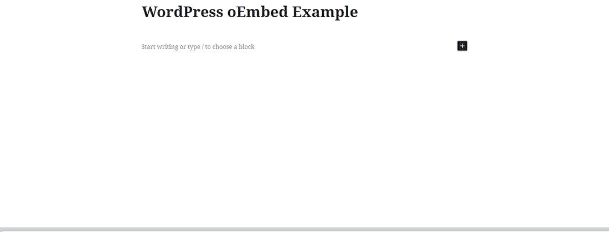
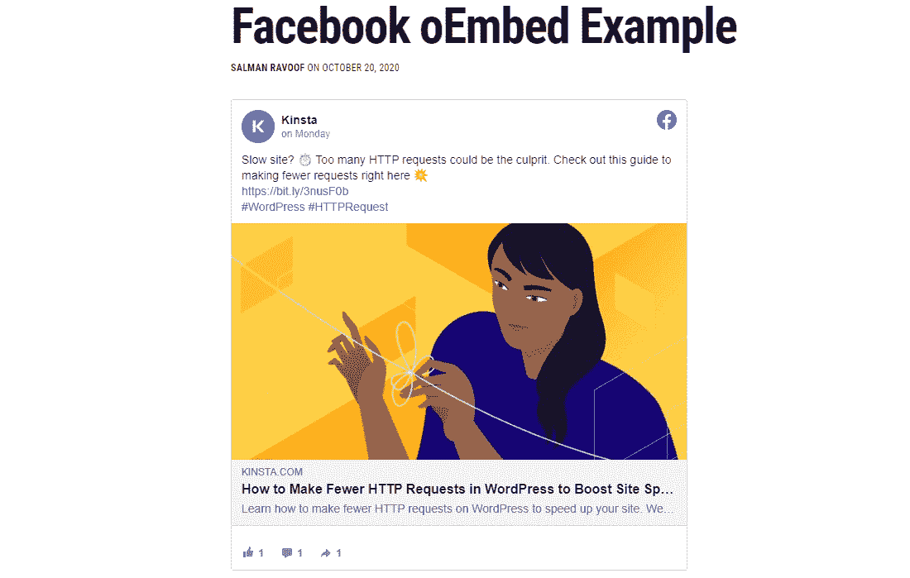
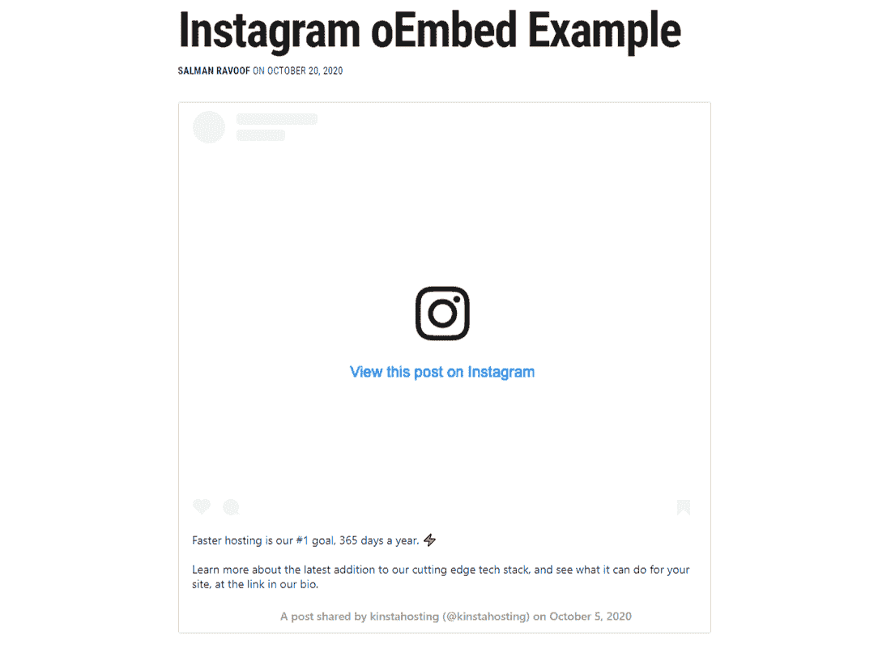
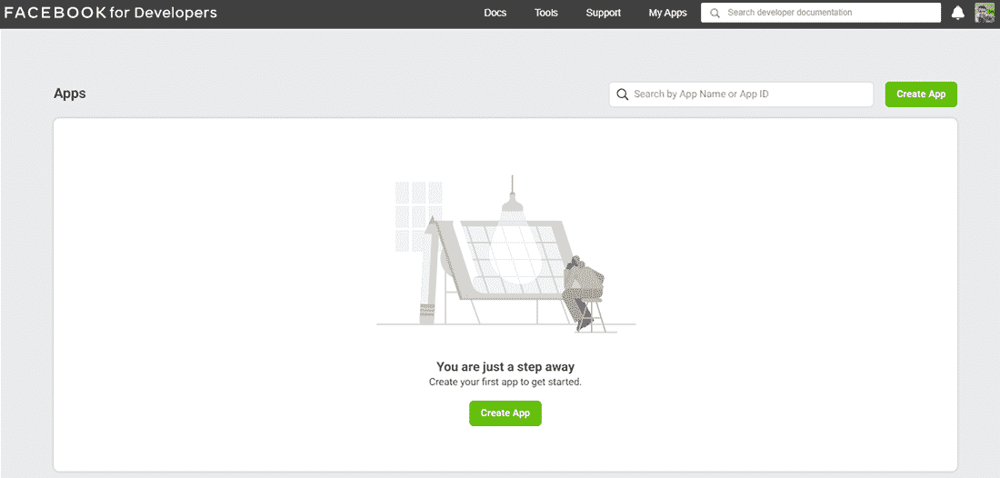
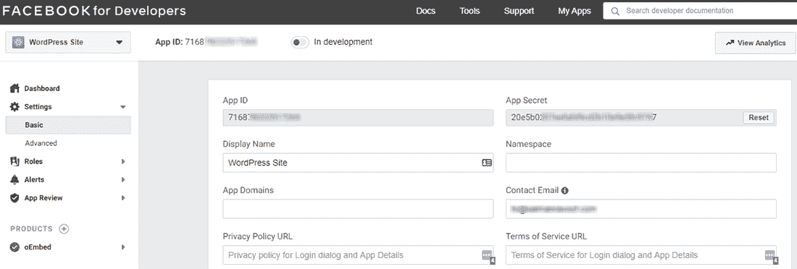
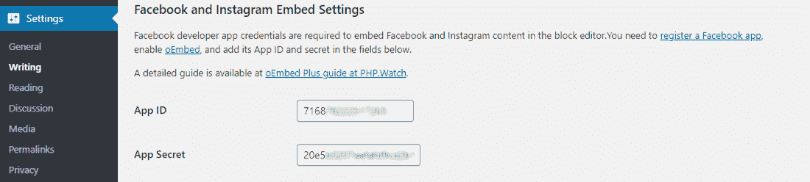

# 如何修复 WordPress 中的脸书 oEmbed 问题

> 原文：<https://kinsta.com/blog/facebook-oembed/>

从 10 月 24 日开始，脸书已经停止支持[未经认证的 WordPress 嵌入](https://developers.facebook.com/docs/plugins/oembed-legacy)。因此，如果你在你的 WordPress 网站上嵌入脸书和 Instagram 内容，它们会崩溃。

更具体地说，旧的脸书 oEmbed 端点正在被需要通过脸书进行身份验证的新端点所取代。由于脸书拥有 Instagram，同样的要求也适用于 Instagram oEmbed 端点。

在本文中，我们将介绍 WordPress 如何使用脸书和 Instagram oEmbed 端点，更新了哪些内容，以及如何修复这些内容以使您的嵌入保持正常工作。

让我们准备好！

T3】

## WordPress 如何使用 oEmbed 来嵌入内容

oEmbed 是一种协议，允许网站只需一个 T2 URL T3 就可以嵌入来自其他第三方网站的内容。它的设计主要是为了避免从其他网站复制粘贴 HTML。WordPress 使用 oEmbed 来显示嵌入的内容(比如[的照片](https://kinsta.com/blog/wordpress-photo-gallery-plugins/)或者[的视频](https://kinsta.com/blog/video-hosting/))。

你所需要做的就是把资源 [URL](https://kinsta.com/knowledgebase/wordpress-change-url/) 放在内容区，WordPress 会自动把它变成一个嵌入，并显示它的实时预览。



Embedding content with just a URL in WordPress


在上面的例子中，[我粘贴了一个 YouTube 视频链接](https://kinsta.com/blog/embed-youtube-video-wordpress/)，WordPress 自动将其转换为视频嵌入。oEmbed 协议是 WordPress 嵌入多种类型内容的基础，例如来自各种社交媒体平台的视频、图像、更新等。


虽然 WordPress 允许你[嵌入来自任何注册的 oEmbed 提供商的清理过的 iframe](https://kinsta.com/blog/wordpress-iframe/)，但出于[安全原因](https://kinsta.com/blog/wordpress-security/)，它不会默认嵌入所有 iframe。默认情况下，它仅嵌入某些经批准的 oEmbed 提供商的 URL。

WordPress 的可信 oEmbed 提供商名单包括大多数流行的内容托管和社交网站，如 Imgur、脸书、Instagram、Tumblr、YouTube、Vimeo 等。这些提供者可以嵌入任何内容，比如视频、iframes、JavaScript，甚至随机的 HTML。
T3】

## 脸书和 Instagram 嵌入式端点(传统)

脸书和 Instagram oEmbed 端点是将脸书和 Instagram 内容嵌入 WordPress 网站的支柱。



An example of how WordPress embeds Facebook content


脸书 oEmbed 端点不仅允许 WordPress 获取主要内容，还可以获取元数据，如页面名称和徽标、日期和时间、缩略图、赞数、评论和分享，以及源的 URL。


An example of how WordPress embeds Instagram content


从 Instagram 嵌入内容也是如此。您不仅可以看到嵌入的图像，还可以看到与其相关的重要元数据信息。

## 新的脸书和 insta gram“o embed”端点

脸书宣布从 2020 年 10 月 24 日起淘汰其现有的 oEmbed 端点。他们现在将这些旧端点称为[传统 oEmbed 端点](https://developers.facebook.com/docs/plugins/oembed-legacy)。

> *到 2020 年 10 月 24 日，开发者在通过 UID、FB OEmbeds 和 IG OEmbeds 查询 Graph API 获取用户档案图片时，必须利用用户、应用或客户端令牌。当通过 UID 或 ASID 查询个人资料图片时，开发人员应该提供一个用户或应用程序令牌，尽管也支持客户端令牌。请访问我们关于* *用户图片* *、* *脸书 OEmbed* *和**insta gram OE**m**bed**的变更日志，了解今天如何开始调用这些图形 API 端点的详细信息。*
> –[开发商的脸书](https://developers.facebook.com/blog/post/2020/08/04/Introducing-graph-v8-marketing-api-v8/)

### 您现在需要什么来利用脸书 oEmbed API

与 oEmbed 的[开放 web API 性质相反，新的脸书 oEmbed API 有各种要求:](https://blog.leahculver.com/2008/05/announcing-oembed-an-open-standard-for-embedded-content.html)

*   您需要有一个脸书开发者帐户。
*   然后你需要有一个注册的脸书应用程序来生成一个唯一的应用程序 ID。
*   接下来，您必须为您注册的应用程序启用 oEmbed 产品。
*   然后，您必须生成应用程序访问令牌或客户端访问令牌。
*   最后，你必须将脸书应用程序设置为实时模式。

作为对这些新要求的回应， [WordPress 正在删除脸书和 Instagram](https://core.trac.wordpress.org/ticket/50861) 作为可信 oEmbed 来源。

我们期望下一个主要的 WordPress 更新包含这些变化。如果你正在使用 Gutenberg 插件，最新的 Gutenberg 9.0 版本已经移除了对它们的支持。

## 老脸书和 Instagram 嵌入会怎么样？

WordPress 在其数据库中的`**post meta**`或隐藏的`**oembed_cache**`帖子类型下缓存 oEmbed 响应(目前仅用于[小部件](https://kinsta.com/blog/wordpress-widgets/))。

由于 WordPress 没有默认清除这些值，嵌入的内容将继续存在于你的网站上。

但是如果您从数据库中手动删除它们，它们将被清除。因此，你在 10 月 24 日截止日期前添加的任何脸书或 Instagram 嵌入内容，即使在弃用日期后也会继续存在。


## 如何嵌入脸书和 Instagram 内容(10 月 24 日之后)

如果您尝试在脸书或 Instagram 放弃传统 oEmbed 端点后嵌入内容，您和您的用户可能会收到 [HTTP 400 错误](https://kinsta.com/knowledgebase/400-bad-request/)作为响应。

## 注册订阅时事通讯


### 想知道我们是怎么让流量增长超过 1000%的吗？

加入 20，000 多名获得我们每周时事通讯和内部消息的人的行列吧！

[Subscribe Now](#newsletter)

为了帮助我们测试 2020 年 10 月 24 日之后嵌入尝试将如何出现，脸书为传统 oEmbed 端点添加了一个[参数来模拟错误。我测试了一下，结果如下。](https://developers.facebook.com/docs/plugins/oembed-legacy#parameters)


A simulated embed using legacy Facebook oEmbed endpoints


脸书的回退嵌入将作为小摘录(最多 120 个字符)出现在块引号内。它还将包括作者和原始来源的链接，但除此之外没有其他内容。

甚至没有提到脸书，除了链接，点击链接会带你去脸书。



A simulated embed using legacy Instagram oEmbed endpoints


相比之下，Instagram 的回退嵌入要好得多，嵌入结构几乎保持不变。

话虽如此，**这是一个暂时的问题**。一旦 WordPress 从其核心中移除了脸书和 Instagram oEmbed 端点，传统的 oEmbed 端点将不再是问题。

嵌入脸书和 Instagram 内容的唯一方法就是遵守脸书的要求。您将在下一节中学习如何做到这一点。

## 如何修复 WordPress 中的脸书和 Instagram oEmbed 问题

恢复 WordPress 中脸书和 Instagram 嵌入的最简单方法是使用 Ayesh Karunaratne 的免费 [oEmbed Plus](https://wordpress.org/plugins/oembed-plus/) 插件。它可以帮助您实现新的脸书 oEmbed 端点，以重新启用块编辑器中的脸书和 Instagram 嵌入。


The oEmbed Plus WordPress plugin


要开始使用它，首先[安装并激活插件](https://kinsta.com/knowledgebase/how-to-install-wordpress-plugins/)。

厌倦了 WordPress 的问题和缓慢的主机？我们提供世界一流的支持，由 WordPress 专家提供 24/7 服务和超快的服务器。[查看我们的计划](https://kinsta.com/plans/?in-article-cta)

**注意:** oEmbed Plus 需要 [PHP 7.3 或更高版本](https://kinsta.com/blog/php-versions/)才能工作。如果你目前的 WordPress 主机还不支持 PHP 7.3+版本，我们强烈建议你寻求[新主机](https://kinsta.com/plans/)。

接下来，为开发者创建一个[脸书](https://developers.facebook.com/)账户，如果你还没有的话。然后，创建一个 App。在我的例子中，我将我的应用程序命名为“WordPress 站点”，但是你可以随意命名。



Create an App in Facebook for Developers portal


创建应用程序将自动为其生成一个**应用程序 ID** 。

你可以通过进入你的应用仪表板下的**设置→基本**面板来查看你的**应用 ID** 和**应用密码**。记下这两个值，因为您稍后会用到它们。



Facebook for Developers ‘App ID’ and ‘App Secret’


当你在这里的时候，也要设置**隐私政策 URL** ，因为这是让应用程序**上线**所必需的。建议使用[适当的隐私政策](https://kinsta.com/partners/termageddon/)，这样你的应用就不会被列入黑名单。

默认情况下， **oEmbed 产品**自动启用，因此您可以保持原样。

接下来，进入你的 WordPress 仪表盘中的**设置→写作**屏幕，搜索**脸书和 Instagram 嵌入设置**部分。在这里，输入你之前记下的**应用 ID** 和**应用秘密**值。



Configuring oEmbed Plus plugin settings


或者，您可以将**应用 ID** 和**应用秘密**添加到您的 [`**wp-config.php**`文件](https://kinsta.com/blog/wp-config-php/)中。下面是您需要使用的代码片段:

```
define('OEMBED_PLUS_FACEBOOK_APP_ID', '7168...app.id...789');  
define('OEMBED_PLUS_FACEBOOK_SECRET', '20e5...app.secret...890xyz');
```

不要忘记将上面显示的值更改为您自己的值！完成后，保存文件。

如果你编辑`**wp-config.php**`文件来配置 oEmbed Plus，它会自动禁用你的 [WordPress 仪表盘](https://kinsta.com/knowledgebase/wordpress-admin/)中的**应用 ID** 和**应用秘密**表单字段。因此，你可以对其他用户保密你的应用凭证。

差不多就是这样！

所有新的脸书和 Instagram 嵌入现在都使用新的认证 API 在你的 WordPress 站点中嵌入内容。

其他专用的社交媒体插件，如 [Instagram Feed](https://kinsta.com/blog/wordpress-instagram-plugin/#instagram-feed) 和 [Social Post Feed](https://wordpress.org/plugins/custom-facebook-feed/) ，也增加了对新的脸书 oEmbed 端点的支持。

然而，这些插件捆绑了许多功能，因此对于这种特定的用例来说，它们可能是不必要的膨胀。如果你已经在使用它们了，那么你可以去看看。

目前，脸书对他们新 API 的速率限制很慷慨。它们允许你每天发出多达 500 万个请求。由于 WordPress 将 oEmbed API 响应缓存在数据库中，所以除了第一个请求之外，嵌入不会触发任何进一步的请求。你可以参考[脸书更新的 oEmbed 文档](https://developers.facebook.com/docs/plugins/oembed)了解更多信息。

## 摘要

WordPress 是当今最流行的 CMS。同样，和 [Instagram](https://kinsta.com/blog/wordpress-instagram-plugin/) 是最受欢迎的社交媒体平台。因此，这一变化可能会影响数百万个网站。

在 WordPress 中嵌入社交媒体内容为你的网站访问者提供了更独特的体验。从 2020 年 10 月 24 日开始，许多不知情的用户会发现嵌入脸书和 Instagram 内容令人沮丧。我们希望这篇文章能帮助你纠正 WordPress 的脸书 oEmbed 问题。

如果你仍然面临脸书和 Instagram 嵌入的问题，请在评论中告诉我们！

* * *

让你所有的[应用程序](https://kinsta.com/application-hosting/)、[数据库](https://kinsta.com/database-hosting/)和 [WordPress 网站](https://kinsta.com/wordpress-hosting/)在线并在一个屋檐下。我们功能丰富的高性能云平台包括:

*   在 MyKinsta 仪表盘中轻松设置和管理
*   24/7 专家支持
*   最好的谷歌云平台硬件和网络，由 Kubernetes 提供最大的可扩展性
*   面向速度和安全性的企业级 Cloudflare 集成
*   全球受众覆盖全球多达 35 个数据中心和 275 多个 pop

在第一个月使用托管的[应用程序或托管](https://kinsta.com/application-hosting/)的[数据库，您可以享受 20 美元的优惠，亲自测试一下。探索我们的](https://kinsta.com/database-hosting/)[计划](https://kinsta.com/plans/)或[与销售人员交谈](https://kinsta.com/contact-us/)以找到最适合您的方式。