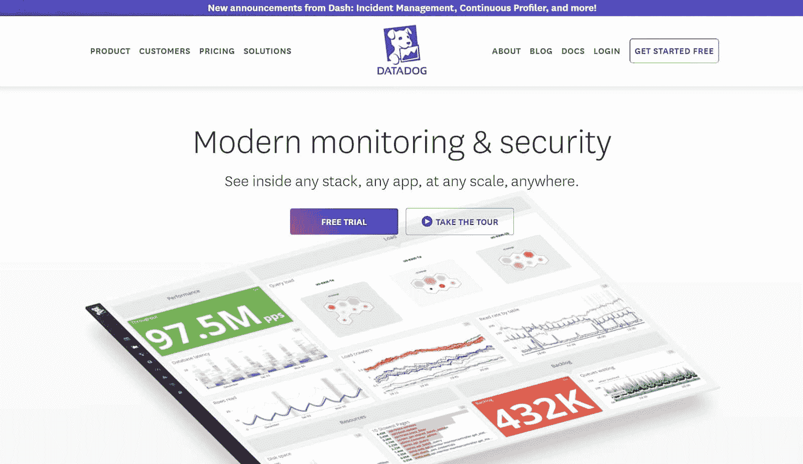
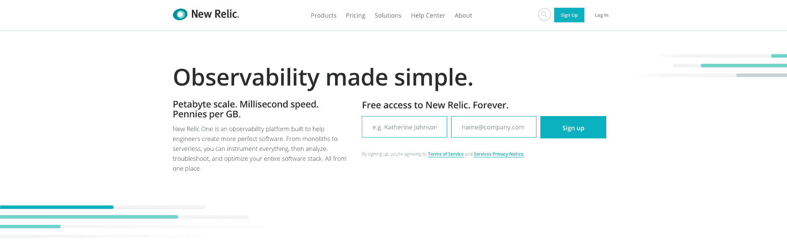
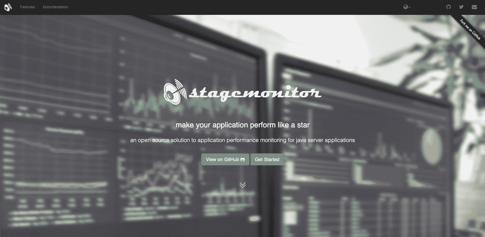
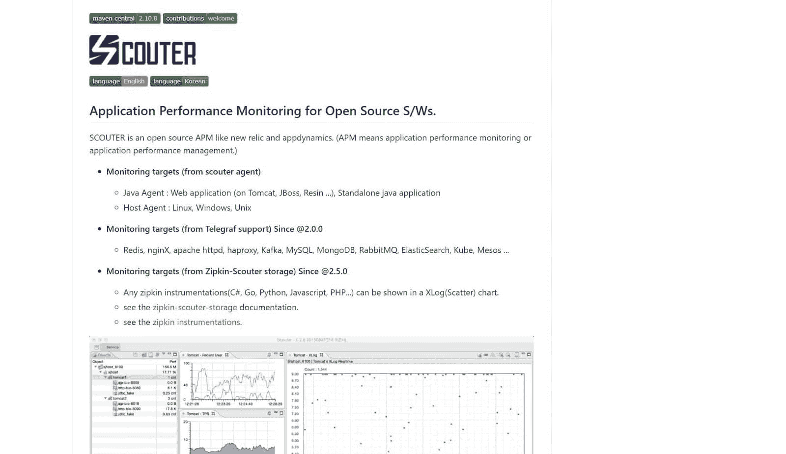
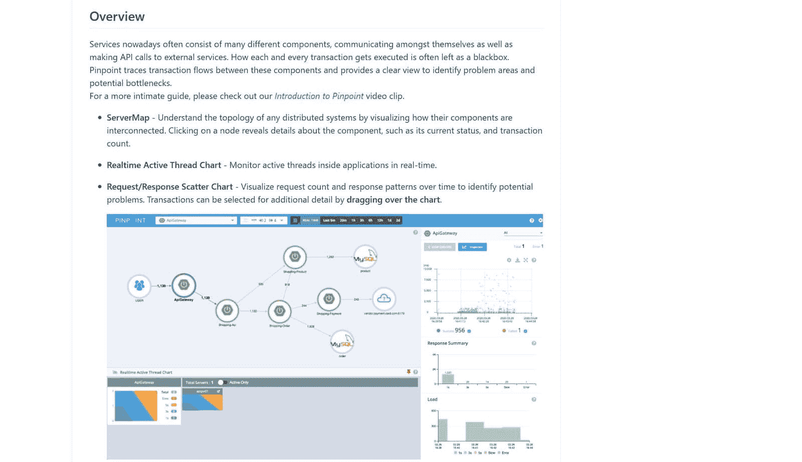

# 市场上最好的 8 个 APM 工具(以及为什么您应该使用其中一个)

> 原文：<https://kinsta.com/blog/apm-tools/>

在网络问题、服务器维护和用户支持之间，维护 web 应用程序会变得非常复杂。但是一天就那么几个小时。

APM 是一个为应用程序的前端和后端提供统一监控、跟踪和分析的系统。所有这些信息使得诊断和纠正问题变得更加容易，从而提供最佳的用户体验。

在本文中，我们将解释什么是 APM 工具以及为什么您应该使用它。

然后，我们将看看当今市场上的最佳解决方案，包括几个开源选项。我们有很多地方要讲，所以让我们开始吧！

## APM 和 APM 工具简介

APM 代表应用程序性能管理。它有时也被称为应用程序性能*监控*，尤其是在最近几年。

尽管这两个词经常互换使用，但是管理和监控之间还是有一点技术上的区别。管理意味着比监控更积极的角色，监控通常意味着自动、定期地扫描 web 应用程序。

那么， APM 是什么*？简而言之，它包括从面向用户和后端的角度监控速度，以发现 web 应用程序中的潜在问题和性能瓶颈(T2)。*

> Kinsta 把我宠坏了，所以我现在要求每个供应商都提供这样的服务。我们还试图通过我们的 SaaS 工具支持达到这一水平。
> 
> <footer class="wp-block-kinsta-client-quote__footer">
> 
> 
> 
> <cite class="wp-block-kinsta-client-quote__cite">Suganthan Mohanadasan from @Suganthanmn</cite></footer>

[View plans](https://kinsta.com/plans/)

然后，这些数据用于诊断、故障排除和解决问题，以改善用户体验。APM 工具是用于收集和分析所有数据的软件套件。

[调试这么多，时间这么少。⏳APM 工具使监视您的 web 应用程序变得容易——这一综述使找到适合您需求的工具变得更加容易。点击了解更多👇 点击推文](https://twitter.com/intent/tweet?url=https%3A%2F%2Fkinsta.com%2Fblog%2Fapm-tools%2F&via=kinsta&text=So+much+to+debug%2C+so+little+time.+%E2%8F%B3+APM+tools+make+monitoring+your+web+application+easy+-+and+this+roundup+makes+finding+the+right+one+for+your+needs+even+easier.+Click+for+more+%F0%9F%91%87&hashtags=APM%2CWebDev)

## APM 的关键要素

APM 行业是一个非常广泛的行业，许多公司提供技术上可以称为 APM 的工具。这个短语已经变得足够模糊，以至于研究公司 Gartner 创建了一个标准列表，软件应该满足这些标准才能符合这个术语。

最初的定义包括五个关键要素:

*   终端用户体验监控
*   应用程序运行时架构发现和建模
*   用户定义的事务分析
*   应用程序组件监控
*   报告和应用数据分析

然而，这是一个相当技术性的定义，而且情况在不断变化。所以几年后, [Gartner 修改了它的指导方针,](https://www.gartner.com/en/information-technology/glossary/application-performance-monitoring-apm),将清单缩减为三个必需品:

*   数字体验监控
*   应用程序发现、跟踪和诊断
*   为 IT 运营专门构建的人工智能(AI)

从实际意义上讲，修订后的清单更容易理解。

[数字体验监控](https://www.appdynamics.com/product/end-user-monitoring/what-is-digital-experience-monitoring)指的是用户对应用程序的体验。他们对一切工作方式满意吗？他们遇到麻烦了吗，或者遇到错误和故障了吗？APM 工具应该可以帮助您发现这些问题。

应用程序发现、跟踪和诊断就像它听起来的那样:挖掘软件的细节来发现和诊断潜在的问题。

最后，人工智能通常用于[支持这些过程的自动化](https://www.apmdigest.com/ai-shines-bright-in-apm-but-challenges-remain)。

这些是您在考虑任何 APM 解决方案时想要寻找的核心元素。

## 为什么应该使用 APM 工具

APM 工具提供了一个平台，您可以在其中监控和管理所有软件和应用程序。光是这种整合就能极大地提高效率和生产力。

大多数 APM 工具的统一仪表板为 PHP 性能监控、管理更新、监视冲突和[纠正错误](https://kinsta.com/blog/wordpress-debug/)提供了一站式服务。这使得[开发者](https://kinsta.com/blog/hire-wordpress-developer/)和 IT 团队能够为他们的客户提供最好的用户体验。

APM 的其他优势包括:

*   更快的开发周期
*   更好地了解[的哪些功能是客户实际使用的](https://kinsta.com/blog/2019-year-in-review/#what-to-expect-in-2020)
*   部署新软件时增强信心

换句话说，APM 不仅让您受益，也让您的客户受益。这对各方来说都是双赢的局面。

### 3 个 APM 运行的例子

如果您想知道所有这些如何转化为现实世界的业务使用，这里有三个组织实施 APM 取得巨大成效的例子:

*   康奈尔大学发现自己陷入了困境:由于复杂的事务，该大学使用的一个关键任务软件平台每周都会崩溃几次。通过利用 APM 工具，Cornell 能够更轻松地找到瓶颈，并大幅减少用户投诉的周转时间。
*   阿拉斯加航空公司[部署了 APM](https://www.appdynamics.com/case-study/alaska-airlines) 来帮助优化其复杂的基于云的系统，并保持客户满意度。APM 工具帮助该公司将关键停机和其他问题减少了 60%,并在问题有机会影响用户体验之前发现它们。
*   在 Kinsta，我们使用 [Kinsta APM 工具](https://kinsta.com/apm-tool/)来监控和优化客户网站，以[确保最佳性能](https://kinsta.com/learn/speed-up-wordpress/)和满意度。这使我们能够很容易地深入到 WordPress 站点的最底层，并查明导致问题的插件、主题和编码错误。

APM 工具可以在广泛的场景中使用，以实现许多不同的目标。无论您的企业可能做什么，您都可以让 APM 为您工作。

### APM 如何让 WordPress 用户受益

所有平台都可以利用 APM 工具。

WordPress 网站所有者尤其受益于使用它们来监控和最大化性能。你可以密切关注[插件](https://kinsta.com/best-wordpress-plugins/)、[主题](https://kinsta.com/best-wordpress-themes/)、数据库调用和你网站上的其他事务来发现瓶颈。

这使您能够快速修复问题，并在您的网站上保持良好的用户体验。您可以使用 APM 工具来调试加载缓慢的页面，并检查可能导致高开销和服务器压力的不必要的进程。

大多数 APM 可以与 WordPress 安装一起工作，但是一些提供了更专门为特定平台定制的功能。

我们将在下面的列表中触及这些。

## 如何选择 APM 工具

以下是您考虑的任何 APM 工具都应该包含的一些功能:

1.  深入监控业务交易、基础设施、用户体验和网络性能。
2.  从单一控制面板提供可靠的报告和分析。
3.  深入研究数据的能力。

除此之外，价格显然是一个考虑因素。**这些工具中的一些**，尤其是那些用于企业的**可能会很贵**。但是，在考虑价格时，请确保考虑到您将从提高生产率和减少停机时间中获得的节约。

## Kinsta 的免费 APM 工具

在我们深入探讨您可以在任何平台上使用的最佳 APM 工具之前，我们想花点时间告诉您关于 **Kinsta 的免费 APM 工具**。我们所有的客户，无论计划等级，都可以使用 [Kinsta APM](https://kinsta.com/apm-tool/) ，这是一个免费的工具，可以让你诊断你的 WordPress 站点的性能瓶颈。

Kinsta APM 为您提供了关于慢速 PHP 事务、MySQL 查询、外部请求等方面的见解。Kinsta APM 是专门为监控 WordPress 站点而构建的，所以你可以用它来快速识别有问题的插件和主题。

查看下面的视频，了解如何使用 Kinsta APM 工具来解决您网站的性能问题。

## 8 个最好的 APM 工具

准备工作结束后，这里是我们挑选的市场上最好的 APM 工具。从小型企业和开发团队到大型企业，每个人都可以选择。

## 注册订阅时事通讯

### 想知道我们是怎么让流量增长超过 1000%的吗？

加入 20，000 多名获得我们每周时事通讯和内部消息的人的行列吧！

[Subscribe Now](#newsletter)

我们包括了五个高级工具和三个免费的开源选项，所以每个预算都包括在内。

|  | **起始价格** | **免费试用** | **突出特点** | **给谁的** |
| [Datadog](https://www.datadoghq.com/) | 31 美元/月 | 14 天 | 性能数据的清晰可视化 | 小型企业 |
| [放大镜](https://onloupe.com/) | 50 美元/月 | 30 天 | 强大的 web 客户端 | 企业和 IT 专家 |
| [AppDynamics](https://www.appdynamics.com/) | 应邀 | 15 天 | 基于数据的商业洞察力 | 企业 |
| [Stackify](https://stackify.com/retrace/)[retract](https://stackify.com/retrace/)[e](https://stackify.com/retrace/) | 79 美元/月 | 14 天 | 快速评估性能的应用程序分数 | 软件开发人员 |
| [新遗迹](https://newrelic.com/) | 99 美元/月 | 有限免费计划 | 强大的 WordPress 专用监控 | 基于 WordPress 的企业 |
| [舞台监视器](https://github.com/stagemonitor/stagemonitor) | 自由的 | 不适用的 | 开发过程中用于监控的浏览器小部件 | 基于 Java 的开发者 |
| [侦察员](https://github.com/scouter-project/scouter) | 自由的 | 不适用的 | AppDynamics 的自由/开源软件替代品 | 小型企业 |
| [精确定位](https://github.com/naver/pinpoint) | 自由的 | 不适用的 | 广泛的数据概述，下至代码级别的事务可见性 | 企业 |

现在让我们仔细看看每个 APM 工具。

### 1.数据狗

The Datadog APM.

[Datadog](https://www.datadoghq.com/) 提供对您的应用、服务器和[基于云的平台的全栈可见性](https://kinsta.com/blog/types-of-cloud-computing/)。它适用于多种产品，使用内置的集成系统来简化连接。

Datadog 具有强大的用户体验监控功能，使您能够密切关注网络计时、交易等。它还提供整个软件堆栈中的问题通知。

Datadog 最棒的地方在于它清晰地可视化了性能。可定制的仪表板使您能够构建个人监控系统，在您需要时让您了解您需要什么。

[Datadog](https://www.datadoghq.com/pricing/)的定价为每台主机每月 31 美元起。有多种计划和附加服务可供选择，因此您可以确保获得您需要的功能。还有 14 天的免费试用期。其合理的定价和易用性使其成为各种规模企业的可靠 APM。

### 2.小型放大镜

The Loupe APM.

[放大镜](https://onloupe.com/)主要是为企业客户和 IT 专家设计的，尽管其易用性和快速安装也使其成为小型企业的不错选择。

虽然它不像其他 APM 工具那样涵盖很多应用程序，但放大镜提供了 APM 套件的所有基本功能。更重要的是，它确实以一些独特的功能脱颖而出。

最有用的选项之一是自动对您的[日志事件](https://kinsta.com/blog/wordpress-activity-log/)进行分组，这样您就不必浪费时间去挖掘问题的根源。还有一个优秀的网络客户端，所以你可以从任何电脑或设备上获取你的信息。

基本计划的放大镜[起价为每月 50 美元](https://onloupe.com/pricing/)，企业解决方案起价为每月 500 美元。还有一个 30 天的免费试用期，所以你可以在提交之前试用一下这个软件。

### 3.应用动力学

The AppDynamics APM

AppDynamics 的突出特点是提供了极高的可见性，即使在复杂的环境中也是如此，其人工智能系统可以捕捉性能问题和瓶颈，并快速纠正它们。

需要一个非常快速、安全、开发者友好的网站托管吗？Kinsta 是为 WordPress 开发者设计的，提供了大量的工具和强大的仪表板。[查看我们的计划](https://kinsta.com/plans/?in-article-cta)

除此之外，AppDynamics 还提供了 APM 套件的常见功能:应用程序、基础设施和最终用户监控。它还可以通过将绩效数据转化为业务成果来提供业务见解和建议。

更重要的是，这个解决方案得到了软件巨头思科的支持。因此，您不必担心不可靠的支持或缺乏更新。

AppDynamics 提供 15 天免费试用。之后，可根据请求获得[价格。它可能相当昂贵(每年几千美元)，所以它可能最适合企业和大中型企业。](https://www.appdynamics.com/pricing)

### 4.Stackify 回描

The Stackify Retrace APM.

[Stackify Retrace](https://stackify.com/retrace/) 是专门为开发者设计的 APM 工具。它会监控漏洞和瓶颈，然后向您选择的渠道(如 SMS 或 Slack)发送警报。

该工具旨在易于部署。因此，这是一个[软件即服务(SaaS)解决方案](https://kinsta.com/blog/saas-products/)，也是一个[易于扩展的解决方案](https://kinsta.com/webinars/scale-wordpress-management/)。

它还将您的所有日志放在一个集中的位置，使它们更容易查看。可能提供的最好的功能是应用程序的性能得分，这让你可以快速了解你的应用程序是如何运行的。

Stackify Retrace 附带 14 天免费试用。之后，[定价从每月 79](https://stackify.com/pricing/) 美元起。

### 5.新遗迹

The New Relic APM.

New Relic 是一个强大的 APM 工具，自称是一个“可观察平台”。它不负众望:它最强的特性之一是它为您的整个软件栈提供了极其清晰的可视化。

New Relic 的另一个突出之处是其独特的功能。当你在 WordPress 网站上设置 New Relic 时，它开启了几个新的监控功能，让你可以轻松地监视 [WordPress 挂钩](https://kinsta.com/blog/wordpress-hooks/)、插件和主题。

New Relic 提供终身免费计划(尽管有一些限制)，以及每月 99 美元起的几个高级等级。除了我们[内置的免费 APM 工具](https://kinsta.com/apm-tool/)，Kinsta 站点[也支持 New Relic](https://kinsta.com/help/custom-new-relic-tracking/) (需要许可证)进行应用性能监控。

### 6.舞台监视器

The Stagemonitor APM.

Stagemonitor 是一个 Java 特有的 APM，主要是为 web 应用程序设计的。这使得它比列表中的其他解决方案更受限制。如果您主要使用基于 Java 的应用程序，Stagemonitor 可能是您的不二之选。

这个工具最突出的特性无疑是浏览器小部件，它使您能够在开发应用程序的同时监控和收集分析数据。这种独特的能力使得在你工作的时候[审查你的代码](https://kinsta.com/blog/code-review-tools/)变得容易，使得 Stagemonitor 成为[网络开发人员](https://kinsta.com/blog/web-developer-salary/)的理想选择。

最棒的是，Stagemonitor 是免费的开源软件(FOSS)。换句话说，使用它不会花费你任何东西。

### 7.童子军协会的成年领导人

The Scouter APM.

Scouter 宣称自己是 AppDynamics 的自由/开源软件替代品。我们不确定它是否真的像宣传的那样，但它仍然是一个可靠的、评价良好的 APM 工具，不会花你一分钱(尽管 AppDynamics 甚至没有在其网站上列出价格)。

Scouter 可以监控基于 Java 的应用程序，包括基于 web 的和本地的。它还能够监控最流行的 web 服务器数据库平台，包括 [Nginx](https://kinsta.com/knowledgebase/what-is-nginx/) 、 [Apache](https://kinsta.com/knowledgebase/what-is-apache/) 、 [MySQL](https://kinsta.com/knowledgebase/what-is-mysql/) 、 [Redis](https://kinsta.com/help/redis-cache/) 和 MongoDB。

这不是我们见过的最漂亮的软件，但它涵盖了 APM 工具的所有基础，包括用户活动、资源指标和响应时间。Scouter 是一个 FOSS APM 解决方案，所以使用它是免费的。

### 8.精确的

The Pinpoint APM.

Pinpoint 是最流行的开源 APM 工具之一。针对[企业用户](https://kinsta.com/enterprise-wordpress-hosting/)，Pinpoint 旨在监控大规模 Java 和 [PHP 分布式系统](https://kinsta.com/blog/php-workers/)。

该解决方案的主要优势在于它提供了强大的概述，展示了应用程序堆栈的所有部分是如何集成和协同工作的。Pinpoint 还拥有代码级的事务可见性，以及在不修改代码的情况下设置监控的能力。

由于 Pinpoint 是一个免费的软件选项，所以试用它不会花你一分钱。

## 摘要

无论您是想精简 IT 预算、减轻支持团队的负担，还是仅仅想提供最好的用户体验，APM 工具都可以提供帮助。

这是一个竞争激烈的领域，为工作选择正确的解决方案可能会很困难。

但是，如果您在寻找提供这些基础的 APM 工具，您应该有一个良好的开端:

1.  对用户体验、业务交易、基础架构和响应时间的全面监控。
2.  深入研究数据的能力。
3.  用于跟踪分析和报告的强大仪表板。

您对应用程序性能管理有任何疑问吗？请在下面的评论区告诉我们！

* * *

让你所有的[应用程序](https://kinsta.com/application-hosting/)、[数据库](https://kinsta.com/database-hosting/)和 [WordPress 网站](https://kinsta.com/wordpress-hosting/)在线并在一个屋檐下。我们功能丰富的高性能云平台包括:

*   在 MyKinsta 仪表盘中轻松设置和管理
*   24/7 专家支持
*   最好的谷歌云平台硬件和网络，由 Kubernetes 提供最大的可扩展性
*   面向速度和安全性的企业级 Cloudflare 集成
*   全球受众覆盖全球多达 35 个数据中心和 275 多个 pop

在第一个月使用托管的[应用程序或托管](https://kinsta.com/application-hosting/)的[数据库，您可以享受 20 美元的优惠，亲自测试一下。探索我们的](https://kinsta.com/database-hosting/)[计划](https://kinsta.com/plans/)或[与销售人员交谈](https://kinsta.com/contact-us/)以找到最适合您的方式。