# 20 篇最佳 Laravel 教程(2022 年免费和付费资源)

> 原文：<https://kinsta.com/blog/laravel-tutorial/>

Laravel 多年来一直是 PHP 应用程序开发的明星，这是有充分理由的。庞大的生态系统、活跃的社区、强劲的就业市场、成功的初创公司——它拥有一切让采用新技术变得值得的东西。

如果你想学 Laravel，你不必走得更远。通过浏览本指南，您可以找到最适合您的 Laravel 教程，与您的知识水平和学习风格相匹配。

准备好了吗？我们来深入挖掘一下！

## 为什么要学 Laravel

你想学习 Laravel 的原因有很多，所以我们从其中最重要的开始。另外，在详细研究最好的 Laravel 教程之前，我们还将浏览一些关于如何有效学习框架的技巧，包括每个教程的优点、缺点和用例。

### 1.迅速发展

[Laravel](https://laravel.com/) 是一个用于 web 应用开发的开源 [PHP 框架](https://kinsta.com/blog/php-frameworks/)，基于 [MVC(模型-视图-控制器)架构模式](https://kinsta.com/blog/php-frameworks/#model-view-controller-architecture)。其富于表现力和简单明了的语法加快了开发速度，并产生了干净、可维护的代码库和可伸缩的应用程序。

### 2.高人气

Laravel 的源代码存放在 GitHub 上，这是最受欢迎的[PHP 库](https://kinsta.com/blog/bitbucket-vs-github/)，拥有超过 60，000 颗星星，并且还在增加。网上还有许多 Laravel 教程、视频、截屏和资源，可以帮助您学习框架并跟上新的发展。

### 3.巨大的生态系统

由于其受欢迎程度，Laravel 拥有一个庞大的官方和第三方软件包生态系统，您可以将其添加到自己的应用程序中。官方软件包包括服务器管理工具和平台、开发者环境、监控和测试工具、管理面板等等(见 [Laravel 主页](https://laravel.com/)的“生态系统”菜单下)。

如果你想添加尚不存在的功能，你也可以[开发自己的 Laravel 包](https://laravel.com/docs/8.x/packages)。

### 4.活跃社区

在 Laravel 周围有一个巨大的社区，你可以在 [Laravel.io](https://laravel.io/) 、 [Laracasts 讨论](https://laracasts.com/discuss)、 [LaraChat](https://larachat.co/) 、 [Discord](https://discord.com/invite/KxwQuKb) 、 [Reddit](https://www.reddit.com/r/laravel/) 和其他很酷的地方找到。Laravel 还有一个名为 [Laracon](https://laracon.net/) 的官方会议，每年在三大洲举行(美洲、[欧洲](https://laracon.eu/)、[澳大利亚](https://laracon.com.au/))。

### 5.强劲的就业市场

Laravel 开发是一项非常受欢迎的技能，工作前景非常好。它有一个名为 [Larajobs](https://larajobs.com/) 的官方职位板，其中最常见的职位是“Laravel 开发人员”、“后端 Laravel 开发人员”、“T2”全栈 PHP 开发人员(Laravel 在前端经常与 [Vue.js](https://kinsta.com/blog/vue-js/) 成对出现)，以及“高栈开发人员”(高栈代表 [Tailwind CSS](https://tailwindcss.com/) 、 [Alpine.js](https://github.com/alpinejs/alpine) 、Laravel 和 [Livewire](https://laravel-livewire.com/) )。

除了 Larajobs，你可以在 Monster，Indeed 和 LinkedIn 等其他求职网站上找到大量的 Laravel 工作，在 [RemoteOK](https://remoteok.io/remote-laravel-jobs) 、[We Work remote](https://weworkremotely.com/remote-jobs/search?utf8=%E2%9C%93&term=laravel)等地方也有远程 Laravel 工作。

### 6.充满希望的商机

如果你不想为别人工作，而是建立自己的事业，Laravel 也可以成为你的绝佳解决方案。已经有许多成功的企业建立在 Laravel 之上，比如 [OctoberCMS](https://octobercms.com/) 、 [Mailcoach](https://mailcoach.app/) 、 [Monica CRM](https://www.monicahq.com/) 、 [Invoice Ninja](https://www.invoiceninja.com/) 和 [CodeCourse](https://codecourse.com/) (参见本文下面的付费 Laravel 教程)，仅举几例。

以 Laravel 为基础，使用最佳实践和[高性能 PHP 托管](https://kinsta.com/features/)，你的应用将毫无问题地在生产中扩展。

[With an active community and strong job market, Laravel is the rock star of PHP application development for a reason. ⭐️ Learn how to get started with this guide to free & paid tutorials. ⬇️Click to Tweet](https://twitter.com/intent/tweet?url=https%3A%2F%2Fkinsta.com%2Fblog%2Flaravel-tutorial%2F&via=kinsta&text=With+an+active+community+and+strong+job+market%2C+Laravel+is+the+rock+star+of+PHP+application+development+for+a+reason.+%E2%AD%90%EF%B8%8F++Learn+how+to+get+started+with+this+guide+to+free+%26amp%3B+paid+tutorials.+%E2%AC%87%EF%B8%8F&hashtags=Laravel%2CWebDev)

## 如何学习 Laravel

要开始学习 Laravel 开发，您需要一些已有的知识。

### 先验知识

你需要安全地使用 PHP，尤其是面向对象的 PHP。知道如何使用[命令行](https://kinsta.com/blog/ssh-commands/)和[编辑器](https://getcomposer.org/)包管理器也很重要——这两个主题通常在[初级 PHP 教程](https://kinsta.com/blog/php-tutorials/)中有所涉及。

一些关于 [HTML](https://kinsta.com/blog/free-html-editor/) 和关系数据库管理系统的知识(Laravel 支持其中的四种: [MySQL](https://kinsta.com/knowledgebase/what-is-mysql/) ，PostgreSQL，SQLite 和 [SQL Server](https://kinsta.com/blog/postgresql-vs-sql-server/) )也可以帮助轻松入门。

### 学习材料

学习像 Laravel 这样的 [PHP 框架与学习像 PHP 这样的编程语言有些不同。在这里，您将从一开始就做更多的实践项目和更少(或零)的编程练习，因为这是大多数 Laravel 教程的结构。](https://kinsta.com/blog/php-frameworks/#laravel)

构建真实世界的应用程序也意味着你会经常使用 Laravel 作为堆栈的一部分。例如，许多 Laravel 教程将它与 Vue 前端一起使用，这意味着您还需要学习 Vue.js(通常也包含在同一教程中)来完成项目。

也很难找到完全初学者的教程，大多数教程都是视频格式的。几乎没有关于 Laravel 的书，主要是因为变化如此之快，以至于当一本书出版时，框架已经领先两个版本了。

### Laravel 版本

挑选 Laravel 教程时，最重要的事情之一是关注它所涵盖的 Laravel 版本。您需要熟悉以下 Laravel 版本控制规则:

*   从版本 6 开始，Laravel 及其官方包遵循[语义版本化](https://laravel.com/docs/8.x/releases#versioning-scheme) ( `major.minor.patch`)，例如 8。*是一个主要版本。
*   在 Laravel 6 之前，框架使用了`paradigm.major.minor`约定，例如 5.8。*也是一个主要版本。
*   每六个月(二月和八月)有一个主要的发布。
*   并且，每两年有一个 LTS(长期支持)版本。
*   对于一般版本，错误修复提供 6 个月，安全版本提供 1 年。
*   对于 LTS 版本，错误修复提供 2 年，安全版本提供 3 年。
*   因此，Laravel 随后的主要版本编号为 5.5。* (LTS)，5.6。*, 5.7.*, 5.8.*, 6.* (LTS)，7。*, 8.*
*   也有小版本和补丁，但它们不包含任何突破性的变化。

由于每年有两个主要版本，教程很难跟上。大多数 Laravel 教程，你会发现在任何给定的日期将 1-3 个版本相比，实际发布。这不是一个大问题，除非该框架经历了一次完全重写，上次发生是在 2013 年 Laravel 4 发布时。

即使建议使用最新的教程，如果您不得不回到两三个版本，也不要惊慌，特别是如果它是一篇展示如何构建您想要学习的应用程序的实用文章。

你可能会发现不同版本之间的一些不一致，但这些通常会被作者或其他学习者在讨论部分记录下来。浏览每个新版本的[发行说明](https://laravel.com/docs/8.x/releases)也是一个好主意，看看有什么变化，因为它可以帮助你知道需要注意什么。

### 学习预算

学习 Laravel 一点也不贵——你甚至可以免费学习。本指南包括免费和付费的 Laravel 教程，但即使是付费的也不是很贵；你可以以每月 15-30 美元的价格订阅一个高级教程网站。

即使你不想在学习 Laravel 上花任何钱，浏览付费部分也是值得的，因为一些优质教程网站提供免费试用，偶尔提供免费视频课程和其他免费服务。

### 信息

Kinsta 允许您为您的产品运行 Laravel，尽管我们的团队没有正式支持它。

## 6 个最好的免费 Laravel 教程网站

现在，让我们仔细看看最好的 Laravel 教程！

### 1.官方 Laravel 文档(初级、中级、高级)

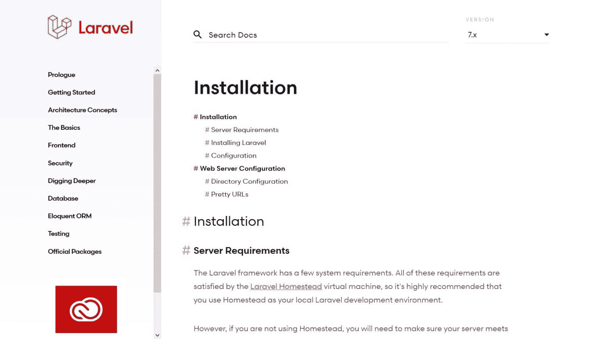

Official Laravel Docs

官方的 Laravel 文档是对 Laravel 框架的实际描述，由 Laravel 社区维护，在 GitHub 上也有。它从安装指南开始，提供了所有 Laravel 概念的概述，比如模板、安全性、数据库管理等等。你也可以在这里找到官方的 Laravel 包的文档。

**优点:**

*   最新的 Laravel 资源
*   信息结构良好，易于搜索
*   老版本的文档也是可用的
*   包括代码示例和最佳实践提示
*   你可以在 GitHub 上提交[错误报告](https://github.com/laravel/docs/blob/8.x/contributions.md)

**缺点:**

*   干巴巴、教科书般的语气和设计

#### 何时选择 Laravel 文档

Laravel 的官方文档对任何知识水平的人来说都是有用的，可以用来检查任何与 Laravel 相关的概念的细节。然而，由于其高信息密度，对于初学者来说，它可能会令人不知所措。

这是熟悉新版本的特性或比较不同版本的最佳地方。

### 2.拉勒维尔新闻(初级、中级、高级)

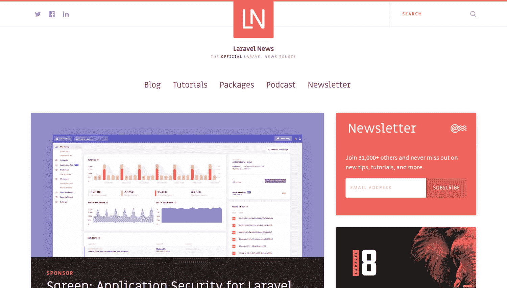

Laravel News

Laravel News 是一个包罗万象的 Laravel 教程网站。它有一个以最新的 Laravel 新闻为特色的博客，一个涵盖从初学者到专家级别主题的 Laravel 教程部分，一个两周一次的 Laravel 播客，以及一个每周日早上发送的 Laravel 时事通讯。Laravel News 还展示了流行的 Laravel 包，并附有简要描述和示例代码。

**优点:**

*   定期更新
*   以不同的方式传递内容(博客、[播客](https://kinsta.com/blog/what-is-a-podcast/)、时事通讯等)
*   最佳实践片段
*   关于构建真实世界 Laravel 应用程序/任务/工具的免费教程
*   有用的截图和代码片段

**缺点:**

*   有些帖子是赞助商的帖子(尽管有明确说明)
*   难以导航(同一教程系列的连续部分没有相互链接)

#### 何时选择 Laravel 新闻

Laravel News 是 Laravel 相关新闻的最佳免费来源。这些教程质量很高，涵盖了许多有趣的东西——但即使你对它们不感兴趣，也值得订阅时事通讯，以了解最新的 Laravel 框架(每个版本也包括一些 Laravel 工作列表)。每两周一次的 Laravel 新闻播客对于任何水平的 Laravel 开发者来说都是一个极好的资源。

### 3.Tuts Make(中级、高级)

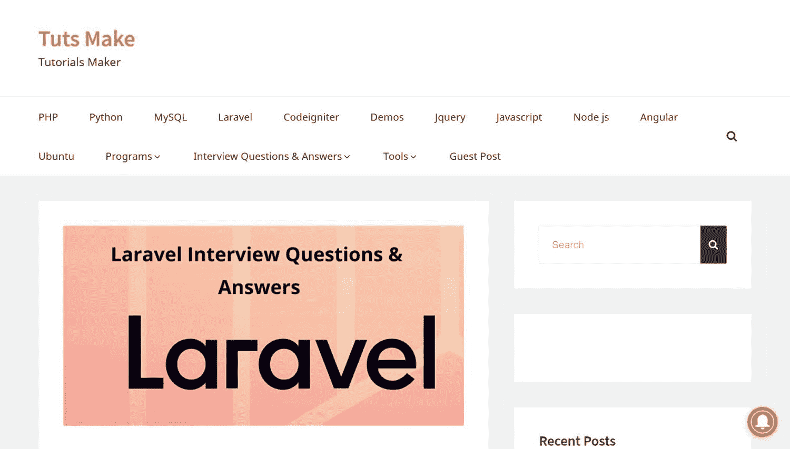

Tuts Make

Tuts Make 是一个流行的教程博客，涵盖了 T2 不同的编程语言和技术，包括 Laravel。这些教程简明扼要，讨论了常见的 Laravel 任务、错误和用例。它们包括多个代码片段，您也可以在自己的项目中使用。

TutsMake 也有一个单独的类别用于面试问答，有着直截了当和深思熟虑的解释。

**优点:**

*   定期更新
*   基于实践的教程
*   易于浏览的内容
*   冗长但结构良好的代码示例
*   工作面试问答

**缺点:**

*   教程很难浏览(没有标签或其他分类)
*   到处都有语法错误

#### 何时选择 Tuts 品牌

Tuts Make 绝对不适合新手。要理解这些教程，您至少需要具备 Laravel 的中级知识，因为它们非常基于代码，没有太多的理论讨论。这些教程也互不相关——Tuts Make 是一个博客，而不是一步一步的 Laravel 教程系列。如果你正在找一份 Laravel 的工作，不要错过它的面试问答部分；真的很好。

### 4.LaraShout(初级、中级、高级)

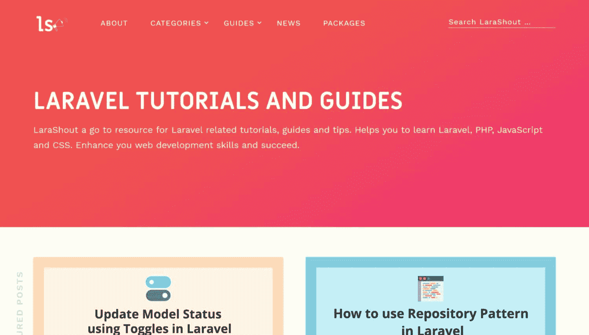

LaraShout

LaraShout 是一个完全专注于 Laravel 框架的免费教程网站。除了动手操作的 Laravel 教程，它还提供了一些重要理论概念的指南，如中间件、存储、队列和作业等。有些教程被分成系列，这样你可以对每个主题有更深的了解。

目前，LaraShout 有四个系列:集合、设计模式、电子商务应用程序开发和包开发。

**优点:**

*   易于导航的网站
*   教程从目录开始
*   丰富的内容(高质量的图像、代码示例、警告消息等)
*   基于理论和实践的教程

**缺点:**

*   有些类别只包含两到三个教程
*   更新频率较低

#### 何时选择 LaraShout

LaraShout 主要推荐给中级和高级学习者，尽管它也有一些初级教程。四个 Laravel 教程系列尤其值得一试——然而，请注意，它们不一定涵盖您需要的所有内容，因为 LaraShout 更像是一个技术博客，而不是一个全面的教育网站。

### 5.初级(初级，中级)

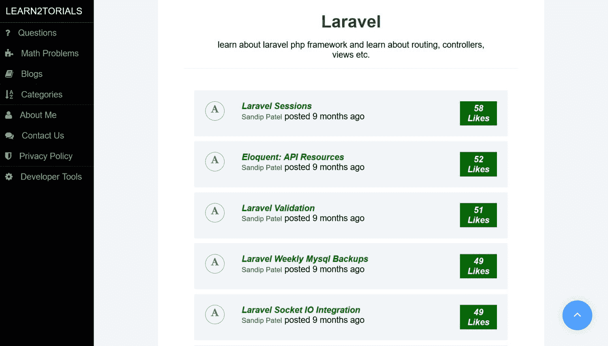

Learn2torials

Learn2torials 是 Sandip Patel 的一个人项目，提供不同编程语言和框架的免费教程。Laravel 教程部分涵盖了框架的许多重要方面，从安装到备份再到[缓存](https://kinsta.com/blog/laravel-caching/)。

它们更侧重于理论而不是实践，但是由于它们包括许多较长的代码示例，它们也可以帮助您解决现实世界中的问题。

**优点:**

*   配有深思熟虑的解释的精心编写的教程
*   教程采用简单易懂的问答形式
*   注释良好的代码示例
*   许多初级教程

**缺点:**

*   难以搜索网站(没有分类法)
*   教程不遵循逻辑顺序，从初学者到更高级的

#### 为什么选择学习目录

如果你是一个初学者或者已经知道一些语言的发展，但是你的知识还存在空白，Learn2torials 可以成为你理想的语言资源。它还与官方的 Laravel 文档有许多重叠，因此您可以一起使用这两种资源来巩固您对底层概念的理解。

### 6.举例说明(中级)

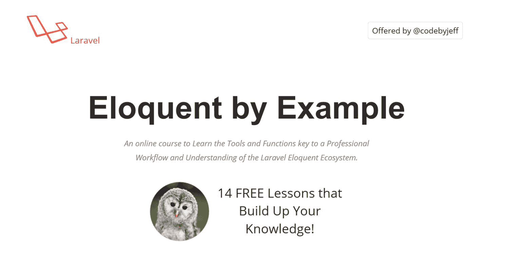

Eloquent by Example

[雄辩举例](https://eloquentbyexample.com/)是另一个单人项目，由杰夫·麦德森提供。这是一个免费的 Laravel 教程系列，只关于[雄辩的 ORM](https://laravel.com/docs/8.x/eloquent#introduction) ，负责在 Laravel 对象和后台运行的关系数据库(MySQL、PostgreSQL、SQLite 或 SQL Server，取决于您的选择)之间传输数据的对象关系映射器。

教程的结构是连续的课程，读起来就像一本关于雄辩的 ORM 的书的章节。

**优点:**

*   教程写得非常好(几乎像小说一样)
*   易于导航的结构良好的网站
*   丰富的代码示例
*   “进一步阅读”部分有资源推荐

**缺点:**

*   没有介绍性的课程来解释像什么是 ORM 这样的基本概念
*   教程没有出版日期

#### 什么时候选择雄辩的例子

如果你已经有一些 Laravel 知识，但想掌握雄辩的 ORM，这是最好的 Laravel 资源。也就是说，不清楚它最后一次更新是什么时候，但链接指向 Laravel 5.8 文档，所以它可能包含一些过时的信息，并错过了更新的内容。

尽管如此，这是你能找到的最全面的雄辩的指南。

## 6 个最佳免费 Laravel 教程视频、截屏和播客

### 1.BitFumes(初级、中级、高级)

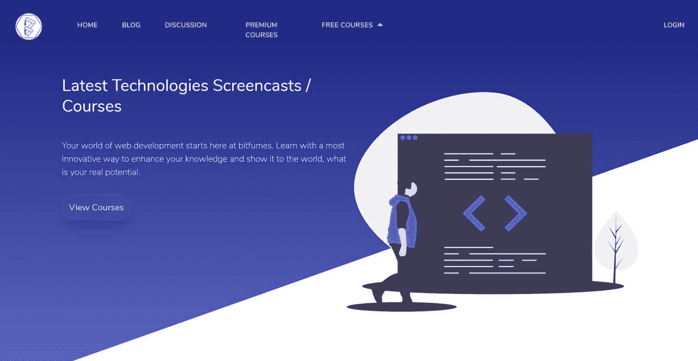

BitFumes

BitFumes 是一个教育网站，提供免费和付费的网络开发视频课程。它的[免费 Laravel 教程部分](https://bitfumes.com/courses/laravel)包括许多主要针对初学者的高质量视频课程，但你也可以在这里找到一些更高级的内容。

在[bit fuses 的 YouTube 频道](https://www.youtube.com/c/Bitfumes/playlists)上也有许多免费的 Laravel 教程，包括一个长达 [6.5 小时的课程](https://www.youtube.com/watch?v=BXiHvgrJfkg)，涵盖了 Laravel 从非常基础到高级主题的开发，如 [Livewire](https://laravel-livewire.com/) (高栈所需)。

**优点:**

*   观看免费课程不需要注册
*   视频分为章节和课程
*   进度跟踪功能
*   常用工具配对教程(Laravel 与 DigitalOcean、VueJS、PHPUnit 等。)
*   课程有正确的标签(长度、级别、教程数量、出版日期)

**缺点:**

*   难以理解的生态系统(网站和 YouTube 上都有免费的 Laravel 课程，还有一门高级课程)

#### 何时选择 BitFumes

BitFumes 的 YouTube 频道在任何情况下都值得浏览，即使你是高级水平。BitFumes 网站上的免费教程涵盖了很多在其他地方很难免费找到的初级主题。它还有[一门高级 Laravel 课程](https://bitfumes.com/premium/in-depth-laravel)，包括条带集成和测试驱动开发等高级主题。

### 2.Povilas Korop 的 Laravel Business(初级、中级、高级)

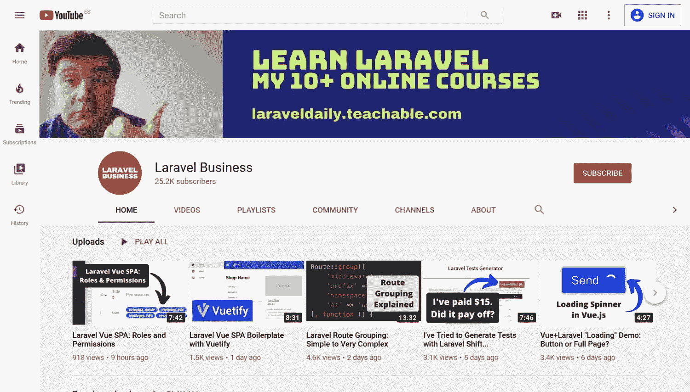

Laravel Business

Laravel Business 是一个受欢迎的 YouTube 频道，包括如何使用 Laravel 开展业务的免费视频教程。这是 Povilas Korop 的一个人项目，他也是 Laravel Daily 的作者(见下面的付费部分)。

在他的频道上，他每周都会发布几个 YouTube 视频，讨论诸如 Blade、口才、PHPUnit、SaaS 应用等主题。除了实践教程，Povilas 还做比较，提供职业和商业建议，并在“社区”标签下，每天分享“每日小贴士”。

**优点:**

*   几乎每天更新
*   *非常*基于实践的教程
*   较长的视频被分成较小的部分
*   教程视频下的相关链接推荐
*   有时他会在视频回答中回复他的观众

**缺点:**

*   视频很难搜索

#### 何时选择 Laravel 业务

即使 Laravel Business 主要针对更高级的用户，它也可以成为初学者的一个很好的 Laravel 资源，特别是 Povilas 的商业和职业建议。

如果你已经做了一段时间的 Laravel 开发，并且对你的工作有点厌倦，这个频道可以帮助你重新获得动力，因为它讨论了许多有趣的事情、新特性和你在其他地方找不到的特定用例。

### 3.拉宁(初级、中级)

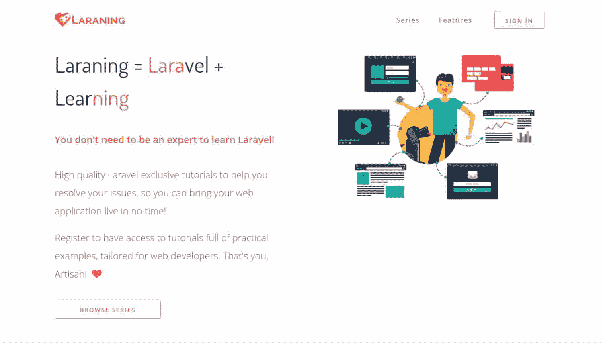

Laraning

Laraning 的名字来源于单词“Laravel”和“learning ”,这个名字是真实的，因为它完全致力于 Laravel 学习。它提供免费视频课程，分为“系列”、“专题”和“课程”。

“系列”是关于 Laravel 包和其他主题的松散耦合的视频教程。“功能”仍在开发中，目前只包括一个关于刀片模板引擎的视频教程。“课程”是更长的视频教程系列，例如针对初学者的综合“从 A 到 Z”课程。

## 注册订阅时事通讯

### 想知道我们是怎么让流量增长超过 1000%的吗？

加入 20，000 多名获得我们每周时事通讯和内部消息的人的行列吧！

[Subscribe Now](#newsletter)

**优点:**

*   结构良好的课程
*   易于导航的网站
*   实际的、真实的例子
*   全高清视频
*   代码内容[可在 GitHub](https://github.com/laraning) 上获得

**缺点:**

*   仍在开发中
*   视频没有发布日期

#### 何时选择拉宁

由于 Laraning 网站还没有完全成熟，你会发现到处都有缺失的功能。例如,“登录”按钮仍然不起作用，有些系列只有两个视频片段。然而，已经发布的教程质量很高，绝对值得一试，尤其是 Laravel from A to Z 课程，如果您刚刚开始使用该框架的话。

### 4.Laravel PHP 框架教程(初级，中级)

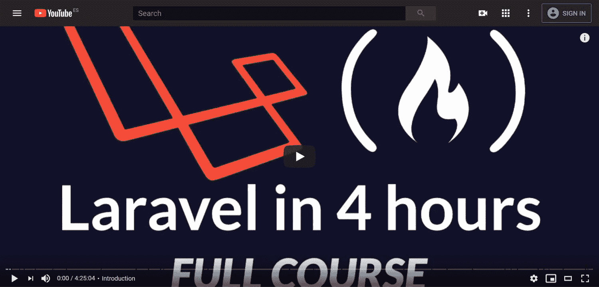

Laravel PHP Framework Tutorial

[Laravel PHP 框架教程](https://www.youtube.com/watch?v=ImtZ5yENzgE)是 FreeCodeCamp 在线学习平台推出的初级视频课程。尽管 FreeCodeCamp 课程的后端部分以 Python 为中心，但它也在其 Youtube 频道上分享其他后端语言的教育视频，这些视频是由其[开源社区](https://kinsta.com/learn/wordpress-communities/)的成员创建的。

这篇由 Victor Gonzalez 撰写的 Laravel 教程将指导您从头开始构建 Instagram 克隆，它具有跟随/取消跟随、个人资料编辑、调整图像大小等功能。这个视频大约有 4.5 小时长，但它被分成了几个小部分，这样你就可以很容易地看完。

**优点:**

*   真实世界项目
*   深入解释
*   由 FreeCodeCamp 审核
*   GitHub 上的演示代码
*   社区成员在评论区帮助解决问题

**缺点**

*   基于 Laravel 5.8，所以可能包含一些过时的信息(即使你可以在评论部分找到这些问题的修复)

#### 何时选择 Laravel PHP 框架教程 FreeCodeCamp

如果您想通过构建一个非常流行的真实应用程序的克隆来学习 Laravel，这里是免费学习的最佳场所之一。Victor 的解释很有思想，也很容易理解，如果你遇到问题，FreeCodeCamp 社区会很有帮助。

虽然它是针对初学者的，但如果你已经有一些 Laravel 知识，但想学习如何组装一个类似 Instagram 的应用程序，你可能也会发现它很有用。

### 5.让我们用 Laravel 构建:一个链接树克隆(初学者，中级)

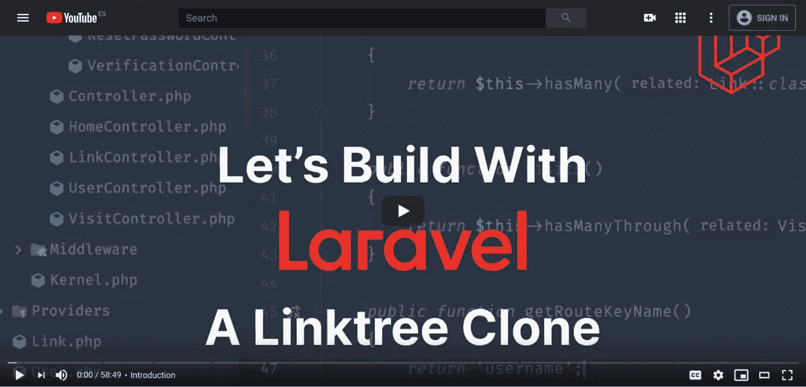

Let’s Build with Laravel: A Linktree Clone

[让我们用 Laravel 来构建:Linktree 克隆](https://www.youtube.com/watch?v=30qk04BG9G4)是一个快节奏的 Laravel 截屏，它教你如何构建一个类似于流行的 [Linktree](https://linktr.ee/) 服务的社交媒体登陆页面构建器应用程序。

该视频只有 58 分钟长，因为它没有解释基本概念或显示如何安装 Laravel，而是直接进入实践。这个免费的 Laravel 教程是由 Andrew Schmelyun 创建的，他在他的 YouTube 频道上还有其他几个 Laravel 视频，也值得一看。

**优点:**

*   简明扼要的解释，没有任何混乱或干扰
*   你可以在不到 1 个小时的时间内构建一个工作的 Laravel 应用程序
*   视频被分成更小的部分
*   源代码在 GitHub 上有

**缺点:**

*   音频质量不是最好的

#### 何时选择“让我们用 Laravel 构建:链接树克隆”

虽然 Youtube 上的视频描述说它是为初学者准备的，但如果你对 Laravel 完全陌生，你需要记住，这个视频假设了 Laravel 的一些预先存在的知识，例如安装或初始配置。

这篇 Laravel 教程非常适合用这个框架构建你的第一个应用程序，如果你想提高你的应用程序开发技能也是如此。

### 6.Laravel 播客(初级、中级、高级)

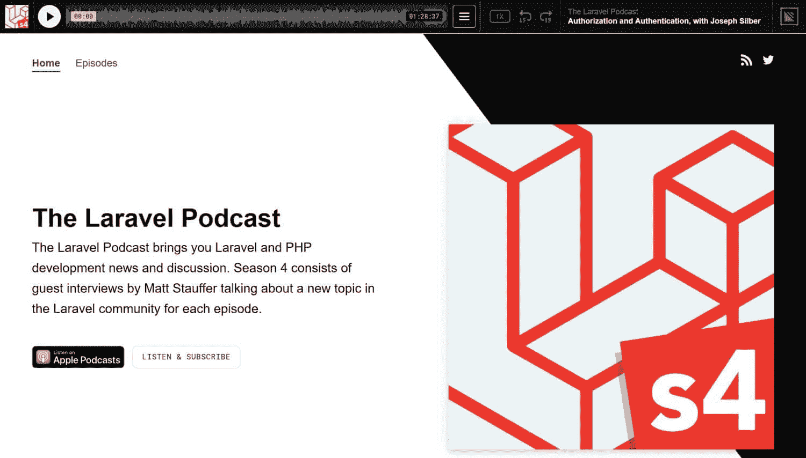

The Laravel Podcast

Laravel 播客是由 Matt Stauffer 主持的双周播客，以 Laravel 和 PHP 相关的讨论为特色。每一集都围绕一个主题，比如身份验证、迁移、调试、设置本地环境等等。剧集时长约 1.5 小时，你可以使用嵌入式播客播放器或苹果播客来收听。

**优点**

*   信息量大的内容
*   定期更新
*   剧集被很好地记录(摘要、注释、链接推荐)
*   有文字记录
*   高质量音频

**缺点**

*   不能下载单集

#### 何时选择 Laravel 播客

尽管播客不是经典的教程，但它是让你熟悉新技术、听取行业专家的观点以及了解最新功能的绝佳方式。因此，对于任何水平的开发者来说，Laravel 播客都是一个强烈推荐的 Laravel 资源。

(有没有考虑过做播客？查看我们关于如何[用 WordPress](https://kinsta.com/blog/wordpress-podcast/) 发布你的第一个播客的深度指南。

## 8 个最受欢迎的 Laravel 教程视频、截屏和书籍

### 1.拉腊卡斯特(初级、中级、高级)

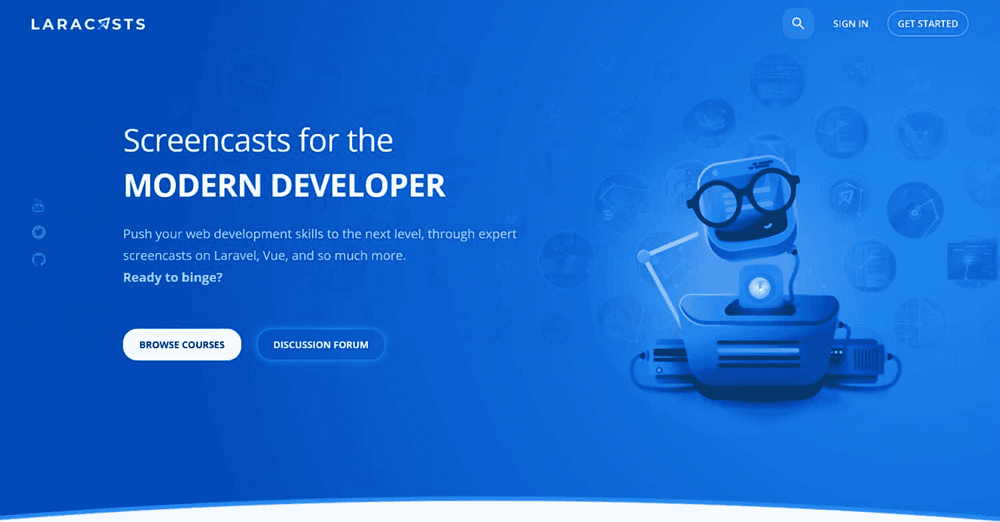

Laracasts

Laracasts 是一个优质的教育平台，提供关于 web 开发的视频。虽然它的主要焦点是 Laravel 框架，但它也有其他技术的课程，其中大部分可以与 Laravel 一起使用，如 [CSS](https://kinsta.com/blog/wordpress-css/) ，JavaScript，PHP，SQL，Vue.js 等等。

它还有五个特色 [Laracast 旅程](https://laracasts.com/skills/laravel) : Laravel、测试、PHP、JavaScript 和工具。旅程是你掌握某项技能所需的一系列截屏。

需要为您的客户站点提供一个非常快速、安全且对开发人员友好的托管服务吗？Kinsta 是为 WordPress 开发者设计的，提供了大量的工具和强大的仪表板。[查看我们的计划](https://kinsta.com/plans/?in-article-cta)

**优点:**

*   截屏有三种不同的组织方式(主题、系列、旅程)
*   易于导航的网站
*   非常高质量的截屏(音频和视频)
*   也有关于流行的 Laravel 包(Envoyer、Forge、Nova 等)和理论(坚实的原则、设计模式等)的截屏。)
*   活动论坛(可通过免费论坛帐户获得)

**缺点:**

*   没有免费试用期

#### 何时选择 Laracasts

Laracasts 是高质量的视频教程，每个级别都推荐。尽管这是一项高级服务，但你可以找到一些完全免费的系列，例如，Envoyer 上的[中级系列和 Forge](https://laracasts.com/series/envoyer) 上的[初级系列。然而，你不能过滤免费课程，所以你需要自己去找。](https://laracasts.com/series/learn-laravel-forge)

即使你不想为[会员](https://kinsta.com/blog/wordpress-membership-plugins/)付费，注册一个免费的论坛账户也是值得的，尤其是当你的代码需要一些社区帮助的时候。

### 2.拉勒维尔日报(初级、中级、高级)

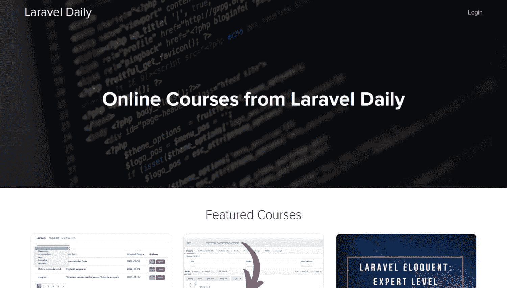

Laravel Daily

[Laravel Daily](https://laraveldaily.teachable.com/) 是前面提到的 Laravel 商业 Youtube 频道的创建者 Povilas Korop 的付费 Laravel 教程网站。Povilas 在这里有 10 个付费和 1 个免费的 Laravel 视频教程系列，涵盖了一些有趣的主题，如用 Laravel 创建发票制作应用程序，用 Laravel 和 Vue 构建 CRUD SPA，掌握口才，[用 Laravel 创建 REST API](https://kinsta.com/blog/wordpress-rest-api/) ，等等。

**优点:**

*   真实世界 Laravel 项目的实时编码
*   记录完善、结构合理的课程内容
*   一个免费的[初学者实用速成班](https://laraveldaily.teachable.com/p/laravel-for-beginners-your-first-project)
*   所有代码示例都可以在 GitHub 上找到
*   您可以通过安全的教学平台注册/支付
*   您可以通过电子邮件将您的问题发送给 Povilas

**缺点**

*   课程没有发布日期(尽管你可以从相关 GitHub repo 的提交历史中猜出)

#### 每日何时选择 Laravel

Laravel Daily 推荐给任何水平的 Laravel 开发者。如果你已经是 Laravel 商业频道的订户，并且喜欢 Povilas 的教学风格，他在 Laravel Daily 上的付费视频课程可以成为你在 Laravel 旅程中的下一步。

如果你想获得在就业市场上需求量很大的技能，这也是一个很好的选择，例如 API 或与 Laravel 一起的 [SaaS](https://kinsta.com/fastest-growing-saas-companies/) 开发。

### 3.代码课程(中级、高级)

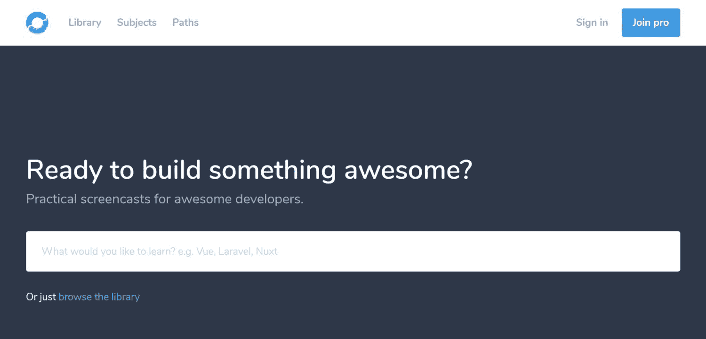

CodeCourse

CodeCourse 是一个用于 web 开发教程的优质截屏平台。大多数截屏都是以“路径”的形式构建的，分为四类:Flutter、Vue.js、Laravel 和 design patterns。

[Clean Laravel](https://codecourse.com/paths/clean-laravel-development) 路径由九个视频课程组成，教你如何编写高质量、干净的 Laravel 代码。CodeCourse 还有一个更短的 Laravel 路径，称为使用 Laravel 过滤的[。除了路径之外，CodeCourse 还提供](https://codecourse.com/paths/filtering-with-laravel)[单一课程](https://codecourse.com/library)，在这里你可以学习如何用 Laravel 构建不同类型的应用，包括 Twitter 克隆、代码片段网站和电子商务平台。

**优点:**

*   新内容会定期添加
*   关于路径和课程的丰富信息
*   高质量的截屏(视频和音频)
*   侧重于实践技能
*   免费提供名为[“片段”](https://codecourse.com/snippets)的短片
*   介绍视频是免费的

**缺点:**

*   结构不良的网站(不清楚他们有不同类型的内容，单一的课程只能从“图书馆”菜单中获得，“片段”很难找到，等等)
*   没有免费试用

#### 何时选择共修课程

要从 CodeCourse 的 Laravel 截屏中获益，您需要熟悉 Laravel 开发的基础知识。但是，如果你有框架的中级知识，或者已经在这个行业工作，你可以在这里学到很多新的东西。

尽管这是一项高级服务，但它真的不贵，所以如果你找到了你感兴趣的课程或道路，这是你时间和精力的一项很好的投资。

### 4.使用 Laravel、Vue.js 和 Capacitor 构建 API 和 spa(高级)

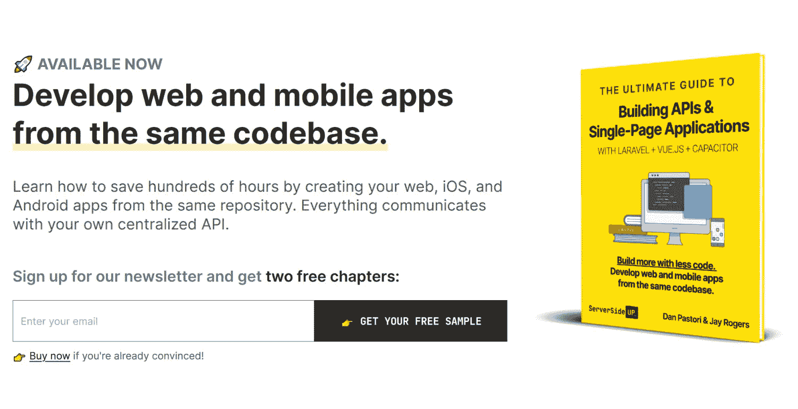

Building APIs and SPAs with Laravel, Vue.js, and Capacitor

[用 Laravel、Vue.js 和 Capacitor](https://serversideup.net/ultimate-guide-to-building-apis-and-spas-with-laravel-and-vuejs/) 构建 API&单页应用的终极指南是 Dan Pastori 和 Jay Rogers 的电子书，可以在 ServerSideUp 上找到。它涵盖了如何从同一个代码库开发 web 和移动应用程序——所有应用程序都与一个集中的 API 进行通信。

这本书讲述了构建一个名为“烘焙”的真实应用程序的过程，这是一个咖啡屋查找应用程序。这不仅仅是一个演示，而是一个现有的应用程序，允许你注册，添加你最喜欢的咖啡馆，在地图上找到咖啡馆，等等。你也可以在你的[安卓](https://play.google.com/store/apps/details?id=coffee.roastandbrew.mobile)或 [iOS](https://apps.apple.com/us/app/roast-brew-coffee/id1510419686) 设备上安装烘焙应用。

**优点:**

*   由行业专家撰写
*   结构良好的内容(销售页面上有目录)
*   两个免费章节(但是，您需要注册 ServerSideUp 时事通讯才能获得)
*   电容器优化的[草图和 Figma](https://kinsta.com/blog/figma-vs-sketch/) 图标模板
*   有三种不同的格式( [PDF](https://kinsta.com/blog/wordpress-pdf-viewer-plugins/) ，EPUB，MOBI)
*   访问私人在线社区以获得帮助(仅当您购买更贵的套装时)
*   终身访问和更新
*   在 ServerSideUp 网站上有一些免费的高级 Laravel 教程

**缺点:**

*   额外的视频教程(作为更昂贵的软件包的一部分宣传)仍在建设中

#### 何时选择“使用 Laravel、Vue.js 和 Capacitor 构建 API 和 spa”

如果你已经是一个经验丰富的 Laravel 开发者，这本电子书可以扩展你的专业知识，进一步拓宽你的知识面。它指导您在构建复杂应用程序时如何支持三种代码库(web、iOS、Android)。

它还将 Laravel 与前沿工具配对——[nuxt . js](https://nuxtjs.org/)前端框架(构建在 Vue.js 之上)和[电容器](https://capacitorjs.com/)跨平台运行时([见文档](https://capacitorjs.com/docs))。另外，它涵盖了 Laravel 8，所以现在它是市场上最新鲜的 Laravel 书(已经有 380 页，新的章节还在继续)。

### 5.LinkedIn 学习(初级、中级)

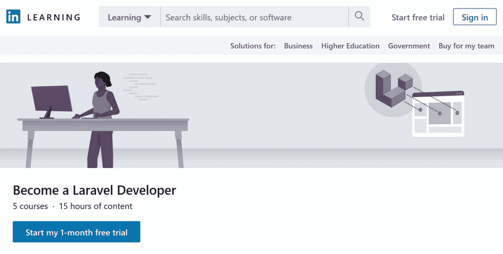

LinkedIn Learning

LinkedIn Learning，以前称为 Lynda.com，是一个优质的电子学习平台，提供了一个完整的学习途径。

它由五个独立的课程组成，从(1) Laravel 基础知识开始，然后涵盖(2)测试、安全性和部署，(3) RESTful API 构建，(4) Vue 基础知识，以及(5)将 Vue.js 和 Laravel 一起用作全栈环境。如果你完成了这条学习道路，你将有足够的知识开始你的职业生涯，成为一名全栈式 Laravel 开发人员。

**优点**

*   指导者是行业专家(贾斯汀·约斯特、雷·维拉洛博斯、迈克尔·苏立文)
*   LinkedIn 审核的高质量专业视频
*   结构良好、易于导航的内容
*   有文字记录
*   你可以获得一枚 Linkedin 完成徽章
*   一个月免费试用
*   适用于[安卓](https://play.google.com/store/apps/details?id=com.linkedin.android.learning&hl=en)和 [iOS](https://apps.apple.com/us/app/linkedin-learning/id1084807225) 的移动应用

**缺点**

*   这些课程涵盖了 Laravel 5 和 6，因此在某些地方可能包含过时的信息

#### 何时选择领英学习

如果你想成为一名全栈 Laravel 开发人员，并且没有庞大的投资组合，LinkedIn Learning 的 Laravel path 可能会帮助你找到工作，因为你可以在你的 LinkedIn 个人资料上显示完成徽章(见[它到底意味着什么](https://www.linkedin.com/help/learning/answer/82977/learning-certificates-of-completion-faqs?lang=en))。如果您想学习更长的关于全栈 Laravel 开发的课程，这也是一个不错的选择，在这里已经为您收集了所有必要的内容。

### 6.Udemy(初级、中级、高级)

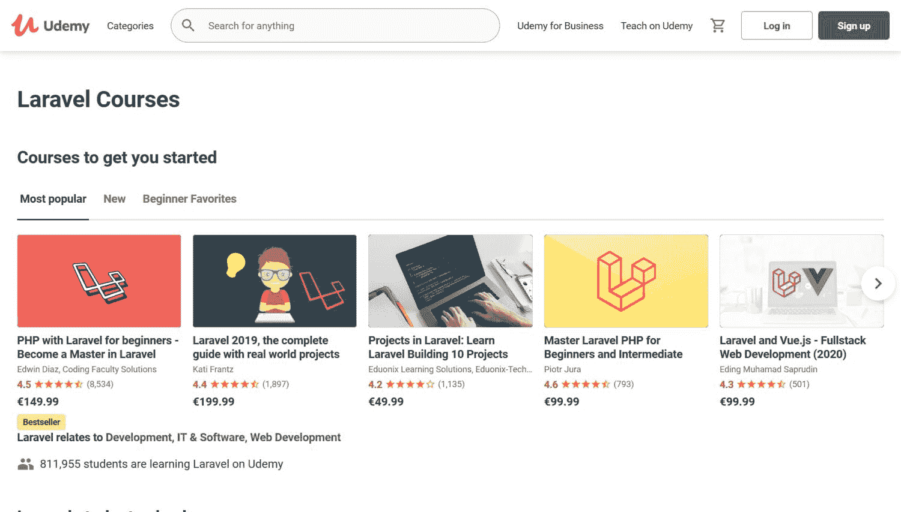

Udemy

Udemy 是一个全球性的电子学习市场，独立创作者在这里出售他们的视频课程，不仅仅是网络开发，还有许多其他科目。

Laravel 主题目前包括所有知识水平的 280 门课程。Udemy 的界面为你提供了几个不同的过滤器，比如价格、评分、时长、级别等等，帮助你找到最适合你的 Laravel 教程。除了英语，它还提供其他语言的课程。

**优点**

*   易于导航的用户界面
*   丰富的课程信息
*   拉勒维尔课程的广泛选择
*   不同语言的字幕(取决于课程)
*   竣工证明
*   30 天退款保证
*   适用于[安卓](https://play.google.com/store/apps/details?id=com.udemy.android&hl=en)和 [iOS](https://apps.apple.com/us/app/udemy-online-video-courses/id562413829) 的移动应用

**缺点**

*   视频和音频的质量参差不齐，因为课程是由独立作者上传的

#### 何时选择 Udemy

由于 Udemy 提供了近 300 个 Laravel 教程视频系列，你需要投入一些时间和精力来找到你所需要的。值得注意的是“畅销书”、“新品”和“热门&新品”的标签，尽管你无法过滤这些特征。

不要忘记阅读学生评论和观看预览，因为 Udemy 不是一个具有标准化质量保证流程的集中平台。如果你碰到一个坏苹果，你仍然可以使用 30 天退款保证拿回你的钱。

### 7.技能共享(初级、中级)

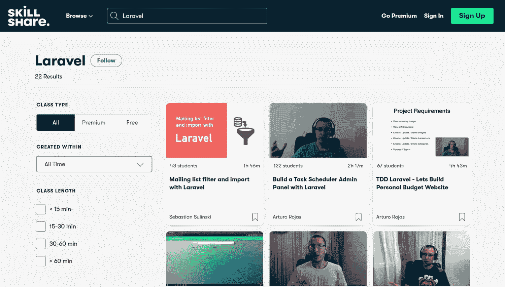

Skillshare

Skillshare 是另一个类似于 Udemy 的电子学习市场，但是它使用了不同的定价模式。在这里，你不需要为个别课程付费，但你需要支付月费，这样你就可以访问所有的 Skillshare 课程。

目前，Skillshare 列出了 22 门由独立教师创建的 Laravel 视频课程，但是，请注意，有些 PHP 课程由于某种原因也被列为“Laravel 课程”。

Skillshare 的大部分 Laravel 课程侧重于实践技能，例如建立一个个人预算网站，一个 [todo 应用程序](https://kinsta.com/blog/laravel-logging/#how-to-implement-laravel-logging-with-todo-app)，一个邮件列表过滤器，一个任务调度管理面板，以及其他一些功能。

**优点:**

*   结构良好的课程
*   易于导航的界面
*   内置笔记功能
*   视频配有字幕(英语)
*   适用于 [iOS](https://apps.apple.com/app/apple-store/id916819843) 和 [Android](https://play.google.com/store/apps/details?id=com.skillshare.Skillshare&referrer=utm_source%3Dskillshare%26utm_medium%3Dsite-footer) 的移动应用
*   7 天免费试用(需要信用卡详细信息)

**缺点:**

*   你必须注册才能看到价格计划
*   视频质量因课程而异
*   课程没有发布日期(尽管您可以筛选“今年创建的”课程)

#### 何时选择技能共享

虽然 Laravel 开发不是 Skillshare 的主要关注点，但你可以在这里找到一些不错的高级课程。如果你已经是 Skillshare 的会员，也值得看一看 Laravel 的教程视频。

或者，如果你是 Skillshare 的新手，但对他们教授的其他主题感兴趣(除了网络开发之外还有很多，从摄影到音乐到创意写作)，注册会员也是个好主意。

### 8.Eduonix(初级、中级)

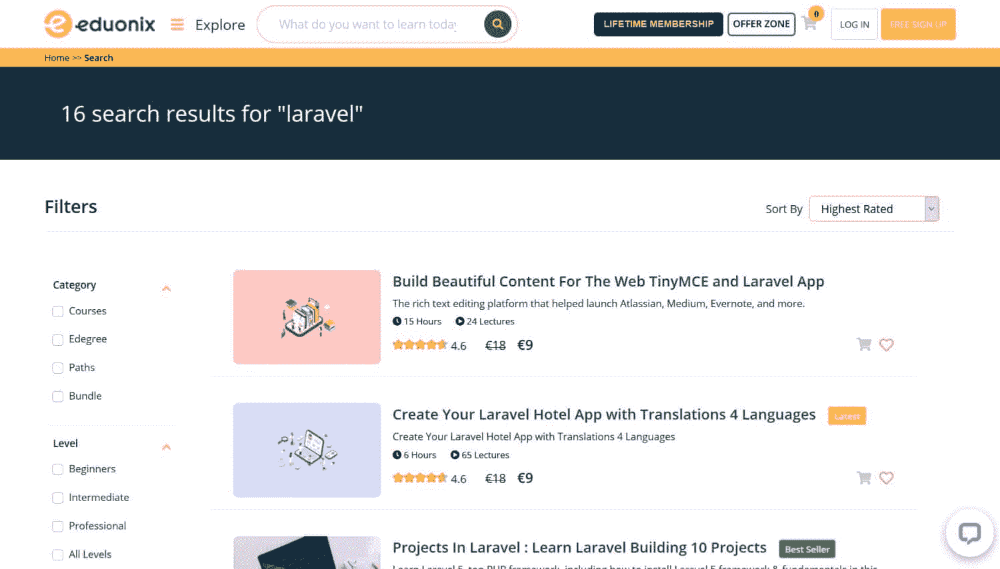

Eduonix

Eduonix 是一个拥有独立讲师的在线学习市场，类似于 Udemy 和 Skillshare。它使用与 Udemy 相同的定价模式，所以你可以单独为每门课程付费(然而，它可以选择所有 Eduonix 课程的终身会员资格和一些 T2 捆绑折扣)。

目前，它提供了 [16 个 Laravel 视频课程](https://www.eduonix.com/search?proname=laravel)，其中大部分课程会指导您完成一个动手项目，例如创建一个翻译成四种语言的酒店应用程序、一个单页论坛应用程序、一个带有 Vue 前端的联系人管理器应用程序(这个在“学习 Laravel Building 10 Projects”课程中)等等。

**优点:**

*   课程内容的详细信息(包括上次更新的时间)
*   真实项目
*   高级过滤系统
*   竣工证明
*   30 天退款保证

**缺点:**

*   视频和音频的质量因课程而异
*   廉价优惠券网站的外观和感觉

#### 何时选择 Eduonix

如果你对动手制作应用程序比理论更感兴趣，Eduonix 可能是你的一个不错的选择。尽管它没有提供大量关于 Laravel 开发的课程，但还是值得关注一下，特别是因为一些创作者在 Udemy 和 Eduonix 上都出售他们的课程，但价格不同(通常 Eduonix 更便宜)。

[Ready to dive into Laravel?⚡️ This guide to free and paid tutorials will help you master this popular framework.Click to Tweet](https://twitter.com/intent/tweet?url=https%3A%2F%2Fkinsta.com%2Fblog%2Flaravel-tutorial%2F&via=kinsta&text=Ready+to+dive+into+Laravel%3F%E2%9A%A1%EF%B8%8F+This+guide+to+free+and+paid+tutorials+will+help+you+master+this+popular+framework.&hashtags=PHP%2CLaravel)

## 摘要

设定一个学习目标来了解你的前进方向可以帮助你找到最适合自己的学习指南。如果你有自学在线学习的经验，你就已经知道你喜欢哪种类型的材料:基于文本的教程、视频、视频、播客、博客或更长的书。

您不一定要从一个 Laravel 教程开始，但是您也可以选择一个混合的方法。例如，你可以从视频课程开始，同时订阅时事通讯、收听播客、阅读博客。

如果你不确定自己需要什么技能，浏览求职网站是个好主意，比如 LaraJobs，看看市场上有什么需求(这可能会随着时间而变化)。

你也可以使用项目规划应用程序，如 [Trello 或其替代品之一](https://kinsta.com/blog/trello-alternative/)来跟踪你的进度，设置截止日期和提醒，并通过遵循学习计划来不断激励自己。

如果你选择了付费的 Laravel 教程，通常从按月订阅开始比提前一年付费更好，直到你知道你可以期待什么(即使按年订阅每月费用更低)。

最后，在学习过程中尽早开始搭建一个可以工作的 Laravel app。看到你已经能够完成一个现实世界的项目，可以帮助你跟上学习并达到你的目标。

* * *

让你所有的[应用程序](https://kinsta.com/application-hosting/)、[数据库](https://kinsta.com/database-hosting/)和 [WordPress 网站](https://kinsta.com/wordpress-hosting/)在线并在一个屋檐下。我们功能丰富的高性能云平台包括:

*   在 MyKinsta 仪表盘中轻松设置和管理
*   24/7 专家支持
*   最好的谷歌云平台硬件和网络，由 Kubernetes 提供最大的可扩展性
*   面向速度和安全性的企业级 Cloudflare 集成
*   全球受众覆盖全球多达 35 个数据中心和 275 多个 pop

在第一个月使用托管的[应用程序或托管](https://kinsta.com/application-hosting/)的[数据库，您可以享受 20 美元的优惠，亲自测试一下。探索我们的](https://kinsta.com/database-hosting/)[计划](https://kinsta.com/plans/)或[与销售人员交谈](https://kinsta.com/contact-us/)以找到最适合您的方式。