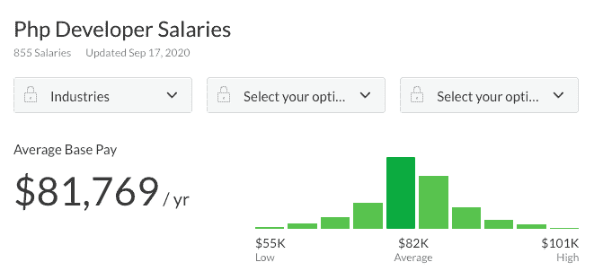
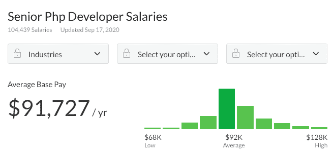
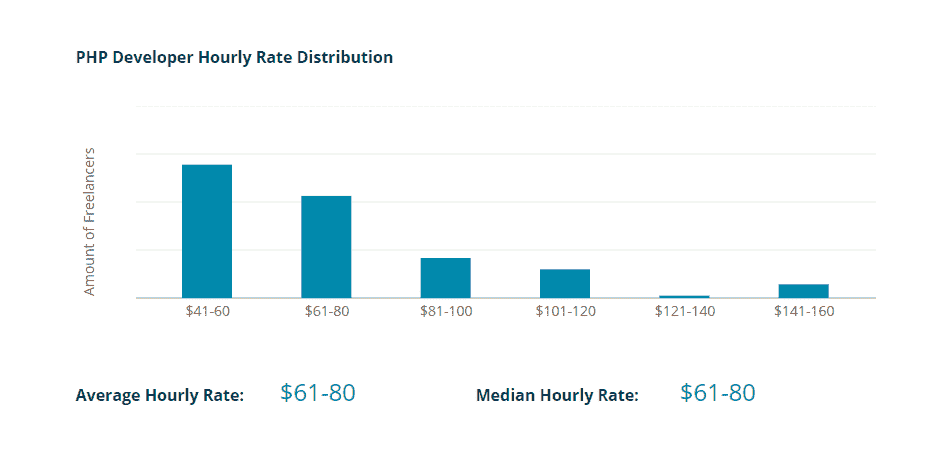
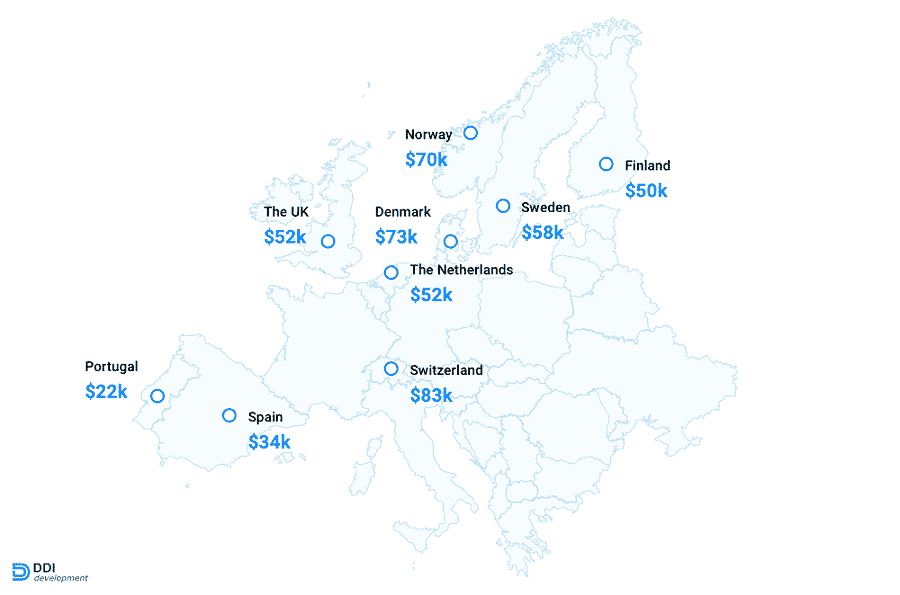
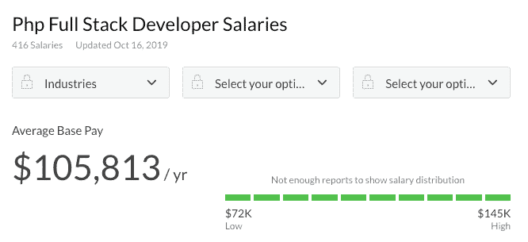
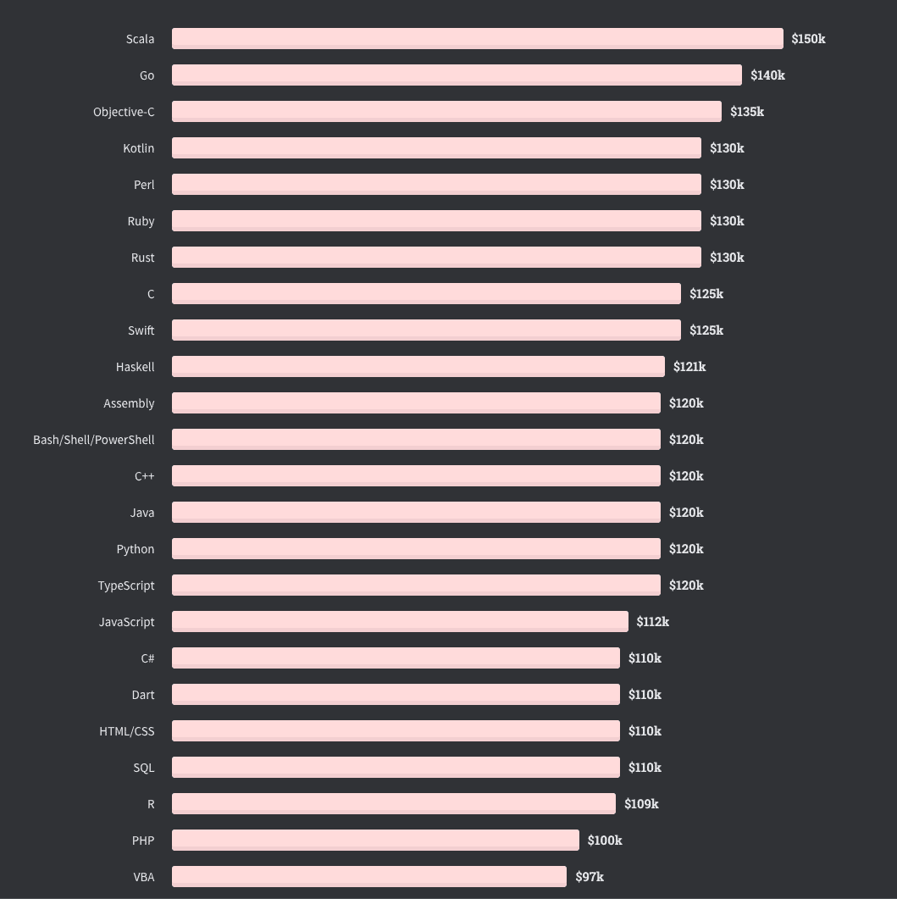

# PHP 开发人员平均工资是多少？深入研究 2022 年的数据

> 原文：<https://kinsta.com/blog/php-developer-salary/>

PHP 开发:一些人认为它是一种前景光明的流行语言，另一些人认为它是一种过时的技术，不值得花时间去学习。但是这些数字说明了什么，尤其是当你看一看 PHP 开发人员的工资时？

虽然肯定有许多更新、更炫、更令人兴奋的语言，但 PHP 仍然是后端 web 开发的可靠工具，也是许多雇主仍在寻找的技能。

有兴趣成为一名 PHP 开发人员吗？我们已经讨论了 web 开发人员的平均工资，现在让我们来看看 PHP 的收入情况。

快速提示:我们在这里四舍五入数字，所以请确保检查原始来源，以获得更准确的值。

## PHP 开发员是个好工作吗？

所以你正在考虑成为一名 PHP 开发人员。但这真的是你的工作吗？除了薪水的问题，这是一个值得追求的好职业吗？

关于 PHP，有一些事情需要记住。像任何其他编程语言一样，它有其优点和缺点。如果这是你要从事的职业，你会发现有很多理由去尝试。

第一: [PHP 是一门非常容易学的语言](https://kinsta.com/blog/php-tutorials/)。其他编程语言在您习惯之前可能会令人困惑，它们使用晦涩的命名约定或难以记忆的高级编码标准。

但是 PHP 清晰、易读、易于理解，这使得它成为学习最好的编程语言之一。如果你有任何编程背景，甚至对 web 开发是如何工作的有一点模糊的了解，你只要看一下就能大致了解一个 PHP 字符串在做什么。这是最好的语言之一。

不过，这种简单性确实意味着更多的竞争。所以刚开始，你的工资可能会低一些。但是高度熟练的 PHP 开发人员很受欢迎，所以如果你能掌握它，你就有可能赚很多钱。这种受欢迎程度意味着有大量的职业机会。

学习 PHP 的另一个好理由是:它可以与其他技能和语言完美结合。你可以学习 HTML/CSS 和 JavaScript，成为一名全栈开发人员，或者使用 SQL 进入数据库管理。C/C++程序也可以与 PHP 交互。有了`PHP’s exec()`功能，它可以和几乎任何东西一起工作。

与新的语言不同，PHP 不是一场赌博。它经过了尝试和测试，像 WordPress 这样的主要[项目甚至在 2022 年也保持了它的相关性。你的工作短期内不会有任何进展，这就是为什么这么多开发人员继续从事这项工作的原因。
T3】](https://kinsta.com/knowledgebase/what-is-wordpress/)

### 一个 PHP 开发人员是做什么的？

作为一名 PHP 开发人员，你的日常任务是什么？为此，我们需要回答[什么是 PHP](https://kinsta.com/knowledgebase/what-is-php/)以及如何使用它。

PHP 是一种通用的脚本语言。这意味着它实时执行脚本(不像“编译编程语言”在启动时一次运行)，并且可以用于创建任何类型的应用程序——尽管它更经常用于 web 开发。

它也是一种服务器端语言，这意味着它的代码是在你的服务器上执行的，而不是在访问者的浏览器上，不像客户端语言，如 [JavaScript](https://kinsta.com/blog/eliminate-render-blocking-javascript-css/) 或 [CSS](https://kinsta.com/blog/wordpress-css/) 。这使得[更加安全](https://kinsta.com/blog/wordpress-security/)，并且适用于向你的服务器发送数据等不易被操控的任务。

这通常就是 PHP 的用途:动态任务需要改变 web 服务器或数据库中的文件。虽然 [JavaScript](https://kinsta.com/blog/php-vs-javascript/) 和其他客户端语言可以动态地影响你的网站的外观和行为，而不会让你的服务器因请求而陷入困境，但 PHP 在后台执行关键任务。

作为一名 PHP 开发人员，你将负责网站的后端开发，为基于网络的应用程序和幕后工作打下基础。你可以[制作安全的表单](https://kinsta.com/blog/wordpress-forms/)和其他用户输入区域，与前端开发人员一起工作，并将数据库与你的 PHP 应用挂钩。

当然，您需要想出创造性的方法来解决问题，并使用 PHP 实现您的客户想要的特性。

初始设置期结束后，您需要[继续进行维护](https://kinsta.com/blog/wordpress-maintenance/)。这意味着当不兼容出现时要修复，[在 PHP 新版本发布时更新你的代码，](https://kinsta.com/knowledgebase/how-to-update-php-in-wordpress/)[维护数据库和表格。
](https://kinsta.com/knowledgebase/wordpress-repair-database/)

### 做一个 PHP 开发人员需要什么？

进入任何开发领域都需要一套类似的技能，尽管后端开发和 PHP 确实有其独特的要求。

首先是教育。如今，技术工作的雇主更关心经验而不是学位，尤其是初级职位和像 PHP 这样简单易学的语言。自由职业者、实习和初级工作可能是一个很好的方式来提升自己，获得找到一份好工作所需的经验。

然而，成为一名优秀的开发人员确实需要一系列的核心技能:

*   团队合作的能力。
*   [项目管理技能](https://kinsta.com/blog/wordpress-project-management-plugins/)，即知道如何设定目标、高效工作以及在期限内完成任务。
*   [故障排除](https://kinsta.com/blog/wordpress-errors/)、测试、[调试](https://kinsta.com/blog/wordpress-debug/)、[优化代码](https://kinsta.com/learn/speed-up-wordpress/)。
*   [良好的沟通](https://kinsta.com/blog/slack-alternatives/)技巧。
*   分析、创造和解决问题的技能。

此外，知道如何使用数据库几乎是必须的。即使您不是全栈开发人员，您也应该了解 HTML/JavaScript 的基础知识以及它们如何与 PHP 交互，这样您就可以识别兼容性错误。

[Want to make $81k/year? 💰 Check out this guide to PHP developer salaries to see how experience and location determine pay 🌎Click to Tweet](https://twitter.com/intent/tweet?url=https%3A%2F%2Fkinsta.com%2Fblog%2Fphp-developer-salary%2F&via=kinsta&text=Want+to+make+%2481k%2Fyear%3F+%F0%9F%92%B0+Check+out+this+guide+to+PHP+developer+salaries+to+see+how+experience+and+location+determine+pay+%F0%9F%8C%8E&hashtags=PHP%2CWebDeveloper)

## PHP 开发人员的平均工资

现在是你们期待已久的时刻:工资数字。

请记住，这些统计数据完全是自我报告的；只有在这些网站上注册并支付薪水的开发者才会对这个估价有所贡献。因此，这些数字不会十分准确，但它们可以让你大致了解你的预期收入。

如果你想要一个更官方的来源，美国劳动局报告称[网络开发者在 2019 年每年赚 74k 美元](https://www.bls.gov/ooh/computer-and-information-technology/web-developers.htm)。这是所有的 web 开发人员，而不仅仅是 PHP 开发人员，但它给了你一些东西来比较你的预期工资。

你也可以看看我们关于[网络开发人员薪水](https://kinsta.com/blog/web-developer-salary/)的报告，看看 PHP 开发进展如何。

现在让我们来看看 PHP 开发人员的平均工资。

*   [glass door](https://www.glassdoor.com/Salaries/php-developer-salary-SRCH_KO0,13.htm):81k 美元/年，低的 55k 美元，高的 100k 美元。
*   [zip recruiter](https://www.ziprecruiter.com/Salaries/PHP-Developer-Salary):86k 美元/年，低的 16k 美元，高的 137k 美元。
*   [工资等级](https://www.payscale.com/research/US/Job=PHP_Developer/Salary):64k 美元/年，最低 43k 美元，最高 94k 美元。
*   实际上，根据网站上发布的招聘信息，年薪为 9.4 万美元。

PHP developer salary (avg.)

总体来说还不错！将所有这些平均起来，您会得到每年 81，000 美元的估算值。对于像 PHP 这样容易学习的语言来说，这已经很不错了；每天几个小时的学习可以让你从一个不熟练的工人变成一个有才华的开发者，拿着舒适的薪水。

请记住，对于计算机科学和编程领域，这实际上是一个相当低的工资。其他语言可以支付更好的，超过 10 万美元/年，特别是在美国。

### PHP 开发人员的经验水平工资

开发人员的薪水因经验不同而差异很大。更多的经验意味着你可以独立处理更多的事情，帮助年轻的开发者，所以公司愿意支付额外的费用。

首先:初级或入门级的薪水。两者除了标题没有太大区别。这是你作为 PHP 开发人员的第一份工作所能期望得到的，你几乎没有经验，也许还受过一些教育。

作为一名初级 PHP 开发人员，你最多只有两三年的经验，你的任务是[编写基本代码](https://kinsta.com/blog/bitbucket-vs-github/)并完成大部分的[错误修复](https://kinsta.com/blog/wordpress-white-screen-of-death/)。

## 注册订阅时事通讯

### 想知道我们是怎么让流量增长超过 1000%的吗？

加入 20，000 多名获得我们每周时事通讯和内部消息的人的行列吧！

[Subscribe Now](#newsletter)

初级候选人的 PHP 开发人员平均薪资如下:

*   [glass door](https://www.glassdoor.com/Salaries/junior-php-developer-salary-SRCH_KO0,20.htm):64k 美元/年，低的 45k 美元，高的 90k 美元。
*   [zip recruiter](https://www.ziprecruiter.com/Salaries/Junior-Php-Developer-Salary):62k 美元/年，低的 26k 美元，高的 92k 美元。
*   Salary.com:63000 美元/年，典型的薪资范围是 56000-71000 美元。

正如你所看到的，这些数字变化不大，所以这可能是一个相当准确的估计。

接下来是高级 PHP 开发人员的工资。作为一个大四学生，你应该有 3-5 年的经验，可能十年甚至更久。

Senior PHP developer salary (avg.)

你将被期望在没有监督的情况下工作，编写高质量的代码，并有可能监督和培训他人。伴随着所有这些责任而来的是更高的薪水。这就是进入 PHP 真正有回报的地方。

*   [glass door](https://www.glassdoor.com/Salaries/senior-php-developer-salary-SRCH_KO0,20.htm):92k 美元/年，低的 68k 美元，高的 128k 美元。
*   [zip recruiter](https://www.ziprecruiter.com/Salaries/Senior-PHP-Developer-Salary):10.1 万美元/年，低的 4.4 万美元，高的 13.7 万美元。
*   [薪资等级](https://www.payscale.com/research/US/Job=Senior_PHP_Web_Developer/Salary):88k 美元/年，低的 61k 美元，高的 121k 美元。

### 代理与自由职业 PHP 开发人员的工资

自由职业是艰难的。你 100%负责挣你自己的工资，另外[负责你所有的市场营销。你需要先被找到，然后才能挣到钱，而且很难起步。但是到底低了多少呢？](https://kinsta.com/blog/inbound-marketing/)

可能没有你想象的那么糟糕。事实上，自由职业的 PHP 开发人员有潜力赚很多钱。

根据 ZipRecruiter 的数据，自由职业的 PHP 开发人员平均年薪为 89k 美元，或 43 美元/小时。与 [Glassdoor](https://www.glassdoor.com/Salaries/freelance-web-developer-salary-SRCH_KO0,23.htm) 报道的一般自由网页开发者 75000 美元(或约 36 美元/小时)的工资相比，这已经相当不错了。

CodeMentor [报告](https://www.codementor.io/freelance-rates/php-developers)自由 PHP 开发人员平均每小时挣 61-80 美元。按照每周 40 小时的标准工作时间(请记住，你可能会工作得更少，尤其是刚开始的时候)，那就是每年 12.7 万到 16.6 万美元。

Freelance PHP developer’s hourly rate (avg.)

这与机构工资相比如何？大多数自由职业者不会把自己描述为“初级”或“高级”PHP 开发人员，所以为了准确比较，回头看看这些薪水是个好主意。

平均所有来源的数据:

*   初级 PHP 开发人员每年挣 6.3 万美元
*   高级 PHP 开发人员的年薪约为 94k 美元

另一方面，自由职业的 PHP 开发人员有可能赚得更多。这完全取决于你设定的时薪，以及你向客户推销时薪的能力。

需要为您的客户站点提供一个非常快速、安全且对开发人员友好的托管服务吗？Kinsta 是为 WordPress 开发者设计的，提供了大量的工具和强大的仪表板。[查看我们的计划](https://kinsta.com/plans/?in-article-cta)

### 不同国家 PHP 开发人员的平均工资

很多这样的薪资报告可能有点偏向美国的开发者。

如果你住在美国以外的地方，作为一名 PHP 开发人员，你希望挣多少钱？下面是[欧洲 PHP 开发者薪资](https://ddi-dev.com/blog/programming/average-php-developer-salary-in-the-usa-and-other-countries/)；其余数据是从 Glassdoor 收集的。请注意，在此列表中，这些都已转换为美元。

*   瑞士:8.3 万美元/年。
*   美国:8.1 万美元/年。
*   澳大利亚:7.3 万美元/年。
*   丹麦:7.3 万美元/年。
*   挪威:7 万美元/年。
*   瑞典:58k 美元/年。
*   德国:56k 美元/年。
*   英国:52k 美元/年。
*   荷兰:5.2 万美元/年。
*   芬兰:5 万美元/年。
*   法国:45000 美元/年。
*   加拿大:47k 美元/年。
*   西班牙:34k 美元/年。
*   葡萄牙:22k 美元/年。
*   印度:8k 美元/年。

DDI Development

查看你所在地区的工作列表，更准确地了解你的期望。

简而言之:美国肯定是收入最高的国家之一，这可能是因为需求以及与其他一些国家相比生活成本较高。你可能还想看看美国各州的 PHP 开发人员平均工资列表。纽约州排名最高，为每年 9.4 万美元，北卡罗来纳州排名最低，仅为每年 6.9 万美元。

### 全栈 PHP 开发人员工资

全栈开发人员拥有广泛的技能。您将使用 PHP 作为后端，同时用 HTML、CSS 和 JavaScript 维护前端。除此之外，您可能还会使用数据库代码。

这基本上是一个完整的网站，所以你会期望获得相当不错的薪水。

*   玻璃门:10.6 万美元/年。
*   [zip recruiter](https://www.ziprecruiter.com/Salaries/Full-Stack-PHP-Developer-Salary):8.5 万美元/年，最低 2.7 万美元，最高 13.7 万美元。
*   实际上:11.3 万美元/年，基于超过 1.7 万的薪水。

Full stack PHP developer salary (avg.)

这是所有 PHP 开发人员中工资最高的，甚至与高级开发人员相比也是如此。足够的经验真的能有回报！

## PHP 开发人员工资低吗？

现在你已经看到了数据，这些工资与其他开发语言相比如何？虽然高年级学生、全职员工和成功的自由职业者能挣不少钱，但对于普通的 PHP 开发人员来说，与他们的薪资预期相关的数据看起来并不那么令人兴奋:

Programming language salaries

无论你使用从 Glassdoor、Payscale 和类似网站收集的[我们的数据](https://kinsta.com/blog/web-developer-salary/#web-developer-salaries-by-language)，还是[的其他调查](https://insights.stackoverflow.com/survey/2020#technology-what-languages-are-associated-with-the-highest-salaries-worldwide)，PHP 一直都在垫底。唯一一种似乎更便宜的语言是 [HTML](https://kinsta.com/blog/wordpress-vs-static-html/) 和 [CSS](https://kinsta.com/knowledgebase/combine-external-css/) 。

这是为什么呢？

学习这门语言的容易程度可能是原因之一。PHP 是一个很好的入门技能，很容易掌握，但这当然意味着你要与大量初级开发人员争夺客户和公司职位。

你可以在两周到一个月的学习和练习中学会 PHP。你不需要太多的技术专业知识就能进入其中:你可以在几周内从零编程技能到编写功能性 PHP 应用程序。

另一方面，当前顶级受薪语言之一 Scala 的创造者在 Coursera 上有一门[课程。大约需要七个月才能完成！这也不仅仅是你可以作为你的第一个编程语言的东西。你需要过去的经验。](https://www.coursera.org/specializations/scala)

但是随着你的成长和通过低技能的竞争，学习如何用 PHP 编写更复杂的任务和处理更大的项目，你会发现你的工资变得比其他语言更有竞争力。

[Let's talk salaries. 💸 Learn what factors determine your pay as a PHP developer (hint: in Switzerland, you could be earning $83k!)📈Click to Tweet](https://twitter.com/intent/tweet?url=https%3A%2F%2Fkinsta.com%2Fblog%2Fphp-developer-salary%2F&via=kinsta&text=Let%27s+talk+salaries.+%F0%9F%92%B8++Learn+what+factors+determine+your+pay+as+a+PHP+developer+%28hint%3A+in+Switzerland%2C+you+could+be+earning+%2483k%21%29%F0%9F%93%88&hashtags=PHP%2CWebDev)

## 摘要

众所周知，与其他编程语言相比，PHP 的工资较低，数字也表明了这一点。除了 HTML 和 CSS，PHP 是报道最少的开发者之一。肯定有更多高薪的软件工作。

尽管如此，它仍然为你的职业发展提供了可观的收入和良好的机会。想想 WordPress 的生态系统，它充满了可以工作的[主题](https://kinsta.com/blog/fastest-wordpress-theme/)和[插件](https://kinsta.com/best-wordpress-plugins)以及总是要发布新产品的公司。

拥有多年各种语言经验和技能的高级和全栈 PHP 开发人员是收入最高的人。刚开始的时候，预计薪水会低一些，但是要知道随着你的成长，薪水只会越来越好。

* * *

让你所有的[应用程序](https://kinsta.com/application-hosting/)、[数据库](https://kinsta.com/database-hosting/)和 [WordPress 网站](https://kinsta.com/wordpress-hosting/)在线并在一个屋檐下。我们功能丰富的高性能云平台包括:

*   在 MyKinsta 仪表盘中轻松设置和管理
*   24/7 专家支持
*   最好的谷歌云平台硬件和网络，由 Kubernetes 提供最大的可扩展性
*   面向速度和安全性的企业级 Cloudflare 集成
*   全球受众覆盖全球多达 35 个数据中心和 275 多个 pop

在第一个月使用托管的[应用程序或托管](https://kinsta.com/application-hosting/)的[数据库，您可以享受 20 美元的优惠，亲自测试一下。探索我们的](https://kinsta.com/database-hosting/)[计划](https://kinsta.com/plans/)或[与销售人员交谈](https://kinsta.com/contact-us/)以找到最适合您的方式。