# 废弃购物车电子邮件的可操作指南(示例、拆卸和模板)

> 原文：<https://kinsta.com/blog/abandoned-cart-email/>

电子商务比以往任何时候都发展得更快，但大多数在线商店都饱受废弃购物车泛滥之苦。

平均而言， [79.17%的网上购物车](https://www.salecycle.com/blog/featured/10-fascinating-stats-cart-abandonment/)会在顾客完成购买前被丢弃。因此，如果你有一个网上商店，在[结账过程中](https://kinsta.com/blog/woocommerce-payment-gateways/)，你可能会失去十个潜在顾客中的八个。

凭借 18.64% 的[平均转化率，废弃的购物车电子邮件可以帮助赢回这些客户中的很大一部分。](https://www.barilliance.com/cart-abandonment-rate-statistics/)

在本指南中，我们将为您提供所需的一切。

我们将介绍什么是废弃购物车，如何通过电子邮件赢回客户，并为您提供所需的工具。

## 什么是废弃手推车？

当您的潜在客户将商品添加到他们的收银台，但未能完成购买时，就会出现废弃购物车。

例如，一个潜在客户可能会在 Amazon 上将一件商品添加到他们的购物车中。

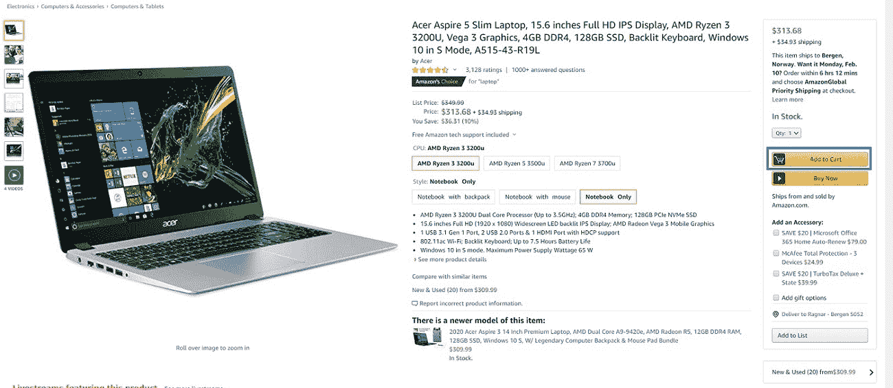

Amazon add to cart

此时，他们已经创建了一个新的在线购物车，里面只有一件商品。但这不是购买的最后一步。

当他们稍后查看他们的购物车时，他们决定不结账并购买购物车中的商品。

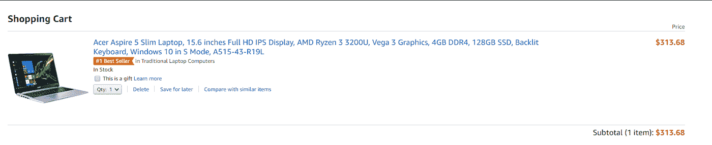

Amazon shopping cart

因此，他们没有点击结账按钮，填写他们的账单细节，并为他们的商品付款，而是直接离开网站。

由于他们[“放弃”购物车](https://kinsta.com/blog/shopping-cart-abandonment/)而没有完成交易，这被称为放弃的购物车。

实体店相当于从一辆已经装满商品的购物车前走开，然后离开商店，因此得名。

[79.17% of online shopping carts get abandoned before the customer finalizes their purchase. 😱 Stop this process in its tracks with this guide 🛒Click to Tweet](https://twitter.com/intent/tweet?url=https%3A%2F%2Fbit.ly%2F348Jm9u&via=kinsta&text=79.17%25+of+online+shopping+carts+get+abandoned+before+the+customer+finalizes+their+purchase.+%F0%9F%98%B1++Stop+this+process+in+its+tracks+with+this+guide+%F0%9F%9B%92&hashtags=Ecommerce%2COnlineStore)

## 废弃购物车邮件是如何工作的？

废弃购物车电子邮件通过跟踪用户在你的网站上的行为来工作。该软件记录了他们浏览的产品、购物车中的商品以及他们购买的商品。

如果你使用 Shopify 或 BigCommerce 等[电子商务平台，它们会自动跟踪这些行为和指标，而无需定制开发跟踪系统。另外，有可能现有客户已经注册了他们的邮箱，所以很容易联系到他们。但是如果你使用的是](https://kinsta.com/blog/shopify-alternatives/) [WooCommerce](https://kinsta.com/blog/woocommerce-tutorial/) ，你也可以做同样的事情。

一旦潜在客户将商品添加到购物车，然后离开您的网站，电子商务平台会将其注册为丢失或废弃的购物车。

例如，Shopify 在核心中包含了基本的废弃购物车邮件，你可以在**设置>通知**部分编辑邮件模板。

例如，您可以通过 CSS 样式表编辑设计，或者为特别高价值的客户添加自定义消息。

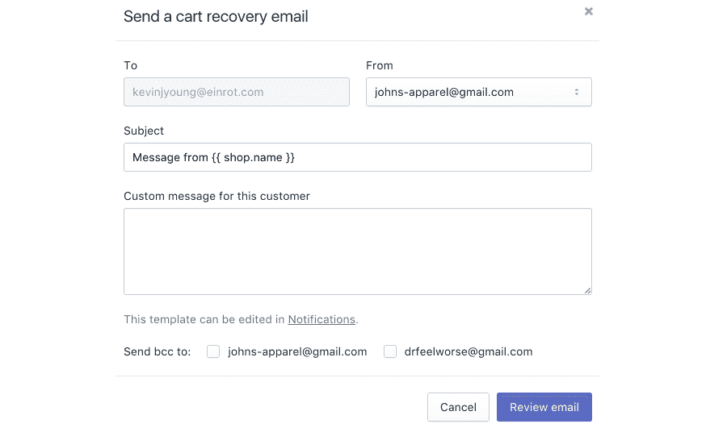

Shopify – Abandoned cart email template

基于此模板的电子邮件将在客户放弃购物车时自动发送。

如果你想更多地控制你的电子邮件的内容和设计，你也可以安装和使用第三方电子邮件营销工具。这样，您可以创建完全可定制的多步电子邮件活动，在他们放弃购物车后的一定时间内发送多封电子邮件。

## 如何在主要电子商务平台发送废弃购物车电子邮件

在本节中，我们将快速介绍如何使用行业领先的电子商务平台编辑和发送废弃购物车电子邮件； [WooCommerce](https://kinsta.com/blog/woocommerce-tutorial/) 、 [Shopify](https://kinsta.com/blog/woocommerce-vs-shopify/) 、 [BigCommerce](https://kinsta.com/blog/woocommerce-alternative-bigcommerce/) 。

(查看我们的[2022 年 11 个最佳 Shopify 选择](https://kinsta.com/blog/shopify-alternatives/))。

### WooCommerce 中的购物车废弃电子邮件

WooCommerce 没有任何支持弃车邮件的内置功能。你可以使用 WooCommerce 的官方扩展[跟进](https://woocommerce.com/products/follow-up-emails/)，单站点许可证的费用为 99 美元。

另一个选择是使用免费的 WooCommerce 插件。

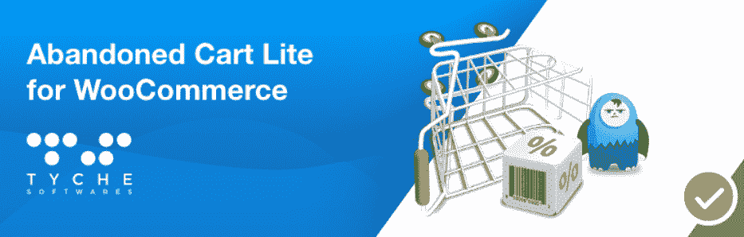

Abandoned Cart Lite for WooCommerce plugin

这个插件将在你的 WooCommerce 仪表板上添加一个新的部分，名为**废弃的购物车**。

通过单击菜单中的此链接，您可以打开一个部分，您可以在其中编辑您的电子邮件内容、更改电子邮件发送设置、检查已恢复的购物车等。

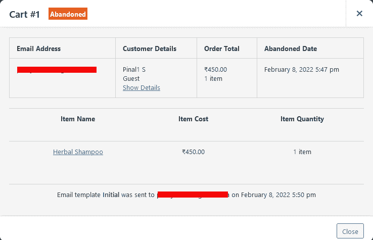

Abandoned Cart Lite for WooCommerce – templates tab

您可以使用标准的 WordPress WYSIWYG 编辑器，通过点击**添加新模板**链接，在**废弃购物车>电子邮件模板**部分创建您的电子邮件。

#### WooCommerce 的其他购物车废弃电子邮件工具:

*   [WooCommerce 恢复废弃购物车插件](https://codecanyon.net/item/woocommerce-recover-abandoned-cart/7715167)
*   [保持完整](https://wordpress.org/plugins/retainful-next-order-coupon-for-woocommerce/)
*   [Metorik](https://woocommerce.com/products/metorik/)
*   WooCommerce 的 MailChimp】

### Shopify 中的购物车放弃电子邮件

有了 Shopify，您就拥有了 core 中包含的一些基本功能，允许您在自己选择的时间发送一封简单的电子邮件。

您可以在**废弃结账**下的**设置>结账**部分访问这些设置。

然而，为了控制你的电子邮件的模板和内容，你需要安装一个像[废弃购物车回收](https://apps.shopify.com/recover-my-cart)这样的应用程序，每月花费 19 美元。

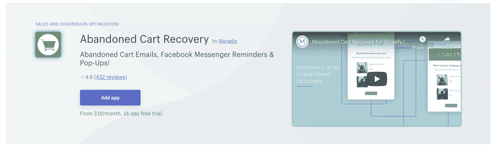

Abandoned cart – Shopify app

有了它，您可以完全控制您的电子邮件的内容，多久发送一次，创建弹出窗口来捕捉潜在客户的电子邮件，等等。

#### Shopify 的其他购物车放弃电子邮件工具:

*   [一致的购物车应用](https://apps.shopify.com/consistent-cart)
*   [米制](https://apps.shopify.com/metrilo)
*   [CM 商务](https://apps.shopify.com/cm-commerce)
*   [秘密](https://apps.shopify.com/privy)

### BigCommerce 中的购物车废弃电子邮件

BigCommerce 是唯一一个让您开箱即可完全控制废弃电子邮件的解决方案。

您可以控制电子邮件的设计以及邮件内容，如产品图片、文本等。，甚至发送多少封电子邮件/何时发送。

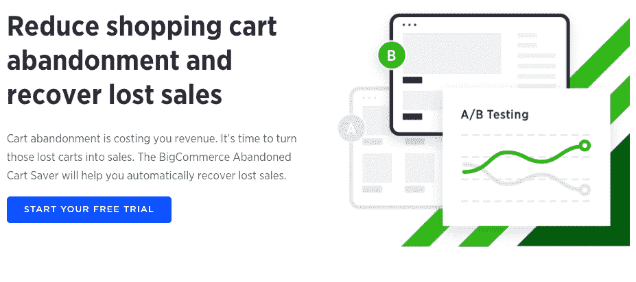

BigCommerce – Cart abandonment emails

您可以从仪表板的**营销废弃购物车通知**部分编辑所有设置。

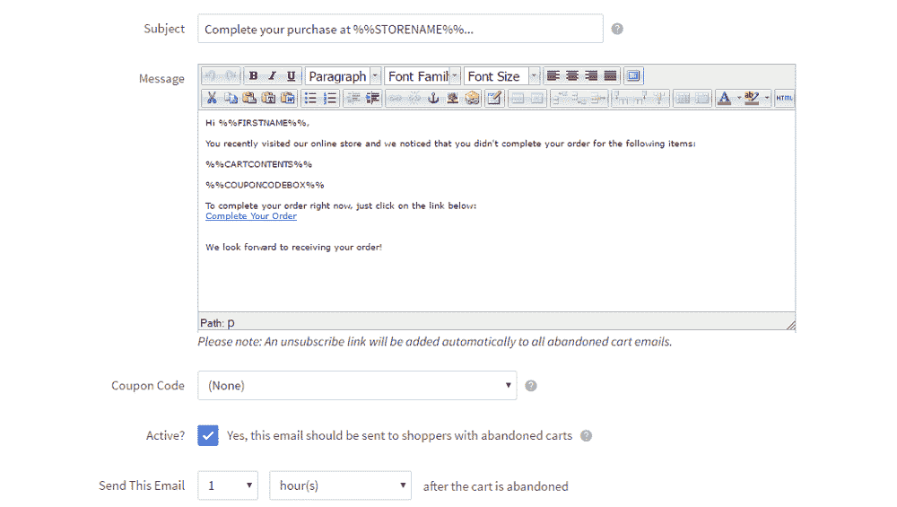

BigCommerce – email template editor

基本模板在桌面和手机上看起来都不错，并且你可以完全控制 HTML。

#### Bigcommerce 的其他购物车废弃电子邮件工具:

*   [Springbot](https://www.bigcommerce.com/apps/springbot/)
*   [秘密](https://www.bigcommerce.com/apps/privy/)
*   [CM 商务](https://www.bigcommerce.com/apps/cm-commerce/)
*   [Klaviyo](https://www.bigcommerce.com/apps/klaviyo/?search=abandoned)
*   [Omnisend](https://www.bigcommerce.com/apps/omnisend/)

### 使用第三方工具的高级电子商务电子邮件营销

第三方[电子邮件营销软件](https://kinsta.com/blog/email-marketing-software/)可以帮助你超越基本的弃车运动。您将通过使用专门的电子商务工具获得最佳效果。

通过本机集成，他们不仅可以帮助您发送弃车电子邮件，还可以根据他们的浏览和购物历史发送提醒和建议。

以下提供商提供了适用于三大平台的应用，包括开箱即用的购物车放弃活动、基于购买的细分以及更多电子商务功能。

*   [Klaviyo](https://www.klaviyo.com/)
*   [Omnisend](https://www.omnisend.com/)
*   [秘密](https://www.privy.com/)
*   [Springbot](https://www.springbot.com/)
*   [米制](https://www.metrilo.com/)
*   [点数字](https://dotdigital.com/)
*   [CM 商务](https://www.campaignmonitor.com/products/cm-commerce/)

[Retainful](https://www.retainful.com/) 、 [MailerLite](https://kinsta.com/blog/mailchimp-alternatives/#2-mailerlite) 、 [ConstantContact](https://kinsta.com/blog/mailchimp-alternatives/#17-constant-contact) 拥有本地电子商务集成，包括购物车放弃活动以及 Shopify 和 WooCommerce 的细分。

BigCommerce 确实提供了非常强大的开箱即用的购物车放弃电子邮件，所以你可能认为你不需要第三方工具，但它确实有其局限性。

例如，你不能使用细分来提供个性化的点滴活动，这是[更好的电子邮件营销](https://kinsta.com/blog/email-marketing-tips/)的最佳实践之一。

## 废弃购物车电子邮件示例

盲目地投入并创建你的第一个弃车活动并不是一个好主意。不如借鉴一下 2022 年其他公司在做什么。

下面我们介绍了废弃购物车邮件的真实例子，并强调了它们的对错。

### Boot Barn

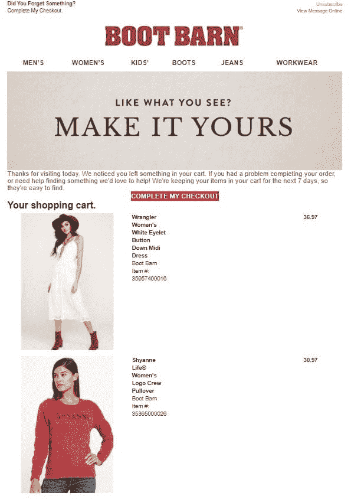

Boot Barn – abandoned cart email

#### 他们做对了什么

虽然这不是有史以来最伟大的购物车放弃恢复邮件，但 [Boot Barn](https://www.bootbarn.com/) 确实在这里做了一些事情。

留在购物车中的商品用产品图片突出显示。该电子邮件是在客户放弃购物车的同一天发送的。

他们让客户知道，在购物车自动重置之前，他们只有有限的时间(7 天)来恢复购物车。

#### 还有比这更好的吗

也不缺少需要改进的地方。除了产品类别、性别和尺寸信息之外，没有与产品相关的产品描述或文本。

带有[菜单链接](https://kinsta.com/blog/website-navigation/)的标准标题转移了人们对这是一封关于废弃购物车的提醒邮件的注意力。

“完成我的结账”链接/按钮没有必要那么小，因为这是一封 [HTML 电子邮件](https://kinsta.com/blog/html-email/)。他们应该包括一个更大的 CTA 按钮。

设计不是很平衡，左边是大图片，右边只有几个字的产品信息。

### 人类设计

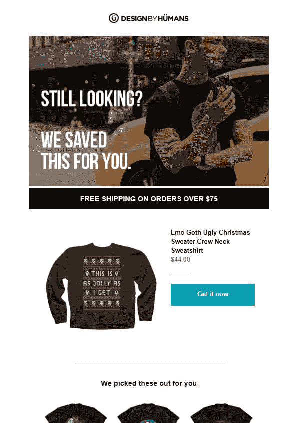

Design By Humans – abandoned cart email

#### 他们做对了什么

这个例子是单个产品的好看的弃车邮件。[为人类而设计](https://www.designbyhumans.com/)打开一个定制的标题图像，使电子邮件的目的变得清晰。

它还用清晰的图像和[标题](https://kinsta.com/knowledgebase/hide-page-title-wordpress/)突出显示有问题的产品，让事情变得简单。行动号召是一个清晰的按钮，上面写着“立即行动”，所以没有混淆的余地。

这个设计很平衡，很好的利用了留白和颜色来区分不同的元素。

最后，在最初的废弃物品下面，他们包括了一些相关的产品。当顾客在最后一刻因为口味、价格、尺寸或其他因素而改变主意时，这种策略会很有用。

#### 还有比这更好的吗

但是这封邮件并不完美。他们可以通过提及问题中的购物车或产品多长时间可用来引入一种紧迫感。例如，“这件衬衫是限量系列的一部分，所以我们不能保证供应能持续多久。如果你想确保它符合你的尺寸，你应该尽快订购。”

他们可能还想使用一些文本/文案来阐明情况，并强调他们最有说服力的卖点。

### GoPro

GoPro – abandoned cart email example

#### 他们做对了什么

[GoPro](https://gopro.com/) 向我们展示了另一个关于单个产品的废弃购物车邮件的例子。

他们在电子邮件的顶部用一个合适大小的产品图片突出显示了被放弃的产品。GoPro 还推荐了相关产品，如备用电池、SD 卡和三脚架。

#### 还有比这更好的吗

这里有很多地方可以改进。没有定制的标题或任何文本来指出他们为什么发送邮件超出了主题行。

这封邮件看起来有点空，没有利用 HTML 来创建一封设计良好的邮件。除了标题之外，它看起来就像一封带有一些图片的文本邮件。

也没有任何稀缺性或吸引力来解释为什么客户应该改变对产品的想法。

### 热点话题

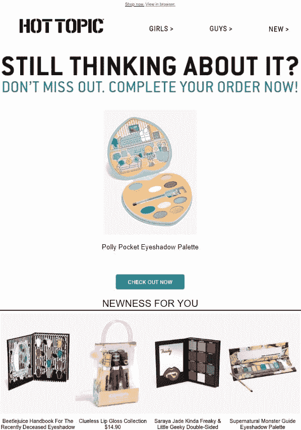

Hot Topic- abandoned cart email example

#### 他们做对了什么

[热门话题](https://www.hottopic.com/)更为人所知的是他们的实体经验，但正如这封电子邮件所证明的那样，他们对电子商务也有很好的理解。

电子邮件标题清楚地传达了客户为什么会收到这封电子邮件，以及他们下一步应该做什么。此外，电子邮件还在顶部突出显示了产品，带有[产品图片和标题](https://kinsta.com/blog/conversions-woocommerce-product-pages/#2-use-highquality-product-images)，后面是一个清晰的 CTA 按钮。

最后，他们还提供了一系列类似的产品，以防顾客因为价格、口味或品牌而改变主意。

## 注册订阅时事通讯

### 想知道我们是怎么让流量增长超过 1000%的吗？

加入 20，000 多名获得我们每周时事通讯和内部消息的人的行列吧！

[Subscribe Now](#newsletter)

#### 还有比这更好的吗

标题可以改进，稍微更适合品牌，不那么咄咄逼人。他们也可以包括几行文字，以涵盖特定的产品或创造一种紧迫感。

图像的灰色背景也与设计的其余部分产生了轻微的不和谐效果(当你选择你的[配色方案](https://kinsta.com/blog/website-color-schemes/)时，你应该总是投入时间)。

### Snowboards.Com

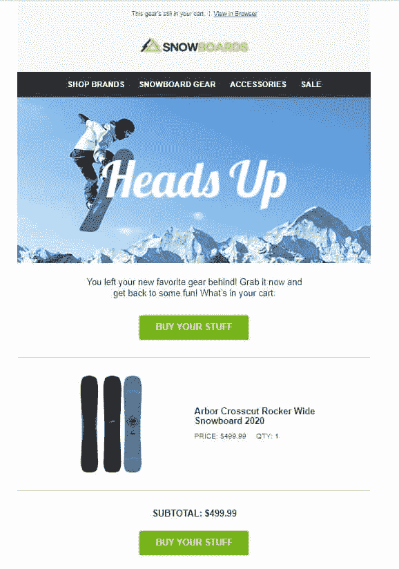

Snowboards.com – abandoned cart email

#### 他们做对了什么

[Snowboards.com](https://www.snowboards.com/)用一个相关的、引人注目的标题图形开始邮件，但是从那以后一切都走下坡路了。

设计简单，将读者的注意力集中在产品图像和 CTA 按钮上。

#### 还有比这更好的吗

虽然“抬头”标题确实吸引了读者的注意力，但它并没有清楚地传达邮件的内容或目的。

“买你的东西”也不是世纪经典。弃车者也没有真正的动力去采取行动。

### 亚马孙

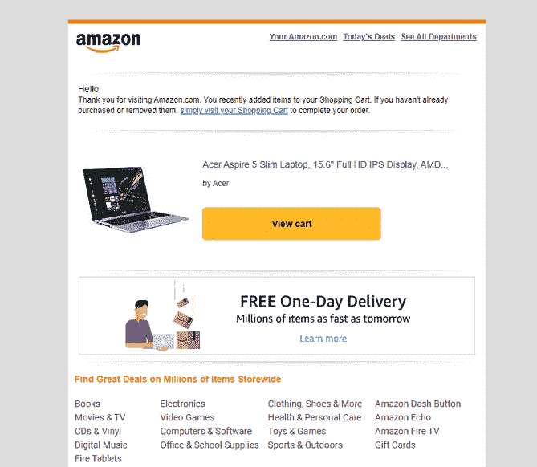

Amazon – abandoned cart email

#### 他们做对了什么

亚马逊严重依赖电子邮件作为销售更多产品的工具。如果你对此有任何疑问，只需快速搜索一下你的收件箱。

这份文稿直截了当，切中要害，不咄咄逼人，也不卖弄。设计很简单，但将读者的注意力集中在废弃的产品和 CTA 上。

这封邮件还强调了亚马逊对现有或潜在亚马逊 Prime 订户的竞争优势(免费一日送达)。

#### 还有比这更好的吗

它们可以包括一个定制的标题，传达电子邮件的“为什么”。没有紧迫感，邮件也不确定客户是否已经完成购买。

### 袖扣

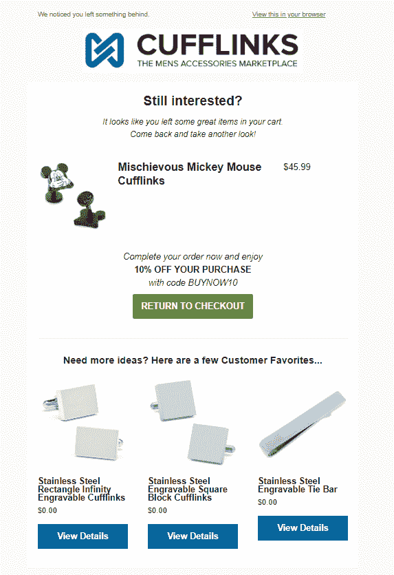

Cufflinks – abandoned cart email

#### 他们做对了什么

[袖扣](https://www.cufflinks.com/)电子邮件以一个标题和两行简洁的文字开始，立即给客户提供背景信息。产品图片和标题在文件夹上方可见，有助于潜在客户在打开电子邮件的第一秒就记住他们错过了什么。

它们甚至包括一个优惠券代码，给购物车放弃者一种紧迫感和尽快完成订单的动力。

#### 还有比这更好的吗

产品图片有点小，被推到左边，产品标题和定价信息的空间太大。

注意:看起来他们推荐的商品的价格要么不起作用，要么被错误地填写为$0.00。在将邮件发送给客户之前，一定要对其进行测试。

### 无花果

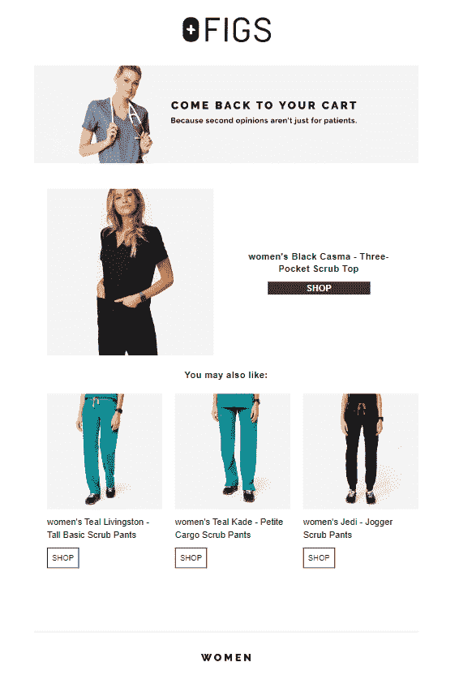

Figs – abandoned cart email

#### 他们做对了什么

电子邮件以清晰的标题和诙谐的副标题开始，让潜在客户有理由再给产品一次机会。

设计简单而平衡，并为犹豫不决的顾客突出了多种相关产品。

#### 还有比这更好的吗

行动号召按钮很小，和文本颜色一样，在邮件布局上也没有我们希望的那么突出。

客户没有理由越早回去越好

需要一个一流的，快速，安全的主机为您的新电子商务网站？Kinsta 提供超快的服务器和来自 WooCommerce 专家的 24/7 世界级支持。[查看我们的计划](https://kinsta.com/plans/?in-article-cta)

### 自由的人们

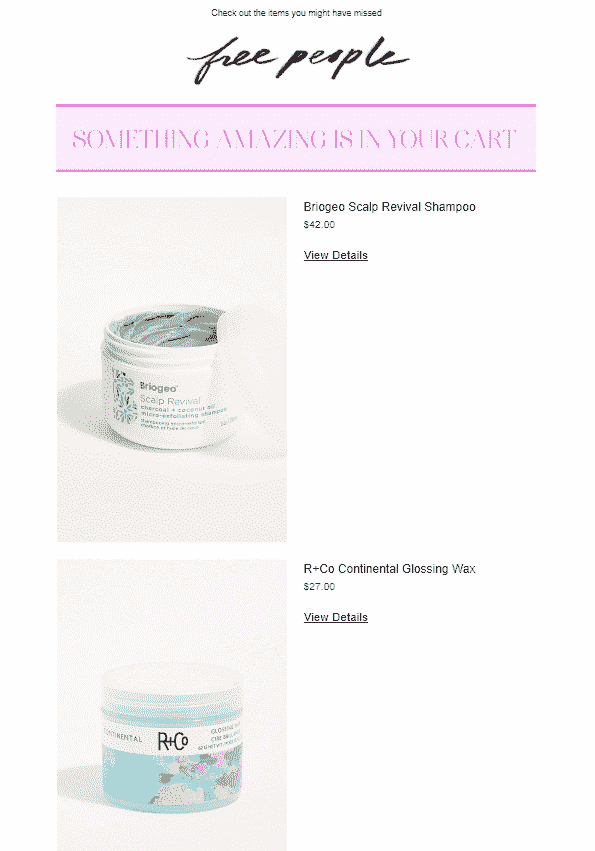

Free People – abandoned cart email

#### 他们做对了什么

[Free People](https://www.freepeople.com/) 的邮件以[直截了当的标题](https://kinsta.com/blog/headline-analyzer/)开始，让客户清楚地了解他们为什么会收到邮件。

购物车中的产品以大尺寸、高质量的产品图像为特色。

#### 还有比这更好的吗

行动号召隐藏在与普通文本颜色相同的文本链接中。标题之外没有文案，读者短期内没有采取行动的动力。

### 佩奇牛仔布

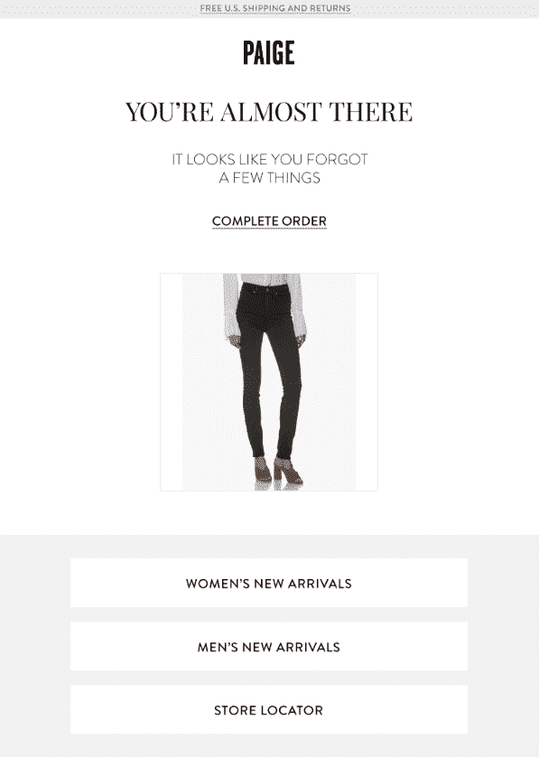

Paige Denim – abandoned cart email

#### 他们做对了什么

Paige Denim 的邮件用标题抓住了读者的注意力，并用副标题阐明了目的。

购物车由作为设计中心点的单一产品图像表示。

这封邮件显然是为手机设计的，手机是你的客户最有可能阅读你邮件的地方。

(建议阅读:[响应式网页设计初学者指南](https://kinsta.com/blog/responsive-web-design/))。

#### 还有比这更好的吗

行动号召是一个黑色的链接，所以它不会从文本的其余部分中突出出来。除了电子邮件中的一张图片之外，没有任何产品信息，因此无法 100%清楚废弃的购物车中包含了什么。

### 罗马原件

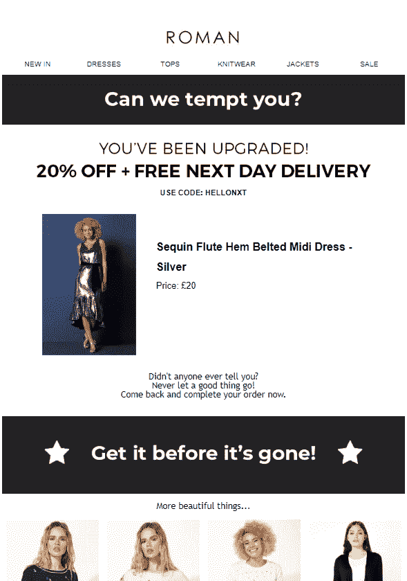

Roman Originals – abandoned cart email

#### 他们做对了什么

罗马原件用特别优惠立刻抓住读者的注意力。他们[明白营销](https://kinsta.com/blog/inbound-marketing/)是让某人现在**采取行动**的战斗，而不是以后，他们的文案和行动号召反映了这一点。

#### 还有比这更好的吗

这个设计很简洁，用图像突出了废弃的产品，但是图像尺寸有点小，最好不要靠左对齐。

## 废弃的购物车电子邮件模板

许多[自动回复器和电子邮件自动化工具](https://kinsta.com/blog/saas-marketing/#autoresponders)提供了不同的模板，你可以快速编辑它们来创建一封漂亮的废弃购物车电子邮件。

MailChimp 有一类专门的电子商务模板，你可以很快将其转化为正确的东西。您可以通过导航至活动>电子邮件模板>创建模板>主题来联系他们:

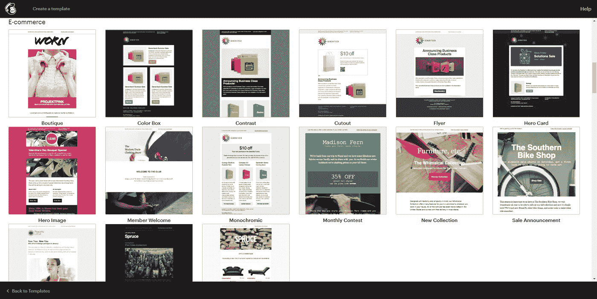

Email templates in Mailchimp

请记住，模板所做的只是控制你的图片和文本的外观，你控制的是电子邮件的实际内容。因此，如果你选择上面的任何一个模板，你可以很容易地添加一个标题，如“你忘记我们了吗？”并创建一个相关的电子邮件。

[Campaign Monitor](https://kinsta.com/blog/mailchimp-alternatives/#16-campaign-monitor) 还有一部分模板是为交易和优惠设计的，您可以重新利用。

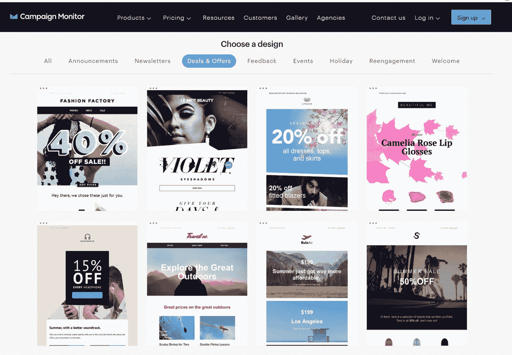

Campaign Monitor – email templates

几乎所有主要的电子邮件营销工具都会为你提供适合放弃购物车活动的模板。

还有 HTML5 电子邮件设计服务，你可以挑选和使用废弃的购物车模板，然后将其与你的电子邮件营销解决方案集成。

Litmus 提供了一系列由 Email Monks 团队设计的废弃购物车电子邮件模板。

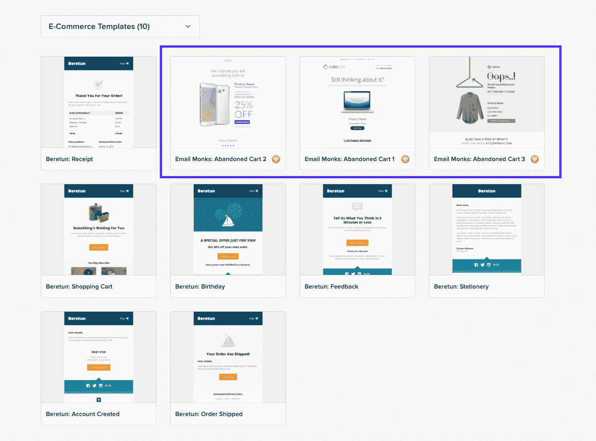

Litmus – abandoned cart email templates

这个模板系列是专为废弃的购物车电子邮件设计的，但要使用它，你需要一个石蕊账户。免费试用后，Litmus email builder 将成为您自动回复邮件之外的额外费用。

Stripo 是另一个类似的服务，它提供了几个模板来帮助你解决弃车问题。

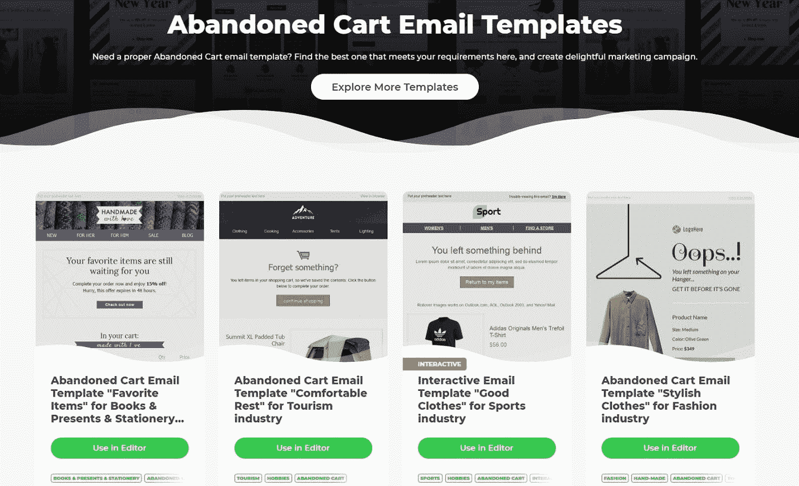

Stripo – abandoned cart email template

与 Litmus 不同，Stripo 有一个免费的永久计划，这意味着你可以使用模板和电子邮件生成器进行设置，尽管你将被限制在一个项目和两个模板。

建议阅读:[邮件排版:邮件的 8 种最佳字体](https://kinsta.com/blog/best-fonts-for-email/)

## 废弃购物车电子邮件策略

废弃购物车邮件有三大策略。所有策略都依赖于[电子邮件自动化](https://kinsta.com/blog/email-marketing-best-practices/#email-marketing-platform)，因为手动将每个购物车与电子邮件地址匹配是不可能的。

*   第一个是发送一个带有链接的简单提醒，你可以在所有平台和大多数自动回复器上设置。但是为了降低你的放弃率，仅仅发送一封带有链接的两行电子邮件是不够的。
*   第二个选择是在带有产品图片的电子邮件中突出显示购物车中的实际商品，这可能需要插件或扩展。这是[细分/个性化](https://kinsta.com/blog/saas-marketing/#email-list-segmentation)的一个例子。这些电子邮件与每个客户更相关，因为它突出了他们感兴趣的实际产品。
*   第三种是在几天内发送一个废弃购物车的电子邮件序列，以购物车中商品的折扣代码结束。你需要一个单独的电子邮件工具或者至少一个应用程序/扩展来实现这个策略。

### 废弃购物车电子邮件主题行

大多数废弃的购物车邮件主题都集中在情感和时间敏感的词上，比如“忘记”、“放弃”、“快点”、“不要错过这个”等等。

为了支持这一论点，让我们来看看我们上面检查过的电子邮件的主题行，这些主题行之前没有显示:

*   佩奇·德尼姆:你忘了什么吗？
*   人类设计:我们为你保存了这个
*   罗马原件:不要忘记你的篮子…
*   靴子仓:你忘了什么东西吗？
*   戈普罗:别忘了黑英雄
*   自由人:别忘了我:“(xoxo，你的购物袋
*   热门话题:您的购物车有废弃问题。
*   图:遗弃问题。我们明白了。
*   亚马逊:宏基 Aspire 5 超薄笔记本电脑。

如你所见，我们可以说他们都遵循了[吻法](https://www.interaction-design.org/literature/topics/keep-it-simple-stupid)(保持简单愚蠢)。

说到文案，这或许是最好的文案法则。具体来说，对于废弃的购物车主题行，它通过清晰和简单展示了全部的力量。

这就是为什么你不应该让你的主题太花哨。专注于抓住你的准顾客的注意力，让他们关注你，并且清楚地告诉他们他们留下了一辆购物车。

### 废弃购物车电子邮件时机:你应该什么时候触发你的电子邮件？

对于这类问题，从来都没有一成不变的答案。然而[数据显示](http://rejoiner.com/resources/abandoned-cart-email-timing/)如果你只是发送一封邮件，你将获得的最高投资回报率将是在放弃的同一天发送一封邮件，延迟 1 小时。这可能会为你提供最高的转化率。

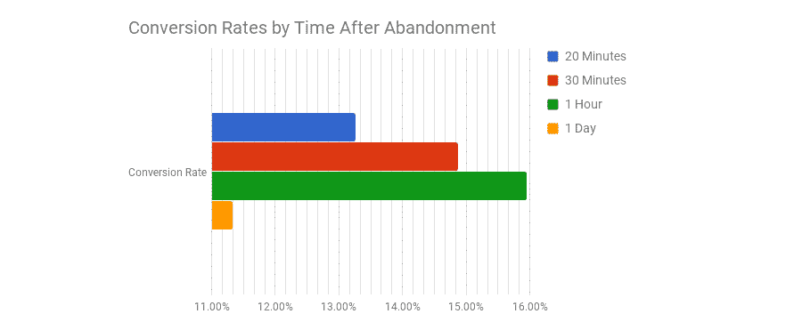

Conversion rates by time after abandonment

20-30 分钟似乎太短/太快，而等待 24 小时离购买体验太远。

这些数字可能会被那些无论如何都会自然返回并完成购买的客户夸大，因此，与其坚持只发送一封电子邮件，最好的办法是创建一个序列。但是你的自动邮件应该间隔多长时间发送呢？

### 废弃购物车电子邮件序列

为了赢回尽可能多的客户，您应该[创建一个电子邮件序列](https://www.shopify.com/partners/blog/how-to-build-an-abandoned-cart-email-sequence)，该序列是为废弃购物车激活的。为了获得最佳效果，您应该将电子邮件间隔 1 小时、1 天和 3 天。

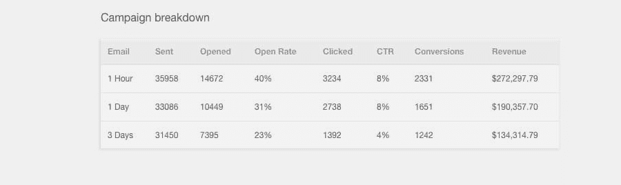

Abandoned cart email interval (Image source: rejoiner.com)

不要每次都发送相同的提醒邮件，你可以稍微改变一下，然后发送一封带有社交证明或产品视频演示的邮件，让你的产品更有吸引力。

这里有一个例子:

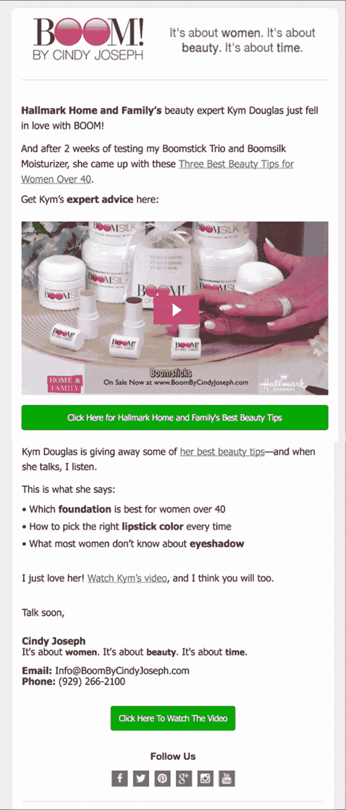

Boom – automated email with video

你可以采用很多不同的战略和战术，但如果你在合适的时间实施了一个坚实的、个性化的活动，并进行多次跟进，你可能会做得很好。

毕竟，如果你想击败竞争对手，回收废弃购物车只是你在 2022 年应该采取的众多电子商务策略之一。

## 废弃购物车电子邮件符合 GDPR 标准吗？

[GDPR](https://kinsta.com/blog/wordpress-gdpr-compliance/) 就是询问你接触的客户并获得他们的同意。是的，放弃购物车电子邮件符合欧盟新的一般数据保护条例(GDPR)，**，前提是您获得客户的明确同意**。

客户需要通过勾选接收更新/营销电子邮件的复选框来主动选择加入。在成为客户的过程中，无法预先检查他们需要“选择退出”的地方。

提醒:为了合规，您还需要在发送给客户/潜在客户的所有电子邮件中包含退订选项和您的完整业务地址。

[Do you have an online store? You could be losing 8 of 10 potential customers during the checkout process. 😢 But with a conversion rate of 18.64%, abandoned cart emails can help win them back. 🛒Click to Tweet](https://twitter.com/intent/tweet?url=https%3A%2F%2Fbit.ly%2F348Jm9u&via=kinsta&text=Do+you+have+an+online+store%3F+You+could+be+losing+8+of+10+potential+customers+during+the+checkout+process.+%F0%9F%98%A2++But+with+a+conversion+rate+of+18.64%25%2C+abandoned+cart+emails+can+help+win+them+back.+%F0%9F%9B%92&hashtags=Ecommerce%2CMakeMoneyOnline)

## 摘要

由于许多潜在客户不会成功完成他们的结帐，废弃的购物车电子邮件可以成为一个不可思议的销售和营销工具，帮助您销售更多的产品。

通过使用有效的主题，在正确的时间发送电子邮件，并创建一个电子邮件序列，即使是最犹豫的消费者，你也可以大大增加你的收入。

以这种方式吸引更多的客户也将有助于你的漏斗顶端活动变得更加有利可图，给你更多的余地去尝试新的渠道，并重新投资于更多的广告、品牌，甚至开发新产品。

您是否在策略中利用了废弃的购物车电子邮件？我们希望听到你的意见，所以请在下面的评论中分享你的经验吧！

* * *

让你所有的[应用程序](https://kinsta.com/application-hosting/)、[数据库](https://kinsta.com/database-hosting/)和 [WordPress 网站](https://kinsta.com/wordpress-hosting/)在线并在一个屋檐下。我们功能丰富的高性能云平台包括:

*   在 MyKinsta 仪表盘中轻松设置和管理
*   24/7 专家支持
*   最好的谷歌云平台硬件和网络，由 Kubernetes 提供最大的可扩展性
*   面向速度和安全性的企业级 Cloudflare 集成
*   全球受众覆盖全球多达 35 个数据中心和 275 多个 pop

在第一个月使用托管的[应用程序或托管](https://kinsta.com/application-hosting/)的[数据库，您可以享受 20 美元的优惠，亲自测试一下。探索我们的](https://kinsta.com/database-hosting/)[计划](https://kinsta.com/plans/)或[与销售人员交谈](https://kinsta.com/contact-us/)以找到最适合您的方式。