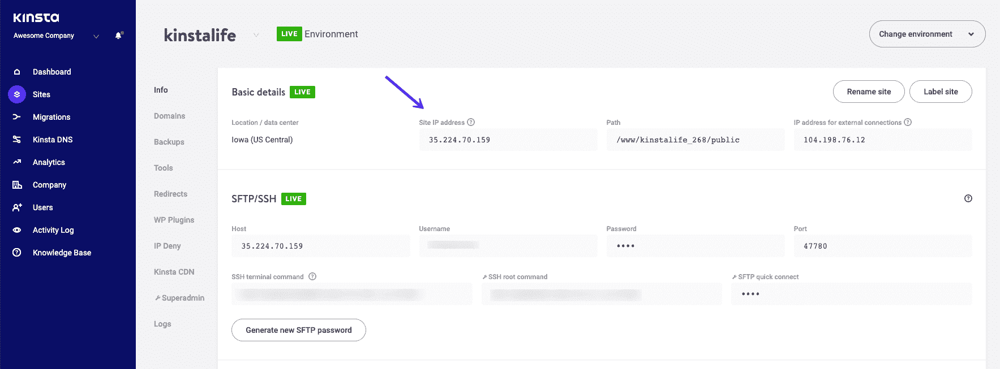
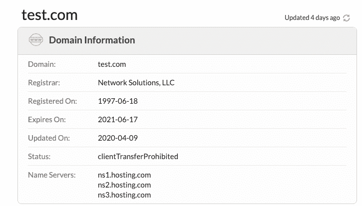
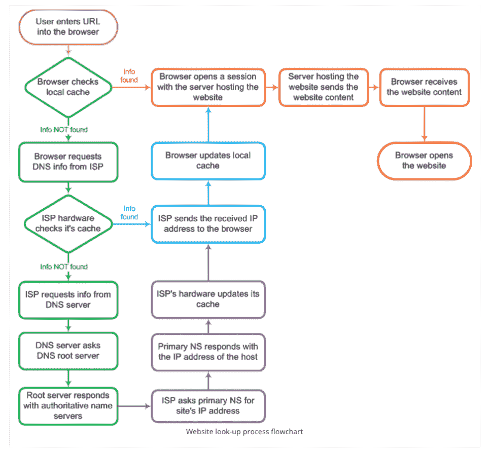
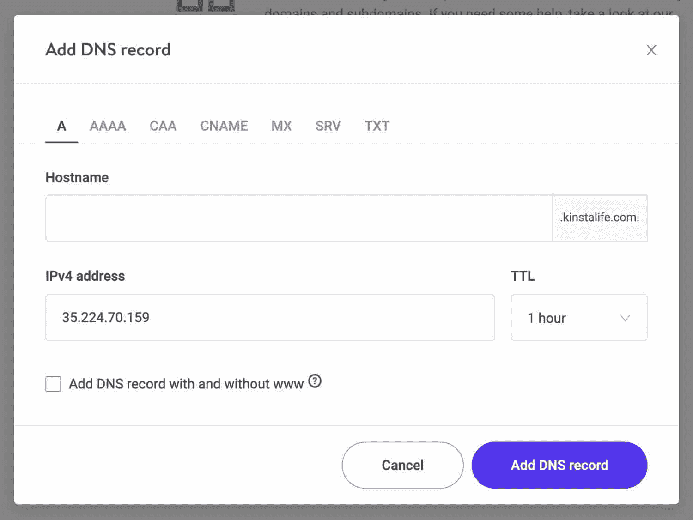
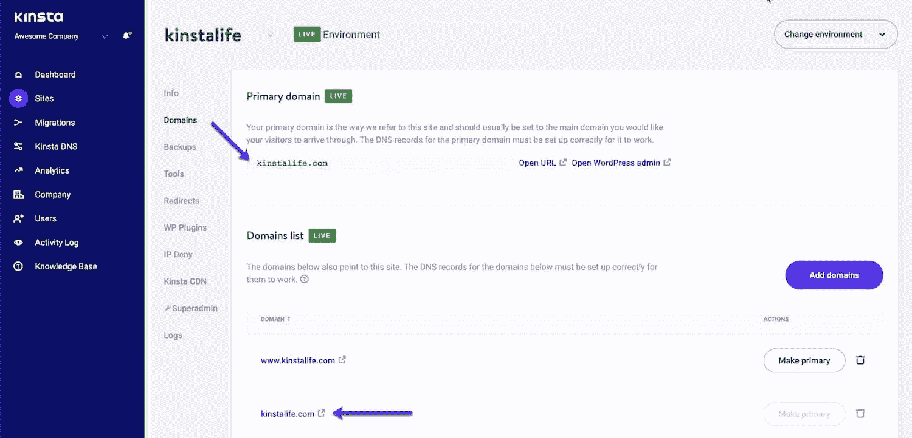
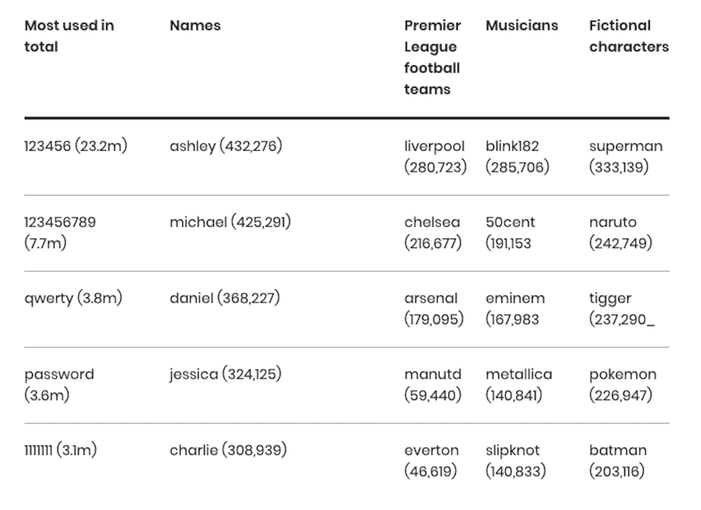

# DNS 传播网站所有者指南(2022 版)

> 原文：<https://kinsta.com/blog/dns-propagation/>

域名系统是域名系统的缩写，DNS 是网络上每个页面的地址。当你输入一个[域名](https://kinsta.com/blog/choose-domain-name/)时，DNS 会将你输入的文字翻译到你的浏览器中，并转换成网络服务器可以理解的地址。

在这篇文章中，你将了解到 DNS 是多么重要，如何做出改变，如何影响 DNS 的传播，如何确保你的 DNS 文件的安全，以及为什么迁移到高级 DNS 服务可以把你的 WordPress 站点带到一个全新的效率水平。

准备好了吗？让我们开始吧！

## 什么是 DNS？

如果你在你的浏览器中输入[kinsta.com](https://kinsta.com/)，存储 Kinsta 主页的服务器无法理解英语。

DNS 将您在浏览器中键入的域名转换为 IP(互联网协议)地址。在 Kinsta 的例子中，DNS 将 kinsta.com 翻译成 216.3.128.12。IP 地址是 Kinsta 主页在服务器上的实际位置。

所有的网页都是这样操作的。

DNS and IP addresses are the phone book of the Web.

由于记住一个网站的 IP 地址几乎是不可能的，DNS 为你做了所有的艰苦工作。当然，它使整个网络生态系统对人类来说更容易导航。你有时会看到 DNS 被称为互联网的电话簿。

### 域名的类型

您可能需要了解几种类型的 DNS 记录。主要记录包括:

#### 一项记录

你会花大部分时间编辑你网站的 DNS A 记录，因为这个记录被 [IPv4 网址](https://kinsta.com/help/ipv4-address/)用来指向一个域或子域。如果你的站点所在的网络服务器使用 [IPv6 而不是 IPv4](https://kinsta.com/blog/ipv4-vs-ipv6/) ，你将需要修改[你的 DNS AAAA 记录](https://kinsta.com/help/add-dns/#aaaa-record)。如果您不确定 IPv6 和 IPv4 是什么，我们将在下一节讨论它们。

#### CNAME 记录

如果你使用[子域](https://kinsta.com/blog/wordpress-subdomain/)，你使用 CNAME 记录来关联这些子域和它们的主域。

#### MX 记录

将你的网站连接到它所使用的电子邮件服务是 MX 记录器的工作。您可以使用该记录来分配特定的电子邮件服务，如 Gmail。

#### TXT 记录

垃圾邮件仍然是网络的祸害。您使用 TXT 记录来打击寻找未受保护的域名的垃圾邮件发送者。点击此处了解更多关于[电子邮件认证](https://kinsta.com/blog/email-authentication/)的信息。

[DNS 是网页上每个页面的地址🏠...这意味着了解如何进行更改和保持 DNS 文件的安全是至关重要的。在此了解更多信息👇 点击推文](https://twitter.com/intent/tweet?url=https%3A%2F%2Fkinsta.com%2Fblog%2Fdns-propagation%2F&via=kinsta&text=DNS+is+the+address+of+every+page+on+the+Web+%F0%9F%8F%A0...which+means+understanding+how+to+make+changes+and+keep+DNS+files+secure+is+essential.+Learn+more+here+%F0%9F%91%87&hashtags=DNS%2CPremiumDNS)

## 基本缩写:IP 和 DNS

如果您从未见过您网站的 IP 地址，您可以从您的 [MyKinsta dashboard](https://kinsta.com/mykinsta/) 中看到您网站的 IP 地址。

要显示您网站的 IP 地址，请单击仪表板左侧的“站点”链接，然后选择“信息”选项卡，这将显示使您的网站能够在网络上定位的基本信息。

此外，如果你还没有，学习如何将你的域名指向 [Kinsta here](https://kinsta.com/help/add-dns/) 。

WordPress site IP address on MyKinsta

把 IP 地址想象成电话号码。最终，我们用完了给客户的新号码，所以我们不得不改变我们如何组织使用中的电话号码。IP 地址也是一样。IPv6 为我们提供了更多的 IP 地址给新网站。随着网络的不断扩展，IPv4 的 IP 地址已经用完了！

你可能也听说过有[专用 IP 地址和](https://kinsta.com/blog/dedicated-ip-address/)共享 IP 地址。一个专用的 IP 地址就像你的座机或者手机号码；它对你和你的网站来说是独一无二的。

共享 IP 地址，顾名思义，是由几个网站共享的。共享 IP 地址在使用 WordPress 的网站上很常见。重要的是要明白，一个共享的 IP 地址并不意味着你的网站也在共享其他资源。Kinsta 使用 LXD 托管主机和 LXC 软件容器。
T3】

## DNS 和域名服务器如何链接在一起

好了，现在你已经清楚地了解了你的网站的 IP 地址，以及它与 DNS 的关系，接下来要考虑的是你的网站的[域名服务器](https://kinsta.com/knowledgebase/what-is-a-nameserver/)。

域名服务器是必不可少的，因为它是连接你的网站的域名和你的网站在其网络服务器上的 IP 地址的桥梁的一部分。你也可能听说过被称为权威 DNS 服务器的域名服务器。

要查找网站的域名，访问者使用的浏览器将使用 DNS 来查找域名服务器。该查询实际上要求一个叫做 A 记录的东西。A 记录包含 web 服务器的 IP 地址。注意，如果您的 web 服务器使用 IPv6 而不是 IPv4 地址，将使用 DNS AAAA 记录而不是 A 记录。

通常，域名服务器最初是您购买网站使用的域名时使用的[域名注册商](https://kinsta.com/blog/best-domain-registrar/)使用的域名服务器。一般的建议是将域名服务器改为你的网站[托管服务](https://kinsta.com/help/add-dns/)使用的域名服务器。您可以通过编辑网站的 DNS 文件来进行更改。

域名服务器就像是交通警察，指挥着整个网络的交通，确保正确的域名被发送到你的网站访问者正在使用的浏览器。

不要忘记，一旦你把你的域名服务器改成了你的主机服务使用的域名服务器，以后对你的域名系统的任何更改都是在你的主机的域名服务器上，而不是你原来的域名注册商的域名服务器上。如果你不确定你的网站使用的是哪个域名服务器，你可以使用 [Whois 查询工具](https://www.whois.com/whois/)进行查询。

Check which nameserver your website is using with Whois.

## 什么是 DNS 查找？

想想你上一次搜索网站的时候。从你按下回车键到网站出现在你的浏览器中的时间与 DNS 查找有很大关系。正如你已经知道的，[你的网站能越快地为访问者](https://kinsta.com/learn/speed-up-wordpress/)服务，就越好。

你应该记得，当有人在他们的浏览器中输入你网站的域名时，你网站的位置就会被找到。与您的网站相关联的 DNS 文件包含这些信息，包括名称服务器和 IP 地址。

DNS has a vital role to play to ensure the right webpages are delivered each time a domain is entered or searched for. (Image source: [Jolt Wiki](https://wiki.jolt.co.uk/tips-tricks/understanding-dns-propagation/))

您可以看到 DNS 查找的运行，并通过使用一种速度测试服务，如 [Pingdom](https://kinsta.com/blog/pingdom-speed-test/) ，查看 DNS 查找的速度如何影响您网站的[性能。](https://kinsta.com/blog/debugging-wordpress-performance/)

如果你在问自己是否能像控制其他影响网站性能的因素一样控制 DNS 搜索速度，你是对的。事实上，[降低 DNS 查找速度](https://kinsta.com/blog/reduce-dns-lookups/)可以通过几种方式实现。

## 什么是 DNS 传播？

现在您已经掌握了所需的背景知识，我们现在可以更仔细地了解什么是 DNS 传播，以及您可以如何影响它的性能。

## 注册订阅时事通讯

### 想知道我们是怎么让流量增长超过 1000%的吗？

加入 20，000 多名获得我们每周时事通讯和内部消息的人的行列吧！

[Subscribe Now](#newsletter)

当你改变你网站的域名系统时，你所做的改变，比如将你的网站指向一个新的主机服务，并不是瞬间发生的。更新(传播)可能需要不同的时间来完成。这被称为 DNS 传播。

没有固定的时间来完成 DNS 传播，因为有太多的变量与你的网站如何构建和托管的许多方面有关。一个很好的例子是 [TTL 或生存时间](https://kinsta.com/knowledgebase/what-is-ttl/)。TTL 对你网站的性能有着根本性的影响。与 DNS 记录相关联的 TTL 值将对 DNS 传播速度产生深远的影响。

## DNS 传播真正需要多长时间？

默认情况下，DNS 记录的大多数 TTL 将设置为 1 到 4 小时的时间间隔。例如，当[您将您的域名指向 Kinsta](https://kinsta.com/help/dns/) 时，您可以选择设置 TTL。

Kinsta 建议将你网站的 TTL 设置为 1 小时，这也恰好是默认设置的时间。这将确保您的网站的加载时间尽可能低。

You can reduce the load time of your website by choosing a low TTL time.

域名服务器也会对 TTL 值产生影响，从而影响网站的[加载时间。Kinsta 不会影响 DNS 传播的速度。](https://kinsta.com/blog/wordpress-caching-plugins/)

然而，如果您要将您的域迁移到 Kinsta，在开始迁移之前更改为低 TTL [将确保尽快完成(传播)更改。](https://kinsta.com/wordpress-migration/)

### 我如何知道我的 DNS 是否在传播？

由于网络是由构成互联网的庞大服务器网络托管的，所以网站的 DNS 记录可能会被缓存在许多服务器上。重要的是要记住，只有当所有这些缓存的 DNS 文件都已更新时，传播才会完成。

这就是为什么在某些情况下， **DNS 传播可能需要几个小时到几天的时间**。在对您的 DNS 文件进行更改时，请记住这一点，这些更改可能具有时效性，并会影响您网站的性能。

如果你想检查 DNS 传播是否已经改变，有一个方便的工具[whatsmydns.net](https://www.whatsmydns.net/)你可以使用。

#### 将您的域名指向 Kinsta

你的网站的 DNS 文件的一个实际用途是如果你想改变主机服务。例如，如果你希望 [Kinsta 处理你的 WordPress 主机](https://kinsta.com/plans/)，当你的域名指向 Kinsta 时，你有几个选择:

你的第一个选择是使用[记录你的 DNS](https://kinsta.com/help/add-dns/#a-record) 。

你的第二个选择是使用[域名服务器](https://kinsta.com/help/add-dns/#nameservers)。这是一个高级 DNS，我们一会儿会讲到。

第二个选项给你更多的控制你的 DNS。Kinsta 使用[Amazon Route 53](https://kinsta.com/blog/premium-dns/#set-up-premium-dns-kinsta)-一个全球任播网络-确保您的网站具有最大的正常运行时间和低延迟，以提供世界一流的速度和性能。亚马逊 Route 53 premium DNS 免费包含在[所有计划](https://kinsta.com/plans)中。

你的新网站需要一个超快的、可靠的、完全安全的主机吗？Kinsta 提供所有这些以及 WordPress 专家提供的 24/7 世界级支持。[查看我们的计划](https://kinsta.com/plans/?in-article-cta)

Add domains to your MyKinsta dashboard.

## 故障排除:如何刷新 DNS 缓存

您已经对网站的 DNS 文件进行了一些更改，并检查了 DNS 传播是否已完成，但是您的网站并没有如您所预期的那样运行。

这是怎么回事？通常，DNS 缓存会有问题。

当您访问网站时，您的浏览器会跟踪您浏览过的网站。你有没有注意到当你回到一个网站时，它的加载速度似乎快了一些？这是因为你的浏览器[已经保存或‘缓存’了站点](https://kinsta.com/blog/wordpress-cache/)的位置，所以浏览器不需要找到托管该站点的服务器的位置。

缓存包含您网站的 IP 地址、主机名和 DNS A 或 AAAA 记录的临时记录。

你网站的 DNS 缓存以类似的方式存储你网站的信息。如果您的网站出现问题，这可能是因为您的 DNS 缓存已损坏，或者 DNS 缓存包含的数据没有正确更新。

刷新仅仅意味着[清空 DNS 缓存](https://kinsta.com/knowledgebase/dns-server-not-responding/)。这可以解决你在管理网站时可能遇到的许多问题。对于每个操作系统(OS ),刷新 DNS 缓存的方式是不同的。对于您使用的操作系统，请遵循以下步骤:

*   [窗户](https://kinsta.com/knowledgebase/flush-dns/#windows)
*   [苹果电脑](https://kinsta.com/knowledgebase/flush-dns/#macos)
*   [Linux](https://kinsta.com/knowledgebase/flush-dns/#linux)
*   [铬合金](https://kinsta.com/knowledgebase/flush-dns/#chrome)

刷新你的网站的 DNS 缓存是一个好主意，特别是如果你改变你的网站的主机。例如，如果您正在对 DNS A 记录进行更改，那么刷新缓存将确保您在检查站点的正确版本时，当[迁移](https://kinsta.com/help/request-a-migration/)完成时，它会正确加载和显示。

## DNS 安全性

让你的 [WordPress 网站尽可能安全](https://kinsta.com/blog/wordpress-security/)是至关重要的。你网站的访问者希望对他们能安全地使用你的网站有信心。在 DNS 安全的背景下， [DDoS](https://kinsta.com/blog/what-is-a-ddos-attack/) (分布式拒绝服务)攻击是一个你需要密切关注的现实危险。

最严重的 DNS 攻击之一发生在 2016 年 10 月 21 日，导致一些世界上最大的网站瘫痪，包括 Twitter 和易贝。有些人甚至称之为 [DNS 末日](https://blog.catchpoint.com/2016/10/23/dyn-dns-outage/)。事实是，DDoS 攻击的目标是大型在线品牌的域名服务器。正如我们之前了解到的，如果没有有效的域名服务器，DNS 就无法定位用户浏览器所请求的网站的 IP 地址。

为了避免，或者至少减少攻击对你的 WordPress 网站可能造成的影响，你可以采取几个步骤，从一开始确保你的网站使用[安全的 WordPress 主机](https://kinsta.com/blog/wordpress-security/#secure-wordpress-hosting)，到避免 [DDoS 攻击的具体步骤](https://kinsta.com/blog/wordpress-security/#ddos-protection)。

在 Kinsta，我们非常重视客户网站的安全性。我们帮助网站变得更加安全的方法之一是使用[双因素认证(2FA)](https://kinsta.com/help/two-factor-authentication/) 。

如果您使用网上银行，可能已经遇到过这种情况。要访问您的银行帐户，您需要提供两条或更多信息来证明您是您所说的那个人。Kinsta 使用类似的系统来保护我们托管的所有网站。

2FA 是保护你的 WordPress 网站的重要组成部分。随着 WordPress 继续成为一个受欢迎的 CMS，黑客们不断地攻击使用 WordPress 的网站。

防御攻击的第一层是用来保护网站的密码。不幸的是，弱密码在网络上仍然很普遍。事实上，国家网络安全中心的年度密码调查得出结论，123456 后面的“qwerty”和单词“password”仍然被普遍使用。

123456 is consistently the most used password by consumers. (Image source: NCSC)

使用两条信息,“只有你知道”是保护你的网站免受攻击的一种可靠且行之有效的方法。这包括可能影响您的 DNS 文件并可能导致您的网站瘫痪的攻击。大多数 2FA 系统将使用 SMS 发送认证码，这构成了 2FA 服务的第二部分。

在 Kinsta，我们以不同的方式来避免针对您的手机的 SIM 卡交换攻击。我们基于认证器的方法在 Google Authenticator、1Password 和其他 2FA 应用中使用了动态生成的代码。如果你还没有，你可以通过我们的便捷指南学习如何[启用 2FA](https://kinsta.com/help/two-factor-authentication/) 。

## 下一代 DNS

我们刚刚介绍了保护网站 DNS 文件免受攻击的一些初步措施。但是如果你能更进一步呢？

随着企业适应新的远程大规模工作方式，网络安全比以往任何时候都更加重要。如果你企业的 IT 团队和用户将继续[远程工作](https://kinsta.com/blog/working-remotely/)，保护你的 WordPress 网站及其支持的 DNS 文件是至关重要的。

Canopy 的联合创始人布莱恩·阿姆斯特朗(Brian Armstrong)在 2014 年写的一篇博客中写道:“你可能像我们一样在做 DNS 错误的事情。”。他在一次 DDoS 攻击后写了这篇文章，这次攻击使他网站的 DNS 提供商 DNSimple 瘫痪。

许多免费的 DNS 服务提供商做了足够的工作。然而，随着网络安全在后新冠肺炎时代变得越来越重要，升级你的网站使用的 DNS 服务是至关重要的。

Kinsta 调查了所有优质 DNS 服务提供商，并选择与 Amazon Route 53 合作。该服务提供 DNS 故障转移和地理定位路由，以确保您的网站保持活跃。

[Wondering if premium DNS is worth it? 🤔 This guide covers everything from keeping DNS files secure to why making the move to a premium service can take your site to a new level. 🚀Click to Tweet](https://twitter.com/intent/tweet?url=https%3A%2F%2Fkinsta.com%2Fblog%2Fdns-propagation%2F&via=kinsta&text=Wondering+if+premium+DNS+is+worth+it%3F+%F0%9F%A4%94+This+guide+covers+everything+from+keeping+DNS+files+secure+to+why+making+the+move+to+a+premium+service+can+take+your+site+to+a+new+level.+%F0%9F%9A%80&hashtags=DNS%2CWPTips)

## 摘要

了解您的 DNS 文件如何控制您的网站对于维护一个可靠、[安全、](https://kinsta.com/blog/is-wordpress-secure/)高效的网站至关重要。对 DNS 文件进行更改时应该小心。一旦您完成了更改，了解 DNS 传播过程的工作方式，以及影响其性能的因素，将确保您的站点更新具有最小的延迟。

DNS 传播是正确维护[网站](https://kinsta.com/blog/wordpress-maintenance/)的重要组成部分。DNS 传播也不仅仅是为了使您所做的任何更改生效而设置一个低 TTL 值。

随着网络的发展和域名服务器生态系统的扩大，DNS 已经成为确保网络高效运行的重要组成部分。并且不是所有的 DNS 服务提供商都是相同的。

您可能已经使用免费 DNS 服务好几年了，没有任何问题。今天，随着网络安全的提高，可能是时候[转向高级 DNS 服务](https://kinsta.com/blog/premium-dns/)来保护您网站的长期健康。

* * *

让你所有的[应用程序](https://kinsta.com/application-hosting/)、[数据库](https://kinsta.com/database-hosting/)和 [WordPress 网站](https://kinsta.com/wordpress-hosting/)在线并在一个屋檐下。我们功能丰富的高性能云平台包括:

*   在 MyKinsta 仪表盘中轻松设置和管理
*   24/7 专家支持
*   最好的谷歌云平台硬件和网络，由 Kubernetes 提供最大的可扩展性
*   面向速度和安全性的企业级 Cloudflare 集成
*   全球受众覆盖全球多达 35 个数据中心和 275 多个 pop

在第一个月使用托管的[应用程序或托管](https://kinsta.com/application-hosting/)的[数据库，您可以享受 20 美元的优惠，亲自测试一下。探索我们的](https://kinsta.com/database-hosting/)[计划](https://kinsta.com/plans/)或[与销售人员交谈](https://kinsta.com/contact-us/)以找到最适合您的方式。