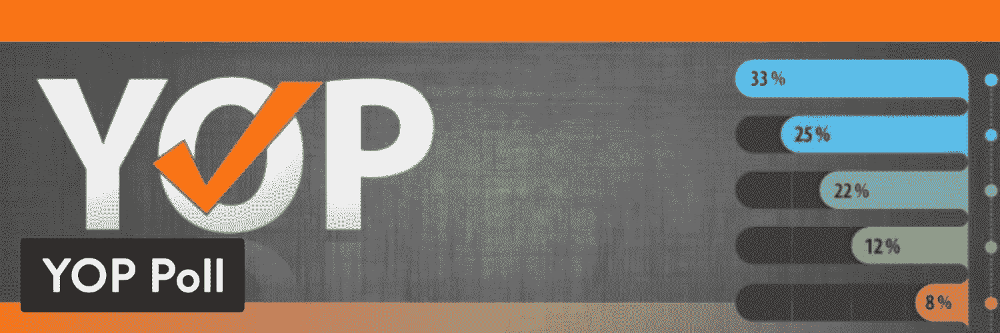
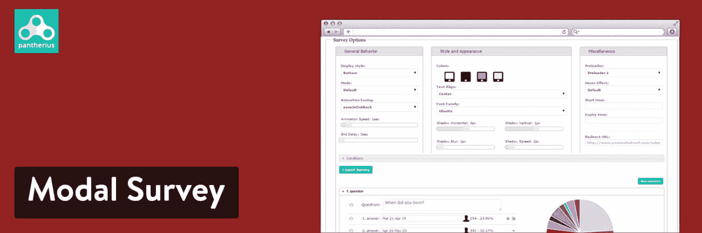
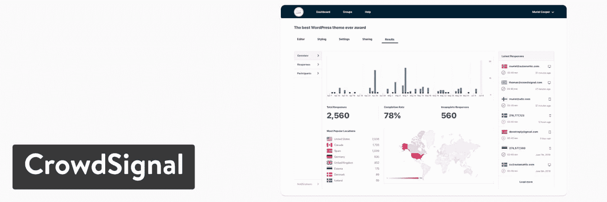
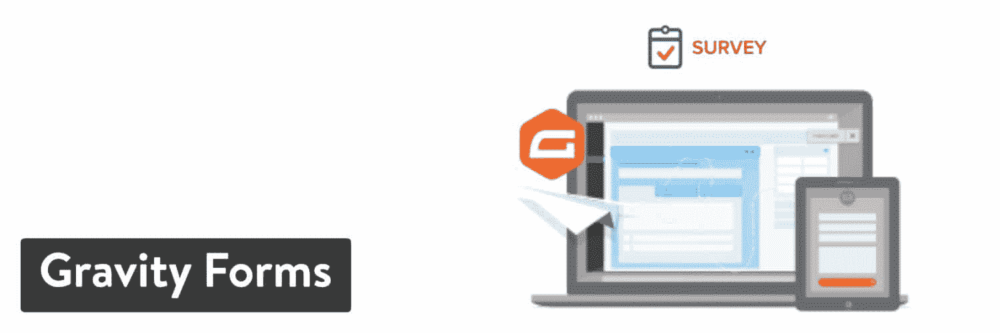
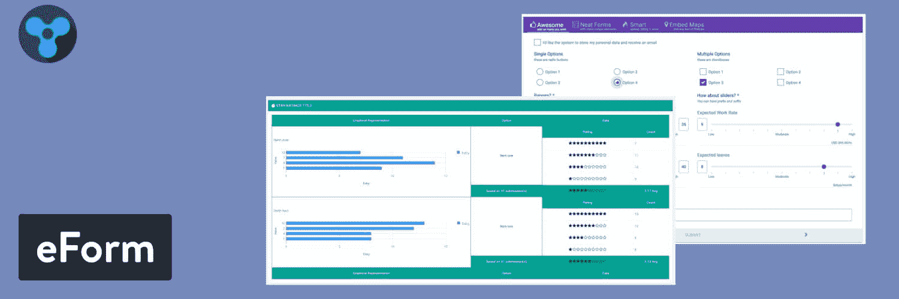

# 9 个强大的 WordPress 调查插件来收集用户反馈(和 4 个调查构建器)

> 原文：<https://kinsta.com/blog/wordpress-survey-plugins/>

在你的网站上放置一份调查似乎很容易。直到你面对这么做的各种选择。一些调查构建者提供[可嵌入代码](https://kinsta.com/blog/embed-google-form/)，而其他人提供无缝的 WordPress 集成。

此外，很容易立即选择一个不花一分钱的 WordPress 调查插件。然而，当从[你的网站访问者](https://kinsta.com/blog/how-to-drive-traffic-to-your-website/)那里收集反馈时，这些选项中的许多呈现出有限的结果。

这就是为什么我们在市场上搜寻顶级 WordPress 调查插件，通过定位异常值，比较价格，并最终选定提供无缝调查创建和高级功能的插件。

[These WordPress survey plugins provide seamless survey creation, advanced features, and most importantly, the ability to learn more about your site visitors. 💡 Check them out here ⬇️Click to Tweet](https://twitter.com/intent/tweet?url=https%3A%2F%2Fbit.ly%2F2EPkdXF&via=kinsta&text=These+WordPress+survey+plugins+provide+seamless+survey+creation%2C+advanced+features%2C+and+most+importantly%2C+the+ability+to+learn+more+about+your+site+visitors.+%F0%9F%92%A1+Check+them+out+here+%E2%AC%87%EF%B8%8F&hashtags=WordPressPlugins%2CWPTips)

## 在 WordPress 调查插件中寻找什么

理想情况下，WordPress 的调查插件不需要[任何编码](https://kinsta.com/knowledgebase/edit-wordpress-code/)来构建你的调查或者在你的网站上发布它们。除此之外，我还寻找了几个因素来确保我不会把钱花在一个缺乏基本要素的调查工具上。

以下是您需要考虑的对您的运营最重要的因素:

*   **可视化或拖放式构建器**用于快速创建表单和最少使用代码。
*   **汇总调查结果，使用潜在过滤器**定位最重要的信息。
*   **导出工具**用于在 Excel 等程序中使用编译后的数据[制作图表](https://kinsta.com/blog/tables-in-wordpress-tablepress/)等项目。
*   **多个用户交互按钮**和文本框、单选按钮等框。
*   **预建模板**根据您的行业或预期结果立即启动调查。
*   **响应能力**在移动设备上查看和使用调查，即使是嵌入在 WordPress 网站上。
*   **实时调查结果选项**在用户提交调查后向其显示。
*   **定制工具**添加标志、品牌颜色和补充[媒体项目](https://kinsta.com/blog/wordpress-media-library/)。
*   **选择嵌入您的调查**或在线分享到其他地方。
*   **通知**,在收到调查回复时发送给您的团队。
*   **垃圾邮件防护**限制虚假提交的数量。
*   **支持独特的领域**如[文件上传](https://kinsta.com/knowledgebase/bulk-upload-files-wordpress-media-library-ftp/)或[星级](https://kinsta.com/blog/best-wordpress-review-plugins/)。
*   **权限和禁止功能**以防止用户提交同一个调查两次或[阻止垃圾邮件发送者](https://kinsta.com/blog/wordpress-captcha/)。

## 最好的 WordPress 调查插件选项

点击上面您选择的插件，导航到我们下面的深入评论。我们将涵盖易用性、定价和每个 WordPress 调查插件的最佳特性等元素。

> Kinsta 把我宠坏了，所以我现在要求每个供应商都提供这样的服务。我们还试图通过我们的 SaaS 工具支持达到这一水平。
> 
> <footer class="wp-block-kinsta-client-quote__footer">
> 
> 
> 
> <cite class="wp-block-kinsta-client-quote__cite">Suganthan Mohanadasan from @Suganthanmn</cite></footer>

[View plans](https://kinsta.com/plans/)

### 1.YOP 民意测验

对于那些不想冒险进入高级付费插件世界进行调查的人来说，YOP 民意调查插件是一个很好的起点。这在许多情况下是可以理解的，因为许多公司或个人不需要为调查付费，因为他们只需要简单的数据收集。

YOP 民意测验没有最漂亮的设计界面，但它很容易理解，提供了基本的模板，你不会被迫弄乱任何代码。单个和多个答案是可能的，以及计划和多个调查同时运行。

YOP Poll WordPress plugin

设计您的调查或投票是在 [WordPress 仪表盘](https://kinsta.com/knowledgebase/wordpress-admin/)中完成的。您创建问题和答案，然后设置选项，如允许的总投票数和该调查的结束日期。

之后，您可以发布调查并在仪表板的同一区域查看结果。令人高兴的是，这些页面中的每一个都有针对您自己的仪表板首选项进行配置的设置。例如，您可能希望以百分比的形式查看结果，而不是原始数字。

您还可以在查看结果之前自动对它们进行排序。

#### 定价

有一个功能丰富的免费版本。之后，每年 17 美元的个人版[可以让你开始使用高级功能，如视频问题、](https://yop-poll.com/upgrade-eu/)[脸书集成](https://kinsta.com/blog/facebook-marketing/)和倒计时定时器。

#### 使其成为顶级 WordPress 调查插件的特性

*   创建投票既简单又直观，允许[定制颜色](https://kinsta.com/blog/website-color-schemes/)和快速更改字段。
*   调查时间表允许你设置一个特定的日期，并且只在该时间到来时在你的站点上显示调查。
*   该插件支持在你的网站上一次进行多次投票。
*   有一个搜索和过滤选项来检查过去的投票，并根据指标进行排序。
*   [自定义字段](https://kinsta.com/blog/advanced-custom-fields/)对于创建常规调查非常有用，无需任何复杂的添加。
*   重启调查或投票只需点击一个按钮。
*   您可以记录或禁止用户访问调查。存档工具对于清理你的界面也很有用。
*   在用户点击提交按钮后显示答案或结果。
*   从简单而吸引人的模板中选择，开始设计过程。
*   搜索具体的调查结果，查看每位受访者的确切回答。
*   高级版提供了 30 多个高级模板。
*   高级版还增加了各种媒体功能，比如在调查中整合视频问题或图片。

### 2.测验和调查大师

[测验和调查大师](https://wordpress.org/plugins/quiz-master-next/) WordPress 插件兜售一套全面的产品和功能，主要用于构建调查，并将它们放在 [WordPress 页面和帖子上](https://kinsta.com/knowledgebase/duplicate-page-post-wordpress/)。

凭借其简约的设计元素和可视化的 bloc builder，该插件为那些宁愿更多地关注调查而不是提供添加了调查元素的表单的许多插件的人提供了一个可靠的选择。

轻松地为用户创建调查，并自定义用户提交后出现的文本、问题和消息等区域。这是一个灵活的解决方案，包括[测验](https://kinsta.com/blog/wordpress-quiz-plugins/)和调查。我们希望您可以进行一项有正确答案或开放式主观答案的调查或测验，以收集您的用户信息。

Quiz And Survey Master WordPress plugin

很高兴看到这个插件包含了一个[分类系统](https://kinsta.com/knowledgebase/what-is-taxonomy/)，用于给你的问题分配标签。这使得在分析数据并将其放入图表时更容易组织。

#### 定价

核心插件是免费的。高级插件每年起价 79 美元，提供高级工具，如登录页面、结果导出和条件逻辑。

有几个插件可用，可以通过每年 129 美元的高级捆绑包获得，也可以单独购买。

#### 使其成为顶级 WordPress 调查插件的特性

*   该插件有一个很好的预置调查集合，用于[事件规划](https://kinsta.com/blog/wordpress-events-plugin/)、员工参与度等等。
*   创建无限数量的调查放在您的网站上。
*   使用漏斗优化链接到[谷歌分析](https://kinsta.com/blog/how-to-use-google-analytics/)。
*   收集反馈，并用条形图、饼图和箱线图进行分析。
*   你可以要求[电子邮件地址](https://kinsta.com/blog/find-email-address/)，并在 MailChimp 等工具中将它们放入你的电子邮件营销列表。
*   将您的结果导出到 Excel 或 Google Sheets。
*   从其他来源导入数据以与您网站上的调查相结合。
*   从广泛的调查和测验问题中进行选择，如多选单选按钮、[下拉框](https://kinsta.com/knowledgebase/wordpress-dropdown-menu/)，并填空。
*   提交调查后，向您的管理员和用户发送电子邮件。
*   为问题分配类别以进行组织，并向用户显示基于特定类别的分数。
*   在测验和调查上放置[分享按钮](https://kinsta.com/blog/wordpress-social-media-plugins/),这样人们可以在社交媒体上发布结果。
*   该插件包括选项[强制用户登录](https://kinsta.com/blog/wordpress-user-registration-plugins/)以查看和使用调查。
*   有一些独特的跟踪功能，如查看每个人花多长时间完成一项调查。

### 3.模态调查

[模态调查](https://codecanyon.net/item/modal-survey-wordpress-poll-survey-quiz-plugin/6533863)在 CodeCanyon 上市销售。这是一个高级但负担得起的 WordPress 调查插件，它严格以调查、投票和测验为中心，使它成为一个基于问题的解决方案，而不是一个也有一些调查元素的表单插件。

作为 CodeCanyon 上评价最高的调查插件，Modal Survey 为质量建设者提供了从你过去可能使用的免费插件改进你的调查的自由。

为您的网站生成无限数量的调查，并借助饼图和条形图显示来自用户的信息。默认情况下，这些信息会显示给管理员，但是您也可以选择在客户填写调查后以计数百分比显示结果。

Modal Survey WordPress plugin

来自模态调查的内置主题给你的[设计游戏](https://kinsta.com/blog/web-design-trends/)带来了简单感。例如，您通常不必担心设计调查的按钮、颜色或大小。

当您在网站上插入调查时，您还可以看到社交分享按钮。当您想要显示特定答案的特殊信息或将用户发送到网站的其他部分时，条件规则就派上了用场。

总的来说，模态调查插件包含了广泛的视觉元素和额外的测验和投票，为您提供了更多与客户互动的机会。

#### 定价

这是 35 美元的一次性费用。延长客户支持需要额外费用。

#### 使其成为顶级 WordPress 调查插件的特性

*   该插件包括导入、导出和[备份功能](https://kinsta.com/help/wordpress-backups/)来复制你的数据并将其发送到其他网站。
*   过滤器可用于筛选从您的调查中积累的数据。每行信息都很详细，就像您在 Excel 电子表格中看到的那样，每列顶部都有筛选器。
*   在你的服务器上放置电子邮件订阅表格，链接到像 [MailChimp](https://kinsta.com/blog/how-to-use-mailchimp/) 和 [AWeber](https://kinsta.com/blog/mailchimp-alternatives/#10-aweber) 这样的服务。
*   您可以进行调查，允许问题有多个正确答案。您甚至可能希望能够选择某些调查的所有答案。
*   根据用户在前一个问题中的回答激活规则和重定向。
*   导出功能支持多种类型的文件，包括 PDF、XLS 和 CVS。你可以通过点击一个按钮来导出整个 WordPress 民意调查。
*   各种可视化图表可用于您的数据，如极坐标图、折线图和雷达图。其他一些最受欢迎的图表包括甜甜圈图和饼图。
*   使用百分比和直观图表显示调查结果。如果您激活该功能，将会显示投票。
*   根据用户的分数在调查结束时显示独特的消息。例如，如果某人在一次测验中得了 99 分，你可以说“干得好！”失败的分数可能会说“再试一次”
*   该插件有一个令人印象深刻的答案类型集合，可以包含在调查中，比如数字答案、日期答案和列表。
*   您可以在网站的任何地方嵌入调查或测验，这样就可以很容易地将调查放在博客帖子或页面的中间。
*   调查配置简单直观。它并不完全是一个[拖放构建器](https://kinsta.com/blog/wordpress-page-builders/)，但是你可以通过点击来添加和删除问题，并用相同的按钮来放置图像和答案。
*   所有参与者都有自己的页面来整合他们过去的分数，看看他们是否在几次调查或测验中有所提高。这对于测验来说很方便，但也有助于公司更深入地了解可能有独特观点的个人客户。
*   您可以使用结合了用户分数和答案的单独图表来构建个性测试。
*   基本的视觉效果是常见的，在所有的调查中都有添加图像和进度条的工具。这样，人们会对你的问题有更好的感觉，并知道什么时候调查即将结束。这通常会增加他们完成调查的可能性。
*   尺寸定制允许您以全幅格式显示调查，或者保持调查较小，就像在[小部件](https://kinsta.com/blog/wordpress-widgets/)中一样。
*   几十个定制选项开始发挥作用，比如按钮显示、动画、[字体](https://kinsta.com/blog/wordpress-fonts/)大小等等。

### 4.拥挤信号

[CrowdSignal](https://crowdsignal.com/) 提供投票和调查创建工具，快速简单是最好的方式。您可以确保所有调查看起来完全符合您的要求，然后通过将结果导出到 Google Sheets 或 Excel 等地方进行分析。

我们如此喜欢 CrowdSignal 插件的原因之一是，你可以通过电子邮件发送互动调查[。这意味着客户可以在他们的电子邮件中看到表单，而不必跳转到另一个网站来填写。](https://kinsta.com/blog/email-marketing-best-practices/)

这取决于电子邮件提供商，但在某些情况下，他们可以留在收件箱中并提交答案。

CrowdSignal WordPress plugin

关于 CrowdSignal 的一个有趣的事实是，它是由 WordPress.com 背后的[公司 Automattic 建造的。这个珍闻并不一定意味着它是最好的 WordPress 调查插件，但我们至少知道它背后有一个声誉良好的](https://kinsta.com/blog/wordpress-com-vs-wordpress-org/)[开发者团队](https://kinsta.com/blog/hire-wordpress-developer/)，并且它可以很好地与 WordPress 一起工作。

总而言之，使用 CrowdSignal 创建的调查在所有设备上看起来都很漂亮，反应也很快。你可以选择你的品牌颜色，不用学习任何代码就可以处理预制的主题。

分享工具可以很好地在你的博客、脸书和 T2 的推特上发布结果，而 T4 的分析工具则可以扩展信息，比如总回复和完成率。

#### 定价

免费无限制的问题，调查，评级和投票。该计划的功能有限，但对较小的组织很有用。功能包括 2，500 个响应、数据导出和调查嵌入。然而，每个调查都有众信品牌。

如果按年计费，保费计划的起价为每月 15 美元，如果按月计费，起价为每月 25 美元。当您升级到其中一个高级计划时，功能列表会扩展很多。

#### 使其成为顶级 WordPress 调查插件的特性

*   在你的网站上放置无限数量的调查。
*   创建从调查到投票，从评级到常规问题的所有内容。
*   导出所有回答，将数据放入 Excel 或其他电子表格应用程序。
*   Google Sheets 直接链接到插件，因此不需要导出。
*   通过阻止试图提交两次的用户来防止人们的多次响应。
*   您可以上传音频和视频文件，以扩展您的调查功能。
*   这是为数不多的包含强大语言包的插件之一，使得它很容易接触到国际观众。
*   当用户浏览您的调查时，使用条件逻辑和分支树来传递多种类型的消息和问题。
*   实时访问人们完成调查时显示的结果。激活或关闭此功能，以便只有网站管理员可以看到结果。
*   在某些计划中，您可以访问各种可定制的主题。使用 CSS 和可视化构建工具可以完全编辑这些内容。
*   一些计划提供域名链接，将调查和投票放在你自己的域名上。
*   可以激活在离线设备上显示调查的功能。
*   高级 API 访问附带了与您的系统集成和扩展定制选项的高级计划。
*   团队计划提供了大量的协作工具，包括[多个用户账户](https://kinsta.com/knowledgebase/wordpress-export-users/)、主题共享和调查模板。您甚至可以协作编辑调查，并来回发送这些编辑内容。

### 5.民意测验、调查、表格和测验制作人(按意见阶段)

[民意测验、调查、表格&opinion stage](https://wordpress.org/plugins/social-polls-by-opinionstage/)通过从零开始或利用预制模板库生成民意测验和调查，在许多竞争中脱颖而出。该插件允许所有调查中的[图像](https://kinsta.com/blog/optimize-images-for-web/)和视频为问卷添加一点色彩和互动性。

survey maker 具有白色标签和高级分析功能，可以用来创建投票、表格和测验。这是 WordPress 知识库中不太为人所知的插件之一，但它仍然拥有数万次安装和数百条正面评论。

OpinionStage 插件的流行源于模板的现代本质。它们看起来有点像你在 Buzzfeed 或 ESPN 等网站上看到的调查。

我们喜欢彩色的大按钮和视觉图像的使用，以确保调查不会让读者厌烦。此外，每个投票和调查都包含社交分享按钮，如果您愿意，可以选择删除这些按钮。

更重要的是，插件提供了六个模块供古腾堡编辑器使用。这对于适应新的 WordPress 编辑器非常重要，尤其是如果你不熟悉自定义编码的话。

## 注册订阅时事通讯

### 想知道我们是怎么让流量增长超过 1000%的吗？

加入 20，000 多名获得我们每周时事通讯和内部消息的人的行列吧！

[Subscribe Now](#newsletter)

Poll, Survey, Form & Quiz Maker WordPress plugin

一些区块包括常规表格、投票、调查和幻灯片的选项。一个琐事模块为用户处理有趣的问卷，而不是不断地使用插件来获得反馈。

当在较小的设备上查看时，您使用插件生成的每个调查和表格都使用[响应元素](https://kinsta.com/blog/web-design-best-practices/#mobile-responsiveness)来定位。至于定制，构建器是可视化的，但不是拖放式的解决方案。然而，你可以调整一切，从[颜色主题](https://kinsta.com/blog/website-color-schemes/)到[字体和大小](https://kinsta.com/blog/how-to-change-font-in-wordpress/)到[自定义 CSS](https://kinsta.com/knowledgebase/combine-external-css/) 。

#### 定价

核心插件是免费的。它包括基本的投票和调查功能。初始计划每月 19 美元，按年支付。如果按月支付，价格增加到每月 29 美元。

还提供小型企业和高性能产品包。

#### 使其成为顶级 WordPress 调查插件的特性

*   除了调查之外，OpinionStage 插件还包括针对[内容营销](https://kinsta.com/learn/content-marketing/)、[销售线索生成](https://kinsta.com/blog/wordpress-lead-generation/)、[广告收入](https://kinsta.com/blog/banner-ad-sizes/)、在线投票、产品发现等的解决方案。
*   该调查制造商提供了一个创新和现代的设计过程，侧重于视觉效果和大按钮，说服用户不仅开始调查，而且继续调查。
*   模板库收集了大量的测验、表格和调查。根据主题和类型进行过滤，例如化妆品、[教育](https://kinsta.com/learn/wordpress-education/)、金融、[食品](https://kinsta.com/blog/how-to-start-a-food-blog/)。在你的网站上实现之前测试所有的主题。
*   这个插件可以让你得到更多的回应。它通过在您构建调查时提供优化的设计和建议来最大限度地发挥潜力。
*   所有模板都是免费的。
*   创建一个调查并在你的 WordPress 站点上启动它并不需要很长时间。调查构建器使用直观的调查创建表单供您填写和放置所需的元素。
*   高级调查报告突出显示了有关您最近调查活动各个方面的详细文档。将调查数据导出到 Excel 等程序中，并使用条形图和饼图查看报告。
*   定制选项包括颜色、主题、[字体](https://kinsta.com/blog/modern-fonts/)、预览宽度和白色标签。更不用说，CSS 覆盖模块驻留在编辑部分。
*   所有提交的调查都提供电子邮件通知，您可以打开或关闭。这将提醒您最近完成了一项调查，如果您对用户的回答有疑问，还可以联系他们。
*   每个调查都提供了代码片段，可以将调查嵌入到在线的任何地方。使用 iframe 和 JavaScript，在社交媒体、博客和[电子商务商店](https://kinsta.com/blog/ecommerce-platforms/)等地方进行调查。
*   让您的调查私密而安全，不会受到黑客和外人的攻击。防止人们多次提交，并确保所有提交的数据保持加密。
*   当提交特定答案时，调查跳过功能与显示跟进问题的品牌逻辑一起运行。这样，所有的问题都显得切题。
*   该插件连接到各种营销自动化软件和应用程序，如 [GetResponse](https://kinsta.com/blog/mailchimp-alternatives/#11-getresponse) 、MailChimp、AWeber 和 Zapier。

### 6\. Watu Quiz

[Watu 测验](https://wordpress.org/plugins/watu/) WordPress 调查插件包含了调查、考试和测验的功能，可以放在 [WordPress 网站](https://kinsta.com/blog/wordpress-site-examples/)上。这个时尚、快速的插件利用[短码](https://kinsta.com/blog/wordpress-shortcodes/)和可嵌入的调查，可以放在网上和你的网站的任何地方。

从单选题和多选题中选择，将它们放在帖子、页面和小部件上。在免费版和专业版之间选择。我们建议测试免费的核心插件，因为它为基本调查甚至考试提供了不错的功能。

Watu Quiz 为用户带来了生动的体验，但它通过消除你可能从其他竞争对手那里看到的任何混乱来保持过程的简单。我们很欣赏一个主要功能，它可以显示所有调查和测验的结果，而无需您调整任何设置。

如前所述，免费插件对于简单的调查非常有用，但是像数据导出和学生登录这样的功能需要额外付费。至于调查的整体设计，他们看起来有点学术，再次剥离了非必要的，简约的感觉和黑白明文调查。

您设置评分等级，并告诉 Watu Quiz 计算分数并将其发送回用户。这也可能有助于调查揭示结果。

Watu Quiz WordPress plugin

有趣的是，你可以给某些答案分配负分。这对于调查来说可能是一个有趣的元素，但其他时候你可能想使用负分系统来评估你自己的服务——在这种情况下，不要告诉别人。

要将调查放在你的网站上，只需发布一个帖子并使用可嵌入的代码。然后，进入 WordPress 的管理模块修改问题，查看分析，检查用户。

#### 定价

核心插件是免费的。Watu Pro 列出了三个支付选项:47 美元的入门包，87 美元的 Watu Pro +智能模块，以及 137 美元的所有开发人员工具的完整捆绑包。

您无需支付月费或年费。该插件还提供免费的客户支持，在定价游戏中击败了绝大多数调查插件。

#### 使其成为顶级 WordPress 调查插件的特性

*   根据需要生成任意多的调查。Watu 测验插件也提供了对考试和测验的支持，使用一个等级量表来量化调查结果。
*   答案选项包括单项选择、多项选择、基于文本的答案等等。
*   调查和测验结果的计算基于多种因素。您可以从百分比、点数、每个问题的表现和其他选项中进行选择。
*   从其他插件或 CSV 文件导入问题。
*   该插件提供了复制已完成的调查以用于其他模板的功能。重复使用您的问题和答案，然后将它们混合或删除对其他调查没有意义的项目。
*   您可以选择在您的网站上放置带有嵌入代码或短代码的调查。这扩展了插入调查的地方，打开了像[侧栏](https://kinsta.com/knowledgebase/remove-sidebar-wordpress/)和[页脚](https://kinsta.com/knowledgebase/add-code-wordpress-header-footer/)这样的区域。
*   社交分享工具制作了简单的脸书和推特按钮来进行调查。
*   这些分析与基于细分市场的信息相结合，以一种可读的方式呈现数据。
*   如果你觉得有些问题比其他问题难，给你的用户提供问题提示。
*   安全元素包括一个 [reCaptcha 模块](https://kinsta.com/blog/wordpress-captcha/)来测试参加测试的人是真实的还是机器人。
*   调查结果出来后，插件提供过滤器、排序按钮和搜索栏。这种情况会让你受益，因为你不必筛选太多的数据。
*   所有调查都有一个向管理员和受访者发送电子邮件的设置，其中包含调查结果。
*   富文本编辑器使你能够在你的调查中放置[媒体项目](https://kinsta.com/blog/wordpress-media-library/)，同时也让那些使用 WordPress 的人熟悉设计过程。
*   并非所有调查都必须一次完成。有一个设置允许用户继续他们过去保存的调查或测验。
*   如果你急着收到结果，设置一个计时器来确保用户在合理的时间内完成调查或测验。
*   随机问题有助于为不想回答相同问题的用户更改问题，或者如果您想防止考试作弊。
*   这个插件可以让你从调查参与者那里收集联系信息，将这个过程变成一个营销选项。

## 提供调查功能的表单插件

插件开发者将各种工具打包到一个插件中并不罕见，这使得他们的产品更像软件套件。这些工具通常更加昂贵，但是它们提供了一些基于表单的功能，包括使用表单生成器功能进行调查的能力。

厌倦了你的 WordPress 站点缓慢的主机？我们提供超快的服务器和来自 WordPress 专家的 24/7 世界级支持。[查看我们的计划](https://kinsta.com/plans/?in-article-cta)

一些包括调查作为内置功能，而另一些需要你购买一个插件。这是我们最喜欢的列表。

### 7.重力形式

Gravity Forms 是一个众所周知的高级表单构建插件，旨在创建没有许多限制的强大表单。所以，你可以[整理一份简单的联系表](https://kinsta.com/blog/wordpress-contact-form-plugins/)，一个深入的错误记录系统，或者一份从客户那里收集详细数据的调查。

重力表单背后的主要优势是无与伦比的拖放构建器。它提供了 30 多个表单域，初学者也能理解。

Gravity Forms WordPress plugin

但是请记住，需要使用[调查插件](https://www.gravityforms.com/add-ons/survey/)才能访问调查功能。可以用标准的 Gravity Forms 插件做一个基本的调查，但是 survey 插件包含了调查结果、用户交互和市场研究工具等元素。

Gravity Forms 之所以出色，是因为它采用了先进的调查模块，并使每个人都易于使用。

#### 定价

每年 259 美元。有更便宜的重力形式计划，但精英许可证需要使用调查插件。

#### 使其成为顶级 WordPress 调查插件的特性

*   调查使用拖放和可视化构建器元素进行配置，从而提供简单直观的设计体验。
*   有几种独特和标准的字段类型可用，如多项选择答案和李克特问题。
*   你可以点击一个按钮，在你的 WordPress 网站上发布任何调查。之后，更新会自动呈现，无需插入新代码。
*   查看调查结果，查看经过汇总和组织的回答集合。
*   插件提供了 30 多个表单域。
*   您可以选择条件逻辑，它可以根据之前的调查问题回答删除或添加字段。
*   注册调查响应时接收电子邮件通知。
*   在您的调查中要求[文件上传](https://kinsta.com/blog/increase-max-upload-size-wordpress/)。
*   可以选择限制和安排调查表。因此，您可能希望在未来的某个时间显示调查，或者限制某人参加调查的次数。
*   垃圾邮件工具是有的，比如 Google reCaptcha 和[内置安全](https://kinsta.com/blog/wordpress-security/)。

### 8.强大的表单生成器

强大的表单生成器插件为那些喜欢极简设计的人起了一个聪明的名字和一个光滑的用户界面。你可以不用任何代码来构建 WordPress 调查，它还提供了报价表单和[付款接受](https://kinsta.com/blog/woocommerce-payment-gateways/)的选项。

这种先进的调查建设者的功能选项，使一切从投票调查和测验。甚至还有一些其他选项可用，比如标准表单和小部件问卷。我们特别喜欢电子邮件营销表单和计算器，它们可以作为房地产代理和金融服务的类似调查的表单。

强大的表单生成器的全部目标是访问所有类型的表单。它不仅是一个调查创建器，而且是一个可扩展的解决方案，用于构建您可以想象的任何类型的类似[交互式表单的模块](https://kinsta.com/blog/wordpress-contact-form-plugins/#formidable-forms)。

该插件还帮助制作复杂的表格，如客户支持反馈和错误报告。经过测试，我构建的每个调查在小型设备上看起来都很棒，因为表单的响应特性与大多数的 WordPress 主题很好地配合。

Formidable Form Builder WordPress plugin

有两个插件可供选择，免费版和专业版。两者都针对速度进行了[优化，旨在构建基本的联系形式和调查。](https://kinsta.com/learn/speed-up-wordpress/)

然而，直到您获得高级版本，您才会开始看到智能表单、测验和条件逻辑的特性。该插件还具有相当多的表单 API、支付表单和营销集成，如 PayPal 和 Stripe。对于那些对顶级调查创建工具感兴趣的人来说，这是一个一体化的解决方案。

#### 定价

核心插件可以免费使用。高级版每年起价 149 美元，所有商业功能的价格则高达 599 美元。

开发商通常会定期举行销售活动，所以留意这些是个好主意。

#### 使其成为顶级 WordPress 调查插件的特性

*   在你的网站上生成无限的表格和无限的条目。你可以在一个页面和一个网站上有几个表单，并把它们放在页脚和侧边栏中。
*   您可以在您的表单和调查中包含文件上传，要求人们上传截图或他们提供的任何反馈信息。
*   将调查链接到 AWeber 和 MailChimp 等服务上，从你的客户那里收集电子邮件地址，然后[建立一个列表](https://kinsta.com/blog/how-to-build-an-email-list/)。
*   如果您想通过调查收集大量信息，请创建多页调查。
*   通过您的调查收集付款。
*   在每个用户提交表单后显示您的调查数据。这是在视觉和图表的帮助下完成的，但是也可以列出简单的文本。
*   漂亮的报告对于查看来自您的调查数据的图形和图表非常有用。该插件确实提供了一个拖放式调查构建器，您可以在其中移动模块，而不必弄乱任何编码。
*   多页民意调查非常适合收集大量信息。您还可以在这些调查中添加进度条，因为用户有时很难知道调查需要多长时间。
*   使用视觉样式来确保您的调查与网站上的颜色和样式相匹配。从不同的颜色、尺寸和格式中选择。有一个智能问题分支功能，可以让您根据智能条件逻辑移动对答案的响应。
*   该插件带有各种模板，因此您不必从头开始设计调查。一些调查模板包括员工满意度、客户服务和取消调查。
*   在调查者点击提交按钮之前，提供他们所有答案的摘要，让他们对自己的答案有更好的感觉。
*   从多个集成中进行选择，以增强您的调查功能。一些集成包括 CRM、自动化工具和电子邮件营销服务。

### 9.电子表格

WordPress 调查插件是一个高级解决方案。它在 CodeCanyon 上的流行是因为它结合了调查功能、支付元素和测验。

您可以在您的调查或测验中添加一个[条纹](https://kinsta.com/blog/stripe-for-wordpress/)或 [PayPal 按钮](https://kinsta.com/blog/paypal-donate-button-wordpress/)，并通过 Zapier 将其与其他几个工具集成。也有一些直接集成，比如如果你想把它链接到 MailChimp。

eForm WordPress plugin

模板库是开始设计的绝佳场所，因为它有助于对模板进行分类和筛选，从而找到支付表单或调查等内容。你也可以从具体的调查中选择，涵盖从[服务预约表](https://kinsta.com/blog/wordpress-booking-plugins/)到教师评价的一切。

调查的总体设计值得赞赏。它们时尚而简单，但提供了有用而独特的工具，如[滑块](https://kinsta.com/blog/wordpress-slider/)和多页问卷。

#### 定价

该插件售价为一次性支付 39 美元。

#### 使其成为顶级 WordPress 调查插件的特性

*   使用 shortcodes、独立编辑器或 Gutenberg 编辑器创建您的调查。
*   通过收款和数据整合生成调查和表格。数据管理易于理解，报告直观地展示了人们对您的调查的反应。
*   该插件集成了数十个第三方工具，如 AWeber、MailChimp 和 reCaptcha。
*   用户管理可用于要求人们[在完成任何问题之前登录](https://kinsta.com/blog/wordpress-login-url/)您的调查或网站。报告和统计数据是可视化的，并提供趋势以帮助您在未来做出决策。
*   “adventure workflow”功能用于向您的调查添加条件逻辑，并根据给出的答案传递消息。
*   该插件包括社交分享功能，用户可以在 Twitter 和脸书等网站上发布自己的结果。
*   将该插件链接到 [Google Analytics](https://kinsta.com/blog/google-analytics-spam/) 并在您的调查中跟踪用户体验。
*   有许多模板可供选择，以加快您的设计过程，并确保您针对您的目的实施正确的问题。
*   在您的调查中放置数字和评级字段，以便从您的客户那里获得与图表相匹配的数字信息。
*   该插件包括几个有用的功能，可以自动保存进度和接受文件上传..

## WordPress 调查插件的 4 种选择

我们也建议研究其他没有 WordPress 插件的调查构建者，以便与你的网站直接整合。

这是因为高级调查构建器通常提供少量代码来嵌入您构建的调查。

不利的一面是，你不会在 [WordPress 仪表盘](https://kinsta.com/knowledgebase/wordpress-admin/)中收到调查统计或管理工具。但是，您可能会发现备选调查构建器的功能更好地满足了您的需求。

没有 WordPress 插件的调查构建器的例子包括:

*   [调查猴子](https://www.surveymonkey.com/mp/wordpress-surveys-how-to-embed-into-posts/)–基本免费计划，每月 25 美元起。
*   [调查星球](https://surveyplanet.com/)–免费计划，每月 20 美元起。
*   [Google Forms](https://www.google.com/forms/about/)–免费(G Suite 的附加功能每月 6 美元起)。
*   [type form](https://www.typeform.com/surveys/)–每月 35 美元起的有限免费计划。

[Learn more about your audience with these 9 easy-to-use WordPress survey plugins ⚡️Click to Tweet](https://twitter.com/intent/tweet?url=https%3A%2F%2Fbit.ly%2F2EPkdXF&via=kinsta&text=Learn+more+about+your+audience+with+these+9+easy-to-use+WordPress+survey+plugins+%E2%9A%A1%EF%B8%8F&hashtags=WordPress%2CUX)

## 哪个 WordPress 调查插件适合你？

我们的列表看起来很多，但它实际上是你可以通过 WordPress 插件库、CodeCanyon 等地方获得的调查插件的一小部分，并在私人开发者网站上出售。

因此，我们觉得这个列表是一个很好的起点，因为我们已经将研究削减到绝对最佳。

如果你仍然感到困惑，以下是对每个 WordPress 调查插件的一些最终建议:

1.  YOP 民意测验——这是一个非常便宜的免费插件。我们喜欢独特的调查日程安排。
2.  测验和调查大师——如果你对预制模板和漏斗优化感兴趣，请使用这个插件。
3.  模态调查——作为另一个便宜的一次性收费插件，模态调查使导出和导入以及基于条件的消息传递变得容易。
4.  crowd signal——我们喜欢这个高度先进的表格和调查功能的插件。主题集合很大，你可以上传媒体元素。
5.  OpinionStage 的民意测验、调查、表格和测验制作工具——这款产品效果很好，因为它有大量的模板、低廉的价格和现代化的设计流程。
6.  Watu 测验——这个对高级测验很有用，并有调查建筑的额外奖励。
7.  gravity Forms——如果你正在寻找一个支持多种形式的高级解决方案，并且不介意支付额外的调查插件，可以考虑这个插件。
8.  强大的表单生成器——考虑使用这个插件进行极简设计，并链接到电子邮件营销服务。
9.  eForm——如果你想支付少量的一次性费用，并利用 shortcodes 或 Gutenberg 编辑器来插入您的调查，请考虑这个选项。

现在轮到你了:你过去使用过哪些调查插件和/或工具？请在评论区告诉我们！

* * *

让你所有的[应用程序](https://kinsta.com/application-hosting/)、[数据库](https://kinsta.com/database-hosting/)和 [WordPress 网站](https://kinsta.com/wordpress-hosting/)在线并在一个屋檐下。我们功能丰富的高性能云平台包括:

*   在 MyKinsta 仪表盘中轻松设置和管理
*   24/7 专家支持
*   最好的谷歌云平台硬件和网络，由 Kubernetes 提供最大的可扩展性
*   面向速度和安全性的企业级 Cloudflare 集成
*   全球受众覆盖全球多达 35 个数据中心和 275 多个 pop

在第一个月使用托管的[应用程序或托管](https://kinsta.com/application-hosting/)的[数据库，您可以享受 20 美元的优惠，亲自测试一下。探索我们的](https://kinsta.com/database-hosting/)[计划](https://kinsta.com/plans/)或[与销售人员交谈](https://kinsta.com/contact-us/)以找到最适合您的方式。