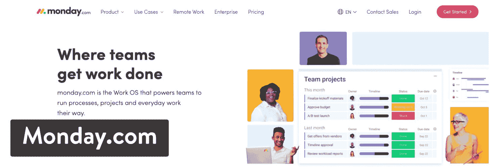
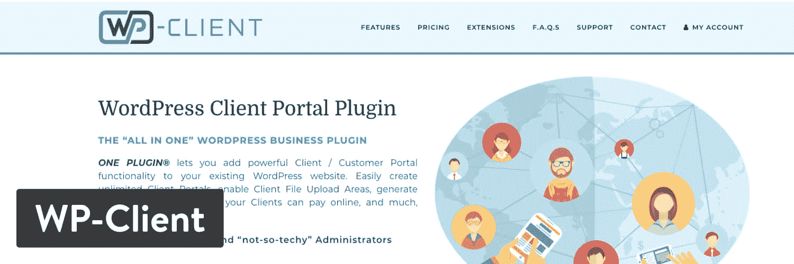
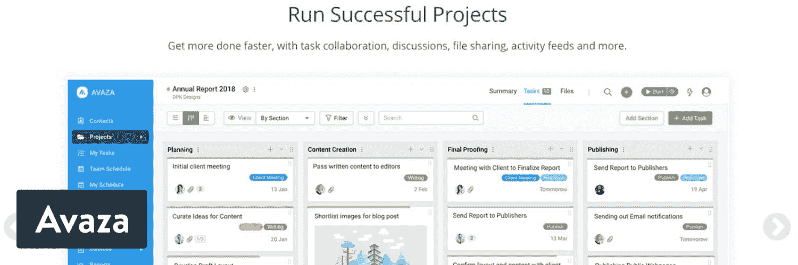
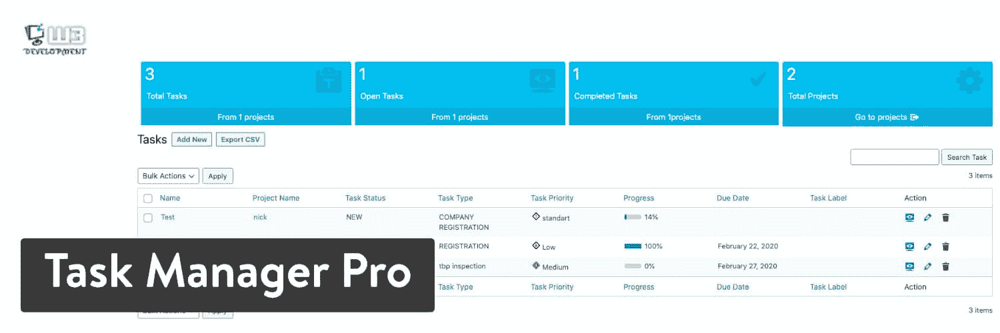
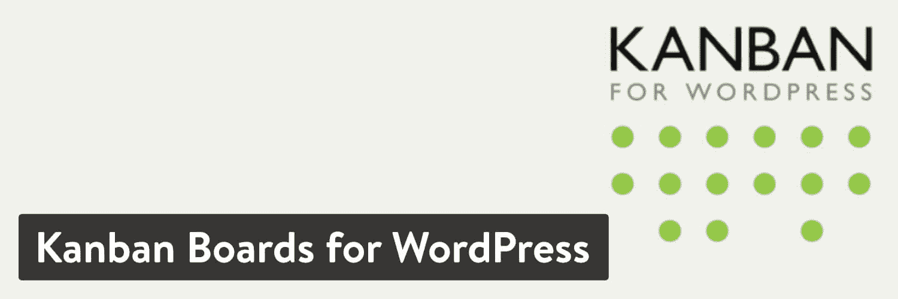
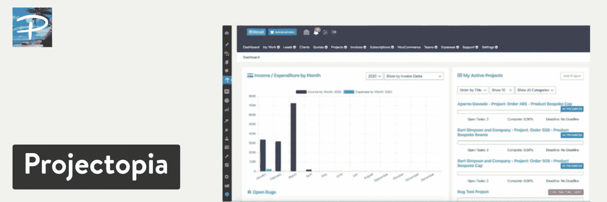

# 2022 年将使用的 13 大 WordPress 项目管理插件和工具

> 原文：<https://kinsta.com/blog/wordpress-project-management-plugins/>

项目管理包括规划、组织和遵守程序和政策的纪律，以确保团队满足项目期限并保持在预算内。

这通常包括与团队中的多个成员合作，以实现预先确定的目标和目的。这就是为什么 WordPress 项目管理插件对于 web 开发、社交媒体、市场营销、房地产和许多其他小企业类别的团队如此重要。

甚至像自由职业者和承包商这样的个体工作者也需要项目和任务管理。

项目经理的质量控制检查也可能涉及到确保事情达到一定的标准。这些插件的市场并不广阔，但是 WordPress 确实有一些创造性的解决方案，可以在你的仪表盘上管理你的项目。

我们已经收集了顶级的 WordPress 项目管理插件和工具，可以帮助你保持有组织的工作。

准备好检查了吗？我们走吧！

## 2022 年顶级 WordPress 项目管理插件和工具

 插件和工具的排列没有特别的顺序。

> 需要在这里大声喊出来。Kinsta 太神奇了，我用它做我的个人网站。支持是迅速和杰出的，他们的服务器是 WordPress 最快的。
> 
> <footer class="wp-block-kinsta-client-quote__footer">
> 
> 
> 
> <cite class="wp-block-kinsta-client-quote__cite">Phillip Stemann</cite></footer>

[View plans](https://kinsta.com/plans/)

[Whether you're a freelancer or a team lead, stay on task and organized with these 13 project management tools 💪Click to Tweet](https://twitter.com/intent/tweet?url=https%3A%2F%2Fkinsta.com%2Fblog%2Fwordpress-project-management-plugins%2F&via=kinsta&text=Whether+you%27re+a+freelancer+or+a+team+lead%2C+stay+on+task+and+organized+with+these+13+project+management+tools+%F0%9F%92%AA&hashtags=projectmanagement%2CWordPressTips)

### 1.WordPress 上游项目管理

[上游](https://wordpress.org/plugins/upstream/)项目管理插件是一个免费的 WordPress 工具，允许你从你的 [WordPress 网站](https://kinsta.com/blog/wordpress-website-cost/)内轻松管理任何类型的项目。您的客户可以通过前端项目视图跟踪他们项目的进度。您还可以设置里程碑、标记 bug，并启动项目讨论线程，在该线程中，项目中的每个人都可以相互聊天。

WordPress Project Management WordPress plugin

这是一个完全免费的核心插件，但它也有额外的扩展，允许你添加前端编辑功能以及项目时间表。你可以在这里找到 [premium 扩展列表](https://upstreamplugin.com/upstream-extensions/)，还有一些收藏夹，包括日历视图、定制器、定制字段和电子邮件通知。

更新、支持和一些扩展的价格从每年 39.50 美元开始。当您选择更大的包时，真正的扩展包开始发挥作用。看来你不能单独购买扩展。

总的来说，对于任何希望在不牺牲价值的情况下保持低成本的人来说，UpStream 看起来是一个可行的项目管理解决方案。您可以为自己的组织自定义字段和颜色，并生成无限数量的项目和用户。我们也喜欢项目可视化的[日历](https://kinsta.com/blog/wordpress-calendar-plugin/)和甘特图。

#### 使上游 WordPress 项目管理成为最佳选择的特性:

*   绝大多数的功能都是免费的，可以作为你的主要 WordPress 项目管理工具来安装和使用。
*   为这些项目中的所有用户创建里程碑和任务，并将它们链接在一起。
*   该插件允许您[上传文件和文档](https://kinsta.com/knowledgebase/bulk-upload-files-wordpress-media-library-ftp/)。
*   bug 跟踪有可定制的字段，以便您的工作人员记下描述、bug 状态和每个 bug 的严重性。
*   自动进度跟踪会告诉您项目何时需要人员参与，以及您何时即将完成项目。
*   讨论线索消除了对杂乱电子邮件的需求。您可以设置所有对话的用户权限。
*   为客户端用户设置联系人详细信息和自定义字段。
*   该插件有可定制的前端模板，以便您可以匹配自己的品牌和改变一切从颜色到领域。
*   这是一个开发者友好的 WordPress 项目管理插件，有选项用于[定制 CSS](https://kinsta.com/blog/wordpress-css/) 和调整前端布局和表单等元素。一些高级扩展包括日历视图和自定义字段。
*   这是一个翻译就绪的插件，世界各地的人都可以使用。
*   标签可用于标记任何内容，如项目、里程碑和文件。

### 2.Monday.com 与 WooCommerce 整合

Monday.com 是一个独立于 WordPress 运行的项目管理软件，可以被任何组织使用。我们仍然喜欢 WordPress，因为它有一个 [WooCommerce 集成。](https://support.monday.com/hc/en-us/articles/360010254340)通过这样的链接，你可以利用干净的 Monday.com 界面来管理你团队的项目，并将在线订单和库存水平等信息发送到项目管理软件。

基本软件为小型团队和大型企业提供了时尚的组织，将项目管理的元素与销售、营销和开发工具结合起来。您可以创建详细的工作计划并跟踪您的进度，同时将进度与您组织中的某些人员联系起来。

我们喜欢协作是 Monday.com 的一个重要组成部分，它也可以生成强大的报告。

Monday.com Project Management Software with WooCommerce Integration

在繁忙的项目管理软件市场建立一个品牌是一项艰巨的任务，但 Monday.com 已经设法建立了一个追随者，并证明了它与大狗一样有能力(它也是最强的 Trello 替代品之一)。

Monday.com 是一个高度可视化的项目经理， [WooCommerce 扩展支持](https://kinsta.com/blog/woocommerce-extensions/)订单、产品和其他领域的同步。这为你的商店建立了一个高层次的形象，并告诉员工哪些项目必须首先处理。

在考虑定价时，您不必为 WooCommerce 集成付费。然而，当你增加更多的用户时，Monday.com 确实变得有点昂贵。话虽如此，但它旨在与您的业务一起发展，应该很容易收回成本。起价是每个用户每月 8 美元，最低要求是 5 个用户，但如果你按年付费，你可以每月 39 美元。

#### 使 Monday.com 成为绝佳选择的特色:

*   该插件允许链接到你的 [WooCommerce 商店](https://kinsta.com/blog/woocommerce-tutorial/)，以获取产品和订单，并管理你的销售项目和你希望你的销售情况。
*   [根据团队成员的用户级别与他们合作](https://kinsta.com/blog/saas-products/)。
*   将项目管理套件与营销、[远程工作](https://kinsta.com/webinars/working-from-home/)、软件开发、媒体和制作以及人力资源模块相结合。它们都是供您选择的选项。
*   使用日历功能查看您的项目列表。
*   您控制用户角色，分配经理、同事和客户。
*   分配创建者并限制项目可见性，以便只有您组织中的人员可以看到正在发生的事情。
*   查看当前项目状态，以检查项目是否出现问题或需要改进。
*   追踪里程碑，这样你和你的队友就可以在事情完成时庆祝。
*   该软件使您的工作流程自动化。例如，当状态更改为新状态时，您可能会将用户分配到项目中。
*   Monday.com 的所有部分都是可视的。这包括用于制定明智的未来决策的图表和项目的日历视图。
*   随着 WooCommerce 的整合，Monday.com 与 MailChimp、Gmail 和其他几十种软件相结合。
*   没有用户限制。您可以创建无限数量的任务、项目和团队。然而，用户越多，价格就越高。
*   几个构建模块可用于定制您的界面和查看信息，如[看板视图](https://kinsta.com/blog/trello-alternative/#an-introduction-to-trello)、通知和日历视图。
*   所有用户都可以使用时间跟踪模块，他们可以为自己的工作运行时间跟踪和日志记录，或者您可以为组织建立一个时间跟踪器。将您的团队分成多个工作区，他们可以获得自己的仪表板，并且只能看到分配给他们的项目。
*   文件共享元素非常适合上传与项目相关的较大文件。
*   移动应用程序中提供了 Monday.com 的重要功能，即使您的团队在旅途中，也可以访问所有项目。

### 3.WP-带有项目管理扩展的客户端

WP-Client 是作为一个一体化的商业插件来销售的。但这意味着什么呢？总的来说，WP-Client 插件是一个客户端管理器，带有发送发票、共享文件、发送消息和记录与这些客户端对话的工具。所以，如果你有一个很长的客户列表，并且需要像发票和文件共享这样的元素，这是一个很有用的插件。

然而，我们谈论的是项目管理插件，那么 WP-Client 插件是如何归入这一类别的呢？

WP-Client 有几个扩展，但其中一个叫做[项目管理](https://wp-client.com/product/project-management/)。它通过帮助您与团队协调项目并与您的客户沟通，准确地完成了我们需要它做的事情。同样，如果你不需要客户经理，你也可以去别处看看。但是对于那些不介意在一个插件中接收两个小型商业插件选项的人来说，这是一个很好的机会。

WP-Client WordPress plugin

实际的 WP 客户端插件售价 59 美元。这是一次性的许可费用，但你可以每年升级以接收插件更新。

该插件还有其他三个软件包，价格一直高达 349 美元。每个计划贡献了一些额外的插件或功能，所以这取决于你在寻找什么。

#### 使 WP-Client 成为最佳选择的特性:

*   尽管免费元素有限，但 WP-Client 插件在客户端管理方面是真正的交易。在您添加项目管理扩展后，它将成为一个强大的客户和项目经理，当您查看定价时，这是相当有价值的。
*   核心的 WP-Client 插件包括隐私、[安全](https://kinsta.com/blog/wordpress-security/)、文件共享、客户端管理、私人信息、发票等功能。
*   项目管理扩展提供了一个漂亮的界面，用于创建项目并将项目分配给合适的人。
*   将员工分组，并在这些小组开始就一个项目进行协作时分配角色。
*   你可以完全控制你的数据，因为所有的东西都存储在你的数据库里。
*   制定更小的任务，每个任务只允许一个人贴标签。这实际上是为了避免“厨房里有太多的厨师”
*   生成常规任务下的子任务或更小的任务。
*   张贴项目里程碑，给你一个项目进展的俯视图。您可以分段查看项目，也可以查看整个时间线。
*   使用存档功能从视图中删除旧项目。
*   该插件包括一个文件共享系统，用于上传多种文件类型。你为这些文件设置权限，这样只有必要的人才能看到它们，并有权下载或编辑它们(类似于 [Google Docs](https://kinsta.com/blog/google-docs-to-wordpress/) )。
*   给你的客户有限的访问权限，让他们与你的团队交流，看看项目进行到什么程度了。您可以阻止内部通信等细节，但这是让客户了解情况的好方法。
*   独特的角色已经被指定，比如自由职业者和队友。您可以调整每个组的权限，但是默认的限制通常足以完成工作。
*   团队和客户的交流都存储在仪表板中，但是它们是分开的，这样就不会把客户的对话和团队的讨论混淆。

### 4.Avaza 与第三方集成

Avaza 没有提供直接的 WordPress 插件，但是有一长串通过 [Zapier](https://kinsta.com/blog/woocommerce-zapier/) 的集成，其中一些是[为 WooCommerce](https://zapier.com/apps/avaza/integrations/woocommerce) 设计的，而另一些则坚持使用[标准 WordPress 功能](https://zapier.com/apps/avaza/integrations/wordpress)。

集成涉及的一些功能包括在 WordPress 和 Avaza 之间发送发票的能力，以及创建新任务、项目、客户和产品的选项，而无需将这些细节从一个程序复制到另一个程序。

这种集成不花一分钱，但大多数使用 Avaza 的公司都要支付额外费用。然而，有一个免费的计划，支持无限的合作者，一个用户，和五个活跃的项目。所以，一个非常小的公司可以利用这一点。

否则，20 个活动项目和两个用户的价格从每月 9.95 美元开始，无限活动项目的价格一直到每月 39.95 美元。

Avaza WordPress plugin

所有计划都包括定期免费更新、安全数据和移动友好版本，以便从移动设备访问您的项目和用户。我们喜欢 Avaza 软件与 QuickBooks Online 和 Xero 集成，简化会计流程。

Avaza 套件的其他一些部分包括资源调度、在线发票和费用管理。这是对项目管理的补充，使定价看起来更加有趣。

当涉及到项目管理时，自动化 Avaza 和 WordPress 之间的通信是使这种集成工作良好的关键。我们很高兴你可以添加新用户，写关于项目的评论，并与其他系统同步。

对于 WordPress 或 Avaza 来说，触发新的结果动作的其他动作还有一长串。Avaza 项目管理器界面[类似于 Trello](https://kinsta.com/blog/trello-vs-asana/) ，从左到右显示多个用于拖放任务的板子。

提供了多个视图，您可以毫无问题地跟踪项目完成的百分比。结合任务标记、协作和智能电子邮件集成，很明显 Avaza 脱颖而出。

#### 使 Avaza 成为最佳选择的特性:

*   该软件没有存储在你的 [WordPress 仪表盘](https://kinsta.com/knowledgebase/wordpress-admin/)中，这使得[内容管理系统](https://kinsta.com/knowledgebase/content-management-system/)变得不那么杂乱。
*   价格按月计算，但我们发现与其他完整的软件管理套件相比，它相当便宜。
*   很明显，界面在开发过程中非常重要。董事会风格的项目运动系统对于视觉效果和给任务添加用户来说是非常棒的。
*   Avaza 不仅仅是一个项目管理工具。您还会收到用于开具发票、资源调度、报价等的模块。
*   团队协作是在智能电子邮件集成、讨论工具以及从第三方存储(如 [Google Drive](https://kinsta.com/blog/google-workspace/#google-drive) )附加项目的选项的帮助下完成的。
*   所有版本的插件都能在较小的设备上使用。
*   在快捷键、过滤器和搜索栏的帮助下，可以定位项目信息。
*   您可以对项目和任务进行分类，并将项目链接到用户组。
*   您有机会配置成员和项目仪表板来跟踪绩效，并为您的员工提供一个区域来查看与他们最相关的信息。
*   您可以创建自定义报告，并使用系统范围的仪表板实时查看项目的所有进展。
*   简化的基于时间的计费对于记录项目成本和了解在这些项目上花费了多少时间是非常有用的。
*   您可以选择邀请协作者批准时间表，并提供他们对项目的意见。
*   有几种自动化流程可供使用。其中一些非常适合将任务与日历同步、创建项目模板以及使用重复性任务和发票。
*   报告区域给人留下深刻印象，提供快速信息的项目摘要。显示详细数据，以及任务列表报告和预算详细信息。
*   有一个有趣的特性将你的评估和项目联系起来。因此，您向潜在客户发送了一份估价单。一旦被接受，您就可以将该评估转换成 Avaza 项目，并保留以前文档中的所有信息。

### 5.SP 项目和文件经理

SP 项目&文档管理器(以前叫做 Smarty Pants)是一个健壮的 WordPress 项目管理插件，有很多很棒的特性。[开发者](https://kinsta.com/blog/hire-wordpress-developer/)将功能分为管理员功能和客户端功能，然后为那些需要的人整合高级功能。

作为管理员，您可以完全控制用户访问。您可以将文件上传到每个客户端和项目页面，并获得过去客户端上传的概述。

您还可以添加员工、供应商、销售商、分包商和合作伙伴。所有级别的用户都可以根据您的权限参数创建项目。客户端可以上传多个文件、删除文件以及按名称搜索文件。他们还能够重命名文件。

SP Project & Document Manager WordPress plugin

社区版是免费赠送的，具有上传和管理无限数量文件的功能。您还可以保护文档、定制电子邮件以及嵌入来自 YouTube 和其他网站的特定类型的媒体文件。SP 项目和文档管理器插件的主要目的是以快速有效的方式共享文件。它包括一些标准的项目管理设置，但它通常用于文件，尤其是在客户和员工之间共享大文件时。

那个社区版完全免费。高级版在 [SP 网站](https://smartypantsplugins.com/downloads/wordpress-project-document-manager-plugin/)上市，售价 75 美元(单个授权)。最多在三个网站上安装插件需要 125 美元，五个网站需要 195 美元。总的来说，这个高级版本更多的是给你提供开发者出售的各种插件。有几十个额外插件的列表，包括用于[亚马逊 S3 集成](https://kinsta.com/knowledgebase/wordpress-amazon-s3/)的选项，WooCommerce 支持，以及额外的表单字段。

从医疗保健到银行，从教育到制造业，SP 项目和文档管理器插件是扩展您当前项目管理器的一个有价值的选择，或者可能将其用作主要工具。话虽如此，我们假设大多数用户会认为这是对一个更强大的项目管理插件的一种赞美。

#### 使 SP 项目和文档管理器成为最佳选择的功能:

*   社区版充满了基本功能，全部免费。
*   您可以上传和管理您的文件，而不必担心任何限制。
*   支持几种[媒体文件类型](https://kinsta.com/blog/wordpress-media-library/)，包括来自 YouTube 等地方的链接。
*   您可以导入本地文件并将其存储在特定项目中。
*   SSL 支持是确保安全优先的理想选择。
*   插件的本地化意味着世界各地的每个人都有机会使用插件。
*   该插件允许您添加无限数量的项目和用户，并支持用户角色分配。
*   几个安全特性被提供来保护你的文件，比如从你的网站下载任何文件都需要密码的选项(查看这些最好的 [WordPress 下载管理器插件](https://kinsta.com/blog/wordpress-download-manager/))。
*   客户端共享可以通过一些额外的工具来将特定的客户端分配到项目中，并将它们隔离在系统的其他部分之外。
*   每个用户都可以创建自己的文件夹，从他们的仪表板与其他用户协作，并将项目文件夹分配给网络中的其他人。
*   管理员拥有对所有文件、项目和用户的完全控制权。管理员可以关闭客户端访问，查看用户活动，并将每个项目文件夹下载到一个 zip 文件中。
*   如果你允许的话，所有的客户和顾客都有他们自己的个人页面来上传他们自己的文件和创建项目。
*   导出和导入是该插件的一个强大功能，可以选择将所有数据导出为 CSV 格式，或者从其他软件导入完整的项目细节。
*   使用[自定义字段](https://kinsta.com/blog/advanced-custom-fields/)构建各种自定义表单。
*   除了字段管理器，用户还可以通过插件仪表板直接签署文档。
*   尽管这主要是一个带有项目管理元素的文档存储和共享插件，但很高兴看到它有从第三方服务如 Google Drive、One Drive 和 Dropbox 链接和上传的选项。
*   高级插件中提供了几个集成。例如，你可以考虑集成像亚马逊 S3 这样的工具。WooCommerce 的集成非常适合在你的网站上销售，并有可能获取插件上的文件，然后通过你的网站销售。
*   在 SP 项目和文档管理器中，文件和项目组织似乎是最重要的。在[短码](https://kinsta.com/blog/wordpress-shortcodes/)的帮助下，你可以在你的网站上发布你的文件和项目，同时还提供搜索栏、过滤器和缩略图预览，供人们试图筛选杂乱的文件时使用。

### 6.Airtable 与第三方 WordPress 集成

Airtable 提供了几种将其软件与 [WordPress 内容管理系统](https://kinsta.com/blog/cms-software/#1-wordpress--price-free)整合的方法。第一个是通过 API 的[，这意味着](https://airtable.com/api)[你将需要一个开发者](https://kinsta.com/blog/web-developer-salary/)来集成(许多项目管理软件提供 API 访问，所以这不是开创性的)。另一个是与 [Airtable 的 WordPress 集成](https://airtable.com/integrations/wordpress)(由 Zapier 提供支持)。

Airtable 通常被认为是各种规模企业的顶级项目管理工具。价格也很合理，从每月 0 美元开始，数据库中最多可以有 1，200 条记录。每个用户每月 10 美元的计划对小型企业来说更现实。还有一个需要定制报价的企业版。WordPress 集成是免费的，安装时间不长。

Airtable

Airtable 完全不同于流行的 Trello 风格的项目管理设计，或者我们在许多项目经理中看到的看板设置。

相反，Airtable 发布数据库，如电子表格，并提供灵活的在线工具来组织项目并保持对这些电子表格的控制。它被视为 Excel 和 Trello 的混合体。

您可以设置多个视图，包括网格视图、日历视图和图库视图。还提供了看板解决方案，包括过滤器、标签和所有任务的类别。这些集成对于链接到 MailChimp、Gmail 和 Dropbox 等应用程序非常有用。当 WordPress 中发生某些触发事件时，WordPress 集成对于在 Airtable 中创建新记录非常有用。还可以选择将旧的 [WordPress 内容](https://kinsta.com/learn/content-marketing/)存档到 Airtable 数据库中。

#### 使 Airtable 成为最佳选择的特性:

*   WordPress 集成是免费的，核心的 Airtable 软件似乎是较便宜的项目管理套件之一。
*   在 Airtable 上生成数据库是通过激活 WordPress 中的一个触发器自动完成的。这样，您可能永远都不需要打开 Airtable 来创建新项目。
*   与列表中的其他项目管理软件相比，这个设计是独一无二的。它就像一个电子表格，但是有更多的交互式工具和组织模块。我们认为 Airtable 的设计让数据库和电子表格变得有趣。
*   Airtable 拥有移动应用程序，可以通过手机或平板电脑方便地访问所有项目和数据库。
*   您可以为您的内容开发独特的字段类型，包括附件、文本注释和复选框。
*   有一些模板可以简化项目创建过程。例如，您可能需要特殊字段来管理餐馆的项目。
*   为存储项目提供了四种视图。一个是看板，另外三个是网格、日历和图库视图。
*   互连是在表之间完成的。这减少了[重复内容](https://kinsta.com/blog/wordpress-seo/#49-deindex-duplicate-content)，并确保工作人员知道在哪里找到复杂项目的其他内容。
*   随着 WordPress 的集成，Airtable 可以很好地与 LinkedIn、MailChimp、Google 产品以及其他产品一起运行。
*   拖放“块”来与 Airtable 软件为您建立完美的界面和工作流程环境为您的工人。例如，您可能想要将[条形图](https://kinsta.com/blog/wordpress-charts/)或[地图](https://kinsta.com/blog/wordpress-google-maps/)添加到您的项目中。两者都有阻碍。
*   通过将用户访问权限限制为某些人来限制谁可以查看项目块中的内容。还有激活任务或项目的个人或锁定视图的选项。
*   [颜色和样式选项](https://kinsta.com/blog/website-color-schemes/)帮助您打造适合您业务的仪表盘。你甚至可以自定义所有形式的品牌，让新客户和客户看到你的标志。

### 7.与第三方集成的免费 camp

Freedcamp 为任务列表、看板、子任务和其他要素提供项目管理元素，所有这些都被组织到一个整洁的包中。它支持开发者使用其 API 与 WordPress 集成。

## 注册订阅时事通讯

### 想知道我们是怎么让流量增长超过 1000%的吗？

加入 20，000 多名获得我们每周时事通讯和内部消息的人的行列吧！

[Subscribe Now](#newsletter)

作为一个更简单的解决方案，你可以在 Zapier 的帮助下[将 WordPress](https://zapier.com/apps/freedcamp/integrations/wordpress) 或 [WooCommerce 链接到 Freedcamp](https://zapier.com/apps/freedcamp/integrations/woocommerce) 。触发器和动作在这个过程中是自动化的。你可以在 Freedcamp 上添加评论或优惠券，然后看到它作为一个新项目出现在你的 WordPress 网站上。从订阅到项目创建，一切都是允许的，这是一个理想的组合。

Freedcamp 的定价从免费开始，有无限的任务、存储和用户。免费版的功能受到严重限制，但对小型企业来说，这似乎是一个不错的计划。下一步是每个用户每月只需 1.49 美元。显然，对于一个高级项目管理工具来说，这是非常低的。

同样，功能是有限的，但我们希望许多自由职业者和小型开发团队享受这个价格。甚至企业计划也很便宜，每个用户每月 16.99 美元。

Freedcamp

Freedcamp 附带的核心应用包括讨论、时间跟踪、里程碑和其他几个应用。只需点击一个按钮就可以上传文件，为你的项目建立里程碑对于赶上最后期限很有帮助。密码保护是系统的一个普遍组成部分，为你的创造力传播创造了一个更安全的环境。

这种合作看起来也是一个优势，因为 Freedcamp 给了你一个类似于论坛的讨论区来传播想法和谈论所有当前的项目。

几个溢价插件可供您考虑。我们提到插件的原因是因为你可能会发现你可以去掉其他更贵的软件，把所有东西都整合到你的项目管理器中。用于发票、报告、[CRM](https://kinsta.com/blog/wordpress-crm/)和问题跟踪器的插件非常适合整合所有小型业务任务。

还值得一提的是，Freedcamp 链接到 Dropbox 和 [OneDrive](https://kinsta.com/blog/microsoft-teams-vs-slack/#microsoft-teams-vs-slack--integrations) 和 Google Drive，这些都是分享文档的绝佳选择。

#### 使 Freedcamp 成为最佳选择的特性:

*   Freedcamp 项目管理软件本身就是一个强大的解决方案。WordPress 的整合只是加速了你的工作流程，让每个人都能更清楚地看到事情。
*   对于所有定价计划，价格都是可承受的，并且提供免费套装。
*   您可以创建任务和添加子任务。除了自定义域和甘特图之外，周期性任务也是可能的。
*   日历共享非常适合将您的项目保留在您的待办事项日历中。该插件与谷歌日历集成，以消除复制和粘贴。
*   一些高级插件和应用程序通过一些计划提供。例如，你可以给你的网站添加发票、问题跟踪和 [wiki。](https://kinsta.com/blog/why-use-wordpress/#3-knowledgebaseencyclopediawiki)
*   将文件上传到所有项目，并从 Google Drive 和 OneDrive 等第三方存储解决方案中提取文件。
*   项目模板随软件一起提供。您也可以构建并保存自己的模板以备后用。
*   数据快照会定期保存。这意味着您不会意外丢失项目中的任何数据，即使您删除了某个项目。
*   创建带有甘特图和自定义域的项目。
*   生成重复事件并链接到 Google 日历以查看项目中的事件。
*   通过一个基于论坛的交流中心与你的团队就一项任务展开讨论。
*   所有员工都可以跟踪自己的时间，并将其记录到具体的项目或任务中。
*   你可以设定里程碑，让你的员工继续工作并创造动力。
*   安全性由多种功能处理，如双因素身份验证和密码管理。

### 8.全景图

Panorama 是一个 WordPress 项目管理插件，旨在让你的客户和团队随时了解情况。我们应该强调它的免费版本最近没有更新，因此强烈建议你先在[的试运行环境](https://kinsta.com/help/staging-environment/)上测试它。

尽管如此，我们认为这是一个值得一试的工具，因为它有一个最突出的特点:可视化。项目的整体外观使您的任务易于跟踪和显示。很高兴看到这些漂亮而简单的图表将如何帮助你在截止日期前跟进并认可进展。

作为一个项目管理插件，Panorama 整合了简单的模块和现代化的功能，以提高清晰度。简而言之，它被设计成易于理解，而不是像许多其他项目管理工具那样杂乱无章。

Panorama WordPress plugin

核心的 Panorama 插件用于将简单的项目管理整合到你的 WordPress 站点中。然而，它的高级版本更像是一个强大的套件，旨在扩展您的项目(而不是简单地为您提供一些基本功能)。

至于价格，个人许可证从每年 69 美元的支持、更新和免费插件开始。开发商经常提供折扣，所以要留意那些折扣。要获得高级插件，考虑每年 99 美元的代理捆绑包。查看 [Project Panorama 网站](https://www.projectpanorama.com/),了解有关定价、支持和完整演示的信息。

一些免费和高级插件包括 WooCommerce 集成、子任务、萌芽发票、顺序任务和一个[图库](https://kinsta.com/blog/wordpress-photo-gallery-plugins/)。在捆绑包之外，你可以选择为插件的单站点或多站点许可付费。

#### 使 Panorama 成为最佳选择的功能:

*   Panorama 插件在免费和高级插件的帮助下提供了可扩展性。其中一些插件包括前端上传器、前端编辑器、[简易数字下载](https://kinsta.com/blog/easy-digital-downloads/)、甘特图和新用户项目。
*   您可以指定开始和完成日期，并在截止日期临近时接收通知。
*   将项目嵌入到你的主题中，这样你的用户和客户就可以在任何他们想看的地方看到时间线。
*   您可以为所有项目添加里程碑，设置里程碑频率，并为每个里程碑指定标题和描述。这些数据点将显示在一个简单而漂亮的图表中，这样您就可以轻松地跟踪您的业务。
*   要微调项目的分类，您可以自己定义自定义项目类型，这样您就可以筛选出已关闭的项目或只查看一个团队的项目。
*   当你已经有一个庞大的项目列表，并想创建一个新的，项目全景将助你一臂之力，使步骤更容易。通过它的克隆工具，你可以很容易地复制一个现有的项目。只需转到“所有项目”并将鼠标悬停在您想要复制的项目上。点击“克隆”，将出现一个新的项目草案。仅仅改变一些细节比从零开始整个项目创建过程要快得多。
*   虽然没有免费试用，但我们提供了完整的在线演示来测试该界面，看看这些功能是否适合您的组织。
*   用户访问权限由管理员设置，可以选择创建定制的登陆和登录页面，使用您自己的颜色、字段和徽标。
*   项目仪表板对所有用户来说都很容易理解，包括项目列表和使用图表等视觉效果的细分。
*   每个项目都有日历、任务列表和跟踪工具。
*   对于每个项目，所有项目详细信息、文档和上传都存储在一个位置。这样，你就不必为了找到一张图片或文档而从所有项目的大文件夹中筛选。
*   一个自动化的进度计算器告诉你每个项目相对于预期完成了多少。如果项目进度落后，它也会通知你。
*   您可以将项目分成更小的阶段，其中每个阶段都有自己的一组新文档、讨论和任务。
*   所有的讨论都按照项目或阶段来组织，消除了利用混乱的电子邮件世界的需要。这也是一种很好的方式，可以与同时从事同一个项目的人进行实时交流。

### 9.泽法项目经理

[泽法项目经理](https://wordpress.org/plugins/zephyr-project-manager/)被打包成一个免费的项目管理插件，可以选择升级到一个[专业(付费)版本](https://zephyr-one.com/purchase-pro/)(明显优于免费版本，也有更好的支持)。这个免费插件在一个移动应用程序的帮助下处理项目和任务。

为所有项目创建个人仪表板并运行带附件的讨论。高级版本的售价为 49 美元，并通过定制字段、任务模板和一个 [Asana 集成](https://kinsta.com/blog/trello-vs-asana/#asana)扩展了整体功能，更不用说其他几个报告和看板风格的项目了。

Zephyr Project Manager WordPress plugin

从用户的角度来看，泽法项目管理器插件呈现了一个干净现代的设计，没有不必要的垃圾。您可以创建无限数量的项目，并使用您公司的徽标和颜色自定义您的界面。创建项目是在 WordPress 仪表盘中完成的，在那里你可以包含每个项目的细节，分配用户，标记任务和截止日期。

价格对所有组织都有吸引力，而界面的整洁会说服许多用户留下来。管理项目的标准视图有概述、任务、讨论和进度选项卡，所有这些选项卡都可以通过单击按钮来访问。当用户登陆到一个单独的项目管理页面时，他们可以上传文件到项目并发表评论。这一切都相当直观，容易掌握。

#### 使泽法项目经理成为最佳选择的特点:

*   核心插件是免费的，高级版只需要少量的一次性费用。
*   您可以快速升级到高级版本，以获得多种功能，如 Asana 集成、自定义任务模板、报告、自定义字段、看板和可定制的前端项目管理模块。
*   你可以把插件翻译成任何语言。
*   [管理员和用户获得他们自己的个人资料页面](https://kinsta.com/blog/wordpress-user-registration-plugins/)，带有个人资料图片、描述和电子邮件通知设置的选项。
*   设置用户能力以改善组织中的人员查看他们自己的项目的方式。
*   团队和项目管理元素组织在一起。您可以检查用户的项目进度，并创建您自己的团队，每个团队都有特定的用户。
*   进度报告将发送给与每个项目相关的用户。查看进度图表，获得自动发送的电子邮件，并检查概述选项卡，以了解项目将需要多长时间。
*   该插件带有一个日历视图，用于设置和查看即将到来的任务和项目。有一个模块可以估计每个项目还剩多少时间。
*   利用类别来组织您的项目，并将这些项目放在多个标签下。
*   有一个[文件管理器，可以从你的用户和管理员那里下载](https://kinsta.com/blog/wordpress-download-manager/)，上传和删除文件。每个文件都在指定的项目下查看，减少了文件为什么会出现在网站上的困惑。
*   该插件包括一套令人印象深刻的电子邮件通知工具，如电子邮件更新，每周消息，以及为已删除，已完成和正在进行的任务更改更新的选项。
*   所有讨论都显示在项目模块中，并带有该项目的附件。
*   该插件带有一个 Android 应用程序，用于在较小的设备上组织和管理您的项目。该应用程序与您的仪表板同步，以保持项目细节实时更新。
*   该插件支持无限数量的项目和任务，它有选项设置名称，改变开始和结束日期，并使每个项目或任务的标签。
*   您可以复制这些任务和项目以在其他地方使用，或者将它们作为重复对象复制。
*   所有的导出和导入都是用 JSON 和 CSV 文件完成的。
*   您可以访问图表和图形的可视化集合，所有这些都旨在呈现您正在进行的每个项目的进度。

### 10.任务管理器专业版

任务管理器 Pro 是 CodeCanyon 上为数不多的值得尊敬的项目管理器插件之一。与市场上的许多插件一样，定价是一次性费用，然后您可以选择支付额外的客户支持。Task Manager Pro 目前售价 36 美元，还有其他计划来扩展您的客户支持并获得高级许可(由开发人员与客户一起使用)。

与宕机和 WordPress 问题做斗争？Kinsta 是一款考虑到性能和安全性的托管解决方案！[查看我们的计划](https://kinsta.com/plans/?in-article-cta)

价值是存在的，考虑到任务管理器插件比列表中大多数高级插件便宜。更不用说，您可以获得对无限数量的项目和任务的支持。

这个一体化插件也可以管理你的用户，因为你可以生成用户，分配角色，并把他们放入组和项目中。这些组是这个插件所独有的，它与项目是分开的。这意味着你可能有一个团队，比如营销团队，然后将这个团队中的人分配到不同的项目中。

该插件在任务更新和进度检查方面提供了全面的改进。简而言之，当需要更新时，用户可以发表评论，或者您可以接收自动任务更新和警报。

Task Manager Pro WordPress plugin

虽然这个 WordPress 项目管理插件不是市场上最受欢迎的，但它确实提供了每个公司都应该从项目或任务经理那里得到的低价和功能基础。同样值得注意的是，开发者有一个文档、客户支持和完整产品演示的网站。有很多 CodeCanyon 卖家不提供这些。

除了用于处理您自己的客户支持消息的票证管理模块之外，Task Manager Pro 插件是一个时尚、轻量级的解决方案，用于在一个仪表板中处理您的客户端、员工和客户。

#### 使任务管理器专业版成为最佳选择的功能:

*   任务管理器专业版是一个一次性低价出售的高级插件。
*   该插件提供无限数量的用户、组、项目和任务。
*   虽然没有提供免费试用，但有一个完整的演示可供您测试插件的后端，并查看前端功能。
*   它在很大程度上依赖于当前的 WordPress 界面，对于以前的 WordPress 用户来说很容易理解。
*   用户管理模块概述了整个用户列表，并为您提供了添加用户、将用户分配到组以及将用户链接到特定项目的选项。
*   每个任务都有自己的详细信息页面，其中包含任务优先级、进度图表、开始和结束日期，以及为该任务分配用户的区域。
*   使用任务列表来查看有多少任务处于打开状态，以及是否有任何理由签入高优先级但尚未处理的任务。
*   提供了用于创建任务的响应表单。在表单中，通过填写任务名称、项目分配、标签、预计时间和进度等信息来生成任务。
*   更新通知会发送给附加到项目和任务的人员。
*   该插件支持在世界其他地方使用多种语言。
*   你可以选择在前端侧边栏或页脚显示任务或项目计数器。这对客户和员工使用的内部网站来说很方便。
*   在短代码的帮助下，将任务和项目列表添加到任何 WordPress 页面或帖子中。
*   并非所有的 WordPress 项目管理插件都有分组设置。这是一个独特的功能，可以进一步细分您的员工队伍。
*   该插件包含一个客户支持标签系统，用于处理来自客户端的消息。
*   您可以将特定的任务、项目和支持票证分配给组。
*   用户访问全部由管理员处理。因此，您可以基于用户角色或组来限制一些项目或任务。
*   所有任务管理、项目创建和票据管理都在同一个仪表板中完成，形成了一个非常统一的工作区。

### 11.业务经理-人力资源、ERP 和项目

[业务管理器](https://wordpress.org/plugins/business-manager/)插件编译了运行一个组织的软件需求集合。从人力资源管理到项目管理和企业资源规划，Business Manager 插件提供了一套工具，它超越了项目管理插件，因为它处理几个部门。

Business Manager – HR, ERP & Projects WordPress plugin

访问[业务经理网站](https://bzmngr.com/)查看文档、截图、演示等。开发人员有一个即将推出的特性列表，以及要购买的扩展。凭借完全免费的核心插件，Business Manager 插件脱颖而出，成为运行组织各部分的高价值和直观的选择。

你唯一需要花钱的时候就是你想使用其中一个分机的时候。即便如此，大多数功能都被打包到常规插件中，只有两个扩展在网站上出售:资产管理器和自定义字段扩展。这些扩展在一个网站上的售价为 29 美元，无限制使用的价格高达 79 美元。

对于一些企业来说，如果你不需要人力资源经理，或者如果你已经对你的文档存储或自定义字段插件感到满意，下载这样的项目管理器插件是没有意义的。没有理由用这些额外的功能来塞满你的仪表板。然而，我们看到这是许多公司消除对用于人力资源、文档、定制字段和项目管理的几个插件的需要的一种方式。如果你是这种心态，考虑业务管理器插件来满足所有这些需求。

#### 使 Business Manager 成为最佳选择的特性:

*   整个插件都是免费的，除了两个扩展，这两个都是可负担得起的，并且[易于安装](https://kinsta.com/knowledgebase/how-to-install-wordpress-plugins/)。
*   与许多免费的 WordPress 插件不同，Business Manager 的开发者有一个定期更新的网站，包含即将推出的功能、文档、客户支持渠道和扩展。
*   该插件不仅提供了一个标准的项目管理工具，还提供了其他元素，如人力资源管理、看板、客户解决方案、员工跟踪和文档存储/共享。
*   有一个高级看板和项目管理区，包括拖放功能，所以即使是初学者也能理解。
*   提供了几个跟踪元素，比如项目百分比跟踪、截止日期、工作时间等等。
*   您可以为员工创建用户，并将这些人分配给特定的项目。
*   项目类型是可用的，选项是总是将特定的项目类型发送给员工。
*   给每个项目分配一个项目状态，观察进度报告在一周/一个月中的变化。
*   项目注释在项目管理模块中提供。您还可以获得一个上传按钮，供用户相互共享和发送图像和合同等文件。
*   客户管理区有客户档案，包括电话号码、工作时间和徽标。
*   客户可以看到他们的个人资料，但这主要是内部使用。例如，您可以为每个客户记下笔记，并上传与客户项目相关的文件。
*   文档管理系统链接到您的站点存储。主要的区别是文档被分配给项目，你可以做笔记和添加员工。
*   您实际上能够禁用业务管理器插件中的模块。因此，如果你不想看到客户区，或者如果你已经有一个文件存储软件，只需在你的仪表板上隐藏它。

### 12.WordPress 的看板

[看板板](https://wordpress.org/plugins/kanban/)以敏捷项目管理而闻名，与 Trello 有着非常相似的感觉(建议阅读: [Trello vs Asana](https://kinsta.com/blog/trello-vs-asana/) )。您可以使用看板跟踪销售、编辑日历等等。这个插件与流行的 WordPress 插件[有很多整合，比如重力形态](https://kinsta.com/blog/wordpress-contact-form-plugins/#gravity-forms)和[忍者形态](https://kinsta.com/blog/wordpress-contact-form-plugins/#ninja-forms)。

这个插件的好处包括能够为你的团队定制板，点击一个按钮就可以创建任务和项目。你通常会估计一项任务需要多长时间，然后跟踪整个月的时间。

Kanban Boards for WordPress plugin

核心插件是免费下载的。可以选择以每年 149 美元的价格升级到 [KanbanPro 版本](https://kanbanwp.com/),或者以 499 美元的价格获得终身许可。Pro 插件添加了一批来自开发者的所有扩展，不需要单独购买它们。例如，作为专业用户，您可以接收任务注释、高级用户管理和任务颜色。其他一些插件包括多板功能、通知和任务附件。

#### 使 WordPress 看板成为最佳选择的特性:

*   核心插件是免费下载的。大多数最好的功能都包含在免费版本中，只需支付可承受的年费就可以获得一些插件。
*   WordPress 插件的看板板包括 [WordPress 多站点](https://kinsta.com/wordpress-multisite-hosting/)支持在你的网络中的几个 WordPress 站点上使用一个插件。
*   任务可以分配给团队成员，选项包括说明和截止日期。
*   你有能力将任务按项目分组，形成一个更有组织的系统。
*   项目管理区域可以在移动电话上使用，将项目管理的功能扩展到移动设备。
*   用户权限管理区域非常适合设置用户类型，并确保外人看不到您的项目信息。这对于不需要查看组织所有信息的承包商来说也很好。
*   安装不超过几分钟，所有的项目管理工具都在你的 WordPress 仪表盘的一个区域。
*   所有更新都是实时可见的，使协作变得更加容易。
*   这个插件有一个过滤器和搜索功能，可以在几秒钟内找到最重要的项目。
*   众所周知，该插件保持快速高效，即使有数千个项目在运行。
*   项目管理工作流程类似于 Trello，您可以“就地编辑”，并在几秒钟内调整每个项目的元素。
*   项目时间跟踪工具对于添加估计时间范围非常有用。
*   您有机会生成自己的项目自定义视图。这是借助搜索和过滤工具完成的。为了以后保存它们，你所要做的就是把它们加入书签。
*   一些高级插件提供了诸如通知、多面板、颜色、附件和高级用户管理等功能。

### 13.投影图

Projectopia 是一款高级的全功能 WordPress 项目管理插件，仅在 CodeCanyon 上出售，售价 59 美元。它最初是由一家内部网络机构设计的，以满足他们客户的需求，最终基于[的反馈](https://kinsta.com/blog/wp-feedback-wordpress-plugin/)和市场上缺乏 WordPress 项目管理插件，他们决定全职推出它。

你也可以查看 Projectopia 的官方网站,获取更多的截图、演示和文档。

Projectopia WordPress plugin

这个插件是为从小自由职业者到大机构的每个人设计的，帮助他们组织工作和任务，而不需要离开 WordPress。它具有广泛的功能集，提供独立的[客户端仪表盘](https://kinsta.com/blog/wordpress-custom-dashboard/)，强大的设置，以及时间线和里程碑等必要元素。

尽管核心插件中已经包含了广泛的功能，但 Projectopia 为那些希望扩展功能的人出售优质插件。同样值得一提的是，众所周知，开发者会根据用户的要求发布新的插件。预计为每个插件支付约 20 美元。

一些插件包括:

*   网络商务整合
*   [订阅量](https://kinsta.com/blog/woocommerce-subscriptions/)
*   环境整合
*   臭虫追踪器
*   供应商和费用
*   2 结账
*   Twilio
*   报告

#### 使 Projectopia 成为最佳选择的特性:

*   Projectopia 包括一个很好的工作流控制区域，用于移动任务和给某些人分配角色。
*   基于角色的团队成员特性是用来告诉哪些员工从事特定的项目。
*   有一个客户仪表板，供付费客户查看他们项目的哪些部分已经完成。
*   该插件带有报价和估价功能，这对于在你的服务上销售潜在客户来说非常有用。
*   设置项目和里程碑，以便您可以确定何时完成成就。
*   [表单生成器](https://kinsta.com/blog/wordpress-forms/)对于从客户那里收集信息或者甚至将它用作内部表单是非常有用的。
*   当你达到里程碑时，向你的客户发送自动发票。
*   该插件提供了一个处理客户支持的票务模块。
*   出售几个插件来集成核心插件。其中一些包括 bug 跟踪器、供应商和费用工具以及报告模块。
*   每个项目都有进度条、子任务和批量任务更改设置。
*   财务表包括了每个项目的支出和收入。
*   每个客户都可以登录到他们的仪表板，并对合同进行数字签名。
*   使用任务消息传递功能与您的员工就项目中的特定要求进行协调。
*   你可以与 Stripe 和 PayPal 等支付工具集成，以获得工作报酬。

### 研究 WordPress 项目管理插件的额外提示

在 WordPress 生态系统之外，有很多很棒的项目管理和任务管理工具。像特雷罗一样，[将你的 Gmail](https://kinsta.com/blog/gmail-search-operators/) 组织成任务列表，拖拽就是一个很酷的例子。人们[每天花大量的时间在他们的电子邮件收件箱](https://kinsta.com/blog/gmail-add-ons/)，所以让你的任务管理在同一个地方是有意义的。

或者查看顶级技术团队使用的[最佳 Trello 替代方案](https://kinsta.com/blog/trello-alternative/)列表。

不需要使用这些 WordPress 项目管理插件，但是它可以把你的工作量放在一个仪表板上，这个仪表板上有你需要的所有功能，可以让你的团队专心工作。然而，其他人更喜欢将项目管理从他们的 WordPress 站点中分离出来。这很大程度上是个人喜好，所以我们建议试用一些插件，看看它们是否适合你。

## 如何选择合适的 WordPress 项目管理插件

如果有一件事是肯定的，WordPress 项目管理插件并不多。不幸的是，这意味着对项目管理的需求减少了，或者可能有更好的解决方案没有直接的 WordPress 集成。

然而，许多组织需要链接到 WordPress 来保持整洁和查看即时进展。幸运的是，小批量的插件意味着你不必测试那么多。我们只讨论了值得考虑的项目管理插件，所以请随意测试它们，看看哪些是你最喜欢的。

最后，我们介绍了一些不一定是 WordPress 项目管理插件的应用和软件。相反，它们与高级扩展或触发器集成在一起。这些通常是更有权力的管理者，但是你不能控制 WordPress 内部。

基于每个插件/软件做得最好的地方，或者我们如何看待它与其他插件/软件的比较，这里有一些最后的建议:

1.  WordPress 上游项目管理——如果你想要一个免费的项目管理器，可以选择用插件升级，考虑一下上游插件。它灵活、现代，并且都在 WordPress 仪表盘中。
2.  Monday.com 与 WooCommerce 集成-这是我们最喜欢的项目管理软件的设计。这种整合不会把你的经理放在 WordPress 中，但它可以很好地与常规网站和 WooCommerce 同步。更不用说，还相对便宜。
3.  带有项目管理扩展的 WP-客户端——如果你也需要一个客户端管理工具，只需要 WP-客户端/项目管理组合。有时候客户端和项目管理是携手并进的，所以如果你的业务是这样的话，WP-Client 就是你的合适插件！只要确保你也获得了项目管理扩展。
4.  Avaza 与第三方集成——如果你运营一个 WooCommerce 网站，Avaza 会为你提供很好的服务。它提供了一个令人惊叹的界面和几个自动化工具，并与会计软件集成。
5.  SP 项目和文档管理器——这是一个作为轻量级项目管理器和强大的文件共享工具的插件。文件共享和存储是它的主要目的。
6.  与第三方 WordPress 集成的 Airtable——如果你想要一个免费的计划，如果你想要多个视图选项，比如看板、日历和网格视图，Airtable 管理器是有用的。
7.  Freedcamp 与第三方集成——freed camp 非常便宜，但它不会偷工减料。享受项目管理与时间跟踪和一个美丽的界面。
8.  Panorama 这是一个可行的项目管理器，具有高质量的全面功能集，但我们特别喜欢它在您的网站上嵌入项目列表。
9.  泽法项目经理——考虑泽法插件的理由包括简单的界面、卓越的移动版本和可靠的进度报告。
10.  任务管理器专业版——在项目管理方面，这个插件没有什么特别独特的地方。然而，支持票系统可能是一些人想要的。
11.  业务经理——人力资源、ERP 和项目——这个名字已经说明了一切。如果除了项目工具之外，您还需要 HR 和 ERP 功能，我们只会鼓励您与该项目经理合作。
12.  WordPress 的看板——许多项目经理都有收费的看板，但是这个插件免费提供。如果需要的话，用这个来赞美一个更全面的项目经理。
13.  如果你想要一个漂亮的工作流程界面，考虑这个插件。如果你倾向于高级插件，但不想花费太多，这也是一个很好的选择。

[Teamwork makes the dream work...but without an effective project management tool, collaborating can turn into a nightmare. 😰 Keep things on track and organized with these 13 options 😌Click to Tweet](https://twitter.com/intent/tweet?url=https%3A%2F%2Fkinsta.com%2Fblog%2Fwordpress-project-management-plugins%2F&via=kinsta&text=Teamwork+makes+the+dream+work...but+without+an+effective+project+management+tool%2C+collaborating+can+turn+into+a+nightmare.+%F0%9F%98%B0++Keep+things+on+track+and+organized+with+these+13+options+%F0%9F%98%8C&hashtags=projectmanagement%2CWPPlugins)

从基本的免费插件到可扩展的框架，你可以使用 WordPress 来管理你所有的项目、客户、卖主和供应商。最好的项目管理插件可以轻松集成到任何业务环境中！

如前所述，我们鼓励你看看 WordPress 项目管理插件和链接或不链接 WordPress 的项目管理软件。

项目管理的问题是，最佳选择通常与你个人的界面偏好和工作流程有关。所以，测试一下我们的一些建议(最好是在一个临时网站上测试一下)，问问自己这些功能和价格是否合适。

现在我们想听听你的意见:当谈到项目管理时，你的偏好是什么？在下面的评论区分享你的想法。

* * *

让你所有的[应用程序](https://kinsta.com/application-hosting/)、[数据库](https://kinsta.com/database-hosting/)和 [WordPress 网站](https://kinsta.com/wordpress-hosting/)在线并在一个屋檐下。我们功能丰富的高性能云平台包括:

*   在 MyKinsta 仪表盘中轻松设置和管理
*   24/7 专家支持
*   最好的谷歌云平台硬件和网络，由 Kubernetes 提供最大的可扩展性
*   面向速度和安全性的企业级 Cloudflare 集成
*   全球受众覆盖全球多达 35 个数据中心和 275 多个 pop

在第一个月使用托管的[应用程序或托管](https://kinsta.com/application-hosting/)的[数据库，您可以享受 20 美元的优惠，亲自测试一下。探索我们的](https://kinsta.com/database-hosting/)[计划](https://kinsta.com/plans/)或[与销售人员交谈](https://kinsta.com/contact-us/)以找到最适合您的方式。