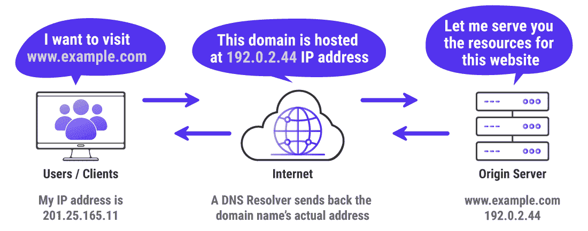
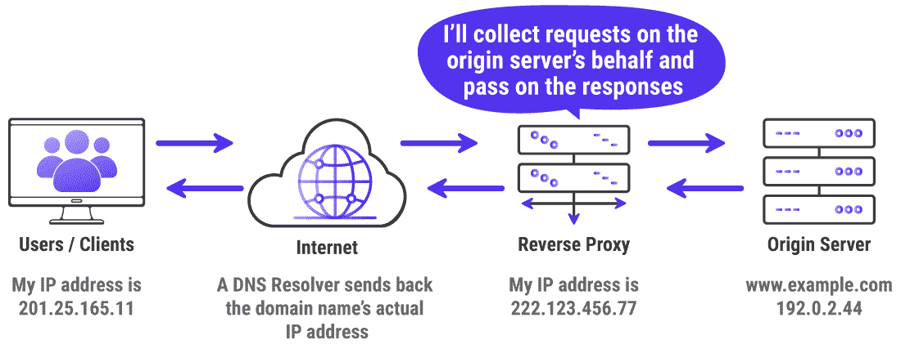
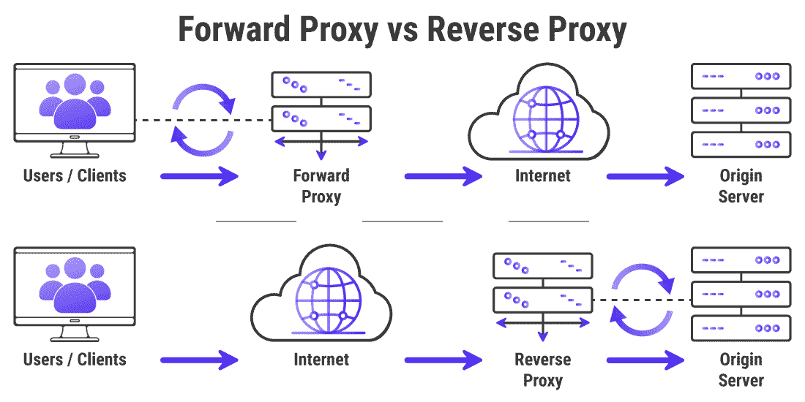
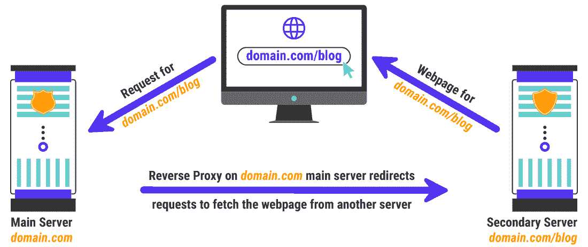
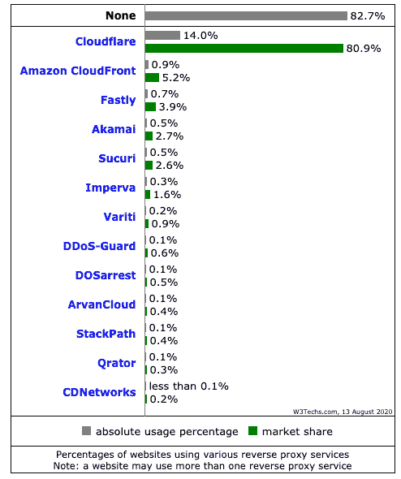
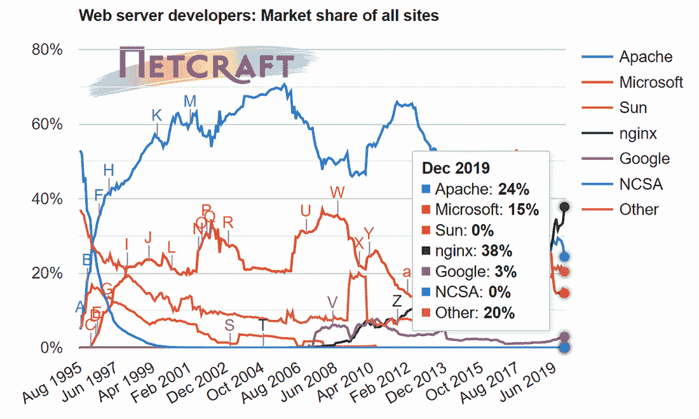
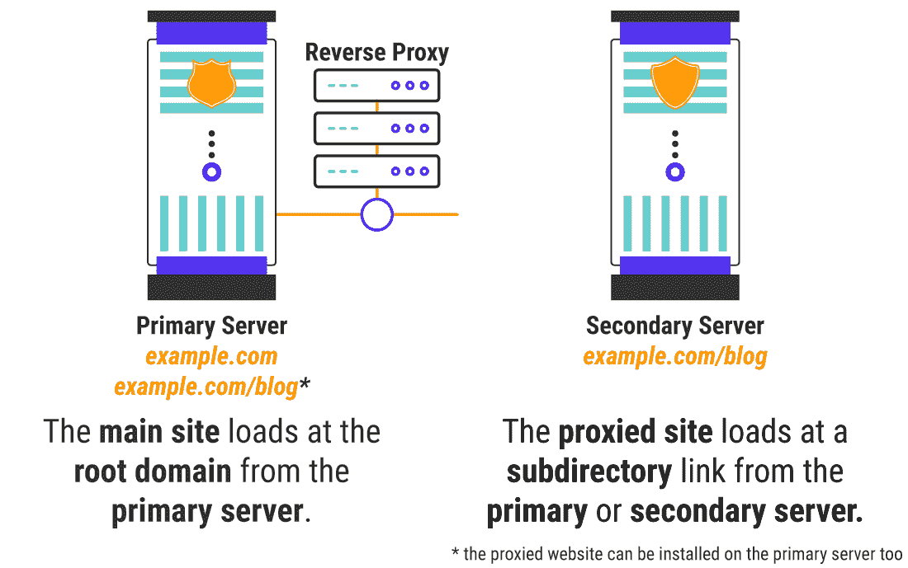

# 如何设置反向代理(Nginx 和 Apache 的分步操作)

> 原文：<https://kinsta.com/blog/reverse-proxy/>

反向代理位于 web 服务器的前面，在请求到达源服务器之前接收所有的请求。它的工作方式类似于转发代理，只是在这种情况下，使用代理的是 web 服务器，而不是用户或客户端。反向代理通常用于增强 web 服务器的性能、安全性和可靠性。

例如，你可以在服务器 A 的`**example.com**`域托管一个非 WordPress 站点，在服务器 b 的`**example.com/blog**` URL 上运行它的博客，你可以通过为托管你的主站点的服务器添加一个反向代理来实现。你可以配置反向代理，将对博客的请求重定向到不同的服务器(例如像 Kinsta 这样的[管理的 WordPress 主机)。](https://kinsta.com/blog/managed-wordpress-hosting/)

在这篇文章中，你将学习反向代理服务器的基础知识，它们是如何工作的，它们的主要好处是什么，以及如何使用它们来加速和保护你的 WordPress 站点。

激动吗？开始吧！

## 什么是反向代理？

要理解什么是反向代理服务器，你首先需要知道它的作用，并熟悉它的所有相关术语。

当您通过输入[域名](https://kinsta.com/blog/choose-domain-name/)或点击链接正常浏览网页时，您的浏览器/设备会直接连接到网站的服务器并开始下载其资源。



How browsing on the internet works usually


如果你想匿名访问你的网站的 IP 地址，那么你可以使用一个代理服务器发送你的所有请求。它会将你的请求转发给 [DNS 解析器](https://kinsta.com/knowledgebase/what-is-dns/)，然后从其原始服务器下载网站的资源。


> Kinsta 把我宠坏了，所以我现在要求每个供应商都提供这样的服务。我们还试图通过我们的 SaaS 工具支持达到这一水平。
> 
> <footer class="wp-block-kinsta-client-quote__footer">
> 
> 
> 
> <cite class="wp-block-kinsta-client-quote__cite">Suganthan Mohanadasan from @Suganthanmn</cite></footer>

[View plans](https://kinsta.com/plans/)

之后，它会将这些资源传送到您的设备上。这称为正向代理。


How a forward proxy server works


你对网站完全隐藏，因为它认为你的请求来自转发代理。


### 信息

由于像 Kinsta 这样的托管服务提供商统计站点访问量的方式，他们要求用户设置一个头来通知原始服务器他们的真实 IP 地址。因此，隐私保护不适用于此类特定情况。


除了增强用户隐私，转发代理主要用于绕过地理内容限制。例如，如果您想观看在您所在地区被阻止的视频，您可以使用带有 IP 地址的转发代理来观看视频。

转发代理的工作方式与虚拟专用网络(VPN)几乎相同，但[它们是具有独特用例的不同技术](https://www.varonis.com/blog/proxy-vs-vpn/)(尽管它们有时会重叠)。
T3】

### 反向代理服务器与正向代理服务器

反向代理服务器充当原始服务器的前台，以保持匿名性，[增强安全性，](https://kinsta.com/blog/wordpress-security/)就像用户/客户端如何使用正向代理来实现同样的目的。它确保没有用户或客户端直接与源服务器通信。



How a reverse proxy server works


正向代理和反向代理之间的差别很小，但是它们的工作方式不同。

两者可以协同工作，因为它们的功能之间没有重叠。通常，用户/客户端使用正向代理，而源服务器使用反向代理。



Forward Proxy vs Reverse Proxy servers


因为服务器管理员可以控制反向代理的工作方式，所以您可以使用它来启用许多有用的功能。

我们将在这篇文章的后面列出它的所有好处。

### 为什么要使用反向代理？

许多企业，尤其是大型企业，使用定制的网站来满足他们独特的需求，而不是运行在 WordPress 上。一些例子包括银行和保险网站。

在其他情况下，一个企业可能将他们的网站托管在一个不允许他们安装任何外部软件的外部服务上(例如 [WordPress](https://kinsta.com/knowledgebase/what-is-wordpress/) )。通常，这些都是使用 [Shopify](https://kinsta.com/blog/shopify-alternatives/) 等[电子商务平台](https://kinsta.com/blog/ecommerce-platforms/)的中小型零售商。

由于 WordPress 有[强大的 CMS 功能](https://kinsta.com/blog/cms-software/)，许多企业，包括拥有定制网站的大型企业，可能[更喜欢使用 WordPress](https://kinsta.com/wordpress-market-share/) 托管他们的博客。

解决这个问题的一个方法是[在主网站的子域](https://kinsta.com/blog/wordpress-subdomain/#how-to-install-wordpress-on-subdomain)上安装 WordPress，并构建[导航菜单](https://kinsta.com/blog/website-navigation/)，这样用户可以在主网站和博客之间轻松切换。

由于子域表现为一个独特的域，它会影响你网站的搜索引擎优化。尽管谷歌对子域和子目录一视同仁，但如果网站托管在子域[上，比托管在子目录](https://kinsta.com/blog/wordpress-subdomain/#impact)上，它会花费更多的精力来优化网站的搜索引擎排名。


Two approaches to hosting blogs on a website


[谷歌已经重申](https://www.youtube.com/watch?v=uJGDyAN9g-g)它对子域和子目录一视同仁，但一些 SEO 专家不同意这一点。而且即使不影响站点的 SEO，托管在子目录中的站点也只是更容易维护而已。

这就是为什么您可以使用反向代理将请求重定向到托管在单独服务器上的站点博客。例如，一家银行可以在他们的服务器上安全地托管他们的主要网站，但他们也可以在一个托管的 WordPress 主机上单独托管他们的由 WordPress 驱动的博客，如 [Kinsta](https://kinsta.com/) 。



An example of a reverse proxy use case


将两个不同的网站统一在一个域名下是使用反向代理的主要优势之一。它有助于品牌保持其网站的组织性、专业性和可信度。

[了解反向代理如何提高⚡️性能，🔒安全性&🤝可靠性...本指南中所有⬇️ 点击推文](https://twitter.com/intent/tweet?url=https%3A%2F%2Fkinsta.com%2Fblog%2Freverse-proxy%2F&via=kinsta&text=Learn+how+a+reverse+proxy+can+enhance+%E2%9A%A1%EF%B8%8F+performance%2C+%F0%9F%94%92++security+%26amp%3B+%F0%9F%A4%9D++reliability...+all+in+this+guide+%E2%AC%87%EF%B8%8F&hashtags=WPHelp%2CNginx)


## 使用反向代理的好处

除了上述用例，反向代理还提供了许多其他好处。下一节将讨论它们的一些主要优势。

### 负载平衡

对于一个每天有数百万独立访问者的网站来说，单个原始服务器无法处理所有的[输入流量](https://kinsta.com/blog/how-to-drive-traffic-to-your-website/)。在这些情况下，您可以在许多服务器之间智能地分配流量。通常，所有的服务器将托管相同的内容，以消除单点故障，使网站更加可靠。

反向代理是一种很好的设置方式，因为它可以在传入流量到达源服务器之前接收它。如果源服务器过载或完全失效，它可以将流量分配给其他服务器，而不会影响站点功能。

反向代理还可以将传入的请求定向到几个服务器，每个服务器执行它优化的特定功能。然后，反向代理可以收集来自所有服务器的响应，并将它们传递给客户端。

因为我们使用大多数流行的反向代理主要是为了负载平衡，它们也被称为**负载平衡器**。

#### 全球服务器负载平衡(GSLB)

GSLB 是一种先进的负载平衡方法，用于将网站流量分布在全球多个服务器上。这通常是通过[选播路由技术](https://www.cloudflare.com/learning/cdn/glossary/anycast-network/)来完成的，其中反向代理基于客户端和服务器之间的最快旅行时间来选择服务器节点。

GSLB 不仅大大提高了网站的可靠性和安全性，还减少了延迟和加载时间，从而增强了用户体验。您可以将 GSLB 与其他网络优化技术结合使用，例如[勺子喂养](https://wiki.squid-cache.org/SpoonFeeding)，以进一步释放原始服务器的计算资源。

虽然你可以在你的服务器上手动设置全局服务器负载平衡，但它通常由专用 CDN 负责，如 [Cloudflare](https://kinsta.com/help/kinsta-cdn/) 和[key dn(它也支持 Kinsta CDN)](https://kinsta.com/help/kinsta-cdn/) 。Kinsta 通过一个由谷歌云平台支持的[负载均衡器为其托管的所有网站服务。](https://kinsta.com/knowledgebase/shared-vps-dedicated-hosting/)

### 增强的安全性

反向代理可以隐藏源服务器的 IP 地址和其他特征。因此，您网站的源服务器可以更好地保持其匿名性，大大增加其安全性。

由于反向代理将在流量到达主服务器之前接收所有流量，任何[攻击者或黑客](https://kinsta.com/blog/wordpress-hacked/)将会发现更难对您的网站进行安全威胁，如 [DDoS 攻击](https://kinsta.com/blog/what-is-a-ddos-attack/)。

你可以[使用严格的防火墙](https://kinsta.com/blog/what-is-a-firewall/)来强化反向代理，使其更加安全，以抵御常见的网络攻击。如果没有安装反向代理，很难[移除恶意软件](https://kinsta.com/blog/types-of-malware/#removing-malware-from-devices)或开始攻击。


### 信息

Kinsta 在其后端架构中使用反向代理，并为其托管的所有网站提供免费的 WordPress hack 补丁。


像 [HAProxy](https://serverfault.com/questions/239749/possible-to-add-basic-http-access-authentication-via-haproxy) 这样的反向代理可以向没有启用基本 HTTP 访问认证的 web 服务器添加它。您还可以使用反向代理为各种类型的请求添加集中式身份验证。

### 强大的缓存

通过缓存静态和动态内容，您可以使用反向代理来实现 web 加速。这可以减少源服务器的负载，从而提高网站的速度。

例如，如果你的原始服务器在美国，一个来自欧洲的用户访问你的网站，那么你可以从欧洲的反向代理服务器提供你网站的缓存版本。由于反向代理比原始服务器更接近用户，网站加载时间会更短，从而使其表现出色。

Varnish 和 Nginx FastCGI 是用于缓存 web 内容的反向代理的突出例子。如果你的网站是由 Kinsta 托管的，[你不必担心缓存问题](https://kinsta.com/blog/wordpress-cache/)，因为 Kinsta 会为你处理所有的缓存工作。
T3】

### 卓越的压缩

服务器响应会消耗大量带宽。在将服务器响应发送到客户端之前压缩服务器响应(例如用 gzip 压缩[)可以减少所需的带宽，从而加快服务器在网络上的响应速度。](https://kinsta.com/blog/enable-gzip-compression/)

反向代理是压缩服务器响应的理想选择，因为它位于源服务器和客户端之间。

### 优化的 SSL 加密

对每个客户端的 SSL/TLS 请求进行加密和解密对于源服务器来说是非常繁重的工作。反向代理可以承担这项任务，以释放源服务器的资源用于其他重要任务，如提供内容。

卸载 [SSL/TSL 加密和解密](https://kinsta.com/help/how-to-install-ssl-certificate/)的另一个优势是减少地理上远离原始服务器的客户端的延迟。

您还可以选择带有专用 SSL/TLS 加速硬件的反向代理来进一步优化这项任务。这种反向代理被称为 [SSL/TLS 终止代理](https://en.wikipedia.org/wiki/TLS_termination_proxy)。像 Varnish 这样的一些服务器不支持 SSL/TSL 协议，因此 SSL/TSL 终止反向代理可以帮助保护通过它们的流量。

### 更好的 A/B 测试

大多数 [A/B 测试工具](https://kinsta.com/blog/wordpress-ab-testing-tools/)需要你使用外部 [JavaScript 库](https://kinsta.com/blog/javascript-libraries/)来加载它们的功能。然而，加载第三方脚本会降低页面加载速度，给用户带来不稳定的体验。

相反，您可以使用反向代理在服务器级别创建两个独立的流。例如，您可以使用 Nginx 的`**split_clients**`或`**sticky route**`方法来控制流量重定向。

你可以参考 Nginx 和 T2 的教程来了解更多关于使用反向代理执行 A/B 测试的知识。

### 监控和记录流量

反向代理捕获通过它的任何请求。因此，您可以将它们用作监控和记录流量的中心。即使您使用多个 web 服务器来托管您网站的所有组件，使用反向代理也可以更容易地监控来自您网站的所有传入和传出数据。

## 最流行的反向代理

[根据 W3Techs](https://w3techs.com/technologies/overview/proxy) ，**几乎 83%** 的网站没有使用他们监控的反向代理服务。



Statistics of reverse proxies used by websites (Source: W3Techs.com)


在使用反向代理的 **17%** 个网站中(如上所列)，你会注意到大多数都是[cdn](https://kinsta.com/help/kinsta-cdn/)。这是因为大多数反向代理默认隐藏它们的存在，作为一种安全预防措施。因此，你不能依靠像 W3Techs 这样的网站监控服务来发现哪些反向代理是最流行的。

根据我们的研究和经验，目前最流行的反向代理是:

### Nginx

Nginx 是一个开源的 web 服务器，它也可以作为一个反向代理。除了用于托管网站，它也是最广泛使用的反向代理和负载平衡解决方案之一。[据 Netcraft](https://news.netcraft.com/archives/2019/12/10/december-2019-web-server-survey.html) 统计，2019 年 12 月超过**4.79 亿**台 web 服务器在使用 Nginx，成为 [web 服务器市场份额](https://kinsta.com/blog/nginx-vs-apache/)的领导者。



Web server market share of all sites (Source: Netcraft)


Nginx 提供了上面讨论的所有反向代理的好处，还有更多。它提高了 web 性能、安全性、可靠性和可伸缩性。您可以使用它的配置文件来配置 Nginx，该文件也是可热重加载的。在 Kinsta，Nginx 反向代理是你可以使用的几个附加服务之一。

但是你也可以使用 Nginx Plus，一个商业产品，来访问基于 API 的配置选项和其他适合大型企业网站的特性。

Kinsta 为其所有网站提供 Nginx。在其参与竞争的每个类别中，它都被评为 Review Signal 顶级虚拟主机。其他一些使用 Nginx 的大公司有 MaxCDN、 [Cloudflare](https://kinsta.com/blog/cloudflare-settings-wordpress/) 和网飞。

将 Nginx 设置为基本的反向代理很简单。Nginx 还为您提供各种指令，根据您的需求定制服务器的反向代理。我们将在后面的部分讨论如何做到这一点。如果您是 Kinsta 的客户，您还将在同一部分学习如何为 Kinsta 托管的网站使用反向代理。

### 光泽面

[Varnish](https://varnish-cache.org/) 是一个开源的 HTTP 反向代理，内置缓存引擎。它主要是为提供动态内容的高流量网站设计的。您还可以将 Varnish 用作负载平衡器、 [web app 防火墙(WAF)](https://kinsta.com/blog/what-is-a-firewall/#web-application-firewall) ，以及边缘认证和授权服务器。

它可以在所有现代版本的 Linux 和 FreeBSD 上工作，主要用作 Nginx 或 Apache web 服务器的前台。Varnish 强大且高度灵活的 [Varnish 配置语言(VCL)](https://varnish-cache.org/docs/3.0/tutorial/vcl.html) 让你定义各种特性，比如处理 [HTTP 请求](https://kinsta.com/blog/make-fewer-http-requests/)，缓存，以及连接到一个或多个 web 服务器。

出于这个原因，许多 cdn 使用 Varnish 作为快速传送内容的主要基础。

Varnish 还支持 [Edge Side Includes (ESI)](https://varnish-cache.org/docs/3.0/tutorial/esi.html) ，这是一种帮助你在其他网页中重用一个网页的部分的语言。如果你的网站在不同的页面中使用了大量重复的内容，ESI 可以通过缓存经常使用的部分来帮助你[加快你网站的页面加载速度](https://kinsta.com/ebooks/wordpress/speed-up-wordpress/)。

您可以使用各种[模块(VMODs)](https://varnish-cache.org/vmods) 扩展 Varnish。前往 [Varnish 的官方教程](https://www.varnish-software.com/wiki/content/tutorials/wordpress/index.html#implementing-wordpress-with-varnish)学习如何设置 Varnish 作为 WordPress 的反向代理。

### Apache 流量服务器

[Apache 流量服务器](https://trafficserver.apache.org/)是一个开源的缓存代理服务器。它因其快速、可伸缩的特性而广受欢迎。它是由雅虎开发的商业产品。很久以前，但他们把它开源并捐赠给阿帕奇基金会用于维护。

几个主要的内容网络和 cdn，如 Comcast、Akamai、LinkedIn、Yahoo 和 Apple，都使用 Apache Traffic Server 来支持他们的技术。

## 注册订阅时事通讯


### 想知道我们是怎么让流量增长超过 1000%的吗？

加入 20，000 多名获得我们每周时事通讯和内部消息的人的行列吧！

[Subscribe Now](#newsletter)

您还可以使用[Apache HTTP Server](https://httpd.apache.org/)(**Apache httpd**)，一个 HTTP 服务器守护进程，在您的 web 服务器上设置一个反向代理。除了充当基本的 web 服务器之外，它还帮助您向用户提供静态和动态内容。在本文的后面，您将了解如何将 Apache 设置为反向代理。

### HAProxy

HAProxy 是一个开源的反向代理和负载均衡器。它旨在与大多数现有的 web 服务器架构集成，包括 Linux 发行版和云平台。与 Nginx 类似，HAProxy 使用事件驱动的 I/O 模型，并支持跨多个工作进程拆分请求。

对于 HTTP 请求，即使在重负载下，HAProxy 的表现也非常好。互联网上一些[流量最高的网站](https://www.haproxy.org/they-use-it.html)如 Airbnb、Reddit、Instagram、Stack Overflow、Tumblr、GitHub、Imgur 等都使用 HAProxy 高效地交付网站。

讨论如何实现 HAProxy 超出了本文的范围，但是你可以[参考他们的文档](https://www.haproxy.org/#docs)来理解它是如何工作的。

**注:** [Traefik](https://containo.us/traefik/) 和 [Envoy](https://www.envoyproxy.io/) 是 HAProxy 的另外两个开源替代品。它们都是高性能的反向代理和负载平衡器，具有许多高级特性。

其他一些流行的反向代理是 AWS 弹性负载平衡器、GLBC、 [DigitalOcean](https://kinsta.com/digitalocean-alternative/) 负载平衡器和谷歌云负载平衡器。关于目前使用的顶级反向代理和负载平衡器的详尽列表，你可以[查看 Stackshare.io](https://stackshare.io/load-balancer-reverse-proxy) 。

## 反向代理:WordPress 站点的用例

WordPress 站点使用反向代理主要有三种情况，包括在 Kinsta 托管的站点。



Loading a ‘Main Site’ vs a ‘Proxied Site’


在这个例子中，我们只使用 Nginx，因为它是当今 WordPress 网站上最流行的反向代理。但同样的基本原则也适用于其他反向代理。

反向代理通常很难安装、配置和支持。出于这个原因，Kinsta 为每个需要帮助设置的反向代理提供每月 50 美元的附加订阅。你可以联系[金斯塔的支持团队](https://kinsta.com/kinsta-support/)了解更多详情。

### 1.托管在同一服务器上的主站点和代理站点

如果主站点和代理站点都在同一个服务器上，主站点可以在一个 [WordPress 安装](https://kinsta.com/knowledgebase/what-is-a-wordpress-install/)上运行，而一个单独的 WordPress 安装为代理站点供电。

因为您可以访问站点及其共享的 web 服务器，所以可以为主站点设置反向代理规则，然后配置代理站点从反向代理加载。

如果你在 Kinsta 托管这两个站点，那么你可以联系 Kinsta 的支持团队，请求他们为你设置反向代理。以下是您需要遵循的程序:

*   确保主站点和代理站点都位于 Kinsta。如果不是，那么您可以将两个站点都迁移到 Kinsta 的环境中，或者手动迁移，或者提交一个[迁移请求](https://kinsta.com/knowledgebase/wordpress-migrations/)。
*   开一张支持票，向 Kinsta 的支持团队提供域配置的清晰描述。设置反向代理大约需要一个工作日。
*   Kinsta 将在主站点上设置相关的反向代理规则，并将代理站点配置为通过反向代理进行加载。

以下是 Kinsta 用来通过反向代理加载子目录站点的标准 Nginx 反向代理指令:

```
location ^~ /subfolder/ {
proxy_pass http://subfolder.domain.com;
proxy_set_header X-Real-IP $remote_addr;
proxy_set_header X-Forwarded-For $proxy_add_x_forwarded_for;
proxy_set_header X-Forwarded-Proto $scheme;
}
```

在上面的代码中，您需要将`**/subfolder/**`占位符替换为实际的子目录名称(例如`**/blog/**`、`**/shop/**`)。另外，`**http://subfolder.domain.com**`子域应该与用于将反向代理指向代理站点的 [URL](https://kinsta.com/knowledgebase/what-is-a-url/) 相匹配。

`**location**`指令包括脱字符号和波浪符号( **^~** )，告诉 Nginx 如果找到定义的字符串，它应该停止搜索进一步的匹配，并使用这里列出的指令。在文档中了解更多关于 Nginx 的反向代理指令。
接下来，您需要配置代理站点，通过反向代理进行加载。以下是 Kinsta 配置代理站点时遵循的标准步骤:

*   在加载代理站点的路径下创建一个子目录。所有代理网站的文件都被移动到这个子目录。
*   更新 web 服务器的配置文件，将新的子目录定义为代理站点的根目录。此外，您需要添加一个重写规则，以便为每个传入的请求从请求 URI 中删除子目录。
*   更新代理站点数据库中的所有 URL，以匹配实时站点 URL(例如`**example.com/blog**`)。
*   用`**$_SERVER['HTTP_HOST']**`定义编辑代理站点的`**wp-config.php**`文件，将它指向主站点的 URL。
*   如果您使用 SSL 证书，那么您需要在`**wp-config.php**`文件中定义严格的规则来避免重定向循环。

**注意:**代理站点不能创建与代理站点加载的子目录相同的 URL。例如，在`**example.com/blog**`的代理站点不能在`**example.com/blog/blog**`创建页面或目录。

### 2.仅托管在您的服务器上的代理站点

如果您只能访问代理站点及其 web 服务器，那么您需要联系主站点的服务器管理员，让他们为您设置反向代理规则。

为此，您必须遵循上述相同的步骤，只是在这种情况下，您必须在两台不同的服务器上配置规则。

为了让 Kinsta 托管您的代理站点，[向该站点添加一个域](https://kinsta.com/help/add-domain/)，它将指向反向代理。通常，子域适合这种目的(例如`**blog.example.com**`)来通过子目录链接(例如`**example.com/blog**`)加载代理站点。

在 Kinsta 上设置好代理站点后，您可以[联系 Kinsta 支持团队](https://kinsta.com/kinsta-support/)来配置代理站点，以便通过反向代理进行加载。此时，我们的支持团队将需要您的服务器的真实 IP，以便以正确计算访问量的方式完成设置过程。如果由于某些提供商(如 AWS CloudFront)的动态 IP 限制，您无法提供静态 IP，您的计划将被转换为基于带宽的可比计划。

最后，在你的服务器上设置反向代理不在 Kinsta 支持的[范围之内，因为只有服务器管理员可以处理这件事。](https://kinsta.com/help/scope-of-support/)

### 3.仅托管在您的服务器上的主站点

如果您只能访问主站点及其 web 服务器，那么您应该设置反向代理并配置其规则，以便从外部主机加载代理站点。安装和配置代理站点以通过反向代理加载是辅助服务器管理员的责任。

将您的主网站托管在 Kinsta 将会授予您访问 [Kinsta 支持团队](https://kinsta.com/kinsta-support/)的权限。您可以向他们提出支持请求，以添加本文前面列出的标准反向代理规则。如果需要，您还可以向这些规则添加任何额外的自定义。

需要一个非常快速、安全、开发者友好的网站托管吗？Kinsta 是为 WordPress 开发者设计的，提供了大量的工具和强大的仪表板。[查看我们的计划](https://kinsta.com/plans/?in-article-cta)

在这种情况下，您完全负责配置代理站点，以便通过反向代理正确地加载它。

## 如何将 Nginx 设置为反向代理

如果 Kinsta 没有托管您的网站，而您管理您的服务器，那么您必须自己设置反向代理，并将其配置为指向代理站点。

根据您的 web 服务器的操作系统，您可以安装不同的 Nginx。对于 Linux 发行版，您可以基于您的 Linux 发行版版本使用各种 Nginx 包。

在下面的例子中，我们已经将主站点安装在了`**example.com**`域名，而代理的 WordPress 站点安装在了`**blog.domain.com**`子域。它们都由运行在 Ubuntu 18.04 上的网络服务器上的 Apache 提供支持。我们将在主服务器上安装和配置 Nginx 作为反向代理。

首先，[通过 SSH](https://kinsta.com/blog/how-to-use-ssh/) 访问您的服务器终端。然后使用`**apt-get**`命令更新您的发行版的包列表，并在您的 web 服务器上安装 Nginx。

```
sudo apt update
sudo apt install nginx
```

接下来，您需要配置 Nginx 来代理 Apache 上托管的域的请求。为此，创建一个新的虚拟主机文件。在这里，我使用 **nano** 编辑器来添加代码，但是你可以使用任何你选择的[代码编辑器](https://kinsta.com/blog/free-html-editor/)。

```
sudo nano /etc/nginx/sites-available/example.com.conf
```

然后通过添加下面的`**server {...}**`和`**location**`块，设置 Nginx 指令将请求转发给 Apache:

```
server {
listen      80;
server_name example.com www.example.com;
index       index.php;
root        /var/www/example.com/public    # fallback for index.php
location / {
try_files $uri $uri/ /index.php?$query_string;
}location /blog {
proxy_pass http://blog.domain.com;proxy_http_version                 1.1;
proxy_cache_bypass                 $http_upgrade;

# Proxy headers
proxy_set_header Upgrade           $http_upgrade;
proxy_set_header Connection        "upgrade";
proxy_set_header Host              $host;
proxy_set_header X-Real-IP         $remote_addr;
proxy_set_header X-Forwarded-For   $proxy_add_x_forwarded_for;
proxy_set_header X-Forwarded-Proto $scheme;
proxy_set_header X-Forwarded-Host  $host;
proxy_set_header X-Forwarded-Port  $server_port;

# Proxy timeouts
proxy_connect_timeout              60s;
proxy_send_timeout                 60s;
proxy_read_timeout                 60s;
}
```

在上面的代码中，我定义了一个将由 Apache 服务器提供服务的子目录`**example.com/blog**`链接。确保在`**proxy_pass**`指令中使用代理网站的公共 IP 地址(或 URL)。在我的情况下，我的代理网站位于`**blog.domain.com**`子域。

**注意:**在您做出任何更改之前，请确保代理网站已安装并准备就绪。

你可以在 Nginx 的指令详细索引中了解更多关于这里使用的所有[反向代理指令的信息。](http://nginx.org/en/docs/http/ngx_http_proxy_module.html#proxy_bind)

保存虚拟主机文件。然后通过在`**/etc/nginx/sites-available**`和`**/etc/nginx/sites-enabled**`目录中为名为`**example.com.conf**`的文件创建一个符号链接来激活新的虚拟主机。

```
sudo ln -s /etc/nginx/sites-available/example.com.conf /etc/nginx/sites-enabled/example.com.conf
```

之后，测试 Nginx 是否有任何配置错误。

```
sudo nginx -t
```

如果没有错误，重新加载 Nginx 以实施更改。

```
sudo systemctl reload nginx
```

现在，您已经成功地将 Nginx 设置为反向代理。为了确认这一点，您可以使用 [phpinfo()](https://kinsta.com/knowledgebase/phpinfo/) 函数来检查当您访问您的代理站点时加载的 PHP 变量。

在`**SERVER_SOFTWARE**`和`**DOCUMENT_ROOT**` PHP 变量下，您会看到 Apache 在后端为这个域提供服务。但是`**HTTP_X_REAL_IP**`和`**HTTP_X_FORWARDED_FOR**` PHP 变量证实 Nginx 被用作转发请求的反向代理。

通过使用 fastcgi_cache 和 [ngx_cache_purge](https://github.com/FRiCKLE/ngx_cache_purge) 模块，你可以加快通过 Nginx 为你的 WordPress 站点提供服务的速度。第一个模块会缓存你的站点，而第二个模块会基于特定的事件(例如发布或编辑一篇 WordPress 文章/页面)自动清除缓存。

你可以使用 [Nginx 缓存控制器](https://wordpress.org/plugins/nginx-champuru/) WordPress 插件直接从你的 WordPress 管理仪表板控制 Nginx 的代理服务器缓存。如果你正在使用 WordPress 多站点安装，那么你可以使用 [Nginx 助手](https://wordpress.org/plugins/nginx-helper/)插件来做同样的事情。

查看 [Nginx 的主要文档](https://nginx.org/en/docs/)和 [Nginx WordPress 设置指南](https://www.nginx.com/resources/wiki/start/topics/recipes/wordpress/)，了解如何使用 Nginx 和 WordPress 的详细概述。

## 如何将 Apache 设置为反向代理

在你开始之前，确保你有两个网站在`**example.com**`和`**blog.domain.com**`运行。第一个网站可能是也可能不是 WordPress 网站，但第二个网站应该是 WordPress 网站，因为它主要用于加载根域博客的`**example.com/blog**`子目录链接。

通过 SSH 打开您的服务器终端并启用 Apache 的代理模块，开始配置 Apache。

```
sudo a2enmod proxy proxy_http ssl
```

运行上面的命令很可能会重启 Apache 来重新加载新定义的指令。

接下来，编辑主服务器的虚拟主机文件以创建反向代理。下面是您需要添加的代码:

```
<VirtualHost *>
DocumentRoot /var/www/app/public
SSLProxyEngine On    ProxyRequests off
ProxyPass /blog http://blog.domain.com
ProxyPassReverse /blog  http://blog.domain.com
</VirtualHost>
```

[ProxyPass](https://httpd.apache.org/docs/2.4/mod/mod_proxy.html#proxypass) 指令将为指定的路径创建一个反向代理，而 [ProxyPassReverse](https://httpd.apache.org/docs/2.4/mod/mod_proxy.html#proxypassreverse) 指令将截取通过这个反向代理发送的 HTTP 响应头，并重写它们以匹配 Apache 服务器。

保存文件后，您需要编辑您的`**wp-config.php**`文件，方法是在要求您停止编辑的那一行之前添加以下代码。

```
# ProxyPass Settings
# overrides the variables below to ensure that any
# request to /blog/* subdirectory is taken care of properly
$_SERVER['REQUEST_URI'] = '/blog' . $_SERVER['REQUEST_URI'];
$_SERVER['SCRIPT_NAME'] = '/blog' . $_SERVER['SCRIPT_NAME'];
$_SERVER['PHP_SELF'] = '/blog' . $_SERVER['PHP_SELF'];
```

最后，你需要更新你的 WordPress 站点的数据库来添加`**/blog**`子目录链接的配置值。您可以通过运行以下 SQL 查询来实现这一点:

```
UPDATE wp_options SET option_value = 'https://www.example.com/blog' WHERE option_name IN( 'siteurl', 'home' );
```

你现在应该能够访问`**https://www.example.com/blog**` URL，并且在不改变它的 URL 的情况下加载你的托管在`**http://blog.domain.com**`子域的 WordPress 站点。你可以像往常一样继续使用 WordPress 来浏览、编写、编辑和管理你的网站。

## 反向代理的局限性是什么？

*   反向代理会带来严重的安全风险，因为它可以读取和更改通过它的所有流量。如果您通过反向代理传递 [HTTPS 流量](https://kinsta.com/blog/http-to-https/)，那么它需要解密和重新加密传递的数据。这意味着它必须拥有 [SSL/TLS 证书](https://kinsta.com/knowledgebase/how-ssl-works/)的私钥。因此，如果任何恶意方可以损害您的反向代理，他们可以记录密码，并注入恶意软件到您的网站。
*   如果您或您的用户不能直接访问您的主服务器，那么使用反向代理会导致单点故障。例如，如果您使用反向代理作为前台来服务多个域，那么它的中断会导致所有域同时离线。
*   如果你依赖第三方反向代理(例如 [Cloudflare](https://kinsta.com/knowledgebase/install-cloudflare/) )，那么你就把你网站的敏感信息交给了他们。虽然它们是可信的，但你无法预测它会导致什么。
*   [恢复备份](https://kinsta.com/blog/restore-wordpress-from-backup/)或[在通过反向代理加载的网站上实时推送暂存站点](https://kinsta.com/help/push-staging-live/)会导致代理站点停止正常加载。

## 在 CDN 和反向代理之间做出选择

cdn 是反向代理的高级形式，大部分配置和维护由第三方负责。他们可以为你的 WordPress 站点提供[惊人的性能优势](https://kinsta.com/blog/wordpress-cdn/#cdn-benefits),而你只需付出很少的努力。

cdn 不仅可以缓存内容并迅速提供给用户，还可以减少原始服务器的负载，降低带宽成本，提供额外的安全层，提高网站的 SEO，并帮助你更好地扩展网站。


### 信息

Kinsta CDN 的 TTFB 非常低，可以显著提高您网站的性能。每个 Kinsta 帐户都有一个免费的 Kinsta CDN 层，您可以在几秒钟内轻松设置它。更多信息可以参考 [Kinsta CDN 与传统 CDN](https://kinsta.com/help/kinsta-cdn/) 的对比。


您会注意到 cdn 提供的大部分好处与反向代理提供的好处是一样的。那么，你应该选择 CDN 而不是反向代理，还是相反？

没有理由你必须只满足于一个。如果你已经安装了反向代理，你仍然可以看到使用 CDN 带来的速度和性能的提升。它们的缓存层都很好，如果你有任何独特的请求处理需求(例如，[动态内容](https://kinsta.com/blog/hosting-wordpress-membership-sites/)，[电子商务](https://kinsta.com/woocommerce-hosting/)，那么你可以很容易地用 CDN 或反向代理传递的一些自定义头来配置它。

[Want to learn more about reverse proxy servers? This article covers... ✅ how they work, ✅ major benefits, ✅ how you can use them to speed up and secure your WordPress site.Click to Tweet](https://twitter.com/intent/tweet?url=https%3A%2F%2Fkinsta.com%2Fblog%2Freverse-proxy%2F&via=kinsta&text=Want+to+learn+more+about+reverse+proxy+servers%3F+This+article+covers...+%E2%9C%85++how+they+work%2C+%E2%9C%85++major+benefits%2C+%E2%9C%85++how+you+can+use+them+to+speed+up+and+secure+your+WordPress+site.&hashtags=webserver%2CProxyServer)

## 反向代理—常见问题

以下是一些更常见的问题，可能有助于您了解有关反向代理的一切。

### 反向代理的目的是什么？

屏蔽外部站点的位置，使其看起来像是主域的一部分。例如，一所大学可能有一个学生登录区，供学生查看他们的成绩。他们可能会在校园里安装一台服务器，运行一些评分软件，而不是把它放在 WordPress 上。与其告诉学生去*https://123 . 123 . 123 . 123/~ students/grading _ software/some/long/URL/*,他们可以简单地使用一个反向代理，这样学生就可以去【https://university.edu/grades】的*,它看起来像是主站点的一部分，而实际上它是托管在其他平台上的。*

### CDN 是反向代理吗？

不， [CDN](https://kinsta.com/help/kinsta-cdn/) 是一个内容交付网络，它帮助加快从离访问者位置更近的地方提供网站服务的速度。

### 负载平衡器是反向代理吗？

不，负载平衡器是一种帮助分配流量的方式。例如，一个非常繁忙的站点可能有一个负载平衡器，它将流量分配给多个 web 服务器。所有 web 服务器都有相同站点文件的镜像，但这允许站点处理比正常情况更多的流量，因为负载平衡器会将传入流量推送到每个 web 服务器，因此没有一个 web 服务器必须同时处理所有传入流量。因此，如果一个 web 服务器被设置为每分钟处理 10k 次访问，并且在一个负载均衡器后面有两个 web 服务器，理论上，该站点将能够每分钟处理 20k 次访问。

### API 网关是反向代理吗？

不，API 只是允许人们在平台上运行命令，而不需要登录 UI 来管理站点。有了这个 API，用户可以在他们的 WordPress 站点上发布新的博客文章，而不必登录到 [WordPress 仪表板](https://kinsta.com/knowledgebase/wordpress-admin/)。

### 我需要反向代理吗？

这是基于具体情况的。不是每个人都需要一个反向代理，但是对于上面提到的大学来说，这是有意义的。这也可能是因为其他原因，如福特/雪佛兰等，他们可能在自己的网站上有一个“制造你的汽车”部分，这不是主网站的一部分，而是一些汽车制造/定制平台，他们希望作为主网站的一部分，如*https://ford.com/buildmycar*而不是*https://carbuildingplatform.com/ford/build/customcar/*。

## 摘要

WordPress 非常灵活。你可以把它当作一个博客、一个 T2 的电子商务网站，甚至是一个 T4 的学习管理系统。在大多数情况下，你可以定制 WordPress 来满足你独特的需求。

但是，有时您可能必须使用单独的域或辅助服务器来托管额外的站点。如前所述，这可能是因为对一个[大企业网站](https://kinsta.com/blog/wordpress-enterprise/)使用了不同的技术栈，或者[为一个已经存在的非 WordPress 网站推出了一个 WordPress 博客](https://kinsta.com/blog/how-to-start-a-fashion-blog/)。

反向代理在这两种情况下都有帮助，帮助你充分利用 WordPress，而不需要放弃主网站并重新开始。

* * *

让你所有的[应用程序](https://kinsta.com/application-hosting/)、[数据库](https://kinsta.com/database-hosting/)和 [WordPress 网站](https://kinsta.com/wordpress-hosting/)在线并在一个屋檐下。我们功能丰富的高性能云平台包括:

*   在 MyKinsta 仪表盘中轻松设置和管理
*   24/7 专家支持
*   最好的谷歌云平台硬件和网络，由 Kubernetes 提供最大的可扩展性
*   面向速度和安全性的企业级 Cloudflare 集成
*   全球受众覆盖全球多达 35 个数据中心和 275 多个 pop

在第一个月使用托管的[应用程序或托管](https://kinsta.com/application-hosting/)的[数据库，您可以享受 20 美元的优惠，亲自测试一下。探索我们的](https://kinsta.com/database-hosting/)[计划](https://kinsta.com/plans/)或[与销售人员交谈](https://kinsta.com/contact-us/)以找到最适合您的方式。