# 电子商务、登陆页面和个人网站的 26 种鼓舞人心的网站配色方案

> 原文：<https://kinsta.com/blog/website-color-schemes/>

当有人第一次访问你的网站时，颜色在他们的想法中扮演着重要的角色。[研究称](https://www.emerald.com/insight/content/doi/10.1108/00251740610673332/full/html)，62-90%的消费者的第一印象仅仅基于颜色选择。

挑选与你的品牌相匹配的颜色——以及你希望你的消费者对你的公司和产品的看法——可能是一个强大的品牌和营销工具。

在这篇文章中，我们将介绍 25 个以上精彩的网站配色方案，包括[登陆页面](https://kinsta.com/blog/wordpress-landing-page-plugins/)、电子商务和个人网站，以及如何在不浪费时间的情况下选择自己的配色方案。

## 如何为你的网站选择配色方案

一个非彩色成年人的眼睛可以看到超过 100 万种不同的颜色。在所有这些选项中，如何快速有效地选择正确的配色方案？这是所有试图为自己的设计从头开始创建配色方案或调色板的网页设计师所面临的挑战。

有这么多的选择，你不可能在没有参考点的情况下单独评估所有的色调和色彩，并挑选最合适的。你需要缩小选择范围。最好的开始方式是找到一种原色作为你的起点。

也许最好的方法是按行业查看最受欢迎的选择。它可以帮助你了解一些关于色彩的心理学知识，以及什么样的原色最适合你的公司或产品。

### 行业的颜色选择

不同的公司和产品选择不同的颜色来识别他们的品牌。但是为什么呢？色彩不仅仅是抓住潜在客户和消费者注意力的更有效的方式。这是一种在情感上，几乎是潜意识层面上与他们交流的方式。

> 需要在这里大声喊出来。Kinsta 太神奇了，我用它做我的个人网站。支持是迅速和杰出的，他们的服务器是 WordPress 最快的。
> 
> <footer class="wp-block-kinsta-client-quote__footer">
> 
> 
> 
> <cite class="wp-block-kinsta-client-quote__cite">Phillip Stemann</cite></footer>

[View plans](https://kinsta.com/plans/)

从某种意义上来说，这是一种在使用文案中的一个词或一句话之前就开始在消费者心中建立你的品牌的方法。没有一种颜色向消费者讲述同样的故事，所以最受欢迎的原色取决于不同的行业。

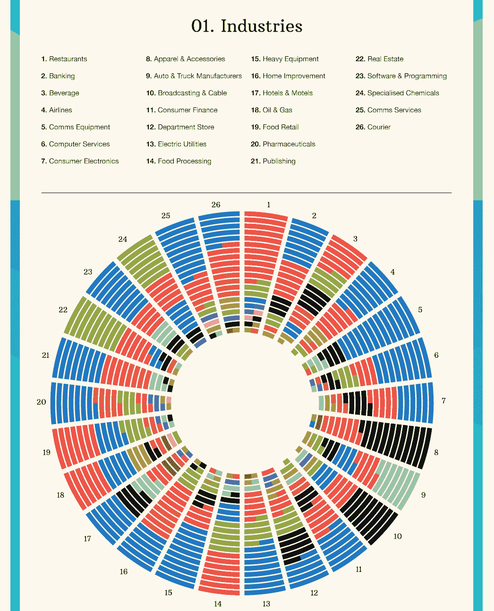

Brand colors by industry (Image source: towergateinsurance.co.uk)

> 你希望潜在客户对你的品牌、产品或服务产生什么样的情感？

这是一个指导性的问题，可以帮助你确定调色板的主色。

#### 蓝色传达:

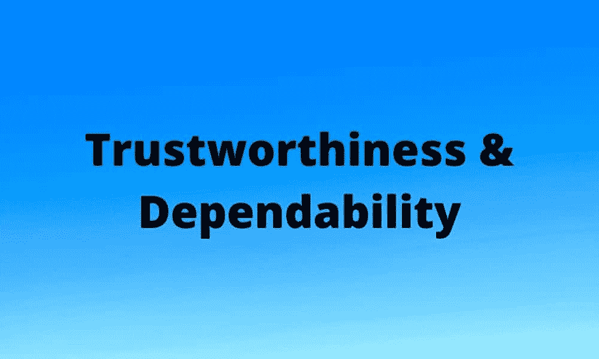

Blue is the color of trustworthiness

在消费者信任比任何其他因素都重要的行业，专业性和可靠性是关键卖点，蓝色经常被用作主要的品牌颜色。

它不诉诸自发性或情感。相反，它启动了一个冷静而合乎逻辑的决策过程。

最常见于以下行业:

*   银行业务
*   航空公司
*   通信
*   消费金融
*   电力设施
*   重型设备
*   家居装修
*   酒店
*   药物

#### **红色表示:**

Red communicates attention and passion

依赖情绪和冲动决定的行业(如餐馆和快餐)，通常使用红色作为原色。红色被认为能刺激饥饿感，所以它是国际食品品牌中最受欢迎的选择。

最常见于以下行业:

*   饭店
*   饮料
*   食品零售
*   不动产
*   衣服

#### **绿色表示:**

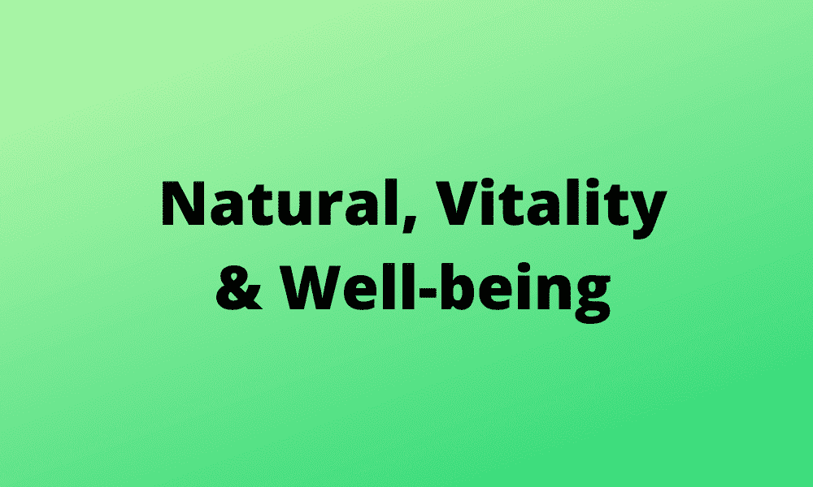

Green conveys a sense of vitality

大多数人把绿色与自然、植物和生机勃勃的环境联系在一起。依赖于更好福利承诺或全天然成分产品的行业，通常会选择绿色。

最常见于以下行业:

*   食品和饮料
*   百货公司
*   不动产
*   化学品

#### 黑色:自信、成熟

虽然一些公司可能会默认黑色，而不是专门选择一种颜色，因为它感觉安全，但在消费者的信心或成熟是一个关键因素的行业中，它也是一个主要选择。

最常见于以下行业:

*   衣服
*   配件
*   互联网和移动服务提供商
*   百货公司
*   酒店

不要盲从自己的品味和直觉，做决定的时候要考虑色彩理论和色彩心理学。

### 一个网站应该使用多少种配色方案？

对于一个标准的网站配色方案，你可以在一个配色方案或调色板中选择三到七种不同的颜色。

> 但是在一个网站上应该使用多少种不同的配色方案呢？

这取决于个人情况和你的网站目标。如果你的网站是一个致力于单一品牌、产品或公司的[公司网站或博客](https://kinsta.com/blog)，你希望坚持单一的配色方案。

另一方面，如果你的网站是一个[电子商务商店](https://kinsta.com/blog/ecommerce-platforms/)，你可以为不同的产品方案使用不同的配色方案，以唤起不同产品类别的不同情感反应。

使用多个调色板的问题是，对于任何内部或外部的内容创建者来说，你将使事情复杂化，增加了人为错误和复杂性的机会。

当你为你的网站选择配色方案时，避免走极端和花费数周时间是很重要的。毫无疑问，这是一个重要的选择，但是选择正确的颜色本身并不能帮助你[增加你网站的流量](https://kinsta.com/blog/how-to-drive-traffic-to-your-website/)或者[提高你产品页面的转化率](https://kinsta.com/blog/conversions-woocommerce-product-pages/)。

[62-90%的消费者的最初印象仅仅基于颜色选择...这意味着为你的网站找到合适的配色方案不仅仅是一个美学上的决定——这是一个商业上的决定。🎨✨ 点击推文](https://twitter.com/intent/tweet?url=https%3A%2F%2Fkinsta.com%2Fblog%2Fwebsite-color-schemes%2F&via=kinsta&text=62-90%25+of+consumers%E2%80%99+initial+impression+is+based+on+color+choices+alone...+which+means+that+finding+the+right+color+scheme+for+your+site+isn%27t+just+an+aesthetic+decision+-+it%27s+a+business+one.+%F0%9F%8E%A8%E2%9C%A8&hashtags=WordPressTips%2Cwebdesign)

## 如何在网站上获得准确的配色方案

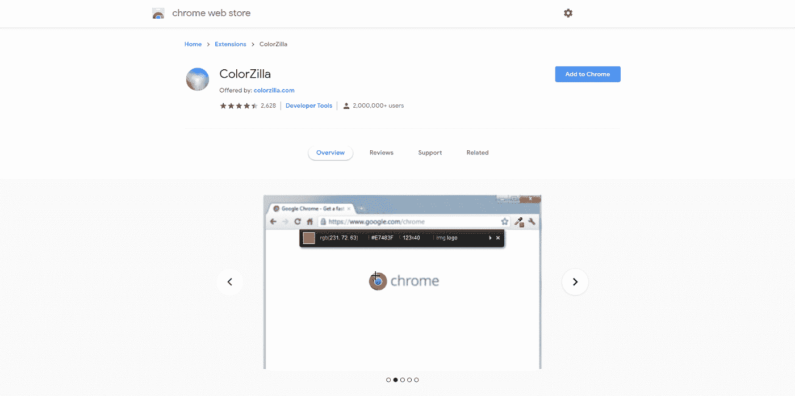

Colorzilla

要识别网站上使用的每一种颜色，精确到色度和十六进制代码，你可以使用谷歌 Chrome 扩展插件或火狐插件，比如 T2 的 ColorZilla T3。

安装了 ColorZilla 后，你只需将指针直接悬停在任何网站、徽标或[图像](https://kinsta.com/blog/optimize-images-for-web/)上的任何设计元素上，它就会显示该像素的准确 HTML 十六进制或 RGB 颜色代码。如果你不想一个一个地识别所用的颜色，你也可以使用一个调色板生成器，它会使用一个图像，就像 Colormind 的[图像颜色提取工具](http://colormind.io/image/)。

然而，这并不像看起来那样是一个完美的解决方案。你必须[拍摄网站的截图](https://kinsta.com/blog/how-to-screenshot-on-mac/)并上传，生成的调色板不一定 100%精确到设计中使用的实际色调。例如，如果网站包含渐变或图片的颜色超出了主配色方案，则生成的调色板往往不准确。

所以就目前而言，识别[网页设计](https://kinsta.com/blog/web-design-best-practices/)中使用的确切颜色的最好方法仍然是使用颜色识别插件或扩展，或者[截图](https://kinsta.com/blog/how-to-screenshot-on-windows/)并在像 PhotoShop 这样的照片编辑工具中手动操作。

## 我们在 Kinsta 使用什么网站配色方案？

像大多数网站一样，我们在 Kinsta 的所有内容都遵循基本的三色或三色方案。因为我们是一家专注于 WordPress 的托管公司，所以我们没有必要在我们的网站上实现多个调色板(T2)。

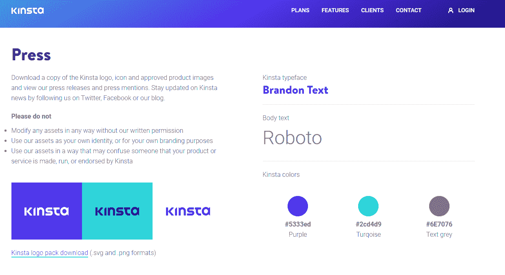

Kinsta media kit

我们使用深紫色(#5333ed)作为主色调，蓝绿色(#2cd4d9)并置在一起，创造出醒目而平衡的渐变效果，柔和的灰色用于文本(#6E7076)。

但是其他公司在做什么呢？

让我们来了解一下！

## 26 个最佳网站配色方案示例

我们已经在网上搜索了很棒的配色方案的例子，甚至将网站按类别分开，所以你可以很容易地从相关网站上找到灵感。

### 伟大的电子商务网站配色方案

下面我们将介绍优秀的[电子商务](https://kinsta.com/blog/wordpress-ecommerce-plugins/)配色方案的例子，这些配色方案与他们的品牌和行业相匹配。

#### 1.护肤品:明亮而有趣

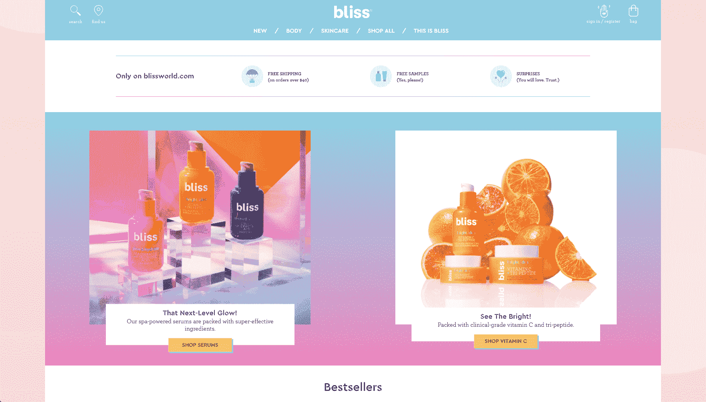

Bliss

谈到它的品牌，颜色的选择很重要。颜色明亮而活泼，完美地诠释了公司关于身体积极和内心快乐的信息。

#### 2.服装品牌:清晰简洁

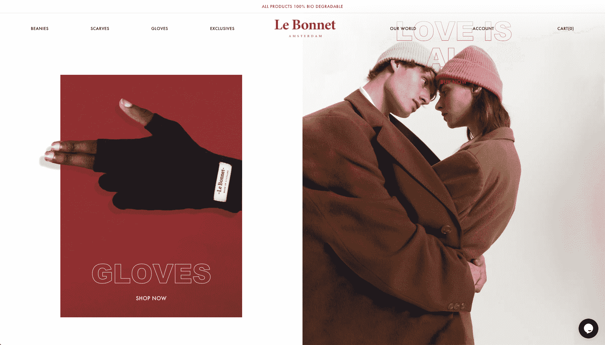

Le Bonnet

Le Bonnet 是一家服装公司，当谈到其网站的调色板时，它专注于清晰度。几个强烈的颜色，加上不透明的米色背景色来区分产品，有助于提升设计的简单性。

#### 3.服装店:简单

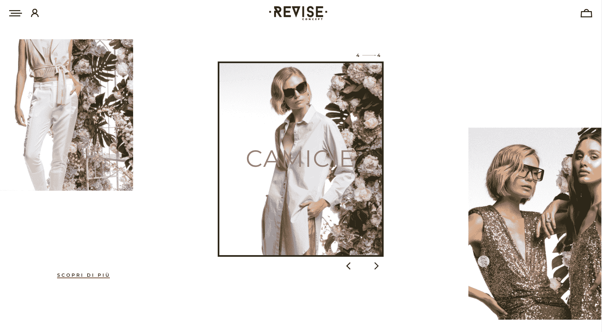

Revise

[修改概念](https://www.reviseconcept.com/)是一个服装品牌网站，它不依赖网站调色板中的颜色，而是使用简单的颜色和空白来突出衣服本身的颜色和设计。

对于那些希望让产品自己说话，而不是创造一个有力的设计来讲述故事的电子商务网站来说，这种方法是一个很好的选择。

#### 4.餐具:可靠性和专业性

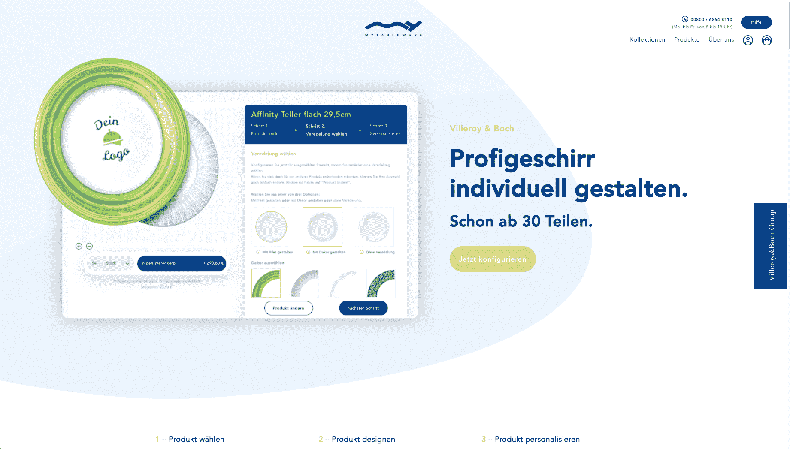

My Tableware

我的餐具是一个德国定制餐具和菜肴的电子商务网站。

该网站使用深蓝色、浅棕色和灰色的简单配色方案来传达一种专业和可靠的感觉，并带有精致的味道。

#### 5.口香糖:自然而冲动

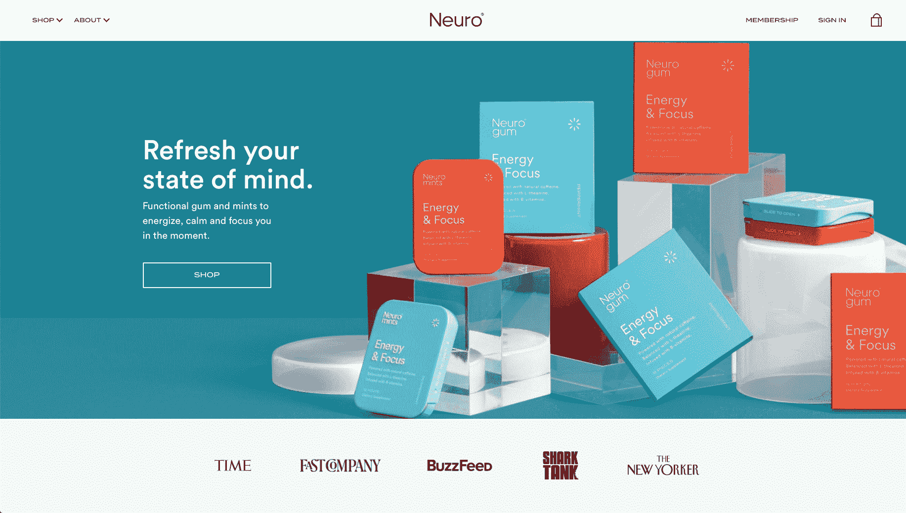

Neuro

Neuro 是一种咖啡因口香糖和薄荷糖的品牌，旨在帮助人们集中注意力。它混合了蓝绿色、浅蓝色和米色等柔和的颜色，给人一种天然成分的感觉。

红色和橙色对情感和冲动决策也有吸引力，很好地利用了强调色。

#### 6.腕表:精致与奢华

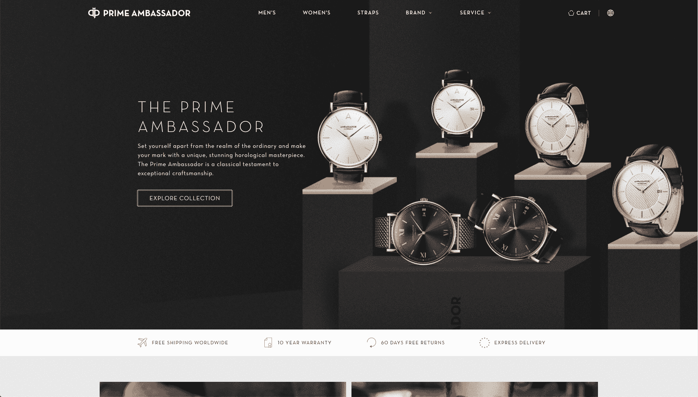

Prime Ambassador

[Prime Ambassador](https://primeambassador.com/) 是一个瑞典钟表品牌，有一个精心设计的电子商务网站来突出产品。深灰色背景上近乎金黄色的浅棕色色调和图片中的木质装饰的色彩组合给参观者带来了一种精致和奢华的感觉。

这种颜色非常适合推销定制手表等高端产品，但如果你销售的是普通消费品，就会觉得不合适。

#### 7.裤子:富有创意且易于使用

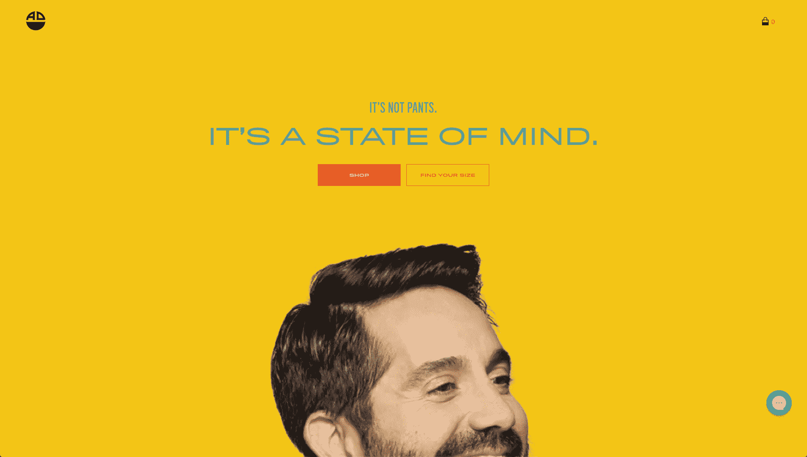

Alday

[Alday](https://alday.co/) 是一个舒适至上的裤子品牌，它的设计比低价出售的大规模生产的牛仔裤和斜纹棉布裤更合身。

该网站是创造性的和好玩的，与充满活力的颜色组合，使它的访客和潜在客户感到容易接近。

#### 8.水果点心:优雅而突出的颜色

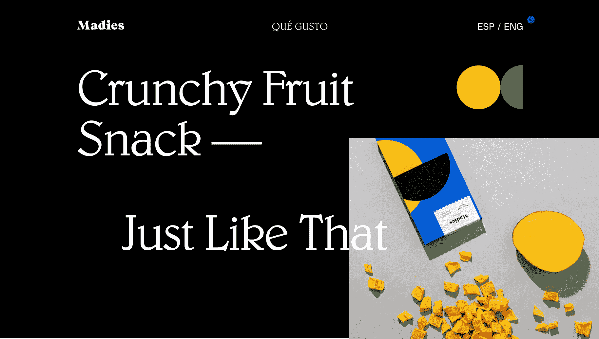

Madies

Madies 是一个冻干水果零食系列，针对的是比散装出售的无品牌干果更具时尚意识的消费者。

## 注册订阅时事通讯

### 想知道我们是怎么让流量增长超过 1000%的吗？

加入 20，000 多名获得我们每周时事通讯和内部消息的人的行列吧！

[Subscribe Now](#newsletter)

黑色的背景和成熟芒果的黄色拟人化突出了设计的简单性，导致一个优雅的最终产品。

#### 9.定制合身的牛仔布:它是活的

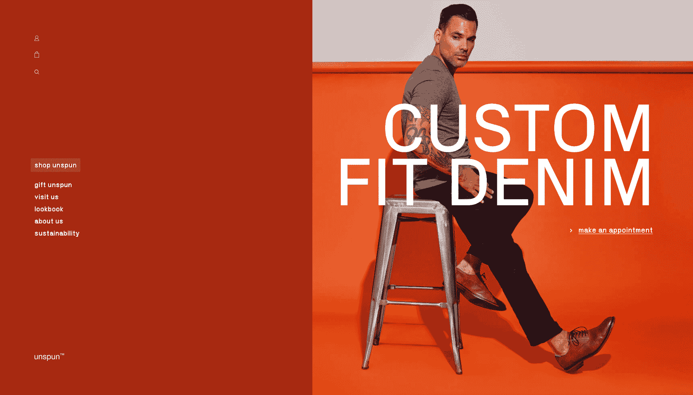

Unspun

[Unspun](https://unspun.ouiwill.com/) 用鲜艳的红色和橙色给网站带来活力。非常适合与生活方式积极活跃的观众交流。

### 个人和旅游网站配色方案

下面，你可以找到我们为个人和旅游网站选择的网站配色方案的最佳范例。

#### 10.创造性的简单

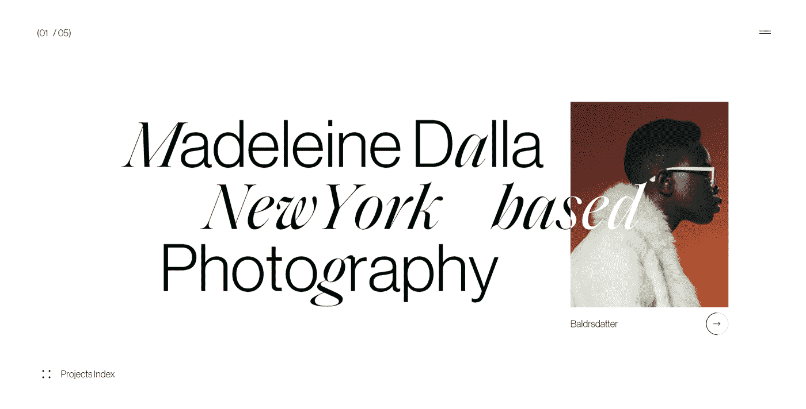

Madeleine Dalla

马德琳·达拉是一位纽约的摄影师，对网站设计有着敏锐的感觉(还有令人印象深刻的[作品集](https://kinsta.com/blog/wordpress-portfolio-plugins/))。

通过将颜色排除在设计的其余部分之外，她真正突出了她从每个突出的项目中亲手挑选的特色照片的生动颜色。她利用了色彩本身，也利用了色彩的缺失。

#### 11.带飞溅的灰度

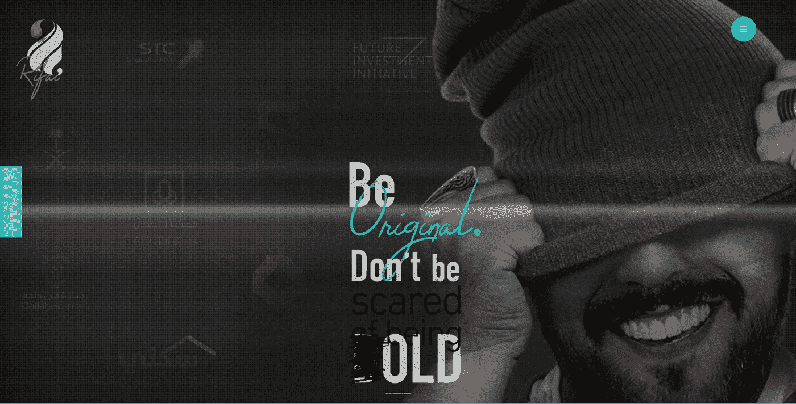 [阿里·日法伊](https://ali-rifai.com/)是一位有创意的艺术总监，这在网站的概念中有所体现。通过只使用少量颜色的灰度，你的注意力会被吸引到正确的关键词和设计的关键区域，“原创”这个词和迷人的微笑。

#### 12.与自然融为一体

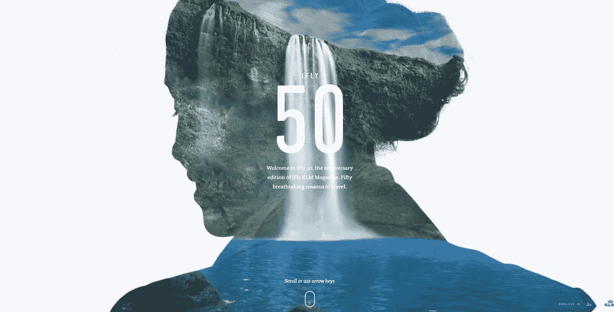

iFly 50

[iFly 50](https://www.ifly50.com/en_no/) 是荷航为庆祝成立 50 周年而发行的在线杂志。

通过突出天空和水的蓝色，绿色的草地和森林，它让任何游客感觉与自然融为一体——这是任何自然或风景摄影师网站的完美方法。

#### 13.清洁和专业

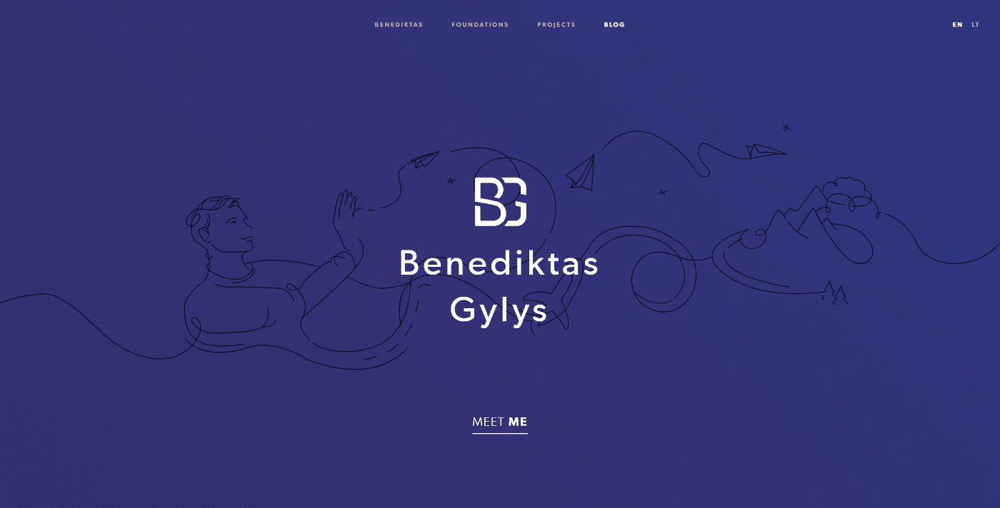

Benediktas Gylys

Benediktas Gylys 的网站是干净设计的大师级作品。没有杂乱，颜色选择也是如此。

主要的紫色突出了专业性，虽然只有几个颜色，但它们都用来突出关键的元素，插图。

#### 14.实用色彩

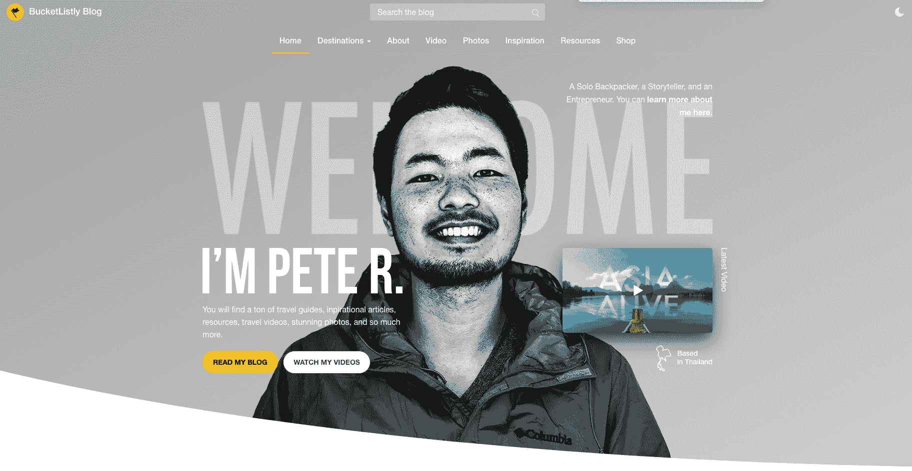

BucketListly

[BucketListly](https://www.bucketlistly.blog/) 实用地使用颜色，用黄色突出显示关键词、CTA 和目前访问过的国家。

它展示了当你将单一颜色与留白和正确的概念结合使用时，你能从设计中获得多少价值。

#### 15.优雅的简单

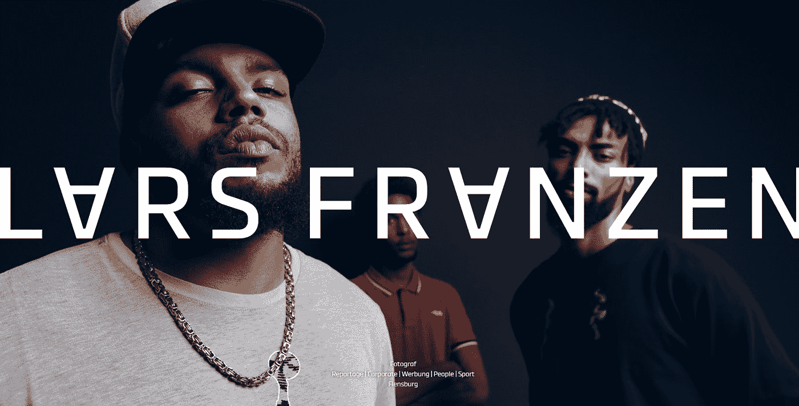

Lars Franzen

Lars Franzen 网站的特色图片使用深色背景色来突出肖像中人物的色彩和个性。

#### 16.未来派叠加

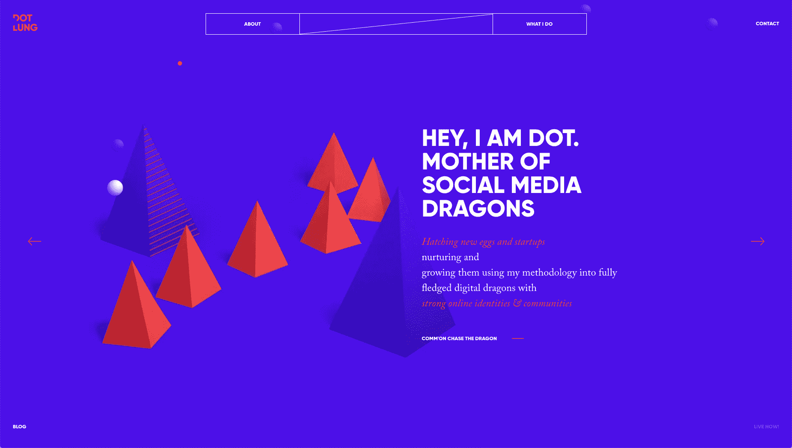

Dot Lung

Dot Lung 的个人网站在最大化简单的调色板和干净的背景图形方面做得很好。背景中的紫色从一页到另一页创造了一种内聚的体验。

厌倦了慢热的主持人？Kinsta 的设计考虑了速度和性能。[查看我们的计划](https://kinsta.com/plans/)

#### 17.光明与黑暗

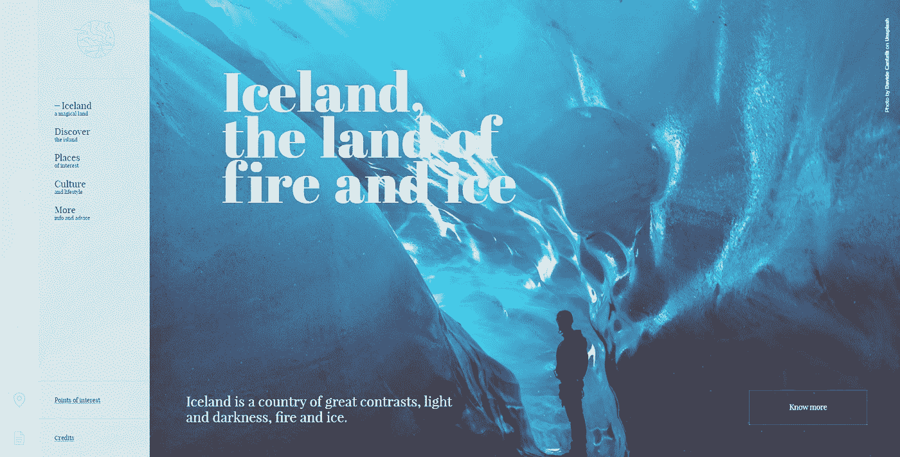

Love for Iceland

《对冰岛的爱》是一个很好的例子，展示了高亮图片中的颜色如何营造气氛。左上角是明亮的蓝色透明冰，被阳光照亮，底部是洞穴般的黑暗，为游客营造了一种不祥和冒险的氛围。

### 登录页面配色方案

下面我们用独特或有效的配色方案突出了不同的登录页面。

#### 18.鲜明的对比

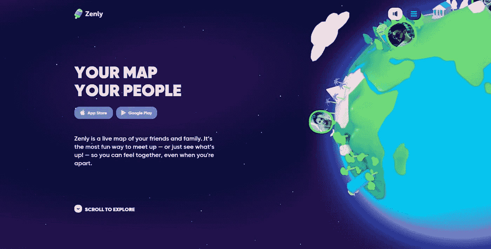

Zenly

Zenly 使用强烈对比的颜色来突出实时地图应用的实际功能(顺便说一句，这就是你[在 WordPress 网站上嵌入谷歌地图的方式](https://kinsta.com/blog/wordpress-google-maps/))。太空的背景使球状应用程序设计脱颖而出，并使其具有未来主义的味道。

#### 19.要突出显示的颜色

Slack

[Slack](https://kinsta.com/blog/how-to-use-slack/) 使用了一种屡试不爽的登陆页面配色策略，其中颜色主要用于突出重要的行动号召和其他基本元素。对于一个登陆页面，你不需要过度复杂的设计，这也适用于颜色。

请务必查看我们的[微软团队与 Slack](https://kinsta.com/blog/microsoft-teams-vs-slack/) 的深入比较。

#### 20.鲜艳的颜色激发情感

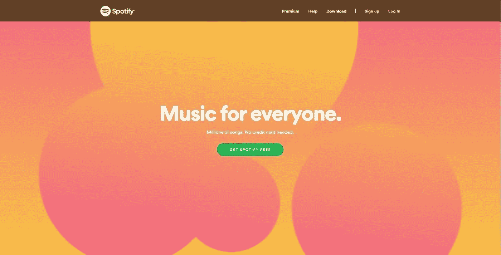

Spotify

Spotify 在其极其简单的新登录页面上使用鲜艳的颜色来激发观众的情绪。颜色比 CTA 按钮前的副标题更能说明问题。如果你正在考虑[即将推出播客](https://kinsta.com/blog/wordpress-podcast/)，请查看我们的指南。

#### 21.色彩对比在混乱中创造秩序

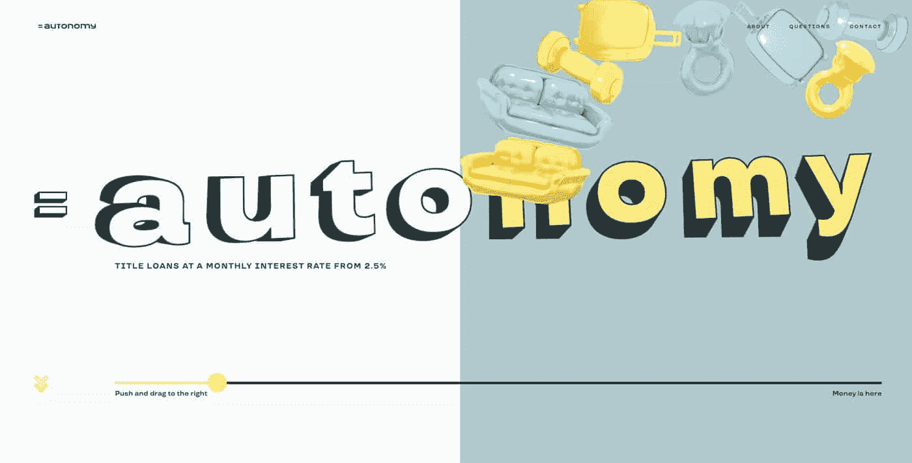

Autonomy

Autonomy 使用颜色和对比在一个混乱的动画设计中创造秩序。鲜艳的黄色穿过并与背景和其他物体分开。

#### 22.未来派色彩组合

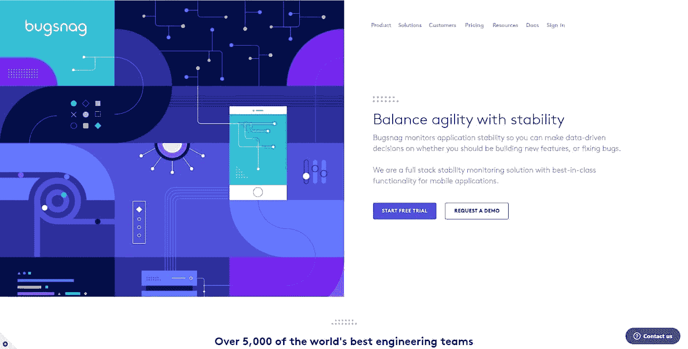

Bugsnag

[Bugsnag](http://bugsnag.com) 使用各种颜色，通过其扁平的设计赋予未来的高科技感觉。颜色和形状的组合让参观者感觉像是在 2020 年，他们可以相信该公司是尖端的。

#### 23.充满色彩

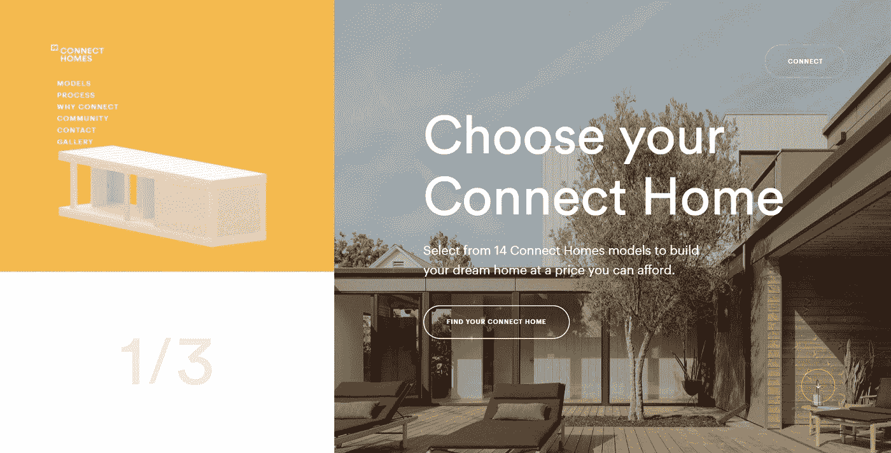

Connect Homes

[Connect home](https://connect-homes.com/)“登录页面”充满了明亮而柔和的色彩。调色板取得了令人兴奋的平衡，传达了现代感。

#### 24.保守的颜色，俏皮的设计

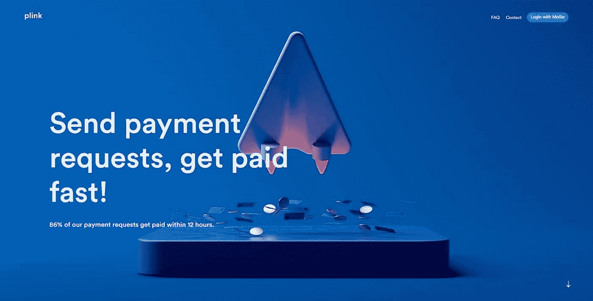

Plink

Plink 的登陆页面以相对保守的深蓝色为基础，但总体上用俏皮有趣的动画和设计来平衡它。

#### 25.自然活力

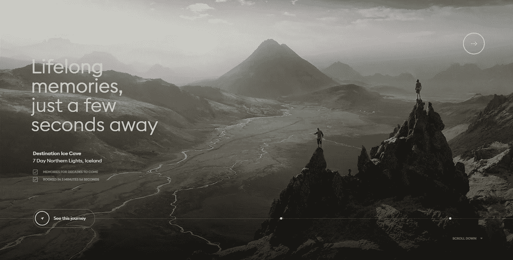

Travelshift

Travelshift 非常依赖绿色来传达自然和活力的感觉。绿色不是用红色或橙色这样引人注目的颜色来突出 CTA 或关键内容，而是作为复兴的承诺。

#### 26.希望的明亮色彩

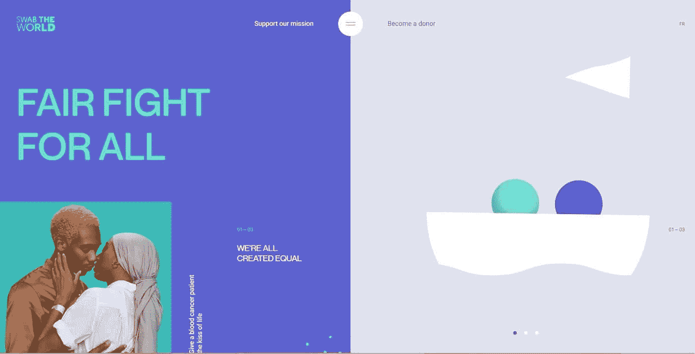

Swab the World

[擦洗世界](https://swabtheworld.com/)使用明亮对比色的配色方案来传达希望感。这和一个[非营利组织](https://kinsta.com/blog/wordpress-for-nonprofits/)的登陆页面非常匹配。颜色冲突与形状一起突出了他们用来应对挑战的现代/未来主义方法。

## 网站配色方案生成器

如果您不想为您的方案或调色板手动挑选相邻的颜色、渐变或阴影，您可以使用在线工具来帮助。网上有许多免费的配色方案或调色板生成器。我们将仔细看看下面的一些最佳选项。

### 色彩思维

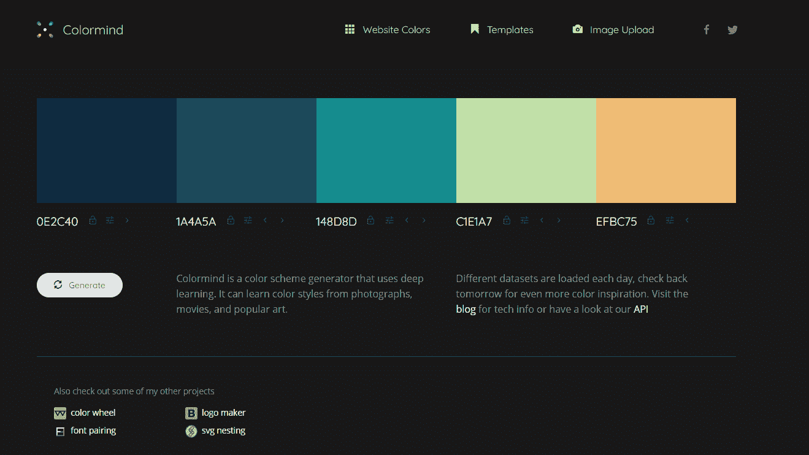

Colormind

Colormind 是一个人工智能驱动的颜色生成器，可以用来为网站、模板等即时生成颜色。唯一的问题是，你不能设置一个原色来推断调色板，你必须每次都随机生成它。它还可以从你想要的任何图像中提取调色板。

### Coolors.co

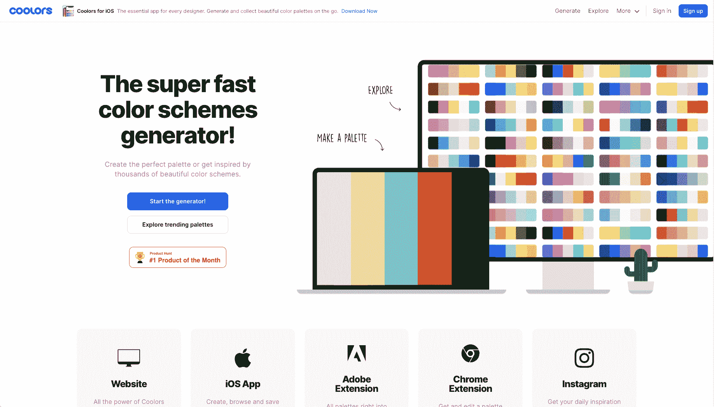

Coolors.co

Coolors.co 是一个网络和移动应用程序，帮助你从头开始生成调色板。它有每种颜色选项的阴影选项和其他高级工具，可以帮助您有效地决定您的配色方案。

### 帕莱顿

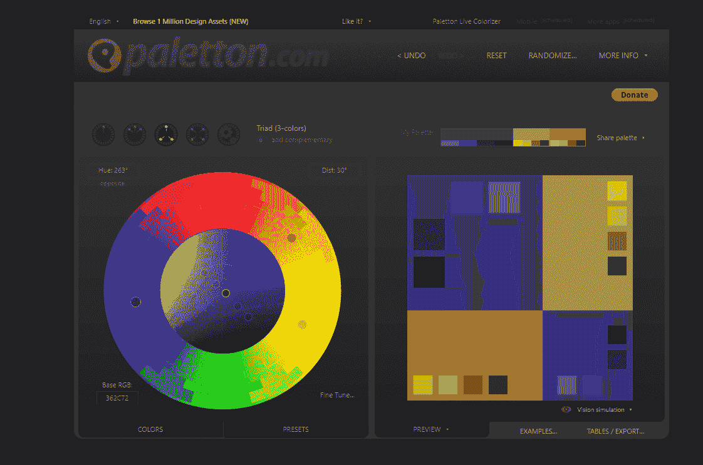

Paletton

[调色板按钮](https://paletton.com)可以让你完全控制你的调色板和你想用的基色。您可以选择所需的调色板类型，无论是相邻颜色、三色配色方案还是其他。您可以从色轮中选择任何颜色。

### 彩色空间

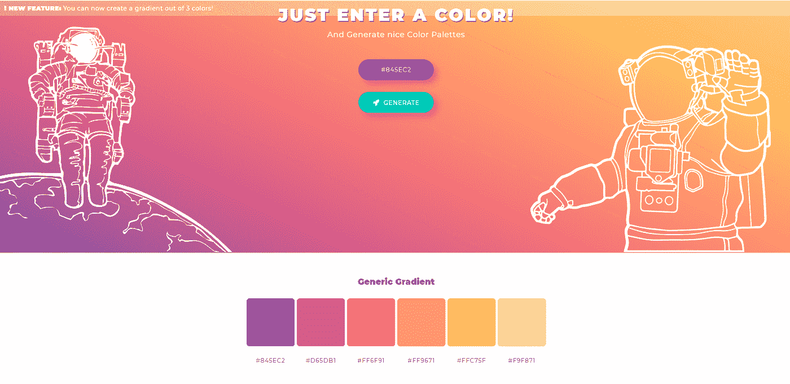

ColorSpace

[色彩空间](http://mycolor.space)根据您输入的原色生成调色板。它提供了各种各样的风格选择，让您更加灵活。

## 色盲:如何为你的网站选择一个色盲友好的调色板

创建网站配色方案时要考虑的最后一件事是不同的人会如何看待这些颜色。

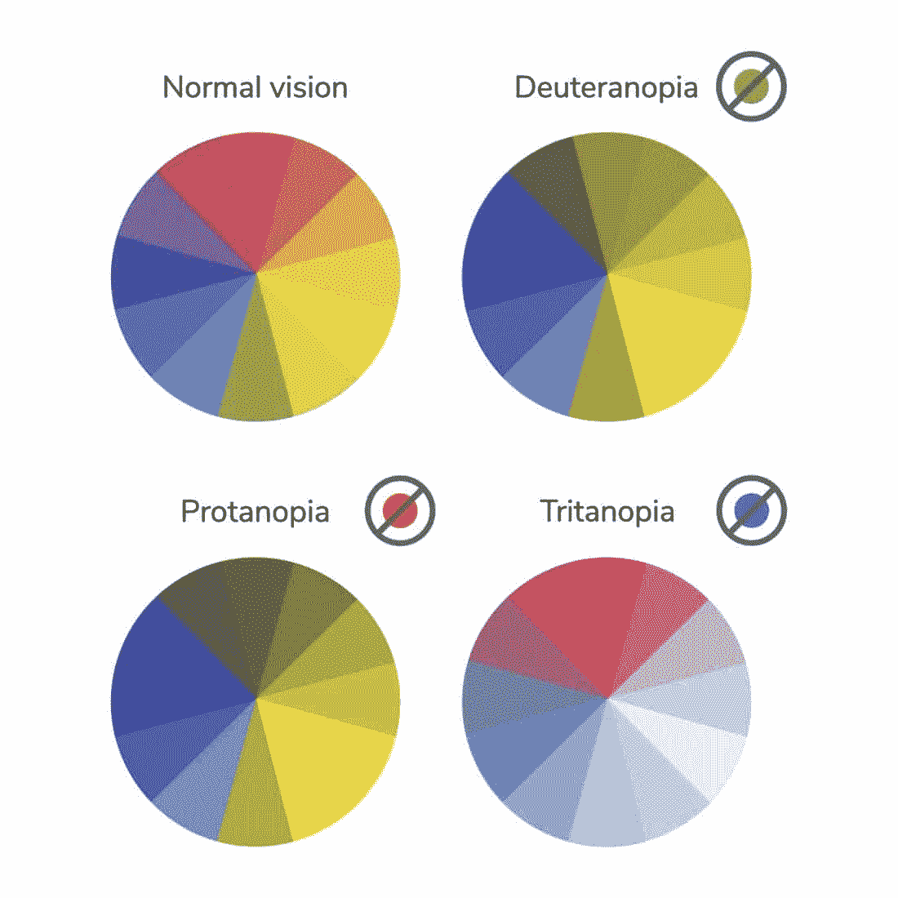

Different types of color blindness

不是每个人都能看到“标准”的颜色范围。色盲有三种不同的主要[类型:多色盲、色盲和色盲。](https://www.medicalnewstoday.com/articles/319115)

红绿色盲是最常见的色盲。它影响了大约 1/12 的北欧血统。有这么多的人受到它的影响，在设计和选择一个 [WordPress 主题](https://kinsta.com/best-wordpress-themes/)时，这是值得考虑的。

蓝黄色盲非常罕见，对男性和女性的影响一样大。

### 如何为你的网站选择一个色盲友好的调色板

由于红绿色盲的人数远远高于任何其他形式的色盲，这应该是你在设计中首先要解决的问题。因为它们不能区分红色、绿色和紫色，而是将它们视为黄色和蓝色的不同色调，所以您希望避免使用最终看起来过于相似的对比色。

*   不要把绿色和黄色对比，反之亦然。
*   不要用红色或橙色来对比黄色。
*   不要把紫色和深浅相似的蓝色对比。

当你为你的标志或设计选择独立的原色时，你应该考虑它是否仍然适合色盲的消费者。例如，Kinsta 的紫色仍然是深蓝到红绿色盲消费者的颜色，传达了可靠和值得信赖的信息。对我们来说，这是 100%的品牌，所以在我们的潜在客户心目中没有潜在的冲突。

[Make your website stand out from the crowd (and gain more sales) with the right color scheme 🎨🌈Click to Tweet](https://twitter.com/intent/tweet?url=https%3A%2F%2Fkinsta.com%2Fblog%2Fwebsite-color-schemes%2F&via=kinsta&text=Make+your+website+stand+out+from+the+crowd+%28and+gain+more+sales%29+with+the+right+color+scheme+%F0%9F%8E%A8%F0%9F%8C%88&hashtags=WordPressDesign%2Cux)

## 摘要

人类的眼睛可能能够区分数百万种不同的颜色，但是你不需要梳理所有的选项来找到适合你网站的配色方案。

通过关注你的品牌和你的理想客户，你可以缩小你的原色选择范围。一旦你有了选择，你就可以依靠在线调色板生成器来完成你自己的调色板，或者根据例子和喜好来选择匹配的颜色。

通过正确的方法，创建一个网站配色方案，可以作为你设计过程的起点，虽然如果你想获得正确的专业外观，感受你的品牌需求，通常需要雇佣正确的网站开发人员/设计师，这也是 T2 需要做的。

现在，是时候[选择字体](https://kinsta.com/blog/modern-fonts/)了，不是吗？

* * *

让你所有的[应用程序](https://kinsta.com/application-hosting/)、[数据库](https://kinsta.com/database-hosting/)和 [WordPress 网站](https://kinsta.com/wordpress-hosting/)在线并在一个屋檐下。我们功能丰富的高性能云平台包括:

*   在 MyKinsta 仪表盘中轻松设置和管理
*   24/7 专家支持
*   最好的谷歌云平台硬件和网络，由 Kubernetes 提供最大的可扩展性
*   面向速度和安全性的企业级 Cloudflare 集成
*   全球受众覆盖全球多达 35 个数据中心和 275 多个 pop

在第一个月使用托管的[应用程序或托管](https://kinsta.com/application-hosting/)的[数据库，您可以享受 20 美元的优惠，亲自测试一下。探索我们的](https://kinsta.com/database-hosting/)[计划](https://kinsta.com/plans/)或[与销售人员交谈](https://kinsta.com/contact-us/)以找到最适合您的方式。