# WordPress 用户角色和能力的终极指南

> 原文:[https://kinsta.com/blog/wordpress-user-roles/](https://kinsta.com/blog/wordpress-user-roles/)

WordPress 用户**角色**和**功能**让你能够控制其他用户在你的网站上能做什么或不能做什么。您可以使用它们来管理用户操作，例如编写和编辑帖子、创建新页面、审核评论、安装插件、添加新用户等等。

理解用户角色和权限对于管理任何 WordPress 站点都是至关重要的。例如，如果你正在为一个客户建立一个网站，你不希望他们编辑或[改变已安装的主题](https://kinsta.com/blog/change-wordpress-theme/)。同样，让多作者博客的作者安装或[移除插件](https://kinsta.com/blog/uninstall-wordpress-plugin/#:~:text=Step%201,uninstalling%20the%20Wordfence%20security%20plugin.)也是不明智的。

学习如何聪明地管理 WordPress 用户角色将帮助你简化你的工作流程，保持你的网站安全，并获得对你的网站的最终控制权。

在这本内容丰富的指南中，您将了解 WordPress 用户角色、WordPress 提供的各种功能、如何编辑现有用户角色、如何管理多站点上的[用户，以及如何创建具有全新功能的新角色。](https://kinsta.com/wordpress-multisite-hosting/)

激动吗？让我们开始吧！

 <kinsta-auto-toc heading="Table of Contents" exclude="last" list-style="arrow" selector="h2" count-number="-1">## 什么是 WordPress 用户角色和能力？

角色和能力是 WordPress 中用户访问管理的基础。要理解 WordPress 中的用户角色，你首先需要知道什么是能力。

WordPress 将用户可以采取的任何行动定义为一种**能力**。以下是 WordPress 中可用功能的几个例子，以及它们是如何在代码中被引用的:

<link rel="stylesheet" href="https://kinsta.com/wp-content/themes/kinsta/dist/components/ctas/cta-mini.css?ver=2e932b8aba3918bfb818">


> Kinsta 把我宠坏了，所以我现在要求每个供应商都提供这样的服务。我们还试图通过我们的 SaaS 工具支持达到这一水平。
> 
> <footer class="wp-block-kinsta-client-quote__footer">
> 
> 
> 
> <cite class="wp-block-kinsta-client-quote__cite">Suganthan Mohanadasan from @Suganthanmn</cite></footer>

[View plans](https://kinsta.com/plans/)

*   阅读帖子([阅读](https://wordpress.org/support/article/roles-and-capabilities/#read))
*   撰写和编辑帖子( [edit_posts](https://wordpress.org/support/article/roles-and-capabilities/#edit_posts) )
*   发布帖子( [publish_posts](https://wordpress.org/support/article/roles-and-capabilities/#publish_posts)
*   安装插件( [install_plugins](https://wordpress.org/support/article/roles-and-capabilities/#install_plugins)
*   删除主题( [delete_themes](https://wordpress.org/support/article/roles-and-capabilities/#delete_themes)
*   创建用户([创建用户](https://wordpress.org/support/article/roles-and-capabilities/#create_users)
*   适度评论([适度 _ 评论](https://wordpress.org/support/article/roles-and-capabilities/#moderate_comments))

大多数功能从它们的名字来看是不言自明的。WordPress 的核心内置了 70 多种硬编码功能。

**角色**是您可以分配给用户的能力的集合。每个 WordPress 用户都需要分配一个角色。用户只能执行其角色授予他们的操作。

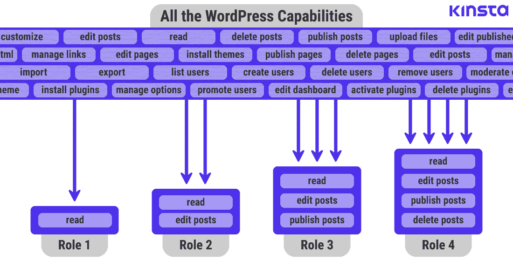

A ‘Role’ is a collection of ‘Capabilities’


在上图中，任何拥有**角色 1** 的用户都可以阅读帖子，但不能编辑帖子。拥有**角色 2** 的用户可以阅读和编辑帖子，但不能发布帖子。任何拥有**角色 3** 的用户都可以阅读、编辑和发布帖子，但是他们不能删除帖子，不像**角色 4** 的用户可以删除帖子。

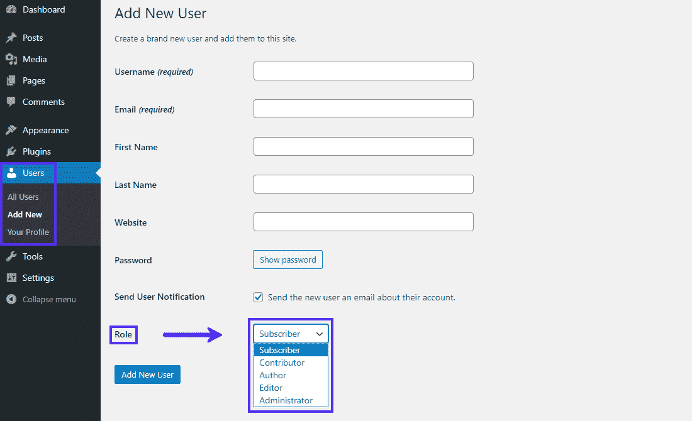

The ‘Add New User’ panel in the WordPress dashboard


WordPress 使用它的许多本地功能来定义它的默认用户角色。例如，它授予管理员和编辑`**publish_pages**`能力，但是没有将他们分配给订阅者和贡献者。

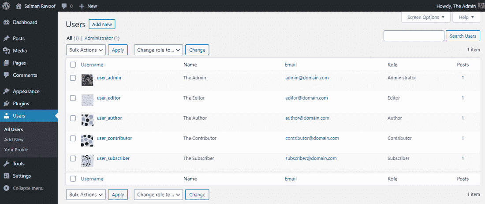

The ‘Users’ panel in WordPress dashboard


最起码，每个 WordPress 用户都有用户名、密码、电子邮件地址和角色。

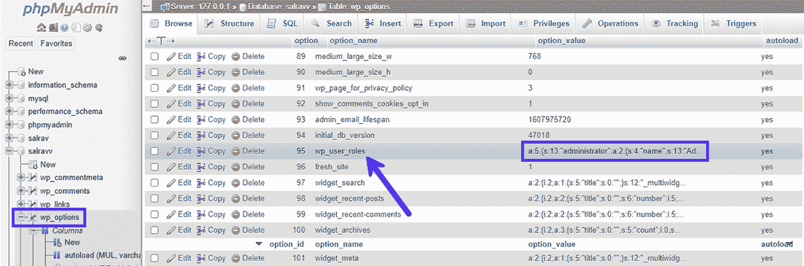

phpMyAdmin showing where the WP database stores the capabilities


WordPress 将其所有基于角色的功能存储在[数据库](https://kinsta.com/knowledgebase/wordpress-database/)中，在`**wp_options**`表中序列化`**wp_user_roles**`选项下。`**WP_Roles**`核心类用于定义如何在数据库中存储角色和功能。
<kinsta-advanced-cta language="en_US" type-int-post="12589" type-int-position="0"></kinsta-advanced-cta>

### WP _ 角色类

WordPress 通过用户角色 API 实现角色和功能，其中大部分是基于 [WP_Roles](https://developer.wordpress.org/reference/classes/wp_roles/) 核心类。您可以在`**wp-includes/class-wp-roles.php**`文件中找到它的源代码。

如果您查看数据库，您会发现角色位于一个数组中，并定义了它们的角色名。`**rolename**`键将用户角色名存储为`**name**`键的值，并将所有功能存储在一个单独的数组中，作为`**capability**`键的值。

```
array (
     'rolename' => array (
         'name' => 'rolename',
         'capabilities' => array()
     )
)
```

WP_Roles 类定义了很多方法。您可以在代码中的任何地方调用它们，以便与用户角色 API 进行交互。

**注意:** WordPress 包括另一个核心类，叫做 [WP_Role](https://developer.wordpress.org/reference/classes/wp_role/) (注意单数‘角色’)。它用于扩展用户角色 API。

当你[取消`**wp_user_roles**`的键值](https://www.functions-online.com/unserialize.html)的序列化时，它看起来会像这样:

```
array (
  'administrator' => 
  array (
    'name' => 'Administrator',
    'capabilities' => 
    array (
      'switch_themes' => true,
      'edit_themes' => true,
      'activate_plugins' => true,
      // [...rest of the lines cut off for brevity...]
    ),
  ),
  'editor' => 
  array (
    'name' => 'Editor',
    'capabilities' => 
    array (
      'moderate_comments' => true,
      'manage_categories' => true,
      'manage_links' => true,
      // [...rest of the lines cut off for brevity...]
    ),
  ),
  'author' => 
  array (
    'name' => 'Author',
    'capabilities' => 
    array (
      'upload_files' => true,
      'edit_posts' => true,
      'edit_published_posts' => true,
      // [...rest of the lines cut off for brevity...]
    ),
  ),
  'contributor' => 
  array (
    'name' => 'Contributor',
    'capabilities' => 
    array (
      'edit_posts' => true,
      'read' => true,
      // [...rest of the lines cut off for brevity...]
    ),
  ),
  'subscriber' => 
  array (
    'name' => 'Subscriber',
    'capabilities' => 
    array (
      'read' => true,
      'level_0' => true,
    ),
  ),
)
```

这是一个多维数组，每个角色都被分配了一个角色名称，并被授予了一组功能。类似地，WordPress 将基于用户的功能存储在带有`**wp_capabilities**`元键名的`**wp_usermeta**`表中。

**注意:**`**wp_**`前缀在您的设置中可能会有所不同。这取决于你的站点的`**wp-config.php**`文件中的`**$table_prefix**`全局变量的值。

### 角色与能力图表

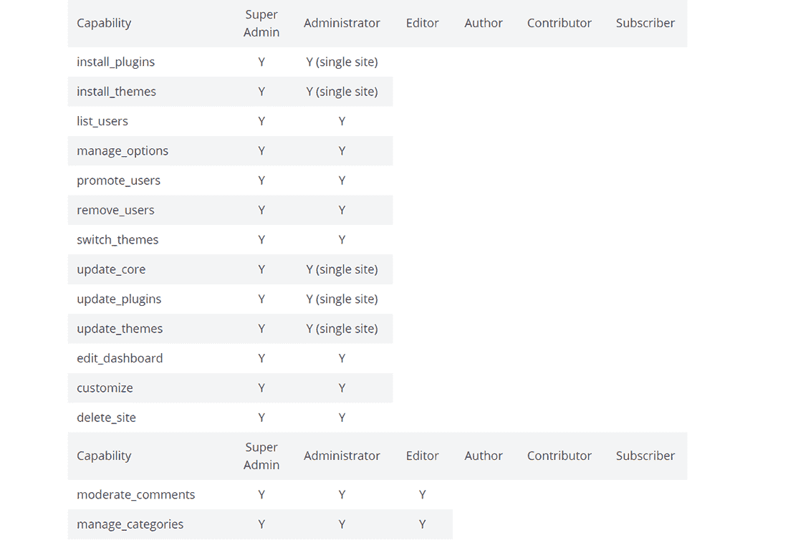

The ‘Roles vs Capabilities’ chart in WordPress Codex


WordPress Codex 包含了一个简单的[功能和角色表](https://wordpress.org/support/article/roles-and-capabilities/#capability-vs-role-table)，尽管它不是那么直观。它总结了默认用户角色在单站点和[多站点 WordPress](https://kinsta.com/blog/wordpress-multisite/) 设置中可以采取的所有行动。在设定数量的能力之后有一个中断，使你容易区分高级和低级能力。

为了更好地展示所有 WordPress 角色和功能，你可以[通过 Exygy](https://exygy.com/blog/wordpress-roles-and-capabilities-at-a-glance/) 查看这个优秀的表格。

#### 与古腾堡可重用模块相关的功能

古腾堡区块编辑器引入了一个令人惊叹的功能，叫做**可重用区块**。它允许您将整个块(或多个块)保存为模板，并在站点的任何其他地方使用它。

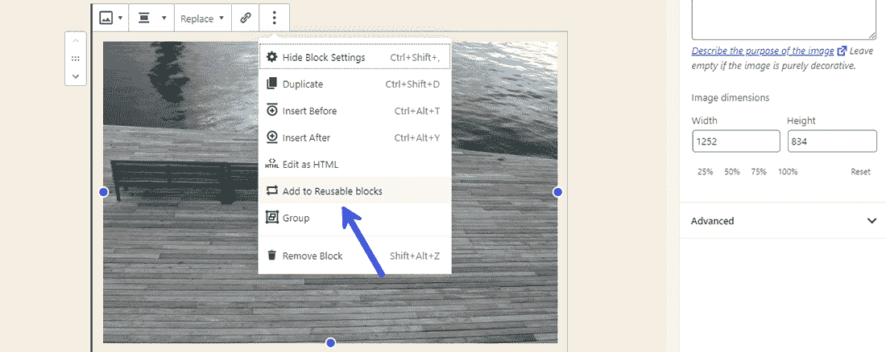

Adding ‘Reusable Blocks’ in WordPress’ new Gutenberg block editor


相应地，WordPress 也引入了以下与可重用模块相关的新功能:

*   创建可重复使用的块
*   编辑可重复使用的块
*   读取可重用块
*   删除可重复使用的块

上面列出的功能类似于与帖子相关的功能。管理员或编辑可以访问所有与可重用块相关的功能，而作者只能编辑或删除他们创建的可重用块。贡献者只能读取可重用的块。

#### 特殊功能:未过滤的上传

**未过滤上传**是一项特殊功能，默认情况下不分配给任何用户角色，包括管理员或超级管理员。它允许用户上传任何扩展名的文件(例如 SVG 或 PSD)，而不仅仅是那些被 WordPress 列入白名单的[。](https://core.trac.wordpress.org/browser/tags/5.4.1/src/wp-includes/functions.php#L2997)

**注意:**你可以使用 [wp_get_mime_types()函数](https://developer.wordpress.org/reference/functions/wp_get_mime_types/#source)获得 WordPress 支持的 mime 类型和文件扩展名列表。

要启用这个功能，您需要将下面的代码片段添加到您的`**wp-config.php**`文件中。在要求您停止编辑的行之前定义常数。

```
define( 'ALLOW_UNFILTERED_UPLOADS', true );
```

在你定义了这个常量之后，你可以在 WordPress 单点安装上给任何用户角色赋予**未过滤上传**的能力。但是，在多站点安装中，只有超级管理员才能拥有此功能。

例如，如果你想将`**unfiltered_upload**`功能分配给一个编辑器，你可以在你的 WordPress 代码中的任何地方添加以下代码(理想情况下，只在主题或插件激活时运行):

```
<?php

  $role = get_role( 'editor' );
  $role->add_cap( 'unfiltered_upload' );

?>
```

在这篇文章的后面，我们将进一步讨论如何添加或定制所有用户角色或特定用户的功能。

### 原始能力与元能力

WordPress 主要有两种功能:

*   **原始能力:**这些能力被授予特定的角色。具有这些角色的用户自动继承基本功能。
*   **元能力:**默认情况下，这些能力不授予任何角色。WordPress 在[的代码](https://kinsta.com/knowledgebase/edit-wordpress-code/)和数据库中检查某个对象，比如帖子、页面、用户或任何[分类](https://kinsta.com/knowledgebase/what-is-taxonomy/)，如果逻辑检查通过，它将一个元功能“映射”到一个或多个原始功能。

例如，WordPress 授予作者对他们自己的文章的`**edit_posts**`功能，以便他们能够编辑它们。但是，这种功能不允许他们编辑其他用户的帖子。这就是元功能发挥作用的地方。

WordPress 使用 [map_meta_cap()](https://developer.wordpress.org/reference/functions/map_meta_cap/) 函数返回绑定到特定对象的原始功能数组。然后将它们与用户对象进行比较，检查用户是否可以编辑文章。

元能力的其他几个例子是`**read_post**`、`**delete_post**`、`**remove_user**`和`**read_post**`。我们将在下面的自定义功能部分更深入地了解它们。

[💡理解 WordPress 用户角色&功能=一个更安全的网站+让你和你的客户安心。了解更多信息👇 点击推文](https://twitter.com/intent/tweet?url=https%3A%2F%2Fkinsta.com%2Fblog%2Fwordpress-user-roles%2F&via=kinsta&text=%F0%9F%92%A1+Understanding+WordPress+user+roles+%26amp%3B+capabilities+%3D+a+more+secure+site+%2B+peace+of+mind+for+you+and+your+clients.+Learn+more+%F0%9F%91%87&hashtags=WordPress%2CWebManagement)
<kinsta-advanced-cta language="en_US" type-int-post="12589" type-int-position="1"></kinsta-advanced-cta>

## 六个默认的 WordPress 用户角色

WordPress 包括六个预定义的用户角色。WordPress 安装的第一个用户默认获得**管理员**角色(或者 WordPress 多站点安装的**超级管理员**角色)。

由于 WordPress 在发展成为成熟的 CMS 之前是一个博客平台，它定义了它的大部分用户角色来让 T2 在网上发布内容。它的其他预定义用户角色是**编辑**、**作者**、**贡献者**和**订阅者**。

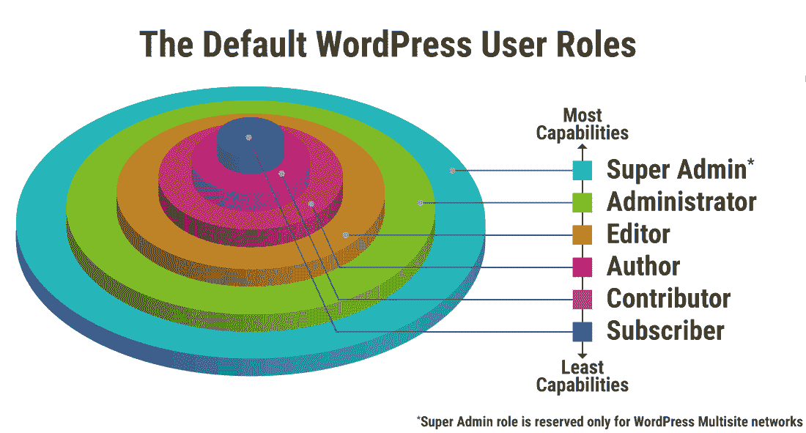

The default WordPress user roles stacked in order of capabilities


想象一下，默认的 WordPress 用户角色是代表不同功能的堆叠圆柱体的集合。最大的气缸容量最大，第二大的气缸容量第二大，最小的气缸容量最小。

你不应该认为一个角色比另一个角色优越。相反，可以把角色看作是设置用户在站点中的职责。

> 用户角色从来都不是高级的，也不是低级的，它精确地定义了它的意图。

现在让我们详细看看所有预定义的 WordPress 用户角色。

### 管理人员

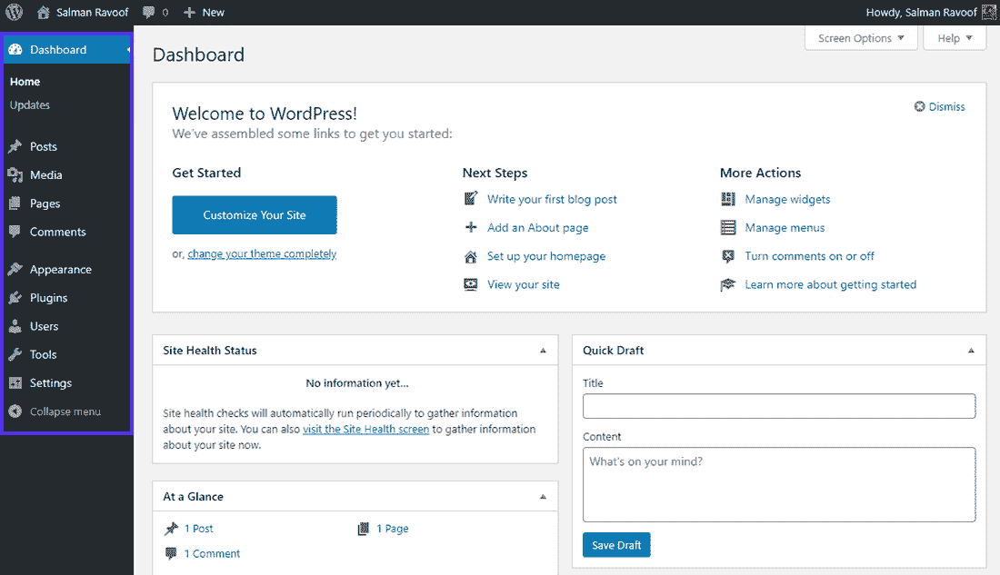

The ‘Administrator’ role dashboard in WordPress


WordPress 为任何单一站点安装的第一个用户分配管理员角色。它位于所有其他用户角色的顶端，可以访问 WordPress 定义的所有功能。具有管理员角色的用户可以执行以下操作:

*   创建和删除用户。
*   [重置密码](https://kinsta.com/blog/change-wordpress-password/)。
*   安装和管理[插件](https://kinsta.com/best-wordpress-plugins/)和[主题](https://kinsta.com/best-wordpress-themes/)
*   编辑插件、主题、文件和代码

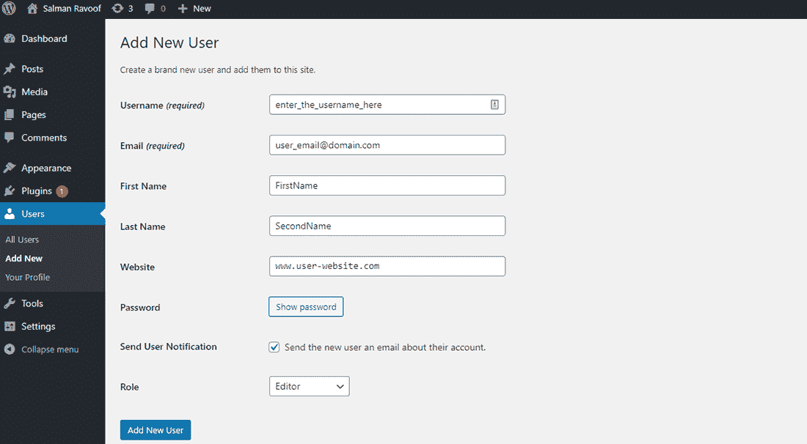

Only Administrators can add new users in WordPress


由于管理员是最强大的角色，您应该只将它分配给那些您信任的人。理想情况下，每个站点应该只有一个管理员。

在一个 [WordPress 多站点网络](https://kinsta.com/blog/wordpress-multisite/)中的管理员角色定义有点不同，尽管它的名称是一样的。在一个多站点的网络中，管理员角色并不像在 WP 单一站点中那样拥有一些功能，比如[安装主题](https://kinsta.com/blog/how-to-install-a-wordpress-theme/)和插件。WordPress 为超级管理员角色保留了这些能力。

### 编者ˌ编辑

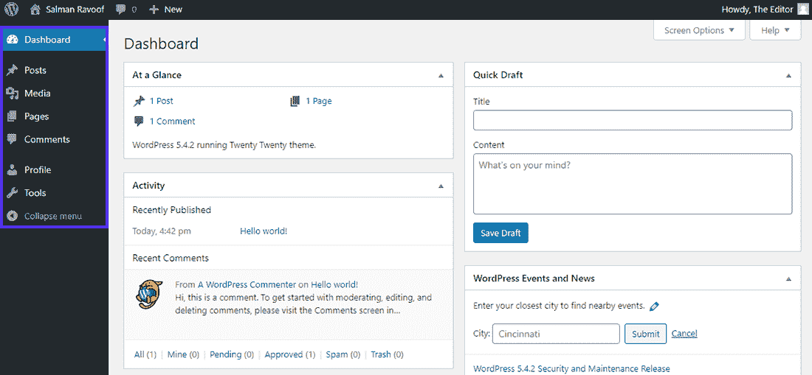

The ‘Editor’ role dashboard in WordPress


编辑负责管理 WordPress 站点上的内容。他们可以创建、修改、发布或删除帖子和页面，甚至是由其他用户创建的帖子和页面。他们的一些能力包括:

*   删除已发布的帖子和页面
*   适度的[评论](https://kinsta.com/blog/wordpress-comment-plugins/)
*   管理链接和类别
*   编辑其他用户的帖子和页面

编辑不能进行站点管理操作，例如安装插件和主题。他们的主要职责是监督其他作者和贡献者的工作，或者成为一个一个人的内容团队。

提示:如果你自己管理一个 WordPress 网站，你可以为自己创建一个替代用户，扮演编辑的角色。这样，您可以将管理和发布职责分开。[即使你的编辑账号被入侵，你的管理员账号也不会被黑客攻击](https://kinsta.com/blog/wordpress-security/)。

### 作者


The ‘Author’ role dashboard in WordPress


顾名思义，任何拥有作者角色的用户都可以创建、编辑和[发布帖子](https://kinsta.com/blog/long-form-articles/)。他们还可以[上传媒体文件](https://kinsta.com/blog/wordpress-media-library/)和删除自己的帖子，但他们不能创建页面或编辑其他人的帖子。

作者可以为他们的文章添加标签，并将他们的文章分配到现有的类别，但他们不能创建新的类别。像编辑一样，他们没有任何管理权限，比如设置、插件和主题。

注意:作者甚至可以在文章发表后删除它们。如果你给任何人分配了作者的角色，确保你同意他们完全控制自己的帖子，包括删除帖子。

### 捐助者

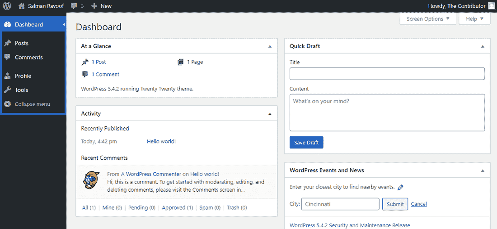

The ‘Contributor’ role dashboard in WordPress


贡献者角色是作者角色的精简版。具有贡献者角色的用户可以创建自己的帖子，删除帖子的草稿，但不能发布帖子。

他们可以保存帖子的草稿，或者将其发送给编辑或管理员进行审阅和发布。一旦他们发布了帖子，投稿人就不能删除他们的帖子。相比之下，作者可以删除他们发布的帖子。

贡献者角色是新作者和客座贡献者的理想角色。

### 订户

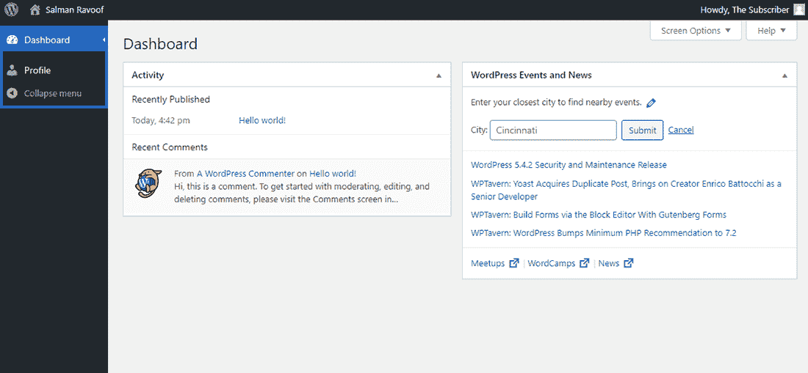

The ‘Subscriber’ role dashboard in WordPress


订阅者角色位于功能等级的最低一级。拥有订阅者角色的用户可以管理他们的个人资料，并有权阅读网站上的所有帖子。差不多就是这样！

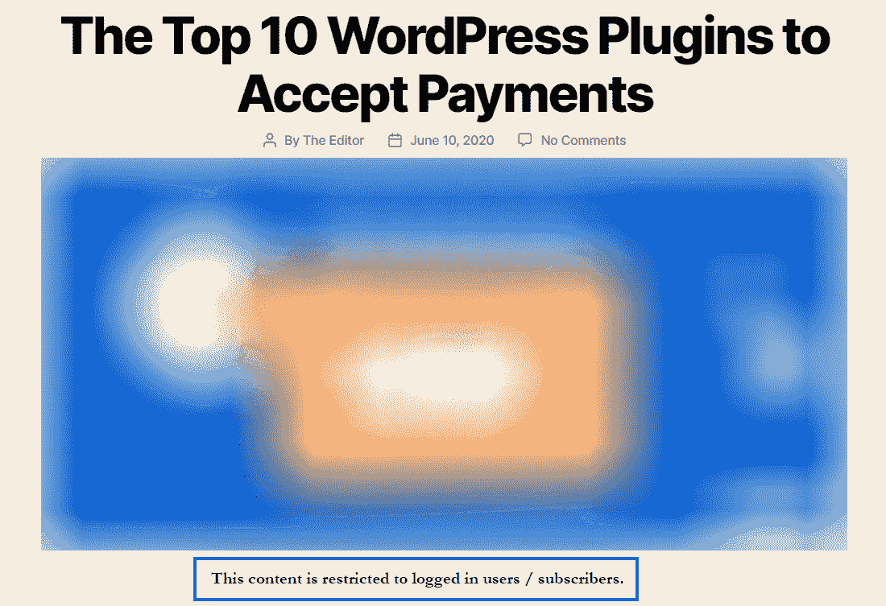

You can restrict content to only logged-in users, including Subscribers


通常，每个人都有权阅读 WordPress 网站上的内容。然而，在[订阅](https://kinsta.com/blog/woocommerce-subscriptions/)或[会员网站](https://kinsta.com/blog/wordpress-membership-plugins/)中，只有[登录用户](https://kinsta.com/blog/wordpress-user-registration-plugins/)可以查看内容。在这些情况下，具有订阅者角色的用户可以阅读帖子。

### 超级管理员

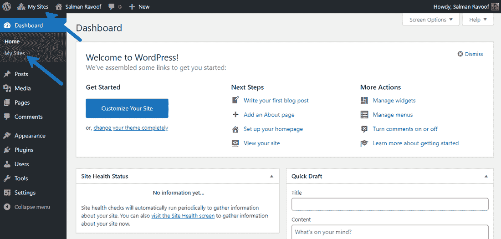

The ‘Super Admin’ role dashboard in WordPress Multisite network


超级管理员角色仅在 WordPress 多站点安装中可用。该角色取代多站点网络中的单站点管理员，并提供对所有高级管理功能的访问。

超级管理员可以使用的一些仅限多站点的功能包括:

*   创建、管理和删除网络站点
*   管理网络用户、插件、主题和选项
*   升级多站点网络上的所有站点
*   建立多站点网络
*   将管理员分配到网络的各个站点

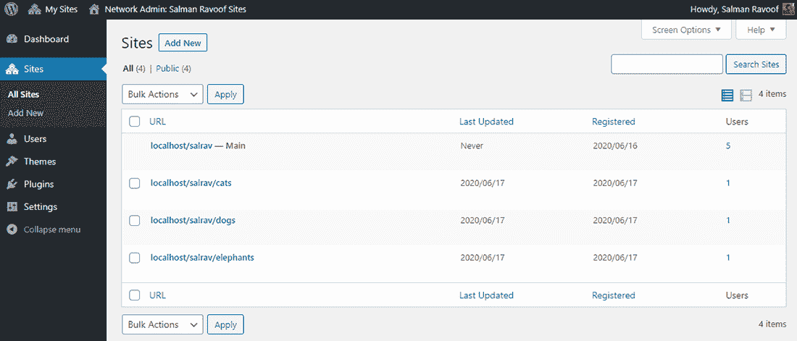

The ‘Sites’ panel in a WordPress Multisite network


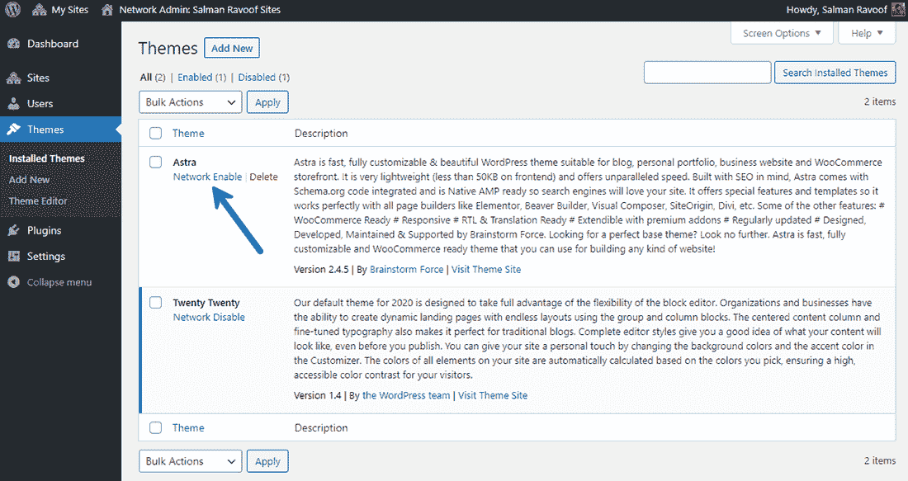

The ‘Themes’ panel in the Super Admin dashboard


在多站点网络中，只有超级管理员可以安装主题并在网络中启用它们。个人网站的管理员只能查看和激活超级管理员已经安装的主题。

例如，我已经在我的网络上安装了[免费的 Astra 主题](https://kinsta.com/blog/fastest-wordpress-theme/#astra)，但是我还没有在网络上启用它。因此，网络中单个子网站的管理员看不到它列在他们的**主题**面板下。

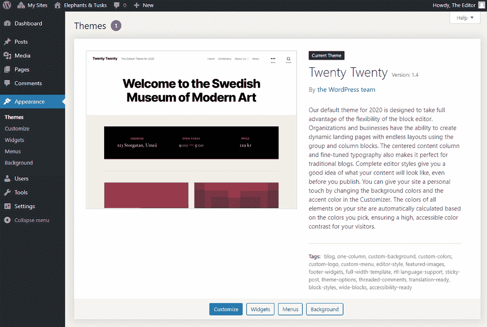

Administrators of network subsites cannot install new themes


在上面的截图中，您还可以注意到网络中的站点管理员无法访问**插件**菜单。与主题不同，超级管理员可以改变网络设置，使管理员能够在他们的网站上安装和激活插件。

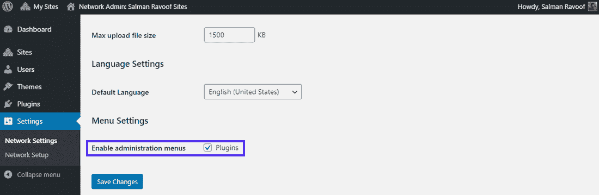

The Super Admin can give Administrators the ability to manage plugins


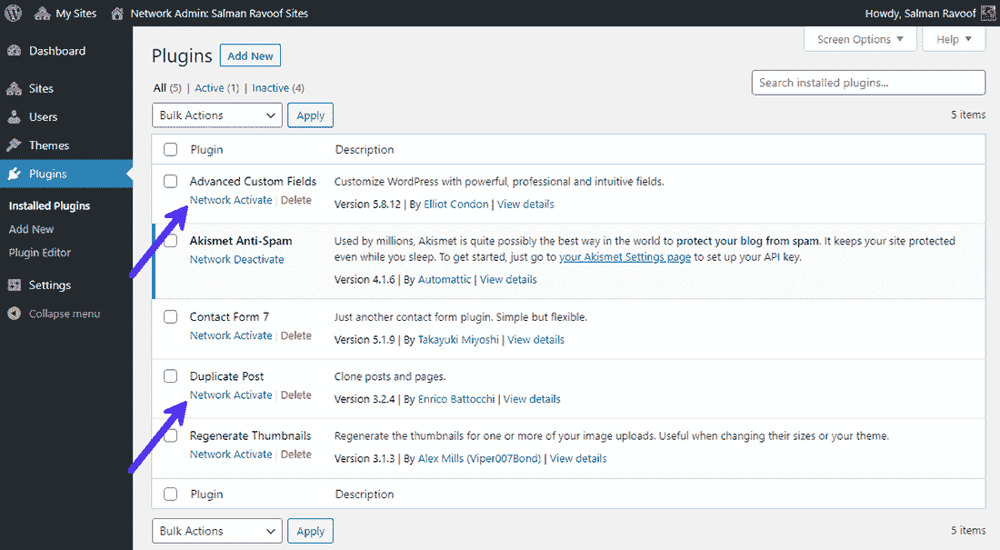

The Super Admin can also ‘Network Activate’ plugins


超级管理员也可以通过**网络激活**插件，以确保它们被强制应用于网络上的所有站点。站点管理员不能停用网络激活插件。这种设置非常适合在整个网络中实施必要的插件。

#### 网络管理屏幕

网络管理员仪表板是超级管理员管理 WordPress Multisite 网络功能的中心枢纽。在[创建网络](https://kinsta.com/blog/wordpress-multisite/#manage)后，只有拥有超级管理员角色的用户才能访问。

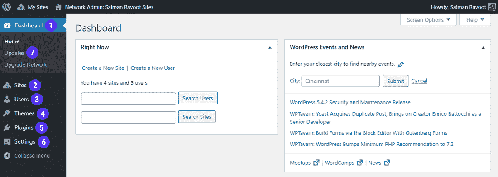

The Network Admin dashboard includes unique options to manage the network


##### 1.仪表盘

网络管理仪表板是网络站点详细信息的中心。它让您可以访问所有网络设置。

##### 2.位置


The ‘Sites’ panel in a Network Admin dashboard


您可以使用[站点面板](https://wordpress.org/support/article/network-admin/#sites)来管理属于多站点网络的各个站点。这里列出的站点可以是子目录，也可以是子域，这取决于你如何配置你的 WordPress 多站点网络。

在这里，您可以向网络中添加新站点或从网络中删除现有站点。

您还可以从这里访问有关站点、用户、主题和整体网络设置的信息。您创建的第一个站点是网络中的主站点。网络从第一个站点的选项中继承所有设置。

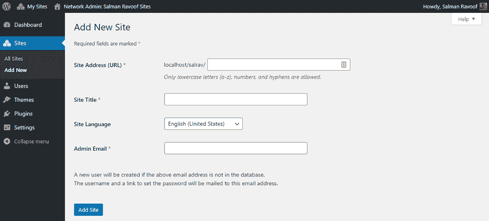

Adding new sites to the WordPress Multisite network


点击[添加新站点](https://wordpress.org/support/article/network-admin-sites-screen/#add-site)链接或按钮，您将进入上述屏幕，在此您可以向您的多站点网络添加新站点。如果你心里没有其他人想成为新网站的管理员，你也可以指定自己为管理员。

##### 3.用户

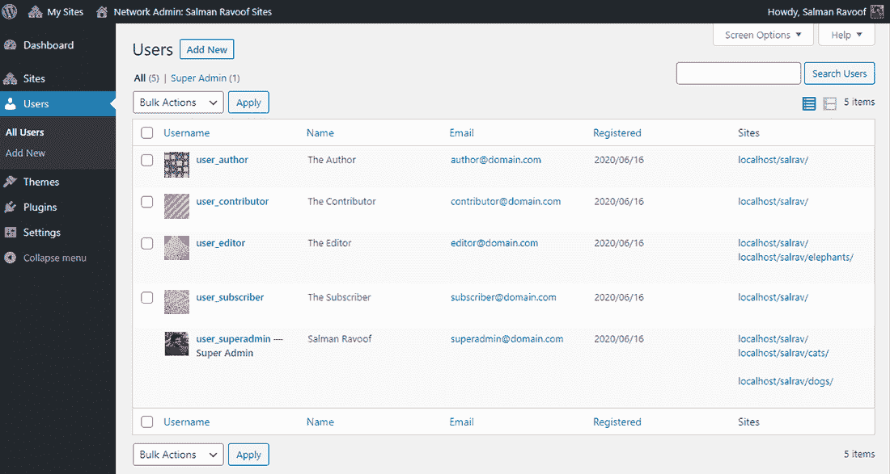

The ‘Users’ panel in the Network Admin dashboard


网络管理仪表板中的[用户屏幕](https://codex.wordpress.org/Network_Admin_Users_Screen)允许您管理用户和[向您的多站点网络添加新用户](https://codex.wordpress.org/Network_Admin_Users_Screen#Add_User)。只有超级管理员可以向网络添加用户，但是超级管理员可以修改网络设置，使站点管理员能够只向他们自己的站点添加新用户。

##### 4.主题

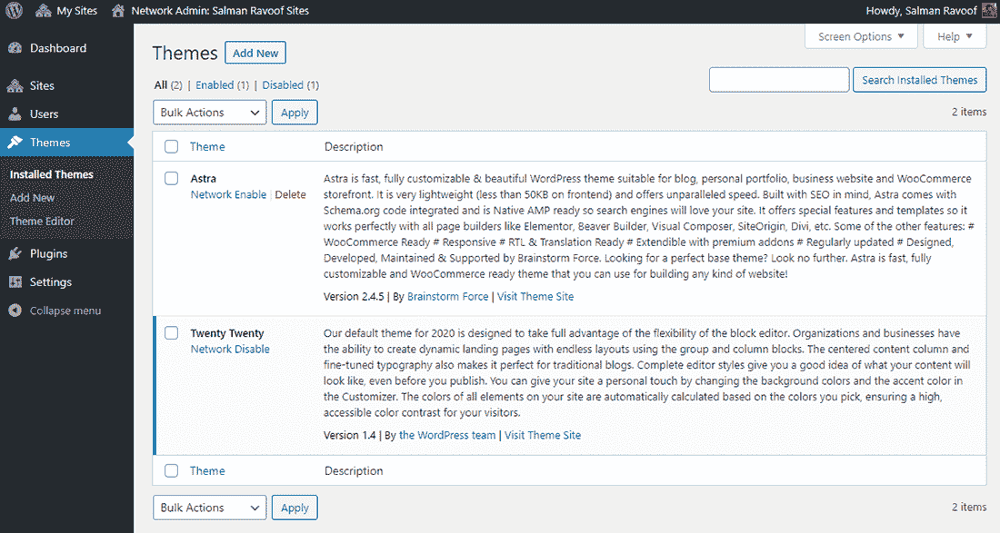

The ‘Themes’ panel in the Network Admin dashboard


[主题屏幕](https://codex.wordpress.org/Network_Admin_Themes_Screen)让你[管理站点管理员可访问的主题](https://kinsta.com/blog/change-wordpress-theme/)。它不允许您激活或停用任何网站正在使用的主题，但只能设置任何网站可以使用的主题。

如果您停用了网络上任何地方正在使用的主题，它将在该站点上保持活动状态，即使您停用了它。但是如果网站使用另一个主题，那么被禁用的主题将不会出现在网站的主题面板中。

你可以参考 [Kinsta 的 WordPress Multisite 文章](https://kinsta.com/blog/wordpress-multisite/#plugins)来学习如何在你的网络上使用主题和插件。你也可以[使用主题编辑器在仪表盘内部编辑你的主题文件](https://kinsta.com/blog/how-to-customize-wordpress-theme/)。

##### 5.插件

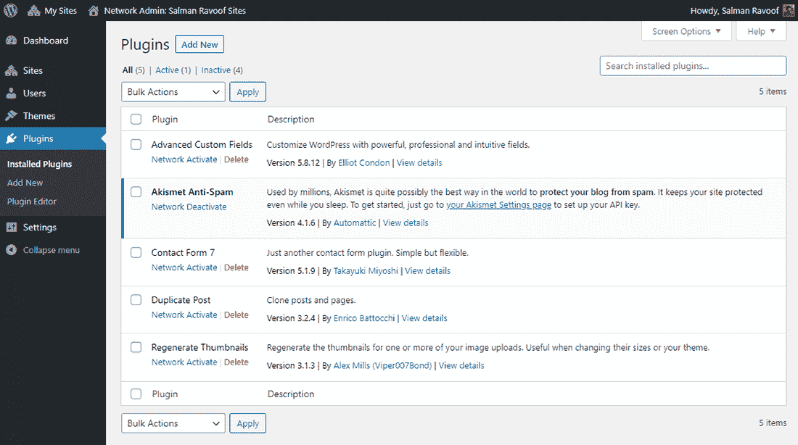

The ‘Plugins’ panel in the Network Admin dashboard


[插件屏幕](https://codex.wordpress.org/Network_Admin_Plugins_Screen)允许用户添加或删除网络中的插件。添加后，您可以从站点的仪表板激活插件。您也可以从这里通过**网络激活**插件，强制该插件在网络中的所有站点上使用。

默认情况下，站点管理员无法访问其仪表板中的插件菜单。超级管理员可以通过修改网络设置为他们启用此功能。


Enabling plugins administration for all subsite Administrators


注意:不是所有的 WordPress 插件都支持多站点网络。你需要阅读插件的文档来确认它们是否能在多站点设置中工作。

##### 6.设置

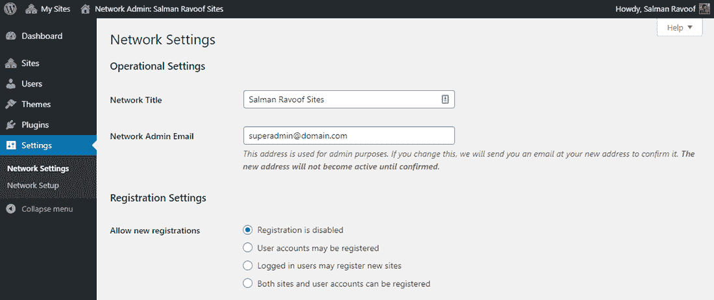

The ‘Network Settings’ panel in the Network Admin dashboard


您可以在[网络设置屏幕](https://codex.wordpress.org/Network_Admin_Settings_Screen)上设置和更改整个网络的设置。网络的默认设置基于您在设置网络时创建的第一个站点。您可以在这里更改的一些网络设置有:

*   操作设置
*   注册设置
*   新网站设置
*   上传设置
*   语言设置
*   菜单设置

在这里，您还可以访问创建网络时使用的[网络设置](https://codex.wordpress.org/Network_Admin_Settings_Screen#Network_Setup)信息。你可以参考 WordPress Codex 中的[网络管理设置屏幕](https://wordpress.org/support/article/network-admin-settings-screen/)来获得所有可用设置选项的详细概述。

##### 7.更新

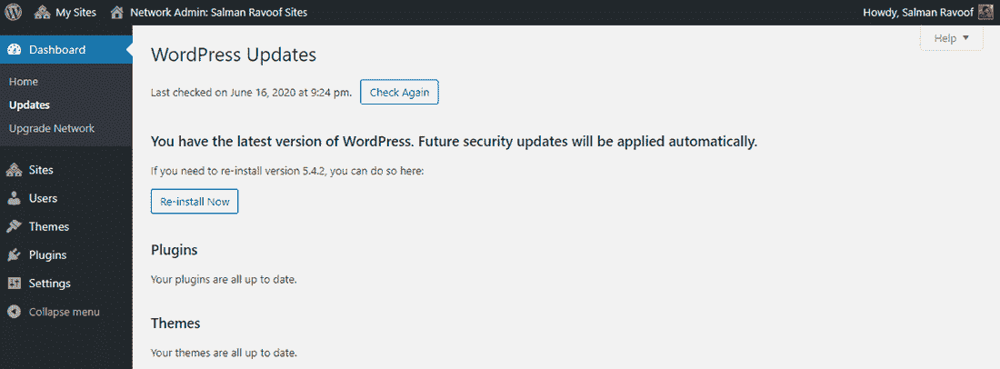

The ‘Updates’ panel in the Network Admin dashboard


您可以从[更新屏幕](https://wordpress.org/support/article/network-admin-updates-screen/)控制网络和单个站点的更新过程。**更新**面板会显示任何 WordPress 核心、主题和插件的可用更新。一旦[你安装了 WordPress](https://kinsta.com/knowledgebase/manually-install-wordpress/) 的最新版本，你就可以通过[升级网络](https://wordpress.org/support/article/network-admin-updates-screen/#upgrade-network)屏幕将它应用到网络上的所有站点。

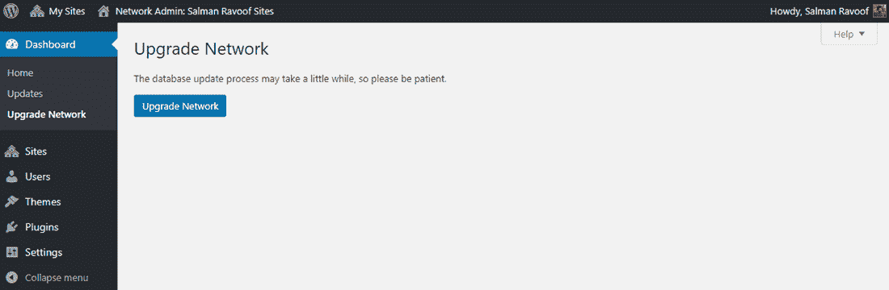

The ‘Upgrade Network’ panel in the Network Admin dashboard


**注意:**在 WordPress 单点安装中，管理员本质上是一个超级管理员，因为他们可以访问所有的管理功能。

你可以自定义用户角色，也可以使用 WordPress 的预定义功能创建你自己的自定义角色。

### 用户角色和能力的优势

角色和能力系统是用户管理的支柱。以下是它的一些好处:

*   用户角色帮助您更有效地管理站点上的所有用户。即使您的站点上有几十个用户在世界不同的地方工作，您也可以通过给他们每个人授予适当的角色来轻松地管理他们。
*   通过限制用户的特定能力，它帮助你[保持你的网站更加安全](https://kinsta.com/blog/is-wordpress-secure/)。例如，作者不能删除他人的帖子，编辑不能更改主题或安装插件，订阅者只能访问自己的个人资料。
*   WordPress 插件可以检查用户是否有一定的能力，并基于此执行一定的操作。[current _ user _ can()](https://developer.wordpress.org/reference/functions/current_user_can/)WordPress 函数帮助执行这个检查。例如，[安全插件](https://kinsta.com/blog/wordpress-security-plugins/)可以只向管理员显示其选项面板，但仍然向所有用户显示安全警告。
*   您可以编辑用户角色，将您的部分角色职责委派给其他用户，以节省您的时间。假设你的网站[吸引了很多评论](https://kinsta.com/blog/wordpress-spam-comments/)。在这种情况下，你可以让一个值得信任的作者来做评论。作为管理员，你仍然拥有最终的权力，但是你可以根据需要分担一些责任。
*   您可以使用能力检查来显示只有特定用户角色可以查看的私有帖子和页面。这构成了会员网站的基础。
*   您可以根据用户角色显示或隐藏站点上的前端元素(例如[菜单项](https://kinsta.com/blog/wordpress-menu-plugins/)、[小部件](https://kinsta.com/blog/wordpress-widgets/))。
*   您可以创建具有自定义功能的自定义帖子类型，并为每个用户角色授予或拒绝这些功能。同样，你也可以定义自定义功能，只允许某些角色访问你的插件或主题设置。

 <kinsta-advanced-cta language="en_US" type-int-post="12589" type-int-position="2">## 如何有效管理 WordPress 用户角色

了解所有的用户角色和功能是必要的，但是你也需要了解如何在你的站点上有效地管理它们。虽然没有两个 WordPress 站点是完全相同的，但是你可以遵循一些基本的规则来充分利用 WordPress 的用户角色和功能。

### 给予每个用户最少的访问权限

只给网站上的每个用户分配他们需要的访问级别。授予较少的权限总比授予过多的权限好。保护 WordPress 用户角色对于保证你的网站及其内容的安全是至关重要的。

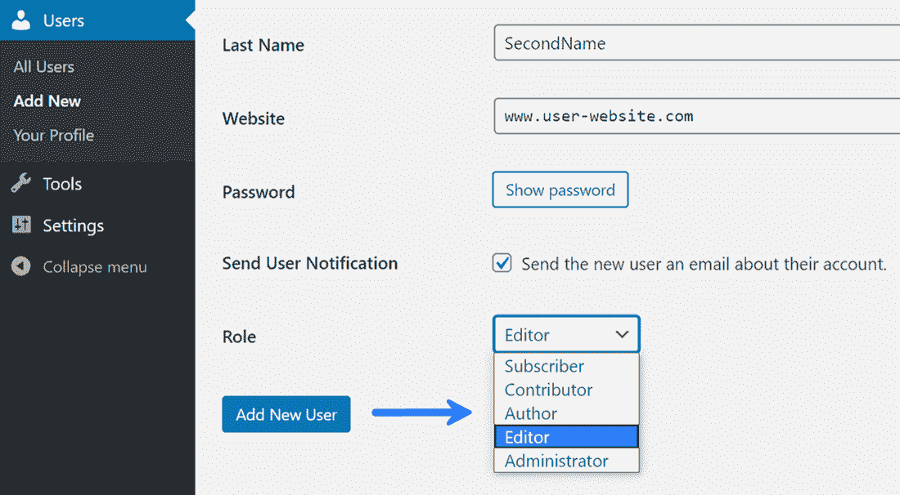

Assign user roles carefully to every user


### 限制管理员和编辑的数量

一般来说，每个网站应该只有一个管理员，而且只能对网站进行核心更改。WordPress 建议你遵守最小特权的"[原则，这意味着你应该只给用户执行他们想要的工作所必需的特权。](https://developer.wordpress.org/plugins/users/#the-principle-of-least-privileges)

例如，最好使用编辑级别的用户来管理网站上的内容，而不是使用管理员。如果你的网站上有不止一个编辑，那么确保你可以信任他们的广泛能力。

将作者角色分配给你可以信任的[内容创建者](https://kinsta.com/blog/content-length/)，因为他们可以发布和删除自己的帖子。贡献者角色更适合新的内容创建者和客座博文。

### 根据需要定制用户角色

默认的 WordPress 用户角色是有用的，但是它们并不适合所有的用例。例如，让你的作者有能力[调节评论](https://kinsta.com/blog/wordpress-spam-comments/#3-enable-comment-moderation)。

幸运的是，WordPress 允许我们定制用户角色或者根据我们的独特需求创建新角色。你可以通过代码或者借助 WordPress 用户角色插件手动完成。我们将在本文中讨论这两种方法。

## 管理 WordPress 多站点网络上的用户

WordPress Multisite 包括用户管理的独特设置。其中一些很容易掌握，而另一些则不容易。

让我们深入探讨一下。

### 多站点网络注册设置

开箱即用，只有超级管理员可以在网络上创建新的用户和站点。但是，它们可以允许用户在网络上注册帐户作为子网站的订户。

要启用此功能，请转到**网络管理>网络设置>注册设置>允许新注册**，并启用“可以注册用户帐户”选项。

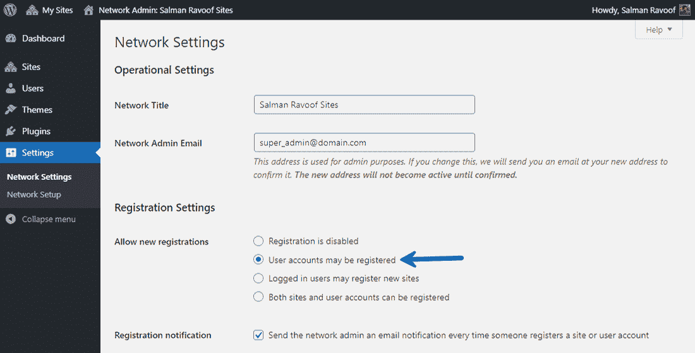

Allow users to register an account on your network


在这里，您还可以允许登录用户在您的网络上创建新站点。如果您想将创建网站的能力限制为仅由您设置的用户，您可以勾选此选项。

最后一个选项允许用户注册一个帐户，并在您的网络上创建一个站点。在您的网络上创建网站的用户被授予其子网站的管理员角色。

### 一个用户帐户访问整个网络

当您在网络上创建用户帐户时，或者当用户在网络的任何站点上注册帐户时，他们可以在登录后导航到网络内的任何站点。想象一下，这是一个像脸书或 Reddit 一样的社交网络，你可以创建一个账户，用同一个用户资料访问所有的群组或子网站。

这是使用 WordPress Multisite 的主要好处之一。它允许你的用户只需注册一个账户就可以访问你所有的网站。

### 授予站点管理员额外的权限

通过勾选**添加新用户**选项，您可以允许站点管理员将用户添加到他们自己的站点。

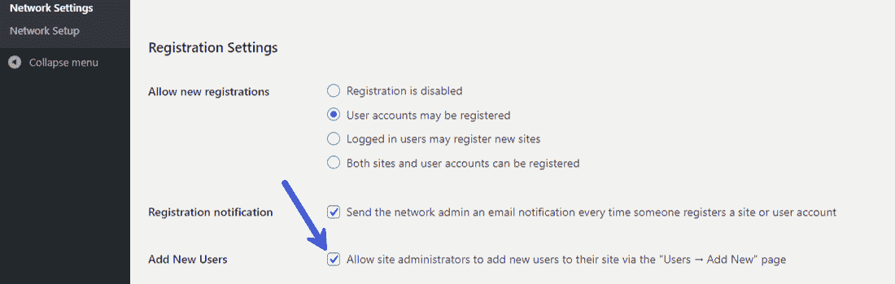

Allowing site administrators to add new users to their subsite


如前所述，您可以通过进入**网络设置>菜单设置**并选中**启用管理菜单>插件**选项，授予站点管理员管理其子站点插件的权限。

### 子网站级用户注册

默认情况下，WordPress 多站点安装只允许整个网络的用户注册。没有只为一个子网站启用用户注册的选项。您可以通过使用[网络子站点用户注册](https://wordpress.org/plugins/network-subsite-user-registration/)插件来改变这种行为。

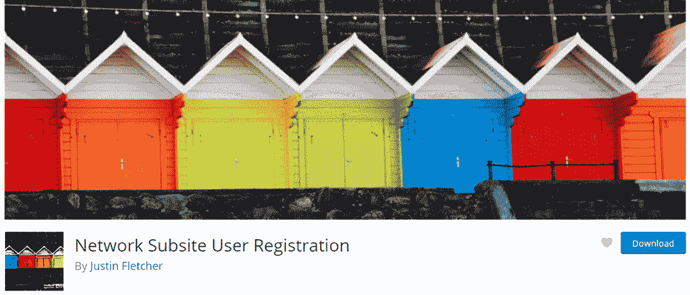

The ‘Network Subsite User Registration’ plugin


这个插件允许站点管理员启用本地用户注册，只允许访问他们的站点。默认情况下，新用户将承担订阅者角色，但是您可以通过修改插件设置来更改这一点。

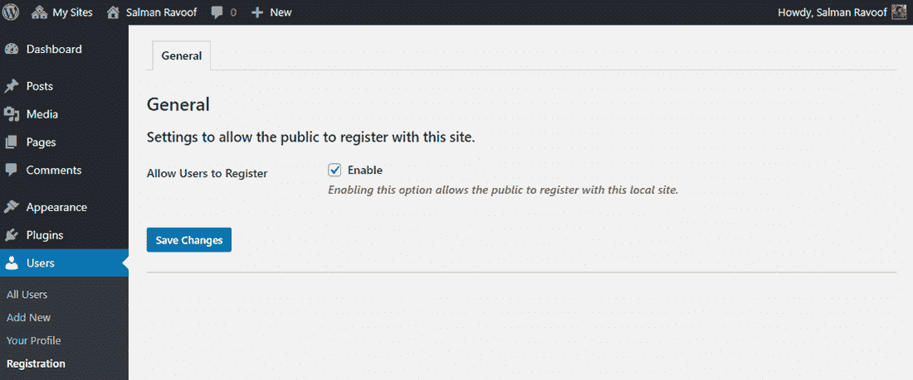

Enable anyone to register an account only on your subsites


### 将同一用户分配给多个子网站

您可以将同一个用户分配给网络中的多个站点，并赋予其独特的角色。当用户登录到他们站点的仪表板时，他们可以通过**我的站点**屏幕访问他们所有站点的仪表板。


You can assign one user to multiple sites in a WordPress Multisite network


### 授予其他用户超级管理员权限

超级管理员也可以与其他用户共享他们的权限。您应该谨慎启用此选项，并且只将它分配给您可以信任的用户。

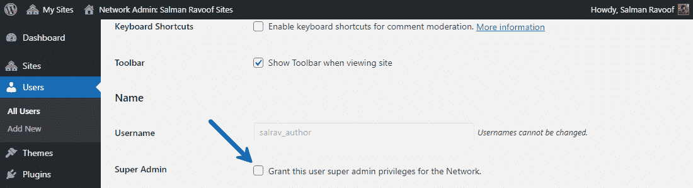

Granting other users the Super Admin privileges for the network


了解 WordPress Multisite 中的所有用户管理设置将有助于您更好地管理您的网络。要找到其他对 WordPress Multisite 有用的插件，你可以在 WordPress repo 或者 [Kinsta 推荐的 WordPress Multisite 插件](https://kinsta.com/blog/wordpress-multisite-plugins/)文章中探索它们。

## 如何定制现有的 WordPress 用户角色

您可以向现有用户角色添加权能，以提高他们的访问级别。例如，你可以给编辑管理插件的权力。或者，您可能希望投稿人对自己的帖子进行适度评论。让我们来学习如何做到这一点。

**注意:**如果您不喜欢涉足代码，您可以跳过手动方法，直接进入下面的用户角色和功能插件部分。或者干脆[雇佣一个 WordPress 开发者](https://kinsta.com/blog/hire-wordpress-developer/)。

### 如何向用户角色添加权能

您可以通过使用 [add_cap()](https://codex.wordpress.org/Function_Reference/add_cap) WordPress 函数向用户角色或任何特定用户添加一项功能。我将使用一个名为**自定义用户角色**的自定义插件来展示如何使用这个函数来赋予编辑角色管理插件的权力。

```
<?php

/*
Plugin Name:  Customize User Role
Version:  1.0
Description:  Demonstrating how to customize WordPress User Roles.
Author:  Salman Ravoof
Author URI:  https://www.salmanravoof.com/
License: GPLv2 or later
License URI: https://www.gnu.org/licenses/gpl-2.0.html
Text Domain:  customize-user-role
*/
```

WordPress 建议在插件或主题激活时运行这个功能，因为它添加的设置存储在数据库的`**wp_user_roles**`字段下的`**wp_options**`表中。每次加载页面时都运行这个函数是低效的，因为每次页面加载时数据库表都会被覆盖。

因为我使用的是插件，所以我将使用[register _ activation _ hook()](https://developer.wordpress.org/reference/functions/register_activation_hook/)函数来挂钩到激活插件时运行的动作。有许多方法可以做到这一点，但是我使用了一个健壮的基于类的实现来确保没有冲突。

```
// this code runs only during plugin activation and never again
function sal_customize_user_role() {
    require_once plugin_dir_path( __FILE__ ).'includes/class-sal-customize-user-role.php';   
    Sal_Customize_User_Role::activate();
}
register_activation_hook( __FILE__, 'sal_customize_user_role' );
```

以上代码在插件激活期间只运行一次。被挂钩的函数`**sal_customize_user_role**`引用了一个名为`**Sal_Customize_User_Role**`的自定义类。

我在一个名为`**class-sal-customize-user-role.php**`的单独文件中定义了这个类，并把它放在我的插件根文件夹的一个名为`**includes**`的子文件夹中，但是你可以随意命名它。

```
<?php

class Sal_Customize_User_Role {
    public static function activate() {
        // get the Editor role's object from WP_Role class
        $editor = get_role( 'editor' );

        // a list of plugin-related capabilities to add to the Editor role
        $caps = array(
                  'install_plugins',
                  'activate_plugins',
                  'edit_plugins',
                  'delete_plugins' 
        ); 

        // add all the capabilities by looping through them
        foreach ( $caps as $cap ) {
            $editor->add_cap( $cap );
        }
    }
}
```

下面是对上述代码的详细解释:

*   首先定义您在主插件文件中引用的类及其函数。
*   [get_role( 'editor' )](https://developer.wordpress.org/reference/functions/get_role/) 函数从`**WP_Role**`核心类中检索编辑器角色对象，并将其分配给`**$editor**`变量。
*   管理插件需要四种能力:`**install_plugins**`、`**activate_plugins**`、`**edit_plugins**`和`**delete_plugins**`。但是`**add_cap()**`函数只接受一个参数。因此，我们需要在一个数组中包含所有的功能。定义`**$caps**`数组来保存所有这些功能。如果您只是添加一个功能，那么就没有必要定义一个数组。
*   `**add_cap( $cap )**`函数通过使用 [foreach ()](https://www.php.net/manual/en/control-structures.foreach.php) PHP 函数遍历所有定义在`**$caps**`数组中的功能来添加它们。

保存所有插件文件，然后从管理员控制面板激活插件。现在，让我们登录到编辑器仪表板来查看更改。

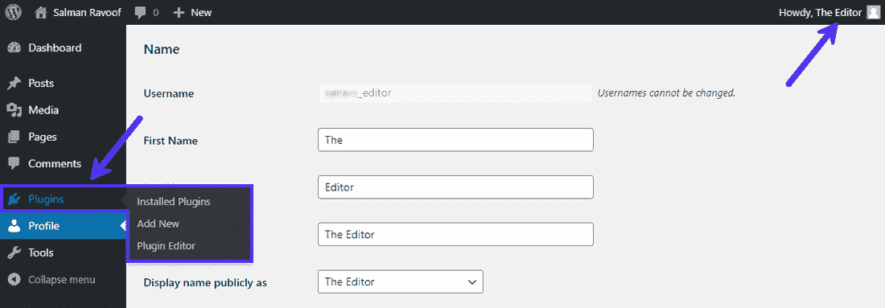

Editors can now manage plugins from their dashboard


在将插件相关的功能添加到他们的用户角色之后，编辑们可以在他们的管理菜单中看到插件菜单。

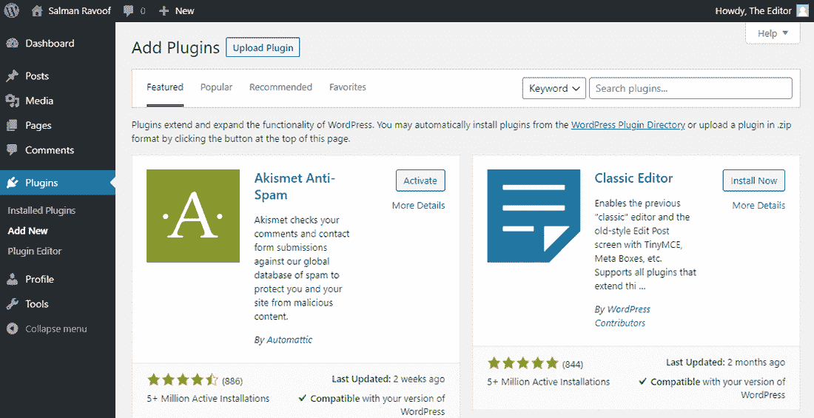

The ‘Add Plugins’ screen in Editor dashboard


你可以通过查看存储在 WordPress 站点数据库的`**wp_options**`表中的`**wp_user_roles**`键值来检查分配给每个用户角色的能力。

以下是我发现分配给编辑角色的功能:

```
'editor' => 
  array (
    'name' => 'Editor',
    'capabilities' => 
    array (
      'moderate_comments' => true,
      'manage_categories' => true,
      // [...lines cut off for brevity...]
      'install_plugins' => true,
      'activate_plugins' => true,
      'edit_plugins' => true,
    ),
  ),
```

请注意最后三行，它们给了编辑管理插件的能力。

如果你想移除这些功能，你可以挂入[register _ deactivation _ hook()](https://developer.wordpress.org/reference/functions/register_deactivation_hook/)函数，使用`**remove_cap()**`函数移除插件停用的功能，就像我们在插件激活时添加这些功能一样。

既然您已经学习了如何向用户角色添加权能，那么是时候学习如何从用户角色中删除权能了。

**注意:**你也可以挂钩到 [after_switch_theme](https://codex.wordpress.org/Plugin_API/Action_Reference/after_switch_theme) 动作，在主题(和/或子主题)激活时触发这个代码。这里，您必须将代码包含在您的主题或[子主题](https://kinsta.com/blog/wordpress-child-theme/)(推荐)`**functions.php**`文件中。

### 如何从用户角色中删除权能

有时，您可能希望从用户角色中删除某项权能。您可以运行 [remove_cap()](https://codex.wordpress.org/Function_Reference/remove_cap) 函数从一个角色或特定用户中删除一个能力。例如，从作者用户角色中移除`**delete_published_posts**`功能是一个很好的主意。

让我们把这件事做完！

我将创建一个名为**自定义作者角色**的新自定义插件来开始。就像之前一样，我将通过挂钩到`**register_activation_hook()**`函数只运行一次这段代码。

```
<?php

/*
Plugin Name:  Customize Author Role
Version:  1.0
Description:  Demonstrating how to customize WordPress Author Role.
Author:  Salman Ravoof
Author URI:  https://www.salmanravoof.com/
License: GPLv2 or later
License URI: https://www.gnu.org/licenses/gpl-2.0.html
Text Domain:  customize-author-role
*/

// this code runs only during plugin activation and never again
function sal_customize_author_role() {
    require_once plugin_dir_path( __FILE__ ).'includes/class-sal-customize-author-role.php';
    Sal_Customize_Author_Role::activate();
}
register_activation_hook( __FILE__, 'sal_customize_author_role' );
```

接下来，我将在`**class-sal-customize-author-role.php**`文件中定义`**Sal_Customize_Author_Role**`类。我已经在上面的主插件文件中引用了这两个资源。

```
<?php
class Sal_Customize_Author_Role { 
    public static function activate() {
        // get the Editor role's object from WP_Role class
        $author = get_role( 'author' );

        // remove the capability to delete published posts from an Author role
        $author->remove_cap( 'delete_published_posts' );
    }
}
```

`**remove_cap( 'delete_published_posts' )**`功能将从作者角色中删除已发布的帖子。

 ## 注册订阅时事通讯


### 想知道我们是怎么让流量增长超过 1000%的吗？

加入 20，000 多名获得我们每周时事通讯和内部消息的人的行列吧！

[Subscribe Now](#newsletter)

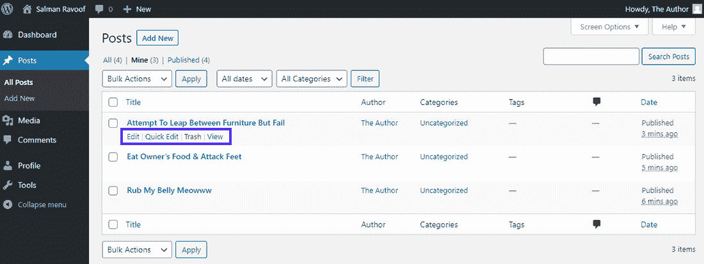

Authors are allowed to delete their published posts by default


是时候保存所有插件文件，然后激活插件了。现在，登录到 Author dashboard 并查看更改。


Authors can no longer delete their published posts


作者发布的帖子不再可以使用**回收站**选项。但是，他们仍然可以删除其未发布的状态为**草稿**或**待定**的帖子。

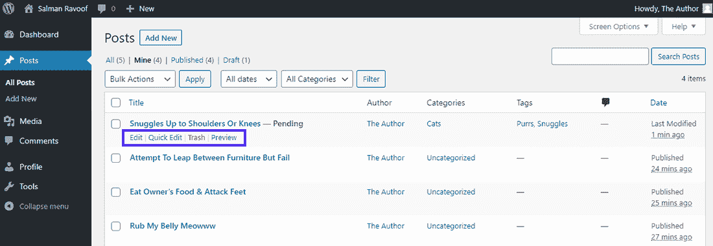

如果您想禁用这个功能，那么您还需要从 Author 角色中删除`**delete_posts**`功能。

### 为特定用户添加或删除权能

如果您想为特定用户添加功能，而不是整个用户角色，那么您可以使用 [WP_User::add_cap()](https://codex.wordpress.org/Class_Reference/WP_User#add_cap.28.24cap_.5B.2C_.24grant_.5D_.29) 类函数来添加功能。

```
// get the user object by their ID
$user = new WP_User( $user_id ); 

// add the capability to the specific user
$user->add_cap( $cap );
```

您可以使用 [get_user_by()](https://developer.wordpress.org/reference/functions/get_user_by/) 函数通过使用用户的电子邮件、登录用户名或 slug 来检索任何用户的 ID。

类似地，您可以通过使用 [WP_User::remove_cap()](https://codex.wordpress.org/Class_Reference/WP_User#remove_cap.28.24cap.29) 类函数来删除特定用户的功能。

```
// get the user object by their ID
$user = new WP_User( $user_id );

// add the capability to the specific user
$user->add_cap( $cap );
```

像以前一样，只在插件或主题激活时运行这些函数，以保持代码优化。

**注意:**`**add_cap()**`和`**remove_cap()**`都是`**WP_Role**`类的对象方法。您不能在代码中直接调用它们。你需要通过使用`**get_role()**`函数或者`**$wp_roles**`全局变量来访问它们。

### 复制用户角色

您可以通过克隆现有用户角色的所有功能来创建新的用户角色。你可以这样做:

```
add_role( 'clone', 'Clone', get_role( 'administrator' )->capabilities );
```

在上面的例子中，我创建了一个名为 **Clone** 的新角色，拥有与管理员相同的功能。在主题或插件激活时运行这段代码将确保克隆的角色只被添加一次。

## 如何在 WordPress 中创建自定义用户角色

编辑默认用户角色的功能是一种快速自定义它们的方法。但是如果您希望编辑一个角色的许多功能，那么最好创建一个新的自定义用户角色。这样你就可以为你网站上的每个角色设置你想要的确切功能。

要创建自定义用户角色，需要使用 [add_role()](https://developer.wordpress.org/reference/functions/add_role/) 函数。它接受三个参数。

```
add_role(  $role, $display_name, $capabilities );
```

前两个参数应该是字符串(并且是函数运行所必需的)。它们分别定义新的自定义角色的名称和显示名称。最后一个参数是可选的，应该是一个数组。您可以使用它来分配新角色的所有功能。

让我们创建一个名为**社区管理员**的自定义用户角色，他可以在整个站点上审核评论和编辑帖子。你可以这样做:

```
<?php

/*
Plugin Name:  Add Community Manager Role
Version:  1.0
Description:  Add a Custom User Role called 'Community Manager'
Author:  Salman Ravoof
Author URI:  https://www.salmanravoof.com/
License: GPLv2 or later
License URI: https://www.gnu.org/licenses/gpl-2.0.html
Text Domain:  add-community-manager-role
*/

// this code will run only once on plugin activation and never again
function add_community_manager_role() {
    add_role(
         'community_manager',
         __('Community Manager', 'add-community-manager-role'), 
         array( 
              'read' => true,
              'moderate_comments' => true,
              'edit_posts' => true,
              'edit_other_posts' => true,
              'edit_published_posts' => true
         )
    );
}
register_activation_hook( __FILE__, 'add_community_manager_role' );
```

和以前一样，`**add_role()**`函数只在插件激活时运行一次，不会再运行。保存文件并在管理员控制面板中激活插件。现在，您应该能够将**社区管理员**角色分配给新用户和现有用户。

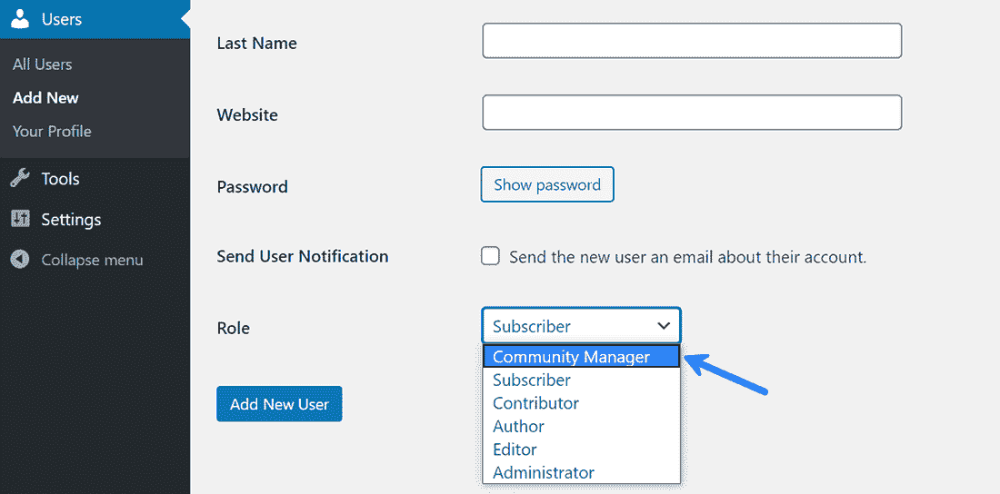

Assigning the custom user role to new users


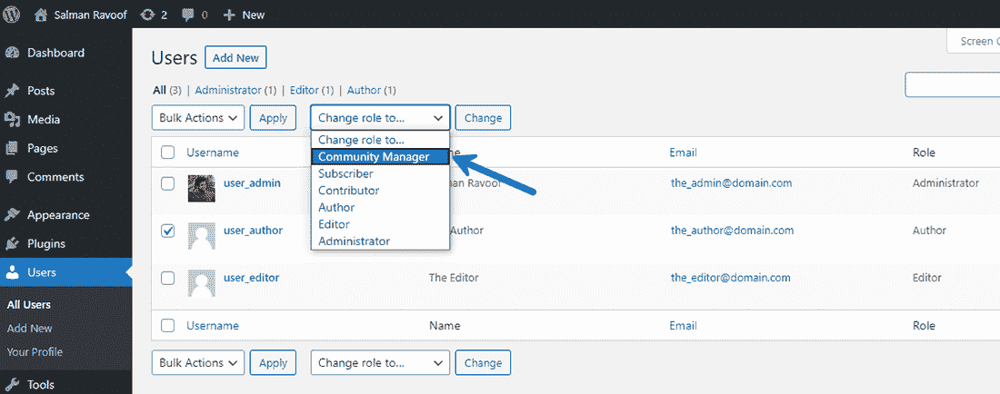

Assigning the custom user role to existing users


您还可以通过检查数据库中`**wp_options**`表下的`**wp_user_roles**`字段的值来验证分配给这个新角色的能力。以下是我在我的网站数据库中发现的内容:

```
array (
  'administrator' => 
    // [...]
  'editor' => 
    // [...]
  'author' => 
    // [...]
  'contributor' => 
    // [...]
  'subscriber' => 
    // [...]
  'community_manager' => 
  array (
    'name' => 'Community Manager',
    'capabilities' => 
    array (
      'read' => true,
      'moderate_comments' => true,
      'edit_posts' => true,
      'edit_other_posts' => true,
      'edit_published_posts' => true,
    ),
  ),
)  
```

最后列出的是我们刚刚添加的新角色及其所有功能。您可以通过添加或删除权能来进一步编辑此角色。

### 测试新的用户角色

在将新的用户角色分配给任何真正的用户之前，测试它是否按预期工作是很重要的。这里有一个清单，你可以按照它来测试:

1.  创建一个测试用户帐户，并为其分配新的用户角色。
2.  以测试用户的身份登录，并确保它的所有功能都正常工作。例如，如果您已经授予它编辑已发布帖子的能力，那么转到任何帖子并检查您是否可以编辑它。您分配给角色的功能越多，您将花费越多的时间来测试它们。
3.  接下来，尝试直接在浏览器中访问任何更高级别的管理链接。我通过直接访问 WordPress 设置屏幕来测试这一点，不出所料，WordPress 没有让我进去。WordPress 显示的“拒绝访问”消息
4.  完成测试后，删除测试用户。

差不多就是这样！现在，您可以向您站点的用户分配新角色。

你可以使用[用户切换](https://wordpress.org/plugins/user-switching/)或[查看管理员身份](https://wordpress.org/plugins/view-admin-as/)插件，只需点击一下就可以在你网站上的不同用户账户之间切换。它们对于测试多个用户的能力非常方便。我将在本文后面详细讨论这两个问题。

### 在 WordPress Multisite 中创建自定义用户角色

WordPress 多站点处理用户角色的方式与 WordPress 单站点安装略有不同。虽然您可以像之前一样使用`**add_role()**`功能创建自定义用户角色，但是新角色将仅在网络的主站点(您创建的第一个站点)上工作。它不会传播到网络上的所有子站点。

为了确保回调函数中的代码可以在网络中的每个站点上运行，您需要通过逐个遍历网络中的所有站点来强制执行它。对于这个例子，我将创建一个名为**插件管理器**的新用户角色，它将拥有管理插件的所有能力。

```
<?php

/*
Plugin Name:  Add Plugin Manager Role
Version:  1.0
Description:  Add a custom user role named Plugin Manager in a WordPress Multisite Installation
Author:  Salman Ravoof
Author URI:  https://www.salmanravoof.com/
License: GPLv2 or later
License URI: https://www.gnu.org/licenses/gpl-2.0.html
Text Domain:  add-plugin-manager-role
*/

/* 
make the code run on every site in the network
when the plugin is Network Activated
*/
function add_plugin_manager_role( $network_wide ) {

     if ( is_multisite() && $network_wide ) { 
         // run the code for all sites in a Multisite network
         foreach ( get_sites(['fields'=>'ids']) as $blog_id ) {
             switch_to_blog( $blog_id );
                 add_role(
                      'plugin_manager',
                      __('Plugin Manager', 'add-plugin-manager-role'),
                      array( 
                           'install_plugins' => true,
                           'activate_plugins' => true,
                           'edit_plugins' => true,
                           'delete_plugins' => true
                      )
                 );
             }
             restore_current_blog();
     }
     else {
         add_role(
              'plugin_manager',
              __('Plugin Manager', 'add-plugin-manager-role'),
              array( 
                   'install_plugins' => true,
                   'activate_plugins' => true,
                   'edit_plugins' => true,
                   'delete_plugins' => true
              )
         );
     }
}
register_activation_hook( __FILE__, 'add_plugin_manager_role' );
```

让我们详细浏览一下上面的代码:

*   首先，用`**register_activation_hook()**`函数挂接插件激活动作，并传入回调函数。这里回调函数是`**add_plugin_manager_role()**`。
*   然后定义回调函数并传递一个名为`**$network_wide**`的参数。
*   `**$network_wide**`参数是一个布尔值，如果您已经为整个网络激活了插件，它将返回`**true**`。如果你只为当前站点启用了它，它会返回`**false**`。此外，它仅适用于多站点安装，其默认值为`**false**`。
*   `**is_multisite() && $network_wide**`条件语句检查插件在多站点安装中是否“网络激活”。如果是`**true**`，它运行包含在`**If**`语句中的代码。如果是`**false**`，则运行`**else**`语句中的代码。
*   `**get_sites(['fields'=>'ids'])**`函数返回网络中所有站点 id 的列表。使用`**foreach()**` PHP 函数，它循环遍历所有这些文件，分别在每个网络站点上运行代码。
*   [switch _ to _ blog(＄blog _ id)](https://developer.wordpress.org/reference/functions/switch_to_blog/)函数指导下面几行代码为 ID 为`**$blog_id**`的子网站执行。由于 WordPress 最初主要是作为一个博客平台，你可以用“站点”来代替“博客”来更好地理解它的用法。
*   接下来，您使用`**add_role()**`函数创建定制用户角色及其功能。这遵循与本文前面解释的相同的代码约定。
*   在终止循环之前，定义 [restore_current_blog()](https://developer.wordpress.org/reference/functions/restore_current_blog/) 函数，以确保将切换后的站点状态恢复到原始状态。
*   `**else**`语句中的代码是一个后备代码，用于确保与单站点安装的兼容性。

保存插件文件，并进入**网络管理>插件**屏幕，以‘网络激活’您的定制插件。在那之后，在你站点的**编辑站点**屏幕下的**用户**标签，检查新的**插件管理器**角色是否可用。

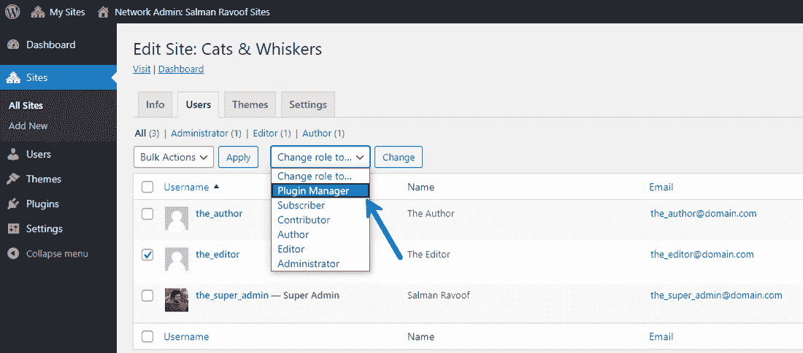

Changing the role of existing site users to the new user role


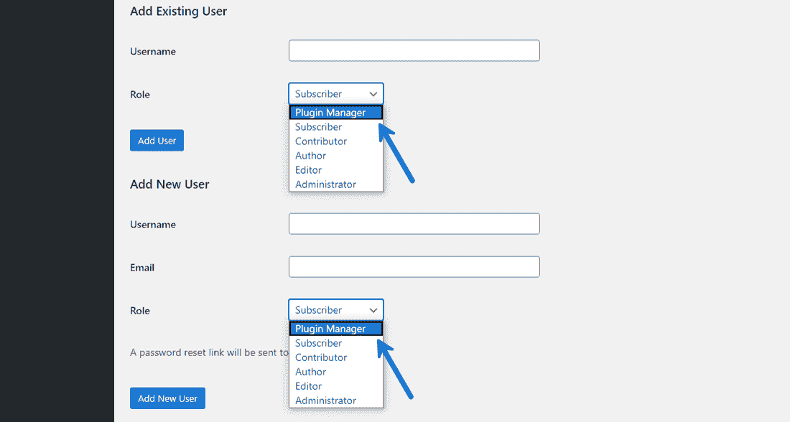

Assigning the custom user role to new users for a subsite


我还确认了这个新的用户角色在网络中的其他站点上是可用的。它完美地工作。

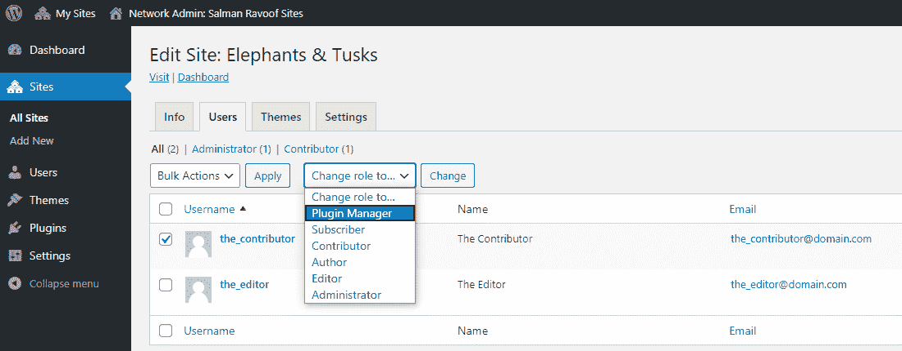

Assigning the new user role to existing users on subsites


您还可以通过查看您站点的数据库来验证新的自定义角色及其功能。然而，与单站点安装不同，WordPress Multisite 为每个子站点创建一个单独的`**wp_options**`表。

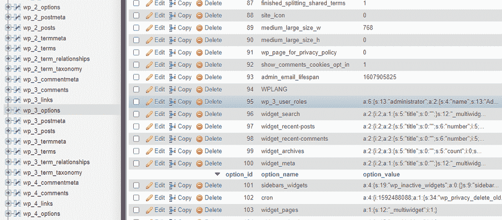

Where user roles are stored in a WordPress Multisite database


您可以找到列出为`**wp_2_options**`、`**wp_3_options**`和`**wp_4_options**`的特定于子站点的表格。同样，角色和能力存储在它们各自的字段中，分别名为`**wp_2_user_roles**`、`**wp_3_user_roles**`和`**wp_4_user_roles**`。

您已经定义了如何在网络中的所有站点上创建自定义用户角色，但是将来要创建的站点呢？为了确保您将此自定义用户角色添加到网络中创建的每个新站点，您可以将以下代码添加到您的插件中:

```
// run the code once again when a new site is created
function add_custom_user_role_new_site( $blog_id ) { 
    // check whether the plugin is active for the network
    if ( is_plugin_active_for_network( 'add-custom-user-role/add-custom-user-role.php' ) ) {
        switch_to_blog( $blog_id );
        add_role(
             'plugin_manager',
             __('Plugin Manager', 'add-plugin-manager-role'),
             array( 
                  'install_plugins' => true,
                  'activate_plugins' => true,
                  'edit_plugins' => true,
                  'delete_plugins' => true
             )
        );
        restore_current_blog();
    }
}
add_action( 'wpmu_new_blog', 'add_custom_user_role_new_site' );
```

*   每当有人在多站点网络中创建新站点时，就会触发 [wpmu_new_blog](https://codex.wordpress.org/Plugin_API/Action_Reference/wpmu_new_blog) 动作。您可以使用回调函数挂钩到该操作，以添加自定义用户角色。
*   [is _ plugin _ active _ for _ network()](https://developer.wordpress.org/reference/functions/is_plugin_active_for_network/)函数检查插件对于整个网络是否是活动的，并返回一个布尔值。它接受插件文件的路径作为参数。
*   代码的其余部分遵循与前面相同的逻辑。您使用其`**$blog_id**`参数切换到新站点，使用`**add_role()**`函数创建您的自定义角色，然后使用`**restore_current_blog()**`函数切换回当前站点。

## 如何从 WordPress 中删除用户角色

你可以使用 [remove_role( )](https://developer.wordpress.org/reference/functions/remove_role/) 函数从 WordPress 中删除任何用户角色。它只接受一个参数，即角色名。例如，您可以通过在站点中的任意位置运行以下代码来删除参与者角色:

```
remove_role( 'contributor' );
```

不像`**add_role()**`函数，如果它不在插件或主题激活时运行，它会不断更新数据库，只有当角色存在时，`**remove_role()**`函数才会执行。因为任何作为参数传入的角色在第一次运行时都会被删除，所以您不必担心在哪里运行这个函数。

然而，为了避免将来的冲突，在从数据库中删除角色之后，删除代码。

## 在 WordPress 中创建自定义功能

使用 WordPress 的内置功能编辑现有用户角色和创建新的自定义角色对于大多数用例来说已经足够了，但是你可能想要为自定义代码引入的特性定义新的功能(使用插件或主题)。

然后，您可以使用这些自定义功能来定义新角色或将它们添加到现有角色中。

例如， [WooCommerce](https://kinsta.com/blog/woocommerce-tutorial/) 除了其广泛的电子商务功能外，还增加了额外的功能和角色。它增加的一些功能有:

*   允许管理 WooCommerce 设置
*   创建和编辑产品
*   查看 WooCommerce 报告

使用这些功能，它添加了两个新的用户角色:**客户**和**商店经理**。

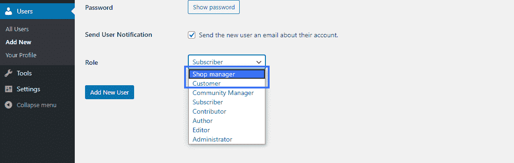

WooCommerce adds its own user roles


除了拥有客户角色的用户可以编辑他们的帐户信息和查看当前/过去的订单之外，客户角色几乎与订户角色相似。商店经理角色包括编辑的所有能力，另外他们还被授予所有 WooCommerce 能力。

其他引入自定义功能和/或角色的插件包括[事件日历](https://wordpress.org/plugins/the-events-calendar/)、[视觉组合](https://wordpress.org/plugins/visual-portfolio/)、 [WPML](https://wpml.org/) 和 [WP ERP](https://wordpress.org/plugins/erp/) 。

如果你深入到所有这些插件的文档中，你会注意到它们将几乎所有的定制功能绑定到它们定义的定制文章类型中。在 WooCommerce 中，它是**产品**和**订单**自定义帖子类型，而在其他情况下，它分别是**事件**、**投资组合**、**翻译**和**客户**。

让我们学习如何创建绑定到自定义帖子类型的自定义功能。

首先，设置一个插件，注册你想要的自定义帖子类型。在我的例子中，我注册了一个名为**故事**的新的[自定义帖子类型](https://kinsta.com/blog/wordpress-custom-post-types/)。

```
<?php

/*
Plugin Name:    Custom Post Type and Capabilities
Version:        1.0
Description:    Register a custom post type and define custom capabilities tied into it.
Author:         Salman Ravoof
Author URI:     https://www.salmanravoof.com/
License:        GPLv2 or later
License URI:    https://www.gnu.org/licenses/gpl-2.0.html
Text Domain:    custom-post-type-capabilities
*/

// register a custom post type, in this case it's called "story" //
function cpt_story_init() {
    $labels = array(
        'name'                  => _x( 'Stories', 'custom-post-type-capabilities' ),
        'singular_name'         => _x( 'Story', 'custom-post-type-capabilities' ),
        'menu_name'             => _x( 'Stories', 'Admin Menu text', 'custom-post-type-capabilities' ),
        'name_admin_bar'        => _x( 'Story', 'Add New on Toolbar', 'custom-post-type-capabilities' ),
        'add_new'               => __( 'Add New', 'custom-post-type-capabilities' ),
        'add_new_item'          => __( 'Add New Story', 'custom-post-type-capabilities' ),
        'new_item'              => __( 'New Story', 'custom-post-type-capabilities' ),
        'edit_item'             => __( 'Edit Story', 'custom-post-type-capabilities' ),
        'view_item'             => __( 'View Story', 'custom-post-type-capabilities' ),
        'all_items'             => __( 'All Stories', 'custom-post-type-capabilities' ),
        'search_items'          => __( 'Search Stories', 'custom-post-type-capabilities' ),
        'parent_item_colon'     => __( 'Parent Stories:', 'custom-post-type-capabilities' ),
        'not_found'             => __( 'No stories found.', 'custom-post-type-capabilities' ),
        'not_found_in_trash'    => __( 'No stories found in Trash.', 'custom-post-type-capabilities' ),
        'featured_image'        => _x( 'Story Cover Image', 'custom-post-type-capabilities' ),
        'set_featured_image'    => _x( 'Set cover image', 'custom-post-type-capabilities' ),
        'remove_featured_image' => _x( 'Remove cover image', 'custom-post-type-capabilities' ),
        'use_featured_image'    => _x( 'Use as cover image', 'custom-post-type-capabilities' ),
        'archives'              => _x( 'Story archives', 'custom-post-type-capabilities' ),
        'insert_into_item'      => _x( 'Insert into story', 'custom-post-type-capabilities' ),
        'uploaded_to_this_item' => _x( 'Uploaded to this story', 'custom-post-type-capabilities' ),
        'filter_items_list'     => _x( 'Filter stories list', 'custom-post-type-capabilities' ),
        'items_list_navigation' => _x( 'Stories list navigation', 'custom-post-type-capabilities' ),
        'items_list'            => _x( 'Stories list', 'custom-post-type-capabilities' ),
    );

    $args = array(
        'labels'             => $labels,
        'public'             => true,
        'menu_icon'          => 'dashicons-book',   
        'publicly_queryable' => true,
        'show_ui'            => true,
        'show_in_menu'       => true,
        'query_var'          => true,
        'rewrite'            => array( 'slug' => 'story' ),
        'capability_type'    => array ( 'story', 'stories' ),
        'map_meta_cap'       => true,
        'has_archive'        => true,
        'hierarchical'       => false,
        'menu_position'      => 6,
        'supports'           => array( 'title', 'editor', 'author', 'thumbnail', 'excerpt', 'comments' ),
        'show_in_rest'       => true,
    );

    register_post_type( 'story', $args );
}

add_action( 'init', 'cpt_story_init' );
```

下面是上述脚本的分解:

需要为您的客户站点提供一个非常快速、安全且对开发人员友好的托管服务吗？Kinsta 是为 WordPress 开发者设计的，提供了大量的工具和强大的仪表板。[查看我们的计划](https://kinsta.com/plans/?in-article-cta)

*   使用 [register_post_type()](https://developer.wordpress.org/reference/functions/register_post_type/) 函数注册您的自定义帖子类型。您可以挂钩到`**init**`动作来运行该功能。
*   `**register_post_type()**`函数接受两个参数。第一个是定制文章类型的名称，第二个是包含注册文章类型的所有参数的数组。
*   `**$args**`变量保存您将传递给`**register_post_type()**`函数的所有参数。它的一个参数(**‘labels’**)本身就是一个数组，被单独定义为`**$label**`变量。
*   请注意`**'capability_type' => 'post'**`参数。这是 WordPress 为定制文章类型构建阅读、编辑和删除功能时使用的默认功能类型。
*   要创建您的定制功能，您需要用您的定制功能的首选名称替换`**capability_type**`参数的值。它接受字符串或数组作为参数。如果您的自定义功能的复数形式不遵循标准的 **s** 后缀语法(例如，书籍/书籍 vs 故事/故事),则该数组非常有用。
*   你也可以使用`**capabilities**`参数来命名新的功能，不同于 WordPress 自动命名的功能。
*   你必须将你的自定义功能映射到 WordPress 的基本功能。将`**map_meta_cap**`参数设置为`**true**`，这样 WordPress 就知道它需要按照建议映射定制功能。

接下来，您需要将定制功能添加到您想要授予对**故事**定制帖子类型的访问权限的角色中。对于本例，我将该功能授予管理员和编辑者角色。

```
// add the custom capabilities to the desired user roles 
$roles = array( 'editor','administrator' );

foreach( $roles as $the_role ) {      

    $role = get_role($the_role);

            $role->add_cap( 'read' );
            $role->add_cap( 'read_story');
            $role->add_cap( 'read_private_stories' );
            $role->add_cap( 'edit_story' );
            $role->add_cap( 'edit_stories' );
            $role->add_cap( 'edit_others_stories' );
            $role->add_cap( 'edit_published_stories' );
            $role->add_cap( 'publish_stories' );
            $role->add_cap( 'delete_others_stories' );
            $role->add_cap( 'delete_private_stories' );
            $role->add_cap( 'delete_published_stories' );
}
```

保存文件，然后激活插件。现在，您应该可以在管理员或编辑仪表板中看到**故事**链接和面板。

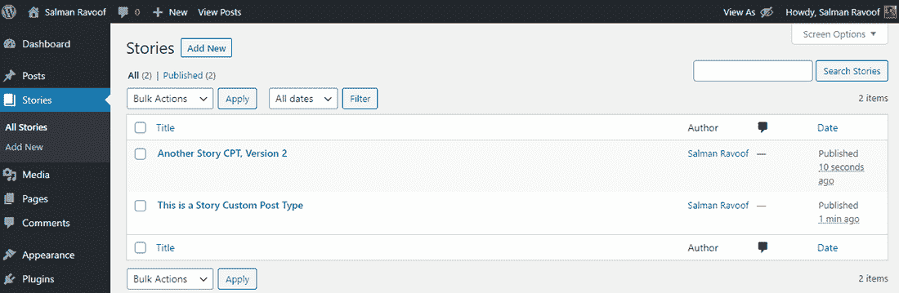

The ‘Stories’ custom post type panel in the WordPress dashboard


如果您查看您网站上的可用功能，您还会看到我们添加的所有与故事相关的功能。这里，我使用 **View Admin As** 插件来检查功能。


Custom capabilities related to the ‘Stories’ custom post type


你可以通过这个要点下载这个插件[的扩展版本。它注册了一个名为**项目**的定制 post 类型，并带有一组定制功能。然后，它将他们分配给两个自定义角色，分别名为**学生**和**教师**，以帮助您构建一个教育网站。](https://gist.github.com/carlodaniele/0b34fbd6ef205762daa48fdb9204242f)

有一种方法可以定义自定义功能，根据用户的角色授予用户访问插件设置的权限。讨论如何做到这一点超出了本文的范围，但是您可以[参考 StackExchange](https://wordpress.stackexchange.com/questions/35165/how-do-i-create-a-custom-role-capability) 上的这个信息线索来获得更多信息。

## 最好的 WordPress 用户角色和功能插件

知道如何用代码来调整用户角色和功能是很好的，但是并不是每个人都适合。如果你不确定自己在做什么，那么很多事情都可能出错。然而，了解角色和功能在 WordPress 中是如何工作的非常有帮助，即使你使用的是插件。

让我们看看一些最流行的 WordPress 插件，来轻松定制 WordPress 用户角色和功能。我还会列出一些有用的插件来快速测试角色和功能特性。

### 用户角色编辑器(作者 Vladimir Garagulia)


The ‘User Role Editor’ WordPress plugin


用户角色编辑器是 WordPress 知识库上最流行的角色和功能管理插件。它有一个简单的界面，允许任何人只需点击一下就可以编辑用户角色和功能。

安装并激活插件后，你可以在你的管理面板中进入**用户>用户角色编辑器**来访问它的主界面。

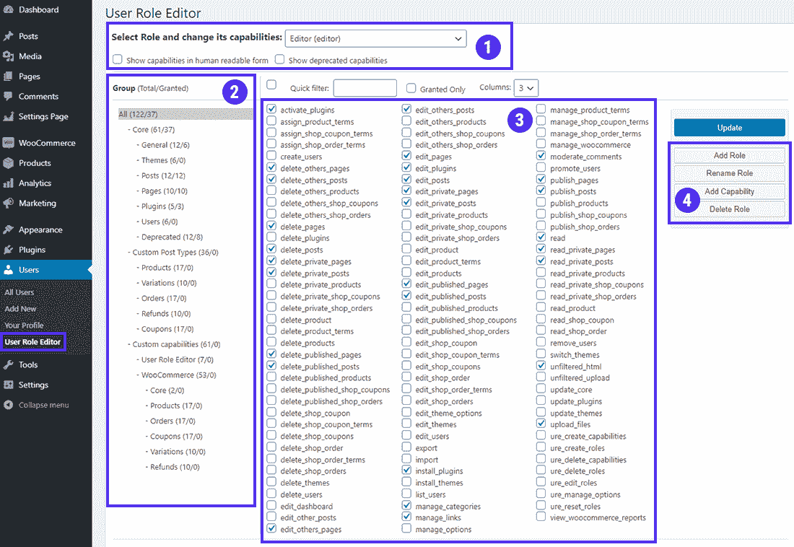

The User Role Editor dashboard


以下是上面标记的仪表板部分的详细概述:

1.  从下拉菜单中选择要自定义的角色。它不仅会列出默认角色，还会列出数据库中的所有角色。您还可以选择以人类可读的形式显示这些功能，而不是它们的常量。另一个选项让你看到 WordPress 最新版本不再支持的功能。
2.  用户角色编辑器将所有功能分组到左侧的不同类别中。核心类别包括所有内置功能。既然我已经在这个网站上安装了 WooCommerce，你也可以找到它的自定义帖子类型的功能。甚至用户角色编辑器插件也添加了自己的自定义功能。
3.  在右边，您会发现所有列出的功能。由于我选择了 **All** 组，我可以看到所有功能。但是，您可以通过单击左侧的一个组对其进行筛选。您还可以勾选顶部的【T2 只授予选项来隐藏所有没有被任何用户角色使用的功能。
4.  您还可以从这里**添加角色**、**重命名角色**、**添加能力**、**删除角色**。在最底部，您会发现一个额外的选项来**隐藏用户角色的管理栏**。

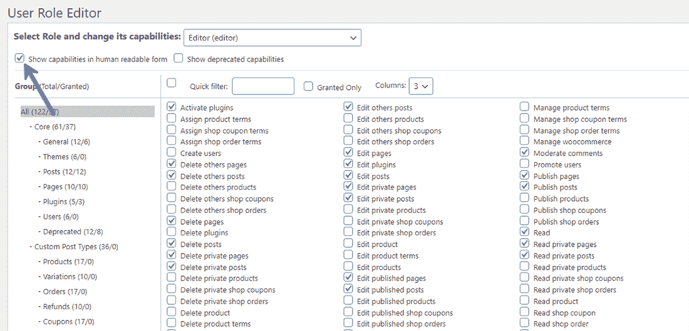

Displaying capabilities in human-readable form


要定制任何用户角色，只需勾选或取消勾选您想要的功能，然后单击**更新**按钮保存您的更改。就这么简单。

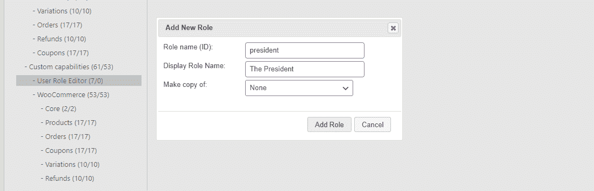

Adding a new role in User Role Editor


点击**添加角色**按钮创建一个新角色。您可以通过使用**制作**的副本下拉选项从头开始创建角色或复制现有角色。

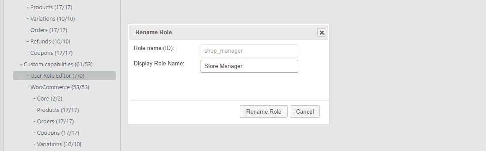

Rename the ‘Role Display Name’ easily


点击**重命名角色**按钮，也可以重命名**角色显示名称**。但是，您不能更改其**角色 ID** (或角色名称)。一种解决方法是复制要更改其 ID 的角色，然后删除原始角色。

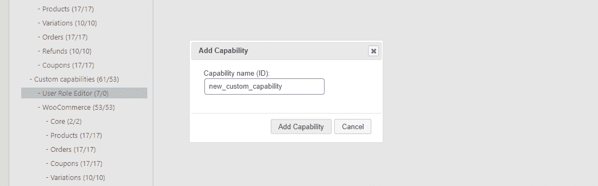

Adding a new capability in User Role Editor


您可以通过点击**添加功能**按钮来添加新功能。

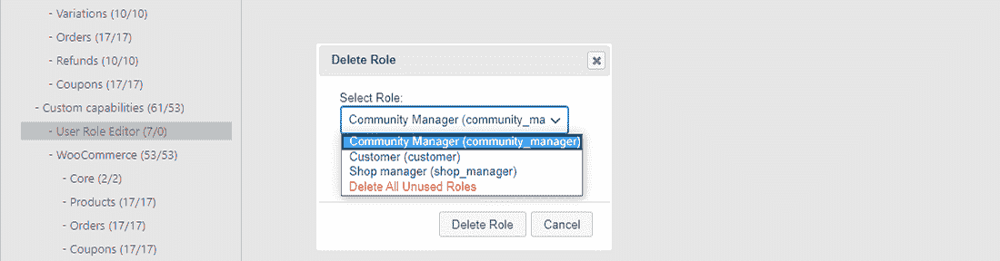

Delete unassigned user roles easily


点击**删除角色**按钮，您可以删除尚未分配给任何用户的自定义角色。

注意:用户角色编辑器不允许你删除 WordPress 的内置角色或功能。它也不允许您删除任何已分配给任何用户的自定义角色，或任何已分配给任何非管理员角色的自定义权能。

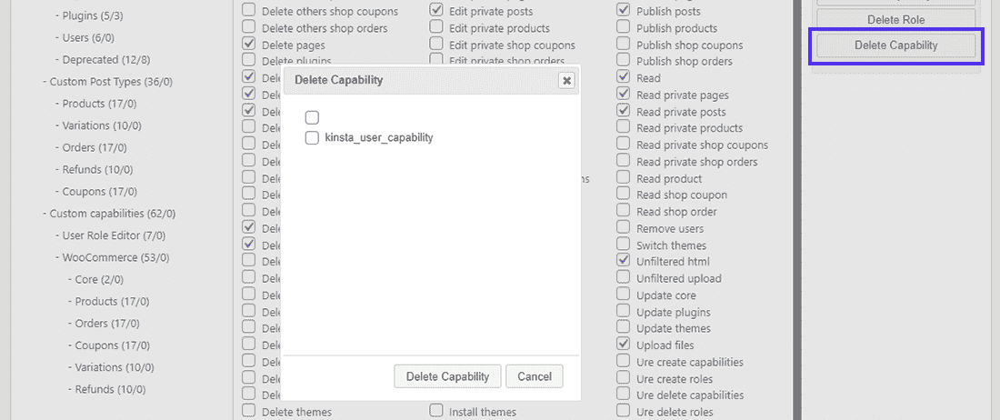

The ‘Delete Capability’ button in User Role Editor


您应该注意到，**删除功能**按钮仅在任何功能未分配给非管理员时出现。否则就是隐藏的。

您也可以为同一个用户分配多个角色，或者不给他们分配任何角色。

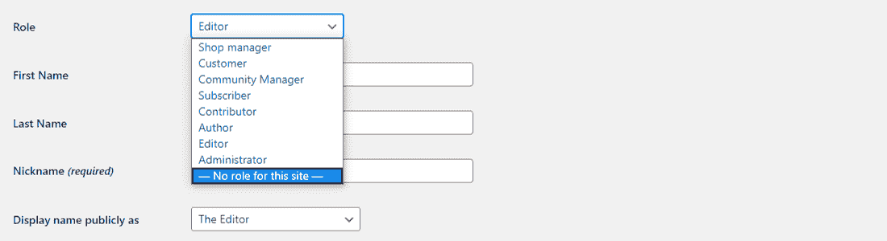

Strip the user of any role


要为一个用户分配多个角色，您需要转到仪表板中的 **Users** 面板，然后将鼠标悬停在用户名上方，单击下面的**功能**链接。

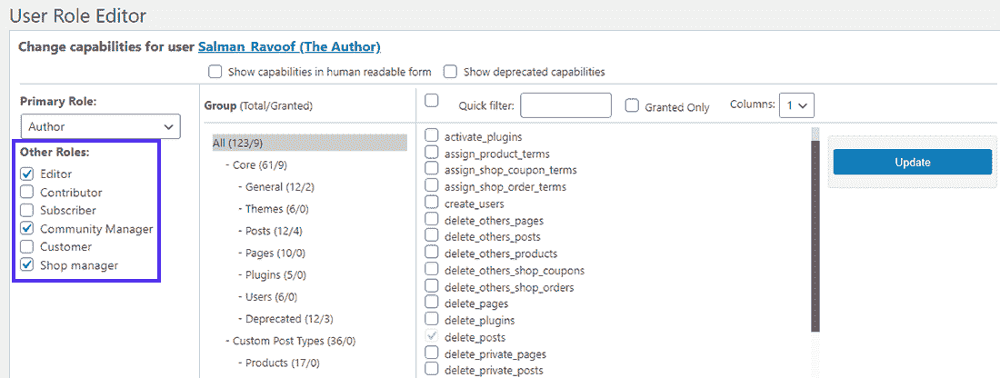

Assigning multiple roles to the same user


如果你在你的管理仪表板中进入**设置>用户角色编辑器**，你也会发现用户角色编辑器插件的附加选项。


The ‘General’ options tab for User Role Editor


在这里，您可以更改插件的默认设置，安装附加模块，更改分配给新用户的默认角色，甚至将用户角色和功能重置为默认状态。

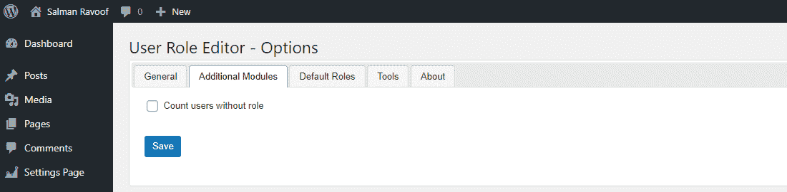

Additional modules help you extend the features of User Role Editor


Set the default role for new users


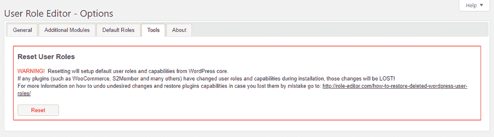

Reset all user roles and capabilities to their default state


虽然用户角色编辑器的免费版本对于大多数用例来说已经足够了，但是它的[高级版本](https://www.role-editor.com/)包括更多的功能，包括支持在 WordPress Multisite 设置中管理角色和功能。

### 成员按成员排序

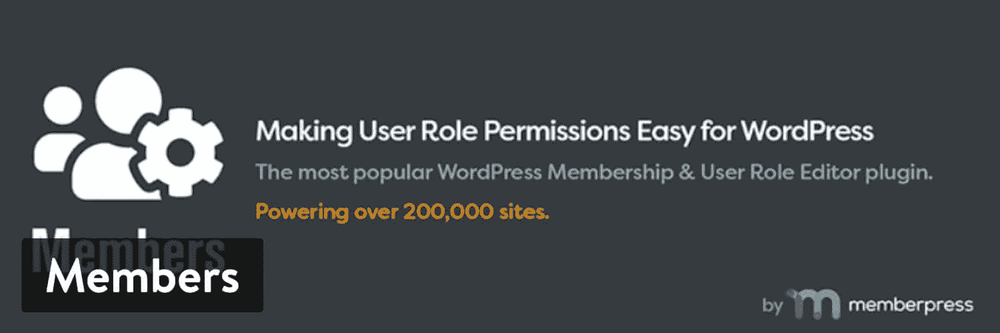

The ‘Members’ WordPress plugin by MemberPress


Members 是 WordPress 的一个[成员集中的](https://kinsta.com/blog/wordpress-membership-plugins/)用户角色和功能插件。它最初是作为一个简单的用户角色和能力管理插件推出的，后来转向了会员功能。

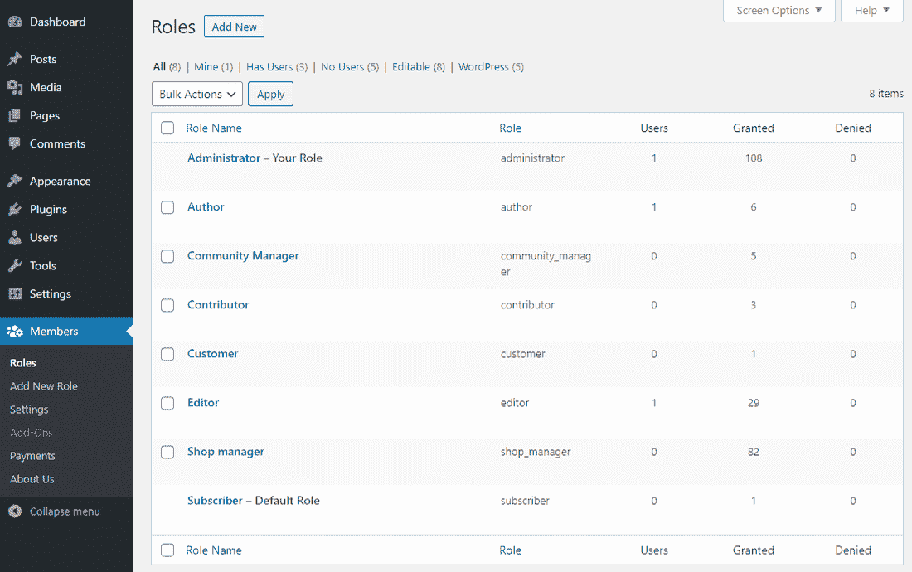

The ‘Roles’ panel in Members


安装并激活插件后，您可以在您的仪表板中的**成员>角色**中查看您站点上所有可用的角色。

成员插件允许你删除所有角色，包括内置的 WordPress 角色，除了管理员和默认角色。您还可以**编辑**和**克隆**角色，以及列出分配给特定角色的所有用户。

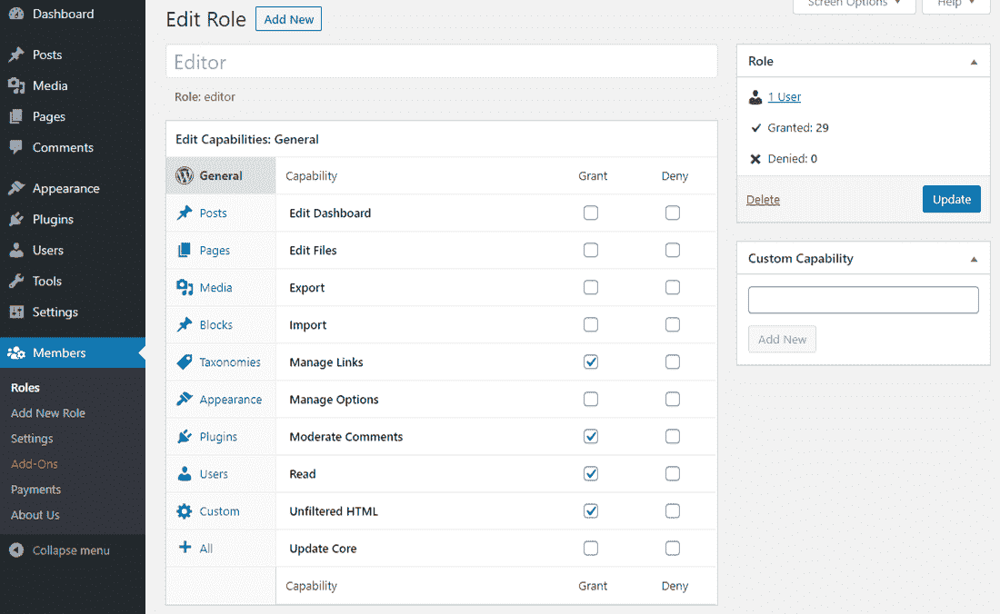

The ‘Edit Role’ panel in Members


在**编辑角色**面板中，您可以通过勾选和取消勾选相关复选框来授予或明确拒绝特定角色的能力。您还可以在这里向角色添加自定义功能。

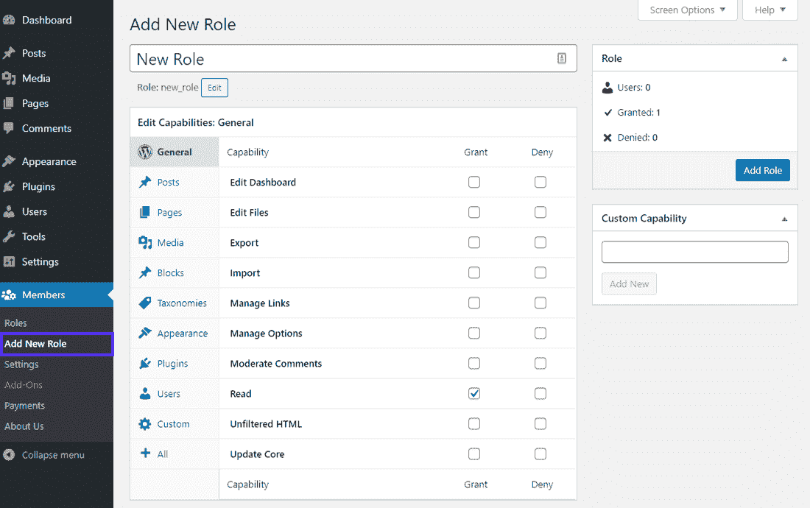

The ‘Add New Role’ panel in Members


单击 **Add New Role** 链接将带您进入一个类似的屏幕，您可以在这里创建一个新的角色，为它指定一个显示名称、一个 id 和它的一组功能。

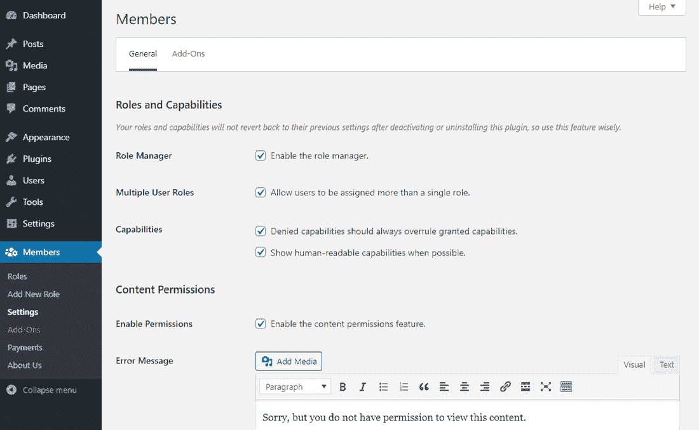

The ‘General Settings’ panel in Members


就像使用用户角色编辑器一样，您可以使用成员为用户分配多个角色。您还可以设置内容权限，将内容限制为只有特定角色的用户才能访问。


You can also enable ‘Private Site’ mode in Members


在这里，您可以将您的站点及其提要设置为私有。另外，你可以通过强制认证来限制外人访问 WordPress 的 REST API。

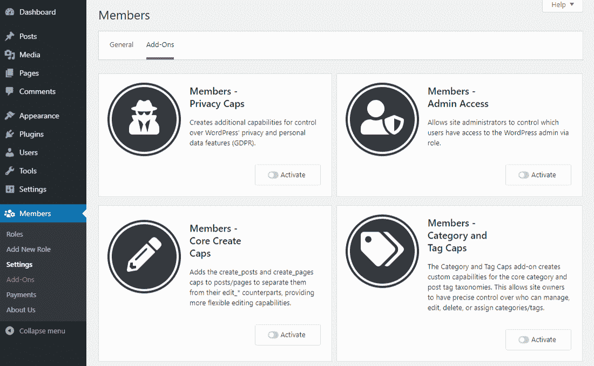

Various add-ons for the Members plugin


成员插件以其惊人的附加组件将自己与其他角色和功能插件区分开来。它们帮助你为你的网站添加大量的附加功能，比如用户隐私和个人数据管理( [GDPR](https://kinsta.com/blog/wordpress-gdpr-compliance/) )、与标签和类别相关的功能、建立角色层级等等。

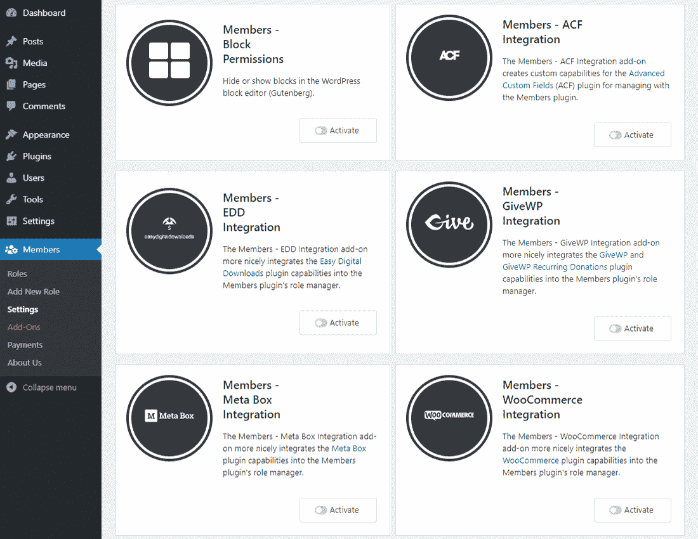

Members integrates with popular WordPress plugins


你可以将会员与许多流行的 WordPress 插件无缝集成。例如，您可以使用它为[高级定制字段(ACF)插件](https://kinsta.com/blog/advanced-custom-fields/)创建和管理定制功能。它集成的其他一些插件有[轻松数字下载](https://kinsta.com/blog/easy-digital-downloads/)、GiveWP、Meta Box 和 WooCommerce。

以会员为中心的附加功能(支付、订阅、电子邮件营销和高级内容保护)只在[的高级版本](https://memberpress.com/)上提供。

### WPFront 用户角色编辑器

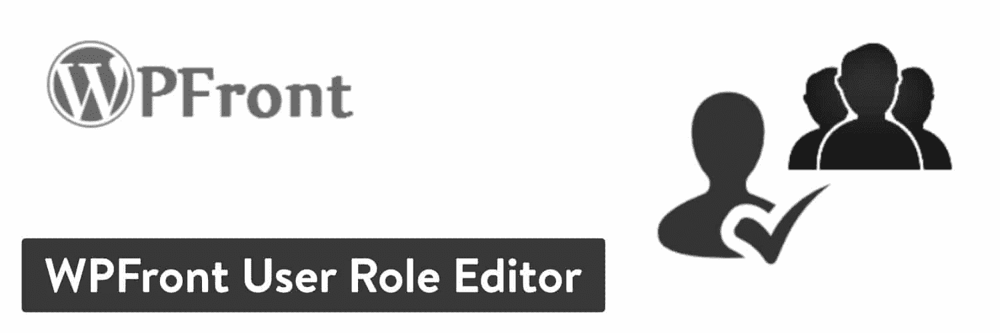

The ‘WPFront User Role Editor’ plugin


WPFront 用户角色编辑器帮助你在你的 WordPress 站点中创建、编辑或删除用户角色和功能。它的特性集就像之前讨论的插件一样，但是它有两个突出的特性。

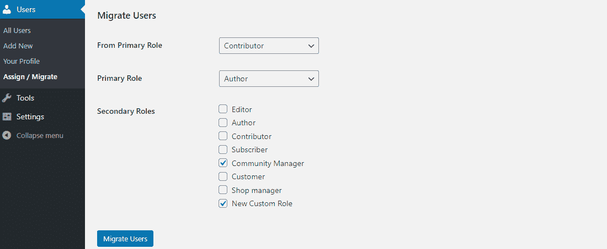在您的管理仪表板中进行筛选，并将属于特定用户角色的所有用户迁移到另一个角色。您甚至可以为您的用户分配次要角色。

如果您必须将站点上的大量用户从一个角色迁移到另一个角色，这个特性会非常方便。

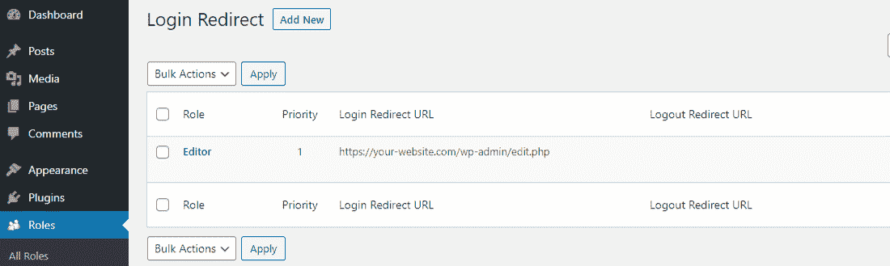

The ‘Login Redirect’ settings screen in WPFront User Role Editor


WPFront 用户角色编辑器的另一个有用特性是基于角色的**登录重定向**。例如，您可以在具有编辑角色的用户登录后将他们重定向到**帖子**页面。你也可以选择阻止他们访问`**/wp-admin**`页面和查看前端工具栏。

### 高级访问管理器


The ‘Advanced Access Manager’ plugin


高级访问管理器(AAM)是一个强大的 WordPress 插件，让你几乎可以控制你网站的每个方面。它包括 200 多个不同的特性，是为那些知道角色和功能如何工作的高级 WordPress 用户设计的。

与上面列出的插件相比，AAM 有更多的特性。但由于这是一个面向开发者的插件，对于初学者或中级用户来说不容易使用。

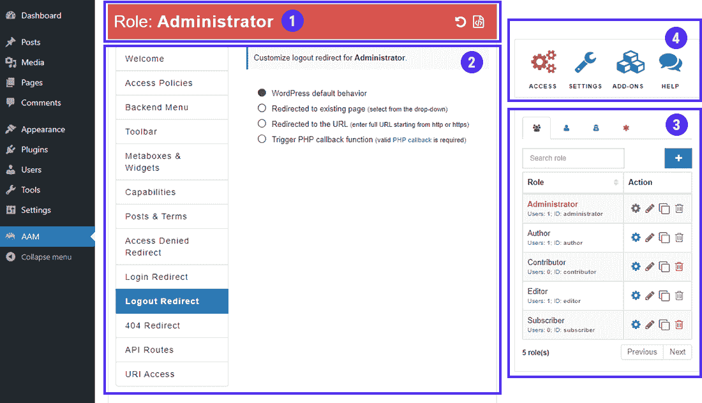

The main dashboard in Advanced Access Manager


您可以将 AAM 的主仪表板分成四个不同的区域。我在上面的图片中用下面的概述给它们编号。

1.  最上面的区域提到了当前正在考虑的“主题”。在这里，它是**角色:管理员**，但它可以是特定用户、匿名访问者或每个人的默认设置。
2.  主题下面的区域是主面板，在这里你有所有的设置来管理对主题的访问。
3.  第三个区域是**用户/角色管理者**。使用它的选项卡图标，您可以选择想要管理的内容。是用户角色、特定用户、匿名访问者，还是每个人的默认访问行为？
4.  第四个区域让您管理 AAM 的设置，安装其高级附加组件，并联系支持。

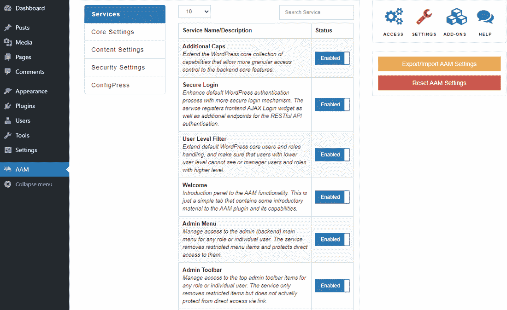

The ‘Settings’ panel in Advanced Access Manager


AAM 根据其行为和用途将其设置分为 5 组。

*   **服务**设置列出了您可以启用或禁用的所有 AAM 模块。通过有选择地加载模块，你可以保持你的网站优化。
*   **核心设置**区域允许你启用或禁用 AAM 和 WordPress 的一些核心功能。
*   **内容设置**与网站的内容相关(例如文章、页面、自定义文章类型)。
*   **安全设置**部分包括 AAM 安全登录功能的设置。截至目前，只有两种设置可用:**暴力锁定**和**每个用户一个会话**。
*   ConfigPress 是一个有趣的特性，可以让你用基于 INI 的代码[改变 AAM 插件](https://aamplugin.com/article/aam-configurations)的配置。

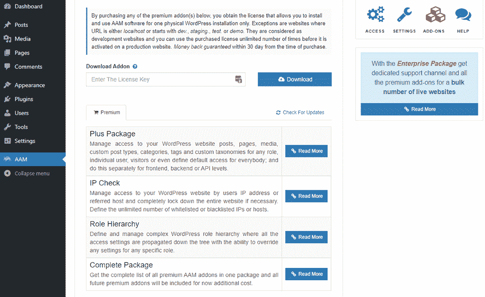

The ‘Add-ons’ panel in Advanced Access Manager


AAM 是一个面向开发者的插件，它超越了用户角色和功能。它能让你精确控制每个角色在你的网站上能做什么或不能做什么。

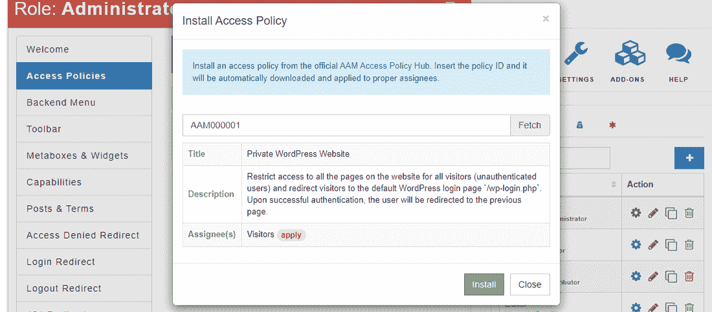

Install an ‘Access Policy’ for your website to keep it secure


你可以使用 AAM 为你的网站设置一个[访问&安全策略](https://aamplugin.com/reference/policy)。它定义了哪个角色，在什么条件下，可以访问你的网站上的各种资源。如果你想立即开始，你可以从 [AAM 访问策略中心](https://aamplugin.com/access-policy-hub)安装一个现成的访问策略。

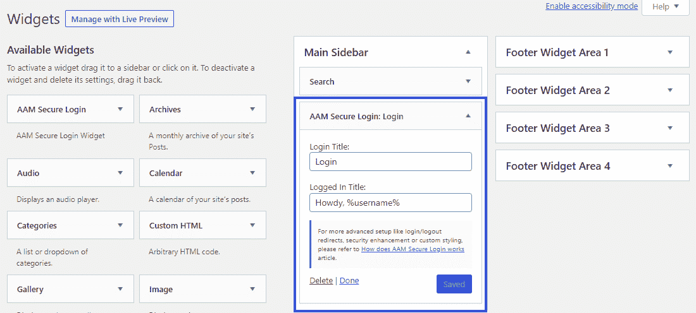

‘AAM Secure Login’ widget to add a frontend login form


AAM 允许您创建临时用户帐户和角色。这是一种与外部资源共享帐户的安全方式。临时用户帐户将在您设置的日期和时间后过期。对于临时角色，用户将在指定期限后被取消该角色。

涵盖 AAM 的所有特性超出了本文的范围。您可以参考 [Advanced Access Manager 的文档](https://aamplugin.com/reference/plugin)来了解更多有关其所有广泛功能的信息。

**提示:** [用户访问管理器](https://wordpress.org/plugins/user-access-manager/)是高级访问管理器的一个不错的替代品，尽管它的功能较少，也不经常更新。

### 用户切换

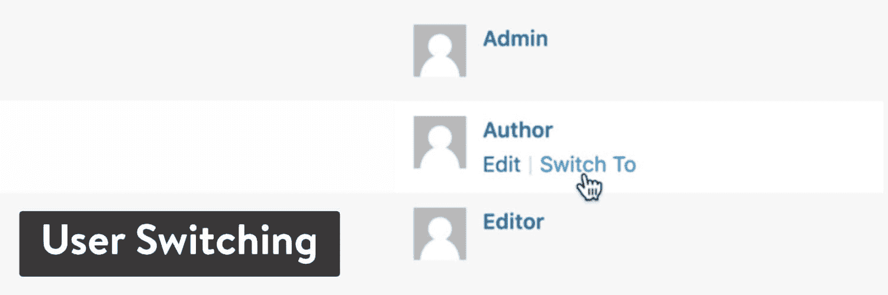

The ‘User Switching’ WordPress plugin


[用户切换](https://wordpress.org/plugins/user-switching/)只需点击一下，你就可以在不同的 WordPress 用户账户之间切换。如果你正在测试大量的用户角色和能力，使用这个插件将帮助你节省大量的时间。用户切换使用 [WordPress 的内置 cookie 认证系统](https://kinsta.com/blog/wordpress-cookies-php-sessions/)来记住你已经切换的账户，这样你就可以立即切换回他们。

安装并激活插件后，访问仪表板中的**用户**菜单。您将看到每个用户的**切换到**链接。单击此按钮将切换到您想要的用户。

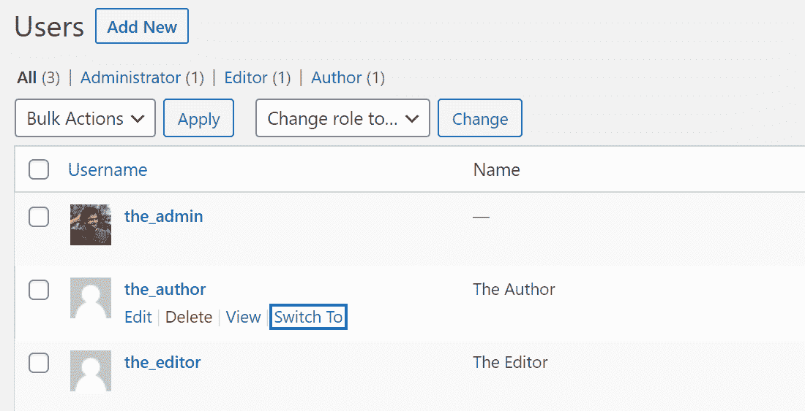

Click the ‘Switch To’ link to switch to the user you want


您可以点击仪表板或您的用户资料屏幕中的**切换回**链接，切换回您的原始帐户。

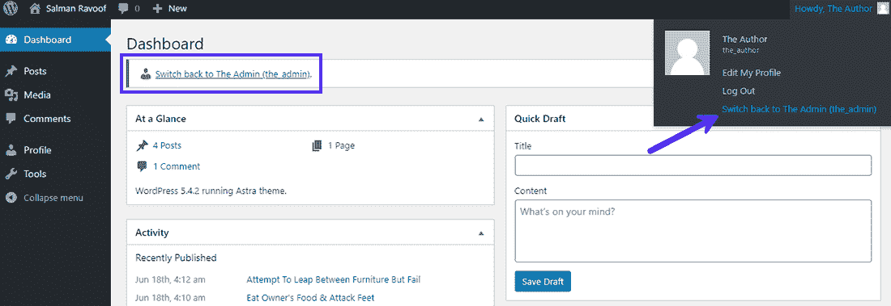

你也可以**暂时关闭**你的管理员账户，看看你的前端如何呈现给访客。

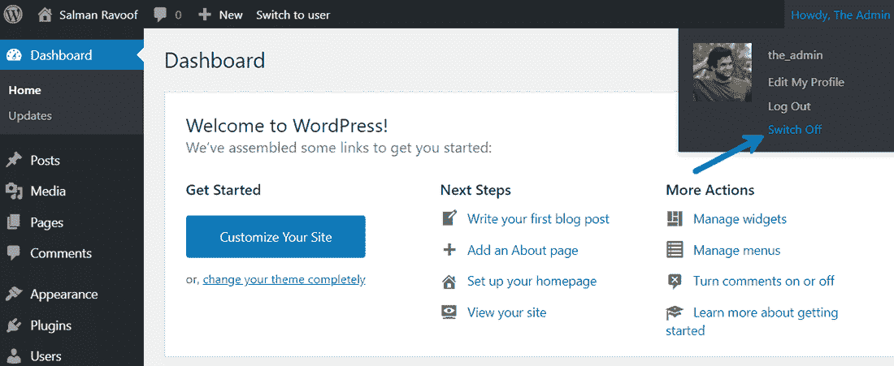

Switch your account on and off with a single click


作为一项安全措施，只有能够编辑用户的用户才能切换用户帐户。默认情况下，在 WordPress 单站点安装中只有管理员有这个能力，而在多站点网络中只有超级管理员有这个能力。

为了进一步简化用户切换，您可以安装[管理栏用户切换](https://wordpress.org/plugins/admin-bar-user-switching/)扩展，使**切换到用户**链接出现在您的管理栏中。

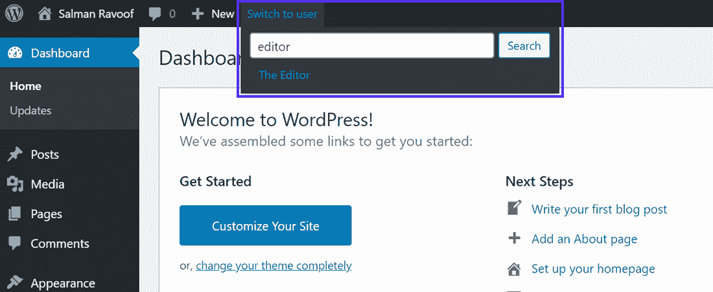

Adding the ‘Switch to user’ link to your admin bar


### 查看管理员身份

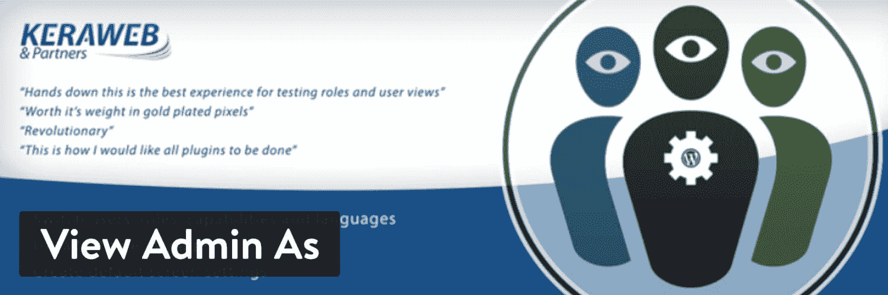

The ‘View Admin As’ WordPress plugin


[View Admin As](https://wordpress.org/plugins/view-admin-as/) 是一个高级用户切换插件，也包括角色和功能管理器。不像用户切换插件，你不需要安装一个扩展来添加用户切换菜单到你的管理栏。默认情况下，查看管理员身份会将其所有主菜单项添加到管理栏中。

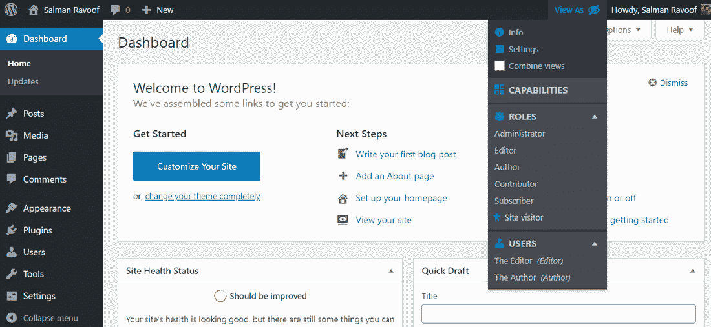

The ‘View As’ menu in the admin bar


您可以在现有用户或角色之间切换(通过获取他们的权能)，即使不存在具有这些角色的用户。点击**站点访问者**链接将把你带到站点的前端，在那里你可以作为普通用户测试站点功能，而不用离开你的浏览器标签。

查看管理员身份允许您临时更改自己的权能。因为它是非破坏性的，你不会失去你的主要能力。


Customize the capabilities temporarily for your current user


切换到用户帐户后，您可以直接从菜单中编辑他们的屏幕偏好设置和设置。您还可以分别在前端和后端切换语言/区域设置。

您不局限于一种视图类型，因为您可以组合各种选项并同时应用它们。

View Admin As 附带了两个可选模块，您可以根据需要启用它们。

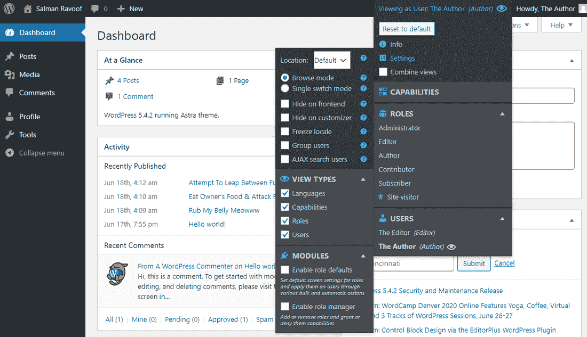

View Admin As settings and optional modules


第一个模块添加了**角色默认设置**功能，允许您为所有角色设置默认屏幕设置。您可以将这些默认值应用于角色、单个用户或未来的新用户。

第二个模块启用**角色管理器**功能。您在此模块中对角色和权能所做的任何更改都是永久性的。与其他角色编辑器插件不同，该模块允许您通过将角色自动迁移到另一个角色来删除分配给用户的角色。

您可以参考 [View Admin As documentation](https://github.com/JoryHogeveen/view-admin-as/wiki/Role-Manager) 来了解更多有关其广泛功能的信息。

## MyKinsta 用户角色

MyKinsta 的多用户功能允许您[在同一个帐户下创建和管理多个用户](https://kinsta.com/blog/manage-users-hosting-account/),方法是允许他们访问您的 Kinsta 帐户的独特方面或由 Kinsta 托管的特定网站。

有各种角色可供您选择，以根据您的需要定制用户访问权限。

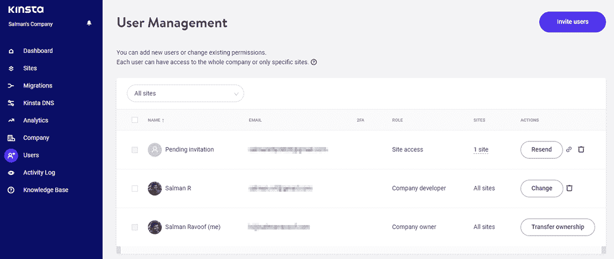

The ‘User Management’ screen in the MyKinsta dashboard


第一个用户默认获得[公司所有者角色](https://kinsta.com/help/mykinsta-user-roles/#company-ownership-role)。这是最强大的角色，也包含了一个[公司管理者](https://kinsta.com/help/mykinsta-user-roles/#company-administrator)的所有能力。

一次只能有一个公司所有者，但是如果需要，您可以[将角色](https://kinsta.com/help/transfer-company-ownership/)转移给另一个公司管理员。这样，你也将把你的 Kinsta 账户的所有权转移给新的公司所有者。

只有公司所有者可以请求 Kinsta 删除帐户。

您可以将其他用户角色分为 [2 个主要角色类别](https://kinsta.com/help/mykinsta-user-roles/#company-site-level-roles):

*   公司层面
*   站点级别

公司级角色允许用户访问 Kinsta 帐户的公司级详细信息，而站点级角色仅允许用户访问分配给他们的特定站点。当你[邀请新用户](https://kinsta.com/help/invite-user-to-company/)或修改现有用户时，你必须做出的第一个选择是是否给他们公司或网站的访问权限。

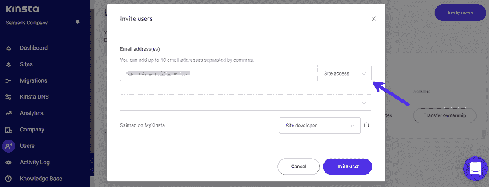

### 公司级角色

#### 公司管理员

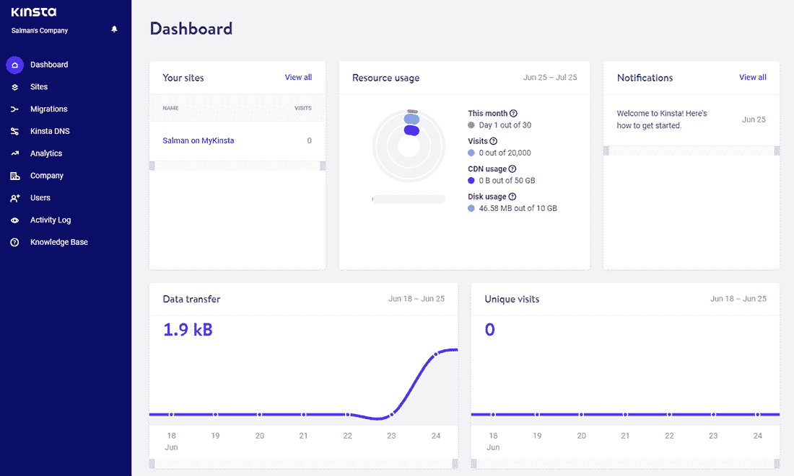

The ‘Company Administrator’ dashboard in MyKinsta


[公司管理员角色](https://kinsta.com/help/mykinsta-user-roles/#company-administrator)授予 MyKinsta 中最高级别的访问权限。它让用户完全控制金斯塔帐户及其所有网站。您应该只将此角色授予您信任的用户。

#### 公司开发者

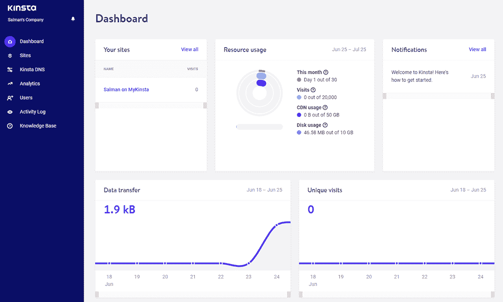

The ‘Company Developer’ dashboard in MyKinsta


[公司开发者角色](https://kinsta.com/help/mykinsta-user-roles/#company-developer)授予管理所有网站的权限，包括[删除它们](https://kinsta.com/help/delete-a-wordpress-site/)。因为 MyKinsta 用户角色是基于层次结构的，所以公司开发人员也可以管理站点级用户。但是，公司开发人员不能访问公司设置或账单详情。

#### 公司帐单

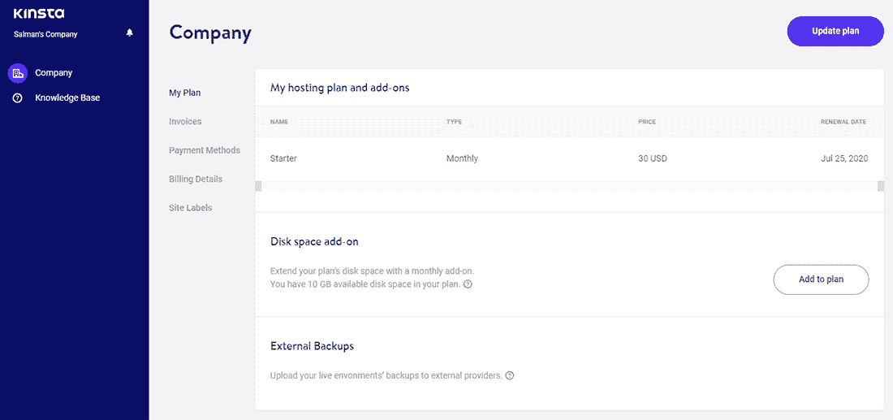

The ‘Company Billing’ dashboard in MyKinsta


[公司计费角色](https://kinsta.com/help/mykinsta-user-roles/#company-billing)仅授予查看计费详情和公司设置的权限。他们无法访问任何网站。具有公司计费角色的用户可以检查发票，启用[自动发票电子邮件](https://kinsta.com/help/manage-users-invoice-emails/)，以及更改公司详细信息，如地址和联系信息。

### 站点级角色

#### 网站管理员

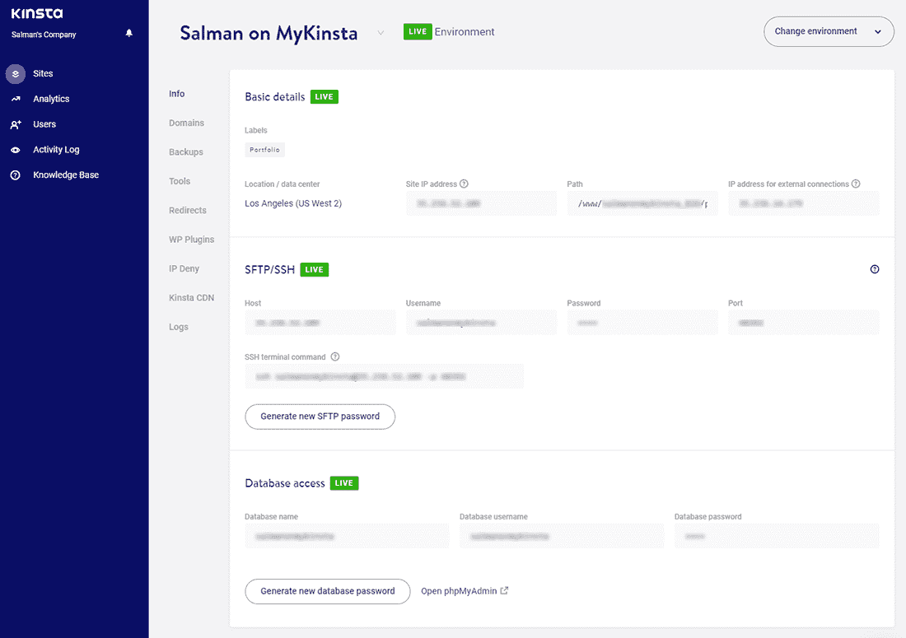

The ‘Site Administrator’ dashboard in MyKinsta


[站点管理员角色](https://kinsta.com/help/mykinsta-user-roles/#site-administrator)拥有对特定站点的完全访问权限，包括控制与该站点相关的所有环境。但是，他们不能从公司帐户中删除站点。您可以将同一用户指定为多个站点的站点管理员。

#### 网站开发者

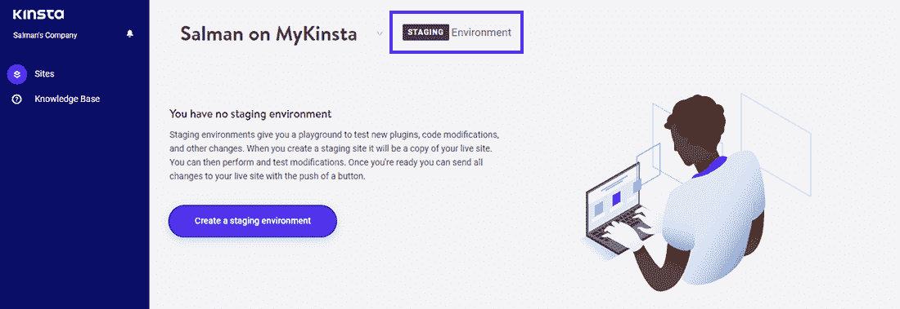

The ‘Site Developer’ dashboard in MyKinsta


[站点开发者角色](https://kinsta.com/help/mykinsta-user-roles/#site-developer)只能访问其指定站点的[临时环境](https://kinsta.com/help/staging-environment/)。他们可以在临时环境中做任何事情，但是他们不能删除临时环境或实时推送他们的更改。与站点管理员一样，您可以将同一用户指定为多个站点的站点开发人员。

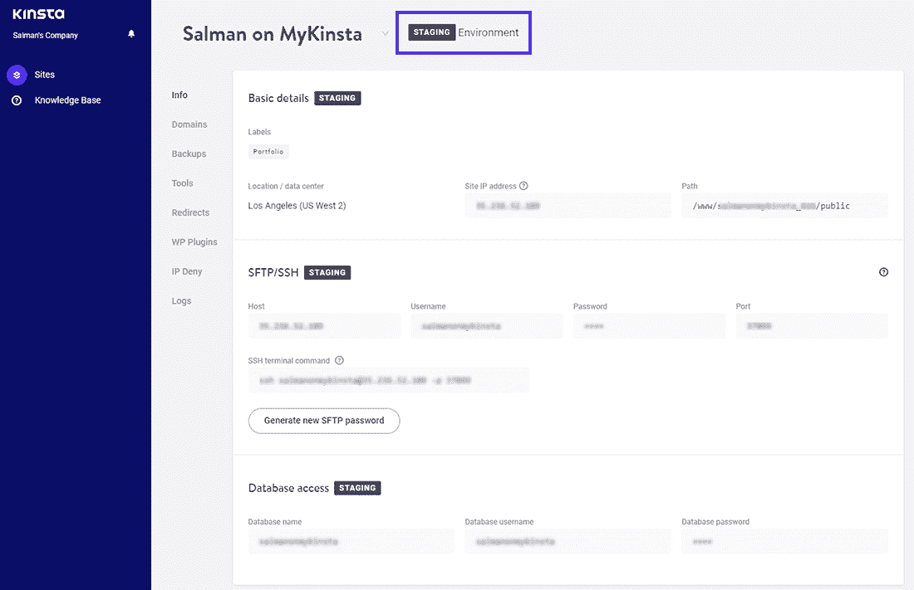

Site Developers can access the staging environment for the assigned site


你还可以看到，网站开发者无法访问 [MyKinsta 仪表板](https://kinsta.com/mykinsta)中的[分析](https://kinsta.com/help/mykinsta-analytics/)、用户管理和[活动日志](https://kinsta.com/knowledgebase/wordpress-error-log/)功能。

### MyKinsta 用户角色与 WordPress 用户角色

MyKinsta 和 WordPress 用户角色之间没有重叠。您可以相互独立地使用它们。

作为 Kinsta 帐户的所有者，MyKinsta 中的多用户角色功能可以帮助您轻松管理由经理、开发人员和会计组成的团队。它使得网络开发机构从一个单一的、强大的仪表板上管理他们所有客户的网站变得非常容易。

[Get control of your WordPress site and streamline your workflow with clearly defined user roles & capabilities 😌Click to Tweet](https://twitter.com/intent/tweet?url=https%3A%2F%2Fkinsta.com%2Fblog%2Fwordpress-user-roles%2F&via=kinsta&text=Get+control+of+your+WordPress+site+and+streamline+your+workflow+with+clearly+defined+user+roles+%26amp%3B+capabilities+%F0%9F%98%8C&hashtags=WordPressTips%2Cwebdev)

## 摘要

角色和能力是用户访问管理背后的基本概念。它们帮助您控制站点上所有用户可以执行的操作。它们也被许多插件和主题用来给 WordPress 核心添加非常有用的特性。

WordPress 自带一套角色和功能，但是如果你需要更多的灵活性，你可以自定义它们或者创建你自己的角色和功能。您可以用自己的代码或使用第三方插件来实现这一点。

理解什么是角色和能力，并学习如何管理它们，是掌握 WordPress 的关键步骤。今天就开始吧！

* * *

让你所有的[应用程序](https://kinsta.com/application-hosting/)、[数据库](https://kinsta.com/database-hosting/)和 [WordPress 网站](https://kinsta.com/wordpress-hosting/)在线并在一个屋檐下。我们功能丰富的高性能云平台包括:

*   在 MyKinsta 仪表盘中轻松设置和管理
*   24/7 专家支持
*   最好的谷歌云平台硬件和网络，由 Kubernetes 提供最大的可扩展性
*   面向速度和安全性的企业级 Cloudflare 集成
*   全球受众覆盖全球多达 35 个数据中心和 275 多个 pop

在第一个月使用托管的[应用程序或托管](https://kinsta.com/application-hosting/)的[数据库，您可以享受 20 美元的优惠，亲自测试一下。探索我们的](https://kinsta.com/database-hosting/)[计划](https://kinsta.com/plans/)或[与销售人员交谈](https://kinsta.com/contact-us/)以找到最适合您的方式。</kinsta-advanced-cta></kinsta-auto-toc>