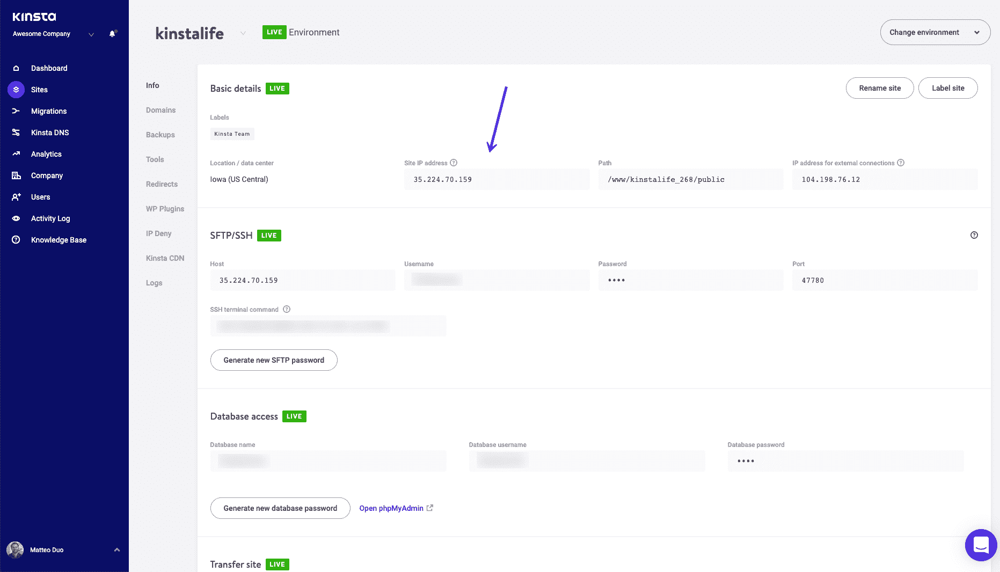
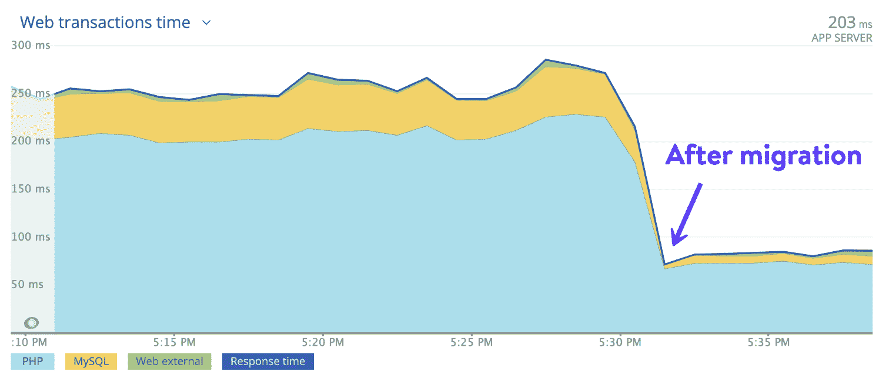
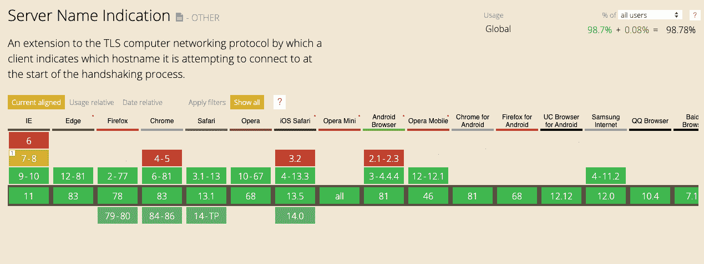
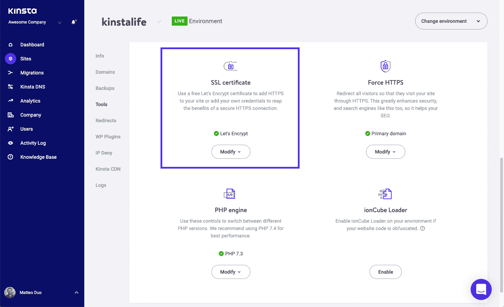

# 专用 IP 地址与共享 IP 地址(揭穿神话)

> 原文：<https://kinsta.com/blog/dedicated-ip-address/>

关于是否应该为托管的 [WordPress 使用专用 IP 地址还是共享 IP 地址的问题可能会引起很大争议。事实上，这是金斯塔经常提到的一个话题。](https://kinsta.com/blog/managed-wordpress-hosting/)

这部分是由于网络上关于专用 IP 及其工作方式的大量错误和过时信息。我们发现**在 99%的场景**、**中，你不需要专用 IP** 。虽然这可能与你读到的内容有冲突，但请原谅我们。

在本帖中，我们将解释什么是专用 IP 地址和共享 IP 地址，以及这两种配置之间的一些主要区别。

我们将揭穿一些你可能听说过的关于它们如何影响电子邮件、SSL、SEO 等事物的神话。

我们开始吧！

## 什么是 IP 地址？

首先，理解什么是 IP 地址很重要。IP 代表**互联网协议**，是分配给网络上每个域的地址(例如:216.58.217.206)。

它们使用所谓的 [DNS](https://kinsta.com/knowledgebase/what-is-dns/) 被映射到[域名](https://kinsta.com/blog/how-much-does-a-domain-name-cost/)。

> Kinsta 把我宠坏了，所以我现在要求每个供应商都提供这样的服务。我们还试图通过我们的 SaaS 工具支持达到这一水平。
> 
> <footer class="wp-block-kinsta-client-quote__footer">
> 
> 
> 
> <cite class="wp-block-kinsta-client-quote__cite">Suganthan Mohanadasan from @Suganthanmn</cite></footer>

[View plans](https://kinsta.com/plans/)

你可以把 DNS 想象成万维网的电话簿。当你在地址栏输入*Google.com*时，你的 [ISP](https://kinsta.com/knowledgebase/what-is-isp/) 会执行 DNS 查询，请求与该域名相关的[域名服务器](https://kinsta.com/knowledgebase/what-is-a-nameserver/)。

然后，到 IP 地址的映射由服务器在后台完成，这允许您[使用域名来访问它](https://kinsta.com/blog/choose-domain-name/)。如果没有域名系统，你将不得不输入类似“216.58.217.206”的内容才能进入谷歌。

那不是很有趣吗？！

How DNS works

目前，有两种类型的 IP 地址在网上使用，甚至在本地被 ISP 和设备使用，如你的家庭路由器。[它们是 IPv4 和 IPv6](https://kinsta.com/blog/ipv4-vs-ipv6/) :

*   IPv4 地址示例:*216.58.217.206*
*   IPv6 地址示例: *0:0:0:0:0:ffff:d83a:d9ce*

我们不会对这些进行过多的描述，但是你需要知道的是，互联网发展如此之快，以至于它需要更大的地址空间。基本上我们 IP 用完了！

开发 IPv6 的一个原因是为了确保网络可以不断扩展，并且可以分配新的 IP 地址。然而，当涉及到确定是否需要专用 IP 地址还是共享 IP 地址时，一切仍然适用于 IPv4 和 IPv6。

[使用专用 IP 还是不使用专用 IP🤔...就是这个帖子回答的问题⬇️ 点击推文](https://twitter.com/intent/tweet?url=https%3A%2F%2Fkinsta.com%2Fblog%2Fdedicated-ip-address%2F&via=kinsta&text=To+use+a+dedicated+IP+or+not+to+use+a+dedicated+IP+%F0%9F%A4%94...+that+is+the+question+that+this+post+answers+%E2%AC%87%EF%B8%8F&hashtags=webhosting%2Csitemanagement)

## 什么是专用 IP 地址？

一个专用的 IP 地址就像它听起来的那样:它意味着你的域被分配了一个不被任何其他域共享或使用的 IP 地址。这是你的域名在网络上的家。

你可以把这想象成一条专用电话线。一个专用的 IP 通常是由你的主机提供商分配给你的域名，或者是一个附加的，只需花很少的费用就可以购买。

## 什么是共享 IP 地址？

与专用 IP 地址不同，共享 IP 地址意味着您的域被映射到多个域之间共享的地址。如今，对于大多数主机提供商来说，共享 IP 非常普遍。

这是因为，对于许多配置来说，不需要专用的 IP 地址。然而，我们一会儿将深入探讨这背后的更多原因。

我们在 Kinsta 的所有托管计划都有一个共享的 IP 地址。你的 WordPress 站点的 [IPv4 地址](https://kinsta.com/help/ipv4-address/)可以在你的 [MyKinsta 仪表盘](https://kinsta.com/mykinsta)中找到。它位于您站点的**信息**选项卡下:

IPv4 address in MyKinsta

需要指出的一点是，仅仅因为你的网站使用共享 IP 地址，**并不意味着它使用共享主机**。

共享主机通常意味着您与服务器上的其他用户共享硬件和网络资源，这可能包括 IP 地址。虽然很多时候这两者是相辅相成的，但情况并非总是如此。

例如，在 Kinsta，我们使用 [LXD 托管主机，并为每个网站编排](https://kinsta.com/blog/boosting-wordpress-performance/#kinstas-infrastructure-and-the-new-gcp-computeoptimized-vms-c2)LXC 软件容器。

这意味着每一个站点都被安置在它自己的独立容器中，这个容器拥有运行它所需的所有软件资源(Linux， [Nginx](https://kinsta.com/knowledgebase/what-is-nginx/) ，PHP， [MariaDB](https://kinsta.com/blog/mariadb-vs-mysql/) )。**资源是 100%私有的，不会与任何人共享**，甚至不会在你自己的站点之间共享。

因此，虽然我们使用共享 IP 地址，我们不提供共享主机。事实上，我们的主机平台不属于任何传统的主机类别。我们的整个基础设施都建立在[谷歌云平台](https://kinsta.com/blog/google-cloud-hosting/)上，与传统的共享、VPS 或专用基础设施非常不同。查看更多我们的[高级功能](https://kinsta.com/features/)！

## 什么是外部 IP/地址代理？

你可能在某些主机提供商或代理服务器上看到的另一种 IP 地址(如 [Cloudflare](https://kinsta.com/blog/cloudflare-settings-wordpress/) 或 [Sucuri](https://kinsta.com/blog/sucuri-vs-wordfence/) )是[外部 IP 地址](https://kinsta.com/help/external-ip-address/)。

如果你是 Kinsta 的客户，你的 WordPress 站点的外部 IP 地址可以在 MyKinsta 仪表盘的站点的**信息**标签下找到:

External IP address in MyKinsta

这通常由使用负载平衡器或服务的主机使用，这些主机将您置于 [Web 应用防火墙(WAF)](https://kinsta.com/blog/what-is-a-firewall/#web-application-firewall) 之后。当您的站点连接到其他服务器时，其他服务器会看到该地址。

例如，*yourdomain.com*最初可能映射到“216.58.217.206”，但它通过外部 IP(如“104.16.1.2”)进行路由。这是连接到您的域的服务将使用的内容。

理解这一点很重要，因为如果你的网站连接到像 PayPal 这样的第三方[支付处理器，你可能需要向 PayPal 提供外部 IP 地址。这样，他们就可以在自己的终端将 IP 列入白名单。](https://kinsta.com/blog/woocommerce-payment-gateways/)

## 专用 IP 与共享:网络和站点速度

在这一点上，你可能会好奇你是否应该为你的 WordPress 站点使用一个专用的 IP 地址。

如果你在网上搜索，你可能会看到以下一些理由来支持专用知识产权:

1.  使用一个专用的网络 IP 使您能够通过其 IP 地址访问您的网站(因为它是唯一映射到该 IP 的域)。例如，如果你输入“64.233.187.99 ”,你会直接进入谷歌，因为这是它的专用 IP 地址。
2.  如果出于某种原因，你的 [DNS 仍然在传播](https://kinsta.com/blog/dns-propagation/)或者最近发生了变化，它还提供了另一种通过 FTP 访问你的服务器的简单方法。

在我们看来，**以上原因都不是真正的优势**。你最后一次通过 IP 地址访问网站是什么时候？可能永远不会。至于第二个原因，许多用户只需[编辑他们主机的文件](https://kinsta.com/knowledgebase/edit-hosts-file/)。这是一个更可靠的方法。

对于一些主机来说，专用 IP 确实是一种优势，因为它可以提供一种方法来防止 CPU 限制连接到该 IP 的长期运行的进程。然而，在我们看来，**主机不应该限制 CPU**。

事实上，我们从来没有在金斯塔节流使用。这正是我们使用隔离容器技术的原因，以确保每个客户都能获得他们所付费用的资源。

额外的端口访问是另一个可能的优势。然而，如今大多数主机都封锁标准端口，因为它们很容易被滥用，即使在发布专用 IP 时也是如此。这通常是因为他们仍在使用谷歌云平台或 AWS 等底层提供商，这些提供商不允许某些端口进行通信。

### 共享 IP 地址并不意味着网站性能降低

我们也有客户询问速度，因为它与专用 IP 和共享 IP 相关。使用共享 IP 地址不会影响您站点的**性能:**

Response time improvement after Kinsta migration

事实上，几乎每个迁移到 Kinsta [的客户都会看到巨大的性能提升](https://kinsta.com/blog/boosting-wordpress-performance/)！对于那些来自专用 IP 地址的人来说更是如此。
T3】

## 专用 IP 与共享:电子邮件

电子邮件是我们有时建议获得专用 IP 的一个领域。但是有一个转折。这通常只对大容量发件人有利(我们说的是每年超过 100，000 封电子邮件)。

即使这样，我们也不建议通过你的主机提供商获得一个专用的 IP。事实上，如果你使用一个专用的 IP 地址，只发送少量的电子邮件，这可能会伤害到你。

你想要一个专用的 IP 来发送你的 WordPress 站点的电子邮件或者交易邮件(比如电子商务销售邮件)的主要原因是 IP 有一个声誉。

当涉及到 ISP 和交付率时，这一点尤其重要。一个 IP 的声誉会影响你的投递率和到达客户收件箱的能力。

### 为什么您应该使用第三方电子邮件服务提供商

思考电子邮件如何与典型主机一起工作的一个好方法是，它就像共享主机。您被绑定到您的主机为外发电子邮件配置的 IP 地址。

如果系统出现问题，比如一个客户端突然发送垃圾邮件，这个 IP 地址就有可能被列入垃圾邮件黑名单。然后，你会突然任由你的主机摆布，等待它与提供商或 ISP 解决问题。这可能会导致你的电子邮件不稳定的发送和等待时间，这绝不是一件好事。

因此，**我们一直建议使用第三方解决方案来发送电子邮件**。永远不要使用你的主机提供商。T2 有许多免费的交易电子邮件服务，每月发送超过 10，000 封电子邮件，之后非常便宜。

## 注册订阅时事通讯

### 想知道我们是怎么让流量增长超过 1000%的吗？

加入 20，000 多名获得我们每周时事通讯和内部消息的人的行列吧！

[Subscribe Now](#newsletter)

第三方电子邮件营销软件平台和交易电子邮件服务的设置和配置方式可以极大地增加您点击客户收件箱的几率。他们还让整个团队夜以继日地工作，以确保电子邮件到达目的地，并且他们的 IP 地址不会被列入黑名单。

此外，当涉及到外包电子邮件时，您应该以不同的方式考虑共享 IP 地址。大多数第三方电子邮件服务会向使用专用 IP 地址发送邮件的用户收取额外的月费。

然而，如果你没有处理大量的电子邮件，这可能会伤害你。一些负面报道会损害你的声誉。来自电子邮件服务的共享 IP 通常是“预热的”，随时可以使用，并由专家密切监控，以确保高交付率。

事实上，我们如此频繁地讨论这个话题，以至于我们有一整篇博文专门讨论这个话题。看看你应该选择第三方电子邮件服务而不是使用你的主机的其他原因。

## 专用 IP 与共享:SSL 和安全性

现在让我们深入了解一下您应该知道的关于专用 IP 地址和共享 IP 地址的知识，因为它与 [SSL](https://kinsta.com/knowledgebase/how-ssl-works/) 有关。这是一个在过去十年里发生了巨大变化的领域。

过去，如果你需要一个 [SSL 证书](https://kinsta.com/help/how-to-install-ssl-certificate/)(例如，[加密你的电子商务网站](https://kinsta.com/knowledgebase/woocommerce-ssl/)，你必须[购买一个专用 IP](https://kinsta.com/help/technical-faq/#is-a-dedicated-ip-necessary-for-an-ssl-certificate) 。然后**服务器名称识别(SNI)** 被开发出来。

SNI 允许主机提供商在一个 IP 地址上使用多个 SSL 证书。基本上，它向访问者发送与请求的服务器名称相匹配的证书。

最初开发时，最大的问题是浏览器支持。然而，那些日子来了又去了。根据“我可以使用…”的数据显示，[浏览器对 SNI](https://caniuse.com/#feat=sni) 的支持接近 99%:

SNI browser support chart

唯一不支持 SNI 的浏览器是那些在 Windows XP 上运行 Internet Explorer 的浏览器，以及最过时版本的 Android、Chrome 和 iOS 浏览器。据 [NetMarketShare](https://www.netmarketshare.com/operating-system-market-share.aspx?options=%7B%22filter%22%3A%7B%22%24and%22%3A%5B%7B%22deviceType%22%3A%7B%22%24in%22%3A%5B%22Desktop%2Flaptop%22%5D%7D%7D%5D%7D%2C%22dateLabel%22%3A%22Trend%22%2C%22attributes%22%3A%22share%22%2C%22group%22%3A%22platformVersion%22%2C%22sort%22%3A%7B%22share%22%3A-1%7D%2C%22id%22%3A%22platformsDesktopVersions%22%2C%22dateInterval%22%3A%22Monthly%22%2C%22dateStart%22%3A%222019-04%22%2C%22dateEnd%22%3A%222020-03%22%2C%22segments%22%3A%22-1000%22%7D) 报道，Windows XP 只占有 1.4%的市场份额，在 Windows XP 上运行 IE 的用户就更少了。

### 对 SSL 使用共享 IP

简单地说，除非你为从未升级过系统的企业客户托管 WordPress 站点，否则你不需要担心专用 IP。事实上，你不应该使用它，因为安全问题，比如旧浏览器中的 [POODLE 漏洞](https://www.us-cert.gov/ncas/alerts/TA14-290A)。

在 Kinsta，我们利用 SNI 技术，允许您将您的[自定义 SSL 证书](https://kinsta.com/help/transfer-ssl-certificate/)和[免费 SSL 证书](https://kinsta.com/blog/free-ssl-certificate/)添加到我们的 Let's Encrypt 集成中。

你可以在你的网站上[启用 HTTPS，只需在你的](https://kinsta.com/blog/http-to-https/) [MyKinsta 仪表盘](https://my.kinsta.com/)上点击一个按钮:

MyKinsta tool to enable SSL certificate

如今，**共享 IP 地址对于 SSL** 来说工作得很好。[安全](https://kinsta.com/secure-wordpress-hosting/)也不再是一个问题，感谢我们的隔离集装箱技术。你可以查看我们的[免费恶意软件删除](https://kinsta.com/knowledgebase/malware-security/)过程了解更多信息。

如果你在一个装有 [Cloudflare](https://kinsta.com/knowledgebase/install-cloudflare/) 或 [Sucuri](https://kinsta.com/blog/sucuri-firewall/) 的 WAF 后面，使用它们的共享 IP 可以帮助保护你的隐私，因为它有助于隐藏你的原始 IP。让我们更仔细地看看这个。

Cloudflare 通过其全球分布的 [anycast 网络](https://kinsta.com/blog/sucuri-firewall/#cdn)路由您的站点流量和访问者请求。当发出请求时，它会返回 Cloudflare IP 地址，而不是您的原始 IP 地址，从而防止攻击者能够直接攻击您的服务器。

当您的域由 Cloudflare 代理时，您属于共享 Cloudflare 网络的 IP 地址池。因此，该平台不支持专用 IP 地址。

## 专用 IP 与共享:SEO

另一个热门话题是专用 IPs vs 共享 IP[如何影响 SEO](https://kinsta.com/blog/wordpress-seo) 。首先，重要的是要记住，当讨论任何与 SEO 相关的事情时，我们只能分享我们所学到的以及业内其他人记录的东西。

厌倦了低于 1 级的 WordPress 托管支持而没有答案？试试我们世界一流的支持团队！[查看我们的计划](https://kinsta.com/plans/?in-article-cta)

正如许多人所知，谷歌没有一个神奇的清单来准确解释什么行为是对的，什么行为是错的。然而，它确实提供了[搜索要点](https://developers.google.com/search/blog/2022/10/search-essentials)指南——并且没有专门的 IP 地址。

事实上，网络上的许多顶级品牌(谷歌、塔吉特、CNN、可口可乐)都在使用共享 IP 地址来托管多个域名。一个简单的反向 IP 查找揭示了这一点。

此外，Kinsta 的一些团队成员已经做了 10 多年的 SEO，我们已经迁移了数千个 WordPress 站点。简而言之，当涉及到高质量的 WordPress 托管和 SEO，一个**专用的 IP 很可能不会帮助你**。我们会解释原因。

### 共享 IP 高质量托管的重要性

注意，我们说的是“高质量的 WordPress 托管”。

这是因为如果你使用低质量的主机，你使用的 IP 类型可能是一个问题，这允许垃圾邮件或被黑的网站继续在其平台上运行。

就像电子邮件信誉一样，IP 可能会被列入黑名单，尽管通常是通过域名而不是 IP。不过，别担心。谷歌实际上相当聪明，通常明白一个网站可能在共享主机上，你无法控制共享相同 IP 或 IP 子网的网站。

另一个分享你的 IP 的网站甚至可能受到负面搜索引擎优化攻击。

谷歌考虑了许多不同类型的恶意软件和垃圾邮件，它知道人们正在使用共享的 IP 地址。

### 如果您的共享 IP 被列入黑名单，该怎么办

尽管谷歌不会轻易将你列入黑名单，但有时你可能会无意中被列入黑名单，即使你没有恶意或不当行为。

如果你的 IP 被列入黑名单，你可以采取一些措施来尝试“取消黑名单”。

确认网络和邮件服务器配置正确后，第一步是转到黑名单页面，查看它是否提供了解决问题的详细信息。例如，它可能会要求您纠正您的 DNS 记录或 SMTP 横幅的某些内容。

下一步是扫描您的计算机和网络的病毒或漏洞。如果没有检测到补丁或问题，并且您确定您的计算机是干净的，请联系黑名单网站请求删除。然后仔细按照他们的 IP 地址删除说明。

自行删除一般可以让你快速将自己从黑名单中删除，假设这是你的 IP 地址第一次被列入黑名单。基于时间的删除是一个自动化的过程，其中您的 IP 地址在一周或两周(或更长时间，取决于犯罪的程度和频率)后被删除。

在 Kinsta，我们有主动和被动措施来阻止攻击和恶意行为。我们监控正常运行时间，留意 [DDoS 攻击](https://kinsta.com/blog/what-is-a-ddos-attack/)，扫描恶意软件，并安装硬件防火墙。

所有站点都受到全天候监控和保护。我们立即关闭垃圾邮件发送者，并在我们发现他们时尽快修复被黑的网站。我们也有一些我们不允许的网站，如我们的[服务条款](https://kinsta.com/legal/terms-service/)中所述。因此，即使我们使用共享 IP 地址，风险也很小，甚至不存在。

### 切换 IP 如何影响 SEO

我们从一些客户那里听到的另一个担忧是，当你改变 IP 时，SEO 可能会受到怎样的影响。如果你改变主机服务提供商，或者甚至[实现一个安全服务](https://kinsta.com/blog/cloud-security/)比如 Cloudflare 或者 Sucuri，谷歌将会看到一个新的 IP 地址连接到你的域名。

然而，[我们已经迁移了各种各样的站点](https://kinsta.com/wordpress-migration/)，从小型企业到财富 500 强公司。基于这一经历，我们可以向您保证，这不是您需要担心的事情。

如果你想在排名方面得到更多的保证，这里有一段马特·卡茨(Matt Cutts )的话:

> “我很高兴地确认，这句话在 2003 年是正确的，现在仍然是正确的。指向虚拟托管域的链接与指向专用 IP 地址上的域的链接被视为相同。

这是来自谷歌网站管理员分析师约翰·穆勒的另一个确认:

> “都是相同的 IP 地址，这对我们来说真的不是问题。站点在同一个 IP 地址上是很常见的。 **互联网就是这么运作的** *。许多 cdn(内容交付网络)对不同的网站使用相同的 IP 地址，这也很好。”*

大公司一直在更换主机提供商和 IP。如果排名受到损害，他们不会这样做，Cloudflare 和 Sucuri 等安全解决方案甚至不会存在！

### 可以迁移一个专用 IP 吗？

在我们谈论更改 IP 的话题时，我们看到的一个常见问题是，您是否可以将专用 IP 迁移到新主机。答案是否定的。

这样做的原因是因为你不能为同一个域名拥有两个托管账户。每次[你把你的域名迁移到一个新的服务器](https://kinsta.com/blog/migrate-wordpress-site/)，IP 地址就会改变。因此，如果你在一个服务器上有一个专用的 IP，你不能在主机提供商之间移动它。你需要一个新的 IP 地址。

如果你使用共享主机，但想购买一个专用的 IP 作为附件，这是需要考虑的，我们不推荐。我们将在下一节进一步探讨这个问题。

## 专用 IP 与共享 IP:定价

说到 WordPress 托管和 IP 地址配置，另一个要考虑的方面是定价。专用 IP 和共享 IP 的费用取决于你的主机提供商，以及服务时间的长短。

通常，专用 IP 的成本高于共享 IP，从每月几美元到每月 100 多美元不等。一些提供商包括具有高性能计划的专用 IP，或者让您购买一个作为附加功能。

重要的是要记住，购买一个专用的 IP 作为共享主机的附加服务与为专用主机付费是不一样的。此外，并非所有提供商都提供专用 IP。

相反，你可以在不提供共享主机的主机上使用共享 IP。在 Kinsta，我们不提供共享主机，我们所有的计划默认都有共享 IP。然而，如果你想在 Kinsta 上有一个专用的 IP，我们确实提供了一个每月 200 美元的负载平衡器插件，它确实带有一个独特的专用 IP。有关负载平衡器插件的更多信息，请联系我们在 MyKinsta 的销售团队。

仅仅根据价格来选择专用 IP 地址还是共享 IP 地址没有太大意义。相反，重要的是要考虑你选择的计划类型的成本中包括什么，以及网站主机的质量。

[Did you know that 99% of the time, you don’t need a dedicated IP? 😲 Find more debunked IP myths in this guideClick to Tweet](https://twitter.com/intent/tweet?url=https%3A%2F%2Fkinsta.com%2Fblog%2Fdedicated-ip-address%2F&via=kinsta&text=Did+you+know+that+99%25+of+the+time%2C+you+don%E2%80%99t+need+a+dedicated+IP%3F+%F0%9F%98%B2+Find+more+debunked+IP+myths+in+this+guide&hashtags=webdev%2Chosting)

## 摘要

围绕专用 IP 和共享 IP 地址，有许多神话和误传。希望这篇文章有助于提供一点洞察力，让你知道哪个是托管你的 WordPress 站点的更好选择。

概括一下:

*   仅仅因为 WordPress 主机使用共享 IP 地址并不意味着它提供共享主机服务。这两者是有区别的。我们在 Kinsta 这里默认使用共享 IP 地址，但我们不提供共享主机。
*   使用共享的 IP 地址不会损害你的站点的[速度。](https://kinsta.com/learn/speed-up-wordpress/)
*   如果你要发送大量的电子邮件，专用 IP 可以给你带来好处。然而，我们从不建议使用您的网络主机发送电子邮件。所以，在选择主机的时候，这不是你应该关心的事情。
*   为 SSL 使用专用 IP 已经成为过去。主机现在允许你上传自定义的 SSL 证书，有些还提供[免费证书，让我们加密](https://kinsta.com/blog/free-ssl-certificate/)(多亏了 SNI 技术)。
*   如果你正在使用高质量的[应用程序](https://kinsta.com/application-hosting/)、[数据库](https://kinsta.com/database-hosting/)和[管理的 WordPress 主机](https://kinsta.com/wordpress-hosting/)(比如 Kinsta)，你不需要担心[你的 SEO](https://kinsta.com/blog/wordpress-seo/) 受到影响。
*   您不能在主机提供商之间迁移您的 IP。不过，换个 IP 也没问题。财富 500 强公司一直都是这么做的。

我们很想听听你的想法。或者有什么问题，欢迎在下面评论！

* * *

让你所有的[应用程序](https://kinsta.com/application-hosting/)、[数据库](https://kinsta.com/database-hosting/)和 [WordPress 网站](https://kinsta.com/wordpress-hosting/)在线并在一个屋檐下。我们功能丰富的高性能云平台包括:

*   在 MyKinsta 仪表盘中轻松设置和管理
*   24/7 专家支持
*   最好的谷歌云平台硬件和网络，由 Kubernetes 提供最大的可扩展性
*   面向速度和安全性的企业级 Cloudflare 集成
*   全球受众覆盖全球多达 35 个数据中心和 275 多个 pop

在第一个月使用托管的[应用程序或托管](https://kinsta.com/application-hosting/)的[数据库，您可以享受 20 美元的优惠，亲自测试一下。探索我们的](https://kinsta.com/database-hosting/)[计划](https://kinsta.com/plans/)或[与销售人员交谈](https://kinsta.com/contact-us/)以找到最适合您的方式。