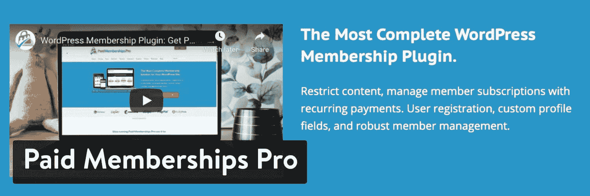
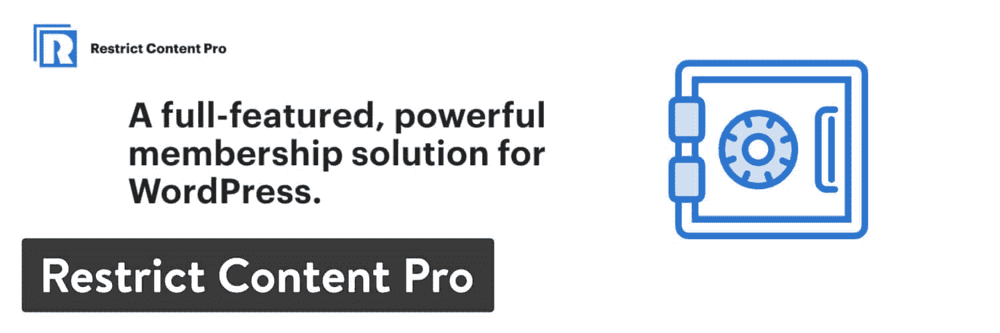
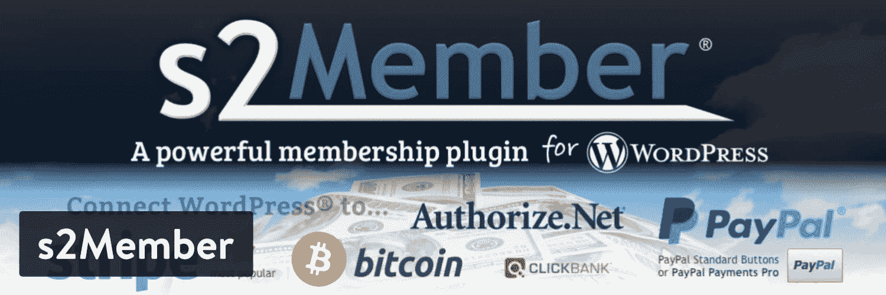
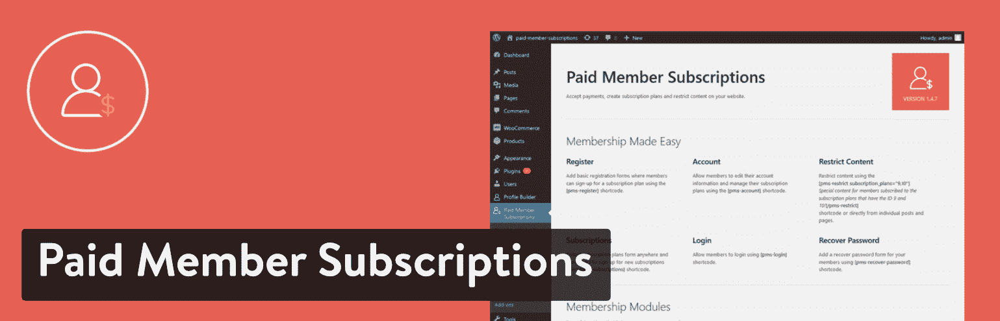
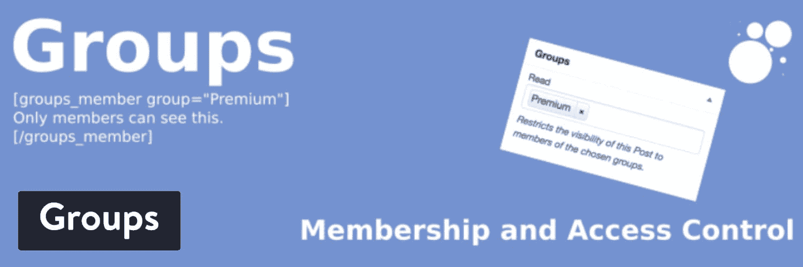
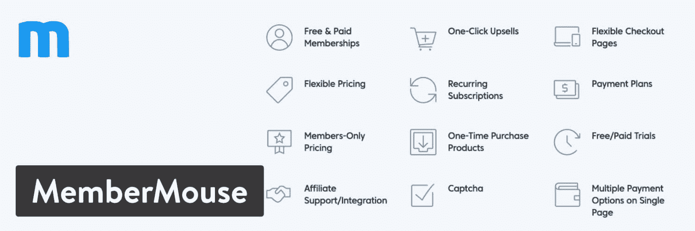
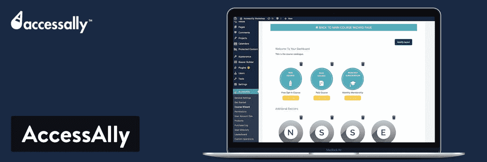
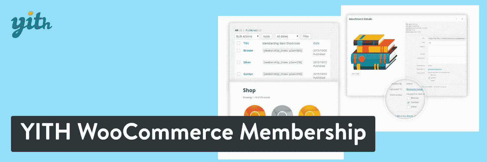
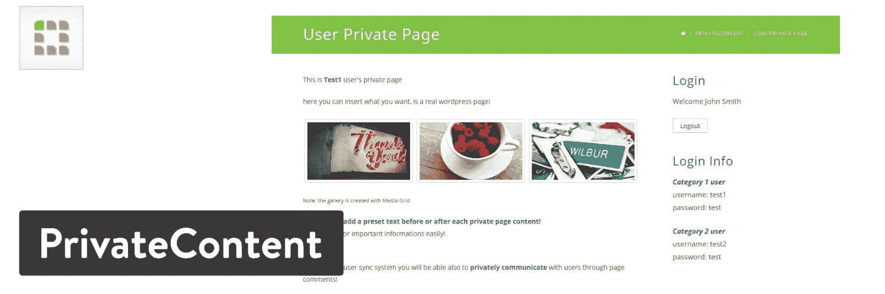

# 25 个 WordPress 会员插件来获取经常性收入

> 原文：<https://kinsta.com/blog/wordpress-membership-plugins/>

网上能不能[赚钱？当然可以。容易吗？不完全是。然而，获得被动收入的最持续盈利的方式之一是会员制网站。为了建立一个会员网站，了解一下**最好的 WordPress 会员插件是很重要的。**](https://kinsta.com/blog/how-to-monetize-a-blog/)

通过会员插件，你可以屏蔽部分或全部内容，允许用户在支付前期或经常性费用后访问。这是稳定现金流的关键:[经常性收入](https://kinsta.com/blog/recurring-revenue-model)。当你销售单个产品或服务时，每个客户都需要确信他们应该再次购买，无论是通过[电子邮件营销](https://kinsta.com/blog/email-marketing-best-practices/)、[废弃购物车信息](https://kinsta.com/blog/abandoned-cart-email/#abandoned-cart-email-templates)还是社交媒体。

收集自动支付的公司(想想 Dollar Shave Club，网飞，或者你的有线电视公司)不需要考虑太多的销售和营销。他们更专注于让现有客户满意(可能不是有线电视公司)。

像这样的循环会员往往会抓住一些从不使用服务或产品的客户，但他们会继续付费。

简而言之，会员网站可以意味着赚大钱，只要你找到正确的利基，努力专注于提供优质的产品/服务，并选择最好的 WordPress 会员插件来指引你前进。

## 你可以建立什么类型的会员网站？

一个会员制网站的想法仅仅是一个想法。显然，建立一个有信誉的、盈利的会员制企业需要更多的时间、金钱和努力。话虽如此，能够让想法四处跳跃，让创意火花四溅，还是很不错的。这里有一些你可以建立的会员网站类型的想法。

*   有一个或多个主题的在线课程。课程可能包括项目、[文档(如 pdf)](https://kinsta.com/blog/wordpress-pdf-viewer-plugins/)视频和测验。
*   **产品会员资格，**定期或一次性向会员发送数字或实物商品。“每月一盒”俱乐部是这种会员类型的流行例子。
*   **基于服务的会员计划**，会员[每月或每年支付一定数量的服务](https://kinsta.com/blog/saas-marketing/)。在线或电话辅导计划就是一个很好的例子。
*   **一个定期计划**，客户支付短期会员费。例如，戒烟计划可能会在三个月后结束。
*   **一个在线社区**，里面有[论坛](https://kinsta.com/blog/wordpress-forum-plugins/)、[实时聊天](https://kinsta.com/blog/wordpress-live-chat-plugin/)、文章以及其他不向公众开放的资源。用户支付会员费，就可以完全与他人聊天，了解利基领域的话题。
*   **一次搞定所有事情的会员资格**，会员支付固定或每月的费用来获得你在网站上提供的所有东西。这并不常见，但你可能会发现，你的一些电子商务客户愿意支付高昂的持续费用，以基本上获得你所销售的一切，或大部分。对于较小的在线商店，我们最喜欢这样。
*   **滴灌模式**，根据成员在计划中的进度，内容会慢慢向他们透露。新的滴滴内容按月发布也很常见。想想在线课程或高级博客。许多[播客](https://kinsta.com/blog/wordpress-podcast/)也开始这样做，在剧集之外提供额外内容。

[从内容点滴工具到课程建设，您建立会员网站所需的一切(&您的经常性收入💰)就在这里⬇️ 点击推文](https://twitter.com/intent/tweet?url=https%3A%2F%2Fkinsta.com%2Fblog%2Fwordpress-membership-plugins%2F&via=kinsta&text=From+content+drip+tools+to+course+building%2C+everything+you+need+to+build+up+your+membership+site+%28%26amp%3B+your+recurring+revenue+%F0%9F%92%B0%29+is+right+here+%E2%AC%87%EF%B8%8F&hashtags=wordpress%2Cmakemoneyonline)

## 在 WordPress 成员插件中有一些特定的功能可以寻找吗？

你打赌。好消息是，我们今天强调的大多数 WordPress 成员插件涵盖了大多数必需的特性。浏览下面的列表仍然是一个好主意，记下你认为最重要的项目，然后根据你的需求做出你的插件决定。

> 需要在这里大声喊出来。Kinsta 太神奇了，我用它做我的个人网站。支持是迅速和杰出的，他们的服务器是 WordPress 最快的。
> 
> <footer class="wp-block-kinsta-client-quote__footer">
> 
> 
> 
> <cite class="wp-block-kinsta-client-quote__cite">Phillip Stemann</cite></footer>

[View plans](https://kinsta.com/plans/)

*   内容滴流工具
*   数字下载支持
*   定期订阅
*   用户登录和配置文件管理
*   多级订阅
*   社交登录
*   优惠券和折扣
*   电子邮件营销和沟通工具
*   课程建设工具
*   支持多个支付网关
*   模板或[主题来设计您的会员网站](https://kinsta.com/blog/wordpress-membership-theme/)
*   成员管理
*   支持论坛和实时聊天等领域
*   开发人员的 API 访问
*   快速短代码或按钮来限制你的网站上的任何内容

上面的列表只是对必备功能的一个尝试，但这是一个好的开始。总的来说，你一定会发现所有 WordPress 会员插件中的一些独特的工具。也就是说，继续寻找最好的 WordPress 会员插件。

## 2022 年 25 个最佳 WordPress 会员插件

虽然我们建议通读整篇文章，查看特性，测试每个 WordPress 成员插件，但是下面有一个选项的快速列表。

 现在，继续阅读，了解我们最喜欢的 WordPress 会员插件的优缺点。这些没有特定的顺序。

### 1.终极会员 Pro WordPress 插件——29 美元

无论你运行什么类型的网站，终极会员插件都给你提供了销售订阅和会员资格的工具。它与 WooCommerce 集成，用于半自动计费和常规产品订阅。它被宣传为 CodeCanyon 上最畅销的 WordPress 会员插件之一，这一说法得到了证实。

Ultimate Membership Pro WordPress Plugin

多种级别的会员资格可以帮助您的用户选择他们想要支付的费用，而免费和试用设置可以让客户体验您所提供的服务。

终极会员专业仪表板看起来光滑，组织良好，即使是一个插件有这么多的功能。当谈到 [WordPress 插件](https://kinsta.com/best-wordpress-plugins/)时，有时人们会忘记[开发者支持](https://kinsta.com/blog/wordpress-support/)有多重要。

Ultimate Membership Pro 插件是一个例子，说明了一个专注的开发人员如何在更新、回答用户问题和提供用户真正想看到的可靠功能方面发挥巨大作用。

此外，开发者偶尔会对插件打折，所以要留意那些。它已经是一个负担得起的会员插件，如果你想多付一点钱，未来的客户支持也会随之而来。

#### 终极会员的优势:

*   它允许你限制页面，比如 WordPress 文章和页面。
*   每天、每周或每月配置定期付款。
*   让您的客户使用他们的[社交账户](https://kinsta.com/blog/wordpress-social-media-plugins/)登录。
*   隐藏部分[导航菜单](https://kinsta.com/blog/wordpress-menu-plugins/)，直到用户支付会员费。
*   滴你的内容，并发出电子邮件通知。
*   使用[自定义字段](https://kinsta.com/blog/advanced-custom-fields/)使您的注册表单更适合您的网站。
*   这个插件可以让你整合九个流行的电子邮件营销服务。
*   您可以限制成员共享他们的帐户。
*   与 [BuddyPress](https://kinsta.com/blog/wordpress-forum-plugins/#buddypress) 整合为一个完整的在线社区。
*   终极会员专业插件有一个令人难以置信的功能列表合理的价格。
*   众所周知，开发者致力于增加功能和响应用户评论。
*   部分内容限制意味着你所要做的就是复制并粘贴一个短代码来阻止你的一点内容。这对于显示预告内容非常有用。
*   一长串[支付网关](https://kinsta.com/blog/woocommerce-payment-gateways/)可供选择，比如 PayPal、Stripe、Authorize.net 和 Mollie。Ultimate Membership Pro 是为数不多的拥有如此多支付选项的 WordPress 会员插件之一。
*   您可以使用条件逻辑、特殊字段和自定义重定向来创建一个完全定制的会员网站。
*   古腾堡模块可用于即时添加块的东西，如滴内容。

#### 终极会员 Pro 的缺点:

*   尽管这个插件组织得很好，但它仍然包含了大量的特性。这可能会吓到一些只需要最基本的会员插件的人。
*   该系统可以被翻译成任何语言，但你不能运行一个多语言会员网站。
*   支持团队反应很快，但是对于如此大的功能集没有多少教程。许多用户也报告了来自支持团队的恶劣态度。这都是基于观点的，但是我注意到类似的评论很多次了，以至于我认为这是一个缺点。
*   注册和登录表单并不都是可定制的。你可以换出标题照片，但这是主要的编辑方式。这对开发人员来说不应该是个问题，但是初学者会被给出的内容所困扰。

### 2.Supsystic 会员-免费(付费延期)

Supsystic 的会员资格是一个免费的 WordPress 会员插件，有一些额外的高级扩展。例如，限制内容扩展的单站点许可价格为 39 美元。

Membership by Supsystic WordPress plugin

其他一些扩展包括:

*   按用户角色限制内容
*   伍尔科贸易公司
*   社交网络整合
*   电子商务
*   捐款
*   社交登录

至于主要特性，我们很高兴看到您可以配置定制表单、成员目录和实时通知，而不必为额外的扩展付费。

插件提供私人消息和完整的朋友以及开箱即用的跟踪系统也很有用。

#### Supsystic 会员的优势:

*   你会收到一个完全免费的会员插件。这些功能非常丰富，因此您有可能不需要为扩展付费。如果需要扩展，您只需到网站上购买一个或两个，或者您需要的任何数量。
*   额外的扩展都是独立的，所以没有必要为你不使用的功能付费。这提供了令人印象深刻的灵活性。
*   用户可以从前端注册和登录，管理员有定制登录表单的工具。
*   成员可以管理他们的个人资料并与其他人交朋友。我们喜欢为您的成员建立私人档案的想法，让他们感觉在您的社区中拥有一个小“房间”。他们可以上传图片，更新自己的简历，并监控谁在联系他们。
*   免费版本中提供了点滴内容支持。从第一天开始建立你的点滴内容策略，你应该只需要在未来做一些小的修改。该插件使大部分过程自动化。
*   组织团体来建立你的社区，并给你的成员权力来管理这些团体。
*   通过快速聊天功能向用户发送私人消息。
*   从 BuddyPress 导入数据，并与流行的社区插件集成，以增强您的会员管理的有效性。
*   使用角色限制赋予某些成员比其他成员更多的内容。

#### Supsystic 会员资格的缺点:

*   一些竞争对手在常规插件中提供订阅和社交登录等功能。然而，对于 Supsystic 的会员来说，每个额外的高级功能需要支付大约 39 美元。
*   营销工具(如电子邮件营销)是有限的。
*   当你使用免费版本的插件时，客户支持是有限的，如果不是不存在的话。不幸的是，“只为插件付费”的商业模式让开发者没有动力去监控客户的问题，因为大多数用户不会定期付费。
*   后端缺乏前端的清晰和流畅的用户界面。

### 3.ARMember 免费，高级版 29 美元

arm member 有一个漂亮的免费演示部分，用于测试注册表单、登录表单、会员设置表单和个人资料模板等项目。

你也可以选择免费的和付费的[版本](https://codecanyon.net/item/armember-complete-wordpress-membership-system/17785056)，这取决于你创建会员网站的立场和你需要的功能。

ARMember WordPress plugin

溢价定价是一次性费用，ARMember 仪表板几乎和它们一样干净。用户可以看到他们的个人资料、密码设置、会员信息和交易。

免费版本是开发人员提供的较新的服务，但它可以建立一个完整的会员网站，提供多种计划、订阅、支付选项等。

常规插件大约有 12 个附件，包括以下内容:

*   PayPal Pro 支付网关
*   [关联公司](https://kinsta.com/affiliate-academy/what-is-affiliate-marketing/)专业整合
*   基石整合
*   莫利支付网关
*   扎皮尔积分
*   主动市场活动集成

#### 会员的优势:

*   有些附加软件是免费的，而有些则需要付费。好处是真正的会员功能都被打包到实际的插件中。这些附加组件用于特殊情况。
*   该开发团队的每一项产品都是经济实惠的。您可以选择下载免费插件，试用高级版本，并选择您需要的附加组件，所有这些都是低价的。
*   指定您想要限制的内容，并更改用户在未付费时看到的消息。
*   该插件带有一个强大的表单生成器，可以定制从字段到颜色的所有内容。
*   你可以完全自由地决定何时以及如何发布你的内容。
*   根据用户的计划，使用[自定义重定向](https://kinsta.com/blog/wordpress-redirect/)将用户发送到其他地方。
*   使用短代码限制您的内容。这意味着你可以灵活地屏蔽网站上的所有内容。你所要做的就是将[短码](https://kinsta.com/blog/wordpress-shortcodes/)复制并粘贴到你想要限制的区域。
*   支持免费和付费试用。
*   支持多种支付网关，如 PayPal、Authorize.net 和 2Checkout。
*   相当多的第三方插件和附加组件与 ARMember 插件集成。其中包括 BuddyPress、 [WooCommerce](https://kinsta.com/blog/woocommerce-tutorial/) 、 [Mailchimp](https://kinsta.com/blog/how-to-use-mailchimp/) 和[视觉作曲](https://kinsta.com/blog/wordpress-page-builders/#visual-composer)。

#### ARMember 的缺点:

*   自动消息可以使用一些改进，因为有一些语法问题和模糊的语言。
*   由于这是在 CodeCanyon 上销售的，如果您需要 12 个月的支持，价格就会上涨。你也可能会发现，如果你使用大量的附加软件，它们会变得越来越贵。与其他插件相比，它还是相对便宜的。
*   您需要[在每个单独的站点](https://kinsta.com/blog/wordpress-multisite/)上激活多站点，而不是通常的网络激活。

### 4.learn dash–起价 159 美元

LearnDash 是一个学习管理系统(LMS)，这意味着它专注于帮助你为你的用户创建课程。它仍然是一个 WordPress 会员插件，但是如果你有[视频课程](https://kinsta.com/blog/video-hosting/)或者类似的东西，你更有可能选择 LearnDash。

(建议: [9 个创建和销售在线课程的最佳 WordPress LMS 插件](https://kinsta.com/blog/wordpress-lms-plugins/))

LearnDash WordPress plugin

公司推荐它用于高等教育、职业培训和 WordPress 项目。成员资格工具包括创建包和订阅的选项。

您可以设置任何适合您学校的定价模式，并发送续订提醒。退款保护是一个独特的功能，它只在一个时间段内安排内容，从而减少退款的机会。

#### 学习的好处:

*   使用漂亮的模板快速推出和销售您的在线课程。
*   将最流行的支付网关链接到您的网站，从 [PayPal](https://kinsta.com/blog/stripe-vs-paypal/) 到 2Checkout，集成了 300 多个其他支付网关。
*   在学员完成课程的过程中，为他们颁发证书和奖品。
*   每当会员在您的课程中完成一项活动时，使用互动触发器与他们互动。
*   根据时间表利用点滴内容。
*   创建多层课程，将课程分成课程和测验。
*   使用测验来看看你的学生做得有多好。
*   退款保护将你的内容锁定在一个时间表中，这样人们就不会注册你的课程，大吃大喝，然后在第二天取消。这是一个旨在防止游戏系统的功能，所以它应该会增加您的收入。
*   course builder 是市场上最全面的工具之一，具有拖放元素、大纲和可重复使用的内容，可复制到网站的其他地方。
*   该插件还有一个动态的[论坛区](https://kinsta.com/blog/wordpress-forum-plugins/)供用户互相聊天。

#### LearnDash 的缺点:

*   插件文档可能会更好。
*   虽然 LearnDash 为你的课程格式化和组织一切，但网站设计完全取决于你。一些没有多少 WordPress 经验的人可能会有困难(下面是如何[定制你的 WordPress 主题](https://kinsta.com/blog/how-to-customize-wordpress-theme/)和一个精选的[最佳主题列表](https://kinsta.com/best-wordpress-themes/))。
*   竞争对手有更强的报道能力。
*   比普通会员插件贵。
*   LearnDash 中打包了几个成员特性，但是缺少一些元素。因此，LearnDash 创建了与 PaidMembershipsPro 和 MemberPress 等更注重成员资格的插件的集成。这是很好的集成，但它会花费你更多的钱。

### 5.member press–每年 149 美元起

[MemberPress](https://www.memberpress.com/) 提供了一个完整的会员套件，其中包含无限制的会员支持、数字产品、点滴内容和优惠券。价格远远高于一般的 WordPress 会员插件，但是你通常不会得到那么多独特的功能。

MemberPress WordPress plugin

例如，[附属程序](https://kinsta.com/affiliates/)内置在 MemberPress 中，而[条纹整合](https://kinsta.com/blog/stripe-for-wordpress/)不需要额外的附加程序。

我们喜欢 MemberPress 为那些有课程或社区准备上传或推出。149 美元的价格点是从正常的每年 249 美元的价格打了折扣。折扣对于 MemberPress 来说是很常见的，所以值得注册订阅时事通讯，看看优惠券是什么时候发布的。

该计划是一次性付款，但升级和支持每年更新。如果你需要额外网站上的插件，或者如果你想添加独特的支付网关或出售公司账户，价格就会上涨。

#### MemberPress 的优势:

*   基本计划提供附属皇家商业版，通常零售价为 85 美元。
*   整合一些最流行的电子邮件营销工具，如 Mailchimp 和 AWeber。
*   有一个[会员专用区](https://kinsta.com/blog/wordpress-user-registration-plugins/)供讨论和分享想法。
*   使用优惠券和提醒来保持会员活跃。
*   设置访问规则并配置成员资格组。
*   价格是一次性付款，除非你想继续支持或更新。它实际上是一个价格合理的软件，因为你有很多功能。
*   有一个 14 天的退款保证，给你一点时间来测试软件，并决定你是否喜欢它。
*   MemberPress 插件提供了一个设计精美的[定价页面](https://kinsta.com/blog/wordpress-pricing-table-plugins/)，供您定制自己的品牌并展示给客户。使用它不需要任何编码知识。
*   可扩展性是 MemberPress 的一个强项，因为它可以连接各种有用的服务和产品，如 [Zapier](https://kinsta.com/blog/woocommerce-zapier/) 、AffiliateWP 和 Amazon Web Services。

#### MemberPress 的缺点:

*   你必须为 Plus 版本付费(每年 249 美元)，才能获得像 Authorize.net 和 BuddyPress 集成这样的东西。
*   对于一些想要更简单更便宜的东西的人来说，价格可能太高了。
*   可扩展性并不适合所有人。添加两个或三个或十个附加组件来创建一个会员制网站的想法听起来并不吸引人，尤其是当你不得不为其中一些付费的时候。
*   MemberPress 对前端设计进行了改进，但许多项目看起来仍然过时。

### 6.付费会员-免费(高级会员每年 297 美元)

[付费会员 Pro](https://www.paidmembershipspro.com/) 是一个 WordPress 会员插件，拥有令人难以置信的客户支持和广泛的功能来启动你的会员网站。

Paid Memberships Pro WordPress plugin

付费会员专业版提供免费的插件下载和大量的附加组件。该插件具有相当简单的会员网站的基本功能，而附加组件使其更上一层楼。一些附加组件包括:

*   Mailchimp 集成
*   邮件诗人集成
*   网络商务整合
*   注册助手以添加结帐和配置文件字段
*   电子邮件模板
*   新闻整合
*   对非管理员隐藏管理栏

大多数合法的会员网站会选择付费版本，因为它包含了核心功能。话虽如此，免费版确实提供了 19 个免费插件，所以它可能对较小的会员网站有用。

Plus 计划对普通企业来说最有意义，但是开发者可能需要无限计划，它支持你想要的任意多的站点。这个售价 597 美元。

#### 付费会员的好处:

*   这个免费插件适用于那些简单的会员网站。它提供基本的视频支持和文档，以及 19 个免费插件。对于非常小的会员网站和那些需要在升级前测试插件的人来说，这似乎是一个有用的计划。
*   以不同的价格设定您自己的会员级别。你可以列出这些计划，这样新用户就能清楚地知道他们要支付的费用。
*   集成六个支付网关，如 CyberSource、PayPal、 [Braintree 或 Stripe](https://kinsta.com/blog/stripe-vs-braintree/) 。
*   设定灵活的定价和试用。试用版是完全可定制的，并允许到期日期。
*   你可以直接从插件中[插入和定制广告](https://kinsta.com/blog/banner-ad-sizes/)。
*   向您的成员发送电子邮件通知。
*   按照其中一个计划，你可以在任意多的网站上运行插件。
*   可定制的报告对于检查你的会员和预测你的网站产生多少现金流是很方便的。
*   60 多种高级附加组件确保您永远不会缺少某项功能。
*   30 天退款保证缓解了初次购买的紧张情绪。
*   内容限制非常灵活。限制自定义帖子类型、单页和内容的某些部分。
*   您可以生成完整的成员目录，为您的成员提供定制个人资料和管理订阅所需的能力。
*   该插件完全兼容 [WordPress multisite](https://kinsta.com/wordpress-multisite-hosting/) 。

#### 付费会员的缺点:

*   大多数设计定制需要了解 [CSS](https://kinsta.com/blog/wordpress-css/) 。对于[开发商](https://kinsta.com/blog/web-developer-salary/)，这是一个利好。但是对于初学者来说，你会被给你的设计所束缚。
*   价格有点高，而且是每年定期支付。
*   进一步的支付以附加产品的形式存在。许多网站所有者不需要任何插件，但其他人会发现他们最好使用一个包含核心插件所有特性的不同插件。

### 7.限制内容专业版——每年 99 美元

[Restrict Content Pro](https://restrictcontentpro.com/) 首先是一个内容隐藏插件，但它也包括会员管理和订阅包。

Restrict Content Pro WordPress plugin

这么多人喜欢 Restrict Content Pro 的原因是它的各种内置集成。与其他 WordPress 会员插件相比，它的价格处于中间位置，而且很高兴你有四个软件包可供选择。

#### 限制内容专业版的优势:

*   每个付款计划包含 13 个免费附加组件。
*   内置的集成包括 Stripe、Braintree、2Checkout、Authorize.net 和 PayPal 网站支付专业版。
*   导出成员和支付列表的 CSV。
*   创建无限制的套餐，轻松管理您的所有成员。
*   发送欢迎电子邮件，以及其他几种类型的自动成员消息。
*   WooCommerce 的整合确保了你可以[出售你的会员资格](https://kinsta.com/blog/woocommerce-subscriptions/)，甚至在你的网站上出售其他产品。
*   终身定价选项可从长远来看节省资金，并消除任何经常性费用。
*   开发者支持很突出，高级用户可以访问插件的 API。

#### 限制内容专业版的缺点:

*   你不能用核心插件下载内容。
*   用户升级降级有点混乱。
*   如果你不每年支付会员费，还不清楚是否会提供任何客户支持或附加更新。
*   你会发现许多功能只包含在附加组件中。这意味着更复杂的会员网站需要多个部分，其中许多是不可用的，除非你支付更高的价格计划。
*   支持文档是深入的，但是 Restrict Content Pro 除了电子邮件标签系统之外缺少其他支持渠道。
*   没有内置的[附属系统](https://kinsta.com/affiliate-academy/affiliate-marketing-business/)。
*   该插件集成了一些主要的页面生成器(如 Elementor，)，但是样式功能却很一般。有时，它只将您当前的内容复制到构建器中，并允许您添加新的[页面构建器内容](https://kinsta.com/blog/wordpress-page-builders/)，而不支持对先前内容的任何编辑。

### 8.ProfilePress(每年 99 美元起)

ProfilePress 是一个现代简单的 WordPress 会员插件，用于接受一次性和定期付款。你可以通过 [Stripe & PayPal](https://kinsta.com/blog/stripe-vs-paypal/) 收取会员费并出售订阅。

ProfilePress

PofilePress 有一个强大的[内容保护功能](https://kinsta.com/knowledgebase/what-is-web-scraping/)，用于限制对您网站上任何内容的访问，包括帖子、页面、[自定义帖子类型](https://kinsta.com/blog/wordpress-custom-post-types/)和导航菜单。它还允许您创建前端用户注册和登录表单。

ProfilePress 提供了大量的附加组件来扩展您的会员功能。其中包括“社交登录”，允许用户使用他们的社交网络帐户轻松注册/登录到您的网站，“用户审核”，让您决定是否批准新注册的用户，“[双因素身份验证](https://kinsta.com/blog/wordpress-two-factor-authentication/)”和“电子邮件确认”，确保新注册的用户在登录之前确认他们的电子邮件地址。

### 信息

ProfilePress 中的插件不是独立的插件；相反，它们是基于您的许可层站点下载的插件中可用的功能。

#### ProfilePress 的优势

*   转换优化的结帐形式，可以提高您的会员收入。
*   付费墙功能，显示内容预览，并提供成为会员以查看内容。
*   创建基于百分比或统一费率的优惠券代码和折扣，以激励用户订阅您的付费计划。
*   在 WordPress 后端为管理员提供直观的订单和客户管理，以管理订单和查看收入报告。和成员管理他们的帐户，订单和订阅的前端。
*   一个托管的沙盒演示来玩这个插件，14 天的退款保证给你一点时间来测试这个软件，并决定你是否喜欢它。

#### ProfilePress 的缺点

*   免费版本收取 2%的条纹费，你需要升级到专业的贝宝网关。
*   您的许可计划越高，可供您使用的附加组件数量就越多。
*   对于一些想要更简单更便宜的东西的人来说，价格可能太高了。

### 9.S2 会员-免费(专业版 89 美元)

s2Member 在它小小的免费会员插件中加入了强大的力量。不仅如此，高级版本的销售是一次性费用，而不是经常性付款。

s2Member WordPress plugin

s2Member 免费版有内容保护和 PayPal 按钮，用于将一些会员功能集成到您当前的网站中。

对于任何更复杂的东西，我都推荐使用专业版，尤其是因为价格合理。在考虑 WordPress 会员插件时，这是一个很好的选择。

#### S2 会员的优势:

*   管理 [WordPress 角色和功能](https://kinsta.com/blog/wordpress-user-roles/)。
*   设置开放注册和内容限制。
*   高级版可以让你将[与 PayPal Pro、Stripe](https://kinsta.com/blog/stripe-vs-paypal/) 、Authorize.net 和 ClickBank 整合。
*   高级版也支持 [WordPress multisite](https://kinsta.com/blog/wordpress-multisite/) 和一个公共成员列表。
*   提供优惠券。
*   与您最喜欢的邮件列表服务整合。
*   插件内置了几个安全措施，比如防止暴力登录和独特的 IP 限制。
*   您可以在将媒体上传到网站时保护媒体。这意味着用户将很难抓取你的视频或音频流。
*   所有注册和登录字段都是可定制的。
*   您购买的插件会附带一个安全徽章。这并不能让你的网站更加安全，但是可以建立用户的信任。
*   开发人员可以通过 API 访问设置事件驱动的通知。

#### S2 成员的缺点:

*   s2Member 是一个不太现代的 WordPress 成员插件。
*   集成是好的，但我希望看到更多的支付网关和可能的联盟计划的支持。
*   s2Member 与 WooCommerce 不兼容。
*   如果能在插件的免费版本中获得无限数量的付费会员级别，那就太好了。这看起来不像是会员插件的额外功能。

### 10.WooCommerce 会员资格(每年 199 美元)

WooCommerce 是市场上排名第一的 WordPress 电子商务插件。然而，一些网站所有者希望通过添加一些会员项目来扩展常规的产品销售功能。

WooCommerce Memberships WordPress Plugin

WooCommerce Memberships 插件可以做到这一点，将你的内容和产品与一个完整的会员系统结合在一起。你可以出售或分配会员资格，根据顾客身份授予访问权限，并将你的商店变成一个购物俱乐部。

#### 网络商务会员的好处:

*   创建一个购买俱乐部，除非你是会员，否则一些产品是隐藏的。
*   用特别折扣奖励您的会员。
*   在会员区显示所有会员优惠。
*   导入或导出成员列表。
*   向成员发送消息并保存这些消息的模板。
*   您可以限制对帖子、页面、自定义帖子类型的访问，甚至可以使用短代码阻止帖子或页面上的部分内容。
*   用户报告说，开发人员提供了个性化的支持和有见识的回答。
*   功能列表会不断增加，因此每隔几个月或每年，您都有可能看到一两个新功能来帮助您的业务。

#### 网络商务会员的缺点:

*   WordPress+woo commerce+woo commerce 会员的组合产生了几个移动的部分。对某些人来说可能太复杂了。
*   这个费用相当高，因为 WooCommerce 的会员费是 199 美元。如果你想每年更新一次，这也是一笔经常性的费用。
*   消息系统缺乏向所有会员发送电子邮件的能力。
*   你通常只能使用插件中已经包含的特性。你可以尝试在另一个 WooCommerce 扩展中找到一个缺少特性的解决方案，但是没有专门为这个工具制作的附加组件。
*   我们希望看到对会员申请的高级支持。特别是，设计独特的应用程序表单，并在整个网站中重复使用。

### 11.付费会员订阅——免费(高级会员每年 69 美元起)

付费会员订阅是一个非常容易设置，但是很强大的会员插件。作为我们最喜欢的会员插件之一，您可以管理无限的订阅计划，限制内容(帖子、页面或自定义帖子类型)，并几乎立即获得报酬。它还[与 WooCommerce](https://kinsta.com/blog/woocommerce-plugins/) 整合。

Paid Member Subscriptions plugin

虽然核心插件是免费的，但它附带了大量扩展其功能的附加组件。你会发现像折扣代码，电子邮件提醒，能够设置固定期限的会员资格或以附加形式支付你想要的价格。

更先进的支付网关，如 Stripe 和 PayPal Pro，以及发票或内容滴漏，都可以在 Pro 版本中找到。这个插件的伟大之处在于它没有复杂的设置页面，核心插件足以建立一个完整的会员网站并开始接受支付。对于其他所有东西，你可能需要一个附加组件。

#### 付费会员订阅的好处:

*   使用短代码创建登录、注册和帐户页面。
*   创建无限订购计划
*   基于成员资格或登录状态限制内容。
*   提供了“按需付费”的定价功能，让您的用户可以选择每月向您发送多少信息。
*   支持免费试用和注册费用。
*   与 WooCommerce 集成，允许管理员限制产品查看、购买和向会员提供特殊产品价格。
*   您可以使用短代码在站点的任何地方放置登录模块。
*   您可以自定义的电子邮件模板。
*   您可以导出成员数据以在其他地方使用或发送给您的利益相关者。
*   基本报告告诉你赚了多少钱，哪些会员需要重新订阅。
*   “阻止帐户共享”功能可阻止您的成员向朋友和家人提供登录凭据。它通过阻止来自不同位置的多次登录来做到这一点。
*   您可以访问几个基本的和高级的附加组件。

#### 付费会员订阅的缺点:

*   你必须支付专业版才能使用定期支付或支付网关，如 Stripe 和 PayPal Pro。
*   事实上，所需的大多数功能只包含在付费版本中。免费插件更多的是一种尝试。
*   为 bbPress 这样的免费 WordPress 插件付费是愚蠢的。
*   该插件缺少许多我们期望从 WordPress 成员插件中得到的第三方集成。我们希望看到与 Zapier 的连接，至少提供一些外部应用程序的链接。

### 12.buddy boss–每年 228 美元起

[BuddyBoss](https://www.buddyboss.com/) 提供了一个功能齐全的[会员主题](https://kinsta.com/blog/wordpress-membership-theme/)和插件来配置一个提供会员定制、在线社区和[课程](https://kinsta.com/blog/wordpress-lms-plugins/)的网站。这个灵活的插件集成了大多数 WordPress 主题，或者你可以选择用 BuddyBoss 主题从头开始创建你的会员网站。

## 注册订阅时事通讯

### 想知道我们是怎么让流量增长超过 1000%的吗？

加入 20，000 多名获得我们每周时事通讯和内部消息的人的行列吧！

[Subscribe Now](#newsletter)

BuddyBoss WordPress plugin

没有免费获得这个插件的选项。BuddyBoss 网站上有一个在线沙盒演示供您测试，让您了解插件是如何工作的。

一个主题和插件许可的价格从每年 228 美元开始。如果您计划在[运行多个会员网站](https://kinsta.com/ebooks/wordpress/manage-multiple-wordpress-sites/)，额外的计划会增加价格，但会提供更多的许可证。

至于功能，BuddyBoss 提供了启动在线会员计划的工具。您可以访问经常性支付、游戏化和集成的功能，以推出自己的社区移动应用程序。几个会员插件作为 [SaaS](https://kinsta.com/blog/saas-products/) 平台出售。BuddyBoss 有一个更开放的方法，以一个固定的价格出售，并让你可以灵活地用任何你想要的插件或定制代码来扩展你的会员网站。

BuddyPress 的一些功能包括在线销售课程、建立社区和运营企业培训项目。这对非营利组织和在线学校来说尤其有吸引力。

#### BuddyBoss 的优势:

*   BuddyBoss 包带有一个插件和一个主题。这提高了你作为一个企业主的灵活性，因为你可以马上用这个主题建立一个会员网站，或者如果你需要一个不同的外观，可以集成一个不同的主题。
*   该插件包括出售课程的选项，处理多种级别的会员资格，并允许这些用户通过在线社区谈论话题。
*   你不局限于软件自带的功能，因为 BuddyBoss 不是作为 SaaS 工具出售的，而是一个可以与其他插件和集成很好地配合的插件。
*   成员简介是现代的，易于使用，有私人信息，论坛讨论和活动规划模块。每个成员都有自己的媒体相册来上传和组织照片。
*   出售会员资格和订阅是可能的，你可以链接到 WooCommerce 来出售会员资格和其他产品。
*   出售或赠送带有测验、点滴内容和报告的在线课程。当有人完成一门课程时，它也有颁发证书的选项。
*   BuddyBoss 的游戏化功能为您的社区增添了一个有趣的环境。一些游戏化元素包括奖励、成就、点数和等级。
*   集成页面生成器，如[古腾堡](https://kinsta.com/blog/gutenberg-wordpress-editor/)、[元素或](https://kinsta.com/blog/wordpress-page-builders/#elementor)等等。
*   您可以为您的会员网站创建一个移动应用程序，并提供应用程序内购买和与您的网站实时同步。
*   您可以集成各种第三方插件和软件，如 LearnDash、Elementor 和 WooCommerce。

#### BuddyBoss 的缺点:

*   这个插件没有免费版本。
*   这个价格并不是不公平的，但是对一些小企业来说似乎有点高。
*   BuddyBoss 更侧重于兼容其他插件和会员系统。因此，你可能会发现一个需要的功能需要与另一个付费应用程序进行第三方集成。
*   使用 BuddyBoss 可以进行完全定制，但是对于初学者来说，只能改变像页眉和页脚这样的元素。
*   与竞争对手相比，整体上缺乏内置功能。这是因为它是作为一个高度可扩展的插件来销售的，但是有些人不会喜欢它没有包含这些特性。
*   过去用户的报告指出，客户支持响应时间不一致。看起来客户支持是有知识的和友好的，但是你可能很难与他们联系。

### 13.可教——免费(高级版每月 29 美元起)

[Teachable](https://teachable.com/) 为特定类型的会员网站提供工具和支持:一个是销售和调节在线课程的网站。这是一个独立的软件，它与 WordPress 集成在一起，用于接受新的申请、销售和处理订阅。

Teachable

有了 Teachable，你就有了一个完整的会员网站，支持无限的学生、即时支付和点滴内容。一些第三方集成包括[脸书](https://kinsta.com/blog/facebook-marketing/)、相扑和 [MailChimp](https://kinsta.com/blog/how-to-use-mailchimp/) 来推进你的营销工作。

与 Teachable 你应该期望支付至少每月 29 美元。价格涨到每月 99 美元，以消除交易费用并增加更多管理员。对于更多的管理员用户来说，249 美元的商业计划是正确的选择。

一个网站构建器被打包成 Teachable，你的会员网站可以在所有移动设备上运行。您可以访问销售[登录页面，这些页面用于转换](https://kinsta.com/blog/wordpress-landing-page-plugins/)。更不用说，所有成员都可以选择他们的会员级别，参加测验，并在您的网站上与其他人互动。

#### 可教的好处:

*   这种定价模式通过提供较低的交易费用来奖励成功的会员网站。
*   该插件包括管理会员资格和发布课程所需的所有基本工具。不需要很长时间就能学会系统。
*   在网站生成器和几个预建模板的帮助下，你可以创建一个漂亮的网站。
*   课程和个人资料管理区在所有设备上看起来都很漂亮。
*   没有必要为一个登陆页面软件付费，因为 Teachable 给你的是已经优化过的销售页面。
*   多语言功能对于获得其他国家的客户非常有用。
*   Zapier 集成将你的网站链接到 WordPress 和其他一些有用的工具，如 Zendesk 和 Olark。
*   你可以对你的会员名单进行细分，向他们收取不同的价格，并考虑向这些群体发送特定的电子邮件。
*   支付网关允许轻松的国内和国际交易。
*   会员注册是自动完成的，可以选择手动添加人员。您可以设置自定义会员级别，并从您的仪表板发放部分或全部退款。
*   没有必要担心托管你的网站。都为你做好了。

#### 可教的缺点:

*   你网站上新成员的注册过程并不像你在竞争中看到的那样用户友好。
*   一些非营利组织、小企业和学校将负担不起这个价格。
*   建立一个好看的会员网站是可能的，但要制作一个漂亮的网站，平台是有限的。核心特性是为新手快速启动而做的，所以没有那么多定制特性。简而言之，你得到的是所提供的东西，而不是集成或不断更新的特性。
*   对于已经每月支付 29 美元的客户，收取 5%的交易费。那太多了。
*   一些通信特征是有限的。例如，在某些情况下，教师和其他学生之间的学生消息不能很好地显示或不可用。
*   对于更高级的编辑和品牌，需要编码知识。

### 14.WP-会员免费(优先支持和附加服务，每年 59 美元起)

WP-Members 是在 WordPress 上建立会员网站最划算的解决方案之一。没有高级版本。但是您可以灵活地只升级到您真正需要的附加组件。

此外，59 美元的年度计划为您提供了高级客户支持选项。然而，这并不需要注册。

WP-Members WordPress plugin

高级附加组件的价格各不相同，但标准列表的价格从 29 美元到 125 美元不等。这些可供选择的插件包括高级选项、[下载保护](https://kinsta.com/blog/wordpress-download-manager/)和邀请代码。我们喜欢与 MailChimp、WooCommerce 和 PayPal 的集成。

你可以随心所欲地限制 WordPress 网站上的内容，这也很好。创建无限数量的注册字段，并自定义它们以匹配您的品牌和您希望收集的信息类型。

注册模块显示在前端，选项只限制你的一些内容。通过这种方式，你可能会尝试免费发布博客文章，但随后会要求为大量的文章付费。

配置会员网站和管理用户的界面简单明了，类似于 WordPress 的风格。这并不能使它成为市场上最漂亮的仪表板，但是那些熟悉 WordPress 的人应该没问题。

#### WP 成员的优势:

*   整个核心插件是完全免费的。
*   您可以灵活地扩展网站的功能。你可能需要为一个附加组件付费，但至少它们不是作为一个包出售的，在那里你可能永远也用不到一半的功能。
*   提供了几个 API 函数来实现高级可扩展性。
*   超过 120 个过滤器和动作挂钩提高了定制的可能性。
*   该插件有一个独特的功能，为所有博客文章自动生成摘要预告。
*   该插件提供可定制的注册和个人资料字段。
*   登录模块是作为一个小部件提供的，可以很容易地添加到网站的几个区域。

#### WP 成员的缺点:

*   有些人可能不想为 MailChimp 集成或 PayPal 订阅等附加服务付费。这些是通常不被归类为“高级”的基本特性
*   如果你不是付费客户，你的客户支持是有限的。此外，WP-Members 也没有一个大型的在线讨论社区。
*   前端和后端都有准系统设计。它们一点也不漂亮，这可能会让一些用户失去兴趣。
*   该插件缺少启动登录页面或构建专业课程或结账模块的模板。这可能需要自定义编码，如果你想改善已经给定的。

### 15.会员–每年 179.95 美元起

成员资格软件有自己的插件集成，用于将成员结构链接到你的 WordPress 站点。这个插件不能通过 [WordPress 知识库](https://kinsta.com/knowledgebase/how-to-install-wordpress-plugins/)获得，所以你必须注册一个演示来了解它如何为你的组织工作。

aMember Pro WordPress plugin

aMember 软件的主列表价格为 179.95 美元(暂时折扣为 149.36 美元)。这是一个终身许可证，给你六个月的支持，不需要按月或按年付费。

成员开发者也定期举行插件的销售。至于整合和启动您的网站，免费安装包含在您的购买。内容保护是你得到的主要功能，还有滴流内容，超过 200 个支付处理器，以及循环支付。

电子邮件自动回复器和广播内置于核心软件中，用于与您的成员保持联系。我们也喜欢产品附加产品和变体的想法，允许您向您的会员追加销售额外的服务或产品。该软件包提供了相当多的功能，所以考虑到您只是承诺一次性付款，这似乎是一笔相当不错的交易。

#### 会员的好处:

*   这是一套完整的会员工具，组织成一个软件。该软件与你的 WordPress 博客或你正在使用的任何内容管理系统无缝集成。
*   会员已经包含了一个联盟计划，不再需要安装第三方联盟工具，也不需要付费。
*   您可以直接从会员仪表盘发送[选择加入简讯](https://kinsta.com/newsletter)。同样，这也是另一个功能，消除了对另一个服务如 MailChimp 的需要[。](https://kinsta.com/blog/mailchimp-alternatives/)
*   客户可以使用大量字段创建和管理他们的用户配置文件。
*   通过从 200 多种支付系统中进行选择，设置订购级别并接受付款。其中包括 PayPal、2Checkout 和 Stripe。
*   ame member 插件翻译成除英语之外的六种其他语言[。支持中文、希腊语、西班牙语、法语、俄语和德语。](https://kinsta.com/blog/wordpress-multilingual/)
*   为特定类型的成员创建无限数量的成员级别，并提供增量内容交付。
*   自动注册系统加快了你的管理责任。你也不必取消某人的会员资格，因为过期已经为你做了。
*   会员管理模块提供了从优惠券代码到灵活的注册表单和故障恢复支付处理器的一切。
*   WordPress 插件有一个很好的特性，通过从你的页眉和页脚中获取样式来采用你当前主题的品牌。
*   访问控制允许您保护站点上的某些文件，并创建仅允许某些成员查看的页面。
*   从长远来看，一次性付款比按月或按年支付软件费用划算得多。

#### 成员的缺点:

*   你需要联系公司看演示。这没什么大不了的，但是我经常发现这意味着你会被销售代表联系。这是一种有点过时的软件销售方式。
*   你的软件提供的 WordPress 插件并没有在网上列出或者在很多网站上被评论。这让我们对在线用户评论一无所知，而在线用户评论通常对了解长期用户对该软件的喜爱程度非常有帮助。因此，你也不能测试出插件的免费版本。
*   该接口可以使用更新。这是一个功能齐全的软件，但它看起来像是在 90 年代创建的。

### 16.终极会员-免费(每年 249 美元，可使用所有分机)

建立会员制网站的一个经济途径是[终极会员插件](https://wordpress.org/plugins/ultimate-member/)。插件的核心版本没有标价，你只需要为你需要的扩展付费。

作为替代，249 美元的捆绑包可用于以折扣价获得所有终极会员高级扩展。一个主题也卖的比较高。

Ultimate Member WordPress plugin

这些扩展的价格各不相同，但大多数都在 35 美元左右。一些扩展包括:

*   注意
*   条件
*   私人内容
*   MailChimp
*   用户评论
*   防溅支架
*   用户书签
*   已验证的用户
*   照片墙

A star element of the Ultimate Member plugin is the beauty of the profile, frontend signup page, and the entire UI in general. You’d think it was a premium plugin that charged a few hundred dollars, but it’s free and supported with the sales of extensions.It’s also Gutenberg compatible, providing five blocks for building your membership profile area and setting things like a directory and password reset page. There’s no need to know anything about [coding](https://kinsta.com/knowledgebase/edit-wordpress-code/) or to [hire a developer](https://kinsta.com/blog/hire-wordpress-developer/) when using the Ultimate Member plugin. It’s ready to go out of the box and even includes a drag and drop builder for the ultimate beginner-friendly situation.

#### 终极会员的优势:

*   终极成员插件可以免费使用，一些扩展也是免费的。
*   您可以单独为高级扩展付费，也可以通过获得所有扩展捆绑包来节省费用。
*   有条件逻辑表单域和自定义表单域来构建您的成员资格站点所需的确切表单类型。
*   前端用户注册和配置文件模块有定制选项。
*   与这个列表中的一些高级会员插件相比，所有的正面和背面界面看起来都一样漂亮。
*   有很多初学者友好的功能，如拖放生成器和古腾堡模块。
*   您可以访问一个大型的高级和免费扩展库，其中一些提供了用于存储照片、群组、私人内容等的工具。
*   WordPress 主题也可以和会员插件一起使用。考虑到一切都已经为他们设计好并准备好了，这可能是一个人启动会员网站最简单的方法之一。
*   客户支持是一流的，有支持论坛、入门指南和联系信息，可以解答您的问题。

#### 终极成员的缺点:

*   如果有一些免费的高级扩展功能就好了，因为像私人信息和用户照片这样的项目并不完全是“高级”功能。
*   没有任何高级插件的演示来给你一个他们如何为你的业务工作的想法。屏幕截图显示，但如果人们能在付费前测试一下这些扩展就更好了。

### 17.profile grid–免费(收费 79 美元起)

[ProfileGrid](https://wordpress.org/plugins/profilegrid-user-profiles-groups-and-communities/) 作为一个档案创建和管理插件，提供了简单性和极端可扩展性的结合，并具有会员软件的大部分相同功能。

正在为会员网站的宕机和问题而苦苦挣扎？Kinsta 是一个托管解决方案，设计时考虑了性能和安全性，以确保您的会员网站及其访问者拥有最佳体验！[查看我们的计划](https://kinsta.com/plans/?in-article-cta)

核心插件包括 WooCommerce 集成、对 bbPress 的支持和高级表单。您还可以创建组事件、注销菜单和用户配置文件。

之后，高级功能提供 MailChimp 集成、地理定位和一个群组墙，供用户在公共论坛上讨论主题。[社交登录](https://kinsta.com/blog/wordpress-social-media-plugins/)有助于加快登录过程，前端组创建者确保您的用户不必过多地破坏后端。

ProfileGrid WordPress plugin

ProfileGrid 插件的一个突出优点是能够创建群组、[目录、](https://kinsta.com/blog/directory-website-wordpress/)、成员讨论和个人资料，所有这些都不会成为一个混乱、笨重的插件。

注册页面很漂亮，个人资料工具对所有技能水平都有用。此外，您可以免费运行大多数功能。可能有一天你不得不升级以获得额外的功能。在这种情况下，你可以选择众多扩展中的一个，或者支付 79 美元的插件高级版本。

高级版本通常通过激活您当前需要的某些扩展来工作。例如，你可能需要打开 [Instagram 照片集成](https://kinsta.com/blog/wordpress-instagram-plugin/)或用户标签模块来跟踪你的成员。

#### ProfileGrid 的优势:

*   核心插件是免费的。
*   高级功能也很实惠。
*   这是一个轻量级插件，不需要密集的软件，可能会导致您的计算机或服务器过载。
*   可以和 WooCommerce、bbPress 等其他几个插件集成。
*   通过[用户博客](https://kinsta.com/blog/best-blogging-platform/)、私人信息和好友系统，用户交流和参与受到高度鼓励。
*   这是一个可靠的插件，可以让你的用户上传更大的内容文件。
*   在 Stripe 和 PayPal 等支付系统的帮助下，创建自己的会员级别。
*   ProfileGrid 插件包含了各种安全元素，比如 [reCAPTCHA](https://kinsta.com/blog/wordpress-captcha/) 切换、白名单/黑名单设置、站点密钥等等。
*   限制内容是从管理，与选项限制某些成员的内容，并允许您的一些内容免费显示。
*   个人资料详细而简单，足以让普通人快速上传和创建个人资料照片、团体照片、传记信息以及您包含的任何其他自定义字段。
*   你会收到强大的群组管理工具，比如给群组添加徽章，使其成为私有的，以及只将特定的 WordPress 用户与该群组相关联。
*   目录页面允许管理员和用户过滤用户来查找朋友和有相似兴趣的人。
*   这是最好的 WordPress 会员插件之一，可以在论坛和留言板中分配群组管理员进行[审核](https://kinsta.com/blog/wordpress-spam-comments/)。

#### ProfileGrid 的缺点:

*   WooCommerce 集成有免费版本，但是任何超出基础的都需要付费订阅。例如，把你的会员网站和你的 WooCommerce 愿望清单结合起来会让你付出代价。
*   该插件的高级版本中捆绑了一些基本功能。其中包括 Instagram 集成和 MailChimp 集成。
*   设计很简单，这意味着如果你想复制你的品牌或进行任何定制，你必须使用代码或聘请开发人员。
*   客户支持仅限于打开支持票证。

### 18.限制用户访问-免费

如果你想限制部分或全部内容，那么[限制用户访问](https://wordpress.org/plugins/restrict-user-access/)插件就可以做到，没有任何不必要的功能。这个插件的目的是限制博客文章和页面，并且只对成员显示。

这些成员是根据 WordPress 中的[用户角色分类的。你直接通过你的网站销售会员级别，并根据用户级别和价格来命名。](https://kinsta.com/blog/wordpress-user-roles/)

Restrict User Access WordPress plugin

不需要[编码](https://kinsta.com/blog/code-review-tools/)就可以享受限制用户访问的好处。访问级别是通过覆盖你当前的用户级别或者使用 WordPress 中已经包含的内容来创建的。

用户可以在多个级别之间跳来跳去，并且您可以添加在一段时间后过期的成员资格期限。预告内容也有助于让非付费用户相信他们错过了什么。

限制用户访问插件是完全免费的，但是你可以选择为来自同一个开发者的其他插件付费。其中一些对于会员网站来说可能会派上用场。

我们喜欢用于创建主题模板的内容感知侧栏和部分。个人计划的起价是每年 49 美元，包括一个站点和无限的小部件区域。然而，绝大多数会员网站可以使用免费的限制用户访问插件。

#### 限制用户访问的好处:

*   整个插件是免费的，没有升级选项来获得额外的功能。
*   根据你当前的 WordPress 用户级别或者你为你的会员位置设置的级别，激活无限数量的访问级别。
*   使成员资格期限在未来某个时间到期。
*   发出你编译一次并自动发送到未来的点滴内容。
*   所有未经授权的用户都会被发送到您网站上的特定页面。这有助于提供一个登录页面，解释高级帐户的好处以及有关他们获得的价值的信息。
*   您可以向非会员用户展示预告内容。定制信息也有可能进一步说服他们，并号召他们采取行动。
*   给你一个短码，让内容限制更灵活一点。
*   基于许多条件限制您的成员内容，如帖子、页面、特定作者撰写的内容、页面模板、博客页面、用户配置文件等。
*   该插件集成了一些优秀的工具来改善您的会员网站。我们最喜欢的包括 Pods、Polylang、BuddyPress 和 bbPress。
*   开发者 API 是开放的，用于添加高级定制并与您的所有组织系统集成。

#### 限制用户访问的缺点:

*   后端接口有一个学习曲线。它看起来并不那么现代，所以你会发现一长串的设置和时间，你很难找到正确的标签。
*   限制用户访问远不如我们已经介绍过的高级会员软件强大。

### 19.member ful WP–有限免费计划(每月 25 美元起)

Memberful WP 是一个独立的会员销售软件，通过插件链接到你的 WordPress 网站[。插件本身并不提供销售会员资格所需的功能，但 Memberful WP 软件拥有配置会员级别、收款和征税所需的一切。](https://wordpress.org/plugins/memberful-wp/)

Memberful WP 提供了一个免费的计划，帮助测试它如何工作以及如何与你的 WordPress 站点集成。严重的企业将不得不升级到每月 25 美元的专业计划，以获得最好的功能。这提供了无限的计划，优惠券代码，员工帐户，等等。需要每月 100 美元的计划来移除会员品牌和销售团体订阅。

Memberful WP WordPress plugin

如你所见，Memberful WP 并不是你在你的网站上创建和管理会员的最实惠的选择。然而，这个定价如此之高的原因是因为圆滑的界面和一体化的功能集。

同样值得一提的是，Memberful WP API 是开放的，可以进行集成和扩展。注册表单、社区论坛和个人资料已经很漂亮了，但这也为那些想要更多定制系统的人打开了大门。

#### Memberful WP 的优势:

*   你可以使用一个免费的计划来测试这个插件，看看它是如何与你的 WordPress 站点交互的。
*   会员管理和注册模块是你能找到的最好的设计。
*   订阅很容易处理，允许多个支付网关，支持订阅，只需点击一个按钮就可以退款。
*   您可以根据用户登录的会员级别来阻止内容并保护特定页面和帖子。
*   Memberful WP 提供了一个大型的[有用视频](https://www.youtube.com/kinsta)和教程集合，用于启动你的第一个会员网站。
*   这些通知都是开箱即用的。这包括有关[密码重置](https://kinsta.com/blog/change-wordpress-password/)的电子邮件、信用卡到期通知和更新提醒。
*   您可以在几秒钟内创建优惠券，并向新会员提供折扣。
*   通过使用内置设置，定制品牌是可能的。
*   该 API 对开发者开放。
*   用户可以购买礼物订阅，送给朋友或家人。
*   您可以上传多种文件类型供您的成员下载并在他们自己的计算机上使用。例如，你可能想[给他们电子书](https://kinsta.com/ebooks/)或信息图表阅读。
*   与竞争对手相比，[分析](https://kinsta.com/blog/google-analytics-alternatives/)脱颖而出。你可以选择[跟踪所有的转换](https://kinsta.com/blog/conversion-tracking/)，看看你的用户是如何相互交流的。
*   向会员或非会员出售实物和数字商品。Memberful WP 提供的工具，使一个完整的电子商务商店和会员网站。

#### Memberful WP 的缺点:

*   定价很高。虽然有一个免费计划，但它更多的是一个功能有限的永无止境的免费试用。之后月租费长期加起来。
*   所有计划都收取交易费，而且不低。免费计划的交易费为 10%，而高级计划为 4.9%。这还不包括信用卡手续费。因此，你可以预期每笔交易支付 7.8%至 12.9%的利率。在这里，我认为贝宝费用昂贵。
*   这不是一个真正的 WordPress 插件。为集成提供了一个插件，但大部分工作仍然在一个单独的仪表板中完成。

### 20.简单会员-免费

如果你对在你的网站上提供免费和付费会员的快捷方式感兴趣，那么[简单会员插件](https://wordpress.org/plugins/simple-membership/)是一个优质的解决方案。这个插件对小企业如此有吸引力的原因之一是它不花一分钱，而且支持几十种语言。

这对一些人来说可能没什么用，但是当谈到会员插件时，它确实是最长的语言列表之一，为不同国家的使用提供了各种机会。

Simple Membership WordPress plugin

如前所述，简单会员插件没有定价计划。这是一个以用户为中心的开源项目。不仅如此，插件的名字就说明了一切。该插件适用于所有的 WordPress 主题，安装后几分钟内即可运行，你可以保护任何你想要的页面。

简单会员可以拥有无限数量的会员级别。对于初学者和高级用户来说，它也有一个相当容易使用的界面。配置设置以提供免费或付费会员资格，并将 PayPal 链接到您的网站以开始[接受付款](https://kinsta.com/blog/stripe-vs-paypal/)。T2、布伦特里和 Stripe 都是可供选择的支付网关。从一次性付款到定期订阅，简单会员资格包含了所有的基本功能，对于那些不想要所有不必要的功能或笨重插件的人来说，这是一个理想的会员插件。

#### 简单会员的优势:

*   它是免费的，没有任何追加销售。
*   大多数基本的附加组件都是免费的，只有少数高级附加组件可供选择。一些附加组件包括电子邮件服务集成、[登录重定向](https://kinsta.com/blog/wordpress-login-url/#change-login-page)和会员表单生成器。
*   开发者 API 是开放的，用于设置过滤器挂钩和动作。
*   提供了一个成员登录小部件，用于在所有站点页面上放置一个登录表单。
*   会员付款日志为您提供了书面记录，以检查哪些会员已经付款，哪些会员可能错过了付款。
*   你可以建立无限数量的会员级别，它允许你在你的网站上列出免费和付费会员。
*   内容保护是在编辑 WordPress 文章或页面时完成的。一个登录模块出现在那些没有合适的会员级别的人面前。简而言之，简单的会员插件让你可以很容易地在某些页面上添加拦截器。
*   我们非常喜欢让你保护部分内容的功能。例如，您可能希望显示您的博客帖子或照片库的一小部分作为预告。其余的内容可以被屏蔽，类似于一些主要报纸对网上内容的限制。

#### 简单会员的缺点:

*   考虑到这个插件的几乎每一个部分都是免费的，你不应该期望得到高水平的支持。如果您对此感到困扰，将出售一个高级支持包。
*   考虑到有如此多的语言支持，看到一些额外的支付网关会很好。在某些国家，PayPal 并不总是最实惠的解决方案。
*   对于一些用户来说，特性列表可能看起来有点有限。

### 21.团体-免费(带高级扩展)

[Groups 插件](https://wordpress.org/plugins/groups/)提供了一个坚实的界面和强大的扩展集合，供你在核心成员插件上扩展。插件背后的社区也相当积极地在开发网站上谈论如何使用它。至于价格，没有必要为此拿出你的信用卡，除非你打算抓住几个扩展。

Groups WordPress plugin

令人难以置信的是有大量的扩展可供选择。有选择 [404 重定向](https://kinsta.com/blog/wordpress-redirect/)，博客保护，文件访问，论坛，等等。你可能认为这些特性中的一些应该包含在核心插件中，但是我们喜欢这种模式，因为你没有被强迫购买任何东西，也没有必要为所有的扩展支付一笔费用。

相反，浏览列表并挑选出你需要的扩展，例如用于群组简讯或 PayPal 支持的扩展。各种扩展的价格各不相同，但似乎都在 19 美元到 29 美元之间浮动。至于免费的核心功能，Groups 插件支持无限数量的群组，用户可以通过表单注册。您可以完全控制访问权限。

#### 团体的好处:

*   核心插件是免费的。
*   您拥有完全的访问控制来阻止文章类型、产品、页面等项目。
*   你可以把你的用户组合在一起，并且只向这些用户显示特定的内容。这个插件背后的总体想法是提高对这些组的控制。
*   在指定网站上你想要限制的内容时，短码提高了你的灵活性。例如，如果你想阻止非成员，你可以抓取成员的短代码，这样只有他们才能看到。
*   Gutenberg 块提供了拖放内容限制体验。
*   用户界面包括快速过滤器和[批量操作](https://kinsta.com/knowledgebase/bulk-upload-files-wordpress-media-library-ftp/)，只需点击几下鼠标即可管理您的整个会员基础。
*   这个插件有少量的翻译版本，可以在世界各地使用。
*   通过[定期付款](https://kinsta.com/blog/recurring-revenue-model/)提供订购产品。
*   你可以设定会员资格持续的时间。对于一次性付款或延期付款的收集，也有大量的设置。
*   像这样的插件有更多的灵活性，你可以免费获得基本功能，然后你可以根据你组织的需要选择扩展。一些扩展包括论坛、导入、导出、时事通讯和支付处理。
*   该 API 对[开发者](https://kinsta.com/blog/web-developer-salary/)开放，以扩展插件已经包含的内容。

#### 组的缺点:

*   我们喜欢核心插件不需要任何费用，但是你很有可能需要在这个会员插件上花钱。一些必需品作为延伸出售。这没什么大不了的，但对企业来说，它们可以累加起来。
*   大多数功能都在 [WordPress 仪表盘](https://kinsta.com/knowledgebase/wordpress-admin/)中管理。这并不总是一件坏事，但与高级会员软件相比，Groups 插件的界面有些淡化。
*   WordPress 对初学者来说有一个学习曲线，但是这个插件增加了一点复杂性。

### 22.member mouse——每月 19.95 美元起

作为一个会员插件，MemberMouse 经常被忽视，因为它在 WordPress 知识库中没有插件列表。不过没关系，因为所有的开发、客户支持和你需要知道的信息都集中在 MemberMouse 网站上。

这是一个强大的会员网站构建器，拥有一个全功能的 WordPress 插件和一系列功能，可以与市场上的许多会员插件竞争。从客户管理到受保护的会员区，会员鼠标插件完成了所有工作。

MemberMouse WordPress plugin

Member Mouse 包括高级报告和支持自动化。报告和分析提供有用的信息，如会员的终身客户价值、保留率，以及您可能需要的任何[关联跟踪](https://kinsta.com/knowledgebase/affiliate-program/)。

至于支持自动化，Member Mouse 启用了一个自助服务系统，会员可以在其中更新自己的个人资料、信用卡信息和取消信息。

至于价格，最便宜的计划是每月 19.95 美元，升级取决于你计划拥有的成员数量。例如，价格是每月 99 美元，支持多达 50，000 名成员。

#### MemberMouse 的优势:

*   成员鼠标是一个庞然大物，当谈到功能。该套件为所有类型的会员企业提供了多种选择。
*   会员区给了你的用户相当多的控制权，减少了客户支持电话，允许他们管理社区。
*   将点滴内容传递给你的用户。追加销售和交叉销售是可能的。
*   你可以在你的网站上锁定任何你想要的内容。这包括一个盗版自动锁定工具，如果有人试图窃取你的内容。
*   结账页面是可定制的，非常适合展示你的品牌，让人们快速结账。
*   根据需要随时改变您的定价结构，并拥有您想要的会员级别。
*   一些定价计划提供了高级元素，如完整的报告套件、[生命周期价值](https://kinsta.com/blog/saas-marketing/#customer-lifetime-value-clv-cltv-or-ltv)报告和社交媒体登录模块。
*   该 API 可供所有开发人员扩展成员鼠标的功能。如果您试图与其他组织工具集成，这是必不可少的。
*   该插件包括智能标签，以改善您的用户管理。这样，快速搜索或筛选会带来您想要的结果，而不必滚动浏览一长串用户或组。

#### MemberMouse 的缺点:

*   会员鼠标贵。一分钱一分货，但许多小企业会立即寻找其他地方省钱。
*   在您开始支付每月 299 美元的计划之前，您不会获得电话支持。你可能认为每月 100 美元的用户至少可以和客户支持代表通电话。
*   一些公司可能会发现该软件太强大了，因为它试图将尽可能多的会员功能打包到系统中。

### 23.附带——每月 99 美元起

考虑将[附属于](https://accessally.com/)的[学习管理系统(LMS)](https://kinsta.com/wordpress-lms-hosting/) 和会员平台打包成一个插件。许多 WordPress 会员插件已经包含了 [LMS 功能](https://kinsta.com/blog/wordpress-lms-plugins/)。事实上，会员网站通常在功能上是相似的，或者他们从两种类型的插件中提取功能。

AccessAlly 更进一步，为会员和学习管理提供全套服务，让您有机会建立和销售在线课程，以及独特的会员资格。

绝大多数功能都是为了[提高你的转化率](https://kinsta.com/blog/conversion-rate-optimization-tips/)，从表单到支付模块。你可以建立一个[代销商跟踪系统](https://kinsta.com/knowledgebase/affiliate-link/)，并确保废弃购物车的电子邮件发送给那些没有完成购买的人。

AccessAlly

WordPress 知识库上没有列出这个附带插件，而且从价格上来说，它一点也不便宜。这是一套为严肃的、不断增长的在线课程和会员网站设计的高级工具。有些人可能会说，这更像是为已经建立的企业提供的服务。

和大多数高端软件一样，AccessAlly 有一长串你可能永远不会用到的功能。然而，客户支持比你从免费的 WordPress 插件中得到的要好得多。此外，为了实际看到软件，一对一的演示是必要的。如果你没有时间，网站上有一段视频。

#### 无障碍的好处:

*   这是一个强大的软件和 WordPress 插件，适用于发展最快的公司和知名品牌。
*   灵活性是无与伦比的，具有高度可定制的设置和工具，供开发人员与所有当前的组织系统集成。
*   作为高端软件，AccessAlly 为所有用户提供一流的客户支持。每个人都可以访问深入的在线资料，用户每个月都会接到几个培训电话。
*   你可以通过支付年费来节省高昂的费用。
*   AccessAlly 是一个学习管理系统和会员插件，内置在一个时髦的 WordPress 插件中。
*   激活无限数量的会员资格、课程、文件、标签和目录。
*   member director 具有用于查找用户信息的过滤器和搜索功能。
*   定制您表单中的每个元素，并通过奖励特定行为的积分来为您的社区添加游戏化元素。
*   附属管理程序内置于 AccessAlly 中，提供排行榜、自定义链接和支付。
*   订单简单而现代，使用 PayPal、Stripe 和支付处理器。
*   该插件具有令人印象深刻的促销和分析工具，如快速优惠券创建和详细报告。
*   除了一个可靠的 WordPress 插件之外，还可以与其他几个工具集成，比如 ConvertKit、Infusionsoft 和 ActiveCampaign。
*   分割测试是其中一个独特的特性，由于某些原因，这个列表中的许多其他成员插件都没有包含它。

#### 辅助的缺点:

*   对小企业来说，价格很高。简而言之，AccessAlly 是为有现金流的大公司准备的，可以让这个插件迅速收回成本。
*   没有免费的试用版可以在你自己的时间里测试这个插件。
*   WordPress 知识库中没有核心插件。
*   AccessAlly 的某些方面几乎要求你雇佣一个开发人员或者自己编写代码。这对那些已经拥有这类员工的公司来说意义重大。
*   激活后，你的 WordPress 仪表盘上的功能、设置和标签会被激活。有些人会觉得这太杂乱和吓人。
*   我发现课程内容生成器不如一些竞争对手的界面友好。

### 24.YITH WooCommerce 会员——每年 99.99 美元起

找到合适的会员插件通常归结为哪个插件选项提供了合适的电子商务支持。如果你现在有一个 [WooCommerce 网站](https://kinsta.com/learn/woocommerce-guide/)，或者你计划创建一个，试试一个可以直接使用的会员插件不失为一个好主意。

YITH WooCommerce Membership WordPress plugin

YITH WooCommerce 会员插件就是这种解决方案的一个例子，你仍然可以拥有一个完整的网上商店，但是有额外的好处，可以通过商店或者在商店旁边出售会员资格。

YITH 插件的单站点许可售价为 99.99 美元，六个站点的售价为 399.99 美元。从技术上讲，这是一次性付款，除非你想每年支付持续的支持和更新(这通常是一个好主意)。

该插件专注于会员销售和管理过程的自动化。你定制你想要销售的内容，然后提示新用户注册成为会员。

这可以是从电子书系列到在线课程的任何东西。YITH 提供了一套相当简单和可靠的功能来配置你的会员资格，而且你可以添加的级别数量没有限制。此外，插件的客户支持是响应性的，并通过使用票务系统和在线知识库来提供。

YITH 是一个拥有大量插件的开发者，所以你也可以考虑用其他 WooCommerce 插件来扩展你的业务，这些插件支持你的会员网站并直接与插件集成。

#### YITH WooCommerce 会员的优势:

*   价格是合理的，尤其是如果你不打算每年支付支持费用的话。
*   YITH WooCommerce 会员可以让您创建无限数量的会员。
*   这个插件是为 WooCommerce 设计的，允许你利用这个基础设施进行会员销售。在同一个网站上销售其他产品也很好。
*   只需点击一个按钮，就可以限制内容访问。您可以设置到期日期，并确保某些用户类型可以访问，而其他用户类型被阻止。
*   您可以将多种会员类型与一个客户相关联。这样，用户可以访问更多的内容。
*   文件保护的工作方式与内容限制相同。该设置可确保您上传的文件，如照片和电子书，不会在未经允许的情况下从您的网站上删除。
*   有了 WooCommerce 连接，你可以根据 WooCommerce 元素设置会员资格，比如发布产品类别和标签。
*   该插件附带了一个快捷的[联系窗口部件](https://kinsta.com/blog/wordpress-widgets/)，用户可以从侧边栏向你发送即时消息。
*   提供了电子邮件模板。您可以完全控制这些电子邮件的定制以及它们发出的时间[。](https://kinsta.com/blog/email-marketing-best-practices/)
*   有一种简单的方法来显示或阻止您网站上的特定内容。这是用短码完成的。
*   客户支持有很好的声誉，YITH 几乎只做 WooCommerce 插件。所以，他们应该知道他们是东西。

#### YITH WooCommerce 会员的缺点:

*   YITH 没有在 WordPress 知识库中提供核心插件。正因为如此，你能找到的主要用户评论都在 YITH 网站上。所以，你不能真的认为这些评论是可信的。
*   有一个在线测试的现场演示，但 YITH 缺乏免费试用。我们知道很多人喜欢在购买之前在自己的网站上测试一个插件。这是不可能的。
*   根本没有免费计划。
*   你从这个插件放在网站上的很多元素都缺乏风格。一些组织会喜欢这样，但其他组织不会喜欢这样的事实，即他们必须进行大量定制，甚至联系开发人员。

### 25.private content——25 美元(可以选择支付未来的支持和更新费用)

PrivateContent 插件是给你的 WordPress 网站增加会员功能的一个流行选项。该插件只在 CodeCanyon 上出售，这意味着你必须购买它才能开始使用。

PrivateContent WordPress plugin

至于插件的受欢迎程度，它已经在 CodeCanyon 出版物上出现过几次，销售额和积极的用户评论反映了人们对开发者的感觉，以及插件如何在阻止用户内容和增加会员级别方面做得很好。

我们喜欢的一些特性包括限制[菜单项](https://kinsta.com/blog/wordpress-menu-plugins/)的能力，为你的用户制作个人页面的选项，以及开发者 API 支持。

这个插件脱颖而出的另一个原因是它的皮肤生成器。作为会员制卖家，你的公司需要转化优化和[测试的形式](https://kinsta.com/blog/wordpress-forms/)来匹配你自己的品牌。

使用 PrivateContent，您可以创建无限的注册表单，并利用皮肤生成器来开发理想的表单。看到如此便宜的插件，用户管理和跟踪是多么先进，这也令人耳目一新。

private content 25 美元的价格标签是这个列表中最低的价格之一。这是 CodeCanyon 列表的常见定价策略，你可以免费获得六个月的客户支持，但之后你需要定期升级以获得更新和支持。然而，购买者购买插件却从不花钱支持的情况并不少见。

#### 私有内容的好处:

*   可以通过 PrivateContent 限制所有内容表单，包括菜单项和小部件。
*   你可以屏蔽一些用户的评论，让付费成为会员变得更有吸引力，因为这样可以让他们加入对话。
*   每个用户都会收到一个个人页面和个人资料。他们所有的私人评论都显示在页面上，这样他们就可以查看自己的对话。
*   PrivateContent 插件对开发者友好，提供挂钩和 API 访问。
*   创建无限数量的用户级别，只需点击一个按钮，即可接受这些用户的付款。
*   如果有人试图黑你的网站，或者你发现意外免费提供内容的问题，一键完成网站锁定可能会派上用场。
*   您可以根据需要设计任意数量的注册表单。皮肤生成器适用于大多数用户体验级别。
*   用户跟踪是通过谷歌分析集成完成的，检查你的成员如何在你的网站上互动。
*   PrivateContent 插件集成了流行的可视化构建器，如 Elementor 和 Cornerstone。
*   你可以利用一些扩展和插件，比如激活付费订阅的选项。
*   这是一个多语言插件。

#### 私有内容的缺点:

*   在购买之前，不可能在你自己的网站上测试 PrivateContent 插件。
*   没有免费的计划。
*   预设的表单样式非常简单。
*   你在网站上插入的一些元素缺乏定制设计。您可能需要与开发人员合作，以获得您需要的外观。
*   用于配置私人内容的设置页面又长又乱。拥有像这个插件提供的许多功能是很重要的，但我相信它可以组织得更好。
*   并非所有功能都在原始插件包中出售。这对某些人来说实际上是一件好事，因为你可以更灵活地只为你需要的功能付费。然而，它确实增加了一些不必要的插件拼凑。在 CodeCanyon 上获得*整个*插件也是家常便饭。我认为 CodeCanyon 的普通用户不会期望为未来的新功能付费。

[Keep the 💸 flowing with a membership site, and keep your site running smoothly with these #WordPress membership plugins. ⚡️Click to Tweet](https://twitter.com/intent/tweet?url=https%3A%2F%2Fkinsta.com%2Fblog%2Fwordpress-membership-plugins%2F&via=kinsta&text=Keep+the+%F0%9F%92%B8+flowing+with+a+membership+site%2C+and+keep+your+site+running+smoothly+with+these+%23WordPress+membership+plugins.+%E2%9A%A1%EF%B8%8F&hashtags=makemoneyonline%2Crecurringrevenue)

## WordPress 会员插件:哪一个最好？

既然你已经看到了每一个 WordPress 成员插件所提供的一切，是时候做决定了。

你在寻找简单吗？负担能力？伟大的客户支持？这是我们的共识:

*   **最佳价值**–sup systic 会员资格。
*   **简单来说**——付费会员订阅。
*   **最佳免费选项**——简单会员。
*   **集最多功能于一身的**–终极会员专业版。
*   **对于强大的报告**–附属会员或付费会员。
*   **出售课程**–可学可教。
*   **顶级客户支持**–专业付费会员、系统会员或付费会员订阅。
*   **与 WooCommerce 整合**–woo commerce 会员资格、Supsystic 会员资格、YITH WooCommerce 会员资格或 Ultimate Membership Pro WordPress 插件。
*   **如果只需要限制内容**–private content 或者限制用户访问。
*   **如果你想把学习管理系统和会员网站放在一个包里**-附带。
*   **制作分段群组并将内容分配给这些群组的简单解决方案**–群组插件。
*   **为您的用户提供高度高级和可定制的配置文件**–profile grid。
*   **如果你想要一个主题和一个插件来销售课程(不需要为你的网站寻找主题)**–buddy boss。

最后但同样重要的是，我们整理了一份关于托管会员网站挑战的详细指南。请确保你看一下我们分享的许多高级提示:[托管 WordPress 会员网站的注意事项](https://kinsta.com/blog/hosting-wordpress-membership-sites/)

此外，这可能有助于了解您的会员网站的[托管需求。](https://kinsta.com/knowledgebase/php-workers-ecommerce/)

现在我们想听听你的意见:你最喜欢的会员插件是什么？在评论区分享自己的经验和反馈吧！

* * *

让你所有的[应用程序](https://kinsta.com/application-hosting/)、[数据库](https://kinsta.com/database-hosting/)和 [WordPress 网站](https://kinsta.com/wordpress-hosting/)在线并在一个屋檐下。我们功能丰富的高性能云平台包括:

*   在 MyKinsta 仪表盘中轻松设置和管理
*   24/7 专家支持
*   最好的谷歌云平台硬件和网络，由 Kubernetes 提供最大的可扩展性
*   面向速度和安全性的企业级 Cloudflare 集成
*   全球受众覆盖全球多达 35 个数据中心和 275 多个 pop

在第一个月使用托管的[应用程序或托管](https://kinsta.com/application-hosting/)的[数据库，您可以享受 20 美元的优惠，亲自测试一下。探索我们的](https://kinsta.com/database-hosting/)[计划](https://kinsta.com/plans/)或[与销售人员交谈](https://kinsta.com/contact-us/)以找到最适合您的方式。