# 2022 年 21 个最佳 Mailchimp 替代品(免费和付费选项)

> 原文：<https://kinsta.com/blog/mailchimp-alternatives/>

在所有营销渠道中，电子邮件营销的投资回报率最高，每投入 1 美元，平均回报率为 42.24 美元。

尽管许多人知道 Mailchimp 是业内最广为人知的电子邮件营销工具之一，但它并不是每个企业的最佳选择。

这就是为什么在本文中，我们将涵盖所有适合您业务的主要 Mailchimp 替代方案。

准备好开始了吗？

## Mailchimp 定价和功能

在我们讨论替代品之前，你应该了解 Mailchimp 能提供什么。

| **计划** | **定价** | **联系人** | **每月发送** | **用户** |
| 自由的 | 0 美元/月 | Two thousand | Ten thousand | one |
| 必需品；要素 | 9.99 美元/月 | Fifty thousand | Five hundred thousand | three |
| 标准 | 14.99 美元/月 | One hundred thousand | 1.2 米 | five |
| 溢价 | 299 美元/月 | 200,000+ | 3M+以上 | 无限的 |

> Kinsta 把我宠坏了，所以我现在要求每个供应商都提供这样的服务。我们还试图通过我们的 SaaS 工具支持达到这一水平。
> 
> <footer class="wp-block-kinsta-client-quote__footer">
> 
> 
> 
> <cite class="wp-block-kinsta-client-quote__cite">Suganthan Mohanadasan from @Suganthanmn</cite></footer>

[View plans](https://kinsta.com/plans/)

为了能够公平地比较 Mailchimp 替代品，我们还需要检查它在每个价位提供的功能。

当 Mailchimp 发布的时候，电子邮件营销软件的世界是一个不同的地方。然而，时代变了。

Mailchimp 已经成为一个功能丰富的营销平台，整合了大多数主要的电子商务解决方案和广告平台，如[脸书广告](https://kinsta.com/blog/banner-ad-sizes/#most-common-facebook-ad-sizes)和[谷歌广告](https://kinsta.com/blog/how-to-use-google-adwords/)。

下面让我们来看看它们最重要的一些特性。

| **特性** | **免费** | **要领** | **标准** | **溢价** |
| 电子邮件生成器 | **✔** | **✔** | **✔** | **✔** |
| 电子邮件模板 | **✔** | **✔** | **✔** | **✔** |
| 登录页面 | **✔** | **✔** | **✔** | **✔** |
| 细分和个性化 | **✔** | **✔** | **✔** | **✔** |
| 重新定位受众 |  |  | **✔** | **✔** |
| 电子邮件分析 | **✔** | **✔** | **✔** | **✔** |
| 动态内容 |  |  | **✔** | **✔** |
| 营销日历 | **✔** | **✔** | **✔** | **✔** |
| 基于行为的自动化 |  |  | **✔** | **✔** |
| 自定义编码模板 |  |  | **✔** | **✔** |
| 终身价值 |  |  | **✔** | **✔** |
| 调查 | **✔** | **✔** | **✔** | **✔** |
| 单步自动化规则 | **✔** | **✔** | **✔** | **✔** |
| 多步骤工作流程 |  | **✔** | **✔** | **✔** |
| A/B 测试 |  | **✔** | **✔** | **✔** |
| 多元检验 |  |  |  | **✔** |
| 发送时间优化 |  |  | **✔** | **✔** |
| 电话支持 |  |  |  | **✔** |

您不仅可以创建细分的活动，[锁定废弃的购物车](https://kinsta.com/blog/abandoned-cart-email/#abandoned-cart-email-templates)，使用各种模板创建精美的电子邮件，还可以填充目标受众，管理您的营销日历，以及创建[复杂的自动化工作流程](https://kinsta.com/blog/how-to-use-mailchimp/#mailchimp-autoresponder-emails)。

如果你正在努力充分利用 Mailchimp 界面中的这些功能，你可以在最终切换到另一个界面之前，阅读我们关于如何使用 Mailchimp 的初学者指南。

[电子邮件营销是所有营销渠道中投资回报率最高的💰这意味着找到合适的工具至关重要。点击查看适合贵公司需求的 21 种 Mailchimp 替代产品。📈 点击推文](https://twitter.com/intent/tweet?url=https%3A%2F%2Fkinsta.com%2Fblog%2Fmailchimp-alternatives%2F&via=kinsta&text=Email+marketing+has+the+highest+ROI+of+any+marketing+channel+%F0%9F%92%B0+which+means+finding+the+right+tool+is+essential.+Click+to+see+21+Mailchimp+alternatives+to+suit+your+company%27s+needs.+%F0%9F%93%88&hashtags=EmailMarketing%2CLeadGen)

## 免费计划的 Mailchimp 替代方案

如果你没有被说服选择 Mailchimp，或者你对目前的服务不满意，你可能会想，我可以用什么来代替 Mailchimp？

下面我们列出了所有适用于刚刚起步的小企业和电子商务商店的 Mailchimp 替代产品。

### 1.HubSpot 电子邮件营销

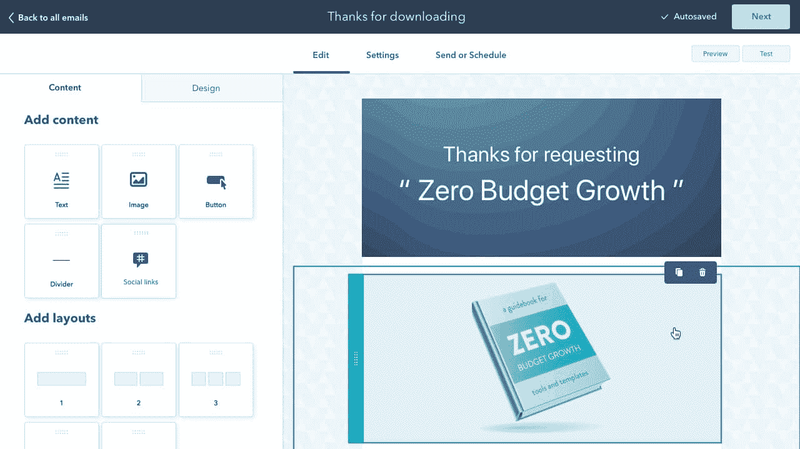

HubSpot email

HubSpot 是一个一体化的 CRM 平台，包括一系列营销工具，如登录页面生成器、表单生成器，当然还有电子邮件营销工具。 [HubSpot 电子邮件营销](https://www.hubspot.com/products/marketing/email)允许你创建移动优化的电子邮件活动，建立自己的定制模板，[运行 A/B 测试](https://kinsta.com/blog/wordpress-ab-testing-tools/)，并提高点击率。

#### 特征

*   电子邮件生成器(免费增值计划)。
*   电子邮件模板(免费增值计划)。
*   列表细分(免费增值计划)。
*   个性化(主题行、内容、链接、附件和行动要求。).
*   电子邮件分析(高级版)。
*   A/B 测试(专业计划)。
*   营销自动化工作流程(专业计划)。
*   电子邮件比较报告(专业计划)。

#### 免费计划

HubSpot 的免费计划包括每月 2000 封电子邮件和无限订户。您可以创建 25 个静态列表和 5 个智能列表。您还可以访问基于目标的模板，这些模板是专为您要发送的电子邮件类型而设计的。

HubSpot 的电子邮件营销工具由免费的 CRM 提供支持。除了存储你的订户信息，它还保存了你的联系人与你公司的每次互动的详细日志，无论是与你的网站页面还是与你的[数字广告](https://kinsta.com/blog/banner-ad-sizes/)。CRM 允许您通过个性化来确保您的电子邮件尽可能相关，从而优化性能。

这个免费计划还包括增加你的邮件列表的工具。您可以使用[线索捕获表单](https://kinsta.com/blog/b2b-lead-generation/)创建登录页面，甚至可以在您的网站上添加实时聊天或机器人小工具，以更动态的方式与您的访客互动。您还可以在 HubSpot 中管理和跟踪您的在线广告，并将您的投资回报率与您的其他营销工作联系起来。

#### 付费计划和定价

HubSpot 为其整个营销平台提供三种付费计划:

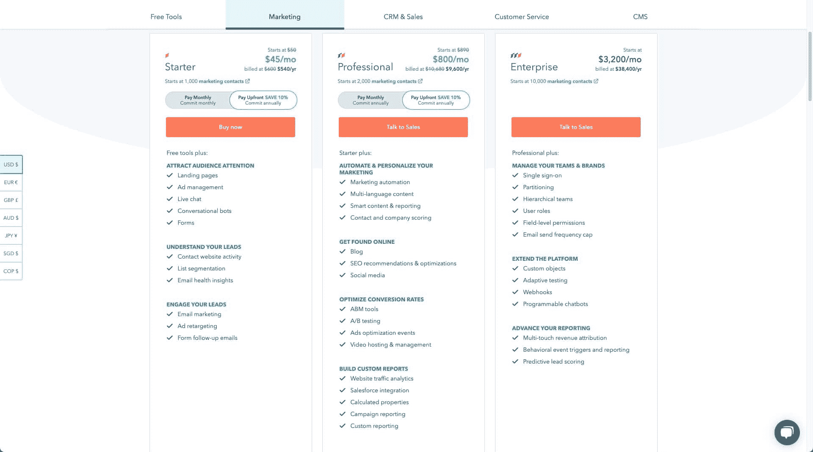

HubSpot pricing

所有计划都附带免费联系人(1，000 个初级联系人、2，000 个专业联系人和 10，000 个企业联系人)，之后您可以购买其他联系人的附加服务。

虽然它可能不是最便宜的选择，但先进的功能和集成使 HubSpot 成为 Mailchimp 的强大替代品，可以支持您的整个营销策略，远远超出电子邮件营销。

### 2.你是谁

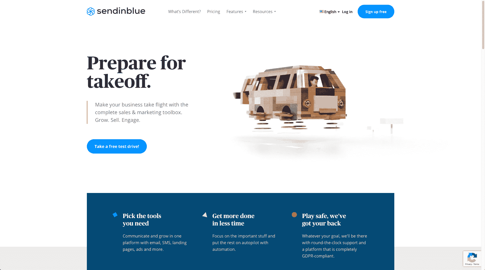

Sendinblue

如果你还在寻找 Mailchimp 的替代品，Sendinblue 是另一个你可能想看看的平台，因为它提供了电子邮件营销和交易电子邮件的工具。

它有一个时尚，移动友好的电子邮件生成器，有许多高质量的模板，并提供细分，行为目标，再营销受众，这只是其中的几个功能。

#### 特征

*   电子邮件生成器。
*   电子邮件模板。
*   登录页面生成器。
*   细分和个性化。
*   API / Webhooks。
*   A/B 测试。
*   短信(单独定价)。
*   交易邮件。
*   邮件分析。
*   营销自动化工作流程。
*   电子商务整合/行为定位。
*   [热图](https://kinsta.com/blog/saas-products/#27-hotjar)(必不可少)。
*   重新营销受众(谷歌广告、脸书广告)(溢价)。
*   [聊天](https://kinsta.com/blog/wordpress-live-chat-plugin/) (Premium)。

#### 免费计划

免费计划包括电子邮件生成器和模板、高级细分、工作流、API、交易电子邮件等。

这个计划的缺点是，你每天限于 300 封电子邮件，并且 Sendinblue 品牌包含在你的所有电子邮件中。

一个独特的功能是，你可以结合短信和电子邮件，甚至在免费计划。

#### 付费计划和定价

Sendinblue 的定价模式也是基于每月的电子邮件数量，而不是联系人数。

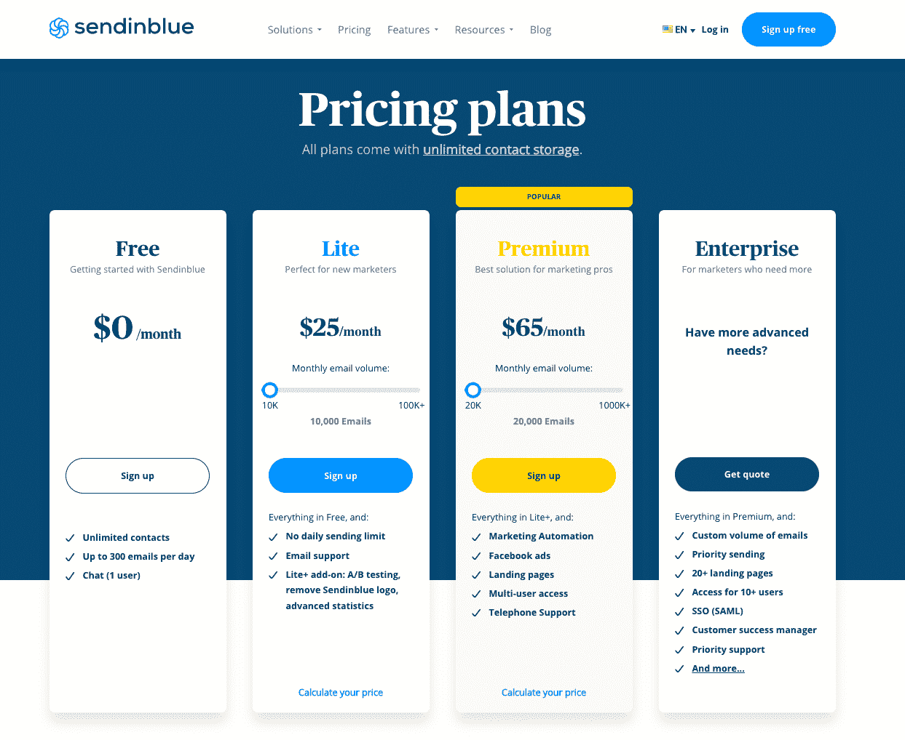

需要注意的一点是，即使是每月 25 美元的 lite 计划仍然在你所有的电子邮件中包含 Sendinblue 品牌。如果您需要删除它，您需要购买 Lite+付费附加组件或选择更高的计划。

### 3.邮件地址

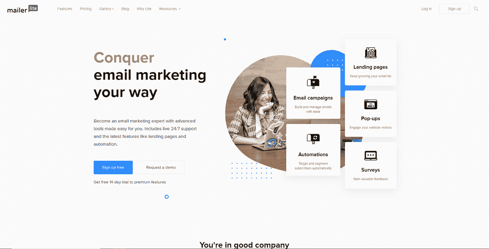

MailerLite

MailerLite 是 Mailchimp 的替代品和竞争对手，专注于向客户提供更简单的电子邮件营销服务，因此得名 Lite。

它提供了细分、 [A/B 测试](https://kinsta.com/blog/wordpress-ab-testing-tools/)、易于使用的电子邮件生成器和[登陆页面生成器](https://kinsta.com/blog/wordpress-landing-page-plugins/)、自动化工作流程等等。

#### 特征

*   电子邮件生成器。
*   登录页面生成器。
*   细分和个性化。
*   调查。
*   电子商务整合/行为定位( [Shopify 或 WooCommerce](https://kinsta.com/blog/woocommerce-vs-shopify/) )。
*   多用户帐户。
*   分析。
*   按时区交付(高级)。
*   自定义 HTML(高级)。
*   电子邮件模板(高级版)。
*   单击地图(高级)。

#### 免费计划

免费计划包括每月多达 1，000 个联系人和 12，000 封电子邮件。您还可以访问大多数功能，包括电子商务集成、活动细分和 A/B 测试。

他们的免费计划是早期在线企业主和初露头角的电子邮件营销人员的绝佳选择。

你可以发送自动废弃购物车电子邮件，分割测试[促销电子邮件](https://kinsta.com/blog/ecommerce-strategies/#email)，甚至跟踪你的电子邮件产生的收入。免费计划的唯一缺点是，你所有的电子邮件都将包含 MailerLite 标志。

#### 付费计划和定价

MailerLite 只有一个不同价位的保费计划:

MailerLite pricing

和 Mailchimp 一样，价格随着你的联系人/订户数量而变化。在用户数量较少的情况下，其价格可与 Mailchimp 的“必需品”相媲美，即 1000 名或更少用户每月 10 美元。

但是一旦你的用户达到 10，000 或更多，它就开始变得非常便宜，10k 每月只需 50 美元，20k 每月 100 美元。

MailerLite 似乎是一个更实惠的 Mailchimp 替代品，特别是考虑到它的基本保费计划包括所有功能。

### 4.穆森德

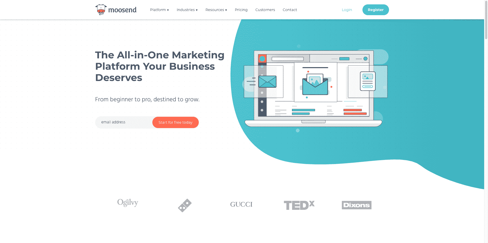

Moosend

Moosend 将自己定位为一个一体化的营销平台，而不仅仅是一个电子邮件和自动回复软件。从很多方面来说，它是一个登陆页面生成器、[电子商务集成](https://kinsta.com/blog/wordpress-ecommerce-plugins/)和营销自动化工作流程。

#### 特征

*   电子邮件生成器。
*   电子邮件模板。
*   登录页面生成器。
*   电子商务整合/行为定位( [WooCommerce](https://kinsta.com/blog/woocommerce-tutorial/) )。
*   细分和个性化。
*   邮件分析。
*   营销自动化工作流程。
*   基于天气的推荐。

#### 免费计划

Moosend 的免费计划是电子邮件营销行业中最好的免费交易之一。你最多只能有 1，000 个联系人或订户，但这与大多数其他 Mailchimp 替代品一致。

但这是与其他免费计划的相似之处。

您可以使用所有关键功能，每月可以发送无限量的电子邮件，并且 Moosend 不会在您发送的电子邮件中包含其品牌信息。

免费计划中唯一不包括的功能是交易电子邮件、 [SMPT 服务器](https://kinsta.com/blog/free-smtp-server/)、托管登陆页面。您可以 A/B 测试活动、使用自定义电子邮件模板等等，而无需支付任何费用。

#### 付费计划和定价

Moosend 提供三种不同的计划，除此之外，还有一个现收现付的选项(信用):

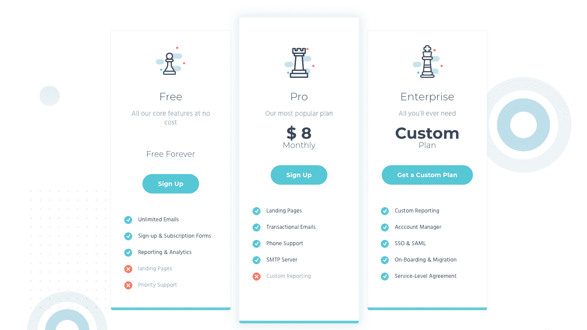

Moosend pricing

1000 名用户的月费起价为 8 美元(如果按年付费的话),包括上面列出的所有功能以及更多功能。

在较高的订阅点，它比 Mailchimp 最实惠的计划便宜得多，后者限制了一些关键功能。

### 5.邮件快递

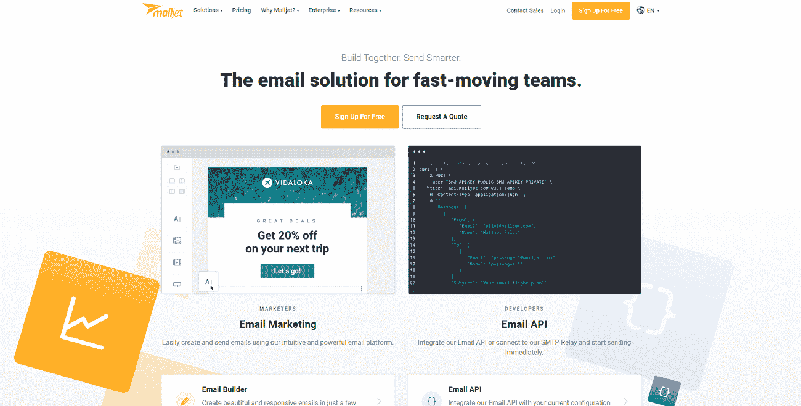

MailJet

MailJet 不仅仅是一个电子邮件营销解决方案。

它还提供了一个电子邮件 API，将[交易电子邮件](https://kinsta.com/help/transactional-email/)嵌入到你的网络或移动应用程序中。此功能将允许您的应用程序发送里程碑电子邮件、升级确认、发票通知等等。

#### 特征

*   电子邮件生成器。
*   API / Webhooks。
*   SMTP 中继。
*   交易邮件。
*   邮件分析。
*   交易短信(单独定价)。
*   在线支持(基本)。
*   A/B 测试(高级)。
*   基于角色的权限(高级)。
*   自定义电子邮件模板(高级版)。
*   细分和个性化(高级)。
*   营销自动化工作流程(高级版)。

#### 免费计划

MailJet 的免费计划非常基础，每月限量 6000 封邮件，每天只有 200 封邮件。您可以访问电子邮件编辑器、API 和分析。您发送的所有电子邮件都将包含 MailJet 品牌。

对于使用 API 的事务性电子邮件，这是一个不错的选择。例如，你甚至无法在同一天向 500 名订户发送促销邮件。在这个列表中有更好的电子邮件营销免费选项

一个独特的方面是，你可以有无限的联系，所以如果你有一个广泛的用户名单，但很少给所有人发电子邮件，这可能是一个好的选择，因为你可以在繁忙季节之间降级你的计划。

#### 付费计划和定价

与 Mailchimp 不同，MailJet 根据你每月发送的电子邮件数量，而不是你的联系人总数来为其计划定价。

基本计划每月 9.65 美元起，按年计费，最多可发送 3 万封电子邮件。

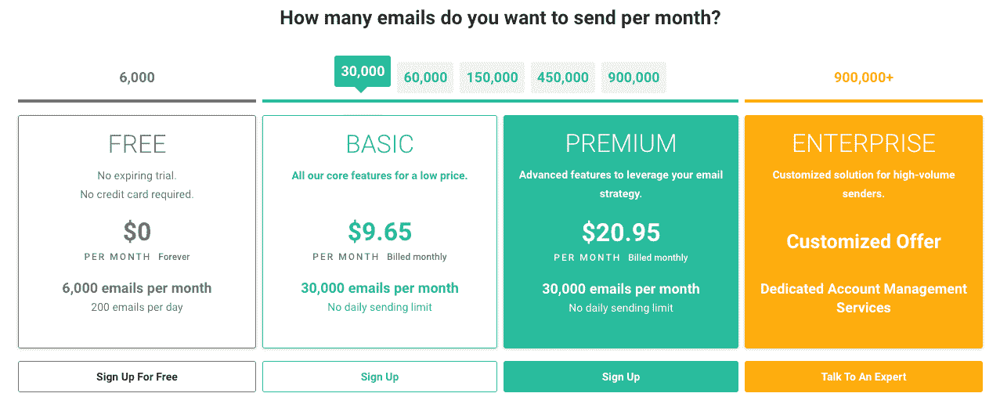

MailJet pricing

与 Mailchimp Essentials 计划相比，基本计划的功能最少(您无法使用分割测试、细分或行为目标)。

### 6.Omnisend

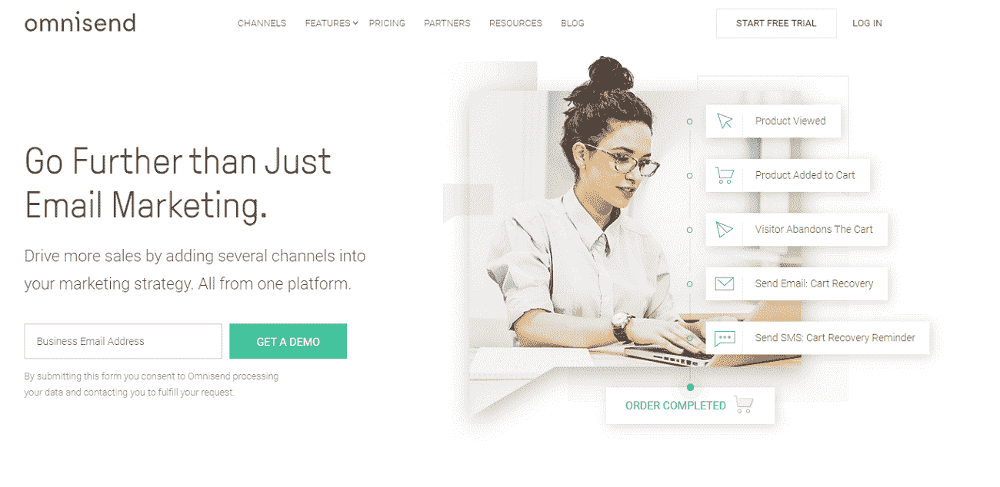

Omnisend

Omnisend 是一个多渠道营销自动化平台，主要关注电子邮件功能。

此外，你还可以发送 [Facebook Messenger](https://kinsta.com/blog/facebook-marketing/) 和 WhatsApp 消息、短信、[网页推送通知](https://kinsta.com/blog/wordpress-push-notifications/)等等。

#### 特征

*   电子邮件生成器。
*   电子邮件模板。
*   登录页面生成器。
*   细分和个性化。
*   邮件分析。
*   A/B 测试。
*   SMS(Pro–单独定价)。
*   网络推送通知(专业版)。
*   交易邮件。
*   营销自动化工作流程。
*   电子商务整合/行为定位。
*   重新营销受众(谷歌广告、脸书广告)。
*   自定义脸书观众(专业版)。
*   多渠道(Messenger、WhatsApp、短信、推送通知)(企业)。

#### 免费计划

免费计划每月限发 15000 封邮件，但联系人数量没有上限。

与大多数其他 Mailchimp 替代方案不同，免费计划没有与电子商务或行为目标整合。例如，你不能创造一个放弃购物车的活动来赢回观望的顾客。

#### 付费计划和定价

Omnisend 有四个不同的订阅级别，免费、标准、专业和企业:

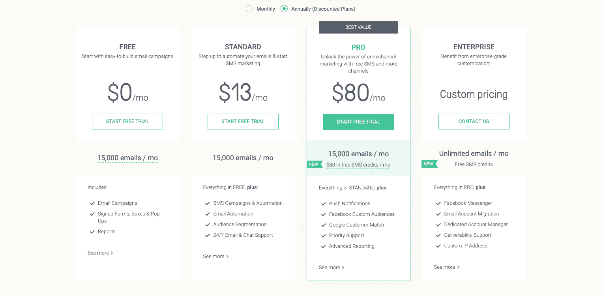

Omnisend pricing

请注意，推送通知仅适用于 pro 计划，要访问 Messenger 和 WhatsApp，您需要直接使用 Omnisend 设置自定义企业计划。

短信遵循预付费模式，在美国每 100 条短信收费 1.5 美元。对于想要掌握[全渠道营销](https://kinsta.com/blog/ecommerce-statistics/)的公司来说是个不错的选择。

### 7.发报机

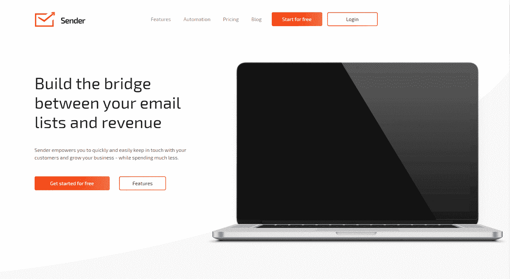

Sender

[Sender](https://www.sender.net/) 是一款更简单的电子邮件营销工具，具有易于使用的界面和更适合中小型企业的功能。

正因为如此，它为他们的月费和现收现付计划提供了极具竞争力的价格，使自己成为 Mailchimp 最实惠的替代品之一。

#### 特征

*   电子邮件生成器。
*   电子邮件模板。
*   细分和个性化。
*   A/B 测试。
*   邮件分析。
*   营销自动化工作流程。
*   网络推送通知。
*   电子商务整合/行为定位(WooCommerce)。
*   [CMS 平台](https://kinsta.com/knowledgebase/content-management-system/) (Magento，WordPress)。

#### 免费计划

该免费计划包括每月多达 2500 名订户和 15000 封电子邮件。此外，您可以从付费计划中访问所有发送者功能，没有任何限制。

与付费计划的唯一区别是，发送者在电子邮件中包括品牌和免费计划用户的选择加入表格。

#### 付费计划和定价

Sender 的每月计划是迄今为止每个用户最便宜的，因为它包括所有功能，最低的用户层由免费计划覆盖。

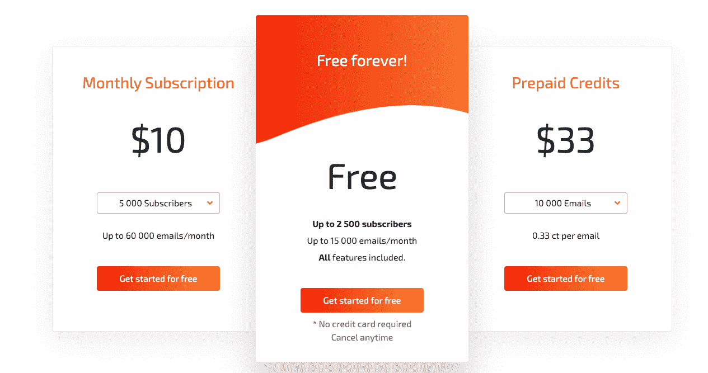

Sender pricing

虽然它的功能有些有限，但它包括原生 WooCommerce 与购物车放弃活动的集成，以及基于购买历史的细分。因此，如果你，这可以是一个令人难以置信的成本效益的选择，同时还为您提供电子邮件营销的要点。

### 8.发送脉冲

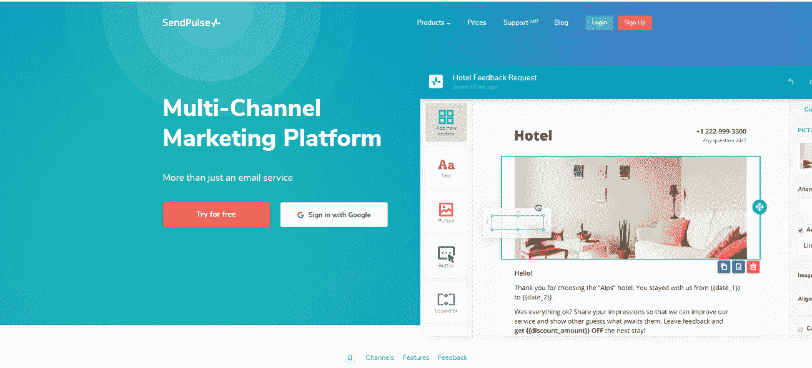

SendPulse

Sendpulse 是另一个多渠道平台，包括电子邮件、推送通知、聊天机器人和短信。

一个问题是没有全面的多渠道计划，所以你必须针对竞争对手单独评估每个渠道的计划。

我们比较的主要焦点将特别是分析他们的电子邮件服务。

#### 特征

*   电子邮件生成器。
*   电子邮件模板。
*   细分和个性化。
*   A/B 测试。
*   邮件分析。
*   营销自动化工作流程。
*   API/Webhooks。
*   交易邮件。
*   网络推送通知(单独定价)。
*   Facebook Messenger(单独定价)。
*   短信(单独定价)。
*   电子商务整合/行为定位(WooCommerce，Opencart)。

#### 免费计划

免费计划只包括 1-500 名用户，并限制了一些功能。您将无法访问高级细分、用户访问级别或高级分析和报告。

但有了电子邮件生成器、模板、五个自动化规则和基本细分，早期企业完全有可能在不投资付费计划的情况下进行长期测试。

#### 付费计划和定价

对于电子邮件营销，Sendpulse 提供单一的主要订阅，以及现收现付模式。

SendPulse 是，你可以利用网络推送通知(最多 10，000 名订户)和 Facebook Messenger(每月最多 10，000 条消息)的免费计划，将其作为一个多渠道平台，只需支付电子邮件的价格。

### 9.Zoho 活动

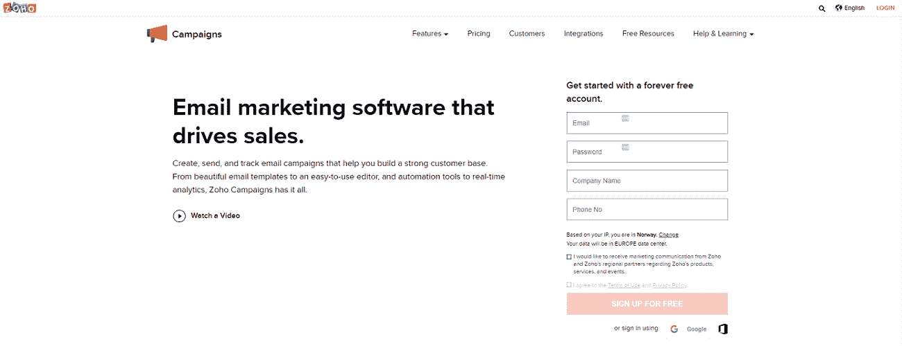

Zoho Campaigns

Zoho Campaigns 是来自大型 Zoho CRM &营销平台的电子邮件营销产品。它提供了强大的电子邮件营销功能，如细分，A/B 测试，动态内容，以及与 Zoho CRM 的本机集成。

#### 特征

*   电子邮件生成器。
*   电子邮件模板。
*   细分和个性化。
*   A/B 测试。
*   邮件分析。
*   营销自动化工作流程。
*   电子商务整合/行为定位(WooCommerce， [BigCommerce](https://kinsta.com/blog/ecommerce-platforms/#2-bigcommerce) )。
*   原生 Zoho CRM 集成。
*   社交媒体发布。
*   多用户帐户。

#### 免费计划

他们的免费计划包括多达 2，000 名订户、12，000 封电子邮件和每个帐户五个用户。它包括最基本的电子邮件营销功能，包括细分、a/b 测试以及通过合并标签和动态内容进行个性化。

但它不包括电子商务集成和智能营销自动化工作流程。

此外，Zoho 活动品牌将包含在您的所有电子邮件中。

#### 付费计划和定价

Zoho 提供三种不同的支付计划，基于订阅者的月订阅，基于电子邮件的月订阅，以及现收现付。

唯一包括高级工作流程和电子商务集成的计划是基于订户的模式，所以这是我们将重点关注的一个。

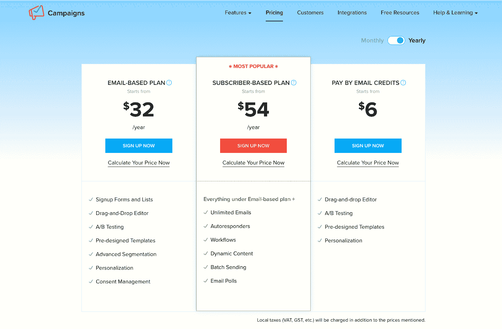

Zoho campaigns pricing

从每月不到 5 美元开始，他们基于用户的计划价格合理。拥有比 Mailchimp essentials 稍好的功能，您会注意到订户越多的差异。

## 注册订阅时事通讯

### 想知道我们是怎么让流量增长超过 1000%的吗？

加入 20，000 多名获得我们每周时事通讯和内部消息的人的行列吧！

[Subscribe Now](#newsletter)

如果你还需要一个带有营销和 WordPress 集成的现代 CRM，Zoho 可能是一个不错的选择。

## Mailchimp 的付费替代品

如果你有一个[已建立的电子商务商店](https://kinsta.com/blog/ecommerce-platforms/)或在线业务，你可能不会参与任何免费计划。下面，我们研究付费 Mailchimp 替代方案，并帮助您为您的公司找到正确的选择。

### 10.克拉维约

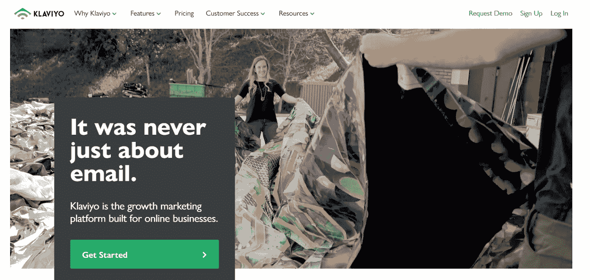

Klaviyo

Klaviyo 是另一个多渠道平台，提供电子邮件、短信和社交媒体广告。

他们非常关注电子商务平台，并与 Shopify、WooCommerce、BigCommerce 和 T2 Magento 进行了本地集成。

通过集成，您可以基于购买和浏览历史、废弃购物车等创建高级细分市场。他们甚至有专门的产品推荐功能，因此您可以轻松个性化您的产品和电子邮件。

这是一个伟大的合作伙伴，帮助您实施先进的[电子商务战略](https://kinsta.com/blog/ecommerce-strategies/)没有问题。

#### 特征

*   电子邮件生成器。
*   电子邮件模板。
*   细分和个性化。
*   A/B 测试。
*   邮件分析。
*   营销自动化工作流程。
*   短信(单独定价)。
*   电子商务整合/行为定位(WooCommerce、BigCommerce、Shopify、Magento)。
*   网站跟踪(创建高级细分市场)。
*   投资回报报告。
*   自定义脸书观众。
*   产品推荐。

#### 付费计划和定价

Klaviyo 提供一个包含所有功能的月套餐，价格基于用户数量。

| **计划** | **1，000 名用户** | **10，000 名用户** | **2 万名用户** |
| 每月 | 30 美元/月 | 150 美元/月 | 375 美元/月 |

凭借定制的脸书受众、先进的自动化工作流程、集成、细分和跟踪，月度计划高于 Mailchimp 的标准或高级计划。

它肯定不是最便宜的选择，但它提供的专业功能和集成使其成为电子商务公司可行的 Mailchimp 替代方案。

### 11.AWeber

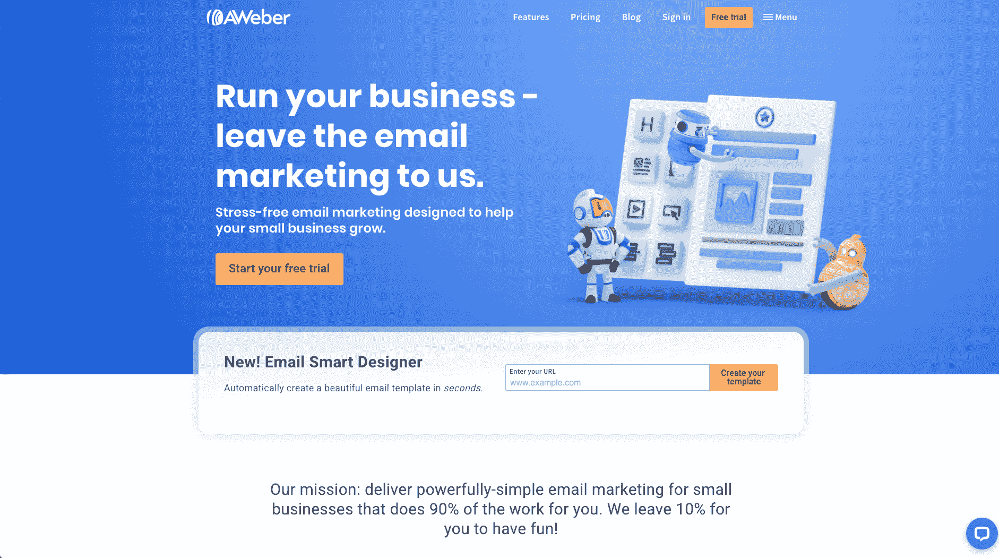

AWeber

AWeber 可能将自己标榜为小型企业的强大而简单的解决方案，但它远不是这个列表中最简单的提供商。

作为游戏中真正的老兵之一，在 Mailchimp 成立整整三年之前，它已经成功地从一个简单的自动回复器过渡到一个成熟的电子邮件营销平台。

#### 特征

*   电子邮件生成器。
*   700 多个电子邮件模板。
*   股票照片库。
*   细分和个性化。
*   A/B 测试。
*   邮件分析。
*   营销自动化工作流程。
*   电子商务整合/行为定位(WooCommerce、BigCommerce、Shopify、Magento、Easy Digital Downloads)。
*   CMS 集成(WordPress，Magento，Divi，Ghost，Weebly，Wix)。
*   电话支持(在所有计划级别)。

#### 付费计划和定价

AWeber 有一个单层订阅系统，无论你有 500 个还是 50，000 个订户，你都可以使用所有功能。

这使得它成为小型企业的可靠选择，这些企业希望预先安装电子邮件营销渠道，并能够从第一天起就充分利用它。

他们的最低用户级别是 0-500。在这个阶段，每月订阅费用为 19 美元。

现在让我们比较一下我们为这篇文章设定的价位。

| **计划** | **1，000 名用户** | **10，000 名用户** | **2 万名用户** |
| 每月 | 29 美元/月 | 69 美元/月 | 149 美元/月 |

AWeber 还提供 30 天的免费试用。有了大量的本机一键式集成，即使没有任何开发或营销经验，也很容易上手。

### 12.GetResponse

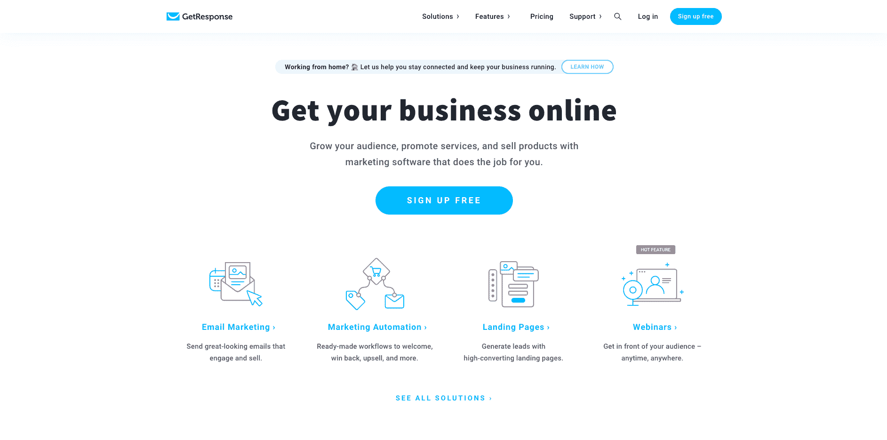

GetResponse

[GetResponse](https://www.getresponse.com/) 是电子邮件营销行业的另一个知名平台，也与时俱进，以满足 2022 年现代公司的需求。

他们的全新功能“Autofunnel”帮助您创建、管理和实施完整的营销渠道，包括社交广告、受众创建、登录页面、[网络研讨会](https://kinsta.com/webinars/)、弹出线索捕捉和[支付处理器集成](https://kinsta.com/blog/woocommerce-payment-gateways/)。

#### 特征

*   电子邮件生成器。
*   电子邮件模板。
*   登录页面生成器。
*   网络研讨会(Plus)。
*   营销渠道。
*   细分和个性化。
*   A/B 测试。
*   邮件分析。
*   营销自动化工作流程。
*   电子商务整合/行为定位(WooCommerce、BigCommerce、Shopify、Magento)。
*   CMS 集成(WordPress，Drupal，Joomla)。
*   [支付网关](https://kinsta.com/blog/woocommerce-payment-gateways/)集成(Stripe、Paypal、Square)。

#### 付费计划和定价

| **计划** | **1，000 名用户** | **10，000 名用户** | **2 万名用户** |
| 基础 | 15 美元/月 | 65 美元/月 | 145 美元/月 |
| 加 | 49 美元/月 | 95 美元/月 | 179 美元/月 |
| 专业的 | 99 美元/月 | 165 美元/月 | 255 美元/月 |

注意:GetResponse 的企业计划是一项定制服务。

虽然与其他选项相比，高级计划可能显得昂贵，但包含登录页面生成器和完整的漏斗管理系统可以降低其他营销软件的成本。

### 13.自动驾驶仪

Autopilot

[Autopilot](https://www.autopilothq.com/) 凭借更加自然、直观、可视化的界面将自己与竞争对手区分开来。但这并不意味着引擎盖下的动力更少。

您可以使用可视化漏斗/客户旅程构建器来添加营销自动化操作，从电子邮件到营销受众创建，再到创建/分配任务或发送 SMS。

#### 特征

*   网站跟踪(针对高级细分市场和营销自动化行动)。
*   客户旅程地图。
*   原生营销 CRM。
*   电子邮件生成器。
*   电子邮件模板。
*   细分和个性化。
*   A/B 测试。
*   邮件分析。
*   营销自动化工作流程。
*   电子商务整合/行为定位(Shopify、BigCommerce)。
*   收入/投资回报报告。
*   产品推荐。
*   [多用户账户](https://kinsta.com/blog/manage-users-hosting-account/)。

#### 付费计划和定价

Autopilot 提供了不同的方案，唯一的区别是联系的数量。

| **计划** | **1，000 名用户** | **10，000 名用户** | **2 万名用户** |
| 每月 | 49 美元/月 | 249 美元/月 | 自定义报价 |

如果您有超过 10，000 个订户，您必须联系他们的销售团队来接收定制报价。

你的新网站需要一流的、快速的、安全的主机吗？Kinsta 提供超快的服务器和来自 WordPress 和 WooCommerce 专家的 24/7 世界级支持。[查看我们的计划](https://kinsta.com/plans/?in-article-cta)

你可以从 30 天免费试用的任何用户数量开始。

### 14.充满

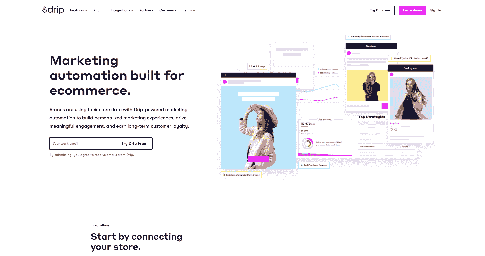

Drip

[滴滴](https://www.drip.com/)是一个营销[电子商务 CRM 平台](https://kinsta.com/blog/woocommerce-crm/)，内置电子邮件解决方案。它拥有通过多种渠道将潜在客户培养成客户的强大工具。

#### 特征

*   销售 CRM。
*   电子商务整合/行为定位(WooCommerce、Shopify、 [Magento](https://kinsta.com/magento-market-share/) )。
*   电子邮件生成器。
*   电子邮件模板。
*   细分和个性化。
*   A/B 测试。
*   邮件分析。
*   营销自动化工作流程。
*   短信(单独定价)。
*   网站跟踪(创建高级细分市场)。
*   收入/投资回报报告。
*   自定义脸书观众。
*   产品推荐。
*   动态内容。

#### 付费计划和定价

滴滴提供单一计划，包括所有功能，不考虑联系人数。

| **计划** | **1，000 名用户** | **10，000 名用户** | **2 万名用户** |
| 每月 | 29 美元/月 | 154 美元/月 | 289 美元/月 |

对于一些人来说，它可能是昂贵的一方，但它包括一个内置的销售 CRM 与大量的本机集成。如果你正在寻找一个超越电子邮件自动化的 Mailchimp 替代品，这可能是一个不错的选择。

### 15.转换工具

ConvertKit

ConvertKit 是一款电子邮件营销解决方案，主要面向创业者、小企业和初创公司。它具有直观、用户友好的界面、清晰的分析报告(可视化最重要的指标)以及中小型企业电子邮件营销活动所需的一切。

#### 特征

*   可视化自动化工作流。
*   电子邮件生成器。
*   电子邮件模板。
*   登录页面生成器。
*   简单的报告和电子邮件分析。
*   细分和个性化。
*   A/B 测试。
*   电子商务整合/行为定位(WooCommerce、Shopify、Easy Digital Downloads、Gumroad)。
*   [CMS 整合](https://kinsta.com/knowledgebase/content-management-system/) (WordPress、 [Wix](https://kinsta.com/blog/wix-vs-wordpress/) 、 [Squarespace](https://kinsta.com/blog/squarespace-vs-wordpress/) )。

#### 付费计划和定价

所有计划都包括除代办迁移之外的所有功能，代办迁移仅适用于拥有超过 5，000 名订户的计划。

| **计划** | **1，000 名用户** | **10，000 名用户** | **2 万名用户** |
| 每月 | 29 美元/月 | 119 美元/月 | 179 美元/月 |

由于有 30 天的免费试用期，您可以测试 ConversionKit。

### 16.活动监视器

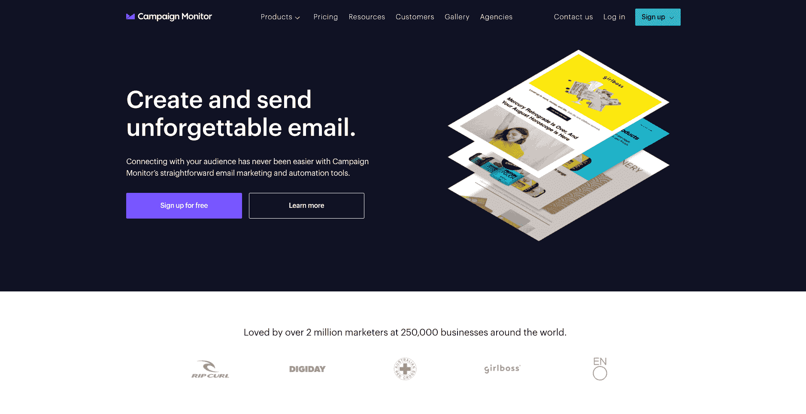

Campaign Monitor

Campaign Monitor 提供两个独立的电子邮件营销平台，一个是专门为电子商务商店设计的，另一个是为其他企业设计的。

其电子商务产品 CM Commerce(以前称为" [Conversio](https://cm-commerce.com/pricing/) ")提供了与 [WooCommerce](https://kinsta.com/blog/woocommerce-tutorial/) 、 [BigCommerce](https://kinsta.com/blog/woocommerce-alternative-bigcommerce/) 和 Shopify、智能客户细分、预制客户旅程自动化模板等的原生集成。

#### 特征

*   电子邮件生成器。
*   电子邮件模板。
*   细分和个性化。
*   A/B 测试。
*   邮件分析。
*   营销自动化工作流程。
*   短信(单独定价)。
*   电子商务整合(WooCommerce、BigCommerce、Shopify) (CM Commerce)。
*   行为定位(CM 商务)。
*   预制客户旅程自动化配方(CM 商务)。
*   智能客户细分(CM 商务)。
*   评论和用户生成的内容(CM 商务)。
*   产品推荐。

#### 付费计划和定价

我们将涵盖标准活动监控和 CM 商务的计划。

| **运动监控器** | **1000 封电子邮件** | **1 万封电子邮件** | **20，000 封电子邮件** |
| 基础 | 9 美元/月 | – | – |
| 无限的 | 29 美元/月 | 29 美元/月 | 29 美元/月 |
| 最初的 | 149 美元/月 | 149 美元/月 | 149 美元/月 |

基本计划包括所有基本的电子邮件营销功能和基本的营销自动化，每月多达 2，500 封电子邮件。无限制让您访问时区优化，优先支持，和倒计时定时器。通过 Premier，您可以获得电话支持、高级用户权限和预先构建的参与细分市场。

| **CM 商务** | **1，000 名用户** | **10，000 名用户** | **2 万名用户** |
| 启动器 | 29 美元/月 | 149 美元/月 | 319 美元/月 |
| 增长 | 49 美元/月 | 249 美元/月 | 429 美元/月 |
| 专业的 | 69 美元/月 | 349 美元/月 | 599 美元/月 |

Starter 限制每月发送电子邮件的数量和您的订户数量(前者 10，000，后者 1，000)，但它包括所有基本的电子商务功能，如产品推荐、购物车废弃电子邮件等。

增长还包括用户生成的产品评论、客户调查和社交验证工具。

通过专业计划，您可以获得入职咨询、客户经理的战略建议以及电话支持。

### 17.经常接触

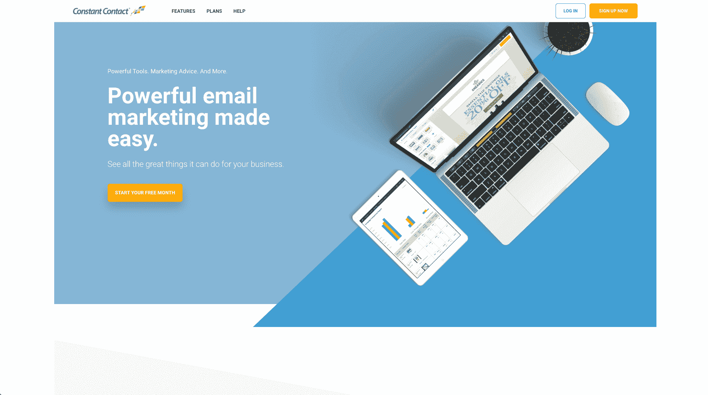

Constant Contact

[Constant Contact](https://www.constantcontact.com/index.jsp) 是一个成熟、强大的电子邮件营销平台，二十多年来一直处于行业顶端。

#### 特征

*   电子邮件生成器。
*   电子邮件模板。
*   细分和个性化。
*   A/B 测试。
*   邮件分析。
*   调查。
*   单击地图。
*   电子商务整合(WooCommerce，BigCommerce，Shopify， [3DCart](https://kinsta.com/blog/ecommerce-platforms/#5-3dcart) )。
*   行为定位。
*   产品推荐。
*   电话支持(所有计划)。

#### 付费计划和定价

持续联系提供两种不同的订阅等级:电子邮件和电子邮件加。

| **计划** | **1，000 名用户** | **10，000 名用户** | **2 万名用户** |
| 电子邮件 | 45 美元/月 | 95 美元/月 | – |
| 电子邮件加 | 70 美元/月 | 125 美元/月 | 225 美元/月 |

使用动态内容、产品推荐、调查、RSVPs 和 A/B 测试都需要 Email Plus，但成本差异微乎其微。超过 10，001 个订户，价格变得相同。

持续联系提供 30 天免费试用。

### 18\. Keap

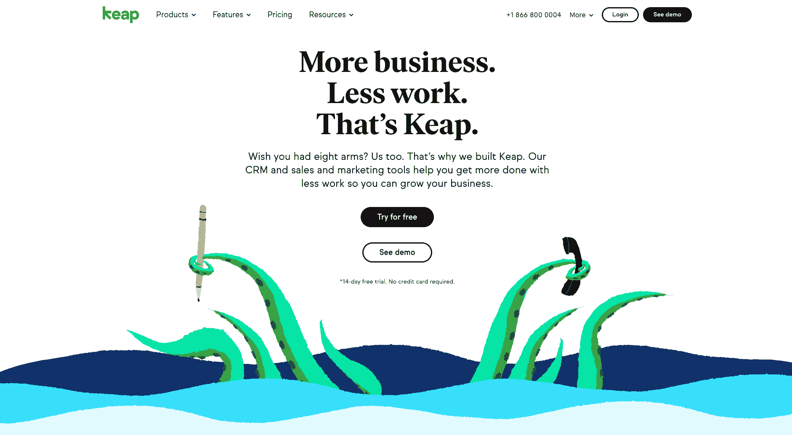

Keap

InfusionSoft 在 2019 年将自己更名为 [Keap](https://keap.com/) ，作为实现目标市场多元化的一部分，并将他们的主要产品分成几个不同的计划。

基础仍然是一个强大的销售 CRM，具有任务管理、管道自动化和其他高级功能。

#### 特征

*   任务管理。
*   管道自动化。
*   电子邮件生成器。
*   电子邮件模板。
*   细分和个性化。
*   A/B 测试。
*   邮件分析。
*   营销自动化工作流程。
*   电子商务整合/行为定位(Shopify、BigCommerce、WooCommerce)。
*   收入/投资回报报告。
*   产品推荐。
*   多用户帐户。
*   原生销售 CRM (InfusionSoft)。
*   原生支付网关(InfusionSoft)。

#### 付费计划和定价

所有 Keap 计划都包括一次性付费获得“专家指导”入职体验的可能性:

| **计划** | **1，000 名用户** | **10，000 名用户** | **2 万名用户** |
| 保持增长 | 79 美元/月+99 美元 | 279 美元/月+99 美元 | 379 美元/月 |
| Keap Pro | 149 美元/月+499 美元 | 349 美元/月+499 美元 | 449 美元/月 |
| 输液软件 | 定制报价+999 美元 | 自定义报价 | 自定义报价 |

Keap Grow 包括基本的 web 注册表单、电子邮件分段、个性化、基本 CRM 功能和一次性付款处理。

Keap Pro 包括经常性支付、CRM 中的销售渠道、A/B 测试和全面集成。

Infusionsoft 包括成熟的电子商务解决方案、功能全面的销售渠道 CRM、自定义用户角色、代销商管理等。所有计划都有 30 天的免费试用期。

## WordPress 用户的 Mailchimp 替代品

对于那些严格寻找可以让你直接从 WordPress 仪表盘发送邮件的电子邮件软件的人来说，这里有一些有趣的选择:

### 19.邮件诗人

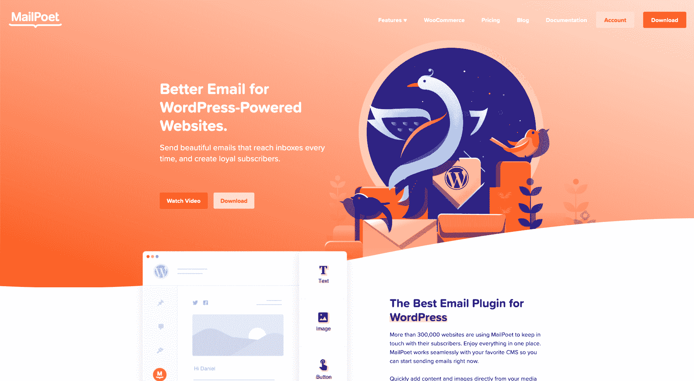

MailPoet

MailPoet 是一个 WordPress 第一的电子邮件营销平台，有一个强大的本地插件，集成了 [WooCommerce 商店](https://kinsta.com/blog/woocommerce-plugins/)以及普通的 WordPress 网站。你可以很容易地在帖子、页面、甚至是小部件中加入[注册表单](https://kinsta.com/blog/how-to-build-an-email-list/)。

#### 特征

*   电子邮件生成器(在 [WordPress 仪表盘](https://kinsta.com/knowledgebase/wordpress-admin/)内)。
*   电子邮件模板。
*   基本细分。
*   邮件分析。
*   电子商务整合/行为定位(WooCommerce)。
*   原生 WordPress 集成。

#### 免费计划

他们的免费计划包括多达 1000 名订户和无限的电子邮件，以及高级计划的大部分功能。您可以通过 WooCommerce 获得基本的细分功能和电子商务集成。

由于插件和无限的电子邮件，对于拥有 WooCommerce 商店或 WordPress 网站的用户来说，这是一个很好的免费选择。

#### 付费计划和定价

MailPoet 只提供单一的高级计划，一旦用户超过 1000 人，每月 15 美元起。

| **计划** | **1，001 名用户** | **10，000 名用户** | **2 万名用户** |
| 溢价 | 13 美元/月 | 75 美元/月 | 150 美元/月 |

从每月 15 美元开始，他们的保费计划并不是市场上最便宜的选择。不过，如果你想要一个易于设置和使用的选项，能够在你的 WordPress 仪表盘中创建和发送营销电子邮件，MailPoet 可能是你的正确选择。

### 20.简讯精简版(WordPress 插件)

Newsletters WordPress plugin

简讯精简版是一个 WordPress 插件，允许你收集电子邮件地址和 T2 发送简讯，而不需要依赖第三方服务。

它包括基本的细分，电子邮件，链接跟踪，多个邮件列表，等等。

#### 特征

*   帖子/页面选择嵌入。
*   链接/点击跟踪。
*   邮件列表。
*   电子邮件日程安排。
*   电子邮件模板。
*   通过电子邮件发送帖子。
*   付费订阅(PayPal & 2CheckOut)。
*   WordPress 多站点兼容。
*   电子邮件跟踪和分析。
*   按条件分类的时事通讯。

#### Free Plugin

免费插件包括基本的电子邮件营销功能，并且没有免费计划通常具有的每月/每天联系或电子邮件的限制。

使用这个插件和你自己的服务器发送电子邮件的一个主要缺点是[你可能会面临投递问题](https://kinsta.com/blog/email-marketing-software/)。因此，最好的解决方案是在[中结合 MailGun、Mandrill 或 SendGrid](https://kinsta.com/blog/free-smtp-server/) 等服务使用这个插件。

你也完全有责任确保你在处理你的 WordPress 网站上的数据时遵守[中的所有](https://kinsta.com/blog/wordpress-gdpr-compliance/)[数据保护条例](https://kinsta.com/blog/wordpress-ccpa-compliance/)。

如果你使用 WordPress，你可能也会对更多的用于 WordPress 的[线索生成插件感兴趣。](https://kinsta.com/blog/wordpress-lead-generation/)

#### 付费计划和定价

完整时事通讯插件的单一站点许可费用为 65 美元。不限安装次数的开发者许可费用为 195 美元。这些都是一次性费用，价值 1 年的更新。

### 21.交流邮件

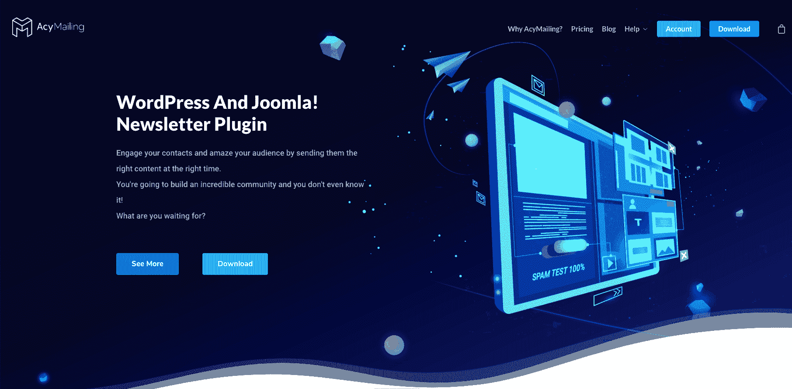

AcyMailing WordPress plugin

AcyMailing 是一个 WordPress ( & Joomla！)简讯插件，允许初学者和高级用户轻松处理他们的电子邮件通信。

该插件集成了知名名字，如 [WooCommerce](https://kinsta.com/blog/woocommerce-tutorial/) 、[联系方式 7](https://kinsta.com/blog/contact-form-7/) 、[活动日历、](https://kinsta.com/blog/wordpress-events-plugin/#the-events-calendar)等等。AcyMailing 为你提供了所有的工具来改善你的营销和增加你的清单。

#### 特征

*   无限制:不限用户数量(也不限发送的电子邮件数量)
*   [GDPR 顺从](https://kinsta.com/blog/wordpress-gdpr-compliance/)
*   拖放电子邮件生成器
*   用户管理:列表和细分市场
*   动态内容插入
*   详细的统计数据
*   [提高送达率](https://kinsta.com/blog/email-deliverability-manager/)(垃圾邮件测试工具，确保您不会被[视为垃圾邮件](https://kinsta.com/blog/why-are-my-emails-going-to-spam/))
*   自动化工作流程

#### 免费计划

AcyMailing 提供免费计划，对用户数量、发送的电子邮件和集成没有限制。这涵盖了基本需求，并提供了一个很好的方法来尝试和测试这个插件的功能，然后最终升级到它的付费计划之一。

#### 付费计划和定价

根据年度计划，AcyMailing 有三种不同的付费版本:

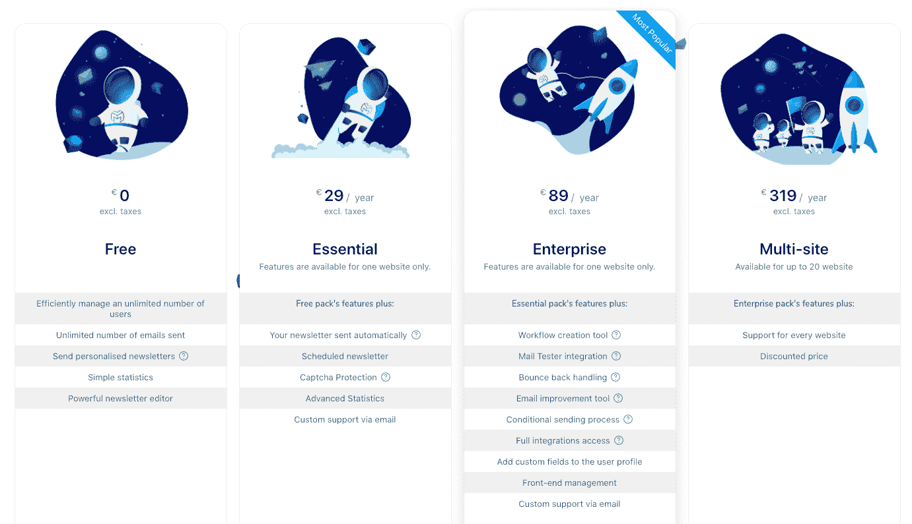

AcyMailing plugin

正如您马上可以看到的，他们的价格很有竞争力(如果您将其与市场上的其他解决方案进行比较)。这里的一个关键区别是，你不会根据你发送的用户或电子邮件的数量收费，而是根据你需要集成插件的功能类型和网站数量收费。

[No Mailchimp? No problem. 😊 These 21 alternatives will help you take your email marketing to the next level 📊Click to Tweet](https://twitter.com/intent/tweet?url=https%3A%2F%2Fkinsta.com%2Fblog%2Fmailchimp-alternatives%2F&via=kinsta&text=No+Mailchimp%3F+No+problem.+%F0%9F%98%8A++These+21+alternatives+will+help+you+take+your+email+marketing+to+the+next+level+%F0%9F%93%8A&hashtags=EmailMarketing%2Canalytics)

## 摘要

当你为自己的企业选择电子邮件营销工具时，[你需要考虑的因素不仅仅是价格](https://kinsta.com/blog/race-to-the-bottom/)。

当然，Mailchimp 是一种主食，看起来很棒(我们过去在 Kinsta 也使用过它)，但这并不意味着它是任何企业的最佳选择。

有很多 Mailchimp 的替代品可以寻找。

从可以帮助您进行特定营销工作的独特功能，到必要的平台集成，您需要仔细考虑可以帮助您业务的每个方面。

优化漏斗的底部是关键，一个智能的电子邮件营销平台，与您的 CMS，电子商务平台和 CRM 顺利合作是第一步。

但是即使有了完美的工具，你仍然需要遵循[电子邮件营销最佳实践](https://kinsta.com/blog/email-marketing-best-practices/)来获得最佳效果。这是一个持续的学习过程，你永远不要忘记！

你最喜欢的电子邮件营销软件是什么？在评论里告诉我们吧！

* * *

让你所有的[应用程序](https://kinsta.com/application-hosting/)、[数据库](https://kinsta.com/database-hosting/)和 [WordPress 网站](https://kinsta.com/wordpress-hosting/)在线并在一个屋檐下。我们功能丰富的高性能云平台包括:

*   在 MyKinsta 仪表盘中轻松设置和管理
*   24/7 专家支持
*   最好的谷歌云平台硬件和网络，由 Kubernetes 提供最大的可扩展性
*   面向速度和安全性的企业级 Cloudflare 集成
*   全球受众覆盖全球多达 35 个数据中心和 275 多个 pop

在第一个月使用托管的[应用程序或托管](https://kinsta.com/application-hosting/)的[数据库，您可以享受 20 美元的优惠，亲自测试一下。探索我们的](https://kinsta.com/database-hosting/)[计划](https://kinsta.com/plans/)或[与销售人员交谈](https://kinsta.com/contact-us/)以找到最适合您的方式。