# 为您的新在线商店比较的 7 个最佳电子商务平台(免费和付费)

> 原文：<https://kinsta.com/blog/ecommerce-platforms/>

经营一家电子商务商店没有单一的“最佳”方式。这取决于你的产品，你的目标受众，以及你最喜欢的风格。

这就是为什么市场上有不同的电子商务平台来满足不同的需求。诀窍在于知道哪一个最适合你。

在本指南中，我们比较了 7 大电子商务平台，以便您了解所有关键细节，并了解哪一个最适合您独特的业务需求。

我们将介绍它们的特性、定价、优缺点，以及最适合推荐给谁，所以请看下文。

听起来很有趣？

我们开始吧！

## 1.伍尔科贸易公司

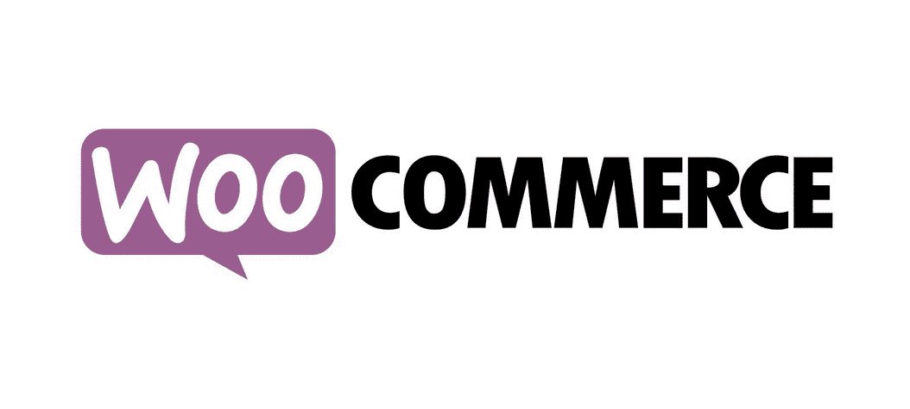

WooCommerce

作为最受欢迎的电子商务平台之一， [WooCommerce](https://kinsta.com/blog/woocommerce-tutorial/) 提供电子商务所有者需要的一切，[它在技术上是免费的](https://kinsta.com/blog/is-wordpress-free/#free-plugins)。不利的一面是，它确实需要一点努力来建立和[更新](https://kinsta.com/blog/woocommerce-update/)。

与列表中的其他电子商务平台不同， [WooCommerce 实际上只是一个 WordPress 插件](https://kinsta.com/blog/woocommerce-plugins/#whats-woocommerce-and-why-do-i-need-it)。这是它最大的优势之一，也就是说 WordPress 的所有功能都在你的掌控之中。WordPress 的任何插件或主题都可以在你的 WooCommerce 商店中使用，但是你也可以从一大堆 [WooCommerce 特有的扩展](https://kinsta.com/blog/woocommerce-extensions/)和[插件](https://kinsta.com/blog/woocommerce-plugins/)中选择。

WooCommerce 的弊端就是 WordPress 的弊端。首先，你需要找到[合适的主机提供商](https://kinsta.com/blog/ecommerce-hosting/)，它负责[你网站的安全](https://kinsta.com/blog/wordpress-security/)和你客户的财务数据，更不用说[你能接受多少流量](https://kinsta.com/blog/how-to-drive-traffic-to-your-website/)。你还需要根据你的需求选择[最佳 WordPress 托管](https://kinsta.com/blog/managed-wordpress-hosting/)计划。

第二，你必须亲自参与设计，如果你以前从未使用过 WordPress，这需要时间。这并不是说 WordPress 很难——它实际上非常用户友好——但是你需要做很多小工作来让你的网站看起来和运行起来像你想要的那样，比如寻找合适的插件或者调整网站的偏好。使用专业编码的 WordPress 主题和这个[一步一步的 WooCommerce 设置指南](https://kinsta.com/blog/woocommerce-tutorial/)确保没有任何漏洞。

### **主要特征**

*   整个插件库。
*   WooCommerce 特定的插件和扩展，具有各种电子商务功能。
*   轻松整合博客。
*   无限产品。

#### **价格**

*   技术上是免费的，但是你仍然需要为托管付费
*   根据你想要的特性，你可以在插件/扩展上花费 0-200 美元，甚至更多。

#### **优点**

*   拥有自己的数据。
*   价格可伸缩，起价 0 美元。
*   原生的博客平台。
*   没有产品或图像的限制。
*   作为开源软件， [WordPress 有许多社区](https://kinsta.com/learn/wordpress-communities/)寻求[的帮助和支持](https://kinsta.com/blog/wordpress-support/)。

#### **缺点**

*   不包括托管。
*   如果你是第一次使用 WordPress，学习起来会有点困难。

### **推荐给…**

WooCommerce 对初学者和专家来说都是一个很好的平台，只要你有时间来构建它(如果你不想这么做，可以考虑[雇佣一个 WordPress 开发者](https://kinsta.com/blog/hire-wordpress-developer/))。

但是一旦你掌握了窍门，你就可以享受几乎无限的定制选项。这也使得它被推荐给那些想设计自己的网站但不想为编码而烦恼的人。

#### 使用 WooCommerce 的在线商店示例

[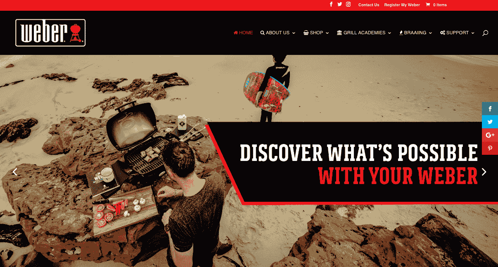](https://www.weber.co.za/)

Weber, the South Africa branch of the famous grill maker

[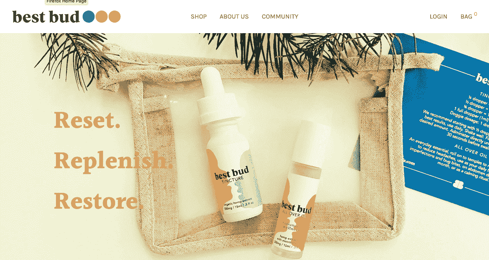](https://www.bestbudforlife.com/)

Best Bud, CBD oil company

[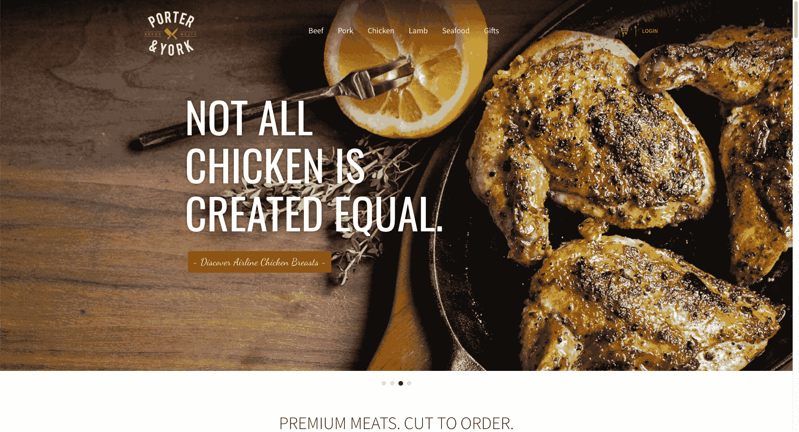](https://porterandyork.com/)

Porter & York, premium meat delivery

## 2.大商业

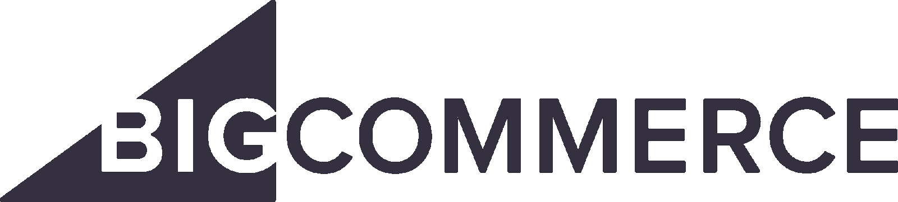

BigCommerce

你需要知道的关于 [BigCommerce](https://www.bigcommerce.com/) 的一切都在它的名字里:它做*大*的事情。这个电子商务平台是为拥有大量产品的大企业和商店，或者计划即将扩张的小商店而设计的。

作为一个复杂的电子商务平台， [BigCommerce 提供了大量的功能](https://kinsta.com/blog/woocommerce-alternative-bigcommerce/)。它是为专业人士设计的，所以它比列表中的其他产品有更多的高级选项。

如果你喜欢定制，并且了解网页设计的最佳实践，这当然很好，但这也意味着更陡峭的学习曲线。BigCommerce 不像这里的其他电子商务选择那样用户友好，尽管他们尽最大努力来吸引新用户。

这一大套功能体现在价格标签上。对于刚刚起步的小商店，你将为你还不需要的功能付费，因此很难证明其成本是合理的。相反，BigCommerce 最适合那些需要更多“引擎盖下的力量”的老牌商店

### **主要特征**

*   容纳大量产品。
*   高度可定制。
*   包括保安。
*   迁移和导入选项。
*   内置 [SEO 增强](https://kinsta.com/blog/wordpress-seo/)。
*   [提高转化率的工具](https://kinsta.com/blog/conversion-rate-optimization-tips/)。
*   不收交易费。

**价格:**

*   BigCommerce 标准:每月 29.95 美元。
*   BigCommerce Plus:每月 79.95 美元。
*   BigCommerce Pro:每月 299.95 美元。
*   大型商业企业:各不相同。

**优点:**

*   满足复杂业务模型的高级功能套件。
*   许多复杂的[定制选项](https://kinsta.com/blog/how-to-customize-wordpress-theme/)。
*   你想卖多少产品就能卖多少。

**缺点:**

*   比其他电子商务平台更难使用。
*   如果你刚开始，有点贵。

### 推荐给…

老牌商店或出售大量产品的商店充分利用 BigCommerce。无论如何，新店和小店最终不会使用很多功能。BigCommerce 是一个重量级的电子商务平台，所以只有当你需要额外的能力时才使用它。

#### 使用 BigCommerce 的在线商店示例

[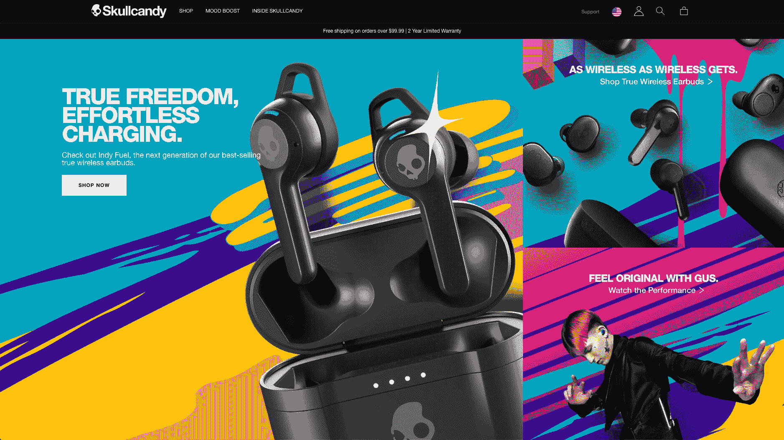](https://www.skullcandy.com/)

Skullcandy, high-end headphones

[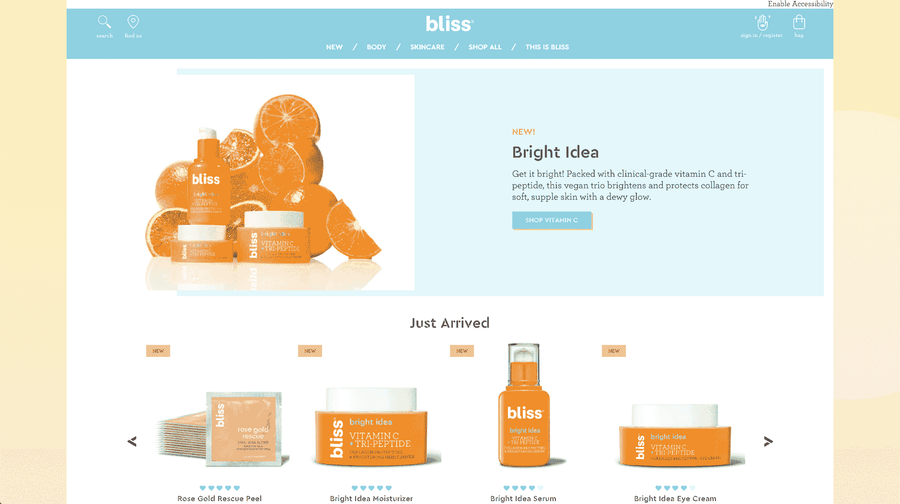](https://www.blissworld.com/)

Bliss, skincare company

[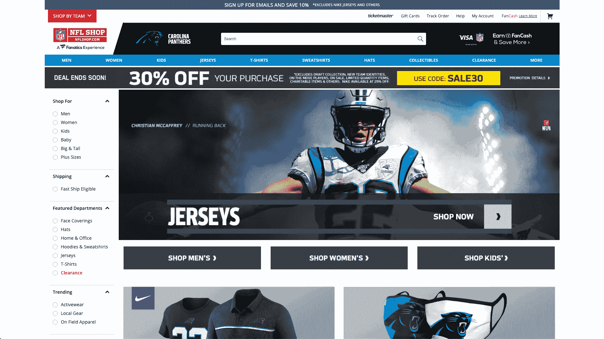](https://www.nflshop.com/carolina-panthers/t-36484679+z-9917544-2409711364)

Carolina Panthers, the official NFL store

## 3\. Shopify

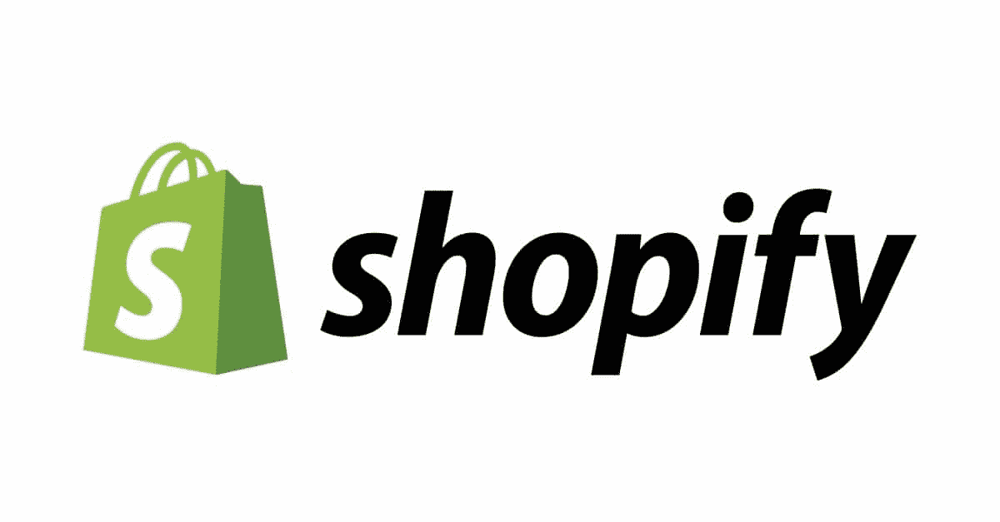

Shopify

另一个流行的电子商务平台是 Shopify，它专注于方便和简单。虽然一个 WooCommerce 网站可能需要几天时间来建立，但你可以在几分钟内启动一个功能齐全的 Shopify 网站。不过，缺点是你没有 WooCommerce 那么多的定制选项。

Shopify 是为那些不想在经营电子商务商店的设计和编码方面花费太多精力的人准备的。该网站是基于模板的，所以你只需选择你的主题并填写你的信息。

选好你的主题后，其他大部分方面就锁定了。虽然这是一个很好的时间节省，但它抑制了定制:没有特殊的视觉效果，创造性的小部件，或优化导航。

虽然这让有大胆想法的人感到沮丧，但对于只关注业务的人来说却是完美的。Shopify 拥有您需要的所有电子商务设施，例如不同类型的促销选项，以及内置的评级系统。

查看关于 [WooCommerce vs Shopify](https://kinsta.com/blog/woocommerce-vs-shopify/) 的比较指南，了解更多详情。

### **主要特征**

*   用户友好的界面。
*   模板式设计。
*   开箱即用的功能。
*   应用程序商店的额外功能。

#### **价格**

*   Shopify Lite:每月 9 美元。
*   基本 Shopify:每月 29 美元。
*   Shopify:每月 79 美元。
*   高级 Shopify:每月 299 美元。
*   Shopify Plus:每月 2000-40000 美元。

#### **优点**

*   所有电子商务平台中最用户友好的。
*   可以快速轻松的开店。
*   不需要设计技能。
*   非常适合[社交媒体整合](https://kinsta.com/blog/wordpress-social-media-plugins/)。
*   适用于小型和大型商店。

**缺点**

*   限量定制。
*   很难从其他 Shopify 网站中脱颖而出。
*   第三方网关交易费用可能会变得昂贵。

### **推荐给…**

正如我们上面提到的，Shopify 非常适合那些只关注业务的人。在设计选择方面，Shopify 可能会受到限制，但对于商业策略、促销和社交媒体营销来说，它是一本开放的书。

因为它如此方便和用户友好，它非常适合那些想建立一个副业或电子商务商店作为爱好或副业的人。时间投入很少，也不需要太多的[维护](https://kinsta.com/blog/wordpress-maintenance/)。

#### 使用 Shopify 的在线商店示例

[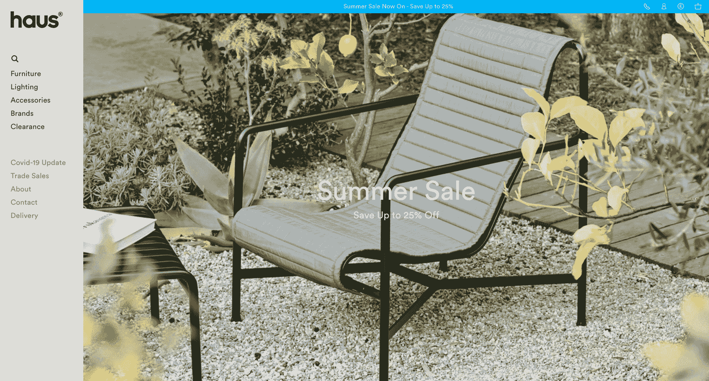](https://hauslondon.com/)

haus, a London furniture store

[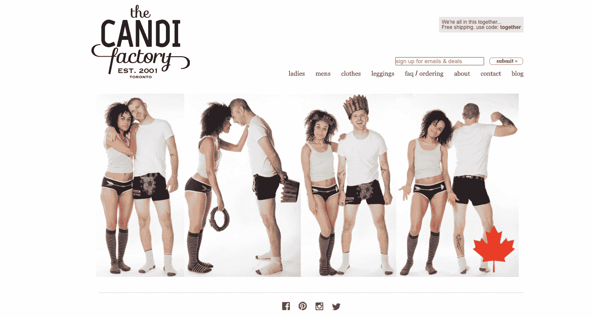](https://www.thecandifactory.com/)

The Candi Factory, a fashion line based in Toronto

[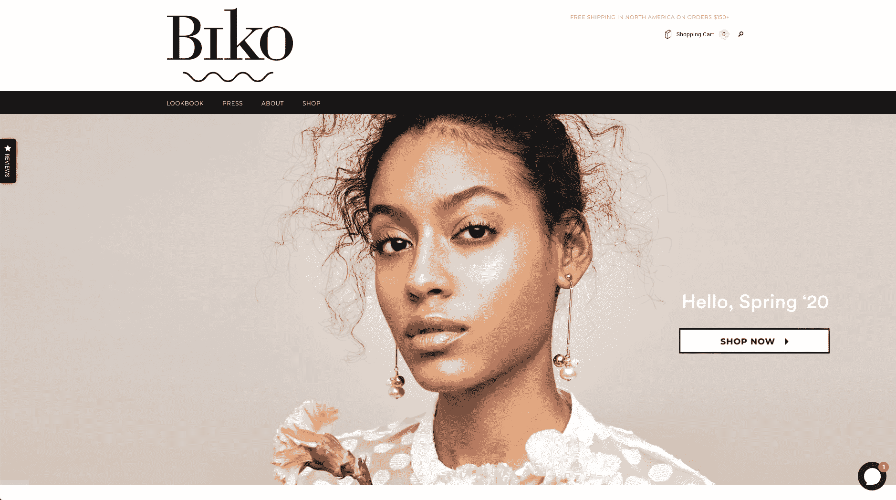](https://www.ilovebiko.com/)

Biko, a “modern nostalgic” jewelry line

## 4.体积

Volusion

仅次于 WooCommerce、Shopify 和 BigCommerce 等最受欢迎的电子商务平台， [Volusion](https://www.volusion.com/) 处于劣势。它提供的服务不如其更成熟的竞争对手多，它的名字也不为人所知。尽管如此，Volusion 作为 Shopify 的替代品，为了方便和 T2 速度，正在慢慢攀升。

Volusion 的真正亮点在于订阅和定期支付。Volusion 是订阅盒和类似商业模式的完美选择，可以直接提供这些类型的支付。

你仍然可以在一些平台上找到这些选项——例如， [WooCommerce 有订阅插件](https://kinsta.com/blog/woocommerce-subscriptions/)——但一般来说，你必须自己找到那些插件，有时甚至要为它们支付额外的费用。

因为 Volusion 没有提供很多高级功能，所以它可以更专注于可用性。例如，它整合了一个毫不费力的[拖放式网站编辑器](https://kinsta.com/blog/wordpress-page-builders/)，所以你可以随意重新排列网站元素。

这种最基本的简单性对第一次建立网站的人来说很有用，但有经验的电子商务经理会错过其他平台免费提供的许多功能，如 [SSL 证书](https://kinsta.com/knowledgebase/how-ssl-works/)、[博客功能](https://kinsta.com/blog/best-blogging-platform/)，甚至是[销售数字产品](https://kinsta.com/blog/website-ideas/)。从好的方面来说，没有交易费，你可以拥有所有你想要的带宽。

### **主要特征**

*   拖放站点编辑器。
*   不收交易费。
*   无限带宽。
*   [针对繁忙的移动通信的响应主题](https://kinsta.com/blog/web-design-best-practices/#mobile-responsiveness)。
*   接受订阅和定期付款。

#### **价格**

*   个人:每月 29 美元。
*   专业:每月 79 美元。
*   商务:每月 299 美元。
*   Prime:自定义。

#### **优点**

*   低成本的电子商务平台，尤其是考虑到没有交易费。
*   唯一一个天生允许订阅和[定期支付](https://kinsta.com/blog/wordpress-membership-plugins/)的电子商务平台。
*   适合新手的简易网站编辑器。

#### **缺点**

*   功能有限。
*   必须从别处购买 SSL 证书吗？
*   没有博客集成。
*   不卖数码产品。

### **推荐给…**

考虑到低成本和简单的网站编辑器，Volusion 最适合小型电子商务企业。这是一个很好的尝试平台——当你只是在学习基础知识时，你不需要高级功能。

## 注册订阅时事通讯

### 想知道我们是怎么让流量增长超过 1000%的吗？

加入 20，000 多名获得我们每周时事通讯和内部消息的人的行列吧！

[Subscribe Now](#newsletter)

此外，Volusion 非常适合使用[订阅/定期支付模式](https://kinsta.com/blog/recurring-revenue-model/)的商店。这是电子商务商店中的一个小利基，但 Volusion 仍然迎合了他们的需求。

#### 使用 Volusion 的在线商店示例

Sesame Street Live, the show’s live performance ticket hub

[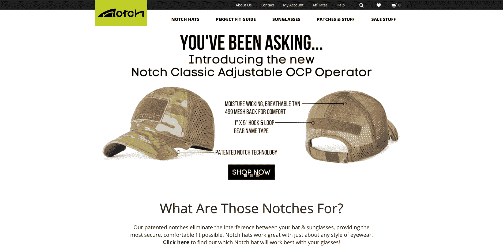](https://www.notchgear.com/)

Notch, innovative hats for sunglasses

[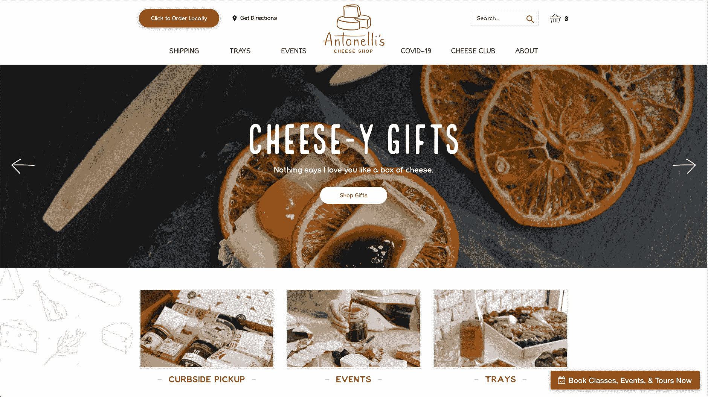](https://www.antonellischeese.com/)

Antonelli’s Cheese Shop, artisanal cheeses

## 5.3dcart

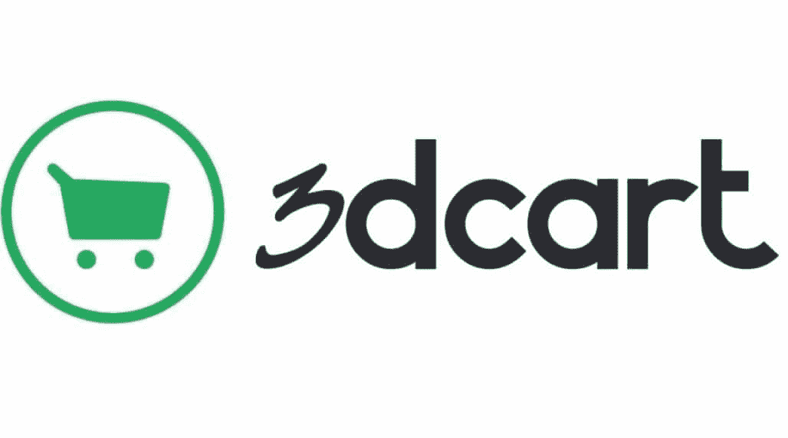

3dcart

尽管规模较小，知名度也不高， [3dcart](https://www.3dcart.com/) 在一个领域胜过其他电子商务平台，它不是 3D 图像或虚拟现实——它是 [SEO](https://kinsta.com/blog/wordpress-seo/) 。自称“搜索引擎优化的最佳电子商务平台”名副其实，它拥有像[面包屑](https://kinsta.com/blog/wordpress-breadcrumbs/)链接和规范[网址](https://kinsta.com/knowledgebase/what-is-a-url/)这样的功能。

许多 SEO 是在幕后决定的，在大多数网站建设者不让你修改的领域:[你如何将你的网站提交给搜索引擎](https://kinsta.com/blog/submit-website-to-search-engines/)、[网站架构](https://kinsta.com/blog/google-sitelinks/#4-use-a-clear-website-structure-and-navigation)、URL 结构，甚至是[代码本身](https://kinsta.com/blog/code-review-tools/)。

了解了这一点，3dcart 就为你优化了那些区域，你就不用担心了。你得到了模板网站建设者的所有好处，但顶级的搜索引擎优化的保证。

不过，3dcart 也有和 Shopify 一样的局限:没有太多的定制。考虑到 3dcart 的主题有点过时，这是特别糟糕的。

然而，也像 Shopify 一样，3dcart 为营销、销售和[促销](https://kinsta.com/blog/ecommerce-strategies/#create-massive-holiday-and-seasonal-coupons)提供了大量电子商务功能。他们还提供了大量的额外津贴，甚至是最低的价格:无交易费、24/7 支持、安全、API 访问、无限带宽和无限产品。

### **主要特征**

*   内部 SEO 设计。
*   为 SEO 预建的主题。
*   无限产品。
*   无限带宽。
*   不收交易费。

#### **价格**

*   创业商店:每月 17.10 美元
*   基本商店:每月 26.10 美元
*   Plus 商店:每月 71.10 美元
*   电源商店:每月 116.10 美元
*   专卖店:每月 206.10 美元

#### **优点**

*   这个平台的一切，从上到下，都是为了 SEO。
*   很多额外津贴，包括 24/7 全天候支持。
*   简单的模板风格的网站设计者。

#### **缺点**

*   定制化的方式很少。
*   模板可以使用更新。

### **推荐给…**

如果你的商业模式[围绕着 SEO](https://kinsta.com/blog/best-seo-plugins-for-wordpress/) ，3dcart 就是你的电子商务平台。另外，3dcart 提供了许多与 Shopify 相同的需求，所以如果你喜欢这种快速简单的设置，如果 Shopify 没有你想要的，它是一个[不错的选择。](https://kinsta.com/blog/shopify-alternatives/)

你的电子商务网站需要一个超快的、可靠的、完全安全的主机吗？Kinsta 提供所有这些服务，并由 WooCommerce 专家提供 24/7 的世界级支持。[查看我们的计划](https://kinsta.com/plans/?in-article-cta)

#### 使用 3dcart 的在线商店示例

France Luxe, fashion accessories

[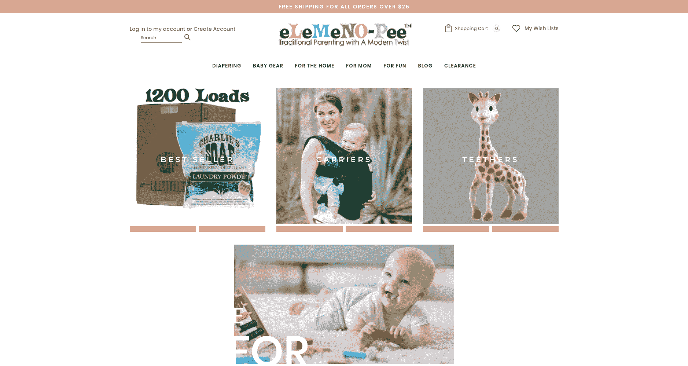](https://www.elemeno-pee.com/)

eLeMeNO-Pee, modern parenting products

Havvn, mood-enhancing skincare 

## 6.大卡特尔

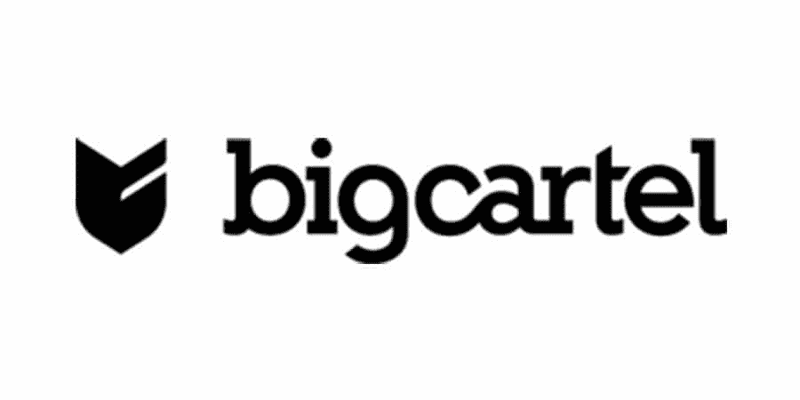

Big Cartel

大卡特尔是一个利基电子商务平台，面向艺术家、手工艺者和其他喜欢出售自己作品的工匠。如果这是你经营的那种生意，大卡特尔是完美的…但对于大多数不生产自己产品的人来说，最好去别处看看。

大卡特尔的一切都迎合小型创意企业，包括艺术网站设计选项。对独立创作者来说，最有吸引力的特点是低成本——没有上市费和交易费。你只需支付月费，甚至还有一个免费账户，包含了大部分功能。

然而，如果你不是一个独立的创造者，许多其他电子商务平台提供更有吸引力的交易。许多创造性的设计方案并不适用于更严肃的品牌。

### **主要特征**

*   不收交易费。
*   没有上市费。
*   艺术设计选项。
*   [代码编辑](https://kinsta.com/knowledgebase/edit-wordpress-code/)。

#### **价格**

*   黄金:免费
*   白金卡:每月 9.99 美元
*   钻石:每月 19.99 美元
*   钛:每月 29.99 美元

#### **优点**

*   与其他电子商务平台相比相对便宜。
*   一个更有创造力和鼓舞人心的网站建设者。
*   透明的商业行为。

#### **缺点**

*   只与一小群卖家有关。

### **推荐给…**

众所周知，大卡特尔推荐给艺术家和工匠。他们的市场可能很小，但他们很好地迎合了这个市场。即使你是一个独立的创作者，你仍然必须在大卡特尔和 Etsy 之间做出选择。

大卡特尔的优势在于拥有自己的商店:这更有利于品牌推广，如果你雄心勃勃，也更容易扩展。

#### 网上商店利用大卡特尔的例子

[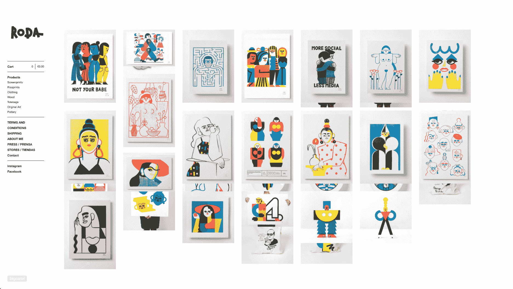](https://josearoda.bigcartel.com/)

RODA, store for artist Jose A. Roda

Little Upside Down Cake, cooking supplies

[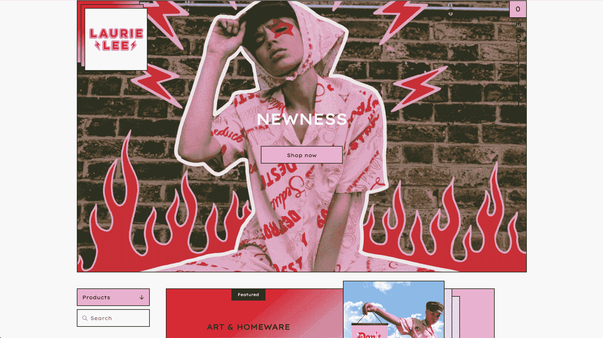](https://www.shoplaurielee.com/)

Laurie Lee, custom art and prints

## 7\. Ecwid

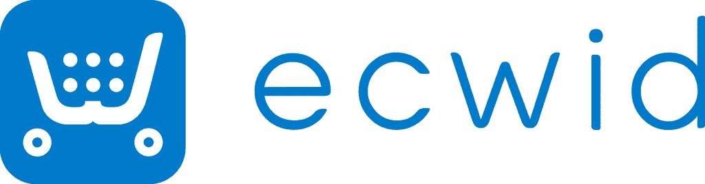

ecwid

就像大卡特尔瞄准艺术家一样，Ecwid 也瞄准小企业。从设置到成本，一切都适合初创公司和小规模公司。

Ecwid 与 Shopify 和 3dcart 属于同一类:设置简单方便，但定制选项有限。为了显示他们对小企业的承诺，他们甚至提供了一个免费计划，你可以列出多达十个项目。但是，一旦你的店铺达到一定规模，Ecwid 的好处似乎就不那么有利了。

对于商业方面的事情，Ecwid 提供了大多数常见的电子商务功能，如[优惠券代码](https://kinsta.com/blog/ecommerce-strategies/#coupons)和 [SSL 证书](https://kinsta.com/knowledgebase/woocommerce-ssl/)，也允许数字商品。他们有一系列优秀的社交媒体选项，加上在脸书、 [Snapchat](https://kinsta.com/blog/snapchat-statistics/) 、 [Pinterest](https://kinsta.com/blog/pinterest-marketing/) 和[谷歌广告](https://kinsta.com/blog/banner-ad-sizes/#most-common-google-banner-ad-sizes)上做广告的选项。

同样，更高的支付层级可以将他们的商店与亚马逊、Etsy 和易贝等其他销售渠道连接起来。这使得 Ecwid 成为运营多渠道电子商务品牌的重要基地。

### **主要特征**

*   简单的设置和用户友好的网站设计工具。
*   直接与社交媒体商店同步。
*   与其他销售渠道整合。
*   不收交易费。

#### **价格**

*   免费计划:免费。
*   风险投资:每月 15 美元。
*   商务:每月 35 美元。
*   无限制:每月 99 美元。

#### **优点**

*   强大的社交媒体功能。
*   非常适合多渠道策略。
*   专为小型企业设计—价格低廉且用户友好。

#### **缺点**

*   没有多少有趣的设计选择
*   不可扩展—对小型企业有利，对大型企业不利

### **推荐给…**

根据设计，建议小型企业使用 Ecwid。较低的成本有利于刚刚起步，它很容易与其他渠道整合，所以你仍然可以使用它作为生命线。此外，社交媒体整合和营销非常适合试图让自己出名的年轻企业。

#### 使用 Ecwid 的在线商店示例

[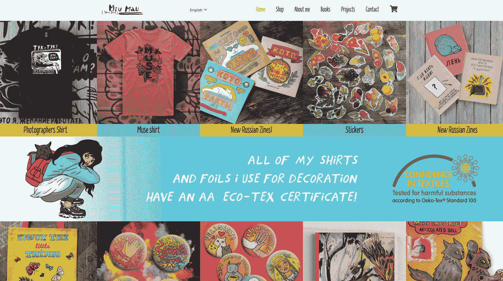](https://mammamiu.com/)

Miu Mau, artist store

[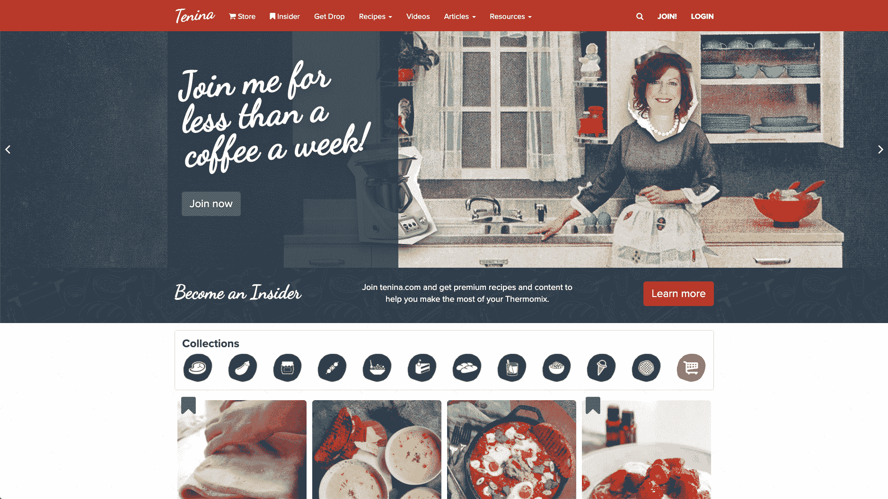](https://tenina.com/)

Tenina, cookbooks and kitchenware

Hansen Distillery, spirits and events venue 

[Ready to find the ecommerce platform that's right for you? 🛍 See the pros, cons, and special features of the biggest names in the business & hit 'add to cart' on the perfect plan 🛒Click to Tweet](https://twitter.com/intent/tweet?url=https%3A%2F%2Fbit.ly%2F2YSDwXt&via=kinsta&text=Ready+to+find+the+ecommerce+platform+that%27s+right+for+you%3F+%F0%9F%9B%8D++See+the+pros%2C+cons%2C+and+special+features+of+the+biggest+names+in+the+business+%26amp%3B+hit+%27add+to+cart%27+on+the+perfect+plan+%F0%9F%9B%92&hashtags=ecommerce%2Conlinestore)

## 您在线商店的最佳电子商务平台

你想卖多少产品？“设计和定制”在哪里符合你的优先事项？[能花多少钱](https://kinsta.com/blog/wordpress-website-cost/)？你的技术知识有多先进？

这些问题的答案将帮助您确定最适合您的电子商务平台。

销售高端珠宝的完美平台可能是销售定制 t 恤的最差平台。在决定您的平台之前，考虑您公司的需求。

现在轮到你了:哪个平台是你个人的选择？为什么你最终选择了那个而不是其他的？在评论里告诉我们吧！

* * *

让你所有的[应用程序](https://kinsta.com/application-hosting/)、[数据库](https://kinsta.com/database-hosting/)和 [WordPress 网站](https://kinsta.com/wordpress-hosting/)在线并在一个屋檐下。我们功能丰富的高性能云平台包括:

*   在 MyKinsta 仪表盘中轻松设置和管理
*   24/7 专家支持
*   最好的谷歌云平台硬件和网络，由 Kubernetes 提供最大的可扩展性
*   面向速度和安全性的企业级 Cloudflare 集成
*   全球受众覆盖全球多达 35 个数据中心和 275 多个 pop

在第一个月使用托管的[应用程序或托管](https://kinsta.com/application-hosting/)的[数据库，您可以享受 20 美元的优惠，亲自测试一下。探索我们的](https://kinsta.com/database-hosting/)[计划](https://kinsta.com/plans/)或[与销售人员交谈](https://kinsta.com/contact-us/)以找到最适合您的方式。