# 横幅广告尺寸:关于谷歌广告、脸书广告、Instagram 广告，你需要知道的一切

> 原文：<https://kinsta.com/blog/banner-ad-sizes/>

不管你喜不喜欢，横幅广告是互联网的重要组成部分。当谈到从你的网站赚钱时，广告可能是一个简单的选择。

如果你刚开始接触展示广告，或者正在寻找增加品牌影响力的方法，展示广告(有时也称为横幅广告)是一个很好的选择。

在这篇文章中，你将了解关于横幅广告的一切，它们是如何工作的，常见的横幅广告尺寸，最重要的是，哪些广告效果最好。

## 什么是横幅广告？

横幅广告(或网络横幅)是一种在线广告，它在网页上嵌入图形，为网站(广告商)带来[流量。](https://kinsta.com/blog/how-to-drive-traffic-to-your-website/)

横幅广告是互联网上发布的首批广告之一。它们被设计得引人注目，这样用户点击它们，就会被重定向到一个外部网站。

它们看起来像这样:

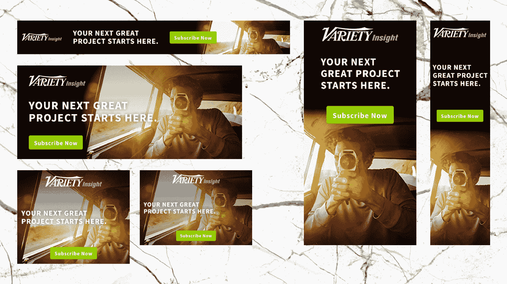

Collection of banner advertisements for inspiration (Image source: [Imgur](https://imgur.com/a/h9QB5))

自第一个横幅广告问世以来，已经过去了近 20 年，从那时起，数字广告客户对它们就有一种又爱又恨的关系。

> Kinsta 把我宠坏了，所以我现在要求每个供应商都提供这样的服务。我们还试图通过我们的 SaaS 工具支持达到这一水平。
> 
> <footer class="wp-block-kinsta-client-quote__footer">
> 
> 
> 
> <cite class="wp-block-kinsta-client-quote__cite">Suganthan Mohanadasan from @Suganthanmn</cite></footer>

[View plans](https://kinsta.com/plans/)

不可否认，横幅广告在帮助[品牌广为人知](https://kinsta.com/blog/wordpress-site-examples/)并让它们出现在互联网上数百个网站上的有效性。

但是，与此同时，[网页设计专家](https://kinsta.com/blog/web-design-best-practices/)认为他们只不过是网站上的入侵者，因为横幅广告可以用他们自己非常强大的身份搞乱本地设计和品牌。

话虽如此，但我们知道付费广告是商家利用其产品和服务吸引更多眼球的方式之一。

### 什么是展示广告？

区分这两者很重要:

展示(或横幅)广告包括在网页的顶部、底部和侧面放置图形展示广告。

横幅广告可以是静态的，也可以是动态的。静态广告只是一个简单的可点击的图像，它把浏览者带到目标网站。一个动画广告服务于同样的目的，唯一的区别是它的内容是动态的。

谷歌提供了世界上最大的广告展示网络，覆盖了全球大约 90%的网络用户。

尽管有替代网络，这些广告通过不同的博客和网站面向更广泛的受众，增强他们对你品牌的认知。
T3】

## 横幅广告是如何工作的？

我们都见过在实体店中使用横幅来宣传商品和服务。在线横幅广告与平面广告建立在相同的前提下，对互联网用户有类似的影响。

然而，横幅广告的主要功能不仅仅是被看到，而是被点击，引导用户直接进入他们希望购买的商业网站。

横幅广告可以成为稳固的业务增长战略。以下是企业投资在线横幅广告的几个原因:

### 1.增加网站流量

当横幅广告有足够的创意来诱惑观众时，它们可以吸引人们点击进入广告商的网站。

品牌使用各种技术和工具来衡量其横幅广告在提高[流量](https://kinsta.com/knowledgebase/dedicated-server/)方面的有效性。

请记住这里的基本设计原则，使用不同的 T2 字体和鲜艳的颜色。这里有一个[醒目横幅广告](https://blog.bannersnack.com/cool-banner-ads-examples/)的绝佳例子:

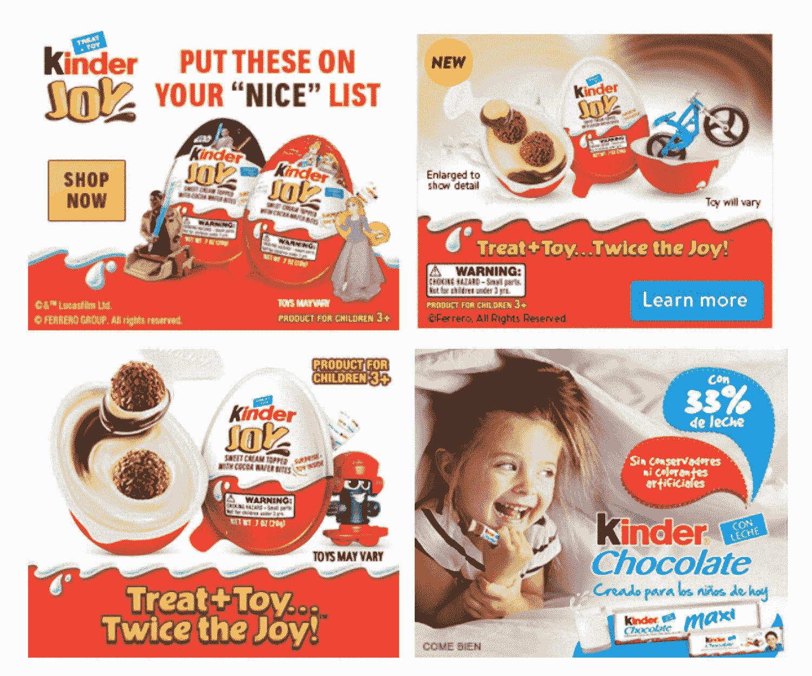

Eye-catching (and hunger-inducing) banner ad example

设计很简单，但它有一个转折:它采用了几种不同的字体，看起来很有趣，吸引了观众。

### 2.在线销售产品

在线展示广告，如果做得好，会诱使观众购买相关产品。

这些广告可以发布在超过 200 万个网站和 650，000 个应用程序上，增加你与任何地方的观众联系的机会。

举个例子，[这则麦当劳广告](https://laceyanndennis.wordpress.com/2019/01/19/analyzing-good-design/):它突出了产品的特点，并提醒观众他们有市场上最好的炸薯条。

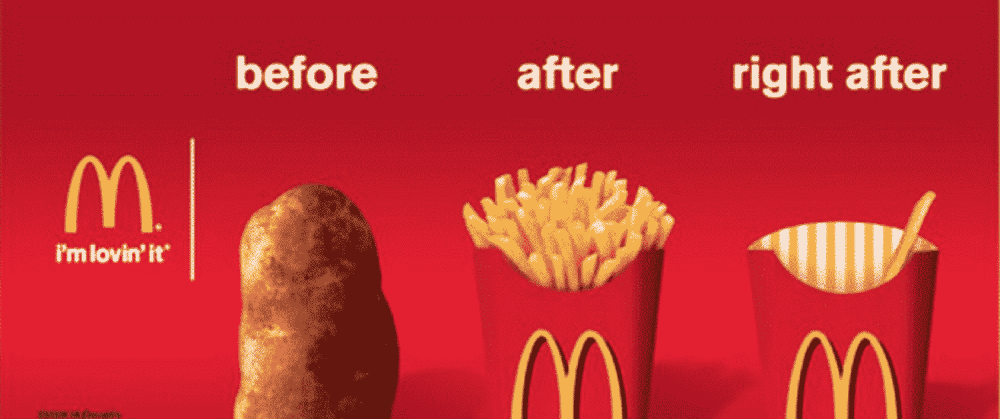

McDonald’s banner ad example

### 3.吸引顾客的注意力

横幅广告应该代表你的品牌的利基，必须坚持的背景。即使你没有明确的品牌声音，你也会知道什么样的信息适合你的受众。

看看下面的例子:

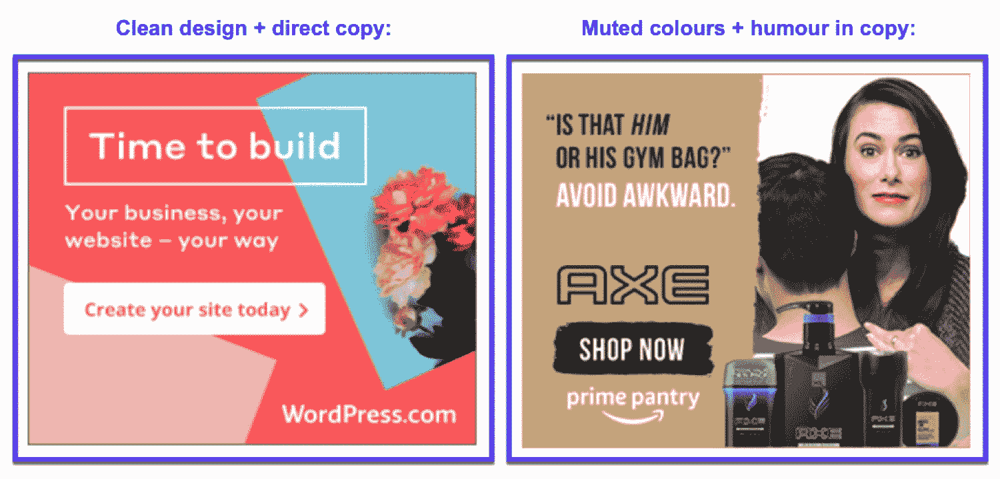

Different copywriting banner ad styles

WordPress 的广告简洁明了，而 Axe/Prime Pantry 的广告使用了幽默和更柔和的调色板。

一个精心制作的广告应该吸引合适的人点击它。

### 4.提供折扣、销售和促销

如果你在没有促销的情况下进行季节性销售，很可能没人会听说。

投放展示广告可以让人们了解你的产品，从而帮助你增加销售收入。

企业的收入通常是谷歌点击付费广告的两倍。小企业在广告上每花费 1.60 美元，就能获得大约 3 美元的收入**。**

 **你的广告必须有[专业外观的内容](https://kinsta.com/blog/content-length/)，一个[好看的配色方案](https://kinsta.com/blog/website-color-schemes/)，和引人注目的图像。你的广告的目标是吸引用户的兴趣，让他们点击进入你的网站。

## 最常见的横幅广告尺寸是多少？

当你做在线广告时，尺寸很重要。

使用正确的横幅广告大小可能是一个成功的活动和一个失败的区别。

不管是你自己在做横幅广告，还是有人在你的网站上做，你都需要知道哪些广告在主要网络中产生了最多的印象、点击和销售:

*   谷歌
*   脸谱网
*   照片墙

每个平台都有自己的广告规范。为了获得最佳的投资回报率，知道如何正确地确定广告的大小是很重要的。

查看以下各平台的最佳横幅广告尺寸:

## 最常见的谷歌横幅广告尺寸

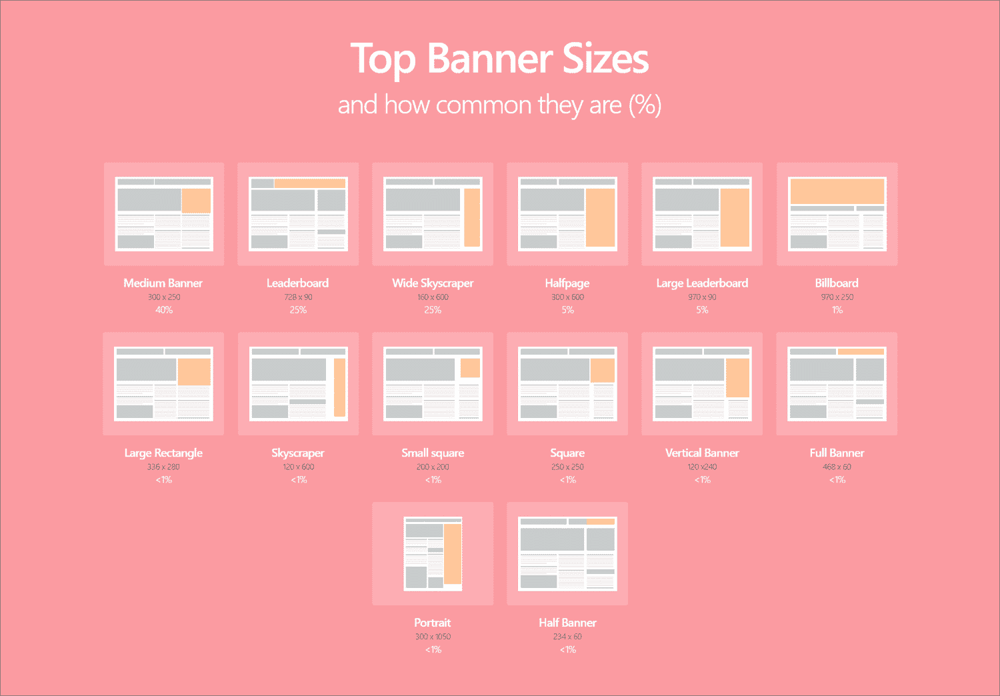

The top Google banner ad sizes (Image source: [Match2One](https://www.match2one.com/blog/standard-banner-sizes/))

谷歌有标准的广告尺寸，每个尺寸的效果都不一样。重要的是要考虑那些最适合你的网页，并跟踪他们的表现。

那么最常见的横幅广告尺寸是多少呢？查看下面最常见的谷歌广告尺寸列表:

### 1.小正方形–200 x 200

这一个相对较小，也没有其他的吸引人，因为它经常包含怪异和混乱的文本和图像。它在出版商中不受欢迎，因为缺乏可见性因素，这会影响广告的整体表现。

### 2.正方形–250 x250

方形广告可能更大，并提供一些多功能性。它是较小空间的理想选择，但由于其尺寸，不是商业的理想选择。

### 3.横幅–468 X60

横幅的格式很宽，类似于排行榜广告，但更小。它通常放在导航栏上方或主要内容之间。尽管有多功能因素，但由于尺寸限制，它不能提供更好的性能。

### 4.排行榜–728 x 90

这是一种公认的广告形式，经常出现在导航栏上方，尤其是在论坛中。由于尺寸的原因，它更容易被看到，并迅速抓住观众的注意力。

### 5.嵌入式矩形–300 x 250

也被称为“中号矩形”，这个广告在大多数在线商家中很受欢迎。如果放在侧边栏和有机内容之间，效果会很好，这意味着它可能会吸引更广泛的受众。

### 6.大矩形–336 x 280

适当的大小，如果放在边栏和主要内容中，可以提供有效的性能。这是一个非常引人注目的广告，这也是为什么它是大多数出版商的共同选择。

### 7.摩天大楼–120 x600

摩天大楼放置在边栏中，是展示向下递减视觉效果的理想广告。窄宽度的设计可以适合大多数宽广告不会去的地方。它提供了稳定的广告效果。

### 8.宽阔的摩天大楼–160 x600

宽摩天大楼主要用于侧栏，与窄摩天大楼的用途相同。更大更显眼。广告宽度对页面访问者有很大的影响。

### 9.半页广告–300 x600

半页广告由于其较大的尺寸提供了较高的可见性。它覆盖了将近一半的网页，适合更好的参与度。

### 10.大型排行榜–970 x 90

这比标准排行榜大得多，为读者参与提供了更多空间。

### 谷歌展示广告技巧

如果你是制作横幅广告的新手，或者你想提高你的广告效果，这里有一些直接来自谷歌的建议:

*   创建您自己的自定义图像。
*   别忘了[优化图片](https://kinsta.com/blog/optimize-images-for-web/)和你的品牌标志。
*   明智有效地使用颜色。
*   写一个有效的标题(使用[标题分析器](https://kinsta.com/blog/headline-analyzer/))。
*   使用移动响应广告。
*   在你的文案中包括价格、促销和独家新闻。
*   使用相关的[登录页面](https://kinsta.com/blog/wordpress-landing-page-plugins/)。

## 最常见的脸书广告尺寸

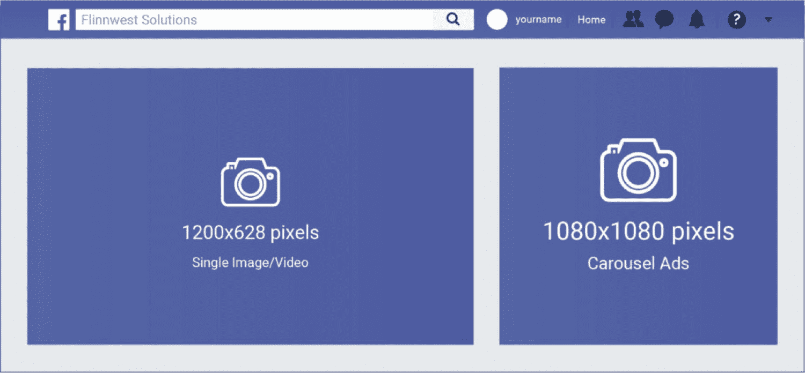

The most common Facebook ad sizes (Image source: [Flinnwest Solutions](https://flinnwestsolutions.com/social-media-ad-image-sizes-guide/))

在投放脸书广告时，你要确保在合适的人面前投放合适的广告。

每个月有超过 20 亿人使用脸书，这意味着很多人都有可能看到你的广告。

使用最佳尺寸的脸书广告对留下良好的第一印象很重要。如果你花了几个小时制作广告，你最不希望的就是因为使用了错误的广告尺寸而浪费了你的努力。

以下是脸书广告(和视频广告)的推荐尺寸:

### 1.脸书 Feed 图像广告–1200 x628

尽管视频越来越受欢迎，但大多数脸书广告仍然以单一图像为特色。图像广告不太可能很快消失。为什么？因为在广告中使用图像比制作视频要容易得多。

### 2.脸书视频广告–600 x 315 或 600 x 600

脸书 Feed 视频广告与脸书 Feed 图像广告基本相同:他们只是使用视频而不是静态图像。

### 3.脸书旋转木马广告–1080 x 1080

脸书旋转木马广告是一个多才多艺的选择。它们允许你在一个广告中展示多个产品的图片(或视频)。用户可以通过滑动来查看不同的幻灯片(图像或视频)

### 4.脸书右栏广告–1200 x628

脸书的右栏广告曾经是所有脸书广告的标准。然而，随着手机使用的增加，对纯桌面广告的需求减少了。

### 5.Facebook Marketplace 广告–1200 x628

Facebook Marketplace 是一个人们可以买卖东西的地方(像易贝或 Craigslist)。这些广告就在想买东西的人面前，所以他们可能会更注意你的广告。

## 注册订阅时事通讯

### 想知道我们是怎么让流量增长超过 1000%的吗？

加入 20，000 多名获得我们每周时事通讯和内部消息的人的行列吧！

[Subscribe Now](#newsletter)

### 6.Facebook 即时文章广告–1200 x628

[即时文章](https://kinsta.com/blog/facebook-instant-articles/)专为媒体出版商设计，可通过手机或 messenger 应用程序向受众快速发布互动文章。广告可以是图像或视频。

### 7.脸书故事广告–1080 x 1920

脸书故事广告可以混合使用静态图像和短视频。图像可见 5 秒钟(除非用户滑动)，视频持续整个视频长度(最长 15 秒)

### 8.脸书系列广告–600 x600

脸书收藏广告允许用户在手机上浏览产品目录。点击后，用户会被带到一个由即时体验驱动的快速加载的可视化目录(无需离开脸书)。

### 脸书广告技巧

以下是你可以利用[脸书营销](https://kinsta.com/blog/facebook-marketing/)和推广你的内容/业务的一些其他方法:

*   锁定一个(非常)特定的受众来提高转化率。
*   在你的 WordPress 网站上使用一个[脸书插件](https://kinsta.com/blog/wordpress-facebook-plugins/)。
*   通过举办竞赛来提高参与度。
*   创建简短的、[可分享的视频帖子](https://www.facebook.com/179619508911400/videos/2023131051165269/)。
*   瞄准你现有的脸书潜在客户。
*   创建并优化你的[脸书页面](https://kinsta.com/blog/how-to-create-a-facebook-page/)

## 最常见的 Instagram 广告尺寸

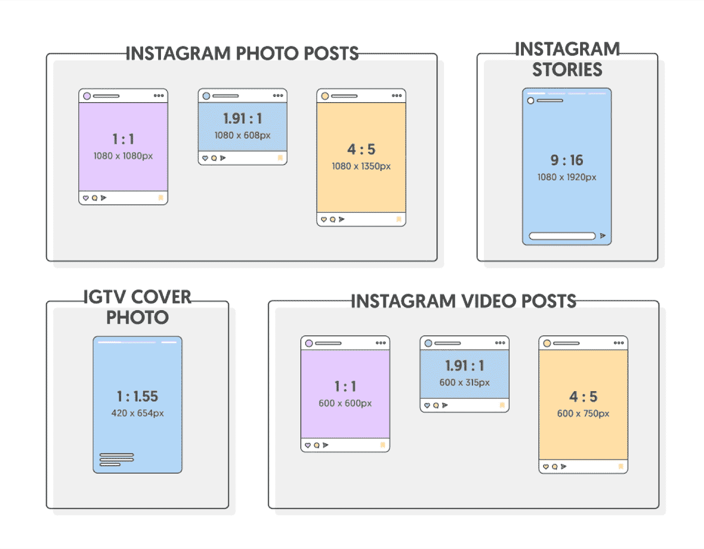

The most common Instagram Ad sizes (Image source: [Influencer Marketing Hub](https://influencermarketinghub.com/instagram-ad-sizes/))

你知道吗，[每月有 10 亿人使用 Instagram】？](https://kinsta.com/blog/instagram-stats/)

分享了很多图像。

如果你打算在 Instagram 上做一些广告来吸引这些用户，你应该确保你使用了正确的广告形式。

我们收集了一些最常见的 Instagram 广告类型及其正确的大小，以提供帮助。

这样，你就可以确保你的 Instagram 广告不会因为错误的原因在社交网络上脱颖而出。以下是 Instagram 广告和视频广告的推荐尺寸:

### 1.Instagram 单幅图片广告–400 x 500

Instagram 图片广告是平台上最常见的广告之一。这是一个单一的图像(横向或纵向)，占据了用户的整个屏幕。

### 2.Instagram 视频广告–最大 400×500

视频广告在 Instagram 上非常受欢迎，也是 Instagram 的 IGTV 的标准格式。就像图像广告一样，你可以创建一个风景、正方形或垂直的视频。

### 3.Instagram 轮播广告–1080 x 1080

轮播广告允许您在广告中使用多达十张图片(或视频)。适用于宣传多种产品或包含不同角度的照片。每张卡片在转盘中都可以有自己的链接。

### 4.Instagram Stories 轮播广告–1080×1920

Instagram 在故事中提供两种类型的轮播广告:原生故事轮播和可扩展故事轮播。

### 5.Instagram 幻灯片广告–最大 600 x 600 像素。1080 x 1080

使用精选图像或视频并添加音乐配乐的幻灯片广告(只要您拥有使用音乐的合法权利)。您可以使用多达 10 个图像来制作循环视频。

### 6.Instagram Stories 图片广告–1080 x 1920

这些广告显示了 Instagram 用户故事之间的全屏垂直广告。它们会显示五秒钟，或者直到用户退出 Instagram story。

### 7.Instagram Stories 视频广告–1080 x 1920

使用 Stories 视频广告，您可以包含声音并使其成为全屏垂直广告。这些出现在 Instagram 用户的故事之间。人们可以采取行动观看长达 120 秒。

### Instagram 广告技巧

以下是你可以使用 Instagram 营销和推广你的内容/业务的一些其他方法:

厌倦了慢热的主持人？Kinsta 的设计考虑了速度和性能。[查看我们的计划](https://kinsta.com/plans/?in-article-cta)

*   使用 Instagram 插件在你的 WordPress 网站上显示订阅源。
*   为你的商业页面选择正确的类别。
*   优化您的照片(使用正确的[图像尺寸](https://kinsta.com/blog/social-media-image-sizes/))。
*   分享用户生成的内容。
*   上传视频(尤其是直播视频)。
*   尝试[与有影响力的人](https://kinsta.com/blog/saas-marketing/#influencer-marketing-focus-on-microinfluencers)合作，获得更广泛的影响。

## 表现最好的横幅广告是什么？

最好的横幅广告取决于你在哪里做广告。考虑一下这个:

由于 Instagram 故事的参与度增加，与脸书相比，[广告商在 Instagram 广告上的花费更多。事实上，Instagram 上的广告支出**高出 23%**:](https://sproutsocial.com/insights/instagram-stats/)

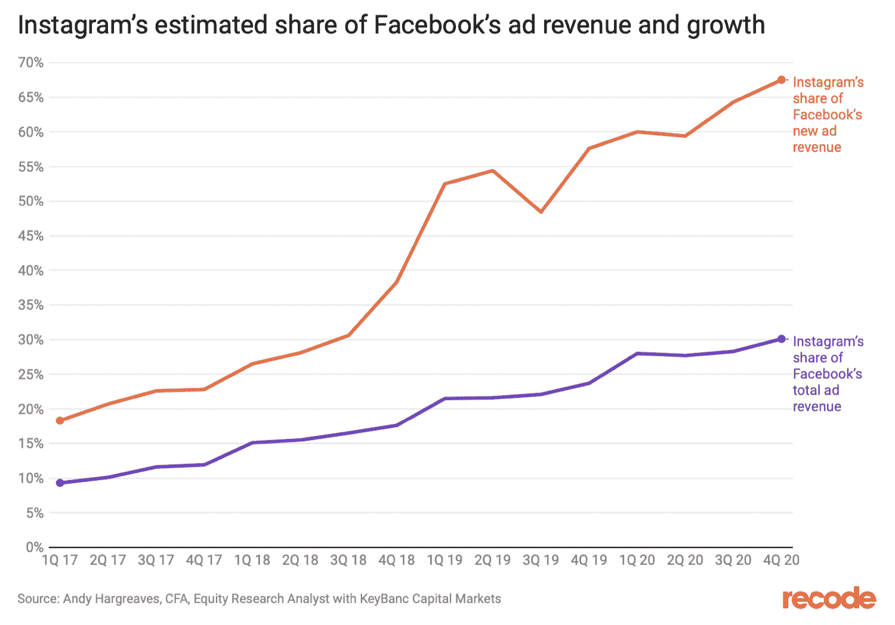

Instagram vs Facebook ad revenue vs growth

但是不要忽略脸书。根据 2019 年的一项研究，脸书仍有 18.87 亿人口，这还不算太糟。

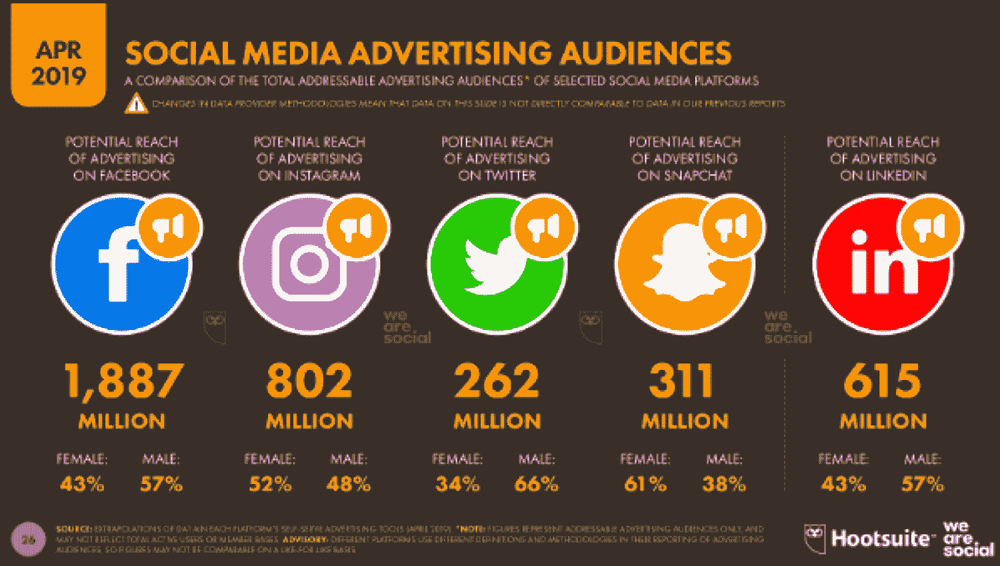

A comparison of social media advertising audiences

这些数据有什么意义？

好吧，让你使用的表现最好的广告将取决于你在哪里做广告，做什么广告。

通过数字来跟踪广告是有用的，或者至少意识到这些数字。统计数据有助于组织广告支出的最佳投资领域(以及应该避免的领域)。

请记住:并非所有的广告都是平等的。

### 谷歌中表现最佳的横幅广告尺寸

为了获得最佳效果，了解不同的横幅广告尺寸及其用途至关重要。

下面，我们将带您了解表现最佳的横幅广告类型，以及作为全球最大的广告展示网络 Google Display Network 的发布者，您如何从中获得最大收益。

[根据谷歌](https://support.google.com/google-ads/answer/7031480?hl=en&ref_topic=3121943)的说法，这些是你通过[谷歌广告](https://kinsta.com/blog/how-to-use-google-adwords/)投放广告时应该考虑的最常见的广告尺寸:

### 中等矩形–300 x 250

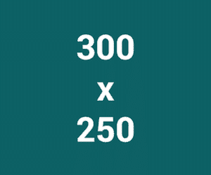

300 x 250 banner ad example

谷歌广告网络有大量的中型或倾斜矩形广告库存。这种尺寸在嵌入网站文字或文字末尾时效果最佳。

### 大矩形–336 x 280

[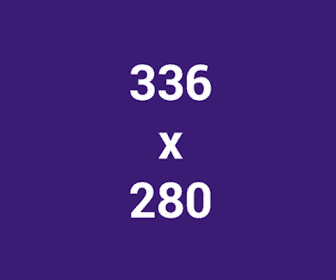](https://kinsta.com/wp-content/uploads/2020/06/large-rectangle-1.png)

336 x 280 banner ad example

与内联矩形类似，大矩形也很流行，也很商业化。由于其可见性，它可以抓住访问者的注意力，增加点击的机会。当放在文本内部或末尾时，效果最佳。

### 排行榜–728 x 90

728 x 90 banner ad example

一个非常常见的谷歌广告横幅，排行榜通常在放在网站内容上方时转换良好。它有一个很长的水平宽度，自动使其更加明显。它用于显示品牌名称、文本和徽标。

### 半页广告–300 x600

[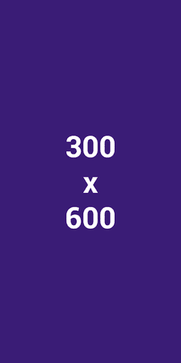](https://kinsta.com/wp-content/uploads/2020/06/half-page-1-1.png)

Half-page 300 + 600 banner ad example

半页广告有一个非常引人注目的尺寸，理想地放在内容旁边。它提供更高的回报，使其成为广告商和出版商最喜欢的形式。

### 移动排行榜–320 x 50

320 x 50 banner ad example

谷歌不为桌面、平板或笔记本电脑屏幕设计移动排行榜广告。这种广告尺寸只会带来智能手机观众的最佳反应。

## 提高广告效果的 5 个简单横幅设计技巧

当设计横幅广告时，你有三个选择:雇用知道他们在做什么的人，自己做，或者使用在线生成器。

无论你选择哪一个，为了获得最佳的广告效果，你都需要考虑一些事情。让我们讨论一些重要的横幅设计技巧:

### 1.简单是王道(避免广告填充)

无论你制作的横幅广告大小如何，都要避免用无用的内容、图片和其他元素包装广告。它会让观众感到困惑。

只坚持相关的内容，提供关于你的报价的具体信息，并邀请观众点击进入。

当你想向用户传递信息时，简单的设计通常是最有效的。看看这个 Join.me 广告横幅的例子:

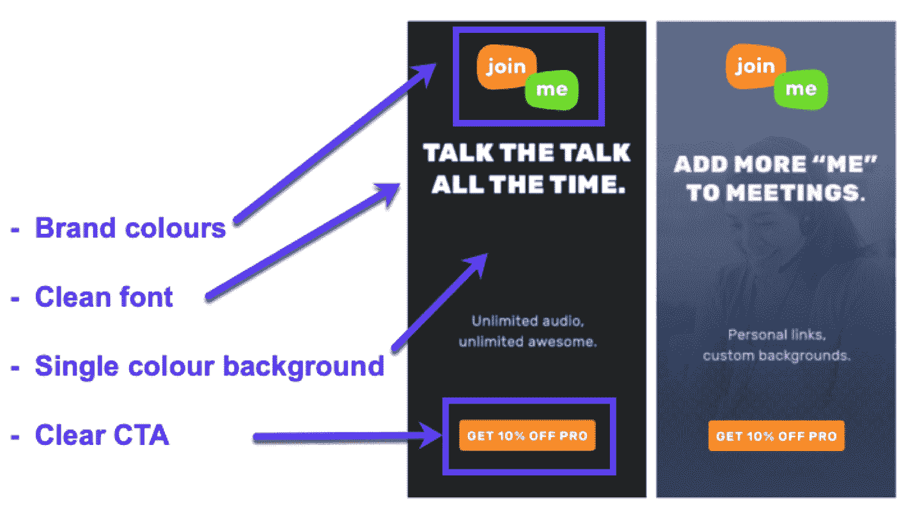

Simple and effective banner ad design

他们使用单一的颜色背景，一个全大写的[易读字体](https://kinsta.com/blog/wordpress-fonts/)，一些颜色(取自他们的标志)用于强调，并以清晰的 CTA 为特色。

### 2.使用图像(照片或插图)

[图像](https://kinsta.com/blog/free-images-for-wordpress/)引人注目。根据你的目标，你会想要使用插图或照片(可能是你的产品)。

将图片与一些字体和清晰的横幅 CTA 配对是吸引用户注意力的好方法。看看这些例子:

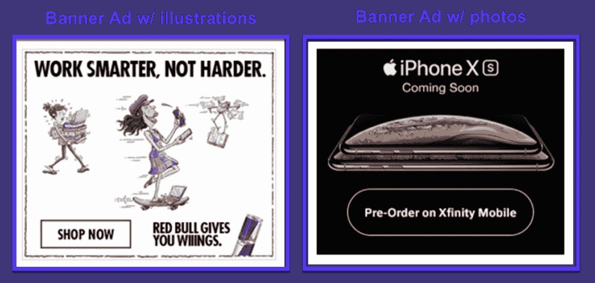

Illustrations vs photos banner ads

这些为什么有效？

红牛横幅包括与清晰的 CTA 配对的品牌插图。而 iPhone X 的广告展示了一个清晰的行动号召的产品。

两者都使用图像来提醒用户他们的品牌并鼓励点击。

### 3.使用 CTA 按钮

号召行动广告按钮[增加你网站的点击率](https://kinsta.com/blog/conversion-rate-optimization-tips/)。

使用对比色设计它们，并放在广告的右下方或左侧，如下所示:

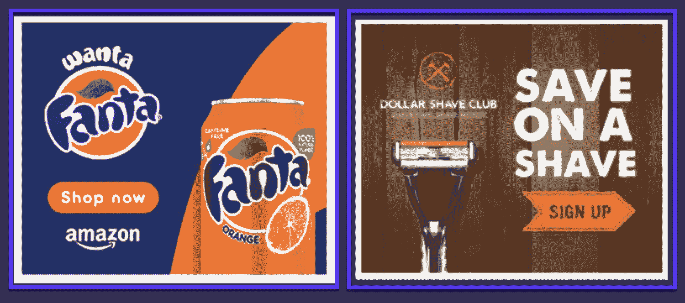

Banner ad CTA examples

关键是让他们在整个广告中保持一致。

### 4.清楚

广告文案应该是相关的。理想情况下，它必须有一个[标题](https://kinsta.com/blog/headline-analyzer/)和一个运行文本，这就是所谓的副本。

看看这些例子，每个广告都有一个引人注目的标题，后面是解释产品的文字:

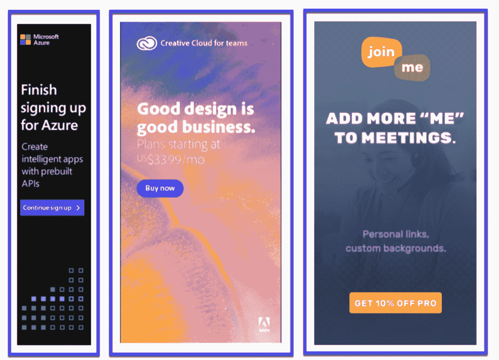

Examples of copy in banner ads

如果你的广告没有用简单的语言表达品牌承诺，它就达不到目的。努力使你的广告清晰，这样它们就不会分散顾客的注意力。

### 5.避免闪烁的横幅

最实用和有用的广告类型是 HTML5 横幅、[静态 JPG 图片](https://kinsta.com/blog/jpg-vs-jpeg/)和 [GIF 图片](https://kinsta.com/blog/wordpress-gifs/)。

Flash 横幅曾经在网上库存中占很大比例，但现在，它们在出版商中并不常见。原因是 flash 并不是[优化网页图片](https://kinsta.com/blog/optimize-images-for-web/)的最佳格式，主要是因为与安全相关的[问题，非常](https://kinsta.com/blog/wordpress-security/)[加载时间](https://kinsta.com/blog/third-party-performance/)，没有 [SEO 好处](https://kinsta.com/blog/wordpress-seo/)。

所以无论你做什么，不要选择闪光横幅。

[Whether you love them or hate them, banner ads are a big part of the internet. 🚩 Learn how to optimize them for every channel with this in-depth guide 💰Click to Tweet](https://twitter.com/intent/tweet?url=https%3A%2F%2Fkinsta.com%2Fblog%2Fbanner-ad-sizes%2F&via=kinsta&text=Whether+you+love+them+or+hate+them%2C+banner+ads+are+a+big+part+of+the+internet.+%F0%9F%9A%A9+Learn+how+to+optimize+them+for+every+channel+with+this+in-depth+guide+%F0%9F%92%B0&hashtags=ads%2Cppc)

## 摘要

理解与不同横幅广告尺寸相关的所有细节并想出高性能的广告需要大量的时间和实践。这就是为什么建议考虑雇佣一个专业人士来指导你并代表你开展活动，这样你的企业就可以利用这些营销工具。

如果你想发展一个成功的在线业务，横幅广告应该在你的雷达上，让你的品牌在更多人面前快速出现。为了获得更多的曝光，你应该把它和内容营销结合起来。

现在，轮到你了:你试过运行付费广告吗？你的体验如何？请在评论中告诉我们！

* * *

让你所有的[应用程序](https://kinsta.com/application-hosting/)、[数据库](https://kinsta.com/database-hosting/)和 [WordPress 网站](https://kinsta.com/wordpress-hosting/)在线并在一个屋檐下。我们功能丰富的高性能云平台包括:

*   在 MyKinsta 仪表盘中轻松设置和管理
*   24/7 专家支持
*   最好的谷歌云平台硬件和网络，由 Kubernetes 提供最大的可扩展性
*   面向速度和安全性的企业级 Cloudflare 集成
*   全球受众覆盖全球多达 35 个数据中心和 275 多个 pop

在第一个月使用托管的[应用程序或托管](https://kinsta.com/application-hosting/)的[数据库，您可以享受 20 美元的优惠，亲自测试一下。探索我们的](https://kinsta.com/database-hosting/)[计划](https://kinsta.com/plans/)或[与销售人员交谈](https://kinsta.com/contact-us/)以找到最适合您的方式。**