# 如何阻止注册垃圾邮件(插件和策略)

> 原文：<https://kinsta.com/blog/stop-wordpress-registration-spam/>

试图阻止你网站上的注册垃圾邮件？

因为 [WordPress 的巨大人气](https://kinsta.com/wordpress-market-share/)，它成为了全世界垃圾邮件发送者的诱人目标。他们可能只是试图利用您的网站并获得访问权限。或者，他们可能想给你的社区发垃圾邮件，比如用垃圾主题填充[你的论坛](https://kinsta.com/blog/wordpress-forum-plugins/)。

如果你允许在你的 WordPress 网站上公开注册，你几乎肯定会遇到某种形式的垃圾注册问题。

在这篇文章中，你将学习如何使用内置的 WordPress 功能和免费插件来减少垃圾注册。

### 更喜欢看[视频版](https://www.youtube.com/watch?v=U-DDpW1PD78)？

## 默认的 WordPress 注册过程

在我们进入战术之前，让我们简单讨论一下默认的 WordPress 注册过程。

如果你允许在你的站点公开注册，默认的注册页面位于**https://yoursite.com/wp-login.php?action=register:**

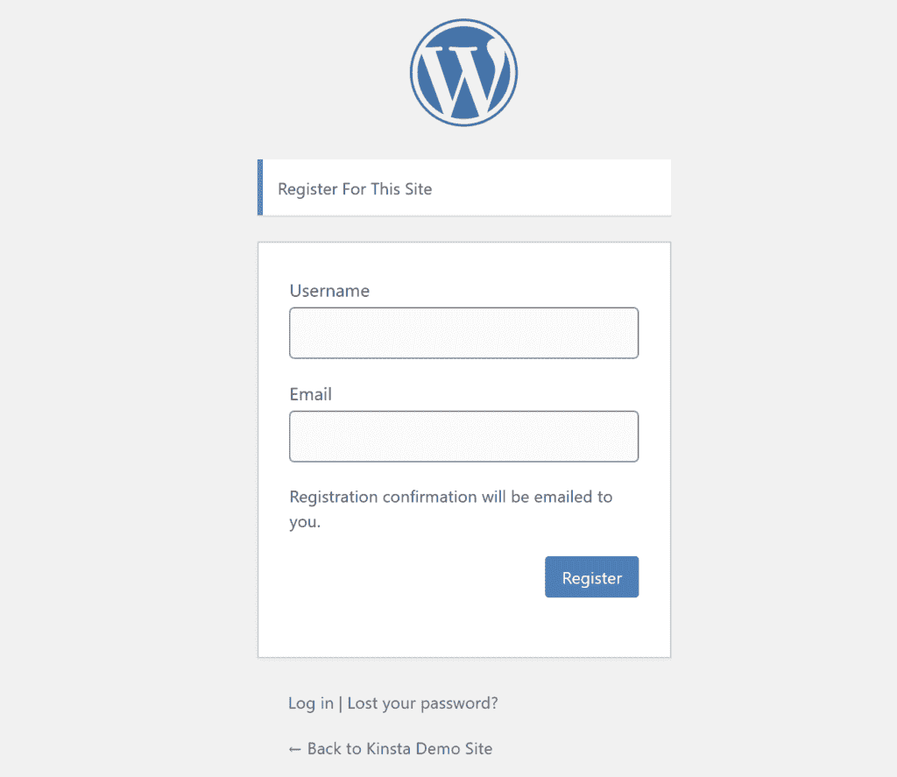

The default WordPress registration form

正如你所看到的，没有多少阻止恶意行为者或机器人创建垃圾邮件注册。

机器人可以直接进入你的注册页面，在每个域中添加相同的公式，没有什么可以阻止他们填写表单域。

## 如何阻止注册垃圾邮件

有许多不同的策略可以用来阻止注册垃圾邮件。根据您站点的需求和问题的严重性，您可能只需要实施这些策略中的一种，或者您可能需要尝试多种策略来阻止垃圾邮件。

以下是完整的策略列表:

### 完全禁用 WordPress 注册

首先，如果你不需要在你的 WordPress 网站上公开注册，最好干脆禁用注册，而不是试图打击垃圾注册。

即使你需要在你的网站上给其他人用户账号，那也不一定意味着你需要启用公共注册。例如，如果你只需要[一小部分人拥有自己的账户](https://kinsta.com/blog/wordpress-user-roles/)，你可以手动为他们创建账户，而不是让他们自己注册。

要完全禁用 WordPress 上的用户注册，进入**设置→常规**并确保**任何人都可以注册**框中的**未被选中**:

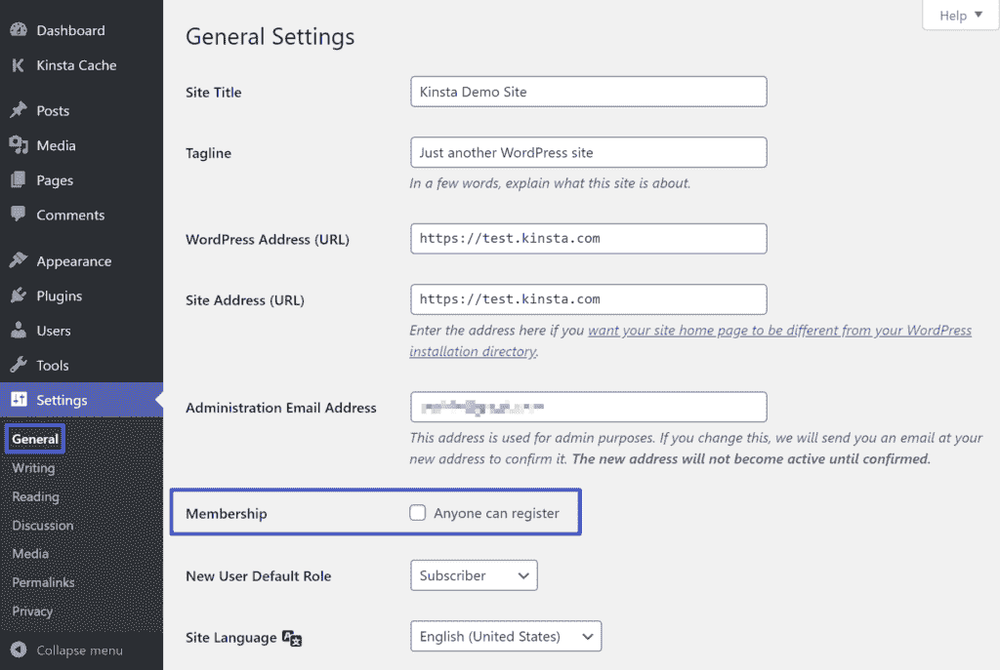

How to disable WordPress registration

一旦您禁用注册，任何试图访问您的默认注册页面的人都会看到以下消息:

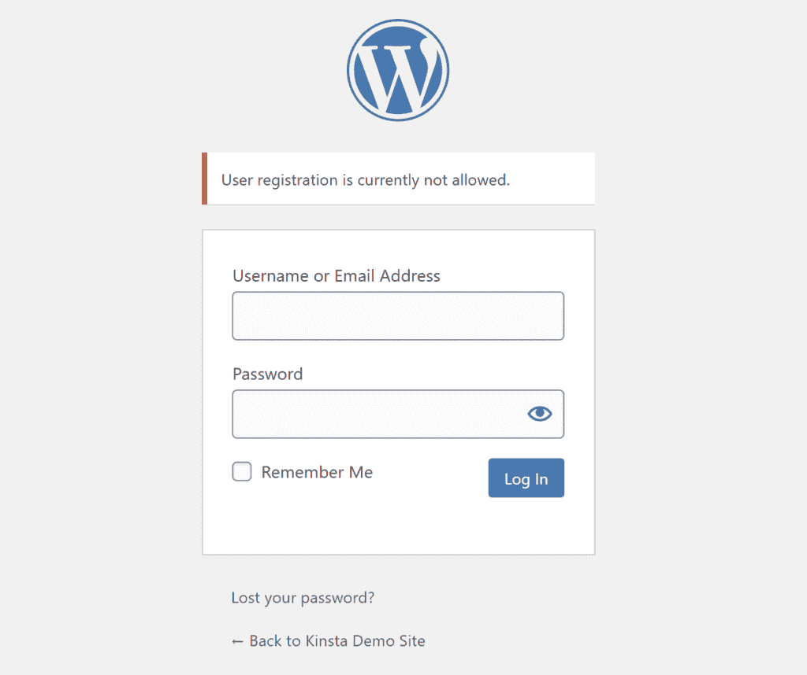

一例残疾人登记

### 将验证码添加到您的注册表中

另一种防止用户注册垃圾的方法是在默认的 WordPress 注册表单中添加验证码。

有各种类型的验证码可以使用，但大多数人认为谷歌的 reCAPTCHA 服务是最用户友好的(也称为无验证码 reCAPTCHA)。它的目标是对大多数合法的人类访问者不可见，同时仍然向它确定可能是机器人的访问者显示验证码测试。

要将 NoCAPTCHA reCAPTCHA 添加到你的 WordPress 注册表单中，你可以使用免费的[高级 noCaptcha &隐形验证码(v2 & v3)](https://wordpress.org/plugins/advanced-nocaptcha-recaptcha/) 插件。

要设置插件，你首先需要[从谷歌](https://www.google.com/recaptcha/admin)生成一个免费的 reCAPTCHA API 密匙——只需要进入你的网站并选择[使用哪种类型的 reCAPTCHA](https://kinsta.com/blog/wordpress-captcha/#step-2-create-your-google-recaptcha-and-add-it-to-your-site):

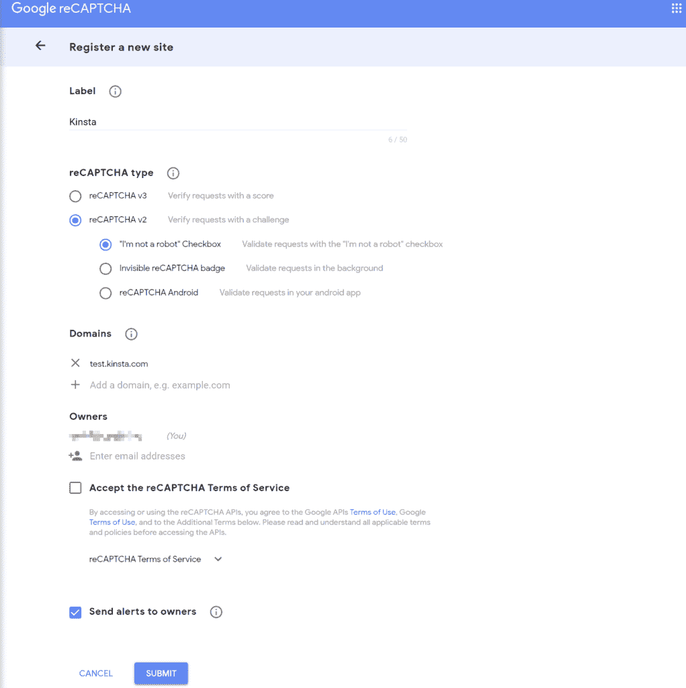

Generating reCAPTCHA API key

然后，你可以进入**设置→高级 noCaptcha &隐形验证码**设置插件:

*   选择版本(*确保这与您在创建 API 密钥*时选择的相匹配)。
*   添加您的站点密钥和秘密密钥(*在您提交之前截图的表单后，Google 会给您这些密钥*)。
*   选择在哪里启用您的验证码。除了注册表单之外，您还可以在站点的其他部分启用它，比如您的登录表单。

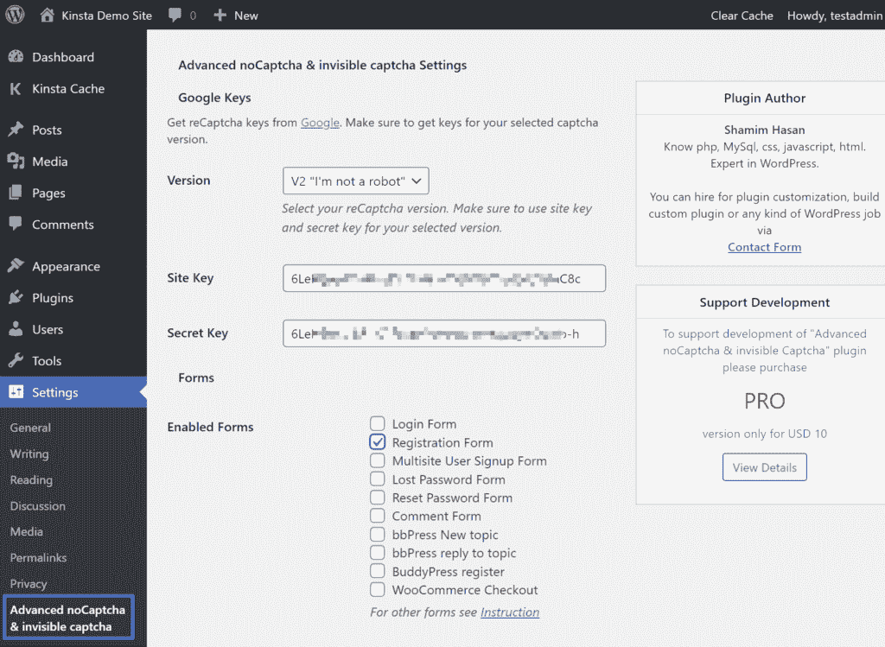

How to set up WordPress reCAPTCHA

保存更改后，您应该会在注册页面上看到您的验证码表单(除非您选择了一种不可见的方法，在这种情况下，它只会对可疑的机器人可见):

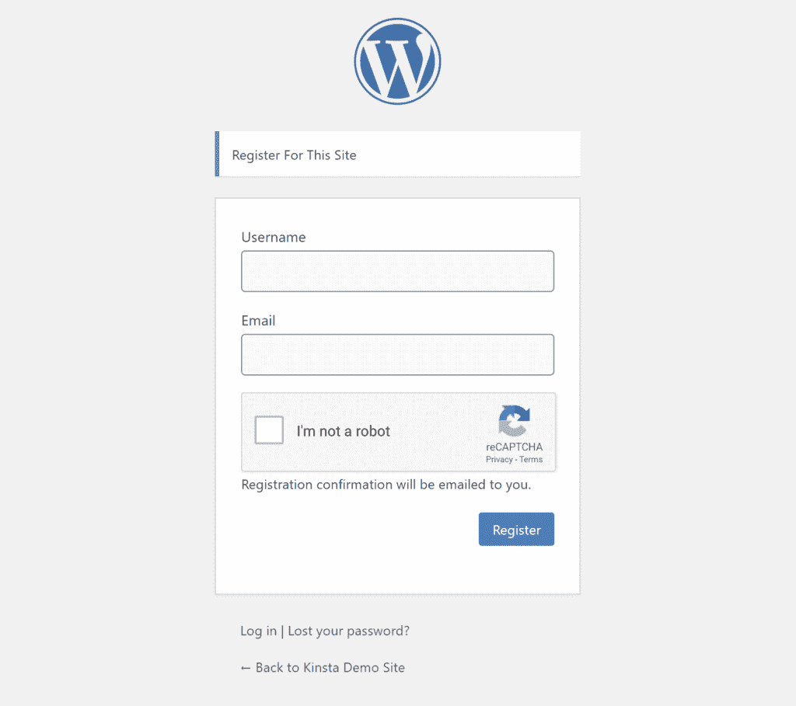

An example of reCAPTCHA on the default registration form

### 使用专门的注册垃圾邮件插件

一些通用的 WordPress 反垃圾邮件插件可以帮助阻止 WordPress 注册垃圾邮件，以及其他领域的垃圾邮件，比如你的评论区或表单提交。

不幸的是，Automattic 的流行的 [Akismet 评论垃圾插件](https://kinsta.com/blog/wordpress-spam-comments/#stop-wordpress-spam-comments-with-a-plugin)对注册垃圾邮件不起作用，但其他一些流行的阻止注册垃圾邮件的选项包括:

*   [阻止垃圾邮件发送者](https://wordpress.org/plugins/stop-spammer-registrations-plugin/)
*   [清谈](https://wordpress.org/plugins/cleantalk-spam-protect/)
*   [WPBruiser](https://kinsta.com/blog/wordpress-spam-comments/#other-spam-plugins)
*   [零垃圾邮件](https://wordpress.org/plugins/zero-spam/)

同样，这些插件不仅限于注册垃圾邮件，但他们确实可以帮助您阻止垃圾邮件注册，作为其反垃圾邮件工作的一部分。

### 新用户需要管理员批准

如果除了垃圾邮件账户本身，你还担心注册了后的[人们会做什么，另一个好的策略是要求新用户的管理员批准。](https://kinsta.com/blog/wordpress-user-registration-plugins/)

## 注册订阅时事通讯

### 想知道我们是怎么让流量增长超过 1000%的吗？

加入 20，000 多名获得我们每周时事通讯和内部消息的人的行列吧！

[Subscribe Now](#newsletter)

例如，如果你担心有人向你的 bbPress 论坛或 [BuddyPress 社区](https://kinsta.com/blog/wordpress-forum-plugins/#buddypress)发送垃圾邮件，要求管理员批准可以让你避免这种情况。

这是一个与验证码或其他策略结合的好方法:验证码将过滤掉低级别的自动垃圾邮件，而您可以使用手动批准来捕捉其他所有内容。

然而，如果您有大量的垃圾邮件注册，并试图自己实施这一策略，您可能会发现自己在试图对所有注册进行排序时不知所措。

新用户需要管理员批准，你可以使用免费的 WP 批准用户插件。

一旦你安装并激活了插件，它马上就开始工作了。您现有的所有用户都将被批准(以避免问题)。

然而，新用户将需要手动批准，你可以在你的 WordPress 仪表盘的现有的**用户**区域完成:

Approving users with WP Approve User plugin

您还可以选择在用户处于以下情况时发送和自定义电子邮件:

*   被认可的
*   未经同意的

您可以通过访问**设置→批准用户**来启用这些电子邮件并自定义其内容。

### 阻止恶意 IP 地址

如果你的大量注册垃圾邮件来自同一个 IP 地址，你可以通过首先阻止这些 IP 地址访问你的网站来解决这个问题。

如果你的主机在 Kinsta，我们会在 Kinsta 仪表板中为[提供一个 IP 拒绝工具。要访问它，请打开您遇到问题的站点，并选择站点仪表板侧边栏中的 **IP 拒绝**选项:](https://kinsta.com/knowledgebase/block-ip-address/)

[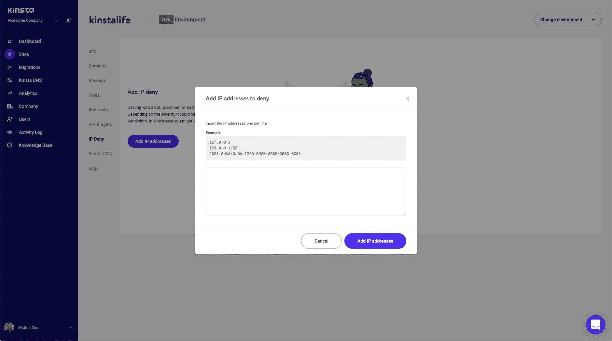](https://kinsta.com/wp-content/uploads/2020/06/ip-deny-tool-mykinsta.png)

How to block IP addresses with MyKinsta

大多数 [cPanel](https://kinsta.com/knowledgebase/what-is-cpanel/) 主机应该也会给你一个 IP 拦截工具。

### 更改 WordPress 注册 URL

如果你想给你的注册页面增加一些“安全性”并减少低级别的机器人流量，你可以[改变你的注册页面的 URL](https://kinsta.com/blog/wordpress-login-url/) 而不是所有 WordPress 网站使用的默认 URL。

厌倦了 WordPress 的问题和缓慢的主机？我们提供世界一流的支持，由 WordPress 专家提供 24/7 服务和超快的服务器。[查看我们的计划](https://kinsta.com/plans/?in-article-cta)

注册页面实际上是 [WordPress 登录页面](https://kinsta.com/blog/wordpress-login-url/)的一部分，所以你可以用任何允许你改变 WordPress 登录 URL 的插件来完成。

一个好的选择是免费的 WPS 隐藏登录插件。

一旦你安装了插件，进入**设置→ WPS 隐藏登录**进入你的新网址。您还可以将默认 URL 重定向到另一个页面，如您的 404 页面:

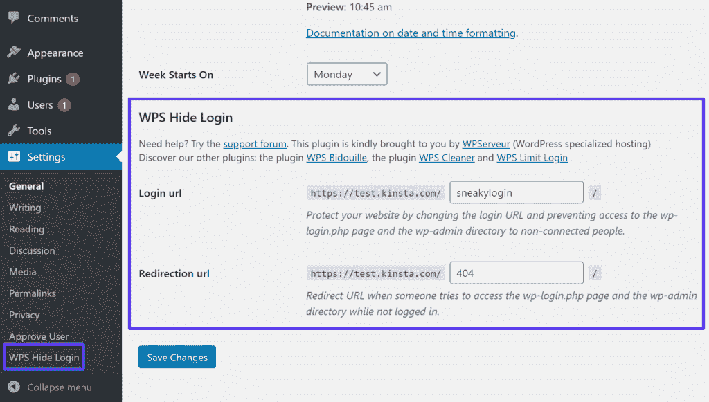

How to change WordPress registration URL

例如，如果您将您的登录 URL 更改为**yoursite.com/sneakylogin**，那么默认注册页面将不再起作用。你的新注册页面将会是 yoursite.com/sneakylogin/?action=register 的**。**

 **### 使用自定义 WordPress 注册表单插件

另一个阻止 WordPress 注册垃圾邮件的好方法是使用一个定制的 WordPress 注册表单插件。

这些插件可以让你绕过正常的 WordPress 注册过程，还可以实现一些有用的反垃圾邮件策略，比如:

*   **自定义注册网址**–改变你的默认注册网址可以减少一些低级垃圾邮件，尽管它本身不太可能阻止用户注册垃圾邮件。
*   **电子邮件确认**–这通过要求新用户确认其电子邮件来防止垃圾邮件用户发送虚假电子邮件。如果用户没有确认他们的电子邮件，插件将自动放弃注册。
*   **新用户的管理批准**–这些插件通常可以帮助你实现上面的管理批准功能。
*   **垃圾邮件防御**–这些插件还可以帮助您将验证码或蜜罐字段添加到您的自定义注册表中。

许多通用的 [WordPress 表单插件](https://kinsta.com/blog/wordpress-contact-form-plugins/)也包括创建带有反垃圾邮件功能的自定义注册表单的能力。然而，这里的缺点是，您通常只能在高级版本中获得注册功能。如果你愿意付钱，一些好的选择是:

*   [Gravity 与](https://kinsta.com/blog/wordpress-contact-form-plugins/#gravity-forms)[形成](https://www.gravityforms.com/add-ons/user-registration/)用户注册插件(可与 Elite 许可证一起使用)
*   [强大的表单](https://kinsta.com/blog/wordpress-contact-form-plugins/#formidable-forms)与[用户注册插件](https://formidableforms.com/user-registration/)(可凭营业执照使用)

让我们仔细看看如何使用用户注册和配置文件生成器插件提供的两个免费解决方案。

#### 1.用户注册

当你安装[免费用户注册插件](https://wordpress.org/plugins/user-registration/)时，它会给你一个选项，让你自动创建位于【yoursite.com/registration】T2 的自定义注册页面(你可以随时更改这个 URL)。

在注册过程中，您还有其他一些减少垃圾邮件的方法。

首先，在插件设置的**通用选项**选项卡中，您可以使用**用户登录选项**下拉菜单在用户注册后要求管理员批准:

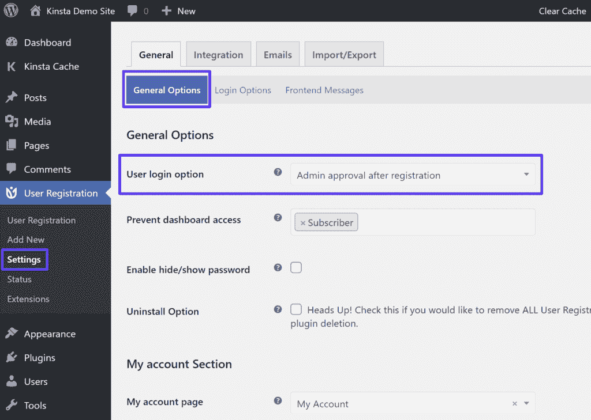

Enabling admin approval in User Registration plugin

你也可以去 **Integration** 标签来设置 Google reCaptcha ( *你将需要你的 API 密匙——你可以遵循本文前面的相同步骤*):

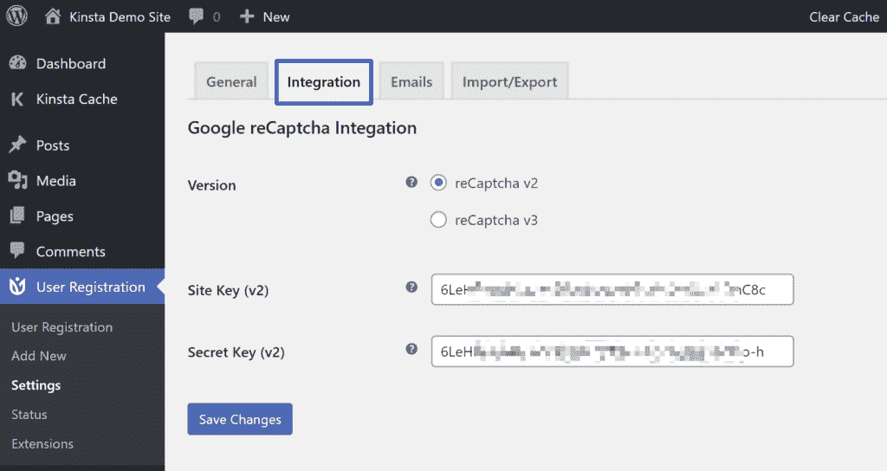

Enabling reCAPTCHA in User Registration plugin

要在特定的注册表单上启用 CAPTCHA，您还需要编辑该表单并在那里启用它。编辑表单时，如果需要，还可以添加其他配置文件信息字段。

#### 2.配置文件生成器

免费的 Profile Builder 插件遵循相同的基本方法。

要定制您的注册表单字段，您可以转到**个人资料生成器→表单字段**。要将验证码添加到您的表单中，您可以包含一个 reCAPTCHA 字段，您需要在其中添加 API 密钥:

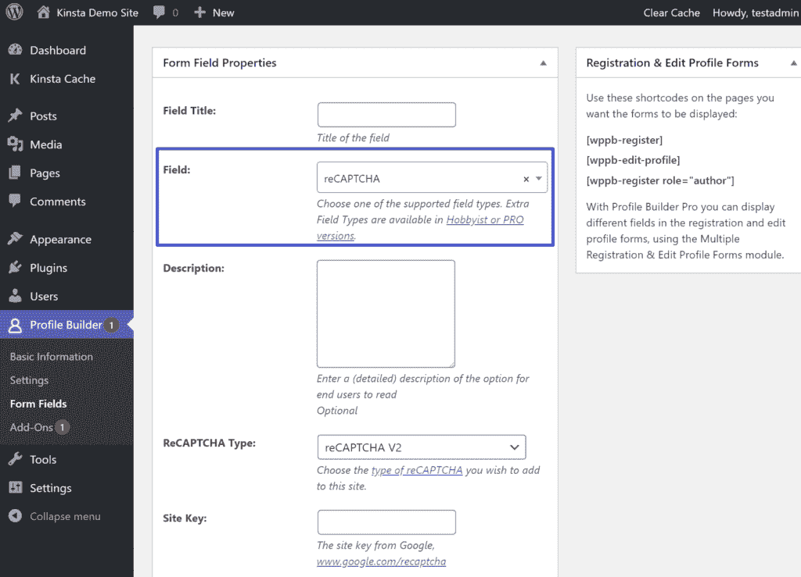

Adding a CAPTCHA field in Profile Builder plugin

然后，为了显示您的定制注册表单，您可以在站点的任何地方添加**【wppb-register】**[简称](https://kinsta.com/blog/wordpress-shortcodes/)。

Profile Builder 还包括一个新注册需要管理员批准的功能，但它只在高级版本中可用。

[This mix of WordPress features + free plugins = the recipe for stopping spam registrations before they fill up your site ❌ .Click to Tweet](https://twitter.com/intent/tweet?url=https%3A%2F%2Fkinsta.com%2Fblog%2Fstop-wordpress-registration-spam%2F&via=kinsta&text=This+mix+of+WordPress+features+%2B+free+plugins+%3D+the+recipe+for+stopping+spam+registrations+before+they+fill+up+your+site+%E2%9D%8C+.&hashtags=spam%2CWordPresshelp)

## 摘要

如果你需要允许在你的 WordPress 站点上公开注册，注册垃圾邮件会是一个令人沮丧的问题。你可以结合不同的策略来减少甚至完全消除注册垃圾邮件。

最简单、最轻量级的选择是在默认的 WordPress 注册表单中添加一个 NoCAPTCHA reCAPTCHA。大多数人类访客不会注意到任何不同，但谷歌会向机器人显示验证码测试，以防止他们垃圾注册。

如果你想要一个全面的检查，你也可以使用一个专用的 [WordPress 注册插件](https://kinsta.com/blog/wordpress-user-registration-plugins/)来创建一个定制的注册表单，包括它自己的反垃圾邮件属性，以及像新用户的管理员批准这样的功能。

* * *

让你所有的[应用程序](https://kinsta.com/application-hosting/)、[数据库](https://kinsta.com/database-hosting/)和 [WordPress 网站](https://kinsta.com/wordpress-hosting/)在线并在一个屋檐下。我们功能丰富的高性能云平台包括:

*   在 MyKinsta 仪表盘中轻松设置和管理
*   24/7 专家支持
*   最好的谷歌云平台硬件和网络，由 Kubernetes 提供最大的可扩展性
*   面向速度和安全性的企业级 Cloudflare 集成
*   全球受众覆盖全球多达 35 个数据中心和 275 多个 pop

在第一个月使用托管的[应用程序或托管](https://kinsta.com/application-hosting/)的[数据库，您可以享受 20 美元的优惠，亲自测试一下。探索我们的](https://kinsta.com/database-hosting/)[计划](https://kinsta.com/plans/)或[与销售人员交谈](https://kinsta.com/contact-us/)以找到最适合您的方式。**