# WordPress 媒体库的完整指南(包括 4 个方便的媒体库)

> 原文：<https://kinsta.com/blog/wordpress-media-library/>

图片和其他媒体文件是任何 WordPress 网站的重要组成部分。为了有效地使用它们，牢牢掌握 WordPress 媒体库是如何工作的会有所帮助。

这个便利的 WordPress 功能使你能够存储和管理[你的图片和其他媒体](https://kinsta.com/blog/free-images-for-wordpress/)。通过一些内部知识和一些简单的技巧，你可以通过媒体库做很多事情来改进你的网站。

在这本全面的指南中，我们将带你了解关于 **WordPress 媒体库**的一切，包括如何导入和[下载内容](https://kinsta.com/blog/wordpress-download-manager/)。我们还将介绍图像编辑、长期文件管理和四种用于整合高级功能的技巧。

我们开始吧！

## WordPress 媒体库简介

从本质上来说，你的 WordPress 媒体库正如它的名字所暗示的:你上传到你的网站的所有媒体文件的目录:

[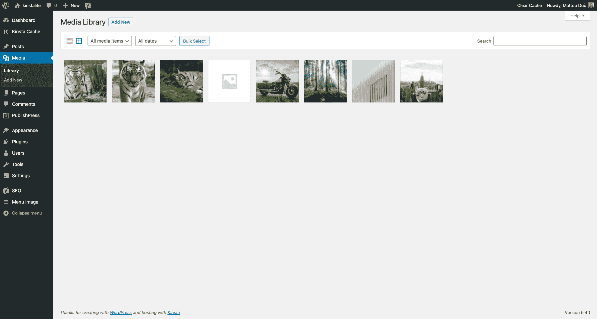](https://kinsta.com/wp-content/uploads/2020/05/WordPress-Media-Library-1.png)

WordPress Media Library


WordPress 能够托管各种类型的媒体，包括:


> 需要在这里大声喊出来。Kinsta 太神奇了，我用它做我的个人网站。支持是迅速和杰出的，他们的服务器是 WordPress 最快的。
> 
> <footer class="wp-block-kinsta-client-quote__footer">
> 
> 
> 
> <cite class="wp-block-kinsta-client-quote__cite">Phillip Stemann</cite></footer>

[View plans](https://kinsta.com/plans/)

*   图片。jpg、. jpgjpeg 文件。png 文件扩展名为. png 文件扩展名为. png 文件扩展名为. png 文件扩展名为. png 文件扩展名为. png 文件扩展名为. png 文件扩展名为. png 文件扩展名为 gif、和。(ico)。
*   [音频](https://kinsta.com/blog/wordpress-audio-players/)文件(. mp3，. m4a，.奥格还有。wav)。
*   [视频](https://kinsta.com/blog/video-hosting/) (.mp4，. m4v，.mov，。wmv，。avi，。mpg，。ogv、. 3gp 和. 3g2)。
*   [pdf](https://kinsta.com/blog/wordpress-pdf-viewer-plugins/)。
*   [Word 文档](https://kinsta.com/blog/google-docs-to-wordpress/)。
*   Excel [电子表格](https://kinsta.com/blog/wordpress-table-plugins/)。
*   PowerPoint 演示文稿。
*   Adobe Photoshop 文档。

它还具有一些有限的照片编辑功能，所以你可以从你的仪表板上根据需要进行调整。

不幸的是，WordPress 还不支持开箱即用的 webp 图片。

要访问您的媒体库，只需随时点击管理侧栏中的**媒体** :

[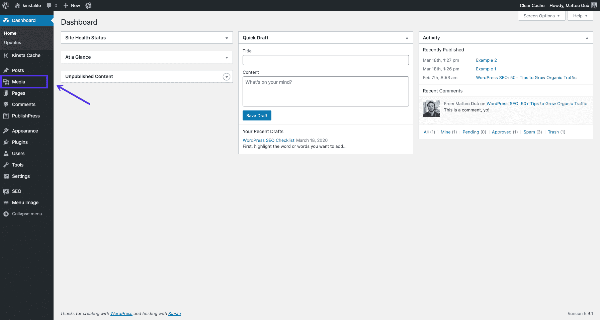](https://kinsta.com/wp-content/uploads/2020/05/accessing-wordpress-media-library-1.png)

Accessing WordPress Media Library


这里有几个基本选项。

首先，您可以通过单击相关图标来确定是否要在列表或网格视图中查看您的文件:

[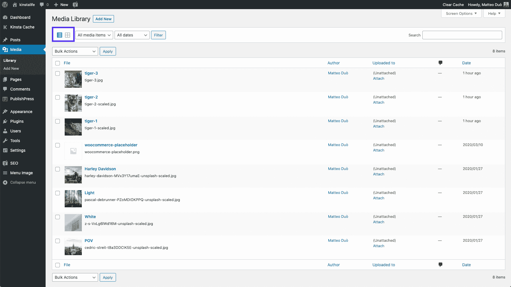](https://kinsta.com/wp-content/uploads/2020/05/wordpress-media-library-view-options.png)

WordPress Media Library view options


您也可以使用下拉菜单过滤文件:

[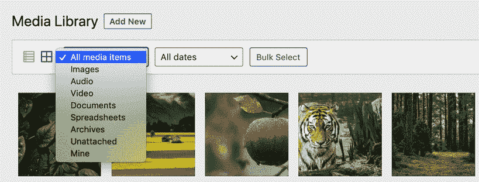](https://kinsta.com/wp-content/uploads/2020/05/Filtering-WordPress-Media-Library-files.png)

Filtering WordPress Media Library files


第一个菜单使您可以按类型查看您的媒体，而第二个菜单将按上传日期过滤您的媒体库内容。

您也可以使用搜索栏按名称查找特定文件:

[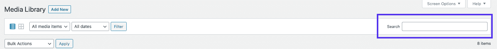](https://kinsta.com/wp-content/uploads/2020/05/WordPress-Media-Library-search-bar.png)

WordPress Media Library search bar


最后，还有一个**批量选择**按钮。这个功能允许你一次从你的 WordPress 安装中删除几个文件:

[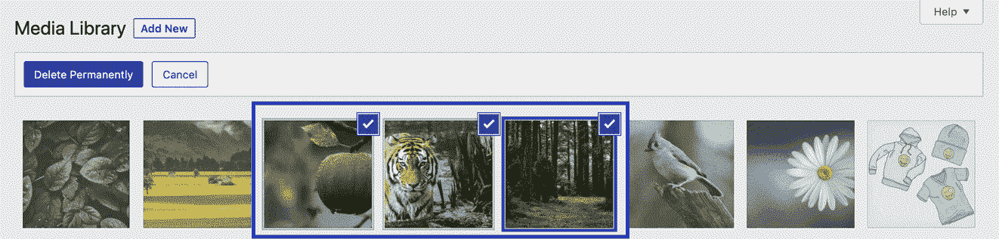](https://kinsta.com/wp-content/uploads/2020/05/media-bulk-select-1.png)

Bulk select option in the WordPress Media Library


这涵盖了 WordPress 媒体库屏幕上所有可用的本地功能。

稍后您将看到，您可以进行许多修改来增强它。然而，首先我们需要讨论如何向 WordPress 添加文件。

[✨图片是销售和吸引用户的有效方式。了解你需要知道的关于 WordPress 媒体库的一切📸 点击推文](https://twitter.com/intent/tweet?url=https%3A%2F%2Fkinsta.com%2Fblog%2Fwordpress-media-library%2F&via=kinsta&text=%E2%9C%A8+Images+are+powerful+ways+to+sell+and+engage+with+your+users.+Learn+everything+you+need+to+know+about+the+WordPress+Media+Library+%F0%9F%93%B8&hashtags=WordPress%2Cmedia)


## 如何向你的 WordPress 媒体库添加文件

有几种不同的方法可以添加文件到你的 WordPress 媒体库。首先是导航到**媒体>添加新的**:

[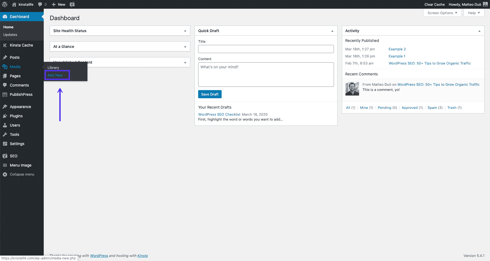](https://kinsta.com/wp-content/uploads/2020/05/add-media-wordpress.png)

Accessing the WordPress Media Uploader


在这里，您可以上传保存在您的计算机或其他设备上的文件:

[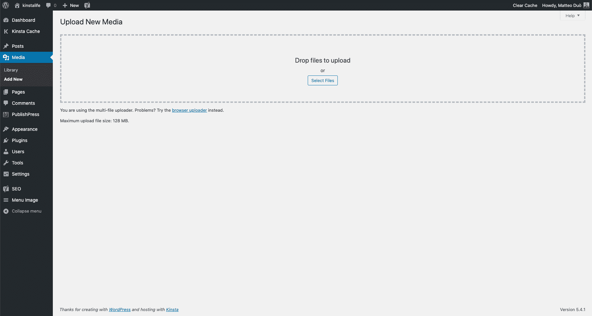](https://kinsta.com/wp-content/uploads/2020/05/WordPress-Media-Uploader.png)

WordPress Media Uploader


你也可以直接从 WordPress 编辑器添加媒体。在[块编辑器](https://kinsta.com/blog/gutenberg-wordpress-editor/)中，为您想要合并的媒体类型添加相应的块:

[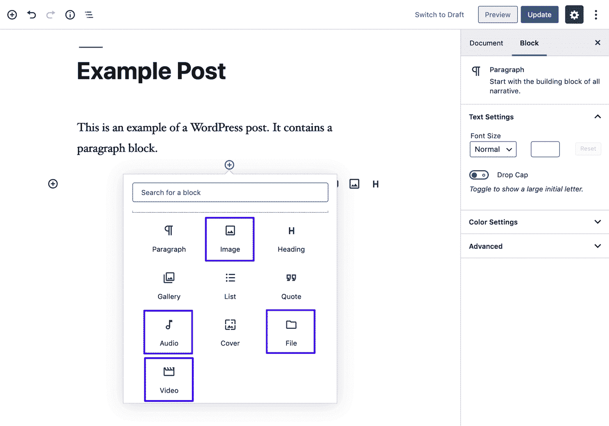](https://kinsta.com/wp-content/uploads/2020/05/select-media-block-1.png)

WordPress media blocks


在出现的占位符中，选择**上传**，并从您的计算机中选择一个文件:

[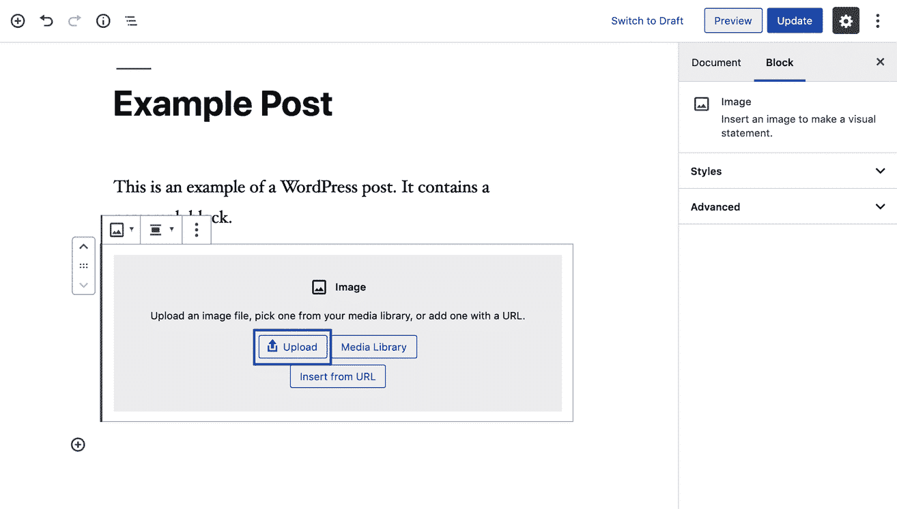](https://kinsta.com/wp-content/uploads/2020/05/block-editor-upload-1.png)

*Uploading media from the Block Editor*


或者，您可以简单地将文件从桌面拖放到相关的块中。

在经典编辑器中，您需要点击**添加媒体**按钮:

[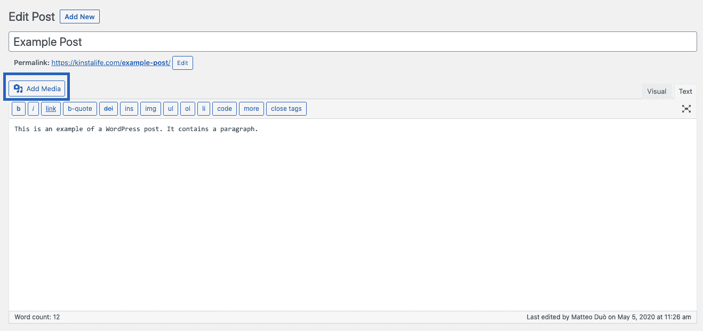](https://kinsta.com/wp-content/uploads/2020/05/add-media-button-classic-editor.png)

Classic Editor Add Media button


然后导航到**上传**选项卡，并从您的计算机中选择一个文件:

[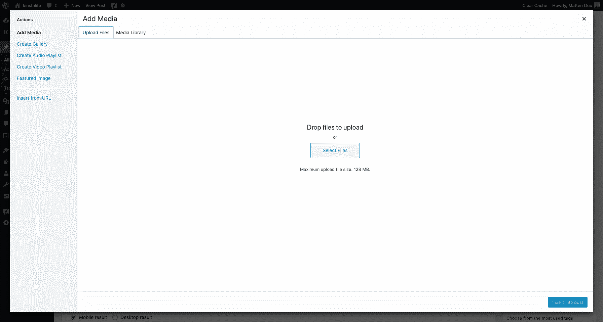](https://kinsta.com/wp-content/uploads/2020/05/upload-files-wordpress-media-library-1.png)

Uploading media from the Classic Editor


您还可以随时将文件从桌面直接拖放到编辑器中。

在某些情况下，你可能会发现你需要通过 FTP 手动[上传媒体文件到你的 WordPress 站点。您可以使用 FileZilla](https://kinsta.com/knowledgebase/bulk-upload-files-wordpress-media-library-ftp/) 之类的[客户端来完成这项工作。](https://kinsta.com/blog/best-ftp-clients/)

一旦你连接到你的服务器，导航到**WP-内容>上传**:

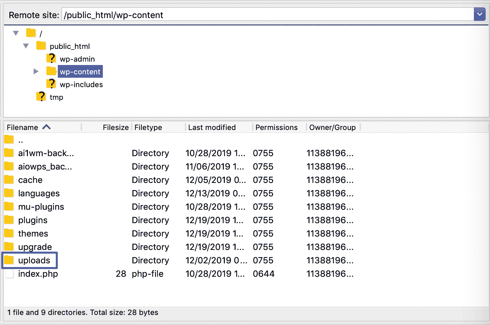

Uploading files to WordPress Media Library directory via FileZilla


将文件上载到此目录以将其添加到您的媒体库。


### 从 WordPress 媒体库下载内容

在某些情况下，您可能需要将媒体库中的文件下载到您的计算机上。WordPress 允许你通过导航到**工具>导出**来自然地做到这一点:

[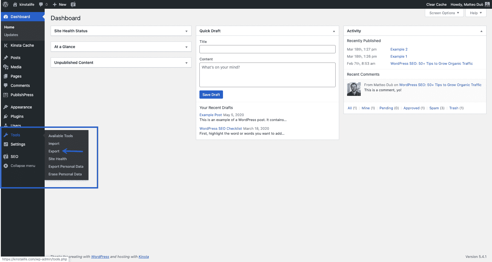](https://kinsta.com/wp-content/uploads/2020/05/export-media-wordpress-1.png)

WordPress export tool


然后选择**介质**选项。如果您只需要在特定时间段内上传的文件，您可以使用[下拉菜单](https://kinsta.com/knowledgebase/wordpress-dropdown-menu/)来指定您的请求:

[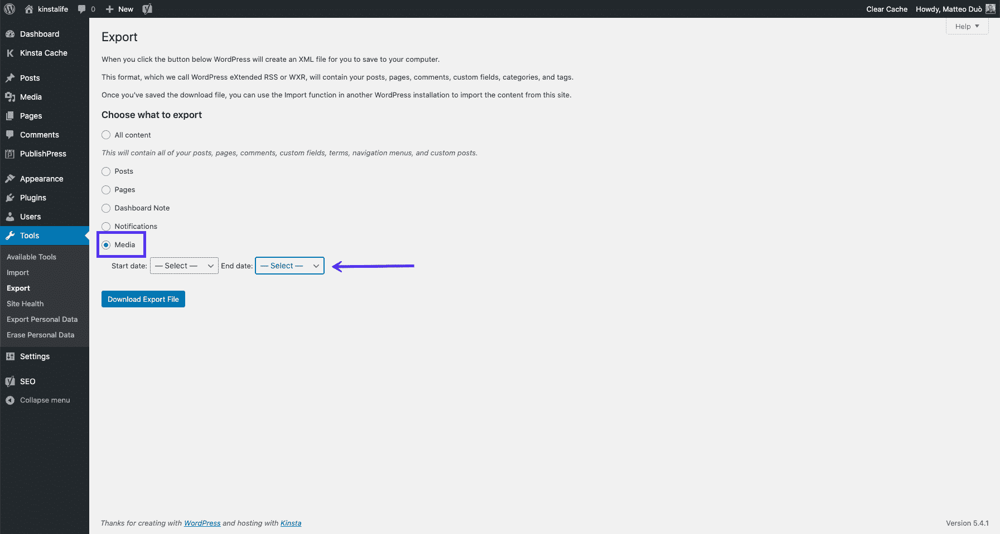](https://kinsta.com/wp-content/uploads/2020/05/exporting-media-wordpress-1.png)

Exporting WordPress media


最后，点击**下载导出文件**按钮。这将把相关的媒体文件下载到您的计算机上。

## 如何在 WordPress 媒体库中编辑图像

正如我们之前提到的，WordPress 有一些原生的图片编辑功能。要访问它们，导航到你的 WordPress 媒体库并选择你想要编辑的文件。然后，点击**编辑图像**按钮:

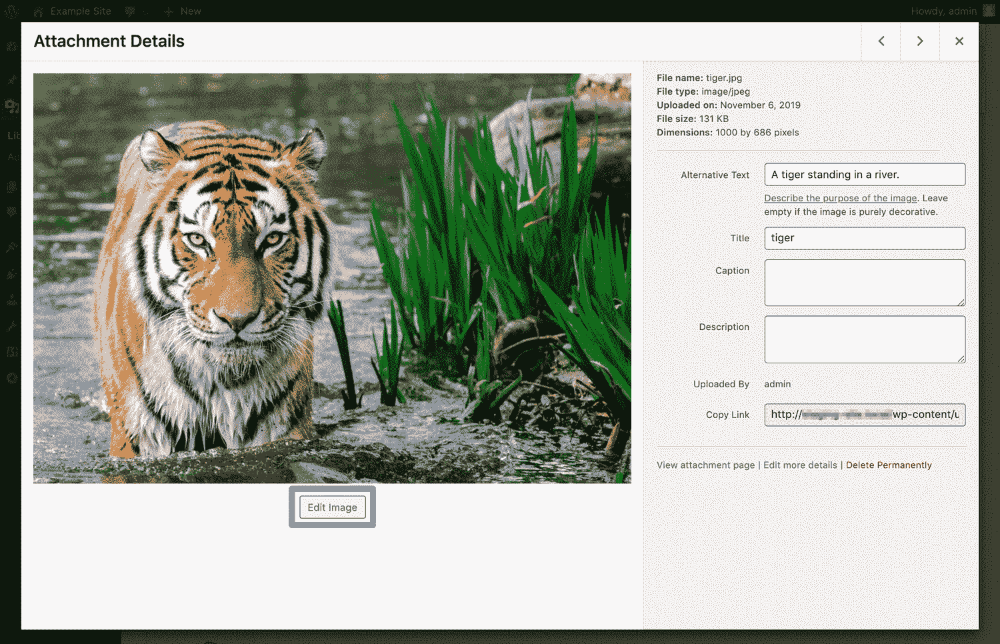

Edit Image button in WordPress


这将打开图像编辑器:

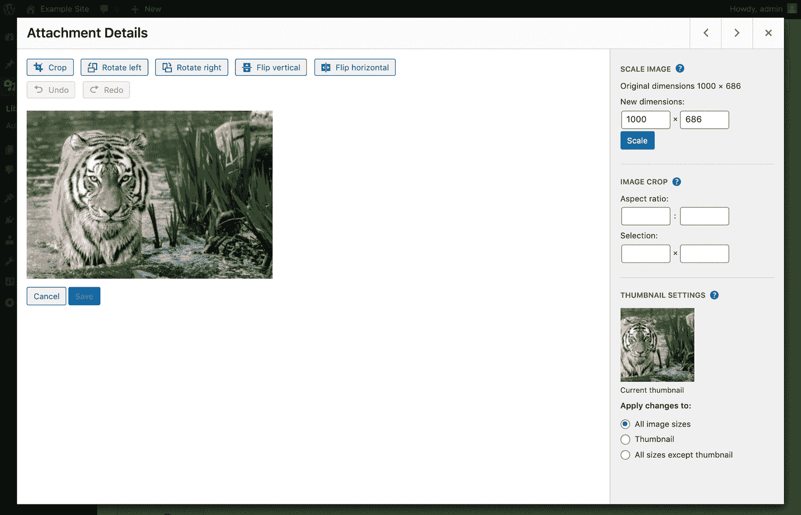

WordPress image editor


您可以进行五种基本编辑:

**裁剪**使您能够剪切出图像的某些部分:

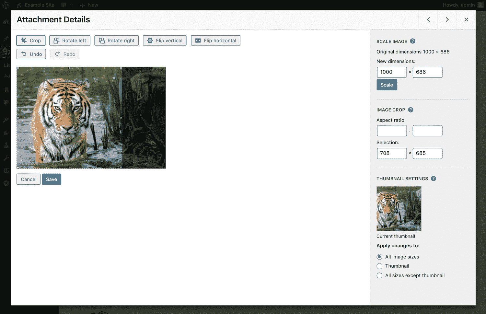

Image crop in WordPress


**旋转**图像会逆时针或顺时针旋转 90 度:

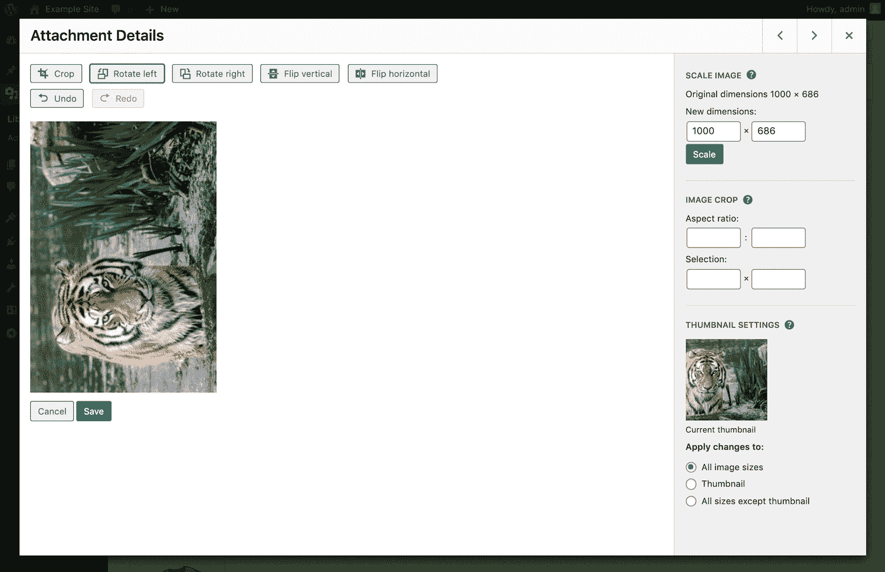

Image rotate left in WordPress


**翻转**图像会垂直或水平地反映出来:

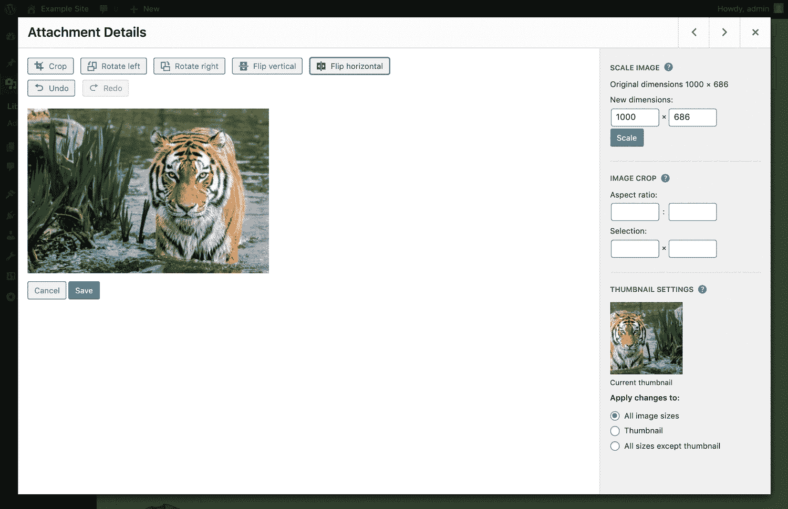

Image horizontal flip in WordPress


其他三个设置在侧边栏中。第一个使你能够通过缩放图片来**改变图片**的尺寸**。只需输入您想要的高度或宽度，另一个字段将自动填充。然后点击**标尺**按钮:**

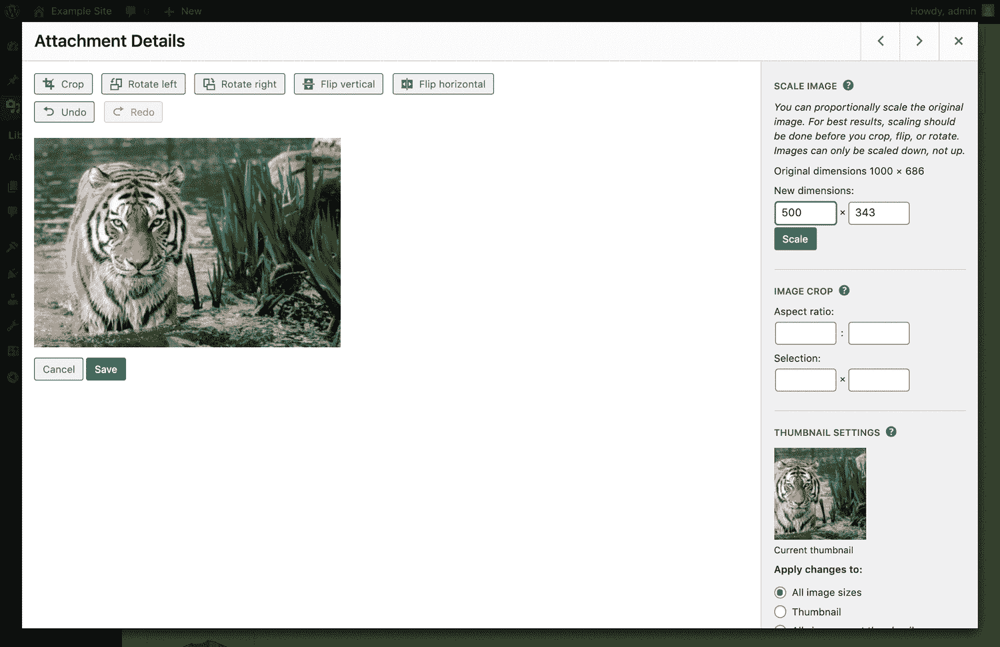

Scaling an image in WordPress


值得注意的是，在 WordPress 中调整图片大小有时会对图片质量产生负面影响。

此外，您只能拍摄大图像并将其缩小。您不能将图像放大到更大的尺寸！

要裁剪您的图像，使其具有特定的纵横比或尺寸，您可以使用**图像裁剪**下的**纵横比**和**选择**字段:

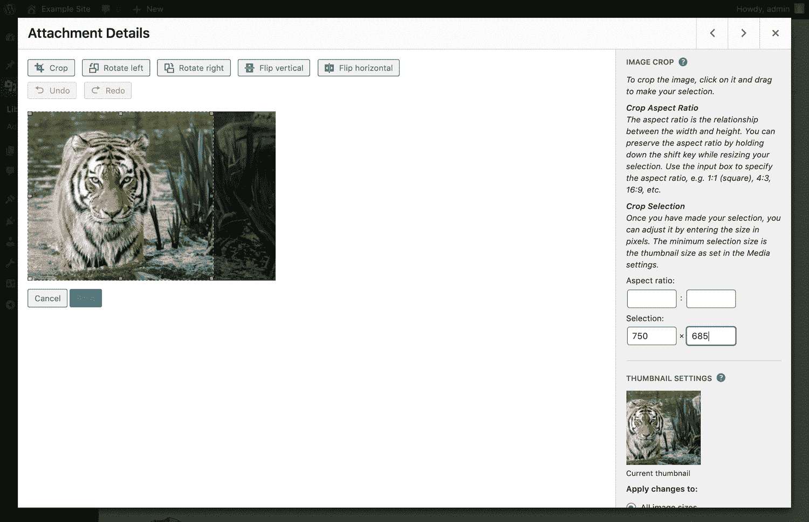

Setting the image crop selection dimensions in WordPress


最后，如果您希望保留现有的图像缩略图，您可以使用**缩略图设置**来实现。只需选择要应用更改的图像版本的单选按钮:

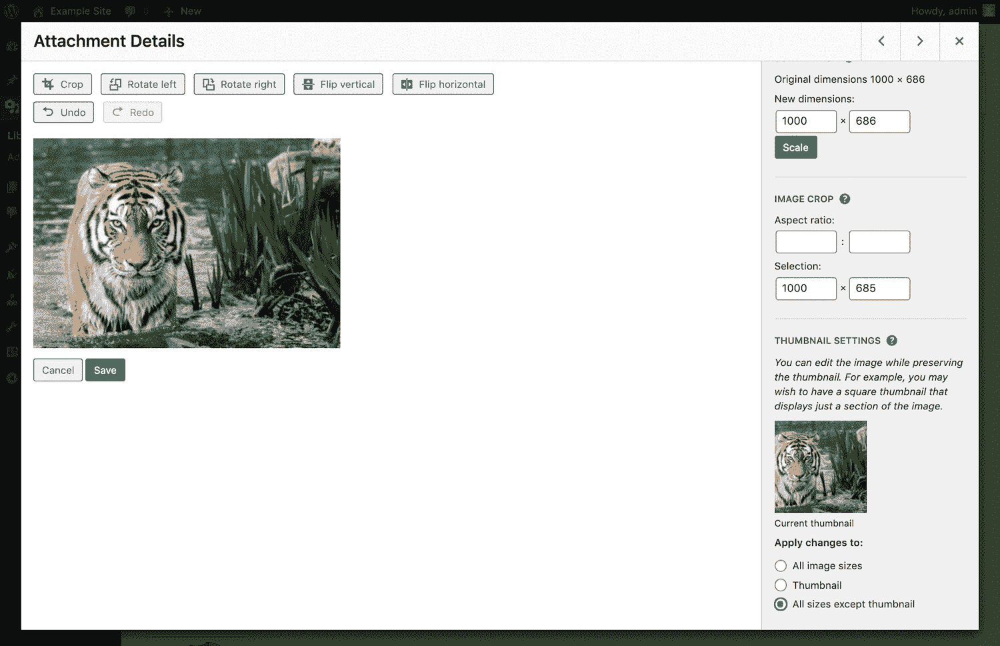

Thumbnail settings in the WordPress image editor


WordPress 的默认图片编辑是有用的，但是有局限性。它不会取代你可能用来进行更大范围修改的任何软件，尤其是如果你正在运行摄影网站或摄影博客的话。
T3】

## 理解 WordPress 媒体库错误

不幸的是， [WordPress 错误](https://kinsta.com/blog/wordpress-errors/)发生了。WordPress 媒体库也不例外。

## 注册订阅时事通讯


### 想知道我们是怎么让流量增长超过 1000%的吗？

加入 20，000 多名获得我们每周时事通讯和内部消息的人的行列吧！

[Subscribe Now](#newsletter)

一个常见的问题是[当您从编辑器中上传新文件时，可能会出现一个未指明的“HTTP 错误”](https://kinsta.com/blog/wordpress-http-error/):

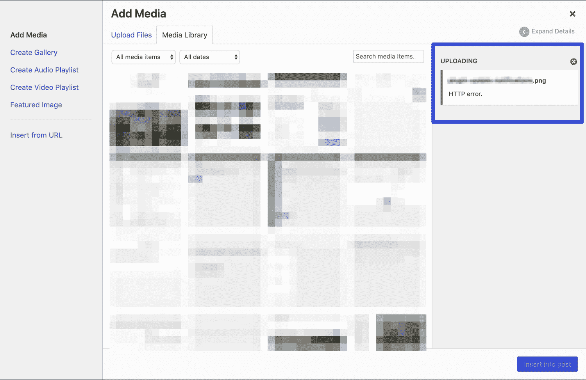

HTTP error on media upload


通常，您可以简单地等待此错误消失，并在几分钟后再次尝试上传。如果 HTTP 错误再次出现，可能是您的 [WordPress 会话已经过期](https://kinsta.com/blog/wordpress-errors/#25-wordpress-http-error-uploading-image-to-the-media-library)。你需要[再次登录](https://kinsta.com/blog/wordpress-login-url/)，然后重试上传。

一些用户面临的另一个问题是媒体库无法加载。这通常是因为与你的插件和/或主题冲突。要解决这个错误，试着停用你所有的插件，切换到一个 [WordPress 默认主题](https://kinsta.com/blog/twenty-twenty-theme/)。

如果您的媒体库再次正确加载，您需要进一步解决插件冲突，以便永久解决该问题。

当您开始通过媒体库上传文件时，有时会遇到“[上传:无法将文件写入磁盘](https://kinsta.com/knowledgebase/wordpress-failed-to-write-file-to-disk/)”错误。通常，当您的上传目录设置为不可写时，会出现此问题。你可以通过 WordPress 的[站点健康](https://kinsta.com/blog/wordpress-5-2/#site-health-status)工具检查你的文件系统权限。

## 长期媒体库管理

到目前为止，当谈到媒体库时，我们只关注 WordPress 的原生功能。然而，随着您使用这个特性的时间的推移，您可能会遇到一些麻烦，需要外部解决方案的帮助。

例如，你添加的文件越多，你的 WordPress 媒体库就会变得越混乱。除了本文开头讨论的搜索和过滤选项，WordPress 并没有为处理难以控制的大量媒体提供太多帮助。

然而，有几个插件可以让你把你的媒体文件放到文件夹里。

WordPress 媒体库文件夹插件是最受欢迎的选项:

[](https://kinsta.com/wp-content/uploads/2020/05/WordPress-Media-Library-Folders-plugin.jpg)

WordPress Media Library Folders WordPress plugin


除了使您能够创建媒体文件夹，该插件还与 [MaxGalleria](https://wordpress.org/plugins/maxgalleria/) 集成，让您直接从媒体库创建图片库:

[](https://kinsta.com/wp-content/uploads/2020/05/WordPress-Gallery-MaxGalleria-plugin.jpg)

WordPress Gallery MaxGalleria WordPress plugin


升级到 [WordPress 媒体库文件夹 Pro](https://maxgalleria.com/downloads/media-library-plus-pro) 提供了与[下一代图库插件](https://kinsta.com/blog/wordpress-photo-gallery-plugins/#nextgen-gallery)和[高级定制字段](https://kinsta.com/blog/advanced-custom-fields/)的额外集成。它还使您能够创建类别和标签来进一步组织您的文件。

WordPress 缺少的另一个功能是用新版本替换媒体文件的能力。由于这些类型的文件可能非常大，所以当您需要更新内容时，您不希望只是不断添加新的文件。

这意味着上传新文件后，你需要找到旧版本并删除它。您可以直接用[替换旧图像来节省时间，启用媒体用短像素替换](https://wordpress.org/plugins/enable-media-replace/):

[](https://kinsta.com/wp-content/uploads/2020/05/Enable-Media-Replace-plugin.jpg)

Enable Media Replace WordPress plugin


有了这个插件，你也可以替换所有指向旧文件的链接。这有助于避免整个站点的介质损坏。

[Real Media Library](https://wordpress.org/plugins/real-media-library-lite/) 是另一款值得一试的文件夹和文件管理器，让您轻松管理文件。

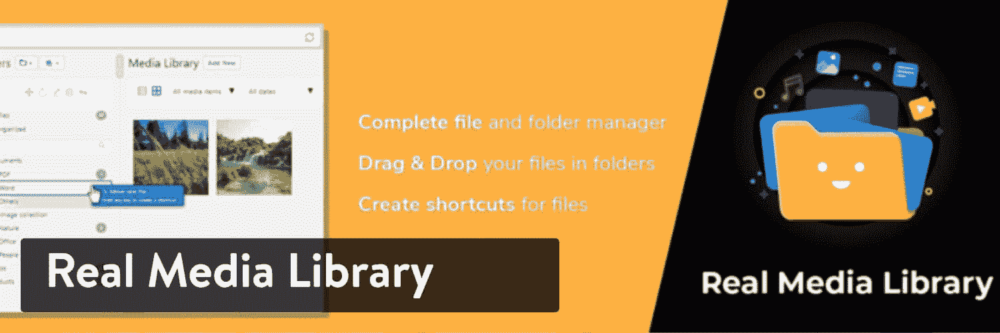

Real Media Library WordPress plugin


有了它，你可以直接在 WordPress 中处理大量的文件，如图片、视频和文档。值得一提的是:真正的媒体库有 12 种语言版本。如果免费版本不足以满足你的需求，他们还提供了一个[购买具有更多功能的专业版](https://devowl.io/wordpress-real-media-library/)。

## 4 个方便的 WordPress 媒体库技巧

WordPress 媒体库可以处理站点管理员的大部分常见需求。然而，WordPress 提供了大量的[函数和钩子](https://kinsta.com/blog/wordpress-hooks/)，使用户能够增强媒体库的特定功能，而无需使用第三方插件。让我们通过四个实际例子来深入研究这些函数和钩子。

### 1.向附件帖子类型添加自定义元数据

任何时候你上传一个媒体文件，WordPress 都会生成一个[附件文章类型](https://wordpress.org/support/article/post-types/#attachments)。

厌倦了 WordPress 的问题和缓慢的主机？我们提供世界一流的支持，由 WordPress 专家提供 24/7 服务和超快的服务器。[查看我们的计划](https://kinsta.com/plans/?in-article-cta)

就像任何其他帖子类型一样，附件注册在 **wp_posts** 表中，它们各自的元数据可以在数据库的 **wp_postmeta** 表中找到:

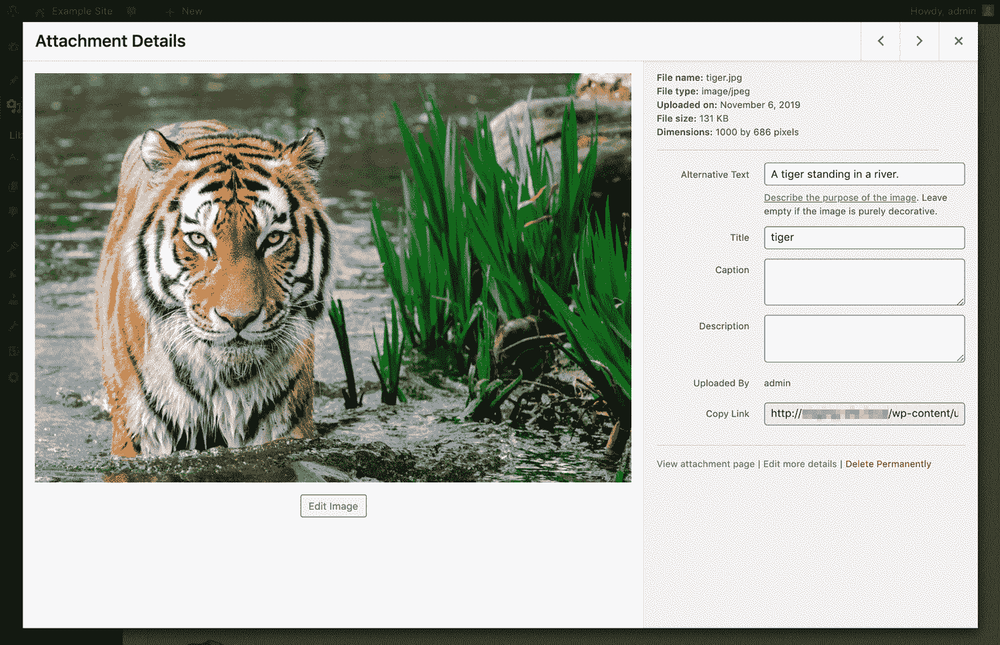

Default attachment details panel


**wp_posts** 表存储的数据包括 **post_content** (附件描述)**post _ extract**(附件标题) **post_author** 、 **post_title** 、 **post_status** 和 **post_mime_type** 。

**wp_postmeta** 表存储任何种类的元数据，例如附加文件 URL、图像尺寸和 mime 类型、可交换图像文件格式(EXIF)和国际新闻电信委员会(IPTC)元数据。

您可能偶尔需要将自定元数据添加到附件中，例如文档作者的姓名、关联的 URL 或照片拍摄的位置。向附件添加元字段与向帖子添加元字段有点不同，需要特定的钩子和函数。

首先，您需要将所有必要的自定义字段添加到**编辑媒体**屏幕。您可以通过**WP-admin/includes/media . PHP**中的[attachment _ fields _ to _ edit](https://codex.wordpress.org/Plugin_API/Filter_Reference/attachment_fields_to_edit)过滤器过滤可用的附件字段来完成这项任务:

```
function media_hacks_attachment_field_to_edit( $form_fields, $post ){

	// https://codex.wordpress.org/Function_Reference/wp_get_attachment_metadata
	$media_author = get_post_meta( $post->ID, 'media_author', true );

	$form_fields['media_author'] = array(
		'value' => $media_author ? $media_author : '',
		'label' => __( 'Author' )
	); 
	return $form_fields;
}
add_filter( 'attachment_fields_to_edit', 'media_hacks_attachment_field_to_edit', 10, 2 );
```

该函数有两个参数:表单字段的数组 **$form_fields** 和对象 **$post** 。首先， **get_post_meta** 检索现有的**‘media _ author’**值，然后将一个**‘media _ author’**元素添加到 **$form_fields** 数组中。

最后，回调返回 **$form_fields** (参见[要点](https://gist.github.com/carlodaniele/3adf6a18e79233b98c96401d194e3420#file-media-hacks-php-L21)上的代码)。

这将在**编辑媒体**页面上显示一个新字段，您可以通过从您的媒体库中选择相关图像并点击**编辑更多详细信息**链接来访问该字段:

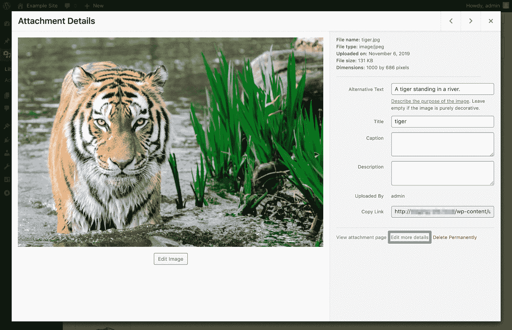

Accessing WordPress Edit Media page


在出现的屏幕上，您会在底部看到新的自定义元数据栏:

[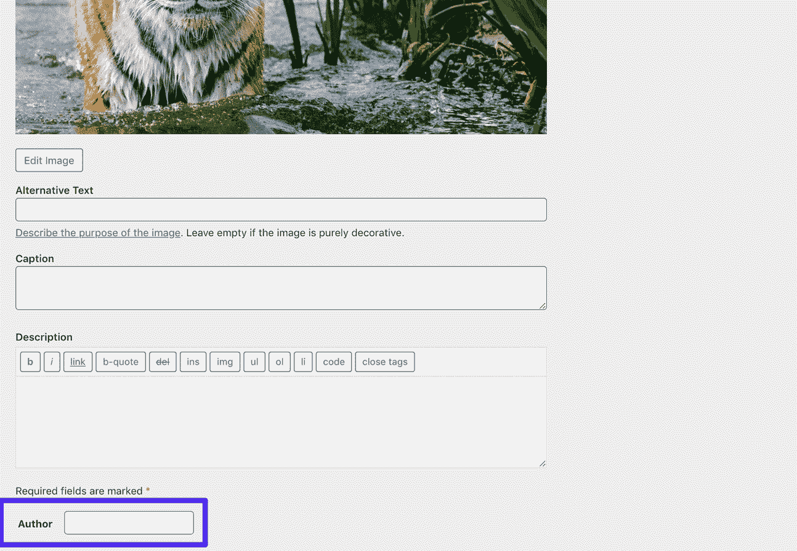](https://kinsta.com/wp-content/uploads/2020/05/attachment-author-field-1-1-1.png)

New “author” metadata field


下一步是保存用户输入。您可以通过将新函数挂接到 **edit_attachment** 动作来实现这一点:

```
function media_hacks_edit_attachment( $attachment_id ){
	if ( isset( $_REQUEST['attachments'][$attachment_id]['media_author'] ) ) {

		$media_author = $_REQUEST['attachments'][$attachment_id]['media_author'];

		update_post_meta( $attachment_id, 'media_author', $media_author );
	}
}
add_action( 'edit_attachment', 'media_hacks_edit_attachment' ); 
```

这个函数只保留一个参数:当前媒体文件的 **$attachment_id** 。首先，该函数检查自定义元字段的有效值是否已发送。然后它通过 [update_post_meta](https://codex.wordpress.org/Function_Reference/update_post_meta) 函数注册该值(参见[要点](https://gist.github.com/carlodaniele/3adf6a18e79233b98c96401d194e3420#file-media-hacks-php-L76)上的代码)。

现在，您可以通过 **get_post_meta** 函数来检索**‘media _ author’**值:

```
$media_author = get_post_meta( $post->ID, 'media_author', true );
```

之后，你可以在前端的任何地方显示它。

### 2.在编辑媒体屏幕中显示 EXIF 和 IPTC 元数据

WordPress 自动存储 JPEG 和 TIFF mime 类型的扩展元数据。现在你已经知道如何通过【media.php】的**向**编辑媒体**屏幕添加字段，你可以显示这些数据了。**

要完成这项任务，您必须按如下方式更改第一个回调函数:

```
function media_hacks_attachment_fields_to_edit( $form_fields, $post ){

	// get post mime type
	$type = get_post_mime_type( $post->ID );

	// get the attachment path
	$attachment_path = get_attached_file( $post->ID );

	// get image metadata
	$metadata = wp_read_image_metadata( $attachment_path );

	if( 'image/jpeg' == $type ){

		if( $metadata ) {

			$exif_data = array(
				'aperture'          => 'Aperture', 
				'camera'            => 'Camera', 
				'created_timestamp' => 'Timestamp',
				'focal_length'      => 'Focal Length', 
				'iso'               => 'ISO', 
				'shutter_speed'     => 'Exposure Time', 
				'orientation'       => 'Orientation' );

			foreach ( $exif_data as $key => $value ) {

				$exif = $metadata[$key];
				$form_fields[$key] = array(
					'value' => $exif ? $exif : '',
					'label' => __( $value ),
					'input' => 'html',
					'html'  => "ID][$exif]' value='" . $exif . "' />
				);
			}
		}
	}
	return $form_fields;
}
add_filter( 'attachment_fields_to_edit', 'media_hacks_attachment_fields_to_edit', 10, 2 );
```

这个片段使用了以下 WordPress 函数:

*   [get_post_mime_type](https://codex.wordpress.org/Function_Reference/get_post_mime_type) 根据 ID 检索附件的 mime 类型。
*   [get_attached_file](https://codex.wordpress.org/Function_Reference/get_attached_file) 根据 ID 检索附件路径。
*   获取 EXIF 或 IPTC 的元数据，如果有的话。

如果图像 mime 类型是“image/jpeg”，并且如果元数据存在，则声明所需元数据的数组，并且为数组中的每个元素创建表单字段:

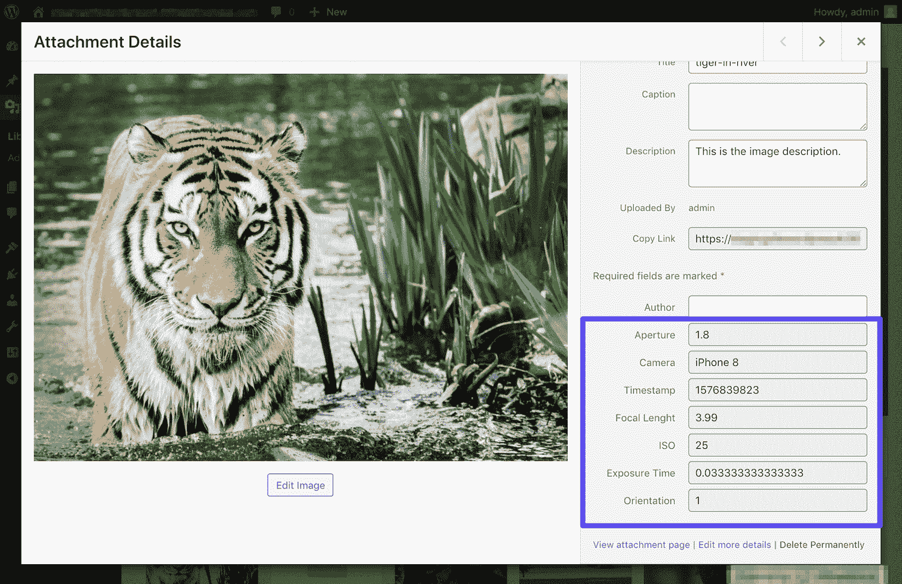

EXIF and IPTC metadata fields in WordPress attachment details


这个例子中的表单域有点复杂，因为我们要为**‘html’**表单元素设置一个值(参见[要点](https://gist.github.com/carlodaniele/3adf6a18e79233b98c96401d194e3420#file-media-hacks-php-L21)上的代码)。你不需要保存 EXIF 和 IPCT 的元数据，因为 WordPress 在上传图片时会自动将它们存储到 **wp_postmeta** 表中。

### 3.在前端显示扩展元数据

在后端拥有所有这些信息是非常有用的。然而，如果你还想在前端显示你的媒体文件的扩展元数据，你需要做更多的修改。

为此，您可以使用**WP-admin/includes/post . PHP**中的 [the_content](https://developer.wordpress.org/reference/hooks/the_content/) 过滤器将该信息附加到附件描述中，如下所示:

```
function media_hacks_the_content( $content ){
	global $post;

	if( is_attachment() && 'image/jpeg' == get_post_mime_type( $post->ID ) ) {

		$fields = wp_get_attachment_metadata( $post->ID );
		$meta = $fields['image_meta'];

		if( ! empty( $meta['camera'] ) ){
			$custom_content = "
			<ul>
				<li>Camera: {$meta['camera']}</li>
				<li>Created timestamp: {$meta['created_timestamp']}</li>
				<li>Aperture: {$meta['aperture']}</li>
				<li>Focal length: {$meta['focal_length']}</li>
				<li>ISO: {$meta['iso']}</li>
				<li>Shutter speed: {$meta['shutter_speed']}</li>
				<li>Orientation: {$meta['orientation']}</li>
			</ul>";
			$content .= $custom_content; 
		}
	}
	return $content;
}
add_filter( 'the_content', 'media_hacks_the_content' );
```

这里调用[WP _ get _ attachment _ metadata](https://codex.wordpress.org/Function_Reference/wp_get_attachment_metadata)函数。如果当前的帖子类型是“附件”,并且当前的 mime 类型是“图像/jpeg ”,则检索可用的图像元数据并用于构建一个无序的字段列表，该列表被附加到帖子内容中。

回调函数返回 **$content** (参见[要点](https://gist.github.com/carlodaniele/3adf6a18e79233b98c96401d194e3420#file-media-hacks-php-L94)上的这段代码):


EXIF and IPTC metadata displayed on an attachment page


上面你可以看到新的附件文章，元数据附加到描述中。

### 4.发布照片档案

开箱即用，WordPress 不显示附件的存档。这是因为附件帖子类型的 **has_archive** 选项被设置为 **false** 。

而且， **$query** 对象的默认 **post_status** 参数设置为“发布”，默认附件 **post_status** 设置为“继承”。这意味着，除非我们显式地将查询 **post_status** 设置为“inherit”或“any”，否则不会在存档中显示任何附件(有关更多信息，请参见 [WP_Query 类型参数](https://developer.wordpress.org/reference/classes/wp_query/))。

也就是说，为了显示图像档案，您必须定义两个函数。第一个函数过滤指定文章类型的参数，并将附件**的 has_archive** 属性设置为 **true** :

```
function media_hacks_register_post_type_args( $args, $post_type ){
	if( $post_type == 'attachment' ){
		$args['has_archive'] = true;
	}
	return $args;
}
add_filter( 'register_post_type_args', 'media_hacks_register_post_type_args', 10, 2 );
```

第二个函数为 post_mime_type 和 post_status 查询变量设置自定义值:

```
function media_hacks_pre_get_posts( $query ){
	if ( !is_admin() && $query->is_main_query() ) {

		if( is_post_type_archive('attachment') ){
			$query->set('post_mime_type', 'image/jpeg');
			$query->set( 'post_status', 'inherit' );
		}
	}
}
add_action( 'pre_get_posts', 'media_hacks_pre_get_posts' ); 
```

该函数与 [pre_get_posts](https://developer.wordpress.org/reference/hooks/pre_get_posts/) 动作挂钩，该动作挂钩在查询创建之后、执行之前触发。 **$query** 对象是通过引用传递的，而不是通过值传递的，这意味着对当前 **$query** 实例的任何更改都会影响原来的 **$query** 对象。

出于这个原因，验证您将要更改哪个查询是很重要的(参见[要点](https://gist.github.com/carlodaniele/3adf6a18e79233b98c96401d194e3420#file-media-hacks-php-L127)中的代码)。然后，如果你在浏览器中输入 https://yourdomain.com/?post_type=attachment 的 T2，你应该会看到一个 JPEG 图像档案:

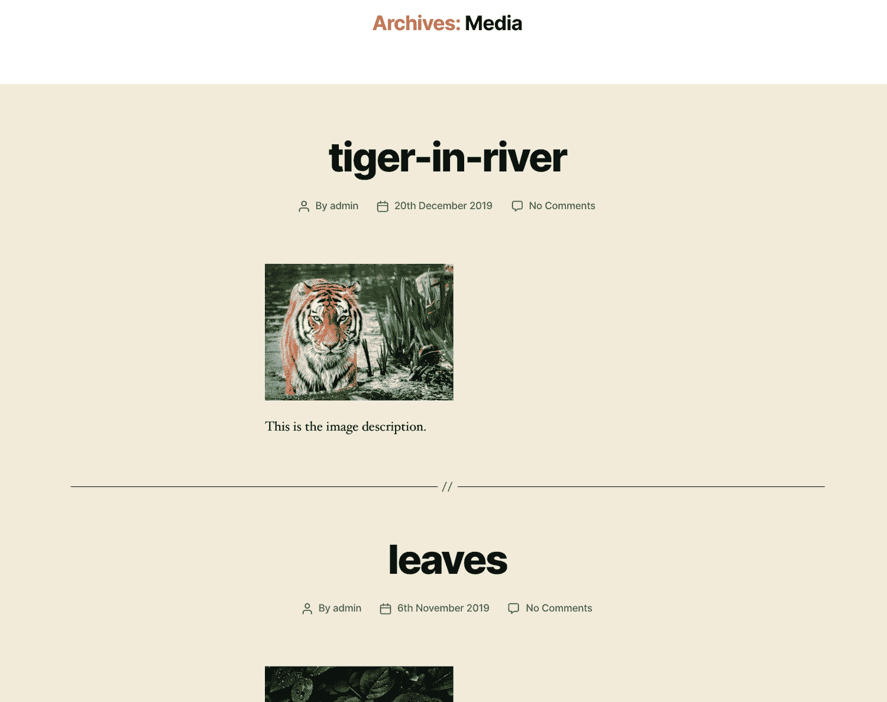

WordPress Media Archive


所有这些攻击的完整代码都可以在[的一个公共要点](https://gist.github.com/carlodaniele/3adf6a18e79233b98c96401d194e3420)中作为插件获得，我们已经通过本节链接到了这个插件。你可以下载它作为一个**。压缩**文件并上传到你的 WordPress 站点来实现所有这四个技巧，而不需要[手动编辑你的文件](https://kinsta.com/knowledgebase/edit-wordpress-code/)。

[A picture is worth 1,000 words...but only if you know how to import, edit, and manage it in your WordPress site. 🖼 Click to learn more in this in-depth guide 📸Click to Tweet](https://twitter.com/intent/tweet?url=https%3A%2F%2Fkinsta.com%2Fblog%2Fwordpress-media-library%2F&via=kinsta&text=A+picture+is+worth+1%2C000+words...but+only+if+you+know+how+to+import%2C+edit%2C+and+manage+it+in+your+WordPress+site.+%F0%9F%96%BC+Click+to+learn+more+in+this+in-depth+guide+%F0%9F%93%B8&hashtags=MediaLibrary%2CWordPress)

## 摘要

图像、视频、音频文件和文档对网站用户来说非常有价值。WordPress 媒体库对于上传、发布、甚至修改这些文件是必不可少的，以满足你内容的需求。

关于 WordPress 媒体库，你还有其他问题吗？请在下面的评论区告诉我们！

* * *

让你所有的[应用程序](https://kinsta.com/application-hosting/)、[数据库](https://kinsta.com/database-hosting/)和 [WordPress 网站](https://kinsta.com/wordpress-hosting/)在线并在一个屋檐下。我们功能丰富的高性能云平台包括:

*   在 MyKinsta 仪表盘中轻松设置和管理
*   24/7 专家支持
*   最好的谷歌云平台硬件和网络，由 Kubernetes 提供最大的可扩展性
*   面向速度和安全性的企业级 Cloudflare 集成
*   全球受众覆盖全球多达 35 个数据中心和 275 多个 pop

在第一个月使用托管的[应用程序或托管](https://kinsta.com/application-hosting/)的[数据库，您可以享受 20 美元的优惠，亲自测试一下。探索我们的](https://kinsta.com/database-hosting/)[计划](https://kinsta.com/plans/)或[与销售人员交谈](https://kinsta.com/contact-us/)以找到最适合您的方式。