# 2022 年帮助你在野外获取内容的 15 个最佳博客平台

> 原文：<https://kinsta.com/blog/best-blogging-platform/>

即使 YouTube 和社交媒体的出现，博客在 2020 年仍然很活跃。仅在 WordPress.com，每月就有超过 4 . 09 亿人阅读个人和专业博客。

这还不包括自托管的 WordPress 博客和使用其他 CMS 解决方案托管的博客。所以现在*[开博客](https://kinsta.com/blog/how-to-start-a-fashion-blog/)还为时不晚。*

 *但是什么是最好的博客平台呢？

这就是我们将在本帖中讨论的内容。

[Blogging is still alive and well in 2020...and if you're looking to start your own blog, you'll want to check out this list of the best blogging platforms 👩‍💻🧑‍💻.Click to Tweet](https://twitter.com/intent/tweet?url=https%3A%2F%2Fkinsta.com%2Fblog%2Fbest-blogging-platform%2F&via=kinsta&text=Blogging+is+still+alive+and+well+in+2020...and+if+you%27re+looking+to+start+your+own+blog%2C+you%27ll+want+to+check+out+this+list+of+the+best+blogging+platforms+%F0%9F%91%A9%E2%80%8D%F0%9F%92%BB%F0%9F%A7%91%E2%80%8D%F0%9F%92%BB.&hashtags=blogging%2CCMS)

## 2022 年最佳自主博客平台

下面，我们将详细介绍最好的自托管博客平台，以及为什么它们是市场上的最佳选择。“自托管”意味着你需要一个单独的服务器和[域名](https://kinsta.com/blog/how-much-does-a-domain-name-cost/)来使用博客软件[创建你的博客](https://kinsta.com/blog/how-to-start-a-travel-blog/)或网站。

### 1.WordPress.org

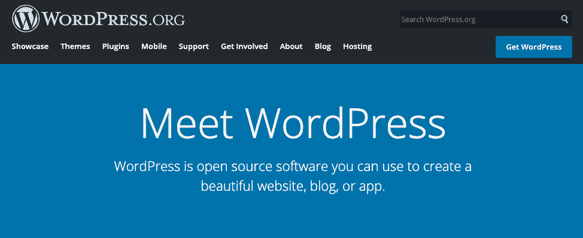

WordPress

所以你想[开一个博客](https://kinsta.com/learn/blogging-tips/)。如果你稍微四处看看，很可能你已经听说过[。](https://kinsta.com/knowledgebase/what-is-wordpress/)

> Kinsta 把我宠坏了，所以我现在要求每个供应商都提供这样的服务。我们还试图通过我们的 SaaS 工具支持达到这一水平。
> 
> <footer class="wp-block-kinsta-client-quote__footer">
> 
> 
> 
> <cite class="wp-block-kinsta-client-quote__cite">Suganthan Mohanadasan from @Suganthanmn</cite></footer>

[View plans](https://kinsta.com/plans/)

的。org 网站是其开源自托管[内容管理系统(CMS)](https://kinsta.com/knowledgebase/content-management-system/) 的大本营。CMS 是一款帮助你创建网站并发布/管理/更新网站内容的软件。

WordPress 是互联网上排名第一的内容管理系统，为数百万博客和网站提供支持。在这篇文章列出的所有流行博客平台中，它无疑是领先者。

如果你正在为商业目的创建一个博客或网站，我们 100%相信 WordPress 是你最好的选择。它是完全免费的，开源的，并且由于[的多主题](https://kinsta.com/best-wordpress-themes/)使得创建一个看起来很专业的博客变得很容易。

#### 为什么 WordPress 是行业标准

但是使用 WordPress 的不仅仅是初学者、 [solopreneurs](https://kinsta.com/blog/content-marketing-ninja/) 和博客作者。它已经成为 CMS 行业的明显领导者。

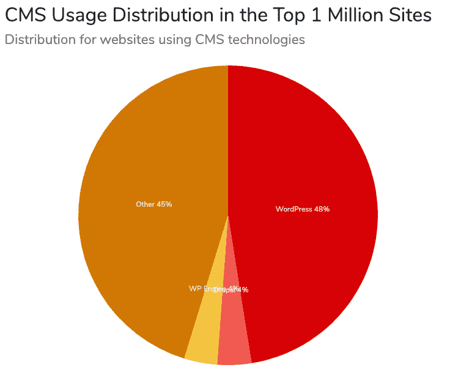

CMS usage distribution

互联网上访问量最大的 100 万个网站中，几乎有一半使用 WordPress。这些人不仅仅是业余博客写手或有抱负的作家。

人们使用 WordPress 是因为它的官方目录中有超过 55k 个免费插件和 7k+ [个免费主题](https://kinsta.com/blog/wordpress-free-vs-paid-themes/)。在其他网站上也有成千上万的优质主题和插件(查看我们策划的[最佳 WordPress 主题](https://kinsta.com/best-wordpress-themes/)和 [WordPress 插件](https://kinsta.com/best-wordpress-plugins))。

所以你可以混合搭配，找到你想要的主题，并根据需要用 WordPress 插件扩展功能。

更不用说它拥有最大最活跃的开发者社区之一。成百上千的开发者将他们的时间投入到[为用户提供支持](https://kinsta.com/blog/is-wordpress-free/#how-is-wordpress-funded)，保持他们的插件/主题更新，或者[发布新的](https://kinsta.com/blog/publish-plugin-wordpress-plugin-directory/)。

这个活跃而庞大的社区对参与其中的每个人都有很大的好处:问题和 bug 通常会很快被发现并修复，这对安全性很有好处。

这个社区也意味着，如果你的 WordPress 业务需要的话，可以更容易地获得潜在问题的帮助和指导。比如说，[雇佣 WordPress 开发者或者设计师](https://kinsta.com/blog/hire-wordpress-developer/)并不难。

WordPress 也是搜索引擎优化友好的开箱即用的，这使得在谷歌和[其他搜索引擎中对内容进行排名变得容易。](https://kinsta.com/blog/alternative-search-engines/)

#### 关键特征

*   所见即所得编辑器。
*   [货币化](https://kinsta.com/blog/how-to-monetize-a-blog/)。
*   [多语言](https://kinsta.com/blog/wordpress-multilingual/)(通过插件)。
*   多用户环境。
*   [密码保护](https://kinsta.com/blog/password-protect-wordpress-site/)。
*   [全球导航](https://kinsta.com/blog/website-navigation/)。
*   主题/模板文件的完全[定制化。](https://kinsta.com/blog/how-to-customize-wordpress-theme/)
*   [内容调度](https://kinsta.com/knowledgebase/wordpress-missed-schedule/)。
*   [SEO 友好的内容结构](https://kinsta.com/blog/wordpress-seo/)。
*   高级 SEO 选项(带 [SEO 插件](https://kinsta.com/blog/best-seo-plugins-for-wordpress/))。
*   大量插件解决方案(免费和付费)。
*   大量的主题(免费和付费)。

#### 界面和易用性

如果你对互联网和使用新的服务或技术相对有信心，你甚至不需要指令来弄清楚界面。

大多数网络主机提供一键安装 WordPress，所以安装和设置很容易。(对于我们的任何 [WordPress 托管](https://kinsta.com/wordpress-hosting/)计划，我们会为您负责安装。)

内置教程将帮助您熟悉仪表板，并创建您的第一篇博客文章。

[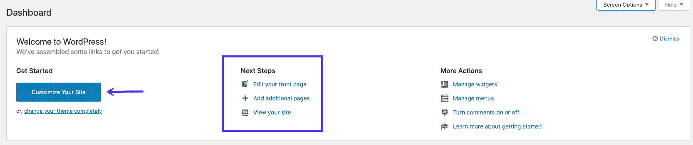](https://kinsta.com/wp-content/uploads/2020/05/welcome-tab-wordpress.png)

Welcome tab in WordPress

即使没有教程， [WordPress 仪表盘](https://kinsta.com/knowledgebase/wordpress-admin/)一点也不难导航。悬停加号打开一个[下拉菜单](https://kinsta.com/knowledgebase/wordpress-dropdown-menu/)，在这里你可以选择创建一个新的帖子、页面，甚至用户。

[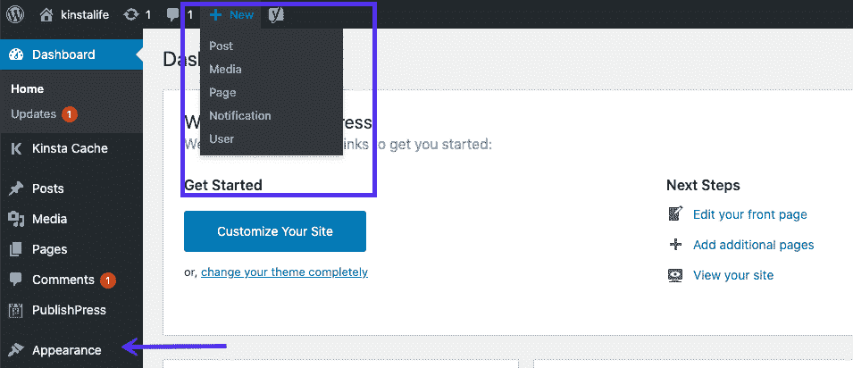](https://kinsta.com/wp-content/uploads/2020/05/wordpress-dashboard.png)

WordPress dashboard

要编辑您网站的设计，请单击“外观”部分，在那里您将有不同的选项。

#### 定价

自托管的 WordPress 是开源许可的，并且永远是 100%免费的。

然而，仅仅这样还不够。你还需要一个域名和主机。

如果你关心加载速度、安全性和可靠性，Kinsta 托管计划每月 35 美元起，并附带[免费迁移](https://kinsta.com/wordpress-migration/)、 [CDN](https://kinsta.com/help/kinsta-cdn/) 、[恶意软件防护](https://kinsta.com/secure-wordpress-hosting/)、[自动每日备份](https://kinsta.com/help/wordpress-backups/)等等。

### 2.Drupal

[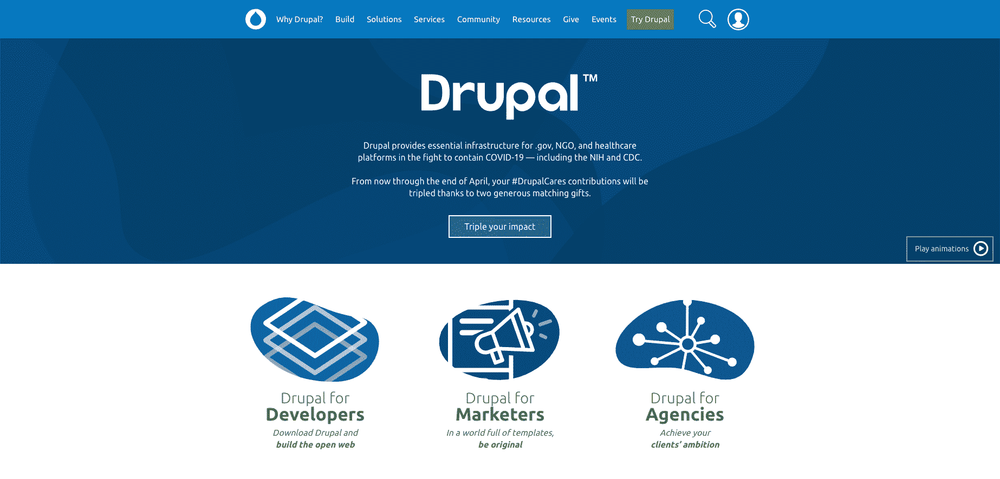](https://kinsta.com/wp-content/uploads/2020/05/drupal.png)

Drupal

Drupal 是第二大开源 CMS。与其说它是一个严格的博客工具，不如说它是一个专业的、可扩展的在线发布平台。

Drupal 在核心中内置了成熟的版本控制和内容调度/规划。你可以对用户权限进行更精细的控制。您甚至可以为特定用户创建独特的权限。核心部分还支持多语言网站，这使得它成为大公司的首选。

但它并不容易使用，而且在创建一个“看起来不错”的博客时，可能会有点困难。

#### 特征

*   基本编辑器。
*   货币化。
*   多语言。
*   密码保护。
*   全球导航。
*   主题/模板文件的完全可定制性。
*   可定制的访问控制和分级权限。
*   高级内容调度。
*   成熟的版本控制(带模块)。
*   SEO 友好的内容结构。
*   高级搜索引擎优化选项(带模块)。

#### 界面和易用性

界面相当过时，对初学者来说不太直观。当您第一次登录到您的安装时，没有教程。取而代之的是，你从用户页面开始，必须自己想出如何编辑你的新网站。

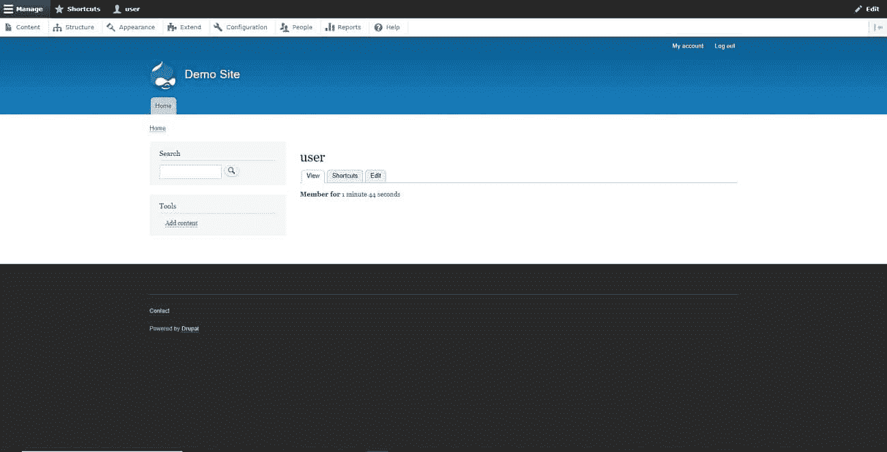

Drupal interface

它有一个相当陡峭的学习曲线。现在不要误会我的意思，对于有 CMS 或类似软件经验的人来说，弄清楚如何做基础工作并不太难。

但它甚至不太直观。因此，如果你不是开发人员或技术人员，Drupal 可能不适合你。

#### 定价

Drupal 是开源的，完全免费，你需要为你的域名和主机提供商付费。

#### Drupal vs WordPress

Drupal 和 WordPress 的主要区别在于，它是专门为开发者、代理和企业设计的。它有先进的功能，如核心的多语言支持，但初学者可能很难学会使用。

你可以在我们的对比文章 [Drupal 和 WordPress](https://kinsta.com/blog/wordpress-vs-drupal/) 中读到更多关于各自优缺点的内容。

### 3.《人鬼情未了》

Ghost

当 [Ghost](https://ghost.org/) 在 2013 年首次推出时，主要目标是成为一个简单易用的严格的[博客平台](https://kinsta.com/learn/blogging-tips/)。但从那以后，它就发展成了一个圆滑的、100% [的无头节点。JS CMS](https://kinsta.com/blog/cms-software/#21-ghost--free-from-29month-hosted-version) 。

它有内置的高级搜索引擎优化选项和一个由 JavaScript 驱动的时尚的 web 应用仪表板。

#### 特征

*   时尚的降价编辑器。
*   密码保护。
*   全球导航。
*   多用户环境。
*   内容调度。
*   SEO 友好的内容结构。
*   高级搜索引擎优化选项。

#### 界面和易用性

就易用性而言，安装 Ghost 可能有点复杂，因为它不是作为一个单击安装选项提供的。但是一旦安装完毕，Ghost dashboard 就变得简单、时尚且更易于使用。

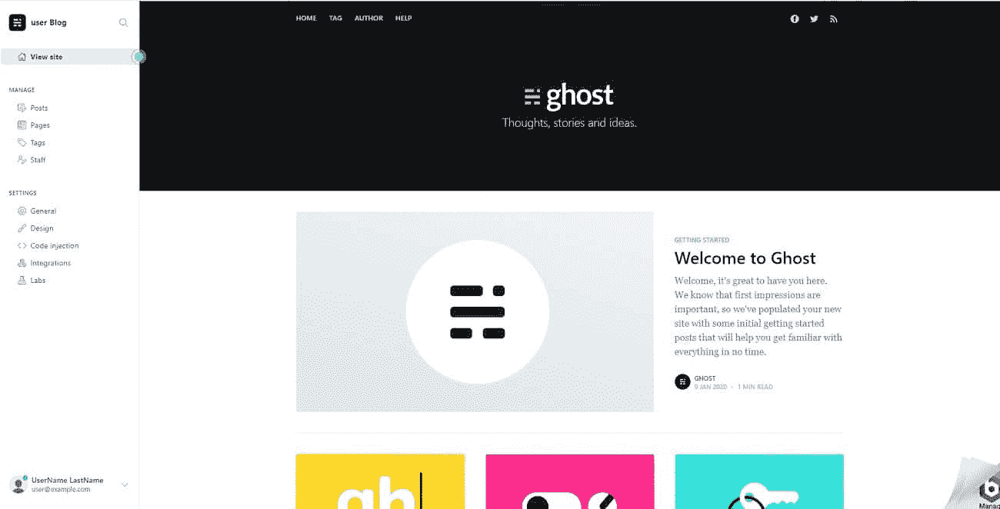

Ghost interface

新安装会自动填充内容，这些内容实际上是关于如何使用 Ghost 的教程。

就像 WordPress 的 Gutenberg 编辑器一样，Ghost 编辑器是真正的所见即所得。这感觉就像你在网站上编写和编辑一个活的页面，但是你只能添加图片、链接、引用和用 markdown 格式化你的文本。

Ghost’s dynamic menu

因为整个仪表板，不仅仅是像 WordPress 那样的编辑器，都是基于 JavaScript 的，所以用户体验非常流畅。这是一个单页的网络应用程序，它的功能也很像。您不必加载新的管理页面或等待页面刷新。

#### 定价

自托管版本是开源免费的。托管的专业版[起价为每月 29 美元](https://ghost.org/pricing/)。

#### Ghost vs WordPress

Ghost 和 WordPress 都很好用，也很好学。任何一个完全的初学者都可以在一个小时之内学会使用其中任何一个并创建一个博客。

但是安装 Ghost 可能有点困难，因为它是一个不太受欢迎的 CMS，很少有网络主机提供一键安装。

Ghost dashboard 稍微光滑一些，对于开发人员来说，使用一个节点。JS 驱动的 CMS 可能看起来比传统的 PHP 和 T2 的 MySQL 更有吸引力。

WordPress 的扩展性和充满活力的社区仍然是大多数初学者的最佳选择。Ghost 也很少支持货币化选项，你必须通过代码手动[插入广告。](https://ghost.org/integrations/google-adsense/?_ga=2.265887244.227124003.1588065074-1276985884.1588065074)

(建议阅读:[如何将 Google AdSense 添加到 WordPress](https://kinsta.com/blog/how-to-add-google-adsense-to-wordpress/) )

### 4.网站架站软件

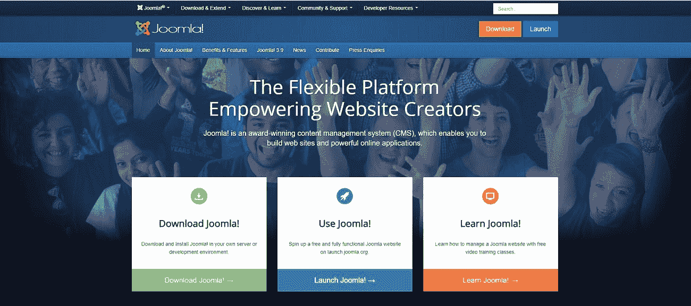

Joomla

Joomla 是另一个开源 CMS，于 2005 年推出，从那以后一直保持着相关性。

这是一个灵活的平台，允许在不知道太多代码的情况下进行大量定制。您可以使用“扩展”来扩展功能，并使用模板来改变您的站点的外观。

#### 特征

*   所见即所得编辑器。
*   货币化。
*   多语言(核心)。
*   多用户环境。
*   分级权限和用户管理。
*   密码保护。
*   模板文件的完全定制化。
*   内容调度。
*   SEO 友好的内容结构。
*   高级搜索引擎优化选项(通过扩展)。

#### 界面和易用性

Joomla 是另一个 CMS ，如果你的主机使用 [cPanel](https://kinsta.com/knowledgebase/what-is-cpanel/) 或另一个标准仪表板，通常只需点击一下就可以安装。安装完成后，您可以登录到管理仪表板。

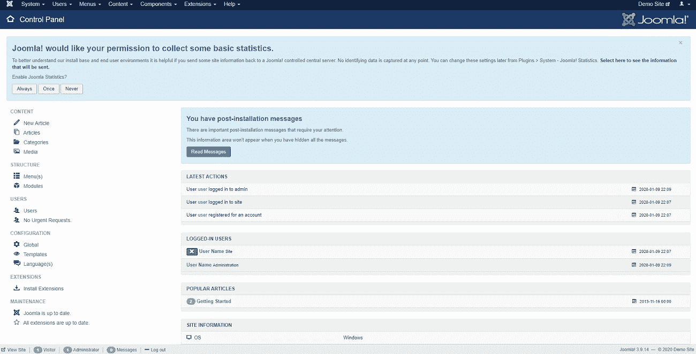

Joomla Interface

Joomla 3 中的仪表盘有点过时，尽管在 2019 年初被宣布为“即将到来”，Joomla 4 却遥遥无期。

没有直观的教程，但是有一个链接指向优秀的老式文档。

总而言之，这不是一个很难学习的界面，初学者可以用自己选择的模板创建并运行他们的网站，不会有太多问题。

#### 定价

免费，除了主机和 DNS 费用和其他开源平台一样。

#### Joomla vs WordPress

Joomla 提供了现成的多语言支持，用户管理有更好的选择。也就是说，界面已经过时，更难使用，许多现有的模板和扩展都是旧的，急需更新。

WordPress 有更好的界面和更多最新的插件和主题。要了解更多的利弊，请查看我们关于 WordPress vs Joomla 的文章。
T3】

## 2022 年最佳托管博客平台

下面我们整理了一份最佳托管博客平台的列表。有了虚拟主机，你不需要投资域名和网络服务器；该服务包括托管和一个子域名或完整域名。

### 5.WordPress.com

WordPress.com

在。WordPress 是一个托管的博客/网站平台。你不需要一个[域名](https://kinsta.com/blog/choose-domain-name/)或主机来开始:你所要做的就是注册。

很难反对免费获得为 36%的网络提供动力的技术。

#### 特征

*   所见即所得编辑器。
*   无限制的访问/带宽。
*   密码保护。
*   全球导航。
*   有限的可定制性。
*   内容调度。
*   SEO 友好的内容结构。

#### 界面和易用性

因为你不需要单独的虚拟主机或域名，开始就像注册并选择你的[博客的名字](https://kinsta.com/blog/blog-name-ideas/)一样简单。

WordPress.com 界面是一个基于 JavaScript 的网络应用程序，可能会让你想起更多的幽灵体验。

[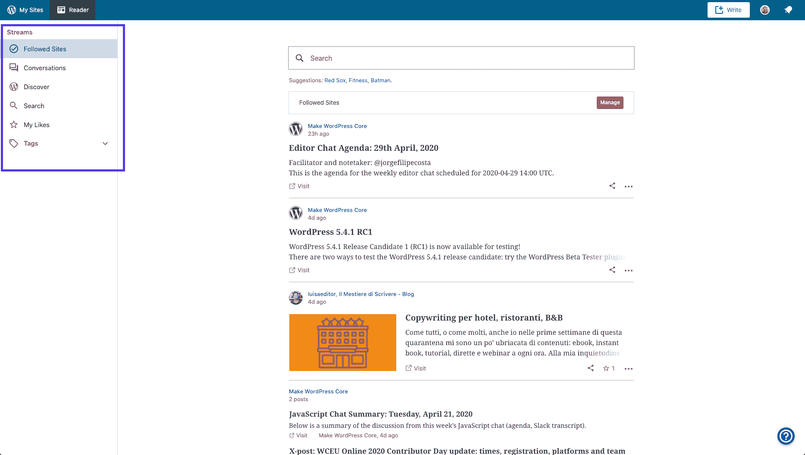](https://kinsta.com/wp-content/uploads/2020/05/wordpress-com-dashboard.png)

WordPress.com interface

大多数初学者将能够改变主题和添加新的内容，而不需要教程。此外，支持 WordPress.com 的编辑器通常被称为块编辑器(又名[古腾堡](https://kinsta.com/blog/gutenberg-wordpress-editor/))，它提供了良好的写作体验:

[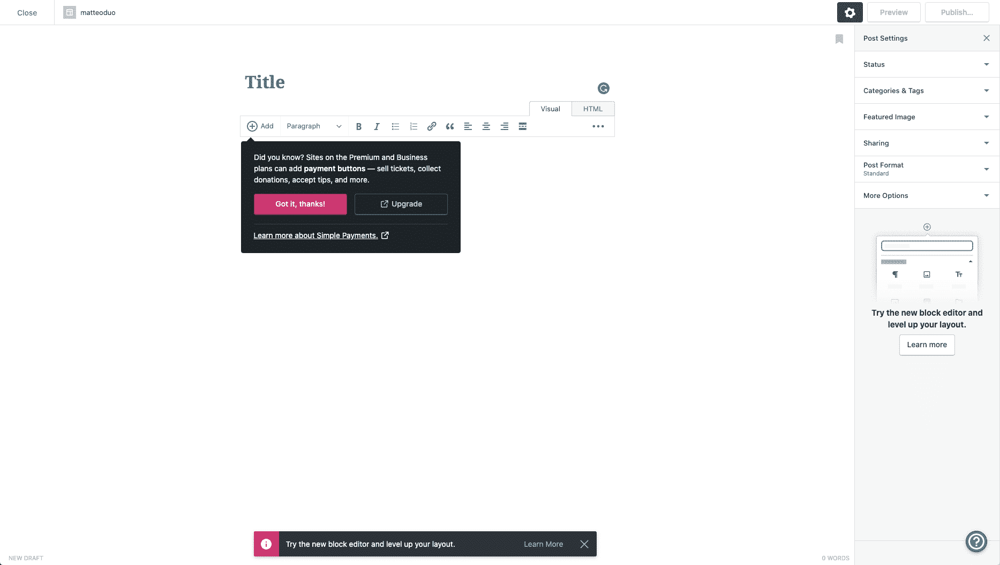](https://kinsta.com/wp-content/uploads/2020/05/wordpress-com-editor.png)

The editor in WordPress.com

#### 定价

[基本计划 100%免费](https://wordpress.com/pricing/)。你可以注册一个免费的博客/网站，它将被托管在一个 WordPress 子域上。你的博客上会有 WordPress.com 的广告。

如果你想要自己的。com 域名，更多的可定制性，没有广告，个人计划每月花费 4 美元。按照基本计划，你的博客将被托管在一个[子域](https://kinsta.com/blog/wordpress-subdomain/)，比如 yourblog.wordpress.com。

#### WordPress.com 对 WordPress.org

同样的包装，但内容却大不相同。WordPress.com 没有数千个主题可供选择，而是将你限制在几十个。

如果你只是想创建一个简单的网站或博客，你没有什么技术技能，也没有计划扩大或赚钱你的网站。com)是正确的选择。

如果你想对设计有更多的控制，并有机会在进行中扩展你的博客，自托管 WordPress 是最好的选择。

了解更多关于 WordPress.com 和 WordPress.org 的差异。

### 6.写日志（部落格）的人

[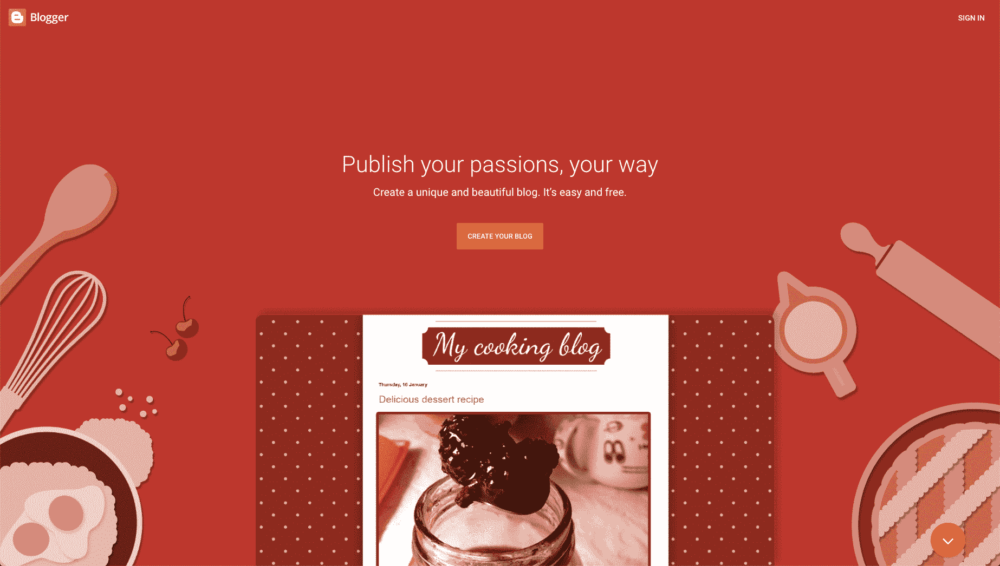](https://kinsta.com/wp-content/uploads/2020/05/blogger.png)

Blogger

[Blogger](https://www.blogger.com/) 是谷歌托管的博客平台。它是免费的，比大多数其他托管选项更具可定制性(例如，[你可以编辑你的主题](https://support.google.com/blogger/answer/176245))，而且有相当多的可用主题。

[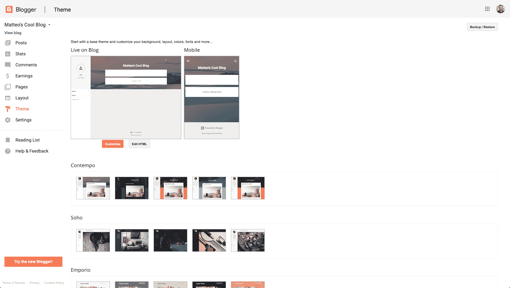](https://kinsta.com/wp-content/uploads/2020/05/blogger-themes.png)

Themes in Blogger

有了免费帐户，你的博客将被托管在 Blogger 子域上，并且可以通过 yourblog.blogspot.com 这样的网址访问。

#### 特征

*   基本编辑器。
*   无限制的访问/带宽。
*   货币化。
*   有限的可定制性。

#### 界面和易用性

注册是启动和运行你的博客的唯一必要步骤。登录后，您可以轻松地创建新内容或更改新博客的主题。

[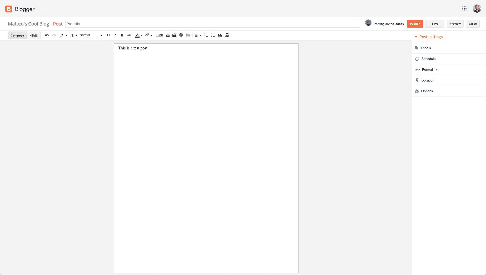](https://kinsta.com/wp-content/uploads/2020/05/blogger-ui.png)

Blogger interface

界面简单易用。仪表板中没有不必要的部分。完全的初学者不需要额外的指导就可以轻松上手，因为这是一个简单的富文本编辑器。

#### 定价

免费(有子域和广告)。

#### Blogger vs WordPress

Blogger 旨在作为一个简单的解决方案来帮助完全初学者创建博客。如果你只是想创建一个简单的个人博客或日志，这并不是一个可怕的选择。

如果你正在创建一个专业的博客或网站，并且你想在未来发展业务，有一些更好的选择，其中包括 WordPress 。

### 7.中等

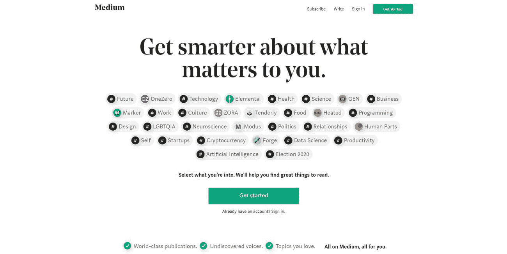

Medium

比起严格意义上的博客平台，Medium 更像是一个分享[你的作品](https://kinsta.com/blog/grammar-checker-tools/)并让它被阅读的社交平台。

设计是圆滑和直观的，你不会被主题、标志或布局分散注意力。你所要考虑的就是[创造内容](https://kinsta.com/blog/content-length/)。

#### 特征

*   丰富的编辑。
*   无限制的访问/带宽。
*   通过[中型合作伙伴计划](https://medium.com/creators)进行有限的货币化。

#### 界面和易用性

Medium 入门极其简单。注册你的推特、谷歌或脸书账号，开始写你的第一篇文章。

[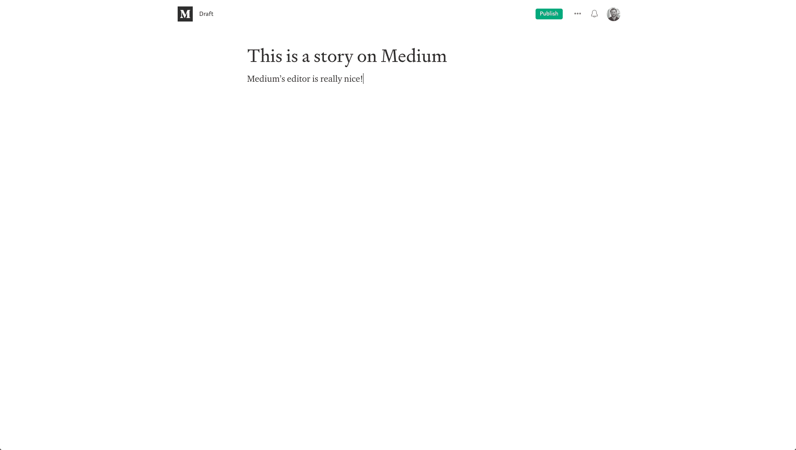](https://kinsta.com/wp-content/uploads/2020/05/medium-editor.png)

Writing on Medium

您没有设计选项，可以 100%专注于创建和共享内容。

编辑器很时尚，发布的帖子看起来和编辑器一模一样。有限的选择使它非常容易使用，但它也创造了一个狭窄的比赛场地。

#### 定价

Medium 提供对文章的有限访问权限，Medium 会员权限为**50 美元/年，完全访问权限为**。从内容创建者的角度来看，您可以免费托管无限的内容。

## 注册订阅时事通讯

### 想知道我们是怎么让流量增长超过 1000%的吗？

加入 20，000 多名获得我们每周时事通讯和内部消息的人的行列吧！

[Subscribe Now](#newsletter)

#### 媒体 vs WordPress

对于那些只想让自己的博客文章被阅读的作者来说，Medium 是一个很好的选择。如果你想要一个域名和一个[可定制的博客和网站](https://kinsta.com/blog/change-wordpress-theme/)，WordPress 是一个不错的选择。即使你有专门的博客，你仍然可以在 Medium 上分享你的文章。

在我们的指南中阅读更多关于[媒体和 WordPress](https://kinsta.com/blog/medium-vs-wordpress/) 的优缺点。
T3】

### 8.HubSpot CMS

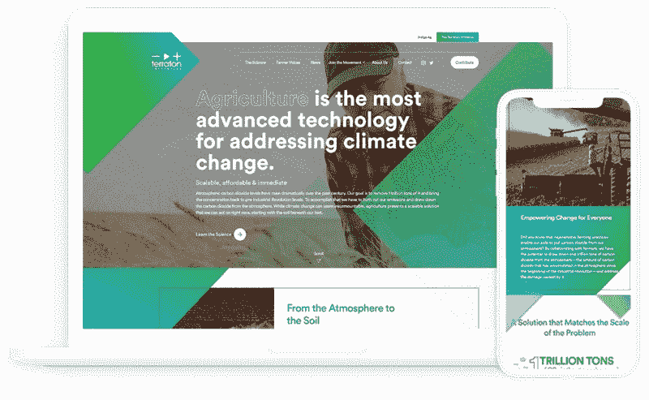

HubSpot CMS

HubSpot CMS 是一个博客平台和网站构建器，由一个易于使用的[拖放编辑器](https://kinsta.com/blog/wordpress-page-builders/)驱动。如果你需要[编辑代码](https://kinsta.com/knowledgebase/edit-wordpress-code/)，博客编辑器提供了所见即所得编辑器或者源代码视图。当然，与 HubSpot 营销工具的简单本地集成—包括电子邮件营销、登录页面、表单、弹出窗口等功能。—让你能够[推动流量](https://kinsta.com/blog/how-to-drive-traffic-to-your-website/)，并将其转化为[订户](https://kinsta.com/blog/wordpress-lead-generation/)或客户。

HubSpot CMS 与免费的 HubSpot CRM 进行了内置集成。这对[的博客作者](https://kinsta.com/learn/blogging-tips/)来说很有价值，因为你可以从你的博客文章中自动收集线索并存储到 CRM 中。此外，您可以使用这些 CRM 数据来做一些很酷的事情，如个性化您的内容和 CTA，[，这有助于您提高转化率](https://kinsta.com/blog/conversion-rate-optimization-tips/)。

[开发人员](https://kinsta.com/blog/web-developer-salary/)可以定制网站，构建模板、定制对象等等，而非技术用户只需很少的繁文缛节就可以轻松地编写、编辑和发布。

#### 特征

*   具有治理和分区的多用户
*   内置的 [A/B/n 测试](https://kinsta.com/blog/wordpress-ab-testing-tools/)可优化您的内容
*   [SEO](https://kinsta.com/blog/wordpress-seo/) 推荐
*   内容调度
*   [版本控制](https://kinsta.com/blog/wordpress-version-control/)管理和查看一段时间内的更新
*   联系归因分析你的线索和销售来自哪里
*   全天候安全监控
*   全天候支持

#### 界面和易用性

界面很光滑。营销人员和博客作者将不得不花很少的时间来学习界面和如何开始。

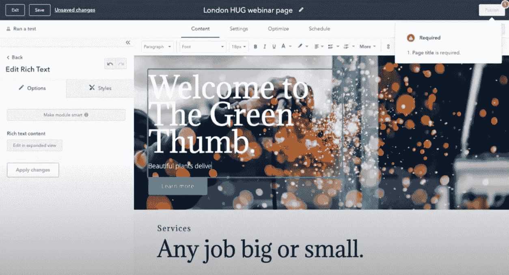

HubSpot CMS demo

但是，如果您想进行更多的技术定制，也可以这样做(尽管需要 HubSpot 开发人员的帮助)。

#### 定价

HubSpot CMS Professional 的计划起价为每月 300 美元，企业计划起价为每月 900 美元。

#### HubSpot vs WordPress

HubSpot 在可用性和便利性方面都有优势，尽管它的价格可能会让单身或业余博客作者望而生畏。与其他博客平台相比，它的主要优势是如何顺利地与 HubPost 生态系统集成(当然),以及从不用担心更新、[安全](https://kinsta.com/blog/wordpress-security/)和修补几十个插件以获得所需功能中获得的自由。

### 9.威克斯

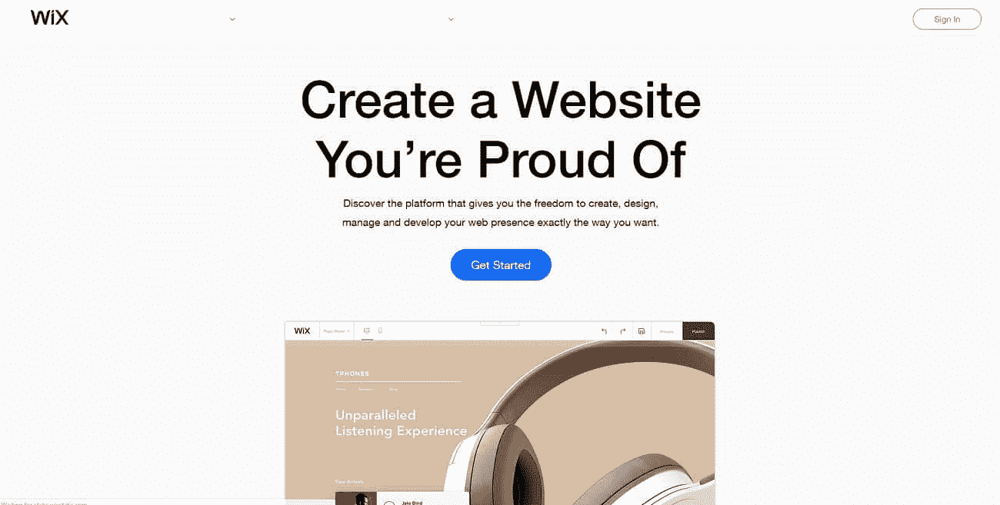

Wix

Wix 是一个拖放式网站构建器，但它也是一个适合有创造力的个人的博客平台。

如果你是一个有抱负的设计师或有创造力的灵魂，但不想处理任何代码或任何技术性的东西，你可能想试试 Wix。

#### 特征

*   拖放式网站构建器(类似于 WordPress 可用的[)。](https://kinsta.com/blog/wordpress-page-builders/)
*   Wix ADI(人工智能驱动设计)。
*   货币化(仅限付费计划)。
*   高达 500 MB 数据/带宽(免费计划)。
*   广告(免费和每月 4.50 美元的计划在您的网站上显示 Wix 广告)。
*   货币化(有保费计划)。

#### 界面和易用性

你可以登录脸书或谷歌，或者用你的电子邮件地址创建一个账户来注册。一旦你注册了，Wix 教程就会开始，会问你几个问题。

如果您回答说您没有很多经验，它会建议您让 ADI 为您创建网站。

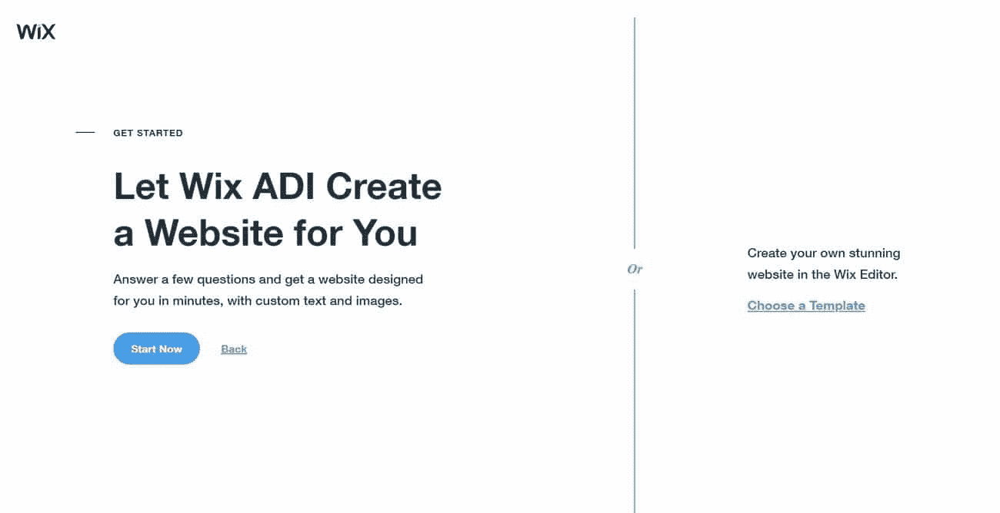

Wix intro tutorial

ADI 公司利用人工智能根据几个问题来设计您的网站。

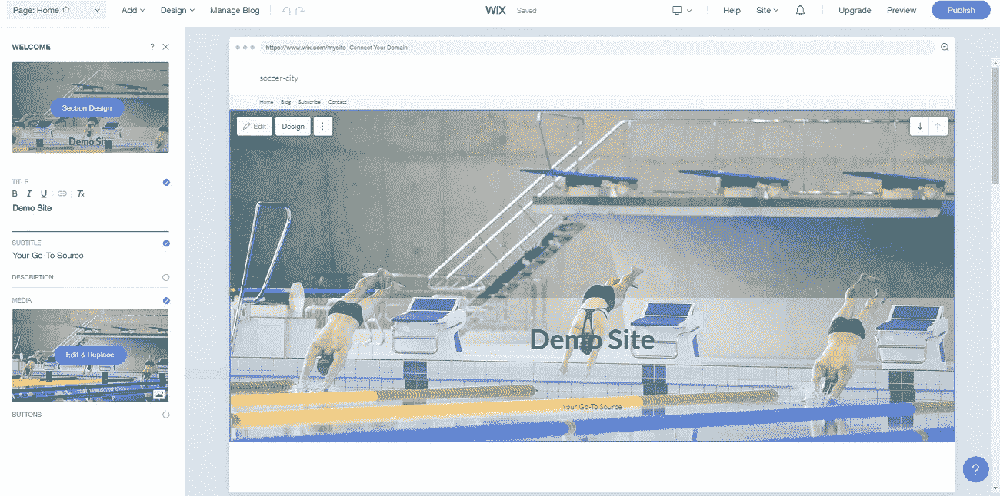

Wix interface

标准仪表板以他们的拖放式网站构建器为中心。您可以通过点按元素来编辑它们，并通过点按右上角的箭头来重新排列它们。

它相当直观且易于使用，但很容易浪费时间对设计吹毛求疵，而不是专注于为你的博客创作内容。

完全控制设计，不需要编码技能。

#### 定价

免费计划附带 ads，Wix 子域，带宽限制为 500 兆字节。货币化计划和[电子商务功能](https://kinsta.com/blog/wix-vs-wordpress/#wix)起价 17 美元/月。

#### Wix vs WordPress

虽然 Wix 可以帮助你在几分钟内启动并运行，但它几乎是为了帮助你作为博客作者关注错误的事情而设计的。很容易花几个小时来挑剔设计和调整单个元素的大小。高级功能也被锁定在一些相当昂贵的计划后面。

对于博客作者来说并不理想，但 Wix 可能是创意专业人士作品集网站的一个好选择(以下是如何在 WordPress 中[创建你的作品集)。](https://kinsta.com/blog/wordpress-portfolio-plugins/)

在我们的比较指南中阅读更多关于 Wix 和 WordPress 的优缺点。

### 10.方形空间

Squarespace

Squarespace 是另一个拖放式网站构建器，它能让你完全创造性地控制你的网站或博客。这是一个托管服务，所以你不需要准备服务器或域名。

#### 特征

*   圆滑的拖放网站建设者。
*   货币化和电子商务。
*   多个用户。
*   内容调度。
*   SEO 友好的内容结构。
*   [电子邮件活动](https://kinsta.com/blog/how-to-build-an-email-list/)。
*   [网站分析](https://kinsta.com/help/mykinsta-analytics/)。

#### 界面和易用性

要创建您的网站，注册一个帐户，选择一个主题，然后开始。页面生成器非常容易使用。

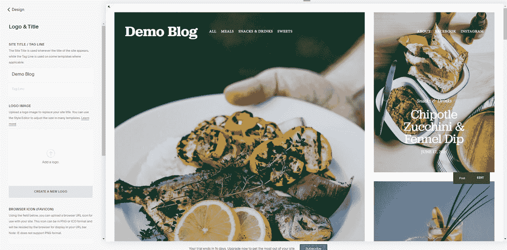

Squarespace interface

只需悬停并点击元素，您就可以轻松地更改和移动网站上的文本和图像。

请注意，没有免费计划，因此在 14 天的免费试用期间，您只能免费访问该网站。

厌倦了你的 WordPress 站点缓慢的主机？我们提供超快的服务器和来自 WordPress 专家的 24/7 世界级支持。[查看我们的计划](https://kinsta.com/plans/?in-article-cta)

#### 定价

个人计划每月 12 美元起(如果按年支付)。

#### Squarespace vs WordPress

Squarespace 提供了完全的可定制性，他们的溢价计划为电子商务提供了一些非常令人印象深刻的选择，但该公司要求对你自己的“有点太多的控制”。

我指的是这个。从他们的 [ToS](https://www.squarespace.com/terms-of-service) 第 2.2 节中，你可以读到:

> **2.2。你给我们的许可证。**当您通过服务提供用户内容时，您授予 Squarespace(包括代表我们的第三方托管服务提供商)一项非排他性的、全球性的、永久的、不可撤销的、免版税的、可再许可的、可转让的权利和许可，以使用、托管、存储、复制、修改、创建衍生作品(例如由翻译、改编或我们为使用户内容更好地与服务配合而做出的其他更改所产生的作品)、交流、发布、公开展示、公开执行和分发用户内容，目的仅限于允许我们提供、改进、推广和保护服务。本节不影响您根据适用的数据保护法可能拥有的任何权利。

我想澄清这一点:他们没有“窃取”你的任何内容和你拥有的任何权利，这些仍然是你的。然而，你可能会发现，比方说，你的一张照片被用来推广他们的平台。尽管有时这种体验很好，但并不总是这样，默认情况下不应该授予权限。

然而， [Squarespace 为世界上大约 2.5%使用 CMS](https://w3techs.com/technologies/history_overview/content_management) 的网站提供支持，事实上，对于那些希望拥有一个一体化平台而又不想处理技术问题的人来说，这是一个很好的选择。

在我们关于 [Squarespace 和 WordPress](https://kinsta.com/blog/squarespace-vs-wordpress/) 的比较指南中，阅读更多关于利弊的信息。

### 11\. Weebly

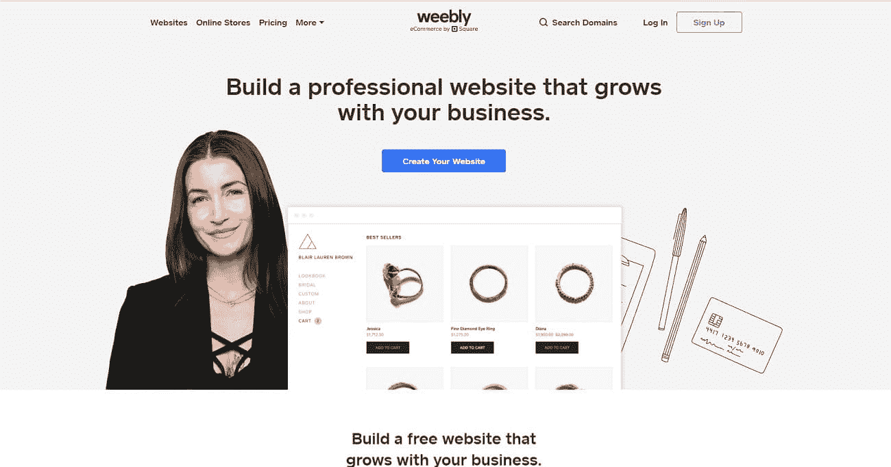

Weebly

Weebly 是这个列表中的最后一个网站构建者，也是由一个漂亮的拖放构建器驱动的。它为 T2 提供了一个免费的计划，在那里你可以创建一个网站并在 yourblog.weebly.com 的子域上发布。

#### 特征

*   拖放生成器。
*   500 MB 存储空间(免费计划)/无限存储空间(所有付费计划)。
*   货币化。
*   无限制的访问/带宽。
*   基本线索捕捉。

#### 界面和易用性

还是那句话，入门又快又容易。没有技术，没有服务器，没有准备工作需要。只需报名并确定一个主题。

这将打开网站构建器，它几乎是直观的，并使用一个块系统，让您自定义设计。

Weebly interface

这种体验稍显乏味，自托管的 WordPress 有页面生成器插件，提供相同或更好的设计和可用性。

#### 定价

免费的子域，5 美元/月连接您的域和专业计划开始于 12 美元/月。

#### Weebly vs WordPress

虽然设置自托管 WordPress 需要更多一点的准备，但是你可以获得同样好的[页面生成器](https://kinsta.com/blog/wordpress-page-builders/)和更好的定制选项。

Weebly 很容易上手，可能是创建你的第一个个人博客或网站的好地方。

在我们的专用帖子中阅读更多关于 Weebly vs WordPress 的信息。

### 12.打字板

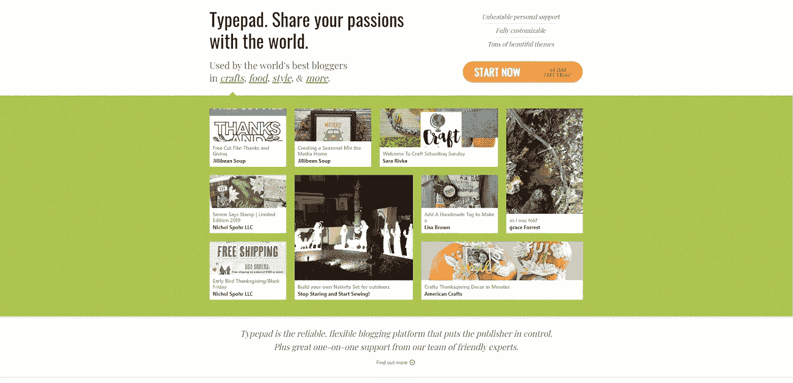

Typepad

在博客发展的早期，Typepad 曾经是一个前沿的博客平台，但这些年来它已经失去了活力。[直到 2018 年](https://profile.typepad.com/sethgodin)，Seth Godin 曾经在 Typepad 上运行他的博客，但后来他转移到了…WordPress！

#### 特征

*   多个用户。
*   货币化。
*   密码保护。
*   内容调度。

#### 界面和易用性

界面是过时的，就像特性列表一样。如果喜欢简约复古的设计，还不错。使用起来并不难，但也不直观。这可能会让你想起几年前的 WordPress 仪表盘。

#### 定价

无限存储和带宽的套餐起价为每月 8.95 美元。

#### Typepad vs WordPress

说到 Typepad，它并不是 WordPress 的一个有价值的替代品。即使你想要一个简单的选项，你也需要为 Typepad 准备一个 DNS 和域名。托管 WordPress.com 选项更容易使用，有一个更时尚的界面，更好看的主题，并且成本低于专业计划的 Typepad。

有趣的事实:早在 2005 年，Typepad 就是我合作的第一个博客平台。

### 13.现场杂志

[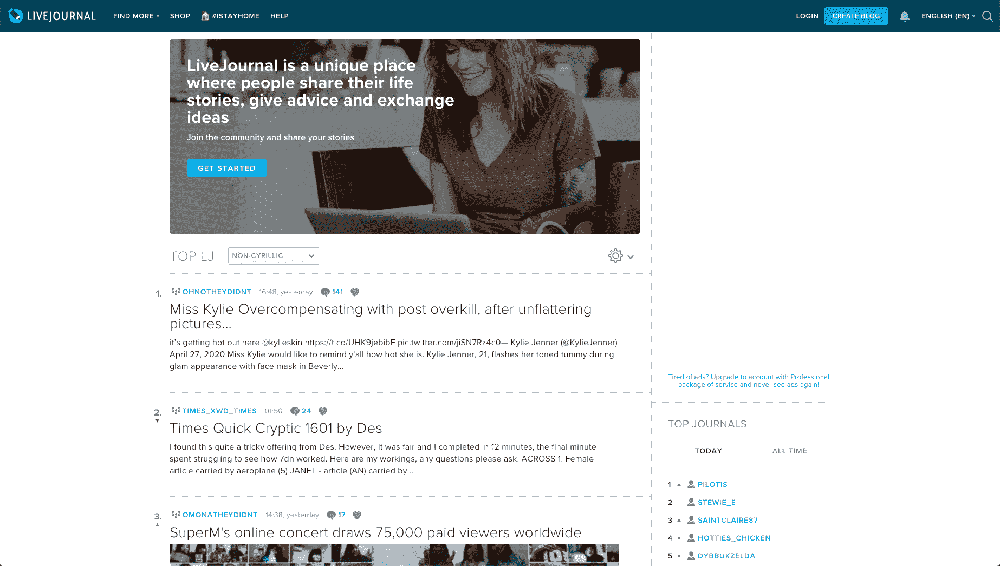](https://kinsta.com/wp-content/uploads/2020/05/livejournal.png)

LiveJournal

LiveJournal 是互联网上最早的在线博客平台之一，现由俄罗斯媒体公司 SUP Media 所有。LiveJournal 是微博平台和社交网络的混合体。

#### 特征

*   内容调度。
*   社区。
*   分析。
*   移除广告(付费功能)。

#### 界面和易用性

这个界面虽然有点过时，但并不十分难用。要我说也不直观。这可能会让你想起几年前的 WordPress 仪表盘。

[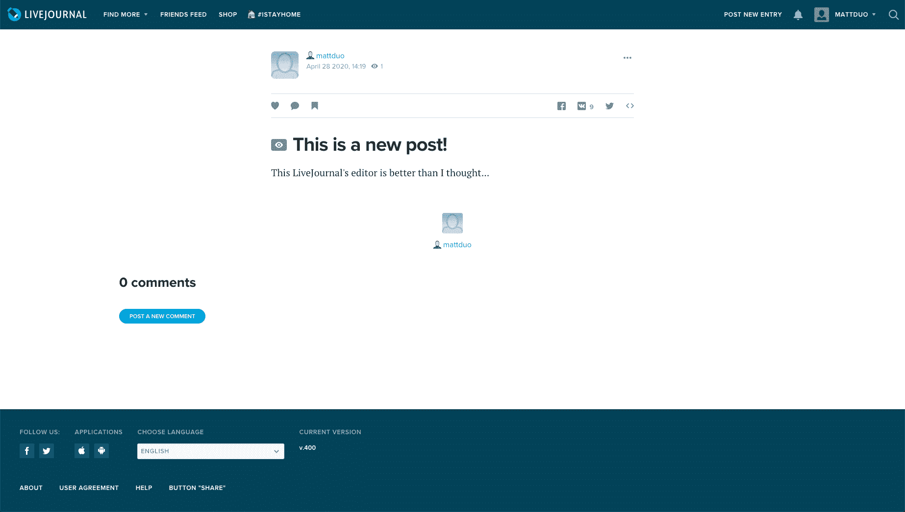](https://kinsta.com/wp-content/uploads/2020/05/livejournal-interface.png)

LiveJournal interface

#### 定价

大多数功能来自他们的免费计划，但如果你选择自动支付，也有可能通过一个[专业包](https://www.livejournal.com/profaccounts/)解锁更多功能，该包将你设置为每年 19.95 美元。

#### LiveJournal vs WordPress

老实说，我认为在 2020 年，LiveJournal 很难在某人的首选博客平台列表中找到一席之地，因为它给了我使用过时工具的体验。然而，如果你的目标受众会说俄语，你可能会发现 LiveJournal 值得一试。

### 14.Tumblr

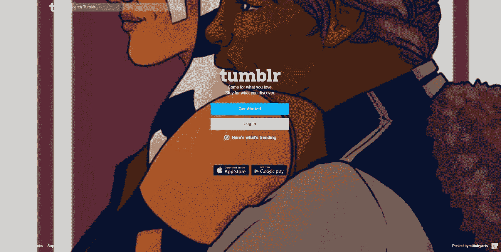

Tumblr

Tumblr 是一个很受欢迎的微博网站，尽管比几年前少了很多。

有趣的是，WordPress.com 背后的公司 Automattic 于 2019 年从威瑞森收购了 Tumblr，因此我们可能会在未来几年看到该平台的一些令人兴奋的变化。

#### 特征

*   受众和分享。
*   无限制的上传/访问/带宽。

#### 界面和易用性

Tumblr 有一个时尚的界面，你可以在几秒钟内获得你的第一个帖子。

[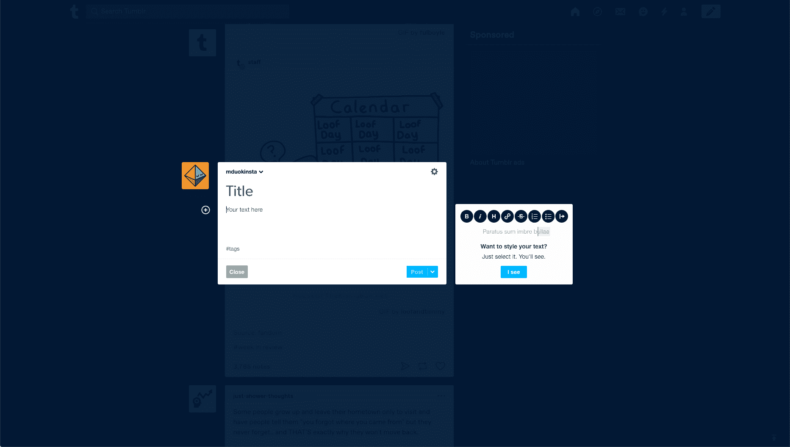](https://kinsta.com/wp-content/uploads/2020/05/tumblr-interface.png)

Tumblr interface

出色的移动界面让你在手机上写短文变得很容易。这也是一个阅读内容和获取下一部作品灵感的好地方。

[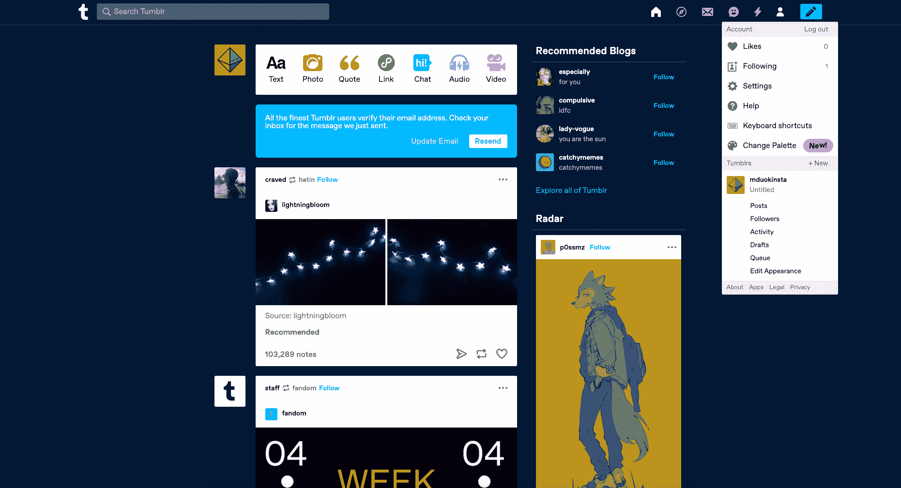](https://kinsta.com/wp-content/uploads/2020/05/tumblr-dashboard-1.png)

Tumblr dashboard

#### 定价

免费，无限存储/带宽。

#### Tumblr vs WordPress

如果你是一名艺术家或摄影师，想要开一个博客来分享你的艺术，而不是为你的业务建立一个平台，那么 Tumblr 可能是你的一个好选择。

只需几个步骤，您就可以轻松加入并开始分享您的作品。有一个你能接触到的内在观众。

但是如果你想完全定制你的博客，并且完全控制你的内容，WordPress 是一个不错的选择。下面是[如何将 Tumblr 导入 WordPress](https://kinsta.com/blog/import-tumblr-to-wordpress/) 。

### 15.照片墙

Instagram 可能不符合你对博客平台的想法，但在某些情况下，鉴于它的发展方式，它可能是建立受众的最佳场所[。](https://kinsta.com/blog/instagram-stats/)

#### 特征

*   受众和分享。
*   无限制的上传/访问/带宽。
*   参与工具。

#### 界面和易用性

好像你还不知道 Instagram 是什么样的，嗯，真的很好用。Instagram 界面的唯一缺点是，如果没有变通办法，你无法从笔记本电脑上添加帖子。

这对于喜欢长篇内容的作家或博客来说很不方便。

#### 定价

免费，无限存储/带宽(就像脸书)。

#### Instagram vs WordPress

在一些情况下，Instagram 比 WordPress 更适合写博客。如果你是一名摄像师或博客写手，Instagram 可能真的是你的主要渠道和首选博客平台。

然而，在大多数情况下，最好是两者兼而有之，同时拥有一个专业的博客/网站。以下是你如何在 WordPress 上展示你的 Instagram feed。
T3】

## 最好的博客平台是什么？

如果你已经读到这里，那么你一定会得到我们这个问题的答案:**哪个是最好的博客平台，为什么？**

剧透:我们认为对于大多数严肃的博客作者和企业来说，最好的选择是 [WordPress](https://kinsta.com/knowledgebase/what-is-wordpress/) 。

也许有其他方法可以让你更快地发布你的内容，但是 WordPress 是那些希望让他们的博客成为一个长期在线展示和商业平台的人的最佳选择。

### 新手最好的博客平台是什么？

这取决于你对博客的意图。想要创建个人博客的最佳选择可能是免费托管的解决方案，如[WordPress.com](https://kinsta.com/blog/wordpress-com-vs-wordpress-org/)、博客或[媒体](https://kinsta.com/blog/medium-vs-wordpress/)。

如果你只是想要一个分享艺术的地方，你甚至可以用 Tumblr 或 Instagram 来泡脚。

但是如果你想为企业创建一个公司博客，并增加访问者和客户，像 WordPress 或 Drupal 这样的自托管选项为你未来的扩展提供了最多的选择。

### 哪个博客平台最适合赚钱？

WordPress 有最多的选项来扩展你的博客，既有用于广告投放的[插件](https://kinsta.com/blog/how-to-add-google-adsense-to-wordpress/)和[联盟营销](https://kinsta.com/affiliate-academy/what-is-affiliate-marketing/)，也有开发成熟的[电子商务商店](https://kinsta.com/blog/wordpress-ecommerce-plugins/)或[会员网站](https://kinsta.com/blog/wordpress-membership-plugins/)。

### 哪个博客平台最适合作家？

如果你只是想在网上找到一个观众，那么 Medium 可能是新作家分享他们作品的最佳起点。

但是如果你是一个已经出版的作者，想要维持一个专业的平台，建立你现有的受众，以及像[电子邮件列表](https://kinsta.com/blog/email-marketing-best-practices/)这样的资产，自托管 WordPress 是一个不错的选择。

### SEO 最好的博客平台是什么？

让你完全控制页面内容的自托管解决方案，比如 WordPress、Drupal 和 Joomla，最适合 SEO。

WordPress 很容易设置，大量的[优秀的 SEO 插件](https://kinsta.com/blog/best-seo-plugins-for-wordpress/)让完全的初学者能够创建 [SEO 友好的内容](https://kinsta.com/blog/what-does-seo-stand-for/#6-write-content-people-want-to-read)。当然，你还需要一个可靠的主机，具有[快速加载时间](https://kinsta.com/blog/boosting-wordpress-performance/)，以获得最佳效果。

[Ready to start blogging 💻? Read this guide to learn which platform works best for you! ⚡️Click to Tweet](https://twitter.com/intent/tweet?url=https%3A%2F%2Fkinsta.com%2Fblog%2Fbest-blogging-platform%2F&via=kinsta&text=Ready+to+start+blogging+%F0%9F%92%BB%3F+Read+this+guide+to+learn+which+platform+works+best+for+you%21+%E2%9A%A1%EF%B8%8F&hashtags=blog%2CWordPress)

## 摘要

最好的博客平台不仅为博主提供了一个写自己想法的地方，还为他们提供了发展粉丝甚至生意所需的所有工具。

这就是像 WordPress 这样的自托管解决方案与列表中其他解决方案的区别。

如果你想要的只是一个个人博客，或者分享和获得写作反馈，像 Medium 或 WordPress.com 这样的托管解决方案可能更适合你。

最终，最好的博客平台取决于你的目标和你的现状。显然，对我们来说，没有什么能和 WordPress 相比。

你呢？你最喜欢的博客平台是什么？

* * *

让你所有的[应用程序](https://kinsta.com/application-hosting/)、[数据库](https://kinsta.com/database-hosting/)和 [WordPress 网站](https://kinsta.com/wordpress-hosting/)在线并在一个屋檐下。我们功能丰富的高性能云平台包括:

*   在 MyKinsta 仪表盘中轻松设置和管理
*   24/7 专家支持
*   最好的谷歌云平台硬件和网络，由 Kubernetes 提供最大的可扩展性
*   面向速度和安全性的企业级 Cloudflare 集成
*   全球受众覆盖全球多达 35 个数据中心和 275 多个 pop

在第一个月使用托管的[应用程序或托管](https://kinsta.com/application-hosting/)的[数据库，您可以享受 20 美元的优惠，亲自测试一下。探索我们的](https://kinsta.com/database-hosting/)[计划](https://kinsta.com/plans/)或[与销售人员交谈](https://kinsta.com/contact-us/)以找到最适合您的方式。*