# 如何阻止 WordPress 垃圾评论(内置功能，垃圾插件，验证码和 WAF)

> 原文：<https://kinsta.com/blog/wordpress-spam-comments/>

我们都喜欢 WordPress，但是这个平台的一个令人沮丧的地方是不得不处理大量的垃圾评论。不管你的企业经营的是哪种类型的博客，你都必须找出或者想出一个策略，如何在某个时候阻止垃圾评论。

值得庆幸的是，有很多很棒的插件、技巧和设置，你可以很容易地启用和/或安装它们来减少 99%的垃圾邮件。是的，你真的可以减少那么多！停止浪费时间管理垃圾评论，专注于发展你的博客和业务。

过多的垃圾评论会损害你的网站。它会影响你的搜索引擎排名，会影响你的[讨论在合法评论者](https://kinsta.com/blog/wordpress-forum-plugins/)中的可信度，还可能有[安全影响](https://kinsta.com/blog/wordpress-security/)。阻止它是非常值得的。

那么你如何阻止垃圾评论呢？

### 更喜欢看[视频版](https://www.youtube.com/watch?v=P75-borhs1I)？


## 用内置功能阻止垃圾评论的 7 种方法

对抗 WordPress 评论垃圾的第一步是讨论设置，你可以通过**设置>讨论**进入。


> Kinsta 把我宠坏了，所以我现在要求每个供应商都提供这样的服务。我们还试图通过我们的 SaaS 工具支持达到这一水平。
> 
> <footer class="wp-block-kinsta-client-quote__footer">
> 
> 
> 
> <cite class="wp-block-kinsta-client-quote__cite">Suganthan Mohanadasan from @Suganthanmn</cite></footer>

[View plans](https://kinsta.com/plans/)

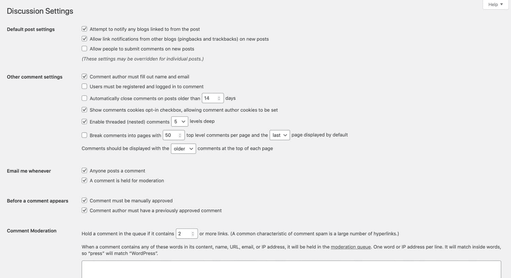

Discussion settings screen


在这里，您可以:

 您也可以通过帖子编辑屏幕禁用单个帖子的评论。

让我们来看看这些方法。

[垃圾评论？从未听说过他们😌 ...感谢这些插件和功能❌ 点击推文](https://twitter.com/intent/tweet?url=https%3A%2F%2Fkinsta.com%2Fblog%2Fwordpress-spam-comments%2F&via=kinsta&text=Spam+comments%3F+Never+heard+of+them+%F0%9F%98%8C+...thanks+to+these+plugins+and+features+%E2%9D%8C&hashtags=plugins%2Ccaptcha)


### 1.完全禁用注释

第一个选择你必须简单地[完全禁用 WordPress 评论](https://kinsta.com/blog/wordpress-disable-comments/)。也许你的企业不使用或不想要评论，所以为了保护自己免受任何垃圾评论，你可以禁用它们。最简单的方法之一就是取消选择**允许人们对新文章发表评论**选项，它位于**设置>讨论**下。

要完全禁用评论，请转到讨论设置屏幕顶部的**默认帖子设置**部分，并取消选中选项。

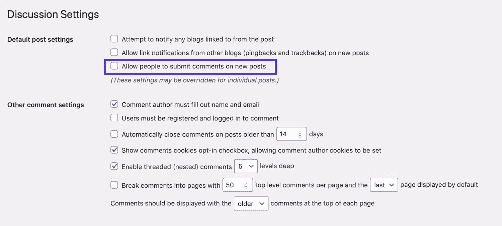

Disable comments


这将关闭对所有新帖子的评论。您也可以关闭 pingbacks。

请注意，对于您已经发布的帖子，评论功能不会关闭。如果你想关闭这些功能，你需要对每一篇文章分别进行操作。我们将很快向您展示如何做到这一点。

滚动到屏幕底部，点击**保存更改**按钮。所有评论将被禁用。

### 2.关闭匿名评论

另一个选择是关闭匿名评论。默认情况下，WordPress 本地评论要求访问者提供四条信息:评论、姓名、电子邮件和网站。

如果启用了匿名评论，就不需要匿名评论了。这立即打开了你的网站，让大量的垃圾邮件不断抓取网站上的评论表格。

要在 WordPress 禁用匿名评论，只需勾选**设置>讨论**下的**评论作者必须填写姓名和电子邮件**选项。


Turn off anonymous comments


这将使机器人更难留下自动评论(占垃圾评论的绝大部分)——但并非不可能。这也可能阻止人们留下恶意评论或浏览你的网站。

### 3.启用评论审核

你阻止垃圾评论的下一个选择是使用一些内置的审核功能。

首先是手动批准每个评论的能力。虽然这不会减少垃圾邮件，但它可以有效地确保您网站的访问者只看到您批准的高质量评论。

第二个是评论审核队列。例如，如果评论包含一定数量或更多的链接，您可以自动保持适度。你也可以建立一个单词、名字、网址、IP 等的列表。也是温和的。

在评论出现前的和**部分进入**电子邮件通知我。****

*   要审核所有评论，请勾选**评论必须手动批准**。
*   要审核来自新评论者的评论，请检查**评论作者必须有先前批准的评论**。
*   要在评论等待审核时收到电子邮件(这一点很重要，以便您可以快速审核、批准或删除评论)，请选中**在评论等待审核时给我发电子邮件**选项。

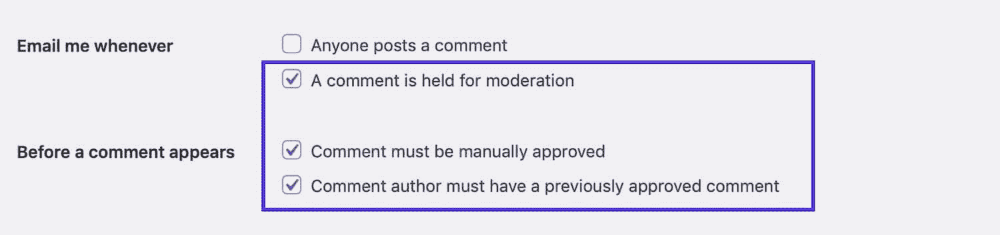

Enable comment moderation


### 4.仅允许登录用户的评论

如果您想进一步限制可以发表评论的人，您可以选择只允许登录该网站的用户发表评论。如果你的网站是一个会员社区，你可能会这样做，你想鼓励社区内部的讨论，但不让其他评论者进入。

为此，请转到**其他注释设置**部分。勾选**用户必须注册并登录才能评论**选项。

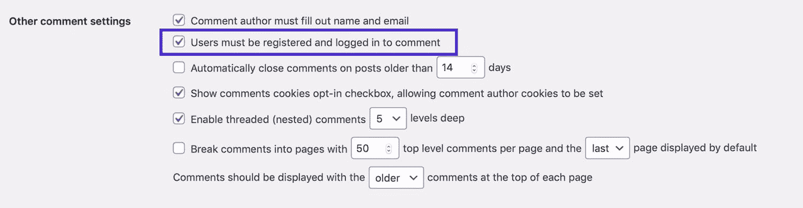

Allow comments from logged-in users


你还需要考虑[用户注册](https://kinsta.com/blog/wordpress-user-registration-plugins/)的设置——你会允许任何人注册吗？还是会有一个审核过程？进入**设置>常规**即可进入注册设置。

### 5.创建黑名单列表

如果你希望允许评论，但不希望评论特定主题，那么你可以设置一个黑名单。这将包括垃圾邮件发送者常用的词，以及您不希望在您的网站上出现的相关词，如亵渎。

如果你不希望你的竞争对手的产品或网站被提及或链接，你也可以包括这些(尽管小心不要做得太过分)。

要创建黑名单单词列表，请转到**评论黑名单**字段，键入黑名单单词或短语，每行一个。他们不必局限于文字:他们可以包括[电子邮件地址](https://kinsta.com/blog/find-email-address/)，网站网址，IP 地址，或任何你想包括的东西。

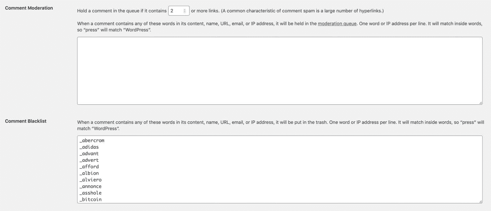

Create comment blacklist


你可以通过使用现有的垃圾邮件发送者常用的单词列表来加快速度。明智的做法是先检查列表，因为它可能包含你不想禁止的单词。例如，其中有一个词是“手袋”——如果你在经营一家饰品店，你不会想禁用这个词的！

如果你不想完全禁止包含这些单词的评论，而是希望对它们进行审核，那么你只需将该列表添加到**评论审核**字段即可。这样，任何使用这些词的评论都将被保留，而不是被发送到垃圾邮件中。或者你可以使用两者的组合，一个字段中有一些单词，另一个字段中有一些单词。


### 信息

Kinsta 客户只需点击几下鼠标，就可以轻松地在 MyKinsta 中直接阻止不需要的 IP。


### 6.减少或禁止评论中的链接

垃圾邮件评论通常包含链接，因为它们发布的目的是增加垃圾邮件发送者网站的流量。您可以完全禁止带有链接的评论，或者减少评论中允许的链接数量。

在**评论审核**部分，选择评论被审核前需要拥有的链接数量。为了允许一个链接，使用 **2** ，或者为了防止任何带有链接的评论，选择 **1** 。

或者，如果您希望允许带有多个链接的评论，请选择一个较大的数字。

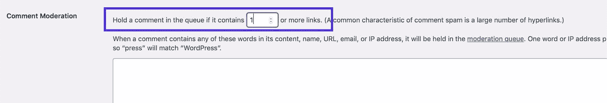

Reduce comment links


超过允许链接数量的评论在发布前将由管理员审核。

### 7.禁用单个帖子的评论

如果你已经在你的站点上发布了帖子，或者如果你只想阻止对特定帖子的评论，你需要在相关帖子的编辑界面中设置这个。

如果你发布了一个有争议的主题的帖子，或者你有一个吸引了很多垃圾邮件的帖子，这可能是有用的。

进入**文章**，找到你想要编辑的文章，点击文章名称，打开文章编辑界面。

在右侧的**文档**窗格中，向下滚动到**讨论**选项卡并将其打开。取消选择**允许评论**来禁止评论。

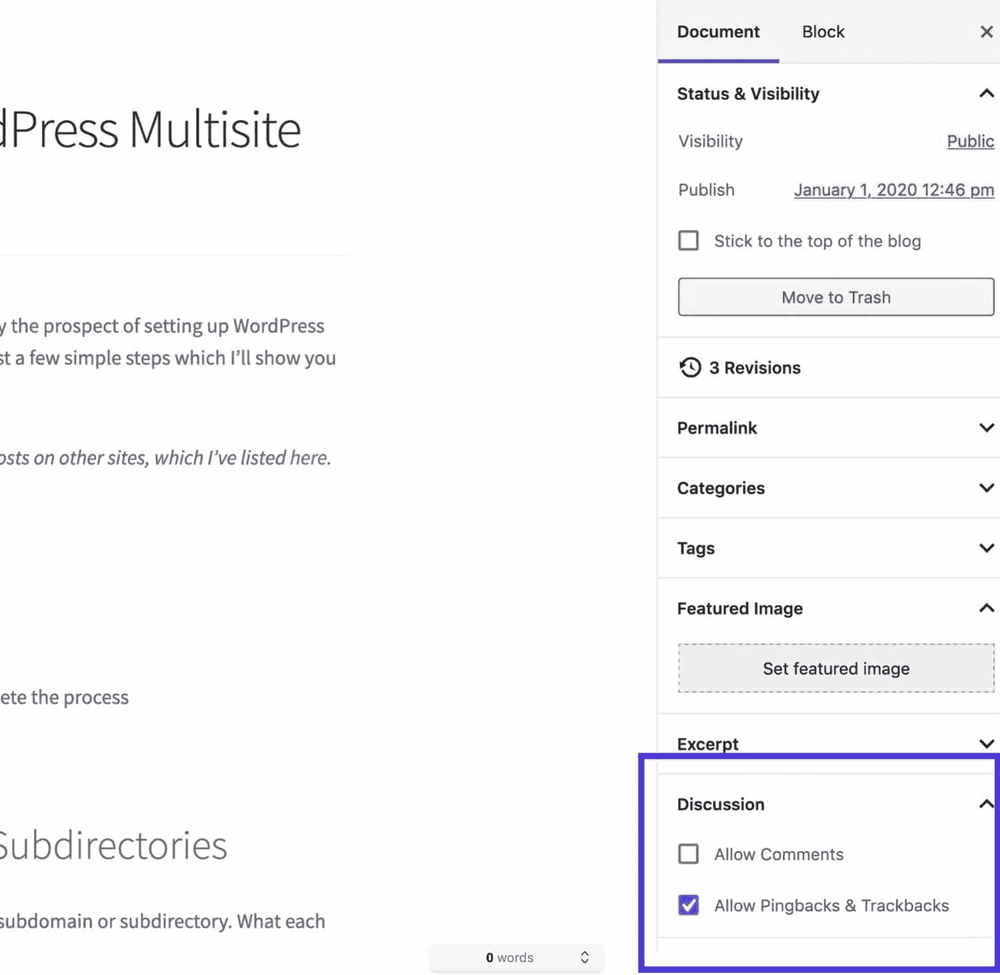

Post editing screen – Discussion


点击**更新**按钮保存对文章的修改，评论将不再显示或启用。
T3】

## 用插件阻止垃圾评论

如果你想要一个更强大的方法来阻止垃圾评论，那么你可以安装插件来管理它。这意味着您可以在您的站点中保持评论启用，但防止垃圾评论被通知您进行审核或被发布。

这里有一些你可以用来阻止垃圾评论的插件。

### 阿基斯米特

默认情况下，每个 [WordPress 安装](https://kinsta.com/knowledgebase/manually-install-wordpress/)都包含了 [Akismet](https://wordpress.org/plugins/akismet/) 插件，由 Automattic 的团队开发。它实时分析来自数百万网站和社区的数据，保护你的 WordPress 网站免受垃圾邮件的侵害。

这是最好的 WordPress 插件之一，个人使用完全免费，商业网站起价 5 美元/月。

[](https://kinsta.com/wp-content/uploads/2020/05/akismet-wordpress-plugin.png)

Akismet WordPress plugin


它目前有超过 500 万个活跃安装，获得 5 颗星中的 5 颗星。你可以从 WordPress 知识库下载 Akismet，或者在你的 [WordPress 仪表盘](https://kinsta.com/knowledgebase/wordpress-admin/)中的**插件>添加新插件**下搜索它(尽管它应该已经在你的网站上了，除非它被移除)。

## 注册订阅时事通讯


### 想知道我们是怎么让流量增长超过 1000%的吗？

加入 20，000 多名获得我们每周时事通讯和内部消息的人的行列吧！

[Subscribe Now](#newsletter)

这个插件在建立垃圾邮件规则和过滤器方面有很长的历史，这些规则和过滤器在确保你看到好的评论而不是坏的评论方面做得很好。

如果你在运营一个商业网站，你需要为 Akismet 许可证付费，但是业余爱好博客写手是免费的。它非常强大，将会从你的 WordPress 站点上清除超过 99%的垃圾评论。

### 禁用评论

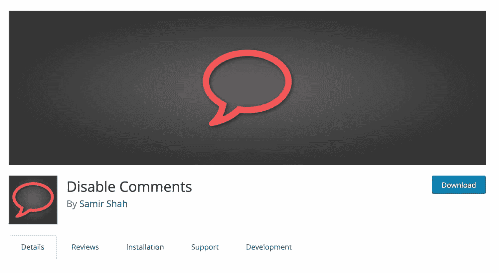

Disable Comments plugin


[禁用评论](https://wordpress.org/plugins/disable-comments/)是一个免费插件，可以让你全局禁用帖子类型的评论。如果你想禁用 WordPress 站点上已有内容的评论，并且不想手动浏览，这是很有用的。

### 如何用插件删除评论作者链接

你可以给你的 WordPress 站点添加一段[代码，简单地删除 WordPress 作者评论链接。](https://kinsta.com/knowledgebase/edit-wordpress-code/)

我们在 [Kinsta 博客](https://kinsta.com/blog)上这样做，这有助于提高评论的质量。如果访问者看到现有评论中作者的名字没有链接，那么他们可能会因为这个原因而不愿意留下评论。这意味着你很有希望只得到那些想关注你内容的访问者的评论。

为此，您可以编写自己的简单插件。

首先在 wp-content/plugins 目录中为插件创建一个文件。就叫它 kinsta-comment-author-link.php 吧。

然后在插件文件中，添加以下代码:

```
/*
Plugin Name: Remove Comment Author Links
Plugin URI: https://kinsta.com
Description: This plugin removes links to comment author websites, as a way of reducing the impact of comment spam.
Version: 1.0
Author: Rachel McCollin
Author URI: https://rachelmccollin.com
Textdomain: kinsta
License: GPLv2
*/

function kinsta_remove_comment_author_link( $return, $author, $comment_ID ) {
            return $author;
}
add_filter( 'get_comment_author_link', 'kinsta_remove_comment_author_link', 10, 3 );

function kinsta_remove_comment_author_url() {
    return false;
}
add_filter( 'get_comment_author_url', ‘kinsta_remove_comment_author_url');
```

如果你愿意，你也可以在评论中删除输入网站的字段。只需将以下代码添加到您的插件中:

```
function remove_website_field($fields) {
   unset($fields['url']);
   return $fields;
}
add_filter('comment_form_default_fields', 'remove_website_field');
```

保存插件文件，并在管理界面的**插件界面**中激活它。

这个插件可能不支持某些主题，这取决于主题中注释的编码方式。如果你的主题使用标准的评论形式，它将会工作。如果没有，试着检查你的主题的注释表单的代码，找到正在使用的过滤器钩子。

如果有疑问，请使用第三方插件。并且不要[编辑你的主题文件](https://kinsta.com/blog/how-to-customize-wordpress-theme/)，除非它是你自己开发的主题，否则下次更新时你会丢失你的更改(这是我们关于创建子主题的深度[指南)。
](https://kinsta.com/blog/wordpress-child-theme/)

### 其他垃圾邮件插件

Akismet 是目前最受欢迎的垃圾邮件插件(很大程度上是因为它预装在大多数 WordPress 安装程序中)，但这并不意味着它是唯一的一个。您可能更喜欢尝试以下选项之一:

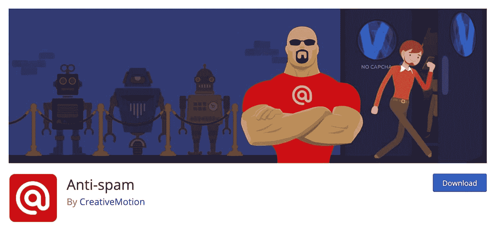

Anti-spam plugin


反垃圾邮件有免费或付费版本，高级插件提供对现有评论的垃圾邮件检查和 24/7 技术支持。

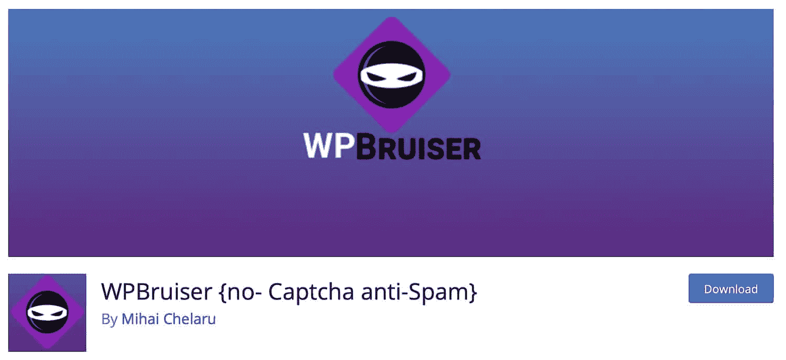

WPBruiser plugin


[WP bruiser { no-Captcha anti-Spam }](https://wordpress.org/plugins/goodbye-captcha/)使用算法来识别垃圾评论，避免使用 Captcha 图像。

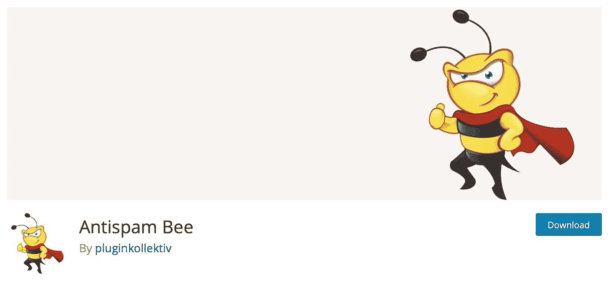

Antispam Bee plugin


[Antispam Bee](https://wordpress.org/plugins/antispam-bee/) 免费拦截垃圾评论，不会将您的数据发送到第三方网站。

需要一个顶级的、快速的、安全的主机来托管你的新 WordPress 站点吗？Kinsta 提供超快的服务器和来自 WordPress 专家的 24/7 世界级支持。[查看我们的计划](https://kinsta.com/plans/?in-article-cta)

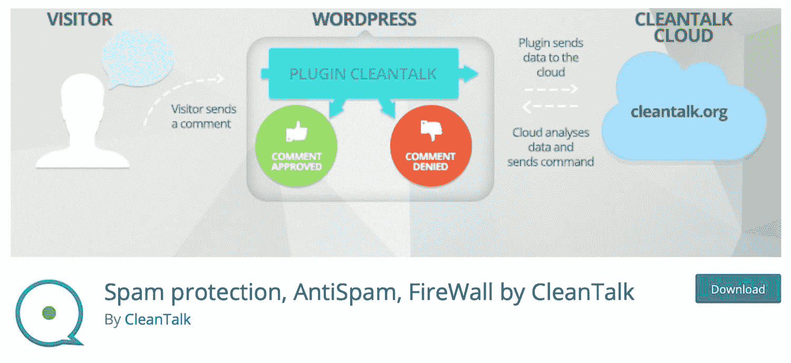

Spam protection, AntiSpam, FireWall by CleanTalk plugin


CleanTalk 的垃圾邮件防护、反垃圾邮件、防火墙不仅可以处理评论，还可以处理表单插件，包括[联系人表单 7](https://kinsta.com/blog/wordpress-contact-form-plugins/#contact-form-7) 、[重力表单](https://kinsta.com/blog/wordpress-contact-form-plugins/#gravity-forms) s 和 [Mailchimp](https://kinsta.com/blog/how-to-use-mailchimp/) 。

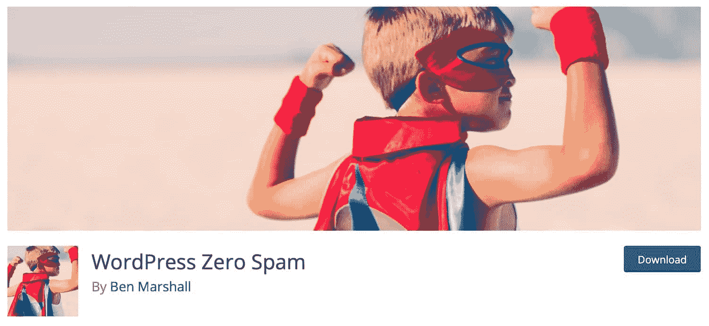

WordPress Zero Spam plugin


[WordPress Zero Spam](https://wordpress.org/plugins/zero-spam/) 是另一个避免使用验证码的插件，也支持表单插件包括[联系人表单 7](https://kinsta.com/blog/contact-form-7/) 和重力表单。

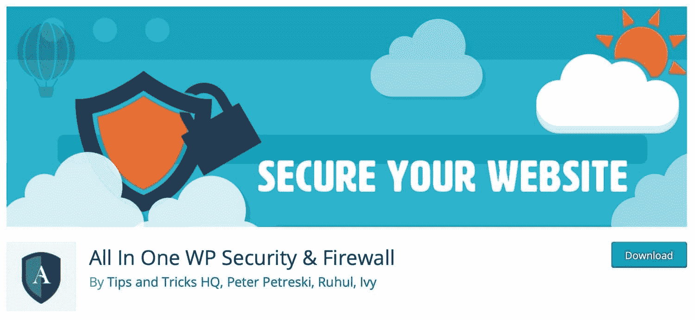

All In One WP Security & Firewall plugin


多合一 WP 安全&防火墙是一个多合一的安全插件，也可以阻止垃圾评论。

这些插件被设计成与 WordPress 默认评论表单兼容:如果你使用第三方评论系统，你将需要使用该系统自带的垃圾邮件阻止功能。

## 用验证码阻止垃圾评论

另一个流行的选择是[使用验证码](https://kinsta.com/blog/wordpress-captcha/)，这是某种形式或问题来证明访问者是人类。有很多很棒的插件可以让你把这个策略应用到你的 WordPress 网站上，而且大多数都是完全免费的。

这些可能不受用户欢迎，尤其是如果你使用各种各样的要求人们识别其中有某些对象的图像。但是现在越来越多的网站在验证码栏中添加了一个简单的“我不是机器人”复选框，这是机器人不可能填写的。

有很多很棒的插件可以让你在你的 WordPress 站点上实现这个策略，而且大多数都是完全免费的。

### BestWebSoft 的 Google Captcha (reCAPTCHA)

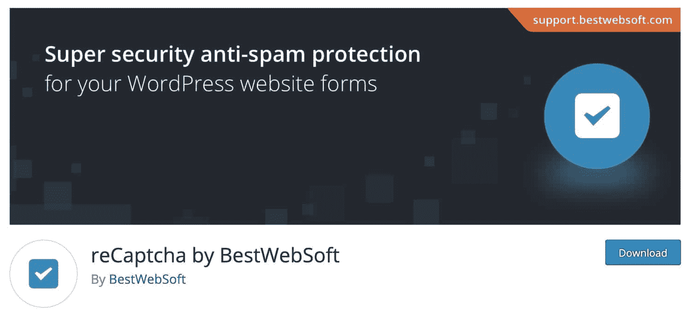

reCaptcha by BestWebSoft


我们是谷歌 CAPTCHA 的忠实粉丝，或者更确切地说，是他们所谓的 reCAPTCHA。谷歌的可能是最干净和最容易使用的，不会因为问令人困惑的问题或显示难以阅读的字母而伤害用户体验。

你肯定不希望有人离开你的网站，仅仅是因为他们对验证码感到失望。BestWebSoft 的[Google Captcha(reCAPTCHA)](https://wordpress.org/plugins/google-captcha/)插件非常适合在你的 WordPress 站点上实现这个功能。

这个插件不是让你阅读难以辨认的字母和数字，或者识别照片中的元素，而是让用户勾选一个方框，确认他们不是机器人。该框只能手动勾选。

要设置它，您需要使用 Google 的 Captcha API 来注册您的站点，并选择 reCAPTCHA v2 作为复选框，或者选择 reCAPTCHA v3 作为 Captcha，它使用 JavaScript 来检查垃圾邮件，而用户无需做任何事情。

您可以通过插件设置屏幕中的链接来访问它。

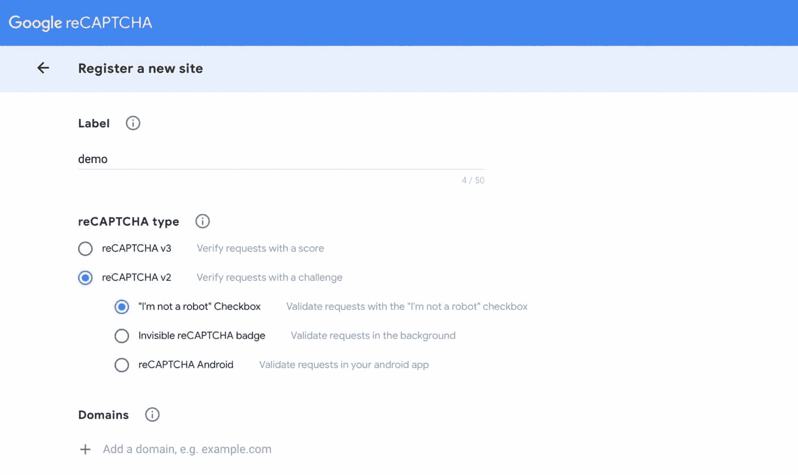

Registering your site with Google reCAPTCHA


然后你会得到一个站点密钥和一个秘密密钥，你把它们复制到你站点的插件设置界面。在 Enable ReCAPTCHA for 部分选择 **Comments Form** 并点击 Save Changes 按钮。

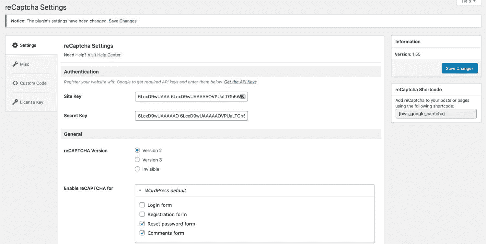

reCaptcha plugin settings


现在，当用户试图添加评论时，他们必须先勾选**我不是机器人**复选框。

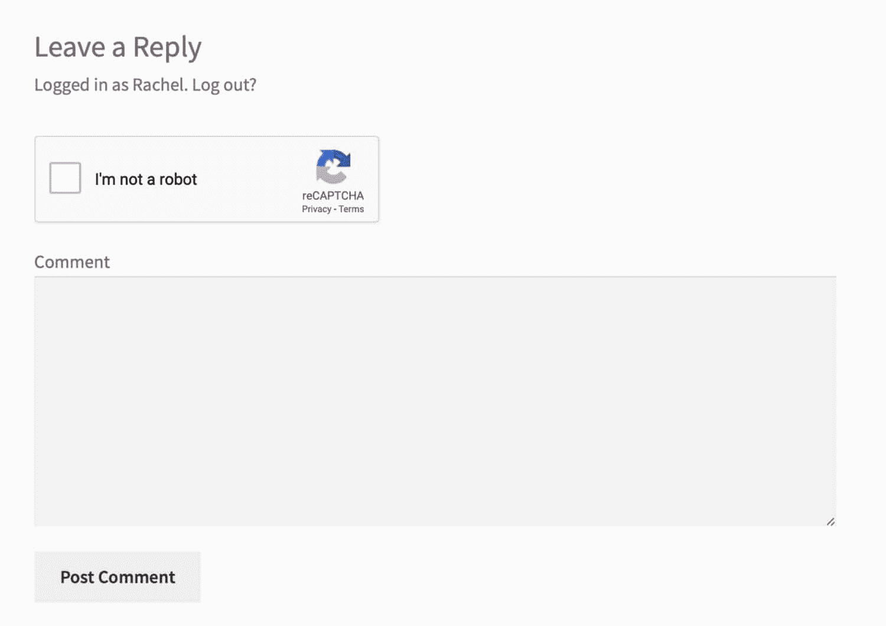

Comments form with Captcha


其他功能包括:

*   它也适用于[注册表单](https://kinsta.com/blog/wordpress-user-registration-plugins/)、[登录表单](https://kinsta.com/blog/wordpress-login-url/)，重置密码表单等。
*   隐藏白名单 IP 的验证码。
*   不同的主题。
*   [多语言](https://kinsta.com/blog/wordpress-multilingual/)和 RTL 准备好了。

### 其他 ReCaptcha 插件

有大量的 reCaptcha 插件可用，其中一些是设计用于特定的第三方插件，如表单插件。许多人还处理评论。

*   [Cerber Security，Antispam &恶意软件扫描](https://wordpress.org/plugins/wp-cerber/)使用谷歌的 ReCaptcha 来阻止垃圾评论，并防止其他类型的攻击。
*   简单的 Google reCAPTCHA 旨在让在你的网站上添加验证码变得简单快捷。
*   [高级 noCaptcha &隐形验证码(v2 & v3)](https://wordpress.org/plugins/advanced-nocaptcha-recaptcha/) 也可以让你使用 reCAPTCHA API 的 v3 添加隐形验证码。
*   [阻止垃圾邮件发送者](https://wordpress.org/plugins/stop-spammer-registrations-plugin/)旨在将 Captcha 添加到评论和其他表格中，并阻止您网站上的垃圾邮件注册。

## 使用第三方评论系统阻止垃圾评论

最后但同样重要的是，另一个阻止垃圾评论的简单方法是放弃默认的本地评论，使用第三方评论系统。

我们之前在 Kinsta 的博客上使用了 Disqus 平台，我们可以诚实地说，它过滤了 99%的垃圾邮件。我们从来不需要花时间清理垃圾评论。

然而，这并不是说 Disqus 没有一些问题。你可以阅读我们关于 Disqus [广告变化](https://kinsta.com/blog/disqus-ads/)的博文。你现在必须付费从 Disqus 界面移除广告，这可能会增加并影响[你网站的性能](https://kinsta.com/blog/third-party-performance/)和可信度。


### Disqus 条件负载

如果你想在你的博客上使用 Disqus，我们推荐使用免费的 [Disqus 条件加载](https://wordpress.org/plugins/disqus-conditional-load/)插件。这是 Joel James 开发的，作为一种[惰性加载评论](https://kinsta.com/blog/wordpress-comments/#lazy-load-comments)的方式，这样就不会损害你的 WordPress 站点的性能。

[以正常方式](https://kinsta.com/knowledgebase/how-to-install-wordpress-plugins/)安装插件，激活它，并向 Disqus 注册。这个插件比官方的 Disqus 插件更可靠，所以如果你还想用 Disqus，就用这个代替吧。

### Disqus 的替代方案

如果你和我们一样，对 Disqus 的变化不满意，你可以使用第三方评论插件。其中一些改进了内置的评论系统，另一些则用另一个替代系统取代了它。这里有一个选择。

*   [Yoast 评论技巧](https://wordpress.org/plugins/yoast-comment-hacks/)允许您自定义评论和添加设置，例如禁止低于和高于特定长度的评论，将首次评论重定向到感谢页面，以及清理评论通知电子邮件。
*   [评论——wpDiscuz](https://wordpress.org/plugins/wpdiscuz/)插件声称是具有相似特性的“最佳 Disqus 替代方案”。
*   超级社交者在你的网站上添加社交评论，这样人们就可以使用他们的[社交媒体账户](https://kinsta.com/blog/wordpress-social-media-plugins/)发表评论。
*   [Jetpack 插件包括一系列功能](https://kinsta.com/knowledgebase/wordpress-jetpack/)，旨在让你在自己的 WordPress 网站上看到 WordPress 的特色(建议阅读:【WordPress 对 WordPress.org】)，包括它自己的评论系统，该系统使用 Akismet 来阻止垃圾评论。

## 用网络应用防火墙阻止垃圾评论

添加一个[网络应用防火墙](https://kinsta.com/blog/what-is-a-firewall/) (WAF)，比如 [Sucuri 或 Cloudflare](https://kinsta.com/blog/sucuri-vs-wordfence/) ，可以帮助显著减少你的 WordPress 站点收到的垃圾邮件数量。

为什么？因为这些服务位于你的 WordPress 主机和你的网站之间，阻止并过滤掉所有不良的代理流量和僵尸工具。它们还允许你点击一个按钮就可以轻松屏蔽整个国家。

WAF 还可以帮助降低你的带宽和访问量，从而帮助你节省每月的虚拟主机费用。

[Get rid of spam comments (for good!) with this guide to the plugins and features that will keep them at bay 🤚Click to Tweet](https://twitter.com/intent/tweet?url=https%3A%2F%2Fkinsta.com%2Fblog%2Fwordpress-spam-comments%2F&via=kinsta&text=Get+rid+of+spam+comments+%28for+good%21%29+with+this+guide+to+the+plugins+and+features+that+will+keep+them+at+bay+%F0%9F%A4%9A&hashtags=plugins%2CWordPress)

## 摘要

WordPress 自带评论系统是件好事，但是有时候这个系统并不像我们需要的那样有效。

如果你想让你的网站免受垃圾评论的攻击，你需要采取额外的措施来防止它。这些可能是:

*   配置 WordPress 来阻止或审核你的评论。
*   安装第三方评论和垃圾邮件插件。
*   创建你自己的插件来阻止你网站上的垃圾邮件。

如果你使用这些方法之一来阻止垃圾评论，你将会使你的网站更加安全，提高它的可信度和性能。

* * *

让你所有的[应用程序](https://kinsta.com/application-hosting/)、[数据库](https://kinsta.com/database-hosting/)和 [WordPress 网站](https://kinsta.com/wordpress-hosting/)在线并在一个屋檐下。我们功能丰富的高性能云平台包括:

*   在 MyKinsta 仪表盘中轻松设置和管理
*   24/7 专家支持
*   最好的谷歌云平台硬件和网络，由 Kubernetes 提供最大的可扩展性
*   面向速度和安全性的企业级 Cloudflare 集成
*   全球受众覆盖全球多达 35 个数据中心和 275 多个 pop

在第一个月使用托管的[应用程序或托管](https://kinsta.com/application-hosting/)的[数据库，您可以享受 20 美元的优惠，亲自测试一下。探索我们的](https://kinsta.com/database-hosting/)[计划](https://kinsta.com/plans/)或[与销售人员交谈](https://kinsta.com/contact-us/)以找到最适合您的方式。