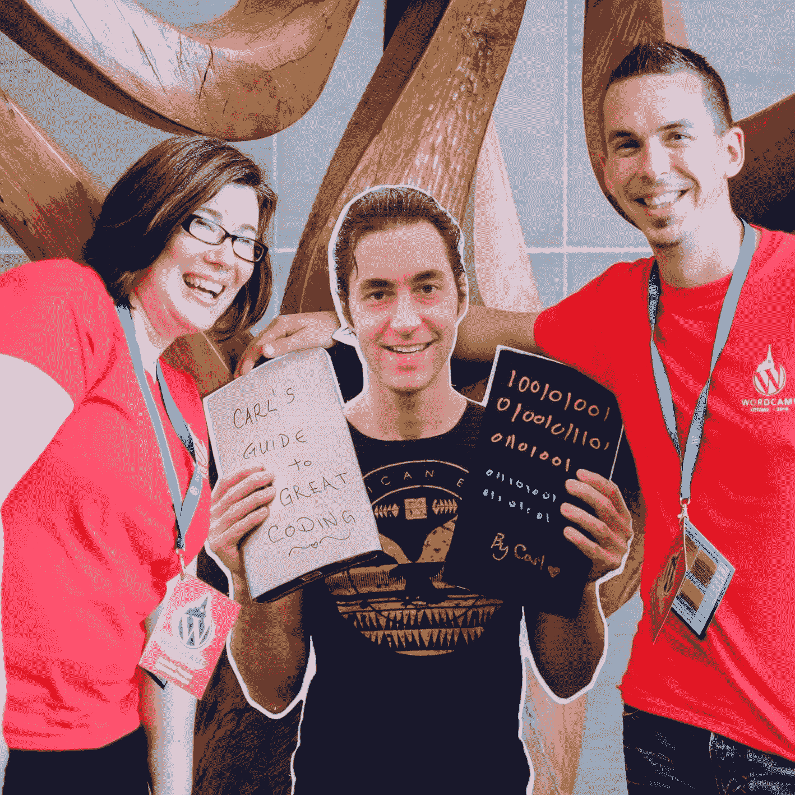
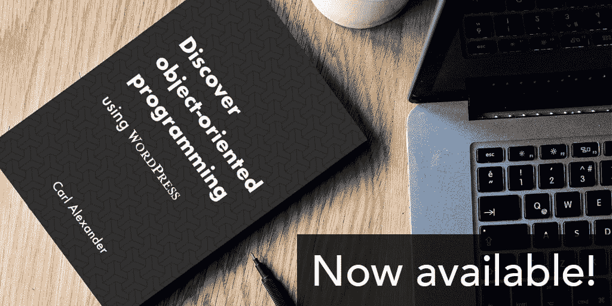

# 金斯塔·金并:卡尔·亚历山大访谈录

> 原文：<https://kinsta.com/blog/interview-with-carl-alexander/>

Carl Alexander 是一名来自加拿大蒙特利尔的 PHP 开发人员。每当他不是各种迷因的目标时，他都在帮助开发人员提高他们的技能。他在他的[网站](https://carlalexander.ca/)上分享了很多，在那里他定期发表文章。他还出版了一本[书](https://carlalexander.ca/book)，帮助 WordPress 开发者学习面向对象编程。

他经常与他更受欢迎和更有吸引力的纸板替身混淆。

你可以在推特上找到卡尔。如果你喜欢采访，请务必查看我们的[金斯塔·金并](https://kinsta.com/?post_type=post&s=kingpin)系列了解更多！

[Carl Alexander (@twigpress) is a #PHP developer from Montréal, Canada. Check out his interview in our Kinsta Kingpin series! 🎙🗣Click to Tweet](https://twitter.com/intent/tweet?url=https%3A%2F%2Fbit.ly%2F2NUkgTe&via=kinsta&text=Carl+Alexander+%28%40twigpress%29+is+a+%23PHP+developer+from+Montr%C3%A9al%2C+Canada.+Check+out+his+interview+in+our+Kinsta+Kingpin+series%21+%F0%9F%8E%99%F0%9F%97%A3&hashtags=laravel%2Csecurity)

### Q1:你的背景是什么，你是如何开始使用 WordPress 的？

我在 2009 年开始使用 WordPress(我不记得当时的确切版本了)。一家代理公司雇佣我为一家大型加拿大出版公司创建一个概念验证网站。该公司特别要求我们使用 WordPress。

这个项目非常成功，我们与那家公司建立了密切的关系。这个项目非常成功，不到一年，我手下就有了 4 名程序员。也是在那段时间，我发现了 WordPress 社区。

### Q2:读者应该知道你最近在 WordPress 做了些什么？

WordPress 社区是真正让我参与 WordPress 平台的原因。自 2010 年以来，我一直是蒙特利尔世界夏令营的组织者。多年来，我也组织了许多每月聚会。

Carl Alexander

我慢慢退休了，不再组织聚会了。也就是说，我会继续写 WordPress 的文章，并在 WordPress 上发表演讲。就在去年，我在 6 个单词营演讲。

这些天来，我主要是为项目或系统管理员提供咨询。我还有一些 WordPress 产品，比如我之前提到的那本书。

Carl Alexander’s book

### Q3:在职业生涯中，你遇到了哪些挑战？

这个问题很难回答！事实是，从 2012 年开始，我就一直试图回答这个问题。简而言之，我正试图创业，让我从事自己热爱的项目。

## 注册订阅时事通讯

### 想知道我们是怎么让流量增长超过 1000%的吗？

加入 20，000 多名获得我们每周时事通讯和内部消息的人的行列吧！

[Subscribe Now](#newsletter)

实现这一目标有许多障碍。事实上，我有机会在去年的新闻经济学会上谈论它。这次谈话没有被记录下来，但是我[为它写了一篇配套文章](https://carlalexander.ca/following-your-passion/)。

### 在 WordPress 的世界里，有没有什么让你感到惊讶的事情？

社区。这就是为什么我一直贡献这么多时间。真的没有其他技术社区像它一样热情和多样化。

### Q5:你认为 WordPress 世界的未来会是怎样的？

老实说，我不确定。我希望能继续在单词营做演讲。(今年我已经申请了几个了！)专业上，我和 WordPress 的牵连比较少，就像我前面提到的。

也就是说，我仍然想继续从事 WordPress 项目。我有一个自己维护的[小型安全插件](https://wordpress.org/plugins/passwords-evolved/)。我的下一个产品也将用于 WordPress。

### 你在 WordPress 主机中寻找什么？

因为我是一名高级开发人员，也是一名系统管理员，所以我想从我的 WordPress 主机中寻找一些特定的东西。大多数高端主机公司(如 Kinsta)都有一流的基础设施。总是有价格的问题，但是好的主持人是无价的。(我甚至[写过这件事](https://carlalexander.ca/give-wordpress-an-apple-experience/)！)

因此，考虑到这一点，我通常对 WordPress 主机的高级特性更感兴趣。我用[持续集成](https://en.wikipedia.org/wiki/Continuous_integration)和[持续交付](https://en.wikipedia.org/wiki/Continuous_delivery)做了很多工作。我需要一个支持这种工作流的 WordPress 主机。

### 问题 7:当你离开笔记本电脑时，你喜欢做什么？

我喜欢旅行。我经常不在城里。当我旅行时，我喜欢连续几个小时到处走走。我也花很多时间去见人。因为这个原因，我经常住在招待所。

当我在蒙特利尔的家里时，就是电子游戏。看 [twitch.tv](https://twitch.tv/) 的时间太多了！在过去的 15 年里，我也一直在断断续续地玩魔兽世界。

我也喜欢举重。我一周 5 天，每天训练 2 小时。我甚至在旅行的时候也训练！

### 问题 8:接下来我们应该采访谁&为什么？

毫无疑问，你应该和拉克尔·兰德菲尔德谈谈。她是凤凰城世界夏令营的组织者之一。她参与 WordPress 已经很多年了，她对这个项目的热情和承诺是有感染力的。

* * *

让你所有的[应用程序](https://kinsta.com/application-hosting/)、[数据库](https://kinsta.com/database-hosting/)和 [WordPress 网站](https://kinsta.com/wordpress-hosting/)在线并在一个屋檐下。我们功能丰富的高性能云平台包括:

*   在 MyKinsta 仪表盘中轻松设置和管理
*   24/7 专家支持
*   最好的谷歌云平台硬件和网络，由 Kubernetes 提供最大的可扩展性
*   面向速度和安全性的企业级 Cloudflare 集成
*   全球受众覆盖全球多达 35 个数据中心和 275 多个 pop

在第一个月使用托管的[应用程序或托管](https://kinsta.com/application-hosting/)的[数据库，您可以享受 20 美元的优惠，亲自测试一下。探索我们的](https://kinsta.com/database-hosting/)[计划](https://kinsta.com/plans/)或[与销售人员交谈](https://kinsta.com/contact-us/)以找到最适合您的方式。