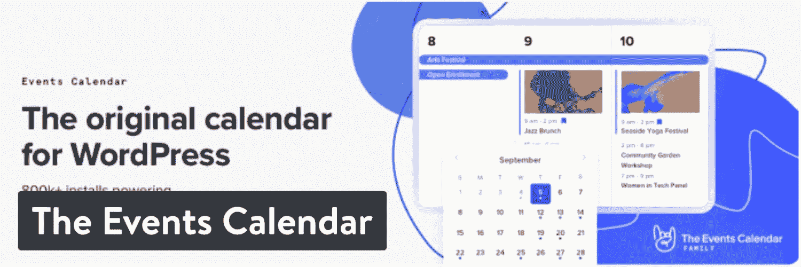
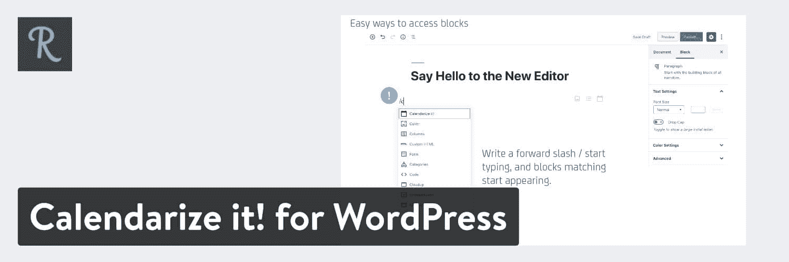
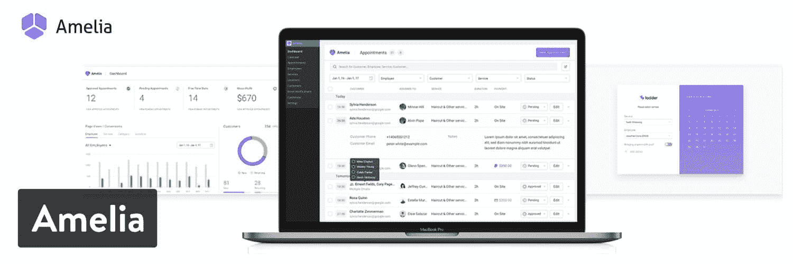
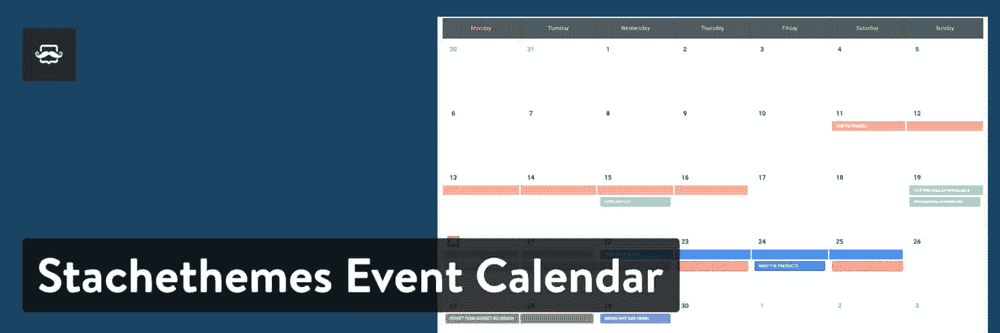

# 14 个最佳 WordPress 活动插件，用于更好的活动管理(日历、票务、RSVPs)

> 原文：<https://kinsta.com/blog/wordpress-events-plugin/>

如果你曾经试图安装一个日历插件，你就会知道它与一个功能齐全的事件插件或任何事件管理工具并不完全相同。日历[显示事件](https://kinsta.com/blog/wordpress-events/)的日期，而 WordPress 事件插件提供诸如票务、RSVPs、客人管理、自动电子邮件通知、预订表格等功能。

这就是为什么考虑你打算用你的 [WordPress 日历](https://kinsta.com/blog/wordpress-calendar-plugin/)做什么是如此重要。

需要卖活动门票吗？您想要显示图像、[地图](https://kinsta.com/blog/wordpress-map-plugin/)、扬声器和支付方式等详细信息吗？设置不定期的重复事件怎么样，比如每三个月开一次会？

为了实现一些更高级的日历功能，需要一个 WordPress 事件插件。最棒的是，你有很多选择，最好的是负担得起的，强大的，易于理解的。

想知道应该挑哪个？查看我们的最佳活动插件精选列表！

[Mark your calendars...because this guide will give you a whole new way to optimize and plan your events 📆Click to Tweet](https://twitter.com/intent/tweet?url=https%3A%2F%2Fkinsta.com%2Fblog%2Fwordpress-events-plugin%2F&via=kinsta&text=Mark+your+calendars...because+this+guide+will+give+you+a+whole+new+way+to+optimize+and+plan+your+events+%F0%9F%93%86&hashtags=eventplanning%2CWordPress)

## 2022 年最好的 WordPress 事件插件选项

### 1.活动管理器

[事件管理器](https://wordpress.org/plugins/events-manager/)插件提供了一个优秀的免费版本，但是你可以选择升级到[事件管理器专业版](https://eventsmanagerpro.com/gopro/)。普通用户不会需要 Pro 版本，但它确实有一些很棒的功能，价格仅为 75 美元。

> Kinsta 把我宠坏了，所以我现在要求每个供应商都提供这样的服务。我们还试图通过我们的 SaaS 工具支持达到这一水平。
> 
> <footer class="wp-block-kinsta-client-quote__footer">
> 
> 
> 
> <cite class="wp-block-kinsta-client-quote__cite">Suganthan Mohanadasan from @Suganthanmn</cite></footer>

[View plans](https://kinsta.com/plans/)

例如，升级版为你提供高级支持、定制支付网关、API、[垃圾邮件防护](https://kinsta.com/blog/wordpress-spam-comments/)、优惠券、折扣、[可定制预订表格](https://kinsta.com/blog/wordpress-booking-plugins/)，以及 PayPal 支持。

因此，注册活动管理器插件是可能的，但你必须支付额外的费用，才能开始用贝宝或 Authorize.net 这样的东西收款。

Events Manager WordPress plugin

后端界面对于普通用户来说足够简单，当显示在前端时，你的活动日历可以用来卖票，显示一个简单的日历，或者显示活动细节。我喜欢这个插件集成了你的 iCal feed 和谷歌日历。您还可以利用一些小部件来显示位置、完整的日历或单个事件。

至于在日历上显示你的活动，并且尽可能的详细，活动管理器插件给你提供了你需要的大部分功能，而不需要支付任何费用。例如，[谷歌地图可以嵌入](https://kinsta.com/blog/wordpress-google-maps/)到活动页面中。还有一个创建自定义事件属性的工具。这意味着几乎任何类型的描述字段都是可能的，例如，如果您想为活动的着装代码创建一个区域。

#### 复习

5 颗星中的 4.3 颗(WordPress.org)

#### 活动安装

100,000+

#### PHP 版本

5.3 或更高

#### 使活动管理器成为最佳选择的功能:

*   活动管理器插件免费提供完整的活动创建和共享中心。你升级到付费版本的主要原因是为了支付支持。
*   该插件允许重复和多天的活动注册，以及批准和拒绝的预订管理。
*   你可以将 BuddyPress 连接到插件上，在你的社交网络中分享事件。
*   单日活动注册非常简单，因为它包括开始和结束时间以及基本活动信息。
*   有一个功能允许用户和客人提交他们自己的活动，这对于公共活动网站和由多人运营的较小组织来说非常好。
*   该插件相当重视位置，所以你可以添加谷歌地图，并设置一个区域来查看基于位置的活动。

### 2.WP 事件管理器

WP 事件管理器是一个更简单的轻量级 WordPress 事件管理插件。我看到它为那些想让他们的网站快速运行的人工作，而不是占用太多的空间或者用太多的功能使后端混乱。

这个插件可能被认为是事件管理领域的新生事物，但它是一个广受欢迎的插件，拥有很好的评论，甚至很好的客户支持。

正如这个列表中的许多事件插件一样，WP 事件管理器提供了一个免费的核心插件，以及购买附加组件来加速你的操作的选项。虽然界面时尚简单，但免费插件的功能列表相当令人印象深刻。

例如，从多语言翻译到前端表单，再到可搜索事件列表的小部件和短代码，你都可以收到。

WP Event Manager WordPress plugin

我还注意到 WP 事件管理器开发者已经在速度和用户体验上下了不少功夫——漂亮的[缓存特性](https://kinsta.com/blog/wordpress-caching-plugins/)，响应元素，AJAX 驱动的事件列表等等。

至于[高级附加软件](https://www.wp-eventmanager.com/plugins/)，有一长串，但这里有一些亮点:

*   谷歌地图。
*   WooCommerce 出售门票。
*   注册。
*   事件警报。
*   一个可嵌入的事件小部件。
*   联系组织者。
*   电子邮件。
*   [滑块](https://kinsta.com/blog/wordpress-slider/)。
*   [谷歌分析](https://kinsta.com/blog/how-to-use-google-analytics/)。
*   事件标签。

#### 复习

5 颗星中的 4.7 颗(WordPress.org)

#### 活动安装

8,000+

#### PHP 版本

5.4 或更高

#### 使 WP 事件管理器成为最佳选择的特性:

*   WP 事件管理器插件具有轻量级界面和漂亮的用户体验。它有内置的缓存，一个奇妙的搜索模块和一个完全响应的设计。
*   开发人员对所有客户都非常友好，甚至是那些使用免费插件的客户。
*   你不必为一个高级插件支付月租费或类似的费用。它是这样配置的，你可以从基本插件开始，然后如果需要，你可以支付一些附加组件。
*   有些附加组件是免费的，其他的仍然是负担得起的。其中许多售价 39 美元，但我也注意到一些价格较低的。
*   整个日历区域都是“area 化的”，所以这是前端最流畅的浏览体验之一。

### 3.活动组织者

[事件组织者](https://wordpress.org/plugins/event-organiser/)为 WordPress 环境提供了一个合适的事件管理解决方案，因为它结合了默认的[自定义帖子类型](https://kinsta.com/blog/wordpress-custom-post-types/)。本质上，你安装这个插件，然后选择正确的自定义文章类型来维护 WordPress 文章格式，但是获得对一些额外事件模块的控制。

因此，它是一个直观的用户界面，具有所需的基本功能，并对一次性事件和重复事件提供了很好的支持。你会发现几个额外的附加组件可以和这个事件管理插件一起购买。其中一个名为[Event organizer Pro](https://wp-event-organiser.com/pro-features/?aid=7)，它提供了一个预订表单定制器、一个完整的管理区域、可定制的电子邮件和各种支付网关。

你还会看到一些扩展你的免费或高级活动组织者插件功能的附加组件。其中一些包括:

*   前端提交。
*   折扣代码。
*   [条纹网关](https://kinsta.com/blog/stripe-for-wordpress/)。
*   iCal 同步。
*   免费插件:海报板和 CSV 导出。

Event Organiser WordPress plugin

每个插件的价格各不相同，但似乎它们越先进、功能越丰富，价格就越高。其中一些标价 15 美元左右，而另一些标价 50 美元。我喜欢这个插件的前端，因为它提供了一个彩色化和交互性的基本界面。

您还可以选择多种格式，如列表或日历配置。在[短码](https://kinsta.com/blog/wordpress-shortcodes/)和[小工具](https://kinsta.com/blog/wordpress-widgets/)的帮助下，在你的网站上显示日历和事件。所以，一般的 WordPress 用户应该不会有任何问题。

#### 复习

5 颗星中的 4.7 颗(WordPress.org)

#### 活动安装

40,000+

#### PHP 版本

未提供。

#### 活动组织者的绝佳选择:

*   基本插件是免费的，你只需支付 50 美元购买高级版本。你可能最终要为额外的插件支付更多的费用，但是价格看起来很合理。
*   小部件和短代码非常通用，有小部件或事件列表、日历和议程。短代码显示为事件列表或完整日历。
*   [本地化](https://kinsta.com/blog/localization-strategy/)是活动组织者插件的一大优势。几个贡献者已经提供了几十种语言。
*   为开发者提供了大量的支持。例如，可以使用插件操作和过滤器，以及 API 和文档。
*   该插件允许复杂的重复事件，所以如果你有一个事件持续三天，停止一天，然后继续两天以上，这是完全可能的。更常见的是每两个月发生一次。
*   您可以创建和维护所有活动的场地和位置。这包括对谷歌地图的支持，因此用户可以访问你的日历，并快速识别他们所在地区的活动。

### 4.一体化活动日历

如果你正在寻找一个可以帮助你管理活动的 WordPress 活动插件，那么[一体化活动日历](https://wordpress.org/plugins/all-in-one-event-calendar/)插件可能会帮到你。它有相当多的开箱即用的功能，如重复事件、过滤和嵌入式谷歌地图，所有这些都是免费的。

如果您需要更多，您可以选择加入他们的托管软件解决方案，起价为每月 14.99 美元，将为您提供:

*   扩展视图。
*   前端提交表单。
*   超级部件。
*   场馆。
*   Twitter 整合。
*   还有更多。

All-in-One Event Calendar WordPress plugin

免费版仍然有其优势，可以从脸书导入活动，社交分享，场地自动保存和重复活动。该插件在共享/导入领域脱颖而出，因为它提供了从谷歌日历、苹果 iCal 和 MS Outlook 轻松共享和导入数据的工具。

#### 复习

5 颗星中的 4.3 颗(WordPress.org)

#### 活动安装

100,000+

#### PHP 版本

5.4 或更高

#### 使一体化活动日历成为最佳选择的功能:

*   该插件提供了一个免费计划，以及每月保费包，给你一个比这个列表中的大多数插件更广泛的支付选择。
*   [定期支付](https://kinsta.com/blog/recurring-revenue-model/)功能具有复杂的时间模式，所以如果你想每三个月举办一次活动，这是一个选择。
*   一体式活动日历支持多种外部日历，包括用于 Google Calendar 和 Apple iCal 等平台的导入、导出和共享工具。
*   前端显示看起来不错，充满了信息。对于海报板格式来说尤其如此。

### 5.活动日历

活动日历插件由摩登部落的开发者制作，它包含了在你的网站上制作高度专业的日历的功能，旁边还有一个管理区。

事件日历插件的全部目的是在几分钟内启动并运行。它有一个快速事件创建工具，适用于那些希望在网站上列出事件，但没有时间的组织。您还可以保存地点和组织者以备后用，并呈现不同的日历视图以获得时尚的用户界面。

核心插件对于简单的日历来说工作顺利。它有一个漂亮的高级版本，每年 89 美元。这并不是这个活动插件列表中最便宜的选项，但是你可以获得一些很棒的功能，比如重复活动、短代码和自定义活动属性。

您可以使用核心插件免费收集 RSVPs，并使用其免费的[活动门票插件](https://wordpress.org/plugins/event-tickets/)获得付款。如果你需要更高级的[电子商务功能](https://kinsta.com/blog/wordpress-ecommerce-plugins/)，你还可以获得活动门票 Plus 作为附加服务。

The Events Calendar WordPress plugin

在前端，您可以从各种各样的布局中进行选择，从列表到常规日历。日历简洁而现代，支持地图和其他重要的活动信息。我喜欢 Events Calendar 插件的一个主要原因是因为它与 Eventbrite 集成在一起。

#### 复习

5 颗星中的 4.4 颗(WordPress.org)

#### 活动安装

800,000+

#### PHP 版本

5.6 或更高

#### 使活动日历成为最佳选择的功能:

*   主要的活动管理插件是免费的。
*   您可以将日历连接到 Eventbrite，然后导入到 Eventbrite 中，或者将 Eventbrite 页面中的活动拖到您网站的活动日历中。
*   一些附加组件和插件比一般的事件管理插件有趣得多。例如，Modern Tribe 有一个名为 GigPress 的插件，音乐家和经理可以在其中管理音乐会和音乐会。

### 6.我的日历

有了[我的日历](https://wordpress.org/plugins/my-calendar/)插件，你的活动可以通过 [WordPress multisite](https://kinsta.com/wordpress-multisite-hosting/) 显示在多个网站上，或者显示在单个网站上你想要的任意多个页面上。这是一个标准的日历插件，背后没有太多的事件管理。

然而，你可以选择升级一些高级扩展和免费插件。例如，[我的门票插件](https://wordpress.org/plugins/my-tickets/)是免费的，它与我的日历插件集成在一起。这种组合将您的日历转变为售票操作，让人们购买门票、回复、打印门票或在实际地点取票。

My Calendar WordPress plugin

我的日历专业插件每年售价 49 美元，真正将核心插件变成了一个活动管理门户。让访问者提交自己的活动，通过 PayPal 和 Authorize.net 接受付款，并从多个来源导入活动。

常规的我的日历插件有一个完整的日历网格和列表视图，以及小日历和小部件。当您经常使用场地时，位置经理会在那里，当日期被预订或安排时，电子邮件通知系统会向您发送消息。

总而言之,“我的日历”插件对于一个免费的选项来说是相当强大的，但在你升级到每年 49 美元之前，我不会称它为完整的。

#### 复习

5 颗星中的 4.4 颗(WordPress.org)

#### 活动安装

49,000+

#### PHP 版本

5.3 或更高

#### 使我的日历成为最佳选择的功能:

*   这个插件给你更多的是一个简单的日历体验，删除了你可能在竞争对手的插件中发现的许多不必要的功能。
*   您可以从 Google 日历和 iCal 等地方导入事件。
*   当你想开始接受 RSVPs 和付款，以及前端提交时，每年 49 美元是相当实惠的。
*   这个插件提供了丰富的权限，这对于那些希望与某些人共享日历的某些部分以及与其他用户共享日历的其他部分的组织来说非常有用。
*   WordPress 多站点兼容性。

### 7.EventOn

EventOn 是一个高级的 WordPress 事件管理插件。如果你愿意扣动扳机，而不是花时间玩一个免费的插件，这个插件是一个很好的选择。另外，这篇文章发表时的价格是 19 美元。

## 注册订阅时事通讯

### 想知道我们是怎么让流量增长超过 1000%的吗？

加入 20，000 多名获得我们每周时事通讯和内部消息的人的行列吧！

[Subscribe Now](#newsletter)

最基本的，EventOn 插件是市场上最具视觉吸引力的事件日历之一。丰富多彩、现代的列表和日历布局击败了这个列表中几乎所有的插件。时间、地点和活动取消等细节都显示在主日历页面上。

还有一个漂亮的磁贴布局，看起来有点像作品集，只是列出了你所有的活动。

EventOn WordPress plugin

EventOn 也是一个不错的活动管理程序，使用活动组织工具、位置管理、一个优秀的用户搜索栏(T1)和几个社交分享按钮(T3)。它在事件管理方面不是很强大，但是它绝对是一个很好的插件，可以让你的事件出现在你的网站上。

#### 复习

5 颗星中的 4.4 颗(CodeCanyon)

#### 活动安装

49,000+

#### PHP 版本

未披露

#### 使 EventOn 成为最佳选择的特性:

*   对于优质活动日历和质量支持，您只需每年支付 19 美元。
*   活动日历的视觉布局简直令人惊叹。无论是谁设计了这个东西，都值得表扬，因为它击败了我用过的大多数日历的设计。
*   虽然活动管理很一般，但是展示你的活动是通过打包大量信息来完成的，而且看起来不会太杂乱。从地图到图片，从购买按钮到社交媒体按钮，你都可以适应。
*   自定义元字段非常适合添加多达 10 个自定义事件数据字段。

### 8.把它日历化！对于 WordPress

CodeCanyon 上出售的另一个高级插件叫做 [Calendarize it！对于 WordPress。](https://codecanyon.net/item/calendarize-it-for-wordpress/2568439)再一次，这更侧重于制作一个伟大的日历，但 30 美元，和其他加载项，日历！作为游戏中最好的 WordPress 事件插件之一而屹立不倒。

首先，许多附加组件是完全免费的，所以你不必担心在你已经下载了原始插件后再花一些额外的钱。一些附加组件包括一个事件倒计时模块、导入工具和一个即将到来的事件的手风琴。

然而，有几个附加组件是你必须付费的，尽管它们花费不多。我唯一的问题是，[支付选项](https://kinsta.com/blog/stripe-vs-paypal/)附加组件是一种高级附加组件。所以，如果你不支付额外的现金，你就不会有太多的功能来接受支付。

Calendarize it! for WordPress plugin

也就是说，所有的付费和免费插件都非常壮观，有社交自动发布、RSVP 工具、[评级和评论](https://kinsta.com/blog/best-wordpress-review-plugins/)、Eventbrite 门票，甚至还有降临节日历。

#### 复习

五星中的 4.31 分(CodeCanyon)

#### 活动安装

11,000+

#### PHP 版本

未披露

#### 使日历化的功能！对于 WordPress 来说是一个很好的选择:

*   你以 30 美元的低价收到了一个视觉上吸引人的日历插件。
*   该插件有几个免费的附加组件，你可以在购买核心插件后立即下载。
*   虽然一些必要的附加组件需要额外付费，但我认为这是你能找到的更丰富、更独特的附加组件集合之一。从社区活动到广告选择，从 WooCommerce 到基督降临节日历，独特不是问题。

### 9.现代事件日历

[现代事件日历](https://webnus.net/modern-events-calendar/)插件顾名思义，它是一个高质量、专业、现代的标准事件管理布局。您可以从各种各样的设计中进行选择，使其成为品牌和适合您的网站的优秀解决方案。

Modern Events Calendar WordPress plugin

现代事件日历提供了一个事件重复系统，这也很好，因为那些重复发生的事件总是更容易处理，因为你不必每次都去想它们。

更重要的是，这个开发者承诺如果你现在使用不同的 WordPress 事件管理插件，你可以转移你所有的事件。例如，如果你在 EventOn 中有一整年的事件，并且决定它不适合你，这个插件会为你转移所有这些事件。

这个事件插件有多种皮肤来制作你自己的日历，还有一些很棒的功能，比如谷歌地图、特色图片和自定义皮肤颜色，对很多人来说是个不错的选择。

厌倦了你的 WordPress 站点缓慢的主机？我们提供超快的服务器和来自 WordPress 专家的 24/7 世界级支持。[查看我们的计划](https://kinsta.com/plans/?in-article-cta)

#### 复习

5 颗星中的 4.3 颗(WordPress.org)

#### 活动安装

50,000+

#### PHP 版本

5.6 或更高

#### 使现代事件日历成为最佳选择的功能:

*   从以前使用的日历或活动管理插件中传输您的所有活动。
*   有一些可靠的免费集成，比如 PayPal 和 Google Calendar。
*   这个插件有一个预订系统，在那里你可以[按照你想要的方式构建你的表单](https://kinsta.com/blog/wordpress-forms/)。
*   活动创建非常灵活，有活动倒计时模块、永不停止的活动选项、重复活动等等。
*   现代事件日历与 WooCommerce 和 T2 视觉作曲家兼容。

### 10.阿米莉亚

Amelia 有一个简约易用的用户界面。这个插件允许你管理约会和事件，并接受在线支付。

Amelia 有超过 4000 名用户使用，如果您正在寻找一种不需要附加组件和额外成本的一体化预订解决方案，那么值得一试。

Amelia WordPress Appointment and Event Booking WordPress Plugin

#### 复习

5 颗星中的 4.4 颗(WordPress.org)

#### 活动安装

10,000+

#### PHP 版本

5.6 或更高

#### 使 Amelia 成为最佳选择的特性:

*   简单的活动管理和短码将活动日历放在你的网站上，有免费和付费两种版本。
*   该插件的高级版本允许重复和多天的事件，以及带有批准和拒绝的预订管理。
*   电子邮件和短信通知可在免费版本。完整版提供更多通知选项和格式，如提醒、跟进、生日祝福等等。
*   付费版本中提供活动标签。
*   阿米莉亚完全有反应。

### 11.活动日历 WD

[活动日历 WD](https://wordpress.org/plugins/event-calendar-wd/) 有免费版和[高级版](https://10web.io/plugins/wordpress-event-calendar/)。对于那些对通过 WordPress 网站分享活动信息和收集回复感兴趣的人来说，这是一个不错的选择。这个插件允许你创建一个日历，你可以通过 WordPress 来管理它，并且有出售门票和发送邀请的选项。

这是一个高度灵活的事件插件，因为它提供了对您的日历外观以及您的客户如何与之交互的完全控制。不仅如此，活动日历 WD 支持团队还会定期为您提供服务，他们对产品非常了解。

Event Calendar WD WordPress plugin

#### 复习

5 颗星中的 4.6 颗(WordPress.org)

#### 活动安装

20,000+

#### PHP 版本

5.2 或更高

#### 使 Event Calendar WD 成为最佳选择的功能:

*   活动日历 WD 插件提供了一个漂亮的、现代的、反应灵敏的日历，用于与您的客户互动。
*   您可以非常灵活地发布和共享日历，支持一次性事件和重复事件，并支持帖子和页面上的事件。
*   日历有几个部分用于向事件添加更多信息。例如，您可以整合图像、主机、视频和其他页面链接等元素。
*   包括一个日历部件，以扩展您可以插入日历的位置数量。
*   该插件与谷歌地图整合在一起，这样你就可以引导用户去观看体育赛事。
*   启用标记是为了更好地组织您的活动。
*   为用户提供了以不同方式查看日历的工具。例如，您可以从每月视图或事件列表等选项中进行选择。
*   为事件票、前端管理和自定义字段等提供了几个扩展。

### 12.Stachethemes 活动日历

Stachethemes 活动日历插件拥有一长串令人印象深刻的功能，可以在你的网站上发布活动日历。首先，这个插件有一个时尚的现代日历，有很多种颜色可供选择。默认情况下，每个月和每一天都以列表格式组织，但是您可以调整用户查看日历的方式。

该插件带有一个[拖放构建器](https://kinsta.com/blog/wordpress-page-builders/)来消除弄乱任何代码的需要。您还可以加入一些活动细节，如图片、地点和时间。方格视图是我们最喜欢的视图之一，因为它看起来有点像 T2 的现代作品集。

同样值得高兴的是，插件[完全响应](https://kinsta.com/blog/web-design-best-practices/#mobile-responsiveness)您和您的客户在安排日程时使用智能手机和平板电脑。除了 CodeCanyon 上的合理价格和一系列支付选项，这个活动管理插件绝对不会出错。

Stachethemes Event Calendar WordPress plugin

#### 复习

5 分中的 4.51 分(CodeCanyon)

#### 活动安装

4,000+

#### PHP 版本

未披露

#### 使 Stachethemes 活动日历成为最佳选择的功能:

*   该插件的一次性成本为 49 美元。
*   你可以从不同的日历视图中进行选择，这取决于你是喜欢全月视图、列表视图还是日视图。
*   单一活动页面非常适合用作特殊活动的登录页面。
*   即将推出的页面允许您在启动实际的日历页面之前让人们对某个事件感到兴奋。
*   该插件提供了一个拖放生成器，因此几乎每个人都可以制作日历。
*   事件过滤器改进了人们找到您的事件的方式。
*   更高级的开发人员可以使用 API 进行集成和编码。
*   该插件允许你发送自动提醒，以便客户知道什么时候来参加活动。
*   评论区是澄清事件相关问题的好地方。
*   您可以突出活动日程、来宾、预测和地点等信息，并在日历中添加附件。
*   该插件为定期发生的事件提供了一个重复系统。
*   包括几个工具用于售票和收款。其中一个工具包括使用二维码扫描活动门票。

### 13.滴答声

Tickera 是另一个免费的 WordPress 事件管理插件，支持付款收集和日历。如果你想升级更多功能，还有一个[高级版本](https://tickera.com/)，需要在 49 美元起的年度计划基础上一次性支付 70 美元。

Tickera 的主要目的是出售门票并在购买者中分发。你可以把这个插件作为一个常规的活动日历来使用，但是大部分的功能都围绕着销售。例如，该插件为你可以在手机上调出的条形码阅读器和二维码提供支持。

甚至有一个 Chrome 应用程序可以加快签到过程。大量的[支付网关](https://kinsta.com/blog/woocommerce-payment-gateways/)可供你选择，你甚至可以将该系统链接到你的[网上商店](https://kinsta.com/blog/woocommerce-themes/)。

Tickera WordPress plugin

票证生成器是一个强大的工具，您可以根据自己的品牌定制模板。关于插件的一切都是白色标签，如果你运行更多的活动市场，你甚至可以从门票销售中提成。随着多种机票类型，折扣代码和售票插件，Tickera 插件看起来像是在线销售的赢家。

#### 复习

5 分制中的 4.7 分(WordPress.org)

#### 活动安装

8,000+

#### PHP 版本

5.6 或更高

#### 使 Tickera 成为最佳选择的特性:

*   Tickera 提供免费和付费版本，让你有机会测试产品，或者发现你需要的只是免费插件。
*   有几个模块可用于构建您的日历，包括门票销售选项、订单历史记录和添加到购物车按钮。
*   折扣代码是活动管理 WordPress 插件的标准配置。
*   如果你有兴趣赚点外快或者支付支付网关的费用，你可以增加额外的门票费用。
*   有一个功能可以让你为所有的销售收税。
*   该插件提供了一些运行活动销售市场的选项，类似于 TicketMaster。例如，您可以让供应商选择制作他们自己的销售表格和票据。
*   通过拖放设计元素来使用票证生成器。
*   支持数十种支付网关，包括 PayPal、Stripe 和 PayGate。
*   提醒和电子门票是为了让人们更快地到达活动现场并办理登记手续。

### 14.风险活动经理

[Venture Event Manager](https://ventureeventmanager.com/) 拥有 premium 和[免费插件](https://wordpress.org/plugins/venture-event-manager/)，为您安排活动和向日历中添加重复活动提供了一个用户友好的解决方案。代理和开发者更有可能使用像这样的事件管理插件，因为它的灵活性和代码定制选项。

总的来说，Venture Event Manager 非常棒，因为它反应灵敏，有拖放构建器，并且您的所有日历都包含多个客户视图。事件列表很方便，同时您还可以显示事件地点、类别和过滤器。

我们尤其喜欢对事件窗口小部件的支持，因为它允许在你网站的许多区域放置你的事件日历。同样值得一提的是[短码](https://kinsta.com/blog/wordpress-shortcodes/)也包括在内。最后，插件提供了非售票和售票活动的选项。你不能通过插件获得任何收款功能，但它可以与大多数票务平台集成。

Venture Event Manager WordPress plugin

#### 复习

五分之五(WordPress.org)

#### 活动安装

50+

#### PHP 版本

5.2 或更高

#### 使 Venture Event Manager 成为最佳选择的特性:

*   Venture Event Manager 有一些独特的日历视图，例如迷你日历和整页视图。
*   该插件的设计理念是[移动优先](https://kinsta.com/blog/website-navigation/#4-use-responsive-menus)，这对于那些想要完美移动日历的人来说是一个很好的选择。
*   您可以制作单个事件页面。
*   插件附带了拖放工具，这样设计过程就加快了。
*   插件可以在一个事件中包含多个票按钮。
*   你可以选择无票或有票的活动。
*   该插件集成了广泛的售票应用程序。
*   整合所有活动的大量细节，如活动类别、地点和图片。
*   将插件链接到 iCal 或 Google 日历。
*   你所有的活动都有一个让它们重复发生的特性。
*   关键字搜索工具很好，让你的用户可以立即找到他们感兴趣的事件。

[These event plugins will make planning a breeze 🗓 Check them out right here! ⚡️Click to Tweet](https://twitter.com/intent/tweet?url=https%3A%2F%2Fkinsta.com%2Fblog%2Fwordpress-events-plugin%2F&via=kinsta&text=These+event+plugins+will+make+planning+a+breeze+%F0%9F%97%93+Check+them+out+right+here%21+%E2%9A%A1%EF%B8%8F&hashtags=WordPress%2Cwpplugins)

## 有没有适合你的 WordPress 事件插件？

WordPress 事件插件解决方案的市场非常广阔。在 WordPress 插件库、谷歌或 CodeCanyon 上快速搜索一下，就会发现许多[开发者](https://kinsta.com/blog/hire-wordpress-developer/)正在尝试事件管理。希望这个列表能帮助你缩小搜索范围，但是如果你还有一些问题，这里有一些基于你需求的建议:

*   **如果你在寻找** **的最佳价值:**活动组织者或活动管理者。
*   **如果您需要** **强大的导入、导出和共享功能:**一切尽在一个活动日历中。
*   **如果你正在寻找一个** **超级轻量级活动插件:** WP 活动管理器或 Stachethemes 活动日历。
*   **如果你想要顶级的支持**(即使是免费插件版本) **:** WP 事件管理器。
*   **最具视觉吸引力的日历/事件管理工具:** EventOn。
*   **为** **独有的功能:**将它日历化！对于 WordPress。
*   **为** **匹配品牌的最佳 WordPress 活动管理插件**:现代活动日历。
*   **用于卖票和轻松收款:** Tickera。
*   **手机日历的绝佳选择:** Venture Event Manager。
*   **卓越的可扩展性:**活动日历 WD。

从票务选项到不同的日历格式，每个活动插件都有自己的用途。你最喜欢的 WordPress 事件插件是什么？在下面的评论里告诉我们吧！

*QR Code 是 DENSO WAVE INCORPORATED 在美国和其他国家的注册商标。*

* * *

让你所有的[应用程序](https://kinsta.com/application-hosting/)、[数据库](https://kinsta.com/database-hosting/)和 [WordPress 网站](https://kinsta.com/wordpress-hosting/)在线并在一个屋檐下。我们功能丰富的高性能云平台包括:

*   在 MyKinsta 仪表盘中轻松设置和管理
*   24/7 专家支持
*   最好的谷歌云平台硬件和网络，由 Kubernetes 提供最大的可扩展性
*   面向速度和安全性的企业级 Cloudflare 集成
*   全球受众覆盖全球多达 35 个数据中心和 275 多个 pop

在第一个月使用托管的[应用程序或托管](https://kinsta.com/application-hosting/)的[数据库，您可以享受 20 美元的优惠，亲自测试一下。探索我们的](https://kinsta.com/database-hosting/)[计划](https://kinsta.com/plans/)或[与销售人员交谈](https://kinsta.com/contact-us/)以找到最适合您的方式。