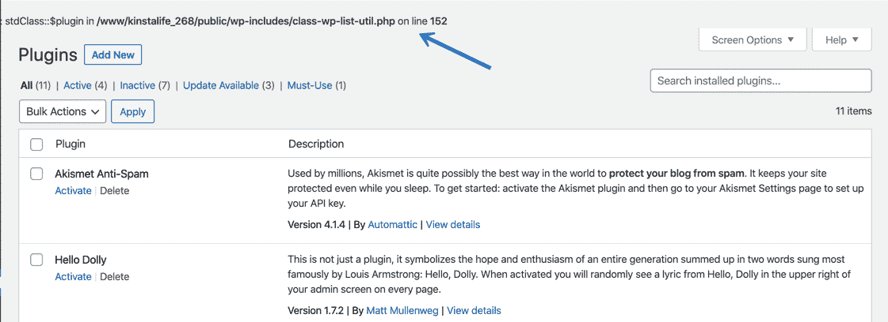
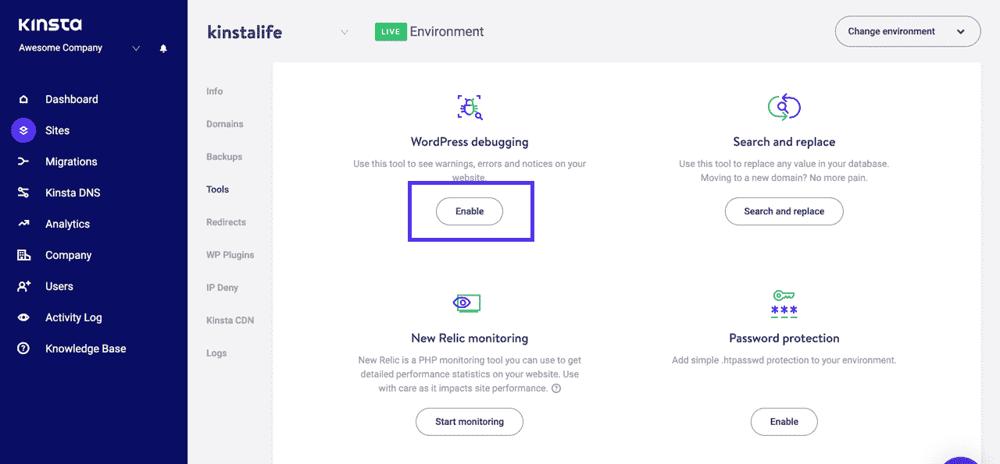
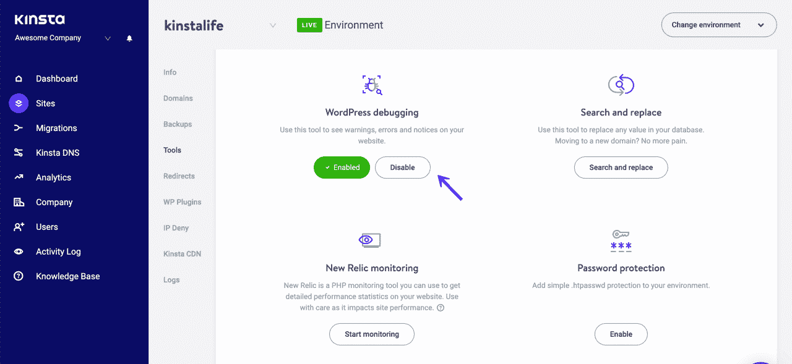
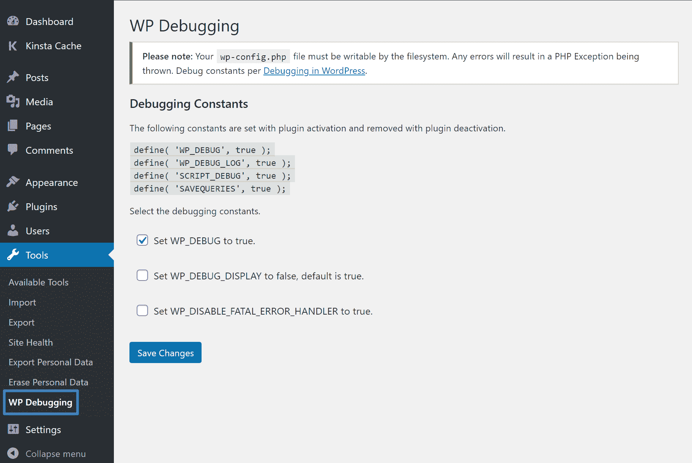
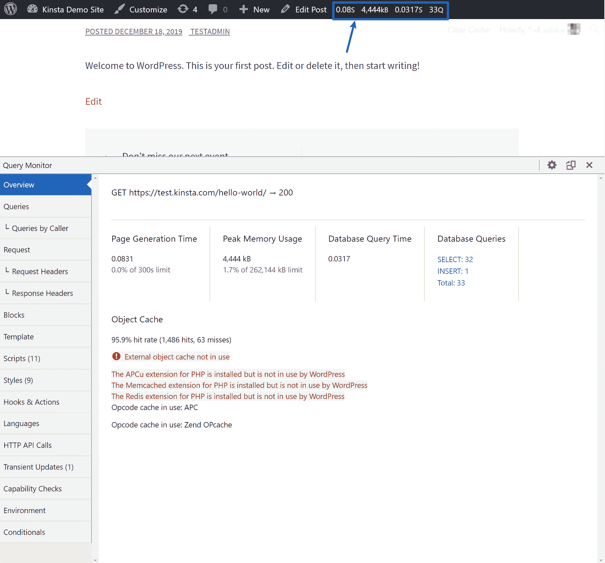
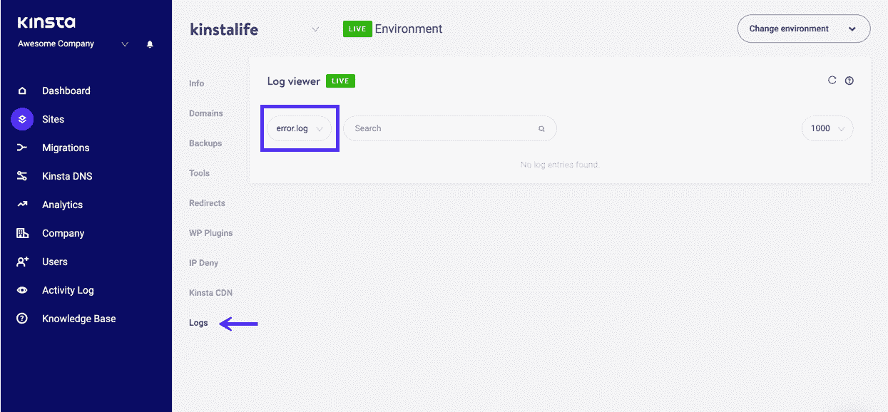

# WordPress 调试完全指南(启用 WP_DEBUG +其他工具)

> 原文：<https://kinsta.com/blog/wordpress-debug/>

在一个完美的世界里，你永远不会有一个需要调试的问题。但是在现实世界中，你几乎肯定会在你的 WordPress 网站上遇到[问题，这些问题需要深入了解。](https://kinsta.com/blog/wordpress-errors/)

为了帮助你做到这一点，WordPress 包括它自己的内置调试模式，你也可以找到有用的第三方工具来帮助你调试 WordPress。

在这篇文章中，我们将深入探讨内置的 WordPress 调试模式，并向您展示如何启用它。然后，我们还会分享一些调试你的 WordPress 站点的其他方法。

以下是我们将涉及的所有内容:

*   [介绍 WordPress 调试模式和调试日志](#what-does-wp-debug-do)
*   [如何启用 WordPress 调试模式(三种方法)](#how-to-enable-wordpress-debug-mode)
*   [调试 WordPress 的一些其他方法](#other-ways-to-debug-wordpress)

## WP 调试是做什么的？

WordPress 的核心软件是用 PHP 编写的[，插件和主题也是如此。](https://kinsta.com/blog/is-php-dead/)

如果你的网站有问题，WordPress 调试模式可以通过显示所有 PHP 错误、通知和警告来帮助你找出问题所在。

启用调试模式后，无论何时出现问题，您都会看到这样的消息(*，即使它没有立即导致问题*):

WP_DEBUG example of error on WordPress site

然后你可以修复这个问题，或者向你的开发者或者主题/插件的开发者报告。
T3】

> Kinsta 把我宠坏了，所以我现在要求每个供应商都提供这样的服务。我们还试图通过我们的 SaaS 工具支持达到这一水平。
> 
> <footer class="wp-block-kinsta-client-quote__footer">
> 
> 
> 
> <cite class="wp-block-kinsta-client-quote__cite">Suganthan Mohanadasan from @Suganthanmn</cite></footer>

[View plans](https://kinsta.com/plans/)

### 什么是 WordPress 调试日志？

当你单独启用 WordPress 调试模式时，你会在时刻在你的站点*上看到类似上面例子的消息——但是这些消息不会被保存在任何地方。*

如果你想保存它们，你也可以启用 [WordPress 调试日志](https://kinsta.com/knowledgebase/wordpress-error-log/)来保存所有的消息和错误到你服务器上的一个文件中。

当通过将`WP_DEBUG_LOG`常量设置为真来启用时，WordPress 会将所有问题写入以下文件:

`wp-content/debug.log`

但是，您也可以指定自定义文件路径，将日志写入服务器上的不同位置。

如果您想将问题保存到日志*中，而不是*在页面的 HTML 中公开显示它们(就像上面的例子截图)，您也可以使用`WP_DEBUG_DISPLAY`常量来保持调试模式启用，但不在您的站点上显示消息。

通常情况下，你会想把`WP_DEBUG_DISPLAY`和`WP_DEBUG_LOG`结合起来。

[Ready to debug your #WordPress site? This guide has you covered 🐛Click to Tweet](https://twitter.com/intent/tweet?url=https%3A%2F%2Fkinsta.com%2Fblog%2Fwordpress-debug%2F&via=kinsta&text=Ready+to+debug+your+%23WordPress+site%3F+This+guide+has+you+covered+%F0%9F%90%9B&hashtags=wordpresshelp%2Cwpplugin)

## 如何启用 WordPress 调试模式

要启用 WordPress 调试模式，你有几个选择。我们将介绍三种实现它的方法:

### 如何在 MyKinsta 中启用 WordPress 调试模式

如果你在 Kinsta 托管你的 WordPress 站点，我们建立了一个简单的工具，让你[启用 WordPress 调试模式](https://kinsta.com/help/wordpress-enable-debug/)，而不需要编辑你的[wp-config.php 文件](https://kinsta.com/blog/wp-config-php/)。

这个工具可以方便地快速启用调试模式，并在你的站点上显示消息，但是它不能让你控制 WordPress 调试日志或者是否在动态页面上显示消息。如果您只想使用调试日志，那么您可能更喜欢下一节中的插件方法。

要开始使用:

*   打开您的 [MyKinsta 仪表盘](https://my.kinsta.com/)。
*   从**站点**列表中选择您想要启用调试的站点。
*   转到该站点仪表板中的**工具**选项卡。
*   点击 **WordPress 调试下的**启用**。**

How to enable WordPress debug mode in MyKinsta

您可以在实际环境和试运行环境中使用该工具。不过，只要有可能，我们还是建议将它与你的 [staging environment](https://kinsta.com/help/staging-environment/#create-wordpress-staging) 一起使用，因为启用 WordPress 调试模式可能会向访问者显示关于你的网站的 PHP 代码的细节(这让访问者感到困惑，也是一个[安全风险](https://kinsta.com/blog/wordpress-security/))。

完成后，您可以通过单击 Kinsta 仪表板中的**禁用**按钮来禁用调试模式:

How to disable WordPress debug mode in MyKinsta

### Info

愿意给 MyKinsta 试跑一下吗？[免费创建您的模拟账户](https://kinsta.com/mykinsta/)，开始玩吧。

### 如何使用 WordPress 调试插件

如果你没有在 Kinsta 上托管，你也可以找到免费的 WordPress 调试插件，它可以很容易地启用调试模式。在 WordPress.org 有几个选项，但是我们推荐安迪·弗拉根的免费 WP 调试插件。

WP Debugging WordPress plugin

一旦你安装并激活了插件，它马上就开始工作了。默认情况下，它将以下常量设置为 **true** (即，它启用以下功能):

*   `WP_DEBUG`–启用调试模式。
*   `WP_DEBUG_LOG`–将消息保存到日志文件中。
*   `SCRIPT_DEBUG`
*   `SAVEQUERIES`

我们将在这篇文章的稍后部分讨论最后两个常量的作用。

要配置几个选项，可以去**工具→ WP 调试:**

WP Debugging plugin’s settings

完成后，确保禁用插件以禁用调试模式。

## 注册订阅时事通讯

### 想知道我们是怎么让流量增长超过 1000%的吗？

加入 20，000 多名获得我们每周时事通讯和内部消息的人的行列吧！

[Subscribe Now](#newsletter)

### 如何手动启用 WordPress 调试模式

最后，你也可以通过手动添加常量到你的**wp-config.php**文件来启用 WordPress 调试模式。

首先，[通过 FTP](https://kinsta.com/knowledgebase/how-to-use-sftp/) 连接到你的服务器，编辑 wp-config.php 的**文件。默认情况下，该文件位于网站的根文件夹中(除非出于安全原因移动了它)。**

为了只启用基本的 WordPress 调试模式，将下面的代码片段**添加到**上面写着/*仅此而已，停止编辑！博客快乐。*/:

`// Enable WP_DEBUG mode
define( 'WP_DEBUG', true );`

您也可以根据自己的喜好使用以下一些常量:

`// Enable Debug logging to the /wp-content/debug.log file
define( 'WP_DEBUG_LOG', true );
// Disable display of errors and warnings
define( 'WP_DEBUG_DISPLAY', false );
@ini_set( 'display_errors', 0 );`

一旦完成，您可以将常量设置为 **false** 或者删除代码片段以禁用调试模式。

## 完成后，确保在 WordPress 中禁用调试模式

当你试图[用 WordPress](https://kinsta.com/blog/wordpress-errors/) 解决问题时，调试模式是有用的，但是你不应该让它 24/7 开启，因为它会向网站访问者暴露你的 PHP 代码中的文本。

我们在上面提到了这一点——但这只是提醒您在完成故障排除后，要始终禁用调试模式。

## 调试 WordPress 的其他方法

除了我们上面提到的内置调试工具，还有几个其他的内置和第三方工具可以帮助你调试你的 WordPress 站点。

### 脚本调试

`SCRIPT_DEBUG`是另一个内置常量，它迫使 [WordPress 使用核心 CSS](https://kinsta.com/blog/wordpress-css/) 和 JavaScript 文件的开发版本，而不是它通常加载的缩小版本。

厌倦了体验你的 WordPress 网站的问题？通过 Kinsta 获得最好、最快的主机支持！[查看我们的计划](https://kinsta.com/plans/?in-article-cta)

如果您正在测试对内置的更改，这可能会很有帮助。js 或者**。css** 文件。

要启用`SCRIPT_DEBUG`，您可以:

*   使用上面的免费 WP 调试插件，默认情况下会启用它。
*   将以下常量添加到您的**wp-config.php**文件中—`define( 'SCRIPT_DEBUG', true );`

### 数据库查询调试

如果您的站点的数据库有[问题，您可以使用`SAVEQUERIES`常量启用数据库查询日志记录来跟踪:](https://kinsta.com/knowledgebase/wordpress-repair-database/)

*   每个数据库查询。
*   调用数据库查询的函数。
*   查询花费的时间。

要启用查询日志记录，您可以:

*   使用上面的免费 WP 调试插件，默认情况下会启用它。
*   将以下常量添加到您的**wp-config.php**文件中—`define( 'SAVEQUERIES', true );`

注意:这将影响[你的站点的性能](https://kinsta.com/blog/third-party-performance/),所以尽可能在临时站点上使用它，并在完成后立即禁用它。

### 查询监视器插件

[查询监控插件](https://kinsta.com/blog/query-monitor/)是一个免费插件，有助于调试 WordPress 中的许多不同领域，包括:

*   数据库查询。
*   PHP 错误。
*   [挂钩和动作](https://kinsta.com/blog/wordpress-hooks/)。
*   [块编辑器块](https://kinsta.com/blog/gutenberg-wordpress-editor/)。
*   入队脚本和样式表。
*   HTTP [API 调用](https://kinsta.com/blog/wordpress-rest-api/)。
*   用户能力。

总的来说，它是你能找到的最好的 WordPress 调试工具之一，这就是为什么它在超过 320 个评论中有几乎完美的五星评级。

一旦你安装并激活[插件，](https://wordpress.org/plugins/query-monitor/)你会在 WordPress 工具栏上看到一些显示调试信息的新选项。点击时，这些选项将打开一个新的**查询监视器**框，为您提供更多信息:

The Query Monitor plugin

为了更详细的了解，我们有一整篇关于如何使用查询监控插件的文章。

### 新遗迹

New Relic 是一个用于分析和调试站点性能的高级工具。它可以帮助您发现影响站点性能的瓶颈和问题。

Kinsta 已经包含了[内置的 APM 工具](https://kinsta.com/apm-tool/)。但是，如果您有自己的许可证，您仍然可以在 MyKinsta 仪表板中使用 New Relic。

### 服务器日志

最后，你的服务器日志也是调试 WordPress 的有用工具。

如果您在 Kinsta 托管，您可以在站点仪表板的**日志**选项卡中查看您的所有服务器日志:

Viewing server logs in MyKinsta dashboard

如果您在其他地方托管，您将需要查阅您的主机的文档，以了解在哪里可以访问您的服务器日志。

[It's time to take a look under the hood and debug your #WordPress site 🐛 This guide has everything you need to get started 💪Click to Tweet](https://twitter.com/intent/tweet?url=https%3A%2F%2Fkinsta.com%2Fblog%2Fwordpress-debug%2F&via=kinsta&text=It%27s+time+to+take+a+look+under+the+hood+and+debug+your+%23WordPress+site+%F0%9F%90%9B+This+guide+has+everything+you+need+to+get+started+%F0%9F%92%AA&hashtags=webdev%2Cwpplugin)

## 摘要

如果你需要调试 WordPress，内置的 WordPress 调试模式提供了一种查看 PHP 错误和通知的有用方法。

如果您在 Kinsta 主持，您可以从您的仪表板上启用它。否则，你可以用插件或者通过添加代码片段到你站点的**wp-config.php**文件来启用它。

要获得更多帮助，你还可以使用其他内置工具或第三方工具，如 New Relic(需要你自己的许可证)和免费的查询监控插件。

关于如何调试 WordPress，你还有其他问题吗？留下评论让我们知道！

* * *

让你所有的[应用程序](https://kinsta.com/application-hosting/)、[数据库](https://kinsta.com/database-hosting/)和 [WordPress 网站](https://kinsta.com/wordpress-hosting/)在线并在一个屋檐下。我们功能丰富的高性能云平台包括:

*   在 MyKinsta 仪表盘中轻松设置和管理
*   24/7 专家支持
*   最好的谷歌云平台硬件和网络，由 Kubernetes 提供最大的可扩展性
*   面向速度和安全性的企业级 Cloudflare 集成
*   全球受众覆盖全球多达 35 个数据中心和 275 多个 pop

在第一个月使用托管的[应用程序或托管](https://kinsta.com/application-hosting/)的[数据库，您可以享受 20 美元的优惠，亲自测试一下。探索我们的](https://kinsta.com/database-hosting/)[计划](https://kinsta.com/plans/)或[与销售人员交谈](https://kinsta.com/contact-us/)以找到最适合您的方式。