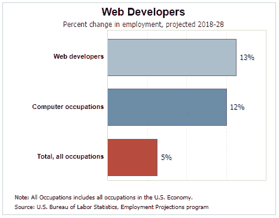
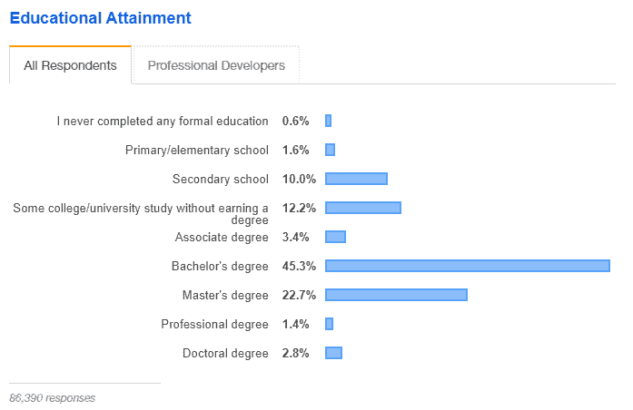

# Web 开发人员的平均工资是多少？这是 2022 年的数据

> 原文：<https://kinsta.com/blog/web-developer-salary/>

想成为一名网络开发人员，或者对什么类型的工作报酬最高感到好奇？Web 开发是一个竞争激烈、变化多端的行业，随着新语言和新框架的出现，它也在不断发展。

问一个网络开发人员的薪水是一个棘手的问题(我们试着为 WordPress 开发人员回答这个问题)。要考虑的因素太多了。

无论你是一名自由开发人员，还是对追求更传统的工作感兴趣，更喜欢前端或后端工作，或者想知道什么语言是最好的投资，这里有一个有用的指南，让你了解你应该期望的薪水。

准备好知道了吗？让我们开始吧！

### 查看我们的[视频指南](https://www.youtube.com/watch?v=YbOCpNGw1Mc)成为一名网页开发者

## Web 开发人员需求量大吗？

Web 开发(和一般的软件开发)是世界上最受欢迎和发展最快的行业之一。对于任何类型的开发者来说，这都是一个非常好的时机。

> Kinsta 把我宠坏了，所以我现在要求每个供应商都提供这样的服务。我们还试图通过我们的 SaaS 工具支持达到这一水平。
> 
> <footer class="wp-block-kinsta-client-quote__footer">
> 
> 
> 
> <cite class="wp-block-kinsta-client-quote__cite">Suganthan Mohanadasan from @Suganthanmn</cite></footer>

[View plans](https://kinsta.com/plans/)

尽管这一行业在发展，但工资仍在持续增长。如今，网络开发人员并没有过度饱和。

对开发人员的需求正在激增。不利的一面是，这可能是一个**非常有竞争力的行业**。为了得到最好的工作，你可能需要掌握多种语言和多种技能。跟上热门的框架和语言是保持相关性的关键。

从好的方面来看，从 2018 年到 2028 年，[网络开发人员的工作岗位预计将增长 13%](https://www.bls.gov/ooh/computer-and-information-technology/web-developers.htm) 。这听起来可能不是一个压倒性的数字，但所有行业的典型就业增长只有 5%。总的来说，IT 是一个蓬勃发展的行业，一般计算机职业以 12%的速度增长。

U.S. Bureau of Labor statistics on web developers

成为一名程序员也需要一定的技能。精通电脑，能够一次集中注意力几个小时，以及学习几种新的独特语言的天赋都需要时间和练习来培养，所以他们的需求相对较高。

人们在互联网上花费越来越多的时间，企业也跟着他们去那里。每一家公司都希望并需要有一个网站，其他人都在试图让 T2 开始网上业务。这些人需要开发人员从头开始创建功能性网站。

[全球一半以上的人口使用互联网](https://www.statista.com/topics/1145/internet-usage-worldwide/)，网络开发者需要[建立和定制在线商店](https://kinsta.com/blog/woocommerce-plugins/)、[博客](https://kinsta.com/blog/how-to-start-a-food-blog/)、报纸、游戏和信息网站，让人们沉迷于在线。

如果你想以建立网站为生，就不会缺少工作。

[想在 web 开发领域开始职业生涯？💻无论你是前端、后端还是全栈开发人员，本指南深入探讨了你期望获得的薪水范围💰 点击推文](https://twitter.com/intent/tweet?url=https%3A%2F%2Fkinsta.com%2Fblog%2Fweb-developer-salary%2F&via=kinsta&text=Looking+to+start+a+career+in+web+development%3F+%F0%9F%92%BB+This+guide+goes+deep+into+the+range+of+salaries+you+can+expect+to+earn%2C+whether+you%E2%80%99re+a+frontend%2C+backend%2C+or+full+stack+developer%F0%9F%92%B0&hashtags=webdev%2Cremotework)

## 成为一名网页开发人员需要什么？

有许多类型的网页开发人员，每个职位适合不同类型的技能。你的工作环境也有很多选择。无论你是想在家里成为一名自由职业者，在一个小而舒适的公司空间，还是在一个大而热闹的办公环境，你都能找到一个适合你的地方。

事实上，有许多人选择成为自由网络开发人员是因为这份工作能给你带来灵活性。

Educational attainment for web developers

虽然一些网站开发职位会要求计算机科学或相关领域的大专或学士学位，但许多工作机会会接受任何有一定经验的人，你会发现很多根本没有提到学位。

这就是为什么你应该专注于[建立你的投资组合](https://kinsta.com/blog/wordpress-portfolio-plugins/)。

全面的投资组合是必不可少的，尤其是如果你没有大学学历。许多自学成才的开发人员通过拥有良好的投资组合和足够的经验获得了工作。

除了教育要求之外，web 开发人员还需要:

*   多种网络语言和框架的经验。
*   分析技能。
*   [项目管理技能](https://kinsta.com/blog/trello-vs-asana/)
*   适应不断变化的在线标准和语言。
*   沟通技巧(团队合作和与客户合作)。

> [这里有一个全面的视觉概述，介绍作为一名 web 开发人员需要学习的有用技能](https://www.reddit.com/r/webdev/comments/foolrw/heres_a_comprehensive_visual_overview_of_useful/?ref_source=embed&ref=share)来自 [webdev](https://www.reddit.com/r/webdev/)