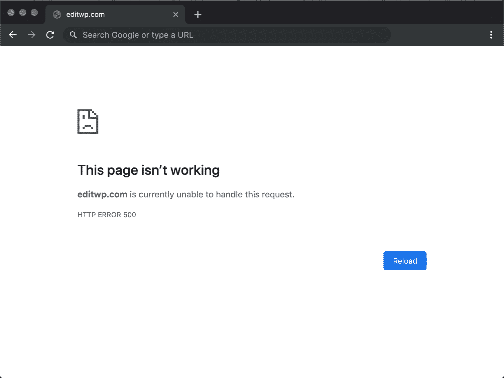
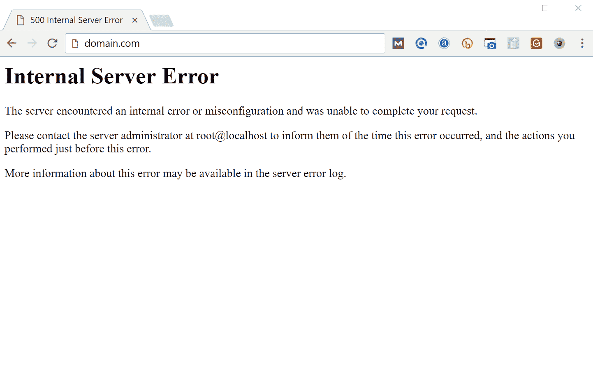
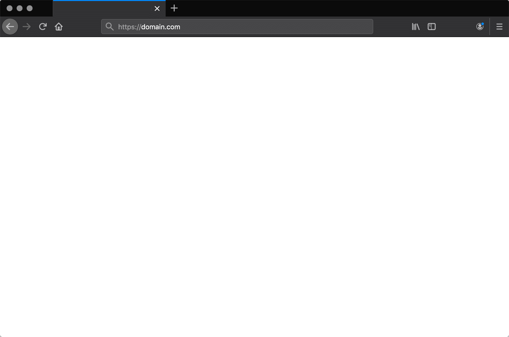
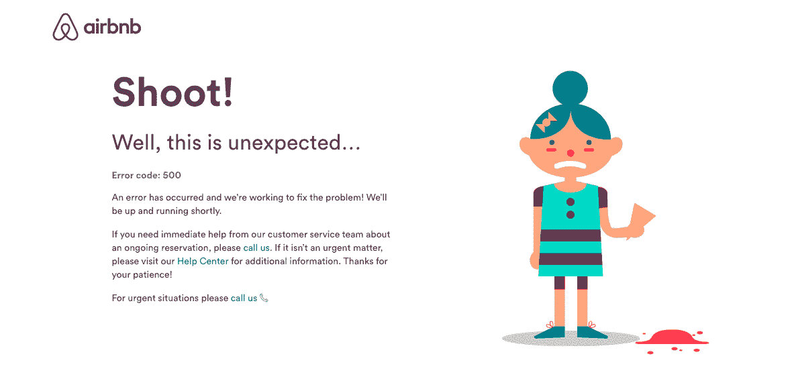
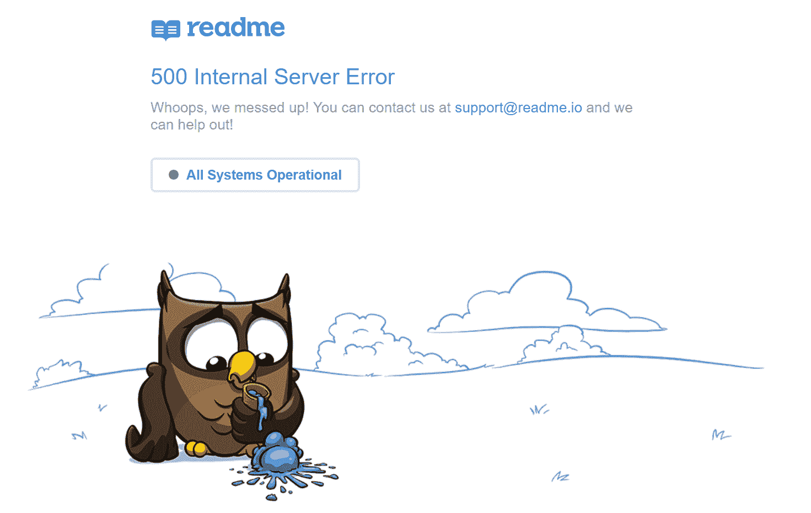
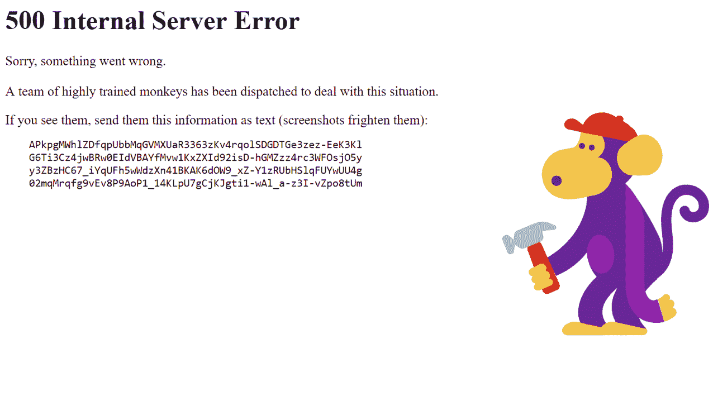

# 如何修复你的 WordPress 站点上的 500 内部服务器错误

> 原文：<https://kinsta.com/blog/500-internal-server-error/>

可怕的 500 内部服务器错误。它似乎总是在最不合适的时候出现，你突然被丢在一边，手忙脚乱地想如何让你的 WordPress 站点重新上线。相信我们，我们都经历过。其他类似的错误，你可能也看到过，包括建立数据库连接的可怕的[错误](https://kinsta.com/blog/error-establishing-a-database-connection/)和死亡的可怕的[白屏](https://kinsta.com/blog/wordpress-white-screen-of-death/)。但是从你的网站关闭的那一刻起，你就失去了访问者和客户。更不用说这看起来对你的品牌不利。

今天，我们将深入探讨 500 内部服务器错误，并通过一些方法让您的网站快速恢复在线。请阅读下面的详细内容，了解导致此错误的原因，以及将来如何避免此错误。

*   [什么是 500 内部服务器错误？](#what-is-500-internal-server-error)
*   [如何修复 500 内部服务器错误](#fix-500-internal-server-error)

## 500 内部服务器错误(最常见的原因):

WordPress 中的 500 内部服务器错误可能是由多种原因造成的。如果您正在遇到这种情况，很可能是以下一个(或多个)因素导致了该问题:

*   浏览器缓存。
*   数据库登录凭据不正确。
*   数据库损坏。
*   WordPress 安装中的损坏文件。
*   数据库服务器的问题。
*   损坏的 WordPress 核心文件。
*   腐败。文件和 PHP 内存限制。
*   第三方插件和主题的问题。
*   PHP 超时或第三方插件的致命 PHP 错误。
*   错误的文件和文件夹权限。
*   服务器上的 PHP 内存耗尽
*   损坏或损坏。htaccess 文件。
*   CGI 和 Perl 脚本中的错误。

Support

### 查看我们修复 500 内部服务器错误的终极指南

## 什么是 500 内部服务器错误？

互联网工程任务组(IETF)将 [500 内部服务器错误](https://tools.ietf.org/html/rfc7231#section-6.6.1)定义为:

> *500(内部服务器错误)状态代码表示服务器遇到了意外情况，导致无法完成请求。*

当你访问一个网站时，你的浏览器会向网站所在的服务器发送一个请求。服务器接受这个请求，处理它，并发送回请求的资源(PHP、HTML、CSS 等)。)以及一个 HTTP 头。HTTP 还包括他们所谓的 [HTTP 状态码](https://kinsta.com/blog/http-status-codes/)。状态代码是通知您请求状态的一种方式。它可能是 200 状态代码，表示“一切正常”，也可能是 500 状态代码，表示出现了问题。

> Kinsta 把我宠坏了，所以我现在要求每个供应商都提供这样的服务。我们还试图通过我们的 SaaS 工具支持达到这一水平。
> 
> <footer class="wp-block-kinsta-client-quote__footer">
> 
> 
> 
> <cite class="wp-block-kinsta-client-quote__cite">Suganthan Mohanadasan from @Suganthanmn</cite></footer>

[View plans](https://kinsta.com/plans/)

有很多不同类型的 500 状态错误代码(500、 [501](https://kinsta.com/knowledgebase/501-not-implemented-error/) 、 [502](https://kinsta.com/blog/502-bad-gateway/) 、 [503](https://kinsta.com/blog/http-error-503/) 、 [504](https://kinsta.com/blog/504-gateway-timeout/) 等)。)而且都有不同的意思。在这种情况下，500 内部服务器错误表示**服务器遇到了意外情况，导致其无法满足请求** ( [RFC 7231](https://tools.ietf.org/html/rfc7231#section-6.6.1) ，第 6.6.1 节)。

500 internal server error in WordPress

### 500 个内部服务器错误变体

由于 web 服务器、操作系统和浏览器的不同，500 内部服务器错误会以多种不同的方式出现。但是他们都在传达同样的东西。以下是你可能在网上看到的许多不同的变体中的几个:

您可能还会看到以下消息:

> 服务器遇到内部错误或配置错误，无法完成您的请求。请联系服务器管理员，[【电子邮件保护】](/cdn-cgi/l/email-protection)并告知他们错误发生的时间，以及您可能做过的任何可能导致错误的事情。有关此错误的更多信息可以在服务器错误日志中找到。

Internal Server Error

其他时候，你可能只是看到一个空白的白色屏幕。当处理 500 个内部服务器错误时，这在 Firefox 和 Safari 这样的浏览器中实际上是相当常见的。

500 internal server error in Firefox

更大的品牌甚至可能有自己定制的 500 内部服务器错误信息，比如 Airbnb 的这条。

Airbnb 500 internal server error

这是另一个来自 readme 的 creative 500 服务器错误的例子。

readme 500 internal server error

即使强大的 YouTube 也不能幸免于 500 个内部服务器错误。

500 internal server error on YouTube

如果是 IIS 7.0 (Windows)或更高版本的服务器，他们有[个额外的 HTTP 状态代码](https://support.microsoft.com/en-us/help/943891/the-http-status-code-in-iis-7-0-iis-7-5-and-iis-8-0)来更准确地指出 500 错误的原因:

*   500.0–出现模块或 ISAPI 错误。
*   500.11–web 服务器上的应用程序正在关闭。
*   500.12–应用程序正忙于在 web 服务器上重新启动。
*   500.13-网络服务器太忙。
*   500.15–不允许直接请求 global.asax。
*   500.19–配置数据无效。
*   500.21-模块无法识别。
*   500.22–ASP.NET http modules 配置不适用于托管管道模式。
*   500.23–ASP.NET httpHandlers 配置不适用于托管管道模式。
*   500.24–ASP.NET 模拟配置不适用于托管管道模式。
*   500.50–在 RQ_BEGIN_REQUEST 通知处理过程中出现重写错误。出现配置或入站规则执行错误。
*   500.51–在 GL_PRE_BEGIN_REQUEST 通知处理过程中出现重写错误。出现全局配置或全局规则执行错误。
*   500.52–在 RQ_SEND_RESPONSE 通知处理过程中出现重写错误。执行出站规则。
*   500.53–在 RQ_RELEASE_REQUEST_STATE 通知处理期间出现重写错误。出现出站规则执行错误。该规则被配置为在更新输出用户缓存之前执行。
    500.100–内部 ASP 错误。

### 500 个错误对 SEO 的影响

不像用于 [WordPress 维护](https://kinsta.com/blog/wordpress-maintenance/%E2%80%8E)模式的 [503 错误](https://kinsta.com/blog/http-error-503/)，告诉谷歌以后再来检查，一个 500 错误如果不马上修复，会对 SEO 产生负面影响。如果你的网站只关闭了 10 分钟，并且被持续抓取了很多次，爬虫就会从缓存中获取页面。或者，谷歌可能甚至没有机会在它恢复之前重新抓取它。在这种情况下，你完全没问题。

然而，如果网站关闭了一段时间，比如说 6 个多小时，那么谷歌可能会将 500 错误视为需要解决的网站级别的问题。这**可能会影响你的排名**。如果你担心重复 500 个错误，你应该首先弄清楚它们为什么会发生。下面的一些解决方案会有所帮助。
T3】

## 如何修复 500 内部服务器错误

当你在你的 WordPress 网站上看到一个 500 内部服务器错误时，你应该从哪里开始排除故障？有时你甚至不知道从哪里开始。通常 500 个错误都在服务器本身，但是根据我们的经验，这些错误源于两件事，第一件是**用户错误**(客户端问题)，第二件是服务器有**问题。因此，我们将深入了解这两者。**

> 这永远不会不令人讨厌😖[pic.twitter.com/pPKxbkvI9K](https://t.co/pPKxbkvI9K)
> 
> -达雷·奥巴桑乔🐀(@ carnage 4 life)[2019 年 9 月 26 日](https://twitter.com/Carnage4Life/status/1177095951728562177?ref_src=twsrc%5Etfw)