# WordPress 用户 2022 年开始使用的 27 个流行 SSH 命令

> 原文：<https://kinsta.com/blog/ssh-commands/>

使用 SSH 和 WordPress 可能是访问你的网站最安全和方便的方法之一。

这是一个访问你网站上文件的协议，意思是“安全外壳”。只要您有登录凭证，您就可以使用它从任何地方访问您的站点，因为您知道这样做是安全的。

在这篇文章中，你将了解一些用于 WordPress 的最有用的 SSH 命令。

让我们开始吧！

## 什么是 SSH，我如何在 WordPress 中使用它？

SSH 是访问 WordPress 站点文件的安全协议。这篇文章关注的是你可以使用的命令，所以我不打算详细讲述如何使用 SSH 访问你的站点。

### 什么是宋承宪？

SSH，或“安全外壳”，是一种可以用来访问远程服务器上的文件和目录的协议。SSH 规范将其定义为:


> Kinsta 把我宠坏了，所以我现在要求每个供应商都提供这样的服务。我们还试图通过我们的 SaaS 工具支持达到这一水平。
> 
> <footer class="wp-block-kinsta-client-quote__footer">
> 
> 
> 
> <cite class="wp-block-kinsta-client-quote__cite">Suganthan Mohanadasan from @Suganthanmn</cite></footer>

[View plans](https://kinsta.com/plans/)

> "在不安全的网络上安全远程登录和其他安全网络服务的协议."

你可以使用[终端](https://kinsta.com/blog/wp-cli/)(在 macOS 或 Linux 上)或客户端如 [PuTTY](https://kinsta.com/help/connect-to-ssh/#how-to-connect-to-ssh-on-windows) (在 Windows 上)通过 SSH 访问你的网站，而不是使用你的网络浏览器。

### 我如何在 WordPress 中使用 SSH？

对于一个 WordPress 站点，SSH 将允许你访问 WordPress 文件本身以及你添加到 wp-content 目录的任何文件，无论是通过管理界面还是直接。

很可能你将主要在 wp-content 目录中使用它，偶尔在根目录中使用它来访问像[wp-config.php](https://kinsta.com/blog/wp-config-php/)这样的文件。

要使用 SSH 在您的站点中工作，请打开终端或客户机(如 PuTTY ),并从访问服务器开始。为此，你需要[四条信息](https://kinsta.com/knowledgebase/ssh-connection-refused/#2-you-have-the-wrong-credentials):

*   服务器地址。
*   用户名。
*   密码。
*   港口。

为了[通过 SSH 与 Kinsta](https://kinsta.com/help/connect-to-ssh/) 连接，您需要在 [MyKinsta](https://kinsta.com/mykinsta) 中找到该信息。选择您的站点并找到信息屏幕的 SFTP/SSH 部分。

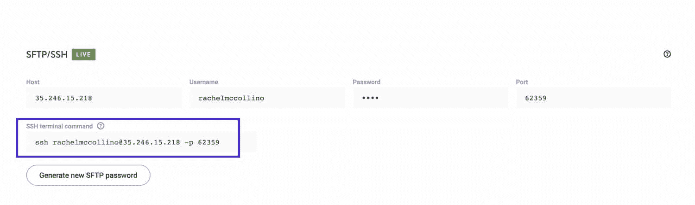

MyKinsta SSH details


将它复制到命令行中。

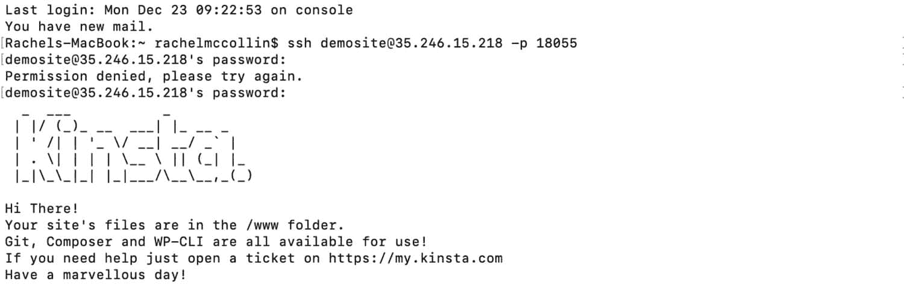

Kinsta SSH starting screen


一旦你完成了这些，你就可以开始在你的 WordPress 站点上使用 SSH 命令了。

如果您的连接被拒绝，可能是由于以下原因之一。按照我们的指南[对拒绝的 SSH 连接进行故障排除](https://kinsta.com/knowledgebase/ssh-connection-refused/)以再次连接。
T3】

### 什么是 PuTTY，我如何使用它？

如果你运行的是 macOS 或 Linux，你已经有了通过 SSH 访问你的 WordPress 站点所需的界面。您可以简单地使用内置终端来使用 SSH。

但是如果你用的是 Windows，你需要安装一个客户端来使用 SSH。

最流行的 SSH 客户端是 [PuTTY](https://www.putty.org/) 。您需要下载并安装该软件，然后才能从 Windows 访问您的网站。然后，在 PuTTY 中使用与在终端中相同的 SSH 命令。

### 我如何用 WordPress 自动化 SSH 命令？

使用 SSH 访问你的 WordPress 站点的一个好处是你可以自动化你经常使用的命令。

你可以通过使用 WordPress 命令行界面 [WP-CLI](https://kinsta.com/blog/wp-cli/) 来实现。这是一个让你访问特定于 WordPress 的命令库的接口，你可以在 SSH 提供的基础上使用它。

使用 WP-CLI 意味着你可以自动化 WordPress 管理任务，比如更新你的 WordPress 安装，[安装插件](https://kinsta.com/knowledgebase/how-to-install-wordpress-plugins/)，以及配置远程服务器。使用命令行加速这个过程，可以让你成为一个更有效率的[开发者](https://kinsta.com/blog/hire-wordpress-developer/)。

### 在 WordPress 中使用 SSH 的好处

在 WordPress 中使用 SSH 有很多好处:

*   很安全。这意味着您可以从任何地方远程访问您的服务器，因为您知道您是通过一个安全的界面这样做的。
*   很方便。它能让你从任何地方进入。你不需要进入 [WordPress 管理界面](https://kinsta.com/knowledgebase/wordpress-admin/)，甚至不需要运行网络浏览器。
*   它很快。在很多情况下，使用 SSH 命令比使用 WordPress 管理屏幕或者通过 SFTP 访问文件要快得多。

现在你已经知道了 SSH 是什么，以及它是如何与 WordPress 一起工作的，让我们来看看你可以与 WordPress 一起使用的最流行的 SSH 命令。

## 27 个用于 WordPress 的 SSH 命令

SSH 协议有广泛的命令。下面我列出了最常用的，为了方便起见，我把它们分成了几类。

## 目录命令

在你的 WordPress 站点中，有一系列的 SSH 命令可以用来操作目录(或文件夹)。

### pwd–显示当前目录(您现在所在位置的完整路径)

`pwd`命令将显示您现在所在服务器的完整路径。如果你在第一次访问你的网站时输入这个，它会告诉你你在哪个服务器上。

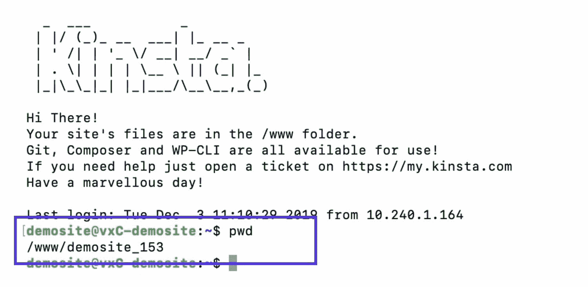

pwd command


在进一步移动到您的文件夹后使用此命令，您将会看到关于您确切位置的更多信息。这对于检查你的位置很有用，因为你没有使用[代码编辑器](https://kinsta.com/blog/free-html-editor/)或 [FTP 客户端](https://kinsta.com/blog/best-ftp-clients/)时得到的可视化表示。

### ls–显示目录内容(列出文件名)

`ls`命令将显示当前目录的内容。

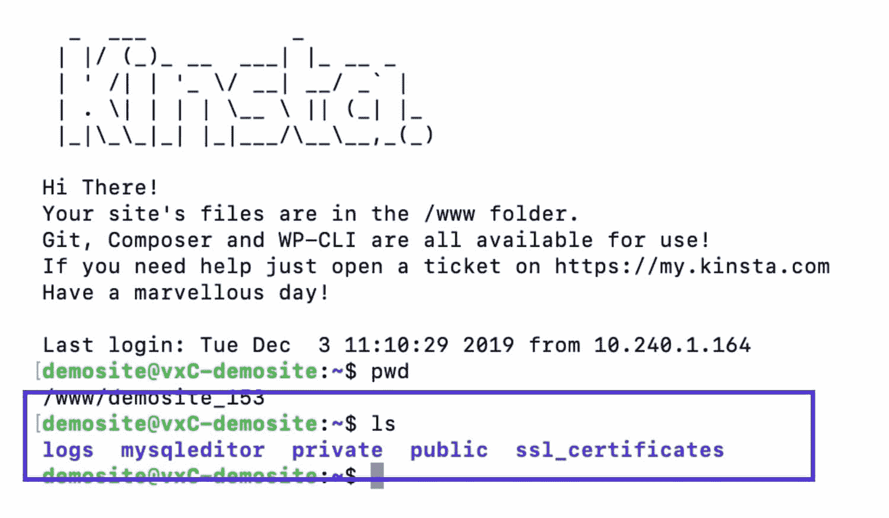

ls command


您也可以使用附加参数来定制或添加到`ls`命令返回的信息中:

*   `ls -a`显示[隐藏文件](https://kinsta.com/blog/show-hidden-files/)。
*   `ls -l`显示目录内容的文件详细信息，例如，权限、所有权、日期等。
*   列出文件的大小，以块为单位。
*   以人类可读的形式显示尺寸。

确保在命令和任何参数之间键入一个空格。

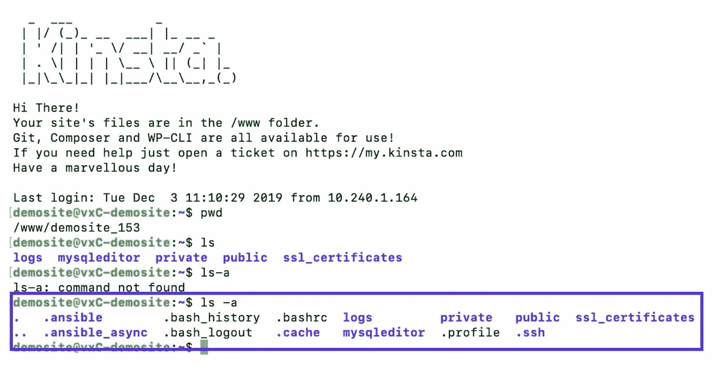

ls -a command


### CD–更改目录

`cd`命令将让你移动到另一个目录。您可以移动到当前目录的子目录中，也可以使用正确的参数向上或向下移动。

以下命令将我从服务器的根目录带到公共目录:

```
cd public
```

要在目录树中向上移动或返回起点，请使用以下参数之一:

*   `cd ..`转到您当前位置的上一级目录。
*   将你移到你正上方文件夹内的另一个文件夹。
*   `cd`–转到上一个目录。
*   `cd /`带你到根目录。

在下面的截图中，我已经移动到公共目录并列出其内容。如果你有使用 WordPress 安装内容的经验，你会觉得很熟悉:

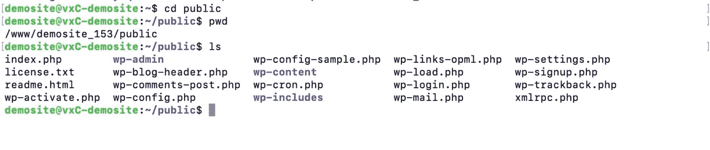

Moving into the public directory


### mkdir–创建新目录

使用`mkdir`命令，可以在当前目录下创建一个新目录。

所以，如果你在一个插件的文件夹中，你想为样式表添加一个目录，你可以使用这个命令:

```
mkdir styles
```

这将在您当前所在的文件夹中添加一个新的空目录。如果您想将目录添加到结构中较低的文件夹中，请键入结构。因此，在 wp-content 文件夹中，您可以键入:

```
mkdir /plugins/myplugin/styles
```

### rmdir–删除目录

`rmdir`命令将删除服务器上的一个目录。小心使用，因为你不能撤销它！

与`mkdir`一样，您可以使用`rmdir`删除当前位置的目录:

```
rmdir styles
```

或者，您可以使用`rmdir`来删除结构中更下面的文件夹:

```
rmdir /plugins/myplugin/styles
```

如果您添加额外的参数，您也可以使用`rm`删除目录。

*   `rm * foldername`–删除目录中的所有文件或内容。
*   `rm -r foldername`–删除文件夹以及其中的文件夹。

## 文件或目录命令

以下命令可以用于文件或文件夹/目录。

### CP–复制文件或文件夹

您可以使用`cp`命令将文件和文件夹复制到另一个位置。您需要指定要将文件或文件夹复制到的位置。

```
cp filename.extension /dir/
```

这指定了要复制的文件的名称(包括其扩展名)以及要复制到的位置。

如果您想要重命名文件(即新版本与原始版本的名称不同)，那么您也可以指定新的文件名。

```
cp filename.extension /dir/filename.extension
```

该命令有许多您可以使用的参数:

*   复制文件夹中的所有内容。
*   `cp -f`如果已经有另一个同名文件，则删除目标文件，并用新文件覆盖它。
*   复印前给你一个警告信息。
*   `cp -u`仅当文件内容不同时，覆盖目标文件夹中的文件。
*   首先检查文件是否已经存在，如果已经存在，则不会复制。它不会覆盖文件。
*   `cp -a`归档原始文件。

### 移动文件或文件夹

除了复制文件和文件夹，你还可以移动它们。为此，使用`mv`命令。

与`cp`一样，您可以移动文件或文件夹并保持相同的名称，或者移动并重命名它。

*   移动文件并保持相同的名称。
*   `mv filename.extension /dir/filename1.extension`移动并重命名文件。
*   将文件上移一个文件夹。

### 压缩文件或文件夹

另一个可以用于文件夹或文件的命令是`zip`,可以用来压缩文件夹及其内容。您需要包括将被压缩为 zip 文件的文件/文件夹的名称。您可以将它与指定是否要删除原始文件夹的参数一起使用。

*   `zip -r filename.zip foldername`压缩文件夹，但不删除它。
*   压缩并删除文件夹，只留下文件夹的压缩版本。
*   从您指定的现有 zip 存档中删除文件。
*   `zip -u filename.zip foldername`更新现有 zip 存档中的文件:如果您已经更新了原始文件，并且不想删除 zip 文件并创建一个新文件，这很有用。

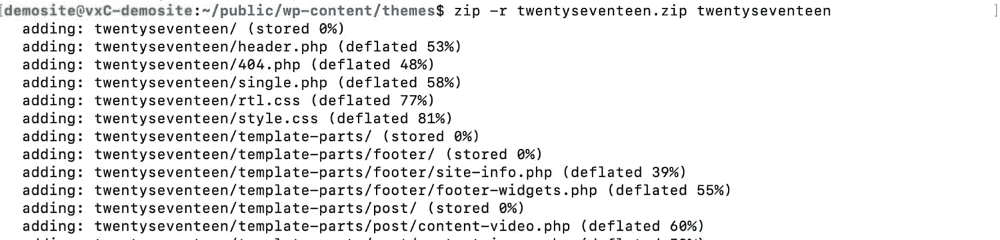

zip -r command


当您列出文件夹的内容时，如果您使用了`zip -r`，您将看到 zip 文件和原始文件夹，但是如果您使用了`zip -m`，则只会看到新的 zip 文件。

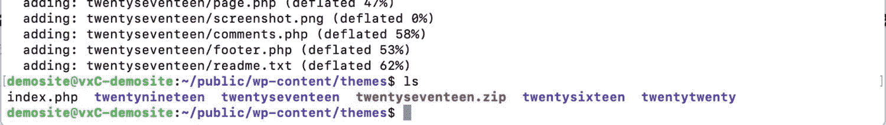

The new zip file


### 解压缩–解压缩文件夹

`unzip` [命令将解压您目录中的压缩文件](https://kinsta.com/knowledgebase/unzip-zip-file/),并提取其内容以创建最初压缩的文件夹或文件:

```
unzip twentyseventeen.zip
```

如果压缩时没有删除原始文件夹，请不要使用此选项。它不会覆盖原始文件夹。相反，在压缩时使用`zip -m`删除原始文件夹，或者在解压缩 zip 文件之前使用`rm`删除它。

您还可以添加解压缩参数来定制其用途:

*   `unzip filename.zip -x excludedfile.zip`将排除一个文件，并防止它与其他文件一起解压缩。
*   `unzip filename1.zip filename2.zip filename3.zip`将解压多个文件。你可以对任意多的 zip 文件使用它，这比在 [FTP 客户端](https://kinsta.com/knowledgebase/ftp-vs-sftp/)中使用要快得多。

### tar——创建并解压缩压缩的归档文件

`tar`命令将允许您创建和[解压缩. tar.gz 归档文件](https://kinsta.com/knowledgebase/unzip-tar-gz/)，这是使用。zip 存档。您可以使用相同的命令来压缩和解压缩文件或文件夹。

要压缩文件或文件夹，请使用`tar cvzf`。压缩文件夹的语法是:

```
tar cvzf archivename.tar.gz directoryname
```

上面，`archivename`是要创建的存档文件的名称，`directoryname`是要压缩的文件夹的名称。

并且要解压文件夹，使用`tar xvzf`:

```
tar xvzf archivename.tar.gz
```

这四个字母代表特定的说明:

*   告诉 tar 压缩文件。
*   告诉 tar 提取文件。
*   `v`代表 verbose，告诉 tar 显示受该命令影响的文件名。
*   告诉 tar 解压缩归档文件。
*   告诉 tar 您正在提供档案的名称。

## 文件命令

下面列出了专门用于文件的最常见的 SSH 命令。

### 触摸–创建新文件

要在服务器上创建一个新的空文件，使用`touch`命令:

```
touch style.css
```

您只能在当前目录下创建一个文件，因此您必须在使用`touch`命令之前导航到该目录。

### cat–显示文件内容

要显示文件的内容，使用`cat`。

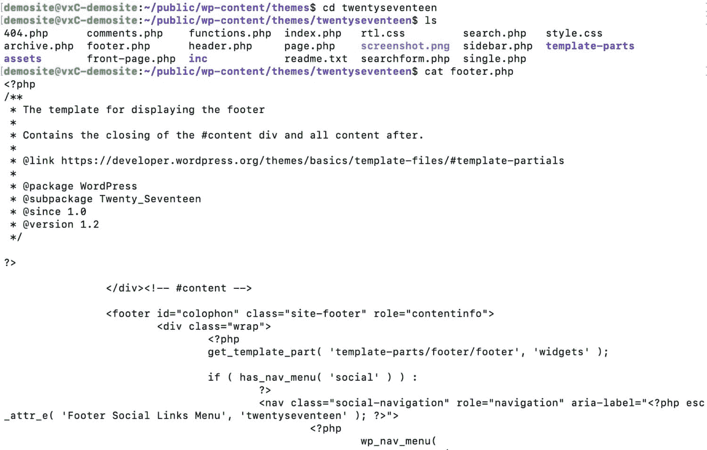

cat command


这将显示终端或 PuTTY 中任何文件的完整内容。

## 注册订阅时事通讯


### 想知道我们是怎么让流量增长超过 1000%的吗？

加入 20，000 多名获得我们每周时事通讯和内部消息的人的行列吧！

[Subscribe Now](#newsletter)

### grep–搜索特定短语

如果您知道您需要检查的文件很长，并且您也知道您要查找的内容，您可以使用`grep`命令来搜索特定的内容。

下面我在 sidebar.php 文件的主题中搜索了单词“sidebar”。

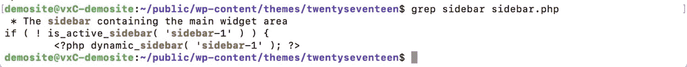

grep command


这将显示包含搜索词的所有行。

如果我想搜索一个不止一个单词的字符串，我需要用语音标记将它括起来:

```
grep "nav class" footer.php
```

`grep`命令也有许多参数，您可以使用它们来定制您的搜索:

*   `grep -i “string” filename`在文件中搜索字符串，不区分大小写。
*   `grep -c “string” filename`统计一个字符串在文件中出现的次数。
*   `grep -l “string” *`列出包含字符串的文件。
*   `grep -n “string” filename`显示行号和结果

### head 读取文件的前 10 行

如果您只想读取文件的开始行，那么使用`head`命令:

```
head filename.extension
```

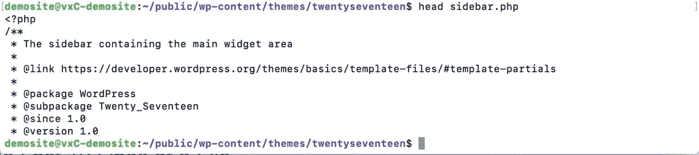

head command


### tail 读取文件的最后 10 行

`tail`命令的工作方式与`head`命令相同，但读取的是文件的最后十行:

```
tail filename.extension
```

### 查找–搜索文件和目录

`find`命令允许您搜索文件和目录，并返回符合您指定标准的文件和目录。以下命令将在当前目录中搜索名称包含“index”的所有文件:

```
find . -name “index”
```

语法是:

```
find operator criterion string
```

您可以使用的运算符有:

*   `/`(斜线)搜索整个系统。
*   `.`(点)搜索工作目录。
*   `~`(波浪号)搜索主目录。

因此，如果您将上面的命令改为这样，`str`将搜索整个系统，而不仅仅是当前目录:

```
find / -name “index”
```

您可以使用的标准包括:

*   `-name`–文件名。
*   `-user`–属于给定用户的文件。
*   `-size`–给定大小的文件。
*   `-type -d`–目录类型。即仅搜索目录。
*   `-type -f`–文件类型，即仅搜索文件。

搜索词可以是您喜欢的任何字符串。一定要用引号括起来。

### du–获取文件大小

如果你想知道你的 [WordPress 安装](https://kinsta.com/knowledgebase/installation-failed-could-not-create-directory/)中一个或多个文件的大小，使用`du`(磁盘使用)命令:

```
du -h wp-config.php
```

插入`-h`意味着[磁盘使用量](https://kinsta.com/blog/disk-usage-wordpress/)将以人类可读的格式显示，而不是以块的形式显示。

您可以使用额外的参数:

*   `df -h`将以人类可读的格式显示结果。
*   `df -m`将以 MB 为单位显示结果。
*   `df -k`将以 KB 为单位显示结果。
*   `df -T`将在额外的一列中显示文件系统类型。
*   `df -ht /directoryname`让您查看特定目录的信息。
*   `df help`列出了您可以使用的其他选项及其说明。

### chmod–更改文件的权限

`chmod`命令允许您更改文件的权限:

```
chmod 464 filename.extension
```

要确定使用哪些权限，使用 [Unix 权限计算器](http://permissions-calculator.org/)并将它给出的数字复制到命令中。

### nano–使用 Nano 文本编辑器编辑文件

如果您已经使用`touch`命令创建了一个新文件，或者使用`cat`命令显示了一个现有文件的内容，那么您可能想要编辑该文件。

您可以使用带有`nano`命令的 nano 文本编辑器来完成此操作:

需要为您的客户站点提供一个非常快速、安全且对开发人员友好的托管服务吗？Kinsta 是为 WordPress 开发者设计的，提供了大量的工具和强大的仪表板。[查看我们的计划](https://kinsta.com/plans/?in-article-cta)

```
nano filename.extension
```

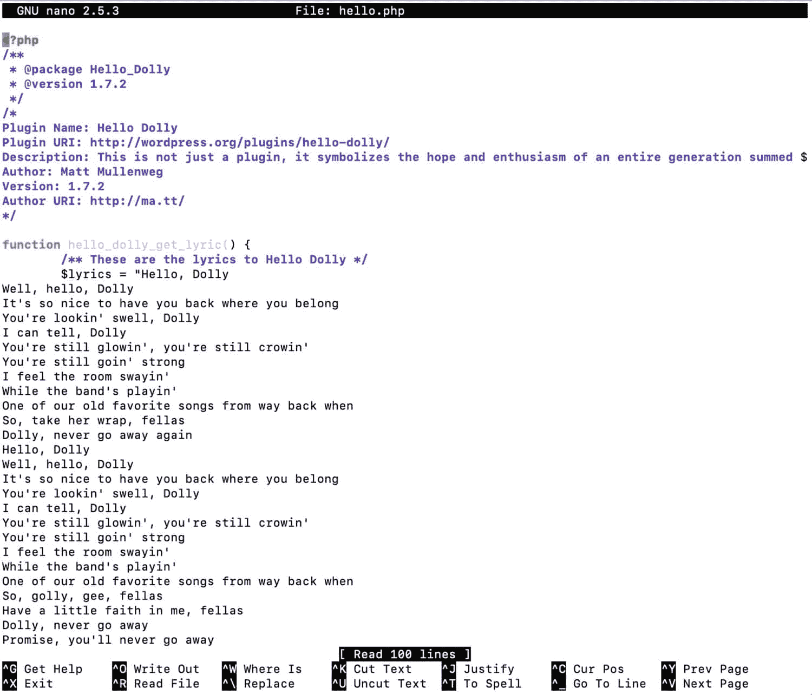

nano text editor


这使您可以直接从命令行编辑文件。

当心:撤销你的工作比使用[代码编辑器](https://kinsta.com/blog/free-html-editor/)或[版本控制系统](https://kinsta.com/blog/wordpress-version-control/)要难得多。如果你有信心这样做的话，只做一些小的改变。

要浏览文件，请使用光标键和屏幕底部列出的键盘快捷键。要退出文件，使用 **Ctrl-X** 返回终端。

### vim–用 Vim 文本编辑器编辑文件

[vim 文本编辑器](https://kinsta.com/blog/best-text-editors/#vim)的工作方式与 nano 编辑器非常相似，你可以使用`vim`命令来访问它。您选择使用哪个将取决于个人偏好:

```
vim filename.extension
```

### wget–下载文件

使用`wget`命令，您可以从互联网下载文件。它们将被下载到您当前所在的目录中。您需要包含要下载的文件的完整路径:

```
wget https://site.com/filename.ext
```

这将从 site.com 下载 filename.ext 文件，并将其存储在当前目录中。

## 终端命令

现在让我们来看看一些最常用的命令，以帮助您使用终端(或 PuTTY)界面。

### 清除–清除屏幕

如果你的屏幕感到混乱，只需输入`clear`来清除它，你会发现自己又回到了一个空白屏幕的顶部。如果您想要一个干净的工作环境，或者在公共场所想要隐藏您的工作，这很有用:

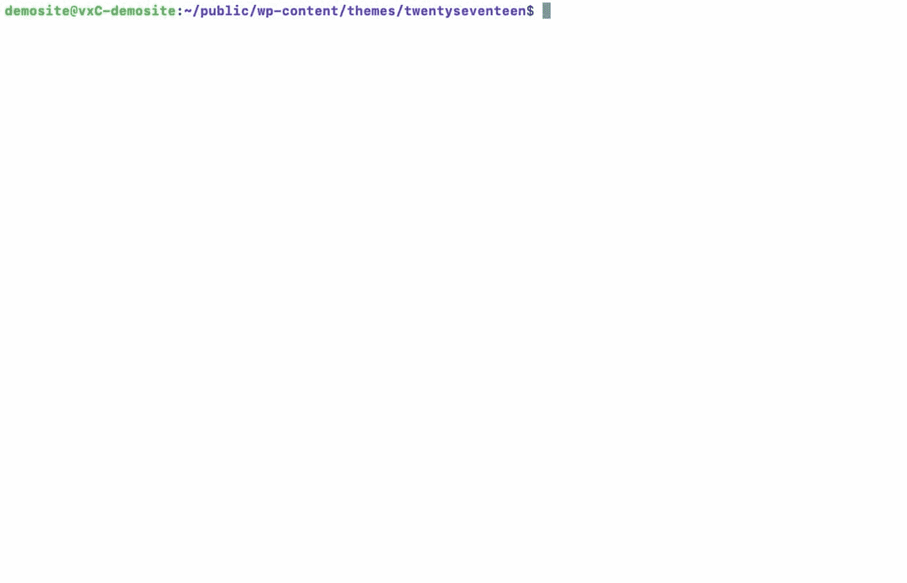

clear command


### 重置–从终端移除输出

`reset`命令将删除终端屏幕上的所有命令和输出，并清空屏幕。

### 历史记录–显示最近使用的 50 个命令

如果你不太确定你最近做了什么，并且想重复或撤销一些事情，使用`history`命令输出你最近使用的 50 个命令的列表。

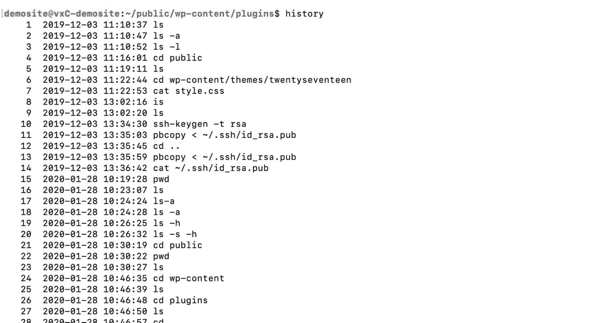

history command


### 屏幕–恢复 SSH 会话

Screen 是一个终端多路复用器，或者是一个工具，可以让您用多个虚拟会话来扩展单个终端会话。使用 Screen，您可以在运行不同任务的不同“窗口”之间切换，而不必打开到服务器的两个 SSH 连接。

比如可以在一个窗口使用`nano`，切换到另一个窗口使用`wget`下载大文件。此外，在屏幕会话中工作允许您在由于 SSH 连接或网络错误而重新连接后继续您的任务。对于 WordPress 用户来说，Screen 对于安全运行长时间的任务很有用，比如数据库导入和 regex 搜索，以及用 wp-cli 替换进程。

让我们仔细看看如何使用 Linux 屏幕。

#### 如何安装 Linux 屏幕

首先，您需要使用下面的命令来确保您的服务器上安装了 Screen。

```
screen --version
```

如果安装了 Screen，您会看到类似这样的内容。

```
[[email protected]](/cdn-cgi/l/email-protection):~$ screen --version

Screen version 4.03.01 (GNU) 28-Jun-15
```

否则，使用下面的命令安装屏幕。

##### Ubuntu 和 Debian

```
sudo apt update

sudo apt install screen
```

##### CentOS 和 Fedora

```
sudo yum install screen
```

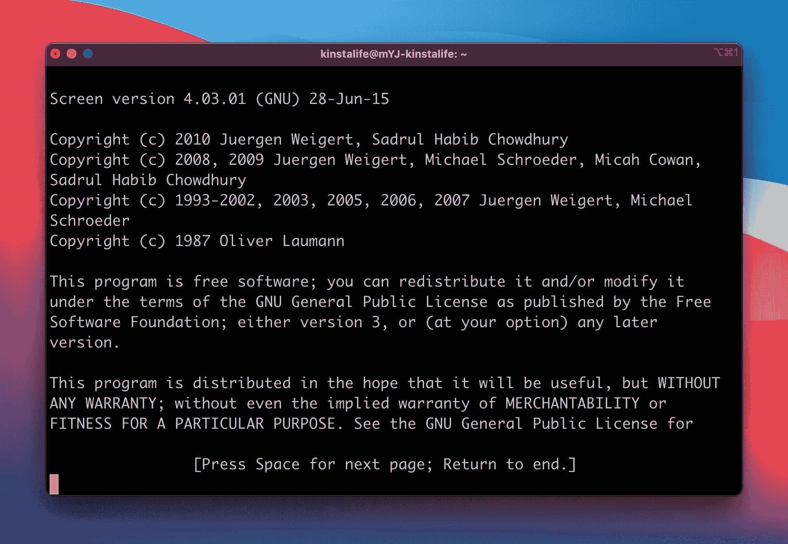

Start a new Screen session in Linux.


虽然您的终端看起来与以前没有任何不同，但您现在正处于屏幕会话中！现在，让我们尝试在屏幕会话中创建新窗口。

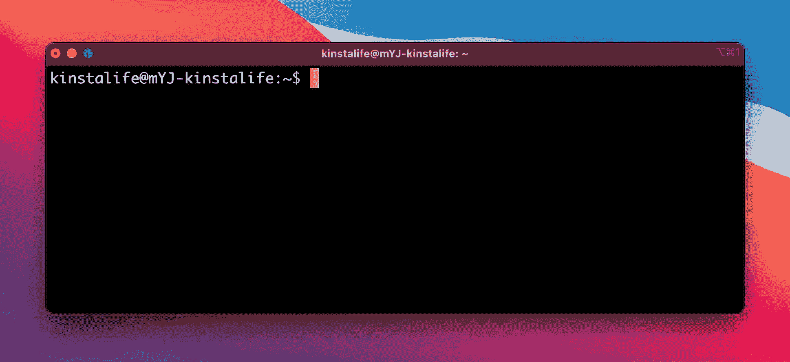

A new Screen session.


在 Linux 屏幕中，所有快捷键都以`Ctrl+A`开头。要创建一个新窗口，按下`Ctrl+A`，放开，然后按下`c`。要查看两个窗口，按下`Ctrl+A`，然后按下`”`。

#### 如何在屏幕窗口之间切换

下面的屏幕截图显示了两个窗口-0 和 1。在此窗口中，您可以使用箭头键在不同的窗口之间上下移动。在突出显示的窗口上按“Enter”或“Return”来选择它。如果知道具体窗口的编号，也可以用`Ctrl+A`和`number`来选择。

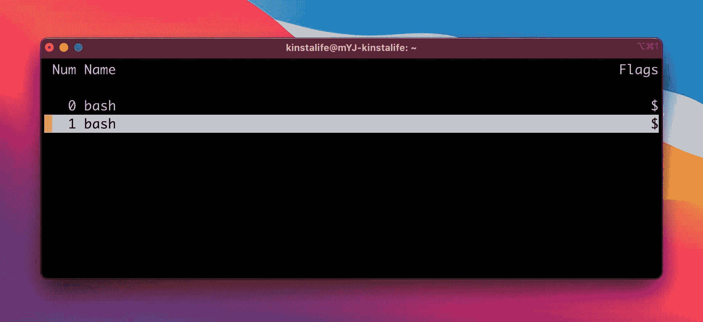

Two windows in Screen.


最后，您还可以使用下面的命令导航到下一个或上一个窗口。

*   **下一个窗口—**`Ctrl+A``n`
*   **上一窗口—**`Ctrl+A``p`

#### 如何退出屏幕会话

要退出屏幕会话，按`Ctrl+D`。终端将显示“[屏幕正在终止]”–这表示屏幕会话不再处于活动状态。

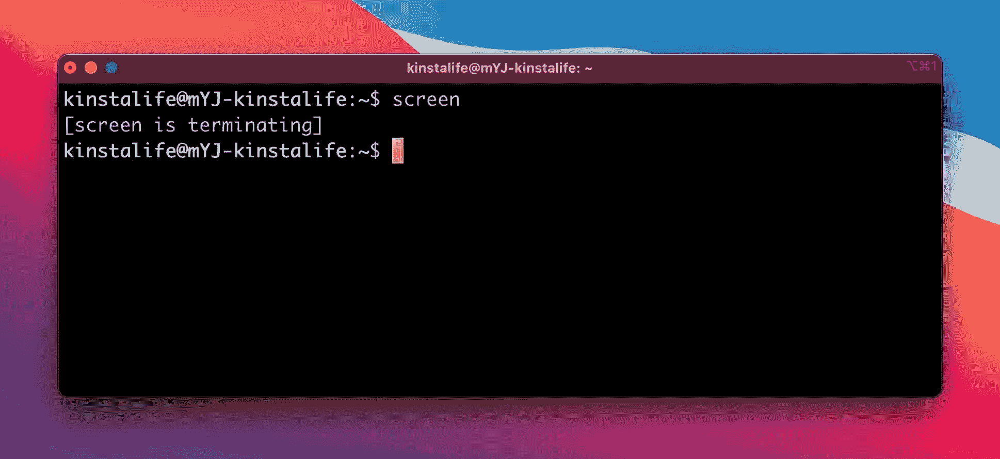

Terminate the Screen session.


#### 如何管理多个 Linux 屏幕会话

Screen 最强大的特性之一是能够使用多个屏幕会话。例如，你可以在一个屏幕上运行数据库上的[搜索和替换](https://kinsta.com/knowledgebase/wordpress-search-and-replace/)任务，一个屏幕用于浏览 WordPress 文件系统，另一个屏幕用于更新 wp-cli 中的插件。最重要的是，您可以根据需要分离和恢复屏幕会话。这意味着，即使失去了与服务器的连接，您也可以恢复漫长的数据库导入过程。

在我们继续之前，如果适用，使用`Ctrl+D`退出您现有的屏幕会话。终止屏幕会话后，使用下面的命令创建一个新会话。请注意该命令如何让您为会话设置唯一的名称。请随意用您喜欢的任何内容替换“会话 1”。

```
screen -S session1
```

创建新会话后，使用`screen -ls`命令列出所有活动屏幕会话。在下面的截图中，您可以看到由上面的命令创建的会话`session1`。

#### 如何使用 Linux 屏幕

安装屏幕后，使用`screen`命令启动新的屏幕会话。你应该会看到一些介绍性的文字，比如下面的截图。按键盘上的“回车”或“回车键”完成屏幕初始化。

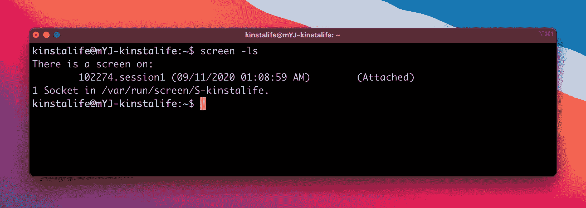

List Screen sessions in the terminal.


#### 如何分离 Linux 屏幕

当您使用`Ctrl+D`退出屏幕会话时，它会完全终止会话。如果您想让会话在后台运行，而您在做其他事情，该怎么办？这就是分离的由来。当您分离屏幕会话时，它会继续在后台运行。分离对于在后台保持长时间运行的进程(如数据库导入和弹性搜索索引)非常有用。

要分离屏幕会话，只需按下`Ctrl+A`，然后按下`d`。如果你在分离后运行`screen -ls`，你会看到屏幕会话的“(分离)”参数。

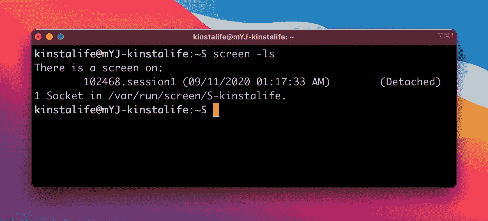

A detached Screen session.


分离屏幕会话后，您可以创建另一个屏幕。

```
screen -S session2
```

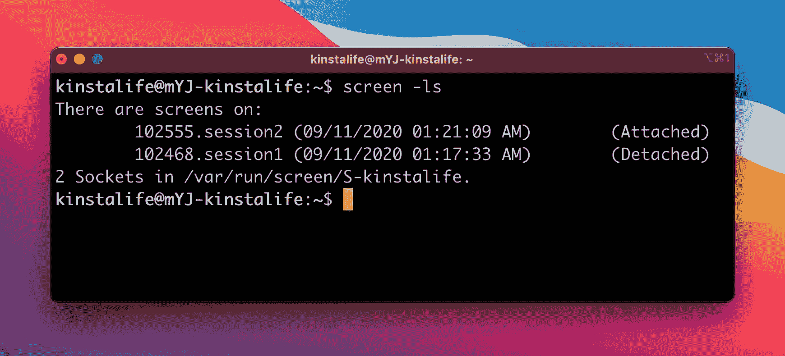

Multiple Screen sessions.


#### 如何恢复 Linux 屏幕

要恢复一个分离的 Linux 屏幕，使用下面的命令。请确保将“session1”替换为您要恢复的会话的名称。

```
screen -x session1
```

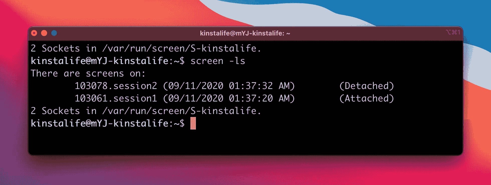

Resume a Linux screen.


在下面的屏幕截图中，您可以看到“会话 1”现在已附加，“会话 2”已分离。

屏幕是终端中多任务处理的强大工具。它允许您为不同的任务运行多个不同的环境，而不必建立多个 SSH 连接。如果你在你的 WordPress 站点上运行一个时间密集型的过程，我们推荐使用 Screen。

## 通过 SSH 工作时的其他有用命令

下面的命令不在上面的标题下，但是你可能会发现它们对通过 SSH 使用你的 WordPress 站点很有用。

### netstat–显示网络连接

键入`netstat`命令，您将看到网络连接和状态的详细信息:

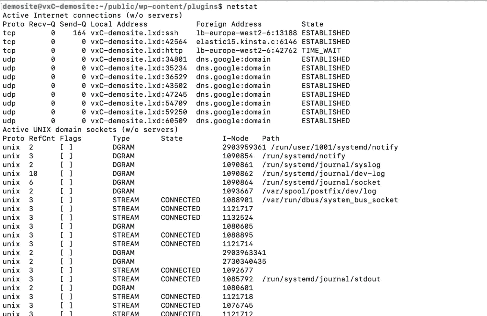

netstat command


### 退出–退出远程服务器

当你用你的远程 [WordPress 站点](https://kinsta.com/knowledgebase/what-is-wordpress/)完成工作后，键入`exit`命令退出服务器并返回到你的本地机器。

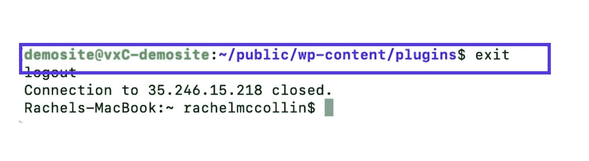

exit command


您应该在完成工作后一直这样做，这样其他人就不能通过 SSH 访问您的服务器。

[SSH is a secure protocol for accessing files on your WordPress site. Here's a list of the 20+ best commands that will make your #devlife so much easier! Check them out 💪🏅Click to Tweet](https://twitter.com/intent/tweet?url=https%3A%2F%2Fbit.ly%2F3dPoo1i&via=kinsta&text=SSH+is+a+secure+protocol+for+accessing+files+on+your+WordPress+site.+Here%27s+a+list+of+the+20%2B+best+commands+that+will+make+your+%23devlife+so+much+easier%21+Check+them+out+%F0%9F%92%AA%F0%9F%8F%85&hashtags=webdev%2Csecurity)

## 摘要

能够[通过 SSH](https://kinsta.com/blog/how-to-use-ssh/) 访问你的 WordPress 站点给了你一个安全和方便的方法来处理你站点上的文件，而不需要打开 [FTP 客户端](https://kinsta.com/blog/best-ftp-clients/)或者网络浏览器。

感谢这里列出的命令，你应该能够通过 SSH 完成你需要在 WordPress 中完成的大部分任务，并且更快地完成更多的工作。

* * *

让你所有的[应用程序](https://kinsta.com/application-hosting/)、[数据库](https://kinsta.com/database-hosting/)和 [WordPress 网站](https://kinsta.com/wordpress-hosting/)在线并在一个屋檐下。我们功能丰富的高性能云平台包括:

*   在 MyKinsta 仪表盘中轻松设置和管理
*   24/7 专家支持
*   最好的谷歌云平台硬件和网络，由 Kubernetes 提供最大的可扩展性
*   面向速度和安全性的企业级 Cloudflare 集成
*   全球受众覆盖全球多达 35 个数据中心和 275 多个 pop

在第一个月使用托管的[应用程序或托管](https://kinsta.com/application-hosting/)的[数据库，您可以享受 20 美元的优惠，亲自测试一下。探索我们的](https://kinsta.com/database-hosting/)[计划](https://kinsta.com/plans/)或[与销售人员交谈](https://kinsta.com/contact-us/)以找到最适合您的方式。