# 开发人员的 12 个最佳代码审查工具(2022 版)

> 原文：<https://kinsta.com/blog/code-review-tools/>

代码审查是软件开发过程的一部分，它包括测试源代码以在早期识别错误。代码评审过程通常在与代码库合并之前进行。

有效的代码审查通过在软件开发过程的早期阶段提高代码质量来防止 bug 和错误进入您的项目。

在这篇文章中，我们将解释什么是代码评审，并探索帮助组织进行代码评审过程的流行的代码评审工具。

## 代码审查流程是什么？

代码评审过程的主要目标是评估任何新代码的缺陷、错误和组织设定的质量标准。代码审查过程不应该只包含单方面的反馈。因此，代码评审过程的一个无形的好处是集体团队提高了编码技能。

如果您想在您的组织中启动一个代码评审过程，您应该首先决定谁将[评审代码](https://kinsta.com/blog/free-html-editor/)。如果你属于一个小团队，你可以指派团队领导来评审所有的代码。在有多个评审人员的大型团队中，您可以启用一个过程，在这个过程中，根据工作量将每个代码评审分配给有经验的开发人员。

您接下来要考虑的是决定提交代码评审请求的时间表、轮次和最低要求。

最后要考虑的是在代码评审过程中应该如何给出反馈。确保你强调了代码的积极方面，同时针对缺点提出了替代方案。

[您的反馈](https://kinsta.com/blog/wp-feedback-wordpress-plugin/)应该足够有建设性，以鼓励开发人员理解您的观点，并在必要时发起对话。

Keep your feedback informative

代码审查很容易陷入僵局，导致效率降低，甚至适得其反。

[Don't let bugs and errors affect the hard work you've done on your project 🐛 Find the best code review tools with this guide ⤵️Click to Tweet](https://twitter.com/intent/tweet?url=https%3A%2F%2Fkinsta.com%2Fblog%2Fcode-review-tools%2F&via=kinsta&text=Don%27t+let+bugs+and+errors+affect+the+hard+work+you%27ve+done+on+your+project+%F0%9F%90%9B+Find+the+best+code+review+tools+with+this+guide+%E2%A4%B5%EF%B8%8F&hashtags=codereview%2Ccoding)

## 为什么代码审查至关重要？

代码审查过程至关重要，因为它从来都不是学校正式课程的一部分。你可能会学到一门[编程语言](https://kinsta.com/blog/php-tutorials/)和[项目管理](https://kinsta.com/blog/trello-vs-asana/)的细微差别，但是代码评审是一个随着组织的成长而发展的过程。

出于以下原因，代码审查至关重要:

*   确保你的代码没有错误。
*   最小化你遇到问题的机会。
*   确认新代码符合指南。
*   提高新代码的效率。

代码评审进一步提高了其他团队成员的专业技能。由于高级开发人员通常会进行代码评审，初级开发人员可能会利用这些反馈来改进他们自己的编码。
T3】

## 如何执行代码审查？

有四种方法进行代码评审。

### 肩扛式代码审查

肩扛式代码审查是在开发人员的工作站上完成的，在那里，一个有经验的团队成员浏览新代码，通过对话提供建议。这是最简单的代码审查方法，并且不需要预先定义的结构。

这样的代码评审可能在今天仍然非正式地进行，同时可能有正式的代码评审过程。肩扛式代码审查传统上是亲自完成的，而[分布式团队](https://kinsta.com/blog/working-remotely/)也可以通过[协作工具](https://kinsta.com/blog/saas-products/)遵循这种方法。

### 电子邮件传递

虽然间接代码评审是评审新代码的好方法，但是地理上分散的团队传统上依赖电子邮件进行代码评审。

在这个代码审查过程中，开发人员通常通过自动通知的[版本控制系统](https://kinsta.com/blog/wordpress-version-control/)向整个开发团队发送不同的变更。这封电子邮件启动了关于变更的对话，团队成员可以请求进一步的变更、指出错误或要求澄清。

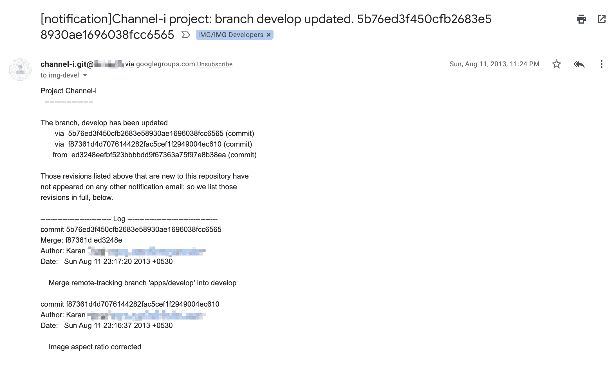

Email Pass Around through Google Groups on each new push

在早期，电子邮件是主要的交流方式，因为它的多功能性[开源组织经常维护一个公共邮件列表，它也可以作为讨论和提供代码反馈的媒介。](https://kinsta.com/blog/gmail-add-ons/)

随着代码评审工具的出现，这些邮件列表仍然存在，但主要是为了公告和讨论。

### 结对编程

Pair Programming can be inefficient sometimes

结对编程是一个持续的代码审查过程。两个开发人员坐在一个工作站上，但是只有[他们中的一个主动编码](https://kinsta.com/knowledgebase/edit-wordpress-code/)，而另一个提供实时反馈。

虽然它可能是检查新代码和培训开发人员的好工具，但由于其耗时的本质，它可能被证明是低效的。这一过程限制了评审者在此期间进行任何其他生产性工作。

### 工具辅助的

工具辅助的代码审查过程包括使用专门的工具来促进代码审查过程。工具通常可以帮助您完成以下任务:

*   在更改中组织和显示更新的文件。
*   促进评审人员和开发人员之间的对话。
*   用度量标准评估代码评审过程的有效性。

虽然这些是代码评审工具的广泛需求，但是现代工具可能会提供一些其他的功能。在这篇文章的后面，我们将探索一系列代码审查工具。

## 为什么应该使用代码评审工具？

代码审查过程的主要结果是提高效率。虽然这些传统的代码审查方法在过去已经奏效，但是如果你没有转换到代码审查工具，你可能会失去效率。代码评审工具自动化了代码评审的过程，因此评审者只关注代码。

代码评审工具与您的开发周期集成，在新代码合并到主代码库之前启动代码评审。您可以选择与您的技术体系兼容的工具，将其无缝集成到您的工作流程中。

例如，如果您使用 [Git 进行代码管理](https://kinsta.com/knowledgebase/git-vs-github/)，使用 TravisCI 进行持续集成，请确保您选择了支持这些技术的工具，以便能够适应开发过程。

软件开发中有两种类型的代码测试:动态和静态。

动态分析包括检查代码是否遵循一组规则和运行单元测试，通常由预定义的脚本执行。静态代码测试是在开发人员创建新代码并将其合并到当前代码中之后进行的。

现在让我们深入一些最流行的代码审查工具！

## 仔细看看 12 个强大的代码审查工具

在这一节中，我们回顾最流行的静态代码评审工具。

### 1.审查委员会

评审委员会是一个基于网络的开源代码评审工具。为了测试这个代码审查工具，你可以在[的网站上探索演示](https://demo.reviewboard.org/r/)，或者[下载](https://www.reviewboard.org/downloads/)然后[在你的服务器上安装](https://www.reviewboard.org/docs/manual/3.0/admin/installation/linux/)这个软件。

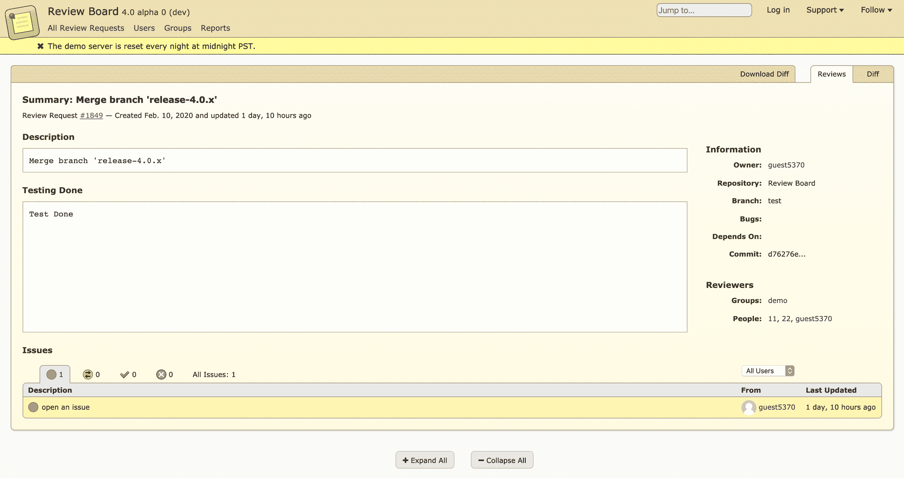

Review Board Overview

Python 编程语言及其安装程序、 [MySQL](https://kinsta.com/knowledgebase/what-is-mysql/) 或 [PostgreSQL](https://kinsta.com/knowledgebase/what-is-postgresql/) 作为数据库以及 web 服务器是在服务器上运行 Review Board 的先决条件。

您可以将 Review Board 与各种版本控制系统集成在一起，包括 [Git](https://kinsta.com/help/git/) 、Mercurial、CVS、Subversion 和 Perforce。你也可以将评论板链接到[亚马逊 S3](https://kinsta.com/knowledgebase/wordpress-amazon-s3/) ，直接在工具中存储截图。

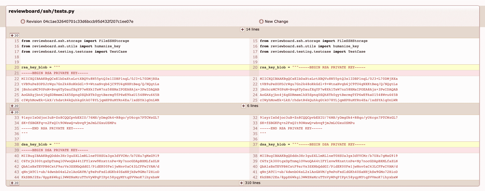

Review Board Changes Overview

评审委员会允许您根据自己的需求执行提交前和提交后的代码评审。如果你还没有集成一个[版本控制系统](https://kinsta.com/blog/wordpress-version-control/)，你可以使用一个 diff 文件将代码变更上传到工具中进行审查。

还提供了代码变化的图形比较。除了代码评审，评审委员会还允许你进行文档评审。

Review Board 的第一个版本出现在十多年前，但它仍在积极开发中。因此，Review Board 社区在过去几年中不断发展壮大，如果您在使用该工具时遇到任何问题，都有可能找到支持。

Review Board 是一个简单的代码审查工具，您可以将其托管在您的服务器上。如果您不希望在公共网站上托管您的代码，您应该尝试一下。

### 2.严酷的考验

[Crucible](https://www.atlassian.com/software/crucible) 是 Atlassian 的一款协作式代码评审工具。它是一个商业工具套件，允许您审查代码，讨论计划变更，并识别大量版本控制系统中的错误。

Crucible 提供两种支付方案，一种针对小团队，另一种针对企业。对于一个小团队来说，您需要为限于五个用户的无限存储库一次性支付 10 美元。对于大型团队来说，10 个用户和无限的存储库的费用从 1100 美元开始。

这两个计划都提供 30 天的免费试用，不需要信用卡。

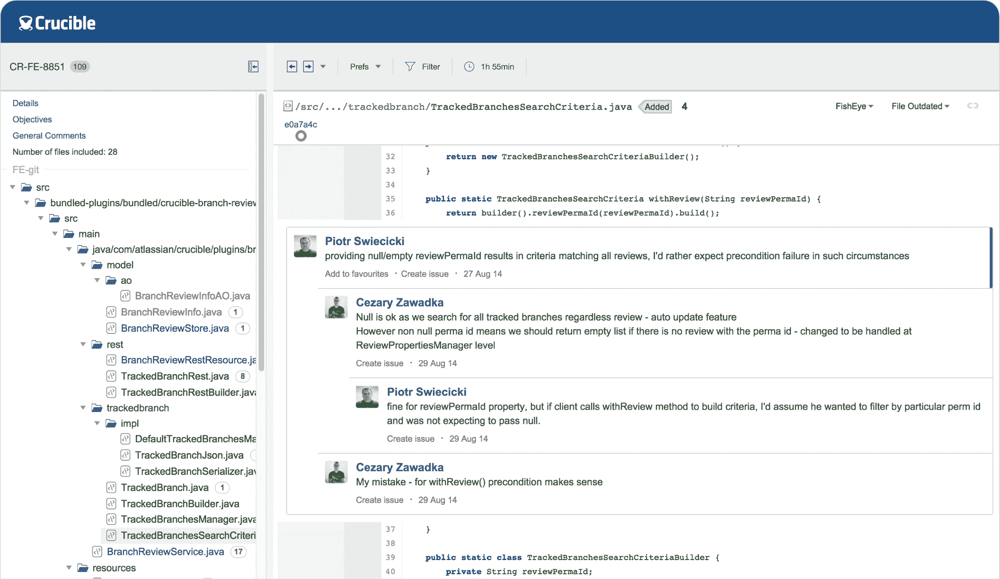

Crucible Code Review Tool ([Source](https://www.atlassian.com/software/crucible))

与 Review Board 类似，Crucible 支持大量版本控制系统——SVN、Git、Mercurial、CVS 和 Perforce。它的主要功能是使您能够执行代码审查。除了对代码的整体注释之外，它还允许您在 diff 视图中进行内联注释，以准确定位您具体指的是什么。

Crucible 与 Atlassian 的其他企业产品集成良好，如 Confluence 和 Enterprise [BitBucket](https://kinsta.com/blog/bitbucket-vs-github/) 。然而，你可能会通过与[吉拉](https://www.atlassian.com/software/jira)，亚特兰蒂斯的问题，和项目跟踪一起使用，从坩埚中获得最大的利益。它允许您对合并的代码执行提交前的审查和审计。

### 3.开源代码库

如果您使用 [GitHub](https://github.com/features/code-review/) 在云上维护您的 Git 仓库，您可能已经使用了 forks 和 pull 请求来审查代码。如果你不知道 GitHub 是什么，这里有一个[GitHub](https://kinsta.com/knowledgebase/what-is-github/)和[Git 和 GitHub](https://kinsta.com/knowledgebase/git-vs-github/) 的区别的初学者指南。

## 注册订阅时事通讯

### 想知道我们是怎么让流量增长超过 1000%的吗？

加入 20，000 多名获得我们每周时事通讯和内部消息的人的行列吧！

[Subscribe Now](#newsletter)

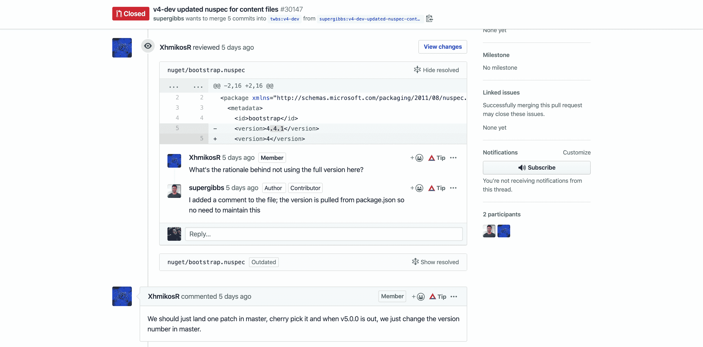

GitHub Code Review Tool within a Pull Request

GitHub 在其 pull 请求中有一个内置的[代码审查工具](https://github.com/features/code-review/)。代码审查工具与 GitHub 的核心服务捆绑在一起，为[开发者提供免费的计划](https://github.com/pricing)。GitHub 的免费计划将私有存储库中的用户数量限制为三个。付费计划每月起价 7 美元。

GitHub 允许能够访问代码库的评审者将自己分配给 pull 请求并完成评审。提交了拉取请求的开发者也可以请求来自管理员的审查。

除了对整体拉请求的讨论之外，您还能够分析差异、内联注释以及检查变更的历史。代码审查工具还允许您通过 web 界面解决简单的 Git 冲突。GitHub 甚至允许你通过其 marketplace 与[额外的评审工具](https://github.com/marketplace/category/code-review)集成，以创建一个更健壮的流程。

如果你已经在这个平台上，GitHub 代码审查工具是一个很好的工具。它不需要任何额外的安装或配置。GitHub 代码审查工具的主要问题是它只支持 GitHub 上托管的 Git 库。如果你正在寻找一个类似的代码审查工具，可以下载并托管在你的服务器上，你可以[试试 GitLab](https://about.gitlab.com/install/) 。

### 4.法布里克特法布里克特法布里克特法布里克特法布里克特法布里克特法布里克特法布里克特法布里克特法布里克特法布里克特法布里克

[Phabricator](https://www.phacility.com/phabricator/) 是一个由 Phacility 提供的[开源工具](https://github.com/phacility/phabricator)的列表，帮助你审查代码。虽然您可以在您的服务器上下载并安装代码审查工具套件，但是 Phacility 还提供了 Phabricator 的云托管版本。

如果您将它安装在服务器上，就没有任何限制。然而，你将被收取每个用户每月 20 美元(上限为每月 1000 美元)，其中包括支持。要尝试一下，你可以选择 30 天免费试用。

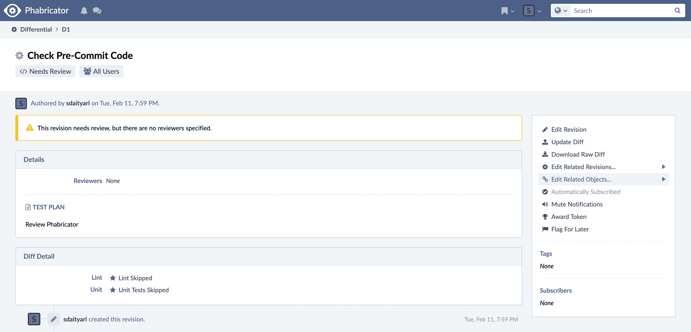

Phabricator

Phabricator 支持三种最流行的[版本控制系统](https://kinsta.com/blog/wordpress-version-control/)——Git、Mercurial 和 SVN。它可以管理本地存储库，以及跟踪外部托管的存储库。您也可以将其扩展到多台服务器。

#### 超越传统的代码审查工具

Phabricator 提供了一个与您的团队成员进行对话的详细平台。您可以对新的团队成员进行提交前评审，或者对新提交的代码进行评审。您也可以对合并后的代码进行审查，Phabricator 称这个过程为“审计”。下面是 Phabricator 上的一个评论和一个审计的比较。

Phabricator 的附加工具在整个软件开发周期中为您提供帮助。例如，它为你提供了一个内置的跟踪器来管理 bug 和特性。你也可以通过[功能](https://www.phacility.com/phabricator/phriction/)在工具中为你的软件创建一个 wiki 。为了将该工具与单元测试集成，您可以使用 Phabricator 的 [CLI 工具](https://www.phacility.com/phabricator/arcanist/)。您也可以通过 Phabricator 的 API 在其上构建应用程序。

总之，Phabricator 为您提供了大量的特性，帮助您提高开发过程的效率。如果您的项目处于早期阶段，选择这个工具是完全有意义的。如果您没有在您的服务器上设置它的专业知识，您应该选择该工具的托管版本。

### 5.合作者

SmartBear 的 Collaborator 是一个开发团队的对等代码和文档审查工具。除了源代码评审，Collaborator 还支持团队评审设计文档。一个 5 用户许可包的价格是每年 535 美元。根据您的业务需求，可以免费试用。

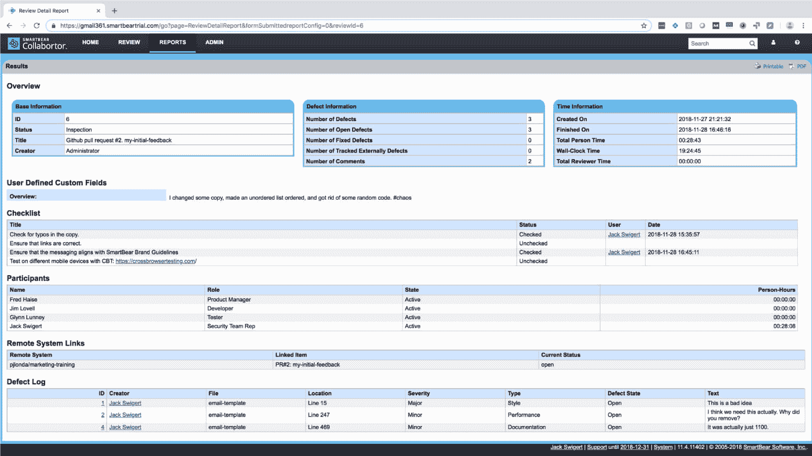

Collaborator Review Source

Collaborator 支持大量版本控制系统，如 Subversion、 [Git](https://kinsta.com/help/git/) 、CVS、Mercurial、Perforce 和 TFS。它很好地集成了流行的项目管理工具和 ide，如吉拉、Eclipse 和 Visual Studio。

这个工具还支持报告和分析与您的代码评审过程相关的关键指标。此外，Collaborator 还有助于审计管理和 bug 跟踪。如果您的技术堆栈涉及企业软件，并且您需要支持来设置您的代码审查过程，您应该让 Collaborator 试试。

### 6.代码场景

[CodeScene](https://codescene.io/) 是一款超越传统静态代码分析的代码评审工具。它通过包含一个时间维度来分析您的代码库的演变，从而执行行为代码分析。CodeScene 有两种形式:基于云的[解决方案和本地解决方案](https://kinsta.com/blog/cloud-market-share/#evolution-of-the-saas-market)。

CodeScene 的基于云的计划对托管在 GitHub 上的公共存储库免费开放。对于多达 10 个私人存储库和 10 个成员的团队来说，CodeScene 每月花费 99 欧元(约 115 美元)。CodeScene 的内部安装费用为每个开发人员每月 15 欧元(约 17 美元)。

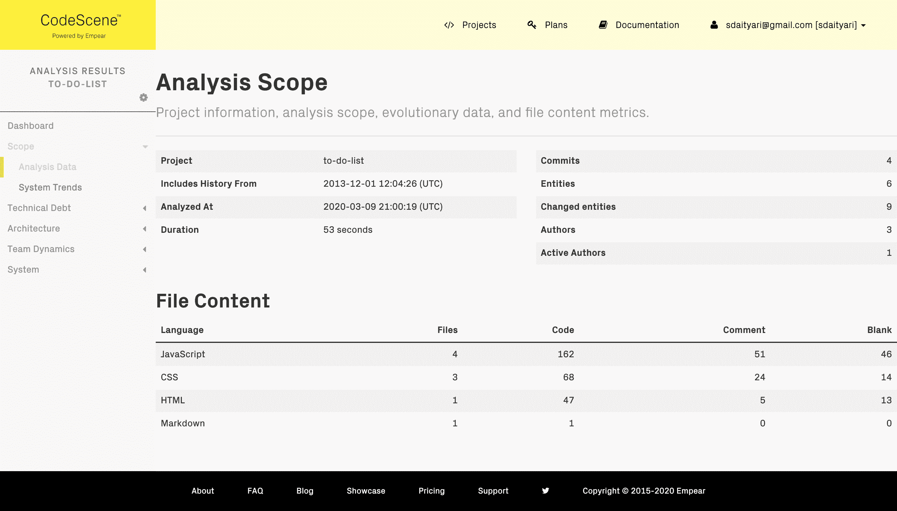

CodeScene Code Review Tool Analysis

CodeScene 处理您的版本控制历史以提供代码可视化。除此之外，它还应用机器学习算法来识别社会模式和代码中隐藏的风险。

需要为您的客户站点提供一个非常快速、安全且对开发人员友好的托管服务吗？Kinsta 是为 WordPress 开发者设计的，提供了大量的工具和强大的仪表板。[查看我们的计划](https://kinsta.com/plans/?in-article-cta)

通过版本控制历史，CodeScene 描述了每个团队成员，以绘制出他们的知识库并创建团队间的依赖关系。它还通过识别经历最多开发活动的文件，引入了存储库中热点的概念。这些热点需要高度关注。

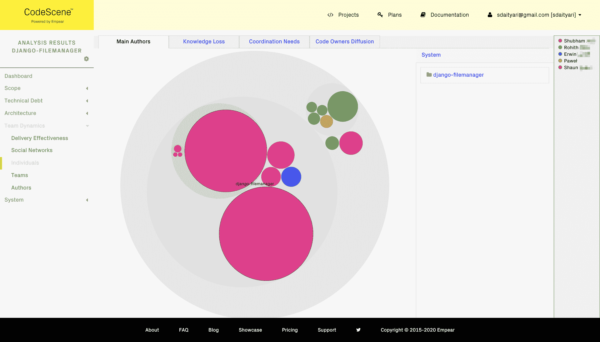

CodeScene Knowledge Maps

如果您正在寻找一种超越传统的对话式代码审查工具的工具，请确保查看 CodeScene 的免费试用版。要了解 CodeScene 的行为代码分析背后的底层逻辑，请查看关于 [CodeScene 的用例及角色](https://empear.com/whitepaper/)的白皮书。

### 7.视觉专家

[Visual Expert](https://www.visual-expert.com/) 是一款专注于[数据库代码](https://kinsta.com/knowledgebase/wordpress-database/)的代码评审企业解决方案。它只支持三个平台:PowerBuilder、 [SQL Server](https://kinsta.com/knowledgebase/what-is-mysql/) 和 [Oracle PL/SQL](https://kinsta.com/blog/mariadb-vs-mysql/#oracle) 。如果您使用任何其他 DBMS，您将无法集成 Visual Expert 进行代码审查。

免费试用是可用的，但你需要发送一个请求，以获得其定价的报价。

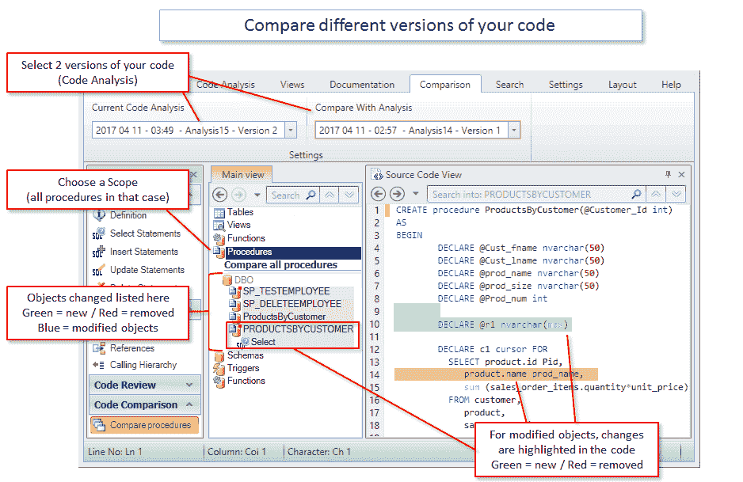

Visual Expert Code Review Tool Overview ([Source](https://www.visual-expert.com/))

除了传统的代码审查之外，Visual Expert 还会分析代码中的每个更改，以预测由于这些更改而导致的任何性能问题。该工具也可以从代码中自动生成完整的应用程序文档。

如果您正在使用 PowerBuilder、SQL Server 或 Oracle PL/SQL，并且想要一个专门的代码审查工具来满足您的需求，您应该试用 Visual Expert(这里有一个关于构建高效 WordPress 查询的指南)。

### 8.格利塔

Gerrit 是一个免费开源的基于网络的代码审查工具，用于 T2 Git 库 T3，用 Java 编写。要运行 Gerrit，您需要下载源代码并在 Java 中运行它。下面是 Gerrit 独立版本的[安装过程。](https://gerrit-documentation.storage.googleapis.com/Documentation/3.1.3/install.html)

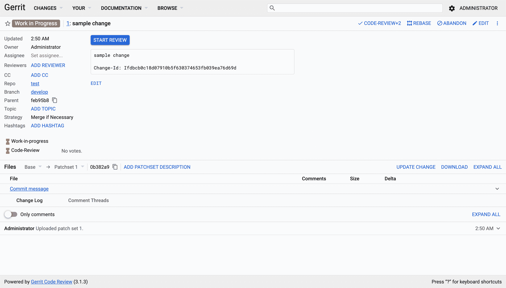

Gerrit Code Review Tool

Gerrit 将 bug 跟踪器和评审工具的功能合二为一。在评审过程中，变更并排显示在一个统一的 diff 中，有可能为添加的每一行代码发起一次对话。这个工具作为[开发者](https://kinsta.com/blog/wordpress-developer-salary/)和中央存储库之间的中间步骤。此外，Gerrit 还整合了一个[投票系统](https://kinsta.com/blog/wordpress-forum-plugins/)。

如果您拥有安装和配置 Gerrit 的技术专长，并且您正在寻找一个免费的代码审查工具，那么它应该是您项目的理想解决方案。

### 9.罗德码

Rhodecode 是一个基于网络的工具，可以帮助你进行代码评审。它支持三种版本控制系统:Mercurial、Git 和 Subversion。基于云的 Rhode 版本起价为每个用户每月 8 美元，而本地解决方案的价格为每个用户每年 75 美元。虽然是企业软件，但是它的[社区版](https://rhodecode.com/open-source)是免费开源的，可以免费下载编译。

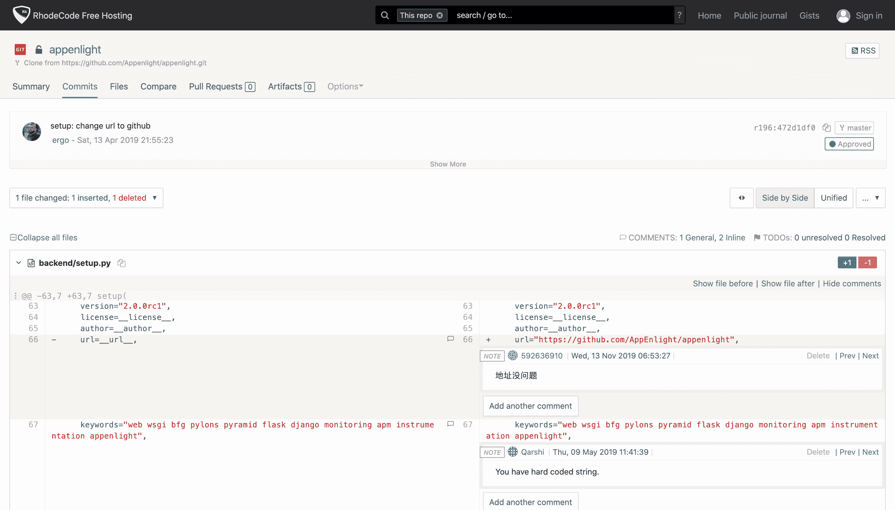

Rhodecode

Rhodecode 使团队能够通过迭代、对话式的代码评审来有效地协作，从而提高代码质量。这个工具额外为[安全开发](https://kinsta.com/blog/how-to-use-ssh/)提供了一层权限管理。

此外，可视化的 changelog 有助于您在项目的各个分支之间导航。一个[在线代码编辑器](https://kinsta.com/blog/free-html-editor/)也被提供用于通过网络界面进行小的修改。

Rhodecode 与您现有的项目无缝集成，这使得它成为寻找基于 web 的代码评审工具的人的绝佳选择。因此，社区版对于那些寻找免费和可靠的代码审查工具的技术专家来说是理想的。

### 10.韦拉码

Veracode 提供了一套代码审查工具，让您能够自动化测试、加速开发、整合补救流程，并提高项目的效率。Veracode 的代码审查工具套件在市场上被称为[，它是一种安全解决方案](https://kinsta.com/blog/cloud-security/)，可以搜索系统中的漏洞。它们提供了一组两个代码审查工具:

*   静态分析(Static Analysis):一种工具，使开发人员能够识别并修复他们代码中的安全缺陷。
*   [软件组成分析](https://www.veracode.com/products/software-composition-analysis):管理代码中缺陷的补救和缓解过程的工具。

Veracode Overview ([Source](https://www.veracode.com/))

代码审查是软件组成分析的一部分，你可以在完全投入之前选择 Veracode 的演示。这里是请求[报价](https://info.veracode.com/request-quote.html)的链接。

### 11.可回顾的

[Reviewable](https://reviewable.io/) 是针对 [GitHub pull 请求](https://kinsta.com/knowledgebase/git-vs-github/#the-difference-between-git-and-github)的代码评审工具。开源库是免费的，私有库的计划是 10 个用户每月 39 美元起。由于该工具与 GitHub 集成在一起，您可以使用您的 GitHub 帐户登录并开始使用。

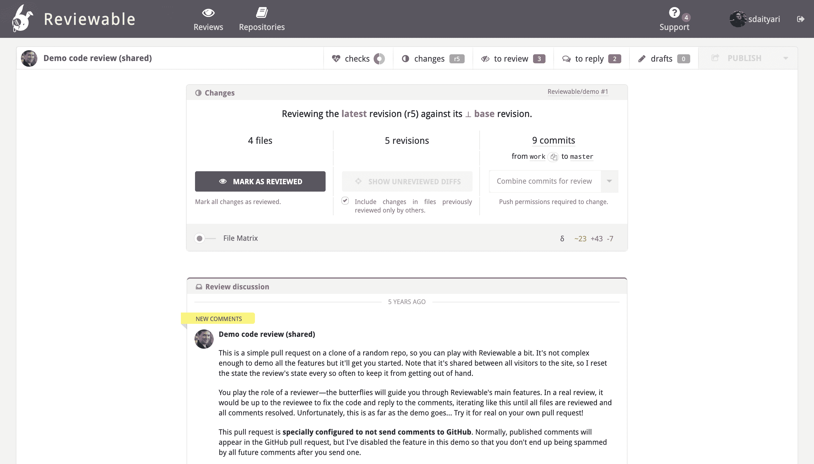

Reviewable Code Review Tool Overview

如果您想查看 Reviewable 上的典型评论，您可以前往[查看演示评论](https://reviewable.io/reviews/Reviewable/demo/1)。

关于 Reviewable 的一个有趣的事情是，它克服了 GitHub 的 pull requests 特性中代码审查的一些缺点。例如，一旦开发人员更改代码行，GitHub 会自动隐藏代码行上的注释，因为 GitHub 认为问题已经解决。但是，在现实中，事情可能会有所不同。

此外，GitHub 显示文件差异的行数相对较少。

如果你正在寻找一个与 GitHub 紧密相关的工具，但是除了 pull 请求之外，你还想要更多的特性，那么 Reviewable 应该是你的首选工具。

### 12.Trac 同行评审

如果你使用 Subversion，Trac 的[同行评审插件提供了一个免费的开源选项来对你的项目进行代码评审。同行评审插件集成到了](https://trac-hacks.org/wiki/PeerReviewPlugin) [Trac 开源项目](https://trac.edgewall.org/wiki/WikiStart)，这是一个用于开发项目的 wiki 和问题跟踪系统。

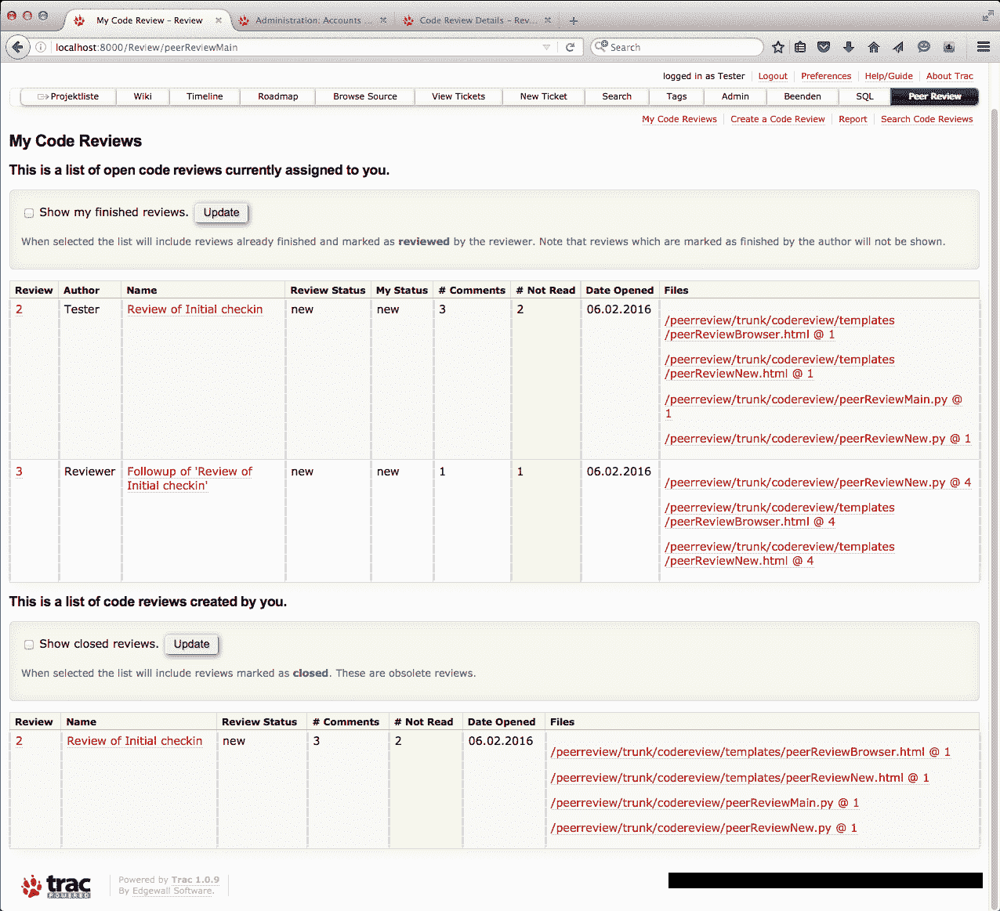

Peer Review Plugin for Trac Overview ([Source](https://trac-hacks.org/wiki/PeerReviewPlugin))

Trac 将 wiki 和问题跟踪器与您的评论相集成，以提供端到端的解决方案。虽然比较更改和对话的基本功能是可用的，但该插件允许您为您的项目设计定制的工作流。

例如，您可以决定要在触发器上完成的任务，如提交变更或在代码评审中批准。您还可以为您的项目创建[自定义报告](https://trac-hacks.org/wiki/PeerReviewPlugin/Reports)。

如果您还在寻找一个 wiki 文档和一个问题跟踪器来管理您的项目路线图，Trac 应该为您提供一个很好的选择。

[Code review tools will keep your project free of bugs and errors ❌ Find the best one for your team with this guide 🚀Click to Tweet](https://twitter.com/intent/tweet?url=https%3A%2F%2Fkinsta.com%2Fblog%2Fcode-review-tools%2F&via=kinsta&text=Code+review+tools+will+keep+your+project+free+of+bugs+and+errors+%E2%9D%8C+Find+the+best+one+for+your+team+with+this+guide+%F0%9F%9A%80&hashtags=code%2Ccodereview)

## 摘要

当提到提高组织的效率时，代码审查过程起着关键的作用。具体来说，利用正确的代码审查工具可以帮助您在开发周期中消除冗余。

我们仔细研究了 2022 年最流行的代码审查工具，以下是我们的发现:

*   对于一个刚刚起步的小团队来说，[评审委员会](https://www.reviewboard.org/)是启动代码评审过程的好选择。
*   如果你正在寻找一个开源代码审查工具，试试看 [Gerrit](https://www.gerritcodereview.com/) 、 [Peer Review for Trac](https://trac-hacks.org/wiki/PeerReviewPlugin) 或[社区版的 Rhodocode](https://rhodecode.com/open-source) 。
*   你正在寻找一个相当容易使用的代码评审工具吗？你应该试试 Rhodecode。
*   如果你使用 Git 和 GitHub 来管理你的代码库，试试 GitHub 的内置代码审查编辑器。如果你想超越拉请求的基本特性，你应该查看一下[可审查的](https://reviewable.io/)。
*   您是否属于使用 Oracle、SQL Server 或 PowerBuilder 进行数据库代码管理的团队？你可以试试[可视化专家](https://www.visual-expert.com/)，一个专门研究数据库代码的代码评审工具。
*   如果你正在寻找企业解决方案，试试 Atlassian 的 [Crucible](https://www.atlassian.com/software/crucible) ，SmartBear 的[合作者](https://smartbear.com/product/collaborator/overview/)，或者， [Veracode](https://www.veracode.com/) 。
*   如果你想使用 ML 和 AI 超越代码审查进入行为分析，你应该看看 [CodeScene](https://codescene.io/) 。
*   如果你想要一个软件开发周期的完整解决方案，看看 [Phabricator](https://www.phacility.com/phabricator/) 的代码审查工具套件。

现在轮到你了:你用的是什么代码评审工具？为什么？在评论里告诉我们吧！

**建议阅读:**

*   [您应该关注的 13 种顶级脚本语言](https://kinsta.com/blog/scripting-languages/)
*   [学什么编程语言最好](https://kinsta.com/blog/best-programming-language-to-learn/)

* * *

让你所有的[应用程序](https://kinsta.com/application-hosting/)、[数据库](https://kinsta.com/database-hosting/)和 [WordPress 网站](https://kinsta.com/wordpress-hosting/)在线并在一个屋檐下。我们功能丰富的高性能云平台包括:

*   在 MyKinsta 仪表盘中轻松设置和管理
*   24/7 专家支持
*   最好的谷歌云平台硬件和网络，由 Kubernetes 提供最大的可扩展性
*   面向速度和安全性的企业级 Cloudflare 集成
*   全球受众覆盖全球多达 35 个数据中心和 275 多个 pop

在第一个月使用托管的[应用程序或托管](https://kinsta.com/application-hosting/)的[数据库，您可以享受 20 美元的优惠，亲自测试一下。探索我们的](https://kinsta.com/database-hosting/)[计划](https://kinsta.com/plans/)或[与销售人员交谈](https://kinsta.com/contact-us/)以找到最适合您的方式。