# 2022 年学习 PHP 的 27 个最佳教程(免费和付费资源)

> 原文：<https://kinsta.com/blog/php-tutorials/>

对于初学程序员和那些刚刚进入 WordPress 开发的人来说， [PHP](https://kinsta.com/blog/is-php-dead/) 是你可以开始的最好的地方之一。这是一种超级简单明了的语言，使其成为学习的[最佳编程语言之一，所以它相当容易上手，并且构成了在线开发的主干。另外，如果你想在 WordPress 后台工作，你肯定需要学习它。](https://kinsta.com/blog/best-programming-language-to-learn/)

但是如果你不想在昂贵的大学课程上花费几个月或几年呢？相反，你可以今天就迈出 web 开发的第一步。有数百个免费和付费的 PHP 教程可以帮助你深入学习，我们为你收集了 20 多个最好的教程。

这里有一些适合每个人的小东西，从老式的 DIY 文档到指导教程，再到带有游戏和练习的交互式课程，帮助您掌握技能。不管你的学习方法是什么，你都会找到合适的课程。

掌握 PHP 需要做大量的工作，但是只要有一点在线指导，你就可以练习你的技能，并且立刻开始编写你自己的代码。

## **为什么要学 PHP？**

PHP 是一种服务器端的 T2 脚本语言，主要用于创建动态网页。您将看到 PHP 在做一些事情，比如生成交互式内容、收集表单数据、向访问者发送信息以及验证用户。它也是 WordPress 及其插件的支柱，为 CMS 增加了各种独特的功能。你可以用 PHP 做几乎任何事情。

它通常也很容易掌握，是新开发人员的良好入门语言。如果你有编程背景，你应该从头到尾读一遍。但是，即使是完全的初学者也不会在 PHP 的来龙去脉中挣扎太多。

如果你正在钻研 WordPress 开发，PHP 是必须的。它需要修改 WordPress 或者编写主题和插件，它是整个 CMS 的核心。HTML、[、CSS](https://kinsta.com/blog/wordpress-css/) 和 JavaScript 也是需要研究的语言，但是没有一种像 PHP 一样是 WordPress 不可或缺的。

> 需要在这里大声喊出来。Kinsta 太神奇了，我用它做我的个人网站。支持是迅速和杰出的，他们的服务器是 WordPress 最快的。
> 
> <footer class="wp-block-kinsta-client-quote__footer">
> 
> 
> 
> <cite class="wp-block-kinsta-client-quote__cite">Phillip Stemann</cite></footer>

[View plans](https://kinsta.com/plans/)

学习 PHP 的最后一个理由:就像其他编程语言一样，它有一个巨大的社区和大量免费资源。这意味着你有很多地方可以寻求帮助、交流想法、下载免费软件或寻找有用的指南。

在这一点上，让我们深入这些 PHP 教程，你可以在网上找到。

[想开始做一名网站开发人员或用后端专业知识升级您的服务吗？学习 PHP 是你的下一步！查看这 25 个以上的免费和付费资源，找到最适合你的。📚🎓 点击推文](https://twitter.com/intent/tweet?url=https%3A%2F%2Fkinsta.com%2Fblog%2Fphp-tutorials%2F&via=kinsta&text=Want+to+get+started+as+a+web+dev+or+upgrade+your+services+with+backend+expertise%3F+Learn+PHP+as+your+next+step%21+Check+out+these+25%2B+resources%2C+both+free+and+paid%2C+to+find+the+best+one+for+you.%F0%9F%93%9A%F0%9F%8E%93&hashtags=php%2Cphptips)
【CTA】

## **15 大免费 PHP 初学者教程**

如果你负担不起付费课程，或者只是想尝试一下 PHP，看看你是否喜欢它，免费的 PHP 教程是一个很好的起点。免费并不总是意味着低质量，有很多免费教程和一些付费课程一样好(甚至更好)。许多开发者说免费的在线资源非常好，你甚至不需要购买高级课程！

这些网站都提供了学习 PHP 的独特方式。从这里开始，如果你需要更多的指导，你可以继续下面的付费 PHP 教程。

### **1。官方 PHP 手册**

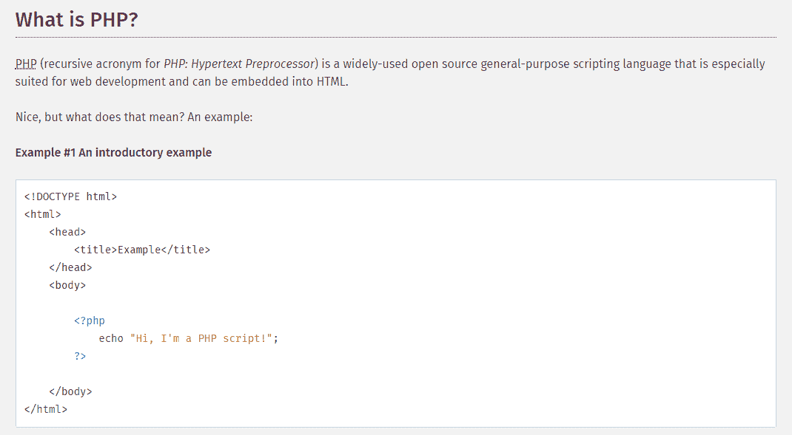

Official PHP Manual

从 PHP 开发者的官方文档开始会更好吗？本指南将带你经历一切，从 PHP 简介到[如何安装 PHP](https://kinsta.com/blog/install-php/) 并掌握基本语法。这是一个很好的第一次阅读，尤其是如果你已经习惯了编程文档。

这样做的一个问题是，虽然它确实涵盖了一些高级功能，但它只能带您到此为止。它也非常简单明了，对某些人来说很棒，但是完全的初学者可能会从指导教程中受益更多。

查看文档并通读几节内容。看看它是如何为你工作的。对许多人来说，参考手册和大量的自我指导练习是最好的学习方法。

### **2。W3Schools PHP 教程**

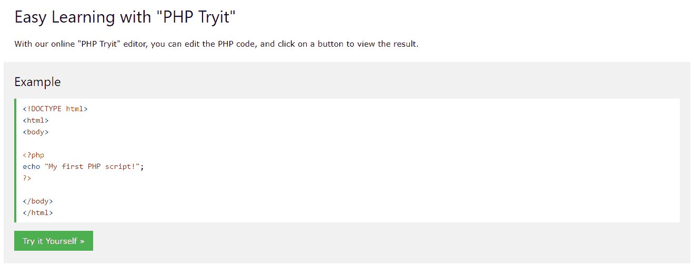

W3Schools PHP tutorial

W3Schools 对于任何年龄的初学者[和 web 开发者](https://kinsta.com/blog/hire-wordpress-developer/)来说都是一个很好的资源。它的指南非常简单易懂，另外还有大量的参考资料和例子，以及大量的练习和测验来帮助你记忆 PHP。甚至可以获得 W3Schools 在线认证。

如果你想学习一门新的编程语言，并且正在寻找有趣且操作简单的教程，请查阅 W3Schools 的文档。

### **3。PHP:正确的方法**

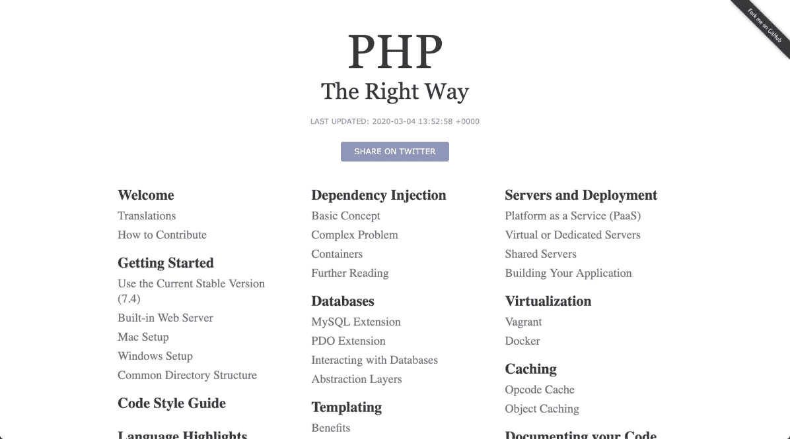

PHP the right way

像每一种编程语言一样，PHP 有你应该遵循的最佳实践。如果做不到这一点，你的代码将会又慢又笨拙，甚至可能完全崩溃。 [PHP:正确的方式](https://phptherightway.com/)告诉你所有的编程标准，这些标准对于新开发者来说可能不太明显。

这不是一个初学者的教程，将带你一步一步地经历一切，但它仍然值得通读，这样你就可以创建高质量的代码。

### **4。FreeCodeCamp 的免费 PHP 教程**

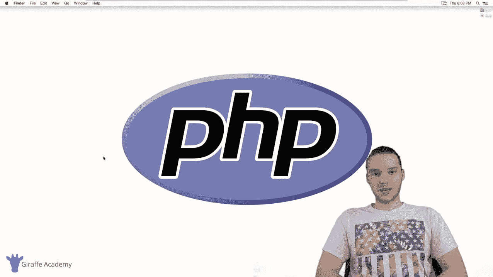

FreeCodeCamp.org

如果你喜欢看视频教程，这个长达五个小时的非常适合你。整个课程深入涵盖了 PHP 的所有基础知识，向您展示了您需要从头开始了解的一切。

花一个下午的时间来做这件事，你会成为一个初学 PHP 的程序员。如果你已经学习了一点 PHP，并且想要跳过，你可以通过点击描述中的时间戳跳到任何部分。
【CTA】

### **5。用 Codeacademy 学习 PHP**

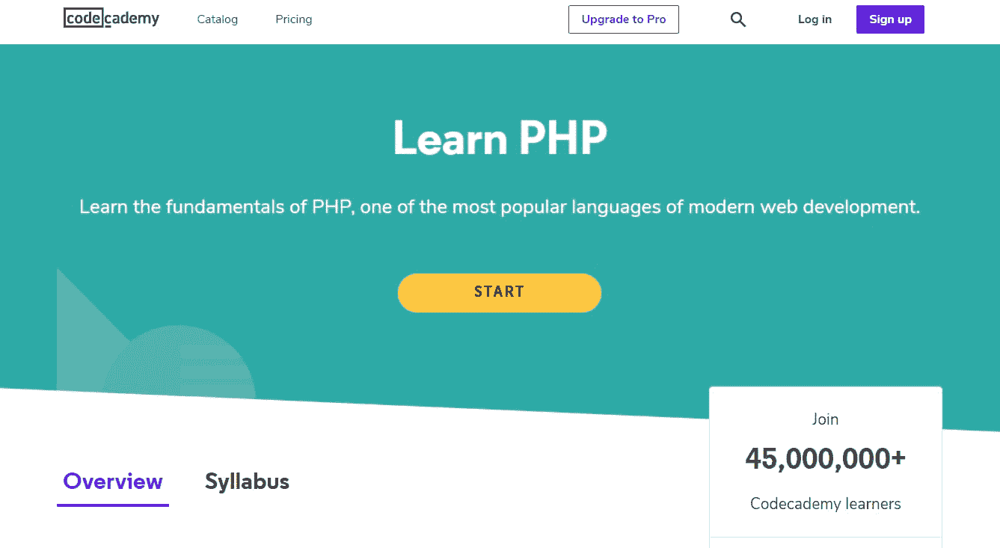

Codeacademy

你学习编程的最佳方式是什么？Codeacademy 是一个完全免费的资源，它通过代码而不仅仅是视频或文本教程来教学。虽然它主要由互动课程组成，但也有测验、文章和自由形式的项目。这就像一门自学的大学课程，你所需要做的就是记账。

### **6。PHP 学徒**

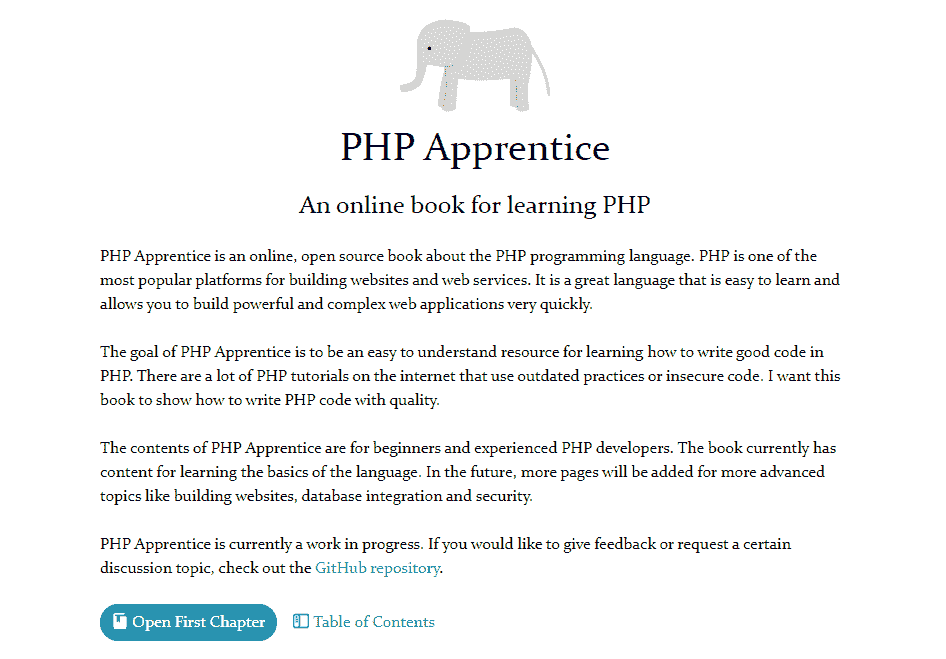

PHP Apprentice

无论是初学者还是有经验的人， [PHP 学徒](https://phpapprentice.com/)都有好的建议给你。这本免费的在线书籍正在开发中，目前有 22 页，大部分都是 PHP 开发的例子。这有点像典型的编程文档，但是更简单，更容易掌握。

### **7。GeeksforGeeks PHP 教程**

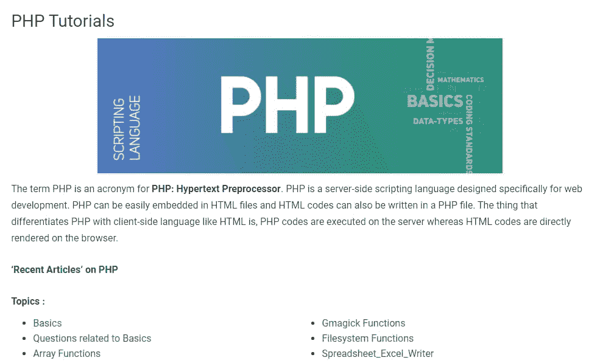

GeeksforGeeks

许多这些免费资源涵盖了基础知识，没有太多其他内容。这个[庞大的教程集](https://www.geeksforgeeks.org/php/)涵盖了 PHP 必须提供的所有函数和库。

这读起来不像是指南，更像是文档，所以如果你喜欢官方的 PHP 手册，但想要一些更实质性的东西，试试这个网站。

### **8。TutorialsPoint PHP 教程**

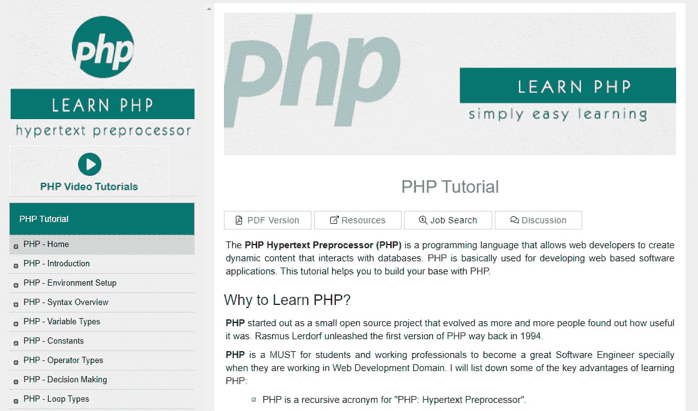

TutorialsPoint

这是另一个绝对庞大的 PHP 学习资源，但它不是非常简单的文档风格的页面，它的结构更像一系列教程。这里有很多内容，从基础到更高级的主题，加上使用 PHP 进行[登录](https://kinsta.com/blog/wordpress-login-url/)、[表单](https://kinsta.com/blog/wordpress-forms/)和 AJAX 的例子。

### **9。PHP 基础播放列表**

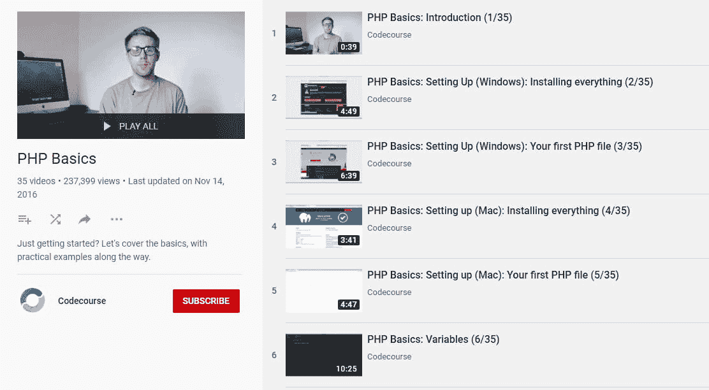

Codecourse

如果你还在掌握基础知识，并且更喜欢视频演练，这些 PHP 教程正是你所需要的。35 个视频相对较短，从 5 分钟到 20 分钟不等，涵盖了很多不同的主题。五个小时左右就可以免费看完整个系列。

### 10。Y 分钟学会 PHP

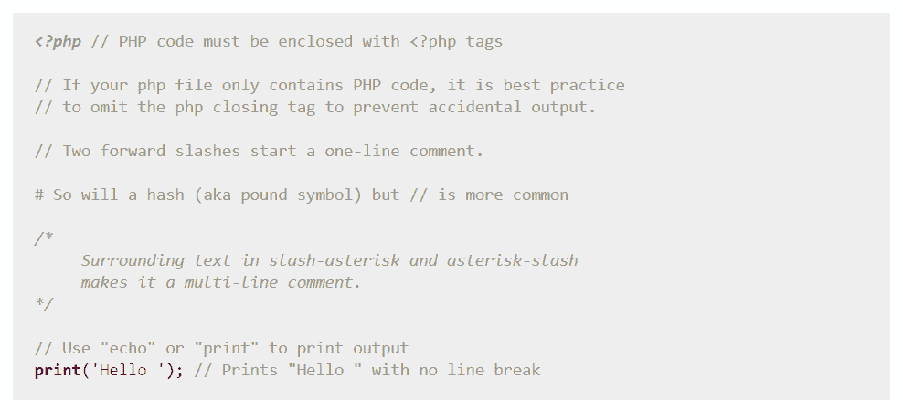

Learn X in Y Minutes

想学 PHP，快？这份[文件简要回顾了一切](https://learnxinyminutes.com/docs/php/)，没有任何修饰，只有代码。没有手把手或冗长的解释，它设法将 PHP 压缩成一个页面。很好，如果你喜欢你的教程。

### **11。Learn-php.org 免费互动 PHP 教程**

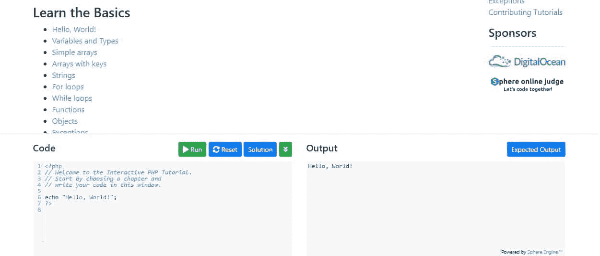

Learn-php.org free interactive PHP tutorial

这篇 PHP 教程的独特之处在于，它是一组互动练习，鼓励你尝试编码，看看你是否能得到预期的输出。如果你失败了，它会让你知道哪里出错了，就像一个真正的代码编译器。如果您想通过引导式课程实时测试您的语法，请尝试一下。

### **12。网络忍者的 PHP 初学者教程播放列表**

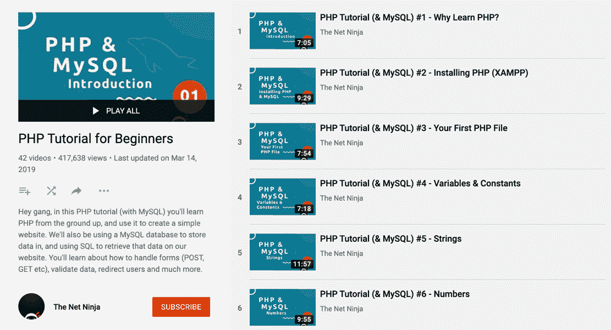

The Net Ninja’s free PHP tutorial

如果你想[从零开始建立自己的网站](https://kinsta.com/blog/wix-vs-wordpress/)，这里有[完美的视频播放列表](https://www.youtube.com/playlist?list=PL4cUxeGkcC9gksOX3Kd9KPo-O68ncT05o)。将 PHP 和 [MySQL](https://kinsta.com/knowledgebase/what-is-mysql/) 结合使用，你可以建立一个带有数据库的全功能网站，并学习如何编写各种功能的代码，比如表单和数据验证。这些视频非常棒，你一定会从中学到很多东西。

## 注册订阅时事通讯

### 想知道我们是怎么让流量增长超过 1000%的吗？

加入 20，000 多名获得我们每周时事通讯和内部消息的人的行列吧！

[Subscribe Now](#newsletter)

### 13。PHP5 教程

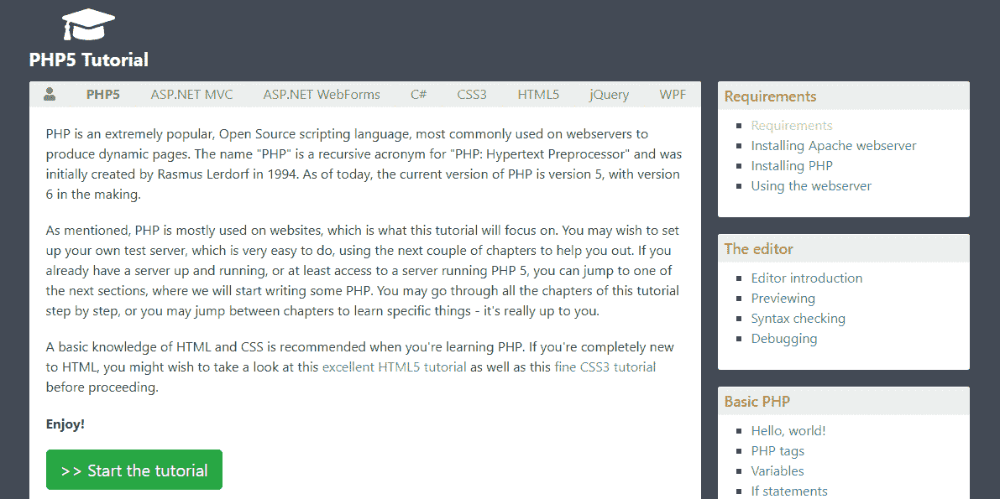

PHP5 tutorial

本文档通过大量有用的图片和简单易懂的指导，带你了解 PHP 和 MySQL。一个缺点是它专注于 PHP 5，而 PHP 5 已经到达了它的[生命的终点](https://kinsta.com/blog/php-versions/)。PHP 5.6 仍然在网络上广泛使用，但是如果可以的话，最好还是使用 [PHP 7](https://kinsta.com/blog/php-7-4/) 。这个网站仍然很好地涵盖了 PHP 的基础知识，所以它仍然值得一读。

### **14。Traversy Media 的 PHP 前后播放列表**

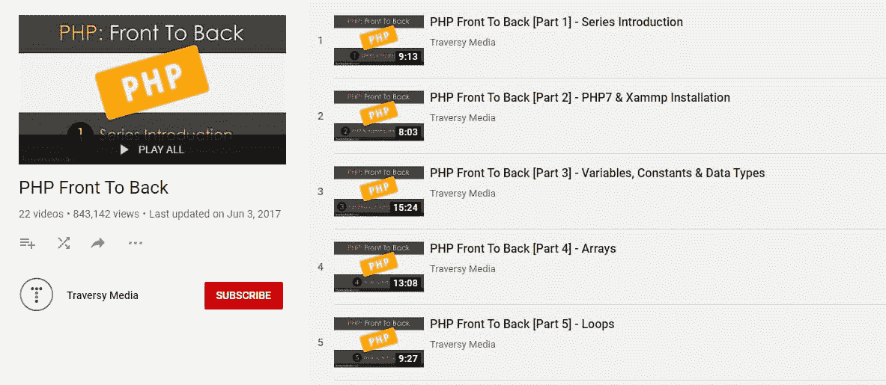

Traversy Media’s PHP tutorial

看看这个播放列表:它将在 22 个视频教程中教会你所有关于 PHP 的知识。这将介绍安装和 PHP 语法等基础知识，然后介绍 MySQLi 集成和用 PHP 设置 cookies 的[等高级实现。](https://kinsta.com/blog/wordpress-cookies-php-sessions/)

### 15。SoloLearn PHP 教程

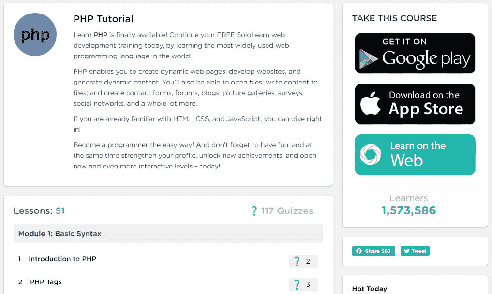

SoloLearn

SoloLearn 让他们的一系列课程变得有趣又吸引人。测验帮助你记住你学了什么，而成就和互动内容让你保持兴趣。你所需要做的就是创建一个帐户，你甚至可以在手机上和网上学习这门课程。这里有超过一百万的学生，很多开发者都是从这里起步的。

## **12 个面向严肃开发者的付费 PHP 教程**

这些付费的 PHP 课程提供了对 PHP 的深入了解。它们中的许多都物有所值，提供多种学习方法:视频、文本教程和互动学习练习。他们可能还会提供一些免费教程所没有的关于 PHP 的见解。

如果你在类似在线大学的环境中学习得最好，这些付费课程可能只适合你。

### **1。Udemy PHP 教程**

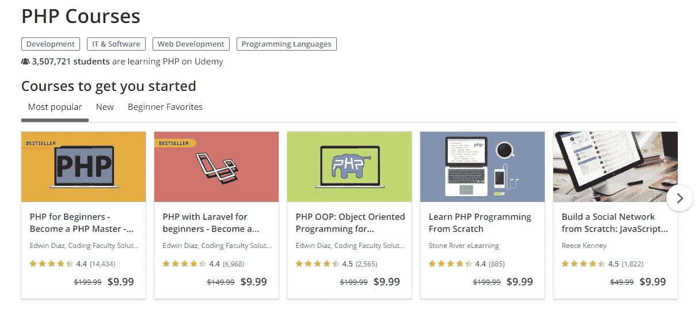

PHP Tutorials on Udemy

Udemy 是一个非常受欢迎的在线平台，提供各种主题的各种课程。仅平台上就有 350 万学生在学习 PHP。有数百门 PHP 课程从各个可能的角度覆盖了这门语言，所以这里有适合每个人的东西。

一个缺点是:课程可能相当昂贵，通常在 50-200 美元之间。但这些通常包含数小时甚至数天的视频，以及互动课程和可下载资源，因此这可能是一项不错的投资。

### **2。PHP 初学者**

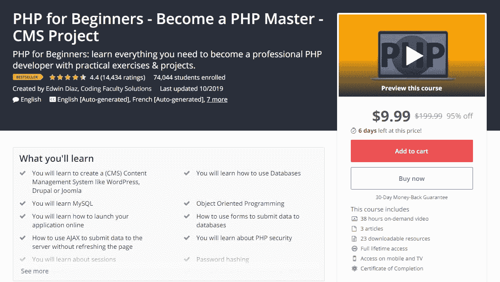

PHP for Beginners

如果你想要一门课程带你从零到精通 PHP，试试这个吧。它教你如何将 PHP 与像 WordPress 这样的 [CMSes 整合，如何使用](https://kinsta.com/knowledgebase/content-management-system/) [MySQL 数据库](https://kinsta.com/knowledgebase/wordpress-repair-database/)，以及如何创建交互式内容。除此之外，你还会学到编程的基础知识和[调试你自己的代码](https://kinsta.com/blog/wordpress-debug/)。这里有绝对大量的内容，所以准备好一个漫长的过程。

### **3。Lynda PHP 教程**

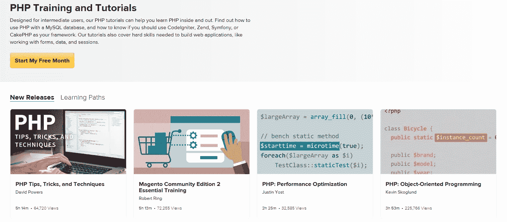

PHP Tutorials on Lynda

Lynda 包含 [55 门 PHP 课程](https://www.lynda.com/PHP-training-tutorials/282-0.html)和近 2000 个视频教程，通常长达数小时。像 Udemy 一样，这些是由许多不同的人制作的，涵盖了各种 PHP 相关的主题。你可以根据技能水平、主题甚至 PHP 版本对结果进行排序。

厌倦了体验你的 WordPress 网站的问题？通过 Kinsta 获得最好、最快的主机支持！[查看我们的计划](https://kinsta.com/plans/?in-article-cta)

另外，每个课程通常都有一些免费的视频，所以你可以看看它是否适合你。之后，您需要购买订阅才能看到其余的课程。

### **4。Coursera PHP 课程**

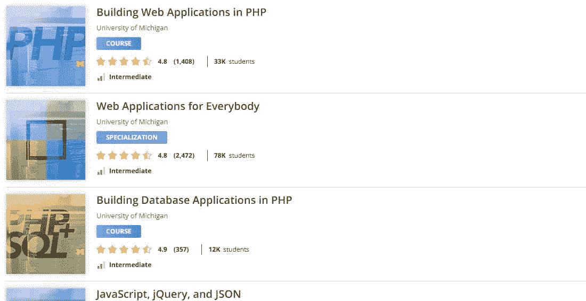

PHP Courses on Coursera

想在不上大学的情况下从大学学习吗？这些 [Coursera 课程](https://www.coursera.org/courses?query=php)就是要走的路。有些是免费的，但很多是需要付费才能注册的。

有经济援助，所以这是一个负担得起的选择。你实际上参加了预定的课程，与同龄人一起工作，获得评分，并获得认证。

### **5。通过建立一个完整的网站学习面向对象的 PHP**

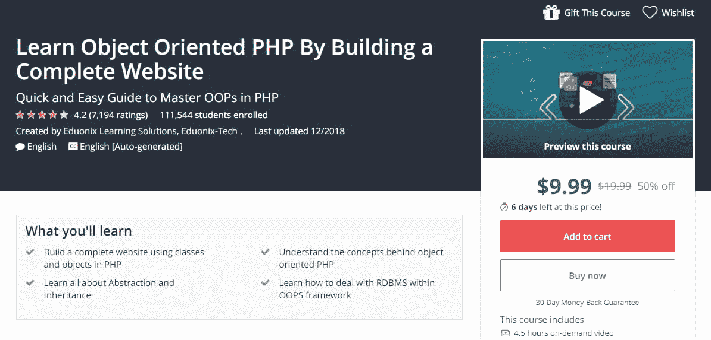

Object-Oriented PHP course

想从零开始建立自己的网站？这门课程教你关于面向对象编程的一切，以及在使用 PHP 时如何掌握它。你将有机会学习基础知识，到最后，你将拥有自己的功能性网站。学习几个月没什么意思，所以如果你想现在就开始创作，试试这门课。

### **6。从头开始克隆 Spotify:JavaScript PHP 和 MySQL**

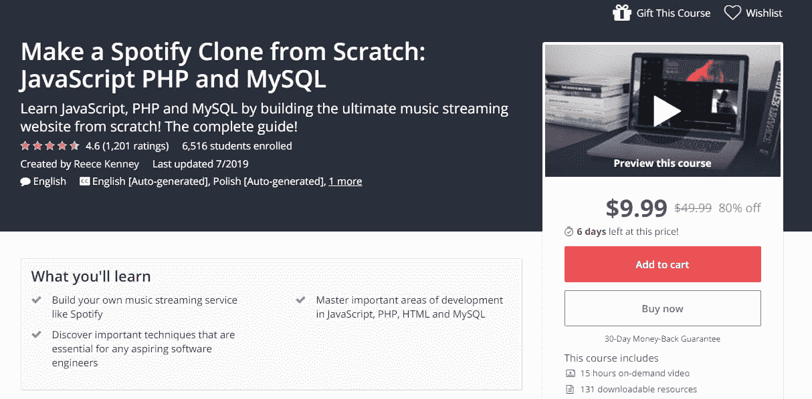

How to make a Spotify clone tutorial

克隆人是掌握一项技能的最好方法之一。它可以教你模仿专家是如何做的，同时给你空间添加你自己的触摸和实验。[这门课](https://www.udemy.com/course/spotify-clone/)不仅教你[PHP，还教你 JavaScript](https://kinsta.com/blog/php-vs-javascript/) 和 MySQL，一切从零开始。您将使用您的新技能制作一个 Spotify 克隆，它将带您走过旅程的每一步。

### 7 .**。拉拉卡斯特之旅:PHP**

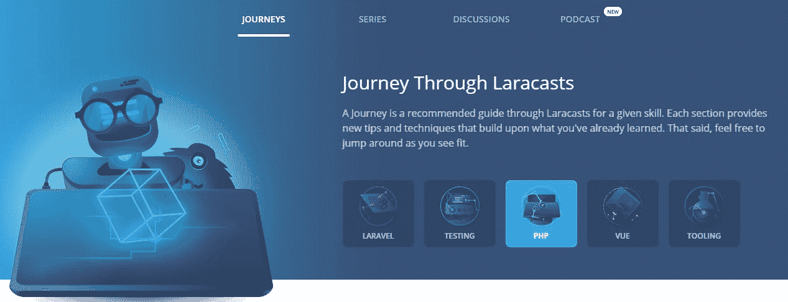

Laracasts

Laracasts 是一个巨大的截屏或视频教程来源，它记录屏幕并向你展示老师正在做的一切。这里有数百门 PHP 课程，而且整个初级课程都是免费的。每月 15 美元，你就可以参加所有的高级课程。

### **8。树屋 PHP 课程**

Treehouse

Treehouse 在其网站上提供成千上万的课程，每月收费，有超过 30 门 PHP 课程可供学习。除了视频，每节课都有测验和目标来帮助你掌握所学内容。一些课程只有几分钟长，而另一些有几个小时的视频内容。如果你想尝试其他网络语言，订阅树屋也能让你接触到这些语言。

### **9。包含 5 个项目的完整 PHP MYSQL 专业课程**

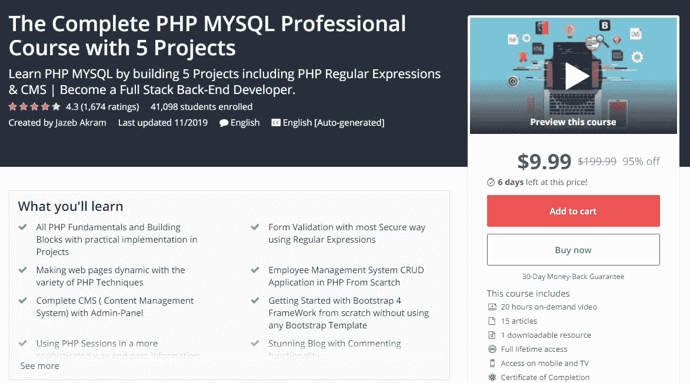

PHP MYSQL Professional Course on Udemy

PHP 和 MySQL 经常是齐头并进的。如果后端开发是你的目标，这门课程有[五个项目](https://www.udemy.com/course/the-complete-php-mysql-professional-course/)帮助你在职业生涯中进步。148 次讲座和 20 小时的视频，这一个会让你忙上很长一段时间！

### 10。Pluralsight PHP 课程

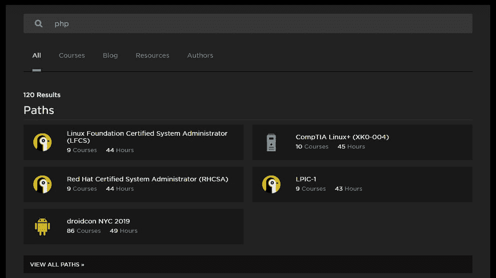

Pluralsight

[Pluralsight](https://www.pluralsight.com/search?q=php) 是高级计算机科学和技术课程的来源。只要按月付费，你就可以获得视频课程和学习路径，这些课程和路径可以帮助你胜任某些职业角色，甚至让你获得认证。

使用这个平台，你可以衡量你在某些领域的技能，以确定你在各种技术工作中的表现。这里的主要目标是帮助你获得成为专业开发人员所需的技能，并让你进入这个行业。

### **11。Laravel 入门**

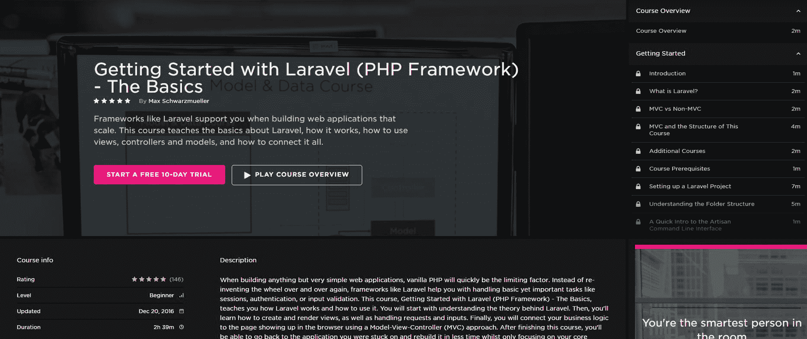

Getting started with Laravel course

这门来自 Pluralsight 的[课程将教你 PHP 最流行的框架:](https://www.pluralsight.com/courses/laravel-php-framework-getting-started-the-basics) [Laravel](https://kinsta.com/blog/laravel-tutorial/) 。Laravel 帮助您创建快速、强大且富于表现力的 web 应用程序。它就像 PHP 的一个插件，让你更容易地构建更好的东西。如果你想扩展你的 PHP 知识，学习 Laravel 是最好的起点。了解更多关于[最佳 PHP 开发框架](https://kinsta.com/blog/php-frameworks/)的信息。

### **12。PHP 初学者:如何建立一个电子商务商店**

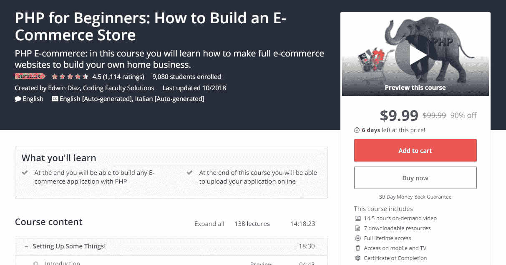

PHP for Beginners on Udemy

想用 PHP 建立自己的电子商务商店吗？PHP 是网上商店不可或缺的一部分，因为它经常处理许多你需要执行的请求和认证。

这门课程不适合初学者；在开始之前，您需要了解 HTML 和 PHP 语法。它更侧重于教你如何构建应用程序和处理电子商务商店的前端和后端。

[Stuck at home? 🏠 There's no better time to learn a new skill... and this guide has all the tools you need to become a PHP master! 💻Click to Tweet](https://twitter.com/intent/tweet?url=https%3A%2F%2Fkinsta.com%2Fblog%2Fphp-tutorials%2F&via=kinsta&text=Stuck+at+home%3F+%F0%9F%8F%A0+There%27s+no+better+time+to+learn+a+new+skill...+and+this+guide+has+all+the+tools+you+need+to+become+a+PHP+master%21+%F0%9F%92%BB&hashtags=php%2Cwfh)

## **总结**

每个[开发者](https://kinsta.com/blog/hire-wordpress-developer/)都需要从某个地方开始。选择适合自己学习风格的 PHP 教程，完全不用花钱上昂贵的大学课程就能掌握 PHP。

web 开发最难的部分之一是学习建立网站所需的多种语言。PHP 是一门容易掌握的语言，在你深入学习更复杂的 web 语言之前，比如 HTML、CSS、SQL 和 T2 JavaScript T3，这是一个很好的开始。

如果你也在学习 WordPress ,留意一下人们在用它做什么。JavaScript 和 React 正成为 WordPress 开发者越来越重要的工具，一旦你有了一些 PHP 经验，将它们添加到你的技能集可能是一个很好的下一步。

请记住，一旦您完成了课程或阅读了所有文档，学习就不会停止。网络在不断发展，总有更多的东西需要掌握。了解编程趋势可以让你保持相关性，并帮助你创建突破性的应用程序或在新的领域找到工作。PHP 只是一个开始。

你有什么 PHP 教程、备忘单或者你自己的资源可以和新开发者分享吗？在评论中分享你认为最有帮助的 PHP 资源！

* * *

让你所有的[应用程序](https://kinsta.com/application-hosting/)、[数据库](https://kinsta.com/database-hosting/)和 [WordPress 网站](https://kinsta.com/wordpress-hosting/)在线并在一个屋檐下。我们功能丰富的高性能云平台包括:

*   在 MyKinsta 仪表盘中轻松设置和管理
*   24/7 专家支持
*   最好的谷歌云平台硬件和网络，由 Kubernetes 提供最大的可扩展性
*   面向速度和安全性的企业级 Cloudflare 集成
*   全球受众覆盖全球多达 35 个数据中心和 275 多个 pop

在第一个月使用托管的[应用程序或托管](https://kinsta.com/application-hosting/)的[数据库，您可以享受 20 美元的优惠，亲自测试一下。探索我们的](https://kinsta.com/database-hosting/)[计划](https://kinsta.com/plans/)或[与销售人员交谈](https://kinsta.com/contact-us/)以找到最适合您的方式。