# 24 个最佳 WooCommerce 插件，进一步改善您商店的内置功能

> 原文：<https://kinsta.com/blog/woocommerce-plugins/>

WordPress 不同于其他平台，如 [Shopify](https://kinsta.com/blog/woocommerce-vs-shopify/) 、 [Wix](https://kinsta.com/blog/wix-vs-wordpress/) 和 [BigCommerce](https://kinsta.com/blog/woocommerce-alternative-bigcommerce/) ，它们内置了所有在线电子商务功能，让你可以立即开始销售。

原因是:WordPress 不是一个开箱即用的电子商务平台。WooCommerce 是世界上最受欢迎的解决方案之一，不仅因为它可以免费使用，还因为它提供了大量的插件(和扩展)来帮助[改善你的商店](https://kinsta.com/blog/speed-up-woocommerce/)。

过去，我们已经报道了最好的 WooCommerce 扩展。今天我们来看看 WooCommerce 插件。

请记住，你的最终目标是增加商店的收入。所以一定要下载我们的免费电子书**， [10 种提高你的网络商务产品页面转化率的方法](https://kinsta.com/ebooks/wordpress/ecommerce-conversion-rate/?utm_source=Blog&utm_medium=Link&utm_campaign=WooCommerce+Conversions+Ebook)。**

 **准备好开始了吗？

## 什么是 WooCommerce，我为什么需要它？

简而言之， [WordPress 本身就是一个具有巨大能力的 CMS](https://kinsta.com/knowledgebase/content-management-system/) 。在对代码一无所知的情况下，你可以轻松地[写文章](https://kinsta.com/learn/blogging-tips/)和发布页面。当谈到你的网站将会是什么样子时， [WordPress themes](https://kinsta.com/best-wordpress-themes/) 也帮助设计各种各样的布局，针对不同的行业，如硬件、法律和[机构](https://kinsta.com/blog/wordpress-agency/)。

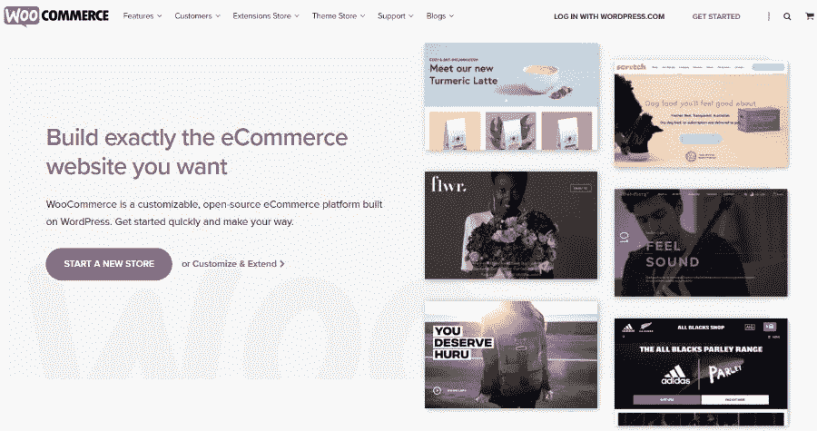

WooCommerce

但是销售诸如有声读物、衬衫或数字会员资格的产品呢？

> Kinsta 把我宠坏了，所以我现在要求每个供应商都提供这样的服务。我们还试图通过我们的 SaaS 工具支持达到这一水平。
> 
> <footer class="wp-block-kinsta-client-quote__footer">
> 
> 
> 
> <cite class="wp-block-kinsta-client-quote__cite">Suganthan Mohanadasan from @Suganthanmn</cite></footer>

[View plans](https://kinsta.com/plans/)

当然，你可以在你的网站上添加一些 [PayPal 按钮](https://kinsta.com/blog/paypal-donate-button-wordpress/)，但这并不提供任何[购物车功能](https://kinsta.com/blog/woocommerce-payment-gateways/)或者你在一家知名在线商店能找到的任何东西。更不用说，一个孤零零的 PayPal 按钮看起来已经过时了。

这就是 WooCommerce 发挥作用的地方。这个插件将你的 WordPress 站点转换成一个全功能的在线商店，有产品列表、分类、收藏和购物车。
T3】

## 寻找最好的 WooCommerce 插件时应该考虑什么

一旦你安装了 WooCommerce，你可能会发现你的特定的[电子商务商店](https://kinsta.com/blog/wordpress-ecommerce-plugins/)需要额外的功能。

很多时候，WooCommerce 插件并不能满足你经营一家成功商店的所有需求。事实上，你可能希望[收取每月会员费](https://kinsta.com/blog/recurring-revenue-model/)，或者出售门票，或者包含产品插件。

WooCommerce 插件中没有提供很多更高级的电子商务功能。那么，你应该如何决定哪些插件适合在 WooCommerce 上进行改进呢？

以下是一些建议:

1.  确立你网站的目的。
2.  问问你自己，WooCommerce 缺少什么特性是你经营一个有效的企业所需要的。
3.  考虑寻找一个满足这些需求的 WooCommerce 主题。
4.  如果一个主题不能解决问题，开始寻找最好的 WooCommerce 插件和扩展。
5.  要么购买软件包来省钱并为未来做准备，要么选择个人插件来省钱并坚持你绝对需要的东西。

你的大部分决定取决于你想给你的 WooCommerce 商店增加什么样的具体功能，所以确保你确切地知道你的顾客会期望什么。

[Need to pimp your store to address and serve more customers? Check out these 20+ WooCommerce plugins to extend your store's built-in functionality and watch your sales grow! 🚚🤑Click to Tweet](https://twitter.com/intent/tweet?url=https%3A%2F%2Fkinsta.com%2Fblog%2Fwoocommerce-plugins%2F&via=kinsta&text=Need+to+pimp+your+store+to+address+and+serve+more+customers%3F+Check+out+these+20%2B+WooCommerce+plugins+to+extend+your+store%27s+built-in+functionality+and+watch+your+sales+grow%21+%F0%9F%9A%9A%F0%9F%A4%91&hashtags=woocommerce%2Conlinestore)

## 改善 WooCommerce 商店的最佳 WooCommerce 插件

WordPress 是一个开源的免费解决方案。如果你在运营一个非常小的商业网站或者一个[个人博客](https://kinsta.com/blog/how-to-start-a-fashion-blog/)，你可以尽可能地降低成本。然而，严肃的在线商店通常需要[高级托管](https://kinsta.com/blog/managed-wordpress-hosting/)(查看我们的 [WooCommerce 托管](https://kinsta.com/woocommerce-hosting/))和具有优质客户支持的合法插件。

下面列出的一些插件是免费的，但通常你应该为 WooCommerce 插件付费。有时是一次性的小额费用，但有时需要按月支付。

说到这里，继续阅读了解我们最喜欢的 WooCommerce 插件。

### 1.WooCommerce PDF 发票和装箱单

[WooCommerce PDF 发票&装箱单](https://wordpress.org/plugins/woocommerce-pdf-invoices-packing-slips/)有大量的追随者，理由很充分。各种各样的业务都需要发票和装箱单，但 WooCommerce 没有提供这种流畅的功能。

因此，该插件让您自动将 [PDF 发票附加到某些电子邮件](https://kinsta.com/help/manage-users-invoice-emails/)中。不仅如此，您还可以选择创建和打印装箱单，无论是批量还是单个装箱单。插件的简单性和流线型吸引了大多数用户。

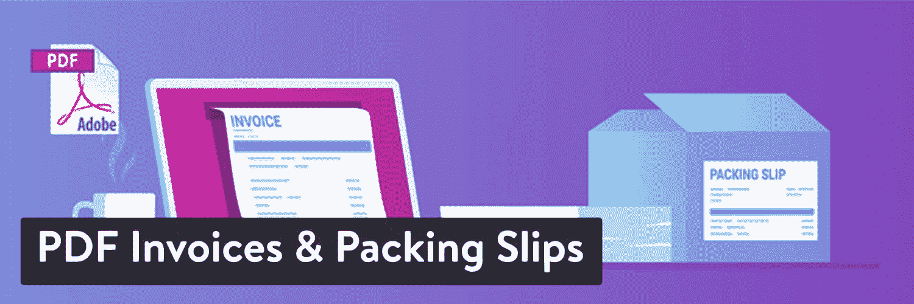

WooCommerce PDF Invoices & Packing Slips WordPress plugin

#### 定价

核心插件是免费的，但专业版有多种计划，起价 54.00 欧元。

#### 使 WooCommerce PDF 发票和装箱单订阅成为最佳选择的功能

*   安装完成后，您可以打印出当前和过去订单的 PDF 发票和装箱单。
*   该插件有多种语言可供使用，使得世界各地的许多人都可以轻松运行该插件。
*   所有发票都是按顺序组织的，您可以根据自己的喜好设置编号格式。
*   该插件可以让您批量或单独生成发票和装箱单。
*   根据电子邮件的收件人，发送附有发票的电子邮件。
*   在专业版中，您可以使用高级模板和连接到 Dropbox，将装箱单直接发送到打印机。

#### 谁应该考虑这个 WooCommerce 插件？

B2B 在线商店通常选择这个插件，因为它很容易向客户发送发票。如果你运送自己的产品，不使用第三方履行中心，这也是有用的。
T3】

### 2.YITH WooCommerce 愿望清单

YITH WooCommerce 愿望清单模仿了许多大型电子商务商店(如亚马逊)的“收藏夹”清单。这并不适合每一个品牌，但是给你的顾客一种方法来保存某些产品以备后用通常是有意义的。

该插件与 WooCommerce 集成，实现无缝过渡。然后，顾客可以回来登记，找到他们喜欢的商品，以便以后购买。这有可能促进你自己的销售，并为顾客创造一个更好的界面。

YITH WooCommerce Wishlist WordPress plugin

#### 定价

核心插件是免费的，但你可以花 89.99 美元选择更多的功能。

#### 使 YITH WooCommerce Wishlist 成为最佳选择的功能

*   该插件提供了增加每次结账销售额的潜力，并提醒顾客过去的兴趣。
*   它推出了为婚礼和婴儿洗礼等活动提供礼物清单的功能。
*   用户可以在社交媒体上分享他们的愿望清单。
*   这个插件有制作多个列表并给它们命名的工具。
*   在你网站的某些区域显示一个添加到愿望清单的按钮。
*   定制愿望列表格式，调整页面上显示的列数和产品数。

#### 谁应该考虑这个 WooCommerce 插件？

新店没有任何理由拥有愿望清单功能。只有几种产品的商店也是如此。wishlist 插件看起来像是拥有铁杆客户的大品牌的守护者。

### 3.WooCommerce 多语言

有了 WPML 的 WooCommerce 多语言插件，你可以翻译网上商店的所有内容，还可以添加多种货币。这让你可以利用全球市场的机会，用顾客选择的[语言](https://kinsta.com/blog/wordpress-multilingual/)为他们提供绝佳的购物体验。

有了这个插件，你将拥有自动和手动翻译选项的灵活性，以及翻译评论和多语言 SEO 优化的强大功能。

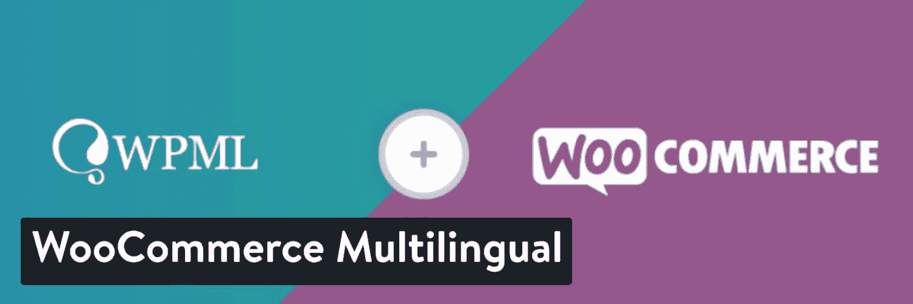

WooCommerce Multilingual WordPress plugin

#### 定价

通过 WordPress repo 可以获得 WooCommerce 多语言&多货币的免费版本。有了这个独立版本，用户可以为他们的 WooCommerce 商店设置多种货币，添加货币切换器，设置汇率，等等，而不需要安装 WPML。[更多信息请点击这里](https://wpml.org/documentation/related-projects/woocommerce-multilingual/multi-currency-support-woocommerce/)。

对于完整的多语言功能，需要安装 WPML 的[付费版本](https://wpml.org/purchase/)。推荐的多语言 CMS 订阅价格为 99 美元。

#### 使 WooCommerce 多语言成为最佳选择的特性

*   它集成了 WooCommerce 和一些最流行的 WooCommerce 扩展。
*   该插件通过简单的翻译编辑器界面使管理和实现翻译变得容易。
*   翻译网站的所有部分，从产品和商店页面到博客文章和第三方插件的文本。
*   轻松配置和提供多种货币，并使用动态汇率转换。
*   实施多语言结账流程(包括购买后的电子邮件)。

#### 谁应该考虑这个 WooCommerce 插件？

如果你有自己的网上商店或为你的客户建立电子商务商店，这是一个完美的插件，让你的网站在几分钟内多语言，并开始在全球市场销售。

### 4.WooCommerce 的自定义产品标签

WooCommerce 的定制产品标签是一个插件，可以用合并的标签清理你的产品页面。这样，你就可以用描述、规格、评论等信息来给标签加标题。

您添加到商店的所有标签都支持多种形式的内容，如图像、视频和文本。你可以在标准的 [WordPress 编辑器](https://kinsta.com/blog/wordpress-text-editor/)中管理标签，不需要任何定制编码。

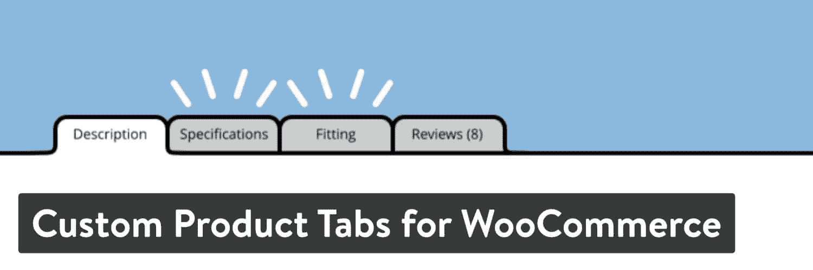

Custom Product Tabs for WooCommerce WordPress plugin

#### 定价

核心插件是免费的，可选的功能升级为 29.99 美元。

#### 使 WooCommerce 的定制产品标签成为最佳选择的功能

*   快速安装将简单的选项卡添加到您的产品页面。
*   你可以在基本的 WordPress 编辑器中编辑所有的标签。
*   该插件允许保存某些标签粘贴到其他产品页面。
*   所有选项卡都允许使用短代码、图像、文本和其他元素。
*   该插件与 WPML 兼容，以便将来翻译。
*   如果需要，选项卡数据将与您的产品数据一起导出。

#### 谁应该考虑这个 WooCommerce 插件？

几乎每个在线商店都可以使用产品标签。它使你的产品页面更容易阅读，并为更重要的信息打开空间。

### 5.woo 商务定制

[WooCommerce 定制器](https://wordpress.org/plugins/woocommerce-customizer/)扩充了 WooCommerce 中可调设置的数量。这些定制选项在 WooCommerce 中已经可用，但是你通常需要定制代码来使它们工作。因此，WooCommerce Customizer 插件通过可视化设置使这些任务变得更容易。

从改变每个页面上显示的产品数量到修改登录文本，这个插件突然使高级定制成为可能，而无需雇用开发人员。

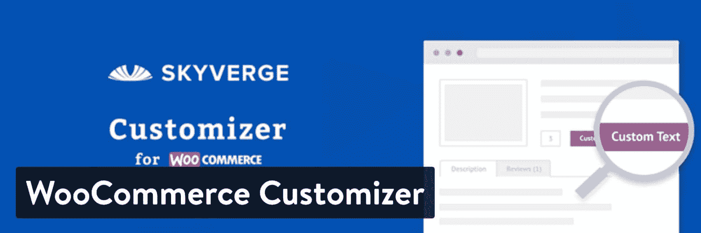

WooCommerce Customizer WordPress plugin

#### 定价

插件是免费的。

有些扩展是可用的。其中大部分是免费的，但你可能需要为高级扩展付费。

#### 使 WooCommerce Customizer 成为最佳选择的功能

*   它为那些不知道如何编码的人打开了可视化编辑设置。
*   您可以更改诸如销售徽章、添加到购物车文本和结帐页面优惠券等内容。
*   提供了相当多的扩展供您安装。例如，其中一些包括 MailChimp 和 WooCommerce 会员资格
*   绝大多数功能和扩展都是免费使用的。

#### 谁应该考虑这个 WooCommerce 插件？

建议所有 WooCommerce 网站所有者至少测试一下 WooCommerce 定制插件。您可能会发现，这使得定制小元素(如创建帐户按钮)变得更加容易。但是，某些主题可能会为您完成这些定制。

### 6.WooCommerce 的 PickPlugins 产品滑块

WooCommerce 的 [PickPlugins 产品滑块](https://wordpress.org/plugins/woocommerce-products-slider/)插件解决了许多店主在开店后发现自己陷入的一个问题。你的 [WordPress 主题](https://kinsta.com/blog/best-wordpress-themes)或[页面生成器](https://kinsta.com/blog/wordpress-page-builders/)可能没有干净的[产品滑动条](https://kinsta.com/blog/wordpress-slider/)或者你根本没有那个选项！

如果你想在你的主页或者其他页面上有一个产品滑动条，这是一个合适的插件。这也是一个很棒的插件，用于在你的博客文章中推荐产品，因为你可以经常写一些与你的产品相关的文章，并把用户直接送到你的商店。

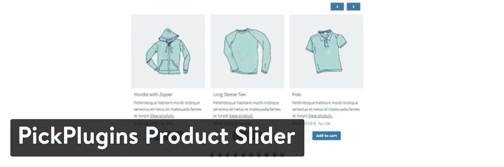

PickPlugins Product Slider for WooCommerce WordPress plugin

#### 定价

这个免费插件拥有大部分需要的特性。

下载 29 美元的高级版本。这增加了大约 30 个主题和其他布局，如顶级产品和最近查看的项目。

#### 使 PickPlugins 产品滑块成为 WooCommerce 的绝佳选择的特性

*   在您选择的任何页面或帖子上添加产品滑块。
*   所有产品滑块在台式机和较小的设备上看起来都很漂亮。
*   有几十种设置可用，包括自动播放、触摸拖动和不同颜色的选项。
*   该插件自动隐藏缺货产品。
*   它支持无限的产品和滑块。
*   提供了 20 多个导航带。
*   从字体大小到文本对齐，从项目类别到自定义评级，一切都可以自定义。
*   你可以选择升级更多的主题和更好的组织。
*   定制和动画通常比你在预建的 WordPress 主题上看到的更令人印象深刻。

#### 谁应该考虑这个 WooCommerce 插件？

如果你的主题目前没有产品滑动条，或者你不喜欢它的功能和外观，就使用这个插件。

### 7.电子商务的助推器

WooCommerce Booster 提供了一系列有趣的功能，您可能会发现在使用 woo commerce 的过程中缺少这些功能。其中一些功能包括批量价格转换、货币、全球折扣和让您的客户提供自己定价的工具。

额外的，很多时候是独一无二的功能列表还在继续。你会发现[支付网关](https://kinsta.com/blog/woocommerce-payment-gateways/)、结账、产品等功能。总的来说，在选择一个只解决一个问题的高级插件之前，值得测试一下。

Booster for WooCommerce WordPress plugin

#### 定价

核心插件(有一大堆新增功能)是免费的。Booster Plus(拥有更多功能)售价为 49.99 美元。

#### 使 woo commerce Booster 成为最佳选择的特性

*   WooCommerce 插件的助推器本身几乎是一个完整的电子商务插件。它允许更高级的在线商店体验，而不需要新的主题或多个插件。
*   使用多货币、价格格式和批发定价工具更改定价和货币。
*   使用自定义价格标签、免费价格标签和更多按钮标签的功能调整按钮和价格标签。
*   使用产品图像、输入字段等功能定制产品。
*   在核心字段、结帐费用和空购物车按钮的帮助下，改变购物车和结帐。
*   借助最小/最大金额、运输网关和基于类别的网关，改进您的支付网关。
*   利用订单数量、运输计算和图标等各种功能来完善您的运输流程。
*   让您的电子邮件和 PDF 发票更好。

#### 谁应该考虑这个 WooCommerce 插件？

最好看看 woo commerce Booster 的所有新增功能。插件中可能有对你的公司有意义的东西。一篇简短的广告不可能涵盖这么长的功能列表。然而，这通常可以取代对其他插件或主题的需求。

### 8.WooCommerce 的欧盟增值税合规助理

WooCommerce 的欧盟增值税合规助理对于那些在欧盟开展业务的人来说是一个相当小众的工具。您可能知道，增值税是在欧盟销售所需的费用。这项税收包括电子书和音频销售等数字商品。

因此，您可能会发现贵公司需要将增值税纳入成本。这个插件为你做了大部分的脏活，识别客户位置，转换货币，并在必要时征收增值税。

EU VAT Compliance Assistant for WooCommerce WordPress plugin

#### 定价

一些核心插件功能是免费提供的。高级版起价 50 美元。

#### 使 WooCommerce 的欧盟增值税合规助理成为最佳选择的功能

*   它确保您遵守欧盟的法律，无论您的公司位于欧盟还是您的客户从那里购买。
*   这个插件可以识别你的客户的位置，而不需要你做任何事情。
*   显示位置后，该插件会自动更改您的网站价格，以包括欧盟增值税。
*   所有的额外费用都会被记录下来，以防你被审计或者你需要把这些费用计入你自己的账目。
*   增值税费用不仅仅显示在购物车上。您可以高枕无忧，因为您的客户会在产品页面和产品系列上看到最终的增值税价格。
*   每个国家的增值税税率不同。因此，插件会尝试为您计算它们。如果需要，您也可以键入您自己的定制增值税成本。
*   有一个拒绝所有包含增值税的采购的设置。
*   包括高级报告，以便您可以在合并增值税时分解成本和购买行为。
*   数字商品和实物商品都支持。

#### 谁应该考虑这个 WooCommerce 插件？

您可能需要它的唯一原因是，如果您的客户主要位于欧盟。如果您想消除向欧盟客户销售商品的可能性，这也可能有所帮助。

### 9.签出字段编辑器

[结帐字段编辑器](https://wordpress.org/plugins/woo-checkout-field-editor-pro/)插件提供了在结帐区域添加、编辑和删除自定义字段的工具。名称、地址和支付信息的标准字段仍然存在，但是这个插件认识到一些公司是独特的。

该插件直接与 WooCommerce 集成，将你的结账模块变成一个更加通用的区域。例如，您可以编辑 WooCommerce 中包含的当前字段，您还有机会为标签、占位符和名称等内容添加新字段。自定义字段对于许多类型的企业都很重要，尤其是那些定期拥有自定义订单的 B2B 公司。

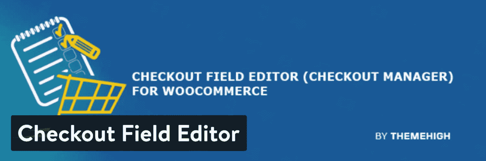

Checkout Field Editor WordPress plugin

#### 定价

核心插件是免费的，但你可以花 39 美元升级获得更多功能。

高级版包括一些有趣的新主题，以及一长串其他字段类型，如数字、复选框和文件上传。

#### 使签出字段编辑器成为最佳选择的功能

*   该插件使你的结帐模块更容易定制。改变 WooCommerce 收银台的元素并不是一件容易的事情，但这很有帮助。
*   为您提供了许多新的字段项，以合并类、标签和类型等选项。
*   在不了解任何编码知识的情况下，编辑字段是可能的。因此，改变标准的运输和结算领域是一个可行的选择。
*   插件的核心版本是完全免费的，包括选择、文本区域和电子邮件等字段类型。
*   您可以移动字段，将它们放在结帐过程的不同区域。例如，您可能决定在订单详情页面之前不需要显示电子邮件字段。
*   请随意删除您想要的任何字段。
*   启用和禁用字段只需点击一个按钮。
*   这个插件提供了一个拖放界面来调整当前和新字段的顺序。
*   高级版本是负担得起的，它打开了一个全新的一批演示和领域。

#### 谁应该考虑这个 WooCommerce 插件？

如果 [WooCommerce checkout](https://kinsta.com/blog/woocommerce-checkout/) 区域已经为你的业务工作，可能就没有理由获得这个插件了。然而，一些电子商务商店需要添加新的字段，例如一家 [B2B 商店](https://kinsta.com/blog/b2b-lead-generation/)需要询问每个订单的特殊细节。

### 10.WooCommerce 菜单车

WooCommerce Menu Cart 插件可以与许多电子商务插件一起工作，例如 WooCommerce、WP-Ecommerce 和 T2 轻松数字下载。它的主要目的是在你的主[导航菜单](https://kinsta.com/blog/website-navigation/)中添加一个购物车按钮。

这样做的理由是因为一些 WordPress 设计和主题在页面顶部没有购物车图标。这通常表明这个主题不是直接为 WooCommerce 设计的。然而，由于大多数主题仍然与 WooCommerce 兼容，您只需从该插件中添加一些元素，如购物车图标。

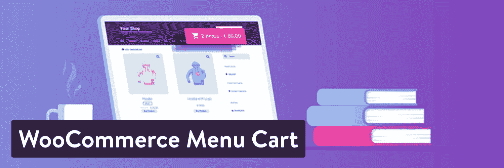

WooCommerce Menu Cart WordPress plugin

#### 定价

该插件有一个免费版本。高级版起价 27.00 欧元，提供额外的购物车图标、购物车弹出按钮等等。

#### 使 WooCommerce 菜单车成为最佳选择的功能

*   该插件将“非 WooCommerce”主题转化为功能齐全的在线商店，因为购物车图标对于推动销售和提醒人们购物车非常重要。
*   只需要几分钟就可以安装插件并在菜单中看到购物车图标。
*   您可以选择添加购物车图标或只添加商品和价格。
*   可以设置将购物车图标浮动到导航菜单的不同区域。
*   [自定义 CSS](https://kinsta.com/blog/wordpress-css/) 可以进行更高级的编辑。
*   专业版增加了一个令人印象深刻的列表，包括更多的购物车图标、弹出按钮、自动更新等等。

#### 谁应该考虑这个 WooCommerce 插件？

如果你当前的 WordPress 主题没有购物车图标，考虑 WooCommerce 菜单购物车插件。这通常发生在你没有计划通过你的网站销售商品的时候，所以你选择了一个没有重要电子商务元素的主题。因此，这个插件解决了这个问题。例如，你可能开始意识到通过你的博客销售商品是个好主意。

### 11.YITH WooCommerce 比较

众所周知，YITH 的开发者通过使用插件和扩展为 WooCommerce 增加了几个功能。如果你卖的产品的特点可以直接对比，YITH WooCommerce Compare 插件是最重要的插件之一。

本质上，你需要[安装插件](https://kinsta.com/knowledgebase/how-to-install-wordpress-plugins/)，设置你想要比较的每个商品的属性，并添加比较按钮供你的客户点击。为您的客户显示一个弹出窗口，将比较的产品放在一起。

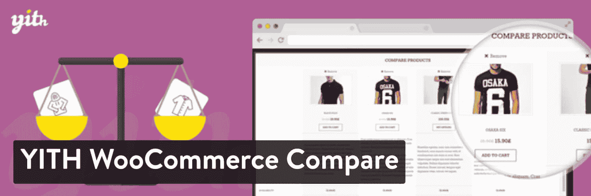

YITH WooCommerce Compare WordPress plugin

#### 定价

YITH WooCommerce 比较插件可以免费使用。然而，你可以升级到 YITH Premium Club 来获得所有 YITH 插件和高级支持。高级订阅的起价为 63.99 美元。

#### 使 YITH WooCommerce Compare 成为绝佳选择的特性

*   它允许你添加一个快捷的功能，让你的购物者有更好的用户体验。
*   没有必要搞乱编码，因为插件在几秒钟内就安装好了，你可以把比较按钮放在任何地方。
*   有一些翻译。
*   您可以选择在表格中比较哪些特性。
*   比较模块是一个弹出窗口，所以它不会将客户从当前页面带走。相反，他们看到一个干净的桌子，然后他们可以回去购物。
*   客户可以直接从比较页面向购物车中添加商品。
*   有几个字段可用于在比较表中显示。其中包括可用性、图像和标题。它还允许您删除这些内容。
*   提供了一些简单的设置来调整按钮文本、表格标题和产品图像大小等项目。

#### 谁应该考虑这个 WooCommerce 插件？

如果你的产品有相似的特点，值得并排比较，在你的网上商店添加一个比较是很重要的。比较图形 t 恤不会提供太多信息，但具有标准化规格的产品，如珠宝、电子产品和电器很有意义。

所以，如果你的主题缺少一个比较工具，而你卖的是正确的产品，这是一个可能适合你的插件。

### 12.woo lentor——元素和古腾堡的 WooComerce 建造者

[WooLentor](https://woolentor.com/) 是 Elementor 和 [Gutenberg](https://kinsta.com/blog/gutenberg-wordpress-editor/) 的专业易用的 WooCommerce 页面生成器，它将帮助你快速创建漂亮的 WooCommerce 页面，而无需学习编码。

## 注册订阅时事通讯

### 想知道我们是怎么让流量增长超过 1000%的吗？

加入 20，000 多名获得我们每周时事通讯和内部消息的人的行列吧！

[Subscribe Now](#newsletter)

这个多用途的插件包含了很多特性和选项，可以让你毫不费力地创建一个实用的 WooCommerce 商店。使用 WooLentor，您可以访问许多基本功能，如 WooCommerce 的愿望列表、产品比较、快速查看、Shopify 风格结账、销售通知、WooCommerce 的延期交货、产品 Ajax 添加到购物车、重命名标签等。

WooLentor WooCommerce 页面生成器完全兼容 [Elementor](https://kinsta.com/elementor-hosting/) 和 Gutenberg，因此您可以立即开始创建独特的 WooCommerce 页面。

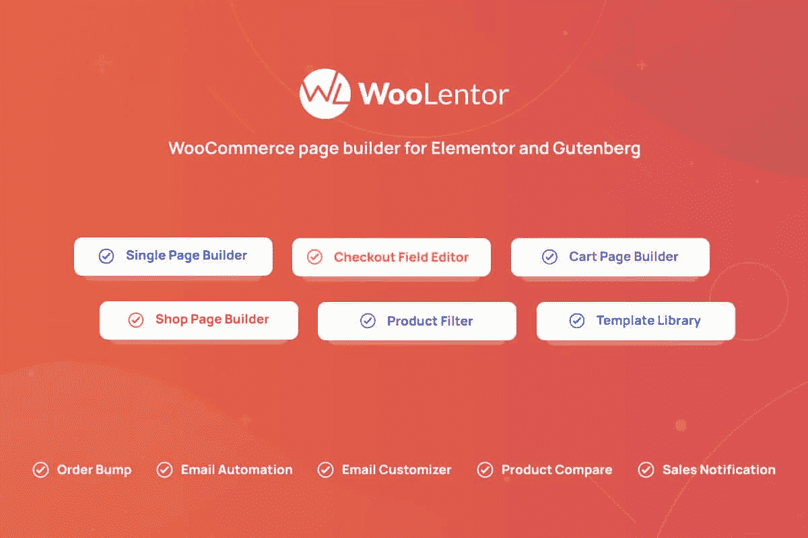

WooLentor

#### 定价

该插件的免费版本为您提供了开始使用 WooCommerce 商店的所有要素。根据你的预算和需求，插件提供了各种额外的选项。

如果您想要更多有用的功能，如产品过滤、订单提升、WooCommerce 电子邮件自动化、WooCommerce 电子邮件定制、结帐字段管理器、WooCommerce 预购、产品尺寸图、部分付款、多步结帐、GTM 转换跟踪等，请升级到单个网站每年 39 美元起的[高级包](https://woolentor.com/pricing/)。

#### 使 WooCommerce 的 WooLentor 页面生成器插件成为最佳选择的特性

*   104 个以上的元素或部件，54 个以上的古腾堡模块，23 个以上的[模块](https://woolentor.com/woolentor-woocommerce-modules/)
*   与 element or 和 gutenberg 完全兼容
*   拖放界面可以轻松创建页面，而无需学习编码语言。
*   定制任何 WooCommerce 页面，如商店页面、产品页面、购物车页面、我的帐户页面、[结账页面](https://kinsta.com/blog/woocommerce-checkout/)等。
*   广泛的定制选项，帮助您创建完美的 WooCommerce 页面。
*   完全响应的设计确保您的页面在所有设备上都很棒
*   易于使用，具有用户友好的界面
*   附带了几个模块，让您能够添加额外的功能，而不必安装更多的插件。

#### 谁应该考虑这个 WooCommerce 插件？

对于那些想创建一个漂亮的 WooCommerce 商店而不必学习编码的人来说，WooLentor 是一个完美的 WooCommerce 插件。对于那些已经熟悉编码的人来说，它也是理想的选择，因为它提供了广泛的功能和选项，使你能够毫不费力地创建令人惊叹的 WooCommerce 页面。如果你正在寻找一个功能齐全的 WooCommerce 插件，那么 WooLentor 是你的最佳选择。

### 13.WooCommerce 的订单交付日期

WooCommerce 的订单交付日期顾名思义。它让顾客在购买后参与进来，允许他们在结账过程中选择送货日期。这与传统方法不同，传统方法是你的收银台显示几个送货选项以及它们需要多长时间到达。

该插件已被证明[减少了购物车废弃](https://kinsta.com/blog/shopping-cart-abandonment/)，因为客户现在可以选择一个准确的日期，而不是看似随意的运输方法，这些方法并不总是那么准确。相反，客户选择一个确切的日期，并可以期待。

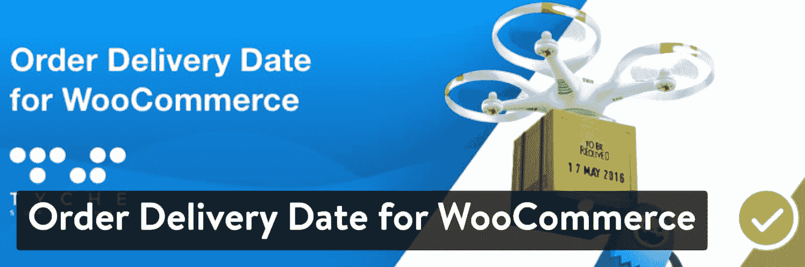

Order Delivery Date for WooCommerce WordPress plugin

#### 定价

核心插件是免费的。专业版售价 99 美元，有一大堆附加功能，比如次日送达、发货时间选择和时间段锁定。

#### 使 WooCommerce 的订单交付日期成为最佳选择的功能

*   该插件提供了更多透明度的机会，因为客户可以选择确切的日期。这是相对于传统的选择选项的方法，如美国邮政和 UPS。
*   您可以选择禁用某些日期和时间。
*   该插件提供了一些设置来配置运送产品所需的最少天数。例如，你可能想在一两天内完全封锁日期。
*   您可以限制每天的递送次数。
*   专业版在功能集上扩展了很多，有与谷歌日历同步、阻止时间段和设置周末交付时间的选项。

#### 谁应该考虑这个 WooCommerce 插件？

WooCommerce 插件的订单交付日期可能适用于所有电子商务商店。这在某种程度上是网上商店的“额外奖励”,但它已被证明可以减少购物车的废弃。它可以帮助你在竞争中脱颖而出。

### 14.YITH WooCommerce 快速查看

如前所述，YITH 有许多 WooCommerce 插件来扩展基本插件如何为您的商店工作。YITH WooCommerce 快速查看功能增加了一个快速查看弹出窗口，这样你的客户就不必一路走到产品页面。

他们现在可以直接从弹出窗口向购物车中添加商品，然后按“X”退出模块继续购物。快速查看功能的目的是减少客户将商品放入购物车所需的步骤。

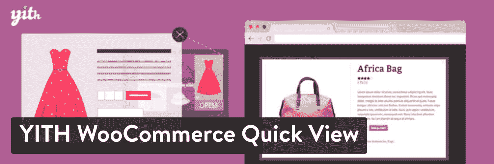

YITH WooCommerce Quick View WordPress plugin

#### 定价

标准插件是免费的，但是你可以以每年 59.99 美元的价格购买 YITH 会员资格(所有插件)。

#### 使 YITH WooCommerce Quick View 成为最佳选择的功能

*   YITH WooCommerce 快速查看插件是一种简单的方法，可以加快您的客户的购买过程。
*   只需几分钟就可以安装插件并查看所有产品的快速查看模块。
*   将按钮添加到产品循环和收藏库中，以打开包含快速产品信息的窗口。
*   quick view lightbox 由 AJAX 驱动，因此它可以快速加载，并且不会中断网站上的任何内容。
*   您可以定制模块的样式，以符合您自己的品牌。

#### 谁应该考虑这个 WooCommerce 插件？

YITH WooCommerce 快速查看插件推荐给那些想让顾客结账过程更快的人。但是，请记住，有时快速查看工具会使顾客的购物体验更加混乱和困难。在网站范围内实施之前，先测试它，并尝试几天从您的客户那里获得反馈。

### 15.livechat——woo commerce 的高级实时聊天软件

所有在线商店都应该有一个[实时聊天工具](https://kinsta.com/blog/wordpress-live-chat-plugin/)，为已经浏览网站的人提供客户支持。[live chat——woo commerce 的高级实时聊天软件](https://wordpress.org/plugins/livechat-woocommerce/)插件是添加实时聊天区并从网站后端管理它的最佳解决方案之一。

你的 WooCommerce 界面结合了相当多的功能，为你的用户提供无缝的客户支持体验。这是一个成熟的聊天套件，而不仅仅是一个快速的开源补丁。它有全面的工具，如访问者跟踪，聊天触发器和反馈。

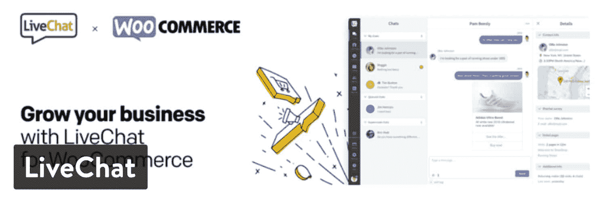

Livechat – Premium Live Chat Software for WooCommerce WordPress plugin

#### 定价

有免费试用，但之后就没有免费计划了。这些计划如下:

*   入门——每个代理每月 16 美元。
*   团队——每位代理 33 美元。
*   商务——每个代理 50 美元。
*   企业定制定价。

由于增加了更多功能，价格会按计划上涨。我们建议您访问网站，了解您的业务可能需要或不需要什么。

请记住，现在有一些免费的在线聊天插件，但是严肃的在线商店最终需要像 live chat 这样更强大的东西。

#### 使 LiveChat——woo commerce 的高级实时聊天软件成为最佳选择的功能

*   它在你的网站上提供了一个漂亮的，高度可定制的实时聊天框。
*   访问者跟踪对于了解你的客户在你的网站上做什么以及他们何时需要帮助是必不可少的。
*   在您的客户与您的代表进行实时聊天后，收集他们的反馈
*   实时聊天触发器自动完成联系客户的过程，而不是等着他们问问题。
*   所有离线通信都存储为支持票证，因此您可以稍后再使用它们来帮助您的客户。
*   实时聊天记录会被记录在系统中，以供分析，并查看哪个代表最有帮助。
*   该插件具有多渠道通信功能，因此您可以通过脸书、您的网站等地方联系客户。
*   我们提供了固定的回答，这样当其他客户已经问过这个问题时，您就不必再键入回答了。

#### 谁应该考虑这个 WooCommerce 插件？

所有的电子商务商店都需要一个实时聊天模块。你可以尝试一个免费的解决方案，看看它是否适合你，但这是一个典型的领域，我们建议为更多的功能支付一点钱。总的来说，这是您最好的客户支持渠道之一。

### 16.WooCommerce 直接结账

WooCommerce 的直接结账有一个独特且潜在有利可图的目的。它完全覆盖了你的 WooCommerce 网站上的购物车页面，加快了结账速度，让你的顾客更容易到达付款区。

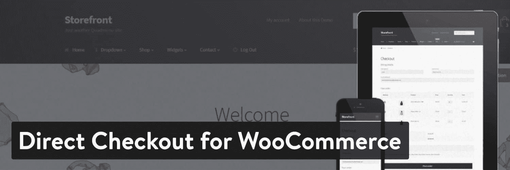

Direct Checkout for WooCommerce

试图找出使结账更简单的方法总是很困难。一些商店不喜欢取消购物车的想法，但对一些人来说这绝对是有意义的。毕竟，如果客户想要编辑某些内容，他们仍然可以返回。

你的电子商务网站需要一个超快的、可靠的、完全安全的主机吗？Kinsta 提供所有这些服务，并由 WooCommerce 专家提供 24/7 的世界级支持。[查看我们的计划](https://kinsta.com/plans/?in-article-cta)

#### 定价

免费，15 美元就可以升级一些其他功能。

#### 使 WooCommerce 直接结账成为最佳选择的功能

*   它是免费的。
*   该插件允许您将单个、成组和可变的产品添加到购物车中，而不必每次添加东西时都重新加载站点。
*   用户立即被重定向到结帐页面购买商品，而不是将商品发送到购物车。
*   您还可以删除一些结帐字段，以加快这个过程。
*   它让你选择一个单页的结帐过程。
*   “快速购买”按钮可以放在每件商品的下方，让用户带着商品直接去结账。
*   您可以自定义结帐按钮和文本项目。

#### 谁应该考虑这个 WooCommerce 插件？

这是一个棘手的问题，因为有些顾客可能不喜欢被直接送到收银台。然而，其他人肯定会享受这种便利。同样，最好事先询问你的客户，并在你推出插件时获得反馈。

### 17.WooCommerce 条纹支付网关

[WooCommerce 条纹支付网关](https://wordpress.org/plugins/woocommerce-gateway-stripe/)是 WooCommerce 比较流行的插件之一。这是因为它是几乎所有主要电子商务平台常用的支付网关。

WooCommerce 本身没有 Stripe 和许多其他支付网关来接受交易。但是，您可以安装这个[插件来连接到您的 Stripe 帐户](https://kinsta.com/blog/stripe-for-wordpress/)。

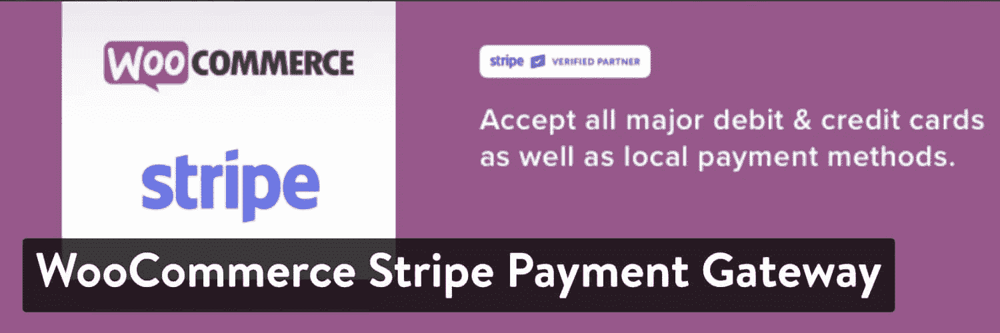

WooCommerce Stripe Payment Gateway WordPress plugin

#### 定价

免费。

#### 使 WooCommerce Stripe 支付网关成为最佳选择的功能

*   Stripe 是全球顶级支付网关之一。这意味着它是有信誉的，安全的，人们信任它。
*   安装后，您的网站可以突然接受所有主要的借记卡和信用卡。
*   通过 Stripe 可以进行本地支付。
*   Stripe Elements 是一个附带的功能，可以大大加快结账过程，帮助人们输入个人信息。
*   客户身份认证被认为是业内最好的认证之一。
*   它让你的网站为谷歌支付和苹果支付等替代支付方式进行了优化。
*   Stripe 支持定期支付。
*   你将从 Stripe 获得更好的客户支持，而不是从 PayPal 获得。此外，PayPal 的购买按钮也不太专业。

#### 谁应该考虑这个 WooCommerce 插件？

每个网店都应该考虑 Stripe 增加[更多支付方式](https://kinsta.com/learn/woocommerce-guide/#providing-multiple-payment-methods)增加你的转化率。

### 18.网上商务的预约和预约

WooCommerce 第一次预订和预约是将 WooCommerce [网站转变为预订平台](https://kinsta.com/blog/wordpress-booking-plugins/)的首选之一。无论是预约美发护理、汽车保养还是洗牙，WooCommerce 的预约系统都能满足所有专业人士的需求。

一旦激活，扩展就会打开一个预约日历，让客户在站点前端预订您的服务。你可以定义选项，设置你有空的日子和时间。如果你的组织里有很多人，你也可以把它分成不同的日历——比如有几个教练的健身房。

YITH Booking and Appointment for WooCommerce WordPress plugin

#### 定价

有三种方案可供选择:

*   单一站点——169.99 美元
*   六个站点——289.99 美元
*   30 个站点——449.99 美元

#### 使在线预订和预约成为最佳选择的功能

*   它是由 YITH 制作的，所以你知道它是有信誉的，而且它的构造与你的网站很好地配合。你还可以获得高质量的插件客户服务。
*   该插件为客户激活一个干净的日历来预订。
*   您可以定义选项，如游览或约会的时间段。
*   预订模块在所有设备上看起来都很棒。
*   多人活动，一对一预约都可以。
*   为人们创建自定义搜索模块，以找到不同的活动或产品。
*   您可以设置独特的选项，如根据预约者或时间自动拒绝预约。
*   为某些团体或日子设定特别价格。
*   您可以设置为显示客户的时区。
*   双重预订是不可能的。
*   为您的在线预订收取费用，并在需要这些费用时激活。
*   将您的网站日历同步到 Google 日历。
*   提醒会发送给你和客户，减少失约的次数。

#### 谁应该考虑这个 WooCommerce 插件？

如果你需要一种更好的方式来预订客户和组织所有的约会，可以考虑 YITH 预订和约会插件。

这些行业和职业包括健身房、餐馆、律师、医生等等。

### 19.WooCommerce 会员

WooCommerce 会员插件在 CodeCanyon 上出售，由一个名为 RightPress 的组织开发。如果你打算把你的 WooCommerce 网站变成一个收取会员费的网站，这个插件是一个很好的选择。

你可以出售或分配会员资格，收取费用，甚至成为无需支付任何费用的会员。WooCommerce 会员插件有很多可能性，从购买俱乐部到你博客上的独家内容。

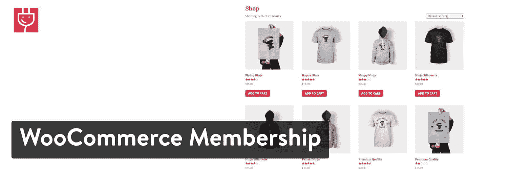

WooCommerce Membership WordPress plugin

#### 定价

该插件售价 39 美元，还提供了扩展客户支持的附加选项。

#### 使 WooCommerce 会员成为最佳选择的特性

*   它把一个看似正常的网上商店变成了一个可以收取会员费并向所有客户分配会员头衔的商店。
*   这个插件起到了内容屏蔽器的作用，你可以与付费会员分享某些内容。
*   它具有向公司或更大的人群出售会员资格的功能。
*   您可以发送自动电子邮件通知成员不同的行动。
*   将您目前在网站上销售的任何产品转换为会员商品。
*   授予您想要的任何人访问权限，并删除其他人的访问权限。
*   激活内容点播源，以确保成员定期收到信息。
*   创建无限数量的多种费用级别的会员资格。

#### 谁应该考虑这个 WooCommerce 插件？

会员网站有几种[类型。如果你想创造源源不断的收入，会员资格可能适合你。](https://kinsta.com/blog/website-ideas/)

我们推荐会员网站，包括播客、每月俱乐部、独家博客、T2 在线课程以及更多的产品。请务必阅读我们关于[通过 WooCommerce](https://kinsta.com/blog/woocommerce-subscriptions/) 销售套餐的指南。

### 20.WooCommerce 社交登录

为你的在线商店注册另一个帐户通常不是顾客想要做的。脸书和其他社交网络使得互联网用户可以很容易地利用其他网站的社交登录信息。

因此，这个 [WooCommerce 社交登录插件](https://codecanyon.net/item/woocommerce-social-login-wordpress-plugin/8495883)可以减少客户在你的网站上创建自己的账户所需的时间。此外，它还为您分析站点访问者提供了有价值的信息。

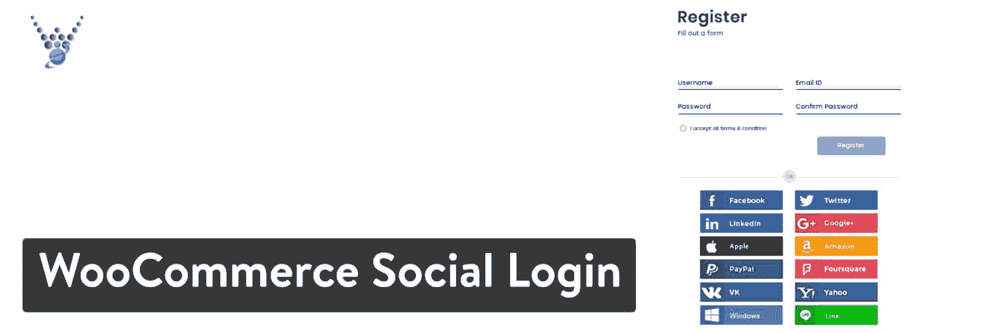

WooCommerce Social Login WordPress plugin

#### 定价

39 美元的 CodeCanyon，并提供升级客户支持的选项。

#### 是什么让它成为最好的 WooCommerce 插件之一？

*   该插件允许使用来自脸书、推特和 Instagram 等地的数据进行社交登录。
*   您可以将该插件与 BuddyPress 和 bbPress 等其他插件集成在一起。
*   使用您想要的社交按钮创建您自己的品牌登录表单。
*   在您的结帐模块中包含这些社交登录按钮。
*   支持数十种网络，包括苹果、亚马逊和贝宝。
*   你可以看到统计数据，显示有多少人使用哪个网络登录你的网站。
*   该插件提供了一个拖放生成器来制作你的表单。

#### 谁应该考虑这个 WooCommerce 插件？

如果你对增加在你的网站上创建账户的人数感兴趣，这个插件应该被考虑。任何类型的在线商店都可以从[快速社交登录区](https://kinsta.com/blog/wordpress-user-registration-plugins/#10-best-wordpress-user-registration-plugins)中获益。

### 21.面向 WooCommerce 的增强型电子商务谷歌分析插件

用于 WooCommerce 的增强电子商务 Google 分析插件插件是所有电子商务网站都应该连接到其商店的必备插件之一。你可能知道，[谷歌分析](https://kinsta.com/blog/google-analytics-wordpress/)是预测、[检查网站统计](https://kinsta.com/blog/how-to-use-google-analytics/)以及了解哪些产品做得最好的首选。因此，不管你卖的是什么，将你的在线商店与谷歌分析整合是有意义的。

谷歌分析和这个插件是完全免费的。它有助于发现哪些销售渠道表现最佳。你也可以找出你的网站的哪些领域最赚钱，哪些领域让你赔钱。总的来说，WooCommerce 的谷歌分析插件是根据数据而不是直觉做出决策的一个不可或缺的部分。

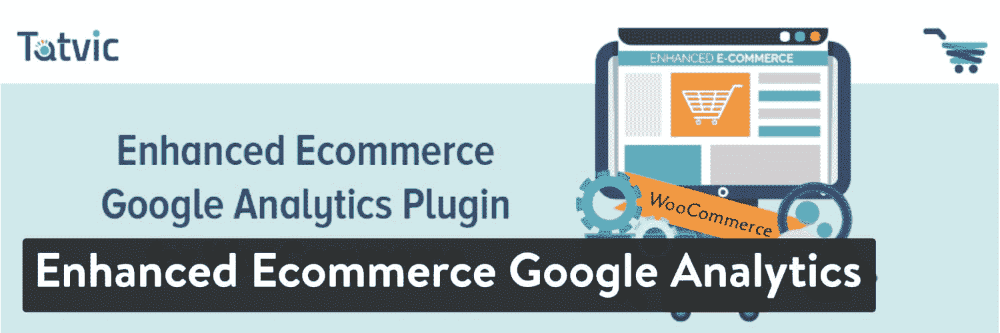

Enhanced Ecommerce Google Analytics Plugin for WooCommerce WordPress plugin

#### 定价

免费。

#### 增强的电子商务功能使 WooCommerce 的谷歌分析插件成为一个很好的选择

*   谷歌分析很容易理解，你需要的大部分功能都是免费的。
*   该插件将谷歌分析的强大功能带入你的 WooCommerce 仪表盘。因此，您不必一直登录不同的平台。
*   它可以让你看到哪些领域在漏钱，哪些领域在为你赚钱。
*   您可以比较您的网页的流量，并找出哪些产品表现最好。
*   看看你的客户实际上在找什么，他们什么时候决定购买或离开你的网站。
*   该插件可以让你跟踪用户会话，这样你就可以了解更多关于个人客户的信息。

#### 谁应该考虑这个 WooCommerce 插件？

毫无疑问，每个在线商店都应该有一个谷歌分析的集成。这是对你的店铺做出明智决定的最佳方式之一。

### 22.WooCommerce 的产品插件

WooCommerce 插件的[产品插件是一个通过在产品页面中加入额外功能来提供更独特礼物体验的工具。一些例子包括产品的不同颜色等基本元素，而其他元素包括礼品包装或包装中的额外物品。](https://wordpress.org/plugins/woo-custom-product-addons/)

您有机会定制您的销售中包含的所有附加内容，并且您可以设置是否希望使用复选框或其他格式样式来展示您的附加内容。您甚至可以选择完全定制您的产品包，允许客户自行定价。

Product Addons for WooCommerce WordPress plugin

#### 定价

有一个免费的核心插件。还有两种保费计划可供选择:

*   单个站点——29 美元。
*   五个站点——59 美元。

选择终身更新可以节省一点钱。上述计划提供一年的更新。

#### 使 WooCommerce 产品插件成为最佳选择的特性

*   该插件让您的客户在您的网站上定制他们的产品，而不是必须在文本框中输入详细信息或稍后通过电子邮件发送给您。
*   您有几个选项供人们选择附加组件，包括文本区域、下拉列表、复选框等等。
*   基于图像的选择可用。例如，你可以显示不同颜色衬衫的图像。
*   选择使用固定费用、基于数量或基于百分比来为您的附加组件定价。
*   客户可以设定自定义价格，例如，如果您想要请求捐赠或让您的客户设定促销价格。
*   提供了一些优秀的高级功能，如颜色组、图像选择和上传字段。

#### 谁应该考虑这个 WooCommerce 插件？

如果你的主题目前没有提供很多产品定制工具，产品插件扩展看起来是一个很好的选择。我们也喜欢那些销售数字产品或服务的人，他们可能会要求捐款，或者让人们决定他们愿意支付多少钱。我们过去也看到过这种促销活动。

### 23.WooCommerce ShipStation 网关

WooCommerce ShipStation Gateway 将你的 ship station 账户整合到 woo commerce 中，实现无缝运输过程。简而言之，ShipStation 接管您的运输基础设施，帮助处理订单进口、包装上的定制品牌，并实际发送物品。

ShipStation 的好处在于，无论你在什么平台上销售，你都可以享受运费折扣和优惠。因此，这是一个很好的平台，可以节省您的运输费用，并实现一些流程的自动化。

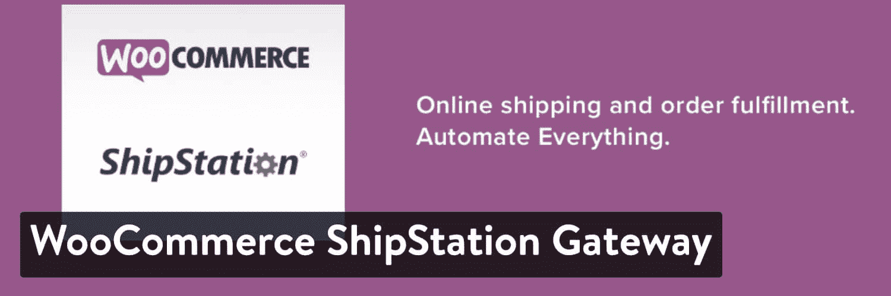

WooCommerce ShipStation Gateway WordPress plugin

#### 定价

免费。ShipStation 确实有自己的费用，但是 WooCommerce 插件是免费供你安装使用的。

#### 使 WooCommerce ShipStation Gateway 成为最佳选择的功能

*   这个插件在你的 ShipStation 账户之外是免费的。
*   它将最有效的运输服务之一整合到您的在线商店中。
*   你可以节省从 WooCommerce、易贝和亚马逊等地方导入订单的时间。
*   无论是 UPS、USPS 还是其他，您都可以在各种运输方式上省钱。
*   该插件提供各种类型的定制，从定制运输通知到装箱单。
*   ShipStation 还有几个链接回你的网站和社交媒体账户的功能。

#### 谁应该考虑这个 WooCommerce 插件？

使用 ShipStation 完全取决于你的企业规模以及它是否物有所值。总的来说，ShipStation 可以帮助任何规模的企业节省资金和时间。但是，我们建议您查看定价计划，看看它对您是否有意义。

例如，ShipStation 的初始计划是每月 9 美元，每月 50 次发货。凭借快速、实惠的运输和品牌包装材料，这对小商店来说似乎是一笔大买卖。

### 24.WooCommerce 集成中心

WooCommerce 的 HubSpot 插件是一个强大的免费工具，可用于[客户关系管理(CRM)](https://kinsta.com/blog/wordpress-crm/) 、电子邮件营销、列表分割、废弃购物车跟踪报告等等。

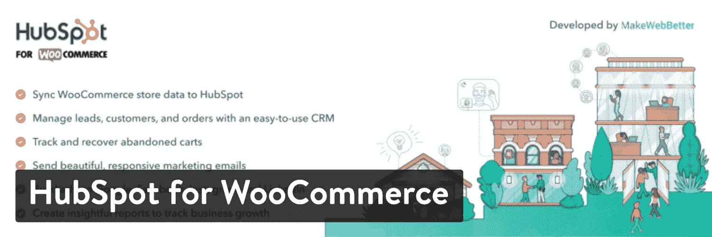

HubSpot for WooCommerce WordPress plugin

这个插件可以让你将你的 WooCommerce 商店与 HubSpot 整合，释放两个平台的能量。通过整合，你可以将访问者转化为潜在客户，通过[电子邮件营销](https://kinsta.com/blog/email-marketing-best-practices/)培育他们，最重要的是，跟踪他们的活动。

#### 定价

免费。

#### 使 HubSpot 的 WooCommerce 插件成为最佳选择的特性

*   将你的 WooCommerce 数据同步到 HubSpot。
*   在 HubSpot 的 CRM 中管理您的潜在客户、订户、客户和订单(对多达 100 万个联系人免费)。
*   跟踪和回收客户废弃的购物车。
*   使用拖放电子邮件功能或从免费提供的现成模板中选择一个，创建响应迅速且美观的培育电子邮件。
*   创建富有洞察力的报告来跟踪您的营销和销售业绩。

#### 谁应该考虑这个 WooCommerce 插件？

这个插件非常适合希望在电子商务营销和[集客方法](https://kinsta.com/blog/inbound-marketing/)之间架起桥梁的 WooCommerce 店主。您可以使用插件附带的免费 CRM 来跟踪潜在客户和客户。

店主可以设置[废弃购物车自动化](https://kinsta.com/blog/shopping-cart-abandonment/)来跟进并推动更多收入，而不是让顾客丢弃购物车中的商品。与此同时，WooCommerce 商店的店主将会喜欢发送营销电子邮件来吸引客户、访问强大的[分析](https://kinsta.com/blog/how-to-use-google-analytics/)来查看商店的表现以及在一个易于使用的平台上管理一切的能力。

## 哪个最好的 WooCommerce 插件适合你？

这个问题的答案是你应该看一看他们所有人。偶尔浏览一下插件库和我们的[精选插件列表](https://kinsta.com/best-wordpress-plugins),看看是否有方法可以加速或自动化你的过程。

所有这些 WooCommerce 插件在功能上完全不同。因此，最好先决定你想改善你的商店，找出问题和/或需求，然后选择正确的选项。

你比较喜欢的 WooCommperce 插件有哪些？请在评论中告诉我们！

* * *

让你所有的[应用程序](https://kinsta.com/application-hosting/)、[数据库](https://kinsta.com/database-hosting/)和 [WordPress 网站](https://kinsta.com/wordpress-hosting/)在线并在一个屋檐下。我们功能丰富的高性能云平台包括:

*   在 MyKinsta 仪表盘中轻松设置和管理
*   24/7 专家支持
*   最好的谷歌云平台硬件和网络，由 Kubernetes 提供最大的可扩展性
*   面向速度和安全性的企业级 Cloudflare 集成
*   全球受众覆盖全球多达 35 个数据中心和 275 多个 pop

在第一个月使用托管的[应用程序或托管](https://kinsta.com/application-hosting/)的[数据库，您可以享受 20 美元的优惠，亲自测试一下。探索我们的](https://kinsta.com/database-hosting/)[计划](https://kinsta.com/plans/)或[与销售人员交谈](https://kinsta.com/contact-us/)以找到最适合您的方式。**