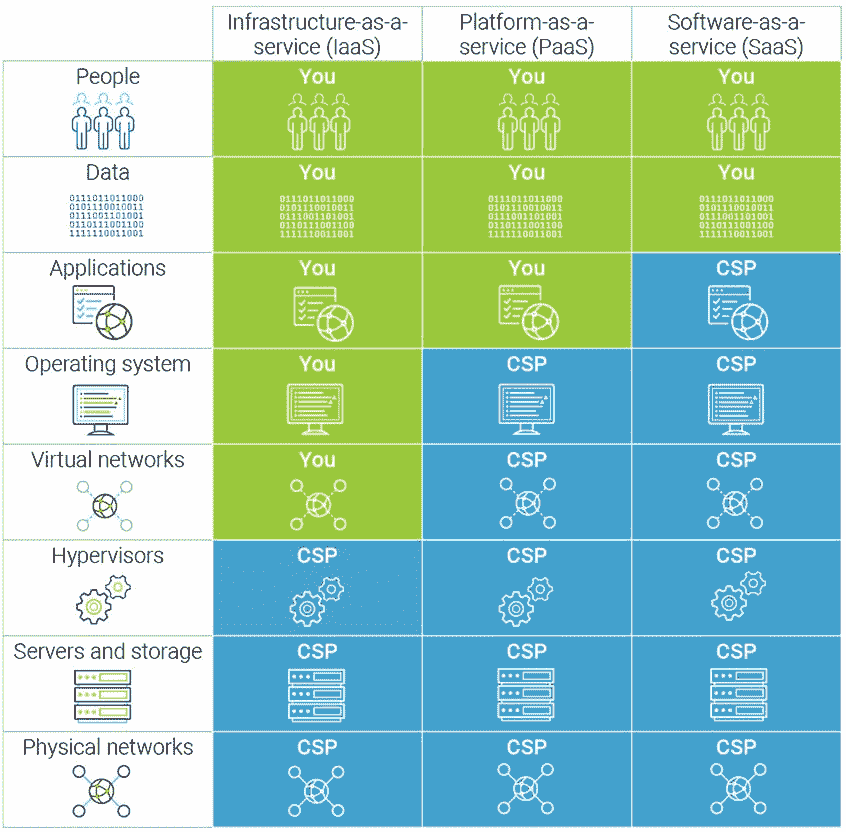
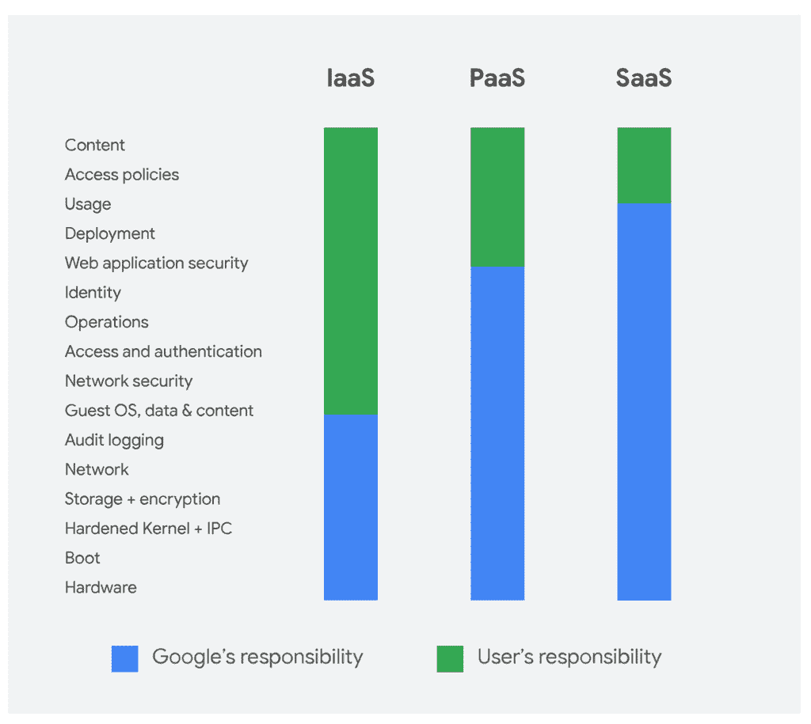
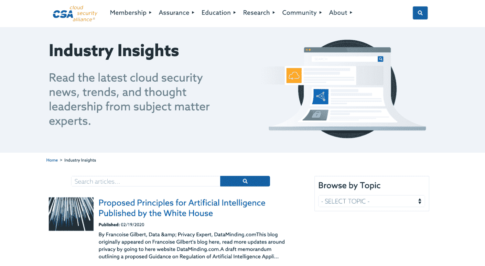
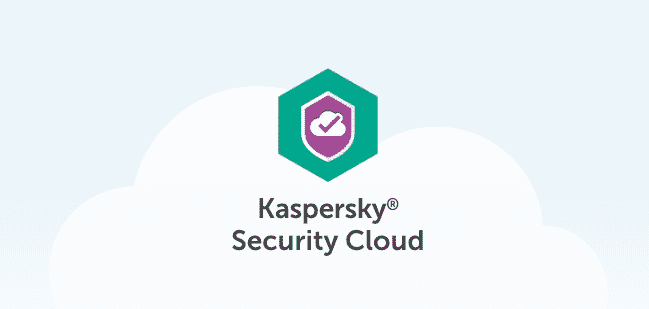
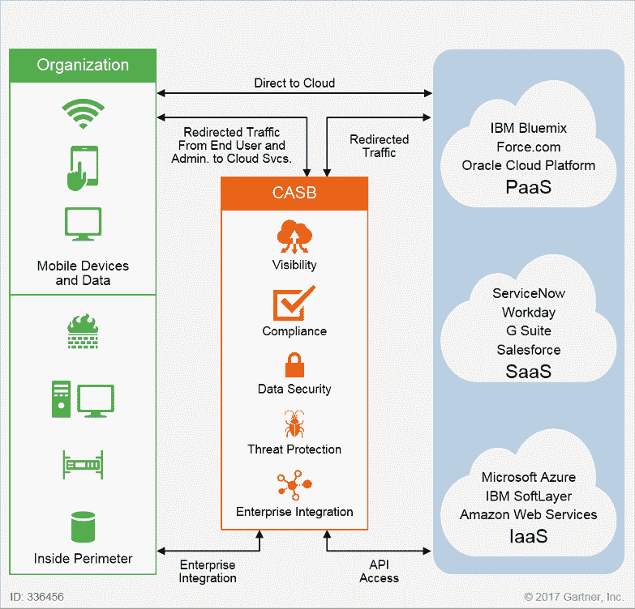
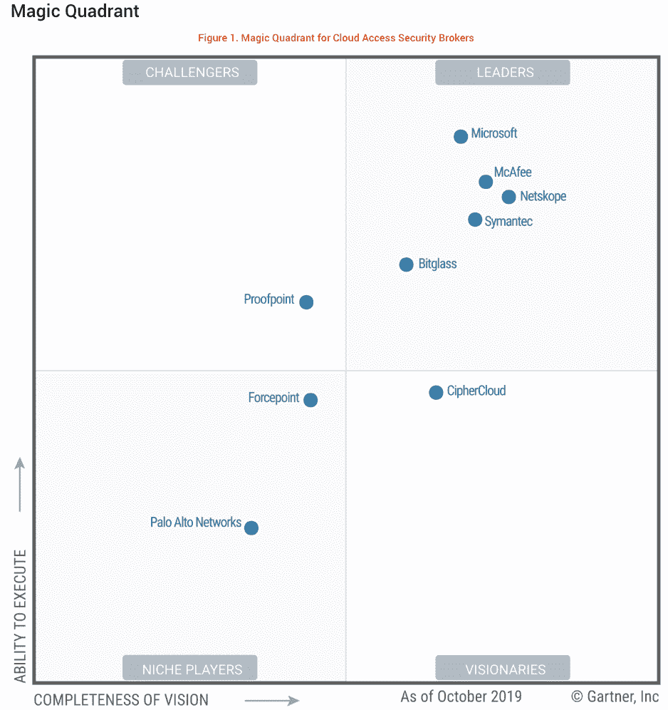

# 2022 年云安全综合指南(风险、最佳实践、认证)

> 原文：<https://kinsta.com/blog/cloud-security/>

云安全包括技术、控制、流程和策略，它们结合起来保护您基于云的系统、数据和基础架构。它是计算机安全的一个子领域，更广义地说，是信息安全。

这是您和您的云服务提供商的共同责任。您实施云安全战略来保护您的数据，遵守法规遵从性，并保护[您客户的隐私](https://kinsta.com/knowledgebase/woocommerce-ssl/)。进而保护您免受数据泄露和数据丢失带来的声誉、财务和法律后果。

Cloud Security Shared Responsibility Model (Image source: Synopsys)

云安全是所有组织的一项关键要求。特别是来自(ISC)2 的最新[研究报告称，93%的组织对云安全有中度或极度担忧，四分之一的组织确认在过去 12 个月中发生过云安全事件。](https://www.isc2.org/Resource-Center/Reports/Cloud-Security-Report)

在本文中，我们将创建一个全面的云安全指南。您将探索迁移到云的安全风险，了解为什么需要云安全，并发现云安全最佳实践。我们还将讨论如何评估云服务提供商的安全性，以及如何确定认证和培训来提高您的云安全性。

我们开始吧。

[Cloud security is a critical requirement for all organizations. Learn more about what is it, how it works, its risks, and best practices in this thorough guide! ☁️🔐Click to Tweet](https://twitter.com/intent/tweet?url=https%3A%2F%2Fkinsta.com%2Fblog%2Fcloud-security%2F&via=kinsta&text=Cloud+security+is+a+critical+requirement+for+all+organizations.+Learn+more+about+what+is+it%2C+how+it+works%2C+its+risks%2C+and+best+practices+in+this+thorough+guide%21+%E2%98%81%EF%B8%8F%F0%9F%94%90&hashtags=cloudcomputing%2Csecurity) ## 云安全是如何工作的？

云安全是技术、控制、流程和策略的复杂交互。根据您组织的独特要求高度个性化的实践。

> Kinsta 把我宠坏了，所以我现在要求每个供应商都提供这样的服务。我们还试图通过我们的 SaaS 工具支持达到这一水平。
> 
> <footer class="wp-block-kinsta-client-quote__footer">
> 
> 
> 
> <cite class="wp-block-kinsta-client-quote__cite">Suganthan Mohanadasan from @Suganthanmn</cite></footer>

[View plans](https://kinsta.com/plans/)

因此，没有单一的解释可以涵盖云安全如何“工作”。

A Model for Securing Cloud Workloads (Image source: HyTrust)

幸运的是，您可以使用一套广泛建立的策略和工具来实现强大的云安全设置，其中包括:

### 身份和访问管理

所有公司都应该有一个[身份和访问管理(IAM)系统](https://www.csoonline.com/article/2120384/what-is-iam-identity-and-access-management-explained.html)来控制对信息的访问。您的云提供商要么直接与您的 IAM 集成，要么提供他们自己的内置系统。IAM 结合了多因素身份验证和用户访问策略，帮助您控制谁有权访问您的应用程序和数据、他们可以访问什么以及他们可以对您的数据做什么。

### 人身安全

[物理安全](https://www.ibm.com/blogs/cloud-computing/2012/02/22/cloud-physical-security-considerations/)是云安全的另一个支柱。这是一系列措施的组合，旨在防止直接访问和中断您的云提供商数据中心内的硬件。物理安全包括通过安全门、不间断电源、闭路电视、警报、空气和颗粒过滤、防火等控制直接进入。

### 威胁情报、监控和预防

[威胁情报](https://www.forcepoint.com/cyber-edu/threat-intelligence)、[入侵检测系统(IDS)](https://www.barracuda.com/glossary/intrusion-detection-system) 、[入侵防御系统(IPS)](https://www.forcepoint.com/cyber-edu/intrusion-prevention-system-ips) 构成了云安全的主干。威胁情报和 IDS 工具提供了识别攻击者的功能[,这些攻击者目前正以您的系统为目标，或将成为未来的威胁。IPS 工具实现了缓解攻击的功能，并在攻击发生时向您发出警报，以便您也能做出响应。](https://kinsta.com/blog/what-is-a-ddos-attack/)

### 加密

使用云技术，您可以向云提供商的平台发送数据，也可以从云提供商的平台接收数据，通常将数据存储在云提供商的基础设施中。[加密](https://searchsecurity.techtarget.com/definition/encryption)是[云安全的另一层，通过对静止和传输中的数据进行编码来保护您的数据资产](https://kinsta.com/secure-wordpress-hosting/)。这确保了在没有只有你能访问的解密密钥的情况下，数据几乎不可能被解密。

### 云漏洞和渗透测试

维护和改善云安全的另一个实践是[漏洞和渗透测试](https://www.hitachi-systems-security.com/blog/penetration-testing-vs-vulnerability-assessment/)。这些实践包括您或您的提供商攻击您自己的云基础设施，以[识别任何潜在的弱点或漏洞](https://kinsta.com/knowledgebase/disclose-security-vulnerability/)。然后，您可以实施解决方案来修补这些漏洞并改善您的安全状况。

### 微分段

[微分段](https://www.networkworld.com/article/3247672/what-is-microsegmentation-how-getting-granular-improves-network-security.html)在实现云安全方面越来越常见。它是将您的云部署划分为不同的安全部分的实践，一直到单独的工作负载级别。

通过隔离单个工作负载，您可以应用灵活的安全策略来最大限度地减少攻击者在获得访问权限后可能造成的损害。

### 下一代防火墙

[下一代防火墙](https://digitalguardian.com/blog/what-next-generation-firewall-learn-about-differences-between-ngfw-and-traditional-firewalls)是云安全拼图的另一块。它们使用[传统防火墙](https://kinsta.com/blog/what-is-a-firewall/) l 功能和更新的高级特性来保护您的工作负载。传统的防火墙保护包括包过滤、状态检测、代理、IP 拦截、[域名拦截](https://kinsta.com/blog/how-to-block-a-website-on-chrome/)和端口拦截。

下一代防火墙增加了入侵防御系统、深度数据包检测、应用程序控制和加密流量分析，以提供全面的威胁检测和防御。

Kinsta hosting architecture

在 Kinsta，我们保护所有在谷歌云平台(GCP)防火墙(T1)后面的网站。提供最先进的保护，并能够与其他 GCP 安全解决方案更紧密地集成。

[Security is a concern for all businesses that, if neglected, can significantly impact the reputation and bottom line. Check out the 7 security risks of cloud computing ⛈⚙️Click to Tweet](https://twitter.com/intent/tweet?url=https%3A%2F%2Fkinsta.com%2Fblog%2Fcloud-security%2F&via=kinsta&text=Security+is+a+concern+for+all+businesses+that%2C+if+neglected%2C+can+significantly+impact+the+reputation+and+bottom+line.+Check+out+the+7+security+risks+of+cloud+computing+%E2%9B%88%E2%9A%99%EF%B8%8F&hashtags=security%2Cwebhost)

## 云计算的 7 大安全风险

无论您是否在云中运营，[安全性是所有企业都关心的问题](https://kinsta.com/blog/is-wordpress-secure/)。你将面临诸如[拒绝服务](https://kinsta.com/blog/ddos-attack/)、[恶意软件](https://kinsta.com/knowledgebase/security-guarantee/)、 [SQL 注入](https://kinsta.com/blog/sql-injection/)、数据泄露、数据丢失等风险。所有这些都会对你企业的声誉和利润产生重大影响。

当您迁移到云时，您会引入一系列新的风险，并改变其他风险的性质。**这并不意味着云计算不安全**。事实上，许多云提供商引入了高度复杂的安全工具和资源，否则您无法访问。

这仅仅意味着你需要意识到风险的变化，以便减轻它们。那么，让我们来看看云计算特有的安全风险。

### 1.能见度下降

大多数公司将通过多种设备、部门和[地理位置](https://kinsta.com/knowledgebase/best-data-center/)访问一系列云服务。在没有适当工具的情况下，云计算设置中的这种复杂性会导致您看不到对基础架构的访问。

如果没有正确的流程，您可能会看不到谁在使用您的云服务。包括他们正在访问、上传和下载什么数据。

看不到就保护不了。增加了数据泄露和数据丢失的风险。

### 2.合规违规

随着监管控制的增加，您可能需要[遵守一系列严格的合规性要求](https://kinsta.com/blog/wordpress-ccpa-compliance/)。当迁移到云时，如果不小心，就会引入违反[法规遵从性](https://kinsta.com/blog/wordpress-gdpr-compliance/)的风险。

这些法规中有许多要求您的公司知道您的数据在哪里，谁可以访问它，如何处理它，以及如何保护它。其他法规要求您的云提供商持有特定的合规证书。

不小心将数据转移到云中，或者转移到错误的提供商，都会使您的组织处于不合规状态。引入潜在的严重法律和财务影响。

### 3.缺乏云安全战略和架构

这是一个您可以轻松避免的云安全风险，但许多人没有。在匆忙将系统和数据迁移到云中的过程中，许多组织在保护其基础设施的安全系统和策略到位之前就开始运营了。

在 Kinsta，我们了解在向云迁移时安全第一的心态的重要性。这就是为什么 [Kinsta 提供免费的 WordPress 迁移](https://kinsta.com/knowledgebase/wordpress-migrations/)来确保你向云的过渡既安全又避免长时间的[停机](https://kinsta.com/blog/migrate-wordpress-site/)。

确保您实施了专为云设计的安全策略和基础架构，以便与您的系统和数据保持一致。

### 4.内部威胁

您信任的员工、承包商和业务合作伙伴可能是您最大的安全风险。这些内部威胁不一定是恶意的，也会对您的业务造成损害。事实上，大多数内部事件都源于缺乏培训或疏忽。

虽然您目前面临这个问题，但迁移到云改变了风险。您[将数据控制权交给了您的云服务提供商](https://kinsta.com/help/hosted-data-transfer/)，并引入了来自提供商员工的新一层内部威胁。

### 5.违反合同

你所拥有的任何契约性合作关系都将包括对共享数据的使用方式、存储方式以及谁有权访问这些数据的限制。您的员工在未经授权的情况下无意中将受限数据移动到云服务中，这可能会违反合同，从而导致法律诉讼。

请务必阅读您的云提供商的[条款和条件](https://kinsta.com/legal/terms-service/)。即使您有权将数据移动到云中，一些服务提供商也有权共享上传到其基础架构中的任何数据。由于无知，你可能会无意中违反保密协议。

### 6.不安全的应用程序用户界面(API)

当在云基础设施中操作系统时，您可能[使用 API 来实现控制](https://kinsta.com/blog/wordpress-rest-api/)。您的 web 或移动应用程序中内置的任何 API 都可以提供内部员工或外部消费者的访问。

面向外部的 API 会带来云安全风险。任何不安全的外部 API 都是一个网关，为试图窃取数据和操纵服务的网络罪犯提供了未经授权的访问。

不安全的外部 API 最突出的例子是脸书-剑桥分析公司丑闻。脸书不安全的外部 API 赋予剑桥分析公司深度访问脸书用户数据的权限。

### 7.云服务的错误配置

云服务的错误配置是另一个潜在的云安全风险。随着服务范围和复杂性的增加，这是一个日益严重的问题。云服务的错误配置会导致数据被公开暴露、操纵甚至删除。

常见原因包括为高度敏感的数据保留默认的安全和访问管理设置。其他包括给予未经授权的个人访问的不匹配的访问管理，以及机密数据在不需要授权的情况下公开的损坏的数据访问。
T3】

## 为什么需要云安全

[云技术的大规模采用](https://kinsta.com/blog/cloud-market-share/)与不断增长的网络威胁数量和复杂性相结合，推动了对云安全的需求。反思采用云技术的安全风险——如上所述——未能缓解这些风险可能会带来重大影响。

但这并不都是负面的，云安全也可以带来显著的好处。让我们探讨一下为什么云安全是一项关键要求。

### 网络安全威胁持续增加

安全云实践的驱动力是来自网络犯罪分子日益增长的威胁，无论是数量还是复杂性。为了量化威胁，来自(ISC)2 的[云安全报告](https://www.isc2.org/Resource-Center/Reports/Cloud-Security-Report)发现，2019 年，28%的企业经历了云安全事件。[英国政府也报告称](https://assets.publishing.service.gov.uk/government/uploads/system/uploads/attachment_data/file/813599/Cyber_Security_Breaches_Survey_2019_-_Main_Report.pdf) 32%的英国企业在过去的 12 个月中遭遇了系统攻击。

### 防止数据泄露和数据丢失

这些日益增加的网络威胁的后果是数据泄露和数据丢失的频率和数量的加速。仅在 2019 年的前 6 个月，来自诺顿的[新兴威胁报告概述了超过 40 亿条记录被攻破。](https://us.norton.com/internetsecurity-emerging-threats-2019-data-breaches.html)

数据泄露造成的损失或破坏可能会产生重大的法律、财务和声誉影响。IBM 现在在其最新报告中估计数据泄露的平均成本为 392 万美元。

### 避免合规违规

我们已经提到了云安全如何带来违反合规性的风险。为了证明不遵守的影响，你只需要观察一下德国联邦隐私监管机构，该机构最近向 1&1 Telecommunications 处以 955 万欧元的罚款，理由是违反了[欧盟通用数据保护条例(GDPR)](https://kinsta.com/blog/wordpress-gdpr-compliance/) 。

### 保持业务连续性

[良好的云安全](https://kinsta.com/blog/managed-wordpress-hosting-in-the-google-cloud/#a-leap-forward-in-hosting-environments)有助于保持您的业务连续性。抵御拒绝服务攻击等威胁( [DDoS 攻击](https://kinsta.com/blog/what-is-a-ddos-attack/))。计划外停机和系统[停机](https://kinsta.com/blog/migrate-wordpress-site/)会中断您的业务连续性并影响您的利润。Gartner research 的一项研究估计这一停机时间的平均成本为每分钟 5600 美元。

### 云安全优势

除了威胁保护和避免不良实践的后果之外，云安全提供的好处使其成为企业的一项要求。其中包括:

#### 1.集中式安全

与云计算集中化应用和数据的方式相同，**云安全集中化保护**。帮助您提高可见性、实施控制并更好地防范攻击。它还改进了您的业务连续性和灾难恢复，将所有这一切都集中在一个位置。

### 信息

Kinsta 为每个计划提供了一个安全保证，如果发生了不好的事情，安全专家会修复你的网站。

#### 2.降低的价格

一家声誉良好的云服务提供商将提供内置硬件和软件，致力于全天候保护您的应用程序和数据。这消除了在您自己的设置中进行大量财务投资的需要。

#### 3.简化管理

向云迁移引入了安全责任分担模式。这可以显著减少投入管理安全性的时间和资源。云服务提供商将负责保护他们的基础架构以及您的存储、计算、网络和物理基础架构。

#### 4.提高可靠性

领先的云服务提供商将提供您可以信赖的尖端云安全硬件和软件。您将获得持续的服务，用户可以从任何地方、任何设备安全地访问数据和应用程序。

## 云安全的最佳实践

当将您的系统迁移到云中时，许多安全[流程和最佳实践保持不变](https://kinsta.com/blog/wordpress-security/)。但是，为了维护基于云的系统和数据的安全性，您将会遇到一系列新的挑战。

为了帮助您应对这一挑战，我们为基于云的部署编制了一系列**安全最佳实践**。

[Cloud security is a sub-domain of computer security and, more broadly, information security. Check out these best practices for cloud-based deployments! ☁️🔐Click to Tweet](https://twitter.com/intent/tweet?url=https%3A%2F%2Fkinsta.com%2Fblog%2Fcloud-security%2F&via=kinsta&text=Cloud+security+is+a+sub-domain+of+computer+security+and%2C+more+broadly%2C+information+security.+Check+out+these+best+practices+for+cloud-based+deployments%21+%E2%98%81%EF%B8%8F%F0%9F%94%90&hashtags=security%2Cdata)

### 选择可信的提供商

云安全最佳实践的基础是选择值得信赖的服务提供商。您希望与提供最佳内置安全协议并符合最高级别行业最佳实践的云提供商合作。

服务提供商向您扩展合作伙伴和解决方案市场，以进一步增强您部署的安全性。

可信提供商的标志反映在他们所拥有的一系列安全合规性和认证中。任何好的供应商都会公开这些信息。例如，所有领先的提供商，如[亚马逊网络服务](https://aws.amazon.com/compliance/programs/)、[阿里云](https://www.alibabacloud.com/trust-center)、[谷歌云](https://cloud.google.com/security/compliance/)(为 Kinsta 提供支持)和 [Azure](https://azure.microsoft.com/en-gb/overview/trusted-cloud/compliance/) 都提供透明的访问，在那里你可以确认他们的安全合规性和认证。

除此之外，选择可信提供商还有许多因素。在本文的后面，我们将介绍评估任何云提供商安全性的 10 大清单。

### 了解你的共同责任模式

当[与云服务提供商](https://kinsta.com/blog/google-cloud-hosting/)合作，并将您的系统和数据转移到云中时，您就加入了一个共同负责安全实施的合作伙伴关系。

最佳实践的一个关键部分涉及审查和理解您的共同责任。发现哪些安全任务将由您承担，哪些任务现在将由提供商处理。

这是一个浮动范围，取决于您是选择软件即服务( [SaaS](https://kinsta.com/blog/cloud-market-share/#software-as-a-service-saas) )、平台即服务([平台即服务](https://kinsta.com/blog/what-is-paas/))、基础设施即服务( [IaaS](https://kinsta.com/blog/what-is-iaas/) )还是选择内部部署的数据中心。

Google Cloud Platform Shared Responsibility Model

领先的云服务提供商如 [AWS](https://aws.amazon.com/compliance/shared-responsibility-model/) 、 [Azure](https://gallery.technet.microsoft.com/Shared-Responsibilities-81d0ff91) 、[谷歌云平台](https://cloud.google.com/blog/products/containers-kubernetes/exploring-container-security-the-shared-responsibility-model-in-gke-container-security-shared-responsibility-model-gke)和[阿里云](https://files.alicdn.com/tpsservice/8943876c3b1dd53c97a323659e4f679f.pdf?spm=a2c63.o282931.879956.3.5bbf639dVoklbR&file=8943876c3b1dd53c97a323659e4f679f.pdf)发布了所谓的安全责任分担模型。确保透明度和清晰度。确保您审查了云服务提供商的共同责任模型。

### 审查您的云提供商合同和 SLA

您可能不认为审查您的云合同和 SLA 是安全最佳实践的一部分，但您应该这样做。SLA 和云服务合同只是在发生事故时对服务和追索权的保证。

条款和条件、附件和附录中包含了更多可能影响您安全的内容。一份合同可能意味着你的云服务提供商对你的数据负责还是拥有它。

根据 [McAfee 2019 云采用和风险报告](https://www.mcafee.com/enterprise/en-us/solutions/lp/cloud-adoption-risk.html)，62.7%的云提供商不指定客户数据归客户所有。这就造成了一个法律灰色地带，提供商可以声称对你上传的所有数据拥有所有权。

检查谁拥有这些数据，如果您终止服务，这些数据会发生什么情况。此外，要弄清楚提供商是否需要提供对任何安全事件和响应的可见性。

如果你对合同的某些部分不满意，试着去协商。如果有任何不可协商的，您需要确定同意对企业来说是否是可接受的风险。如果不能，您需要寻找替代方案，通过加密、监控甚至替代提供商来降低风险。

### 培训你的用户

您的用户是安全云计算的第一道防线。他们的安全实践知识和应用可能是保护您的系统或为网络攻击打开大门的关键。

作为一项最佳实践，请确保您对所有访问您系统的用户(员工和利益相关者)进行了安全云实践培训。让他们了解[如何识别恶意软件](https://kinsta.com/blog/types-of-malware/)，识别[网络钓鱼邮件](https://kinsta.com/blog/email-deliverability-manager/)，以及不安全行为的风险。

对于直接参与实施云安全的高级用户(如管理员)，可以考虑行业特定的培训和认证。您将在指南的后面找到一系列推荐的云安全认证和培训。

### 控制用户访问

通过策略实现对[用户访问](https://kinsta.com/help/mykinsta-user-roles/)的严格控制是另一种云安全最佳实践。帮助您管理试图访问您的云服务的用户。

您应该从零信任开始，只允许用户访问他们需要的系统和数据，仅此而已。为了避免实施策略时的复杂性，创建定义明确的组，并分配角色，以便只授予对所选资源的访问权限。然后您可以[将用户直接添加到组](https://kinsta.com/blog/manage-users-hosting-account/)中，而不是为每个用户定制访问权限。

### 保护您的用户终端

云安全最佳实践的另一个要素是保护您的用户终端。大多数用户将通过 web 浏览器访问您的云服务。因此，引入高级客户端安全性以保持用户的浏览器最新并防止被利用是至关重要的。

您还应该考虑实施终端安全解决方案来保护您的最终用户设备。随着[移动设备](https://kinsta.com/blog/web-design-best-practices/#mobile-responsiveness)和[远程工作](https://kinsta.com/blog/working-remotely/)的激增，用户越来越多地通过不属于公司的设备访问云服务，这一点至关重要。

寻找包含防火墙、防病毒和互联网安全工具、移动设备安全和入侵检测工具的解决方案。

### 保持云服务的可见性

云服务的使用可以是多种多样且转瞬即逝的。许多组织在一系列提供商和地理位置上使用多种云服务。研究表明云资源的平均寿命为 2 小时。

这种行为在您的云环境中产生了盲点。如果你看不到它，你就不能保护它。

确保您实施的云安全解决方案能够提供整个生态系统的可见性。然后，您可以通过单一门户监控和保护您所有不同资源、项目和区域的云使用情况。这种可见性将帮助您实施精细的安全策略，并降低各种风险。

### 实施加密

[数据加密是一项安全最佳实践](https://kinsta.com/knowledgebase/how-ssl-works/)无论在什么位置，一旦迁移到云环境，这一点都至关重要。使用云服务，您将数据存储在第三方平台上，并在您的网络和云服务之间来回发送，从而增加了数据的风险。

确保您对传输中的数据和静态数据实施最高级别的加密。您还应该考虑在将数据上传到云之前使用自己的加密解决方案，使用自己的加密密钥来保持完全控制。

云提供商可能会提供内置的加密服务来保护您的数据免受外部方的攻击，但它允许他们访问您的加密密钥。

Kinsta 采用了一种完全加密的方法来进一步保护其安全的托管解决方案。这意味着我们不支持 FTP 连接，只支持加密的 [SFTP](https://kinsta.com/knowledgebase/how-to-use-sftp/) 和 [SSH 连接](https://kinsta.com/blog/how-to-use-ssh/)(这里是 [FTP 和 SFTP](https://kinsta.com/knowledgebase/ftp-vs-sftp/) 的区别)。

### 实施强密码安全策略

不管您访问的是什么服务，强密码安全策略都是最佳实践。实施尽可能强的策略是防止未授权访问的一个重要因素。

作为最低要求，所有密码都应包含一个大写字母、一个小写字母、一个数字、一个符号和至少 14 个字符。强制用户每 90 天更新一次密码，并设置系统记住最后 24 个密码。

像这样的密码策略将阻止用户跨多个设备创建简单的密码，并防御大多数暴力攻击。

作为安全最佳实践和保护的附加层，您还应该实现[多因素身份验证](https://kinsta.com/feature-updates/two-factor-authentication-2fa-mykinsta/)。要求用户添加两个或更多的证据来验证他们的身份。

### 使用云访问安全代理(CASB)

CASB 的使用正迅速成为实施云安全最佳实践的核心工具。它是位于您和您的云服务提供商之间的软件，用于将您的安全控制扩展到云中。

CASB 为您提供了一套完善的云安全工具，帮助您了解云生态系统、实施数据安全策略、实施威胁识别和防护，以及维护合规性。

您可以在本指南的后面部分了解有关 CASB 工作方式的更多信息，包括排名前 5 位的 CASB 提供商的列表。

## 针对云客户的 10 大安全清单建议

当迁移到云并选择服务提供商时，您应该考虑的最重要的因素之一是安全性。您将与您选择的服务提供商共享和/或存储公司数据。

您需要确信您的数据是安全的。从分担责任到提供商的安全标准是否达标，有无数的安全因素需要考虑。这可能是一个令人生畏的过程，尤其是如果你不是安全专家。

[Security should never be neglected! Get this checklist of the top 10 security aspects when evaluating a cloud service provider 📌🔐Click to Tweet](https://twitter.com/intent/tweet?url=https%3A%2F%2Fkinsta.com%2Fblog%2Fcloud-security%2F&via=kinsta&text=Security+should+never+be+neglected%21+Get+this+checklist+of+the+top+10+security+aspects+when+evaluating+a+cloud+service+provider+%F0%9F%93%8C%F0%9F%94%90&hashtags=security%2Ccloud)

为了帮助评估云服务提供商，我们编制了 10 大安全清单。

### 1.保护传输中的数据和静态数据

当迁移到云服务时，安全性的一个关键要素是保护您(最终用户)和提供商之间传输的数据。这是你和供应商的双重责任。您需要网络保护来防止数据被截获，还需要加密来防止攻击者读取任何被截获的数据。

寻找一家能够为您提供一套工具的服务提供商，帮助您轻松加密传输中的数据和静态数据。这将确保对云服务提供商内部的任何内部数据传输，或者云服务提供商和其他可能暴露 API 的服务之间的传输提供相同级别的保护。

### 2.资产保护

选择云服务提供商时，您需要了解存储、处理和管理数据的物理位置。随着 GDPR 等政府和行业[法规的实施，这一点尤为重要。](https://kinsta.com/blog/wordpress-gdpr-compliance/)

为了确保您的资产受到保护，好的提供商将在其数据中心提供高级物理保护，以防止您的数据受到未经授权的访问。他们还将确保您的数据资产在任何资源被重新调配或处置之前被擦除，以防止其落入坏人之手。

### 3.可见性和控制

安全性的一个关键因素是查看和控制您自己的数据的能力。一个好的服务提供商将为您提供一个解决方案，让您全面了解您的数据以及谁在访问它，而不管它在哪里，您在哪里。

您的提供商应该提供[活动监控](https://kinsta.com/blog/wordpress-activity-log/)，以便您可以发现整个生态系统中配置和安全性的变化。以及支持符合新的和现有的解决方案的集成。

### 4.可信安全市场和合作伙伴网络

保护您的云部署将需要不止一个解决方案或合作伙伴。一个好的云服务提供商会让你很容易通过市场找到并联系不同的合作伙伴和解决方案。

寻找一家提供商，该提供商的市场提供由具有可靠安全记录的[可信合作伙伴组成的精选网络](https://kinsta.com/blog/ddos-attack/)。市场还应该提供安全解决方案，这些解决方案提供一键式部署，并且无论是在公共云、私有云还是混合云部署中运行，都可以补充保护您的数据。

### 5.安全用户管理

一个好的云服务提供商将会提供能够安全管理用户的工具。这将有助于防止对管理界面和程序的未经授权的访问，以确保应用程序、数据和资源不受损害。

云提供商还应提供实施安全协议的功能，以隔离用户并防止任何恶意(或受损)用户影响其他用户的服务和数据。

### 6.合规性和安全性集成

考虑云服务提供商时，安全性和合规性是密不可分的。它们应该满足由第三方组织验证的全球合规性要求。您希望云服务提供商遵循云安全的行业最佳实践，最好持有公认的认证。

云安全联盟的安全、信任和保证注册(STAR)计划是一个很好的指标。此外，如果你在一个高度监管的行业中运营 HIPPA、PCI-DSS 和 [GDPR](https://kinsta.com/blog/wordpress-gdpr-compliance/) 可能适用——你还需要确定一个具有行业特定认证的提供商。

为了确保您的合规工作既经济又高效，云服务提供商应该为您提供将他们的安全控制继承到您自己的合规和认证计划中的能力。

### 7.身份和认证

您的云提供商应该确保只有经过授权和认证的个人才能访问任何服务接口。

在考虑提供商时，您需要提供身份和认证功能的服务，包括用户名和密码、双因素认证、 [TLS 客户端证书](https://kinsta.com/blog/tls-1-3/)以及与现有身份提供商的身份联合。

## 注册订阅时事通讯

### 想知道我们是怎么让流量增长超过 1000%的吗？

加入 20，000 多名获得我们每周时事通讯和内部消息的人的行列吧！

[Subscribe Now](#newsletter)

您还希望能够限制对专用线路、企业或社区网络的访问。一个好的提供商只通过安全通道提供认证，如 HTTPS，以避免被拦截。

确保避免使用身份认证实践薄弱的服务。这将使您的系统暴露在未经授权的访问之下，从而导致数据失窃、服务变更或拒绝服务。还要避免通过电子邮件、HTTP 或电话进行身份验证。

这些极易受到社会工程以及身份和认证凭证拦截的攻击。

### 8.行动安全

选择云服务时，寻找实施强大操作安全性的提供商，以检测和防止攻击。这应涵盖四个核心要素:

#### 配置和变更管理

您希望提供者对组成服务的资产提供透明性，包括任何配置或依赖性。他们应该通知您任何可能影响安全性的服务更改，以确保不会出现漏洞。

#### 漏洞管理

您的提供商应该有一个漏洞管理流程来检测和减轻对其服务的任何新威胁。您应该随时了解这些威胁、它们的严重性以及计划的威胁缓解时间表，包括解决方案。

#### 保护性监控

任何称职的提供商都将拥有先进的监控工具来识别任何攻击、误用或服务故障。他们将采取快速果断的行动来处理任何事件，并随时告知您结果。

在 Kinsta，我们为能够为托管解决方案提供[最高运营安全标准而自豪。这包括实施最新的安全更新、持续正常运行时间监控、](https://kinsta.com/secure-wordpress-hosting/)[自动备份](https://kinsta.com/help/wordpress-backups/)，以及主动和被动措施来阻止任何攻击。

底线:你的网站是全天候被监控和保护的。

#### 事故管理

您理想的提供商将针对常见类型的攻击制定预先计划的事件管理[流程。他们将准备部署此流程来应对任何攻击。](https://kinsta.com/knowledgebase/malware-security/)

将会有一个清晰的联系路线给你来报告任何事件，有一个可接受的时间表和适当的格式。

### 9.人员安全措施

您需要一个云服务提供商，其人员值得您信任，因为他们可以访问您的系统和数据。您选择的云服务提供商将拥有严格透明的安全筛选流程。

他们应该能够核实其工作人员的身份、工作权利，并检查任何未兑现的刑事定罪。理想情况下，您希望他们符合您所在国家当地制定的筛选标准，例如英国的[BS 7858:2019](https://standardsdevelopment.bsigroup.com/projects/2018-02194)或美国的[I-9 表格填写](https://www.uscis.gov/i-9)。

除了筛选之外，您还希望服务提供商能够确保其员工了解其固有的安全责任并接受定期培训。他们还应该有一个政策，以尽量减少访问和影响您的服务的人数。

### 10.服务的安全使用

您可以选择具有尖端安全性的云提供商，但仍会因服务使用不当而遭遇安全漏洞。在使用服务时，理解安全责任在哪里是很重要的。

您的责任水平将受到您的云部署模式、您如何使用任何服务以及任何单个服务的内置功能的影响。

例如，您对 IaaS 负有重大的安全责任。部署计算实例时，安装现代操作系统、配置安全性以及确保持续修补和维护的责任将落到您的肩上。在该实例上部署的任何应用程序也是如此。

因此，请确保您了解所选服务的安全要求以及任何可用的安全配置选项。确保您还教育您的员工安全使用您选择的服务。

## 什么是云安全联盟？

当我们看到云计算产业时，它是一个完全不同的市场，没有一个中央管理机构，企业可以在那里寻求指导。这可能会令人沮丧，尤其是在应对云安全等挑战时。

令人欣慰的是，在管理机构的位置上，有许多组织致力于支持这个行业。云安全联盟就是这样一个组织。

Cloud Security Alliance Logo

[云安全联盟(CSA)](https://cloudsecurityalliance.org/) 是一家非营利组织，致力于开发和提高最佳实践意识，以维护安全的云计算环境。

它是一个会员制组织，以教育、研究、活动和产品的形式提供特定于行业云的安全指导。该指南直接利用行业从业者、[协会](https://kinsta.com/blog/wordpress-for-nonprofits/)、政府以及 CSA 个人和企业成员的综合专业知识。

为了让您更好地了解云安全联盟，让我们仔细看看他们是如何支持行业的。

### 成员资格

CSA 建立在其成员的基础上。根据您是个人、企业还是解决方案提供商，加入 CSA 成为会员将带来一系列不同的好处。

这些基本上属于类似的类别，包括访问其他成员的专家网络、国际标准化委员会的席位、培训折扣以及参加独家活动和网络研讨会

### 保证

CSA 开发了最著名的云安全认证计划之一:安全、信任和保证注册中心(STAR)。

STAR 是一个提供商保证计划，通过自我评估、第三方审计和对照标准的持续监控来提供透明度。该计划包括三个级别，证明持有者在验证其云产品安全性的同时坚持最佳实践。

### 教育

为了支持业界云安全的持续改进，CSA 提供了一系列教育服务。您可以参加由 CSA 开发的一系列云安全认证，访问他们的知识中心，并参加他们定期安排的教育网络研讨会和活动。

### 研究

CSA 继续通过其持续的研究来支持行业开发和创新云安全最佳实践。这是由他们的工作组推动的，这些工作组现在跨越了 30 个云安全领域。

最新和最前沿的包括 DevSecOps、物联网、人工智能和区块链工作组的出现。CSA 不断免费发布其研究，确保行业能够及时了解云安全不断变化的本质。

### 社区

CSA 还通过继续维护和发展云安全社区来支持该行业。他们创建并维护了广泛的社区，让整个云安全行业的思想能够相互联系、分享知识和创新。

The CSA blog

这些成长中的社区有多种形式。你可以加入 CSA 分会，与当地的专业人士和 CSA 峰会建立联系，在那里，最优秀的人才与大众分享他们的专业知识。甚至还有一个 CSA 博客,上面有一个希望跟上 CSA 实践步伐的追随者社区。

## 卡巴斯基安全云是什么？

当谈到云安全时，很容易关注企业，而忘记个人消费者的需求。

如果你访问[云服务](https://kinsta.com/blog/google-workspace/)用于个人用途——照片、[文件](https://kinsta.com/blog/saas-products/#8-dropbox)、生活管理——你需要考虑你的数据的安全性:[卡巴斯基安全云](https://www.kaspersky.co.uk/security-cloud)，卡巴斯基新的自适应云安全解决方案。

Kaspersky Security Cloud

它结合了卡巴斯基实验室反病毒软件的最佳功能和应用程序，为用户设备创建了应对数字威胁的响应保护。

该平台是为个人用户设计的，而不是为企业。

卡巴斯基安全云保护您的设备免受恶意软件和病毒的侵害，添加功能以适应您使用每台设备的方式，从而始终提供最大程度的保护。它提供的功能包括防病毒、反勒索软件、移动安全、[密码管理](https://kinsta.com/blog/saas-products/#password-management)、VPN、家长控制和一系列隐私工具。

该平台可在 Windows、macOS、Android 和 iOS 上使用。卡巴斯基安全云系列计划为多达 20 台设备提供保护。

### 卡巴斯基安全云中的核心功能

为了帮助您更好地了解卡巴斯基安全云产品，我们将平台内的核心功能分为四个部分进行了详细介绍:

与宕机和 WordPress 问题做斗争？Kinsta 是一款考虑到性能和安全性的托管解决方案！[查看我们的计划](https://kinsta.com/plans/?in-article-cta)

#### 扫描

卡巴斯基安全云可以扫描您的设备并删除发现的任何恶意软件或病毒，这是您希望从任何安全解决方案中获得的关键功能。您可以从许多扫描选项中进行选择，包括单个文件、快速扫描、整个系统和预设。

#### 隐私

您可以使用内置功能来检查您的在线帐户以确保其不被泄露，阻止您的网络摄像头被访问，以及阻止网站流量以防止您的浏览活动被监控，从而保护您的隐私。

您可以通过额外下载卡巴斯基安全连接和卡巴斯基密码管理器来扩展您的隐私。安全连接加密您发送和接收的所有数据，同时还隐藏您的位置，而密码管理器存储和保护您的密码。

#### 家庭网络

家庭网络让您可以看到连接到家庭网络的所有设备。识别那些受到卡巴斯基安全云保护的。该功能允许您在新设备连接时得到通知，并阻止任何未知设备。

#### 高清健康

有用，但简单，硬盘健康功能给你一个等级的硬盘驱动器的磁盘条件和磁盘温度。给出关于错误率、电源周期、通电时间、总数据读取和总数据写入的信息。

卡巴斯基安全云是云服务的采用如何创造了对新的安全解决方案的需求的一个很好的例子。

在下一节中，我们来看一个企业环境中类似的例子，云访问安全代理的出现。

## 什么是云访问安全代理(CASB)？

一个**云访问安全代理** (CASB)是位于你、云服务消费者和你的云服务提供商之间的软件。CASB 将您的安全控制从内部基础架构扩展到云中。帮助为您的云应用实施安全性、合规性和治理策略。它通常位于内部或托管在云中。

Cloud Access Security Broker Model (Image source: Gartner)

CASB 将帮助您抵御高级别的云安全风险，并支持对高风险事件的持续监控和缓解。它通过使用您组织的安全策略保护在您的内部环境和云环境之间移动的数据来实现这一点。

CASB 将通过恶意软件防御保护您免受网络攻击，并使用端到端加密保护您的数据，防止外部用户破译内容。

### CASB 是如何工作的？

一个 CASB 可以以三种不同的方式部署:作为一个[反向代理](https://kinsta.com/blog/reverse-proxy/)，正向代理，或者在一个“API 模式”下。每种部署都有其独特的优点和缺点，许多行业专家建议采用多模式部署。

让我们仔细看看 CASB 的不同部署模式:

#### 反向代理

一个反向代理位于云服务的前面，通过位于网络流量的路径中来提供内嵌的安全功能。反向代理 broker 的连接从 internet 运行到您的应用服务器，隐藏来自原始来源的信息。

#### 正向代理

前向代理位于用户面前，CASB 将流量代理到多个云平台。转发代理的连接从您开始，位于您的防火墙之后，连接到互联网。像反向代理一样，它也提供内嵌安全功能。

#### apic 模式

与代理部署不同，使用应用程序接口(API)允许 CASB 和云服务的直接集成。这允许您保护受管和未受管流量。

根据云服务提供商的 API 功能，您可以查看活动、内容并采取强制措施。

### CASBs 中的功能支柱

CASB 提供四大支柱下的功能，包括:

#### 1.能见度

当云应用程序位于 IT 部门的视野之外时，您创建的信息不受企业的治理、风险和法规遵从性流程的控制。

CASB 让您可以看到所有云应用程序及其使用情况。包括谁在使用平台、他们的部门、位置以及所使用的设备等重要信息。

#### 2.数据安全

使用云平台会增加无意中与错误的人共享数据的风险。如果您使用的是[云存储](https://kinsta.com/blog/what-is-cloud-storage/)，典型的数据丢失防护(DLP)工具将无法跟踪或控制谁在访问您的数据。

CASB 帮助您在结合了加密、令牌化、访问控制和信息权限管理的云平台内实施以数据为中心的安全性。

#### 3.威胁防护

最难防范的安全威胁之一是您自己的员工。即使是从您组织的核心系统中被禁用的前员工，也可能仍然能够访问包含业务关键信息的云应用。

CASBs 允许您检测和响应云基础架构中的恶意或疏忽的内部威胁、特权用户和受损帐户。

#### 4.服从

当您的数据转移到云中时，您需要确保维护数据的安全性和隐私，以遵守行业和政府法规。CASB 将为您完成这项工作，在您的云部署中识别和执行敏感数据的 DLP 策略。帮助您遵守包括 SOX 和 HIPAA 在内的法规。

CASB 还将帮助您根据核心监管要求(如 PCI DSS、NIST、CJIS、MAS 和 ISO 27001)对云安全配置进行基准测试。

### 2020 年排名前五的云接入安全代理

由于数据泄露和丢失的巨大风险，服务向云的大规模迁移以及实施云安全的需求已经在 CASB 市场上形成了爆炸式增长。

作为下一代技术，CASBs 已经成为云安全战略的重要元素。根据 [Gartner 的“云访问代理魔力象限”报告](https://www.gartner.com/doc/reprints?id=1-1XO56V9F&ct=191022&st=sb)，五分之一的大型企业使用 CASB 来保护或管理其云服务:

Gartner 2019 Cloud Access Security Broker (CASB) Magic Quadrant

Gartner 使用“魔力象限”确定了 CASB 市场的五个领导者，包括:

#### 迈克菲

McAfee 于 2018 年 1 月进入 CASB 市场，高调收购 Skyhigh Networks。该平台现名为 MVISION Cloud，覆盖了 CASB 的所有四大支柱，提供广泛的云服务。

该平台提供全面的 DLP 引擎，并提供高级控制，包括结构化和非结构化数据的加密和令牌化。CASB 可以部署为具有反向代理模式功能和正向代理的 API 检查。

McAfee 还为有需要的用户提供了内部虚拟应用程序。

#### 微软

微软的 CASB 产品叫做微软云应用安全。该平台支持多种部署模式，包括反向代理和 API 连接器。微软继续开发具有增强可见性、分析、数据控制和创新自动化功能的 CASB 解决方案。

微软云应用安全还与微软不断增长的安全和身份解决方案产品组合进行了本机集成，包括 Azure Active Directory 和微软 Defender 高级威胁保护。

这使得微软能够通过单击部署为客户提供跨微软平台的完全集成的解决方案。

#### Netskope

不像这个领域的许多玩家只是简单地收购 CASB 解决方案提供商，Netskope 仍然是一家独立的公司。该提供商因在应用程序发现和 SaaS 安全评估方面的卓越表现而闻名。

Netskope 通过已发布的 API 和未发布 API 的内联解码支持数千种云服务。CASB 提供 DLP，并使用综合威胁情报、静态和动态分析以及基于机器学习的异常检测来实时识别威胁。

#### 美国著名软件公司

赛门铁克的 CASB 产品名为 CloudSOC，在 2016 年通过收购和集成 Blue Coat Systems 的 Perspecsys 和橡皮筋产品得到了增强。

CloudSOC 使用自动化数据分类提供 DLP，并使用本机云 API、实时流量处理和来自多个数据源的输入提供多模式监管。借助高级用户行为分析(UBA)，您可以自动识别并消除来自组织内外的威胁。

#### 大类

Bitglass 云安全被称为下一代 CASB，旨在与任何应用程序、设备或网络集成。

该平台从云中本地运行，是唯一一家在不使用代理或配置文件的情况下保护移动设备上的公司数据的提供商。Bitglass 因推出专注于信任评级、信任级别和静态加密的零日方法而声名鹊起。

## 2022 年十大云安全认证一览

为了成功保护您的云平台，您需要先进的云安全技能和知识。您还需要学习特定于平台的技能，以便能够在您选择的云提供商内配置访问、网络安全并确保数据保护。

幸运的是，云培训和认证市场继续发展，并提供了许多解决方案。现在，您可以从广泛的**特定平台和厂商中立认证**中进行选择，以帮助您发展和证明您需要的技能。无论您是想发展基础知识，还是想根据特定的工作角色调整自己的技能，总有一种认证适合您。

为了帮助您进行搜索，我们编制了一份将于 2022 年获得的**十大云安全认证**的列表。

仅获得其中一项认证不仅可以帮助您更好地保护您的云部署，还可以让您更有竞争力，并提高您的工资。

### (ISC)2–认证云安全专家(CCSP)

CCSP 是全球公认的云安全认证，面向 IT 和信息安全领域的领导者。

获得 CCSP 表明您拥有先进的技术技能和知识来设计、管理和保护云中的数据、应用程序和基础架构。您将使用由(ISC)2 的网络安全专家开发的最佳实践、程序和政策来完成这项工作。如果您是企业架构师、系统工程师、安全管理员、架构师、工程师或经理，CCSP 是您的理想选择。

在培训和参加 CCSP 考试之前，你需要满足一些严格的经验要求。你需要五年全职 IT 工作经验，包括三年网络安全经验和一年 CCSP CBK 六个领域中的一个或多个领域的经验。你可以用你持有的同样先进的 [(ISC) CISSP 证书](https://www.isc2.org/Certifications/CISSP)——名为“世界顶级网络安全认证”——来代替经验要求。

### 云安全联盟–云安全知识证书(CCSK)

[CCSK 证书](https://cloudsecurityalliance.org/education/ccsk/)是云安全领域公认的入门级认证。它由云安全联盟开发，云安全联盟是一个成员组织，通过定义和提高对行业最佳实践的认识来帮助确保安全的云计算环境。

获得 CCSK 认证将证明您具备在云端保护数据所需的基础技能和知识。您将了解如何构建与从配置技术安全控制到云治理的一系列职责相对应的安全最佳实践基准。

通过成为 CCSK 认证，你也将满足一些先决条件的经验，如果你打算追求更先进的 CCSP 认证(ISC)。

### AWS 认证安全–专业

如果希望在 AWS 云平台上发展自己的职业生涯，AWS 认证安全专业证书是理想的选择。

通过获得 AWS 认证的安全性，您将验证您在数据分类、加密方法、安全互联网协议以及实现它们所需的 AWS 机制方面的技能。

为了获得认证，您可以从[多样的学习途径](https://aws.amazon.com/training/path-security/)中进行选择，以形成您在 AWS 上的安全基础知识、架构和安全工程方面的知识和技能。在本课程结束时，您将具备在 AWS 云中安全运行应用程序的控制能力和信心。

要开始努力获得证书，您应该担任安全角色，并拥有至少两年保护 AWS 工作负载的实践经验。

### 微软认证:Azure 安全工程师助理

最近，微软将其认证途径转变为基于角色的认证。通过获得他们的一项认证，您现在证明了您拥有履行特定工作职责所需的技能和知识。

因此，获得 Azure 安全工程师助理认证表明你有能力成为 Azure 云平台上的安全工程师。这包括在云环境中保护数据、应用程序和网络的能力。实施安全控制和威胁防护，以及管理身份和访问。

在尝试 AZ-500: Microsoft Azure 安全技术考试之前，没有任何先决技能要求。

### 谷歌云——专业的云安全工程师

获得谷歌的专业云安全工程师证书证明你可以在谷歌云平台上设计、开发、实施和管理安全基础设施。您将使用符合安全最佳实践和行业要求的 Google 安全技术来实现这一点。

通过追求专业的云安全工程师认证，你需要学习如何在谷歌云平台内配置访问、网络安全和确保数据保护。您还需要发展知识，以确保合规性和管理运营。

就像 Azure 和 AWS 认证一样，如果你想发展特定于 Google 云平台的云安全技能，这个证书是理想的。借助这一领先的云提供商推进您的职业发展。

### 阿里巴巴 ACA 云安全认证

这个 [ACA 云安全认证](https://edu.alibabacloud.com/certification/aca_cloudsecurity)是阿里巴巴认证途径中的第一个。获得该认证将证明您具备在阿里云部署中应用云安全原则的基础知识。

您将掌握 Linux 和网络操作的基本技能。同时了解阿里云平台中的主机、应用、网络和数据安全解决方案。您将涵盖阿里巴巴的几个关键安全产品，包括 Server Guard、WAF、Anit-DDoS basic 和 Pro。

获得助理级认证后，您可以继续获得阿里巴巴 ACP 云安全认证。

### 阿里巴巴 ACP 云安全认证

[ACP 云安全认证](https://edu.alibabacloud.com/certification/acp_security)是阿里云安全路径中的第二个认证。这是一个更高级的认证，面向使用阿里云安全产品的架构师、开发人员和操作系统专业人员。

基于在 ACA 云安全认证中获得的基础技能和知识，您将了解阿里云在安全、监控和管理方面的核心产品。

一旦你获得了专业级认证，你就可以继续获得阿里云安全认证。虽然专家级认证仍在开发中，预计将很快推出。

### 云认证委员会–专业云安全经理认证(PCS)

[CCC 专业云安全经理证书](https://www.cloudcredential.org/certifications/cloud/pcs/)是云证书委员会的高级认证。如果您是治理和风险专家、审计合规专家或云计算专家，它将是理想的选择。

通过认证，您将学习在云环境中应用最佳实践来实现安全性和治理的技能和知识。涵盖云服务管理、治理和战略等关键主题。您还将学习如何在安全的环境中设计、部署和迁移云服务。

由于认证的先进性，建议您已经持有由 EXIN 颁发的 [CCC 云技术助理](https://www.cloudcredential.org/certifications/cloud/cta/)和 [CCC 云虚拟化基础知识](https://www.exin.com/certifications/ccc-cloud-virtualization-essentials-exam)。

### Oracle 云平台身份和安全管理 2019 认证助理

[甲骨文云安全认证](https://education.oracle.com/oracle-cloud-platform-identity-and-security-management-2020-specialist/pexam_1Z0-1070-20)的标题不言自明，你将了解到甲骨文云平台上的身份和安全管理。如果您是一名安全专业人员，希望展示他们在实施云解决方案方面的专业知识，这是您的理想选择。

在准备认证时，您将了解 Oracle 云平台中的核心安全功能。构建实施 Oracle 身份云服务、Oracle CASB 云服务、服务架构和部署以及身份安全运营中心框架的知识和技能

通过 1Z0-1070 考试将证明您是甲骨文认证助理(OCA)，这是一个全球公认的证书。您将使用 Oracle 云安全产品组合验证您的能力，包括服务的配置。在开始之前，您需要以管理员的身份获得最新的云安全实施实践经验。

### SANS SEC524:云安全和风险基础知识

[SEC524:云安全和风险基础知识](https://www.sans.org/course/cloud-security-fundamentals)是一门课程，不是认证。不管怎样，我还是把它包括在内，因为它教授的重要技能和知识是所列出的其他认证没有涵盖的。

最重要的是，您将学习如何评估不同云提供商的安全性。涵盖[云计算交付模式——SaaS、PaaS 和 IaaS](https://kinsta.com/blog/types-of-cloud-computing/)—及其独特的安全要求。以及在公共、私有或混合云环境中运行时的其他安全考虑事项。

完成课程后，你将获得一系列关键能力。如何评估云合同、调整安全架构、工具和流程以在云环境中使用，以及对您的云设置执行漏洞评估。

[Cloud security is a complex interaction of technologies, processes, and policies. Get to know the top 10 security recommendations for cloud customers (and best practices) ☁️🚨Click to Tweet](https://twitter.com/intent/tweet?url=https%3A%2F%2Fkinsta.com%2Fblog%2Fcloud-security%2F&via=kinsta&text=Cloud+security+is+a+complex+interaction+of+technologies%2C+processes%2C+and+policies.+Get+to+know+the+top+10+security+recommendations+for+cloud+customers+%28and+best+practices%29+%E2%98%81%EF%B8%8F%F0%9F%9A%A8&hashtags=security%2Chosting)

## 摘要

转向云，您需要从第一天起就准备好实施全面的云安全战略。这从[确定合适的云服务提供商](https://kinsta.com/why-us/)开始，然后实施结合合适的工具、流程、政策和最佳实践的战略。

最基本的是，你要理解你的共同责任并关注合规性。

在云安全方面，您的员工(或您的云提供商的员工)是防御网络犯罪的最关键但往往被忽视的方面。

重要的是要记住，云计算的安全性不亚于在内部部署您的服务。事实上，许多云提供商提供[高级安全硬件和软件](https://kinsta.com/blog/google-cloud-hosting/#5-state-of-the-art-security)，否则你将无法获得。

选择正确的提供商将改善您的安全状况并降低您的风险，不管云计算会带来哪些风险。

* * *

让你所有的[应用程序](https://kinsta.com/application-hosting/)、[数据库](https://kinsta.com/database-hosting/)和 [WordPress 网站](https://kinsta.com/wordpress-hosting/)在线并在一个屋檐下。我们功能丰富的高性能云平台包括:

*   在 MyKinsta 仪表盘中轻松设置和管理
*   24/7 专家支持
*   最好的谷歌云平台硬件和网络，由 Kubernetes 提供最大的可扩展性
*   面向速度和安全性的企业级 Cloudflare 集成
*   全球受众覆盖全球多达 35 个数据中心和 275 多个 pop

在第一个月使用托管的[应用程序或托管](https://kinsta.com/application-hosting/)的[数据库，您可以享受 20 美元的优惠，亲自测试一下。探索我们的](https://kinsta.com/database-hosting/)[计划](https://kinsta.com/plans/)或[与销售人员交谈](https://kinsta.com/contact-us/)以找到最适合您的方式。